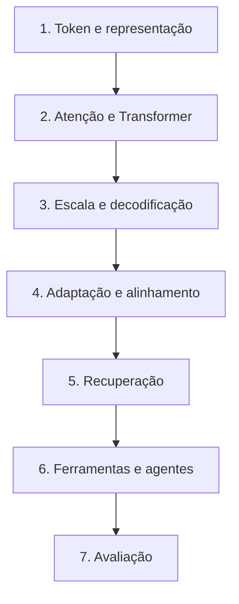
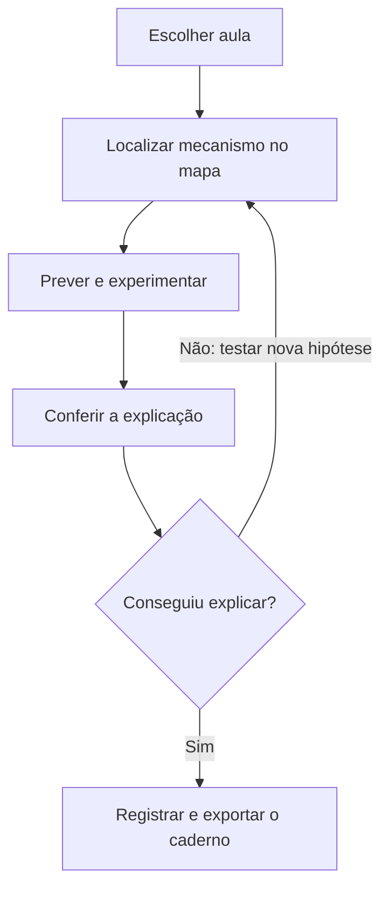
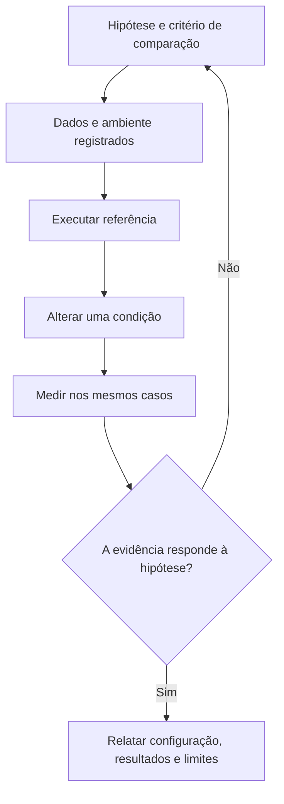
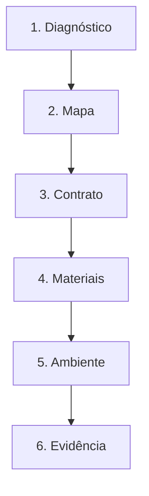

# Especificação de slides — Aula 0 (V2)

> **O que esta sessão é.** Recepção de 60 minutos, **extra-classe**, na semana zero — antes do início oficial das aulas. Ela não consome carga horária: as 60h continuam distribuídas nas 30 aulas de 2h. É onde o **contrato da disciplina** é apresentado por inteiro (avaliação, método, política de IA, labs, projeto) e onde o **ambiente é montado ao vivo**, porque ambiente que não sobe é o que mais atrasa o Lab 1.
>
> **Sem apêndice matemático**, e a razão está na Parte 2.

<!-- SLIDE-FLOW:GUIDE:BEGIN -->
## Fluxogramas na produção dos slides

As orientações abaixo complementam o campo **Visual** dos slides indicados. Produzir os fluxogramas no próprio deck, como formas e conectores editáveis ou gráficos vetoriais; a biblioteca completa ao final torna esta especificação independente do portal.

- **Referência de composição:** título e propósito no topo, blocos numerados, conexões rotuladas, ramificações legíveis e uma saída identificada. Usar apenas o padrão visual da referência fornecida, sem importar seu assunto ou seus exemplos.
- **Tema do deck:** manter o fundo escuro e a paleta já especificada para a aula. Usar `#5b8cff` para o trecho ativo, tons neutros para o contexto e `#e2231a` conforme o significado definido no deck. Cor sempre acompanhada de rótulo.
- **Leitura:** entrada no topo ou à esquerda; saída na base ou à direita. Decisões em losangos, alternativas com rótulos e retornos apontando à etapa correta. Ramos paralelos convergem apenas onde seus resultados realmente são combinados.
- **Densidade:** no fluxo principal, projetar 3–6 blocos curtos por enquadramento, com corpo legível na última fileira. Um mapa maior pode ser revelado por etapas no mesmo slide. Detalhes, condições e explicações completas ficam nas notas; não reduzir a fonte para caber tudo.
- **Semântica:** mapas de percurso mostram ordem de estudo, não execução de um algoritmo. Manter separadas preparação e aplicação, treino e inferência, sequência e alternativas. Não transformar uma etapa opcional em obrigatória.
- **Integração:** o fluxograma substitui uma lista redundante ou ocupa o campo Visual; não cobre matrizes, tabelas, gráficos nem código indispensáveis. Preservar títulos, numeração, duração e referências aos apêndices.
- **Produção:** os blocos Mermaid abaixo são especificações do desenho. Renderizar/reconstruir como diagrama, nunca projetar o código Mermaid. Manter rótulos, bifurcações, retornos e limites declarados. Não transformar este caderno técnico em slides adicionais.
- **Ligação com o portal:** os mapas de mecanismo compartilham o conteúdo dos fluxogramas do portal. Em demonstrações, usar o mesmo vocabulário no deck e no controle interativo para facilitar a passagem entre os dois.
<!-- SLIDE-FLOW:GUIDE:END -->

## Diretrizes visuais

- **Tema:** escuro, accent `#e2231a` (vermelho CESAR), accent secundário `#5b8cff`.
- **Tipografia:** sans-serif para texto; monoespaçada para caminhos de arquivo, comandos e a grade do curso.
- **Densidade:** este deck tem dois registros. Os slides 1 a 11 são **de projeção** — máximo 5 linhas, um conceito por slide. Os slides 12 a 14 são **de referência**, ficam longos períodos na tela e a turma consulta enquanto trabalha; densidade maior é permitida neles.
- **Proibido:** slide-parede de texto nos slides de projeção; clipart; qualquer promessa que o curso não cumpra (o slide 4 existe para o oposto disso).
- **Regra própria deste deck:** **nenhum slide desta sessão introduz conteúdo técnico.** Se um slide ensina algo sobre LLM, ele está no lugar errado — o conteúdo começa na Aula 1. Esta sessão é sobre o curso, não sobre o assunto do curso.

## Arco narrativo

A sessão responde, na ordem, as quatro perguntas que o aluno traz para uma primeira aula e que quase nunca são respondidas direito: *o que eu vou saber fazer no fim?*, *como eu vou ser avaliado?*, *que material eu tenho e como se usa?* e *o que eu preciso instalar?*. Abre pelo artefato final — o sistema que cada equipe vai defender na última aula — e volta dele para trás, mostrando as camadas que precisam existir para aquilo ser possível. Depois o contrato, sem eufemismo: os pesos, a distribuição da prova, o que a política de IA permite e o que ela veda. Em seguida os materiais, com a distinção que organiza o semestre inteiro: **fluxo e apêndice**. E fecha com trinta minutos de mão na massa — ambiente montado, repositório criado, primeira chamada de API funcionando — para que ninguém chegue à Aula 4 esperando um download.

---

# PARTE 1 — FLUXO DA SESSÃO

*14 slides, 60 minutos. Os slides 12 a 14 ficam projetados durante o trabalho prático.*

### Slide 1 — Abertura: o que vocês vão ter construído em dezembro
- **Tipo:** problema (abertura invertida)
- **Título:** Em dezembro, vocês defendem um sistema — não uma prova
- **Conteúdo:** A última aula do semestre, descrita primeiro:
  - Cada equipe tem **12 minutos** para apresentar um sistema com LLM que ela construiu, com **demo ao vivo** rodando num caso difícil
  - Ao lado da demo, uma **tabela com uma linha por camada** do sistema, cada uma com o número que a mede e o `n` daquela medição
  - E o instrutor faz uma pergunta: *"por que essa camada existe, e que número prova que ela funciona?"*
  - Quem não conseguir responder isso sobre alguma camada perde ponto — e a camada que costuma travar é aquela em que a equipe copiou código sem entender
- **Frase-tese:** Esta sessão é sobre como vocês chegam lá. O conteúdo começa na terça.
- **Visual:** full-bleed. À esquerda, a silhueta de uma apresentação em curso com um cronômetro em `12:00`. À direita, uma tabela de quatro linhas com valores propositalmente ilegíveis, e uma coluna `n` destacada em accent. Embaixo, a data real: `01/12`.
- **Notas do apresentador:** Abrir pelo fim é deliberado — a maioria das primeiras aulas abre pela ementa e a turma não retém nada. O objetivo destes 4 minutos é que a sala saia com uma imagem concreta do que se espera dela. Não prometer nota fácil; a pergunta da defesa é real e vale ponto.

### Slide 2 — Quem está nesta sala
- **Tipo:** diagnóstico
- **Título:** Quatro perguntas, mão levantada
- **Conteúdo:** As quatro perguntas, feitas na ordem, com a razão de cada uma ser útil ao instrutor:
  ```
  1. quem já cursou Aprendizagem de Máquina ou Aprendizagem Profunda?
  2. quem já chamou um LLM por API, em código?
  3. quem já treinou ou ajustou um modelo, de qualquer tamanho?
  4. quem já colocou algo em produção, com usuário de verdade do outro lado?
  ```
  O que o instrutor faz com isso: se a maioria não fez ML, os conceitos de perda e gradiente ganham dois minutos extras na Aula 12; se muitos já chamaram API, o Lab 3 sobe o nível; se ninguém pôs nada em produção, os slides de custo e latência ganham peso.
- **Frase-tese:** O curso não pressupõe Aprendizagem de Máquina. Onde ela for necessária, eu explico em duas frases no ponto em que aparece.
- **Visual:** as quatro perguntas em corpo grande, uma por linha, com espaço à direita para o instrutor anotar a contagem ao vivo.
- **Notas do apresentador:** **Anotar os quatro números** — eles calibram decisões reais ao longo do semestre e valem mais que qualquer suposição sobre a turma. A pergunta 4 é a que mais surpreende: em turma de oitavo período costuma haver dois ou três, e são os que puxam as discussões de custo.

### Slide 3 — O mapa: sete camadas, e onde cada uma é construída

<!-- SLIDE-FLOW:SLIDE:BEGIN -->
- **Fluxograma a incorporar neste slide:** **F00 — As sete camadas do curso**. O desenho e os rótulos completos estão no caderno de fluxogramas ao final deste arquivo.
- **Composição:** integrar ao campo Visual; preservar exemplos, tabelas, fórmulas e dimensões solicitados neste slide. Destacar o trecho relacionado ao título e manter o restante em segundo plano. Os textos detalhados ficam nas notas, sem duplicar a lista de Conteúdo na tela.
<!-- SLIDE-FLOW:SLIDE:END -->

- **Tipo:** diagrama
- **Título:** Do token ao agente, com endereço
- **Conteúdo:** A pilha do curso, de baixo para cima, cada camada com a aula e o laboratório em que é construída:
  ```
  token e representação      Aulas 2–3    · Lab 1 (Aula 4)
  atenção e o Transformer    Aulas 5–8    · Lab 2 (Aula 9)
  escala e decodificação     Aulas 10–12  · Lab 3 (Aula 11)
  adaptação e alinhamento    Aulas 13–16  · Lab 4 (Aula 14)
  recuperação (RAG)          Aulas 18–19  · Lab 5 (Aula 20)
  ferramentas e agentes      Aulas 21–26  · Labs 6 e 7
  avaliação                  Aula 27      · Lab 8 (Aula 28)
  ```
  E a propriedade que importa: **é pilha, não lista.** Cada camada só faz sentido porque a de baixo existe, e o Lab 8 mede exatamente as camadas que os Labs 1 a 7 construíram.
- **Frase-tese:** Não é uma lista de tópicos da moda. É uma pilha, e vocês constroem de baixo para cima.
- **Visual:** sete blocos empilhados, do rodapé ao topo, cada um com a etiqueta `Aula NN · Lab N` em accent secundário. Uma seta fina à direita subindo do rodapé ao topo, rotulada "15 semanas".
- **Notas do apresentador:** Subir a pilha com o dedo enquanto fala. A frase "é pilha, não lista" é a que quero que fique — ela justifica por que faltar duas semanas em fevereiro custa caro em abril.

### Slide 4 — O que este curso não faz
- **Tipo:** conceito
- **Título:** Honestidade de escopo, no primeiro dia
- **Conteúdo:** O que a disciplina deliberadamente **não** cobre, e onde isso é retomado:
  - **Pré-treino de verdade em escala** — o Lab 2 é um mini-GPT em corpus de brinquedo; a conta de um treino de fronteira é vista na Aula 12, mas ninguém treina um
  - **RLHF completo** com modelo de recompensa treinado — as Aulas 15 e 16 param na formulação e no DPO
  - **Serving em produção** com batching contínuo e autoescala
  - **Multimodalidade praticada** — é fronteira na Aula 29, não conteúdo com as mãos
  - **Segurança adversarial ofensiva** além do que a Aula 26 introduz
  E a relação com a outra eletiva: quem cursou ou vai cursar **Eletiva 1 (IA, Aprendizagem Profunda e IA Generativa)** encontra ali CNNs, GANs e visão, que aqui não aparecem. As duas não se sobrepõem, e podem ser cursadas em qualquer ordem.
- **Frase-tese:** Confundir "vimos em aula" com "sei fazer em produção" é a distância exata desta lista.
- **Visual:** lista com traço à esquerda de cada item e, ao lado, onde o assunto é retomado. À direita, um cartão discreto comparando o escopo desta eletiva com o da Eletiva 1.
- **Notas do apresentador:** Este slide compra credibilidade e evita a decepção da semana 10. Não amenizar. Se alguém perguntar se vale cursar as duas eletivas: sim, e em qualquer ordem — os tópicos não se repetem.

### Slide 5 — Como vocês são avaliados
- **Tipo:** dados (contrato)
- **Título:** Dois módulos, média simples, e nenhuma surpresa
- **Conteúdo:** A composição institucional, com o que cada parte cobra:
  ```
  Média Final = (AV1 + AV2) / 2

  AV1  (Aulas 1–17)     40%  Labs 1 a 4 + participação
                        60%  Prova individual escrita, sem consulta e sem IA

  AV2  (Aulas 18–30)    40%  Labs 5 a 8 + as duas entregas parciais do projeto
                        60%  Projeto final: sistema, relatório e defesa oral
  ```
  Marcos do projeto, com data: **proposta 27/10** · **checkpoint 10/11** · **entrega final e apresentação 01/12**.
  E duas regras institucionais que valem desde hoje: trabalho fora do prazo tem **nota inicial 8,0**; e **falta acima de 25%** da carga reprova, independentemente das notas.
- **Frase-tese:** O projeto vale mais que a prova, e ele começa na semana nove — não na última.
- **Visual:** duas colunas (AV1, AV2), cada uma dividida em 40/60 com barra proporcional. Abaixo, uma linha do tempo com os três marcos do projeto e as datas reais em accent.
- **Notas do apresentador:** Dizer as datas em voz alta e pedir para anotarem. A regra dos 25% de falta é institucional e não negociável — dizer isso no primeiro dia evita a conversa difícil de novembro.

### Slide 6 — A prova, em números
- **Tipo:** dados (contrato de método)
- **Título:** 82 dos 100 pontos são de diagnóstico e justificativa
- **Conteúdo:** A composição da prova da Aula 17, com o que cada linha pede:
  ```
  42  diagnóstico e interpretação  um sintoma, uma tabela de resultados —
                                   identificar a causa, ou dizer o que os
                                   dados NÃO permitem concluir
  40  justificativa de escolha     um cenário com restrição real de memória,
                                   orçamento ou latência — defender uma
                                   decisão técnica com argumento
   8  conceito aplicado            aplicar uma definição a um caso
  10  derivação                    desenvolver um resultado matemático
  ```
  E a consequência que muda como se estuda: **decorar derivações rende 10 pontos.** Entender o que cada derivação autoriza a afirmar rende os outros 40 — porque uma defesa de escolha que não invoca o fundamento correto não é uma justificativa suficiente.
  As questões de diagnóstico e justificativa **aceitam hipóteses alternativas bem fundamentadas**, e o gabarito declara onde isso vale.
- **Frase-tese:** Quem estudar só as derivações não passa. Quem ignorar o fundamento também não.
- **Visual:** quatro barras horizontais proporcionais aos pontos, com as duas primeiras (42 e 40) em accent e as duas últimas em cinza. Sob elas, a soma `82` destacada.
- **Notas do apresentador:** Este é o slide mais importante do contrato e o que a turma menos espera ouvir no primeiro dia. Deixar na tela **um minuto inteiro**, em silêncio depois de falar. É a informação que, dada tarde, produz a reclamação legítima de que as regras mudaram no meio do semestre.

### Slide 7 — Os materiais, e a divisão que organiza o semestre

<!-- SLIDE-FLOW:SLIDE:BEGIN -->
- **Fluxograma a incorporar neste slide:** **F01 — Uma sessão de estudo no portal**. O desenho e os rótulos completos estão no caderno de fluxogramas ao final deste arquivo.
- **Composição:** integrar ao campo Visual; preservar exemplos, tabelas, fórmulas e dimensões solicitados neste slide. Destacar o trecho relacionado ao título e manter o restante em segundo plano. Os textos detalhados ficam nas notas, sem duplicar a lista de Conteúdo na tela.
<!-- SLIDE-FLOW:SLIDE:END -->

- **Tipo:** conceito (o mais consequente da sessão)
- **Título:** Fluxo e apêndice: onde está o quê, e por quê
- **Conteúdo:** Cada aula entrega um material com **duas partes**, e entender a divisão muda como se estuda:
  - **Parte 1 — o fluxo.** Abre por um problema real e por um comportamento que se observa: o modelo que treina bem e gera texto sem sentido, o texto que custa 33% mais em português, o modelo maior que fica pior. Quando o fundamento matemático é necessário, ele aparece **enunciado, lido e justificado** — com a fórmula na tela e um ponteiro para onde ela é derivada.
  - **Parte 2 — o apêndice.** A derivação completa, com numeração própria (`A.1`, `A.2`, …): notação declarada, premissas explícitas, nenhuma etapa pulada, casos-limite. **Não é projetado em aula** — é distribuído com o deck e existe para ser estudado e consultado.
  E o número que dá a medida: os 30 decks do curso somam **111 itens de apêndice**.
- **Frase-tese:** A matemática não foi tirada do curso. Ela foi escrita num lugar onde caberia escrevê-la inteira — o que um quadro não permite.
- **Visual:** um deck desenhado em corte, com a Parte 1 em cima (slides largos, poucos elementos) e a Parte 2 embaixo (páginas densas). Entre as duas, uma seta reproduzindo o formato do apontamento que aparece nos decks — `→ derivação completa: Apêndice A.n (slide NN)` — com `A.n` e `NN` genéricos, porque aqui é o **formato** que se mostra, não um apontamento real.
- **Notas do apresentador:** Mostrar um deck de verdade aberto — o da Aula 6 é o melhor exemplo, com 14 slides de fluxo e 6 itens de apêndice. Abrir o A.2 e projetar por 20 s: a turma precisa ver que é uma página de derivação escrita, não um anexo simbólico. A pergunta que vem é "então a prova cobra o apêndice?" — e a resposta é o slide 6: cobra, sobretudo dentro dos 40 pontos.

### Slide 8 — Os outros materiais

<!-- SLIDE-FLOW:SLIDE:BEGIN -->
- **Fluxograma a incorporar neste slide:** **F01 — Uma sessão de estudo no portal**. O desenho e os rótulos completos estão no caderno de fluxogramas ao final deste arquivo.
- **Composição:** integrar ao campo Visual; preservar exemplos, tabelas, fórmulas e dimensões solicitados neste slide. Destacar o trecho relacionado ao título e manter o restante em segundo plano. Os textos detalhados ficam nas notas, sem duplicar a lista de Conteúdo na tela.
<!-- SLIDE-FLOW:SLIDE:END -->

- **Tipo:** referência
- **Título:** Apostila, notebooks, papers e os formulários
- **Conteúdo:** Quatro coisas, com o que fazer com cada uma:
  - **Apostila, ~300 páginas.** A versão escrita e mais lenta do curso, com exemplos resolvidos e exercícios com gabarito comentado. Cada capítulo abre pela aplicação e reúne o desenvolvimento formal numa seção ao final. *Antes da aula:* ler os objetivos e as caixas de conceito, 20 min. *Antes da prova:* os objetivos, as caixas de erro comum e os exercícios refeitos sem o gabarito ao lado.
  - **Notebooks dos 8 labs**, com solução de referência liberada depois do prazo de cada checkpoint.
  - **Os papers**, um por aula, com **pergunta dirigida** — a pergunta é o que transforma a leitura em trabalho de 40 minutos em vez de 4 horas.
  - **Formulários quinzenais**, anônimos e não pontuados, seis no semestre. Não valem nota nem para mais nem para menos; servem para ajustar o curso enquanto ele acontece. Na aula seguinte a cada um, o instrutor diz o que vai mudar — e o que **não** vai mudar, e por quê.
- **Frase-tese:** O formulário só funciona se vocês responderem com franqueza e eu mostrar o que mudou por causa dele. As duas partes são obrigatórias.
- **Visual:** quatro cartões, cada um com o artefato e a instrução de uso em uma linha. O cartão da apostila com a espessura desenhada, para dar a escala das 300 páginas.
- **Notas do apresentador:** Sobre os formulários, dizer a frase que sustenta a taxa de resposta: *"'não abri o apêndice' é uma resposta legítima e é a que eu mais preciso saber"*. Sem isso o item mede desejabilidade social.

### Slide 9 — Política de uso de IA
- **Tipo:** conceito (contrato)
- **Título:** Permitido e incentivado — com uma condição
- **Conteúdo:** A política institucional, dita sem eufemismo:
  - **Permitido e incentivado** nos labs e no projeto. É o objeto da disciplina; seria estranho proibir.
  - **A condição:** cada entrega inclui uma **declaração de uso** — qual ferramenta, o que foi pedido, o que você entendeu da resposta, sua avaliação crítica do resultado e as limitações que você viu.
  - **A responsabilidade é sua** por todo artefato que você incorpora, independentemente da origem. Qualquer entrega pode virar **defesa oral**, e o domínio demonstrado integra a nota.
  - **Vedado:** usar IA na prova; fabricar dados ou resultados; treinar com dados institucionais sem aprovação.
  - **A prova é individual e sem IA.**
  E o diário de IA da disciplina: as respostas do bloco C dos formulários alimentam um registro coletivo e anônimo de usos, acertos e falhas ao longo do semestre.
- **Frase-tese:** A régua é uma só: você tem de conseguir defender o que entrega. Como você chegou lá é problema seu; entender o que entregou é obrigação sua.
- **Visual:** duas colunas, "permitido" e "vedado", com a coluna do permitido visivelmente maior. Abaixo, a declaração de uso como um formulário de cinco campos.
- **Notas do apresentador:** A pergunta que sempre vem é "posso usar Copilot no lab?". Sim — e a declaração de uso é o que separa apoio de substituição. A segunda pergunta é sobre o que acontece se alguém não souber defender: é resposta parcial na ficha, e aciona defesa oral individual.

### Slide 10 — [Transição] Agora o ambiente

<!-- SLIDE-FLOW:SLIDE:BEGIN -->
- **Fluxograma a incorporar neste slide:** **F02 — Laboratório: da hipótese à evidência**. O desenho e os rótulos completos estão no caderno de fluxogramas ao final deste arquivo.
- **Composição:** integrar ao campo Visual; preservar exemplos, tabelas, fórmulas e dimensões solicitados neste slide. Destacar o trecho relacionado ao título e manter o restante em segundo plano. Os textos detalhados ficam nas notas, sem duplicar a lista de Conteúdo na tela.
<!-- SLIDE-FLOW:SLIDE:END -->

- **Tipo:** transição
- **Título:** 30 minutos, e ninguém sai daqui sem o ambiente rodando
- **Conteúdo:** As quatro coisas que vão subir agora, na ordem, e por que agora e não na Aula 4:
  ```
  1. Google Colab, com GPU habilitada        → Labs 2 e 4 não rodam sem
  2. conta Hugging Face + token de leitura   → Labs 1, 4 e 5
  3. chave de API de um provedor free tier   → Labs 3, 6 e 7
  4. repositório da disciplina, criado       → onde tudo é entregue
  ```
  A razão de fazer isso hoje: **download e permissão são o que mais atrasa laboratório.** Quem chega ao Lab 1 sem ambiente perde os primeiros 15 minutos, e quem chega ao Lab 2 sem GPU habilitada perde a aula.
- **Frase-tese:** Trinta minutos hoje valem quatro laboratórios.
- **Visual:** os quatro itens como checklist grande, com espaço para marcar. Ao lado de cada um, os labs que dependem dele.
- **Notas do apresentador:** Passos na Parte 3. A partir daqui a sessão é prática e o deck vira referência — os slides 12 a 14 ficam projetados. Circular olhando tela, não esperar pergunta.

### Slide 11 — Como estudar nesta disciplina

<!-- SLIDE-FLOW:SLIDE:BEGIN -->
- **Fluxograma a incorporar neste slide:** **F01 — Uma sessão de estudo no portal**. O desenho e os rótulos completos estão no caderno de fluxogramas ao final deste arquivo.
- **Composição:** integrar ao campo Visual; preservar exemplos, tabelas, fórmulas e dimensões solicitados neste slide. Destacar o trecho relacionado ao título e manter o restante em segundo plano. Os textos detalhados ficam nas notas, sem duplicar a lista de Conteúdo na tela.
<!-- SLIDE-FLOW:SLIDE:END -->

- **Tipo:** conceito
- **Título:** Quatro momentos, e o que fazer em cada um
- **Conteúdo:** A recomendação de uso do material, com tempo estimado:
  - **Antes da aula (20 min):** os objetivos e as caixas de conceito da seção da apostila. Você entra com o vocabulário pronto e usa o tempo de sala para perguntar — que é o que não dá para fazer sozinho.
  - **Depois da aula:** a seção inteira, o exemplo resolvido refeito no papel, e os exercícios já cobertos. O gabarito é para conferir, não para ler antes.
  - **Antes do laboratório:** o roteiro de prática. Quem chega sabendo o que cada checkpoint pede gasta o tempo de sala programando, não lendo enunciado.
  - **Antes da prova:** os objetivos de todas as seções, as caixas de erro comum, os exercícios refeitos sem gabarito — e as **seções de fundamento**, não para reproduzir derivações de memória, mas para saber qual resultado sustenta cada decisão que a prova pedir para defender.
- **Frase-tese:** Vinte minutos antes da aula rendem mais que duas horas depois. É a única dica de estudo que eu daria se pudesse dar só uma.
- **Visual:** quatro quadrantes, um por momento, com o tempo estimado em accent e o material correspondente em cada.
- **Notas do apresentador:** Este slide é o que os alunos fotografam. Deixar 30 s. A frase dos vinte minutos é experimental e verdadeira: turma que lê os objetivos antes participa mais e pergunta melhor.

### Slide 12 — [Referência] O calendário completo
- **Tipo:** dados (referência projetada)
- **Título:** As 15 semanas, com as datas reais
- **Conteúdo:** A grade completa das 30 aulas com data, tipo e tema em uma linha cada, mais as datas institucionais que afetam a disciplina: os dois conselhos de classe, o Rec'n Play (12/11), o ENADE (29/11), os períodos de AV1 (01/10 e 06/10) e de AV2 (01/12 e 03/12), e o fim do prazo de trancamento (03/09).
  Destacados em accent: as **8 datas de laboratório**, as **3 entregas do projeto** e a **prova**.
- **Frase-tese:** —
- **Visual:** tabela de 15 linhas (uma por semana, duas colunas de aula), compacta e legível da última fileira. Marcadores coloridos distintos para lab, prova, entrega e data institucional.
- **Notas do apresentador:** Fica projetado durante o trabalho prático. Não ler em voz alta — é referência. Apontar só três coisas: a prova em 01/10, o lançamento do projeto em 08/10 e a entrega final em 01/12. Datas: `[definir na oferta]` se o calendário mudar.

### Slide 13 — [Referência] Os oito laboratórios e o que sai de cada um
- **Tipo:** dados (referência projetada)
- **Título:** O artefato que fica no repositório de vocês
- **Conteúdo:** Um laboratório por linha, com o artefato concreto:
  ```
  Lab 1  Aula 4   tokenizadores e embeddings    → contagem de tokens PT×EN, vizinhos por cosseno
  Lab 2  Aula 9   mini-GPT do zero em PyTorch   → atenção causal escrita à mão, texto gerado
  Lab 3  Aula 11  decodificação e prompting     → tabela qualidade × custo × latência
  Lab 4  Aula 14  fine-tuning com LoRA/QLoRA    → adaptador treinado no Colab gratuito
  Lab 5  Aula 20  pipeline RAG completo         → tabela de recall@k antes/depois do reranking
  Lab 6  Aula 22  tool calling e MCP            → servidor MCP próprio, com uma ferramenta
  Lab 7  Aula 25  agente autônomo               → agente ReAct do zero + trajetória analisada
  Lab 8  Aula 28  harness de avaliação          → a medição do PRÓPRIO projeto, por camada
  ```
  E a propriedade que fecha o arco: o **Lab 8 mede o que os Labs 1 a 7 construíram**. Ele não é um lab a mais — é onde o projeto de cada equipe ganha número.
- **Frase-tese:** —
- **Visual:** oito linhas, cada uma com o número do lab em círculo accent, a aula, o tema e o artefato. Uma seta curva ligando os Labs 1–7 ao Lab 8.
- **Notas do apresentador:** Referência projetada. Se alguém perguntar qual lab é o mais difícil: o 2, e é o mais valioso — é onde a atenção deixa de ser fórmula e vira código que a pessoa escreveu.

### Slide 14 — [Referência] Fechamento e o que levar

<!-- SLIDE-FLOW:SLIDE:BEGIN -->
- **Fluxograma a incorporar neste slide:** **F03 — O percurso desta aula**. O desenho e os rótulos completos estão no caderno de fluxogramas ao final deste arquivo.
- **Composição:** integrar ao campo Visual; preservar exemplos, tabelas, fórmulas e dimensões solicitados neste slide. Destacar o trecho relacionado ao título e manter o restante em segundo plano. Os textos detalhados ficam nas notas, sem duplicar a lista de Conteúdo na tela.
<!-- SLIDE-FLOW:SLIDE:END -->

- **Tipo:** encerramento
- **Título:** O que fica desta sessão
- **Conteúdo:** Quatro coisas, verificáveis:
  ```
  ☐ ambiente rodando: Colab com GPU, HF com token, chave de API testada
  ☐ repositório criado e o link entregue
  ☐ o documento de uma página do contrato, salvo   ← ele é o único registro escrito
  ☐ a apostila baixada, e os objetivos da seção 1 lidos (20 min, antes de terça)
  ```
  E o recado que fecha, sobre o documento: **esta sessão é extra-classe e não é obrigatória.** Quem não veio recebe o mesmo documento no canal da turma, e ele é onde o contrato está por escrito — a Aula 1 não vai repetir isso, porque o tempo dela vai para conteúdo.
  Na terça, Aula 1: panorama de LLMs e métricas de NLP. **A primeira pergunta da Aula 1 é sobre o detector de fraude com 99% de acurácia que nunca achou uma fraude.**
- **Frase-tese:** Na terça a gente começa. Hoje foi só para ninguém começar no escuro.
- **Visual:** o checklist de quatro itens em corpo grande, com caixas realmente marcáveis. Embaixo, em faixa discreta, o gancho da Aula 1.
- **Notas do apresentador:** Conferir o checklist item por item, em voz alta, com a turma respondendo — é o único jeito de saber quem sai sem ambiente. Quem não conseguiu subir algo fica 10 min depois do fim. O gancho da Aula 1 é deliberado: dar uma pergunta concreta para a turma levar embora rende mais que "estudem o capítulo 1".

---

# PARTE 2 — APÊNDICE MATEMÁTICO

> **Sem apêndice.** Esta sessão não expõe conteúdo técnico — por regra própria do deck, um slide que ensinasse algo sobre LLM estaria no lugar errado aqui. Não há uma única fórmula no material, e portanto não há o que derivar.
>
> O que esta sessão faz em relação ao apêndice é **explicar o que ele é** (slide 7) e mostrar um item real aberto na tela, para que a turma veja que a Parte 2 dos decks é uma página de derivação escrita e não um anexo simbólico. O primeiro apêndice que o aluno vai efetivamente estudar é o da **Aula 1** (A.1 a A.5 — matriz de confusão, F₁, BLEU, ROUGE e perplexidade).
>
> Criar apêndice próprio aqui produziria um item artificial, e o contrato é explícito: item de apêndice inventado ensina o aluno a ignorar a Parte 2.

<!-- SLIDE-FLOW:LIBRARY:BEGIN -->
# Caderno de fluxogramas para produção

As referências Fxx identificam desenhos, não novos números de slide. Cada desenho abaixo é autocontido.

| Mapa | Desenho | Usar nos slides |
| --- | --- | --- |
| F00 | As sete camadas do curso | 3 |
| F01 | Uma sessão de estudo no portal | 7, 8, 11 |
| F02 | Laboratório: da hipótese à evidência | 10 |
| F03 | O percurso desta aula | 14 |

## F00 — As sete camadas do curso

Ordem de estudo com o endereço de cada construção.



**Conteúdo dos blocos e notas de montagem:**

1. **Token e representação:** Aulas 2–3; Lab 1 na aula 4.
2. **Atenção e Transformer:** Aulas 5–8; Lab 2 na aula 9.
3. **Escala e decodificação:** Aulas 10–12; Lab 3 na aula 11.
4. **Adaptação e alinhamento:** Aulas 13–16; Lab 4 na aula 14.
5. **Recuperação:** Aulas 18–19; Lab 5 na aula 20.
6. **Ferramentas e agentes:** Aulas 21–26; Labs 6 e 7.
7. **Avaliação:** Aula 27; Lab 8 na aula 28.

**Saída ou limite a explicitar:** Apresentar como mapa curricular, sem introduzir uma aula técnica na recepção.

## F01 — Uma sessão de estudo no portal

Um ciclo curto para transformar leitura em uma explicação própria.



**Conteúdo dos blocos e notas de montagem:**

1. **Escolher uma aula:** Use o catálogo, a busca ou Navegar pelo curso.
2. **Localizar o mecanismo:** Abra Fluxogramas para ver as partes e suas conexões.
3. **Prever e experimentar:** Na demonstração, antecipe um resultado e altere um controle.
4. **Conferir a explicação:** Compare o observado com o Passo a passo e com Conferir raciocínio.
   Ramos/alternativas a rotular: Entendi → registrar a conclusão; Ainda há dúvida → voltar ao mecanismo e testar outra hipótese.
5. **Guardar seu percurso:** Anote em Meu caderno, marque a conclusão e baixe o JSON.

**Saída ou limite a explicitar:** Na próxima sessão, restaure o JSON para continuar com suas anotações e conclusões.

## F02 — Laboratório: da hipótese à evidência

Um protocolo de comparação que pode ser reproduzido.



**Conteúdo dos blocos e notas de montagem:**

1. **Definir hipótese e critério:** Escreva o que espera observar e o que contrariaria sua hipótese.
2. **Preparar dados e ambiente:** Registre versões, configuração e partições usadas.
3. **Executar uma referência:** Guarde o resultado inicial antes de alterar o sistema.
4. **Alterar uma condição:** Compare sobre os mesmos casos e registre a variável alterada.
5. **Conferir e relatar:** Apresente resultados, falhas e limites com os arquivos necessários para repetir.
   ↺ Se a comparação não responder à hipótese, revise o experimento e execute novamente.

**Saída ou limite a explicitar:** Entregável: configuração, evidências e interpretação; seguir checkpoints não substitui analisar o resultado.

## F03 — O percurso desta aula

As setas indicam a ordem de estudo. Abra cada etapa para entender sua função.



**Conteúdo dos blocos e notas de montagem:**

1. **Diagnóstico:** Reconheça o que já sabe e o que precisa revisar.
2. **Mapa:** Localize fundamentos, treinamento e sistemas no curso.
3. **Contrato:** Confira avaliação, entregas e regras de uso de IA.
4. **Materiais:** Escolha guia, demonstração ou código pela dúvida.
5. **Ambiente:** Prepare dependências e execute um exemplo pequeno.
6. **Evidência:** Registre uma hipótese e a evidência que vai procurar.

**Saída ou limite a explicitar:** Conecte as etapas: explique como uma decisão afeta o que você observa em seguida.
<!-- SLIDE-FLOW:LIBRARY:END -->

