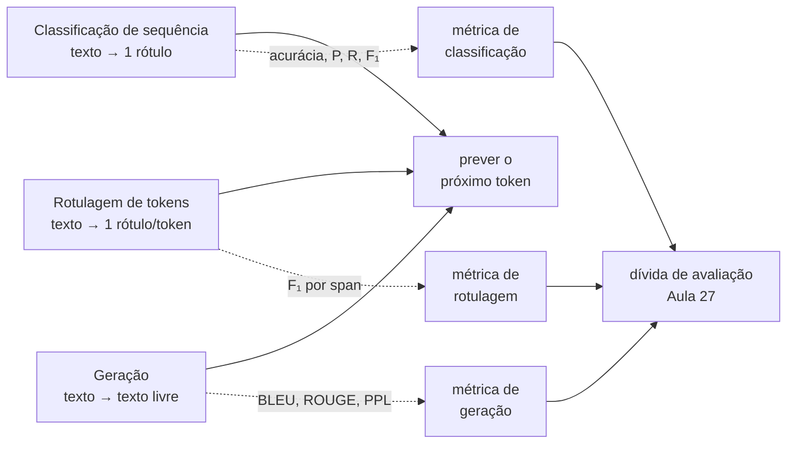
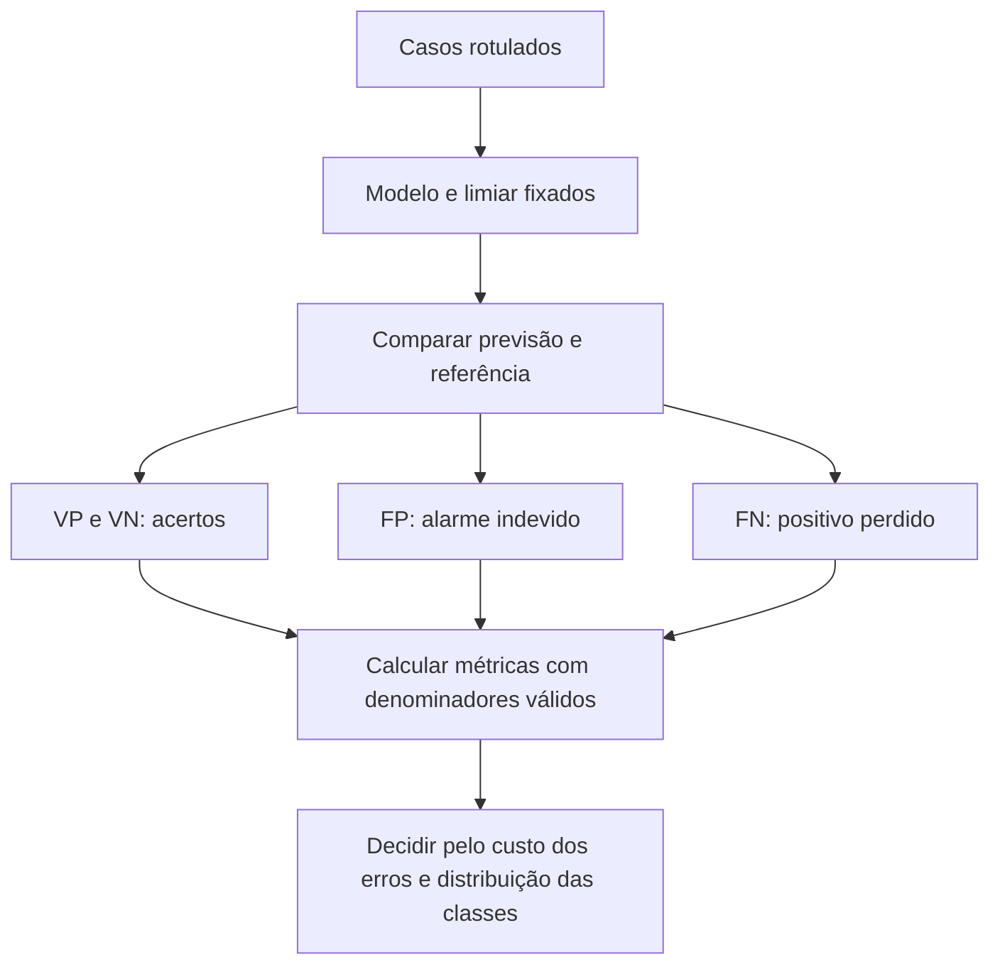
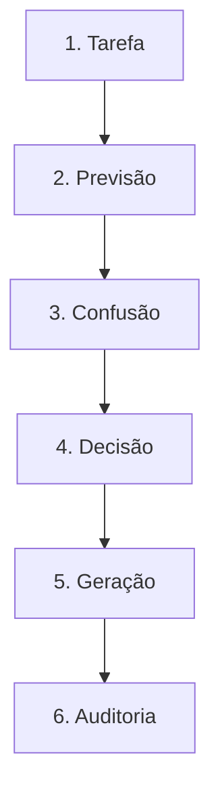

# Especificação de slides — Aula 1 (V2)

> **Rebalanceamento V2.** O fluxo principal abre pelo comportamento observável e usa a
> matemática como fundamento nomeado. Toda derivação está na Parte 2, mais detalhada do
> que estava na V1. Nada de matemática foi perdido — foi realocado.
>
> **O contrato migrou para a Aula 0.** A sessão de recepção de 60 min da semana zero absorve
> integralmente o contrato didático e o contrato de método: avaliação, composição da prova,
> política de uso de IA, arco dos oito labs e projeto final. Os sete slides que a V2 anterior
> gastava com isso saíram deste deck. No lugar deles ficou **uma linha de ponteiro de 30
> segundos** no slide de abertura, apontando para o documento de uma página que está no canal
> da turma — apontamento, não recapitulação.
>
> **Os ~15 minutos liberados foram integralmente para métricas de NLP.** O Bloco 2 passou a
> ser 45 min de métricas puras (era ~29), e o ganho está em quatro lugares: o detector de
> fraude virou exercício em dupla em que a turma **calcula** a matriz em vez de ver o resultado
> pronto; BLEU e ROUGE ganharam um exemplo numérico feito no quadro sobre o mesmo par de
> frases; a perplexidade ganhou **slide próprio** no fluxo; e a quebra da métrica de referência
> ganhou um segundo caso, com números. A abertura ganhou um slide de sintoma — dois números
> reais, os dois verdadeiros, os dois enganosos — que é literalmente a pergunta que o Bloco 2
> responde.

<!-- SLIDE-FLOW:GUIDE:BEGIN -->
## Fluxogramas na produção dos slides

As orientações abaixo complementam o campo **Visual** dos slides indicados. Produzir os fluxogramas no próprio deck, como formas e conectores editáveis ou gráficos vetoriais; a biblioteca completa ao final torna esta especificação independente do portal.

- **Referência de composição:** título e propósito no topo, blocos numerados, conexões rotuladas, ramificações legíveis e uma saída identificada. Usar apenas o padrão visual da referência fornecida, sem importar seu assunto ou seus exemplos.
- **Tema do deck:** manter o fundo escuro e a paleta já especificada para a aula. Usar `#5b8cff` para o trecho ativo, tons neutros para o contexto e `#e2231a` conforme o significado definido no deck. Cor sempre acompanhada de rótulo.
- **Leitura:** entrada no topo ou à esquerda; saída na base ou à direita. Decisões em losangos, alternativas com rótulos e retornos apontando à etapa correta. Ramos paralelos convergem apenas onde seus resultados realmente são combinados.
- **Densidade:** no fluxo principal, projetar 3–6 blocos curtos por enquadramento, com corpo legível na última fileira. Um mapa maior pode ser revelado por etapas no mesmo slide. Detalhes, condições e explicações completas ficam nas notas; não reduzir a fonte para caber tudo.
- **Semântica:** mapas de percurso mostram ordem de estudo, não execução de um algoritmo. Manter separadas preparação e aplicação, treino e inferência, sequência e alternativas. Não transformar uma etapa opcional em obrigatória.
- **Integração:** o fluxograma substitui uma lista redundante ou ocupa o campo Visual; não cobre matrizes, tabelas, gráficos nem código indispensáveis. Preservar títulos, numeração, duração e referências aos apêndices.
- **Produção:** os blocos Mermaid abaixo são especificações do desenho. Renderizar/reconstruir como diagrama, nunca projetar o código Mermaid. Manter rótulos, bifurcações, retornos e limites declarados. Não transformar este caderno técnico em slides adicionais.
- **Ligação com o portal:** os mapas de mecanismo compartilham o conteúdo dos fluxogramas do portal. Em demonstrações, usar o mesmo vocabulário no deck e no controle interativo para facilitar a passagem entre os dois.
<!-- SLIDE-FLOW:GUIDE:END -->

## Diretrizes visuais

- **Tema:** escuro, accent `#e2231a` (vermelho CESAR), accent secundário `#5b8cff`.
- **Tipografia:** sans-serif para texto; monoespaçada para código, fórmulas e nomes de métrica.
- **Densidade:** máximo 5 linhas de texto por slide no fluxo. Um conceito por slide.
- **No fluxo principal:** fórmula aparece **enunciada e lida**, nunca manipulada. Toda
  fórmula vem acompanhada de um número concreto ou de um comportamento que ela prevê.
- **No apêndice:** densidade alta é esperada e desejável. É material de consulta.
- **Proibido:** bullets genéricos ("Vantagens", "Desvantagens"); slide-parede de texto;
  clipart; gráfico sem eixo rotulado; fórmula sem consequência prática no fluxo.

## Arco narrativo

O deck abre projetando o destino (na Aula 30 o aluno apresenta um sistema que ele construiu),
aponta em uma linha para o contrato já dado na sessão de recepção, e imediatamente põe na tela
**duas frases de relatório que são verdadeiras e enganosas**: "99% de acurácia" e "perplexidade
4,0, melhor que o baseline de 20". A partir daí a aula é uma dívida a pagar. O primeiro bloco
percorre a história da área em cinco saltos, mostra por que LLM virou infraestrutura e prova
isso com uma demo de quatro tarefas num único modelo, fechando na taxonomia pela forma da
saída. O segundo bloco é integralmente sobre as métricas que julgam essas famílias — e paga as
duas dívidas da abertura: a primeira frase cai no piso trivial `1 − π`, a segunda cai na
unidade da perplexidade. Fecha na tese: as tarefas foram unificadas sob "prever o próximo
token"; as métricas não foram unificadas junto.

A mudança da V2 está no bloco de métricas, e ela é de densidade, não de tópico. A V1
apresentava *o que cada métrica mede*. Aqui a turma **calcula** a matriz de confusão de três
detectores e descobre à mão que o modelo de pior acurácia é o único que serve; vê BLEU e ROUGE
sendo computados no quadro sobre o mesmo par de frases, com ordenações opostas; e recebe a
perplexidade em slide próprio, porque ela volta na Aula 2 como fertilidade e no Lab 2 como
número medido. As fórmulas continuam na tela — enunciadas e lidas — e a álgebra inteira
(matriz de confusão, F₁ como média harmônica, BLEU com penalidade de brevidade, ROUGE-L por
subsequência comum, perplexidade e a razão de não ser comparável entre tokenizadores) está no
apêndice, em cinco itens.

---

# PARTE 1 — FLUXO PRINCIPAL

*O que se apresenta em aula. 14 slides, 120 minutos com demo e dois exercícios.*

### Slide 1 — Abertura
- **Tipo:** título
- **Título:** Grandes Modelos de Linguagem: do Transformer aos Agentes de IA
- **Frase-tese:** Sessenta horas. No fim delas vocês não vão ter aprendido sobre LLM — vocês vão ter construído um.
- **Conteúdo:** Subtítulo com os dados da oferta: eletiva · 60h · 30 aulas · CESAR. E, em
  corpo pequeno no rodapé, a **linha de ponteiro de 30 segundos** — texto exato:
  ```
  Contrato da disciplina (avaliação · prova · política de IA · os 8 labs · projeto):
  apresentado na sessão de recepção. Documento de uma página no canal da turma.
  ```
  Nada mais. O rodapé é ponteiro, não resumo — não repetir peso nenhum aqui.
- **Visual:** full-bleed. Sugestão: grafo de tokens conectados por linhas finas de atenção,
  desvanecendo nas bordas, em vermelho sobre fundo escuro. Alternativa sem imagem:
  tipografia grande centralizada com uma régua de 30 marcas no rodapé (as 30 aulas), a
  primeira acesa. O ponteiro do contrato fica discreto, em uma linha, cor de texto secundário.
- **Notas do apresentador:** Dita de pé, longe do computador. A sala julga a disciplina nos
  primeiros 90 segundos. O ponteiro do contrato é **30 segundos e não volta** — quem faltou à
  recepção lê o documento de uma página antes da próxima aula. O tempo que a V2 anterior
  gastava aqui está no Bloco 2 agora.

### Slide 2 — Duas frases verdadeiras — e as duas erradas
- **Tipo:** dados (o sintoma que abre a aula)
- **Título:** As duas frases estão certas. As duas conclusões estão erradas.
- **Conteúdo:** Duas citações de relatório na tela, em monoespaçada, como se recortadas de um
  slide de resultado:
  ```
  (1) "O detector de fraude atingiu 99,0% de acurácia no conjunto de teste."

  (2) "Nosso modelo tem perplexidade 4,0 — bem melhor que o baseline
       publicado, que reporta 20."
  ```
  Abaixo, uma linha só: nenhuma das duas frases contém um erro de cálculo. As duas são
  verdadeiras, e as duas levam a uma decisão errada. A frase (1) se resolve no Bloco 2 com uma
  matriz de confusão que a turma preenche à mão; a frase (2) se resolve no mesmo bloco com uma
  troca de unidade.
- **Frase-tese:** Um número de avaliação sem o denominador não é informação — é decoração.
- **Visual:** as duas citações como dois cartões escuros com borda em accent, empilhados,
  ocupando o slide. Nenhuma resposta na tela: espaço vazio deliberado embaixo de cada cartão,
  para ser preenchido ao vivo no Bloco 2. Um marcador `→ 01:12` no primeiro cartão e
  `→ 01:33` no segundo, indicando quando cada dívida é paga.
- **Notas do apresentador:** Este é o sintoma que abre a aula e é a única promessa que o deck
  faz. Não resolver nenhuma das duas aqui — a resolução é o Bloco 2 inteiro, e antecipar
  qualquer uma delas queima o exercício da matriz. Se a turma já quiser responder, anotar o
  nome de quem respondeu e devolver a palavra a essa pessoa no slide 8.

### Slide 3 — De ELIZA ao ChatGPT: cinco saltos
- **Tipo:** diagrama (linha do tempo)
- **Título:** Cinco saltos, sessenta anos
- **Conteúdo:** Cinco marcos, cada um com o que resolveu e o teto que encontrou:
  1. **Regras** · ELIZA, 1966 — padrão e reescrita; teto: nenhum modelo de língua
  2. **Estatística** · n-gramas, anos 90–2000 — língua como distribuição contada; teto: esparsidade
  3. **Representações densas** · Word2Vec, 2013 — semântica como geometria; teto: vetor estático, sem contexto
  4. **Atenção e Transformer** · 2014 e 2017 — dependência longa + paralelismo no mesmo mecanismo
  5. **Escala e instrução** · GPT-3, 2020 e o pós-treino — aprendizado em contexto; completador vira assistente
- **Frase-tese:** ChatGPT não foi um salto de arquitetura — a arquitetura é de 2017. Foi um
  salto de interface e de alinhamento.
- **Visual:** linha do tempo horizontal com cinco estações, cada uma com o ano grande e o
  "teto" em texto menor abaixo. Uma seta de fundo atravessando os cinco, rotulada "menos
  trabalho humano, mais dados e computação".
- **Notas do apresentador:** Com turma sem ML, gastar mais tempo no salto 2 — a intuição de
  "probabilidade estimada por contagem" sustenta a ideia de próximo-token no fechamento e é o
  que faz a perplexidade do slide 11 fazer sentido. A anedota da ELIZA é a parte descartável se
  o relógio apertar.

### Slide 4 — Por que LLM virou infraestrutura
- **Tipo:** conceito
- **Título:** O gargalo mudou de lugar
- **Conteúdo:** Três propriedades que se combinaram: (a) uma interface de texto substitui N
  modelos especializados; (b) o custo de tentar uma tarefa nova caiu de "montar dataset
  rotulado" para "escrever um prompt"; (c) a mesma pilha serve produto, ferramenta interna e
  automação. Consequência em destaque: o gargalo saiu da **modelagem** e foi para
  **avaliação** e **engenharia de sistema** — que é a razão dos Módulos 5 a 7.
- **Visual:** um diagrama de "antes/depois": à esquerda, N caixas de modelo cada uma com seu
  dataset; à direita, uma caixa só com N prompts entrando. Abaixo, uma seta grossa em accent
  apontando de "modelagem" para "avaliação + sistema".
- **Notas do apresentador:** Dados de mercado da praça são `[definir na oferta]` — trazer
  números atualizados ou dizer à turma que não há dado confiável. Não estimar de cabeça.
  Este slide é o que justifica os 45 min de métricas do Bloco 2: se o gargalo é avaliação,
  a aula tem que gastar o tempo onde o gargalo está.

### Slide 5 — [Demo] Um modelo, quatro tarefas
- **Tipo:** transição para demonstração
- **Título:** Uma caixa de texto, quatro tarefas
- **Frase-tese:** Quatro tarefas que dez anos atrás eram quatro projetos de mestrado. Zero
  treino, uma caixa de texto.
- **Conteúdo:** As quatro tarefas listadas na ordem em que a demo faz: sentimento em uma
  palavra · entidades em JSON · tradução PT→EN · resumo em uma frase. E o quinto passo, que
  é a medição: a contagem de n-gramas em comum entre a tradução do modelo e a tradução de
  referência, feita à mão no quadro, **com as duas divisões** — pelo candidato e pela
  referência. Sem resultado na tela: o resultado aparece ao vivo.
- **Visual:** slide de transição, quase vazio. Só o título e os cinco passos como lista
  numerada em monoespaçada, esperando ser preenchida. O quinto passo em accent — é o que
  produz os dois números que os slides 10 e 12 usam.
- **Notas do apresentador:** A demo roda no navegador, sem código. Passos na Parte 2 do
  roteiro. Se o free tier falhar, usar as capturas da véspera; a contagem no quadro não
  depende de rede e é a parte insubstituível. Os dois números ficam circulados no quadro até
  o fim da aula.

### Slide 6 — A taxonomia pela forma da saída
- **Tipo:** comparação
- **Título:** Três famílias — e o critério é a assinatura da função
- **Conteúdo:** Três colunas, cada uma com a assinatura, exemplos e a analogia de programação:
  - **Classificação de sequência** · texto → 1 rótulo · sentimento, intenção, tópico, idioma · *retorna um enum*
  - **Rotulagem de tokens** · texto → 1 rótulo por token · NER, classe gramatical, parsing · *retorna lista do tamanho da entrada*
  - **Geração** · texto → texto livre · tradução, QA, sumarização, código · *retorna string de tamanho livre*
  Rodapé com a consequência que abre o Bloco 2: cada família herdou **métricas próprias**, e
  é isso que o intervalo separa do que vem depois.
- **Frase-tese:** A família não é o assunto do texto. É a assinatura da função.
- **Visual:** três colunas iguais. Em cada uma, a assinatura em monoespaçada no topo,
  destacada. Rodapé em accent: "na demo, rotulagem foi resolvida por geração — a tarefa
  continua a mesma, o modelo virou um só."
- **Notas do apresentador:** Se perguntarem sobre busca/recomendação: são tarefas de sistema,
  não NLP puro. Busca aparece na Aula 19. Não abrir esse fio. Intervalo de 10 min depois
  deste slide; anunciar que o segundo bloco é inteiro sobre métricas.

### Slide 7 — O detector de fraude com 99% de acurácia que nunca achou uma fraude

<!-- SLIDE-FLOW:SLIDE:BEGIN -->
- **Fluxograma a incorporar neste slide:** **F00 — Classificação: das previsões à métrica**. O desenho e os rótulos completos estão no caderno de fluxogramas ao final deste arquivo.
- **Composição:** integrar ao campo Visual; preservar exemplos, tabelas, fórmulas e dimensões solicitados neste slide. Destacar o trecho relacionado ao título e manter o restante em segundo plano. Os textos detalhados ficam nas notas, sem duplicar a lista de Conteúdo na tela.
<!-- SLIDE-FLOW:SLIDE:END -->

- **Tipo:** dados (fundamento aplicado a um sintoma)
- **Título:** A métrica não mentiu. Eu escolhi a métrica errada.
- **Conteúdo:** O sintoma, primeiro, com o modelo inteiro na tela:
  ```
  def eh_fraude(transacao):
      return False          # uma linha, zero treino
  ```
  Num conjunto em que fraude é **1% do volume**, esse modelo tem **99% de acurácia** e
  **revocação zero** — ele nunca achou uma fraude na vida. É a frase (1) da abertura. E aqui
  está o que a acurácia esconde: num problema com prevalência `π`, o classificador trivial já
  entrega `1 − π` de acurácia **de graça**. Com `π = 1%`, a régua não é 50%: é 99%. Ler "99%
  de acurácia" sem saber a prevalência é ler um número sem denominador. As quatro métricas,
  enunciadas:
  ```
  acurácia  = (VP + VN) / N
  precisão  = VP / (VP + FP)
  revocação = VP / (VP + FN)
  F₁        = 2 · P · R / (P + R)
  ```
  Analogia de arbitragem: precisão é "das vezes que apitei, quantas eram falta"; revocação é
  "das faltas, quantas apitei".
- **Frase-tese:** Acurácia de 99% num problema de 1% de prevalência é o piso, não o teto. O
  número só informa se vier comparado com `1 − π`.
- **Visual:** split. Esquerda: a matriz de confusão 2×2 desenhada com as quatro células
  rotuladas, e **só a linha do classificador trivial** preenchida (`VP = 0`, `FP = 0`,
  `VN = 9.900`, `FN = 100`, com `N = 10.000`) — o vazio na coluna de positivos é o argumento.
  Direita: as quatro fórmulas em monoespaçada e, embaixo, `1 − π` como régua, em moldura de
  accent. Duas linhas da tabela ficam **em branco** na tela: elas são o slide 8.
- **Fundamento:** o classificador trivial atinge acurácia `1 − π` sem aprender nada; logo a
  acurácia só é informativa em comparação com esse piso. As quatro métricas saem todas das
  quatro células da matriz de confusão, e nenhuma delas acrescenta informação que não esteja
  nas quatro células — o que muda é qual erro cada uma ignora.
  → derivação completa das quatro métricas, do piso trivial e da agregação multiclasse:
  **Apêndice A.1** (slide 15)
- **Notas do apresentador:** Desenhar a matriz no quadro, não projetá-la resolvida, e
  preencher **só** a linha do trivial ao vivo. As outras duas linhas são o exercício do slide
  8, e é o exercício que carrega o argumento agora — na V2 anterior a turma via os três
  resultados prontos. **Não** falar de `F₁` como média harmônica aqui: isso é o slide 9.
  Guardar giz antes da aula.

### Slide 8 — [Exercício 1] A matriz na mão: três detectores, seis números

<!-- SLIDE-FLOW:SLIDE:BEGIN -->
- **Fluxograma a incorporar neste slide:** **F00 — Classificação: das previsões à métrica**. O desenho e os rótulos completos estão no caderno de fluxogramas ao final deste arquivo.
- **Composição:** integrar ao campo Visual; preservar exemplos, tabelas, fórmulas e dimensões solicitados neste slide. Destacar o trecho relacionado ao título e manter o restante em segundo plano. Os textos detalhados ficam nas notas, sem duplicar a lista de Conteúdo na tela.
- **Momento de exibição:** apresentar o fluxo preenchido na discussão ou conferência, depois da tentativa da turma; durante a atividade, ocultar as etapas que entregariam a solução.
<!-- SLIDE-FLOW:SLIDE:END -->

- **Tipo:** exercício
- **Título:** Em dupla, 7 minutos: qual detector vai para produção?
- **Conteúdo:** A tabela projetada, com as células da matriz dadas e as três métricas em
  branco. `N = 10.000`, fraude real = 100 casos (`π = 1%`). A primeira linha vem resolvida
  como exemplo de leitura:
  ```
  modelo                     VP    FP    FN     VN   | acurácia  precisão  revocação
  trivial (return False)      0     0   100  9.900   |  0,9900       —        0,00
  conservador                20     5    80  9.895   |     ?         ?          ?
  agressivo                  90   900    10  9.000   |     ?         ?          ?
  ```
  Duas perguntas, na ordem: **(a)** os seis números que faltam; **(b)** qual dos três detectores
  vai para produção numa triagem de fraude — e o que a acurácia disse sobre essa escolha.
- **Frase-tese:** O detector de pior acurácia é o único que serve. A acurácia ordenou os três
  ao contrário do que o problema exige.
- **Visual:** a tabela grande, ocupando o slide, em monoespaçada, com as seis células vazias
  visivelmente vazias (moldura pontilhada). Cronômetro de 7 min no canto. Nenhuma resposta na
  tela — a correção é escrita ao vivo por cima.
- **Fundamento:** as três linhas instanciam o mesmo resultado do slide 7: `acurácia(trivial)
  = 1 − π` por construção, e a acurácia é um único ponto sobre a curva de limiar, o que é a
  razão estrutural de ela ordenar mal.
  → a tabela conferida, os casos-limite e a intuição da curva ROC: **Apêndice A.1** (slide 15)
- **Notas do apresentador:** Cronometrar de verdade: 4 min de dupla, 3 de correção. A linha do
  trivial já está resolvida na tela justamente para que cada dupla faça só seis divisões. Na
  correção, a ordem importa: primeiro os números, depois a pergunta (b), e só então nomear o
  resultado — a inversão da ordenação tem que ser **descoberta** pela sala, não anunciada. Se
  uma dupla travar em `precisão(trivial) = 0/0`, isso é achado legítimo e está nos casos-limite
  de A.1. Esta é a resposta à frase (1) da abertura: voltar ao slide 2 e riscar o primeiro
  cartão.

### Slide 9 — F₁ é média harmônica — e o peso é decisão de produto

<!-- SLIDE-FLOW:SLIDE:BEGIN -->
- **Fluxograma a incorporar neste slide:** **F00 — Classificação: das previsões à métrica**. O desenho e os rótulos completos estão no caderno de fluxogramas ao final deste arquivo.
- **Composição:** integrar ao campo Visual; preservar exemplos, tabelas, fórmulas e dimensões solicitados neste slide. Destacar o trecho relacionado ao título e manter o restante em segundo plano. Os textos detalhados ficam nas notas, sem duplicar a lista de Conteúdo na tela.
<!-- SLIDE-FLOW:SLIDE:END -->

- **Tipo:** conceito
- **Título:** Um número para dois, e quem escolhe o peso não é a matemática
- **Conteúdo:** O comportamento observável, com números na tela: um detector omisso, que apita
  raramente e acerta quando apita.
  ```
  P = 1,00    R = 0,01
  média aritmética = 0,505         F₁ = 0,0198
  ```
  A aritmética premia com 0,5 um sistema que perde 99% dos casos; a harmônica devolve 0,02. É
  a harmônica que se quer, porque ela é dominada pelo **menor** dos dois. Depois, o mesmo
  sistema sob três pesos:
  ```
  com P = 0,30 e R = 0,90:    F₀,₅ = 0,346    F₁ = 0,450    F₂ = 0,643
  ```
  Os três números estão certos. Eles respondem perguntas diferentes, e a pergunta é do produto.
- **Frase-tese:** `F₁` não é a métrica certa: é a escolha de dizer que um falso negativo e um
  falso positivo custam o mesmo. Em triagem médica isso é falso, e em moderação é falso na
  direção oposta.
- **Visual:** duas metades. Topo: as três médias do mesmo par `(1,00 · 0,01)` como três barras
  — aritmética, geométrica, harmônica — mostrando visualmente `H ≤ G ≤ A`. Base: os três
  valores de `F_β` como três barras, com a legenda "mesmo sistema, três perguntas". A barra de
  `F₂` em accent.
- **Fundamento:** `F₁ = 2PR/(P+R)` é a média harmônica de `P` e `R`; `F_β` é a média harmônica
  **ponderada**, com `β²` fazendo o papel de razão de importância entre revocação e precisão, e
  `β² ≈ c_FN / c_FP` na leitura operacional. Vale `H ≤ G ≤ A`, com igualdade só quando `P = R`.
  → derivação da média harmônica, de `F_β` como ponderação e do exemplo de triagem médica:
  **Apêndice A.2** (slide 16)
- **Notas do apresentador:** **Não** derivar a média harmônica no quadro — os dois números já
  provam o ponto, e a álgebra está em A.2. O que não se abre mão de dizer em voz alta: `c_FN` e
  `c_FP` **não estão no conjunto de dados**, e por isso a escolha de `β` é de produto. Se a
  turma pedir a derivação, Parte 4 do roteiro, item 1.

### Slide 10 — BLEU e ROUGE: um numerador, dois denominadores
- **Tipo:** dados (fundamento aplicado, com conta ao vivo)
- **Título:** A mesma contagem, duas divisões, duas ordenações opostas
- **Conteúdo:** As duas fórmulas enunciadas, e a pergunta de cada uma em linguagem natural:
  ```
  BLEU   = BP · exp(Σ wₙ log pₙ)      precisão de n-gramas    "o que eu escrevi está no gabarito?"
  ROUGE  = ROUGE-N | ROUGE-L          revocação de n-gramas   "quanto do gabarito eu cobri?"
  ```
  E o exemplo que se faz **no quadro**, com uma referência e dois candidatos:
  ```
  referência r:   o gato está sobre o tapete
  candidato  A:   o gato no tapete                              (curto)
  candidato  B:   o gato está deitado sobre o grande tapete velho   (prolixo)

                  unigramas em comum   p₁ (BLEU)      ROUGE-1 revocação
  candidato A            3             3/4 = 0,750       3/6 = 0,500
  candidato B            6             6/9 = 0,667       6/6 = 1,000
  ```
  A leitura, que é o ponto do slide: **a precisão prefere A, a revocação prefere B.** Mesmo
  numerador, denominadores diferentes, ordenações invertidas. Uma métrica pune exatamente o que
  a outra premia — e é por isso que BLEU precisa de uma penalidade de brevidade e ROUGE precisa
  de reportar a `F`: cada uma é remendada do lado em que é degenerada.
- **Frase-tese:** BLEU e ROUGE contam a mesma coisa. O que muda é o denominador — e o
  denominador é quem decide qual sistema ganha.
- **Visual:** a tabela dos dois candidatos ocupando o centro, com a coluna de `p₁` e a de
  ROUGE-1 destacadas em cores diferentes e as duas setas de ordenação apontando para lados
  opostos (A no topo de uma, B no topo da outra). Acima, as duas fórmulas em monoespaçada.
  Rodapé em accent: "sem a penalidade de brevidade, escrever pouco seria a estratégia ótima".
- **Fundamento:** BLEU é a **média geométrica** das precisões de n-grama, com contagem
  truncada e penalidade de brevidade multiplicativa; um `pₙ = 0` zera o produto inteiro, e é
  por isso que BLEU se reporta em nível de corpus.
  → derivação completa, o truncamento, a penalidade e o exemplo em que BLEU-4 dá exatamente
  zero para uma tradução correta: **Apêndice A.3** (slide 17)
- **Fundamento (segundo):** ROUGE-N troca o denominador de BLEU — divide pelos n-gramas da
  **referência**, não do candidato; ROUGE-L usa a maior subsequência comum, e é sensível à
  ordem sem exigir adjacência.
  → derivação, a recorrência da subsequência comum e a `F` de ROUGE: **Apêndice A.4** (slide 18)
- **Notas do apresentador:** As duas contas vão no quadro, não no slide — a tabela projetada é
  o gabarito para conferir depois. **Não derivar BLEU**: a média geométrica, o truncamento e a
  `BP` estão em A.3. Aqui os dois números da demo voltam: a tradução que a sala julgou boa e as
  duas divisões que ficaram circuladas. Se pedirem o BLEU-4 zerado, Parte 4, item 2. O
  candidato B é o que a turma resiste a aceitar: vale insistir que ROUGE-1 dá **1,000** para um
  texto prolixo, e que isso é a métrica funcionando como definida.

### Slide 11 — Perplexidade: a métrica que dispensa gabarito
- **Tipo:** conceito
- **Título:** `PPL = exp(loss)` — e por que ela não atravessa tokenizadores
- **Conteúdo:** A criatura diferente das outras duas: perplexidade não compara com referência
  humana nenhuma. Ela mede a surpresa do modelo diante de um texto.
  ```
  PPL = exp( −(1/N) Σ log P(tᵢ | t₍<ᵢ₎) ) = exp(H) = exp(loss)
  ```
  Três leituras, em uma linha cada: `PPL = 12` significa que o modelo está tão indeciso quanto
  quem escolhe uniformemente entre 12 opções — a unidade é **opções**, não erro. Um modelo
  uniforme sobre `|V|` símbolos tem `PPL = |V|`, e é esse o teto de quem chuta. E `loss` é
  literalmente o número que o laço de treino imprime, o que faz da perplexidade a métrica que
  o aluno vai ver na tela no Lab 2.
  Depois, a frase (2) da abertura, resolvida:
  ```
  PPL 4,0 por caractere  ==  PPL 256 por subword     (mesmo modelo, r = 4 caracteres/subword)
  bits por caractere:  2,00 nos dois casos            → a normalização que compara
  ```
  Comparar "4" com "20" publicado é comparar 256 com 20, e a conclusão se inverte: o modelo de
  subword, com `BPC = 1,08`, é substancialmente melhor.
- **Frase-tese:** Perplexidade é medida **por token**. Trocar o tokenizador não deixa a
  comparação imprecisa — deixa sem sentido, porque muda também o espaço de eventos.
- **Visual:** dois eixos verticais lado a lado, um rotulado "por caractere" e outro "por
  subword", com o mesmo modelo marcado nos dois em alturas absurdamente diferentes (4 e 256) e
  uma linha horizontal única atravessando os dois, rotulada `BPC = 2,00`. É a figura que mostra
  que a discordância está na régua, não no modelo.
- **Fundamento:** `PPL = exp(H)` é a média **geométrica** do inverso das probabilidades
  atribuídas aos tokens corretos, e `H = −log P(texto)/N` é a log-verossimilhança total dividida
  pelo número de tokens. Como o texto é o mesmo e só `N` muda, vale `PPL_B = PPL_A^r` com
  `r = N_A/N_B`: a diferença é uma **potência**, não um fator, e por isso reescalar pela
  fertilidade não conserta.
  → derivação, o teto trivial `PPL = |V|`, a conversão entre tokenizadores e a normalização em
  bits por caractere: **Apêndice A.5** (slide 19)
- **Notas do apresentador:** Este slide é novo no fluxo da V2 e existe porque a perplexidade é
  o único conceito desta aula que reaparece duas vezes: na **Aula 2** como fertilidade medida em
  tokenizadores reais, e no **Lab 2 (Aula 9)** como `exp(loss)` saindo do laço de treino do
  aluno. Dizer "por token" em voz alta é obrigatório: é o gancho literal da próxima aula. Não
  derivar `exp(H)` — se perguntarem, Parte 4, itens 3 e 4. Riscar o segundo cartão do slide 2.

### Slide 12 — Onde a métrica de referência quebra
- **Tipo:** conceito
- **Título:** A dívida de avaliação
- **Conteúdo:** O pressuposto que falha: sobreposição de n-gramas assume que existe uma
  resposta certa, ou poucas. Quando existem muitas respostas boas e mutuamente diferentes, o
  que a métrica mede não é qualidade — é estilo. Três casos, os três observáveis, os dois
  primeiros com número:
  - **caso 1, a paráfrase natural** — `r = o gato está sobre o tapete`,
    `c = o gato está no tapete`: português correto e mais natural, e `p₄ = 0/2` zera a média
    geométrica. **BLEU-4 = 0,000** para uma tradução boa (conta em A.3)
  - **caso 2, o sinônimo** — `c = o felino está sobre o carpete`: mesmo comprimento, sentido
    idêntico, qualquer falante aceita a equivalência. E a sobreposição desaba ordem por ordem:
    `p₁ = 4/6 = 0,667`, `p₂ = 2/5 = 0,400`, `p₃ = 1/4 = 0,250`, `p₄ = 0/3 = 0` →
    **BLEU-4 = 0,000**, sem nem a desculpa da brevidade (`BP = 1`, os comprimentos são iguais).
    E a métrica irmã não salva: `ROUGE-1 revocação = 4/6 = 0,667` e `ROUGE-L F = 0,667`, porque
    ROUGE conta a mesma coisa que BLEU — forma (contas em A.3 e A.4)
  - **caso 3, o inverso** — resposta errada que reaproveita as palavras da referência: nota
    alta, conteúdo falso. A métrica é sensível à forma e cega ao conteúdo
  Fechamento: medir é um problema de engenharia próprio — a Aula 27 trata com rubrica humana,
  acordo entre anotadores, LLM-as-judge calibrado e decomposição em afirmações atômicas.
- **Frase-tese:** A gente ficou excelente em gerar texto e continua ruim em julgar texto.
- **Visual:** três cartões. Os dois primeiros com o número no canto em corpo grande
  (`BLEU-4 = 0` e `BLEU-3 = 0`) e o texto da frase embaixo, em verde-para-vermelho (bom texto,
  nota no chão). O terceiro em vermelho-para-verde (texto ruim, nota alta). Seta no rodapé
  apontando para "Aula 27".
- **Fundamento:** trocar de métrica de sobreposição não resolve o caso do sinônimo: ROUGE-N e
  ROUGE-L caem junto com BLEU, porque as três medem forma e nenhuma das três pergunta se a
  afirmação é verdadeira.
  → os casos-limite de ROUGE, incluindo o do sinônimo e o da permutação: **Apêndice A.4**
  (slide 18)
- **Fundamento (a tentativa de conserto):** alguém consertou o caso 2 — em 2005, e chama-se
  **METEOR**. Ele casa palavras em três categorias em vez de uma (exata, mesmo radical, sinônimo),
  pesa revocação acima de precisão (`α = 0,9`) e cobra a ordem por fora, como penalidade
  multiplicativa sobre o número de blocos contíguos. Na frase do sinônimo deste slide:
  **`BLEU-4 = 0,000` e `METEOR ≈ 0,998`.** Mas o **caso 3 continua de pé** — resposta falsa com o
  vocabulário certo pontua alto em METEOR também. A lição não é "use METEOR": é que afrouxar o
  casamento resolve forma e não resolve verdade, e que por isso a Aula 27 precisa existir.
  → as três decisões de METEOR, os dois casos deste slide resolvidos com número, o que ele **não**
  conserta e por que o léxico de sinônimos é pior em português: **Apêndice A.6** (slide 20)
- **Notas do apresentador:** Gancho mais importante da aula para o arco do curso. O caso 2 é o
  que a V2 acrescentou e é o mais convincente, porque a sala **concorda** que as duas frases
  querem dizer a mesma coisa antes de ver o número. Fazer a votação por mão levantada com a
  frase do sinônimo antes de revelar o `p₃ = 0` — a discordância entre o julgamento da sala e o
  da métrica é o argumento. Se o tempo estourou, cortar o exercício do slide 13 antes de cortar
  este slide.

### Slide 13 — [Exercício 2] Da tarefa à métrica
- **Tipo:** exercício
- **Título:** Em dupla, 7 minutos: qual família, qual métrica, e o que a métrica não vê
- **Conteúdo:** Os cinco cenários numerados, redigidos como aparecem na tela:
  1. Roteador de tickets de suporte em 12 filas, com uma fila crítica que é 2% do volume
  2. Extração de número de processo e nome das partes em petições jurídicas
  3. Tradução PT→EN de descrições de produto de e-commerce
  4. Detector de discurso de ódio em comentários, com revisão humana a jusante
  5. Assistente que responde sobre o regulamento da universidade, citando a fonte
  Para cada um: a família, a métrica primária, e — a parte que vale — **uma falha que essa
  métrica não pegaria**.
- **Frase-tese:** A coluna que vale não é a da métrica. É a da falha que a métrica não vê.
- **Visual:** os cinco cenários como lista numerada, com espaço à direita sugerindo três
  colunas a preencher: família · métrica · o que ela não vê. Cronômetro de 7 min no canto.
- **Notas do apresentador:** Condução na Parte 3 do roteiro. Cronometrar de verdade: 4 min de
  dupla, 3 de correção. O exercício roda mais rápido que na V2 anterior porque o vocabulário já
  está construído — o exercício do slide 8 nomeou o piso `1 − π` e o slide 9 nomeou o peso
  assimétrico, então os cenários 1 e 4 se resolvem com o que a sala já disse em voz alta.
  Cenários 1 e 5 são os que importam: o 5 não tem resposta com o ferramental de hoje, e é por
  isso que está ali. A terceira coluna é o mesmo verbo dos **42 pontos** de diagnóstico da prova
  — e a composição da prova já foi dada na sessão de recepção, então aqui é só nomear o verbo,
  não reapresentar pesos.

### Slide 14 — Fechamento: a tese do próximo-token

<!-- SLIDE-FLOW:SLIDE:BEGIN -->
- **Fluxograma a incorporar neste slide:** **F01 — O percurso desta aula**. O desenho e os rótulos completos estão no caderno de fluxogramas ao final deste arquivo.
- **Composição:** integrar ao campo Visual; preservar exemplos, tabelas, fórmulas e dimensões solicitados neste slide. Destacar o trecho relacionado ao título e manter o restante em segundo plano. Os textos detalhados ficam nas notas, sem duplicar a lista de Conteúdo na tela.
<!-- SLIDE-FLOW:SLIDE:END -->

- **Tipo:** encerramento
- **Título:** Unificamos o modelo. Não unificamos as métricas.
- **Conteúdo:** A síntese em três linhas: três famílias de tarefa com métricas próprias,
  construídas em décadas → um único modelo resolvendo as três sem treino, só mudando a caixa
  de texto → porque tudo foi reescrito como "prever o próximo token". O preço: as métricas
  não vieram junto, e as duas frases da abertura são a prova disso. Depois, o checklist de
  setup para o Lab 1 (conta Google/Colab · Hugging Face · provedor de API com free tier) e a
  pergunta dirigida da leitura: por que perplexidade só é comparável com o mesmo tokenizador?
- **Frase-tese:** Esse desequilíbrio é o assunto das próximas vinte e nove aulas.
- **Visual:** duas metades. Topo: o funil das três famílias convergindo para uma única caixa
  "prever o próximo token", e das métricas *não* convergindo — três setas que continuam
  separadas. Base: o checklist de setup em caixa destacada, para a turma fotografar. Num
  canto discreto, o índice do apêndice deste deck: A.1 matriz de confusão · A.2 F₁ e F_β ·
  A.3 BLEU · A.4 ROUGE · A.5 perplexidade. Rodapé: "Aula 2 — Tokenização: antes de prever o
  próximo token, alguém decide o que é um token."
- **Notas do apresentador:** Projetar o checklist e ficar 30 s em silêncio para a turma
  fotografar. Antes disso, projetar o índice do apêndice por 20 s e dizer uma frase só: a
  resposta da pergunta dirigida está em **A.5**, escrita, e quem ler A.5 chega na Aula 2 com
  metade do caminho andado. Acabar às 02:00 — a primeira aula define se o semestre respeita
  o relógio.



---

# PARTE 2 — APÊNDICE MATEMÁTICO

*Material de estudo e consulta. Não se apresenta em aula: reconstrói, com rigor completo,
todo fundamento citado no fluxo. Autossuficiente — quem estuda por aqui sem ter assistido
à aula consegue reconstruir tudo.*

### Slide 15 — A.1 · Matriz de confusão e as quatro métricas

<!-- SLIDE-FLOW:SLIDE:BEGIN -->
- **Fluxograma a incorporar neste slide:** **F00 — Classificação: das previsões à métrica**. O desenho e os rótulos completos estão no caderno de fluxogramas ao final deste arquivo.
- **Composição:** integrar ao campo Visual; preservar exemplos, tabelas, fórmulas e dimensões solicitados neste slide. Destacar o trecho relacionado ao título e manter o restante em segundo plano. Os textos detalhados ficam nas notas, sem duplicar a lista de Conteúdo na tela.
<!-- SLIDE-FLOW:SLIDE:END -->

- **Tipo:** apêndice — derivação completa
- **Invocado em:** slides 7 e 8

**Notação.**
`N` — número de exemplos do conjunto de avaliação.
Classe **positiva** = a classe de interesse (fraude, doença, spam). A escolha de qual classe
é a positiva é **do avaliador**, não do problema, e ela troca precisão com revocação.
`VP` — verdadeiros positivos: positivos reais preditos como positivos.
`FP` — falsos positivos: negativos reais preditos como positivos.
`FN` — falsos negativos: positivos reais preditos como negativos.
`VN` — verdadeiros negativos: negativos reais preditos como negativos.
`P⁺ = VP + FN` — total de positivos **reais**. `P⁻ = VN + FP` — total de negativos reais.
`π = P⁺ / N` — **prevalência** da classe positiva.

**Premissas.** (i) Rótulo binário e determinístico — cada exemplo tem exatamente uma classe
verdadeira; (ii) o classificador opera com um **limiar fixo**, e mudar o limiar move todas as
quatro células ao mesmo tempo; (iii) o conjunto de avaliação é a única fonte dos números —
nenhuma das métricas abaixo estima incerteza, e a Aula 27 volta a esse ponto.

**Identidade fundamental.** As quatro células particionam o conjunto:
```
VP + FP + FN + VN = N
```
Toda métrica desta seção é uma razão entre subconjuntos dessa partição. Nenhuma delas
acrescenta informação que não esteja nas quatro células — o que muda é **qual erro cada uma
ignora**.

**Definições.**
```
acurácia  = (VP + VN) / N                    fração de acertos, sem distinguir o tipo
precisão  = VP / (VP + FP)                   entre os que eu chamei de positivo, quantos eram
revocação = VP / (VP + FN) = VP / P⁺         entre os positivos reais, quantos eu achei
```
*O que cada denominador diz.* A acurácia divide por `N` — trata um FP e um FN como o mesmo
erro. A precisão divide pelo que **o modelo declarou** positivo — é uma pergunta sobre o
comportamento do modelo. A revocação divide pelo que **o mundo tem** de positivo — é uma
pergunta sobre cobertura. Precisão e revocação não são simétricas porque os denominadores
não são a mesma coisa: um é escolha do modelo, o outro é fato do conjunto.

**Derivação do piso trivial.** Seja `T` o classificador que responde sempre "negativo".
Então, por construção:
```
VP = 0        (nunca declara positivo)
FP = 0        (nunca declara positivo)
FN = P⁺       (todos os positivos reais escapam)
VN = P⁻       (todos os negativos são acertados)
```
Substituindo na acurácia:
```
acurácia(T) = (0 + P⁻) / N = P⁻ / N = (N − P⁺) / N = 1 − π
```
E nas outras duas:
```
revocação(T) = 0 / (0 + P⁺) = 0
precisão(T)  = 0 / (0 + 0)  =  indefinida     (convenção usual: 0)
```

*Leitura do resultado.* **Qualquer** problema com prevalência `π` entrega `1 − π` de acurácia
a quem não faz nada. Logo a acurácia não é uma nota de 0 a 100: é uma nota cujo piso é
`1 − π` e cujo teto é 1. O intervalo útil tem largura `π`. Com `π = 0,01`, a acurácia
informativa vive entre 0,99 e 1,00 — e a diferença entre um modelo inútil e um modelo
perfeito é o segundo dígito decimal.

*A tabela do exercício do slide 8, conferida, com `N = 10.000` e `π = 0,01` (100 fraudes reais):*

| Modelo | VP | FP | FN | VN | acurácia | precisão | revocação |
|---|---|---|---|---|---|---|---|
| trivial (`return False`) | 0 | 0 | 100 | 9.900 | **0,9900** | — | **0,00** |
| conservador | 20 | 5 | 80 | 9.895 | 0,9915 | 0,800 | 0,200 |
| agressivo | 90 | 900 | 10 | 9.000 | 0,9090 | 0,091 | 0,900 |

*As contas do conservador, para quem quiser conferir a mão:*
```
acurácia  = (20 + 9.895) / 10.000 = 9.915/10.000 = 0,9915
precisão  = 20 / (20 + 5)         = 20/25        = 0,800
revocação = 20 / (20 + 80)        = 20/100       = 0,200
```
*E do agressivo:*
```
acurácia  = (90 + 9.000) / 10.000 = 9.090/10.000 = 0,9090
precisão  = 90 / (90 + 900)       = 90/990       = 0,0909…
revocação = 90 / (90 + 10)        = 90/100       = 0,900
```

Repare no par trivial × agressivo: o agressivo tem acurácia **pior** (0,909 contra 0,990) e
é o único dos três que serve para triagem de fraude, porque acha 90 das 100. A acurácia
ordenou os modelos ao contrário do que o problema exige. E repare no conservador: ele tem a
**melhor** acurácia dos três (0,9915) e acha um quinto das fraudes — é o modelo que passa em
revisão de resultado e falha em produção.

**Casos-limite.**
- **`π → 0`.** A acurácia do trivial tende a 1 e a métrica perde todo o poder discriminante.
  É o regime de detecção de evento raro — fraude, falha de equipamento, doença rara.
- **`π = 0,5`.** O piso trivial é 0,5 e a acurácia volta a ser informativa. É o único regime
  em que a intuição de "acima de 50% é melhor que sorte" vale.
- **`FP = 0` com `VP > 0`.** Precisão exatamente 1. Não é excelência: é tipicamente um limiar
  altíssimo, com revocação baixa. Precisão 1 isolada é sinal de omissão, não de qualidade.
- **`VP + FP = 0`.** Precisão indefinida (`0/0`). É exatamente a célula em que as duplas travam
  na linha do trivial. Bibliotecas devolvem 0 com aviso; a convenção importa porque muda a
  média em avaliação multiclasse.

**Extensão para múltiplas classes.** Com `K` classes, a matriz é `K × K` e as métricas são
calculadas **por classe** (uma classe contra o resto) e depois agregadas. Duas agregações,
com comportamentos opostos:
```
macro-F₁ = (1/K) Σ_k F₁(classe k)          cada classe pesa igual
micro-F₁ = F₁ calculado sobre VP, FP, FN somados de todas as classes
```
Micro é dominado pelas classes frequentes; macro dá o mesmo peso a uma classe com 5 exemplos
e a outra com 50.000. É exatamente a diferença que decide o cenário 1 do exercício do slide 13
— um roteador de 12 filas com uma fila crítica a 2% do volume tem micro-F₁ alto e macro-F₁
baixo, e a fila que importa é a que só aparece no macro.

**Intuição geométrica.** Fixando o conjunto de avaliação e varrendo o limiar do
classificador, o par `(FP/P⁻, VP/P⁺)` traça uma curva no quadrado unitário — a curva ROC. O
classificador trivial é o canto `(0, 0)`; declarar tudo positivo é o canto `(1, 1)`; a
diagonal é o desempenho de sorteio. Acurácia é uma **única** escolha de limiar sobre essa
curva, e é por isso que ela esconde tanto: ela reporta um ponto e cala sobre a curva. Os três
modelos da tabela são três pontos dessa mesma curva, e a ordenação por acurácia é uma
ordenação por *um* ponto — o que explica, estruturalmente, por que ela inverte.

**De volta ao fluxo:** slide 7.

### Slide 16 — A.2 · F₁ como média harmônica, e F_β

<!-- SLIDE-FLOW:SLIDE:BEGIN -->
- **Fluxograma a incorporar neste slide:** **F00 — Classificação: das previsões à métrica**. O desenho e os rótulos completos estão no caderno de fluxogramas ao final deste arquivo.
- **Composição:** integrar ao campo Visual; preservar exemplos, tabelas, fórmulas e dimensões solicitados neste slide. Destacar o trecho relacionado ao título e manter o restante em segundo plano. Os textos detalhados ficam nas notas, sem duplicar a lista de Conteúdo na tela.
<!-- SLIDE-FLOW:SLIDE:END -->

- **Tipo:** apêndice — derivação completa
- **Invocado em:** slide 9

**O que se quer demonstrar.** Que `F₁ = 2PR/(P+R)` é a média harmônica de precisão e
revocação, que a média harmônica é dominada pelo menor dos dois valores, e que `F_β`
generaliza a escolha do peso — tornando explícito que o peso é decisão de produto.

**Notação e premissas.** `P` = precisão, `R` = revocação, ambas em `(0, 1]`. A derivação
requer `P > 0` e `R > 0`; o caso com zero aparece nos casos-limite.

**Derivação da média harmônica.** A média harmônica de dois números positivos é o inverso da
média aritmética dos inversos:
```
H(P, R) = 1 / [ (1/2)(1/P + 1/R) ]
        = 2 / (1/P + 1/R)
```
Somando as frações no denominador:
```
1/P + 1/R = (R + P) / (P·R)
```
Substituindo:
```
H(P, R) = 2 / [ (P + R) / (P·R) ] = 2·P·R / (P + R)
```
que é exatamente `F₁`. ∎

**Por que harmônica e não aritmética — com números.** Considere o detector omisso: apita
raramente, mas quando apita está certo. É o par que aparece no slide 9.
```
P = 1,00   R = 0,01

média aritmética = (1,00 + 0,01) / 2 = 0,505
média harmônica  = 2 · (1,00 · 0,01) / 1,01 = 0,02 / 1,01 = 0,0198
```
A aritmética premia com 0,5 um detector que perde 99% dos casos. A harmônica devolve 0,02.
A razão estrutural é a desigualdade das médias: para quaisquer positivos,
```
H ≤ G ≤ A            (harmônica ≤ geométrica ≤ aritmética)
```
com igualdade **somente** quando `P = R`. A harmônica é a mais próxima do menor dos dois
valores, e é essa propriedade que se quer: um sistema com precisão excelente e revocação
péssima não é um sistema mediano — é um sistema ruim.

*Conferindo a geométrica do mesmo par, para completar a cadeia do slide 9:*
```
G(1,00 ; 0,01) = √(1,00 · 0,01) = 0,100
H = 0,0198  ≤  G = 0,100  ≤  A = 0,505      ✔
```

*Cota útil.* Vale sempre `H(P,R) ≤ 2·min(P,R)`. Prova rápida: sem perda de generalidade
`R ≤ P`, então `P + R ≥ 2R`, logo `2PR/(P+R) ≤ 2PR/(2R) = P`; e também
`2PR/(P+R) ≤ 2R·P/(P+R) ≤ 2R` porque `P/(P+R) ≤ 1`. Ou seja: `F₁` nunca é mais que o dobro
do pior dos dois, e nunca ultrapassa o melhor.

**Generalização: F_β.** A definição corrente é
```
F_β = (1 + β²) · P · R / (β² · P + R)
```
*Verificação de que β = 1 devolve F₁:*
```
F₁ = (1 + 1) · P · R / (1 · P + R) = 2PR / (P + R)      ✔
```

*O que β significa, derivado.* Escreva `F_β` como média harmônica **ponderada** com peso
`w` em `R` e `1 − w` em `P`:
```
F_β = 1 / [ (1−w)/P + w/R ]        com w = β² / (1 + β²)
```
Conferindo: `(1−w) = 1/(1+β²)` e `w = β²/(1+β²)`, então
```
(1−w)/P + w/R = [R + β²·P] / [(1+β²)·P·R]
```
e o inverso é exatamente `F_β`. ∎ Logo `β² ` é a **razão de importância** entre revocação e
precisão: com `β = 2`, a revocação vale `4` vezes a precisão na média ponderada.

**Números — triagem médica com β = 2.** Um triador sensível, que erra para o lado de
encaminhar exames a mais. É o segundo par de números do slide 9:
```
P = 0,30   R = 0,90

F₁  = 2 · 0,30 · 0,90 / (0,30 + 0,90)          = 0,54 / 1,20  = 0,450
F₂  = 5 · 0,30 · 0,90 / (4 · 0,30 + 0,90)      = 1,35 / 2,10  = 0,643
F₀ᵗ⁵ = 1,25 · 0,27 / (0,25 · 0,30 + 0,90)      = 0,3375/0,975 = 0,346
```
O **mesmo** sistema vale 0,346, 0,450 ou 0,643 conforme o `β`. Nenhum dos três números está
errado; eles respondem perguntas diferentes. Reportar `F₁` sem justificar `β = 1` é assumir
silenciosamente que um falso negativo e um falso positivo custam o mesmo — o que em triagem
médica é falso, e em moderação de conteúdo é falso na direção oposta.

**Casos-limite.**
- **`P = 0` ou `R = 0`.** `F_β = 0` para todo `β`. A média harmônica é aniquilada por um
  zero, o que é o comportamento desejado: um sistema que não acha nada não tem nota parcial.
  É o que acontece com o detector trivial do slide 7: revocação zero, `F₁` zero.
- **`P = R`.** `F_β = P = R` para todo `β` — o peso deixa de importar quando os dois lados
  são iguais.
- **`β → 0`.** `F_β → P`. Só a precisão importa.
- **`β → ∞`.** `F_β → R`. Só a revocação importa.
- **Comparar `F₁` de dois sistemas com prevalências diferentes.** Não é comparável: `P`
  depende de `π`, e `R` não. Dois sistemas avaliados em conjuntos com prevalências distintas
  produzem `F₁` incomparáveis mesmo com o mesmo comportamento.

**Como escolher β, operacionalmente.** Se o custo de um falso negativo é `c_FN` e o de um
falso positivo é `c_FP`, o peso implícito é `β² ≈ c_FN / c_FP`. Triagem médica com exame
barato e doença grave: `c_FN ≫ c_FP`, logo `β > 1`. Moderação com penalidade de censura
indevida: `c_FP` alto, logo `β < 1`. É por isso que a escolha é de produto: `c_FN` e `c_FP`
não estão no conjunto de dados.

**De volta ao fluxo:** slide 9.

### Slide 17 — A.3 · BLEU: precisão de n-gramas com penalidade de brevidade

<!-- SLIDE-FLOW:SLIDE:BEGIN -->
- **Fluxograma a incorporar neste slide:** **F00 — Classificação: das previsões à métrica**. O desenho e os rótulos completos estão no caderno de fluxogramas ao final deste arquivo.
- **Composição:** integrar ao campo Visual; preservar exemplos, tabelas, fórmulas e dimensões solicitados neste slide. Destacar o trecho relacionado ao título e manter o restante em segundo plano. Os textos detalhados ficam nas notas, sem duplicar a lista de Conteúdo na tela.
<!-- SLIDE-FLOW:SLIDE:END -->

- **Tipo:** apêndice — derivação completa com exemplo numérico
- **Invocado em:** slide 10

**Notação.**
`c` — o candidato (a saída do sistema), com `|c|` tokens.
`R = {r₁, …, r_m}` — o conjunto de referências. `|r|` é o comprimento da referência mais
próxima de `|c|` (o *effective reference length*).
`G_n(x)` — o multiconjunto de n-gramas de `x`.
`count_c(g)` — quantas vezes o n-grama `g` ocorre em `c`.
`count_max(g) = max_{r ∈ R} count_r(g)` — a maior contagem de `g` entre as referências.
`p_n` — precisão modificada de n-gramas de ordem `n`. `w_n` — peso de `p_n`, usualmente `1/N`
com `N = 4`. `BP` — *brevity penalty*.

**Premissas.** (i) Tokenização fixa e idêntica nos dois lados — trocar o tokenizador troca o
número; (ii) BLEU é definido em nível de **corpus**, com os numeradores e denominadores
somados sobre todas as sentenças antes da divisão. BLEU de sentença única é uma
aproximação instável, e a instabilidade é justamente o caso-limite do `p₄ = 0` abaixo.

**Etapa 1 — precisão modificada, e por que "modificada".** A precisão ingênua de unigramas
seria `matches / |c|`. Ela é trivialmente quebrável:
```
referência:  o gato está sobre o tapete
candidato:   o o o o o
precisão ingênua de unigramas = 5/5 = 1,00
```
O truque é **truncar** a contagem do candidato pela contagem máxima nas referências
(*clipping*):
```
p_n = Σ_{g ∈ G_n(c)} min( count_c(g), count_max(g) )  /  Σ_{g ∈ G_n(c)} count_c(g)
```
No exemplo acima, `count_c(o) = 5` mas `count_max(o) = 2`, logo o numerador é
`min(5,2) = 2` e `p₁ = 2/5 = 0,40`. O truncamento é o que impede repetir a palavra mais
comum da referência.

**Etapa 2 — combinar as ordens: média geométrica.** BLEU combina `p₁ … p_N` assim:
```
BLEU = BP · exp( Σ_{n=1}^{N} w_n · log p_n )
```
Essa expressão **é** uma média geométrica ponderada. Desenvolvendo:
```
exp( Σ_n w_n log p_n ) = Π_n exp(w_n log p_n) = Π_n p_n^{w_n}
```
e com `w_n = 1/N` isso é `(p₁ · p₂ · … · p_N)^{1/N}` — a raiz `N`-ésima do produto. A escolha
da geométrica (e não da aritmética) tem consequência dura: **um `p_n = 0` zera o BLEU
inteiro**, porque o produto zera. A média aritmética não faria isso.

**Etapa 3 — penalidade de brevidade, e de onde ela vem.** Precisão não penaliza omissão: um
candidato de uma palavra, se aquela palavra estiver na referência, tem `p₁ = 1`. Como não há
termo de revocação em BLEU, a correção é multiplicativa:
```
BP = 1                        se |c| > |r|
BP = exp(1 − |r| / |c|)       se |c| ≤ |r|
```
*Leitura de cada ramo.* Se o candidato é mais longo que a referência, `BP = 1` — o excesso
já é punido pelas precisões, porque tokens sobrando entram no denominador de `p_n`. Se o
candidato é mais curto, o expoente `1 − |r|/|c|` é negativo e `BP < 1`. O decaimento é
exponencial na razão de comprimentos: `|c| = |r|/2` dá `exp(−1) ≈ 0,368`.

**Os dois candidatos do slide 10, e o que a `BP` conserta.** O slide 10 mostra a inversão de
ordenação no nível da precisão pura. Aqui está o quadro completo, com a `BP` entrando:
```
referência r:  o gato está sobre o tapete                                (|r| = 6)
candidato  A:  o gato no tapete                                          (|c| = 4)
candidato  B:  o gato está deitado sobre o grande tapete velho           (|c| = 9)

           p₁ (precisão)     ROUGE-1 (revocação)      BP                 BLEU-1
      A     3/4 = 0,750         3/6 = 0,500      exp(1−6/4) = 0,6065      0,455
      B     6/9 = 0,667         6/6 = 1,000      |c| > |r| → 1,000        0,667
```
*Leitura.* Na precisão pura, A ganha de B (0,750 contra 0,667) e a revocação ordena ao
contrário (0,500 contra 1,000). Aplicada a `BP`, o BLEU volta a preferir B — **e é exatamente
para isso que a `BP` existe**. Ela não é um detalhe de implementação: é o remendo que impede
a precisão de premiar quem escreve pouco. ROUGE tem o remendo simétrico, que é reportar a `F`
em vez da revocação sozinha (A.4). Cada uma das duas métricas é corrigida do lado em que é
degenerada, e nenhuma das duas para de contar forma.

**Exemplo numérico completo — a paráfrase que zera o BLEU-4.**
```
referência r:  o | gato | está | sobre | o | tapete            (|r| = 6)
candidato  c:  o | gato | está | no    | tapete                (|c| = 5)
```

*Unigramas de `c`* (5 no total): `o`, `gato`, `está`, `no`, `tapete`.
Contagens truncadas: `o → min(1,2)=1`, `gato → 1`, `está → 1`, `no → min(1,0)=0`,
`tapete → 1`.
```
p₁ = (1+1+1+0+1) / 5 = 4/5 = 0,800
```

*Bigramas de `c`* (4): `o gato`, `gato está`, `está no`, `no tapete`.
Bigramas de `r`: `o gato`, `gato está`, `está sobre`, `sobre o`, `o tapete`.
Casam os dois primeiros.
```
p₂ = 2/4 = 0,500
```

*Trigramas de `c`* (3): `o gato está`, `gato está no`, `está no tapete`.
Trigramas de `r`: `o gato está`, `gato está sobre`, `está sobre o`, `sobre o tapete`.
Casa o primeiro.
```
p₃ = 1/3 = 0,333
```

*4-gramas de `c`* (2): `o gato está no`, `gato está no tapete`. Nenhum aparece em `r`.
```
p₄ = 0/2 = 0,000
```

*Penalidade.* `|c| = 5 ≤ |r| = 6`, logo
```
BP = exp(1 − 6/5) = exp(−0,2) = 0,8187
```

*BLEU-4* (o padrão reportado):
```
BLEU-4 = 0,8187 · (0,800 · 0,500 · 0,333 · 0,000)^{1/4} = 0,8187 · 0 = 0,000
```

*BLEU-2* (duas ordens, `w = 1/2`):
```
(0,800 · 0,500)^{1/2} = √0,400 = 0,6325
BLEU-2 = 0,8187 · 0,6325 = 0,518
```

**Leitura do resultado.** A tradução é boa — trocou "sobre o" por "no", que em português é
correto e mais natural. BLEU-4 dá **zero**. Não é um defeito de implementação: é a média
geométrica funcionando como definida, com `p₄ = 0`. Este é o caso 1 do slide 12: forma
diferente, conteúdo certo, nota no chão.

**Segundo exemplo — o sinônimo, que é o caso 2 do slide 12.** Aqui a troca não é de estrutura,
é de palavra: dois sinônimos que qualquer falante aceita.
```
referência r:  o | gato | está | sobre | o | tapete            (|r| = 6)
candidato  c:  o | felino | está | sobre | o | carpete         (|c| = 6)
```
*Unigramas de `c`* (6): `o`(×2), `felino`, `está`, `sobre`, `carpete`.
Truncando: `o → min(2,2)=2`, `felino → 0`, `está → 1`, `sobre → 1`, `carpete → 0`.
```
p₁ = (2+0+1+1+0) / 6 = 4/6 = 0,667
```
*Bigramas de `c`* (5): `o felino`, `felino está`, `está sobre`, `sobre o`, `o carpete`.
Bigramas de `r`: `o gato`, `gato está`, `está sobre`, `sobre o`, `o tapete`.
Casam `está sobre` e `sobre o`.
```
p₂ = 2/5 = 0,400
```
*Trigramas de `c`* (4): `o felino está`, `felino está sobre`, `está sobre o`, `sobre o carpete`.
Trigramas de `r`: `o gato está`, `gato está sobre`, `está sobre o`, `sobre o tapete`.
Casa `está sobre o`.
```
p₃ = 1/4 = 0,250
```
*4-gramas de `c`* (3): `o felino está sobre`, `felino está sobre o`, `está sobre o carpete`.
4-gramas de `r`: `o gato está sobre`, `gato está sobre o`, `está sobre o tapete`. Nenhum casa.
```
p₄ = 0/3 = 0,000        →  BLEU-4 = 0,000    (|c| = |r|, logo BP = exp(0) = 1)
```
*Leitura.* Duas palavras trocadas por sinônimos, mesmo comprimento, sentido idêntico —
**BLEU-4 = 0**, e sem nem a desculpa da brevidade, porque `BP = 1`.

*E o degrau, que é o que faz este caso ser mais convincente que o da paráfrase.* Com **uma** só
troca de sinônimo, `c = o gato está sobre o carpete`:
```
p₁ = 5/6 = 0,833    p₂ = 4/5 = 0,800    p₃ = 3/4 = 0,750    p₄ = 2/3 = 0,667
BLEU-4 = 1 · (0,833 · 0,800 · 0,750 · 0,667)^{1/4} = 0,3333^{1/4} = 0,760
```
Uma troca dá 0,760; duas trocas dão 0,000. A queda não é gradual, é um degrau — porque a média
geométrica não perdoa uma ordem zerada. É o mesmo mecanismo do exemplo da paráfrase, e é a
razão de a métrica ser tão sensível a estilo em texto curto.

**Casos-limite.**
- **Qualquer `p_n = 0` → BLEU = 0.** Frequente em sentenças curtas, onde há poucos 4-gramas.
  Daí duas práticas: reportar BLEU de corpus (numeradores somados antes da divisão, então um
  4-grama acertado em qualquer sentença salva o termo) e usar suavização, que adiciona uma
  contagem mínima aos numeradores nulos.
- **`|c| = 1` com a palavra correta.** `p₁ = 1` e `BP = exp(1 − |r|)`, que decai muito rápido:
  com `|r| = 6`, `BP = exp(−5) ≈ 0,0067`. A penalidade faz o trabalho que a ausência de
  revocação deixou vago.
- **Candidato idêntico a uma referência.** Todos os `p_n = 1` e `BP = 1`, logo BLEU = 1. É o
  único caso em que BLEU = 1, e ele exige coincidência **literal**.
- **Múltiplas referências.** `count_max` sobre o conjunto afrouxa o truncamento e `p_n`
  sobe. BLEU com 4 referências e BLEU com 1 referência **não são comparáveis** — é o mesmo
  erro de denominador que A.5 trata na perplexidade.
- **Trocar a tokenização.** `p_n`, `|c|` e `|r|` são todos contados em tokens. Comparar BLEU
  de dois trabalhos com tokenizações diferentes é comparar duas escalas.

**Intuição.** BLEU é uma pergunta de precisão com um remendo de comprimento. Ela mede
"quanto do que eu escrevi está no gabarito", e a `BP` existe só para impedir a estratégia
degenerada de escrever pouco. Nada em BLEU pergunta "quanto do gabarito eu cobri" — essa é
a pergunta de A.4.

**Referência.** Papineni et al., *BLEU: a Method for Automatic Evaluation of Machine
Translation* (ACL 2002).

**De volta ao fluxo:** slide 10.

### Slide 18 — A.4 · ROUGE-N e ROUGE-L
- **Tipo:** apêndice — derivação completa e recorrência
- **Invocado em:** slides 10 e 12

**Notação.** `c` — candidato; `r` — referência; `G_n(·)` — multiconjunto de n-gramas.
`LCS(c, r)` — comprimento da maior subsequência comum (*longest common subsequence*).
`|c|`, `|r|` — comprimentos em tokens.

**Premissas.** (i) Mesma tokenização nos dois lados; (ii) ROUGE foi desenhado para
sumarização, onde o pecado dominante é **omitir** — e é essa assimetria que justifica a
troca de denominador.

**ROUGE-N — a troca de denominador.**
```
ROUGE-N_revocação = Σ_{g ∈ G_n(r)} min( count_c(g), count_r(g) )  /  Σ_{g ∈ G_n(r)} count_r(g)
```
Compare com `p_n` de A.3: o **numerador é o mesmo** (n-gramas em comum, truncados), e o
denominador troca de `G_n(c)` para `G_n(r)`. É literalmente a diferença entre precisão e
revocação, aplicada a n-gramas.

*Com o exemplo da paráfrase de A.3:* `c = o gato está no tapete`, `r = o gato está sobre o tapete`.
Unigramas em comum, truncados pela contagem em `r`: `o → 1`, `gato → 1`, `está → 1`,
`tapete → 1`. Total de unigramas de `r`: 6.
```
ROUGE-1_revocação = 4/6 = 0,667        (contra p₁ = 4/5 = 0,800 em BLEU)
```
Mesmo par de frases, mesmo numerador, dois números diferentes — a diferença é **só** o
denominador, e é a diferença entre "o que eu escrevi está no gabarito" e "quanto do gabarito
eu cobri".

*Com os dois candidatos do slide 10, e é aqui que a ordenação inverte:*
```
r = o gato está sobre o tapete                                    (6 unigramas)

A = o gato no tapete                    numerador 3    ROUGE-1_rev = 3/6 = 0,500
B = o gato está deitado sobre o grande tapete velho
                                        numerador 6    ROUGE-1_rev = 6/6 = 1,000
```
O candidato B, que é prolixo e diz coisas que a referência não diz ("deitado", "grande",
"velho"), tem revocação **perfeita** — porque revocação não pergunta o que sobrou. E a
precisão de B é a pior dos dois (`6/9`). Reportar só a revocação é vulnerável à estratégia
degenerada oposta à do BLEU: escrever um resumo enorme que contém tudo. Por isso trabalhos
sérios reportam a `F`. Conferindo para B:
```
ROUGE-1_precisão = 6/9 = 0,667
ROUGE-1_F₁       = 2 · 1,000 · 0,667 / (1,000 + 0,667) = 1,3333 / 1,667 = 0,800
```
e para A:
```
ROUGE-1_precisão = 3/4 = 0,750
ROUGE-1_F₁       = 2 · 0,500 · 0,750 / (0,500 + 0,750) = 0,750 / 1,250 = 0,600
```
Com a `F`, B volta a ganhar — o mesmo movimento que a `BP` faz no BLEU de A.3, pelo lado
oposto.

*Precisão e F no exemplo da paráfrase.* ROUGE também define a precisão (dividindo por
`G_n(c)`) e a média harmônica das duas, com a mesma álgebra de A.2:
```
ROUGE-N_precisão = 4/5 = 0,800
ROUGE-N_F₁       = 2 · 0,667 · 0,800 / (0,667 + 0,800) = 1,0667 / 1,467 = 0,727
```

**ROUGE-L — subsequência comum, e a recorrência.** ROUGE-L não exige contiguidade. Ela usa a
maior **subsequência** comum: tokens na mesma ordem, com lacunas permitidas.

*Definição recursiva.* Sejam `c = c₁…c_m` e `r = r₁…r_k`. Defina `L[i, j]` como o comprimento
da LCS entre os prefixos `c₁…c_i` e `r₁…r_j`. Então:
```
L[i, 0] = 0                                          para todo i     (prefixo vazio)
L[0, j] = 0                                          para todo j
L[i, j] = L[i−1, j−1] + 1                            se c_i = r_j
L[i, j] = max( L[i−1, j],  L[i, j−1] )               se c_i ≠ r_j
```
*Justificativa de cada ramo.* Se os últimos tokens dos dois prefixos coincidem, esse token
pode entrar na subsequência e o problema reduz aos prefixos anteriores. Se não coincidem, ao
menos um dos dois últimos tokens não participa da LCS, e basta tomar o melhor dos dois casos.
A LCS é `L[m, k]`, calculada em `O(m·k)`.

*Cálculo no exemplo.* `c = o gato está no tapete`, `r = o gato está sobre o tapete`.
Casando na ordem: `o` ✔, `gato` ✔, `está` ✔, depois `no` não aparece, e `tapete` ✔.
```
LCS(c, r) = | o, gato, está, tapete | = 4
```

*As três quantidades de ROUGE-L:*
```
R_lcs = LCS / |r| = 4/6 = 0,667
P_lcs = LCS / |c| = 4/5 = 0,800
F_lcs = (1 + β²) · R_lcs · P_lcs / ( R_lcs + β² · P_lcs )
```
Com `β = 1`:
```
F_lcs = 2 · 0,667 · 0,800 / (0,667 + 0,800) = 0,727
```
(A forma de `F_lcs` é a mesma `F_β` de A.2, com os papéis de `P` e `R` na ordem que a
literatura de ROUGE usa; com `β = 1` as duas escritas coincidem.)

**Leitura.** ROUGE-1 e ROUGE-L dão o mesmo `0,727` neste exemplo porque as quatro palavras
em comum já estavam na ordem certa. Elas divergem quando há **reordenação**: se o candidato
tem todas as palavras da referência mas em ordem trocada, ROUGE-1 permanece alto e ROUGE-L
cai. É essa a informação a mais que a subsequência traz — sensibilidade à ordem sem exigir
adjacência.

**Casos-limite.**
- **`c` contém `r` inteira mais 200 palavras.** `R_lcs = 1` e `P_lcs` minúscula. Revocação
  sozinha aprova; a `F` reprova. É o argumento para nunca reportar só a revocação, e é o
  candidato B do slide 10 levado ao extremo.
- **`c` é uma permutação de `r`.** ROUGE-1 = 1 e ROUGE-L bem abaixo de 1. Um resumo com as
  palavras certas na ordem errada.
- **`c` usa sinônimos.** ROUGE-N e ROUGE-L caem juntas, exatamente como BLEU. Conferindo com
  o caso 2 do slide 12, `c = o felino está sobre o carpete` contra
  `r = o gato está sobre o tapete`: unigramas em comum truncados pela contagem em `r` são
  `o → 2`, `está → 1`, `sobre → 1`, logo `ROUGE-1_revocação = 4/6 = 0,667`; e
  `LCS = | o, está, sobre, o | = 4`, logo `R_lcs = 4/6 = 0,667` e `F_lcs = 0,667`. Duas
  palavras trocadas por sinônimos derrubam as duas métricas juntas — **o problema do slide 12
  não se resolve trocando de métrica de sobreposição**, porque todas contam a mesma coisa:
  forma.
- **Múltiplas referências.** Toma-se o máximo do escore sobre as referências, o que infla o
  número — e torna a comparação entre trabalhos com números diferentes de referências
  ilegítima.

**Intuição.** BLEU é a pergunta do revisor: "o que você escreveu está no gabarito?". ROUGE é
a pergunta do professor de resumo: "quanto do gabarito você cobriu?". As duas contam
sobreposição de forma, e nenhuma das duas pergunta se a afirmação é verdadeira. Fazer
**essa** pergunta é a Aula 27, com decomposição em afirmações atômicas.

**Referência.** Lin, *ROUGE: A Package for Automatic Evaluation of Summaries* (2004).

**De volta ao fluxo:** slide 10.

### Slide 19 — A.5 · Perplexidade, e por que ela não atravessa tokenizadores
- **Tipo:** apêndice — derivação e conversão de unidades
- **Invocado em:** slide 11

**Notação.** `t₁, …, t_N` — a sequência de tokens do texto de avaliação, segundo **um**
tokenizador. `P_θ(t_i | t_{<i})` — a probabilidade que o modelo atribui ao token correto dado
o prefixo. `H` — entropia cruzada média por token. Logaritmos naturais; unidade **nat**.
`|V|` — tamanho do vocabulário.

**Premissas.** (i) O modelo é autorregressivo e fatoriza `P(texto) = Π_i P(t_i | t_{<i})`;
(ii) o texto de avaliação é fixo — todas as comparações abaixo são sobre o **mesmo** texto;
(iii) `P_θ` é uma distribuição normalizada sobre `V` em cada posição.

**Definição da entropia cruzada média.**
```
H = − (1/N) Σ_{i=1}^{N} log P_θ(t_i | t_{<i})
```
Note que `Σ_i log P_θ(t_i | t_{<i}) = log P_θ(texto)` pela premissa (i). Logo
```
H = − log P_θ(texto) / N
```
Esta forma é a que torna óbvio o problema de comparabilidade: `H` é a
**log-verossimilhança total do texto dividida pelo número de tokens**.

**Por que o fluxo escreve `PPL = exp(loss)`.** A perda que um laço de treino de modelo de
linguagem minimiza é a entropia cruzada **média por token** — é literalmente o `H` acima, com
o mesmo denominador. Então o `loss` impresso a cada época e o `H` desta seção são o mesmo
número, e `PPL = exp(loss)` é a forma operacional de `PPL = exp(H)`. Duas ressalvas que o
aluno encontra no Lab 2: a média tem de ser por token (não por lote, não por sequência), e os
tokens de *padding* têm de estar mascarados fora da média — sem isso o `loss` cai por diluição
e a perplexidade sai otimista sem que nada tenha melhorado.

**Derivação de `PPL = exp(H)`.** A perplexidade é definida como a média **geométrica** do
inverso das probabilidades atribuídas aos tokens corretos:
```
PPL = ( Π_{i=1}^{N} 1 / P_θ(t_i | t_{<i}) )^{1/N}
```
Tomando o logaritmo de ambos os lados:
```
log PPL = (1/N) Σ_i log ( 1 / P_θ(t_i | t_{<i}) )
        = − (1/N) Σ_i log P_θ(t_i | t_{<i})
        = H
```
Exponenciando:
```
PPL = exp(H)
```
∎ A média geométrica é a escolha certa — e não a aritmética — porque probabilidades se
**multiplicam** ao longo da sequência: a probabilidade do texto inteiro é o produto das
condicionais, e a raiz `N`-ésima devolve "a probabilidade típica por token".

**Leitura do resultado.** `PPL = 12` significa: em média, o modelo está tão indeciso quanto
estaria alguém escolhendo uniformemente entre 12 opções. A unidade é "opções", não "erro".
Daí o nome — perplexidade é literalmente o **número efetivo de alternativas** entre as quais
o modelo hesita.

**O teto trivial.** Um modelo uniforme atribui `1/|V|` a todo token:
```
H = − (1/N) Σ_i log(1/|V|) = log |V|
PPL = exp(log |V|) = |V|
```
Portanto `PPL = |V|` é o desempenho de quem chuta, e **`PPL > |V|` não é modelo fraco: é
bug** — o modelo está sistematicamente confiante no token errado. E `PPL < 1` é impossível,
porque `P ≤ 1` implica `H ≥ 0`. É o mesmo papel que `1 − π` faz em A.1: um piso que o número
cru esconde.

**Por que dois valores de perplexidade não são comparáveis — a conta.**
Sejam dois tokenizadores aplicados ao **mesmo** texto, produzindo `N_A` e `N_B` tokens. Pela
forma derivada acima:
```
log PPL_A = − log P(texto) / N_A
log PPL_B = − log P(texto) / N_B
```
Dividindo uma pela outra:
```
log PPL_B = (N_A / N_B) · log PPL_A
```
Chamando `r = N_A / N_B` — quantos tokens de A cabem em um token de B — e exponenciando:
```
PPL_B = PPL_A^{r}
```

*Exemplo numérico — é a frase (2) da abertura da aula.* Um modelo de caractere com
`PPL_car = 4,0`. Isso é `H = ln 4 = 1,386` nat por caractere. Com um tokenizador de subword em
que cada subword vale em média `r = 4` caracteres (típico em português com BPE de 30–50 k):
```
H_sub = 4 · 1,386 = 5,545 nat por subword
PPL_sub = exp(5,545) = 256
```
**É o mesmo modelo, sobre o mesmo texto.** "Perplexidade 4" e "perplexidade 256" descrevem
exatamente a mesma qualidade preditiva. Comparar o `4` de um modelo de caractere com o `20`
publicado de um modelo de subword é comparar `256` com `20` — e a conclusão se inverte.

**A segunda razão, que a conta acima não captura.** Além do denominador, muda o **espaço de
eventos**. `P_θ` está definida sobre o vocabulário *daquele* tokenizador; prever o próximo
caractere entre 90 opções e prever a próxima subword entre 32.000 opções são tarefas
diferentes, com estruturas de dificuldade diferentes. Por isso a comparação não é apenas
imprecisa: ela é **sem sentido**. E é também por isso que o remendo intuitivo — "divido a
perplexidade pela razão de fertilidade" — não funciona: reescalar corrige o denominador e
não corrige a tarefa.

**A normalização que é comparável: bits por caractere.** Normalizando por uma unidade que não
depende da decisão do tokenizador — o caractere, ou o byte — e convertendo para bits:
```
BPC = log₂(PPL_token) · (N_token / N_caractere)
```
*Verificação com o exemplo acima.*
```
modelo de caractere:  BPC = log₂(4,0) · 1     = 2,00
modelo de subword:    BPC = log₂(256) / 4     = 8/4 = 2,00      ✔
```
Os dois coincidem, como tinham de coincidir — é o mesmo modelo.

*E agora uma comparação de verdade.* Um modelo de subword real com `PPL_sub = 20` e `r = 4`:
```
BPC = log₂(20) / 4 = 4,322 / 4 = 1,08
```
Contra `2,00` do modelo de caractere. O modelo de subword é **substancialmente melhor** — e
essa conclusão só aparece depois da normalização. Olhando os números crus, `4` parece ganhar
de `20`.

**Casos-limite.**
- **`PPL = 1`.** O modelo atribui probabilidade 1 ao token correto em toda posição. Num
  conjunto de validação isso é vazamento, não maestria.
- **`P_θ(t_i) = 0` para algum token.** `H = ∞`. Não acontece com softmax, que nunca devolve
  zero exato, mas acontece com probabilidade truncada ou com `log(0)` em implementação manual.
- **Textos diferentes.** Perplexidade depende do texto avaliado. Comparar a perplexidade de
  dois modelos em conjuntos de avaliação diferentes é tão inválido quanto comparar com
  tokenizadores diferentes, e o erro é mais comum.
- **`|V|` diferentes.** O teto trivial muda com `|V|`, então "perplexidade 90" significa
  chute puro num vocabulário de caractere e um modelo excelente num vocabulário de 50 k.

**Onde isto reaparece no curso.** A pergunta dirigida da Aula 1 se fecha na **Aula 2**, com a
fertilidade medida em tokenizadores reais — que é o `r` desta conta, obtido por medição em vez
de estimativa. E o número sai da mão do próprio aluno no **Lab 2 (Aula 9, Checkpoint 4)**,
onde ele mede `PPL = exp(loss)` por caractere e é obrigado a explicar por que aquele número
não se compara com nenhum valor publicado de modelo de subword.

**De volta ao fluxo:** slide 11.

---

### Slide 20 — A.6 · METEOR: a tentativa de consertar o BLEU, e o que ela consertou de fato
- **Tipo:** apêndice — métrica derivada, com o exemplo do sinônimo resolvido
- **Invocado em:** slide 12

**Por que este item existe.** O slide 12 mostra a sala **concordando** que "o felino está sobre o
carpete" e "o gato está sobre o tapete" querem dizer a mesma coisa, e o BLEU-4 devolvendo `0,000`.
A reação legítima do aluno a esse slide é: *"então por que ninguém consertou isso?"* Consertaram —
em 2005, e a métrica se chama METEOR. Este item existe porque a resposta honesta a essa pergunta
não é "ninguém tentou", é **"tentaram, e o conserto parcial mostra por que o problema é mais fundo
do que casar palavra"**. Sem este item, o slide 12 deixa a impressão de que a comunidade foi
negligente; com ele, o aluno vê que o limite não é de engenharia da métrica, e sim de a referência
única não conter a resposta.

**Notação.** `ŷ` — a tradução prevista, com `n_pred` palavras. `y` — a referência, com `n_ref`
palavras. `m` — o número de palavras **casadas** entre `ŷ` e `y`. `c` — o número de *chunks*:
sequências contíguas que aparecem na mesma ordem nos dois textos. `P`, `R` — precisão e revocação
de unigramas.

**Premissas.** (i) O casamento é feito por unigrama, num alinhamento que maximiza `m` e, em segundo
critério, minimiza `c`. (ii) A ordem é penalizada **fora** do casamento, por um fator multiplicativo
separado — é essa separação que distingue METEOR do BLEU, onde a ordem entra dentro da precisão via
n-gramas de ordem alta. (iii) Há uma referência; com várias, toma-se a de melhor escore.

**O que METEOR muda em relação ao BLEU — as três decisões.**

1. **O casamento admite três categorias, não uma.** É a mudança que responde ao slide 12:

   | Categoria | Casa | Exemplo do slide 12 |
   |---|---|---|
   | Exato | palavras idênticas | `sobre` ↔ `sobre` |
   | Radical (*stemming*) | mesmo radical | `gatos` ↔ `gato` |
   | Sinônimo | equivalência num léxico | `felino` ↔ `gato`, `carpete` ↔ `tapete` |

   O BLEU só tem a primeira linha. É literalmente por isso que ele devolve `0,000` no caso 2.

2. **Revocação pesa mais que precisão.** A média não é harmônica simples: é
   ```
   F_mean = (P · R) / (α·P + (1 − α)·R),   com α = 0,9
   ```
   Com `α = 0,9`, o denominador é dominado por `P`, o que faz `F_mean` ser puxado por `R`. Em
   `α = 0,5` isto seria exatamente o `F₁` de A.2. A escolha de `0,9` codifica um juízo de valor
   explícito: **deixar de dizer o que a referência diz é pior do que dizer algo a mais.** É a mesma
   decisão de produto do slide 9, aqui congelada numa constante.

3. **A ordem entra como penalidade multiplicativa, medida em blocos.**
   ```
   p = γ · (c / m)^β,      com γ = 0,5 e β = 3
   METEOR = F_mean · (1 − p)
   ```
   `c/m` é a fração média de fragmentação: vale `1/m` quando tudo casou num bloco só (ordem
   perfeita) e tende a `1` quando cada palavra casada está isolada (ordem embaralhada). O expoente
   `β = 3` torna a penalidade quase inerte enquanto a fragmentação é baixa e severa quando ela
   cresce; `γ = 0,5` limita o estrago máximo a metade do escore.

**O exemplo do slide 12, resolvido.** `y = o gato está sobre o tapete` (`n_ref = 6`),
`ŷ = o felino está sobre o carpete` (`n_pred = 6`).

Casamentos: `o`↔`o` (exato, ×2), `está`↔`está` (exato), `sobre`↔`sobre` (exato),
`felino`↔`gato` (sinônimo), `carpete`↔`tapete` (sinônimo). Logo `m = 6`.
```
P = 6/6 = 1        R = 6/6 = 1
F_mean = (1·1) / (0,9·1 + 0,1·1) = 1
```
A ordem é idêntica, então todas as palavras casadas formam **um único bloco**: `c = 1`.
```
p = 0,5 · (1/6)³ = 0,5 · 0,00463 = 0,00231
METEOR = 1 · (1 − 0,00231) = 0,9977
```
**`BLEU-4 = 0,000` e `METEOR ≈ 0,998` para a mesma frase.** Este contraste é o resultado deste
item, e é o que o aluno leva.

**O caso 1 do slide 12, para comparação.** `ŷ = o gato está no tapete` contra
`y = o gato está sobre o tapete`: `m = 5` (falta `sobre`, e `no` não casa), `n_pred = 5`,
`n_ref = 6`.
```
P = 5/5 = 1        R = 5/6 = 0,833
F_mean = (1 · 0,833) / (0,9·1 + 0,1·0,833) = 0,833 / 0,983 = 0,847
```
As cinco palavras casadas formam dois blocos (`o gato está` e `o tapete`), logo `c = 2`:
```
p = 0,5 · (2/5)³ = 0,5 · 0,064 = 0,032
METEOR = 0,847 · 0,968 = 0,820
```
Contra `BLEU-4 = 0,000`. Note que `F_mean = 0,847` já é menor que `P`, apesar de `P = 1`: é o
`α = 0,9` cobrando a omissão de `sobre`.

**O que METEOR *não* consertou — e é por isso que ele não encerrou o assunto.**
- **O caso 3 continua de pé.** Uma resposta **falsa** que reaproveita o vocabulário da referência
  casa bem e pontua alto. METEOR mede sobreposição melhor; não mede verdade. A sensibilidade à
  forma e a cegueira ao conteúdo, que o slide 12 nomeia, permanecem intactas.
- **Depende de léxico.** O casamento por sinônimo exige um recurso lexical por idioma, com
  cobertura desigual — e para o português essa cobertura é sensivelmente pior que para o inglês.
  A métrica que resolve o caso 2 em inglês pode não resolvê-lo em português, o que é uma ironia
  específica desta disciplina.
- **Sinonímia é dependente de contexto.** `banco` e `assento` são sinônimos numa frase e não em
  outra. Um léxico plano não faz essa distinção e produz casamento falso.
- **A referência continua única.** Se a boa resposta simplesmente não está na referência nem no
  léxico, nenhuma métrica de sobreposição a alcança. É o limite estrutural, e nenhuma engenharia de
  casamento o remove.

**Casos-limite.**
- **`m = 0`.** `P = R = 0`, `F_mean = 0/0` — indefinido; implementações devolvem `0`. Acontece com
  tradução completamente errada.
- **Tudo casa e em ordem.** `c = 1`, `p = 0,5/m³ → 0` quando `m` cresce. Note que METEOR **nunca**
  chega exatamente a `1`: uma tradução idêntica à referência com `m = 6` dá `0,9977`. É uma
  esquisitice da fórmula, não um erro.
- **Tudo casa e nada em ordem.** `c = m`, então `p = 0,5·1 = 0,5` e o escore cai pela metade. Uma
  frase com as palavras certas totalmente embaralhadas vale no máximo `0,5`.
- **`α = 0,5`.** Recupera o `F₁` de A.2. Vale citar para mostrar que METEOR não inventa uma média
  nova, e sim parametriza a que a aula já tem.

**Ponte com o resto do curso.** O caso 3 — nota alta para conteúdo falso — é a dívida que a
**Aula 27** cobra, e ela a paga em dois lugares: **A.4 da Aula 27** decompõe a resposta em
afirmações atômicas e verifica cada uma, e o LLM-as-judge do slide 9 de lá julga sem gabarito.
A leitura de METEOR que fica para o curso não é a fórmula: é que **a evolução BLEU → METEOR →
juiz-modelo é uma sequência de tentativas de afrouxar a exigência de casamento literal**, e que o
salto qualitativo só acontece quando se abandona a referência fixa — não quando se casa melhor
contra ela.

**De volta ao fluxo:** slide 12.

<!-- SLIDE-FLOW:LIBRARY:BEGIN -->
# Caderno de fluxogramas para produção

As referências Fxx identificam desenhos, não novos números de slide. Cada desenho abaixo é autocontido.

| Mapa | Desenho | Usar nos slides |
| --- | --- | --- |
| F00 | Classificação: das previsões à métrica | 7, 8, 9, 15, 16, 17 |
| F01 | O percurso desta aula | 14 |

## F00 — Classificação: das previsões à métrica

Uma taxa só pode ser interpretada junto da tarefa, da amostra e do custo dos erros.



**Conteúdo dos blocos e notas de montagem:**

1. **Fixar casos e referências:** Use um conjunto com rótulos conhecidos e descreva a distribuição das classes.
2. **Produzir previsões:** Aplique o modelo e o limiar escolhido aos mesmos casos.
3. **Cruzar previsão e referência:** Conte cada caso em uma das quatro situações.
   Ramos/alternativas a rotular: VP e VN → acertos; FP → alarme indevido; FN → caso positivo perdido.
4. **Calcular as métricas:** Precisão = VP/(VP+FP); revocação = VP/(VP+FN). Confira denominadores nulos antes de calcular.
5. **Escolher pelo uso:** Compare acurácia e F₁ com a distribuição de classes e com o custo de FP e FN.

**Saída ou limite a explicitar:** Saída: uma decisão justificada; acurácia alta pode esconder uma classe ignorada.

## F01 — O percurso desta aula

As setas indicam a ordem de estudo. Abra cada etapa para entender sua função.



**Conteúdo dos blocos e notas de montagem:**

1. **Tarefa:** Defina entrada, saída e critério de sucesso da tarefa.
2. **Previsão:** Compare previsões com referências no mesmo conjunto.
3. **Confusão:** Conte verdadeiros e falsos positivos e negativos.
4. **Decisão:** Escolha a métrica considerando o custo de cada erro.
5. **Geração:** Examine sobreposição e surpresa na geração de texto.
6. **Auditoria:** Declare denominadores e limites antes de concluir.

**Saída ou limite a explicitar:** Conecte as etapas: explique como uma decisão afeta o que você observa em seguida.
<!-- SLIDE-FLOW:LIBRARY:END -->

