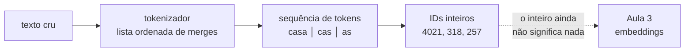
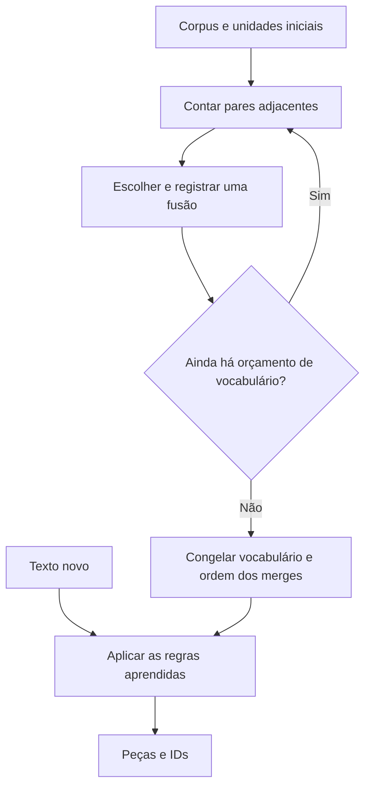
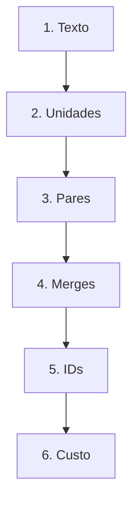

# Especificação de slides — Aula 2 (V2)

> **Rebalanceamento V2.** O fluxo principal abre pelo comportamento observável e usa a
> matemática como fundamento nomeado. Toda derivação está na Parte 2, mais detalhada do que
> estava na V1. Nada de matemática foi perdido — foi realocado.
>
> **A mudança estrutural desta aula.** Na V1, o slide 6 conduzia os três merges do BPE à mão,
> no quadro: o aluno acompanhava a execução do algoritmo passo a passo. Isso é exatamente o
> que o contrato manda mover — e ele foi para **A.1**, agora com cinco merges, a codificação
> de uma palavra nova, o desempate e a contagem de custo. O que o fluxo mantém é o
> **resultado** (o tokenizador treinado é uma lista ordenada de merges) e o **número medido**
> (a demo roda o mini-BPE e imprime a mesma lista). A execução saiu do quadro e virou saída de
> terminal.

<!-- SLIDE-FLOW:GUIDE:BEGIN -->
## Fluxogramas na produção dos slides

As orientações abaixo complementam o campo **Visual** dos slides indicados. Produzir os fluxogramas no próprio deck, como formas e conectores editáveis ou gráficos vetoriais; a biblioteca completa ao final torna esta especificação independente do portal.

- **Referência de composição:** título e propósito no topo, blocos numerados, conexões rotuladas, ramificações legíveis e uma saída identificada. Usar apenas o padrão visual da referência fornecida, sem importar seu assunto ou seus exemplos.
- **Tema do deck:** manter o fundo escuro e a paleta já especificada para a aula. Usar `#5b8cff` para o trecho ativo, tons neutros para o contexto e `#e2231a` conforme o significado definido no deck. Cor sempre acompanhada de rótulo.
- **Leitura:** entrada no topo ou à esquerda; saída na base ou à direita. Decisões em losangos, alternativas com rótulos e retornos apontando à etapa correta. Ramos paralelos convergem apenas onde seus resultados realmente são combinados.
- **Densidade:** no fluxo principal, projetar 3–6 blocos curtos por enquadramento, com corpo legível na última fileira. Um mapa maior pode ser revelado por etapas no mesmo slide. Detalhes, condições e explicações completas ficam nas notas; não reduzir a fonte para caber tudo.
- **Semântica:** mapas de percurso mostram ordem de estudo, não execução de um algoritmo. Manter separadas preparação e aplicação, treino e inferência, sequência e alternativas. Não transformar uma etapa opcional em obrigatória.
- **Integração:** o fluxograma substitui uma lista redundante ou ocupa o campo Visual; não cobre matrizes, tabelas, gráficos nem código indispensáveis. Preservar títulos, numeração, duração e referências aos apêndices.
- **Produção:** os blocos Mermaid abaixo são especificações do desenho. Renderizar/reconstruir como diagrama, nunca projetar o código Mermaid. Manter rótulos, bifurcações, retornos e limites declarados. Não transformar este caderno técnico em slides adicionais.
- **Ligação com o portal:** os mapas de mecanismo compartilham o conteúdo dos fluxogramas do portal. Em demonstrações, usar o mesmo vocabulário no deck e no controle interativo para facilitar a passagem entre os dois.
<!-- SLIDE-FLOW:GUIDE:END -->

## Diretrizes visuais

- **Tema:** escuro, accent `#e2231a` (vermelho CESAR), accent secundário `#5b8cff`.
- **Tipografia:** sans-serif para texto; monoespaçada para código, fórmulas, tokens e nomes de algoritmo.
- **Densidade:** máximo 5 linhas de texto por slide no fluxo. Um conceito por slide.
- **Convenção desta aula:** todo token exibido aparece em monoespaçada com fronteira visível —
  usar `│` entre tokens ou caixas contíguas. O aluno tem que **ver o corte**, não deduzir onde
  ele caiu.
- **No fluxo principal:** fórmula aparece **enunciada e lida**, nunca manipulada. Toda fórmula
  vem acompanhada de um número concreto ou de um comportamento que ela prevê.
- **No apêndice:** densidade alta é esperada e desejável. É material de consulta.
- **Proibido:** bullets genéricos; slide-parede de texto; clipart; gráfico sem eixo rotulado;
  fórmula sem consequência prática no fluxo.

## Arco narrativo

O deck abre por uma fatura: dois times, o mesmo produto, o mesmo modelo, e a conta de um deles
é um terço maior. Ninguém mudou o modelo — mudou a língua. Do sintoma saem outros três, e os
quatro têm a mesma causa: alguém decidiu o que conta como um token, antes do treino, e
congelou a decisão dentro do modelo.

O primeiro bloco fecha o cerco pelos extremos — palavra não serve, caractere não serve — e
apresenta o subword como o compromisso, com o BPE **enunciado pelo que ele produz** (uma lista
ordenada de merges) em vez de executado no quadro. O segundo bloco cobra a fatura em quatro
moedas: compute quadrático, números e código quebrados, fertilidade do português e dinheiro de
API. O último slide devolve a resposta da pergunta dirigida da Aula 1 — perplexidade é por
token — e entrega ao próximo tema o problema que sobrou: o texto agora é uma sequência de
inteiros que ainda não significam nada.

---

# PARTE 1 — FLUXO PRINCIPAL

*O que se apresenta em aula. 14 slides, 120 minutos com demo e exercício.*

### Slide 1 — O sintoma: a mesma feature, duas faturas
- **Tipo:** problema (abertura)
- **Título:** Ninguém mudou o modelo. A conta subiu um terço.
- **Conteúdo:** Dois times, o mesmo produto, o mesmo modelo, o mesmo prompt de sistema. O time
  que atende em inglês e o time que atende em português. Fim do mês, a fatura do segundo é
  visivelmente maior — e a janela de contexto dele estoura primeiro, com documentos do mesmo
  tamanho. Nenhum dos dois trocou de modelo, de temperatura ou de arquitetura. O que mudou foi
  a **contagem de tokens** do mesmo conteúdo.
- **Frase-tese:** Ninguém mudou o modelo. Alguém decidiu, antes do treino, o que conta como um
  token — e essa decisão está na fatura todo mês.
- **Visual:** duas faturas estilizadas lado a lado, mesmo cabeçalho de produto, o total da
  segunda destacado em accent. Abaixo, o mesmo parágrafo em PT e em EN partido por réguas
  verticais em pedaços desiguais, com a fita de PT visivelmente mais longa. Sem número exato —
  o número aparece medido na demo.
- **Notas do apresentador:** Não abrir o terminal. A demo é só depois do intervalo, e o número
  da razão PT/EN é medido lá — não antecipar valor. Se o cache dos tokenizadores não foi
  preparado na véspera, começar o download agora em segundo plano.

### Slide 2 — Quatro sintomas, uma causa
- **Tipo:** dados (o cerco)
- **Título:** Os quatro têm o mesmo culpado
- **Conteúdo:** Os quatro comportamentos observáveis que a aula vai explicar, e um deles é
  dívida da aula passada:
  1. **Dinheiro e janela** — o mesmo conteúdo em português custa mais tokens que em inglês
  2. **Palavra longa** — `inconstitucionalissimamente` sai em seis pedaços num tokenizador e em
     dois no outro
  3. **Código** — um arquivo Python bem indentado gasta uma fração do orçamento de contexto em
     espaço em branco, e o assistente trunca o arquivo antes do fim
  4. **A dívida da Aula 1** — perplexidade de dois modelos só é comparável com o mesmo
     tokenizador. Por quê?
  Tese: o token não é um dado da natureza. É uma decisão de engenharia congelada antes do
  treino, e ela não muda depois.
- **Frase-tese:** Perplexidade é medida por token. Se dois modelos não concordam sobre o que é
  um token, eles não estão dividindo pela mesma coisa.
- **Visual:** quatro cartões numerados, o quarto em moldura de accent com o selo "resposta no
  slide 14". Os três primeiros com uma miniatura do sintoma (fita de tokens, palavra partida,
  bloco de código com espaços destacados).
- **Notas do apresentador:** Esperar 15 s de silêncio pela resposta do item 4. Se alguém
  acertar, reaproveitar a fala dele no slide 14. Deixar os quatro cartões na tela enquanto
  anuncia o plano da aula: primeiro bloco, de onde o token vem; segundo bloco, o que a decisão
  custa.

### Slide 3 — Por que a intuição não basta: "então usa palavra"
- **Tipo:** conceito
- **Título:** A lista que nunca fecha
- **Conteúdo:** O caminho ingênuo e os três motivos independentes que o derrubam:
  1. **Vocabulário aberto** — nome próprio, neologismo, URL, hashtag, identificador, erro de digitação
  2. **Morfologia** — `correr` · `corri` · `correríamos` · `correndo` · `corrida` = cinco itens
     sem relação declarada entre eles
  3. **Zipf** — cauda longa praticamente infinita; o que cai fora vira `UNK`, e `UNK` apaga
     informação de forma irreversível
  E o contra-argumento desarmado: "então faz um vocabulário maior" — a cauda não termina, e cada
  item custa `d` parâmetros de embedding mais uma linha no softmax de saída, para uma palavra
  que continua com três exemplos de treino.
- **Frase-tese:** Palavra não serve porque a lista nunca fecha. E quando ela não fecha, o que
  sobra é `UNK` — um buraco no meio da frase que o modelo não tem como preencher.
- **Visual:** curva de Zipf com eixos rotulados (rank × frequência), com a área da cauda
  hachurada em accent e a legenda "aqui mora `UNK`". Ao lado, as cinco formas de `correr` como
  cinco caixas separadas, sem nenhuma linha ligando uma à outra.
- **Notas do apresentador:** Se surgir stemming/lematização: resolve parte da morfologia, perde
  tempo e pessoa, não resolve nome próprio nem URL. Não abrir o fio — custa 5 min e não muda o
  argumento.

### Slide 4 — O outro extremo: caractere
- **Tipo:** comparação
- **Título:** Zero OOV, sequência cinco vezes mais longa
- **Conteúdo:** O que se ganha e o que se paga:
  - **Ganha:** vocabulário de dezenas de símbolos; zero OOV; qualquer string representável
  - **Paga (capacidade):** o modelo gasta camadas aprendendo ortografia antes de chegar a semântica
  - **Paga (compute):** a atenção compara cada posição com todas as outras — o termo de atenção
    cresce com o **quadrado** do número de posições
  - **Honestidade:** caractere é competitivo em correção ortográfica, transliteração e línguas
    sem espaço; e existe um nível abaixo, o byte
- **Frase-tese:** É a diferença entre ler uma frase e ler a mesma frase soletrada. A informação
  é a mesma, o esforço não.
- **Visual:** a mesma frase em duas faixas empilhadas — em cima partida por palavra, embaixo
  partida por caractere — com as duas contagens de posição em números grandes à direita. A
  faixa de baixo transbordando a margem do slide, de propósito.
- **Fundamento:** o custo por camada tem dois termos, `O(n·d²)` nas projeções e feed-forward e
  `O(n²·d)` na atenção; qual domina depende de `n` contra `d`, e é isso que decide se encurtar
  a sequência compra ganho linear ou quadrático.
  → contagem completa dos dois termos e o regime em que cada um domina: **Apêndice A.5** (slide 19)
- **Notas do apresentador:** **Não** derivar a conta aqui — é o slide 10, e a contagem completa
  está em A.5. Se alguém pedir agora, prometer para depois do intervalo e cumprir.

### Slide 5 — Subword: o compromisso
- **Tipo:** conceito
- **Título:** Vocabulário fechado, cobertura aberta
- **Conteúdo:** A regra em três linhas:
  - Palavra frequente → um token inteiro
  - Palavra rara → decomposta em pedaços já conhecidos
  - `|V|` fixo (tipicamente 30k–128k) e **zero OOV**, porque no pior caso desce até os símbolos base
  - A pergunta que abre o próximo slide: quem decide quais pedaços entram no vocabulário?
- **Frase-tese:** Palavra frequente vira um token, palavra rara vira pedaços. Vocabulário
  fechado, cobertura aberta.
- **Visual:** eixo horizontal único, com "caractere" numa ponta e "palavra" na outra, e uma
  faixa em accent no meio rotulada "subword". Sobre o eixo, três exemplos posicionados onde
  caem: `casa` (perto de palavra), `cas`+`inha` (meio), `ç`+`ã`+`o` (perto de caractere).
- **Notas do apresentador:** Slide de dobradiça, 4 min no máximo. O tempo pertence ao slide 6 e
  à demo.

### Slide 6 — O que o BPE produz: uma lista ordenada de merges

<!-- SLIDE-FLOW:SLIDE:BEGIN -->
- **Fluxograma a incorporar neste slide:** **F00 — BPE: aprender e depois aplicar**. O desenho e os rótulos completos estão no caderno de fluxogramas ao final deste arquivo.
- **Composição:** integrar ao campo Visual; preservar exemplos, tabelas, fórmulas e dimensões solicitados neste slide. Destacar o trecho relacionado ao título e manter o restante em segundo plano. Os textos detalhados ficam nas notas, sem duplicar a lista de Conteúdo na tela.
<!-- SLIDE-FLOW:SLIDE:END -->

- **Tipo:** conceito (o fundamento nomeado)
- **Título:** O tokenizador treinado não é um dicionário. É uma lista ordenada.
- **Conteúdo:** O algoritmo **nomeado**, em quatro operações e uma linha cada, sem execução:
  ```
  vocabulário inicial   =  símbolos base (caracteres ou bytes)
  contagem              =  todos os pares adjacentes, ponderados pela frequência da palavra
  fusão                 =  o par mais frequente vira um símbolo novo
  repetição             =  até atingir o |V| alvo
  ```
  E o **resultado** sobre o mini-corpus `casa`×5 · `casas`×3 · `casinha`×2 · `casarão`×1, que a
  demo vai imprimir na tela:
  ```
  lista aprendida:   a+s → as   ·   c+as → cas   ·   cas+a → casa
  segmentação:       casa │       casas → cas│as       casinha → cas│i│n│h│a
  ```
  Três fusões e a palavra mais frequente virou um token único, enquanto `casinha` continua em
  cinco pedaços — que é exatamente o comportamento pedido no slide anterior. Duas consequências
  que valem mais que o algoritmo: **treino é uma vez, codificação é sempre**; e a ordem da lista
  importa, porque codificar é aplicar os merges na ordem em que foram aprendidos.
- **Frase-tese:** O tokenizador treinado não é um dicionário de palavras. É uma lista ordenada
  de merges — e codificar um texto novo é aplicar essa lista na ordem.
- **Visual:** à esquerda, as quatro operações em monoespaçada, sem números de contagem. À
  direita, a lista de três merges e a segmentação final das quatro palavras, com as fronteiras
  visíveis. Rodapé em accent secundário: "treino = construir a lista, uma vez · codificação =
  aplicar a lista, sempre". **Sem a tabela de contagens** — ela está no apêndice.
- **Fundamento:** a execução completa do algoritmo sobre este mini-corpus, com as contagens de
  cada rodada, o desempate, a codificação de uma palavra nova e a contagem de custo.
  → execução resolvida merge a merge: **Apêndice A.1** (slide 15)
- **Notas do apresentador:** **Ponto onde a V1 gastava 10 min de quadro.** Na V2 eu anuncio o
  que o algoritmo faz, mostro a lista que ele produziu e digo que a execução com as contagens
  está em A.1 — e a **demo roda o mini-BPE ao vivo** e imprime a mesma lista, o que substitui o
  quadro por uma medição. As duas perguntas que sempre vêm: "e se a palavra não estiver na
  lista?" (refazer a distinção treino × codificação) e "por que `casarão` corta no meio do
  radical?" (o critério é frequência, não morfologia — e isso é limitação real, não bug). Se
  pedirem as contagens, Parte 4, item 1.

### Slide 7 — Três algoritmos, três critérios de decisão
- **Tipo:** comparação
- **Título:** Frequência, verossimilhança, poda — e SentencePiece não é nada disso
- **Conteúdo:** Três blocos, cada um com o critério e a marca visível na saída:
  - **BPE** · funde o par **mais frequente** · saída sem marcador de fronteira obrigatório
  - **WordPiece** (BERT) · funde o par que mais aumenta a verossimilhança do corpus, o que
    equivale a maximizar `score(A,B) = freq(AB) / (freq(A) · freq(B))` — prefere pares que se
    **atraem**, não os que só são frequentes · marca continuação com `##`: `cas` + `##inha`
  - **Unigram** (Kudo) · começa grande e **poda** os itens cuja remoção custa menos
    verossimilhança · segmentação probabilística → permite amostrar segmentações
  - **SentencePiece** é **implementação**, não algoritmo: treina no texto cru, sem pré-tokenizar
    por espaço, representa o espaço como `▁`, detokeniza exato — e roda **BPE e Unigram**
- **Frase-tese:** BPE cola de baixo para cima, Unigram poda de cima para baixo. SentencePiece
  não é algoritmo nenhum — é a implementação que roda os dois.
- **Visual:** três colunas para os algoritmos, com duas setas verticais opostas ao fundo (uma
  subindo em BPE/WordPiece, uma descendo em Unigram). SentencePiece aparece **abaixo** das três,
  como uma faixa horizontal que atravessa duas delas — deixando visualmente óbvio que ele é de
  outra categoria.
- **Fundamento:** o `score` do WordPiece não é uma heurística arbitrária — ele é o ganho
  aproximado de log-verossimilhança de fundir o par, e o denominador é o que transforma
  "frequente" em "se atraem".
  → derivação do critério a partir da verossimilhança, com um par em que BPE e WordPiece
  **escolhem diferente**: **Apêndice A.2** (slide 16)
- **Fundamento (segundo):** o Unigram define uma distribuição sobre **segmentações**, escolhe a
  melhor por programação dinâmica e treina por maximização de verossimilhança com poda.
  → o modelo, a busca da melhor segmentação e o critério de poda: **Apêndice A.3** (slide 17)
- **Notas do apresentador:** Se o slide 6 estourou, comprimir para os três critérios e cortar o
  exemplo do `##`. A distinção SentencePiece × Unigram **não** pode cair — ela aparece em cartão
  de modelo e o aluno encontra na semana do Lab 1.

### Slide 8 — Byte-level BPE: o fim do UNK e o preço do acento

<!-- SLIDE-FLOW:SLIDE:BEGIN -->
- **Fluxograma a incorporar neste slide:** **F00 — BPE: aprender e depois aplicar**. O desenho e os rótulos completos estão no caderno de fluxogramas ao final deste arquivo.
- **Composição:** integrar ao campo Visual; preservar exemplos, tabelas, fórmulas e dimensões solicitados neste slide. Destacar o trecho relacionado ao título e manter o restante em segundo plano. Os textos detalhados ficam nas notas, sem duplicar a lista de Conteúdo na tela.
<!-- SLIDE-FLOW:SLIDE:END -->

- **Tipo:** conceito
- **Título:** 256 bytes: nada mais é OOV
- **Conteúdo:** A troca do GPT-2 e o seu preço:
  - Símbolos base = os **256 bytes**, não caracteres Unicode → emoji, ideograma, byte corrompido:
    tudo representável
  - O vocabulário do GPT-2 **não tem** token `UNK`, porque não precisa
  - Preço em UTF-8: ASCII = 1 byte · `ç` `ã` `õ` = **2 bytes cada** → `ção` entra como 5 símbolos
    base antes de qualquer merge
  - Se os merges vieram de corpus inglês, não existe merge para `ção` — a sequência de bytes
    fica exposta
  - **O problema não é o byte-level:** um BPE byte-level treinado em português tem merge para
    `ção`, `mente`, `ções`
- **Frase-tese:** O vocabulário do GPT-2 não tem `UNK` porque ele não precisa: tudo é byte. O
  preço é que cada acento nosso custa dois bytes antes de qualquer merge.
- **Visual:** a palavra `ação` explodida em bytes, cada byte numa caixa, com as caixas de `ç` e
  de `ã` emparelhadas e marcadas "2 bytes". Ao lado, a mesma palavra em inglês (`action`) com
  uma caixa por letra. Rodapé: "o corpus dos merges é a variável, não a técnica".
- **Notas do apresentador:** Intervalo de 10 min depois deste slide. Usar o intervalo para rodar
  o script uma vez em silêncio e confirmar o cache. Se algum tokenizador falhar, saber antes de
  voltar qual vai faltar na tela.

### Slide 9 — [Demo] Um texto, quatro tokenizadores

<!-- SLIDE-FLOW:SLIDE:BEGIN -->
- **Fluxograma a incorporar neste slide:** **F00 — BPE: aprender e depois aplicar**. O desenho e os rótulos completos estão no caderno de fluxogramas ao final deste arquivo.
- **Composição:** integrar ao campo Visual; preservar exemplos, tabelas, fórmulas e dimensões solicitados neste slide. Destacar o trecho relacionado ao título e manter o restante em segundo plano. Os textos detalhados ficam nas notas, sem duplicar a lista de Conteúdo na tela.
<!-- SLIDE-FLOW:SLIDE:END -->

- **Tipo:** transição para demonstração
- **Título:** Um texto, quatro tokenizadores
- **Frase-tese:** Eu não vou dizer quanto o português custa mais caro — eu vou medir na tela e a
  gente anota o número que aparecer.
- **Conteúdo:** Os quatro tokenizadores nomeados, em monoespaçada, e as quatro medições. Sem
  resultado — o resultado aparece ao vivo:
  ```
  gpt2                                  BPE byte-level
  bert-base-uncased                     WordPiece (EN)
  neuralmind/bert-base-portuguese-cased WordPiece (PT)
  xlm-roberta-base                      Unigram / SentencePiece
  ```
  Medições: (1) tokens literais PT e EN, com as peças visíveis · (2) fertilidade e **a razão
  PT/EN**, com desvio · (3) os casos difíceis — palavra longa, número, código, emoji ·
  (4) o mini-BPE do zero, imprimindo a **mesma lista de merges** do slide 6
- **Visual:** slide de transição, quase vazio. Uma área retangular em branco no centro, rotulada
  "aqui entra o terminal", esperando ser preenchida. As quatro medições numeradas em
  monoespaçada, a de número 2 em accent — é a que produz o número do exercício.
- **Notas do apresentador:** 12 min. Fonte do terminal grande. Passos na Parte 2 do roteiro. A
  medição 2 é a evidência dos slides 12 e 13 e é a que **não** se corta. A medição 4 é o
  substituto do quadro que a V1 usava no slide 6 — ela roda offline e é a última a cair.

### Slide 10 — A alavanca mais barata: 30% menos tokens
- **Tipo:** dados (fundamento aplicado a um custo)
- **Título:** Trinta por cento menos tokens, quarenta e nove por cento menos atenção
- **Conteúdo:** Os dois extremos e o número:
  - `|V|` **grande** → sequência curta, e paga em parâmetro: embedding `|V| · d` e uma linha de
    softmax por item, com os raros recebendo poucos exemplos
  - `|V|` **pequeno** → sequência longa, e paga na atenção, cujo termo cresce com `n²`
  - A conta: encurtar a sequência em 30% deixa o termo de atenção em `0,7² = 0,49` — praticamente
    metade
  - **A honestidade que a V1 não dizia:** o ganho quadrático só vale onde o termo de atenção
    domina, isto é, quando `n` é grande em relação a `d`. Em contexto curto, quem domina é o
    feed-forward, e o ganho é **linear**, não quadrático
  - E o erro clássico: o custo é **linear** no preço de API (a fatura conta token) e **quadrático**
    no compute da atenção — duas curvas diferentes
- **Frase-tese:** Trinta por cento menos tokens é quarenta e nove por cento menos custo de
  atenção — mas só no regime em que a atenção domina. Fora dele, o ganho é linear, e continua
  sendo a alavanca mais barata que existe.
- **Visual:** gráfico com eixos rotulados — eixo x `|V|`, dois eixos y opostos: "parâmetros de
  embedding" (linha crescente) e "custo do termo de atenção" (curva decrescente e convexa). O
  ponto de cruzamento marcado em accent, sem número no eixo (é qualitativo e o slide diz isso).
  Ao lado, `0,7² = 0,49` em monoespaçada grande, e abaixo, em texto menor, a razão `n/d` como
  o interruptor entre os dois regimes.
- **Fundamento:** o custo por camada é `O(n·d²)` nas projeções e no feed-forward mais `O(n²·d)`
  na atenção; a razão entre os dois termos é `n/d`, e encurtar a sequência por um fator `ρ`
  multiplica o primeiro termo por `ρ` e o segundo por `ρ²`.
  → contagem termo a termo, o regime de cada um e a conta da memória: **Apêndice A.5** (slide 19)
- **Notas do apresentador:** Fazer `0,7² = 0,49` no quadro — é uma conta de dois segundos que a
  sala inteira acompanha. **Não** derivar a contagem de operações: ela está em A.5, com o
  número em que `n = d` e a razão vira 1. Contexto de 1M de tokens e KV cache são a Aula 8 —
  não abrir.

### Slide 11 — Onde a frequência produz efeito colateral
- **Tipo:** comparação
- **Título:** Números que somam errado e código que estoura o contexto
- **Conteúdo:** Três casos, cada um com o mecanismo e a mitigação:
  - **Números** · `2024` pode ser 1 token e `2027` sair como `20`+`27` → aritmética sobre pedaços
    arbitrários · mitigação: forçar dígito isolado ou grupos de três
  - **Código** · runs de indentação custam tokens se o vocabulário não tem tokens de espaço em
    branco; o sintoma observável é o assistente **truncando o arquivo antes do fim** ·
    mitigação: tokens dedicados a 4, 8, 16 espaços
  - **Línguas com poucos recursos** · corpus dos merges dominado pelo inglês → pedaços de 1–2
    caracteres → fertilidade alta (a mesma mecânica do português, mais severa)
  - **O erro:** atribuir ao modelo o déficit que é do tokenizador — é diagnosticável **antes**
    de treinar e não se corrige com mais dados
- **Frase-tese:** Quando o modelo erra uma soma, parte da culpa pode ser de quem cortou o número
  em dois. E isso é diagnosticável antes de treinar qualquer coisa.
- **Visual:** três faixas horizontais, uma por caso, cada uma mostrando a segmentação real com
  fronteiras visíveis: os dois anos cortados de formas diferentes; um bloco de código com os
  espaços de indentação destacados em accent e a contagem de tokens gastos em espaço; uma frase
  em português com os pedaços de 1–2 caracteres marcados.
- **Notas do apresentador:** Os três casos já apareceram na medição 3 da demo — **apontar de
  volta para o terminal** em vez de descrever. Se a demo falhou, este slide vira o substituto
  dela e ganha os minutos que sobraram.

### Slide 12 — Fertilidade: o número que vira dinheiro e janela
- **Tipo:** dados
- **Título:** A janela é medida em tokens, não em palavras
- **Conteúdo:** A medida, as causas e as duas consequências:
  - **Fertilidade** = tokens por palavra. Razão PT/EN sobre corpus paralelo: **acima de 1** — o
    valor é o medido na demo, anotado no quadro
  - Três causas somadas: corpus dos merges majoritariamente inglês · acentos = 2 bytes em
    byte-level · palavras mais longas e mais flexionadas
  - **Dinheiro:** cobrança por token na entrada e na saída → o mesmo conteúdo sai mais caro,
    toda chamada. É a fatura do slide 1
  - **Janela:** a janela é medida em tokens → **cabe menos conteúdo**; o documento em PT consome
    mais janela que a tradução dele
  - **Não é "escrever tudo em inglês":** tem custo de manutenção e de fidelidade ao domínio. A
    alavanca é escolher modelo/tokenizador da língua e **medir antes de decidir**
- **Frase-tese:** A janela é medida em tokens, não em palavras. O mesmo documento em português
  ocupa mais janela do que a tradução dele — é a mesma bagagem numa mala menor.
- **Visual:** tabela de fertilidade com os quatro tokenizadores nas linhas e três colunas — PT,
  EN, razão — com **as células de valor em branco**, para o instrutor preencher à mão com o que
  a demo mediu. Ao lado, duas malas de tamanhos diferentes com a mesma pilha de roupa ao lado
  de cada uma.
- **Fundamento:** fertilidade é propriedade do **par** tokenizador × texto, não do tokenizador;
  e a razão média das razões par a par **não é** a razão dos totais — a segunda é uma média
  ponderada por comprimento, e as duas divergem quando os pares têm tamanhos diferentes.
  → definição formal, as duas médias, o desvio e a propagação para custo e janela:
  **Apêndice A.4** (slide 18)
- **Notas do apresentador:** O número medido tem que estar no quadro desde a demo. Se a demo
  falhou, conduzir com a razão como variável `r` e o valor como `[medir no Lab 1]` — **nunca
  inventar**. A distinção entre as duas médias é o erro nº 1 do Checkpoint 2 do Lab 1; vale
  dizer em uma frase e remeter a A.4.

### Slide 13 — [Exercício] Três faturas, três diagnósticos
- **Tipo:** exercício
- **Título:** Em dupla, 8 minutos: qual é a causa, e que conta confirma
- **Conteúdo:** Três situações reais. Para cada uma: qual é a causa provável e **que conta
  confirmaria**.
  1. Um time atende em português e em inglês com o mesmo produto e o mesmo modelo. A fatura do
     lado português é visivelmente maior, e ninguém mudou nada no código.
  2. Uma conversa de suporte com 20 turnos custou **muito** mais que 20 vezes um turno. O time
     dimensionou o orçamento por "custo de um turno × número de turnos" e errou por mais de uma
     ordem de grandeza.
  3. Um assistente com janela de 8 mil tokens funciona bem em texto corrido e **trunca** arquivos
     de código pela metade, mesmo com arquivos que têm menos palavras que os documentos.
  Hipótese declarada do exercício: `US$ 0,50 por milhão de tokens de entrada`. Não é o preço de
  nenhum provedor real — o valor da oferta é `[definir na oferta]`.
- **Frase-tese:** Nenhuma das três se resolve decorando fórmula. As três se resolvem sabendo que
  conta fazer — e a do item dois aparece na fatura no fim do mês.
- **Visual:** os três sintomas como cartões, cada um com espaço para "causa" e "conta que
  confirma". A linha da hipótese de preço em moldura de accent, separada dos itens. Cronômetro
  de 8 min no canto.
- **Notas do apresentador:** Condução na Parte 3 do roteiro. Dizer em voz alta que o preço é
  hipótese. O item 2 é o que merece os minutos da correção: a resposta é a soma dos prefixos,
  `1+2+…+20 = 210` blocos de histórico, não 20. A conta manual do prompt de 300 palavras nas
  duas línguas virou **extensão opcional** — quem terminar antes faz.

### Slide 14 — Fechamento: perplexidade é por token

<!-- SLIDE-FLOW:SLIDE:BEGIN -->
- **Fluxograma a incorporar neste slide:** **F01 — O percurso desta aula**. O desenho e os rótulos completos estão no caderno de fluxogramas ao final deste arquivo.
- **Composição:** integrar ao campo Visual; preservar exemplos, tabelas, fórmulas e dimensões solicitados neste slide. Destacar o trecho relacionado ao título e manter o restante em segundo plano. Os textos detalhados ficam nas notas, sem duplicar a lista de Conteúdo na tela.
<!-- SLIDE-FLOW:SLIDE:END -->

- **Tipo:** encerramento
- **Título:** Perplexidade é por token — a resposta da semana passada
- **Conteúdo:** A fórmula **enunciada**, as duas coisas que mudam, e a normalização honesta:
  ```
  PPL = exp(−(1/N) Σ log P(tᵢ | t₍<ᵢ₎))     com N = número de tokens
  ```
  - Muda `N`: o mesmo texto tem contagens diferentes de token — **medido na demo**
  - Muda o espaço de eventos: `P` está definida sobre o vocabulário **daquele** tokenizador —
    prever pedaço curto é tarefa diferente de prever pedaço longo
  - Logo: não é comparação imprecisa, é comparação **sem sentido**
  - Alternativa honesta: normalizar por unidade invariante — **bits por caractere** ou por byte
  - O erro de quem quase acerta: reescalar a perplexidade pela razão de fertilidade não resolve.
    A relação é uma **potência**, não um fator — e mesmo corrigida, a tarefa mudou
- **Frase-tese:** O token é uma decisão de engenharia congelada antes do treino. Ela define
  quanto vocês pagam, quanto texto cabe e se a métrica de dois modelos pode ser comparada.
- **Visual:** duas metades. Topo: a fórmula grande, com o `N` circulado em accent e uma seta
  apontando para a contagem de tokens medida na demo. Base: a ponte para a Aula 3 — a frase
  tokenizada virando uma fita de inteiros (`[4021, 318, 257, …]`) com um ponto de interrogação
  sobre a fita. Num canto discreto, o índice do apêndice: A.1 BPE resolvido · A.2 WordPiece ·
  A.3 Unigram · A.4 fertilidade · A.5 custo `O(n²)` · A.6 perplexidade. Rodapé: "Aula 3 —
  Embeddings: o ID 4021 não é parecido com o 4020. O que faz um inteiro significar algo?"
- **Fundamento:** com o mesmo texto, a perplexidade de um tokenizador é a do outro **elevada** à
  razão dos números de tokens — e a única normalização comparável é por caractere ou por byte.
  → a conta, o exemplo numérico e o que exatamente é invariante: **Apêndice A.6** (slide 20)
- **Notas do apresentador:** Escrever a fórmula no quadro ao lado do número de fertilidade
  medido, e deixar as duas coisas juntas — é o argumento fechando visualmente. Projetar o índice
  do apêndice por 20 s antes de encerrar: A.6 é a resposta escrita da pergunta dirigida da Aula
  1, e A.1 é a execução do BPE que na V1 era feita no quadro com pressa. Terminar 02:00. Se
  atrasou, cortar a recapitulação e proteger a ponte para a Aula 3.



---

# PARTE 2 — APÊNDICE MATEMÁTICO

*Material de estudo e consulta. Não se apresenta em aula: reconstrói, com rigor completo, todo
fundamento citado no fluxo. Autossuficiente — quem estuda por aqui sem ter assistido à aula
consegue reconstruir tudo.*

### Slide 15 — A.1 · O algoritmo do BPE, resolvido merge a merge

<!-- SLIDE-FLOW:SLIDE:BEGIN -->
- **Fluxograma a incorporar neste slide:** **F00 — BPE: aprender e depois aplicar**. O desenho e os rótulos completos estão no caderno de fluxogramas ao final deste arquivo.
- **Composição:** integrar ao campo Visual; preservar exemplos, tabelas, fórmulas e dimensões solicitados neste slide. Destacar o trecho relacionado ao título e manter o restante em segundo plano. Os textos detalhados ficam nas notas, sem duplicar a lista de Conteúdo na tela.
<!-- SLIDE-FLOW:SLIDE:END -->

- **Tipo:** apêndice — execução completa com mini-corpus
- **Invocado em:** slide 6

**Notação.**
`Σ₀` — conjunto de símbolos base (caracteres, ou os 256 bytes).
`W` — o corpus, dado como um multiconjunto de palavras com frequências: `W = {(w, f(w))}`.
`s(w)` — a sequência de símbolos atual da palavra `w`. No início, `s(w)` é `w` partida em `Σ₀`.
`c(A,B)` — contagem ponderada do par adjacente `(A,B)`:
```
c(A,B) = Σ_{w ∈ W} f(w) · (número de ocorrências adjacentes de A,B em s(w))
```
`M = [m₁, m₂, …, m_k]` — a **lista ordenada de merges**, que é o modelo treinado.
`|V| = |Σ₀| + k` — o tamanho final do vocabulário; escolher `|V|` é escolher `k`.

**Premissas.** (i) A fronteira de palavra é conhecida no treino, e merges **não atravessam**
fronteira de palavra (implementações reais marcam a fronteira com `</w>` ou `▁`; aqui a marca é
omitida para o exemplo ficar legível, e o script da demo omite igual para bater com este
apêndice); (ii) as frequências vêm de um corpus fixo — trocar o corpus troca a lista, e é essa
a variável que explica o português caro do slide 12; (iii) o desempate entre pares de contagem
igual é decidido pela implementação, e o caso-limite abaixo trata disso.

**O algoritmo.**
```
1.  s(w) ← w partida em símbolos de Σ₀,  para toda palavra w
2.  M ← []
3.  repita k vezes:
4.      calcule c(A,B) para todos os pares adjacentes
5.      (A*,B*) ← argmax c(A,B)
6.      M ← M + [(A*,B*)]
7.      em toda s(w), substitua cada ocorrência adjacente de A*B* pelo símbolo novo A*B*
```

**Mini-corpus.** `casa`×5 · `casas`×3 · `casinha`×2 · `casarão`×1. Estado inicial:
```
casa      c a s a          f = 5
casas     c a s a s        f = 3
casinha   c a s i n h a    f = 2
casarão   c a s a r ã o    f = 1
```

**Rodada 1 — contagem completa.** Cada palavra contribui com seus pares adjacentes, multiplicados
pela frequência. Note que `casas` contém `(a,s)` **duas** vezes:
```
par        de casa(5)   de casas(3)   de casinha(2)   de casarão(1)   total
(c,a)          5             3              2               1          11
(a,s)          5           3×2 = 6          2               1          14   ← máximo
(s,a)          5             3              0               1           9
(s,i)          0             0              2               0           2
(i,n)          0             0              2               0           2
(n,h)          0             0              2               0           2
(h,a)          0             0              2               0           2
(a,r)          0             0              0               1           1
(r,ã)          0             0              0               1           1
(ã,o)          0             0              0               1           1
```
**Merge 1: `a`+`s` → `as`** (contagem 14). Estado depois:
```
casa      c as a           casas     c as as
casinha   c as i n h a     casarão   c as a r ã o
```

**Rodada 2.**
```
par         total
(c,as)      5 + 3 + 2 + 1 = 11   ← máximo
(as,a)      5 + 1 = 6
(as,as)     3
(as,i)      2      (i,n) 2      (n,h) 2      (h,a) 2
(a,r)       1      (r,ã) 1      (ã,o) 1
```
**Merge 2: `c`+`as` → `cas`** (contagem 11). Estado depois:
```
casa      cas a            casas     cas as
casinha   cas i n h a      casarão   cas a r ã o
```

**Rodada 3.**
```
par         total
(cas,a)     5 + 1 = 6      ← máximo
(cas,as)    3
(cas,i)     2      (i,n) 2      (n,h) 2      (h,a) 2
(a,r)       1      (r,ã) 1      (ã,o) 1
```
**Merge 3: `cas`+`a` → `casa`** (contagem 6). Estado depois:
```
casa      casa             (1 token)
casas     cas as           (2 tokens)
casinha   cas i n h a      (5 tokens)
casarão   casa r ã o       (4 tokens)
```

**Rodada 4** — a que a V1 não chegava a fazer, e que mostra o comportamento se estabilizando:
```
par         total
(cas,as)    3              ← máximo
(cas,i)     2      (i,n) 2      (n,h) 2      (h,a) 2
(casa,r)    1      (r,ã) 1      (ã,o) 1
```
**Merge 4: `cas`+`as` → `casas`**. Agora `casas` também é 1 token.

**Rodada 5 — o empate.** As contagens restantes são `(cas,i) = (i,n) = (n,h) = (h,a) = 2` e três
pares de contagem 1. Há um **empate quádruplo** no topo. O algoritmo, como enunciado, não define
o vencedor: `argmax` sobre um conjunto com empate é ambíguo. Implementações resolvem por
critério fixo e determinístico — ordem lexicográfica do par, ou a primeira ocorrência na
varredura. A consequência prática é real: **duas implementações corretas do BPE, treinadas no
mesmo corpus, podem produzir listas de merges diferentes**, e portanto tokenizações diferentes.
É por isso que o tokenizador viaja **junto** com o modelo, como arquivo, e não é reconstruído a
partir do corpus.

**Lista final aprendida (o modelo).**
```
M = [ (a,s) , (c,as) , (cas,a) , (cas,as) ]        |V| = |Σ₀| + 4
```

**Codificação de uma palavra nova — o que "aplicar a lista na ordem" significa.**
Codificar `casinhas`, que não está no corpus de treino. Começa em símbolos base:
```
c a s i n h a s
```
Aplicar `M` **na ordem**, cada merge exaustivamente antes de passar ao próximo:
```
m₁ = (a,s) → as :   as ocorre em duas posições (2-3 e 7-8)
                    c as i n h as
m₂ = (c,as) → cas :  c as → cas
                    cas i n h as
m₃ = (cas,a) → casa : não há par (cas,a) — o símbolo depois de cas é i.  sem efeito
m₄ = (cas,as) → casas : não há par (cas,as) adjacente.                   sem efeito
```
Resultado: `cas │ i │ n │ h │ as` — **5 tokens**.

*Leitura, e é o ponto que a aula cravou:* `casas` custa **1** token e `casinhas` custa **5**,
com o mesmo tokenizador e a mesma raiz. Não há inteligência aqui: `casas` estava frequente no
corpus de treino e `casinhas` não. E note que a ordem importa — se `m₃` viesse antes de `m₁`,
a segmentação de várias palavras mudaria. A lista é ordenada porque o algoritmo é sequencial, e
a codificação **precisa** respeitar a mesma ordem para reproduzir o treino.

**Casos-limite.**
- **Palavra fora do vocabulário.** Não existe. No pior caso a palavra desce até os símbolos de
  `Σ₀`, que estão todos no vocabulário. É a propriedade que elimina o `UNK`.
- **`k` grande demais.** Quando não há mais pares com contagem maior que 1, merges seguintes
  passam a memorizar palavras específicas do corpus de treino. Isso incha `|V|` sem encurtar
  texto novo — o retorno de cada merge é decrescente, e A.5 diz por quê (é Zipf).
- **Empate.** Tratado acima: o desempate é da implementação, não do algoritmo.
- **`Σ₀` = bytes.** Aí `|Σ₀| = 256` e nenhum texto é inexprimível, nem emoji nem byte
  corrompido — é o slide 8. O preço é que uma letra acentuada em UTF-8 entra como **dois**
  símbolos base, então precisa de merge só para virar uma letra.
- **Corpus com uma língua só.** A lista fica ótima para aquela língua e ruim para as outras. O
  algoritmo não tem culpa; o corpus tem.

**Custo.**
*Treino.* A versão ingênua recalcula todas as contagens a cada rodada: `O(k · N)`, com `N` o
número total de símbolos do corpus. Implementações reais mantêm um índice de pares por palavra e
uma fila de prioridade, atualizando só as palavras afetadas pelo merge escolhido.
*Codificação.* A versão ingênua aplica os `k` merges varrendo a palavra a cada um: `O(k · |w|)`
por palavra. Implementações reais indexam os merges por par e processam com fila de prioridade,
o que dá aproximadamente `O(|w| log |w|)`. É por isso que tokenizar um corpus grande é rápido
mesmo com vocabulários de 100 k.

**Intuição.** BPE é compressão com dicionário, com uma diferença: o dicionário é **congelado**
no fim do treino e sai de fábrica dentro do modelo. O que repete no corpus de treino ganha um
código curto; o que não repete é gasto pedaço por pedaço, para sempre.

**Referência.** Sennrich, Haddow & Birch, *Neural Machine Translation of Rare Words with
Subword Units* (arXiv 1508.07909).

**De volta ao fluxo:** slide 6.

### Slide 16 — A.2 · WordPiece: de verossimilhança a `freq(AB)/(freq(A)·freq(B))`
- **Tipo:** apêndice — derivação do critério
- **Invocado em:** slide 7

**O que se quer demonstrar.** Que o `score` do WordPiece não é heurística arbitrária: ele é o
ganho aproximado de log-verossimilhança do corpus ao fundir um par, sob um modelo unigrama — e
que o denominador é exatamente o que troca "frequente" por "se atraem".

**Notação.** Vocabulário corrente `V`; `c(x)` a contagem do token `x` no corpus segmentado;
`N = Σ_{x ∈ V} c(x)` o total de tokens. Um **modelo unigrama** atribui a cada token a
probabilidade de máxima verossimilhança `p(x) = c(x)/N`.

**Premissas.** (i) O corpus é tratado como saco de tokens independentes — é a premissa unigrama,
e ela é falsa como modelo de língua, mas basta como critério de seleção de merge; (ii) o efeito
de um merge sobre as contagens dos **outros** tokens é desprezado, o que é a aproximação que
torna o critério calculável em tempo razoável.

**Log-verossimilhança do corpus.** Sob o modelo unigrama:
```
L(V) = Σ_{x ∈ V} c(x) · log p(x) = Σ_{x ∈ V} c(x) · log ( c(x) / N )
```

**O efeito de fundir `A` e `B`.** Seja `c(AB)` o número de ocorrências adjacentes de `A` seguido
de `B`. Fundir cria um token novo `AB` com contagem `c(AB)`, e reduz as contagens de `A` e `B`
em `c(AB)` cada. O total de tokens cai de `N` para `N' = N − c(AB)`.

Considerando apenas os termos afetados e tratando `N ≈ N'` (segunda premissa), o ganho de
log-verossimilhança é:
```
ΔL ≈ c(AB) · log p(AB)  −  c(AB) · log p(A)  −  c(AB) · log p(B)
   = c(AB) · log [ p(AB) / ( p(A) · p(B) ) ]
```
Substituindo `p(x) = c(x)/N`:
```
ΔL ≈ c(AB) · log [ ( c(AB)/N ) / ( (c(A)/N) · (c(B)/N) ) ]
   = c(AB) · log [ c(AB) · N / ( c(A) · c(B) ) ]
```

*Leitura.* O termo dentro do logaritmo é exatamente a **informação mútua pontual** entre `A` e
`B`, e o fator `c(AB)` fora é o número de vezes que aquele ganho se realiza. Ou seja: o
WordPiece escolhe o par que combina **quanto o par surpreende** com **quantas vezes ele
aparece**. Descartando o fator `N`, que é o mesmo para todos os pares na mesma rodada, o critério
usualmente escrito é
```
score(A,B) = c(AB) / ( c(A) · c(B) )
```
que é a expressão do slide 7. ∎

**A diferença de comportamento, com números.** Considere duas rodadas candidatas num corpus em
português:
```
par        c(AB)     c(A)      c(B)       BPE: c(AB)     WordPiece: c(AB)/(c(A)·c(B))
(d,e)      4.000     9.000     30.000        4.000        4.000/(9.000·30.000)  = 1,48·10⁻⁸
(q,u)        900       910      6.000          900          900/(910·6.000)      = 1,65·10⁻⁷
```
**BPE funde `(d,e)`**, porque `4.000 > 900`. **WordPiece funde `(q,u)`**, porque
`1,65·10⁻⁷` é **11 vezes** maior que `1,48·10⁻⁸`.

*Por que a escolha do WordPiece é defensável aqui.* `d` e `e` são frequentíssimos
individualmente; ver os dois juntos não é informação — é o que se esperaria se fossem
independentes. Já `q` praticamente **não existe** sem `u` em português: `c(q) = 910` e
`c(qu) = 900` significa que 99% das ocorrências de `q` são seguidas de `u`. Fundir `qu` captura
uma regularidade da língua; fundir `de` captura uma coincidência de frequência.

*E por que a escolha do BPE também é defensável.* `de` aparece 4.000 vezes, e fundir encurta o
corpus em 4.000 tokens de uma vez. O BPE otimiza **compressão imediata**; o WordPiece otimiza
**verossimilhança**. Nenhum dos dois está errado — eles têm objetivos diferentes, e é isso que
o slide 7 chama de "critério de decisão".

**O marcador `##`.** WordPiece marca continuação de palavra: `casinha → cas + ##inha`. O `##`
não é decoração — ele **separa o espaço de eventos**: `inha` como início de palavra e `##inha`
como continuação são dois itens distintos do vocabulário. Isso permite detokenizar sem
ambiguidade (colar os `##` e inserir espaço nos demais) e evita que um pedaço aprendido no meio
de palavra seja usado no começo.

**Casos-limite.**
- **`c(AB) = c(A) = c(B)`.** O par sempre ocorre junto e nunca separado. `score = 1/c(A)`, e o
  ganho de log-verossimilhança é máximo em informação — é o caso ideal do critério.
- **Par frequente entre tokens frequentes.** `score` pequeno, e o WordPiece ignora. É o `(d,e)`
  do exemplo.
- **`c(AB) = 1`.** `score` pode ser altíssimo se `A` e `B` forem raríssimos, mas o ganho real é
  1 ocorrência. Implementações impõem um piso de contagem justamente por isso — o `score` sem o
  fator `c(AB)` é enganoso na cauda.
- **A premissa de independência falhando.** Como o efeito sobre os outros tokens é desprezado, o
  critério é guloso e não garante o vocabulário ótimo de tamanho `k`. Nem o BPE garante. Nenhum
  dos dois é ótimo; os dois são bons e baratos.

**De volta ao fluxo:** slide 7.

### Slide 17 — A.3 · Unigram e SentencePiece
- **Tipo:** apêndice — modelo probabilístico, busca e poda
- **Invocado em:** slide 7

**O modelo.** O Unigram inverte a lógica dos dois anteriores: em vez de construir o vocabulário
colando, ele **define um modelo probabilístico** e poda o vocabulário para maximizar a
verossimilhança.

**Notação.** `V` — vocabulário candidato, com uma probabilidade `p(x)` por item, `Σ_x p(x) = 1`.
`S(w)` — o conjunto de **todas** as segmentações de `w` em itens de `V`.
`s = (x₁, …, x_m) ∈ S(w)` — uma segmentação.

**Probabilidade de uma segmentação, e de uma palavra.**
```
P(s) = Π_{i=1}^{m} p(x_i)                    (premissa unigrama: itens independentes)
P(w) = Σ_{s ∈ S(w)} P(s)                     (marginal sobre todas as segmentações)
```
Duas coisas ficam disponíveis aqui e não existem em BPE nem em WordPiece: a **melhor**
segmentação e a **distribuição** sobre segmentações.
```
s*(w) = argmax_{s ∈ S(w)} P(s)
```

**A busca da melhor segmentação — por que não é exponencial.** `|S(w)|` cresce
exponencialmente com `|w|`, mas `s*` sai por programação dinâmica. Seja `D[j]` o log da
probabilidade da melhor segmentação do prefixo `w₁…w_j`:
```
D[0] = 0
D[j] = max { D[i] + log p( w_{i+1..j} ) :  0 ≤ i < j  e  w_{i+1..j} ∈ V }
```
Cada `j` examina os cortes anteriores compatíveis com um item do vocabulário; com um limite `L`
para o comprimento máximo de item, o custo é `O(|w| · L)`. É Viterbi sobre uma cadeia, e é o que
faz o Unigram ser prático.

**O treino — verossimilhança e poda.** Começa com um `V` **grande** de candidatos (tipicamente
todas as subcadeias frequentes até um comprimento máximo) e itera:
1. Com `V` fixo, ajustar `{p(x)}` maximizando `Σ_w f(w) · log P(w)`. Como as segmentações são
   variáveis latentes, o ajuste é por maximização de esperança: computar a contribuição esperada
   de cada item às segmentações e reestimar `p(x)` proporcionalmente.
2. Com `{p(x)}` fixo, calcular para cada item o **custo de removê-lo**:
   ```
   loss(x) = L(V) − L(V \ {x})
   ```
   onde `L(V) = Σ_w f(w) log P(w)` é a log-verossimilhança do corpus. `loss(x)` é sempre `≥ 0`:
   remover um item só pode piorar (ou empatar) a verossimilhança, porque tira alternativas de
   segmentação.
3. Ordenar por `loss` e remover os itens de **menor** `loss`, mantendo uma fração `(1 − η)` do
   vocabulário. Os símbolos base nunca são removidos — senão alguma string ficaria
   inexprimível.
4. Repetir até `|V|` atingir o alvo.

*Leitura.* O BPE pergunta "que fusão comprime mais agora?". O Unigram pergunta "de que item eu
menos sinto falta?". São buscas em direções opostas no mesmo espaço, e chegam a vocabulários
parecidos por caminhos opostos.

**Subword regularization.** Como `P(s | w)` é uma distribuição, dá para **amostrar** a
segmentação em vez de tomar a melhor:
```
P(s | w) = P(s) / P(w)
```
e, com temperatura `α`, amostrar de `P(s)^α / Σ_{s'} P(s')^α`. Isso funciona como aumento de
dados: a mesma palavra aparece segmentada de formas diferentes ao longo do treino, e o modelo
fica menos sensível à segmentação exata. `α → ∞` recupera a segmentação de Viterbi; `α = 1`
amostra da distribuição do modelo; `α` pequeno aproxima o uniforme sobre segmentações.

**SentencePiece — o que ele é e o que ele não é.** SentencePiece é **implementação**, não
algoritmo, e roda **tanto BPE quanto Unigram**. Três propriedades que ela acrescenta:
1. **Treina no texto cru.** Sem pré-tokenização por espaço. Isso é essencial em línguas que não
   separam palavras por espaço, e evita que a pré-tokenização vaze uma decisão de língua para
   dentro do vocabulário.
2. **O espaço é um caractere do vocabulário**, escrito `▁`. Por isso a saída tem `▁` marcando
   início de palavra — não é sujeira, é o espaço.
3. **Detokenização exata.** Como o espaço é representado explicitamente, concatenar os tokens e
   trocar `▁` por espaço devolve o texto **original**, byte a byte. BPE com pré-tokenização por
   espaço não garante isso.

*A confusão que vale desfazer:* "o modelo usa SentencePiece" **não informa** qual algoritmo está
rodando. É a informação que falta em muitos cartões de modelo, e é a que decide se a saída vai
ter `▁`, `##` ou nada.

**Casos-limite.**
- **Item que ninguém usa.** `loss(x) ≈ 0` e ele é podado na primeira rodada. É o comportamento
  desejado.
- **Símbolo base com `loss` baixo.** Nunca é removido, por regra explícita. Sem isso, uma letra
  rara sairia do vocabulário e algum texto ficaria inexprimível.
- **`η` grande (poda agressiva).** Menos rodadas, vocabulário pior — a poda gulosa em blocos
  grandes é menos precisa que em blocos pequenos.
- **Amostrar segmentação na inferência.** Muda a contagem de tokens do mesmo texto entre
  chamadas. Consequência prática que quase ninguém antecipa: a **perplexidade** deixa de ser bem
  definida por texto, porque `N` varia — e é uma ilustração extra do argumento de A.6.

**Referências.** Kudo, *Subword Regularization* (arXiv 1804.10959); Kudo & Richardson,
*SentencePiece* (arXiv 1808.06226).

**De volta ao fluxo:** slide 7.

### Slide 18 — A.4 · Fertilidade, e as duas médias que não são a mesma
- **Tipo:** apêndice — definição formal e propagação
- **Invocado em:** slide 12

**Definição.** Para um tokenizador `T` e um texto `x`:
```
fertilidade(T, x) = |T(x)| / palavras(x)
```
onde `|T(x)|` é o número de tokens e `palavras(x)` é o número de palavras separadas por espaço.

**Premissas, e elas importam mais do que parece.** (i) "Palavra separada por espaço" é uma
convenção — pontuação anexada, hífen e contração mudam a contagem, e é preciso declarar qual
convenção se usou; (ii) tokenizadores de BERT inserem `[CLS]` e `[SEP]`, que **inflam** o
numerador em 2 e distorcem textos curtos: com 10 palavras, dois tokens especiais são 20% de
erro; (iii) fertilidade é propriedade do **par** `(T, x)`, nunca do tokenizador isolado.

*Consequência da premissa (iii).* Não existe "a fertilidade do GPT-2". Existe a fertilidade do
GPT-2 **em português jornalístico**, **em código Python**, **em inglês médico** — e elas
diferem. Reportar fertilidade sem dizer o corpus é reportar meio número.

**A razão entre línguas.** Sobre um corpus paralelo `{(x_i^pt, x_i^en)}` de `n` pares, com
`t_i = |T(x_i^pt)|` e `u_i = |T(x_i^en)|`, existem **duas** definições em uso, e elas não
coincidem:
```
r_médio  = (1/n) Σ_i  t_i / u_i                     média das razões par a par
r_total  = ( Σ_i t_i ) / ( Σ_i u_i )                razão dos totais
```

*Demonstração de que `r_total` é uma média ponderada.* Escreva `ρ_i = t_i / u_i`, de modo que
`t_i = ρ_i u_i`. Então
```
r_total = Σ_i ρ_i u_i / Σ_i u_i = Σ_i ( u_i / Σ_j u_j ) · ρ_i
```
que é a média dos `ρ_i` com pesos `u_i / Σ_j u_j`. Ou seja: **`r_total` pondera cada par pelo
comprimento do lado inglês**, e `r_médio` dá o mesmo peso a um par de 3 palavras e a um par de
80. As duas coincidem se e somente se todos os `ρ_i` forem iguais, ou se todos os `u_i` forem
iguais. ∎

*Qual usar.* Para **custo**, `r_total` é a resposta certa: a fatura soma tokens, não médias de
razões. Para **caracterizar o tokenizador**, `r_médio` com desvio-padrão é mais informativo,
porque mostra dispersão. O erro que não se perdoa é calcular uma e interpretar como a outra —
e é o erro nº 1 do Checkpoint 2 do Lab 1.

**Dispersão, e por que o desvio é obrigatório.** O desvio-padrão amostral dos `ρ_i`:
```
σ_ρ = sqrt( (1/(n−1)) Σ_i (ρ_i − r_médio)² )
```
Reportar `r = 1,33` sem `σ` esconde se o pior par é 1,4 ou 3,0. E é o pior par que estoura a
janela de contexto, não a média. Reportar `r` sem `n` é pior ainda: uma razão medida em 5 pares
não é a mesma evidência que uma razão medida em 5.000.

**Propagação para dinheiro.** Com preço `π` por token de entrada, um documento de `p` palavras
custa:
```
custo(T, língua) = π · fertilidade(T, língua) · p
```
Logo o custo relativo entre duas línguas é **exatamente** `r`, e a relação é **linear**: razão
de 1,33 é 33% a mais na fatura, sempre, sem termo de segunda ordem. É por isso que o slide 1 é
uma fatura e não uma curva.

**Propagação para janela.** Com janela de `W` tokens e `p` palavras por página:
```
páginas que cabem = W / ( fertilidade · p )
```
A relação é **inversa**: uma fertilidade 33% maior não tira 33% das páginas — tira
`1 − 1/1,33 = 25%`. Confundir os dois é o erro de reportar "cabe 33% menos", que superestima a
perda. Com `W = 8.192`, `p = 500` e fertilidade `1,5`: `8.192 / 750 ≈ 10,9` páginas. Com
fertilidade `2,0`: `8,2` páginas.

**A regra de bolso, e por que ela mente em português.** "1 token ≈ 4 caracteres" é uma medição,
não um teorema — e foi medida em inglês. Formalizando o que ela realmente afirma:
```
caracteres por token = caracteres(x) / |T(x)|
```
Em byte-level, o que o tokenizador consome são **bytes**, não caracteres. Em UTF-8 uma letra
acentuada custa 2 bytes, então em português o número de bytes por caractere é maior que 1:
```
bytes(x) / caracteres(x) = 1 + (fração de caracteres acentuados)
```
Com 8% de caracteres acentuados, são 1,08 bytes por caractere — e todo o resto da conta herda
esse fator antes de qualquer merge. Somado à ausência de merges longos para português, a regra
de 4 caracteres por token passa a superestimar quanto texto cabe. **A única medida confiável é
contar com o tokenizador do modelo que se vai usar**, que é literalmente o Checkpoint 1 do Lab 1.

**Casos-limite.**
- **Texto de uma palavra com tokenizador de BERT.** `[CLS]` + 1 token + `[SEP]` = 3 tokens para
  1 palavra: fertilidade 3,0. O número é correto e inútil. Fertilidade exige texto de tamanho
  razoável.
- **Código-fonte.** `palavras(x)` separadas por espaço quase não faz sentido em código, onde a
  indentação é branco significativo. Para código, a normalização honesta é por **linha** ou por
  byte, não por palavra.
- **Fertilidade < 1.** Possível: acontece quando uma palavra frequente inteira é um token só e
  há muitas delas. Um tokenizador com vocabulário enorme em inglês jornalístico pode chegar
  perto de 1.
- **Corpus paralelo mal alinhado.** Se a tradução condensa ou expande conteúdo, `ρ_i` mede
  tradução, não tokenização. É a razão de usar corpus paralelo revisado e de reportar `n`.

**De volta ao fluxo:** slide 12.

### Slide 19 — A.5 · Vocabulário, comprimento e o custo `O(n²)`
- **Tipo:** apêndice — contagem de operações e regimes
- **Invocado em:** slides 4 e 10

**Notação.** `n` — número de tokens da sequência. `d` — dimensão do modelo. `|V|` — tamanho do
vocabulário. `L` — número de camadas. `B` — tamanho do lote. `h` — número de cabeças.

**Premissas.** (i) A conta abaixo é de **ordem de grandeza**, contando multiplicações-acumulações
e ignorando constantes de implementação; (ii) atenção plena, sem janela nem esparsidade — a
alternativa é assunto da Aula 8; (iii) `n` é o comprimento da sequência **em tokens**, e é
exatamente aí que a decisão do tokenizador entra nesta conta.

**O custo que depende de `|V|`.**
```
matriz de embedding        |V| · d          parâmetros
projeção de saída          |V| · d          parâmetros (ou 0, se os pesos forem compartilhados)
softmax de saída           n · |V| · d      operações por passada
```
Dobrar `|V|` dobra os parâmetros de embedding e de saída, e dobra o custo do softmax final. E há
um custo que não aparece na conta: cada item novo do vocabulário recebe **menos exemplos** de
treino, pela cauda de Zipf, então o vetor dele é pior. Vocabulário grande não é só caro — é
caro **e** com itens mal treinados na cauda.

**O custo que depende de `n`, termo a termo, por camada.**

*Projeções `Q`, `K`, `V` e a de saída:* quatro multiplicações `(n×d) · (d×d)`:
```
O(n · d²)
```

*Matriz de afinidade:* `(n×d) · (d×n)` produz `n²` entradas, cada uma um produto escalar de
comprimento `d/h` por cabeça, somando sobre as `h` cabeças:
```
O(n² · d)
```

*Softmax da atenção:* uma exponencial e uma divisão por entrada:
```
O(n²)
```

*Agregação:* `(n×n) · (n×d)`:
```
O(n² · d)
```

*Feed-forward,* com expansão de 4×: duas multiplicações `(n×d)·(d×4d)` e `(n×4d)·(4d×d)`:
```
O(n · d²)
```

**Total por camada, e o interruptor entre os dois regimes.**
```
custo por camada  ≈  c₁ · n · d²   +   c₂ · n² · d
                      └ projeções ┘     └ atenção ┘
```
Dividindo um termo pelo outro:
```
(c₂ · n² · d) / (c₁ · n · d²)  =  (c₂/c₁) · (n / d)
```
**A razão `n/d` é o que decide qual termo domina.** Com `d = 4.096`:
```
n =  2.048   →   n/d = 0,5    o feed-forward domina
n =  4.096   →   n/d = 1      os dois termos são da mesma ordem
n = 32.768   →   n/d = 8      a atenção domina
```

**O efeito de encurtar a sequência — a conta do slide 10.** Se um tokenizador melhor produz
`n' = ρ·n` tokens para o mesmo conteúdo, com `ρ < 1`:
```
termo de projeções e FFN:   c₁ · (ρn) · d²   = ρ   · (termo original)
termo de atenção:           c₂ · (ρn)² · d   = ρ²  · (termo original)
preço de API:               π · ρ · n         = ρ   · (fatura original)
```
Com `ρ = 0,7`:
```
ρ  = 0,70      →  fatura de API e feed-forward em 70%    (30% de economia)
ρ² = 0,49      →  termo de atenção em 49%                (51% de economia)
```
**A honestidade que o slide 10 traz e a V1 não trazia:** os 51% valem para o termo de atenção, e
o termo de atenção só domina quando `n ≳ d`. Em contexto curto, a economia real fica **próxima
dos 30% lineares**. Anunciar "metade do custo" em qualquer regime é exagero; anunciar "30% de
economia garantida, e até 51% no termo de atenção quando o contexto é longo" é o que a conta
sustenta.

**Memória, que é o limite que estoura primeiro.** A matriz de atenção precisa ser materializada
para o backward, por cabeça e por exemplo do lote:
```
memória da atenção ≈ B · h · n² · L · (bytes por elemento)
```
Dobrar `n` **quadruplica** esse termo, e ele é o que decide o teto de contexto viável antes de
qualquer consideração de tempo. É o alvo direto do FlashAttention (Aula 12), que evita
materializar a matriz inteira, e é a conta que a Aula 8 refaz para o KV cache na inferência.

**Por que existe um `|V|` ótimo, e por que ele é achatado.** Aumentar `|V|` encurta `n`, mas com
**retorno decrescente**: pela cauda de Zipf, o `k`-ésimo merge cobre menos texto que o
`(k−1)`-ésimo. Então `n(|V|)` é decrescente e convexa, enquanto o custo em parâmetros
`2·|V|·d` é **linear** e crescente. A soma tem um mínimo interior — existe um `|V|` ótimo — mas
como uma curva é achatada e a outra é reta, o mínimo é raso: qualquer `|V|` numa faixa larga
custa quase o mesmo. É por isso que a área convergiu para uma faixa (30 k a 128 k) em vez de
para um valor, e por que a decisão que **importa** não é o tamanho do vocabulário, é o corpus
em que os merges foram aprendidos.

**Casos-limite.**
- **`n = 1`.** Só o termo de projeções sobra. É o regime de geração token a token com cache, e é
  por isso que a inferência tem um perfil de custo completamente diferente do treino (Aula 8).
- **`|V| = |Σ₀|` (nível de caractere).** Embedding minúsculo, `n` máximo. É o extremo esquerdo do
  slide 4, e a memória `n²` é o que o mata.
- **`|V|` enorme (nível de palavra).** `n` mínimo, embedding gigantesco, cauda mal treinada, e
  `UNK` de volta. É o extremo direito do slide 3.
- **`d` crescendo com `n` fixo.** A razão `n/d` cai e o feed-forward domina cada vez mais. Em
  modelos grandes com contexto moderado, a maior parte do compute **não** está na atenção —
  o que surpreende quem só ouviu falar do `O(n²)`.

**De volta ao fluxo:** slides 4 e 10.

### Slide 20 — A.6 · Perplexidade é por token: o que é invariante e o que não é
- **Tipo:** apêndice — conversão de unidades e o que exatamente quebra
- **Invocado em:** slide 14

**Relação com a Aula 1.** A derivação de `PPL = exp(H)` pela média geométrica do inverso das
probabilidades, a leitura de "número efetivo de opções" e o teto trivial `PPL = |V|` estão em
**A.5 da Aula 1**. Este item **não repete** aquilo: ele acrescenta o que é específico do
tokenizador — o que exatamente é invariante entre tokenizadores, o que não é, e a conta com o
`r` **medido** na demo desta aula.

**Notação.** `x` — um texto fixo. `T_A`, `T_B` — dois tokenizadores. `N_A = |T_A(x)|` e
`N_B = |T_B(x)|`. `P_A`, `P_B` — os dois modelos, cada um sobre o vocabulário do seu
tokenizador. `H_A`, `H_B` — entropias cruzadas médias por token. Logaritmos naturais.

**Premissas.** (i) Os dois tokenizadores são **determinísticos e sem perda** — cada texto tem uma
única tokenização e a detokenização devolve o texto original; (ii) o texto de avaliação é
**exatamente o mesmo** nos dois casos; (iii) os modelos são autorregressivos e fatorizam a
probabilidade da sequência de tokens.

**A quantidade que é invariante.** Sob as premissas (i) e (iii), o modelo `A` induz uma
distribuição sobre **strings**: como a tokenização é única, `P_A(x) = P_A(T_A(x))`. O mesmo para
`B`. Logo:
```
log P_A(x)   e   log P_B(x)      são grandezas comparáveis
```
São dois números na mesma unidade (nats), sobre o mesmo objeto (o texto `x`), respondendo a mesma
pergunta (que probabilidade este modelo atribui a este texto). **Isto é o que se pode comparar.**

**A quantidade que não é invariante.** A perplexidade divide aquela grandeza pelo número de
tokens:
```
H_A = − log P_A(x) / N_A          H_B = − log P_B(x) / N_B
PPL_A = exp(H_A)                  PPL_B = exp(H_B)
```
O numerador é comparável; o **denominador não é**, porque `N` é uma escolha do tokenizador.
Perplexidade é uma média por passo, e os dois modelos não têm o mesmo número de passos para dizer
a mesma coisa.

**A conversão.** Suponha, por um momento, que os dois modelos atribuam a **mesma**
log-verossimilhança ao texto — ou seja, que sejam igualmente bons. Então:
```
H_A · N_A = H_B · N_B
H_B = (N_A / N_B) · H_A
```
Chamando `r = N_A / N_B` e exponenciando:
```
PPL_B = PPL_A^{ r }
```
**É uma potência, não um fator.** É por isso que o remendo intuitivo — "divido a perplexidade
pela razão de fertilidade" — está errado por construção: ele corrige uma multiplicação onde a
relação é uma exponenciação.

*Exemplo numérico, com o `r` desta aula.* Um modelo de caractere com `PPL_car = 4,0`:
```
H = ln 4,0 = 1,386 nat por caractere
```
Com um tokenizador de subword em que cada token vale em média `r = 4` caracteres — que é a ordem
de grandeza que a demo mede em português com BPE de 30–50 k:
```
H_sub = 4 · 1,386 = 5,545 nat por subword
PPL_sub = exp(5,545) = 256
```
`4,0` e `256`. **Mesmo modelo, mesmo texto.** A razão entre os dois números é 64, e ela veio
inteirinha da escolha de `r`.

**A segunda razão, que a conversão não captura.** Corrigir a unidade **não** torna os dois
números a mesma medida, porque o que cada passo mede é diferente. `P_A` distribui massa sobre
`V_A` e `P_B` sobre `V_B`; prever o próximo caractere entre 90 opções e prever a próxima subword
entre 32.000 opções são tarefas com estruturas de dificuldade diferentes. A perplexidade por
token responde "quão indeciso o modelo está a cada passo **do seu próprio esquema de passos**".
Comparar dois esquemas de passos diferentes é comparar duas perguntas, e é isso que o slide 14
chama de comparação sem sentido — não é imprecisão de escala, é troca de pergunta.

**A normalização que é comparável.** Como `log P(x)` é invariante, basta dividi-lo por algo que
não dependa do tokenizador. As duas escolhas usadas são caractere e byte; convertendo para bits:
```
BPC = − log₂ P(x) / N_caracteres
    = log₂( PPL_token ) · ( N_token / N_caractere )
```
*Verificação com o exemplo acima:*
```
modelo de caractere:  BPC = log₂(4,0)  · 1      = 2,00
modelo de subword:    BPC = log₂(256)  / 4      = 8/4 = 2,00      ✔
```
Coincidem, como tinham de coincidir — é o mesmo modelo com a mesma verossimilhança.

*E a comparação de verdade.* Um modelo de subword real com `PPL_sub = 20` e `r = 4`:
```
BPC = log₂(20) / 4 = 4,322 / 4 = 1,08
```
Contra `2,00`. O modelo de subword é **substancialmente melhor**, e essa conclusão só aparece
depois da normalização. Olhando os números crus, `4` parece ganhar de `20`.

**Bits por byte, e por que ela é a mais defensável.** Normalizar por **byte** em UTF-8 é ainda
mais robusto que por caractere, porque não depende da convenção de "o que é um caractere" em
Unicode (grafemas compostos, emoji com modificadores, normalização NFC/NFD). É a razão de
benchmarks de modelagem de linguagem em texto cru reportarem bits por byte. O preço é que a
mesma informação em português custa mais bytes que em inglês, então bits por byte favorece
levemente línguas com muito ASCII — nenhuma normalização é neutra, e vale dizer qual se usou.

**Casos-limite.**
- **Tokenizador com perda.** Se a detokenização não devolve o texto original (normalização
  agressiva, `lowercase`, remoção de acento), a premissa (i) cai e nem `log P(x)` é comparável,
  porque os dois modelos estão avaliando textos diferentes. É o caso do `bert-base-uncased` da
  demo, e é uma razão a mais para não comparar aquele número com nada.
- **Tokenizador estocástico.** Com amostragem de segmentação (A.3), `P(x) = Σ_s P(s)`, e um
  modelo que pontua **uma** segmentação subestima `P(x)`. A perplexidade reportada fica
  pessimista, e varia entre execuções porque `N` varia.
- **Conjuntos de avaliação diferentes.** Perplexidade depende do texto. Comparar dois modelos em
  textos diferentes é tão inválido quanto comparar com tokenizadores diferentes, e o erro é mais
  comum.
- **`|V|` diferentes.** O teto trivial é `|V|` (A.5 da Aula 1). "Perplexidade 90" é chute puro
  num vocabulário de caractere e é um modelo excelente num vocabulário de 50 k.

**Onde isto reaparece no curso.** O `r` desta conta é a **fertilidade medida** do slide 12 — e
o aluno mede o dele no **Checkpoint 1 do Lab 1 (Aula 4)**. O número do lado do modelo sai no
**Checkpoint 4 do Lab 2 (Aula 9)**, onde `PPL = exp(loss)` é impressa por caractere e a
questão-guia exige justificar por que ela não se compara com valor publicado de modelo de
subword — com a conta de **A.4 da Aula 9**, que é esta mesma conta aplicada ao número do próprio
aluno.

**De volta ao fluxo:** slide 14.

<!-- SLIDE-FLOW:LIBRARY:BEGIN -->
# Caderno de fluxogramas para produção

As referências Fxx identificam desenhos, não novos números de slide. Cada desenho abaixo é autocontido.

| Mapa | Desenho | Usar nos slides |
| --- | --- | --- |
| F00 | BPE: aprender e depois aplicar | 6, 8, 9, 15 |
| F01 | O percurso desta aula | 14 |

## F00 — BPE: aprender e depois aplicar

Duas fases distintas compartilham um vocabulário e uma ordem de fusões.



**Conteúdo dos blocos e notas de montagem:**

1. **Preparar o corpus:** Normalize conforme o tokenizador e forme as unidades iniciais.
2. **Contar pares:** Conte ocorrências de unidades adjacentes no corpus de treino.
3. **Fundir o par escolhido:** Registre a fusão e atualize a segmentação.
   ↺ Enquanto houver orçamento de vocabulário, volte à contagem de pares.
4. **Congelar o tokenizador:** Guarde vocabulário, regras de normalização e lista ordenada de merges.
5. **Aplicar a um texto novo:** Use as regras aprendidas para segmentar o texto e produzir IDs.

**Saída ou limite a explicitar:** Saída: sequência de IDs; a aplicação não aprende novas fusões.

## F01 — O percurso desta aula

As setas indicam a ordem de estudo. Abra cada etapa para entender sua função.



**Conteúdo dos blocos e notas de montagem:**

1. **Texto:** Fixe texto e normalização antes de comparar.
2. **Unidades:** Escolha a unidade inicial: palavras, caracteres ou bytes.
3. **Pares:** Conte pares adjacentes no corpus de treinamento.
4. **Merges:** Aprenda fusões; na aplicação, reutilize a ordem aprendida.
5. **IDs:** Mapeie peças para IDs e confira a reconstrução.
6. **Custo:** Meça tokens por texto e impacto na janela e no custo.

**Saída ou limite a explicitar:** Conecte as etapas: explique como uma decisão afeta o que você observa em seguida.
<!-- SLIDE-FLOW:LIBRARY:END -->

