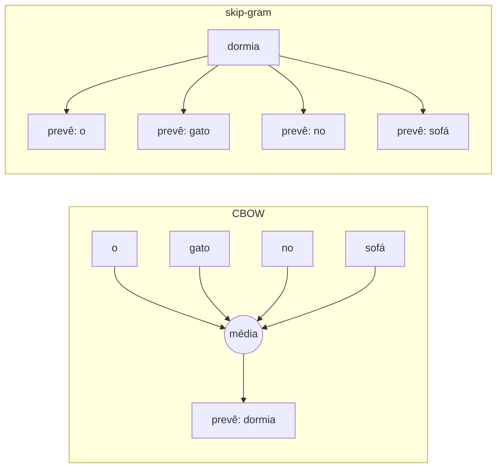
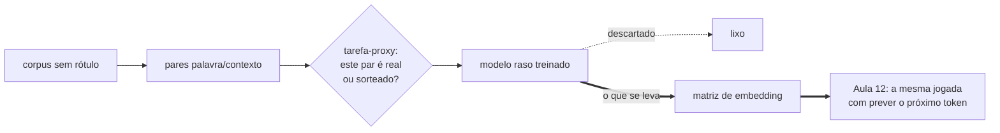
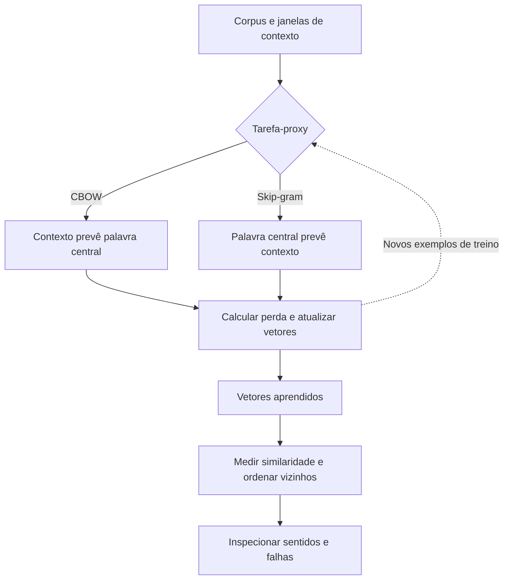
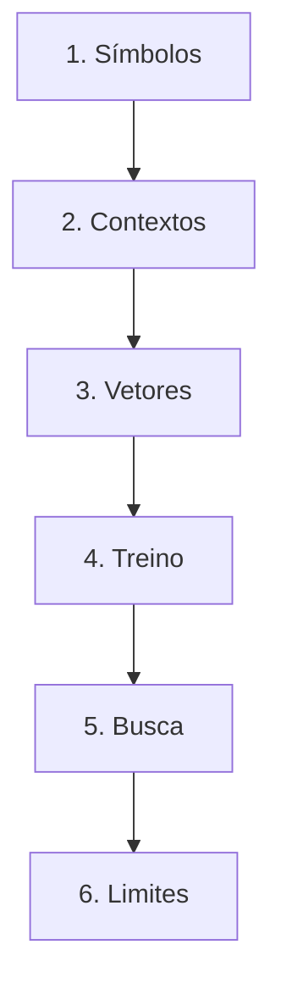

# Especificação de slides — Aula 3 (V2)

> **Rebalanceamento V2.** O fluxo principal abre por três comportamentos observáveis — uma busca
> que não encontra o documento que está na base, uma palavra ambígua que recebe um vetor só, e uma
> analogia que funciona no modelo grande e falha no modelo do aluno — e usa a matemática como
> fundamento nomeado. Toda derivação está na Parte 2, mais detalhada do que estava na V1. Nada de
> matemática foi perdido: foi realocado.

<!-- SLIDE-FLOW:GUIDE:BEGIN -->
## Fluxogramas na produção dos slides

As orientações abaixo complementam o campo **Visual** dos slides indicados. Produzir os fluxogramas no próprio deck, como formas e conectores editáveis ou gráficos vetoriais; a biblioteca completa ao final torna esta especificação independente do portal.

- **Referência de composição:** título e propósito no topo, blocos numerados, conexões rotuladas, ramificações legíveis e uma saída identificada. Usar apenas o padrão visual da referência fornecida, sem importar seu assunto ou seus exemplos.
- **Tema do deck:** manter o fundo escuro e a paleta já especificada para a aula. Usar `#5b8cff` para o trecho ativo, tons neutros para o contexto e `#e2231a` conforme o significado definido no deck. Cor sempre acompanhada de rótulo.
- **Leitura:** entrada no topo ou à esquerda; saída na base ou à direita. Decisões em losangos, alternativas com rótulos e retornos apontando à etapa correta. Ramos paralelos convergem apenas onde seus resultados realmente são combinados.
- **Densidade:** no fluxo principal, projetar 3–6 blocos curtos por enquadramento, com corpo legível na última fileira. Um mapa maior pode ser revelado por etapas no mesmo slide. Detalhes, condições e explicações completas ficam nas notas; não reduzir a fonte para caber tudo.
- **Semântica:** mapas de percurso mostram ordem de estudo, não execução de um algoritmo. Manter separadas preparação e aplicação, treino e inferência, sequência e alternativas. Não transformar uma etapa opcional em obrigatória.
- **Integração:** o fluxograma substitui uma lista redundante ou ocupa o campo Visual; não cobre matrizes, tabelas, gráficos nem código indispensáveis. Preservar títulos, numeração, duração e referências aos apêndices.
- **Produção:** os blocos Mermaid abaixo são especificações do desenho. Renderizar/reconstruir como diagrama, nunca projetar o código Mermaid. Manter rótulos, bifurcações, retornos e limites declarados. Não transformar este caderno técnico em slides adicionais.
- **Ligação com o portal:** os mapas de mecanismo compartilham o conteúdo dos fluxogramas do portal. Em demonstrações, usar o mesmo vocabulário no deck e no controle interativo para facilitar a passagem entre os dois.
<!-- SLIDE-FLOW:GUIDE:END -->

## Diretrizes visuais

- **Tema:** escuro, accent `#e2231a` (vermelho CESAR), accent secundário `#5b8cff`.
- **Tipografia:** sans-serif para texto; monoespaçada para código, fórmulas, vetores e nomes de variável.
- **Densidade:** máximo 5 linhas de texto por slide no fluxo. Um conceito por slide.
- **No fluxo principal:** a fórmula aparece **enunciada e lida em português**, nunca manipulada.
  Toda fórmula vem acompanhada de um número concreto que ela produz ou de um comportamento que ela
  prevê.
- **No apêndice:** densidade alta é esperada e desejável. É material de consulta e de estudo.
- **Proibido:** bullets genéricos ("Vantagens", "Desvantagens"); slide-parede de texto; clipart;
  gráfico sem eixo rotulado; fórmula sem consequência prática no fluxo.
- **Convenção geométrica do deck:** todo slide que mostra espaço vetorial usa o mesmo plano 2D com
  os mesmos quatro pontos de referência (`gato`, `gatinho`, `cachorro`, `parafuso`), para que a
  turma reconheça o espaço de um slide para o outro.

## Arco narrativo

O deck abre com um sistema que falha de um jeito específico e mensurável: a busca não devolve o
documento que fala exatamente do assunto pedido, porque nenhuma palavra da consulta aparece
literalmente nele. Desse sintoma saem outros dois — `banco` com um vetor só, e a analogia que
funciona no modelo baixado e falha no modelo treinado em sala — e os três têm a mesma causa: a
representação atual não carrega noção de semelhança. Os slides 3 a 7 constroem o espaço vetorial
como resposta a essa falta, com cada peça amarrada ao que ela permite prever ou depurar: a
ortogonalidade do one-hot, a hipótese distribucional como critério programável, os vetores densos,
o cosseno como régua e as analogias com a ressalva no mesmo slide. O slide 8 mede tudo o que foi
afirmado. A segunda metade explica *como* o espaço é aprendido — CBOW e skip-gram, o softmax de cem
mil classes e a amostragem negativa — e sobe para a ideia mais transferível do curso, a tarefa-proxy.
O slide 12 devolve o segundo sintoma e mostra que ele **não se resolve hoje**: é a porta da Aula 6.
O apêndice reconstrói toda a matemática por trás dessas afirmações.

---

# PARTE 1 — FLUXO PRINCIPAL

*O que se apresenta em aula. 14 slides, ~85 minutos com demo e exercício.*

### Slide 1 — O sintoma: a busca que não acha o documento que está lá
- **Tipo:** problema (abertura)
- **Título:** O documento está na base. A busca devolve zero.
- **Conteúdo:** Um time indexou dez mil documentos internos. A consulta é `médico`. Existe na base
  um documento inteiro sobre atendimento clínico — e ele **não aparece no resultado**. Motivo: o
  documento escreve `clínico`, `doutor`, `ambulatório`, e nenhuma dessas palavras é a palavra
  digitada. O sistema não errou a conta: **ele calculou semelhança zero, e estava certo**, dada a
  representação que recebeu. A representação era um índice de palavras, e num índice de palavras
  duas palavras diferentes são objetos sem relação.
- **Frase-tese:** O sistema não errou a conta. A conta deu zero porque a representação não tem onde
  guardar semelhança.
- **Visual:** à esquerda, a caixa de busca com `médico` e o resultado `0 documentos`. À direita, o
  documento real, com `clínico`, `doutor` e `ambulatório` destacados em accent. No meio, uma seta
  cortada, e sob ela o número `cos = 0,00`.
- **Notas do apresentador:** Abrir por este sintoma e não pela definição de one-hot. A turma
  reconhece a falha — quase todo mundo já viu uma busca boba não achar o que estava ali. O número
  `0,00` volta medido na demo (Medição 1).

### Slide 2 — Três sintomas, uma causa
- **Tipo:** transição (recap + plano da aula)
- **Título:** Três falhas diferentes, e o mesmo buraco embaixo
- **Conteúdo:** Recap da Aula 2 em uma linha, em monoespaçada:
  `BPE · WordPiece · Unigram → o texto virou [4021, 8977, 312]`. E o que sobrou aberto: o ID 4021
  não é parecido com o 4022 nem menor que ele. Os três sintomas de hoje:
  - **(a)** a busca do slide 1: o documento certo com semelhança zero
  - **(b)** `banco` de dinheiro e `banco` de praça recebem **um** vetor — e esse não se conserta
    hoje, é a dívida que abre a Aula 6
  - **(c)** a analogia `rei − homem + mulher ≈ rainha` funciona no modelo baixado da internet e
    **falha** no modelo que vocês vão treinar no Lab 1, quarta-feira
- **Frase-tese:** O ID é um endereço, não uma quantidade — e endereço não se soma.
- **Visual:** três cartões numerados, cada um com o sintoma em uma linha e o slide em que ele é
  respondido no canto inferior. O cartão (b) com uma marca de "fica em aberto" em accent — o
  contraste com os outros dois é o recado.
- **Notas do apresentador:** Recap de no máximo 4 min. Se a turma pedir revisão de BPE, remeter ao
  material da Aula 2 e seguir. Deixar os três cartões na tela ao anunciar o plano: dois se resolvem
  hoje, um não.

### Slide 3 — Por que a intuição não basta: "é só usar o índice"
- **Tipo:** conceito (fundamento nomeado)
- **Título:** Todas as palavras equidistantes de todas as palavras
- **Conteúdo:** A resposta intuitiva ao slide 1 é comprimir o índice ou usar hashing. Isso resolve
  **memória** e não resolve **nada** do problema. A representação por índice é o vetor one-hot, e ela
  tem duas propriedades — uma chata e uma fatal:
  ```
  gato      = [0, 0, 1, 0, 0, ..., 0]     |V| = 50 000
  gatinho   = [0, 1, 0, 0, 0, ..., 0]
  gato · gatinho = 0   →   cos(gato, gatinho) = 0
  ```
  - **Esparsidade** (chata): 50 000 dimensões para carregar um inteiro. Resolve-se com engenharia.
  - **Ortogonalidade** (fatal): produto interno 0 entre **quaisquer** duas palavras distintas, por
    construção. `gato`/`gatinho` fica tão longe quanto `gato`/`parafuso`.
  - Consequência que o slide 1 mostrou: se o modelo viu mil frases com `médico` e nenhuma com
    `clínico`, não há nada em que apoiar a transferência de uma para a outra.
- **Frase-tese:** O problema do one-hot não é o desperdício de memória. É que a semelhança que a
  busca precisava não existe na representação.
- **Visual:** três eixos perpendiculares em perspectiva, cada um com uma palavra na ponta, e o
  ângulo de 90° marcado entre todos os pares. Rodapé em accent: "ângulo 90° = cosseno 0 = nenhuma
  semelhança utilizável".
- **Fundamento:** os vetores one-hot são **mutuamente ortogonais**: `e_i · e_j = 0` para `i ≠ j` e
  `= 1` para `i = j`, logo a matriz de Gram é a identidade — e um modelo linear sobre entrada
  one-hot tem, para cada palavra, parâmetros que nenhuma outra palavra atualiza.
  → derivação, contagem e a prova de que hashing não resolve: **Apêndice A.1** (slide 15)
- **Notas do apresentador:** A turma ataca o tamanho, não a ortogonalidade. Deixar alguém propor
  "hashing" e mostrar que resolve memória e não resolve semântica — esse desvio custa 1 min e vale,
  porque fixa qual é o problema real.

### Slide 4 — A hipótese distribucional

<!-- SLIDE-FLOW:SLIDE:BEGIN -->
- **Fluxograma a incorporar neste slide:** **F00 — Embeddings: aprender relações e buscar vizinhos**. O desenho e os rótulos completos estão no caderno de fluxogramas ao final deste arquivo.
- **Composição:** integrar ao campo Visual; preservar exemplos, tabelas, fórmulas e dimensões solicitados neste slide. Destacar o trecho relacionado ao título e manter o restante em segundo plano. Os textos detalhados ficam nas notas, sem duplicar a lista de Conteúdo na tela.
<!-- SLIDE-FLOW:SLIDE:END -->

- **Tipo:** conceito
- **Título:** Uma palavra é conhecida pelas companhias que ela mantém
- **Conteúdo:** Onde ir buscar semelhança sem que ninguém escreva um dicionário à mão:
  - Firth (1957); formulação distribucional em Harris (1954)
  - Operacionalização: **mesmos contextos → vetores próximos**. É critério programável, não
    afirmação filosófica — dá para otimizar e dá para medir
  - Ancestral direto: matriz de coocorrência + redução de dimensionalidade. O Word2Vec troca
    contagem por predição
  - **A ressalva que a hipótese obriga:** ela não diz "sinônimos ficam próximos". `quente` e `frio`
    ocorrem quase exatamente nos mesmos contextos e ficam próximos. Antônimos vizinhos são
    consequência da hipótese, não bug da implementação
- **Frase-tese:** Isso não é uma bonita frase de linguística. É um critério que dá para programar.
- **Visual:** as três frases do teste do *glorp* empilhadas, com a palavra inventada em accent e as
  palavras de contexto sublinhadas ("barista", "fumegante", "antes da prova", "sem açúcar"). Nada de
  definição — o slide não revela a palavra.
- **Fundamento:** a hipótese, escrita, é uma afirmação sobre **distribuições condicionais de
  contexto**: se `p(c | w₁) ≈ p(c | w₂)` para todo contexto `c`, então `w₁` e `w₂` devem receber
  vetores próximos. É dela que sai o critério de proximidade, e é dela que sai o colapso dos
  antônimos.
  → formalização, a matriz de coocorrência, PMI e por que a polaridade é invisível ao sinal:
  **Apêndice A.3** (slide 17)
- **Notas do apresentador:** O *glorp* é o momento em que a sala entende a aula. Esperar alguém
  dizer "café" em voz alta antes de seguir. Não derivar nada aqui: a formalização é A.3.

### Slide 5 — Vetores densos: semântica como geometria

<!-- SLIDE-FLOW:SLIDE:BEGIN -->
- **Fluxograma a incorporar neste slide:** **F00 — Embeddings: aprender relações e buscar vizinhos**. O desenho e os rótulos completos estão no caderno de fluxogramas ao final deste arquivo.
- **Composição:** integrar ao campo Visual; preservar exemplos, tabelas, fórmulas e dimensões solicitados neste slide. Destacar o trecho relacionado ao título e manter o restante em segundo plano. Os textos detalhados ficam nas notas, sem duplicar a lista de Conteúdo na tela.
<!-- SLIDE-FLOW:SLIDE:END -->

- **Tipo:** comparação
- **Título:** De 50 000 dimensões binárias para 100 dimensões reais
- **Conteúdo:** Duas colunas curtas — one-hot × denso:
  - **one-hot:** `|V|` dimensões · valores em {0,1} · uma posição informativa · cosseno sempre 0
  - **denso:** `d` entre 50 e 1024 · valores reais · toda posição informativa · perto/longe e
    direção passam a significar algo
  - **Nenhuma dimensão é interpretável isoladamente.** Não existe "a dimensão da realeza"; as
    direções semânticas são combinações das dimensões
  - Definição operacional de treinar, para esta aula: ajustar números por gradiente até um erro
    medido parar de cair (o mecanismo formal é da Aula 12)
- **Frase-tese:** Cinquenta números por palavra, nenhum deles com nome. O significado está na posição.
- **Visual:** split. Esquerda: uma barra longuíssima de zeros com um único `1` aceso. Direita: um
  vetor curto de dez números reais e, ao lado, o plano 2D canônico do deck com `gato`, `gatinho` e
  `cachorro` agrupados e `parafuso` isolado no canto.
- **Notas do apresentador:** Com turma de pouco ML (diagnóstico da Aula 1), gastar 2 min extras em
  "treinar" e prometer a Aula 12 explicitamente. Este slide não tem fórmula e não deve ganhar uma.

### Slide 6 — A régua: cosseno, e o que ela permite decidir

<!-- SLIDE-FLOW:SLIDE:BEGIN -->
- **Fluxograma a incorporar neste slide:** **F00 — Embeddings: aprender relações e buscar vizinhos**. O desenho e os rótulos completos estão no caderno de fluxogramas ao final deste arquivo.
- **Composição:** integrar ao campo Visual; preservar exemplos, tabelas, fórmulas e dimensões solicitados neste slide. Destacar o trecho relacionado ao título e manter o restante em segundo plano. Os textos detalhados ficam nas notas, sem duplicar a lista de Conteúdo na tela.
<!-- SLIDE-FLOW:SLIDE:END -->

- **Tipo:** dados (fundamento aplicado)
- **Título:** A régua mede direção, não tamanho
- **Conteúdo:** A fórmula enunciada e lida, em bloco destacado:
  ```
  cos(u,v) = (u · v) / (‖u‖ ‖v‖)        faixa: −1 … 1
  ```
  Leitura por termo: o **numerador** mede alinhamento; o **denominador** joga fora o comprimento dos
  dois vetores; o resultado é o cosseno do ângulo. Por que não distância euclidiana, e o argumento é
  concreto: num espaço de palavras treinado a **norma correlaciona com a frequência** da palavra no
  corpus, e frequência não é o que se compara quando se pergunta se dois sentidos são parecidos.
  Duas armadilhas que aparecem em prova todo semestre: cosseno **não é probabilidade** — 0,7 não é
  "70% parecido"; e cosseno **não é comparável entre espaços diferentes** — a escala é interna a cada
  espaço treinado, e o que se compara é ordenação, não valor.
- **Frase-tese:** Cosseno mede direção e joga a magnitude fora — e é isso que eu quero, porque a
  magnitude conta frequência, não sentido.
- **Visual:** dois vetores saindo da origem com comprimentos bem diferentes e ângulo pequeno entre
  eles, com o ângulo destacado em accent e as normas marcadas em cinza. Legenda: "mesma direção,
  tamanhos diferentes → cosseno alto". Ao lado, um segundo par de vetores de mesmo comprimento e
  ângulo grande, com a distância euclidiana anotada — e o aviso de que a euclidiana ordena os dois
  pares na ordem **inversa**.
- **Fundamento:** `cos(u,v) = (u·v)/(‖u‖‖v‖)`, e a relação exata com a distância euclidiana é
  `‖u−v‖² = ‖u‖² + ‖v‖² − 2 u·v` — que só colapsa nas duas medidas equivalentes quando os vetores
  estão normalizados.
  → derivação, o contraexemplo numérico que inverte a ordenação e o caso da esfera unitária:
  **Apêndice A.2** (slide 16)
- **Notas do apresentador:** Slide que estoura o Bloco 1 na V1, porque a álgebra puxava perguntas de
  álgebra. Aqui a fórmula é lida e o par de contraexemplos está em A.2. Não abrir normalização L2
  nem produto interno em espaço normalizado — isso volta na Aula 18.

### Slide 7 — Analogias: a relação virou direção — e o terceiro sintoma

<!-- SLIDE-FLOW:SLIDE:BEGIN -->
- **Fluxograma a incorporar neste slide:** **F00 — Embeddings: aprender relações e buscar vizinhos**. O desenho e os rótulos completos estão no caderno de fluxogramas ao final deste arquivo.
- **Composição:** integrar ao campo Visual; preservar exemplos, tabelas, fórmulas e dimensões solicitados neste slide. Destacar o trecho relacionado ao título e manter o restante em segundo plano. Os textos detalhados ficam nas notas, sem duplicar a lista de Conteúdo na tela.
<!-- SLIDE-FLOW:SLIDE:END -->

- **Tipo:** conceito
- **Título:** Funciona no modelo da internet, falha no modelo de vocês
- **Conteúdo:** A regularidade em bloco destacado:
  ```
  vec(rei) − vec(homem) + vec(mulher) ≈ vec(rainha)
  ```
  Leitura correta: uma **relação** virou uma **direção** no espaço, e a mesma direção vale partindo
  de vários pontos. Ninguém programou uma regra de gênero em lugar nenhum.
  Agora o sintoma (c) do slide 2, e as três razões dele:
  - o protocolo padrão de avaliação **exclui as três palavras de entrada** dos candidatos — sem a
    exclusão, a resposta mais próxima costuma ser uma das próprias entradas
  - categorias inteiras falham; país→moeda é notoriamente ruim, e a demo vai tentar
  - o efeito enfraquece muito em corpus pequeno — o regime exato do Lab 1
- **Frase-tese:** A analogia funciona porque a relação é uma direção. Não porque o modelo sabe o que
  é um rei.
- **Visual:** o paralelogramo clássico no plano 2D do deck (`homem`→`rei` e `mulher`→`rainha` como
  duas setas paralelas de mesmo comprimento). Ao lado, um segundo paralelogramo **quebrado**, com a
  seta de país→moeda chegando no ponto errado, marcado em accent. Os dois lado a lado, mesmo peso
  visual.
- **Fundamento:** o teste de analogia é `argmax_x cos(x, b − a + c)` sobre o vocabulário, **excluindo
  `{a,b,c}`** — e, com vetores normalizados, o objetivo se reduz a uma soma de três similaridades,
  o que explica por que a exclusão é indispensável e por que o resultado é frágil.
  → o objetivo escrito, a decomposição em três termos, o que a exclusão esconde e a razão estatística
  da falha em corpus pequeno: **Apêndice A.5** (slide 19)
- **Notas do apresentador:** Se surgir o tema de viés nas analogias, uma frase (Bolukbasi et al.,
  arXiv 1607.06520) e não abrir o fio — não é tópico desta aula. Anotar quem perguntou: é bom tema
  de projeto final.

### Slide 8 — [Demo] Agora medido, não afirmado

<!-- SLIDE-FLOW:SLIDE:BEGIN -->
- **Fluxograma a incorporar neste slide:** **F00 — Embeddings: aprender relações e buscar vizinhos**. O desenho e os rótulos completos estão no caderno de fluxogramas ao final deste arquivo.
- **Composição:** integrar ao campo Visual; preservar exemplos, tabelas, fórmulas e dimensões solicitados neste slide. Destacar o trecho relacionado ao título e manter o restante em segundo plano. Os textos detalhados ficam nas notas, sem duplicar a lista de Conteúdo na tela.
<!-- SLIDE-FLOW:SLIDE:END -->

- **Tipo:** transição para demonstração
- **Título:** Quatro medições: o zero, os vizinhos, a analogia que falha e o `bank`
- **Frase-tese:** Eu não escrevi nenhuma dessas relações. Elas caíram de contar quem aparece perto
  de quem.
- **Conteúdo:** As quatro medições de `codigo/demo-embeddings.py`, na ordem em que rodam, sem
  resultado — o resultado aparece ao vivo:
  ```
  1. one-hot em NumPy      → a matriz 4×4 de cossenos: 1,00 na diagonal, 0,00 nos 12 pares
  2. vizinhos de king, python, hospital num espaço denso pré-treinado
  3. duas analogias        → gênero (categoria forte) e país→moeda (categoria fraca)
  4. vizinhos de bank      → finanças e margem de rio na MESMA lista
  ```
  A Medição 1 é a evidência do slide 1 e do slide 3; a Medição 3 é a evidência do slide 7; a
  Medição 4 é a evidência do slide 12, e ela roda **quarenta minutos antes** de o slide 12 existir.
- **Visual:** slide de transição, quase vazio. Só o título e as quatro medições numeradas em
  monoespaçada, esperando ser preenchidas. Rodapé: `codigo/demo-embeddings.py`.
- **Notas do apresentador:** Modelo em cache antes da aula (~100 MB, cache em `~/gensim-data`).
  Passos na Parte 2 do roteiro. Se o tempo apertar, as Medições 1 e 4 são as que **não** se cortam.
  Intervalo de 10 min depois deste slide.

### Slide 9 — Word2Vec: CBOW × skip-gram

<!-- SLIDE-FLOW:SLIDE:BEGIN -->
- **Fluxograma a incorporar neste slide:** **F00 — Embeddings: aprender relações e buscar vizinhos**. O desenho e os rótulos completos estão no caderno de fluxogramas ao final deste arquivo.
- **Composição:** integrar ao campo Visual; preservar exemplos, tabelas, fórmulas e dimensões solicitados neste slide. Destacar o trecho relacionado ao título e manter o restante em segundo plano. Os textos detalhados ficam nas notas, sem duplicar a lista de Conteúdo na tela.
<!-- SLIDE-FLOW:SLIDE:END -->

- **Tipo:** diagrama
- **Título:** Duas tarefas rasas, dois espaços diferentes
- **Conteúdo:** As duas arquiteturas e o terceiro botão:
  - **CBOW** · média do contexto → palavra central · 1 exemplo por janela · mais rápido, melhor em
    palavras frequentes
  - **skip-gram** · palavra central → cada palavra do contexto · vários pares por janela · mais
    lento, melhor em palavras raras e corpus pequeno
  - **Janela:** pequena (±2) captura substituibilidade — vizinho de `Recife` é outra cidade; grande
    (±10) captura tópico — vizinho de `Recife` é `praia`, `frevo`
  - Mikolov et al., *Efficient Estimation of Word Representations in Vector Space*, arXiv 1301.3781
- **Frase-tese:** CBOW pergunta "que palavra cabe no buraco?". Skip-gram pergunta "que companhias
  esta palavra tem?".
- **Visual:** dois diagramas espelhados, lado a lado, com as setas invertidas entre a caixa
  "contexto" e a caixa "palavra central". Abaixo, uma frase real com a janela deslizante desenhada e
  os pares gerados listados em cada modo — a diferença de quantidade de pares tem de ser visível.
- **Fundamento:** as duas arquiteturas otimizam objetivos diferentes sobre a mesma janela, e é o
  número de pares por janela que explica a diferença de custo e de comportamento em palavra rara.
  → o objetivo do skip-gram escrito, com o papel de `window`, de `min_count` e de `negative`:
  **Apêndice A.4** (slide 18)
- **Notas do apresentador:** Desenhar a janela deslizando no quadro — é a única coisa que vale ir ao
  quadro neste slide. GloVe e FastText, se perguntarem: uma frase, não estão na ementa desta aula.



### Slide 10 — O softmax de cem mil classes e a amostragem negativa

<!-- SLIDE-FLOW:SLIDE:BEGIN -->
- **Fluxograma a incorporar neste slide:** **F00 — Embeddings: aprender relações e buscar vizinhos**. O desenho e os rótulos completos estão no caderno de fluxogramas ao final deste arquivo.
- **Composição:** integrar ao campo Visual; preservar exemplos, tabelas, fórmulas e dimensões solicitados neste slide. Destacar o trecho relacionado ao título e manter o restante em segundo plano. Os textos detalhados ficam nas notas, sem duplicar a lista de Conteúdo na tela.
<!-- SLIDE-FLOW:SLIDE:END -->

- **Tipo:** conceito (fundamento aplicado a um custo)
- **Título:** Cem mil classes viraram k+1 perguntas de sim ou não
- **Conteúdo:** O problema, a reescrita e o número:
  - Objetivo ingênuo: o softmax **normaliza sobre todo o vocabulário** a cada exemplo — `|V| ≈ 10⁵`,
    bilhões de exemplos. Não fecha em nenhum orçamento
  - Reescrita: dado um par (palavra, contexto), ele é **real** ou **sorteado**? Classificação binária
  - `k` negativos por positivo (5 a 20), sorteados de uma distribuição unigrama **distorcida** —
    frequência elevada a 3/4, para não sortear `de` e `que` o tempo inteiro
  - O objetivo por par, enunciado:
  ```
  log σ(v_c · v_w) + Σ_{i=1..k} log σ(−v_{n_i} · v_w)        σ(x) = 1/(1+e^{−x})
  ```
  - **O número:** custo por exemplo cai de `|V|` para `k+1`. Com `|V| = 100 000` e `k = 5`, de
    100 000 para 6 — cerca de **17 mil vezes menos**
  - **Não é aproximação preguiçosa do softmax:** é **outro objetivo** — e o objetivo trocado produz
    embeddings melhores para este fim
- **Frase-tese:** Trocar o objetivo por um mais barato e descobrir que o barato é também o melhor.
  Isso vai repetir neste curso.
- **Visual:** antes/depois. Esquerda: um leque de 100 000 saídas com todas acesas (custo). Direita:
  um par real em verde-accent e `k` pares sorteados em cinza, cada um com um seletor sim/não. O
  contraste de quantidade é o argumento. Abaixo, os dois números `100 000` e `6` em corpo grande.
- **Fundamento:** o objetivo por par é `log σ(v_c·v_w) + Σ_{i} log σ(−v_{n_i}·v_w)`, e o ponto ótimo
  dele **não** é o do softmax: é o da fatoração de uma matriz de PMI deslocada por `log k`.
  → derivação do objetivo, o que a amostragem negativa aproxima e por que, o papel do expoente 3/4 e
  a contagem de custo: **Apêndice A.4** (slide 18)
- **Notas do apresentador:** Não justificar o expoente 3/4 no fluxo — é escolha empírica do artigo,
  e dizer isso é mais honesto que inventar teoria. O que ela **faz** está quantificado em A.4 com um
  número. Se pedirem `σ`, está escrito no slide.

### Slide 11 — Tarefa-proxy: o objetivo de treino não é o produto

<!-- SLIDE-FLOW:SLIDE:BEGIN -->
- **Fluxograma a incorporar neste slide:** **F00 — Embeddings: aprender relações e buscar vizinhos**. O desenho e os rótulos completos estão no caderno de fluxogramas ao final deste arquivo.
- **Composição:** integrar ao campo Visual; preservar exemplos, tabelas, fórmulas e dimensões solicitados neste slide. Destacar o trecho relacionado ao título e manter o restante em segundo plano. Os textos detalhados ficam nas notas, sem duplicar a lista de Conteúdo na tela.
<!-- SLIDE-FLOW:SLIDE:END -->

- **Tipo:** conceito
- **Título:** O modelo é descartável. A tabela é o produto.
- **Conteúdo:** Quatro linhas, a terceira em destaque:
  - Ninguém quer um preditor de palavra de contexto — esse modelo é jogado fora
  - O produto é a **matriz de embedding**, que numa visão ingênua seria só um parâmetro interno do
    treino
  - O treino é **auto-supervisionado**: o rótulo vem do próprio texto, sem anotador humano — por isso
    escala para qualquer quantidade de texto que exista
  - **A mesma jogada, escalada:** "prever o próximo token" também não interessa por si. Interessa o
    que o modelo precisa aprender para acertá-la (Aula 12)
- **Frase-tese:** O modelo que eu treinei é lixo. Eu queria a tabela de pesos que ficou dentro dele.
- **Visual:** o fluxo do Mermaid abaixo, com a caixa do modelo desenhada tracejada e translúcida
  (descartável) e a caixa da matriz de embedding sólida, em accent, saindo dela. Uma lixeira
  estilizada recebendo a caixa tracejada, e uma seta grossa levando a matriz para "Aula 12: prever o
  próximo token".
- **Notas do apresentador:** Ponto de prova e gancho da Aula 12. Se o Bloco 2 atrasar, cortar tempo
  do slide 9, nunca deste. Lançar a pergunta "o que o modelo *precisou* aprender para acertar?" e
  esperar 10 s de silêncio.



### Slide 12 — O sintoma que hoje não se resolve: `banco`

<!-- SLIDE-FLOW:SLIDE:BEGIN -->
- **Fluxograma a incorporar neste slide:** **F00 — Embeddings: aprender relações e buscar vizinhos**. O desenho e os rótulos completos estão no caderno de fluxogramas ao final deste arquivo.
- **Composição:** integrar ao campo Visual; preservar exemplos, tabelas, fórmulas e dimensões solicitados neste slide. Destacar o trecho relacionado ao título e manter o restante em segundo plano. Os textos detalhados ficam nas notas, sem duplicar a lista de Conteúdo na tela.
<!-- SLIDE-FLOW:SLIDE:END -->

- **Tipo:** conceito (a dívida declarada)
- **Título:** Um vetor, dois sentidos, nenhum bem representado
- **Conteúdo:** O sintoma (b) do slide 2, agora com evidência da própria aula:
  - `banco` de dinheiro, `banco` de praça, `banco` de dados, `banco` de areia — **um único vetor**
    para todos
  - **Evidência medida na Medição 4:** os vizinhos de `bank` trouxeram `credit` e `river` na mesma
    lista. Não é ruído: é o vetor sendo exatamente o que ele é
  - O vetor vira um compromisso — cai numa região que não descreve bem nenhum dos sentidos. Mesmo
    com `manga`, `ponto`, `letra`
  - **Treinar mais e aumentar `d` não resolvem**, e a razão é a interface, não a capacidade: a
    operação é consulta a uma tabela por ID. **A frase não participa da conta**
  - A saída é uma representação que **depende do contexto**. Isso muda a natureza do objeto — de
    tabela para função — e é o mecanismo da **Aula 6**
- **Frase-tese:** O problema não é falta de dados. É que a frase não entra na conta — e isso não se
  conserta hoje.
- **Visual:** um ponto único rotulado `banco` no plano 2D do deck, com duas nuvens distantes ao redor
  — uma de finanças, uma de praça/rio — e o ponto exatamente no meio do vazio entre as duas, sem
  pertencer a nenhuma. Duas setas pontilhadas puxando o ponto em direções opostas. No canto, em
  accent: "resolve na Aula 6 — `softmax(QKᵀ/√d_k)V`".
- **Notas do apresentador:** Usar a lista de vizinhos de `bank` que ficou na tela na demo, não a
  memória — o argumento fica muito mais forte com o dado da própria aula. Se alguém antecipar BERT,
  confirmar em uma frase e devolver para a Aula 8. **Deixar o gancho explícito:** este sintoma fica
  aberto de propósito, e a Aula 6 é onde ele fecha. **Precisão a manter, porque ela evita um erro
  conceitual caro:** não dizer, nem por atalho, que "a atenção inventou o vetor contextual". Quem
  fechou este sintoma primeiro foi o **ELMo**, em 2018, com LSTMs bidirecionais empilhadas e sem
  atenção nenhuma — o que a **Aula 5** trata. A atenção venceu por acesso direto e paralelismo, não
  por ter inventado o contexto. Se alguém antecipar isso aqui, confirmar em uma frase e devolver
  para a Aula 5.

### Slide 13 — [Exercício] Decidir e diagnosticar, não calcular
- **Tipo:** exercício
- **Título:** 8 minutos em dupla: três itens, decisão escrita nos três
- **Conteúdo:** Os três itens, redigidos como aparecem na tela:
  1. **Ordenar por cosseno esperado**, com uma frase de justificativa por par:
     (`médico`, `enfermeiro`) · (`gato`, `parafuso`) · (`quente`, `frio`) · (`Recife`, `Fortaleza`) ·
     (`comer`, `comida`)
  2. **Escolher a janela** e justificar em uma frase: (a) sugerir termos substituíveis num campo de
     busca; (b) agrupar documentos por assunto
  3. **Diagnosticar:** um time treinou embeddings próprios e as analogias falham quase todas; o
     mesmo teste funciona no modelo baixado da internet. Nomear **duas causas prováveis** e, para
     cada uma, **que evidência do próprio notebook a confirmaria**
- **Frase-tese:** Nenhum dos três pede uma conta. Os três pedem saber o que a geometria prevê.
- **Visual:** os cinco pares do item 1 como cartões arrastáveis numa régua horizontal que vai de
  "cosseno alto" a "cosseno baixo" — a régua sugere a tarefa sem dar a resposta. Itens 2 e 3 em
  blocos menores abaixo, o 3 com duas colunas rotuladas "causa" e "evidência que confirma".
  Cronômetro de 8 min no canto.
- **Notas do apresentador:** Condução na Parte 3 do roteiro. O par de antônimos é onde a sala
  aprende; o item 3 é a preparação direta do Lab 1 e da questão-guia 3 dele. Esperado no item 3:
  corpus pequeno com cauda esparsa (evidência: o tamanho do vocabulário após `min_count`) e o
  protocolo de exclusão (evidência: rodar a analogia sem excluir as entradas e ver o que ganha).
  Cronometrar de verdade.

### Slide 14 — Fechamento: de vetor estático a vetor contextual

<!-- SLIDE-FLOW:SLIDE:BEGIN -->
- **Fluxograma a incorporar neste slide:** **F01 — O percurso desta aula**; **F00 — Embeddings: aprender relações e buscar vizinhos**. O desenho e os rótulos completos estão no caderno de fluxogramas ao final deste arquivo.
- **Composição:** integrar ao campo Visual; preservar exemplos, tabelas, fórmulas e dimensões solicitados neste slide. Destacar o trecho relacionado ao título e manter o restante em segundo plano. Os textos detalhados ficam nas notas, sem duplicar a lista de Conteúdo na tela.
<!-- SLIDE-FLOW:SLIDE:END -->

- **Tipo:** encerramento
- **Título:** Significado virou posição. Falta virar função da frase.
- **Conteúdo:** Os três sintomas, com o placar honesto:
  ```
  (a) a busca que não achava          RESOLVIDO   significado é posição, e cosseno é a régua
  (c) a analogia que falha no pequeno EXPLICADO   cauda esparsa + protocolo de exclusão (A.5)
  (b) banco com um vetor só           ABERTO      a frase não entra na conta → Aula 6
  ```
  E o operacional: **Aula 4 — Laboratório 1: Tokenizadores e embeddings** — BPE do GPT × WordPiece do
  BERT no mesmo texto · razão de tokens PT/EN · Word2Vec em corpus português com `gensim` · PCA/t-SNE,
  vizinhos e analogias. Leitura: Mikolov et al., arXiv 1301.3781. **Pergunta dirigida:** quais
  analogias vão falhar num corpus de poucos megabytes, e por quê? Hipótese escrita **antes** de rodar
  — e agora com **A.5** ao lado, a hipótese pode citar mecanismo em vez de adjetivo.
- **Frase-tese:** Hoje o significado virou posição. Falta ele virar função da frase — e é isso que a
  atenção faz, a partir da Aula 5.
- **Visual:** duas metades. Topo: o placar dos três sintomas, com o (b) em accent e uma seta grande
  saindo dele para "Aula 6". Base: o checklist do Lab 1 em caixa destacada para a turma fotografar
  (Colab aberto · `gensim==4.3.3` com `scipy<1.14` · **runtime reiniciado após instalar** · modelo em
  cache).
- **Notas do apresentador:** Projetar o checklist e ficar 20 s em silêncio para a turma fotografar.
  Antes de encerrar, projetar o índice do apêndice por 20 s: são cinco itens, e os dois que mais
  voltam são A.2 (cosseno, que sustenta a busca semântica da Aula 18) e A.5 (analogias, que é a
  questão-guia 3 do Lab 1). Acabar às 02:00.

---

# PARTE 2 — APÊNDICE MATEMÁTICO

*Material de estudo e consulta. Não se apresenta em aula: reconstrói, com rigor completo, todo
fundamento citado no fluxo. Autossuficiente — quem estuda por aqui sem ter assistido à aula
consegue reconstruir tudo.*

### Slide 15 — A.1 · One-hot: ortogonalidade mútua e a ausência de generalização

<!-- SLIDE-FLOW:SLIDE:BEGIN -->
- **Fluxograma a incorporar neste slide:** **F00 — Embeddings: aprender relações e buscar vizinhos**. O desenho e os rótulos completos estão no caderno de fluxogramas ao final deste arquivo.
- **Composição:** integrar ao campo Visual; preservar exemplos, tabelas, fórmulas e dimensões solicitados neste slide. Destacar o trecho relacionado ao título e manter o restante em segundo plano. Os textos detalhados ficam nas notas, sem duplicar a lista de Conteúdo na tela.
<!-- SLIDE-FLOW:SLIDE:END -->

- **Tipo:** apêndice — derivação e contagem
- **Invocado em:** slides 1 e 3

**Notação.**
`V` — vocabulário; `|V|` — seu tamanho. `w_i` — a `i`-ésima palavra, na ordem arbitrária em que o
tokenizador a indexou. `e_i ∈ ℝ^|V|` — o vetor one-hot de `w_i`, definido por
```
e_i[m] = 1   se m = i
e_i[m] = 0   caso contrário
```
`⟨·,·⟩` — produto interno usual em `ℝ^|V|`. `δ_ij` — delta de Kronecker (1 se `i = j`, 0 se `i ≠ j`).

**Premissas.** (i) A indexação é **injetiva**: duas palavras distintas recebem posições distintas —
é o que qualquer tokenizador entrega. (ii) Nenhuma informação além do índice entra na representação.
A premissa (ii) é o objeto de estudo deste item: é exatamente ela que produz o resultado ruim, e é
ela que os vetores densos abandonam.

**O produto interno.**
```
⟨e_i, e_j⟩ = Σ_{m=1}^{|V|} e_i[m] · e_j[m]
```
Cada parcela é um produto de dois números que valem 0 ou 1. A parcela `m` só é diferente de zero
quando `e_i[m] = 1` **e** `e_j[m] = 1`, isto é, quando `m = i` e `m = j` simultaneamente. Isso só
acontece se `i = j`, e nesse caso há exatamente uma parcela igual a 1. Logo
```
⟨e_i, e_j⟩ = δ_ij
```

**A matriz de Gram.** Empilhando os `|V|` vetores como linhas de uma matriz `E ∈ ℝ^(|V|×|V|)`,
o resultado acima diz que
```
E Eᵀ = I
```
A matriz de Gram é a identidade: o conjunto `{e_1, …, e_|V|}` é uma **base ortonormal** de `ℝ^|V|`.
É uma representação matematicamente impecável — e é justamente essa perfeição que a torna inútil
aqui.

**O cosseno.** Como `‖e_i‖ = √⟨e_i,e_i⟩ = 1` para todo `i`:
```
cos(e_i, e_j) = ⟨e_i,e_j⟩ / (‖e_i‖ ‖e_j‖) = δ_ij / (1 · 1) = δ_ij
```
Ou seja: **1 para a palavra consigo mesma, 0 para qualquer outro par.** Não há gradação. `gato` e
`gatinho` têm cosseno 0; `gato` e `parafuso` têm cosseno 0. O ângulo entre quaisquer duas palavras
distintas é exatamente 90°.

*A distância euclidiana não salva.* Pelo mesmo argumento,
```
‖e_i − e_j‖² = ‖e_i‖² + ‖e_j‖² − 2⟨e_i,e_j⟩ = 1 + 1 − 0 = 2      (para i ≠ j)
```
logo `‖e_i − e_j‖ = √2` para **todo** par distinto. Trocar de métrica não cria informação que não
está na representação: o conjunto é equidistante em qualquer métrica induzida pelo produto interno.

**Por que isso impede generalização — o argumento formal.**
Considere a camada mais simples possível sobre entrada one-hot: uma transformação linear
`z = Wᵀ x` com `W ∈ ℝ^(|V|×d)`. Para `x = e_i`,
```
z = Wᵀ e_i = (a i-ésima linha de W)ᵀ
```
A saída depende **somente** da linha `i`. Consequentemente, a derivada da perda em relação à linha
`j` de `W` é **identicamente zero para todo `j ≠ i`**: nenhum exemplo contendo `w_i` altera os
parâmetros de `w_j`.

*Leitura.* Cada palavra tem seu próprio conjunto de parâmetros, e esses conjuntos são
**estatisticamente independentes por construção**. Mil frases com `médico` não movem um único número
associado a `clínico`. É essa a razão exata pela qual a busca do slide 1 devolveu zero: não é que o
modelo tenha aprendido pouco, é que a arquitetura da representação proíbe a transferência.

*O que os vetores densos mudam.* Com `d ≪ |V|`, as palavras passam a **compartilhar** dimensões.
Não há mais como atualizar `médico` sem mover, um pouco, tudo o que ocupa a mesma vizinhança —
e é esse acoplamento, que na representação one-hot era zero, que se chama generalização.

**Contagem — o problema chato.** Com `|V| = 50 000` e `float32`, um único vetor one-hot ocupa
`50 000 × 4 bytes = 200 KB`, dos quais um número é diferente de zero. Uma sequência de 1 000 tokens
ocupa 200 MB. Um vetor denso de `d = 100` ocupa `400 bytes` — **500 vezes menos** — e carrega
semelhança utilizável, que o outro não carrega em tamanho nenhum.

**Por que hashing não resolve — e é a objeção que a turma faz.**
A proposta natural é reduzir a dimensão mapeando `w_i ↦ e_{h(i)}` com `h: {1..|V|} → {1..B}` e
`B ≪ |V|`. Duas coisas acontecem:
1. **A ortogonalidade sobrevive.** Se `h(i) ≠ h(j)`, os vetores continuam ortogonais e o cosseno
   continua 0. A memória caiu, a semelhança continua ausente.
2. **Onde não sobrevive, é pior.** Se `h(i) = h(j)` — uma **colisão** —, os vetores ficam
   **idênticos**, cosseno 1. E a colisão é sorteada pela função de hash, não pelo sentido: `gato`
   pode colidir com `parafuso` e não com `gatinho`.

*Conclusão.* Hashing troca "nenhuma semelhança" por "semelhança arbitrária". O problema do one-hot
não é dimensão, é **ausência de estrutura** — e a única saída é construir a estrutura a partir de
alguma evidência externa. A evidência é a distribuição de contextos (**A.3**).

**Casos-limite.**
- **`|V| = 1`.** A representação é `[1]`, o cosseno consigo mesma é 1, e não há par distinto. O
  problema desaparece porque não há o que comparar — o que confirma que o problema é relacional.
- **`|V| = 2`.** Dois vetores ortogonais em `ℝ²`. Mesmo com um vocabulário mínimo, a ortogonalidade
  já está lá: ela não é efeito de vocabulário grande.
- **Vetores multi-hot** (uma palavra representada pelo conjunto de seus caracteres ou n-gramas de
  caracteres). Aí o cosseno **deixa** de ser sempre zero: `gato` e `gatinho` compartilham
  caracteres. É a intuição por trás do FastText, e mostra que a ortogonalidade é consequência da
  escolha "um índice por palavra", não da representação esparsa em si.

**Intuição geométrica.** One-hot põe cada palavra num eixo próprio de um espaço de 50 000 dimensões.
Uma lista de endereços, não um mapa: saber que `gato` mora no apartamento 4021 e `gatinho` no 4022
não diz nada sobre serem vizinhos, porque a numeração dos apartamentos não codifica a planta do
prédio. O que a aula constrói é a planta.

**De volta ao fluxo:** slide 3.

### Slide 16 — A.2 · Similaridade de cosseno, e por que não distância euclidiana

<!-- SLIDE-FLOW:SLIDE:BEGIN -->
- **Fluxograma a incorporar neste slide:** **F00 — Embeddings: aprender relações e buscar vizinhos**. O desenho e os rótulos completos estão no caderno de fluxogramas ao final deste arquivo.
- **Composição:** integrar ao campo Visual; preservar exemplos, tabelas, fórmulas e dimensões solicitados neste slide. Destacar o trecho relacionado ao título e manter o restante em segundo plano. Os textos detalhados ficam nas notas, sem duplicar a lista de Conteúdo na tela.
<!-- SLIDE-FLOW:SLIDE:END -->

- **Tipo:** apêndice — derivação e contraexemplo numérico
- **Invocado em:** slide 6

**Notação.** `u, v ∈ ℝ^d` vetores não nulos. `⟨u,v⟩ = Σ_{m=1}^{d} u_m v_m` o produto interno.
`‖u‖ = √⟨u,u⟩` a norma euclidiana. `θ` o ângulo entre `u` e `v`.

**Premissas.** (i) Os vetores são não nulos — o caso nulo está nos casos-limite. (ii) O espaço é
euclidiano com o produto interno usual; é o espaço em que os embeddings vivem. (iii) A afirmação
empírica de que **a norma correlaciona com a frequência** é uma propriedade observada de espaços
treinados, não um teorema; ela é o motivo de engenharia da escolha, e onde ela não vale a escolha
muda (ver casos-limite).

**Definição, e de onde ela vem.** A identidade que liga produto interno e ângulo em espaço euclidiano
é
```
⟨u,v⟩ = ‖u‖ ‖v‖ cos θ
```
Isolando o cosseno:
```
cos(u,v) = ⟨u,v⟩ / (‖u‖ ‖v‖)
```
A operação é, literalmente, **dividir o alinhamento pelo produto dos tamanhos**. É essa divisão que
descarta a magnitude.

**Faixa de valores.** Pela desigualdade de Cauchy–Schwarz, `|⟨u,v⟩| ≤ ‖u‖‖v‖`, logo
```
−1 ≤ cos(u,v) ≤ 1
```
com igualdade a `1` se e somente se `v = λu` para algum `λ > 0` (mesma direção), e a `−1` se e
somente se `λ < 0` (direção oposta). O valor `0` significa ortogonalidade — é o caso do one-hot em
**A.1**.

**Invariância de escala — a propriedade que se está comprando.** Para qualquer `α, β > 0`:
```
cos(αu, βv) = ⟨αu, βv⟩ / (‖αu‖ ‖βv‖) = αβ⟨u,v⟩ / (αβ ‖u‖‖v‖) = cos(u,v)
```
Multiplicar um vetor por um escalar positivo **não altera** o cosseno. Quem escolhe cosseno está
declarando: *o comprimento do vetor não é informação relevante para esta pergunta.*

**A relação exata com a distância euclidiana.**
```
‖u − v‖² = ⟨u−v, u−v⟩ = ⟨u,u⟩ − 2⟨u,v⟩ + ⟨v,v⟩ = ‖u‖² + ‖v‖² − 2‖u‖‖v‖ cos(u,v)
```
As duas medidas se relacionam, mas a distância depende de **três** quantidades — as duas normas e o
cosseno — enquanto o cosseno depende de uma só. A distância euclidiana mistura tamanho e direção;
o cosseno separa.

**O contraexemplo que inverte a ordenação.** Sejam quatro vetores em `ℝ²`:
```
u = (8, 0)        v = (2, 0)                        mesma direção, tamanhos diferentes
a = (5, 0)        b = (2,5 ; 4,330)                 mesmo tamanho, ângulo de 60°
```
*Pelo cosseno:*
```
cos(u,v) = 16 / (8 · 2) = 1,000
cos(a,b) = (5·2,5 + 0·4,330) / (5 · 5) = 12,5 / 25 = 0,500
```
*Pela distância euclidiana:*
```
‖u − v‖ = ‖(6, 0)‖ = 6,000
‖a − b‖ = √(25 + 25 − 2·25·0,5) = √25 = 5,000
```
**As duas medidas discordam.** O cosseno diz que `(u,v)` é o par mais semelhante (1,000 contra
0,500); a distância euclidiana diz que `(a,b)` é o par mais próximo (5,000 contra 6,000). E a
discordância não é patológica: ela é **exatamente** o caso do espaço de palavras.

*Por que esse é o caso do espaço de palavras.* Suponha que `u` seja o vetor de uma palavra muito
frequente e `v` o de uma palavra rara com o mesmo sentido — por exemplo `casa` e `residência` num
corpus em que a primeira aparece cem vezes mais. Em espaços treinados por gradiente, a palavra
frequente recebe muito mais atualizações e sua norma cresce mais: `‖u‖ > ‖v‖`, com direções
parecidas. A pergunta que interessa é "os sentidos são parecidos?", e a resposta certa é *sim*. O
cosseno responde `1,000`. A euclidiana responde `6,000` e coloca esse par **atrás** de um par de
sentidos distintos que calhou de ter normas iguais.

**Quando as duas medidas são equivalentes — e é um resultado útil.** Se os vetores estiverem
normalizados (`‖u‖ = ‖v‖ = 1`), a identidade acima dá
```
‖u − v‖² = 1 + 1 − 2cos(u,v) = 2 − 2cos(u,v)
```
isto é, `‖u−v‖ = √(2 − 2cos(u,v))`. A função `t ↦ √(2−2t)` é **estritamente decrescente** em
`t ∈ [−1,1]`, portanto ordenar por cosseno decrescente e ordenar por distância euclidiana crescente
produzem **a mesma ordenação** na esfera unitária.

*Consequência prática, e é a que vale dinheiro:* normalizar os vetores uma vez e usar produto interno
(ou distância euclidiana) é equivalente a usar cosseno — e é isso que permite que um índice vetorial
otimizado para produto interno sirva para busca por cosseno. É o fundamento operacional da Aula 18.

**Duas leituras erradas, explicitadas.**
1. **Cosseno não é probabilidade.** O valor vive em `[−1,1]` e não há espaço de eventos por trás
   dele. `0,7` não é "70% parecido"; não existe essa tradução. O que se pode dizer é que, *neste*
   espaço, um par com `0,7` está mais alinhado que um par com `0,5`.
2. **Cosseno não é comparável entre espaços diferentes.** A distribuição dos cossenos depende de
   `d`, do corpus e do objetivo de treino. Em espaços de dimensão alta, vetores aleatórios são
   quase ortogonais, e a massa dos cossenos observados se concentra numa faixa estreita: um `0,7`
   pode ser altíssimo num espaço e mediano em outro. **Compara-se ordenação dentro do mesmo espaço,
   nunca valor entre espaços.**

**Casos-limite.**
- **Vetor nulo.** `‖u‖ = 0` torna o denominador zero e o cosseno **indefinido**. Implementações
  devolvem `0,0` por convenção (é o que a função escrita à mão do script da demo faz) — mas isso é
  convenção, não matemática, e mascara o caso de uma palavra sem atualização nenhuma.
- **`cos = 0` com sentidos relacionados.** Ortogonalidade significa "sem alinhamento no espaço
  treinado", não "sem relação no mundo". Um corpus em que duas palavras relacionadas nunca coocorrem
  produz cosseno baixo legitimamente — a régua mede o corpus, não a língua.
- **`cos < 0`.** Aparece pouco em espaços de palavras, e quando aparece raramente significa
  "antônimo": pela hipótese distribucional (**A.3**), antônimos ficam **próximos**. Cosseno negativo
  costuma indicar campos semânticos que se repelem no corpus.
- **`d = 1`.** O cosseno só pode valer `+1` ou `−1`: com uma dimensão, dois vetores não nulos são
  paralelos ou antiparalelos. A régua perde toda a resolução, o que mostra que a informação está na
  **combinação** das dimensões (slide 5).

**Intuição geométrica.** Cosseno é o que se mede quando se normaliza tudo para a esfera unitária e
se pergunta apenas *para onde* cada palavra aponta. A frequência da palavra é o quanto ela foi
"empurrada" para longe da origem; jogar a norma fora é jogar a frequência fora, e é isso que se
quer quando a pergunta é sobre sentido.

**De volta ao fluxo:** slide 6.

### Slide 17 — A.3 · A hipótese distribucional, formalizada

<!-- SLIDE-FLOW:SLIDE:BEGIN -->
- **Fluxograma a incorporar neste slide:** **F00 — Embeddings: aprender relações e buscar vizinhos**. O desenho e os rótulos completos estão no caderno de fluxogramas ao final deste arquivo.
- **Composição:** integrar ao campo Visual; preservar exemplos, tabelas, fórmulas e dimensões solicitados neste slide. Destacar o trecho relacionado ao título e manter o restante em segundo plano. Os textos detalhados ficam nas notas, sem duplicar a lista de Conteúdo na tela.
<!-- SLIDE-FLOW:SLIDE:END -->

- **Tipo:** apêndice — formalização e consequências
- **Invocado em:** slide 4

**O que este item estabelece.** Que "uma palavra é conhecida pelas companhias que ela mantém" pode
ser escrito como uma afirmação sobre distribuições de probabilidade, que dessa escrita sai um
critério programável de proximidade, e que **o colapso dos antônimos é um teorema dessa escrita**,
não um defeito de implementação.

**Notação.**
`w ∈ V` — palavra alvo. `c ∈ V` — palavra de contexto. `L` — meia-janela de contexto (o parâmetro
`window`): `c` é contexto de `w` numa ocorrência se estiver a até `L` posições dela.
`#(w,c)` — número de vezes que o par `(w,c)` aparece no corpus dentro da janela.
`#(w) = Σ_c #(w,c)` e `#(c) = Σ_w #(w,c)`; `N = Σ_{w,c} #(w,c)` — total de pares.
Estimativas empíricas:
```
p̂(w,c) = #(w,c)/N        p̂(w) = #(w)/N        p̂(c) = #(c)/N
p̂(c | w) = #(w,c)/#(w)
```
`p(· | w)` — a **distribuição de contexto** de `w`: um vetor de probabilidades sobre `V`, que soma 1.

**Premissas, e onde cada uma falha.**
1. **A janela define o contexto.** Trocar `L` troca a relação medida (slide 9). A hipótese não diz
   qual `L` usar; é decisão de projeto.
2. **Ordem e distância dentro da janela são ignoradas** na formulação básica. Consequência: `o gato
   mordeu o homem` e `o homem mordeu o gato` produzem os mesmos pares. É a mesma cegueira à ordem
   que a Aula 6 vai encontrar na atenção — aqui ela é assumida de propósito.
3. **O corpus é representativo do uso.** Se não é, a "semântica" aprendida é a semântica do corpus.
   Um corpus de notícias esportivas não sabe o que é `derivada`.

**A hipótese, escrita.**
> Duas palavras com distribuições de contexto próximas têm sentidos próximos.
> Formalmente: se `p(· | w₁) ≈ p(· | w₂)`, então `w₁` e `w₂` devem receber representações próximas.

Escrita assim, ela deixa de ser afirmação sobre significado e passa a ser uma **especificação de
função**: procura-se um mapa `φ: V → ℝ^d` tal que a proximidade em `ℝ^d` reflita a proximidade entre
as distribuições `p(·|w)`. Isso é um problema de otimização — e é aí que a frase de 1957 vira
engenharia.

**O caminho ancestral: coocorrência e PMI.**
O caminho mais direto é construir a matriz `M ∈ ℝ^(|V|×|V|)` com `M[w,c] = #(w,c)` e usar as linhas
como vetores. Não funciona bem por dois motivos, e os dois são instrutivos:

*Motivo 1 — a frequência domina.* A linha de qualquer palavra tem seus maiores valores nas colunas
de `de`, `que`, `a`, porque essas palavras são contexto de tudo. Duas linhas quaisquer ficam
parecidas por causa das palavras-função, não por causa do sentido.

*A correção:* medir **surpresa**, não contagem. A informação mútua pontual é
```
PMI(w,c) = log [ p(w,c) / (p(w) · p(c)) ]
```
Leitura direta: `PMI = 0` quando `w` e `c` são independentes (o par aparece exatamente o que se
esperaria por acaso); `PMI > 0` quando o par aparece **mais** que o esperado; `PMI < 0` quando
aparece menos. A contagem crua responde "com que frequência esse par aparece?"; a PMI responde
"esse par aparece mais do que o acaso explicaria?" — que é a pergunta certa.

*Um número para fixar.* Suponha `p(w) = 0,001`, `p(c) = 0,05` e `p(w,c) = 0,0004`. O esperado por
independência seria `0,001 × 0,05 = 0,00005`. Então
```
PMI = log(0,0004 / 0,00005) = log 8 ≈ 2,08
```
O par aparece 8 vezes mais do que o acaso previa. Note que `c` é uma palavra comum (5% dos
contextos) e ainda assim o par é informativo — é isso que a contagem crua não conseguia dizer.

*Motivo 2 — dimensão e esparsidade.* A matriz é `|V| × |V|` e quase toda zero (para pares nunca
observados, `p̂(w,c) = 0` e `PMI = −∞`, o que se contorna com `PPMI = max(0, PMI)`). A correção é
**redução de dimensionalidade**: fatorar `M ≈ U Σ Wᵀ` por SVD truncada e usar as `d` primeiras
colunas de `U` como vetores. É o método clássico (LSA e parentes), e é o ancestral direto do
Word2Vec.

**A ponte com o Word2Vec, que não é uma coincidência.** O skip-gram com amostragem negativa **não**
constrói matriz nenhuma: ele passa pelo corpus prevendo contexto. E ainda assim o ponto ótimo do seu
objetivo satisfaz `v_c · v_w = PMI(w,c) − log k` (Levy & Goldberg, 2014; a conta está em **A.4**).
Os dois caminhos — contar e depois fatorar, ou prever direto — chegam ao **mesmo objeto**. O
Word2Vec é uma forma barata e incremental de fatorar uma matriz de PMI que ele nunca materializa.

**A consequência desconfortável: antônimos ficam próximos.**
Considere `quente` e `frio` em português. Os contextos típicos são "a água está ___", "o dia
amanheceu ___", "está muito ___ hoje". As distribuições `p(·|quente)` e `p(·|frio)` são quase
idênticas: as duas palavras ocupam a **mesma posição sintática** e o **mesmo campo semântico**, e a
janela não registra polaridade.

Pela hipótese, portanto, os vetores **devem** ficar próximos — e ficam. Isso não é falha de
implementação, é **predição correta da hipótese**. O que a hipótese diz é: *quem tem os mesmos
vizinhos ocupa o mesmo lugar*. Polaridade não está nos vizinhos.

*Por que isso não se conserta com mais dados.* O sinal que distinguiria `quente` de `frio` não é
distribucional: está na relação com o mundo, ou em construções que a janela não captura (negação,
comparativo, escala). Aumentar o corpus melhora a **estimativa** de duas distribuições que continuam
quase iguais. Consertar exige supervisão externa (pares rotulados de antonímia) ou representação que
leve a frase em conta — que é o caminho da Aula 6.

**Casos-limite.**
- **Palavra que ocorre uma vez.** `p̂(·|w)` é uma distribuição degenerada, com toda a massa nos
  poucos contextos daquela ocorrência. O vetor estimado é ruído. É a razão de existir `min_count`
  (**A.4**), e a razão de a cauda ser onde as analogias morrem (**A.5**).
- **Palavra perfeitamente ambígua.** Se `w` tem dois sentidos com distribuições `p₁` e `p₂` usados
  em proporção `α` e `1−α`, o que se estima é a **mistura** `α p₁ + (1−α) p₂`. A hipótese não tem
  como separar o que o corpus apresentou junto: é o `banco` do slide 12, escrito como equação.
  Nenhum `d` maior resolve, porque o alvo estimado já é a mistura.
- **Duas palavras com distribuições idênticas.** Se `p(·|w₁) = p(·|w₂)` exatamente, nenhum método
  distribucional pode distingui-las — em nenhum tamanho de corpus. É o limite de identificabilidade
  da hipótese, e é um resultado, não uma limitação de engenharia.
- **`L → ∞`** (janela do documento inteiro). A distribuição de contexto vira a distribuição de
  palavras do documento, e o que se aprende é **tópico**, não substituibilidade. É o extremo do botão
  do slide 9.

**De volta ao fluxo:** slide 4.

### Slide 18 — A.4 · Skip-gram com amostragem negativa: o objetivo e o que ele aproxima

<!-- SLIDE-FLOW:SLIDE:BEGIN -->
- **Fluxograma a incorporar neste slide:** **F00 — Embeddings: aprender relações e buscar vizinhos**. O desenho e os rótulos completos estão no caderno de fluxogramas ao final deste arquivo.
- **Composição:** integrar ao campo Visual; preservar exemplos, tabelas, fórmulas e dimensões solicitados neste slide. Destacar o trecho relacionado ao título e manter o restante em segundo plano. Os textos detalhados ficam nas notas, sem duplicar a lista de Conteúdo na tela.
<!-- SLIDE-FLOW:SLIDE:END -->

- **Tipo:** apêndice — derivação, ponto ótimo e contagem de custo
- **Invocado em:** slides 9 e 10

**Notação.**
`v_w ∈ ℝ^d` — vetor da palavra como **alvo** (a matriz que se leva no fim). `v_c ∈ ℝ^d` — vetor da
palavra como **contexto** (uma segunda matriz, geralmente descartada). `D` — o conjunto de pares
`(w,c)` observados no corpus. `k` — número de negativos sorteados por positivo (`negative`).
`P_n(c)` — distribuição de sorteio dos negativos. `σ(x) = 1/(1+e^{−x})` — sigmoide, com
`σ(−x) = 1 − σ(x)`.

**Premissas.** (i) Cada par `(w,c)` de `D` é tratado como exemplo independente — falso na prática,
já que pares da mesma janela compartilham `w`, e é uma aproximação assumida. (ii) Os negativos são
sorteados de `P_n` **independentemente do contexto** — é o que torna a tarefa fácil e é também o que
limita o que ela aprende. (iii) `d ≪ |V|`, o que impede a solução trivial de decorar cada par.

**O objetivo ingênuo, e por que ele não fecha.**
O skip-gram prevê cada palavra de contexto a partir da palavra central. Como classificação sobre
`|V|` classes:
```
p(c | w) = exp(v_c · v_w) / Σ_{c' ∈ V} exp(v_{c'} · v_w)
```
O denominador percorre **todo o vocabulário**. Custo por par de treino: `|V|` produtos internos de
dimensão `d`, mais `|V|` exponenciais — e o gradiente toca todas as `|V|` linhas da matriz de
contexto.

*A conta do inviável.* Com `|V| = 10⁵`, `d = 100` e `10⁹` pares de treino, só as exponenciais do
denominador são `10⁵ × 10⁹ = 10¹⁴` operações por época. Não é um problema de constante: é uma ordem
de grandeza errada.

**A reescrita: de "qual das cem mil" para "real ou sorteado".**
Em vez de normalizar, muda-se a pergunta. Define-se uma variável binária: dado um par `(w,c)`, ele
veio do corpus (`y = 1`) ou foi sorteado (`y = 0`)? Modela-se
```
P(y = 1 | w, c) = σ(v_c · v_w)
P(y = 0 | w, c) = 1 − σ(v_c · v_w) = σ(−v_c · v_w)
```
Para cada par observado `(w,c) ∈ D`, sorteiam-se `k` palavras `n_1, …, n_k ~ P_n` e maximiza-se a
log-verossimilhança desse conjunto de `k+1` decisões binárias:
```
ℓ(w,c) = log σ(v_c · v_w) + Σ_{i=1}^{k} log σ(−v_{n_i} · v_w)
```
e o objetivo do corpus é `Σ_{(w,c) ∈ D} ℓ(w,c)`, maximizado por gradiente.

*Leitura de cada termo.* O primeiro termo **empurra para cima** o produto interno do par real —
aproxima as duas direções. Cada um dos `k` termos seguintes **empurra para baixo** o produto interno
de um par sorteado — afasta direções que o corpus não juntou. O aprendizado é o equilíbrio entre um
atrator e `k` repulsores.

*Por que `σ(−x)` e não `−σ(x)`.* Porque a decisão negativa também é uma verossimilhança: quer-se
maximizar a probabilidade **de o par sorteado ser reconhecido como sorteado**. Usar `−σ(x)` daria um
objetivo sem interpretação probabilística e com gradiente de forma diferente.

**Por que não é "o softmax feito com preguiça" — e o que ela aproxima.**
Existe uma família de métodos que **realmente** aproxima o softmax: a estimação contrastiva de ruído
(NCE), que inclui o termo `log(k · P_n(c))` na decisão e, com `k → ∞`, recupera o gradiente do
softmax. A amostragem negativa do Word2Vec **descarta** esse termo. O objetivo resultante não é uma
aproximação do softmax: é outro problema de otimização.

E é possível dizer **de qual** problema. Tratando cada par `(w,c)` de forma independente e
derivando o objetivo esperado em relação à quantidade escalar `x = v_c · v_w`, o ponto estacionário
satisfaz
```
v_c · v_w = log [ p(w,c) / (p(w) · p(c)) ] − log k = PMI(w,c) − log k
```
(Levy & Goldberg, *Neural Word Embedding as Implicit Matrix Factorization*, NIPS 2014).

*Leitura desse resultado, que é o mais importante deste item.* O skip-gram com amostragem negativa,
no ótimo e sem restrição de dimensão, produz vetores cujo produto interno é a **PMI deslocada** por
`log k`. Ou seja: ele **fatora implicitamente** a matriz de PMI de **A.3** — a mesma matriz que o
método clássico construía e decompunha por SVD. Os dois caminhos chegam ao mesmo objeto; o
Word2Vec chega lá sem nunca materializar a matriz, o que é a razão de ele escalar.

*Consequência prática do `− log k`.* Aumentar `k` **desloca para baixo** o alvo de todos os produtos
internos. `k` não é apenas "quantos negativos": ele fixa o nível de PMI a partir do qual o par é
considerado informativo. Com `k` grande, só pares com PMI alta sobrevivem ao deslocamento.

**A distribuição dos negativos, e o expoente 3/4.**
Sortear negativos da distribuição unigrama `p(c)` faria `de` e `que` serem quase todos os negativos.
Sortear uniformemente faria os negativos serem quase todos palavras raras, e a tarefa ficaria trivial.
O artigo usa
```
P_n(c) ∝ #(c)^{3/4}
```
O expoente é **escolha empírica** — o artigo relata que funcionou melhor que `1` e que `0`, e não há
derivação. O que se pode dizer com precisão é **o que ele faz**: comprime as razões de frequência.
Para duas palavras com `p₁ = 0,1` e `p₂ = 0,001`, a razão bruta é `100`; após o expoente,
```
(0,1 / 0,001)^{3/4} = 100^{0,75} ≈ 31,6
```
A palavra comum continua sendo sorteada mais, mas **3,2 vezes menos** desproporcionalmente. Com
expoente `1` a razão seria 100; com `0`, seria 1 (uniforme). O `3/4` fica entre os dois extremos, e
é isso que ele compra.

**A contagem de custo, termo a termo.**
```
softmax completo:        |V| produtos internos de dimensão d por par   →  |V| · d
amostragem negativa:     (k+1) produtos internos de dimensão d por par →  (k+1) · d
razão                    |V| / (k+1)
```
Com `|V| = 100 000` e `k = 5`:
```
100 000 / 6 ≈ 16 667
```
**Da ordem de dezessete mil vezes menos trabalho por exemplo de treino** — e o gradiente toca `k+1`
linhas da matriz de contexto em vez de `|V|`, o que também derruba o tráfego de memória. É esse
número que transforma "bilhões de exemplos" de impossível em uma tarde de CPU.

**O que cada hiperparâmetro controla no objetivo** — e é a tabela que o Lab 1 usa:

| Parâmetro | Onde aparece no objetivo | O que controla |
|---|---|---|
| `sg=1` (skip-gram) | define `D` como pares (central → cada contexto) | mais pares por janela; melhor em palavra rara |
| `window = L` | define quais `(w,c)` entram em `D` | `L` pequeno → substituibilidade; `L` grande → tópico |
| `negative = k` | número de termos repulsores; deslocamento `−log k` no ótimo | quantos negativos, e o nível de PMI que sobrevive |
| `vector_size = d` | dimensão de `v_w` e `v_c` | quão bem a fatoração de PMI pode ser aproximada |
| `min_count` | **remove palavras de `V`**, antes de `D` existir | decide quais palavras existem no mapa |
| `epochs` | quantas passadas sobre `D` | qualidade da estimativa; em corpus pequeno, o limite é o dado, não as passadas |

*Sobre `min_count`, porque é a pegadinha honesta do Lab 1.* Ele não é ajuste de desempenho: é um
corte no vocabulário. Uma palavra com contagem abaixo do limiar **deixa de existir** — não recebe
vetor, não entra em `D` como alvo nem como contexto. E pela lei de Zipf a maior parte dos **tipos**
está na cauda: subir `min_count` de 5 para 20 remove uma fração grande do vocabulário e uma fração
pequena das **ocorrências**. Os vetores que restam ficam melhor estimados; as palavras que
importavam para o domínio específico desaparecem. É um trade-off, não um ajuste — e é onde as
analogias interessantes moram (**A.5**).

**Casos-limite.**
- **`k = 0`.** Só o termo positivo: o objetivo é maximizar todos os produtos internos sem nada os
  contrabalançar. A solução degenerada é todos os vetores colineares e de norma grande — cosseno 1
  entre tudo. Os negativos não são detalhe: são o que impede o colapso.
- **`k → ∞`.** O deslocamento `−log k` cresce sem limite e o alvo de PMI vai a `−∞`: todos os pares
  ficam abaixo do limiar. Mais negativos não é monotonamente melhor.
- **`d ≥ |V|`.** A restrição de dimensão desaparece e a fatoração pode ser exata; o modelo passa a
  poder decorar `PMI(w,c) − log k` par a par, e não há pressão para generalizar. A compressão é o que
  força estrutura.
- **Par com `#(w,c) = 0`.** `PMI = −∞`, e o alvo é inalcançável; na prática o par nunca aparece em
  `D` e só é visto como negativo — o que empurra o produto interno para baixo, o que é o
  comportamento desejado.
- **CBOW.** O mesmo objetivo, com `v_w` substituído pela **média** dos vetores de contexto da janela.
  Um exemplo por janela em vez de vários, gradiente diluído sobre o contexto inteiro, e por isso
  melhor em palavra frequente e pior em palavra rara — o que o slide 9 afirma e este item explica.

**Referências.** Mikolov et al., *Efficient Estimation of Word Representations in Vector Space*
(arXiv 1301.3781) e *Distributed Representations of Words and Phrases and their Compositionality*
(arXiv 1310.4546, onde estão a amostragem negativa e o expoente 3/4); Levy & Goldberg, *Neural Word
Embedding as Implicit Matrix Factorization* (NIPS 2014, o resultado da PMI deslocada).

**De volta ao fluxo:** slide 10.

### Slide 19 — A.5 · Analogias vetoriais: o objetivo, e o que elas não provam

<!-- SLIDE-FLOW:SLIDE:BEGIN -->
- **Fluxograma a incorporar neste slide:** **F00 — Embeddings: aprender relações e buscar vizinhos**. O desenho e os rótulos completos estão no caderno de fluxogramas ao final deste arquivo.
- **Composição:** integrar ao campo Visual; preservar exemplos, tabelas, fórmulas e dimensões solicitados neste slide. Destacar o trecho relacionado ao título e manter o restante em segundo plano. Os textos detalhados ficam nas notas, sem duplicar a lista de Conteúdo na tela.
<!-- SLIDE-FLOW:SLIDE:END -->

- **Tipo:** apêndice — formalização, protocolo e análise da falha
- **Invocado em:** slides 7 e 13

**O que este item estabelece.** O que exatamente se calcula quando se diz "`rei − homem + mulher`";
por que o protocolo padrão **precisa** excluir as três palavras de entrada; e por que a mesma conta
funciona num modelo treinado em bilhões de palavras e falha no modelo do Lab 1 — com a razão
escrita, não adjetivada.

**Notação.** `a : b :: c : ?` — a analogia (`homem : rei :: mulher : ?`). Os vetores
`v_a, v_b, v_c ∈ ℝ^d`, e `x` percorre o vocabulário. Todos os vetores **normalizados**
(`‖v‖ = 1`), que é o que as implementações fazem antes de comparar.

**Premissas.** (i) Os vetores estão normalizados — sem isso a decomposição abaixo ganha termos de
norma e o argumento fica mais sujo, sem mudar de conclusão. (ii) A relação `a → b` é frequente o
bastante no corpus para ter deixado uma direção estável; é exatamente essa premissa que falha em
corpus pequeno.

**O que se calcula.** O método canônico (`3CosAdd`) é
```
x* = argmax_{x ∈ V \ {a,b,c}}  cos(v_x , v_b − v_a + v_c)
```
Note o `V \ {a,b,c}`: as três palavras de entrada são **removidas** da lista de candidatos. Isso não
é detalhe de implementação; é o que faz a métrica reportar o que ela reporta.

**A decomposição em três similaridades.** Escrevendo `t = v_b − v_a + v_c`, para vetores
normalizados:
```
cos(v_x, t) = ⟨v_x, t⟩ / ‖t‖ = [ ⟨v_x,v_b⟩ − ⟨v_x,v_a⟩ + ⟨v_x,v_c⟩ ] / ‖t‖
            = [ cos(v_x,v_b) − cos(v_x,v_a) + cos(v_x,v_c) ] / ‖t‖
```
O denominador `‖t‖` **não depende de `x`**, logo não afeta o `argmax`. Portanto o método é
equivalente a
```
x* = argmax_{x}  [ cos(x,b) − cos(x,a) + cos(x,c) ]
```

*Leitura, e é a chave deste item.* O que parece "resolver uma equação vetorial" é, na verdade,
**maximizar uma soma de três similaridades**: ser parecido com `b`, ser parecido com `c`, e ser
diferente de `a`. Não há inferência nenhuma na operação — há uma combinação linear de três cossenos.

**Por que a exclusão de `{a,b,c}` é indispensável.**
Considere o candidato `x = b` (isto é, `rei`). Como os vetores são normalizados, `cos(b,b) = 1`, e o
escore é
```
1 − cos(b,a) + cos(b,c)
```
Com `a = homem`, `b = rei`, `c = mulher`: `cos(rei,homem)` é moderado (as duas ocorrem em contextos
parecidos) e `cos(rei,mulher)` também. O termo `1` domina os dois. Da mesma forma, `x = c`
(`mulher`) recebe `cos(c,b) − cos(c,a) + 1`, também com um `1` inteiro.

*Consequência.* **Sem a exclusão, o vencedor é tipicamente `b` ou `c`.** O deslocamento
`v_b − v_a` é pequeno em norma comparado com os vetores em si, então o ponto `t` fica perto de `c`
(ou de `b`), e o vizinho mais próximo de `t` é justamente o vetor de partida. A exclusão remove
exatamente os candidatos que ganhariam por essa razão trivial.

*O que isso significa para os números publicados.* A acurácia reportada em benchmarks de analogia é
medida **com** a exclusão. Ela é, portanto, a resposta a uma pergunta mais fácil que a aparente:
"entre todas as palavras **que não são as três da entrada**, qual maximiza aquela soma de três
cossenos?" Isso não é fraude — é a convenção, e está nos artigos. Mas quem lê "75% de acurácia em
analogias" e conclui "o modelo resolve analogias em 3 de 4 casos" está lendo um número mais forte do
que o medido.

**Por que categorias inteiras falham.**
O método pressupõe que a relação seja **uma direção aproximadamente constante** no espaço: que
`v_b − v_a` seja parecido para todos os pares da mesma relação. Isso vale bem quando a relação é
marcada de forma regular e frequente no corpus — plural/singular, masculino/feminino, grau de
adjetivo — porque a marcação aparece em muitos pares e o corpus a registra muitas vezes.

Falha quando a relação é **arbitrária e cada par é um caso**. País→moeda é o exemplo canônico: o
vínculo entre `Japão` e `iene` não tem nenhuma regularidade compartilhada com o vínculo entre
`Brasil` e `real`; são fatos independentes, cada um observado em poucos contextos. Não existe uma
"direção da moeda" — existem pares isolados, e a média deles não é uma direção, é ruído. Pior: a
palavra `real` em português também é adjetivo, o que joga o vetor para uma mistura (o caso de
ambiguidade de **A.3**).

**Por que falha em corpus pequeno — a análise, com a conta.**
Três efeitos que se somam, e todos são estruturais:

*1. A direção da relação é uma média de estimativas ruidosas.* O vetor de uma palavra é estimado a
partir das ocorrências dela. Quanto menor a contagem, maior o erro de estimação da direção. Se
`v_a = v_a* + ε_a` e `v_b = v_b* + ε_b` com erros de magnitude típica `η`, então
```
v_b − v_a = (v_b* − v_a*) + (ε_b − ε_a)
```
O sinal é `v_b* − v_a*`, cuja norma é a magnitude da relação; o ruído tem norma da ordem de
`η√2`. A analogia só sobrevive enquanto `‖v_b* − v_a*‖ ≫ η√2`. Em corpus pequeno, `η` cresce (menos
ocorrências por palavra) enquanto a magnitude da relação não cresce — e a desigualdade se inverte.

*2. `min_count` corta a cauda, que é onde estão os pares interessantes.* Com `min_count = 5` num
corpus de poucos megabytes, palavras como `rainha`, `iene`, `escultora` simplesmente **não têm
vetor**. O teste não falha: ele nem roda. É por isso que o notebook do Lab 1 imprime as palavras
fora do vocabulário antes de reportar o resultado — a distinção entre "errou" e "não existe" é
conteúdo.

*3. O espaço de candidatos é pequeno, o que corta nos dois sentidos.* Um vocabulário de 5 000
palavras tem menos distratores que um de 400 000 (o que **ajuda** por acaso), mas também tem menos
chance de conter a resposta certa (o que **atrapalha** de forma decisiva). Acertos em vocabulário
minúsculo devem ser lidos com desconfiança proporcional.

*Ordem de grandeza para calibrar.* O artigo do Word2Vec treina em corpus da ordem de `10⁹` palavras
com vocabulário de centenas de milhares. O Lab 1 treina em `~10⁶` palavras — **três ordens de
grandeza menos** — com vocabulário de alguns milhares após `min_count`. Não é o mesmo experimento
com menos dados: é um experimento em outro regime.

**O que a analogia prova, e o que não prova.**

*Prova:* que uma relação frequente e regular no corpus deixou no espaço uma **componente linear
detectável** — e isso é um resultado forte e não trivial, porque ninguém escreveu regra de gênero
em lugar nenhum do treino. A geometria emergiu da coocorrência.

*Não prova:*
1. **Não prova raciocínio.** A operação é uma soma de três cossenos com um `argmax`. Não há
   inferência, não há regra, não há símbolo manipulado.
2. **Não prova que o modelo "sabe" o que é um rei.** O vetor de `rei` é uma posição induzida por
   contextos; a palavra não tem referente para o modelo.
3. **Não prova que a relação é representada de forma pura.** A componente linear coexiste com tudo o
   mais que aquela direção carrega — inclusive vieses do corpus, que é o assunto de Bolukbasi et al.
   (arXiv 1607.06520).
4. **Não prova acurácia fora do protocolo.** Sem a exclusão de `{a,b,c}`, o mesmo modelo "acerta"
   muito menos, e o número publicado não se transfere para um uso em que não se sabe de antemão
   quais palavras excluir.

**Casos-limite.**
- **`a = c`.** Então `t = v_b`, e o método devolve o vizinho mais próximo de `b` — a analogia
  degenera em "sinônimo de `b`", corretamente.
- **`b = a`.** Então `t = v_c` e o resultado é o vizinho mais próximo de `c`: a relação é a
  identidade, e o método diz isso.
- **Vetores não normalizados.** O termo `‖t‖` continua sem depender de `x`, mas os cossenos
  individuais deixam de valer 1 na diagonal e a análise da exclusão fica dependente das normas —
  o que reforça o argumento de **A.2** de normalizar antes de comparar.
- **Método alternativo `3CosMul`** (produto de similaridades em vez de soma). Reduz o domínio de um
  termo sobre os outros e melhora resultados em vocabulário grande. Não muda nenhuma das quatro
  coisas que a analogia não prova.

**Gabarito da extensão opcional do slide 13.** Para o item 3, as duas causas mais defensáveis, com a
evidência que cada uma exige:
1. **Cauda esparsa e `min_count`** — evidência: imprimir o tamanho do vocabulário após o treino e
   verificar quais das palavras da analogia ficaram fora dele. Se a resposta esperada não tem vetor,
   o teste não mediu nada.
2. **Protocolo de exclusão** — evidência: rodar a mesma analogia **sem** excluir `{a,b,c}` e observar
   que o vencedor passa a ser `b` ou `c`. Isso mostra que o escore é dominado pelos termos triviais,
   e que a margem sobre eles é pequena naquele espaço.

**De volta ao fluxo:** slide 7.

<!-- SLIDE-FLOW:LIBRARY:BEGIN -->
# Caderno de fluxogramas para produção

As referências Fxx identificam desenhos, não novos números de slide. Cada desenho abaixo é autocontido.

| Mapa | Desenho | Usar nos slides |
| --- | --- | --- |
| F00 | Embeddings: aprender relações e buscar vizinhos | 4, 5, 6, 7, 8, 9, 10, 11, 12, 14, 15, 16, 17, 18, 19 |
| F01 | O percurso desta aula | 14 |

## F00 — Embeddings: aprender relações e buscar vizinhos

O treinamento aprende a representação; a busca usa os vetores resultantes.



**Conteúdo dos blocos e notas de montagem:**

1. **Extrair janelas do corpus:** A proximidade no texto cria exemplos de contexto.
2. **Definir a tarefa-proxy:** CBOW e skip-gram organizam a previsão em sentidos diferentes.
   Ramos/alternativas a rotular: CBOW: contexto → palavra central; Skip-gram: palavra central → contexto.
3. **Aprender vetores:** Calcule a perda da tarefa e atualize representações; amostragem negativa compara pares observados com negativos.
   ↺ Repita em exemplos do corpus; frequência e cobertura influenciam o espaço.
4. **Comparar representações:** Use cosseno ou outra medida compatível com os vetores.
5. **Inspecionar vizinhos:** Ordene similaridades e teste palavras ambíguas, analogias e falhas.

**Saída ou limite a explicitar:** Saída: vizinhança vetorial; proximidade não é garantia de verdade nem de um único sentido.

## F01 — O percurso desta aula

As setas indicam a ordem de estudo. Abra cada etapa para entender sua função.



**Conteúdo dos blocos e notas de montagem:**

1. **Símbolos:** Identifique o limite de índices e representações one-hot.
2. **Contextos:** Extraia coocorrências em janelas de contexto.
3. **Vetores:** Compare vetores por cosseno ou produto interno.
4. **Treino:** Use uma tarefa-proxy para aprender representações.
5. **Busca:** Ordene vizinhos com a régua escolhida.
6. **Limites:** Teste polissemia, analogias e efeitos do corpus.

**Saída ou limite a explicitar:** Conecte as etapas: explique como uma decisão afeta o que você observa em seguida.
<!-- SLIDE-FLOW:LIBRARY:END -->

