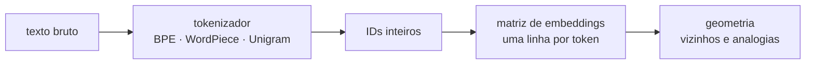
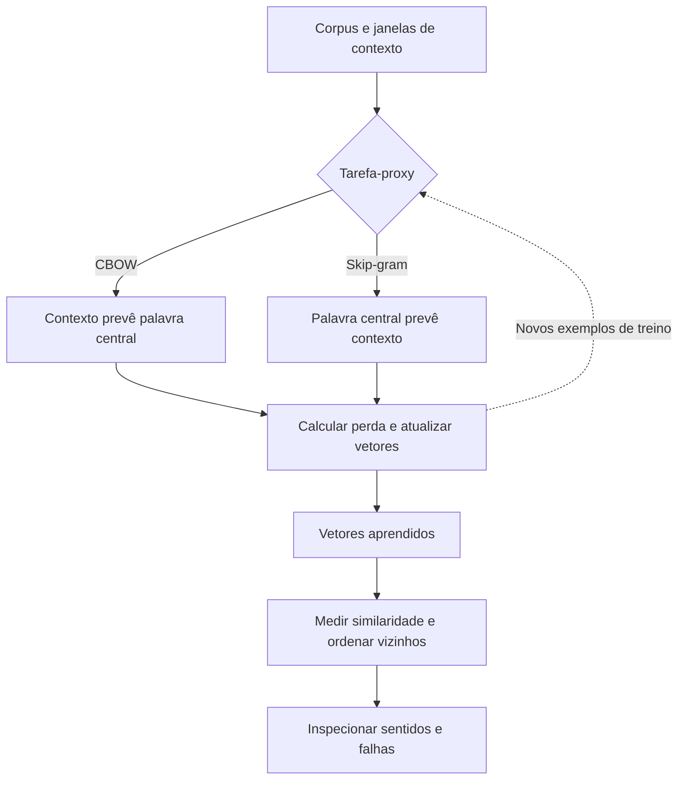
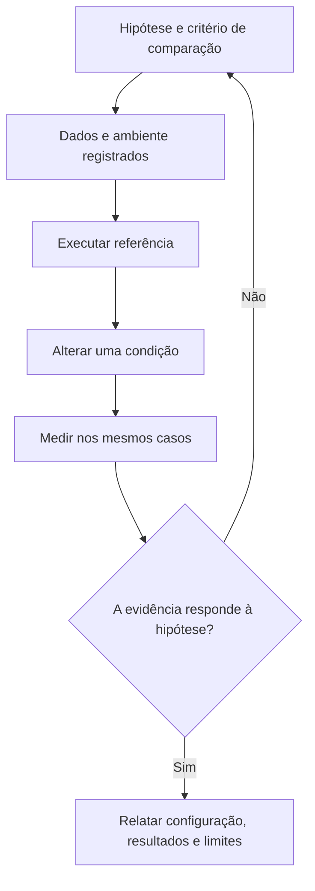
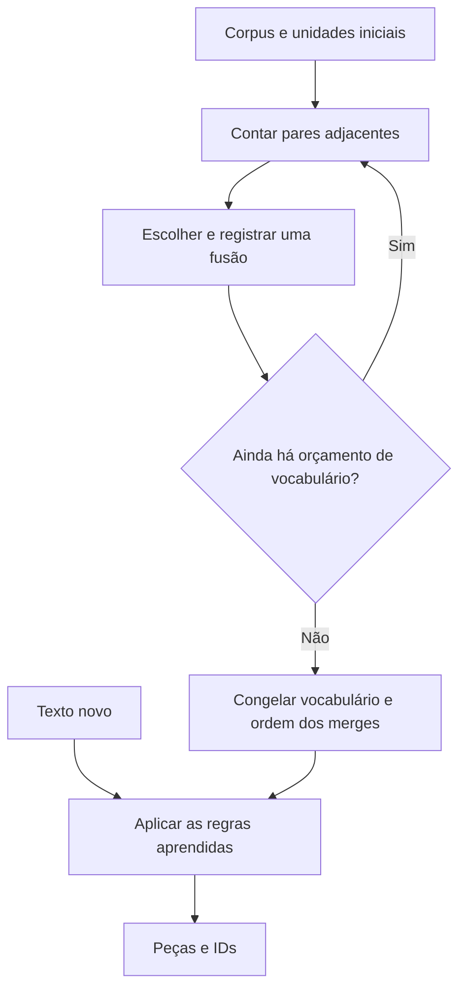
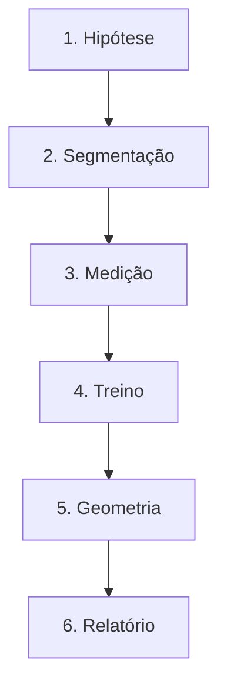

# Especificação de slides — Aula 4 (V2)

> **Rebalanceamento V2 — aula de laboratório (§6-bis do contrato).** Num lab a matemática **é** a
> prática: o aluno executa a fórmula. Por isso o **roteiro prático não foi reordenado** — setup, demo
> de live coding e os quatro checkpoints permanecem na ordem e nos minutos que funcionam em bancada.
> O que mudou:
>
> 1. **Cada checkpoint abre pelo comportamento esperado** — o que a célula imprime quando está certo
>    — e só depois nomeia o que implementar.
> 2. **A Parte 2 é nova:** um apêndice com o fundamento formal por trás de cada checkpoint, para quem
>    quiser entender o que está digitando. A.1 a A.5, com o CP4 recebendo dois itens porque tem dois
>    fundamentos independentes (projeção e analogia).
> 3. **Cada checkpoint ganhou um ponteiro** para o item correspondente, sem interromper a prática.
>
> Carga horária (120 min), numeração dos slides do fluxo, checkpoints, entregável, rubrica interna e
> objetivos de aprendizagem: idênticos à V1. **O notebook em `codigo/` não muda.**

<!-- SLIDE-FLOW:GUIDE:BEGIN -->
## Fluxogramas na produção dos slides

As orientações abaixo complementam o campo **Visual** dos slides indicados. Produzir os fluxogramas no próprio deck, como formas e conectores editáveis ou gráficos vetoriais; a biblioteca completa ao final torna esta especificação independente do portal.

- **Referência de composição:** título e propósito no topo, blocos numerados, conexões rotuladas, ramificações legíveis e uma saída identificada. Usar apenas o padrão visual da referência fornecida, sem importar seu assunto ou seus exemplos.
- **Tema do deck:** manter o fundo escuro e a paleta já especificada para a aula. Usar `#5b8cff` para o trecho ativo, tons neutros para o contexto e `#e2231a` conforme o significado definido no deck. Cor sempre acompanhada de rótulo.
- **Leitura:** entrada no topo ou à esquerda; saída na base ou à direita. Decisões em losangos, alternativas com rótulos e retornos apontando à etapa correta. Ramos paralelos convergem apenas onde seus resultados realmente são combinados.
- **Densidade:** no fluxo principal, projetar 3–6 blocos curtos por enquadramento, com corpo legível na última fileira. Um mapa maior pode ser revelado por etapas no mesmo slide. Detalhes, condições e explicações completas ficam nas notas; não reduzir a fonte para caber tudo.
- **Semântica:** mapas de percurso mostram ordem de estudo, não execução de um algoritmo. Manter separadas preparação e aplicação, treino e inferência, sequência e alternativas. Não transformar uma etapa opcional em obrigatória.
- **Integração:** o fluxograma substitui uma lista redundante ou ocupa o campo Visual; não cobre matrizes, tabelas, gráficos nem código indispensáveis. Preservar títulos, numeração, duração e referências aos apêndices.
- **Produção:** os blocos Mermaid abaixo são especificações do desenho. Renderizar/reconstruir como diagrama, nunca projetar o código Mermaid. Manter rótulos, bifurcações, retornos e limites declarados. Não transformar este caderno técnico em slides adicionais.
- **Ligação com o portal:** os mapas de mecanismo compartilham o conteúdo dos fluxogramas do portal. Em demonstrações, usar o mesmo vocabulário no deck e no controle interativo para facilitar a passagem entre os dois.
<!-- SLIDE-FLOW:GUIDE:END -->

## Diretrizes visuais

- **Tema:** escuro, accent `#e2231a` (vermelho CESAR), accent secundário `#5b8cff`.
- **Tipografia:** sans-serif para texto; monoespaçada para código, nomes de modelo, fórmulas e saídas
  de terminal.
- **Densidade:** máximo 5 linhas de texto por slide no fluxo. Um conceito por slide.
- **Proibido:** bullets genéricos; slide-parede de texto; clipart; gráfico sem eixo rotulado; código
  que ninguém vai ler de longe.
- **Específico de lab:** este deck é projetado **enquanto a turma digita**. Cada slide de checkpoint
  precisa ser legível do fundo da sala e ficar na tela os 15 a 18 minutos inteiros do checkpoint —
  nada de animação, nada de conteúdo que exija o instrutor presente para fazer sentido.
- **Slide de checkpoint tem estrutura fixa e idêntica**, e a **primeira linha é o critério de
  conclusão observável**, não o que implementar: título com o número do checkpoint, relógio, *o que
  aparece na tela quando está certo*, o que fazer (nomes reais de função e de argumento), a armadilha
  do checkpoint num cartão em accent, e o ponteiro `→ Apêndice A.n`. Quatro slides com a mesma
  moldura — a repetição é intencional, é o que dá ritmo ao lab.
- **Relógio visível em todo slide de checkpoint** (canto superior direito), com a janela daquele
  checkpoint. A turma precisa saber quanto tempo resta sem perguntar.
- **No apêndice:** densidade alta é esperada e desejável. É material de consulta, lido em casa com o
  notebook ao lado.

## Arco narrativo

O deck é um painel de instrumentos, não uma aula. Abre confirmando o que hoje entrega e o que hoje
**não** exige (CPU, não GPU), amarra as Aulas 2 e 3 em um slide, fixa o contrato do entregável e faz a
turma rodar a primeira célula antes de qualquer explicação. A partir daí cada slide é uma estação: um
slide de transição para o live coding e quatro slides de checkpoint que ficam parados na tela como
referência, cada um abrindo pelo que a tela imprime quando está certo. Fecha na fixidez do vetor —
cada palavra tem uma linha de matriz e ela é sempre a mesma — que é a porta da Aula 5.

A Parte 2 não se apresenta em aula. Ela existe porque, num lab, o aluno roda a conta antes de ter
tempo de entendê-la — e depois, em casa, na hora de responder às seis questões-guia, quer entender.
Duas das seis questões (a 2 e a 3) ficam muito melhores com A.2 e A.5 ao lado, e isso é dito
abertamente.

---

# PARTE 1 — FLUXO PRINCIPAL

*O que se apresenta em aula. 10 slides, 120 minutos com demo e quatro checkpoints. Ordem prática
preservada da V1, minuto a minuto.*

### Slide 1 — Abertura: Lab 1 — do texto ao vetor

<!-- SLIDE-FLOW:SLIDE:BEGIN -->
- **Fluxograma a incorporar neste slide:** **F00 — Embeddings: aprender relações e buscar vizinhos**. O desenho e os rótulos completos estão no caderno de fluxogramas ao final deste arquivo.
- **Composição:** integrar ao campo Visual; preservar exemplos, tabelas, fórmulas e dimensões solicitados neste slide. Destacar o trecho relacionado ao título e manter o restante em segundo plano. Os textos detalhados ficam nas notas, sem duplicar a lista de Conteúdo na tela.
<!-- SLIDE-FLOW:SLIDE:END -->

- **Tipo:** título
- **Título:** Lab 1 — do texto ao vetor
- **Frase-tese:** Nas duas últimas aulas eu afirmei. Hoje vocês medem — e uma das coisas que vocês vão
  medir é onde a minha afirmação não se sustenta.
- **Conteúdo:** Três linhas de dados da sessão: `Laboratório 1 · 120 min · entregável individual`; o
  que sai daqui (quatro tokenizadores medidos · razão PT/EN calculada · Word2Vec treinado por vocês ·
  dois gráficos e uma tabela de analogias); e um selo grande e inequívoco: **este lab roda em CPU — o
  primeiro lab com GPU é o Lab 2, na Aula 9**.
- **Visual:** full-bleed com o pipeline do lab como espinha central, em três estágios:
  `texto` → `tokens` → `vetores`. O selo de CPU em moldura de accent no rodapé, grande o bastante para
  ser lido do fundo da sala.
- **Notas do apresentador:** O aviso de CPU não é detalhe: todo semestre alguém queima cota de GPU num
  lab que não usa GPU. Roteiro, Slide 1. Mencionar de passagem, em trinta segundos, que este deck tem
  apêndice (A.1 a A.5) com a conta por trás de cada checkpoint — ninguém precisa dele hoje, e as
  questões-guia 2 e 3 ficam muito melhores com ele.



### Slide 2 — Recap: as Aulas 2 e 3 viram código hoje

<!-- SLIDE-FLOW:SLIDE:BEGIN -->
- **Fluxograma a incorporar neste slide:** **F00 — Embeddings: aprender relações e buscar vizinhos**. O desenho e os rótulos completos estão no caderno de fluxogramas ao final deste arquivo.
- **Composição:** integrar ao campo Visual; preservar exemplos, tabelas, fórmulas e dimensões solicitados neste slide. Destacar o trecho relacionado ao título e manter o restante em segundo plano. Os textos detalhados ficam nas notas, sem duplicar a lista de Conteúdo na tela.
<!-- SLIDE-FLOW:SLIDE:END -->

- **Tipo:** transição
- **Título:** Duas aulas de afirmação, quatro checkpoints de medição
- **Conteúdo:** Duas colunas curtas com o mapeamento explícito:
  - **Aula 2 — o token é escolha.** Vocabulário aprendido por algoritmo (BPE por frequência de pares,
    WordPiece por ganho de verossimilhança, Unigram por poda). O mesmo conteúdo custa mais em
    português. → **Checkpoints 1 e 2**
  - **Aula 3 — o vetor é subproduto.** Tarefa-proxy (prever contexto), skip-gram com amostragem
    negativa, vetor estático e o `banco` que ficou **aberto de propósito**. → **Checkpoints 3 e 4**
  Rodapé em accent: a pergunta dirigida da Aula 3 — quais analogias vão falhar num corpus pequeno — é
  respondida **com dado** no Checkpoint 4, e a razão está em `A.5`.
- **Visual:** split 50/50, cada coluna com uma seta grossa apontando para os checkpoints
  correspondentes. Sem reexplicar os algoritmos: só o nome e o critério de decisão de cada um, em
  monoespaçada.
- **Notas do apresentador:** Quatro minutos cronometrados. Não reexplicar BPE — o Checkpoint 1 mostra
  a diferença melhor que qualquer quadro. Se alguém pedir a diferença entre WordPiece e BPE, uma frase
  (critério: frequência × verossimilhança) e seguir; a álgebra está em **A.2 da Aula 2**.

### Slide 3 — O entregável e o critério

<!-- SLIDE-FLOW:SLIDE:BEGIN -->
- **Fluxograma a incorporar neste slide:** **F01 — Laboratório: da hipótese à evidência**. O desenho e os rótulos completos estão no caderno de fluxogramas ao final deste arquivo.
- **Composição:** integrar ao campo Visual; preservar exemplos, tabelas, fórmulas e dimensões solicitados neste slide. Destacar o trecho relacionado ao título e manter o restante em segundo plano. Os textos detalhados ficam nas notas, sem duplicar a lista de Conteúdo na tela.
<!-- SLIDE-FLOW:SLIDE:END -->

- **Tipo:** conceito
- **Título:** O que vale é o notebook executado
- **Conteúdo:** O entregável em três itens (notebook **executado**, com saídas visíveis · respostas às
  6 questões-guia · declaração de uso de IA) e o prazo de uma semana. A rubrica interna em cinco
  linhas de 20% (CP1 · CP2 · CP3 · CP4 · questões-guia). Duas regras em destaque: notebook sem saída
  volta para reexecução; **analogia que falhou entra na tabela como falha**, com a explicação.
- **Frase-tese:** O que eu avalio não é o resultado bonito — é a explicação do resultado que apareceu.
- **Visual:** left-heavy. À esquerda os três itens do entregável, numerados e grandes. À direita a
  rubrica como cinco barras iguais de 20%. As duas regras de rigor em caixa de accent na base, para a
  turma fotografar. Lembrete discreto: labs = 30% do curso, menor nota descartada.
- **Notas do apresentador:** Silêncio de alguns segundos com a rubrica projetada — a turma fotografa.
  Dupla na aula é permitida; a entrega é individual. Dizer em voz alta que as duas questões-guia que
  mais separam nota são a 2 (o que a razão PT/EN **não** permite concluir) e a 3 (por que as analogias
  falham) — e que as duas estão respondidas com rigor em **A.2** e **A.5**.

### Slide 4 — Setup do ambiente

<!-- SLIDE-FLOW:SLIDE:BEGIN -->
- **Fluxograma a incorporar neste slide:** **F01 — Laboratório: da hipótese à evidência**. O desenho e os rótulos completos estão no caderno de fluxogramas ao final deste arquivo.
- **Composição:** integrar ao campo Visual; preservar exemplos, tabelas, fórmulas e dimensões solicitados neste slide. Destacar o trecho relacionado ao título e manter o restante em segundo plano. Os textos detalhados ficam nas notas, sem duplicar a lista de Conteúdo na tela.
<!-- SLIDE-FLOW:SLIDE:END -->

- **Tipo:** código
- **Título:** A primeira célula roda agora — o download acontece enquanto eu falo
- **Conteúdo:** As três primeiras células do notebook, na ordem, em monoespaçada:
  ```
  1. %pip install -q "gensim==4.3.3" "scipy<1.14" transformers scikit-learn matplotlib
     → REINICIAR O RUNTIME depois desta célula
  2. imports + as duas constantes do exercício
     PRECO_HIPOTETICO_POR_1K_TOKENS = 0.50   # [definir na oferta]
     JANELA_CONTEXTO = 8192
  3. AutoTokenizer.from_pretrained × 4  → imprime o tamanho do vocabulário de cada um
  ```
  Aviso em destaque máximo: se o import do `gensim` reclamar de `scipy.linalg.triu`, **o runtime não
  foi reiniciado** — reiniciar e rodar de novo. A pinagem não é capricho: o `gensim` chama
  `scipy.linalg.triu`, que foi removido no `scipy` 1.13, e a mensagem de erro não menciona versão
  nenhuma.
- **Frase-tese:** Se o import do gensim reclamar de uma função chamada `triu`, não é culpa de vocês: é
  o runtime que precisa reiniciar.
- **Visual:** as três células como blocos de código empilhados e numerados. O aviso do `triu` em
  moldura de accent, ocupando um terço do slide — é o erro número um deste lab e precisa ser lido sem
  o instrutor falar. A constante de preço com a etiqueta **hipótese de exercício** em accent ao lado.
- **Notas do apresentador:** Circular a sala olhando telas nesses três minutos em vez de falar. Não
  avançar com mais de dois ou três alunos travados. Dizer em voz alta, uma vez, que
  `PRECO_HIPOTETICO_POR_1K_TOKENS` é **hipótese declarada do exercício** e não preço de provedor
  nenhum — o valor da oferta é `[definir na oferta]`.

### Slide 5 — [Demo] Live coding: o caminho completo em 20 minutos

<!-- SLIDE-FLOW:SLIDE:BEGIN -->
- **Fluxograma a incorporar neste slide:** **F01 — Laboratório: da hipótese à evidência**. O desenho e os rótulos completos estão no caderno de fluxogramas ao final deste arquivo.
- **Composição:** integrar ao campo Visual; preservar exemplos, tabelas, fórmulas e dimensões solicitados neste slide. Destacar o trecho relacionado ao título e manter o restante em segundo plano. Os textos detalhados ficam nas notas, sem duplicar a lista de Conteúdo na tela.
<!-- SLIDE-FLOW:SLIDE:END -->

- **Tipo:** transição para demonstração
- **Título:** O caminho inteiro em vinte linhas
- **Frase-tese:** Vinte linhas para ir de texto a vetor. O trabalho de hoje não é o caminho — é medir o
  caminho.
- **Conteúdo:** O espinho dorsal em cinco passos, sem resultado (o resultado aparece ao vivo):
  ```
  1. carregar um tokenizador             AutoTokenizer.from_pretrained("gpt2")
  2. tokenizar uma frase em PT           IDs, e depois convert_ids_to_tokens → as peças
  3. calcular fertilidade                tokens / palavras, nos DOIS tokenizadores
  4. treinar Word2Vec                    poucos milhares de sentenças, cronometrado
  5. três vizinhos semânticos            uma palavra frequente, uma de domínio, uma rara
  ```
  Uma linha final: os checkpoints são este caminho com rigor — quatro tokenizadores em vez de dois,
  corpus paralelo em vez de uma frase, gráfico em vez de `print`.
- **Visual:** slide de transição, quase vazio. Os cinco passos como lista numerada em monoespaçada,
  esperando ser preenchida. Cronômetro de 20 min no canto.
- **Fundamento:** os dois números que a demo produz — as **duas fertilidades** da mesma frase em
  português, e o **tempo de treino em segundos** — são os dois critérios de conclusão que os
  Checkpoints 1 e 3 vão exigir. Fertilidade é `tokens / palavras`, e o que faz dela uma métrica é a
  normalização pelo denominador.
  → por que a razão e não a contagem, o que o contador de palavras conta, e o viés de `[CLS]`/`[SEP]`:
  **Apêndice A.1** (slide 11)
- **Notas do apresentador:** Digitar, não colar; errar na frente deles e consertar é o valor. Notebook
  em branco, não o do aluno. Passos na Parte 2 do roteiro. Anotar as duas fertilidades no quadro — elas
  ficam lá até o fim do CP1.

### Slide 6 — [Checkpoint 1] Quatro tokenizadores, três textos

<!-- SLIDE-FLOW:SLIDE:BEGIN -->
- **Fluxograma a incorporar neste slide:** **F02 — BPE: aprender e depois aplicar**. O desenho e os rótulos completos estão no caderno de fluxogramas ao final deste arquivo.
- **Composição:** integrar ao campo Visual; preservar exemplos, tabelas, fórmulas e dimensões solicitados neste slide. Destacar o trecho relacionado ao título e manter o restante em segundo plano. Os textos detalhados ficam nas notas, sem duplicar a lista de Conteúdo na tela.
- **Momento de exibição:** apresentar o fluxo preenchido na discussão ou conferência, depois da tentativa da turma; durante a atividade, ocultar as etapas que entregariam a solução.
<!-- SLIDE-FLOW:SLIDE:END -->

- **Tipo:** exercício (moldura de checkpoint)
- **Título:** CP1 · 00:35–00:50 — a tabela e as peças da palavra longa
- **Conteúdo:**
  **Quando está certo, a tela imprime duas coisas:**
  ```
  tokenizador              texto     palavras   tokens  fertilidade
  gpt2 (BPE)               PT              43       XX         X.XX
  ...                      (12 linhas: 4 tokenizadores × 3 textos)

  inconstitucionalmente
    gpt2 (BPE)              N peças  ['...', '...']
    bert-pt (WordPiece)     M peças  ['...', '...']
  ```
  Doze linhas de tabela com **fertilidade em todas** — não só contagem — e a decomposição de três
  palavras longas em português, lado a lado nos quatro vocabulários.

  Os quatro tokenizadores e o que cada um é:
  ```
  gpt2                                   BPE byte-level      treinado sobretudo em inglês
  bert-base-uncased                      WordPiece           inglês
  neuralmind/bert-base-portuguese-cased  WordPiece           PORTUGUÊS
  xlm-roberta-base                       Unigram/SentencePiece   100 idiomas
  ```
  Os três textos: parágrafo técnico em PT · o equivalente em EN · trecho de código com indentação.
- **Frase-tese:** Um tokenizador treinado em português quebra `inconstitucionalmente` em pedaços que
  são morfemas. Um treinado em inglês quebra em pedaços que não são nada.
- **Visual:** no topo, o critério de conclusão em caixa destacada (o cabeçalho da tabela com a coluna
  `fertilidade` circulada, e o bloco da palavra longa). Abaixo à esquerda, os quatro modelos com a
  família de cada um. À direita, cartão de alerta em accent com as três armadilhas: **contar
  `input_ids` de `tokenizer(texto)` inclui `[CLS]` e `[SEP]`** e infla dois tokens em texto curto;
  **imprimir só tokens sem dividir por palavras** não compara nada; **esperar que o BERT-PT ganhe em
  todos os textos** — ele não ganha no inglês nem no código, e essa surpresa é conteúdo. Relógio
  `00:35–00:50` no canto.
- **Fundamento:** `fertilidade = nº de tokens / nº de palavras`, e ela é propriedade do **par**
  tokenizador × texto, não do tokenizador. O denominador é `len(re.findall(r"\S+", texto))` — sequências
  de não-espaço —, o que faz pontuação colada contar junto com a palavra.
  → por que a razão e não a contagem, o que exatamente o denominador conta, o viés dos tokens
  especiais, e por que o byte-level fragmenta acento em português: **Apêndice A.1** (slide 11)
- **Notas do apresentador:** Condução na Parte 3 do roteiro. O `xlm-roberta-base` é o download mais
  pesado — quem estiver esperando começa a tabela com três e completa depois. Circular olhando tela: a
  pergunta que resolve metade dos casos é "onde está a sua coluna de fertilidade?".

### Slide 7 — [Checkpoint 2] A razão PT/EN e a conta do custo

<!-- SLIDE-FLOW:SLIDE:BEGIN -->
- **Fluxograma a incorporar neste slide:** **F01 — Laboratório: da hipótese à evidência**. O desenho e os rótulos completos estão no caderno de fluxogramas ao final deste arquivo.
- **Composição:** integrar ao campo Visual; preservar exemplos, tabelas, fórmulas e dimensões solicitados neste slide. Destacar o trecho relacionado ao título e manter o restante em segundo plano. Os textos detalhados ficam nas notas, sem duplicar a lista de Conteúdo na tela.
- **Momento de exibição:** apresentar o fluxo preenchido na discussão ou conferência, depois da tentativa da turma; durante a atividade, ocultar as etapas que entregariam a solução.
<!-- SLIDE-FLOW:SLIDE:END -->

- **Tipo:** exercício (moldura de checkpoint)
- **Título:** CP2 · 00:50–01:05 — o número que vira dinheiro e o número que vira janela
- **Conteúdo:**
  **Quando está certo, a tela imprime três blocos:**
  ```
  1) por tokenizador:  tok PT | tok EN | razão média | desvio        (n = 20 pares)
  2) custo PT × custo EN × sobrepreço PT (%)     preço hipotético do exercício
  3) quantos pares cabem em 8 192 tokens em PT e em EN, e a perda (%)
  ```
  E existe no notebook **um parágrafo de três linhas** (TODO 3), cuja **terceira linha é obrigatória**:
  o que estes números **não** permitem concluir.

  A armadilha que o próprio notebook arma, e é o ponto do checkpoint: ele imprime **duas médias
  diferentes**. A coluna `razão média` é a média das razões par a par; a coluna `sobrepreço` sai da
  **razão dos totais**. Os dois números não são iguais, e só um deles é o de dinheiro.
- **Frase-tese:** Esse número é a razão pela qual o mesmo produto custa mais para atender em português.
  Não é opinião: é a divisão de duas contagens — e existem duas divisões possíveis.
- **Visual:** no topo, o critério de conclusão em três miniaturas (a tabela de razões, a tabela de
  custo, a tabela de janela). Abaixo à esquerda: duas barras horizontais para o mesmo conteúdo, uma
  rotulada PT e outra EN, a de PT visivelmente mais longa, ambas medidas em tokens. À direita: a janela
  de 8 192 tokens desenhada como caixa fixa, com mais sentenças EN caber que PT dentro dela. Cartão em
  accent: **`PRECO_HIPOTETICO_POR_1K_TOKENS = 0.50  # [definir na oferta]` — hipótese de exercício, não
  preço de provedor.** Relógio `00:50–01:05`.
- **Fundamento:** a **média das razões** `(1/n)·Σ(t_ptᵢ/t_enᵢ)` e a **razão dos totais**
  `(Σt_ptᵢ)/(Σt_enᵢ)` são quantidades diferentes: a segunda é uma média das razões **ponderada pelo
  comprimento**. Para dinheiro use a razão dos totais; para caracterizar o tokenizador, a média com
  desvio e com `n`. E as duas consequências têm formas diferentes: em custo a relação é **linear**
  (razão `r` → `r−1` de sobrepreço), em janela é **inversa** (razão `r` → perda de `(r−1)/r`).
  → as duas médias com contraexemplo numérico, a conta da janela, o `pstdev` do notebook e por que o
  `int()` da contagem de páginas erra: **Apêndice A.2** (slide 12)
- **Notas do apresentador:** Condução na Parte 3. Corrigir em voz alta e para a sala inteira quem
  tratar a constante como preço real — esse número vaza para relatório depois. A formalização da
  fertilidade e a conta da janela estão em **A.4 da Aula 2**; este item acrescenta o que é específico do
  notebook. Intervalo de 10 min logo após este checkpoint, com o horário de volta escrito no quadro.

### Slide 8 — [Checkpoint 3] Word2Vec em português com gensim

<!-- SLIDE-FLOW:SLIDE:BEGIN -->
- **Fluxograma a incorporar neste slide:** **F00 — Embeddings: aprender relações e buscar vizinhos**. O desenho e os rótulos completos estão no caderno de fluxogramas ao final deste arquivo.
- **Composição:** integrar ao campo Visual; preservar exemplos, tabelas, fórmulas e dimensões solicitados neste slide. Destacar o trecho relacionado ao título e manter o restante em segundo plano. Os textos detalhados ficam nas notas, sem duplicar a lista de Conteúdo na tela.
- **Momento de exibição:** apresentar o fluxo preenchido na discussão ou conferência, depois da tentativa da turma; durante a atividade, ocultar as etapas que entregariam a solução.
<!-- SLIDE-FLOW:SLIDE:END -->

- **Tipo:** exercício (moldura de checkpoint)
- **Título:** CP3 · 01:15–01:32 — treinar o próprio mapa
- **Conteúdo:**
  **Quando está certo, a tela imprime três coisas:**
  ```
  Corpus: <qual das 3 fontes respondeu>  (X.XX MB)
  N sentenças · M tokens de palavra
  Treinado em XX.Xs
  Vocabulário: N.NNN palavras (com min_count=5)
  ```
  e, na célula seguinte, `most_similar` de **três palavras escolhidas por vocês**, cada uma com um
  comentário de uma linha julgando a vizinhança.

  A chamada exata, que é a Aula 3 virando argumentos:
  ```
  Word2Vec(sentences, vector_size=100, window=5,
           min_count=5, negative=10, epochs=5, sg=1, workers=4, seed=42)
  ```
  Alerta que vale nota na questão-guia 5: **`min_count=5` decide quais palavras existem no mapa.** É
  decisão semântica, não ajuste de desempenho.
- **Frase-tese:** `min_count` não é ajuste de performance. É a linha em que eu decido quais palavras
  existem no meu mapa.
- **Visual:** no topo, o critério em quatro linhas de terminal. Abaixo, a chamada de função grande e
  centralizada, com cada argumento anotado por uma linha fina apontando para o que ele controla
  (dimensão · janela · corte de cauda · negativas · passadas · skip-gram). Ao lado, um histograma
  esquemático de frequência de palavras com uma linha vertical de accent em `min_count=5` e a cauda
  cortada sombreada. Cartão em accent: "vocabulário com poucas dezenas de entradas = vocês passaram
  uma lista de strings, não uma lista de listas de tokens". Relógio `01:15–01:32`.
- **Fundamento:** cada um dos sete argumentos entra em um lugar diferente do objetivo do skip-gram com
  amostragem negativa: `sg` define quais pares existem, `window` define quais pares entram, `negative`
  é o `k` que fixa o nível de PMI que sobrevive, `min_count` **remove palavras do vocabulário antes de
  os pares existirem**, e `workers=4` torna o treino **não determinístico mesmo com `seed=42`**.
  → cada argumento no objetivo, a aritmética de Zipf que faz `min_count` cortar muitos tipos e poucas
  ocorrências, a janela dinâmica do gensim, e o que `seed` garante e o que não garante:
  **Apêndice A.3** (slide 13)
- **Notas do apresentador:** Condução na Parte 3. `ImportError` com `triu` = runtime não reiniciado.
  Se o treino passar de um minuto, o corpus veio grande demais — reduzir o número de sentenças. O
  objetivo do skip-gram em si está derivado em **A.4 da Aula 3**; A.3 daqui é sobre os
  hiperparâmetros.

### Slide 9 — [Checkpoint 4] PCA, t-SNE, vizinhos e analogias

<!-- SLIDE-FLOW:SLIDE:BEGIN -->
- **Fluxograma a incorporar neste slide:** **F00 — Embeddings: aprender relações e buscar vizinhos**. O desenho e os rótulos completos estão no caderno de fluxogramas ao final deste arquivo.
- **Composição:** integrar ao campo Visual; preservar exemplos, tabelas, fórmulas e dimensões solicitados neste slide. Destacar o trecho relacionado ao título e manter o restante em segundo plano. Os textos detalhados ficam nas notas, sem duplicar a lista de Conteúdo na tela.
- **Momento de exibição:** apresentar o fluxo preenchido na discussão ou conferência, depois da tentativa da turma; durante a atividade, ocultar as etapas que entregariam a solução.
<!-- SLIDE-FLOW:SLIDE:END -->

- **Tipo:** exercício (moldura de checkpoint)
- **Título:** CP4 · 01:32–01:50 — a geometria e as analogias que falham
- **Conteúdo:**
  **Quando está certo, existem duas coisas no notebook:**
  ```
  1) DOIS gráficos lado a lado, com eixo rotulado e legenda por grupo
     "PCA — preserva variância global"  ·  "t-SNE — preserva vizinhança local (perp=NN)"
  2) a tabela de 4 a 6 analogias com o resultado REAL de cada uma:
     analogia | esperado | obtido | ok?   (SIM | top3 | não | fora do vocab)
     ... e a linha final "X/Y analogias com acerto no top-1"
  ```
  As duas fórmulas que o checkpoint usa, enunciadas:
  ```
  cos(u, v) = (u · v) / (‖u‖ · ‖v‖)
  vec(rainha) ≈ vec(rei) − vec(homem) + vec(mulher)
  ```
  Regra em destaque, repetida do slide 3: **analogia que falhou entra na tabela como falha**, com a
  explicação. Quem reexecutar o treino procurando o caso bonito perde ponto em vez de ganhar.
- **Frase-tese:** Distância num t-SNE não significa nada. Aglomerado significa. Quem lê distância em
  t-SNE está lendo um artefato da projeção.
- **Visual:** no topo, o critério em duas linhas. Abaixo, dois painéis lado a lado, um rotulado PCA e
  outro t-SNE, com os mesmos quatro grupos de pontos coloridos dispostos de maneiras diferentes — no
  t-SNE os grupos aparecem mais compactos e mais separados, e uma anotação em accent atravessa o painel
  dizendo que **a distância entre grupos ali é artefato**. Rodapé com as quatro razões estruturais da
  falha das analogias: cauda esparsa · `min_count` cortando · 5 épocas · domínio estreito. Relógio
  `01:32–01:50`.
- **Fundamento:** as duas projeções otimizam coisas diferentes e por isso permitem leituras diferentes.
  A PCA é uma projeção **ortogonal**, logo uma **contração**: `‖P(x)−P(y)‖ ≤ ‖x−y‖` — pontos que
  aparecem longe **estão** longe, pontos que aparecem perto podem não estar. O t-SNE minimiza uma
  divergência **assimétrica** que pune quebrar vizinhança e quase não pune inventá-la, o que preserva
  aglomerado e destrói escala global.
  → as duas otimizações escritas, a prova da contração, a assimetria da divergência, o papel de
  `perplexity` e a regra de leitura de cada gráfico: **Apêndice A.4** (slide 14) ·
  o que `most_similar(positive, negative)` calcula, por que a exclusão das entradas é indispensável e a
  razão sinal/ruído em corpus pequeno: **Apêndice A.5** (slide 15)
- **Notas do apresentador:** Condução na Parte 3. Aos 01:45 anunciar cinco minutos e dizer que os dois
  gráficos salvos já satisfazem metade do critério. Cortar quem reexecuta o treino procurando a
  analogia bonita. Erro clássico: `perplexity` maior ou igual ao número de amostras — o notebook
  calcula um valor seguro, mas quem editou a lista de palavras quebra isso. O objetivo da analogia está
  em **A.5 da Aula 3**; A.5 daqui é o que muda na implementação e no corpus pequeno.

### Slide 10 — Recolhimento e ponte para a Aula 5

<!-- SLIDE-FLOW:SLIDE:BEGIN -->
- **Fluxograma a incorporar neste slide:** **F03 — O percurso desta aula**. O desenho e os rótulos completos estão no caderno de fluxogramas ao final deste arquivo.
- **Composição:** integrar ao campo Visual; preservar exemplos, tabelas, fórmulas e dimensões solicitados neste slide. Destacar o trecho relacionado ao título e manter o restante em segundo plano. Os textos detalhados ficam nas notas, sem duplicar a lista de Conteúdo na tela.
<!-- SLIDE-FLOW:SLIDE:END -->

- **Tipo:** encerramento
- **Título:** Cada palavra tem uma linha de matriz — e ela é sempre a mesma
- **Conteúdo:** À esquerda, o inventário do que foi medido: quatro tokenizadores × três textos com
  fertilidade · a razão PT/EN com desvio e com `n` · um Word2Vec treinado por vocês · dois gráficos ·
  uma tabela de analogias com o resultado real. À direita, o checklist de entrega (prazo de 1 semana):
  - ☐ notebook executado, saídas visíveis nos quatro checkpoints
  - ☐ respostas às 6 questões-guia
  - ☐ declaração de uso de IA

  Depois, o limite do que foi construído: a palavra tem um ID, o ID indexa uma linha de matriz, e
  aquela linha é **a mesma em qualquer contexto** — é o `banco` da Aula 3 dividindo uma linha entre
  instituição e assento. Num canto discreto, o índice do apêndice: A.1 fertilidade · A.2 a razão e as
  duas médias · A.3 os hiperparâmetros no objetivo · A.4 PCA × t-SNE · A.5 analogias em corpus pequeno.
- **Frase-tese:** Hoje cada palavra tem uma linha de matriz e ela é sempre a mesma. A Aula 5 é onde a
  representação começa a olhar em volta antes de decidir o que ela é.
- **Visual:** duas metades. Topo: a tabela de embeddings desenhada como matriz, com a linha de `banco`
  destacada em accent e duas setas chegando nela de duas frases de contexto opostas — uma de agência
  bancária, outra de praça — colidindo na mesma linha. Base: o checklist de entrega em caixa destacada
  para fotografar. Rodapé: "Aula 5 — Modelos sequenciais e o nascimento da atenção: a representação
  começa a depender do contexto."
- **Notas do apresentador:** Não estourar as duas horas. Se o CP4 atrasou, cortar a explicação de
  PCA × t-SNE e proteger este slide: a ponte para a Aula 5 é o que dá sentido ao módulo. Projetar o
  índice do apêndice por 20 s dizendo que as questões-guia 2 e 3 estão respondidas em A.2 e A.5.
  Leitura da Aula 5: Bahdanau et al., arXiv 1409.0473.

---

# PARTE 2 — APÊNDICE MATEMÁTICO

*Material de estudo e consulta. **Não se apresenta em aula.** Um item por checkpoint com fundamento —
o CP4 recebe dois, porque projeção e analogia são fundamentos independentes. Reconstrói, com rigor
completo, a conta por trás do que o aluno executou. Autossuficiente: quem estuda por aqui sem ter
feito o lab consegue reconstruir tudo, e quem fez o lab consegue explicar por que o próprio número é
aquele.*

### Slide 11 — A.1 · Fertilidade: a métrica que o Checkpoint 1 calcula

<!-- SLIDE-FLOW:SLIDE:BEGIN -->
- **Fluxograma a incorporar neste slide:** **F01 — Laboratório: da hipótese à evidência**. O desenho e os rótulos completos estão no caderno de fluxogramas ao final deste arquivo.
- **Composição:** integrar ao campo Visual; preservar exemplos, tabelas, fórmulas e dimensões solicitados neste slide. Destacar o trecho relacionado ao título e manter o restante em segundo plano. Os textos detalhados ficam nas notas, sem duplicar a lista de Conteúdo na tela.
- **Momento de exibição:** apresentar o fluxo preenchido na discussão ou conferência, depois da tentativa da turma; durante a atividade, ocultar as etapas que entregariam a solução.
<!-- SLIDE-FLOW:SLIDE:END -->

- **Tipo:** apêndice — definição, viés de medição e o caso do acento
- **Invocado em:** slides 5 e 6 (demo e Checkpoint 1)

**Relação com a Aula 2.** A formalização de fertilidade como propriedade do **par** tokenizador ×
texto, e as duas médias, estão em **A.4 da Aula 2**. Este item **não repete** aquilo: ele acrescenta o
que é específico da medição feita no notebook — o que exatamente o denominador conta, os dois vieses
que o código evita, e por que o acento em português custa o que custa.

**Notação.**
`T` — um texto. `tok` — um tokenizador. `n_tok(tok, T)` — número de tokens que `tok` produz para `T`,
**sem tokens especiais**. `n_pal(T)` — número de palavras de `T`. `f(tok, T)` — fertilidade.

**Definição.**
```
f(tok, T) = n_tok(tok, T) / n_pal(T)
```

**Premissas.** (i) `n_pal` é computado por uma regra fixa e a mesma para todos os tokenizadores — se
mudar o contador de palavras, todas as fertilidades mudam juntas e as comparações relativas sobrevivem,
mas os valores absolutos não. (ii) Os tokens especiais estão fora da contagem. (iii) O texto é um só
para todos os tokenizadores comparados — comparar fertilidades de textos diferentes não significa nada.

**Por que a razão, e não a contagem.**
Contar tokens não compara nada, porque textos diferentes têm tamanhos diferentes. A pergunta que
interessa é *quantos tokens este tokenizador gasta por unidade de conteúdo*, e a razão normaliza o
tamanho fora da conta. É consumo por quilômetro, não litros no tanque.

*O que a normalização não conserta.* Fertilidade continua dependendo do **texto**: o mesmo tokenizador
tem fertilidade baixa em inglês jornalístico e alta em português médico. Por isso a tabela do CP1 tem
doze linhas e não quatro: a métrica é do par.

**O que o denominador conta, exatamente.** O notebook usa
```
n_pal(T) = len(re.findall(r"\S+", T))
```
isto é, **sequências maximais de caracteres que não são espaço**. Três consequências que valem saber
antes de interpretar qualquer número da tabela:
1. **Pontuação colada conta junto.** `sequência.` é uma palavra, não duas — mas o tokenizador quase
   certamente produz dois tokens. Isso **infla** a fertilidade de qualquer texto pontuado, de forma
   igual para todos os tokenizadores.
2. **No texto de código, "palavra" perde sentido.** `q @ k.transpose(-2, -1)` tem, por esta regra,
   quatro "palavras". A fertilidade do código é, portanto, um número grande e difícil de interpretar —
   e é exatamente por isso que a questão-guia 4 pergunta pelo **número de tokens** do código, não pela
   fertilidade dele.
3. **A regra é a mesma para os quatro tokenizadores.** Então a **ordem** entre eles é confiável mesmo
   que o valor absoluto seja discutível. Ordem é o que o CP1 pede.

**O viés que o notebook evita, e que o aluno reintroduz.**
O código chama
```
tok.encode(texto, add_special_tokens=False)
```
Se o aluno "simplificar" para `tokenizer(texto)["input_ids"]`, o WordPiece do BERT acrescenta `[CLS]` no
começo e `[SEP]` no fim: **+2 tokens**. Num texto de 43 palavras com fertilidade real 1,60, isso dá
`(68,8 + 2)/43 = 1,647` — um erro de **2,9%**. Em textos curtos o erro é muito maior: numa frase de 8
palavras com 12 tokens, `14/8 = 1,750` contra `12/8 = 1,500`, **17% de erro**. E o erro é
**assimétrico**: atinge os dois BERTs e o XLM-R, e não atinge o GPT-2, que não usa tokens especiais por
padrão. Ou seja, o descuido não adiciona ruído — ele **inverte a comparação** que é o objeto do
checkpoint.

**Por que o byte-level fragmenta o acento — a conta.**
O GPT-2 usa BPE **byte-level**: os símbolos base não são caracteres Unicode, são os **256 bytes**. Em
UTF-8, o ASCII ocupa 1 byte por caractere e as letras acentuadas do português ocupam **2 bytes**.
Então, antes de qualquer merge:
```
"cao"  →  c, a, o                       3 símbolos base
"ção"  →  ç(2 bytes), ã(2 bytes), o     5 símbolos base
```
Se os merges foram aprendidos num corpus majoritariamente inglês, não existe merge para a sequência de
bytes de `ção` — e a sequência fica exposta, token por byte. É por isso que `paralelização` e
`interpretabilidade` se quebram tanto mais no GPT-2 que no BERT-PT: não é o algoritmo, é **de onde
vieram os merges**.

*O que isso implica para o CP1.* A comparação `gpt2` × `bert-pt` no texto em português mede duas coisas
somadas: a diferença de algoritmo (BPE × WordPiece) e a diferença de corpus dos merges (inglês ×
português). O CP1 **não separa** as duas, e a resposta completa do TODO 1 diz isso. A extensão (a) do
lab — treinar um BPE byte-level próprio em português e comparar com o GPT-2 — é justamente o
experimento que isola a segunda: mesmo algoritmo, corpus diferente.

**Casos-limite.**
- **`f < 1`.** Possível: um tokenizador cujo vocabulário tenha itens multi-palavra produziria menos
  tokens que palavras. Não acontece com os quatro do lab, e ver `f < 1` é sinal de contagem errada.
- **`f = 1`.** Cada palavra é um token. É o alvo implícito de um tokenizador perfeitamente adaptado ao
  texto, e não acontece em texto real por causa da pontuação e da cauda de Zipf.
- **Texto de uma palavra.** `f` é a contagem de tokens daquela palavra, e o número não tem valor
  estatístico. É por isso que a decomposição das palavras longas é reportada **separadamente**, como
  lista de peças, e não como fertilidade.
- **Texto sem espaços** (uma URL longa, um hash). `n_pal = 1` e `f` explode. O número é correto e
  inútil, o que mostra que a métrica pressupõe texto segmentável por espaço — e é a razão de línguas
  sem espaço precisarem de outro denominador (caracteres ou bytes).

**De volta ao fluxo:** slide 6.

### Slide 12 — A.2 · A razão PT/EN: duas médias, dinheiro e janela
- **Tipo:** apêndice — as duas agregações, com contraexemplo numérico
- **Invocado em:** slide 7 (Checkpoint 2)

**Relação com a Aula 2.** A distinção entre as duas médias e a conta da janela foram estabelecidas em
**A.4 da Aula 2**. Este item **não repete** a formalização: ele mostra que **o notebook imprime as duas
médias, em células diferentes**, que os dois números não são iguais, e que só um deles é o de dinheiro
— mais os dois detalhes de implementação que mudam o terceiro decimal.

**Notação.**
`n` — número de pares do corpus paralelo (no notebook, `n = 20`). `t_ptᵢ`, `t_enᵢ` — tokens do lado PT
e do lado EN do par `i`, contados **com o mesmo tokenizador**. `rᵢ = t_ptᵢ / t_enᵢ` — razão do par `i`.

**As duas agregações.**
```
média das razões:     r̄ = (1/n) · Σᵢ rᵢ
razão dos totais:     R  = (Σᵢ t_ptᵢ) / (Σᵢ t_enᵢ)
```

**Elas não são a mesma quantidade — e a relação é exata.** Escrevendo `t_ptᵢ = rᵢ · t_enᵢ`:
```
R = (Σᵢ rᵢ · t_enᵢ) / (Σᵢ t_enᵢ) = Σᵢ wᵢ rᵢ ,     com  wᵢ = t_enᵢ / Σⱼ t_enⱼ
```
Isto é: **`R` é a média das razões ponderada pelo comprimento do lado EN**, e `r̄` é a média sem peso.
As duas coincidem se e somente se todos os `t_enᵢ` forem iguais, ou se todos os `rᵢ` forem iguais.

*Contraexemplo com dois pares, para fixar.*
```
par 1:  t_pt = 10, t_en =  5   →  r₁ = 2,000
par 2:  t_pt = 30, t_en = 30   →  r₂ = 1,000

r̄ = (2,000 + 1,000)/2 = 1,500
R = (10+30)/(5+30) = 40/35 = 1,143
```
**1,500 contra 1,143.** Não é arredondamento: é uma diferença de 31% entre os dois números, produzida
por um par curto com razão alta. Em corpus real o efeito é menor e existe.

**Qual usar para quê.**

*Para dinheiro, use `R`.* O custo total é proporcional ao **total** de tokens:
```
custo_PT = (Σᵢ t_ptᵢ)/1000 · preço        custo_EN = (Σᵢ t_enᵢ)/1000 · preço
custo_PT / custo_EN = R
```
O sobrepreço é `(R − 1) · 100%`. E é exatamente isso que a célula de projeção do notebook calcula —
ela parte de `tot_pt` e `tot_en`, não da média `media`. **A coluna `sobrepreço` do notebook é
`R − 1`, e a coluna `razão média` da célula anterior é `r̄`.** Quem reporta `r̄` como "quanto o
português custa mais" está reportando um número que não é o da fatura.

*Para caracterizar o tokenizador, use `r̄` com desvio e com `n`.* Aí cada par é uma observação de igual
peso, e o desvio informa a dispersão: `r̄ = 1,35 ± 0,05` e `r̄ = 1,35 ± 0,40` descrevem tokenizadores
muito diferentes, e o segundo tem pares em que o português é mais **barato**. Razão sem desvio e sem
`n` não é número.

**A conta da janela, e por que a perda não é o sobrepreço.**
Sejam `f_pt` e `f_en` as fertilidades e `W` o tamanho da janela (`8 192` no notebook). O número de
unidades de conteúdo que cabem é inversamente proporcional aos tokens por unidade:
```
cabe_PT = W / (tokens médios por unidade em PT)      cabe_EN = W / (… em EN)
cabe_PT / cabe_EN = 1 / R
perda de conteúdo = 1 − 1/R = (R − 1)/R
```
**As duas consequências têm formas diferentes**, e confundi-las é o erro nº 1 de orçamento:
```
R = 1,33  →  sobrepreço = +33%   (linear)
             perda de janela = 0,33/1,33 = 24,8%  ≈ 25%   (inversa)
```
Trinta e três por cento mais caro e **vinte e cinco** por cento menos conteúdo na janela. Os dois números
saem da **mesma** razão e não são o mesmo número. A leitura em uma linha: preço escala com tokens;
janela escala com o inverso de tokens.

**Dois detalhes do código que mexem no terceiro decimal — e um deles importa.**

*1. O notebook usa `statistics.pstdev`, não `stdev`.* `pstdev` é o desvio-padrão **populacional**
(divide por `n`); `stdev` é o **amostral** (divide por `n−1`). A razão entre os dois é
```
pstdev / stdev = √((n−1)/n)
```
Com `n = 20`: `√(19/20) = 0,9747`. O desvio reportado é **2,5% menor** que o amostral. Como aqui os 20
pares são tratados como a população de interesse (é *este* corpus que se está caracterizando), `pstdev`
é defensável — mas quem quiser generalizar para "o português em geral" está fazendo inferência sobre uma
amostra, e aí o estimador correto é `stdev`. A escolha é uma afirmação sobre o que se está medindo, não
um detalhe.

*2. A contagem de páginas usa `int()`, que trunca.* `int(8192 / med_pt)` descarta a fração. Com
`med_pt = 17,3`, `8192/17,3 = 473,5` e o notebook imprime `473`. O truncamento é conservador e correto
para "quantos pares **inteiros** cabem", mas quando os números são pequenos ele domina: se cabessem
`2,9` unidades em PT e `3,8` em EN, o notebook diria `2` e `3`, uma perda de 33% em vez dos 24%
verdadeiros. **Com poucas unidades por janela, calcule a perda pela razão contínua `1 − 1/R`, não pela
razão dos inteiros truncados.**

**O que este experimento não permite concluir — a terceira linha do TODO 3, com razão.**
1. **Não vale para "o português".** Vale para *estes* 20 pares, *neste* registro (técnico e
   jornalístico), com *estes* tokenizadores. Registro coloquial, jurídico ou médico dá outro número.
2. **`n = 20` é pouco.** Com 20 observações, o erro-padrão de `r̄` é `s/√20 ≈ 0,224·s`. Se `s = 0,15`,
   o erro-padrão é `0,034` — então duas medições de `r̄` que difiram em `0,03` são indistinguíveis.
   Comparar dois tokenizadores por uma diferença menor que isso não é comparação.
3. **A tradução é parte da medição.** Um tradutor mais literal produz razões diferentes de um tradutor
   mais idiomático. O corpus paralelo mede o par (tokenizador, tradução), não o par (tokenizador,
   língua).
4. **Não licencia "escreva tudo em inglês".** A conta diz o custo em tokens. Não diz o custo de
   manutenção, de fidelidade ao domínio e de qualidade percebida pelo usuário — e esses não estão neste
   notebook.

**Casos-limite.**
- **`R = 1`.** O mesmo conteúdo custa o mesmo nas duas línguas com aquele tokenizador. Acontece com
  tokenizadores bem treinados em ambas, e é o alvo de um SentencePiece multilíngue balanceado.
- **`R < 1`.** Português mais barato que inglês. Possível em textos com muitos termos que o vocabulário
  português tem inteiros e o inglês fragmenta. Se aparecer, não é bug: é informação sobre o par.
- **Um par com `t_en` muito pequeno.** `rᵢ` explode e domina `r̄` (que não pondera), enquanto quase não
  afeta `R` (que pondera). É a razão formal de reportar as duas.
- **Tokenizadores diferentes nos dois lados.** Invalida tudo: a razão passa a medir a diferença entre
  dois vocabulários, e não entre duas línguas. É o erro que o notebook impede por construção, usando o
  mesmo `tok` no laço.

**De volta ao fluxo:** slide 7.

### Slide 13 — A.3 · Os hiperparâmetros do Word2Vec, dentro do objetivo

<!-- SLIDE-FLOW:SLIDE:BEGIN -->
- **Fluxograma a incorporar neste slide:** **F00 — Embeddings: aprender relações e buscar vizinhos**. O desenho e os rótulos completos estão no caderno de fluxogramas ao final deste arquivo.
- **Composição:** integrar ao campo Visual; preservar exemplos, tabelas, fórmulas e dimensões solicitados neste slide. Destacar o trecho relacionado ao título e manter o restante em segundo plano. Os textos detalhados ficam nas notas, sem duplicar a lista de Conteúdo na tela.
<!-- SLIDE-FLOW:SLIDE:END -->

- **Tipo:** apêndice — cada argumento no objetivo, com aritmética
- **Invocado em:** slide 8 (Checkpoint 3)

**Relação com a Aula 3.** O objetivo do skip-gram com amostragem negativa, o que ele aproxima
(fatoração implícita de `PMI − log k`) e a contagem de custo `|V|/(k+1)` estão em **A.4 da Aula 3**.
Este item **não repete** a derivação: ele localiza **cada um dos sete argumentos da chamada do
notebook** dentro daquele objetivo, e dá a aritmética de cada um.

**A chamada, e o objetivo que ela instancia.**
```
Word2Vec(sentences, vector_size=100, window=5, min_count=5,
         negative=10, epochs=5, sg=1, workers=4, seed=42)
```
O objetivo maximizado, por par `(w,c)` do conjunto `D` de pares observados (derivado em A.4 da Aula 3):
```
ℓ(w,c) = log σ(v_c · v_w) + Σ_{i=1..k} log σ(−v_{n_i} · v_w)
```

**`sg=1` — quem define `D`.**
Com `sg=1` (skip-gram), cada ocorrência da palavra central gera **um par por palavra da janela**. Com
`sg=0` (CBOW), a janela inteira gera **um** exemplo, e `v_w` é substituído pela **média** dos vetores de
contexto.
*Aritmética:* com janela efetiva de `L` para cada lado, skip-gram gera até `2L` pares por posição e
CBOW gera 1. Para um corpus de `N` tokens de palavra e `L = 5`, isso é `10N` pares contra `N`. Skip-gram
é ~10× mais lento por época **e** extrai ~10× mais atualizações por palavra rara — que é a razão de ele
ser a escolha para corpus pequeno, e é a escolha do notebook.

**`window=5` — quem entra em `D`. E a janela é dinâmica.**
O parâmetro define a meia-janela **máxima**. E aqui há um detalhe do gensim que muda a interpretação:
por padrão (`shrink_windows=True` no gensim 4.x, herdado da implementação original em C), para cada
posição do corpus sorteia-se `L' ~ Uniforme{1, …, 5}` e usa-se `L'` como meia-janela daquela posição.
*Consequência:* a meia-janela **esperada** é `(1+2+3+4+5)/5 = 3`, não 5. E a probabilidade de um vizinho
à distância `j` entrar na janela é `P(L' ≥ j) = (6−j)/5`:
```
distância 1 → 5/5 = 1,00     distância 3 → 3/5 = 0,60
distância 2 → 4/5 = 0,80     distância 5 → 1/5 = 0,20
```
Isto é: **palavras mais próximas são vistas mais vezes**, com peso que decai linearmente. Isso não está
no objetivo escrito; é um viés de amostragem introduzido pela implementação, e é o que faz o Word2Vec
capturar mais sintaxe do que a janela nominal sugere. Quem quiser janela uniforme passa
`shrink_windows=False`.
*E o botão semântico:* `window` pequeno → substituibilidade (vizinho de `Recife` é outra cidade);
`window` grande → tópico (vizinho de `Recife` é `praia`). O `5` do notebook é o meio de campo.

**`negative=10` — o `k` do objetivo, e o que ele fixa.**
`k` é o número de termos repulsores por par positivo. Dois efeitos, e o segundo é o que quase ninguém
sabe:
1. **Custo.** O custo por par é `(k+1)` produtos internos em vez de `|V|`. Com `k = 10`, são 11.
2. **Nível de corte.** Pelo resultado de A.4 da Aula 3, no ótimo `v_c·v_w = PMI(w,c) − log k`. Com
   `k = 10`, `log 10 = 2,303`: **todos os alvos são deslocados 2,303 para baixo**. Um par com
   `PMI = 2,0` tem alvo `−0,303` — produto interno negativo, isto é, o modelo é treinado para
   **separar** esse par. Só pares com `PMI > 2,303` recebem alvo positivo.
*Leitura:* `negative` não é só "quantos negativos". É o **limiar de informatividade** a partir do qual
um par conta como associação. Subir `k` aumenta a exigência.

**`vector_size=100` — a capacidade da fatoração.**
`d` é a dimensão de `v_w` e `v_c`. Pelo mesmo resultado, o treino tenta fazer `v_c·v_w` reproduzir uma
matriz de `|V| × |V|` entradas usando `2·|V|·d` números. Com `|V| = 5 000` e `d = 100`, são
`10⁶` parâmetros para aproximar `2,5 × 10⁷` entradas — uma compressão de 25×. É a compressão que força
estrutura: com `d ≥ |V|` a fatoração poderia ser exata e não haveria pressão para agrupar palavras
parecidas.
*Regra prática:* `d` pequeno demais subajusta (tudo fica parecido com tudo); `d` grande demais em corpus
pequeno ajusta ruído — e o corpus do lab está no regime em que `100` já é generoso.

**`min_count=5` — e por que é decisão semântica, com a aritmética de Zipf.**
`min_count` age **antes** de `D` existir: palavras com contagem abaixo do limiar são removidas do
vocabulário. Elas não recebem vetor, não entram como alvo e não entram como contexto — a sequência é
tratada como se elas não estivessem lá.

*A aritmética que faz disso um trade-off e não um ajuste.* Pela lei de Zipf, a frequência da palavra de
posto `r` cai como `1/r`, e a maior parte dos **tipos** está na cauda enquanto a maior parte das
**ocorrências** está na cabeça. Num corpus típico de português com `10⁶` tokens de palavra, algo da
ordem de metade dos tipos distintos aparece **uma única vez** (os *hapax legomena*). Subir `min_count`
de 1 para 5:
- remove uma **fração grande do vocabulário** — os tipos raros, que são a maioria dos tipos;
- remove uma **fração pequena das ocorrências** — porque cada tipo removido contribui com ≤ 4 tokens.

*Os dois lados do trade-off, explicitados.* O que se ganha: os vetores que restam são estimados com
mais ocorrências cada, logo com menos ruído (é a razão de existir o parâmetro). O que se perde: as
palavras de domínio, os nomes próprios e as flexões raras — que são **exatamente** as palavras
interessantes de qualquer aplicação específica, e exatamente as que as analogias precisam (**A.5**).
*Sintoma observável:* a analogia que retorna `(fora do vocab: rainha)`. O teste não errou — ele nem
rodou.
*Verificação de dois segundos:* imprimir `len(w2v.wv)` e comparar com o número de tipos distintos antes
do corte. A razão entre os dois é o preço pago.

**`epochs=5` — e por que mais épocas não substituem mais dados.**
Cada época é uma passada completa sobre `D`. Mais épocas melhoram a **convergência** do estimador para
o alvo `PMI − log k`; elas **não** melhoram a estimativa da própria PMI, que depende só das contagens do
corpus. Em corpus pequeno o gargalo é o dado: rodar 50 épocas faz o modelo se ajustar melhor a uma
estimativa ruidosa de PMI, o que é ajustar ruído. É o teste de diagnóstico do item 3 do exercício da
Aula 3: se a analogia continua falhando com mais épocas, o problema é dado, não otimização.

**`workers=4` e `seed=42` — o que a semente garante e o que ela não garante.**
`seed=42` fixa a inicialização dos vetores e o gerador de números aleatórios. Mas com `workers > 1` o
gensim treina em **várias threads sem sincronizar a ordem de atualização**, e o resultado passa a
depender do escalonamento do sistema operacional. **Com `workers=4`, duas execuções idênticas produzem
vetores diferentes, mesmo com `seed=42`.**
*Consequência prática:* reprodutibilidade bit a bit exige `workers=1` (e é documentado pelo gensim).
Para o lab, a não determinação é aceitável — as conclusões são qualitativas —, mas quem for reportar
"a analogia X falhou" deve saber que a mesma célula, rodada de novo, pode dar outro resultado no
top-3. É a versão em miniatura da lição de método que o Lab 2 (**A.5 da Aula 9**) formaliza como ruído
de semente.

**Tabela-resumo.**

| Argumento | Onde age | O que controla | Aritmética a lembrar |
|---|---|---|---|
| `sg=1` | define `D` | skip-gram: 1 par por vizinho | `~10N` pares contra `N` do CBOW |
| `window=5` | define `D` | substituibilidade × tópico | janela dinâmica: esperada 3, peso `(6−j)/5` |
| `negative=10` | `k` no objetivo | custo e **limiar de PMI** | `−log 10 = −2,303` de deslocamento |
| `vector_size=100` | dimensão de `v` | capacidade da fatoração | `2·\|V\|·d` números para `\|V\|²` entradas |
| `min_count=5` | **antes** de `D` | quais palavras existem | corta muitos tipos, poucas ocorrências |
| `epochs=5` | otimização | convergência ao alvo | não melhora a estimativa de PMI |
| `workers=4` | execução | paralelismo | **quebra o determinismo do `seed`** |

**De volta ao fluxo:** slide 8.

### Slide 14 — A.4 · PCA e t-SNE: o que cada projeção preserva

<!-- SLIDE-FLOW:SLIDE:BEGIN -->
- **Fluxograma a incorporar neste slide:** **F00 — Embeddings: aprender relações e buscar vizinhos**. O desenho e os rótulos completos estão no caderno de fluxogramas ao final deste arquivo.
- **Composição:** integrar ao campo Visual; preservar exemplos, tabelas, fórmulas e dimensões solicitados neste slide. Destacar o trecho relacionado ao título e manter o restante em segundo plano. Os textos detalhados ficam nas notas, sem duplicar a lista de Conteúdo na tela.
<!-- SLIDE-FLOW:SLIDE:END -->

- **Tipo:** apêndice — as duas otimizações, e a regra de leitura de cada gráfico
- **Invocado em:** slide 9 (Checkpoint 4)

**Por que este item existe.** Ler distância entre grupos num t-SNE é **o erro de leitura mais comum
deste laboratório**, e ele não produz nenhum sintoma: o gráfico fica bonito, a legenda fica certa, e a
conclusão fica errada. Este item mostra, com as duas otimizações escritas, exatamente o que cada
gráfico autoriza a afirmar.

**Notação.**
`X ∈ ℝ^(N×d)` — as `N` palavras selecionadas, cada uma um vetor de dimensão `d = 100`.
`x_i` — a `i`-ésima linha. `y_i ∈ ℝ²` — a posição de `x_i` no gráfico.
`‖·‖` — norma euclidiana.

**Premissas comuns.** (i) Reduz-se de 100 para 2 dimensões: são 98 dimensões descartadas, e **nenhuma**
projeção pode preservar toda a estrutura. A pergunta não é "qual está certa", é "o que cada uma
preserva". (ii) As palavras foram escolhidas em grupos semânticos pelo aluno; a estrutura visível é em
parte a estrutura que a escolha impôs.

---

**PCA — o que ela otimiza.**
Centraliza-se `X` (média zero por coluna) e busca-se a base ortonormal `u_1, u_2` que maximiza a
variância projetada:
```
u_1 = argmax_{‖u‖=1}  (1/N) · Σ_i ⟨x_i, u⟩²
u_2 = argmax_{‖u‖=1, u ⊥ u_1}  (1/N) · Σ_i ⟨x_i, u⟩²
```
A solução são os dois autovetores de maior autovalor da matriz de covariância; `y_i = (⟨x_i,u_1⟩,
⟨x_i,u_2⟩)`. É uma transformação **linear** e a mesma para todos os pontos.

**A propriedade que dá a regra de leitura: a projeção é uma contração.**
Seja `P` a projeção ortogonal sobre o plano gerado por `u_1, u_2`. Para quaisquer `x, y`, decompondo
`x − y = P(x−y) + (I−P)(x−y)` com as duas partes ortogonais, o teorema de Pitágoras dá
```
‖x − y‖² = ‖P(x−y)‖² + ‖(I−P)(x−y)‖²  ≥  ‖P(x−y)‖²
```
logo
```
‖y_i − y_j‖ ≤ ‖x_i − x_j‖        para todo par (i,j)
```
**A distância no gráfico nunca é maior que a distância verdadeira.** ∎

*Regra de leitura da PCA, que sai direto disso:*
- **Longe no gráfico ⇒ longe de verdade.** Uma afirmação de separação é segura.
- **Perto no gráfico ⇏ perto de verdade.** Dois pontos podem estar colados na tela e separados nas 98
  dimensões descartadas. Afirmação de proximidade é insegura.

**Quanto se está vendo, e é um número que o gráfico deveria trazer.** A fração de variância explicada
```
(λ_1 + λ_2) / Σ_{m=1}^{d} λ_m
```
diz que parte da dispersão total os dois eixos capturam. Em embeddings de 100 dimensões esse número é
tipicamente **baixo** — frequentemente abaixo de 20% —, porque a variância está espalhada por muitas
direções. Um gráfico de PCA com 15% de variância explicada é um recorte estreito, e dizer isso é parte
da leitura honesta. `PCA(n_components=2).explained_variance_ratio_` devolve os dois valores; anotá-los na
legenda é uma linha de código e vale mais que qualquer adjetivo.

---

**t-SNE — o que ele otimiza.**
No espaço original, para cada par define-se uma probabilidade de vizinhança com kernel gaussiano de
largura `σ_i` ajustada por ponto:
```
p_{j|i} = exp(−‖x_i − x_j‖² / 2σ_i²) / Σ_{m≠i} exp(−‖x_i − x_m‖² / 2σ_i²)
```
e simetriza-se: `p_{ij} = (p_{j|i} + p_{i|j}) / (2N)`.
No plano, usa-se uma **t de Student com 1 grau de liberdade** (cauda pesada):
```
q_{ij} = (1 + ‖y_i − y_j‖²)^{−1} / Σ_{m≠l} (1 + ‖y_m − y_l‖²)^{−1}
```
E minimiza-se a divergência de Kullback–Leibler entre as duas distribuições, movendo os `y_i`:
```
C = KL(P ‖ Q) = Σ_{i≠j} p_{ij} · log( p_{ij} / q_{ij} )
```

**A assimetria da KL é a razão de tudo — e é o que explica a regra de leitura.**
Olhe cada parcela `p_{ij} log(p_{ij}/q_{ij})`:
- **`p_{ij}` grande e `q_{ij}` pequeno** (dois pontos vizinhos no espaço original, colocados longe no
  gráfico): o log é grande e multiplicado por um `p` grande. **Custo alto.** O otimizador evita isso a
  todo custo.
- **`p_{ij}` pequeno e `q_{ij}` grande** (dois pontos distantes no original, colocados perto no
  gráfico): o log é muito negativo, mas multiplicado por um `p` **quase zero**. **Custo quase nulo.**
  O otimizador não é penalizado por isso.

*Consequência, escrita como as duas afirmações que importam:*
1. **Vizinhança local é preservada** — porque quebrá-la é caro.
2. **Escala global não é preservada** — porque distorcê-la é grátis. **Distância entre aglomerados no
   t-SNE não significa nada.** Nem o tamanho aparente de um aglomerado, nem a densidade relativa entre
   dois.

**`perplexity`: o que ela é, de fato.** Cada `σ_i` é escolhido por busca binária para que a
perplexidade da distribuição `p_{·|i}` seja igual ao valor pedido:
```
Perp(P_i) = 2^{H(P_i)} ,     H(P_i) = − Σ_j p_{j|i} log₂ p_{j|i}
```
Leitura: **é o número efetivo de vizinhos** que cada ponto considera. `perplexity = 5` olha vizinhança
muito local; `perplexity = 30` olha estrutura mais ampla. Ela precisa ser **menor que `N`** — daí o
`ValueError` do sklearn quando o aluno reduz a lista de palavras sem ajustar o parâmetro. O notebook
calcula
```
perp = max(5, min(30, len(palavras) // 3))
```
que garante `perp < N` para `N ≥ 15` e mantém o valor numa faixa útil.

**Por que a cauda pesada no plano.** Se `q` também fosse gaussiana, pontos moderadamente distantes no
original precisariam ficar muito distantes no plano para ter `q` pequeno, e todos se empilhariam nas
bordas — é o "problema do apinhamento". A `t` de Student com 1 grau de liberdade decai como `1/‖·‖²`, o
que permite representar "moderadamente longe" com uma distância finita e modesta. Isso **melhora** o
gráfico e é **exatamente** o mecanismo que torna a escala global não interpretável: a relação entre
distância no plano e distância original é deliberadamente não linear.

**Não determinismo.** O t-SNE é otimização não convexa com inicialização aleatória: execuções diferentes
produzem gráficos diferentes, às vezes com aglomerados em posições e orientações trocadas. O notebook
passa `random_state=42` e `init="pca"` — a segunda opção inicializa com a projeção PCA, o que estabiliza
a estrutura global e é a recomendação corrente. **Mesmo assim, mudar `perplexity` muda o desenho**, e
comparar dois t-SNE com parâmetros diferentes não é comparação.

---

**A tabela de leitura, que é o que se leva deste item.**

| Afirmação | PCA | t-SNE |
|---|---|---|
| "estes dois pontos estão longe" | **segura** (contração) | insegura |
| "estes dois pontos estão perto" | insegura (98 dim. escondidas) | **segura** (vizinhança preservada) |
| "estes dois grupos estão longe um do outro" | segura em ordem de grandeza | **sem sentido** |
| "este grupo é mais compacto que aquele" | interpretável com cautela | **sem sentido** |
| "há N grupos" | conservador (pode fundir grupos) | **legível** — é para isso que ele serve |

*E o corolário para o entregável:* usar o t-SNE para dizer **quais palavras formam grupo** e a PCA para
dizer **o que está separado**. Os dois gráficos do CP4 não são redundância: são duas perguntas.

**Casos-limite.**
- **`N` pequeno (< 15).** A perplexidade máxima permitida cai muito e o t-SNE fica dominado pela
  inicialização. Com 10 pontos, o gráfico é decoração. A PCA continua válida — e a projeção continua
  sendo contração, independentemente de `N`.
- **Todos os pontos num grupo só.** O t-SNE **ainda** produz aglomerados, porque ele sempre encontra
  vizinhanças relativas. Aglomerado no t-SNE não é evidência de que existam grupos: é evidência de que
  existem vizinhanças, que sempre existem.
- **Dados sem estrutura (vetores aleatórios).** A PCA mostra uma nuvem isotrópica com variância
  explicada baixíssima — e a honestidade fica visível. O t-SNE mostra grupos convincentes que não
  existem. É o argumento mais forte para reportar `explained_variance_ratio_` ao lado dos dois gráficos.
- **Palavra fora do vocabulário.** `w2v.wv[p]` levanta `KeyError`. O notebook filtra antes e imprime
  quantas faltaram; quem reescreveu a lista de grupos precisa filtrar de novo.

**De volta ao fluxo:** slide 9.

### Slide 15 — A.5 · As analogias que falham: o que o corpus pequeno faz com a conta

<!-- SLIDE-FLOW:SLIDE:BEGIN -->
- **Fluxograma a incorporar neste slide:** **F00 — Embeddings: aprender relações e buscar vizinhos**. O desenho e os rótulos completos estão no caderno de fluxogramas ao final deste arquivo.
- **Composição:** integrar ao campo Visual; preservar exemplos, tabelas, fórmulas e dimensões solicitados neste slide. Destacar o trecho relacionado ao título e manter o restante em segundo plano. Os textos detalhados ficam nas notas, sem duplicar a lista de Conteúdo na tela.
<!-- SLIDE-FLOW:SLIDE:END -->

- **Tipo:** apêndice — implementação, protocolo e análise da falha
- **Invocado em:** slide 9 (Checkpoint 4)

**Relação com a Aula 3.** O objetivo `argmax_x cos(x, b−a+c)`, a decomposição em três cossenos, a razão
pela qual a exclusão de `{a,b,c}` é indispensável e as **quatro coisas que a analogia não prova** estão
em **A.5 da Aula 3**. Este item **não repete** aquilo: ele mostra o que a chamada do gensim realmente
calcula, e faz a conta da falha **neste** corpus.

**O que `most_similar(positive, negative)` calcula, exatamente.**
Para `positive = [rei, mulher]` e `negative = [homem]`, o gensim:
1. **normaliza** cada vetor de entrada para norma 1;
2. forma o vetor-alvo como **média** com sinais — `t = (v_rei + v_mulher − v_homem)/3`;
3. normaliza `t`;
4. calcula o cosseno de `t` contra **todos** os vetores do vocabulário (também normalizados);
5. **exclui as palavras de entrada** e devolve os `topn` maiores.

*Duas observações que evitam confusão.* A divisão por 3 do passo 2 e a normalização do passo 3 são
**escalas positivas**: não alteram o `argmax` do cosseno, então o resultado é o mesmo do `3CosAdd`
escrito em A.5 da Aula 3. E o passo 5 não é opcional nem configurável: **a exclusão está dentro da
função**. Quem quiser ver o que aconteceria sem ela precisa calcular o cosseno à mão — que é
exatamente a evidência pedida no item 3 do exercício da Aula 3, e vale dois minutos de célula nova.

**O que a coluna `ok?` do notebook reporta.** Três valores distintos, e a diferença importa:
```
SIM             a palavra esperada é o top-1
top3            a palavra esperada está entre os 3 primeiros, mas não é a primeira
não             a palavra esperada não está no top-3
(fora do vocab) uma das palavras da ENTRADA não tem vetor — o teste NÃO RODOU
```
A quarta linha é a que mais aparece no lab e a que menos é lida com atenção. **`fora do vocab` não é
uma falha do modelo: é uma falha de disponibilidade.** Reportar isso como "a analogia falhou" é erro de
interpretação, e a resposta da questão-guia 3 que confunde as duas coisas perde ponto.

**A conta da falha neste corpus — o argumento de sinal contra ruído.**
Seja `v*` o vetor "verdadeiro" de uma palavra (o que se obteria com corpus infinito) e `v = v* + ε` o
estimado, com `‖ε‖ ~ η`. O deslocamento da relação é
```
v_b − v_a = (v_b* − v_a*) + (ε_b − ε_a)
```
O **sinal** é `s = ‖v_b* − v_a*‖`; o **ruído** tem norma da ordem de `η√2` (dois erros independentes).
A analogia só sobrevive enquanto `s ≫ η√2`.

*O que muda com o tamanho do corpus.* `η` decresce com a raiz do número de ocorrências da palavra:
mais ocorrências, melhor estimativa da direção. `s` **não** cresce com o corpus — é uma propriedade da
relação. Então a razão `s/(η√2)` piora quando as contagens caem, e piora **rápido** para palavras da
cauda.

*As ordens de grandeza dos dois experimentos, lado a lado:*
```
                        artigo (Mikolov 2013)      Lab 1
corpus                  ~10⁹ palavras              ~10⁶ palavras (um romance)
vocabulário             centenas de milhares        alguns milhares (após min_count=5)
épocas                  poucas, mas sobre 10⁹      5 sobre 10⁶
ocorrências de "rainha" milhares                    dezenas — ou zero
```
**Três ordens de grandeza de diferença no corpus.** Não é o mesmo experimento com menos dados: é um
experimento em outro regime. Uma palavra com dezenas de ocorrências tem direção estimada com erro
comparável à própria magnitude da relação — e aí o `argmax` é decidido pelo ruído.

**As quatro razões estruturais, e a evidência que confirma cada uma.**
É este bloco que responde à questão-guia 3 com mecanismo em vez de adjetivo:

| Razão | Por que causa a falha | Evidência no próprio notebook |
|---|---|---|
| **Cauda esparsa** | palavras da relação têm poucas ocorrências, `η` fica da ordem de `s` | contar quantas vezes cada palavra da analogia aparece no corpus |
| **`min_count=5`** | a resposta esperada pode não ter vetor: o teste não roda | a linha `(fora do vocab: …)` e o valor de `len(w2v.wv)` |
| **5 épocas** | otimização incompleta — mas é a causa **menos** provável | rodar com 30 épocas; se a falha persiste, o problema é dado |
| **Domínio estreito** | um romance do século XIX não tem `iene`, `computador`, `presidenta` | inspecionar o vocabulário e procurar as palavras da relação |

*Como diagnosticar em ordem, e é o que a resposta boa faz:* primeiro verificar **disponibilidade** (as
quatro palavras têm vetor?); depois **contagem** (elas aparecem quantas vezes?); depois **otimização**
(mais épocas muda?); e só então concluir sobre o método. Pular direto para "o método é frágil" é
verdade e é resposta rasa.

**A analogia do notebook que é uma pergunta, não um teste.**
A última linha da lista `ANALOGIAS` do notebook é
```
(("casa", "cidade"), ("rua",), "?")
```
com resposta esperada `"?"`. Ela nunca pode "acertar", porque não existe resposta canônica: é uma
analogia **exploratória**, e o que se pede dela é olhar os três candidatos e julgar se algum faz
sentido. Está ali de propósito, para separar quem lê a coluna `ok?` mecanicamente de quem olha o
`top3`.

**Casos-limite.**
- **Todas as analogias acertam.** Em corpus de `10⁶` palavras isso é improvável, e a hipótese mais
  provável não é "o modelo é bom": é que as analogias escolhidas envolvem palavras muito frequentes e
  muito próximas no corpus. Vale conferir se o `top3` traz variações morfológicas da própria entrada.
- **Todas falham por `fora do vocab`.** O corpus caiu no mini-corpus embutido (o plano C do notebook,
  que avisa em letras maiúsculas). Nesse caso não há nada a concluir sobre analogias — e a resposta
  honesta da questão-guia 3 diz isso, citando qual fonte de corpus respondeu.
- **A resposta esperada aparece em 2º lugar.** A coluna marca `top3`. Isso é evidência **fraca e
  positiva**: a direção existe, e a margem sobre os distratores é pequena. É o resultado mais
  informativo que este corpus costuma dar, e vale mais na análise do que um `SIM` isolado.
- **Vocabulário minúsculo.** Menos distratores aumenta a chance de acerto por sorte. Acerto em
  vocabulário de poucas centenas de palavras deve ser lido com desconfiança proporcional ao tamanho do
  espaço de candidatos.

**Ponte.** A lição de método deste item — *quanto esse número se moveria sozinho?* — reaparece no
**Lab 2 (A.5 da Aula 9)** como o ruído da semente, e no **Lab 8 (A.5 da Aula 28)** como intervalo de
confiança e teste pareado. É a mesma pergunta em três escalas, e este é o primeiro lab em que ela
aparece: com `workers=4`, a mesma célula rodada duas vezes pode dar outro `top3` (**A.3**).

**De volta ao fluxo:** slide 9.

<!-- SLIDE-FLOW:LIBRARY:BEGIN -->
# Caderno de fluxogramas para produção

As referências Fxx identificam desenhos, não novos números de slide. Cada desenho abaixo é autocontido.

| Mapa | Desenho | Usar nos slides |
| --- | --- | --- |
| F00 | Embeddings: aprender relações e buscar vizinhos | 1, 2, 8, 9, 13, 14, 15 |
| F01 | Laboratório: da hipótese à evidência | 3, 4, 5, 7, 11 |
| F02 | BPE: aprender e depois aplicar | 6 |
| F03 | O percurso desta aula | 10 |

## F00 — Embeddings: aprender relações e buscar vizinhos

O treinamento aprende a representação; a busca usa os vetores resultantes.



**Conteúdo dos blocos e notas de montagem:**

1. **Extrair janelas do corpus:** A proximidade no texto cria exemplos de contexto.
2. **Definir a tarefa-proxy:** CBOW e skip-gram organizam a previsão em sentidos diferentes.
   Ramos/alternativas a rotular: CBOW: contexto → palavra central; Skip-gram: palavra central → contexto.
3. **Aprender vetores:** Calcule a perda da tarefa e atualize representações; amostragem negativa compara pares observados com negativos.
   ↺ Repita em exemplos do corpus; frequência e cobertura influenciam o espaço.
4. **Comparar representações:** Use cosseno ou outra medida compatível com os vetores.
5. **Inspecionar vizinhos:** Ordene similaridades e teste palavras ambíguas, analogias e falhas.

**Saída ou limite a explicitar:** Saída: vizinhança vetorial; proximidade não é garantia de verdade nem de um único sentido.

## F01 — Laboratório: da hipótese à evidência

Um protocolo de comparação que pode ser reproduzido.



**Conteúdo dos blocos e notas de montagem:**

1. **Definir hipótese e critério:** Escreva o que espera observar e o que contrariaria sua hipótese.
2. **Preparar dados e ambiente:** Registre versões, configuração e partições usadas.
3. **Executar uma referência:** Guarde o resultado inicial antes de alterar o sistema.
4. **Alterar uma condição:** Compare sobre os mesmos casos e registre a variável alterada.
5. **Conferir e relatar:** Apresente resultados, falhas e limites com os arquivos necessários para repetir.
   ↺ Se a comparação não responder à hipótese, revise o experimento e execute novamente.

**Saída ou limite a explicitar:** Entregável: configuração, evidências e interpretação; seguir checkpoints não substitui analisar o resultado.

## F02 — BPE: aprender e depois aplicar

Duas fases distintas compartilham um vocabulário e uma ordem de fusões.



**Conteúdo dos blocos e notas de montagem:**

1. **Preparar o corpus:** Normalize conforme o tokenizador e forme as unidades iniciais.
2. **Contar pares:** Conte ocorrências de unidades adjacentes no corpus de treino.
3. **Fundir o par escolhido:** Registre a fusão e atualize a segmentação.
   ↺ Enquanto houver orçamento de vocabulário, volte à contagem de pares.
4. **Congelar o tokenizador:** Guarde vocabulário, regras de normalização e lista ordenada de merges.
5. **Aplicar a um texto novo:** Use as regras aprendidas para segmentar o texto e produzir IDs.

**Saída ou limite a explicitar:** Saída: sequência de IDs; a aplicação não aprende novas fusões.

## F03 — O percurso desta aula

As setas indicam a ordem de estudo. Abra cada etapa para entender sua função.



**Conteúdo dos blocos e notas de montagem:**

1. **Hipótese:** Formule uma comparação que possa ser refutada.
2. **Segmentação:** Segmente os mesmos textos com configurações fixas.
3. **Medição:** Calcule fertilidade e razão de custo entre textos.
4. **Treino:** Aprenda embeddings com pares positivos e negativos.
5. **Geometria:** Inspecione vizinhos; projeções não preservam tudo.
6. **Relatório:** Entregue configuração, resultados e análise de falhas.

**Saída ou limite a explicitar:** Conecte as etapas: explique como uma decisão afeta o que você observa em seguida.
<!-- SLIDE-FLOW:LIBRARY:END -->

