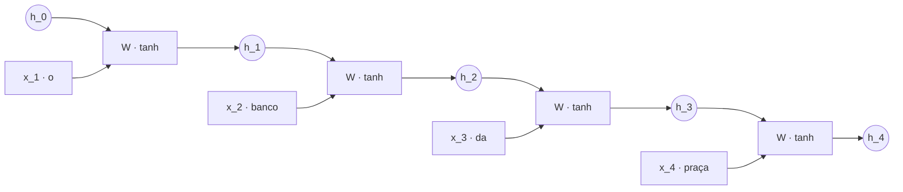
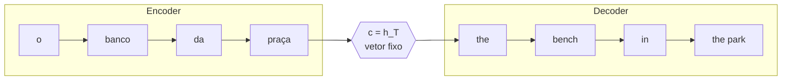
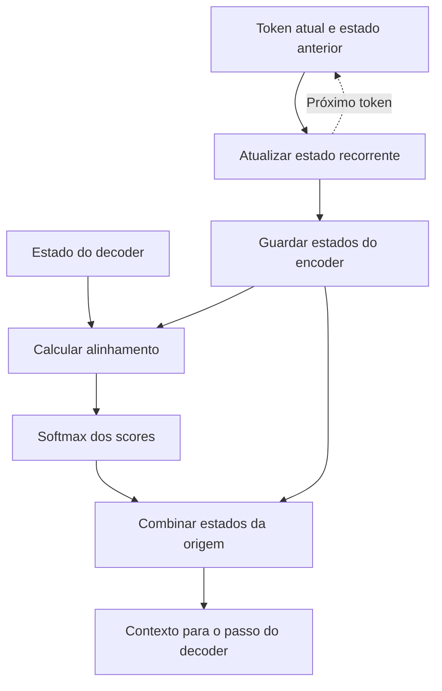
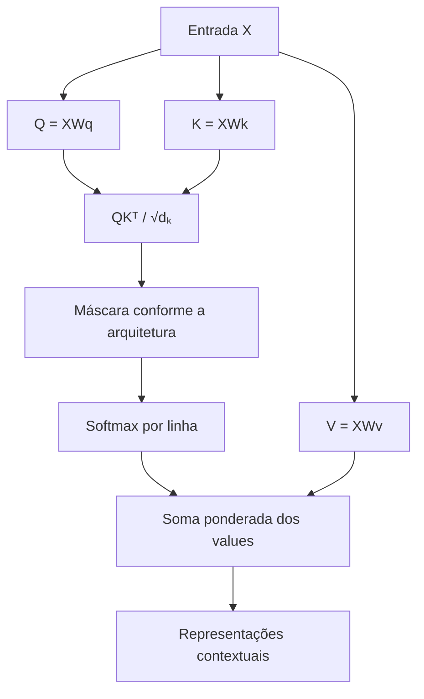
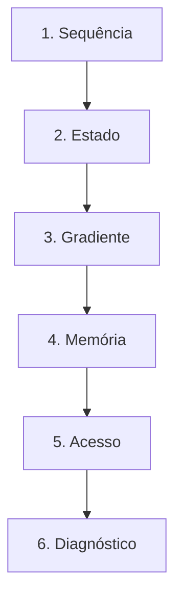

# Especificação de slides — Aula 5 (V2)

> **Rebalanceamento V2.** O fluxo principal abre pelo comportamento observável e usa a
> matemática como fundamento nomeado. Toda derivação está na Parte 2, mais detalhada do
> que estava na V1. Nada de matemática foi perdido — foi realocado.

<!-- SLIDE-FLOW:GUIDE:BEGIN -->
## Fluxogramas na produção dos slides

As orientações abaixo complementam o campo **Visual** dos slides indicados. Produzir os fluxogramas no próprio deck, como formas e conectores editáveis ou gráficos vetoriais; a biblioteca completa ao final torna esta especificação independente do portal.

- **Referência de composição:** título e propósito no topo, blocos numerados, conexões rotuladas, ramificações legíveis e uma saída identificada. Usar apenas o padrão visual da referência fornecida, sem importar seu assunto ou seus exemplos.
- **Tema do deck:** manter o fundo escuro e a paleta já especificada para a aula. Usar `#5b8cff` para o trecho ativo, tons neutros para o contexto e `#e2231a` conforme o significado definido no deck. Cor sempre acompanhada de rótulo.
- **Leitura:** entrada no topo ou à esquerda; saída na base ou à direita. Decisões em losangos, alternativas com rótulos e retornos apontando à etapa correta. Ramos paralelos convergem apenas onde seus resultados realmente são combinados.
- **Densidade:** no fluxo principal, projetar 3–6 blocos curtos por enquadramento, com corpo legível na última fileira. Um mapa maior pode ser revelado por etapas no mesmo slide. Detalhes, condições e explicações completas ficam nas notas; não reduzir a fonte para caber tudo.
- **Semântica:** mapas de percurso mostram ordem de estudo, não execução de um algoritmo. Manter separadas preparação e aplicação, treino e inferência, sequência e alternativas. Não transformar uma etapa opcional em obrigatória.
- **Integração:** o fluxograma substitui uma lista redundante ou ocupa o campo Visual; não cobre matrizes, tabelas, gráficos nem código indispensáveis. Preservar títulos, numeração, duração e referências aos apêndices.
- **Produção:** os blocos Mermaid abaixo são especificações do desenho. Renderizar/reconstruir como diagrama, nunca projetar o código Mermaid. Manter rótulos, bifurcações, retornos e limites declarados. Não transformar este caderno técnico em slides adicionais.
- **Ligação com o portal:** os mapas de mecanismo compartilham o conteúdo dos fluxogramas do portal. Em demonstrações, usar o mesmo vocabulário no deck e no controle interativo para facilitar a passagem entre os dois.
<!-- SLIDE-FLOW:GUIDE:END -->

## Diretrizes visuais

- **Tema:** escuro, accent `#e2231a` (vermelho CESAR), accent secundário `#5b8cff`.
- **Tipografia:** sans-serif para texto; monoespaçada para fórmulas, matrizes e nomes de
  variável (`h_t`, `c_t`, `α`).
- **Densidade:** máximo 5 linhas de texto por slide no fluxo. Um conceito por slide.
- **No fluxo principal:** fórmula aparece **enunciada e lida**, nunca manipulada. Toda
  fórmula vem acompanhada de um número concreto ou de um comportamento que ela prevê.
- **No apêndice:** densidade alta é esperada e desejável. É material de consulta.
- **Consistência de cor com significado:** o **estado** (`h`, `c`) sempre na mesma cor, a
  **entrada** (`x`) em outra, o **peso de atenção** (`α`) em accent. A mesma convenção
  volta na Aula 6.
- **Proibido:** bullets genéricos; slide-parede de texto; diagrama de RNN sem rotular o que
  é estado e o que é entrada; fórmula sem consequência prática no fluxo principal.

## Arco narrativo

A aula abre com um sistema de tradução que erra de um jeito medido e previsível: acerta
manchetes, erra parágrafos, e o erro **cresce com o comprimento da frase**. A primeira
metade ensina a usar esse sintoma como hipótese, não como prova, e separa três limitações da
recorrência: memória distante, caminho do gradiente e execução sequencial. O seq2seq básico
acrescenta o gargalo de um único contexto fixo. A demo mede os mecanismos sem fingir que um
experimento de brinquedo é uma RNN completa. A segunda metade apresenta a atenção de
Bahdanau como troca de **compressão por acesso**, deixa explícito que as RNNs permanecem e
usa a matriz de alinhamento como evidência de algo aprendido sem rótulo. O fechamento nomeia
os papéis Q/K/V com o cuidado de não confundir a atenção aditiva de 2014 com a operação
matricial de 2017. O apêndice
reconstrói a recorrência, o produto de derivadas ao longo do tempo, o gating do LSTM, o
argumento de capacidade do vetor fixo, o alinhamento e a passagem formal para Q/K/V.

---

# PARTE 1 — FLUXO PRINCIPAL

*O que se apresenta em aula. 14 slides, ~85 minutos com demo e exercício.*

### Slide 1 — O sintoma: a tradução que piora com o comprimento
- **Tipo:** problema (abertura)
- **Título:** Acerta a manchete, erra o parágrafo
- **Conteúdo:** Um sistema de tradução automática de 2014 traduz *"o gato dorme"* sem
  esforço e desmonta numa frase de quarenta palavras: perde o fim, ou perde o começo, ou
  erra a concordância entre duas partes distantes. O que torna isso diagnóstico e não
  anedota é a **curva**: a qualidade medida cai a partir de um comprimento, e continua
  caindo. O erro não é aleatório — ele acompanha o **comprimento da entrada**. Isso torna o
  gargalo arquitetural uma hipótese forte. O diagnóstico se fecha comparando, sob o mesmo
  conjunto de dados e protocolo, o modelo básico com o modelo com atenção.
- **Frase-tese:** Uma curva não fecha o diagnóstico. Ela aponta a suspeita — e o experimento
  comparativo decide.
- **Visual:** um gráfico único, dominando o slide: eixo x rotulado "comprimento da frase de
  origem (palavras)", eixo y rotulado "qualidade da tradução". Uma curva plana até ~30 e
  despencando depois. Ao lado, duas traduções lado a lado — a curta correta, a longa com o
  sujeito trocado, destacado em accent.
- **Notas do apresentador:** Abrir pela curva, não pela arquitetura. A turma precisa querer
  saber o que na arquitetura produz uma curva com essa forma. A figura é a Figura 2 de
  Bahdanau et al. (1409.0473) e volta na demo. Nomear a hipótese concorrente — poucos
  exemplos longos no treino — antes de mostrar que o artigo controla dados e procedimento.

### Slide 2 — Por que a intuição sozinha erra aqui

<!-- SLIDE-FLOW:SLIDE:BEGIN -->
- **Fluxograma a incorporar neste slide:** **F00 — Recorrência e acesso por atenção**. O desenho e os rótulos completos estão no caderno de fluxogramas ao final deste arquivo.
- **Composição:** integrar ao campo Visual; preservar exemplos, tabelas, fórmulas e dimensões solicitados neste slide. Destacar o trecho relacionado ao título e manter o restante em segundo plano. Os textos detalhados ficam nas notas, sem duplicar a lista de Conteúdo na tela.
<!-- SLIDE-FLOW:SLIDE:END -->

- **Tipo:** comparação
- **Título:** "Então é só aumentar o vetor"
- **Conteúdo:** A reação intuitiva diante da curva do slide 1 é aumentar o resumo interno.
  Isso pode ajudar, mas compra **espaço**, não **acesso**: o decoder continua recebendo um
  único vetor e não pode consultar novamente as posições da entrada. A outra hipótese é
  “treina mais”; ela só faz sentido depois de verificar se o sinal de aprendizado chega aos
  primeiros passos — o assunto do slide 4.
- **Frase-tese:** Falta acesso, não espaço. Comprar um caderno maior não resolve um problema
  de não poder olhar a fonte.
- **Visual:** dois cenários lado a lado: à esquerda, uma prova de memória (aluno de olhos
  fechados); à direita, uma prova com consulta (aluno com o livro aberto). Abaixo, a curva
  do slide 1 desenhada duas vezes — a segunda deslocada para a direita, com a mesma forma,
  e a legenda "aumentar o vetor faz isto".
- **Notas do apresentador:** Este slide existe para gastar a intuição da turma **antes** de
  apresentar a solução. Se alguém propuser "aumentar" aqui, é o melhor cenário possível:
  usar a proposta da própria pessoa.

### Slide 3 — O conceito em uso: ler em ordem e carregar um resumo

<!-- SLIDE-FLOW:SLIDE:BEGIN -->
- **Fluxograma a incorporar neste slide:** **F00 — Recorrência e acesso por atenção**. O desenho e os rótulos completos estão no caderno de fluxogramas ao final deste arquivo.
- **Composição:** integrar ao campo Visual; preservar exemplos, tabelas, fórmulas e dimensões solicitados neste slide. Destacar o trecho relacionado ao título e manter o restante em segundo plano. Os textos detalhados ficam nas notas, sem duplicar a lista de Conteúdo na tela.
<!-- SLIDE-FLOW:SLIDE:END -->

- **Tipo:** conceito
- **Título:** Uma função, aplicada em loop
- **Conteúdo:** A resposta que dominou de 1990 a 2016: processar um token por vez e carregar
  um único vetor de estado que resume tudo o que veio antes. A recorrência **enunciada**:
  ```
  h_t = f(h_(t-1), x_t)          na forma clássica:  h_t = tanh(W_h h_(t-1) + W_x x_t + b)
  ```
  Três leituras, uma por linha: `h_t` é o resumo comprimido de tudo o que veio antes; a
  **mesma** matriz é aplicada em todos os passos, então o número de parâmetros independe do
  comprimento; e a ordem entra de graça, porque aplicar a função em ordens diferentes dá
  resultados diferentes. O que a arquitetura **não** faz: guardar os tokens. Ela guarda um
  vetor que foi sobrescrito a cada passo.
- **Frase-tese:** É um `reduce` sobre a frase, com a função de combinação aprendida. O resto
  da aula é consequência disso.
- **Visual:** a rede desenrolada — quatro células em linha, seta horizontal do estado
  atravessando todas (rotulada `h`), setas verticais das entradas (`x_1..x_4`). O rótulo `W`
  repetido em accent em cada célula, para tornar visível que é a mesma matriz.
- **Fundamento:** a recorrência `h_t = f(h_(t-1), x_t)`, sua contagem de parâmetros e a razão
  formal de a ordem importar.
  → derivação completa e desenrolamento: **Apêndice A.1** (slide 15)
- **Notas do apresentador:** Desenhar a rede desenrolada no quadro **antes** de a fórmula
  aparecer. Quem não tem ML entende o desenho e reconhece a fórmula depois; nunca o
  contrário. Sem derivar nada.



### Slide 4 — Sintoma 2: o modelo que esquece o sujeito

<!-- SLIDE-FLOW:SLIDE:BEGIN -->
- **Fluxograma a incorporar neste slide:** **F00 — Recorrência e acesso por atenção**. O desenho e os rótulos completos estão no caderno de fluxogramas ao final deste arquivo.
- **Composição:** integrar ao campo Visual; preservar exemplos, tabelas, fórmulas e dimensões solicitados neste slide. Destacar o trecho relacionado ao título e manter o restante em segundo plano. Os textos detalhados ficam nas notas, sem duplicar a lista de Conteúdo na tela.
<!-- SLIDE-FLOW:SLIDE:END -->

- **Tipo:** dados (fundamento aplicado a um sintoma)
- **Título:** Concorda a três palavras, erra a quarenta
- **Conteúdo:** Sintoma real e específico: o modelo acerta a concordância entre palavras
  próximas e **nunca** aprende a concordância entre palavras separadas por dezenas de
  posições. Não é que erre às vezes — é que a dependência longa nunca entra. Sem `NaN`, sem
  divergência, com a loss descendo. Pausa de base: *loss* mede o erro; gradiente indica como
  cada peso deve mudar; retropropagação leva esse sinal para trás pela regra da cadeia. Numa
  RNN o sinal atravessa um fator por passo e tende a ser atenuado ou amplificado em direções
  diferentes. Números de referência, feitos na calculadora à vista da turma:
  `0.9^10 ≈ 0.35`, `0.9^50 ≈ 5·10⁻³`, `0.9^100 ≈ 3·10⁻⁵`; do outro lado, `1.1^50 ≈ 117` e
  `1.1^100 ≈ 1.4·10⁴`. Mantido o ganho por passo, aumentar só a dimensão não remove o
  expoente `T`.
- **Frase-tese:** O modelo pode ter capacidade para a dependência e ainda não aprendê-la —
  porque o sinal de treino chega fraco demais aos primeiros passos.
- **Visual:** gráfico com eixo x "passos de retropropagação" e eixo y "magnitude do
  gradiente" em escala log, com duas curvas: uma caindo a zero, outra saindo do quadro para
  cima. Caixa em accent: "não é falta de capacidade — aumentar a dimensão do estado não
  conserta um gradiente que chega zerado".
- **Fundamento:** o gradiente que chega ao primeiro passo é um produto de `T−1` derivadas de
  um passo; esse produto decai ou explode exponencialmente em `T`.
  → derivação completa, com a norma do produto e o papel da `tanh`: **Apêndice A.2** (slide 16)
- **Notas do apresentador:** Fazer `0.9^100` na calculadora na frente da turma. Número na
  lousa vale mais que a palavra "exponencial". **Não** escrever a regra da cadeia no quadro
  — está em A.2, e a Medição 1 da demo mostra o efeito acontecendo.

### Slide 5 — Sintoma 3: a GPU que fica ociosa

<!-- SLIDE-FLOW:SLIDE:BEGIN -->
- **Fluxograma a incorporar neste slide:** **F00 — Recorrência e acesso por atenção**. O desenho e os rótulos completos estão no caderno de fluxogramas ao final deste arquivo.
- **Composição:** integrar ao campo Visual; preservar exemplos, tabelas, fórmulas e dimensões solicitados neste slide. Destacar o trecho relacionado ao título e manter o restante em segundo plano. Os textos detalhados ficam nas notas, sem duplicar a lista de Conteúdo na tela.
<!-- SLIDE-FLOW:SLIDE:END -->

- **Tipo:** dados
- **Título:** Trocaram a GPU por uma quatro vezes mais rápida e ganharam 15%
- **Conteúdo:** Terceiro sintoma, e é econômico. O treino leva horas, a utilização da GPU
  fica baixa, e comprar hardware mais rápido quase não melhora. A causa é estrutural: `h_t`
  **exige** `h_(t-1)`. Não é preferência de implementação, é a definição da arquitetura —
  logo o treino tem `T` etapas obrigatoriamente sequenciais, e nenhuma quantidade de núcleos
  paralelos compra tempo. A distinção que evita a confusão mais comum: essa dívida é de
  **treino**, não de geração. Gerar texto é sequencial em qualquer arquitetura, inclusive no
  Transformer; o que a recorrência impede é o paralelismo no treino, onde a frase inteira já
  é conhecida de antemão.
- **Frase-tese:** O que matou a recorrência não foi qualidade. Foi ela não deixar você gastar
  dinheiro para ir mais rápido.
- **Visual:** duas linhas do tempo empilhadas. Em cima, `T` blocos em série, um começando
  quando o anterior termina, com um medidor de GPU marcando ocupação baixa. Embaixo, os
  mesmos `T` blocos todos ao mesmo tempo, com o medidor cheio e a etiqueta "Aula 6 — paga em
  memória".
- **Notas do apresentador:** Este é o sintoma que motiva economicamente as Aulas 6 a 8. Se
  a turma tem gente de infraestrutura, é aqui que ela entra na aula.

### Slide 6 — O que o gating do LSTM compra

<!-- SLIDE-FLOW:SLIDE:BEGIN -->
- **Fluxograma a incorporar neste slide:** **F00 — Recorrência e acesso por atenção**. O desenho e os rótulos completos estão no caderno de fluxogramas ao final deste arquivo.
- **Composição:** integrar ao campo Visual; preservar exemplos, tabelas, fórmulas e dimensões solicitados neste slide. Destacar o trecho relacionado ao título e manter o restante em segundo plano. Os textos detalhados ficam nas notas, sem duplicar a lista de Conteúdo na tela.
<!-- SLIDE-FLOW:SLIDE:END -->

- **Tipo:** conceito (o fundamento nomeado)
- **Título:** Tudo o que importa está num sinal de mais
- **Conteúdo:** A resposta de 1997 acrescenta um segundo estado, a célula `c_t`, e três
  válvulas aprendidas — esquecer, entrar, sair. As duas linhas **enunciadas**, sem serem
  manipuladas:
  ```
  f_t, i_t, o_t = σ(W · [h_(t-1), x_t])     # três válvulas entre 0 e 1
  c_t = f_t ⊙ c_(t-1) + i_t ⊙ g_t           # o caminho ADITIVO
  ```
  Leitura: a sigmoide entre 0 e 1 é uma válvula contínua — 0 fecha, 1 deixa passar. E o
  **sinal de mais** cria um caminho de `c_(t-1)` a `c_t` que não passa por multiplicação de
  matriz. Consequência observável: a dependência de médio alcance passa a ser aprendível e o
  treino fica estável. Consequência que não se ganha: quando as válvulas fecham, o
  decaimento volta — o gating **põe o desaparecimento sob controle da rede**, não o elimina.
  Consequência histórica que fecha a Aula 3: o **ELMo** (Peters et al., arXiv 1802.05365,
  2018) popularizou representações
  contextuais produzidas por LSTMs bidirecionais — `banco` recebe vetores diferentes conforme
  a frase, **sem atenção**. A leitura que importa é lógica: contextualizar, consultar e
  paralelizar são operações distintas. A RNN contextualiza; Bahdanau acrescenta acesso aos
  estados; o Transformer retirará a recorrência para paralelizar o treino.
- **Frase-tese:** O LSTM não resolveu o gradiente. Ele deu à rede o poder de decidir quando
  não estragá-lo.
- **Visual:** duas faixas empilhadas (`c` acima, `h` abaixo) atravessando três passos; sobre
  a faixa de `c`, três válvulas por passo. A faixa de `c` desenhada como rodovia contínua,
  sem interrupção — a metáfora tem que estar no desenho.
- **Fundamento:** as seis equações do LSTM e a derivada do caminho da célula, que é diagonal
  e igual ao produto das portas de esquecimento.
  → equações completas e derivação do caminho aditivo: **Apêndice A.3** (slide 17)
- **Notas do apresentador:** Não escrever as seis equações no quadro. Se pedirem, remeter a
  A.3 — que agora tem **mais** LSTM do que a V1 tinha — e seguir. O ELMo entra em **duas frases**
  e serve a um propósito preciso: matar antes de nascer o erro conceitual "contexto = atenção",
  que se instala quando se salta de Word2Vec direto para o Transformer. Ele também prepara o
  slide 14: se o LSTM já contextualizava, a pergunta "para que serve a atenção, então?" fica
  bem-posta, e a resposta precisa separar acesso (Bahdanau) de paralelismo (Transformer).

### Slide 7 — O placar das três dívidas
- **Tipo:** dados
- **Título:** Aliviada, contida, intacta
- **Conteúdo:** Os três sintomas dos slides anteriores viram um placar de três linhas, cada
  uma com o veredito depois do LSTM:
  1. **Dependência longa** — *aliviada*: o token 1 e o token 500 continuam separados por 499
     passos de computação.
  2. **Gradiente** — *contido*: recorte de gradiente segura o lado que explode; o lado que
     desaparece fica sob a mão da rede.
  3. **Ausência de paralelismo** — *intacta*: nada do que o LSTM faz muda o fato de `h_t`
     exigir `h_(t-1)`.
  A terceira é a que decide a história, e é a única que o LSTM não tocou. Acrescentar uma
  coluna de antecipação: **Bahdanau remove o contexto fixo e cria acesso curto, mas continua
  recorrente; o Transformer é que muda o veredito do paralelismo.**
- **Frase-tese:** Duas dívidas foram renegociadas. A terceira não foi nem discutida — e é ela
  que quebra a arquitetura.
- **Visual:** tabela de quatro colunas: limitação; RNN simples; LSTM; “Bahdanau agora /
  Transformer na Aula 6”. Linhas: memória/gradiente, contexto fixo, paralelismo. Destacar que
  Bahdanau marca “resolve acesso” e “continua recorrente”; Transformer marca “paraleliza o
  treino”.
- **Notas do apresentador:** Slide mais importante do Bloco 1. Se o tempo estourou, cortar
  detalhe do LSTM — nunca este. Sem as três dívidas, o aluno decora o Transformer em vez de
  entendê-lo.

### Slide 8 — Onde memória e acesso se concentram

<!-- SLIDE-FLOW:SLIDE:BEGIN -->
- **Fluxograma a incorporar neste slide:** **F00 — Recorrência e acesso por atenção**. O desenho e os rótulos completos estão no caderno de fluxogramas ao final deste arquivo.
- **Composição:** integrar ao campo Visual; preservar exemplos, tabelas, fórmulas e dimensões solicitados neste slide. Destacar o trecho relacionado ao título e manter o restante em segundo plano. Os textos detalhados ficam nas notas, sem duplicar a lista de Conteúdo na tela.
<!-- SLIDE-FLOW:SLIDE:END -->

- **Tipo:** diagrama
- **Título:** Um único ponto de falha, e ele tem nome
- **Conteúdo:** A arquitetura de tradução de 2014 são duas redes: o encoder lê a origem
  inteira e não produz saída — só atualiza estado; o decoder parte do último estado do
  encoder e escreve a tradução. A ponte, **enunciada**:
  ```
  c = h_T        # todo o significado da origem, num vetor de dimensão fixa
  ```
  Daí para frente o decoder **não tem mais acesso à frase de origem**. Memória e acesso se
  apertam aqui: a capacidade da ponte é constante enquanto a entrada cresce, e a posição
  `j` influencia o passo `t` por um caminho longo. A ausência de paralelismo é diferente:
  ela atravessa encoder e decoder porque os dois são recorrentes. É esta arquitetura que
  produz a curva do slide 1.
- **Frase-tese:** A curva com que eu abri a aula é o retrato de um vetor de tamanho fixo
  tentando carregar uma entrada de tamanho variável.
- **Visual:** diagrama horizontal encoder → `c` → decoder, com `c` desenhado deliberadamente
  **estreito** entre dois blocos largos, circulado em accent. Nenhuma seta do decoder de
  volta para o encoder — a ausência é o ponto do slide. Uma faixa recorrente atravessa
  encoder e decoder para mostrar que o paralelismo é uma dívida dos blocos, não do vetor `c`.
- **Fundamento:** a capacidade de `c` é fixa e a informação necessária cresce com o
  comprimento; existe um comprimento a partir do qual frases distintas colidem no mesmo `c`.
  → argumento de capacidade e de comprimento de caminho: **Apêndice A.4** (slide 18)
- **Notas do apresentador:** Circular o `c` com força e deixar o desenho de pé até o slide
  10 — a demo existe para destruir esse círculo.



### Slide 9 — [Demo] Medir os três sintomas

<!-- SLIDE-FLOW:SLIDE:BEGIN -->
- **Fluxograma a incorporar neste slide:** **F00 — Recorrência e acesso por atenção**. O desenho e os rótulos completos estão no caderno de fluxogramas ao final deste arquivo.
- **Composição:** integrar ao campo Visual; preservar exemplos, tabelas, fórmulas e dimensões solicitados neste slide. Destacar o trecho relacionado ao título e manter o restante em segundo plano. Os textos detalhados ficam nas notas, sem duplicar a lista de Conteúdo na tela.
<!-- SLIDE-FLOW:SLIDE:END -->

- **Tipo:** transição para demonstração
- **Título:** Três medições, doze minutos, nenhuma biblioteca de deep learning
- **Frase-tese:** Nenhuma das três é ilustração. As três são a evidência dos slides
  anteriores.
- **Conteúdo:** As três medições anunciadas, sem resultado — o resultado acontece ao vivo:
  1. **O produto que decide o gradiente.** `codigo/demo-gradiente-rnn.py` multiplica
     `T` vezes a transformação controlada `ganho·I` e imprime a norma para
     `T = 10, 50, 200`. Saem `0,9^200 ≈ 7,1·10⁻¹⁰` e
     `1,1^200 ≈ 1,9·10⁸`. É a mecânica do slide 4 isolada, não uma RNN simulada.
  2. **A compressão em quatro números.** No quadro: uma frase longa, a turma comprime em
     quatro inteiros, a frase é apagada, e a turma tenta traduzir só com os quatro números.
     É o slide 8 acontecendo na sala.
  3. **A curva e a matriz.** A Figura 2 de Bahdanau et al. (qualidade × comprimento, com e
     sem atenção) e a Figura 3 (a matriz de alinhamento). É o slide 1 fechando.
- **Visual:** slide quase vazio: título e as três medições numeradas em monoespaçada.
- **Notas do apresentador:** Passos na Parte 2 do roteiro. A Medição 2 é a que **não** se
  corta — é a única que a turma produz com as próprias mãos. Intervalo de 10 min depois
  deste slide; anunciar a duração e cumprir.

### Slide 10 — Acesso em vez de compressão

<!-- SLIDE-FLOW:SLIDE:BEGIN -->
- **Fluxograma a incorporar neste slide:** **F00 — Recorrência e acesso por atenção**. O desenho e os rótulos completos estão no caderno de fluxogramas ao final deste arquivo.
- **Composição:** integrar ao campo Visual; preservar exemplos, tabelas, fórmulas e dimensões solicitados neste slide. Destacar o trecho relacionado ao título e manter o restante em segundo plano. Os textos detalhados ficam nas notas, sem duplicar a lista de Conteúdo na tela.
<!-- SLIDE-FLOW:SLIDE:END -->

- **Tipo:** conceito (o fundamento nomeado)
- **Título:** Um vetor de contexto por passo, não um por frase
- **Conteúdo:** Bahdanau, Cho e Bengio, 2014, mudam **uma** coisa: em vez de um `c` para a
  frase toda, existe um `c_t` para cada passo do decoder. As três linhas **enunciadas e
  lidas**, sem serem manipuladas:
  ```
  e_(t,j) = vᵀ tanh(W s_(t-1) + U h_j)        # quão relevante é a posição j agora
  α_(t,j) = exp(e_(t,j)) / Σ_k exp(e_(t,k))   # vira orçamento: os pesos somam 1
  c_t     = Σ_j α_(t,j) h_j                   # média ponderada: um contexto por passo
  ```
  Três leituras, uma por linha: a primeira **compara** o estado do decoder com cada posição
  da origem; a segunda transforma comparações em um orçamento que soma 1; a terceira **lê**
  a origem segundo esse orçamento. Microexemplo no rodapé:
  `α_t=(0,6; 0,3; 0,1) → c_t=0,6h_1+0,3h_2+0,1h_3`. A consequência que resolve o gargalo:
  depois que `h_j` existe, o caminho de `h_j` ao contexto do passo `t` tem comprimento **1**.
  Rodapé de honestidade: em 2014 a atenção **não** substitui a recorrência — encoder e decoder
  continuam sendo RNNs.
- **Frase-tese:** Prova de memória contra prova com consulta. O conteúdo é o mesmo; o que
  muda é o direito de olhar a fonte na hora de responder.
- **Visual:** o mesmo diagrama do slide 8, agora com o `c` estreito substituído por um feixe
  de setas em accent saindo de **todas** as posições do encoder e convergindo no passo atual
  do decoder. Manter o slide 8 como estado anterior para que a mudança seja visível na
  transição.
- **Fundamento:** as três linhas acima, com a demonstração de que `c_t` é combinação convexa
  dos `h_j` e de por que a mistura suave é treinável.
  → derivação completa, com exemplo numérico: **Apêndice A.5** (slide 19)
- **Notas do apresentador:** Ler as três linhas em voz alta uma vez, apontando cada termo.
  **Não derivar.** Se perguntarem "não fica caro?", a resposta é sim — `n` comparações por
  passo, o custo que vira `O(n²)` na Aula 6. Marcar a pergunta e devolver lá.

### Slide 11 — A evidência: uma legenda que ninguém escreveu
- **Tipo:** dados
- **Título:** O que o modelo aprendeu sem rótulo
- **Conteúdo:** Empilhando os `α_t` de todos os passos, sai uma matriz: linhas são passos do
  decoder, colunas são posições do encoder, **cada linha soma 1**. Projetada como mapa de
  calor, ela se parece com um alinhamento de palavras. O que ler nela: a diagonal
  predominante (as ordens das duas línguas coincidem na maior parte) e o bloco em que a
  diagonal se rompe (um grupo nominal cuja ordem inverte entre as línguas). E o ponto que
  vale a aula inteira: **nenhum rótulo de alinhamento foi usado no treino**. O único sinal
  foi a tradução correta; o alinhamento apareceu porque era o caminho mais barato para
  acertar. Alerta em accent: peso alto é correlação com a decisão, não a razão dela — por
  isso os autores dizem alinhamento *suave*.
- **Frase-tese:** Ninguém ensinou alinhamento a esse modelo. Ele foi treinado para traduzir.
- **Visual:** reprodução da Figura 3 de Bahdanau et al. (arXiv 1409.0473), com eixos
  rotulados e marcação em accent sobre o bloco em que a diagonal se rompe. Fonte creditada
  no rodapé.
- **Notas do apresentador:** 30 s de silêncio com a figura na tela antes de comentar. Se
  perguntarem se isso é interpretabilidade: é uma janela, não uma explicação — a diferença é
  assunto da Aula 27.

### Slide 12 — Q, K, V: três papéis antes de três matrizes

<!-- SLIDE-FLOW:SLIDE:BEGIN -->
- **Fluxograma a incorporar neste slide:** **F01 — Self-attention: da entrada ao contexto**. O desenho e os rótulos completos estão no caderno de fluxogramas ao final deste arquivo.
- **Composição:** integrar ao campo Visual; preservar exemplos, tabelas, fórmulas e dimensões solicitados neste slide. Destacar o trecho relacionado ao título e manter o restante em segundo plano. Os textos detalhados ficam nas notas, sem duplicar a lista de Conteúdo na tela.
<!-- SLIDE-FLOW:SLIDE:END -->

- **Tipo:** comparação
- **Título:** A reescrita que abre a próxima aula
- **Conteúdo:** O que a atenção faz tem a forma de uma **busca**: há uma consulta, há itens
  indexados, há conteúdo devolvido. Nomeando os papéis na atenção aditiva:
  ```
  q_t = W_s s_(t-1)   # consulta derivada do estado do decoder
  k_j = U_h h_j       # chave derivada do estado j do encoder
  v_j = h_j           # valor lido na soma ponderada
  ```
  Duas diferenças em relação a um `dict`: a comparação não é igualdade exata (é uma função
  **aprendida** que devolve um número contínuo) e o resultado não é um item (é uma
  **mistura** ponderada de todos). Chave e valor partem de `h_j`, mas não são literalmente
  iguais: a chave passa por `U_h` no score; o valor entra como `h_j` na soma. Na Aula 6 os
  três papéis viram projeções matriciais explícitas e as queries vêm da própria sequência.
- **Frase-tese:** Q, K e V começam como três papéis. No Transformer, viram três projeções
  explícitas da mesma entrada.
- **Visual:** três colunas rotuladas consulta, chave e valor. Setas partem de `s_(t-1)` para
  consulta e de `h_j` para chave **e** valor; somente a seta da chave atravessa `U_h`. No
  rodapé, uma seta para “Aula 6: Q=XW_Q, K=XW_K, V=XW_V”.
- **Fundamento:** a passagem formal de Bahdanau para `softmax(QKᵀ/√d_k)V` — troca do score
  aditivo pelo produto interno, projeções Q/K/V explícitas e queries da própria sequência.
  → correspondência termo a termo e o que cada troca compra: **Apêndice A.6** (slide 20)
- **Notas do apresentador:** Este é o slide que o aluno tem que sair sabendo. Se o tempo
  estourou, o exercício do slide 13 encolhe; este slide não.

### Slide 13 — [Exercício] Diagnosticar, não calcular
- **Tipo:** exercício
- **Título:** 8 minutos, três sintomas, uma causa cada
- **Conteúdo:** Três situações reais. Para cada uma: qual é a causa provável e **que
  evidência confirmaria**.
  1. Um tradutor acerta manchetes e desmonta em parágrafos; o erro cresce com o comprimento
     e a primeira coisa a quebrar é a concordância entre partes distantes.
  2. Um modelo recorrente acerta a concordância entre palavras vizinhas e **nunca** aprende
     a concordância entre palavras separadas por quarenta posições. A loss desce, não há
     `NaN`, e aumentar a dimensão do estado não mudou nada.
  3. Um time trocou a GPU por outra quatro vezes mais rápida e o tempo por época caiu 15%.
     Mesmo modelo, mesmos dados, mesmo tamanho de lote.
- **Frase-tese:** Nenhuma das três se resolve calculando. As três se resolvem sabendo o que
  a arquitetura descarta.
- **Visual:** os três sintomas como cartões, cada um com espaço para "causa" e "evidência que
  confirma". Cronômetro de 8 min.
- **Notas do apresentador:** Condução na Parte 3 do roteiro. Esperado: (1) vetor de contexto
  fixo — confirma-se plotando qualidade × comprimento e vendo a curva cair, e comparando com
  um modelo com atenção; (2) gradiente que desaparece — confirma-se medindo a norma do
  gradiente que chega aos primeiros passos, e a correção mexe no caminho, não no tamanho;
  (3) o gargalo é sequencial — confirma-se medindo a ocupação da GPU e o tempo por passo
  contra o comprimento da sequência.

### Slide 14 — Fechamento: se a atenção dá acesso, para que serve a recorrência?

<!-- SLIDE-FLOW:SLIDE:BEGIN -->
- **Fluxograma a incorporar neste slide:** **F02 — O percurso desta aula**; **F00 — Recorrência e acesso por atenção**. O desenho e os rótulos completos estão no caderno de fluxogramas ao final deste arquivo.
- **Composição:** integrar ao campo Visual; preservar exemplos, tabelas, fórmulas e dimensões solicitados neste slide. Destacar o trecho relacionado ao título e manter o restante em segundo plano. Os textos detalhados ficam nas notas, sem duplicar a lista de Conteúdo na tela.
<!-- SLIDE-FLOW:SLIDE:END -->

- **Tipo:** encerramento
- **Título:** Se a atenção dá acesso direto, para que serve a recorrência?
- **Conteúdo:** A síntese em quatro elos: uma curva que cai com o comprimento → uma
  arquitetura que lê em ordem e deixa três dívidas → um vetor fixo que agrava memória e
  acesso → atenção de Bahdanau, que troca **compressão** por **acesso**, mantém a recorrência
  e ganha o alinhamento de graça. Depois, a pergunta em destaque: se a atenção já dá
  acesso direto a qualquer posição, **para que ainda serve a recorrência?** Em 2017 alguém
  respondeu "para nada", e o título do artigo é a resposta. Leitura da semana: Bahdanau,
  Cho & Bengio (arXiv 1409.0473), seções 1–3 e a discussão da Figura 3 — **pergunta
  dirigida:** por que a Figura 3 é evidência de alinhamento aprendido sem rótulo de
  alinhamento?
- **Frase-tese:** Em 2017 alguém respondeu "para nada" — e o título do artigo é a resposta.
- **Visual:** duas metades. Topo: a cadeia dos quatro elos, com a caixa "acesso" em accent.
  Base: a pergunta em corpo grande, centralizada, e sob ela a silhueta esmaecida de um título
  de artigo, ilegível — revelado só na Aula 6. Rodapé: "Aula 6 — Transformer I:
  self-attention e a arquitetura".
- **Notas do apresentador:** Não responder a pergunta — a tensão é o que traz a turma com
  apetite. Mostrar o apêndice projetado por 30 s antes de encerrar: seis itens, e mais
  matemática do que a V1 tinha no fluxo. Acabar 02:00.

---

# PARTE 2 — APÊNDICE MATEMÁTICO

*Material de estudo e consulta. Não se apresenta em aula: reconstrói, com rigor completo,
todo fundamento citado no fluxo. Autossuficiente — quem estuda por aqui sem ter assistido
à aula consegue reconstruir tudo.*

### Slide 15 — A.1 · A recorrência, escrita e desenrolada

<!-- SLIDE-FLOW:SLIDE:BEGIN -->
- **Fluxograma a incorporar neste slide:** **F00 — Recorrência e acesso por atenção**. O desenho e os rótulos completos estão no caderno de fluxogramas ao final deste arquivo.
- **Composição:** integrar ao campo Visual; preservar exemplos, tabelas, fórmulas e dimensões solicitados neste slide. Destacar o trecho relacionado ao título e manter o restante em segundo plano. Os textos detalhados ficam nas notas, sem duplicar a lista de Conteúdo na tela.
<!-- SLIDE-FLOW:SLIDE:END -->

- **Tipo:** apêndice — derivação completa
- **Invocado em:** slide 3

**Notação.**
`x_t ∈ ℝ^(d_x)` — entrada no passo `t` (o embedding do token `t`).
`h_t ∈ ℝ^(d_h)` — estado oculto no passo `t`; `h_0 = 0` por convenção.
`W_h ∈ ℝ^(d_h×d_h)`, `W_x ∈ ℝ^(d_h×d_x)`, `b ∈ ℝ^(d_h)` — parâmetros, **os mesmos em todo
passo**.
`T` — comprimento da sequência.

**Premissas.** A não linearidade é `tanh`, aplicada componente a componente. Nada aqui
depende dessa escolha específica: o argumento vale para qualquer `f` diferenciável com
derivada limitada. A escolha importa em A.2, onde a cota da derivada é usada.

**Forma geral e instância.**
```
h_t = f(h_(t-1), x_t)                              forma geral da recorrência
h_t = tanh(W_h h_(t-1) + W_x x_t + b)              instância clássica (Elman)
y_t = W_y h_t + b_y                                saída, quando há uma por passo
```

**Etapa 1 — desenrolamento.** Substituindo a definição dentro dela mesma, para `T = 3`:
```
h_1 = tanh(W_h h_0 + W_x x_1 + b)
h_2 = tanh(W_h tanh(W_h h_0 + W_x x_1 + b) + W_x x_2 + b)
h_3 = tanh(W_h tanh(W_h tanh(W_h h_0 + W_x x_1 + b) + W_x x_2 + b) + W_x x_3 + b)
```
*Leitura:* a rede recorrente é uma rede profunda de `T` camadas que **compartilha os pesos
entre as camadas**. Toda a dificuldade de treinar uma rede profunda aparece aqui, agravada
pelo compartilhamento — o mesmo `W_h` multiplica em todos os níveis.

**Etapa 2 — contagem de parâmetros.**
```
|W_h| + |W_x| + |b| = d_h² + d_h·d_x + d_h
```
Nenhum termo depende de `T`. É essa independência que permite processar sequências de
qualquer comprimento; o preço é que a mesma transformação é reaplicada, que é o que A.2
transforma em problema.

**Etapa 3 — por que a ordem importa, formalmente.** Sejam dois tokens `x_a` e `x_b` e o
estado inicial `h`. Comparando as duas ordens:
```
f(f(h, x_a), x_b)   contra   f(f(h, x_b), x_a)
```
Composição de funções não comuta em geral: `f ∘ g ≠ g ∘ f`. Basta um caso para mostrar que
não coincidem — tome `d_h = d_x = 1`, `W_h = 1`, `W_x = 1`, `b = 0`, `h = 0`, `x_a = 1`,
`x_b = 2`:
```
ordem (a,b): tanh(tanh(1)) ...  h_1 = tanh(1) = 0.7616,  h_2 = tanh(0.7616 + 2) = 0.9922
ordem (b,a): h_1 = tanh(2) = 0.9640,  h_2 = tanh(0.9640 + 1) = 0.9600
```
Os estados finais diferem. ∎

*Contraste que a Aula 6 vai precisar:* a self-attention **comuta** com a permutação — trocar
a ordem da entrada troca a ordem da saída e não muda mais nada. A recorrência é sensível à
ordem por construção; a atenção precisa que a posição seja injetada de fora. É exatamente a
troca que a Aula 7 vem consertar.

**Leitura do resultado.** `h_t` é um resumo de dimensão fixa, sobrescrito a cada passo. O
conteúdo de `x_1` só existe em `h_t` na medida em que sobreviveu a `t−1` sobrescritas. A
rede **não guarda** os tokens anteriores em lugar nenhum.

**Casos-limite.**
- `W_h = 0` → `h_t = tanh(W_x x_t + b)`: sem memória; a saída em `t` depende só de `x_t`, e a
  ordem deixa de importar. É a recorrência degenerada num modelo de token isolado.
- `f` linear com `W_h = I` e sem `tanh` → `h_t = Σ_{s≤t} W_x x_s`: memória perfeita e sem
  seletividade — um saco de tokens somado. Mostra que memória e seletividade são requisitos
  distintos, e que o `tanh` está ali para a segunda.
- `d_h = 1` → todo o passado comprimido num escalar; o limite de capacidade de A.4 aparece
  já no primeiro token.

**Intuição.** É um `reduce` sobre a frase: `h` é o acumulador, `x_t` é o elemento, e a
função de combinação foi aprendida em vez de escrita.

**De volta ao fluxo:** slide 3.

### Slide 16 — A.2 · Por que o gradiente desaparece ou explode ao longo de `t`

<!-- SLIDE-FLOW:SLIDE:BEGIN -->
- **Fluxograma a incorporar neste slide:** **F00 — Recorrência e acesso por atenção**. O desenho e os rótulos completos estão no caderno de fluxogramas ao final deste arquivo.
- **Composição:** integrar ao campo Visual; preservar exemplos, tabelas, fórmulas e dimensões solicitados neste slide. Destacar o trecho relacionado ao título e manter o restante em segundo plano. Os textos detalhados ficam nas notas, sem duplicar a lista de Conteúdo na tela.
<!-- SLIDE-FLOW:SLIDE:END -->

- **Tipo:** apêndice — derivação completa
- **Invocado em:** slide 4

**O que se quer demonstrar.** Que o gradiente que chega ao primeiro passo é um **produto de
`T−1` jacobianas**, e que a norma desse produto decai ou cresce **exponencialmente** em `T`.

**Notação.**
`L` — perda, medida ao fim da sequência.
`a_t = W_h h_(t-1) + W_x x_t + b` — pré-ativação; `h_t = tanh(a_t)`.
`∂h_t/∂h_(t-1) ∈ ℝ^(d_h×d_h)` — jacobiana de um passo.
`σ_max(W_h)` — maior valor singular de `W_h`; `λ_1` — maior autovalor em módulo.

**Premissas.** A perda depende de `h_1` apenas através da cadeia de estados. `tanh` tem
derivada `tanh'(a) = 1 − tanh²(a) ∈ (0, 1]`, com o máximo 1 atingido só em `a = 0`.

**Etapa 1 — a regra da cadeia ao longo do tempo.**
```
∂L/∂h_1 = (∂L/∂h_T) · Π_(t=2..T) ∂h_t/∂h_(t-1)
```
Cada fator do produto é a derivada de um passo em relação ao anterior. São `T−1` fatores.

**Etapa 2 — a jacobiana de um passo, escrita.** Derivando `h_t = tanh(W_h h_(t-1) + …)`:
```
∂h_t/∂h_(t-1) = diag(1 − tanh²(a_t)) · W_h = D_t W_h
```
onde `D_t` é diagonal com entradas em `(0, 1]`. Duas coisas aparecem aqui: `W_h` é a
**mesma** em todos os fatores (é o compartilhamento de A.1), e `D_t` só sabe encolher.

**Etapa 3 — a norma do produto.** Usando submultiplicatividade da norma induzida:
```
‖Π_(t=2..T) D_t W_h‖ ≤ Π_(t=2..T) ‖D_t‖ · ‖W_h‖ ≤ (γ · σ_max(W_h))^(T-1)
```
com `γ = max_t ‖D_t‖ ≤ 1`. Escrevendo `ρ = γ · σ_max(W_h)`:
```
‖∂L/∂h_1‖ ≤ ‖∂L/∂h_T‖ · ρ^(T-1)
```

**Leitura do resultado.** Tudo depende de `ρ` estar de um lado ou do outro de 1:
- `ρ < 1` → a cota vai a zero exponencialmente: **o gradiente desaparece**. O sinal de
  aprendizado que chega ao primeiro token é indistinguível de ruído.
- `ρ > 1` → a cota superior deixa de garantir estabilidade. Isso **não prova**, sozinho, que
  todo produto crescerá: explosão exige uma direção persistentemente expansiva, ligada ao
  espectro e às ativações. Quando ela existe, o gradiente cresce exponencialmente e o passo
  de otimização sai da região útil.

**Números de referência.**
```
0.9^10  ≈ 3.49·10⁻¹      1.1^10  ≈ 2.59
0.9^50  ≈ 5.15·10⁻³      1.1^50  ≈ 1.17·10²
0.9^100 ≈ 2.66·10⁻⁵      1.1^100 ≈ 1.38·10⁴
```
Dez por cento de perda por passo é irrelevante em dez passos e é aniquilação em cem.

**Por que aumentar só a dimensão do estado não resolve.** O expoente da cota é `T−1`.
`σ_max(W_h)` pode, sim, mudar quando a dimensão e a inicialização mudam; portanto não se deve
dizer que a dimensão é irrelevante. O ponto é outro: se o ganho efetivo por passo
`γ·σ_max(W_h)` for mantido, aumentar `d_h` não remove o expoente nem encurta o caminho. É uma
distinção entre **capacidade** e **otimização**, e a solução (A.3) mexe no caminho.

**O que o recorte de gradiente resolve, e o que não resolve.** Recortar renormaliza o
gradiente quando a norma passa de um limiar: trata a explosão. Não há operação simétrica
para o desaparecimento — amplificar um gradiente numericamente nulo amplifica ruído de
arredondamento, não sinal.

**Casos-limite.**
- `T` pequeno (3 a 5 passos): `ρ^(T-1)` é próximo de 1 em qualquer regime razoável, e o
  problema não aparece. É por isso que RNNs funcionam bem em janelas curtas.
- `ρ = 1` exatamente: a cota é constante, mas é um equilíbrio instável — qualquer desvio
  reinstala um dos dois regimes.
- `a_t` grande em módulo: `tanh'(a_t) → 0`, `γ → 0`, e o desaparecimento acelera. Saturar a
  não linearidade piora o problema.

**Intuição geométrica.** Cada passo aplica a mesma transformação linear seguida de um
esmagamento. Iterar a mesma transformação alinha qualquer vetor com o autoespaço dominante
e escala o comprimento por `λ_1` a cada aplicação — é juros compostos, e a taxa é a mesma
para todos os passos porque a matriz é a mesma.

**Eco adiante.** O mesmo produto de fatores reaparece na Aula 7, agora ao longo da
**profundidade** em vez do tempo. Lá a solução é a conexão residual, que injeta um termo
identidade no produto; aqui, em A.3, a solução é o gating.

**De volta ao fluxo:** slide 4.

### Slide 17 — A.3 · O gating do LSTM e o caminho aditivo

<!-- SLIDE-FLOW:SLIDE:BEGIN -->
- **Fluxograma a incorporar neste slide:** **F00 — Recorrência e acesso por atenção**. O desenho e os rótulos completos estão no caderno de fluxogramas ao final deste arquivo.
- **Composição:** integrar ao campo Visual; preservar exemplos, tabelas, fórmulas e dimensões solicitados neste slide. Destacar o trecho relacionado ao título e manter o restante em segundo plano. Os textos detalhados ficam nas notas, sem duplicar a lista de Conteúdo na tela.
<!-- SLIDE-FLOW:SLIDE:END -->

- **Tipo:** apêndice — equações completas e derivação
- **Invocado em:** slide 6

**Notação.**
`x_t ∈ ℝ^(d_x)`, `h_(t-1) ∈ ℝ^(d_h)`; `[h_(t-1), x_t] ∈ ℝ^(d_h+d_x)` é a concatenação.
`c_t ∈ ℝ^(d_h)` — estado da célula (a "memória de longo prazo").
`σ(z) = 1/(1 + exp(−z))` — logística, saída em `(0,1)`.
`⊙` — produto de Hadamard (componente a componente).
`W_f, W_i, W_o, W_g ∈ ℝ^(d_h×(d_h+d_x))`, `b_f, b_i, b_o, b_g ∈ ℝ^(d_h)`.

**As seis equações, completas.**
```
f_t = σ(W_f [h_(t-1), x_t] + b_f)          # porta de esquecimento: o que apagar de c
i_t = σ(W_i [h_(t-1), x_t] + b_i)          # porta de entrada: quanto do candidato escrever
o_t = σ(W_o [h_(t-1), x_t] + b_o)          # porta de saída: quanto da célula exportar
g_t = tanh(W_g [h_(t-1), x_t] + b_g)       # candidato a novo conteúdo, em (−1,1)
c_t = f_t ⊙ c_(t-1) + i_t ⊙ g_t            # atualização da célula: o caminho ADITIVO
h_t = o_t ⊙ tanh(c_t)                      # estado exportado para fora e para o passo t+1
```
*Por que sigmoide nas portas e `tanh` no candidato:* a porta precisa ser uma fração de
passagem, e `(0,1)` é exatamente o intervalo de uma fração; o candidato precisa poder somar
ou subtrair conteúdo, e `(−1,1)` é o intervalo de um delta com sinal.

**Contagem de parâmetros.** `4 · [d_h(d_h + d_x) + d_h]` — quatro vezes o de uma RNN simples
de mesma dimensão. O gating não é grátis em parâmetros; é grátis em estabilidade.

**Derivação do caminho da célula.** Derivando a quinta equação em relação a `c_(t-1)`:
```
∂c_t/∂c_(t-1) = diag(f_t)  +  [termos que passam por h_(t-1)]
```
*Premissa explicitada:* `f_t`, `i_t` e `g_t` dependem de `h_(t-1)`, que por sua vez depende
de `c_(t-1)`; portanto existem caminhos indiretos. O termo `diag(f_t)` é o caminho **direto**,
e é o dominante quando as portas estão em regime de saturação — que é o regime em que a
memória é preservada. É sob essa premissa que se lê o resultado abaixo; ela falha quando as
portas estão na região linear, e aí o LSTM se comporta mais como uma RNN.

**O produto ao longo de muitos passos.** Considerando só o caminho direto:
```
∂c_T/∂c_1 ≈ Π_(t=2..T) diag(f_t) = diag( Π_(t=2..T) f_t )
```
Compare com A.2, onde o fator era `D_t W_h` — uma matriz cheia, **a mesma** em todos os
passos. Aqui o fator é **diagonal** e **depende do dado**. Três consequências:
1. Não há multiplicação por matriz no caminho: nenhum valor singular entra na conta.
2. Se `f_t ≈ 1` para todo `t`, o produto é `≈ 1` e o gradiente atravessa `T` passos sem
   atenuação. **A rodovia aditiva é isto.**
3. Se `f_t = 0.9`, o produto volta a ser `0.9^(T-1)` e o desaparecimento retorna — só que
   agora **por decisão da rede**, e apenas nos canais em que ela decidiu esquecer.

*Leitura:* o LSTM não elimina o desaparecimento. Ele o tira das mãos da álgebra e o põe nas
mãos do modelo — que pode manter a porta aberta nos canais onde a dependência longa importa.

**Truque prático que decorre disto.** Inicializar `b_f = 1` (ou maior) faz `f_t ≈ σ(1) ≈ 0.73`
já no primeiro passo, em vez de `σ(0) = 0.5`. Com `f = 0.5`, `0.5^20 ≈ 10⁻⁶`: a memória
morre em vinte passos antes de o treino começar. É um dos ajustes que mais mudam a
convergência de um LSTM e sai diretamente da conta acima.

**Casos-limite.**
- `f_t = 1`, `i_t = 0` → `c_t = c_(t-1)`: memória perfeita, gradiente intacto, e a célula
  ignora a entrada. É o comportamento de um registrador.
- `f_t = 0`, `i_t = 1` → `c_t = g_t`: a célula é reescrita por inteiro, e o LSTM degenera
  numa RNN de um passo de memória.
- `o_t = 0` → `h_t = 0`: a célula continua sendo atualizada, mas nada sai. O estado interno
  pode carregar informação que não aparece na saída — e isso é uma propriedade, não um bug.

**Variante enxuta.** A GRU funde `f` e `i` numa única porta (`i = 1 − f`) e elimina `c`,
ficando com três equações em vez de seis. Menos parâmetros, desempenho comparável na maioria
das tarefas — e a mesma leitura: o que importa é existir um caminho onde a jacobiana é
diagonal e controlável.

**De volta ao fluxo:** slide 6.

### Slide 18 — A.4 · Por que um vetor de tamanho fixo degrada com o comprimento
- **Tipo:** apêndice — argumento de capacidade e de caminho
- **Invocado em:** slide 8

**Notação.**
`x_1..x_n` — frase de origem, `n` tokens sobre um vocabulário `V`.
`h_1..h_n ∈ ℝ^(d)` — estados do encoder; `c = h_n ∈ ℝ^(d)` — o vetor de contexto.
`y_1..y_m` — frase de destino; `s_t ∈ ℝ^(d_s)` — estados do decoder.

**Premissas.** O decoder recebe **apenas** `c` (é a definição do seq2seq sem atenção) e cada
componente de `c` é representada com `b` bits úteis na precisão em uso. Para o argumento de
contagem, supõe-se ainda que se deseja distinguir todas as sequências de entrada; essa é uma
cota de informação, não uma premissa realista sobre tradução, pois entradas diferentes podem
ter a mesma tradução ou compartilhar toda a informação relevante.

**Argumento 1 — contagem (por que existe um teto duro).** O número de frases distintas de
comprimento `n` é `|V|^n`, logo distingui-las exige
```
log₂(|V|^n) = n · log₂|V|   bits
```
A ponte carrega no máximo `d · b` bits. Existe portanto
```
n* = (d · b) / log₂|V|
```
tal que, para `n > n*`, **necessariamente** duas sequências distintas recebem o mesmo código
quantizado `c` (princípio da casa dos pombos). Isso prova que a ponte não é injetiva; não prova,
sozinho, erro de tradução, porque as duas sequências podem não precisar de saídas diferentes.
Exemplo numérico: `d = 1000`, `b = 8` bits úteis, `|V| = 32000` → `log₂|V| ≈ 14.97` →
`n* ≈ 8000/14.97 ≈ 534` tokens.

*Cuidado com a leitura deste número.* É um experimento mental sensível ao valor arbitrário de
`b` e à exigência forte de distinguir todas as entradas. Ele mostra que capacidade finita
existe; **não explica a curva da Figura 2**. A evidência empírica do artigo é comparativa, e o
argumento de comprimento de caminho abaixo é o mecanismo mais útil para esta aula.

**Argumento 2 — comprimento do caminho (por que aumentar `d` não conserta a forma da curva).**
O caminho de informação da posição `j` da origem até o passo `t` do destino é:
```
j → j+1 → … → n   (n − j passos no encoder)
c
s_1 → s_2 → … → s_t   (t passos no decoder)
comprimento total = (n − j) + t
```
Esse comprimento **cresce com `n`**, e cada passo é um fator no produto de A.2. Aumentar `d`
desloca `n*` linearmente e não muda um único termo desta soma. É por isso que a curva do
slide 1 se desloca sem mudar de forma.

**Leitura do resultado.** As duas coisas que faltam são diferentes: **espaço** (argumento 1)
e **acesso** (argumento 2). Aumentar `d` compra espaço e não compra acesso. A atenção (A.5)
não aumenta `d`: ela torna o comprimento do caminho igual a **1**, para qualquer `j` e
qualquer `t`.

**Casos-limite.**
- `n = 1` → `c = h_1`, nenhuma compressão, nenhuma perda. Coerente com a curva ser plana em
  frases curtas.
- `n → ∞` com `d` e precisão fixos → sequências distintas necessariamente compartilham
  códigos; o efeito na tradução depende de qual informação a tarefa precisa preservar.
- `d → ∞` com `n` fixo → o argumento 1 deixa de limitar, mas o caminho recorrente do argumento
  2 continua longo. Isso mantém a dificuldade de otimização; não implica erro inevitável.

**Onde isso reaparece no curso.** O mesmo par de argumentos — capacidade fixa contra
informação que cresce, e comprimento de caminho — volta na Aula 8, quando o KV cache trocar
recomputação por memória, e na Aula 10, quando "janela grande" e "memória confiável" forem
distinguidas.

**De volta ao fluxo:** slide 8.

### Slide 19 — A.5 · O alinhamento de Bahdanau, derivado

<!-- SLIDE-FLOW:SLIDE:BEGIN -->
- **Fluxograma a incorporar neste slide:** **F00 — Recorrência e acesso por atenção**. O desenho e os rótulos completos estão no caderno de fluxogramas ao final deste arquivo.
- **Composição:** integrar ao campo Visual; preservar exemplos, tabelas, fórmulas e dimensões solicitados neste slide. Destacar o trecho relacionado ao título e manter o restante em segundo plano. Os textos detalhados ficam nas notas, sem duplicar a lista de Conteúdo na tela.
<!-- SLIDE-FLOW:SLIDE:END -->

- **Tipo:** apêndice — derivação completa
- **Invocado em:** slide 10

**Notação.**
`h_j ∈ ℝ^(2d_h)` — estado do encoder na posição `j` (bidirecional: concatenação do estado
que leu da esquerda com o que leu da direita), `j = 1..n`.
`s_(t-1) ∈ ℝ^(d_s)` — estado do decoder antes de gerar a palavra `t`.
`W ∈ ℝ^(d_a×d_s)`, `U ∈ ℝ^(d_a×2d_h)`, `v ∈ ℝ^(d_a)` — parâmetros do score, aprendidos junto
com o resto.
`e_(t,j) ∈ ℝ`, `α_(t,j) ∈ [0,1]`, `c_t ∈ ℝ^(2d_h)`.

**Premissas.** Os `h_j` já existem (vêm de uma RNN — a atenção de 2014 **não** os substitui).
Nenhuma premissa distribucional é usada aqui; a que aparece na Aula 6, sobre a variância do
produto interno, só faz sentido depois que o score vira produto escalar (ver A.6).

**Etapa 1 — o score de alinhamento.**
```
e_(t,j) = vᵀ tanh(W s_(t-1) + U h_j)
```
Dimensões, uma a uma: `W s_(t-1) ∈ ℝ^(d_a)`, `U h_j ∈ ℝ^(d_a)`, a soma está em `ℝ^(d_a)`, o
`tanh` preserva a dimensão, e `vᵀ` colapsa tudo num escalar. É uma MLP de uma camada oculta
com `d_a` unidades, **compartilhada por todas as posições `j`** — é o compartilhamento que
permite aplicar o mesmo score a frases de qualquer comprimento.

*Custo, com o truque que a implementação usa:* `U h_j` não depende de `t`, então é calculado
**uma vez por frase**; `W s_(t-1)` não depende de `j`, então é calculado **uma vez por passo**.
Sobram `n` somas de vetores, `n` `tanh` e `n` produtos internos por passo de decodificação.

**Etapa 2 — normalização.**
```
α_(t,j) = exp(e_(t,j)) / Σ_(k=1..n) exp(e_(t,k))
```
Duas propriedades imediatas: `α_(t,j) > 0` para todo `j` (a exponencial é positiva) e
```
Σ_j α_(t,j) = Σ_j exp(e_(t,j)) / Σ_k exp(e_(t,k)) = 1
```
*Leitura:* cada passo do decoder recebe um orçamento unitário de leitura para distribuir
sobre as posições da origem. Os pesos vivem num simplex: aumentar a participação de uma
posição reduz a participação total disponível para as demais. Isso não transforma o treino
num “jogo de soma zero”; é apenas a restrição de normalização da linha.

**Etapa 3 — o vetor de contexto.**
```
c_t = Σ_(j=1..n) α_(t,j) h_j
```
Como `α ≥ 0` e soma 1, `c_t` é uma **combinação convexa** dos `h_j`: um ponto no fecho
convexo da nuvem de estados do encoder. Não é seleção, é mistura — e é por isso que a saída
quase nunca coincide com um `h_j` isolado.

**Etapa 4 — uso no decoder.**
```
s_t = f(s_(t-1), y_(t-1), c_t)                 o contexto entra na atualização do estado
p(y_t | y_(<t), x) = g(y_(t-1), s_t, c_t)      e também na predição da palavra
```

**Exemplo numérico completo.** Com `n = 3` e scores `e = (2.0, 1.0, 0.5)`:
```
exp(2.0) = 7.3891    exp(1.0) = 2.7183    exp(0.5) = 1.6487
Σ = 11.7561
α = (0.6285, 0.2312, 0.1402)          (soma = 1.0000)
c_t = 0.6285·h_1 + 0.2312·h_2 + 0.1402·h_3
```
*A amplificação, quantificada.* A razão entre dois pesos é `α_1/α_2 = exp(e_1 − e_2)`: uma
diferença de **1** no score vira um fator **2.72** no peso. Dobrando todos os scores, para
`e = (4.0, 2.0, 1.0)`:
```
α = (0.8438, 0.1142, 0.0420)
```
O peso máximo saltou de `0.63` para `0.84` **sem que a ordem dos scores mudasse**. O softmax
não normaliza apenas: ele amplifica, e a amplificação depende da **escala** dos scores. É
exatamente esta sensibilidade que motiva a divisão por `√d_k` na Aula 6 — lá a escala cresce
com a dimensão, e ninguém a controlou de propósito.

**Por que é treinável.** `α` é função suave de `e`, e a jacobiana do softmax é
```
∂α_i/∂e_j = α_i (δ_ij − α_j)
```
que é não nula para todos os `j` com `α_j` longe de 0 e de 1. Logo o gradiente da perda
alcança **todos** os `h_j`, não só o mais pesado. Uma escolha rígida (`argmax`) teria
derivada zero quase em toda parte e não seria treinável por gradiente.

**O comprimento de caminho, que é o ponto.** Depois que `h_j` foi produzido pelo encoder,
existe uma aresta de atenção direta de `h_j` para `c_t`, através do termo
`α_(t,j) h_j`. Compare com A.4, onde o acesso passava pelo contexto único e pelo decoder.
Essa aresta curta ajuda o sinal a chegar a cada anotação e remove o descarte dos estados.
Ela **não elimina** os passos recorrentes usados para produzir `h_j` nem os passos do decoder.

**Casos-limite.**
- Scores todos iguais → `α_(t,j) = 1/n` e `c_t` é a média simples dos `h_j`. É o estado de
  "não sei onde olhar", e é aproximadamente o estado da rede na inicialização.
- Um score domina → `α_(t,j*) → 1`, `c_t → h_(j*)`: alinhamento duro. E o gradiente para os
  demais `h_j` desaparece, porque `α_i(δ_ij − α_j) → 0`.
- `n = 1` → `α = 1` necessariamente, e `c_t = h_1`: a atenção degenera no seq2seq clássico.

**Custo total.** `n` scores por passo × `m` passos de decodificação = `O(n·m·d_a)`. Quando
origem e destino são a mesma sequência (self-attention, Aula 6), `m = n` e o custo vira
`O(n²·d)` — o número que decide arquitetura na aula seguinte.

**Intuição geométrica.** `c_t` é o **centro de massa** da nuvem `{h_j}` sob os pesos `α_t`.
Mudar o passo do decoder muda os pesos, que movem o centro de massa. A matriz de alinhamento
do slide 11 é o registro de para onde o centro de massa foi, passo a passo.

**Variantes de score.** Aditiva (esta, Bahdanau) contra multiplicativa (Luong, e é a da
Aula 6):
```
e_add(s, h) = vᵀ tanh(W s + U h)        d_a(d_s + 2d_h) multiplicações por par
e_dot(s, h) = sᵀ h                      d multiplicações por par, e todos os pares de uma vez
```
A multiplicativa não é melhor por ser mais expressiva — é melhor por ser **uma multiplicação
de matrizes**, que a GPU faz em um núcleo. A troca é de engenharia, e é ela que A.6 formaliza.

**De volta ao fluxo:** slide 10.

### Slide 20 — A.6 · De Bahdanau a Q/K/V: a passagem formal

<!-- SLIDE-FLOW:SLIDE:BEGIN -->
- **Fluxograma a incorporar neste slide:** **F01 — Self-attention: da entrada ao contexto**. O desenho e os rótulos completos estão no caderno de fluxogramas ao final deste arquivo.
- **Composição:** integrar ao campo Visual; preservar exemplos, tabelas, fórmulas e dimensões solicitados neste slide. Destacar o trecho relacionado ao título e manter o restante em segundo plano. Os textos detalhados ficam nas notas, sem duplicar a lista de Conteúdo na tela.
<!-- SLIDE-FLOW:SLIDE:END -->

- **Tipo:** apêndice — derivação e correspondência
- **Invocado em:** slide 12

**O que se quer mostrar.** A atenção de Bahdanau e a atenção por produto interno pertencem à
mesma **família funcional**: calcular relevâncias, normalizá-las e misturar valores. Uma não
é caso particular exato da outra. Para chegar a `softmax(QKᵀ/√d_k)V`, mudam o score, as
projeções, a origem das consultas e a forma de executar o cálculo.

**Notação de Bahdanau.** Para tornar os papéis explícitos sem alterar A.5:
```
q_t = W_s s_(t-1) ∈ ℝ^(d_a)       consulta derivada do decoder
k_j = U_h h_j     ∈ ℝ^(d_a)       chave derivada da anotação j
v_j = h_j         ∈ ℝ^(2d_h)      valor lido
e_(t,j) = v_aᵀ tanh(q_t + k_j)    score aditivo
c_t = Σ_j softmax_j(e_t) v_j      mistura dos valores
```
As letras `q`, `k` e `v` aqui nomeiam **papéis**. Observe a nuance: chave e valor partem de
`h_j`, mas a chave é `U_h h_j` e o valor é `h_j`; portanto `K = V` não é literalmente correto.

**Notação do Transformer.** Para uma atenção geral, queries e pares key/value podem vir de
sequências diferentes:
```
Q = X_q W_Q ∈ ℝ^(m×d_k)
K = X_k W_K ∈ ℝ^(n×d_k)
V = X_v W_V ∈ ℝ^(n×d_v)
```
Na **cross-attention**, `X_q` vem do decoder e `X_k = X_v` vêm do encoder. Na
**self-attention**, `X_q = X_k = X_v = X`, embora as três matrizes aprendidas sejam distintas.

**Etapa 1 — a forma genérica.** As duas instâncias obedecem ao mesmo esquema:
```
Attention(q, {k_j}, {v_j}) = Σ_j softmax_j(score(q, k_j)) · v_j
```
Em Bahdanau, `score(q,k)=v_aᵀtanh(q+k)`. No Transformer,
`score(q,k)=q·k/√d_k`. O softmax e a soma ponderada cumprem o mesmo papel; o modo de produzir
scores e vetores não é o mesmo.

**Etapa 2 — projeções explícitas para cada papel.** O Transformer aprende `W_Q`, `W_K` e
`W_V` separadamente. Isso permite que uma posição se anuncie por uma característica e
entregue outra: “sou o verbo principal” pode participar da chave sem obrigar o valor a ser
codificado da mesma maneira. Bahdanau já separa parcialmente esses caminhos com `U_h h_j`
para o score e `h_j` para a soma; a formulação de 2017 torna a separação simétrica e matricial.

**Etapa 3 — score aditivo contra produto interno.**
```
score_add(q,k) = v_aᵀ tanh(q+k)
score_dot(q,k) = q·k
```
O score aditivo pode ser vetorizado, e suas projeções também usam multiplicações de matrizes;
portanto “não paraleliza” seria falso. A diferença de engenharia é que todos os pares de
produto interno formam diretamente
```
S = QKᵀ ∈ ℝ^(m×n)       S[i,j] = q_i·k_j,
```
uma operação densa altamente otimizada. O score aditivo requer construir combinações por par,
aplicar `tanh` e projetar com `v_a`, produzindo um tensor intermediário maior.

**Etapa 4 — por que aparece `√d_k`.** Se os componentes de `q` e `k` forem independentes,
com média 0 e variância 1,
```
Var(q·k) = Var(Σ_(r=1..d_k) q_r k_r) = d_k.
```
Logo o desvio-padrão cresce como `√d_k`; dividir por esse fator devolve os scores à ordem de
grandeza 1 e evita saturação precoce do softmax:
```
Attention(Q,K,V) = softmax(QKᵀ/√d_k)V.
```
A derivação completa da variância e da saturação está em A.2 da Aula 6. Em Bahdanau, o
`tanh` limita cada componente antes da projeção por `v_a`, mas a escala ainda depende dos
parâmetros aprendidos; não se deve dizer que ela “nunca cresce”.

**Etapa 5 — retirar a recorrência.** Fazer Q/K/V da mesma sequência define self-attention;
isso, sozinho, não prova que uma arquitetura inteira dispensará RNNs. O Transformer toma a
decisão arquitetural adicional de **substituir** as camadas recorrentes por blocos de
self-attention e feed-forward. Como todas as posições da sequência de treino já estão
disponíveis, suas queries são calculadas em paralelo. A geração autorregressiva continua
sequencial entre tokens.

**Tabela de correspondência.**

| Papel/operação | Bahdanau (2014) | Transformer (2017) | Consequência |
|---|---|---|---|
| Query | `q_t=W_s s_(t-1)` | `Q=X_qW_Q` | uma consulta × todas em matriz |
| Key | `k_j=U_hh_j` | `K=X_kW_K` | projeção explícita e compartilhada |
| Value | `v_j=h_j` | `V=X_vW_V` | conteúdo com projeção própria |
| Score | `v_aᵀtanh(q_t+k_j)` | `QKᵀ/√d_k` | produto interno denso e escala controlada |
| Normalização | softmax sobre `j` | softmax por linha | mesmo papel: pesos positivos somam 1 |
| Agregação | `Σ_j α_(t,j)v_j` | `AV` | mesma operação em forma matricial |
| Fonte dos estados | encoder e decoder recorrentes | blocos sem recorrência | paralelismo vem da arquitetura, não da palavra “atenção” |

**Casos-limite.**
- `W_Q=W_K=W_V=I`, uma cabeça → `softmax(XXᵀ/√d)X`: há mistura contextual mesmo sem
  projeções aprendidas, mas sem codificação posicional o mecanismo é equivariante a permutação.
- `n=1` → a matriz de atenção é `1×1` e vale 1: a saída é o próprio value.
- `W_K=W_V` no Transformer → chave e valor compartilham projeção; isso reduz a separação de
  papéis, mas **não recupera Bahdanau**, pois o score continua sendo produto interno.

**O que ainda falta.** Em Bahdanau a ordem está nos `h_j`, produzidos por uma RNN. Ao retirar
a recorrência, a ordem deixa de entrar automaticamente. A Aula 6 apresenta a arquitetura; a
Aula 7 mostra como a posição volta a ser injetada.

**De volta ao fluxo:** slide 12.

<!-- SLIDE-FLOW:LIBRARY:BEGIN -->
# Caderno de fluxogramas para produção

As referências Fxx identificam desenhos, não novos números de slide. Cada desenho abaixo é autocontido.

| Mapa | Desenho | Usar nos slides |
| --- | --- | --- |
| F00 | Recorrência e acesso por atenção | 2, 3, 4, 5, 6, 8, 9, 10, 14, 15, 16, 17, 19 |
| F01 | Self-attention: da entrada ao contexto | 12, 20 |
| F02 | O percurso desta aula | 14 |

## F00 — Recorrência e acesso por atenção

O estado percorre a sequência; a atenção permite consultar estados anteriores diretamente.



**Conteúdo dos blocos e notas de montagem:**

1. **Receber xₜ e hₜ₋₁:** O próximo estado depende da entrada atual e do estado anterior.
2. **Atualizar a memória:** Na RNN simples, hₜ = f(Wxₜ + Uhₜ₋₁). No LSTM, portas controlam um caminho aditivo.
   ↺ Repita para o próximo token; o gradiente atravessa essas dependências no treino.
3. **Preservar estados do encoder:** Com atenção, mantenha representações das posições de origem.
4. **Consultar a origem:** O estado do decoder gera scores de alinhamento; softmax produz pesos.
5. **Combinar e prever:** A soma ponderada dos estados fornece um contexto para o passo do decoder.

**Saída ou limite a explicitar:** Atenção reduz o gargalo de um contexto fixo; uma rede recorrente ainda tem dependência sequencial.

## F01 — Self-attention: da entrada ao contexto

Fluxo de dados de uma cabeça de atenção; a máscara depende da arquitetura.



**Conteúdo dos blocos e notas de montagem:**

1. **Projetar a entrada X:** Três projeções aprendidas operam sobre os mesmos vetores.
   Ramos/alternativas a rotular: Q = XWq · consultas; K = XWk · chaves; V = XWv · valores.
2. **Comparar Q com K:** Calcule QKᵀ e divida por √dₖ para controlar a escala dos scores.
3. **Aplicar a máscara:** Em atenção causal, posições futuras recebem −∞ antes da normalização.
4. **Normalizar por linha:** Softmax converte scores permitidos em pesos que somam 1.
5. **Combinar valores:** Multiplique os pesos por V; cada posição recebe uma mistura contextual.

**Saída ou limite a explicitar:** Saída: representações contextuais. Multi-head concatena várias cabeças e aplica uma projeção.

**Recorte desta aula:** introduzir somente os papéis Q/K/V e a passagem de alinhamento aditivo para produto interno. O fluxo completo de scaled dot-product attention pertence à aula 06; não atribuí-lo à fórmula de Bahdanau.

## F02 — O percurso desta aula

As setas indicam a ordem de estudo. Abra cada etapa para entender sua função.



**Conteúdo dos blocos e notas de montagem:**

1. **Sequência:** Leia tokens na ordem e compare sequências.
2. **Estado:** Atualize o estado recorrente a cada entrada.
3. **Gradiente:** Examine os produtos que podem sumir ou explodir.
4. **Memória:** Observe o caminho aditivo e as portas do LSTM.
5. **Acesso:** Consulte estados do encoder por atenção a cada passo.
6. **Diagnóstico:** Separe problemas de memória, acesso e paralelismo.

**Saída ou limite a explicitar:** Conecte as etapas: explique como uma decisão afeta o que você observa em seguida.
<!-- SLIDE-FLOW:LIBRARY:END -->

