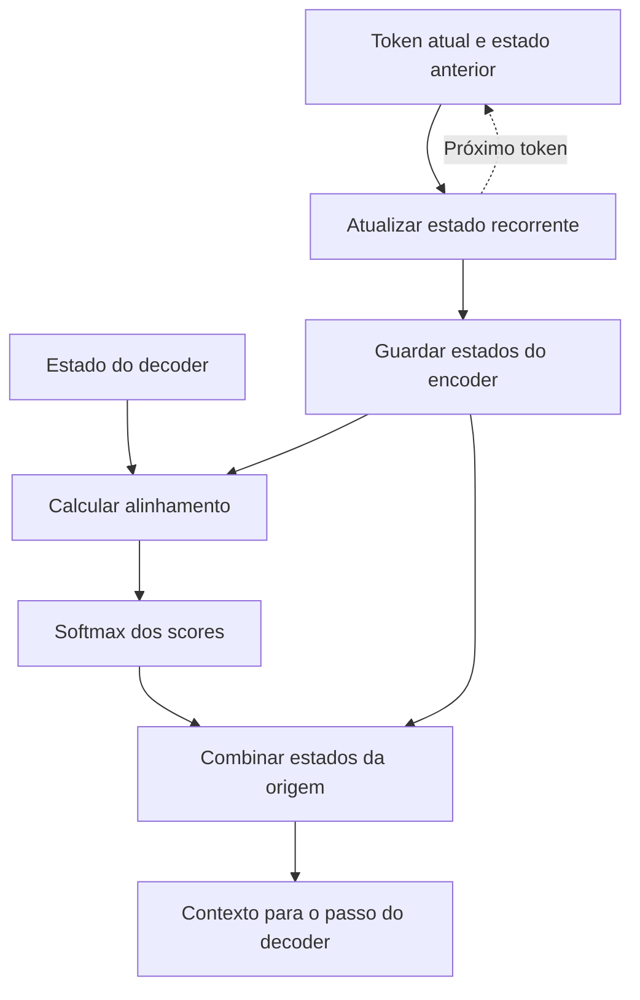
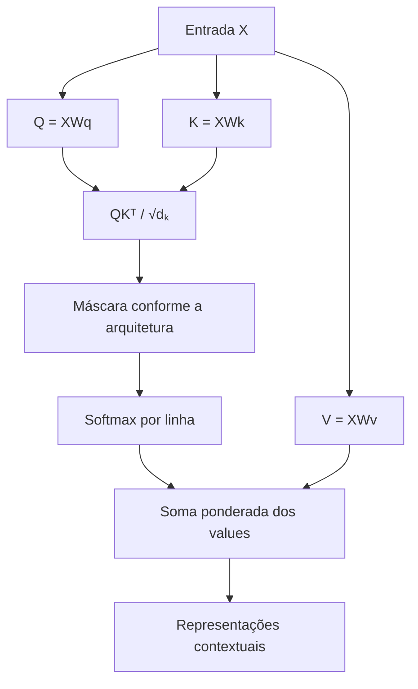
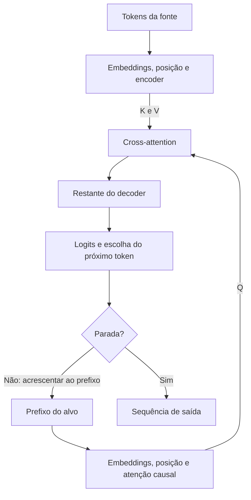
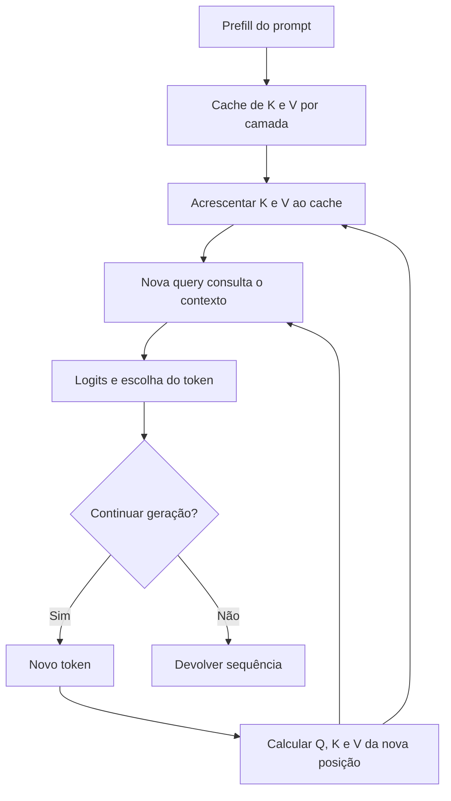
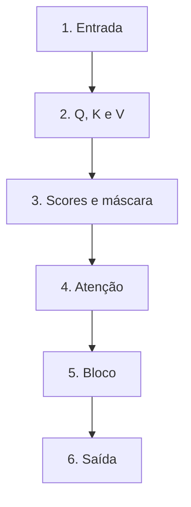

# Especificação de slides — Aula 6 (V2)

<!-- SLIDE-FLOW:GUIDE:BEGIN -->
## Fluxogramas na produção dos slides

As orientações abaixo complementam o campo **Visual** dos slides indicados. Produzir os fluxogramas no próprio deck, como formas e conectores editáveis ou gráficos vetoriais; a biblioteca completa ao final torna esta especificação independente do portal.

- **Referência de composição:** título e propósito no topo, blocos numerados, conexões rotuladas, ramificações legíveis e uma saída identificada. Usar apenas o padrão visual da referência fornecida, sem importar seu assunto ou seus exemplos.
- **Tema do deck:** manter o fundo escuro e a paleta já especificada para a aula. Usar `#5b8cff` para o trecho ativo, tons neutros para o contexto e `#e2231a` conforme o significado definido no deck. Cor sempre acompanhada de rótulo.
- **Leitura:** entrada no topo ou à esquerda; saída na base ou à direita. Decisões em losangos, alternativas com rótulos e retornos apontando à etapa correta. Ramos paralelos convergem apenas onde seus resultados realmente são combinados.
- **Densidade:** no fluxo principal, projetar 3–6 blocos curtos por enquadramento, com corpo legível na última fileira. Um mapa maior pode ser revelado por etapas no mesmo slide. Detalhes, condições e explicações completas ficam nas notas; não reduzir a fonte para caber tudo.
- **Semântica:** mapas de percurso mostram ordem de estudo, não execução de um algoritmo. Manter separadas preparação e aplicação, treino e inferência, sequência e alternativas. Não transformar uma etapa opcional em obrigatória.
- **Integração:** o fluxograma substitui uma lista redundante ou ocupa o campo Visual; não cobre matrizes, tabelas, gráficos nem código indispensáveis. Preservar títulos, numeração, duração e referências aos apêndices.
- **Produção:** os blocos Mermaid abaixo são especificações do desenho. Renderizar/reconstruir como diagrama, nunca projetar o código Mermaid. Manter rótulos, bifurcações, retornos e limites declarados. Não transformar este caderno técnico em slides adicionais.
- **Ligação com o portal:** os mapas de mecanismo compartilham o conteúdo dos fluxogramas do portal. Em demonstrações, usar o mesmo vocabulário no deck e no controle interativo para facilitar a passagem entre os dois.
<!-- SLIDE-FLOW:GUIDE:END -->

## Diretrizes visuais e de linguagem

- **Tema:** escuro, cor principal `#e2231a` (vermelho CESAR) e secundária `#5b8cff`.
- **Tipografia:** sans-serif para texto; monoespaçada para fórmulas, matrizes e código.
- **Texto projetado:** usar os itens de “Conteúdo”, com até cinco linhas principais por
  slide. As explicações mais longas ficam nas notas e no roteiro.
- **Linguagem:** frases diretas, termos definidos na primeira aparição e exemplos pequenos.
  Evitar slogans, ameaças sobre a avaliação e afirmações de que um sintoma só admite uma causa.
- **Fórmulas:** apresentar o resultado e explicar os termos. As derivações ficam no apêndice.
- **Diagramas:** identificar setas, eixos e dimensões. Usar a mesma cor para Q, K e V
  ao longo da apresentação. As cores complementam os rótulos.
- **Apêndice:** manter as etapas e suas justificativas. É material para estudo; usar
  blocos separados para notação, contas e interpretação.

## Sequência da aula

Partimos da mesma palavra em duas frases e retomamos como a RNN inclui contexto.
Apresentamos a self-attention como uma combinação ponderada de informações e, depois,
relacionamos essa ideia à fórmula. A segunda metade trata da máscara, das várias cabeças,
do custo e da arquitetura. O exercício pede hipóteses e verificações; o fechamento
discute por que precisamos representar a posição dos tokens.

---

# PARTE 1 — FLUXO PRINCIPAL

14 slides distribuídos em 110 minutos, incluindo demonstração, exercício e discussão.
Intervalo de 10 minutos, das 00:55 às 01:05. Os horários detalhados estão no roteiro.

### Slide 1 — A mesma palavra em dois contextos

- **Tipo:** problema
- **Título:** A mesma palavra em dois contextos
- **Conteúdo:**
  - “O banco do rio estava cheio.”
  - “O banco do centro estava fechado.”
  - O embedding estático de banco é igual nas duas frases.
  - Como incluir as palavras ao redor na representação?
- **Frase-tese:** “O vetor inicial de banco é o mesmo; o contexto precisa entrar no cálculo da nova representação.”
- **Visual:** Duas frases lado a lado, com banco destacado e setas para o mesmo vetor inicial.
- **Notas do apresentador:** Explicar banco de areia na primeira frase. Retomar o Lab 1 se a saída estiver disponível. A limitação vale para um classificador que recebe apenas o vetor estático da palavra.

### Slide 2 — Como a RNN leva o contexto adiante

<!-- SLIDE-FLOW:SLIDE:BEGIN -->
- **Fluxograma a incorporar neste slide:** **F00 — Recorrência e acesso por atenção**. O desenho e os rótulos completos estão no caderno de fluxogramas ao final deste arquivo.
- **Composição:** integrar ao campo Visual; preservar exemplos, tabelas, fórmulas e dimensões solicitados neste slide. Destacar o trecho relacionado ao título e manter o restante em segundo plano. Os textos detalhados ficam nas notas, sem duplicar a lista de Conteúdo na tela.
<!-- SLIDE-FLOW:SLIDE:END -->

- **Tipo:** comparação
- **Título:** Como a RNN leva o contexto adiante
- **Conteúdo:**
  - A RNN atualiza um estado oculto a cada token.
  - Da posição 1 à 50, são 49 atualizações.
  - Cada passo depende do anterior.
  - A atenção permite consultar diretamente outra posição.
- **Frase-tese:** “A RNN inclui contexto passo a passo; a atenção permite uma ligação direta entre posições.”
- **Visual:** Comparar uma cadeia de posições com um diagrama de ligações diretas. Usar setas, sem a analogia de perda inevitável de informação.
- **Fundamento:** Caminho entre posições: O(n) na RNN e O(1) na self-attention de uma camada.
  → derivação completa: **Apêndice A.5** (slide 19)
- **Notas do apresentador:** A RNN já incorpora contexto. O ponto é a dificuldade de preservar informação distante e a dependência sequencial dentro da sequência.

### Slide 3 — Como a self-attention combina informações

<!-- SLIDE-FLOW:SLIDE:BEGIN -->
- **Fluxograma a incorporar neste slide:** **F01 — Self-attention: da entrada ao contexto**. O desenho e os rótulos completos estão no caderno de fluxogramas ao final deste arquivo.
- **Composição:** integrar ao campo Visual; preservar exemplos, tabelas, fórmulas e dimensões solicitados neste slide. Destacar o trecho relacionado ao título e manter o restante em segundo plano. Os textos detalhados ficam nas notas, sem duplicar a lista de Conteúdo na tela.
<!-- SLIDE-FLOW:SLIDE:END -->

- **Tipo:** conceito
- **Título:** Como a self-attention combina informações
- **Conteúdo:**
  - Cada token combina informações da própria sequência.
  - Os pesos indicam a contribuição de cada conteúdo.
  - Os pesos são calculados a partir da entrada.
  - Outro contexto pode produzir outra representação.
- **Frase-tese:** “A self-attention calcula quanto cada token contribui para a representação dos outros.”
- **Visual:** Setas com pesos entre banco e as demais palavras. Rotular o desenho como ilustração, sem apresentar pesos inventados como resultado medido.
- **Notas do apresentador:** Começar sem máscara. Explicar peso com uma média ponderada e lembrar que token pode ser uma palavra ou parte dela.

### Slide 4 — Q, K, V: três papéis, uma entrada

<!-- SLIDE-FLOW:SLIDE:BEGIN -->
- **Fluxograma a incorporar neste slide:** **F01 — Self-attention: da entrada ao contexto**. O desenho e os rótulos completos estão no caderno de fluxogramas ao final deste arquivo.
- **Composição:** integrar ao campo Visual; preservar exemplos, tabelas, fórmulas e dimensões solicitados neste slide. Destacar o trecho relacionado ao título e manter o restante em segundo plano. Os textos detalhados ficam nas notas, sem duplicar a lista de Conteúdo na tela.
<!-- SLIDE-FLOW:SLIDE:END -->

- **Tipo:** diagrama
- **Título:** Q, K, V: três papéis, uma entrada
- **Conteúdo:**
  - Query (Q): consulta usada na comparação.
  - Key (K): chave comparada com a consulta.
  - Value (V): conteúdo combinado na saída.
  - Na self-attention, as três projeções vêm da mesma X.
- **Frase-tese:** “Q e K calculam os pesos; V fornece o conteúdo que será combinado.”
- **Visual:** X com três setas rotuladas W_Q, W_K e W_V, chegando a Q, K e V.
- **Fundamento:** Q = XW_Q, K = XW_K, V = XW_V.
  → derivação completa: **Apêndice A.1** (slide 15)
- **Notas do apresentador:** Definir projeção como multiplicação por uma matriz aprendida. Usar a consulta a um catálogo como apoio, sem atribuir intenção aos vetores.

### Slide 5 — Lendo a fórmula de atenção

<!-- SLIDE-FLOW:SLIDE:BEGIN -->
- **Fluxograma a incorporar neste slide:** **F01 — Self-attention: da entrada ao contexto**. O desenho e os rótulos completos estão no caderno de fluxogramas ao final deste arquivo.
- **Composição:** integrar ao campo Visual; preservar exemplos, tabelas, fórmulas e dimensões solicitados neste slide. Destacar o trecho relacionado ao título e manter o restante em segundo plano. Os textos detalhados ficam nas notas, sem duplicar a lista de Conteúdo na tela.
<!-- SLIDE-FLOW:SLIDE:END -->

- **Tipo:** fórmula
- **Título:** Lendo a fórmula de atenção
- **Conteúdo:**
  - Attention(Q,K,V) = softmax(QKᵀ/√d_k)V
  - QKᵀ: escores de comparação entre posições.
  - /√d_k: ajuste de escala; d_k é a dimensão de Q e K.
  - softmax: pesos não negativos que somam 1 por linha.
  - Multiplicação por V: média ponderada dos conteúdos.
- **Frase-tese:** “A fórmula compara os tokens, calcula os pesos e combina os conteúdos.”
- **Visual:** Fórmula com cores e legendas alinhadas a cada termo. Mostrar os pesos ilustrativos 0,6, 0,3 e 0,1 nas notas ou no diagrama de apoio.
- **Fundamento:** Attention(Q,K,V) = softmax(QKᵀ/√d_k)V.
  → derivação completa: **Apêndice A.1** (slide 15)
- **Notas do apresentador:** Ler a fórmula com calma. Definir transposição, escore e combinação convexa no roteiro. A matriz de escores não precisa ser simétrica.

### Slide 6 — Por que dividir por `√d_k`

<!-- SLIDE-FLOW:SLIDE:BEGIN -->
- **Fluxograma a incorporar neste slide:** **F01 — Self-attention: da entrada ao contexto**. O desenho e os rótulos completos estão no caderno de fluxogramas ao final deste arquivo.
- **Composição:** integrar ao campo Visual; preservar exemplos, tabelas, fórmulas e dimensões solicitados neste slide. Destacar o trecho relacionado ao título e manter o restante em segundo plano. Os textos detalhados ficam nas notas, sem duplicar a lista de Conteúdo na tela.
<!-- SLIDE-FLOW:SLIDE:END -->

- **Tipo:** conceito e dados
- **Título:** Por que dividir por `√d_k`
- **Conteúdo:**
  - Escores muito dispersos podem concentrar os pesos.
  - Saturação: um peso perto de 1 e os demais perto de 0.
  - Nessa região, os pesos respondem pouco a pequenos ajustes.
  - Dividir por √d_k compensa o crescimento de escala do exemplo.
- **Frase-tese:** “A divisão por raiz de d_k ajuda a evitar que os pesos fiquem concentrados demais por causa da escala.”
- **Visual:** Tabela de d_k = 64 e 512 com desvios teóricos 8 e aproximadamente 22,6. Rotular as hipóteses: componentes independentes, média zero e variância um. Separar esses valores dos resultados medidos na demo.
- **Fundamento:** Sob as hipóteses indicadas, Var(q·k) = d_k.
  → derivação completa: **Apêndice A.2** (slide 16)
- **Notas do apresentador:** Definir perda e gradiente antes de relacionar saturação a treinamento. Perda pior em um modelo maior é uma pista; o diagnóstico depende de outras verificações.

### Slide 7 — [Demo] Observando os pesos de atenção

<!-- SLIDE-FLOW:SLIDE:BEGIN -->
- **Fluxograma a incorporar neste slide:** **F01 — Self-attention: da entrada ao contexto**. O desenho e os rótulos completos estão no caderno de fluxogramas ao final deste arquivo.
- **Composição:** integrar ao campo Visual; preservar exemplos, tabelas, fórmulas e dimensões solicitados neste slide. Destacar o trecho relacionado ao título e manter o restante em segundo plano. Os textos detalhados ficam nas notas, sem duplicar a lista de Conteúdo na tela.
<!-- SLIDE-FLOW:SLIDE:END -->

- **Tipo:** demonstração
- **Título:** [Demo] Observando os pesos de atenção
- **Conteúdo:**
  - 1. Mesmo banco na entrada, saídas diferentes.
  - 2. Escores e pesos com e sem a divisão por √d_k.
  - 3. Máscara causal: pesos futuros iguais a zero.
  - 4. Sem máscara e sem posição: permutar entrada e saída.
- **Frase-tese:** “Vou comparar as saídas para relacionar cada parte da fórmula com os números do exemplo.”
- **Visual:** Lista das quatro comparações e, durante a execução, a tabela impressa pelo script.
- **Notas do apresentador:** Usar o caminho do script indicado na Parte 2 do roteiro. As projeções do exemplo são definidas à mão; a medição de escala usa vetores aleatórios. Não há treinamento nessa demo.

### Slide 8 — Máscara causal: usando apenas o contexto disponível

<!-- SLIDE-FLOW:SLIDE:BEGIN -->
- **Fluxograma a incorporar neste slide:** **F01 — Self-attention: da entrada ao contexto**. O desenho e os rótulos completos estão no caderno de fluxogramas ao final deste arquivo.
- **Composição:** integrar ao campo Visual; preservar exemplos, tabelas, fórmulas e dimensões solicitados neste slide. Destacar o trecho relacionado ao título e manter o restante em segundo plano. Os textos detalhados ficam nas notas, sem duplicar a lista de Conteúdo na tela.
<!-- SLIDE-FLOW:SLIDE:END -->

- **Tipo:** conceito
- **Título:** Máscara causal: usando apenas o contexto disponível
- **Conteúdo:**
  - A posição i prevê o token i+1.
  - A máscara permite consultar o presente e o passado.
  - Os escores futuros recebem −∞ antes do softmax.
  - Depois do softmax, os pesos futuros são zero.
  - A soma de cada linha permitida é 1.
- **Frase-tese:** “A máscara causal bloqueia as posições futuras antes de calcular os pesos.”
- **Visual:** Matriz de escores com −∞ acima da diagonal e matriz de pesos com zeros na mesma região. Mostrar os rótulos de linha e coluna.
- **Fundamento:** A = softmax(QKᵀ/√d_k + M), com M bloqueando as posições futuras.
  → derivação completa: **Apêndice A.3** (slide 17)
- **Notas do apresentador:** Definir vazamento de futuro. Explicar por que apenas zerar pesos depois do softmax mantém a influência do futuro no denominador. Conferir causalidade com o dropout desativado.

### Slide 9 — Multi-head: várias combinações em paralelo

<!-- SLIDE-FLOW:SLIDE:BEGIN -->
- **Fluxograma a incorporar neste slide:** **F01 — Self-attention: da entrada ao contexto**. O desenho e os rótulos completos estão no caderno de fluxogramas ao final deste arquivo.
- **Composição:** integrar ao campo Visual; preservar exemplos, tabelas, fórmulas e dimensões solicitados neste slide. Destacar o trecho relacionado ao título e manter o restante em segundo plano. Os textos detalhados ficam nas notas, sem duplicar a lista de Conteúdo na tela.
<!-- SLIDE-FLOW:SLIDE:END -->

- **Tipo:** diagrama
- **Título:** Multi-head: várias combinações em paralelo
- **Conteúdo:**
  - Cada cabeça tem suas projeções Q, K e V.
  - As cabeças calculam combinações em paralelo.
  - As saídas são concatenadas e projetadas novamente.
  - Exemplo: dimensão 512, oito cabeças de dimensão 64.
  - O mapa mostra pesos; a função da cabeça exige investigação.
- **Frase-tese:** “Várias cabeças permitem calcular combinações diferentes de informação na mesma camada.”
- **Visual:** Projeções da mesma entrada para oito cabeças menores, seguidas de concatenação e projeção. Não desenhar como se cada cabeça recebesse apenas uma fatia fixa da entrada original.
- **Fundamento:** d_k = d_v = d_model/h; MultiHead(X) = Concat(head_1,…,head_h)W_O.
  → derivação completa: **Apêndice A.4** (slide 18)
- **Notas do apresentador:** Definir concatenação como juntar as saídas lado a lado. A comparação de custo mantém d_model fixo; tempo e memória podem variar. Retomar interpretação de cabeças na Aula 27.

### Slide 10 — Como o tamanho do contexto afeta a memória

- **Tipo:** dados
- **Título:** Como o tamanho do contexto afeta a memória
- **Conteúdo:**
  - A matriz tem n linhas e n colunas.
  - 2.000 tokens: 4 milhões de entradas.
  - 4.000 tokens: 16 milhões de entradas.
  - Com 2 bytes por entrada: cerca de 8 MB e 32 MB.
  - Esses valores são por cabeça, por sequência, só para a matriz.
- **Frase-tese:** “Dobrar o contexto quadruplica o número de entradas da matriz de atenção.”
- **Visual:** Duas matrizes com lados proporcionais 1:2 e tabela de contagem. Uma legenda informa que a estimativa considera armazenar a matriz inteira.
- **Fundamento:** Cálculo da atenção: O(n²·d). Memória da matriz: B·h·n²·bytes por elemento.
  → derivação completa: **Apêndice A.5** (slide 19)
- **Notas do apresentador:** Separar a memória dessa matriz do total da GPU e o número de operações do tempo medido. A.5 também compara os passos sequenciais com os da RNN.

### Slide 11 — Encoder, decoder e cross-attention

<!-- SLIDE-FLOW:SLIDE:BEGIN -->
- **Fluxograma a incorporar neste slide:** **F02 — Encoder–decoder: dois caminhos se encontram**. O desenho e os rótulos completos estão no caderno de fluxogramas ao final deste arquivo.
- **Composição:** integrar ao campo Visual; preservar exemplos, tabelas, fórmulas e dimensões solicitados neste slide. Destacar o trecho relacionado ao título e manter o restante em segundo plano. Os textos detalhados ficam nas notas, sem duplicar a lista de Conteúdo na tela.
<!-- SLIDE-FLOW:SLIDE:END -->

- **Tipo:** arquitetura
- **Título:** Encoder, decoder e cross-attention
- **Conteúdo:**
  - Encoder: representação da sequência de entrada.
  - Decoder: produção da sequência de saída.
  - Self-attention causal: consulta à saída já disponível.
  - Cross-attention: Q do decoder; K e V do encoder.
- **Frase-tese:** “Na cross-attention, o decoder faz a consulta e o encoder fornece as chaves e os valores.”
- **Visual:** Diagrama das duas pilhas com setas de entrada, saída e cross-attention. Manter feed-forward, normalização e residuais visíveis, com indicação de estudo na Aula 7.
- **Notas do apresentador:** Usar tradução como exemplo. Relacionar a consulta ao encoder à atenção de Bahdanau, esclarecendo que a fórmula de compatibilidade é diferente.

### Slide 12 — Geração token a token e KV cache

<!-- SLIDE-FLOW:SLIDE:BEGIN -->
- **Fluxograma a incorporar neste slide:** **F03 — KV cache: reutilizar o passado**. O desenho e os rótulos completos estão no caderno de fluxogramas ao final deste arquivo.
- **Composição:** integrar ao campo Visual; preservar exemplos, tabelas, fórmulas e dimensões solicitados neste slide. Destacar o trecho relacionado ao título e manter o restante em segundo plano. Os textos detalhados ficam nas notas, sem duplicar a lista de Conteúdo na tela.
<!-- SLIDE-FLOW:SLIDE:END -->

- **Tipo:** processo
- **Título:** Geração token a token e KV cache
- **Conteúdo:**
  - Calcular probabilidades para o próximo token.
  - Escolher um token e acrescentá-lo à sequência.
  - Repetir usando o contexto atualizado.
  - KV cache: reutilizar chaves e valores anteriores.
  - Decoder-only: prompt e continuação na mesma sequência.
- **Frase-tese:** “O KV cache guarda chaves e valores anteriores para reutilizá-los durante a geração.”
- **Visual:** Três passos do processo de geração, distinguindo K/V guardados dos calculados para o novo token.
- **Notas do apresentador:** Definir autorregressivo antes de usar o termo. O cache é usado na inferência causal e ocupa memória. A família GPT exemplifica a organização decoder-only.

### Slide 13 — [Exercício] Como investigar três problemas

- **Tipo:** exercício
- **Título:** [Exercício] Como investigar três problemas
- **Conteúdo:**
  - 1. Dimensão 1024: perda de validação pior que com 256.
  - 2. Perda quase zero no treino, mas geração incoerente.
  - 3. Contexto de 2.000 para 4.000: memória da GPU excedida.
  - Para cada caso: hipótese, verificação e resultado esperado.
  - 8 minutos em dupla + 3 minutos de correção.
- **Frase-tese:** “Para cada problema, vamos propor uma hipótese e dizer como testá-la.”
- **Visual:** Três situações com espaço para as respostas. O enunciado completo está no roteiro.
- **Notas do apresentador:** Usar os mesmos dados e passos no caso 1; modelo e lote fixos no caso 3. Não tratar as hipóteses do gabarito como causas já provadas. A Parte 3 do roteiro detalha a correção.

### Slide 14 — Por que ainda precisamos representar a posição

<!-- SLIDE-FLOW:SLIDE:BEGIN -->
- **Fluxograma a incorporar neste slide:** **F04 — O percurso desta aula**. O desenho e os rótulos completos estão no caderno de fluxogramas ao final deste arquivo.
- **Composição:** integrar ao campo Visual; preservar exemplos, tabelas, fórmulas e dimensões solicitados neste slide. Destacar o trecho relacionado ao título e manter o restante em segundo plano. Os textos detalhados ficam nas notas, sem duplicar a lista de Conteúdo na tela.
<!-- SLIDE-FLOW:SLIDE:END -->

- **Tipo:** encerramento
- **Título:** Por que ainda precisamos representar a posição
- **Conteúdo:**
  - “O cachorro morde o homem.” / “O homem morde o cachorro.”
  - Mesmas palavras, sentidos diferentes.
  - Sem máscara e sem posição, a saída acompanha a permutação.
  - Aula 7: posição, residuais, normalização e feed-forward.
  - Leitura: Vaswani et al., seções 3.1–3.3, com apoio de A.2.
- **Frase-tese:** “Além do conteúdo de cada token, o modelo precisa de informação sobre sua posição.”
- **Visual:** Duas sequências e setas que acompanham os mesmos tokens após a troca. Destacar as condições “sem máscara” e “sem informação posicional”.
- **Fundamento:** Sem máscara e sem informação posicional, Attention(PX) = P·Attention(X).
  → derivação completa: **Apêndice A.6** (slide 20)
- **Notas do apresentador:** Definir equivariância em linguagem simples. A afirmação não vale diretamente para uma máscara causal fixa. Mostrar onde encontrar A.2 e A.6.

---

# PARTE 2 — APÊNDICE MATEMÁTICO

Este apêndice desenvolve as contas citadas na aula. Cada item apresenta a notação,
as hipóteses e as etapas, seguidas de uma interpretação. A.1 ajuda a revisar a fórmula;
A.2 explica a escala; os demais itens podem ser consultados conforme a dúvida.

### Slide 15 — A.1 · Derivação de `softmax(QKᵀ/√d_k)V`

<!-- SLIDE-FLOW:SLIDE:BEGIN -->
- **Fluxograma a incorporar neste slide:** **F01 — Self-attention: da entrada ao contexto**. O desenho e os rótulos completos estão no caderno de fluxogramas ao final deste arquivo.
- **Composição:** integrar ao campo Visual; preservar exemplos, tabelas, fórmulas e dimensões solicitados neste slide. Destacar o trecho relacionado ao título e manter o restante em segundo plano. Os textos detalhados ficam nas notas, sem duplicar a lista de Conteúdo na tela.
<!-- SLIDE-FLOW:SLIDE:END -->

- **Tipo:** apêndice — derivação completa
- **Invocado em:** slides 4 e 5

**Notação.**
`X ∈ ℝ^(n×d_model)` — sequência de entrada, `n` posições, cada uma um vetor de dimensão `d_model`.
`W_Q, W_K ∈ ℝ^(d_model×d_k)` e `W_V ∈ ℝ^(d_model×d_v)` — matrizes de projeção aprendidas.
`Q = XW_Q ∈ ℝ^(n×d_k)`, `K = XW_K ∈ ℝ^(n×d_k)`, `V = XW_V ∈ ℝ^(n×d_v)`.
`q_i` denota a `i`-ésima linha de `Q` (vetor-linha de dimensão `d_k`); idem para `k_j`, `v_j`.

**Premissas.** As três projeções partem da mesma `X` (isto define *self*-attention;
em cross-attention, `Q` vem de uma sequência e `K, V` de outra). Não há premissa
distribucional aqui — ela só aparece em A.2.

**Etapa 1 — matriz de afinidade.**
```
S = Q Kᵀ ∈ ℝ^(n×n)        S[i,j] = q_i · k_j = Σ_{m=1}^{d_k} Q[i,m] K[j,m]
```
Justificativa de cada dimensão: `Q` é `n×d_k`, `Kᵀ` é `d_k×n`, logo `S` é `n×n` — quadrada
em **posições**, com uma entrada para cada par de tokens. Testar com `n ≠ d_k`
ajuda a perceber uma transposição incorreta que poderia passar despercebida se as
dimensões fossem iguais.

*Interpretação:* `S[i,j]` compara a consulta da posição `i` com a chave da posição `j`.
O produto escalar depende tanto dos comprimentos dos vetores quanto do ângulo entre
eles: é zero para vetores ortogonais e negativo quando o ângulo é maior que 90 graus.

*Por que S não precisa ser simétrica:*
```
S[i,j] = q_i · k_j = (x_i W_Q) · (x_j W_K)
S[j,i] = q_j · k_i = (x_j W_Q) · (x_i W_K)
```
As projeções de Q e K são aprendidas separadamente, então as expressões podem diferir.
Consultar j a partir de i pode ter um escore diferente de consultar i a partir de j.
Matrizes de projeção diferentes, por si só, não garantem assimetria em toda entrada.

**Etapa 2 — escala.** `S' = S / √d_k`. A justificativa completa está em **A.2**.

**Etapa 3 — normalização por linha.**
```
A = softmax(S')            A[i,j] = exp(S'[i,j]) / Σ_{l=1}^{n} exp(S'[i,l])
```
O softmax é aplicado **na dimensão das colunas**, linha a linha. Cada linha de `A` passa a
somar 1:
```
Σ_j A[i,j] = Σ_j exp(S'[i,j]) / Σ_l exp(S'[i,l]) = 1     para toda linha i
```

*Leitura:* `A[i,:]` reúne os pesos usados pela posição i. Como a soma é 1, aumentar um
peso implica reduzir a soma dos demais. Por exemplo, os pesos 0,6, 0,3 e 0,1 atribuem
contribuições de 60%, 30% e 10% aos respectivos valores.

Esses pesos têm a forma de uma distribuição sobre posições. Não representam, por si só,
a probabilidade de uma palavra ser “importante” ou de a previsão estar correta. A soma
unitária permite calcular uma média, sem fazer a saída crescer apenas por somar mais valores.

**Etapa 4 — agregação.**
```
Attention(Q,K,V) = A V ∈ ℝ^(n×d_v)        saída[i] = Σ_j A[i,j] · v_j
```

*Propriedade — a saída é combinação convexa dos values.* Como `A[i,j] ≥ 0` e
`Σ_j A[i,j] = 1`, a linha `i` da saída é um ponto no **fecho convexo** dos vetores `v_j`.
O fecho convexo é o conjunto de todas essas médias ponderadas. Por exemplo, com dois
valores, as saídas ficam no segmento entre eles. A saída pode coincidir com um valor em
casos particulares, como valores todos iguais. Esta propriedade vale para `AV` antes de
dropout ou de uma projeção adicional.

**Fórmula completa:**
```
Attention(Q, K, V) = softmax(QKᵀ / √d_k) V
```

**Caso-limite 1 — escores todos iguais.** Se `S'[i,:]` é constante, `A[i,:] = 1/n` para
todo `j`: a saída vira a média simples de todos os valores. Se os escores forem apenas
próximos entre si, os pesos também ficarão próximos de uniformes.

**Caso-limite 2 — um escore domina.** Se `S'[i,j*] ≫ S'[i,j]` para todo `j ≠ j*`, então
`A[i,j*] → 1` e a saída tende a `v_{j*}`. Nesse limite, as derivadas do softmax tendem
a zero. A.2 explica como isso pode afetar os ajustes de Q e K.

**Intuição geométrica.** Pense em `A[i,:]` como um vetor de pesos sobre uma nuvem de pontos
`{v_j}`. A saída é o **centro de massa** da nuvem sob esses pesos. Mudar o contexto muda os
pesos e os valores disponíveis, deslocando o centro de massa. Isso ajuda a visualizar
por que banco pode ter saídas diferentes nos dois contextos.

**De volta ao fluxo:** slide 5.

### Slide 16 — A.2 · Por que dividir por `√d_k`

<!-- SLIDE-FLOW:SLIDE:BEGIN -->
- **Fluxograma a incorporar neste slide:** **F01 — Self-attention: da entrada ao contexto**. O desenho e os rótulos completos estão no caderno de fluxogramas ao final deste arquivo.
- **Composição:** integrar ao campo Visual; preservar exemplos, tabelas, fórmulas e dimensões solicitados neste slide. Destacar o trecho relacionado ao título e manter o restante em segundo plano. Os textos detalhados ficam nas notas, sem duplicar a lista de Conteúdo na tela.
<!-- SLIDE-FLOW:SLIDE:END -->

- **Tipo:** apêndice — derivação completa
- **Invocado em:** slide 6

**O que se quer demonstrar.** Que o desvio-padrão do produto escalar `q·k` cresce com
`√d_k` sob as hipóteses abaixo. Esse argumento motiva o fator de escala.

**Notação e premissas.** Sejam `q, k ∈ ℝ^(d_k)` com componentes `q_m, k_m` mutuamente
independentes, de média 0 e variância 1. São hipóteses simplificadoras para entender a
escala; elas são usadas na geração dos vetores aleatórios da demo. Q e K de uma rede
treinada não precisam satisfazê-las exatamente. Por isso, a distribuição real dos escores
também deve ser observada.

**Derivação da variância.**
```
q · k = Σ_{m=1}^{d_k} q_m k_m
```
*Média.* Por independência, `E[q_m k_m] = E[q_m] E[k_m] = 0 · 0 = 0`. Por linearidade da
esperança:
```
E[q·k] = Σ_m E[q_m k_m] = 0
```

*Variância de cada parcela.* Como a média é zero, `Var(q_m k_m) = E[(q_m k_m)²]`. Usando
independência de novo:
```
E[q_m² k_m²] = E[q_m²] · E[k_m²] = Var(q_m) · Var(k_m) = 1 · 1 = 1
```

*Variância da soma.* Para variáveis **independentes**, a variância da soma é a soma das
variâncias — e é aqui que a premissa de independência é usada de forma essencial:
```
Var(q·k) = Σ_{m=1}^{d_k} Var(q_m k_m) = d_k
```
Logo
```
desvio-padrão(q·k) = √d_k
```

**Por que isso importa: a saturação do softmax.** Sem a divisão, os escores que chegam ao
softmax têm desvio-padrão `√d_k` sob essas hipóteses: 8 para `d_k = 64` e aproximadamente
22,6 para `d_k = 512`. O desvio-padrão não é um limite para os escores. Se um escore
superar bastante os outros, o peso correspondente pode ficar próximo de 1.

*Efeito sobre o gradiente.* A jacobiana reúne as derivadas dos pesos em relação aos
escores de uma linha. Abaixo, `z_j` é um escore que entra no softmax, `A_i` é um peso
da mesma linha e `δ_ij` vale 1 se `i = j` e 0 caso contrário:

```
∂A_i/∂z_j = A_i (δ_ij − A_j)
```
Quando `A_i → 1` e os demais `A_j → 0`, todas as entradas dessa jacobiana tendem a zero:
o termo `A_i(1 − A_i) → 0` na diagonal e `−A_i A_j → 0` fora dela. Com isso, para um
gradiente de entrada limitado, o sinal que chega a Q e K por esse caminho pode ficar
muito pequeno. Isso pode dificultar o treinamento, mas não implica que todos os
parâmetros da camada deixem de aprender. A perda pior, sozinha, não confirma essa causa.

**A correção.** Dividindo por `√d_k`:
```
Var(q·k / √d_k) = Var(q·k) / d_k = d_k / d_k = 1
```
Sob as hipóteses da derivação, a variância passa a ser 1 em qualquer dimensão.
Isso reduz a tendência à saturação causada pelo crescimento da escala. Não garante
pesos sempre equilibrados em uma rede treinada.

**Como interpretar o fator de escala.**
1. `√d_k` **não** normaliza os vetores `q` e `k`. Normaliza a escala do produto escalar.
   Normalizar os vetores seria outra operação, com outro efeito.
2. Na atenção padrão apresentada aqui, o fator é calculado a partir de `d_k`.
   Não há um valor adicional a escolher para essa divisão; a dimensão determina a escala.

**Caso-limite.** Com `d_k = 1`, `√d_k = 1` e a divisão não faz nada — coerente, pois com
uma dimensão não há acúmulo de variância.

**Referência.** Vaswani et al., *Attention Is All You Need*,
[seção 3.2.1, arXiv 1706.03762](https://arxiv.org/abs/1706.03762).

**De volta ao fluxo:** slide 6.

### Slide 17 — A.3 · Máscara causal e a ordem das operações

<!-- SLIDE-FLOW:SLIDE:BEGIN -->
- **Fluxograma a incorporar neste slide:** **F01 — Self-attention: da entrada ao contexto**. O desenho e os rótulos completos estão no caderno de fluxogramas ao final deste arquivo.
- **Composição:** integrar ao campo Visual; preservar exemplos, tabelas, fórmulas e dimensões solicitados neste slide. Destacar o trecho relacionado ao título e manter o restante em segundo plano. Os textos detalhados ficam nas notas, sem duplicar a lista de Conteúdo na tela.
<!-- SLIDE-FLOW:SLIDE:END -->

- **Tipo:** apêndice — derivação e análise de erro
- **Invocado em:** slide 8

**Notação.** M tem forma `n×n`, com entradas 0 ou −∞. Usamos índices de 0 a n−1
e escores finitos `S' = QKᵀ/√d_k`. A saída da posição i prevê o token i+1:

```
M[i,j] = 0      se j ≤ i     (permitido: passado e presente)
M[i,j] = −∞     se j > i     (proibido: futuro)
```

**Aplicação correta — antes da normalização.**
```
A = softmax( (QKᵀ / √d_k) + M )
```
Na entrada proibida, o argumento do softmax vira `−∞`. Como `exp(−∞) = 0`:
```
A[i,j] = exp(−∞) / Σ_l exp(...) = 0 / Σ_l exp(...) = 0     (exato, para j > i)
```
E a soma da linha é preservada, porque a normalização ocorre **depois** de as entradas
proibidas já valerem zero:
```
Σ_{j≤i} A[i,j] = Σ_{j≤i} exp(S'[i,j]) / Σ_{l≤i} exp(S'[i,l]) = 1
```
A massa que iria para o futuro é **redistribuída** entre passado e presente.

**Aplicação incorreta — depois da normalização.** Suponha que se calcule
`A = softmax(S')` e só então se zerem as entradas do futuro, obtendo `Ã`:
```
Ã[i,j] = A[i,j] · 1[j ≤ i]
```
Somando uma linha que tem posições futuras:
```
Σ_j Ã[i,j] = Σ_{j≤i} A[i,j] = 1 − Σ_{j>i} A[i,j] < 1
```
Para escores finitos, essa soma é menor que 1 nas linhas com futuro; na última linha,
continua igual a 1. A parcela removida depende dos escores e da posição. Se os escores
forem iguais, as primeiras posições perdem uma parcela maior; isso não é uma regra para
quaisquer escores.

*Consequências para a implementação:*
1. A saída incorreta é multiplicada pela soma dos pesos que restaram, em comparação
   com a média causal corretamente normalizada. Esse fator varia conforme a linha.
2. O denominador inclui escores futuros, que continuam influenciando os pesos permitidos.
3. As operações podem executar sem erro de programa, embora não implementem a atenção
   causal desejada. É necessário conferir o comportamento.

Essa análise considera apenas zerar os pesos depois, sem renormalização. Em aritmética
exata, renormalizar os pesos permitidos recuperaria a mesma distribuição causal, desde
que a soma restante fosse positiva. Mascarar antes evita essa operação adicional e
problemas numéricos quando os pesos restantes se tornam muito pequenos.

**Como verificar.** Antes de dropout nos pesos, conferir zeros nas posições proibidas
e soma próxima de 1 por linha, com tolerância numérica. Depois, com o dropout desativado,
alterar o último token e comparar as saídas anteriores. Uma diferença indica dependência
do futuro. Usar mais de uma entrada torna a verificação mais informativa. Somar as linhas,
sozinho, não detecta uma máscara ausente.

**Caso-limite — a primeira posição.** Para `i = 0`, apenas `j = 0` é permitido, logo
`A[0,0] = 1` necessariamente: o primeiro token só pode olhar para si mesmo. É uma
verificação rápida e útil da implementação.

**Nota de implementação.** Usar `−∞` literal pode produzir `NaN` se uma linha inteira for
mascarada, pois não há posição válida para normalizar. Nesta máscara, a diagonal é
permitida, o que evita esse caso. Usar um valor finito negativo não resolve, por si só,
o significado de uma linha sem posições válidas; esse caso exige tratamento explícito.

**De volta ao fluxo:** slide 8.

### Slide 18 — A.4 · Multi-head: dimensões e custo

<!-- SLIDE-FLOW:SLIDE:BEGIN -->
- **Fluxograma a incorporar neste slide:** **F01 — Self-attention: da entrada ao contexto**. O desenho e os rótulos completos estão no caderno de fluxogramas ao final deste arquivo.
- **Composição:** integrar ao campo Visual; preservar exemplos, tabelas, fórmulas e dimensões solicitados neste slide. Destacar o trecho relacionado ao título e manter o restante em segundo plano. Os textos detalhados ficam nas notas, sem duplicar a lista de Conteúdo na tela.
<!-- SLIDE-FLOW:SLIDE:END -->

- **Tipo:** apêndice — mecânica e verificação de custo
- **Invocado em:** slide 9

**Notação.** `h` cabeças; `d_k = d_v = d_model / h` (exigindo divisibilidade).
`W_Q^(l), W_K^(l), W_V^(l) ∈ ℝ^(d_model×d_k)` para a cabeça `l`; `W_O ∈ ℝ^(d_model×d_model)`.

**Definição.**
```
head_l = Attention(X W_Q^(l), X W_K^(l), X W_V^(l)) ∈ ℝ^(n×d_k)
MultiHead(X) = Concat(head_1, …, head_h) W_O
```
A concatenação recompõe `n × (h·d_k) = n × d_model`, e `W_O` remistura os subespaços.

**Organização dos tensores.** Podemos calcular as cabeças em conjunto, usando um eixo
extra no tensor, em vez de um laço em Python. `B` é o tamanho do lote, ou número de
sequências processadas juntas. Os formatos (*shapes*) ao longo desse cálculo são:

```
(B, n, d_model)                    entrada
(B, n, 3·d_model)                  projeção qkv combinada
3 × (B, n, d_model)                split em q, k, v
(B, n, h, d_k)                     view
(B, h, n, d_k)                     transpose(1,2)  ← a cabeça vira lote
(B, h, n, d_k)                     atenção (idêntica a A.1, aplicada por lote)
(B, n, h, d_k)                     transpose(1,2) de volta
(B, n, d_model)                    contiguous().view()
(B, n, d_model)                    projeção W_O
```

*O papel de `contiguous()`.* Após uma transposição, a disposição dos elementos em
memória pode ser incompatível com o `view` desejado. Nesse caso, `view` gera um erro.
`contiguous().view(...)` organiza os dados para permitir essa mudança de formato;
`reshape(...)` também pode fazer uma cópia quando necessário. `view` não troca eixos:
a transposição correta continua sendo necessária. Ver a
[documentação de Tensor.view](https://docs.pytorch.org/docs/stable/generated/torch.Tensor.view.html).

**Verificação do custo.** Parâmetros de projeção, somando as `h` cabeças:
```
h · 3 · (d_model · d_k) = 3 · d_model · (h · d_k) = 3 · d_model²
```
Idêntico ao de uma única cabeça com `d_k = d_model`. O custo da atenção em si:
```
h cabeças × O(n² · d_k) = O(n² · h · d_k) = O(n² · d_model)
```
Assim, as principais multiplicações mantêm a mesma ordem de custo, com `d_model` fixo.
A projeção de saída acrescenta `d_model²` parâmetros em ambos os casos se a comparação
incluir `W_O`. Isso não garante o mesmo tempo de execução. Na implementação que guarda
os pesos, há `h` matrizes `n×n`, o que afeta a memória.

**Caso-limite.** Com `h = 1`, `d_k = d_model` e a expressão colapsa em A.1 seguida de `W_O`.

**Nota de interpretação.** Cada cabeça produz uma matriz de pesos e uma combinação
de valores. Uma cabeça pode exibir mais de um tipo de relação, e diferentes cabeças podem
apresentar padrões semelhantes. O mapa permite observar pesos; identificar a contribuição
de uma cabeça para a resposta exige testes adicionais. Esse assunto será retomado na Aula 27.

**De volta ao fluxo:** slide 9.

### Slide 19 — A.5 · Complexidade `O(n²·d)`
- **Tipo:** apêndice — contagem de operações
- **Invocado em:** slide 10

**Contagem, termo a termo.**

*Projeções* `Q, K, V`: três multiplicações `(n×d_model) · (d_model×d_k)`, cada uma
`O(n · d_model · d_k)`. Somando: `O(n · d_model²)` quando `d_k = d_model/h` e há `h` cabeças.

*Matriz de afinidade* `QKᵀ`: `(n×d_k) · (d_k×n)` → `n²` entradas, cada uma um produto
escalar de comprimento `d_k`:
```
O(n² · d_k)
```

*Softmax*: `O(n²)` — uma exponencial e uma divisão por entrada.

*Agregação* `AV`: `(n×n) · (n×d_v)` → `O(n² · d_v)`.

**Total.** Somando todas as cabeças, com `d = d_model` e `d_k = d_v = d/h`:

```
O(n · d²)  +  O(n² · d)
 projeções     atenção
```
O segundo termo domina quando `n > d`, que é o regime de contexto longo. Daí a expressão
usual `O(n²·d)`.

**Memória.** Na implementação direta, a matriz A é armazenada e tem `n²` entradas
por cabeça e por sequência. Para B sequências e h cabeças, apenas essa matriz ocupa:

```
memória ≈ B · h · n² · (bytes por elemento)
```
Dobrar `n` quadruplica esse termo, mantendo B, h e a precisão. O total do treinamento
também inclui parâmetros, gradientes e outras ativações. Guardar A inteira não é uma
exigência matemática: algoritmos como FlashAttention calculam atenção por blocos para
evitar esse armazenamento completo. Ver Dao et al.,
[FlashAttention, arXiv 2205.14135](https://arxiv.org/abs/2205.14135).

**Comparação com a RNN.**

| | memória | passos sequenciais |
|---|---|---|
| RNN | `O(n)` | `O(n)` |
| Atenção | `O(n²)` | `O(1)` |

A tabela considera o treinamento, dimensões fixas e a implementação que guarda a
matriz de atenção. Os passos sequenciais descrevem dependências entre posições dentro
de uma camada; `O(1)` não significa tempo de execução constante ao aumentar a sequência.

O paralelismo entre posições favorece o treinamento da atenção em GPU. Uma comparação
de velocidade precisa considerar dimensão, comprimento, hardware e implementação.
Na geração autorregressiva, os novos tokens continuam sendo produzidos em sequência;
o KV cache reduz o recálculo de chaves e valores anteriores.

**De volta ao fluxo:** slide 10.

### Slide 20 — A.6 · Equivariância a permutação
- **Tipo:** apêndice — demonstração
- **Invocado em:** slide 14

**Enunciado.** Self-attention sem informação posicional e sem máscara é
**equivariante** a permutação:
permutar as linhas da entrada permuta as linhas da saída da mesma forma, sem alterar
nenhum valor.

**Notação.** Seja `P ∈ {0,1}^(n×n)` uma matriz de permutação: exatamente um 1 por linha e
por coluna. Propriedades usadas: `Pᵀ P = I` e `P` é ortogonal.

**Demonstração.** Aplicando a atenção à entrada permutada `PX`:

*Projeções.* `Q' = (PX)W_Q = P(XW_Q) = PQ`, e analogamente `K' = PK`, `V' = PV`.
A permutação atua por linhas e comuta com a multiplicação à direita.

*Afinidade.*
```
S' = Q'K'ᵀ = (PQ)(PK)ᵀ = P Q Kᵀ Pᵀ = P S Pᵀ
```

*Escala.* Divisão por escalar comuta: `S'/√d_k = P (S/√d_k) Pᵀ`.

*Softmax.* Reordenar os escores reordena os pesos da mesma forma. O denominador
permanece igual porque soma os mesmos termos. Formalmente,

`softmax(P S Pᵀ) = P softmax(S) Pᵀ`, pois `P S Pᵀ` apenas reordena linhas e colunas, e a
normalização de cada linha independe da ordem em que os termos são somados. Logo
`A' = P A Pᵀ`.

*Agregação.*
```
saída' = A' V' = (P A Pᵀ)(P V) = P A (Pᵀ P) V = P A V = P · saída
```
usando `Pᵀ P = I`. ∎

**Leitura do resultado.** A saída da entrada permutada é exatamente a saída original,
permutada. Nenhum valor muda — só a posição em que aparece. O mecanismo **não tem como
distinguir** `"o cachorro morde o homem"` de `"o homem morde o cachorro"`: as
representações de cada token são idênticas nos dois casos.

**Confirmação empírica.** É o que a Demo 4 (`--shuffle`) mostra: embaralhar os tokens e
verificar que a saída de cada um é idêntica a menos de permutação. A demo **ilustra** o
teorema; um teste com uma permutação não demonstra a propriedade para todas elas.
No computador, a comparação usa tolerância para diferenças de arredondamento.

**Limite do enunciado.** Uma máscara causal fixa muda quais posições cada token pode
consultar. Ela não é permutada junto com X, então a demonstração acima não se aplica
diretamente. Também estamos considerando o cálculo sem dropout.

**Consequência.** Para usar a posição explicitamente, acrescentamos um mecanismo
posicional. Codificação senoidal, embeddings posicionais aprendidos e RoPE são temas
da Aula 7. No RoPE, Q e K recebem rotações que dependem da posição; por isso, a igualdade
`Q' = PQ` usada nesta demonstração deixa de valer em geral.

**De volta ao fluxo:** slide 14.

<!-- SLIDE-FLOW:LIBRARY:BEGIN -->
# Caderno de fluxogramas para produção

As referências Fxx identificam desenhos, não novos números de slide. Cada desenho abaixo é autocontido.

| Mapa | Desenho | Usar nos slides |
| --- | --- | --- |
| F00 | Recorrência e acesso por atenção | 2 |
| F01 | Self-attention: da entrada ao contexto | 3, 4, 5, 6, 7, 8, 9, 15, 16, 17, 18 |
| F02 | Encoder–decoder: dois caminhos se encontram | 11 |
| F03 | KV cache: reutilizar o passado | 12 |
| F04 | O percurso desta aula | 14 |

## F00 — Recorrência e acesso por atenção

O estado percorre a sequência; a atenção permite consultar estados anteriores diretamente.



**Conteúdo dos blocos e notas de montagem:**

1. **Receber xₜ e hₜ₋₁:** O próximo estado depende da entrada atual e do estado anterior.
2. **Atualizar a memória:** Na RNN simples, hₜ = f(Wxₜ + Uhₜ₋₁). No LSTM, portas controlam um caminho aditivo.
   ↺ Repita para o próximo token; o gradiente atravessa essas dependências no treino.
3. **Preservar estados do encoder:** Com atenção, mantenha representações das posições de origem.
4. **Consultar a origem:** O estado do decoder gera scores de alinhamento; softmax produz pesos.
5. **Combinar e prever:** A soma ponderada dos estados fornece um contexto para o passo do decoder.

**Saída ou limite a explicitar:** Atenção reduz o gargalo de um contexto fixo; uma rede recorrente ainda tem dependência sequencial.

## F01 — Self-attention: da entrada ao contexto

Fluxo de dados de uma cabeça de atenção; a máscara depende da arquitetura.



**Conteúdo dos blocos e notas de montagem:**

1. **Projetar a entrada X:** Três projeções aprendidas operam sobre os mesmos vetores.
   Ramos/alternativas a rotular: Q = XWq · consultas; K = XWk · chaves; V = XWv · valores.
2. **Comparar Q com K:** Calcule QKᵀ e divida por √dₖ para controlar a escala dos scores.
3. **Aplicar a máscara:** Em atenção causal, posições futuras recebem −∞ antes da normalização.
4. **Normalizar por linha:** Softmax converte scores permitidos em pesos que somam 1.
5. **Combinar valores:** Multiplique os pesos por V; cada posição recebe uma mistura contextual.

**Saída ou limite a explicitar:** Saída: representações contextuais. Multi-head concatena várias cabeças e aplica uma projeção.

## F02 — Encoder–decoder: dois caminhos se encontram

A fonte e o prefixo do alvo têm representações próprias; a cross-attention liga os caminhos.



**Conteúdo dos blocos e notas de montagem:**

1. **Representar as entradas:** Converta tokens em embeddings e incorpore posição.
   Ramos/alternativas a rotular: Fonte → entrada do encoder; Prefixo do alvo → entrada do decoder.
2. **Codificar a fonte:** A pilha encoder combina posições da fonte e fornece representações contextuais.
3. **Processar o prefixo:** Self-attention causal no decoder só consulta posições permitidas do alvo.
4. **Consultar a fonte:** Na cross-attention, Q vem do decoder; K e V vêm das representações do encoder.
   Ramos/alternativas a rotular: Decoder → queries; Encoder → keys e values.
5. **Produzir o próximo token:** O decoder transforma os estados; a cabeça de saída produz logits sobre o vocabulário.
   ↺ Na geração, acrescente o token ao prefixo e repita no decoder. Reutilize a fonte codificada.

**Saída ou limite a explicitar:** A fonte representada informa a previsão; o encoder não entrega uma tradução pronta ao decoder.

## F03 — KV cache: reutilizar o passado

O cache evita recalcular keys e values antigos na geração causal.



**Conteúdo dos blocos e notas de montagem:**

1. **Prefill do prompt:** Processe os tokens iniciais e armazene K e V de cada camada.
2. **Processar um novo token:** Calcule Q, K e V para a nova posição.
3. **Acrescentar K e V ao cache:** Preserve o histórico que permanece dentro da política de contexto.
4. **Atender ao contexto disponível:** A nova query consulta as keys e values armazenadas.
5. **Escolher o próximo token:** Produza logits e aplique a estratégia de decodificação.
   ↺ Se a geração continuar, volte ao processamento do novo token.

**Saída ou limite a explicitar:** O cache cresce com posições, camadas, cabeças KV e tamanho dos elementos; MQA/GQA reduzem cabeças KV.

## F04 — O percurso desta aula

As setas indicam a ordem de estudo. Abra cada etapa para entender sua função.



**Conteúdo dos blocos e notas de montagem:**

1. **Entrada:** Converta tokens em vetores e represente suas posições.
2. **Q, K e V:** Projete a entrada em queries, keys e values.
3. **Scores e máscara:** Calcule scores, aplique escala e a máscara adequada.
4. **Atenção:** Normalize scores e combine os values.
5. **Bloco:** Una cabeças e aplique os subblocos com residuais.
6. **Saída:** Projete para logits e escolha o próximo token.

**Saída ou limite a explicitar:** Conecte as etapas: explique como uma decisão afeta o que você observa em seguida.
<!-- SLIDE-FLOW:LIBRARY:END -->

