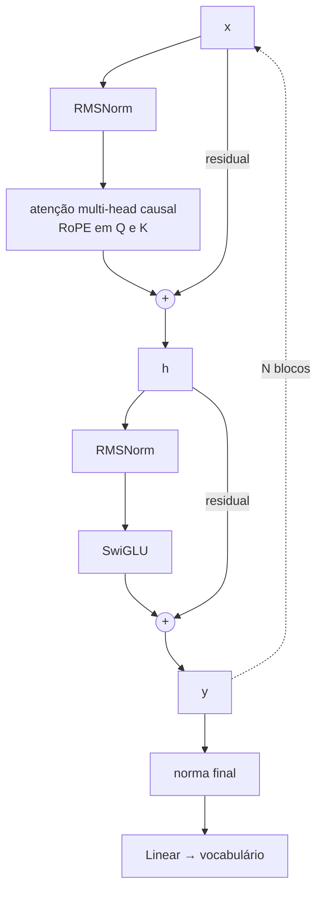
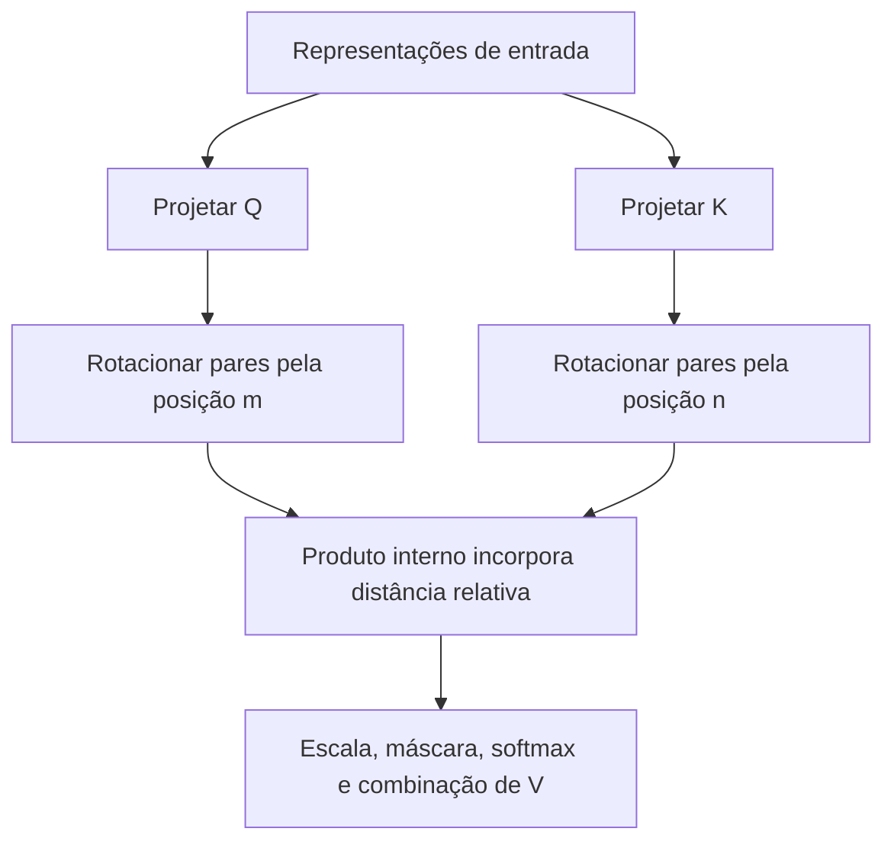
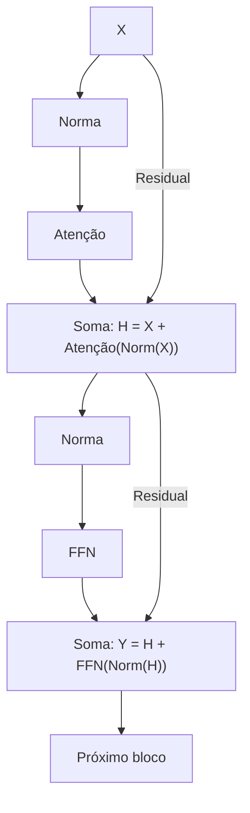
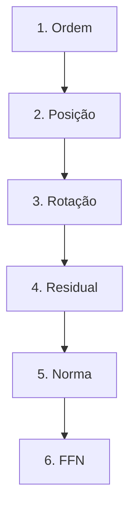

# Especificação de slides — Aula 7 (V2)

> **Rebalanceamento V2.** O fluxo principal abre pelo comportamento observável e usa a
> matemática como fundamento nomeado. Toda derivação está na Parte 2, mais detalhada do
> que estava na V1. Nada de matemática foi perdido — foi realocado.

<!-- SLIDE-FLOW:GUIDE:BEGIN -->
## Fluxogramas na produção dos slides

As orientações abaixo complementam o campo **Visual** dos slides indicados. Produzir os fluxogramas no próprio deck, como formas e conectores editáveis ou gráficos vetoriais; a biblioteca completa ao final torna esta especificação independente do portal.

- **Referência de composição:** título e propósito no topo, blocos numerados, conexões rotuladas, ramificações legíveis e uma saída identificada. Usar apenas o padrão visual da referência fornecida, sem importar seu assunto ou seus exemplos.
- **Tema do deck:** manter o fundo escuro e a paleta já especificada para a aula. Usar `#5b8cff` para o trecho ativo, tons neutros para o contexto e `#e2231a` conforme o significado definido no deck. Cor sempre acompanhada de rótulo.
- **Leitura:** entrada no topo ou à esquerda; saída na base ou à direita. Decisões em losangos, alternativas com rótulos e retornos apontando à etapa correta. Ramos paralelos convergem apenas onde seus resultados realmente são combinados.
- **Densidade:** no fluxo principal, projetar 3–6 blocos curtos por enquadramento, com corpo legível na última fileira. Um mapa maior pode ser revelado por etapas no mesmo slide. Detalhes, condições e explicações completas ficam nas notas; não reduzir a fonte para caber tudo.
- **Semântica:** mapas de percurso mostram ordem de estudo, não execução de um algoritmo. Manter separadas preparação e aplicação, treino e inferência, sequência e alternativas. Não transformar uma etapa opcional em obrigatória.
- **Integração:** o fluxograma substitui uma lista redundante ou ocupa o campo Visual; não cobre matrizes, tabelas, gráficos nem código indispensáveis. Preservar títulos, numeração, duração e referências aos apêndices.
- **Produção:** os blocos Mermaid abaixo são especificações do desenho. Renderizar/reconstruir como diagrama, nunca projetar o código Mermaid. Manter rótulos, bifurcações, retornos e limites declarados. Não transformar este caderno técnico em slides adicionais.
- **Ligação com o portal:** os mapas de mecanismo compartilham o conteúdo dos fluxogramas do portal. Em demonstrações, usar o mesmo vocabulário no deck e no controle interativo para facilitar a passagem entre os dois.
<!-- SLIDE-FLOW:GUIDE:END -->

## Diretrizes visuais

- **Tema:** escuro, accent `#e2231a` (vermelho CESAR), accent secundário `#5b8cff`.
- **Tipografia:** sans-serif para texto; monoespaçada para fórmulas, matrizes, pseudocódigo e
  nomes de peça (`RMSNorm`, `SwiGLU`).
- **Densidade:** máximo 5 linhas de texto por slide no fluxo. Um conceito por slide.
- **No fluxo principal:** fórmula aparece **enunciada e lida**, nunca manipulada. Toda
  fórmula vem acompanhada de um número medido na demo ou de um comportamento que ela prevê.
- **No apêndice:** densidade alta é esperada e desejável. É material de consulta.
- **Rotações:** onde o slide mostra rotação (slide 5), desenhar o par de dimensões como dois
  vetores no plano com o ângulo marcado. **Nunca** introduzir notação de número complexo — o
  argumento é 2D e a notação complexa perde metade da sala.
- **Diagramas de bloco:** os slides 10 e 12 desenham blocos com setas. A seta do caminho
  residual usa cor própria (accent secundário) e é a mesma nos dois slides, para o olho
  comparar.
- **Proibido:** bullets genéricos; slide-parede de texto; fórmula sem consequência prática no
  fluxo principal.

## Arco narrativo

A aula abre cobrando a dívida que a Aula 6 deixou marcada na tela: a demo do `--shuffle`
mostrou que o mecanismo é cego à ordem. A primeira metade percorre três lugares onde a área
tentou injetar posição — somada na entrada por uma função, somada na entrada por uma tabela
aprendida, e girada dentro do score — e usa um sintoma real para separar as duas primeiras da
terceira: o modelo que produz lixo assim que passa do comprimento visto no treino. A demo
mede os quatro casos e produz o número que decide a aula: com RoPE, o score de dois tokens
separados pela mesma distância é **o mesmo** na posição 3 e na posição 5000. A segunda metade
sai da posição e monta o que faz o bloco *treinar*, sempre pelo sintoma: a pilha que diverge
ao ganhar profundidade (residual), a escala que cresce ao longo das somas (qual norma), a
instabilidade que some ao trocar a ordem (pré-norm) e a parte do bloco onde estão dois terços
dos pesos. Fecha com a tabela "2017 → hoje" e o gancho de escopo para a Aula 8. O apêndice
reconstrói a senoidal, o RoPE, o caminho do gradiente pelo residual, as duas normas, a
diferença algébrica entre as duas ordens e o SwiGLU.

---

# PARTE 1 — FLUXO PRINCIPAL

*O que se apresenta em aula. 14 slides, ~85 minutos com demo e exercício.*

### Slide 1 — O sintoma que a Aula 6 deixou na tela
- **Tipo:** problema (abertura)
- **Título:** Duas frases opostas, as mesmas representações
- **Conteúdo:** Na Demo 4 da aula passada os tokens foram embaralhados e a saída de cada um
  **não mudou** — idêntica a menos de permutação. Traduzindo para o que isso custa: do jeito
  como o mecanismo está, *"o cachorro morde o homem"* e *"o homem morde o cachorro"* produzem
  exatamente as mesmas representações. Não é um erro de treino nem um caso raro: é o que a
  fórmula faz, sempre. E a consequência prática é dura — nenhuma tarefa que dependa de ordem
  (tradução, geração, qualquer coisa com sintaxe) funciona sobre isso.
- **Frase-tese:** O mecanismo que a gente montou na aula passada não sabe que ordem existe. E
  isso não se corrige com `if`.
- **Visual:** as duas frases uma sob a outra, com as mesmas cores de token nas duas; entre
  elas, um sinal de igualdade grande em accent ligando os dois conjuntos de vetores de saída.
  Rodapé: "Aula 6, Demo 4 — vocês viram isso acontecer."
- **Notas do apresentador:** Abrir retomando a demo que **eles** viram, não a demonstração
  formal. A demonstração de que isso é propriedade e não acidente está no deck da Aula 6
  (item A.6 daquele apêndice); vale citar em uma frase e seguir.

### Slide 2 — Por que a intuição sozinha erra aqui
- **Tipo:** comparação
- **Título:** "Mas a máscara causal não resolve isso?"
- **Conteúdo:** É a primeira reação de metade da sala, e é uma boa pergunta. A máscara diz
  **quem pode ser lido** por quem — ela apaga metade da matriz. Ela não diz **onde** cada
  token está, nem quanta distância separa dois tokens que ela permitiu: dois tokens visíveis
  são, entre si, indistinguíveis quanto à distância. E há um caso que encerra a discussão: no
  **encoder não existe máscara nenhuma**, e lá o problema aparece puro. A segunda intuição
  errada, mais sutil: "o modelo aprende a ordem com dados suficientes". Não aprende — não há
  nada na entrada que codifique ordem para ele aprender.
- **Frase-tese:** Máscara é sobre permissão de leitura. Posição é sobre distância. São duas
  coisas diferentes, e só uma delas está no mecanismo.
- **Visual:** à esquerda, a matriz triangular da Aula 6 com a metade superior apagada e a
  legenda "quem pode ler quem"; à direita, a mesma matriz com uma régua sobreposta e a
  legenda "quanto dista de quem", com um X em accent — porque essa informação não está lá.
- **Notas do apresentador:** Se a turma saiu confusa da Aula 6, 60 s refazendo a matriz
  triangular no quadro. Sem isso o argumento não pega. Não abrir a demo ainda.

### Slide 3 — A primeira resposta: um código somado na entrada
- **Tipo:** conceito
- **Título:** Um relógio de muitos ponteiros
- **Conteúdo:** A solução de 2017: construir, para cada posição, um vetor de senos e cossenos
  com frequências geometricamente espaçadas, e **somar** no embedding antes da primeira
  camada. As três linhas **enunciadas**:
  ```
  PE(pos, 2i)   = sin(pos / 10000^(2i/d))     # dimensões pares
  PE(pos, 2i+1) = cos(pos / 10000^(2i/d))     # dimensões ímpares
  x_pos = x_token + PE(pos)                   # soma na entrada, antes da 1ª camada
  ```
  Leitura: as primeiras dimensões oscilam rápido e distinguem vizinhos; as últimas oscilam
  devagar e distinguem regiões da frase. Combinadas, dão um código único por posição. A
  propriedade que faz isso funcionar, e que a demo vai **medir**: o produto interno entre duas
  codificações depende só da **distância** entre elas, não de onde elas estão. A objeção
  respondida: somar não "polui" o embedding — a rede aprende a usar subespaços diferentes; e
  somar custa zero dimensão extra, o que é decisão de engenharia, não verdade matemática.
- **Frase-tese:** Em vez de ensinar a rede a contar, o paper de 2017 deu um relógio de vários
  ponteiros para cada posição.
- **Visual:** à esquerda, as três linhas em bloco. À direita, três ondas empilhadas de
  frequências muito diferentes, com uma linha vertical numa posição `pos` cortando as três e
  mostrando que o trio de valores é único ali. Abaixo, dois vetores somando-se.
- **Fundamento:** o deslocamento por `k` é uma transformação linear fixa, e
  `PE(pos)·PE(pos+k)` não depende de `pos`.
  → construção seno/cosseno e derivação completa das duas propriedades: **Apêndice A.1** (slide 15)
- **Notas do apresentador:** **Não derivar** a propriedade do deslocamento no quadro — são 8
  min e o RoPE usa a mesma ideia de forma muito mais limpa. A Medição 2 da demo mostra a
  propriedade medida, e A.1 tem a conta.

### Slide 4 — A segunda resposta, e o sintoma que ela produz
- **Tipo:** dados (fundamento aplicado a um sintoma)
- **Título:** O modelo que vira lixo no token 4097
- **Conteúdo:** A alternativa mais óbvia: em vez de calcular o código, **aprender** uma tabela
  de vetores, um por posição, treinada junto com o resto. Mesma soma na entrada; o que muda é
  que `PE` passa a ser parâmetro, não função. E o sintoma que isso produz é diagnóstico:
  **um modelo treinado com 4096 posições produz lixo — ou levanta erro de índice — a partir da
  posição 4097.** Não é que fique ruim: é que não existe entrada na tabela. O segundo teto é
  mais sutil e explica por que o modelo extrapola mal muito antes do limite: não há nenhuma
  noção de distância embutida — o modelo tem de aprender, de vetores arbitrários e
  independentes, que a posição 31 é vizinha da 30, e aprende isso separadamente para cada par
  que apareceu nos dados.
- **Frase-tese:** Senoidal é uma régua: a marca 4097 é calculável. Aprendida é uma gaveta de
  etiquetas: a 4097 existe se alguém imprimiu.
- **Visual:** split. Esquerda: uma régua com marcas regulares, a 31 destacada e uma seta
  indicando que a 4097 também existe, fora do desenho. Direita: uma gaveta com etiquetas até
  4096 e a gaveta 4097 vazia, marcada com um X em accent. Abaixo, uma linha de log em
  monoespaçada: `IndexError: index 4096 is out of bounds`.
- **Fundamento:** a soma na entrada é a mesma das senoidais; o que se perde é a estrutura que
  torna a distância recuperável.
  → comparação formal entre código calculado e código tabelado: **Apêndice A.1** (slide 15)
- **Notas do apresentador:** Este é o slide que comprime para 2 min se o tempo apertar — o
  item indispensável é o teto do comprimento, porque é ele que motiva o RoPE. Quais modelos
  usam qual esquema: as configurações são públicas nos arquivos de configuração dos modelos
  abertos; fica como `[definir na oferta]`. Não estimar de cabeça.

### Slide 5 — A terceira resposta: a posição entra dentro do score

<!-- SLIDE-FLOW:SLIDE:BEGIN -->
- **Fluxograma a incorporar neste slide:** **F00 — RoPE: posição dentro do score**. O desenho e os rótulos completos estão no caderno de fluxogramas ao final deste arquivo.
- **Composição:** integrar ao campo Visual; preservar exemplos, tabelas, fórmulas e dimensões solicitados neste slide. Destacar o trecho relacionado ao título e manter o restante em segundo plano. Os textos detalhados ficam nas notas, sem duplicar a lista de Conteúdo na tela.
<!-- SLIDE-FLOW:SLIDE:END -->

- **Tipo:** conceito (o fundamento nomeado, e o centro da aula)
- **Título:** Girar Q e K em vez de somar posição
- **Conteúdo:** A mudança de lugar primeiro: as duas anteriores injetam posição na **entrada**;
  RoPE age **dentro da atenção**, depois da projeção, sobre **Q e K** — e **nunca sobre V**. A
  operação **enunciada**, sem ser manipulada:
  ```
  θ_i = 10000^(−2i/d)                      # uma frequência por par de dimensões

  R(α) = [ cos α   −sin α ]                # rotação 2D, aplicada a cada par
         [ sin α    cos α ]

  ⟨R(m·θ) q, R(n·θ) k⟩ = f(q, k, m − n)    # os ângulos absolutos se cancelam
  ```
  A leitura que fecha o slide: o **score de atenção** — o número dentro do softmax que decide
  quanto o token `m` presta atenção no token `n` — passa a depender de `m − n`. Posição
  **relativa** apareceu dentro do score, sem nenhum parâmetro novo e sem tocar no conteúdo. E
  por que não em V: V é o conteúdo que vai ser agregado; girar o conteúdo faria o que o token
  carrega depender da posição **absoluta** dele. O número que a Medição 4 vai produzir: o
  score de dois tokens a distância 2 é `0.676869` na posição 3 e `0.676869` na posição 5000.
- **Frase-tese:** Não interessa onde cada ponteiro está no mostrador. Interessa o ângulo entre
  eles — e o ângulo só depende da distância.
- **Visual:** o centro do slide é o plano 2D de **um** par de dimensões: dois vetores `q` e `k`
  girados por `m·θ` e `n·θ`, com o ângulo **entre eles** marcado e rotulado `(m − n)·θ`. Ao
  lado, o bloco de atenção com as setas de Q e K passando por uma caixa `RoPE` e a seta de V
  **passando reto**, sem a caixa — o desenho tem de deixar isso inequívoco.
- **Fundamento:** a matriz de rotação é ortogonal e `R(α)ᵀR(β) = R(β−α)`, o que faz o produto
  interno depender apenas de `m − n`.
  → demonstração completa, forma explícita por par e o que quebra ao girar V:
  **Apêndice A.2** (slide 16)
- **Notas do apresentador:** **Este é o slide que decide a aula.** Na V1 eu derivava no quadro
  com dois ângulos concretos; na V2 a derivação está em A.2 e quem mostra o resultado é a
  Medição 4, que imprime o mesmo número quatro vezes. Nunca introduzir número complexo. Se a
  turma pedir a conta: Parte 4, item 1 — são 5 min e cabem se o Bloco 1 estiver adiantado.

### Slide 6 — Por que RoPE venceu, e o que ele não resolve

<!-- SLIDE-FLOW:SLIDE:BEGIN -->
- **Fluxograma a incorporar neste slide:** **F00 — RoPE: posição dentro do score**. O desenho e os rótulos completos estão no caderno de fluxogramas ao final deste arquivo.
- **Composição:** integrar ao campo Visual; preservar exemplos, tabelas, fórmulas e dimensões solicitados neste slide. Destacar o trecho relacionado ao título e manter o restante em segundo plano. Os textos detalhados ficam nas notas, sem duplicar a lista de Conteúdo na tela.
<!-- SLIDE-FLOW:SLIDE:END -->

- **Tipo:** dados
- **Título:** Quatro razões, e uma honestidade
- **Conteúdo:** As quatro razões, na ordem em que importam:
  1. **Relativa, e no lugar certo** — entrega distância dentro do score, que é onde a comparação
     entre dois tokens acontece; não é sinal que precisa atravessar a rede para ser útil.
  2. **Zero parâmetro treinável** — rotação determinística, calculada na hora; não tem tabela
     para aprender nem tabela para estourar.
  3. **Reinjetada em cada camada** — nas duas abordagens anteriores a posição entra uma vez, na
     entrada, e tem de sobreviver a 30 blocos de mistura.
  4. **Alavanca de contexto** — a janela pode ser estendida reescalando as frequências, coisa
     que tabela aprendida não permite.
  A honestidade, em caixa separada: reescalar RoPE **estica** a janela; não faz o modelo *usar*
  bem o que entrou nela. Janela grande e memória confiável são duas coisas diferentes — a
  distinção tem nome, experimento e aula (Aula 10). Hoje a afirmação para de pé em "dá a
  alavanca", não em "resolve contexto longo".
- **Frase-tese:** Posição relativa, zero parâmetro, reinjetada em toda camada. É difícil
  competir com isso — e ainda assim não é a mesma coisa que usar bem o contexto.
- **Visual:** as quatro razões como quatro cartões em coluna, cada um com um ícone-símbolo
  mínimo (ângulo, zero, pilha de camadas, régua elástica). Abaixo, separado por uma linha, o
  cartão de honestidade em accent com a seta "→ Aula 10".
- **Notas do apresentador:** Se vier manchete de janela de milhão de tokens, é aqui que se
  responde. Anotar a pergunta no quadro com "Aula 10" do lado e seguir — esse fio consome 15
  min se a gente deixar.

### Slide 7 — [Demo] Medir a posição

<!-- SLIDE-FLOW:SLIDE:BEGIN -->
- **Fluxograma a incorporar neste slide:** **F00 — RoPE: posição dentro do score**. O desenho e os rótulos completos estão no caderno de fluxogramas ao final deste arquivo.
- **Composição:** integrar ao campo Visual; preservar exemplos, tabelas, fórmulas e dimensões solicitados neste slide. Destacar o trecho relacionado ao título e manter o restante em segundo plano. Os textos detalhados ficam nas notas, sem duplicar a lista de Conteúdo na tela.
<!-- SLIDE-FLOW:SLIDE:END -->

- **Tipo:** transição para demonstração
- **Título:** Quatro medições, quinze linhas de NumPy
- **Frase-tese:** As três estratégias do Bloco 1, medidas lado a lado — e uma delas produz o
  mesmo número dentro e fora do comprimento de treino.
- **Conteúdo:** As quatro medições, sem resultado — o resultado acontece ao vivo:
  1. **Sem posição.** O script da Aula 6 com `--shuffle`: a saída de cada token é idêntica a
     menos de permutação. Trinta segundos, só para recolocar o sintoma na tela.
  2. **Senoidal.** `PE(pos)·PE(pos+3)` para `pos = 0, 5, 100, 1000`: os quatro números são
     iguais até a última casa. E a mesma conta para `k = 0, 1, 3, 10, 50, 200` desenha a curva
     de decaimento com a distância.
  3. **Aprendida.** Uma tabela com 4096 linhas e um acesso à linha 4096. O que aparece é a
     mensagem de erro do slide 4.
  4. **RoPE.** O score de `q` na posição `m` contra `k` na posição `n`, para quatro pares com
     a mesma diferença — `(3,1)`, `(10,8)`, `(500,498)`, `(5000,4998)`. Os quatro devolvem o
     mesmo número; sem RoPE, todos devolveriam `0.600000`.
- **Visual:** slide quase vazio: título e as quatro medições numeradas em monoespaçada.
- **Notas do apresentador:** Passos e código na Parte 2 do roteiro. As medições 2 e 4 são as
  que **não** se cortam — são a evidência dos slides 3 e 5. Intervalo de 10 min depois deste
  slide; anunciar a duração e cumprir.

### Slide 8 — O sintoma da profundidade: a pilha que diverge

<!-- SLIDE-FLOW:SLIDE:BEGIN -->
- **Fluxograma a incorporar neste slide:** **F01 — Bloco Transformer com pré-normalização**. O desenho e os rótulos completos estão no caderno de fluxogramas ao final deste arquivo.
- **Composição:** integrar ao campo Visual; preservar exemplos, tabelas, fórmulas e dimensões solicitados neste slide. Destacar o trecho relacionado ao título e manter o restante em segundo plano. Os textos detalhados ficam nas notas, sem duplicar a lista de Conteúdo na tela.
<!-- SLIDE-FLOW:SLIDE:END -->

- **Tipo:** conceito (fundamento aplicado a um sintoma)
- **Título:** Doze blocos treinam, quarenta e oito divergem
- **Conteúdo:** Sintoma real: a mesma receita — mesmos dados, mesma taxa de aprendizado, mesmo
  otimizador — treina com 12 blocos e diverge com 48. E, antes de divergir, a loss das
  primeiras camadas mal se move: o sinal de erro chega lá como ruído. A causa é o mesmo produto
  de fatores da Aula 5, agora ao longo da **profundidade** em vez do tempo: com 40 blocos e
  fator típico 0.8 por bloco, `0.8^40 ≈ 1.3·10⁻⁴`. A correção é uma linha:
  ```
  y = x + f(x)          # o sub-bloco aprende um delta, não a função inteira
  ```
  Leitura: a derivada da saída em relação à entrada passa a ter **dois termos** — um que
  atravessa o ramo `f`, e um termo **identidade**, que não multiplica nada e não encolhe nada.
  O gradiente chega inteiro na camada de baixo mesmo com o ramo mudo. E o efeito colateral que
  quase ninguém menciona: com residual, um bloco que aprende `f = 0` é um bloco **inofensivo**
  — e a possibilidade de ser inofensivo é o que permite empilhar sem medo.
- **Frase-tese:** O gradiente ganha dois caminhos de volta, e um deles é a identidade. Esse
  não se dilui em quarenta camadas.
- **Visual:** uma via expressa atravessando o slide da direita para a esquerda (sentido do
  gradiente), com saídas laterais opcionais rotuladas `f`. A pista principal em accent
  secundário, contínua — a mesma cor e o mesmo traço reaparecem no slide 10. Ao lado, o número
  `0.8^40 ≈ 1.3·10⁻⁴` em corpo grande.
- **Fundamento:** a derivada de `y = x + f(x)` contém um termo identidade; ao compor `N`
  blocos, o caminho puramente identidade sobrevive à expansão do produto.
  → derivação completa e a conta da variância que cresce com a profundidade:
  **Apêndice A.3** (slide 17)
- **Notas do apresentador:** Se a turma não tiver Álgebra Linear fresca, não insistir na
  derivada — "duas rotas de volta, uma delas direta" comunica o mesmo. O eco da Aula 5 vale
  ser dito em voz alta: lá o produto era ao longo do tempo e a solução foi o gating; aqui é ao
  longo da profundidade e a solução é a soma.

### Slide 9 — Qual norma: LayerNorm × RMSNorm

<!-- SLIDE-FLOW:SLIDE:BEGIN -->
- **Fluxograma a incorporar neste slide:** **F01 — Bloco Transformer com pré-normalização**. O desenho e os rótulos completos estão no caderno de fluxogramas ao final deste arquivo.
- **Composição:** integrar ao campo Visual; preservar exemplos, tabelas, fórmulas e dimensões solicitados neste slide. Destacar o trecho relacionado ao título e manter o restante em segundo plano. Os textos detalhados ficam nas notas, sem duplicar a lista de Conteúdo na tela.
<!-- SLIDE-FLOW:SLIDE:END -->

- **Tipo:** comparação
- **Título:** LayerNorm centra e escala. RMSNorm só escala.
- **Conteúdo:** Por que normalizar, dito como sintoma: as ativações atravessam dezenas de somas
  residuais, a escala cresce a cada soma, e sem controle o treino fica instável. As duas
  normas, **enunciadas**:
  ```
  LayerNorm(x) = γ ⊙ (x − μ) / √(σ² + ε) + β

  RMSNorm(x)   = γ ⊙ x / √(mean(x²) + ε)      # sem média, sem β
  ```
  O que a segunda economiza, contado: uma passagem a menos sobre o vetor e **metade dos
  parâmetros da norma** (só `γ`, sem `β`). O que ela perde: a invariância a deslocamento — LN
  devolve o mesmo resultado se somarmos uma constante a todas as componentes, RMSNorm não. Na
  prática a qualidade é equivalente, e é para onde os LLMs abertos convergiram. Em destaque, a
  distinção que a prova cobra: **isto não é BatchNorm.** A estatística vem das dimensões de
  **um** vetor, não de exemplos diferentes do lote — por isso a norma é indiferente ao tamanho
  do batch e funciona igual quando se gera um token só, com lote de tamanho um.
- **Frase-tese:** Se o que atrapalhava o treino era a magnitude do vetor, e não onde estava o
  centro dele, então centrar era trabalho que ninguém tinha cobrado.
- **Visual:** a matriz `batch × dimensões` desenhada como grade, com **a linha** destacada em
  accent (LayerNorm: estatística sobre as dimensões de um exemplo) e **a coluna** destacada em
  cinza tracejado e riscada (BatchNorm: não é isto). Ao lado, as duas fórmulas empilhadas, com
  `(x − μ)` e `+ β` visivelmente riscados na segunda.
- **Fundamento:** as duas normas, suas invariâncias, o gradiente que ambas produzem e a
  contagem exata do que a segunda economiza.
  → derivação completa: **Apêndice A.4** (slide 18)
- **Notas do apresentador:** A confusão com BatchNorm é a mais comum aqui, sobretudo com quem
  veio de visão computacional. Desenhar a grade e circular linha × coluna: 30 s, resolve o ano.

### Slide 10 — Onde a norma entra muda o treino

<!-- SLIDE-FLOW:SLIDE:BEGIN -->
- **Fluxograma a incorporar neste slide:** **F01 — Bloco Transformer com pré-normalização**. O desenho e os rótulos completos estão no caderno de fluxogramas ao final deste arquivo.
- **Composição:** integrar ao campo Visual; preservar exemplos, tabelas, fórmulas e dimensões solicitados neste slide. Destacar o trecho relacionado ao título e manter o restante em segundo plano. Os textos detalhados ficam nas notas, sem duplicar a lista de Conteúdo na tela.
<!-- SLIDE-FLOW:SLIDE:END -->

- **Tipo:** comparação
- **Título:** Mesmas peças, duas ordens, dois regimes de treino
- **Conteúdo:** Sintoma: o time troca duas linhas de lugar e a instabilidade some — sem mudar
  dado, taxa de aprendizado ou tamanho de modelo. As duas escritas do mesmo bloco:
  ```
  y = LN(x + f(x))          # pós-norm — o original de 2017
  y = x + f(LN(x))          # pré-norm — o que os LLMs modernos usam
  ```
  A diferença está no caminho residual. **Pós-norm:** a soma passa pela norma, então a
  autoestrada do slide 8 é reescalada a cada camada e o gradiente não chega tão limpo quanto o
  termo identidade prometia — pilha profunda exige aquecimento cuidadoso do learning rate para
  não divergir nos primeiros passos. **Pré-norm:** a norma entra dentro do ramo e o caminho
  residual fica limpo da entrada da pilha até a saída — treina com muito menos truque. O preço,
  dito honestamente: em modelos **rasos** o pós-norm costuma dar resultado ligeiramente melhor;
  a escolha se inverteu quando a profundidade cresceu. E o detalhe que falta em quase todo
  diagrama publicado: com pré-norm é **obrigatória uma norma final** depois do último bloco,
  antes da cabeça de saída — porque a última soma residual não passou por norma nenhuma.
  Esquecida, ela faz o treino divergir sem mensagem de erro.
- **Frase-tese:** Mesmas peças, ordem diferente: uma pilha precisa de aquecimento na unha para
  não explodir, a outra simplesmente treina.
- **Visual:** os dois blocos desenhados lado a lado, com a **seta do residual na mesma cor do
  slide 8**. No pós-norm a seta **atravessa** a caixa da norma; no pré-norm ela passa por fora,
  limpa. É a única maneira de a diferença ficar óbvia. Abaixo do pré-norm, a norma final
  acrescentada e rotulada `norma final — antes da cabeça`.
- **Fundamento:** nas duas ordens a derivada da pilha tem forma diferente — numa o fator da
  norma multiplica o caminho identidade, na outra não.
  → derivação das duas expressões e por que a norma final é obrigatória:
  **Apêndice A.5** (slide 19)
- **Notas do apresentador:** Desenhar os dois blocos no quadro e apontar que num deles a seta
  atravessa a norma. Guardar espaço: este desenho fica até o slide 12.

### Slide 11 — Onde estão dois terços dos pesos

<!-- SLIDE-FLOW:SLIDE:BEGIN -->
- **Fluxograma a incorporar neste slide:** **F01 — Bloco Transformer com pré-normalização**. O desenho e os rótulos completos estão no caderno de fluxogramas ao final deste arquivo.
- **Composição:** integrar ao campo Visual; preservar exemplos, tabelas, fórmulas e dimensões solicitados neste slide. Destacar o trecho relacionado ao título e manter o restante em segundo plano. Os textos detalhados ficam nas notas, sem duplicar a lista de Conteúdo na tela.
<!-- SLIDE-FLOW:SLIDE:END -->

- **Tipo:** dados
- **Título:** A parte que não olha para nenhum vizinho
- **Conteúdo:** A divisão de trabalho do bloco, para decorar: a atenção **mistura** posições, o
  feed-forward **transforma** cada posição isolada — ele não olha para nenhum vizinho. As duas
  variantes, **enunciadas**:
  ```
  FFN(x)    = W_2 · GELU(W_1 x)                       # 2017, d_ff = 4·d
  SwiGLU(x) = (SiLU(x W_gate) ⊙ (x W_up)) W_down      # moderno, três matrizes
  ```
  E a conta que fixa o slide, lida e não desenvolvida: a atenção tem quatro matrizes `d × d`,
  logo `4·d²`; o feed-forward de 2017 tem `8·d²`; o bloco fecha em `≈ 12·d²`. Com `d = 1024`
  são 4,2 M na atenção contra 8,4 M no feed-forward — cerca de 12,6 M por bloco. Dois
  diagnósticos que saem daí: **dobrar `d` quadruplica os parâmetros** (é `d²`, não `d`), e o
  `8/3` que aparece nas configurações de modelo não é estética — é o número que paga a
  terceira matriz do gating sem inflar a contagem.
- **Frase-tese:** Dois terços dos pesos do bloco estão justamente na parte que não olha para
  nenhum vizinho.
- **Visual:** duas metades. Topo: o feed-forward como funil que expande de `d` para `4d` e
  volta, com o ramo de gating do SwiGLU como segundo caminho paralelo entrando num símbolo de
  multiplicação elemento a elemento. Base: uma barra empilhada de 12 unidades — 4 rotuladas
  `atenção`, 8 rotuladas `FFN`, as 8 em accent — com os números de `d = 1024` ao lado.
- **Fundamento:** a contagem de parâmetros das duas variantes e a igualdade `3·(8/3)·d² = 8·d²`
  que fixa a proporção.
  → contagem completa, SiLU e o que o gating acrescenta: **Apêndice A.6** (slide 20)
- **Notas do apresentador:** Ler os dois números (`4·d²` contra `8·d²`) e **não** desenvolver a
  conta no quadro — ela está em A.6, com FLOPs por token. Quem faz essa conta uma vez nunca
  mais confunde onde estão os parâmetros de um LLM, e isso volta na Aula 12.

### Slide 12 — O bloco moderno, consolidado

<!-- SLIDE-FLOW:SLIDE:BEGIN -->
- **Fluxograma a incorporar neste slide:** **F01 — Bloco Transformer com pré-normalização**. O desenho e os rótulos completos estão no caderno de fluxogramas ao final deste arquivo.
- **Composição:** integrar ao campo Visual; preservar exemplos, tabelas, fórmulas e dimensões solicitados neste slide. Destacar o trecho relacionado ao título e manter o restante em segundo plano. Os textos detalhados ficam nas notas, sem duplicar a lista de Conteúdo na tela.
<!-- SLIDE-FLOW:SLIDE:END -->

- **Tipo:** comparação
- **Título:** 2017 → hoje: cinco trocas, nenhuma no mecanismo
- **Conteúdo:** A tabela de referência, que é a folha que o aluno leva para o Lab 2 e para a
  prova:

  | Peça | Transformer de 2017 | Bloco moderno | sintoma que motivou |
  |---|---|---|---|
  | Posição | `PE(pos)` senoidal somada na entrada, uma vez | RoPE girando Q e K, dentro de cada camada | lixo além do comprimento de treino |
  | Onde a norma entra | pós-norm: `y = LN(x + f(x))` | pré-norm: `y = x + f(LN(x))`, mais a norma final | divergência ao empilhar |
  | Qual norma | LayerNorm (com média e `β`) | RMSNorm (só escala) | custo, sem perda medida |
  | Feed-forward | `W_2 · GELU(W_1 x)`, `d_ff = 4·d` | SwiGLU com gating, `d_ff ≈ 8/3·d` | qualidade a paridade de parâmetros |
  | Como a pilha é montada | encoder-decoder com cross-attention | decoder-only (assunto da Aula 8) | o que o modelo faz |

  E o bloco inteiro, em pseudocódigo:
  ```
  h = x + MultiHeadAttentionCausal(RMSNorm(x), rope=True)   # RoPE em Q e K, nunca em V
  y = h + SwiGLU(RMSNorm(h))
  # ... N blocos ...
  logits = Linear(RMSNorm(y_final))                         # a norma final, antes da cabeça
  ```
  Duas normas e duas somas por bloco. É isso. O que **não** mudou em oito anos:
  `softmax(QKᵀ/√d_k)V`, multi-head, conexão residual e feed-forward por posição — iguais. As
  cinco trocas foram todas de estabilidade e de custo; nenhuma foi de mecanismo.
- **Frase-tese:** Cinco trocas em oito anos e nenhuma delas foi no mecanismo. Trocaram a
  suspensão, não o motor.
- **Visual:** a tabela ocupa dois terços do slide, com a coluna "Bloco moderno" em accent. No
  terço restante, o pseudocódigo em bloco monoespaçado. Rodapé em accent secundário: as quatro
  peças que sobreviveram intactas, como um selo — `softmax(QKᵀ/√d_k)V · multi-head · residual ·
  FFN por posição`.
- **Notas do apresentador:** Slide mais fotografado da aula — projetar e ficar 20 s em
  silêncio. Se alguém ler a lista como "o Transformer foi superado", desmontar na hora: ele foi
  endurecido, e a prova disso é a primeira coluna ter sobrevivido.



### Slide 13 — [Exercício] Achar a peça errada
- **Tipo:** exercício
- **Título:** 8 minutos, três sintomas, uma peça cada
- **Conteúdo:** Três situações reais. Para cada uma: qual peça do bloco está no lugar errado (ou
  ausente), e **que evidência confirmaria**.
  1. Uma pilha de 48 blocos diverge nos primeiros 200 passos de treino. A mesma receita, com
     12 blocos, treina até o fim. Sem `NaN` antes da divergência; as primeiras camadas mal se
     movem.
  2. Um modelo responde bem em prompts curtos e produz texto incoerente assim que o prompt
     passa de um certo comprimento — sempre o mesmo comprimento, em qualquer assunto.
  3. Um time aplicou a rotação posicional em Q, K **e** V. O modelo treina, e a representação
     de uma mesma frase muda conforme ela aparece no começo ou no fim do prompt.
- **Frase-tese:** Nenhuma das três se resolve derivando. As três se resolvem sabendo o que cada
  peça do bloco compra.
- **Visual:** os três sintomas como cartões, cada um com espaço para "peça" e "evidência que
  confirma". Ao lado, as seis peças do bloco soltas, para consulta. Cronômetro de 8 min.
- **Notas do apresentador:** Condução na Parte 3 do roteiro. Esperado: (1) pós-norm em pilha
  profunda — confirma-se medindo a norma do gradiente por camada e trocando para pré-norm; (2)
  posicional aprendido estourando a tabela — confirma-se lendo o comprimento máximo na
  configuração e testando uma posição antes e outra depois; (3) rotação aplicada em V —
  confirma-se repetindo a mesma sentença em duas posições do prompt e comparando as
  representações. A correção termina com o bloco correto desenhado no quadro, que é o artefato
  que vai para o Lab 2.

### Slide 14 — Fechamento: o bloco está pronto; falta decidir como conectá-lo

<!-- SLIDE-FLOW:SLIDE:BEGIN -->
- **Fluxograma a incorporar neste slide:** **F02 — O percurso desta aula**; **F01 — Bloco Transformer com pré-normalização**. O desenho e os rótulos completos estão no caderno de fluxogramas ao final deste arquivo.
- **Composição:** integrar ao campo Visual; preservar exemplos, tabelas, fórmulas e dimensões solicitados neste slide. Destacar o trecho relacionado ao título e manter o restante em segundo plano. Os textos detalhados ficam nas notas, sem duplicar a lista de Conteúdo na tela.
<!-- SLIDE-FLOW:SLIDE:END -->

- **Tipo:** encerramento
- **Título:** O bloco está pronto. Falta decidir o que cada token pode enxergar.
- **Conteúdo:** O arco de duas aulas em duas linhas: a Aula 6 construiu o **mecanismo**
  (`softmax(QKᵀ/√d_k)V`, cabeças, máscara); a Aula 7 construiu o **bloco** (posição por rotação
  de Q e K, duas somas residuais, duas normas, feed-forward com gating). A pergunta em aberto:
  se o bloco é o mesmo, o que faz um modelo ser bom em classificar e outro em escrever? A
  resposta não está no bloco — está em **como a pilha é conectada** e no que cada arquitetura
  deixa cada token enxergar: só o passado, o texto inteiro, ou dois textos em sequência. O
  segundo fio: a atenção custa `O(n²)`, e com janelas grandes isso virou o problema central de
  engenharia. Leitura da semana: Su et al., *RoFormer* (arXiv 2104.09864), seções de formulação
  e de propriedades — **pergunta dirigida:** em que ponto exato do cálculo do score a posição
  entra, e por que isso entrega posição relativa sem nenhum parâmetro novo?
- **Frase-tese:** O que decide se o modelo classifica ou escreve não é o bloco — é como a gente
  empilha e o que cada token pode enxergar.
- **Visual:** duas metades. Topo: o bloco moderno desenhado completo e fechado, com um selo
  "pronto"; ao lado, três siluetas de pilha diferentes — uma com máscara causal, uma sem
  máscara, uma com duas torres — todas com o **mesmo** bloco dentro, e um `?` grande sobre
  elas. Base: a tabela "2017 → hoje" reduzida, mais a pergunta dirigida em caixa destacada
  para a turma fotografar. Rodapé: "Aula 8 — Famílias de modelos e atenção eficiente."
- **Notas do apresentador:** Projetar a tabela junto com a pergunta dirigida e ficar em
  silêncio para a turma fotografar. Mostrar o apêndice por 30 s: seis itens, com a demonstração
  do RoPE por inteiro — mais matemática do que a V1 tinha no fluxo. Não estourar o horário:
  quem sai às 02:00 chega na Aula 8 com o bloco fresco.

---

# PARTE 2 — APÊNDICE MATEMÁTICO

*Material de estudo e consulta. Não se apresenta em aula: reconstrói, com rigor completo,
todo fundamento citado no fluxo. Autossuficiente — quem estuda por aqui sem ter assistido
à aula consegue reconstruir tudo.*

### Slide 15 — A.1 · Codificação senoidal: construção e propriedades
- **Tipo:** apêndice — derivação completa
- **Invocado em:** slides 3 e 4

**Notação.**
`pos ∈ {0, 1, 2, …}` — índice da posição na sequência.
`d` — dimensão do modelo, par. `i ∈ {0, …, d/2 − 1}` — índice do **par** de dimensões.
`ω_i = 10000^(−2i/d)` — frequência angular do par `i`. Escrevendo com `ω`:
```
PE(pos)[2i]   = sin(ω_i · pos)
PE(pos)[2i+1] = cos(ω_i · pos)
```
`PE(pos) ∈ ℝ^d`, somado ao embedding do token: `x_pos = x_token + PE(pos)`.

**Premissas.** `d` par (há `d/2` pares); nenhuma premissa distribucional. A base 10000 é
convenção do artigo original: define a faixa de períodos coberta.

**Etapa 1 — a faixa de frequências.** Com `i = 0`, `ω_0 = 1` e o período é `2π ≈ 6.28`
posições — o par mais rápido distingue vizinhos imediatos. Com `i = d/2 − 1`,
`ω ≈ 10000^(−1) = 10⁻⁴` e o período é `2π·10⁴ ≈ 62800` posições — o par mais lento distingue
regiões da sequência inteira. As frequências entre os dois extremos são espaçadas
geometricamente. *Leitura:* é um relógio de `d/2` ponteiros, cada um com sua velocidade.

**Etapa 2 — deslocamento por `k` é uma transformação linear fixa.** Fixando um par `i` e
escrevendo `ω = ω_i`, o par na posição `pos + k` é:
```
[ sin(ω(pos+k)) ]   [  cos(ωk)   sin(ωk) ] [ sin(ω·pos) ]
[ cos(ω(pos+k)) ] = [ −sin(ωk)   cos(ωk) ] [ cos(ω·pos) ]
```
*Verificação, linha a linha, pelas identidades de soma de arcos:*
```
sin(ω·pos + ω·k) = sin(ω·pos)cos(ωk) + cos(ω·pos)sin(ωk)      ✓ primeira linha
cos(ω·pos + ω·k) = cos(ω·pos)cos(ωk) − sin(ω·pos)sin(ωk)      ✓ segunda linha
```
A matriz depende de `k` e **não** de `pos`. Logo existe uma matriz `M_k` (bloco-diagonal, um
bloco 2×2 por par) tal que `PE(pos + k) = M_k · PE(pos)` para todo `pos`.

*Leitura:* "andar `k` posições" é uma operação **linear e fixa** no espaço das codificações.
Uma camada linear da rede pode, em princípio, implementá-la. É esse o argumento de que a
codificação absoluta "abre a porta" para a rede extrair distância relativa. Note o que o
argumento **não** diz: que a rede de fato aprenda a fazer isso.

**Etapa 3 — o produto interno depende só da distância.** Calculando `PE(pos)·PE(pos+k)`:
```
PE(pos)·PE(pos+k) = Σ_(i=0..d/2−1) [ sin(ω_i pos)·sin(ω_i(pos+k)) + cos(ω_i pos)·cos(ω_i(pos+k)) ]
```
Pela identidade `cos(a − b) = cos a cos b + sin a sin b`, cada termo entre colchetes é
`cos(ω_i(pos+k) − ω_i pos) = cos(ω_i k)`. Portanto:
```
PE(pos)·PE(pos+k) = Σ_(i=0..d/2−1) cos(ω_i · k)
```
**O resultado não depende de `pos`.** ∎

*Leitura:* a semelhança entre duas codificações é função **apenas** da distância entre as
posições. É exatamente o que a Medição 2 da demo mede, e o que ela imprime:

```
d = 64, k = 3
pos =    0  →  25.587028547
pos =    5  →  25.587028547
pos =  100  →  25.587028547
pos = 1000  →  25.587028547
```

*A curva de decaimento, medida com `d = 64`:*
```
k    =    0        1        3       10       50      200
valor =  32.00    30.92    25.59    21.05    15.67    11.44
```

**Casos-limite.**
- `k = 0` → `Σ_i cos(0) = d/2`. Toda codificação tem a mesma norma, `‖PE(pos)‖ = √(d/2)`
  (com `d = 64`, `‖PE‖² = 32`). Nenhuma posição é "maior" que outra.
- `k` grande → os `d/2` cossenos dessincronizam e a soma cai, mas **não monotonicamente para
  sempre**: é uma soma de cossenos de frequências distintas, e ela oscila em torno de um valor
  pequeno. Não existe garantia de decaimento monótono para todo `k`.
- `d = 2` → um único par; a codificação vira um ponto no círculo unitário e posições distantes
  por um período completo colidem.

**Etapa 4 — por que somar não destrói o embedding.** A soma `x_token + PE(pos)` parece
misturar duas informações num mesmo vetor, e formalmente mistura. O que a torna viável é que a
primeira camada é linear: se existir uma decomposição aproximada do espaço em subespaços
usados por cada sinal, uma projeção linear consegue separá-los parcialmente. Concatenar é a
alternativa exata, e custa dimensão. **A escolha por somar é de engenharia, não um teorema.**

**Comparação formal com o código tabelado (posicional aprendido).** Substituir `PE(pos)` por
uma linha de uma matriz `E ∈ ℝ^(L_max×d)` treinada:
- Perde-se a Etapa 2: não existe `M_k` que leve `E[pos]` a `E[pos+k]` para todo `pos`, porque
  as linhas são parâmetros independentes.
- Perde-se a Etapa 3: `E[pos]·E[pos+k]` depende de `pos`, e a rede tem de aprender cada par
  de posições separadamente a partir dos dados em que ele apareceu.
- Perde-se a existência: `E[pos]` não está definido para `pos ≥ L_max`. Não é uma degradação
  gradual — é um índice fora da tabela.

**Sobre extrapolação.** A função senoidal existe para qualquer `pos`, mas os pesos treinados
nunca viram os valores de `ω_i·pos` fora da faixa vista. A existência do código não implica
que o modelo saiba usá-lo — na prática, a extrapolação de senoidais também degrada. É esse
limite que motiva pôr a posição dentro do score (A.2), em vez de na entrada.

**De volta ao fluxo:** slide 3.

### Slide 16 — A.2 · RoPE: a rotação e a dependência em `m − n`

<!-- SLIDE-FLOW:SLIDE:BEGIN -->
- **Fluxograma a incorporar neste slide:** **F00 — RoPE: posição dentro do score**. O desenho e os rótulos completos estão no caderno de fluxogramas ao final deste arquivo.
- **Composição:** integrar ao campo Visual; preservar exemplos, tabelas, fórmulas e dimensões solicitados neste slide. Destacar o trecho relacionado ao título e manter o restante em segundo plano. Os textos detalhados ficam nas notas, sem duplicar a lista de Conteúdo na tela.
<!-- SLIDE-FLOW:SLIDE:END -->

- **Tipo:** apêndice — demonstração completa
- **Invocado em:** slide 5

**O que se quer demonstrar.** Que aplicar a rotação `R(m·θ)` a `q` e `R(n·θ)` a `k` faz o
produto interno `⟨q̃_m, k̃_n⟩` depender de `m` e `n` **apenas** através de `m − n`.

**Notação.**
`q, k ∈ ℝ^(d_k)`, com `d_k` par; o vetor é lido como `d_k/2` pares
`(q[2i], q[2i+1])`.
`θ_i = 10000^(−2i/d_k)` — mesma família de frequências de A.1, agora como velocidade angular.
```
R(α) = [ cos α   −sin α ]        rotação 2D de ângulo α, no sentido anti-horário
       [ sin α    cos α ]

R_m = blocodiag( R(m·θ_0), R(m·θ_1), …, R(m·θ_(d_k/2−1)) ) ∈ ℝ^(d_k×d_k)

q̃_m = R_m q        k̃_n = R_n k
```

**Premissas.** `R` é aplicada **depois** das projeções `W_Q` e `W_K`, dentro da camada de
atenção, e **não** é aplicada a `V`. A demonstração não usa nada sobre a distribuição de `q`
e `k`.

**Propriedades da rotação, usadas adiante.**
```
R(α)ᵀ R(α) = I           (ortogonal: preserva normas e ângulos)
R(α) R(β)  = R(α + β)    (composição soma ângulos)
R(α)ᵀ      = R(−α)       (a transposta é a rotação inversa)
det R(α)   = 1
```

**Demonstração.** Escrevendo o produto interno como produto matricial:
```
⟨R_m q, R_n k⟩ = (R_m q)ᵀ (R_n k)
               = qᵀ R_mᵀ R_n k                 (transposta do produto)
               = qᵀ R(−m·θ) R(n·θ) k           (R(α)ᵀ = R(−α), bloco a bloco)
               = qᵀ R((n − m)·θ) k             (composição soma ângulos)
```
O resultado depende de `m` e `n` **somente** pela diferença `n − m`. ∎

**Forma explícita por par (para conferir à mão).** Tomando o par `i` com
`q_i = (a, b)`, `k_i = (c, e)` e `φ = (n − m)·θ_i`:
```
R(φ) k_i = ( c·cos φ − e·sin φ ,  c·sin φ + e·cos φ )

q_iᵀ R(φ) k_i = a(c cos φ − e sin φ) + b(c sin φ + e cos φ)
              = (a·c + b·e) cos φ  +  (b·c − a·e) sin φ
              = (q_i · k_i) cos φ  −  (q_i ∧ k_i) sin φ
```
onde `q_i ∧ k_i = a·e − b·c` é o produto vetorial 2D (a área orientada). *Leitura:* o score de
cada par é o produto interno original **girado** no plano do par — a componente alinhada entra
com `cos φ` e a componente ortogonal com `sin φ`.

O score completo é a soma sobre os pares:
```
⟨q̃_m, k̃_n⟩ = Σ_(i) [ (q_i · k_i) cos((n−m)θ_i) − (q_i ∧ k_i) sin((n−m)θ_i) ]
```

**Verificação numérica (é a Medição 4 da demo).** Com `d_k = 2`, `q = (1, 0)`,
`k = (0.6, 0.8)` e `θ = 0.05`:
```
sem rotação:                q · k = 0.600000

m=    3  n=    1   m−n =  2   score = 0.676869
m=   10  n=    8   m−n =  2   score = 0.676869
m=  500  n=  498   m−n =  2   score = 0.676869
m= 5000  n= 4998   m−n =  2   score = 0.676869

m=    3  n=    2   m−n =  1   score = 0.639233
m=  100  n=   99   m−n =  1   score = 0.639233
```
Conferindo à mão o primeiro bloco com a fórmula acima: `φ = (n−m)θ = −0.1`,
`q·k = 0.6`, `q ∧ k = 1·0.8 − 0·0.6 = 0.8`, logo
`0.6·cos(0.1) + 0.8·sin(0.1) = 0.6·0.995004 + 0.8·0.099833 = 0.676869`. ✓

**Onde isso entra na fórmula da Aula 6.** RoPE altera **apenas** a matriz de escores; tudo o
mais permanece idêntico:
```
sem RoPE:   S = Q Kᵀ / √d_k          A = softmax(S)      saída = A V
com RoPE:   S[m,n] = ⟨R_m q_m, R_n k_n⟩ / √d_k           A = softmax(S)      saída = A V
```
O `√d_k` continua exatamente onde estava e pelo mesmo motivo (Aula 6, A.2): a rotação é
ortogonal, logo **preserva normas** — `‖R_m q‖ = ‖q‖` — e portanto não altera a variância do
produto interno. RoPE e o fator de escala são independentes um do outro.

**Por que nunca em V — o argumento formal.** A saída da atenção na posição `m` é
`Σ_j A[m,j] · v_j`. Se `v_j` fosse rotacionado por `R_j`, a saída seria
`Σ_j A[m,j] · R_j v_j`: uma soma de conteúdos girados por ângulos **diferentes**, cada um
função da posição **absoluta** `j`. Duas consequências: o conteúdo que um token carrega passa
a depender de onde ele está (e não só do que ele é), e a soma perde a propriedade de depender
só de diferenças, porque não há um `R` comum para fatorar. Girar `Q` e `K` afeta **quem olha
para quem**; girar `V` afetaria **o que é lido**, que é o que não se quer.

**Casos-limite.**
- `m = n` → `φ = 0` e `R(0) = I`: o score é `q·k`, exatamente o da Aula 6. RoPE não altera a
  diagonal da matriz de atenção.
- `φ = π` → `score = −q·k`: a rotação pode inverter o sinal da afinidade. É por isso que os
  pares de alta frequência, que atingem `π` rapidamente, carregam informação de vizinhança e
  não de longa distância.
- `θ_i → 0` (pares de índice alto) → `R ≈ I` para qualquer `m` razoável: esses pares
  praticamente não giram e carregam a informação posicional grossa.
- `d_k` ímpar → não existe partição em pares; a implementação exige `d_k` par.

**Decaimento com a distância.** A soma `Σ_i (q_i·k_i) cos((n−m)θ_i)` é uma soma de cossenos de
frequências geometricamente espaçadas. Para `|n − m|` grande, os termos dessincronizam e
tendem a se cancelar — o artigo do RoFormer formaliza isso como uma cota superior que decai
com a distância (por somação de Abel). O efeito prático é um viés suave a favor de tokens
próximos, sem que ninguém o tenha programado.

**Implementação, sem construir a matriz.** `R_m q` não é calculado como produto de matriz. Com
`rot(q) = (−q_1, q_0, −q_3, q_2, …)`:
```
q̃_m = q ⊙ cos(m·θ) + rot(q) ⊙ sin(m·θ)
```
Custo: `2·d_k` multiplicações e `d_k` somas por vetor. `cos(m·θ)` e `sin(m·θ)` são tabelados
uma vez por comprimento de contexto.

**Estender a janela reescalando as frequências.** Duas famílias, ambas mexendo em `θ`:
- *Interpolação de posição:* substituir `θ_i` por `θ_i / s`. Uma posição `L·s` passa a produzir
  os mesmos ângulos que a posição `L` produzia — o modelo vê ângulos que já conhece, ao preço
  de perder resolução entre posições vizinhas.
- *Reescala da base:* trocar a base `10000` por `10000·s^(d_k/(d_k−2))`, o que preserva melhor
  as altas frequências.
Nos dois casos o que se compra é **a janela**, não a competência de usá-la — a distinção é da
Aula 10.

**De volta ao fluxo:** slide 5.

### Slide 17 — A.3 · O caminho do gradiente pelo residual

<!-- SLIDE-FLOW:SLIDE:BEGIN -->
- **Fluxograma a incorporar neste slide:** **F01 — Bloco Transformer com pré-normalização**. O desenho e os rótulos completos estão no caderno de fluxogramas ao final deste arquivo.
- **Composição:** integrar ao campo Visual; preservar exemplos, tabelas, fórmulas e dimensões solicitados neste slide. Destacar o trecho relacionado ao título e manter o restante em segundo plano. Os textos detalhados ficam nas notas, sem duplicar a lista de Conteúdo na tela.
<!-- SLIDE-FLOW:SLIDE:END -->

- **Tipo:** apêndice — derivação completa
- **Invocado em:** slide 8

**Notação.**
`x_l ∈ ℝ^d` — ativação na entrada do bloco `l`; `f_l` — o sub-bloco (atenção ou feed-forward).
`J_l = ∂f_l/∂x_l ∈ ℝ^(d×d)` — jacobiana do ramo. `L` — perda. `N` — número de blocos.

**Premissa.** As jacobianas são avaliadas no ponto de operação atual; o argumento é sobre a
**forma** do produto, não sobre valores específicos.

**Etapa 1 — um bloco.**
```
y = x + f(x)                    ∂y/∂x = I + ∂f/∂x = I + J
```
O termo `I` não vem de escolha de inicialização nem de sorte: ele vem da soma. Derivar uma
soma dá a soma das derivadas, e a derivada de `x` em relação a `x` é a identidade.

**Etapa 2 — a pilha inteira.** Com `x_(l+1) = x_l + f_l(x_l)`:
```
∂x_N/∂x_0 = Π_(l=0..N−1) (I + J_l)
```
Expandindo o produto (é a distributiva, com `2^N` termos):
```
∂x_N/∂x_0 = I  +  Σ_l J_l  +  Σ_(l<l') J_l' J_l  +  …  +  J_(N−1)···J_0
             ↑
      caminho puramente identidade: atravessa a pilha inteira sem multiplicar nada
```
*Leitura:* existe um caminho de `x_0` até `x_N` que não passa por nenhum `J`. Todos os outros
termos podem ser pequenos, e o gradiente ainda chega com o termo identidade intacto. O produto
não é mais um produto: é uma **soma de caminhos**, e o mais curto deles é a identidade.

**Etapa 3 — o contrafactual, sem residual.** Com `x_(l+1) = f_l(x_l)`:
```
∂x_N/∂x_0 = Π_l J_l         ‖∂x_N/∂x_0‖ ≤ Π_l ‖J_l‖
```
Com `‖J‖ ≈ 0.8` e `N = 40`:
```
0.8^40 ≈ 1.33·10⁻⁴
```
O sinal de erro que chega às primeiras camadas é quatro ordens de grandeza menor que o das
últimas. É exatamente o produto da Aula 5 (A.2 daquele deck), agora ao longo da profundidade em
vez do tempo — e é por isso que o residual está para a profundidade como o gating está para o
tempo.

**Etapa 4 — o que muda no que a camada aprende.** Reescrevendo `f(x) = y − x`: o bloco aprende
o **delta** sobre a representação que já chegou, não a função inteira. Consequência direta:
`f = 0` dá `y = x`, um bloco **inofensivo**. Uma arquitetura em que blocos podem ser
inofensivos pode ser empilhada sem que cada bloco adicional seja um risco — e é isso, mais do
que o gradiente, que permite ir a 40 ou 100 camadas.

*Corolário de inicialização:* escalar a última projeção de cada sub-bloco por `1/√(2N)` faz a
pilha começar próxima da identidade, com os `f_l` pequenos. É um truque comum e sai
diretamente da leitura acima.

**Etapa 5 — o efeito colateral: a escala cresce com a profundidade.** Se `x_l` e `f_l(x_l)`
forem aproximadamente independentes:
```
Var(x_(l+1)) = Var(x_l) + Var(f_l(x_l))
```
A variância do fluxo residual **cresce ao longo da pilha**, aproximadamente de forma linear em
`l`. Duas consequências que amarram os slides seguintes: (i) alguma normalização é obrigatória
dentro do bloco (A.4), e (ii) na convenção pré-norm a última soma não é normalizada por
ninguém, o que torna a norma final obrigatória (A.5).

**Casos-limite.**
- `J_l = 0` para todo `l` (blocos mudos) → `∂x_N/∂x_0 = I`: o gradiente atravessa intacto e o
  treino continua possível. Sem residual, seria zero.
- `‖J_l‖ ≫ 1` → o residual **não** protege: o termo `Π J_l` cresce e a pilha pode explodir. O
  residual é remédio para desaparecimento, não para explosão — é a normalização e o recorte de
  gradiente que tratam o outro lado.
- `N = 1` → `I + J`, e a discussão de profundidade não se aplica.

**De volta ao fluxo:** slide 8.

### Slide 18 — A.4 · LayerNorm e RMSNorm
- **Tipo:** apêndice — derivação completa e contagem
- **Invocado em:** slide 9

**Notação.** `x ∈ ℝ^d` — **um** vetor: uma posição, de um exemplo. `γ, β ∈ ℝ^d` — parâmetros
aprendidos, aplicados componente a componente. `ε > 0` — constante de estabilidade numérica.
`1 ∈ ℝ^d` — vetor de uns.

**As estatísticas, escritas.**
```
μ      = (1/d) · Σ_(i=1..d) x_i                     média sobre as DIMENSÕES
σ²     = (1/d) · Σ_(i=1..d) (x_i − μ)²              variância sobre as DIMENSÕES
RMS(x) = √( (1/d) · Σ_(i=1..d) x_i² )               raiz do valor quadrático médio
```

**As duas normas.**
```
LayerNorm(x) = γ ⊙ (x − μ·1) / √(σ² + ε) + β
RMSNorm(x)   = γ ⊙ x / √(mean(x²) + ε)   = γ ⊙ x / RMS(x)   (a menos de ε)
```

**Propriedade 1 — invariância a escala (as duas têm).** Para `a > 0`:
```
RMS(a·x) = a·RMS(x)     ⇒     (a·x)/RMS(a·x) = x/RMS(x)
```
E para LayerNorm, `μ(ax) = aμ`, `σ²(ax) = a²σ²`, logo `(ax − aμ)/(a·σ) = (x − μ)/σ`. ∎
*Por que isso importa:* é exatamente esta propriedade que corta o crescimento de escala
demonstrado em A.3. Qualquer que seja a escala acumulada pelo fluxo residual, a entrada do
ramo chega normalizada — e, em particular, os escores `QKᵀ/√d_k` que alimentam o
`softmax` da atenção não herdam a escala da profundidade. Sem norma, um bloco 40 receberia
ativações de magnitude muito maior que um bloco 2, e o mesmo `√d_k` que estabiliza um
saturaria o outro.

**Propriedade 2 — invariância a deslocamento (só LayerNorm tem).** Para `c ∈ ℝ`:
```
μ(x + c·1) = μ + c
(x + c·1) − (μ + c)·1 = x − μ·1                    o deslocamento cancela
σ²(x + c·1) = σ²                                   idem
⇒ LayerNorm(x + c·1) = LayerNorm(x)                ∎
```
Já `RMS(x + c·1) ≠ RMS(x)` em geral, logo `RMSNorm(x + c·1) ≠ RMSNorm(x)`. **É isto que se
perde ao remover a média** — e, empiricamente, perde-se pouco: a rede pode aprender a centrar
onde precisar, e o custo economizado compensa.

**O que a segunda economiza, contado.**
- *Parâmetros:* LayerNorm tem `2d` (`γ` e `β`); RMSNorm tem `d` (só `γ`). **Metade.**
- *Operações:* LayerNorm precisa de uma redução para a média e outra para a variância — duas
  passagens sobre o vetor, mais `d` subtrações. RMSNorm precisa de **uma** redução (soma de
  quadrados). Em ordem de grandeza, `~5d` contra `~3d` operações elementares por vetor.
- *Memória de ativação:* uma estatística a menos por vetor para guardar no backward.
- *O que **não** se economiza:* a redução continua sendo uma operação de sincronização sobre a
  dimensão do modelo, e continua sendo um dos pontos que os núcleos fundidos otimizam.

**O gradiente das duas — e por que ele é uma projeção.** Para `y = x/RMS(x)` (ignorando `ε` e
`γ`), usando `RMS(x) = ‖x‖/√d`:
```
∂y_i/∂x_j = (1/RMS) · ( δ_ij − x_i x_j / (d · RMS²) )
```
*Leitura:* o segundo termo subtrai a projeção sobre a direção radial. O gradiente que passa
pela norma é **ortogonal a `x`**: mudanças puramente de escala em `x` não produzem sinal
nenhum. A norma não só estabiliza a passagem adiante — ela remove um grau de liberdade
(a escala) do problema de otimização. LayerNorm faz o mesmo e remove também a componente
constante.

**Isto não é BatchNorm.** Escrevendo a ativação como matriz `B × d` (`B` exemplos no lote):
- LayerNorm e RMSNorm reduzem sobre **a linha** (as `d` dimensões de um exemplo).
- BatchNorm reduz sobre **a coluna** (o mesmo canal, `B` exemplos diferentes).
Consequências práticas da escolha por linha: nenhum exemplo influencia outro; o resultado
independe do tamanho do lote; não há estatísticas móveis a manter entre treino e inferência; e
gerar um token só, com lote 1, é idêntico ao treino. Todas essas propriedades são necessárias
para geração autorregressiva.

**Casos-limite.**
- `x = 0` → `RMS = 0`; o `ε` evita a divisão por zero e a saída fica `≈ 0`. Sem `ε`, `NaN`.
- `ε` grande demais → a divisão deixa de normalizar e a norma vira uma escala fixa. Valores
  típicos ficam entre `10⁻⁵` e `10⁻⁶`.
- `d = 1` → LayerNorm é **destrutiva**: `x − μ = 0` sempre, e a saída é constante `β`.
  RMSNorm devolve `±γ`, preservando o sinal. Caso extremo, mas ilustra que as duas não são
  intercambiáveis.
- `x = c·1` (todas as componentes iguais) → LayerNorm devolve `β` (a informação some);
  RMSNorm devolve `γ·sign(c)`.

**De volta ao fluxo:** slide 9.

### Slide 19 — A.5 · Pré-norm × pós-norm: a diferença algébrica
- **Tipo:** apêndice — derivação e comparação
- **Invocado em:** slide 10

**Notação.** `LN` denota a normalização escolhida (LayerNorm ou RMSNorm — o argumento não
depende de qual). `J_LN = ∂LN/∂x` — jacobiana da norma; `J_f = ∂f/∂x` — a do ramo. `N` blocos.

**As duas convenções.**
```
pós-norm:   x_(l+1) = LN( x_l + f_l(x_l) )
pré-norm:   x_(l+1) = x_l + f_l( LN(x_l) )
```
As peças são as mesmas. O que muda é o que fica **dentro** e o que fica **fora** da soma.

**Derivação — pós-norm.** Pela regra da cadeia:
```
∂x_(l+1)/∂x_l = J_LN · ( I + J_f )
```
Ao compor `N` blocos:
```
∂x_N/∂x_0 = Π_(l=N−1..0) [ J_LN^(l) · ( I + J_f^(l) ) ]
```
*Leitura:* o termo identidade continua lá, mas **multiplicado por um `J_LN` a cada camada**. O
caminho residual não atravessa a pilha intacto: ele é reescalado `N` vezes. Como `J_LN` escala
por `1/√(σ²+ε)`, a pilha herda um produto de fatores de escala — e volta-se, em grau menor, ao
regime de A.3, Etapa 3. É por isso que pilha profunda em pós-norm exige aquecimento cuidadoso
do learning rate: nos primeiros passos, antes de as escalas se acomodarem, o produto pode ficar
longe de 1 em qualquer direção.

**Derivação — pré-norm.**
```
∂x_(l+1)/∂x_l = I + J_f · J_LN
```
Ao compor `N` blocos e expandir o produto, como em A.3:
```
∂x_N/∂x_0 = I + Σ_l (J_f^(l) J_LN^(l)) + …
```
*Leitura:* o caminho puramente identidade **sobrevive intacto**, sem nenhum fator de norma
pelo caminho. A escala do gradiente que chega às primeiras camadas é aproximadamente
independente da profundidade — e é por isso que pré-norm treina "sem truque".

**A diferença em uma linha.**
```
pós-norm:   a norma está NO caminho residual   →  o caminho identidade é reescalado N vezes
pré-norm:   a norma está DENTRO do ramo        →  o caminho identidade atravessa limpo
```

**O caso-limite que separa as duas de forma inequívoca.** Suponha um bloco que aprendeu
`f = 0` (o bloco inofensivo de A.3):
```
pós-norm:   x_(l+1) = LN(x_l + 0) = LN(x_l)  ≠  x_l     o bloco NÃO é inofensivo
pré-norm:   x_(l+1) = x_l + f(LN(x_l)) = x_l            o bloco É inofensivo
```
Em pós-norm, mesmo um bloco que não faz nada **altera** a ativação, porque a norma está no
caminho principal. Essa é a diferença algébrica, e ela é exata — não é heurística de
estabilidade.

**Por que a norma final é obrigatória em pré-norm.** Em pré-norm, a última operação da pilha é
uma **soma**: `x_N = x_(N−1) + f(LN(x_(N−1)))`. Ninguém normaliza `x_N`. Combinando com A.3,
Etapa 5 — a variância do fluxo residual cresce aproximadamente linearmente com a profundidade —
os logits herdariam a escala acumulada de `N` blocos. Consequências: o softmax da saída satura,
o gradiente da cabeça encolhe, e o treino diverge ou estagna **sem levantar exceção**. Daí:
```
logits = Linear( LN(x_N) )        # a norma final, antes da cabeça
```
Em pós-norm ela não é necessária, porque a saída do último bloco já passou por uma norma. É o
detalhe que falta em quase todo diagrama publicado e é um `TODO` do Lab 2.

**O preço do pré-norm, dito honestamente.** Em pilhas rasas, pós-norm costuma render um pouco
mais: normalizar a saída de cada bloco funciona como regularização, e com poucas camadas o
problema de gradiente não morde. A inversão da escolha acompanhou o crescimento da
profundidade — não é que uma seja certa e a outra errada.

**Casos-limite.**
- `N = 1` → as duas ordens diferem pouco na prática; a escolha é irrelevante.
- `J_LN ≈ I` (ativações já bem escaladas) → as duas convenções convergem; é o regime em que o
  pós-norm treina bem, e é o que o aquecimento tenta produzir artificialmente.
- Pré-norm **sem** norma final → o modo de falha descrito acima, sem mensagem de erro.

**De volta ao fluxo:** slide 10.

### Slide 20 — A.6 · SwiGLU e a contagem de parâmetros do bloco

<!-- SLIDE-FLOW:SLIDE:BEGIN -->
- **Fluxograma a incorporar neste slide:** **F01 — Bloco Transformer com pré-normalização**. O desenho e os rótulos completos estão no caderno de fluxogramas ao final deste arquivo.
- **Composição:** integrar ao campo Visual; preservar exemplos, tabelas, fórmulas e dimensões solicitados neste slide. Destacar o trecho relacionado ao título e manter o restante em segundo plano. Os textos detalhados ficam nas notas, sem duplicar a lista de Conteúdo na tela.
<!-- SLIDE-FLOW:SLIDE:END -->

- **Tipo:** apêndice — derivação e contagem
- **Invocado em:** slides 11 e 12

**Notação.** `d = d_model`; `d_ff` — largura interna do feed-forward. `σ(z) = 1/(1 + exp(−z))`.
`⊙` — produto componente a componente. O feed-forward é aplicado **por posição**: a mesma
função a cada linha de `X ∈ ℝ^(n×d)`, sem mistura entre posições.

**As não linearidades, escritas.**
```
GELU(x) = x · Φ(x)                                        Φ = CDF da normal padrão
        ≈ 0.5·x·(1 + tanh( √(2/π) · (x + 0.044715·x³) ))  aproximação usual
SiLU(x) = x · σ(x)                                        também chamada swish
```
*Derivada da SiLU, útil para ver o que ela faz:*
```
SiLU'(x) = σ(x) · ( 1 + x·(1 − σ(x)) )
```
Ela é suave em toda a reta, não é monótona, e tem um mínimo em `x ≈ −1.2785`, onde vale
`≈ −0.2784` — diferente da ReLU, ela tem derivada não nula à esquerda, e por isso não produz
neurônios permanentemente mortos.

**As duas variantes de feed-forward.**
```
FFN_2017(x) = W_2 · GELU(W_1 x)
              W_1 ∈ ℝ^(d_ff×d),  W_2 ∈ ℝ^(d×d_ff),  com d_ff = 4·d

SwiGLU(x)   = ( SiLU(x W_gate) ⊙ (x W_up) ) W_down
              W_gate, W_up ∈ ℝ^(d×d_ff),  W_down ∈ ℝ^(d_ff×d)
```
*O que o gating acrescenta:* dois ramos partem da mesma entrada — um decide **o quê**
(`x W_up`), o outro decide **quanto passa** (`SiLU(x W_gate)`) — e se multiplicam componente a
componente. A unidade pode zerar um canal inteiro sem que nenhum peso precise ser zero, apenas
levando o gate à região onde `SiLU ≈ 0`. É um reostato por dimensão.

**Contagem de parâmetros — derivação da proporção `8/3`.**
```
FFN_2017:  |W_1| + |W_2| = d·d_ff + d_ff·d = 2·d·d_ff  =  2·d·(4d)  =  8·d²
SwiGLU:    |W_gate| + |W_up| + |W_down| = 3·d·d_ff
```
Impondo paridade de parâmetros entre as duas:
```
3·d·d_ff = 8·d²   ⇒   d_ff = (8/3)·d
```
∎ É daí que sai o `8/3` das configurações de modelo. Não é estética nem cabala: é o número que
paga a terceira matriz sem inflar a contagem.

**O bloco inteiro.**
```
atenção:  W_Q, W_K, W_V, W_O, cada uma d×d      →  4·d²
FFN:                                            →  8·d²
bloco:                                          →  ≈ 12·d²
```
Com `d = 1024`:
```
4·1024² =  4 194 304  ≈ 4,2 M      na atenção
8·1024² =  8 388 608  ≈ 8,4 M      no feed-forward
total   = 12 582 912  ≈ 12,6 M     por bloco
```
**Dois terços dos pesos estão na parte que não olha para nenhum vizinho.**

**O diagnóstico que sai da contagem.** A contagem é **quadrática** em `d`. Dobrar `d_model`
de 1024 para 2048 multiplica os parâmetros por **quatro**, não por dois: `12·2048² ≈ 50,3 M`
por bloco. Quem espera dobrar e vê quadruplicar está lendo `d²` como `d`.

**FLOPs por token, no forward.** Cada matriz `A ∈ ℝ^(p×q)` aplicada a um vetor custa `p·q`
multiplicações-acumulações:
```
atenção (projeções):  4·d²
FFN 2017:             2·d·d_ff = 8·d²
SwiGLU:               3·d·d_ff = 8·d²   (com d_ff = 8/3·d)
```
Mais o termo `O(n·d)` por token da própria matriz de atenção, que é o `O(n²·d)` da Aula 6
dividido por `n`. Para contexto curto, o feed-forward domina; para contexto longo, o termo de
atenção passa a dominar. É essa comparação que volta na Aula 12, ao estimar custo de treino.

**Casos-limite.**
- `W_gate = 0` → `SiLU(0) = 0` e a saída do bloco é zero: um bloco morto, que o residual torna
  inofensivo (A.3) em vez de destrutivo.
- Gate saturado em `σ ≈ 0` num canal → aquele canal é desligado para aquela entrada; é
  seleção dinâmica, dependente do dado, não poda estática.
- `d_ff = d` (sem expansão) → o feed-forward perde a capacidade de projetar num espaço maior
  antes de voltar, e a não linearidade opera num espaço estreito. A expansão é o que dá ao
  bloco capacidade de representação por posição.

**Por que "por posição" importa.** Toda a mistura entre posições acontece na atenção. Se o
feed-forward misturasse posições, ele precisaria de uma matriz que dependesse de `n`, e o
modelo deixaria de funcionar para comprimentos diferentes dos vistos no treino. A separação
"atenção mistura, feed-forward transforma" é o que mantém o bloco independente do comprimento.

---

**A forma fechada, e a diferença que ninguém nomeia entre bloco de encoder e bloco de decoder.**

Tudo acima conta o bloco **decoder-only**, que é o do Lab 2 e o dos LLMs modernos. Vale escrever a
forma geral, porque ela é o instrumento que permite prever o tamanho de um modelo **antes** de
carregá-lo — e porque a comparação entre os três tipos de bloco revela um custo que a Aula 8 usa
sem nomear.

Notação: `d = d_model`, `h` cabeças, `d_k = d_v` por cabeça (com `h·d_k = d` no caso usual),
`d_ff` a dimensão interna do feed-forward, `N` camadas empilhadas, `|V|` o vocabulário e `n_max` o
comprimento máximo de entrada.

```
camada de entrada    N_input   = (|V| + n_max) · d          embeddings de token e de posição
uma camada MHA       N_MHA     = 2 · (d_k + d_v) · d · h    = 4d²  quando  h·d_k = d
bloco de encoder     4·d·d_k·h + 2·d·d_ff + 5d + d_ff       1 atenção  · 2 LayerNorm
bloco de decoder     8·d·d_k·h + 2·d·d_ff + 7d + d_ff       2 atenções · 3 LayerNorm
camada de saída      N_output  = (d + 1) · |V|              projeção no vocabulário
```

**A leitura que importa está no primeiro coeficiente: `4` contra `8`.** Um bloco de decoder num
modelo **encoder-decoder** custa o **dobro** de parâmetros de atenção do bloco de encoder, porque
tem duas atenções — a mascarada sobre o que já foi decodificado e a cruzada sobre a saída do
encoder. O `5d` que vira `7d` conta a terceira LayerNorm, que acompanha a atenção extra. Isso põe
número na comparação de famílias da **Aula 8**: um T5 com `N` camadas de cada lado não é "duas
vezes um BERT" — é mais que isso, e a diferença está concentrada na cruzada.

*Nota de convenção, para que a conta bata com a do Lab 2.* A forma acima **inclui os vieses** das
camadas lineares do feed-forward (é o que produz os termos `d_ff` e o `d` extra); a tabela de
**A.3 da Aula 9** os exclui, e diz isso explicitamente. Por isso lá o bloco dá `12d² + 4d` e aqui,
substituindo `d_ff = 4d` e `h·d_k = d`, o bloco de decoder-only dá `12d² + 9d`. A diferença é de
ordem `d`, não de ordem `d²`: irrelevante para o tamanho, fatal para uma conferência que espera
casar dígito a dígito. **Antes de comparar duas contagens de parâmetros, verifique se as duas
contam vieses.**

**O uso que se faz disto.** Vira um teste no Lab 2: prever a contagem a partir dos hiperparâmetros
e só depois imprimir `sum(p.numel() for p in model.parameters())`. Se os dois números não baterem
dentro de ~5%, há uma peça a mais ou a menos — e é assim que se descobre uma FFN com expansão
diferente de 4×, um `n_layer` errado, ou uma cabeça de saída que **não** compartilha pesos com o
embedding de entrada quando se supunha que compartilhasse. Essa última é a divergência mais comum
e a mais silenciosa: com `|V|` grande, ela vale `|V|·d` parâmetros — no Lab 4, `1,5·10⁵ × 1536 ≈
2,3·10⁸`, que é a diferença entre caber e não caber.

**De volta ao fluxo:** slide 11.

<!-- SLIDE-FLOW:LIBRARY:BEGIN -->
# Caderno de fluxogramas para produção

As referências Fxx identificam desenhos, não novos números de slide. Cada desenho abaixo é autocontido.

| Mapa | Desenho | Usar nos slides |
| --- | --- | --- |
| F00 | RoPE: posição dentro do score | 5, 6, 7, 16 |
| F01 | Bloco Transformer com pré-normalização | 8, 9, 10, 11, 12, 14, 17, 20 |
| F02 | O percurso desta aula | 14 |

## F00 — RoPE: posição dentro do score

A posição modifica queries e keys em pares de componentes.



**Conteúdo dos blocos e notas de montagem:**

1. **Projetar Q e K:** Produza os vetores a partir das representações de entrada.
2. **Formar pares de componentes:** Cada par usa uma frequência de rotação.
3. **Rotacionar pela posição:** Aplique ângulos proporcionais à posição de cada token.
   Ramos/alternativas a rotular: Query na posição m → Rₘq; Key na posição n → Rₙk.
4. **Calcular o produto interno:** As rotações introduzem a distância relativa m−n na interação entre Q e K.
5. **Continuar a atenção:** Aplique escala, máscara, softmax e combinação de V.

**Saída ou limite a explicitar:** A fórmula aceita posições adicionais; isso não garante desempenho além do contexto de treinamento.

## F01 — Bloco Transformer com pré-normalização

Duas transformações com caminhos residuais; esta é uma variante específica do bloco.



**Conteúdo dos blocos e notas de montagem:**

1. **Receber X:** A representação de posição deve estar incorporada à entrada ou à atenção.
2. **Normalizar e atender:** A atenção lê a versão normalizada; o residual preserva X.
   Ramos/alternativas a rotular: Atenção(Norm(X)); Atalho: X.
3. **Primeira soma:** H = X + Atenção(Norm(X)).
4. **Normalizar e transformar:** A FFN opera em cada posição; outro residual preserva H.
   Ramos/alternativas a rotular: FFN(Norm(H)); Atalho: H.
5. **Segunda soma:** Y = H + FFN(Norm(H)); envie Y ao próximo bloco.

**Saída ou limite a explicitar:** Saída: vetores com a mesma dimensão residual, prontos para a próxima camada.

## F02 — O percurso desta aula

As setas indicam a ordem de estudo. Abra cada etapa para entender sua função.



**Conteúdo dos blocos e notas de montagem:**

1. **Ordem:** Teste o que acontece quando a ordem muda.
2. **Posição:** Compare códigos posicionais somados à entrada.
3. **Rotação:** Aplique RoPE a Q e K para alterar os scores.
4. **Residual:** Preserve um caminho de soma entre subblocos.
5. **Norma:** Compare LayerNorm, RMSNorm e posição da norma.
6. **FFN:** Transforme cada posição e reconstrua o bloco.

**Saída ou limite a explicitar:** Conecte as etapas: explique como uma decisão afeta o que você observa em seguida.
<!-- SLIDE-FLOW:LIBRARY:END -->

