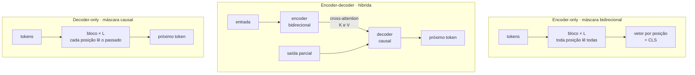
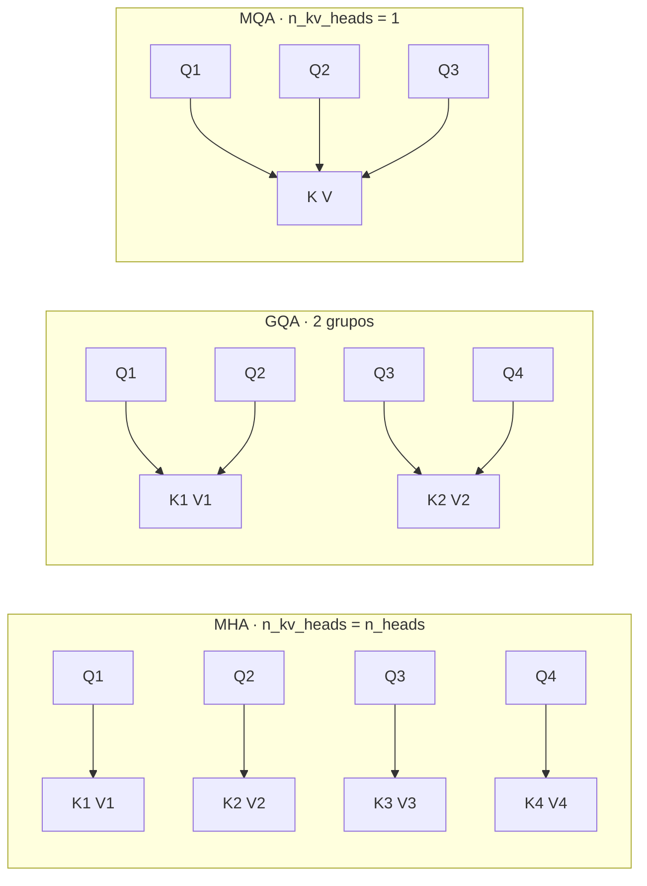
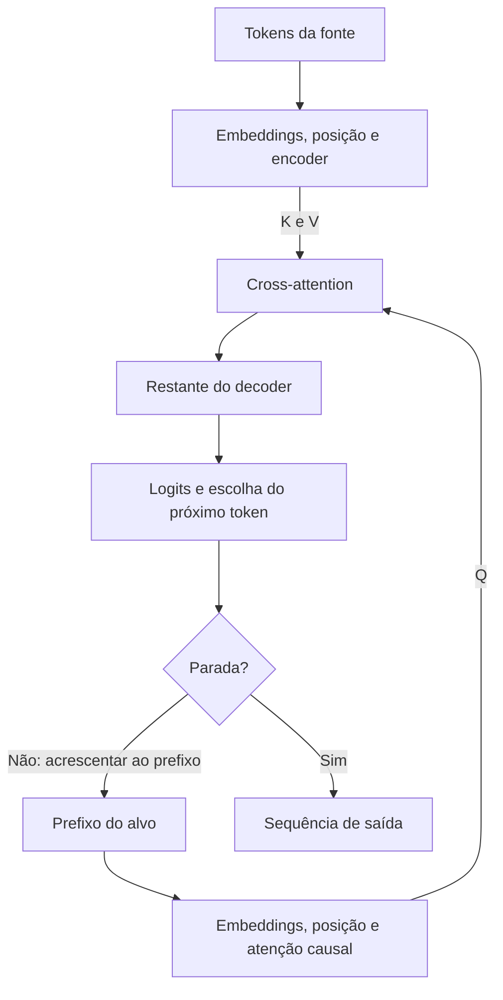
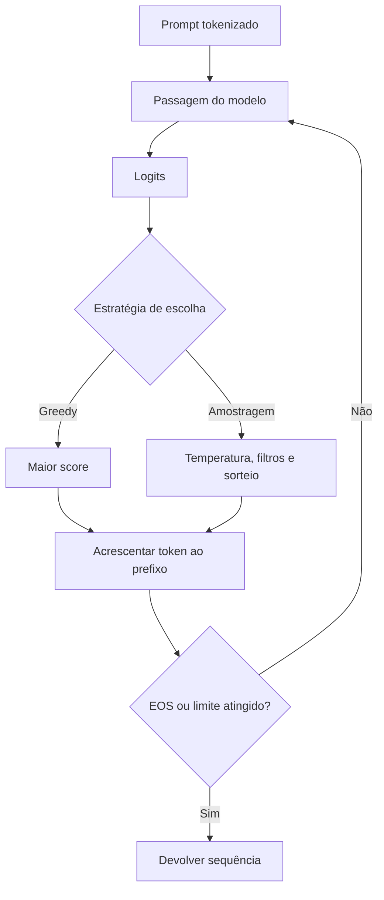
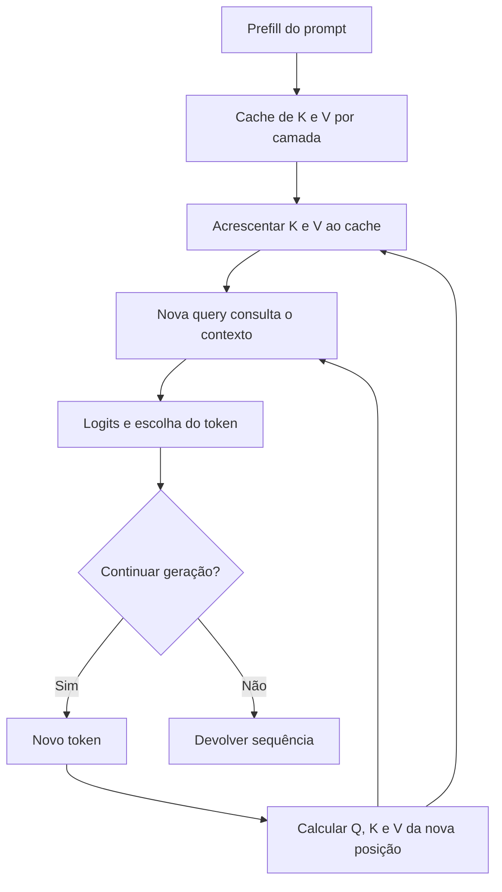
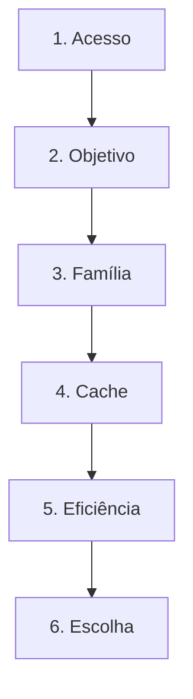

# Especificação de slides — Aula 8 (V2)

> **Rebalanceamento V2.** O fluxo abre por três sintomas de plantão: um serviço que atende dez
> requisições simultâneas e morre em quarenta; uma escolha entre BERT e GPT tomada pelo nome e pela
> data do modelo, que sai errada por um fator de custo; e uma janela de 128 k anunciada que não cabe no
> orçamento de memória. Os três se resolvem com duas contas — **quem pode ler quem** e **quanto o
> rascunho custa** — e as duas contas ficam enunciadas no fluxo, com a aritmética completa na Parte 2.
> Nada de matemática foi perdido: foi realocado, e o apêndice é mais detalhado que a V1.
>
> **Divisão de escopo com a Aula 10.** Esta aula **estabelece** a fórmula do KV cache termo a termo e
> **deriva** o fator de redução de MQA e GQA (A.2). A Aula 10 **usa** essa fórmula no regime de serviço:
> o ponto em que o cache empata com os pesos, a paginação e a quantização do cache (A.6 de lá). Cada
> uma referencia a outra em vez de duplicar.

<!-- SLIDE-FLOW:GUIDE:BEGIN -->
## Fluxogramas na produção dos slides

As orientações abaixo complementam o campo **Visual** dos slides indicados. Produzir os fluxogramas no próprio deck, como formas e conectores editáveis ou gráficos vetoriais; a biblioteca completa ao final torna esta especificação independente do portal.

- **Referência de composição:** título e propósito no topo, blocos numerados, conexões rotuladas, ramificações legíveis e uma saída identificada. Usar apenas o padrão visual da referência fornecida, sem importar seu assunto ou seus exemplos.
- **Tema do deck:** manter o fundo escuro e a paleta já especificada para a aula. Usar `#5b8cff` para o trecho ativo, tons neutros para o contexto e `#e2231a` conforme o significado definido no deck. Cor sempre acompanhada de rótulo.
- **Leitura:** entrada no topo ou à esquerda; saída na base ou à direita. Decisões em losangos, alternativas com rótulos e retornos apontando à etapa correta. Ramos paralelos convergem apenas onde seus resultados realmente são combinados.
- **Densidade:** no fluxo principal, projetar 3–6 blocos curtos por enquadramento, com corpo legível na última fileira. Um mapa maior pode ser revelado por etapas no mesmo slide. Detalhes, condições e explicações completas ficam nas notas; não reduzir a fonte para caber tudo.
- **Semântica:** mapas de percurso mostram ordem de estudo, não execução de um algoritmo. Manter separadas preparação e aplicação, treino e inferência, sequência e alternativas. Não transformar uma etapa opcional em obrigatória.
- **Integração:** o fluxograma substitui uma lista redundante ou ocupa o campo Visual; não cobre matrizes, tabelas, gráficos nem código indispensáveis. Preservar títulos, numeração, duração e referências aos apêndices.
- **Produção:** os blocos Mermaid abaixo são especificações do desenho. Renderizar/reconstruir como diagrama, nunca projetar o código Mermaid. Manter rótulos, bifurcações, retornos e limites declarados. Não transformar este caderno técnico em slides adicionais.
- **Ligação com o portal:** os mapas de mecanismo compartilham o conteúdo dos fluxogramas do portal. Em demonstrações, usar o mesmo vocabulário no deck e no controle interativo para facilitar a passagem entre os dois.
<!-- SLIDE-FLOW:GUIDE:END -->

## Diretrizes visuais

- **Tema:** escuro, accent `#e2231a` (vermelho CESAR), accent secundário `#5b8cff`.
- **Tipografia:** sans-serif para texto; monoespaçada para fórmulas, contas e nomes de campo de
  configuração (`num_key_value_heads`).
- **Densidade:** máximo 5 linhas de texto por slide no fluxo. Um conceito por slide.
- **No fluxo principal:** a fórmula aparece **enunciada e lida**, com o **número que ela produz** ao
  lado. Nunca a cadeia de multiplicações — ela está no apêndice.
- **No apêndice:** densidade alta é esperada e desejável. É material de consulta.
- **Proibido:** bullets genéricos ("Vantagens", "Desvantagens"); slide-parede de texto; clipart;
  gráfico sem eixo rotulado; logotipo de empresa de modelo.
- **Convenção visual da aula:** as três famílias recebem cores fixas e as mantêm em todos os slides —
  encoder-only em accent secundário (azul), encoder-decoder em cinza-claro, decoder-only em accent
  (vermelho). A matriz de máscara `5×5` é o motivo gráfico recorrente: sempre que uma família aparecer,
  a máscara dela aparece ao lado, no mesmo tamanho.
- **Números:** no fluxo, o slide mostra **o resultado com a unidade** (`0,5 MiB por token`), não a
  multiplicação. A multiplicação fator a fator é do apêndice.

## Arco narrativo

O deck abre com três chamados de uma semana de plantão, e nenhum deles é bug. O primeiro — dez
requisições simultâneas funcionam, quarenta derrubam a GPU — é o fio condutor da segunda metade. O
segundo — um time trocou um encoder pequeno por um LLM porque o LLM é mais novo, e a fatura de
inferência multiplicou — é o fio da primeira metade, e ele mostra que o que decide a família não é o
nome nem a data: é a máscara e o objetivo de pré-treino. A partir daí o deck percorre as três famílias
na ordem histórica, fechando com os cinco argumentos que explicam por que a previsão do próximo token
dominou, sem declarar que ela é superior em tudo. A segunda metade cobra a fatura dessa vitória: o KV
cache enunciado com o número que ele produz, e depois as duas alavancas — cortar pares de atenção
(janela + global) e cortar o cache (MQA/GQA) — mais a destilação, que é como a família encoder-only
continua viva. O deck fecha entregando o decoder-only para o Lab 2 da aula seguinte.

---

# PARTE 1 — FLUXO PRINCIPAL

*O que se apresenta em aula. 14 slides, ~100 minutos com demo e exercício.*

### Slide 1 — Abertura: três chamados, nenhum bug
- **Tipo:** problema (abertura)
- **Título:** Serve dez. Morre em quarenta.
- **Conteúdo:** Recap da Aula 7 em uma linha, em monoespaçada:
  `RoPE em Q/K · pré-norm + RMSNorm · residual limpa · FFN com SwiGLU` — **o bloco está pronto.** E
  três chamados que chegaram na mesma semana, nenhum deles com exceção no log:
  - **(1)** O serviço atende **dez** conversas simultâneas com folga. Em **quarenta**, a GPU estoura.
    Mesmo modelo, mesmos pesos, mesma GPU. Ninguém fez deploy de nada.
  - **(2)** Um time trocou um classificador pequeno por um LLM "porque o LLM é de 2024 e o outro é de
    2019". A qualidade subiu um pouco. A fatura de inferência **multiplicou**, e a latência saiu do
    orçamento.
  - **(3)** O produto anunciou janela de 128 k tokens. Em produção, com usuários de verdade, o
    contexto útil que sobra é uma fração disso — e ninguém sabe dizer qual.
- **Frase-tese:** Nenhum dos três é bug. Os três se resolvem com duas contas: quem pode ler quem, e
  quanto o rascunho custa.
- **Visual:** três cartões de chamado empilhados como tickets, com o campo "erro no log" preenchido com
  `—` nos três. Abaixo, a linha do bloco da Aula 7 em cinza, e a pergunta da aula: e se a única coisa
  que eu trocar for **quem pode ler quem**?
- **Notas do apresentador:** Deixar o diagrama do bloco da Aula 7 na tela 30 s antes de avançar — a
  continuidade visual faz o argumento sozinha. O chamado (2) é o fio do Bloco 1; os chamados (1) e (3)
  são o fio do Bloco 2. Dizer isso em voz alta ao anunciar o plano: a aula fecha os três, e o (1) fecha
  com um número.

### Slide 2 — Por que a escolha por nome sai errada: a máscara é a arquitetura
- **Tipo:** diagrama
- **Título:** Três máscaras, três famílias — e nenhuma delas é uma data
- **Conteúdo:** O chamado (2) errou porque comparou **datas**. O que separa as famílias é uma decisão
  de projeto, e ela tem duas partes que vêm juntas:
  - **Bidirecional** — máscara nenhuma; toda posição lê todas → *encoder*
  - **Causal** — triangular inferior; cada posição lê só o próprio passado → *decoder*
  - **Híbrida** — duas pilhas: bidirecional na entrada, causal na saída, cross-attention entre elas →
    *encoder-decoder*
  E o ponto que decide tudo: **a máscara determina o objetivo de treino possível.** Se toda posição vê
  o futuro, prever o próximo token é copiar a resposta — o objetivo tem de ser outro. Máscara e função
  de perda são um pacote, não duas escolhas.
- **Frase-tese:** Trocar a máscara troca o que o modelo pode aprender — e aí o objetivo de treino não
  tem escolha.
- **Visual:** três matrizes `5×5` lado a lado, células permitidas preenchidas, células proibidas
  vazadas. Abaixo de cada matriz, o objetivo de treino que ela **permite**. Rodapé em accent: "máscara
  e função de perda são um pacote, não duas escolhas".
- **Notas do apresentador:** Desenhar as três matrizes no quadro em paralelo ao slide — é a imagem que
  a turma leva para a prova, e é o único momento da aula em que ir ao quadro compra algo. Prefix-LM e
  máscaras híbridas existem; não abrir o fio.



### Slide 3 — BERT: atenção bidirecional e a lacuna a preencher
- **Tipo:** conceito (fundamento nomeado)
- **Título:** Bidirecional não pode prever o próximo token — então prevê a lacuna
- **Conteúdo:** O objetivo MLM enunciado, em bloco destacado:
  ```
  MLM:  L = − Σ_(i ∈ M) log P(x_i | x_\M)
  ```
  Leitura em português: mascara-se cerca de **15% das posições** e cobra-se a predição de cada uma
  usando o contexto dos **dois lados**. `M` é o conjunto mascarado; `x_\M` é a sequência com essas
  posições apagadas.
  Detalhe de engenharia que parece gambiarra e é engenharia: das posições escolhidas, **80% viram
  `[MASK]`, 10% um token aleatório, 10% ficam como estão** — para reduzir a discrepância entre treino
  (que vê `[MASK]`) e uso (que não vê).
  E há uma alternativa que **remove** essa discrepância em vez de amenizá-la: o **ELECTRA** troca a
  tarefa por "cada token desta frase é original ou foi substituído?" — o modelo nunca vê `[MASK]` no
  treino, e a cobrança passa a valer para **todas** as posições, não para 15% delas.
  E o que a família **não** faz: gerar. Preencher lacuna não é continuar sequência — e a razão é mais
  forte que "ele não foi treinado para isso".
- **Frase-tese:** Se toda posição vê todas, prever o próximo token é copiar a resposta. O objetivo tem
  que ser outro: a lacuna.
- **Visual:** uma frase em português com duas palavras substituídas por caixas `[MASK]`, e setas
  partindo das duas caixas para **os dois lados** da sequência. Ao lado, o par que fecha o gancho da
  Aula 3: `o banco do rio` × `o banco do centro`, com o vetor de "banco" desenhado em duas cores
  diferentes — é o sintoma que a Aula 3 deixou aberto de propósito, agora fechado.
- **Fundamento:** com máscara bidirecional, o alvo `x_{i+1}` está **no conjunto condicionante** da
  predição — a solução ótima é a identidade e a perda vai a zero sem que nada de linguagem seja
  aprendido. E o MLM define um conjunto de condicionais que **não é uma fatoração de nenhuma
  distribuição conjunta**, o que é a razão formal de ele não gerar.
  → o objetivo escrito, a degeneração da tarefa bidirecional, as três razões independentes pelas quais
  o MLM não gera, a aritmética do 80/10/10, a contagem de sinal denso e o ELECTRA — que recupera os
  `n` alvos sem abrir mão da bidirecionalidade, e por que o gerador dele é pequeno **de propósito**:
  **Apêndice A.1** (slide 15)
- **Notas do apresentador:** O ELECTRA entra em **uma frase** e não se abre: ele existe no fluxo para
  que o 80/10/10 não pareça a única resposta possível, e para preparar o argumento do sinal denso do
  slide 7 — quando ele chegar, a turma já sabe que a densidade era do objetivo e não da máscara.
  Escrever a perda do MLM no quadro ao lado da perda causal (que só aparece
  formalmente no slide 7) — a comparação `Σ sobre M` contra `Σ sobre todas as posições` antecipa o
  argumento do sinal denso e economiza tempo depois. **Não derivar** a degeneração: ela está em A.1, com
  o argumento de pseudo-verossimilhança que a V1 não tinha.

### Slide 4 — `[CLS]`, fine-tuning e cabeças de tarefa
- **Tipo:** conceito
- **Título:** Corpo caro, cabeça barata — e é o chamado (2) explicado
- **Conteúdo:** O `[CLS]` na posição zero, cujo vetor de saída resume a sequência — e **por que** resume:
  no pré-treino ele foi obrigado a resolver uma tarefa de nível de sentença, e o gradiente empurrou
  aquela posição a agregar. Não há nada de privilegiado nele; há treino. Sobre o mesmo corpo, três
  cabeças:
  - linear sobre `[CLS]` → classificação de sequência
  - linear por posição → rotulagem de tokens (NER, POS)
  - sobre par de sentenças → similaridade e **reranking** (Aula 19)
  E o argumento que fecha o chamado (2), que é aritmético e não estético: um encoder faz **uma passada**
  pela sequência e devolve um rótulo ou um vetor; um decoder-only precisa **gerar tokens** para dizer o
  mesmo, e cada token gerado é uma passada pela pilha inteira. Em dez milhões de documentos por dia,
  `1 passada` contra `k tokens = k passadas` é a diferença entre uma máquina e um cluster.
- **Frase-tese:** O corpo pré-treinado é caro e é um só. A cabeça é barata e troca por tarefa.
- **Visual:** um corpo de encoder desenhado uma vez, com três cabeças diferentes encaixando em cima como
  peças trocáveis. À direita, a comparação de custo em corpo grande: `1 passada` × `k tokens gerados = k
  passadas`, com o cartão do chamado (2) reaproveitado ao lado.
- **Notas do apresentador:** A pergunta que vem é "então `[CLS]` é o embedding da frase?". Não — modelos
  de embedding treinam a agregação para similaridade. Sinalizar Aula 19 e não abrir pooling. Amarrar
  explicitamente ao chamado (2): a decisão por data ignorou uma razão de custo que é aritmética.

### Slide 5 — [Demo] BERT hoje, e os dois campos que abrem a segunda metade
- **Tipo:** transição para demonstração
- **Título:** Três coisas que a família encoder-only entrega — e dois números lidos de um `config.json`
- **Frase-tese:** Mesma palavra, dois contextos, duas distribuições. Isso é a resposta ao "banco" que a
  Aula 3 deixou aberto.
- **Conteúdo:** Os quatro atos, na ordem em que a demo faz, sem resultado — o resultado aparece ao vivo:
  ```
  1. fill-mask · "O banco do rio estava [MASK]."  ×  "O banco do centro estava [MASK]."
  2. modelo de embedding · saída = vetor de dimensão fixa, não texto
  3. cross-encoder de reranking · saída = UM NÚMERO para o par (consulta, documento)
  4. config.json de um decoder-only aberto · ler num_attention_heads e num_key_value_heads
     e, no quadro, aplicar a fórmula do cache com os valores lidos na tela
  ```
  O ato 4 é o que produz o número que o resto da aula usa como evidência.
- **Visual:** slide de transição, quase vazio. Quatro caixas numeradas em monoespaçada, esperando ser
  preenchidas ao vivo. A quarta caixa visualmente destacada — é a que abre a segunda metade da aula.
- **Notas do apresentador:** Quatro abas do Hub abertas antes da aula; as frases num arquivo local.
  Testar o par de frases na véspera. Passos na Parte 2 do roteiro; capturas de tela como plano B. O ato
  4 é **insubstituível** e não depende de rede se os números estiverem anotados da véspera.

### Slide 6 — Encoder-decoder: quando entrada e saída são objetos diferentes

<!-- SLIDE-FLOW:SLIDE:BEGIN -->
- **Fluxograma a incorporar neste slide:** **F00 — Encoder–decoder: dois caminhos se encontram**. O desenho e os rótulos completos estão no caderno de fluxogramas ao final deste arquivo.
- **Composição:** integrar ao campo Visual; preservar exemplos, tabelas, fórmulas e dimensões solicitados neste slide. Destacar o trecho relacionado ao título e manter o restante em segundo plano. Os textos detalhados ficam nas notas, sem duplicar a lista de Conteúdo na tela.
<!-- SLIDE-FLOW:SLIDE:END -->

- **Tipo:** diagrama
- **Título:** Duas pilhas — e a cross-attention é o Bahdanau de 2014
- **Conteúdo:** Encoder lê a entrada inteira, bidirecional. Decoder gera com máscara causal. Entre eles,
  cross-attention: **Q vem do decoder, K e V vêm do encoder**. Tarefas canônicas: tradução, sumarização.
  Exemplos: T5, BART. Custo honesto: duas pilhas, dois conjuntos de hiperparâmetros, objetivo de
  pré-treino que não é qualquer texto cru — e um decoder-only faz tradução com uma pilha só, colocando
  original e tradução na mesma sequência.
- **Frase-tese:** A cross-attention é o Bahdanau da Aula 5, vivo e sem mudar uma linha. Foi aqui que ele
  sobreviveu.
- **Visual:** as duas pilhas lado a lado, com a seta de cross-attention rotulada
  `Q ← decoder · K, V ← encoder` em accent secundário. Ao lado da seta, uma miniatura da figura de
  alinhamento da Aula 5, para casar as duas imagens.
- **Notas do apresentador:** Slide para comprimir se o tempo apertar — 5 min, mantendo a conexão com
  Bahdanau, que é o pagamento da promessa da Aula 5.

### Slide 7 — Decoder-only: por que prever o próximo token venceu

<!-- SLIDE-FLOW:SLIDE:BEGIN -->
- **Fluxograma a incorporar neste slide:** **F01 — Geração autorregressiva**. O desenho e os rótulos completos estão no caderno de fluxogramas ao final deste arquivo.
- **Composição:** integrar ao campo Visual; preservar exemplos, tabelas, fórmulas e dimensões solicitados neste slide. Destacar o trecho relacionado ao título e manter o restante em segundo plano. Os textos detalhados ficam nas notas, sem duplicar a lista de Conteúdo na tela.
<!-- SLIDE-FLOW:SLIDE:END -->

- **Tipo:** dados
- **Título:** Cinco argumentos — e nenhum deles é "é mais inteligente"
- **Conteúdo:** A perda causal enunciada, em bloco destacado:
  ```
  LM causal: L = − Σ_(t=1..n) log P(x_t | x_(<t))
  ```
  E os cinco argumentos numerados:
  1. **Rótulo grátis** — o rótulo do token `t` é o próprio token `t`; todo texto cru vira dado
     supervisionado
  2. **Sinal denso** — o MLM treina em ~15% das posições; o LM causal treina em **100%**. A razão é
     `1/0,15 ≈ 6,7` predições supervisionadas por token de corpus
  3. **Simplicidade operacional** — uma pilha, um objetivo, uma máscara
  4. **Prompting unifica as tarefas** — a tese da Aula 1, sem trocar cabeça nem modelo
  5. **Geração é nativa**, não enxertada
  Alerta de fechamento: venceu como **plataforma geral**. Por rótulo entregue e por milissegundo, um
  encoder pequeno destilado continua ganhando — e é o chamado (2) do slide 1.
- **Frase-tese:** O MLM treina em 15% das posições. O LM causal treina em 100%. Multiplicado por
  trilhões de tokens, isso é a diferença.
- **Visual:** duas sequências de tokens empilhadas: na de cima, ~15% das posições acesas (MLM); na de
  baixo, todas acesas (LM causal). A diferença de densidade luminosa é o argumento 2 sem texto nenhum.
  Os cinco argumentos em coluna à direita, o argumento 2 com moldura em accent.
- **Fundamento:** ao contrário do MLM, a perda causal **é** a log-verossimilhança exata da sequência,
  pela regra da cadeia da probabilidade — o que é a razão formal de o decoder-only gerar e o MLM não.
  → a fatoração exata, o contraste com o pseudo-objetivo do MLM e a contagem `1/0,15 ≈ 6,7`:
  **Apêndice A.1** (slide 15)
- **Notas do apresentador:** Slide de maior valor por minuto da aula — os cinco argumentos são resposta
  direta de prova. Deixar na tela até o intervalo e avisar o horário de volta.

### Slide 8 — O preço da janela: o KV cache em números

<!-- SLIDE-FLOW:SLIDE:BEGIN -->
- **Fluxograma a incorporar neste slide:** **F02 — KV cache: reutilizar o passado**. O desenho e os rótulos completos estão no caderno de fluxogramas ao final deste arquivo.
- **Composição:** integrar ao campo Visual; preservar exemplos, tabelas, fórmulas e dimensões solicitados neste slide. Destacar o trecho relacionado ao título e manter o restante em segundo plano. Os textos detalhados ficam nas notas, sem duplicar a lista de Conteúdo na tela.
<!-- SLIDE-FLOW:SLIDE:END -->

- **Tipo:** dados (fundamento aplicado ao chamado 1)
- **Título:** O que estoura a GPU não é o peso — é o rascunho
- **Conteúdo:** Por que o cache existe: na geração autorregressiva, K e V das posições anteriores **não
  mudam** (a máscara é causal), então recalculá-los é desperdício puro. Guardar troca computação por
  memória, e essa memória tem nome e tem fórmula:
  ```
  cache por token = 2 · camadas · cabeças_kv · d_head · bytes

  decoder hipotético (L=32, H=32, d_head=128, fp16):
      0,5 MiB por token
      8 192 tokens  →  4 GiB por sequência — POR CONVERSA
      10 conversas  →  40 GiB       40 conversas  →  160 GiB
  ```
  E **aqui está o chamado (1) fechado**: peso é constante; cache é linear no contexto **e** no número de
  conversas simultâneas. Entre dez e quarenta não mudou nada no modelo — mudou o que o modelo tem de
  guardar.
- **Frase-tese:** Meio mebibyte por token. Oito mil tokens dão quatro gibibytes — por conversa. Dez
  conversas caberiam; quarenta não.
- **Visual:** dois gráficos de barras com eixos rotulados, lado a lado. Esquerda: memória de pesos (uma
  barra fixa) × memória de cache em função do contexto (barra crescendo). Direita: a mesma barra de
  cache multiplicada por 1, 10 e 40 conversas, com a última estourando o topo do slide de propósito e o
  cartão do chamado (1) colado nela.
- **Fundamento:** `cache = 2 · L · H_kv · d_head · n · b`, com o `2` sendo K e V, e cada fator com uma
  razão de existir.
  → a contagem fator a fator com a justificativa de cada um, a instanciação até `0,5 MiB`, a leitura de
  banda de memória e o que decide o teto de concorrência: **Apêndice A.2** (slide 16) · o regime de
  serviço, com o ponto em que o cache **empata com os pesos**, paginação e cache quantizado:
  **Apêndice A.6 da Aula 10**
- **Notas do apresentador:** **Não fazer a multiplicação fator a fator no quadro** — na V1 ela consumia
  5 min e travava a turma. Aqui o slide traz o resultado com a unidade, e a multiplicação está em A.2, em
  versão mais detalhada, com a justificativa de cada fator. A instanciação ao vivo acontece na demo, com
  os números lidos de um `config.json` real — é medição, não derivação. Dizer em voz alta que o modelo é
  hipotético. Deixar `0,5 MiB por token` circulado no quadro: os slides 10 e 13 dependem dessa âncora.

### Slide 9 — Longformer: janela deslizante mais atenção global
- **Tipo:** diagrama
- **Título:** De O(n²) para O(n·w) — e a conta honesta do alcance
- **Conteúdo:** As duas complexidades, enunciadas, com os números que elas produzem:
  ```
  atenção plena:        custo O(n²)          n = 32 768  →  ~1,07 bilhão de pares
  janela deslizante w:  custo O(n · w)       w = 512     →  ~16,8 milhões de pares
  razão de redução = n / w = 64
  alcance por profundidade ≈ L · w/2 para cada lado    (L = 12, w = 512 → ~3 072 posições)
  ```
  Dois caminhos para a dependência longa: **profundidade** (a informação caminha `w/2` por camada em cada
  direção) e **atenção global** em poucos tokens escolhidos — token de classificação, tokens da pergunta,
  títulos de seção. E a honestidade que a V1 não trazia: com `L = 12` e `w = 512`, o alcance por
  profundidade cobre **3 072 das 32 768 posições** — o modelo **não** liga a primeira posição à última
  por profundidade. É a atenção global que faz isso, e escolher **onde** ela vai é decisão de projeto por
  tarefa.
- **Frase-tese:** Janela mais profundidade recupera parte do alcance. O resto quem recupera são os poucos
  tokens globais — se eu escolher certo.
- **Visual:** a matriz de atenção `n × n` desenhada duas vezes. Primeira: toda preenchida (plena).
  Segunda: só a faixa diagonal de largura `w` preenchida, mais uma linha e uma coluna inteiras em accent
  (os tokens globais). A área pintada nas duas figuras é a comparação de custo. Ao lado, uma barra
  mostrando `3 072` contra `32 768` — o alcance que a profundidade **não** cobre.
- **Fundamento:** com janela de largura `w`, o número de pares por cabeça e por camada cai de `n²` para
  aproximadamente `n·w`; a atenção global em `k` tokens acrescenta `2·k·n` pares, e é ela que reduz o
  diâmetro do grafo de comunicação para **2 camadas**.
  → a contagem dos dois regimes, quantas camadas seriam necessárias para cobrir a sequência por
  profundidade, o custo exato da atenção global e a conta de memória: **Apêndice A.3** (slide 17)
- **Notas do apresentador:** Desenhar essa figura no quadro — hachurar a diagonal e depois pintar a
  linha/coluna global é o Longformer inteiro em 20 s. Não entrar em kernel esparso. A conta de quantas
  camadas seriam necessárias (`L ≥ 2n/w = 128`) está em A.3 e é a resposta para "mas a profundidade não
  resolve?".

### Slide 10 — MQA e GQA: cortar o KV cache pela raiz

<!-- SLIDE-FLOW:SLIDE:BEGIN -->
- **Fluxograma a incorporar neste slide:** **F02 — KV cache: reutilizar o passado**. O desenho e os rótulos completos estão no caderno de fluxogramas ao final deste arquivo.
- **Composição:** integrar ao campo Visual; preservar exemplos, tabelas, fórmulas e dimensões solicitados neste slide. Destacar o trecho relacionado ao título e manter o restante em segundo plano. Os textos detalhados ficam nas notas, sem duplicar a lista de Conteúdo na tela.
<!-- SLIDE-FLOW:SLIDE:END -->

- **Tipo:** comparação
- **Título:** As queries continuam H. O que se compartilha é K e V.
- **Conteúdo:** O corte sai direto da fórmula do slide 8 — o cache é proporcional a `cabeças_kv`:
  ```
  fator de redução do cache = n_heads / n_kv_heads

  MHA:  n_kv_heads = n_heads = 32   → 4 GiB     (contexto 8k, modelo hipotético do slide 8)
  GQA:  n_kv_heads = 8              → 1 GiB     (fator 32/8 = 4)
  MQA:  n_kv_heads = 1              → 128 MiB   (fator 32/1 = 32)
  ```
  O que **não** muda: as queries continuam `H`, então o número de padrões de relação por camada é o
  mesmo; a fórmula `softmax(QKᵀ/√d_k)V` é a mesma da Aula 6; camadas e dimensão do modelo são as mesmas.
  O que se ganha: memória de cache **e tráfego de memória** para lê-lo — que é o que faz a geração ficar
  mais rápida. O que se paga: MQA corta mais e pode custar qualidade; GQA recupera quase toda a qualidade
  com uma fração do cache, e é o padrão dos modelos abertos recentes.
- **Frase-tese:** O fator de redução é exatamente a razão entre o número de cabeças e o número de cabeças
  de key/value.
- **Visual:** três diagramas em sequência, mesmo tamanho: MHA (8 queries, 8 pares K/V), GQA (8 queries em
  2 grupos, 2 pares K/V), MQA (8 queries, 1 par K/V). As setas de query em accent, os blocos de K/V em
  accent secundário, e o tamanho do bloco de K/V encolhendo visivelmente da esquerda para a direita.
- **Fundamento:** duas configurações que diferem **apenas** em `n_kv_heads` têm caches na razão
  `n_heads / n_kv_heads`, porque todos os outros fatores da fórmula se cancelam. E a mesma razão aparece
  no tempo de leitura do cache por token gerado, que é o gargalo da decodificação.
  → a razão derivada, o número de banda de memória por token gerado, e a nota honesta sobre os parâmetros
  das projeções de K e V, que **também** encolhem: **Apêndice A.2** (slide 16)
- **Notas do apresentador:** A pergunta que sempre vem é "então GQA acelera o treino?". A resposta curta
  é: acelera a **geração**, porque a geração é limitada por banda de memória e o cache encolheu; o treino
  quase não muda. Voltar à fórmula em vez de argumentar. A.2 tem o número da banda.



### Slide 11 — Destilação: o aluno aprende a distribuição do professor
- **Tipo:** conceito
- **Título:** O rótulo diz "é B". O professor diz por que não era C.
- **Conteúdo:** Treinar o modelo pequeno para reproduzir a **distribuição** do grande, não o rótulo duro.
  A temperatura `T` achata a distribuição e revela a cauda, onde está a informação sobre as alternativas
  plausíveis. A perda enunciada:
  ```
  L = α · CE(y_aluno, rótulo) + (1 − α) · T² · KL(P_professor^T ‖ P_aluno^T)
  ```
  Leitura por termo: o primeiro é o rótulo duro; o segundo é o alinhamento com o professor; `α` pesa os
  dois; e o `T²` está ali para que os dois termos continuem comparáveis quando `T` muda. Um número que
  mostra o que `T` faz: numa distribuição com logits `(5, 3, 1, −2)`, a última classe tem probabilidade
  `0,0008` a `T = 1` e `0,081` a `T = 4` — a cauda ficou **cem vezes mais visível**, sem que o professor
  mudasse.
  Onde isso aterrissa nesta aula: os encoders pequenos que sustentam classificação e reranking em
  produção são em boa medida destilados. A família encoder-only continua viva **porque** dá para
  comprimir — o que fecha o laço com o slide 4 e com o chamado (2).
- **Frase-tese:** É a distribuição que carrega o que o rótulo não carrega.
- **Visual:** duas distribuições sobre o mesmo eixo de classes, com eixos rotulados. À esquerda, one-hot
  (uma barra em 1, todas as outras em 0). À direita, a distribuição do professor com temperatura (uma
  barra alta, uma média, várias baixas). A área de diferença entre as duas figuras rotulada "o que a
  destilação transfere". Ao lado, a tabela de quatro números `T=1` contra `T=4`.
- **Fundamento:** a divergência de KL é **assimétrica** e está escrita na ordem `professor ‖ aluno`, o que
  pune o aluno por **não cobrir** a cauda do professor; e o fator `T²` compensa exatamente o fato de o
  gradiente do termo suave escalar como `1/T`.
  → a KL escrita, o gradiente que justifica o `T²`, o limite de temperatura alta que reduz a destilação a
  igualar logits, o exemplo numérico completo e o que o rótulo duro não carrega: **Apêndice A.4**
  (slide 18)
- **Notas do apresentador:** Se alguém citar "destilar treinando em textos do GPT", dar o ponto: o uso
  corrente cobre as duas coisas. A distinção técnica é que a destilação clássica precisa dos **logits** do
  professor — e API fechada não dá logits. Boa resposta de prova, e está em A.4.

### Slide 12 — O mapa das famílias, consolidado

<!-- SLIDE-FLOW:SLIDE:BEGIN -->
- **Fluxograma a incorporar neste slide:** **F03 — O percurso desta aula**. O desenho e os rótulos completos estão no caderno de fluxogramas ao final deste arquivo.
- **Composição:** integrar ao campo Visual; preservar exemplos, tabelas, fórmulas e dimensões solicitados neste slide. Destacar o trecho relacionado ao título e manter o restante em segundo plano. Os textos detalhados ficam nas notas, sem duplicar a lista de Conteúdo na tela.
<!-- SLIDE-FLOW:SLIDE:END -->

- **Tipo:** comparação
- **Título:** Máscara · objetivo · o que faz bem
- **Conteúdo:** A tabela de quatro colunas, uma linha por família:
  - **Encoder-only** · máscara bidirecional · MLM (~15% mascarados) · rótulo, vetor de embedding, escore
    de par · *BERT* · volta na Aula 19
  - **Encoder-decoder** · bidirecional + causal + cross-attention · reconstrução / corrupção de trechos ·
    transformar uma entrada completa em outra sequência · *T5, BART* · a cross-attention já apareceu na
    Aula 5
  - **Decoder-only** · máscara causal · LM causal (100% das posições) · gerar, seguir instrução, ser
    interface única · *GPT* · volta na Aula 9 (na unha) e na Aula 10 (escala e inferência)
- **Frase-tese:** Essas três colunas respondem a maioria das perguntas de arquitetura que vocês vão fazer
  no projeto — e nenhuma delas é a data do modelo.
- **Visual:** tabela limpa, uma linha por família, com a miniatura da matriz de máscara na primeira célula
  de cada linha (o motivo gráfico do slide 2 volta aqui, fechando o deck). A coluna "onde volta no curso"
  em accent secundário.
- **Notas do apresentador:** Este slide fica projetado durante o exercício — a turma consulta. Não avançar
  o deck no slide 13. Se faltar tempo, é o resumo suficiente da aula inteira.

### Slide 13 — [Exercício] Qual família, qual atenção, e que conta confirma
- **Tipo:** exercício
- **Título:** 8 minutos em dupla: família, atenção eficiente, e a **conta** que sustenta a escolha
- **Conteúdo:** Os cinco cenários numerados, redigidos como aparecem na tela:
  1. Classificar 10 milhões de comentários por dia em 3 rótulos, com latência de milissegundos
  2. Busca semântica sobre 500 mil documentos internos, com reranking dos 50 primeiros
  3. Assistente que conversa, chama ferramenta e escreve código
  4. Responder perguntas sobre um contrato de 80 páginas lido inteiro de uma vez
  5. Servir um modelo de 8 B para mil usuários simultâneos, com contexto de 32 mil tokens
  Regra do exercício, em destaque: para cada cenário, **a família**, **o que usaria de atenção eficiente
  (ou explicitamente nada)** e **que conta ou medição confirmaria a escolha**. "Porque é melhor" não
  conta; "porque é mais novo" desconta.
- **Frase-tese:** A justificativa tem que citar uma conta — custo por rótulo entregue, ou bytes de cache.
  Nenhum dos cinco se resolve pela data do modelo.
- **Visual:** os cinco cenários como lista numerada, com espaço à direita sugerindo três colunas a
  preencher: família · atenção · **conta que confirma**. Cronômetro de 8 min no canto. O mapa do slide 12
  permanece visível numa faixa lateral estreita.
- **Notas do apresentador:** Condução na Parte 3 do roteiro. O erro dominante é responder "LLM" para os
  cinco; 1 e 2 são encoder-only por custo, e o 2 são **dois** encoders. Os três minutos finais vão no
  cenário 5, que amarra os dois blocos: a família é decoder-only, a alavanca é GQA, e a conta do cache
  mostra que **GQA sozinho não fecha** — falta o que a Aula 10 trata como inferência eficiente.

### Slide 14 — Fechamento: três chamados, duas contas
- **Tipo:** encerramento
- **Título:** A máscara escolhe a família. O cache cobra a conta.
- **Conteúdo:** Os três chamados do slide 1, fechados, com a causa nomeada e onde ela mora:
  ```
  (1) serve dez, morre em quarenta     → cache é linear no contexto E na concorrência   (A.2)
  (2) trocaram encoder por LLM         → 1 passada contra k tokens gerados              (slide 4)
  (3) 128 k anunciados, fração usável  → o cache disputa a mesma memória dos pesos      (A.2 · Aula 10)
  ```
  E a síntese em duas linhas: a arquitetura não é o bloco, é a máscara — e o decoder-only venceu por
  rótulo grátis e sinal em 100% das posições, não por ser mais inteligente; a fatura vem em memória, e as
  duas alavancas são cortar pares de atenção (janela + global) e cortar o cache (`n_heads / n_kv_heads`).
  Depois, o checklist do Lab 2 (Colab com GPU habilitada · notebook do lab aberto) e as leituras: Devlin
  et al., *BERT* (arXiv 1810.04805); Shazeer, *MQA* (arXiv 1911.02150); Ainslie et al., *GQA*
  (arXiv 2305.13245); Beltagy et al., *Longformer* (arXiv 2004.05150). **Pergunta dirigida:** no GQA, o
  que é compartilhado, o que continua por cabeça, e qual é o fator de redução em função de `n_heads` e
  `n_kv_heads`?
- **Frase-tese:** Na próxima aula a família decoder-only sai do slide: máscara causal, multi-head e bloco,
  escritos à mão.
- **Visual:** duas metades. Topo: os três cartões de chamado do slide 1, agora com um traço de "resolvido"
  e a causa escrita ao lado. Base: as três máscaras do slide 2 de novo, com a causal acesa em accent e as
  outras duas apagadas — o funil visual para o Lab 2 — e o checklist de setup em caixa destacada.
  Rodapé: "Aula 9 — Laboratório 2: Mini-GPT do zero em PyTorch".
- **Notas do apresentador:** Projetar o checklist e ficar alguns segundos em silêncio para a turma
  fotografar. Quem chega na Aula 9 sem GPU habilitada perde os primeiros 15 min do lab. Antes de encerrar,
  projetar o índice do apêndice por 20 s: são quatro itens, e o que mais volta é **A.2**, que a Aula 10
  usa como base e que é ponto certo de prova.

---

# PARTE 2 — APÊNDICE MATEMÁTICO

*Material de estudo e consulta. Não se apresenta em aula: reconstrói, com rigor completo, todo fundamento
citado no fluxo. Autossuficiente — quem estuda por aqui sem ter assistido à aula consegue reconstruir
tudo.*

### Slide 15 — A.1 · O objetivo do MLM, e por que ele impede geração autorregressiva

<!-- SLIDE-FLOW:SLIDE:BEGIN -->
- **Fluxograma a incorporar neste slide:** **F01 — Geração autorregressiva**. O desenho e os rótulos completos estão no caderno de fluxogramas ao final deste arquivo.
- **Composição:** integrar ao campo Visual; preservar exemplos, tabelas, fórmulas e dimensões solicitados neste slide. Destacar o trecho relacionado ao título e manter o restante em segundo plano. Os textos detalhados ficam nas notas, sem duplicar a lista de Conteúdo na tela.
<!-- SLIDE-FLOW:SLIDE:END -->

- **Tipo:** apêndice — os dois objetivos escritos e a razão formal da separação
- **Invocado em:** slides 3 e 7

**O que este item estabelece.** Que a escolha da máscara **determina** o objetivo possível; que a razão
pela qual um modelo MLM não gera texto não é "não foi treinado para isso", e sim que o MLM **não define
uma distribuição conjunta sobre sequências**; e que a diferença de densidade de sinal entre os dois
objetivos é um fator de `1/0,15 ≈ 6,7`, não uma impressão.

**Notação.**
`x = (x_1, …, x_n)` — sequência de tokens. `V` — vocabulário. `M ⊆ {1,…,n}` — conjunto de posições
mascaradas, com `|M| ≈ 0,15n`. `x_\M` — a sequência com as posições de `M` substituídas por `[MASK]` (ou
pelas variantes do 80/10/10). `x_{<t} = (x_1, …, x_{t−1})`. `θ` — parâmetros do modelo.

**Premissas.** (i) As posições de `M` são sorteadas independentemente do conteúdo, com probabilidade
constante — é o que o BERT faz; (ii) o modelo prediz cada posição de `M` **em paralelo**, sem ver as
predições das outras posições mascaradas — esta premissa é a origem de tudo o que segue.

---

**Os dois objetivos, escritos.**

*MLM (encoder bidirecional):*
```
L_MLM(θ) = − Σ_{i ∈ M} log P_θ(x_i | x_\M)
```

*LM causal (decoder):*
```
L_LM(θ) = − Σ_{t=1}^{n} log P_θ(x_t | x_{<t})
```

**Por que a combinação "bidirecional + próximo token" é degenerada.**
Suponha máscara nenhuma e objetivo de próximo token. A predição da posição `t+1` condiciona em **toda** a
sequência, inclusive na própria posição `t+1`:
```
P_θ(x_{t+1} | x_1, …, x_n)      com  x_{t+1}  presente no condicionante
```
O alvo está no conjunto condicionante. A solução ótima é a função identidade — copiar a entrada da
posição `t+1` para a saída da posição `t` — e ela atinge `L = 0`. Nenhuma estatística de linguagem precisa
ser aprendida para isso.

*Consequência sobre o gradiente, que é o que mata na prática:* atingido o ótimo trivial, o gradiente em
relação a qualquer parâmetro que não participe da cópia é nulo. O modelo não aprende **menos**: ele
aprende **outra coisa**, muito mais fácil, e para. É exatamente o mesmo mecanismo do vazamento causal da
Aula 6 (**A.3 de lá**), com uma diferença de intenção: lá era bug, aqui é a consequência inevitável de
juntar duas escolhas incompatíveis.

*Corolário.* Máscara e objetivo não são duas decisões: são uma. Escolher bidirecional **proíbe** o
objetivo de próximo token, e escolher próximo token **exige** máscara causal. É o conteúdo formal da
frase-tese do slide 2.

---

**Por que o MLM não gera — três razões independentes.**

**Razão 1 — o MLM não é uma fatoração de nenhuma distribuição conjunta.**
A perda causal tem uma propriedade que a do MLM não tem: pela regra da cadeia da probabilidade,
**exatamente**,
```
log P(x_1, …, x_n) = Σ_{t=1}^{n} log P(x_t | x_{<t})
```
Isto é: minimizar `L_LM` é maximizar a log-verossimilhança **da sequência inteira**, e o modelo treinado
define uma distribuição própria sobre `V^n`. Gerar é amostrar dessa distribuição, um fator por vez, na
ordem em que a fatoração está escrita. **A geração é a fatoração lida da esquerda para a direita.**

O MLM, em contraste, aprende um **conjunto** de condicionais `P(x_i | x_\M)`. Não existe ordenação dos
índices nem produto desses termos que reconstrua `P(x_1,…,x_n)`: cada termo condiciona em posições que
outros termos tratam como alvo, e o produto conta a mesma informação várias vezes. O que o MLM otimiza é
uma **pseudo-verossimilhança**, não uma verossimilhança.

*Consequência precisa:* não há procedimento de amostragem que use as condicionais do MLM e produza texto
distribuído segundo `P(x)`. Não é dificuldade de engenharia — é ausência do objeto de que a amostragem
precisaria.

**Razão 2 — o condicionante do treino não existe na geração.**
Toda condicional que o MLM aprendeu tem contexto **dos dois lados**. Na geração, o lado direito não
existe: ainda não foi escrito. Cada chamada ao modelo em regime de geração é, portanto, uma avaliação
**fora da distribuição de treino** — o modelo é consultado numa situação que nunca viu. Isso vale mesmo
que a Razão 1 fosse contornada.

**Razão 3 — a discrepância do `[MASK]`.**
No treino a entrada contém `[MASK]`; em uso, ninguém envia `[MASK]`. O BERT ameniza com o 80/10/10, e a
aritmética é esta: das `0,15n` posições escolhidas,
```
80%  →  [MASK]        =  0,12n   das posições da sequência
10%  →  token aleatório =  0,015n
10%  →  ficam como estão =  0,015n   (e a predição continua sendo cobrada)
```
Os 10% que ficam como estão são o detalhe engenhoso: eles obrigam o modelo a produzir uma predição
correta para uma posição **não marcada**, o que o impede de aprender a regra "só preste atenção onde tem
`[MASK]`". Sem esses 10%, o modelo poderia ignorar completamente as posições sem marca — e o vetor de
saída delas, que é o que se usa em fine-tuning, ficaria inútil.

*Nota honesta sobre a Razão 1.* É possível **extrair** texto de um MLM tratando-o como um campo aleatório
de Markov e amostrando por procedimentos iterativos do tipo Gibbs (Wang & Cho, 2019). Funciona, é lento, e
o texto não é amostra de `P(x)` no sentido da fatoração causal. A afirmação correta não é "é impossível
gerar com BERT" — é "o objetivo do MLM não fornece a fatoração de que a geração autorregressiva depende".

---

**A contagem do sinal denso — o argumento 2 do slide 7, com número.**

Por sequência de `n` tokens:
```
MLM:        |M| ≈ 0,15n   predições supervisionadas
LM causal:  n              predições supervisionadas
razão = n / 0,15n = 1/0,15 ≈ 6,7
```
**Para a mesma quantidade de texto lido, o LM causal extrai da ordem de 6,7 vezes mais predições com
gradiente.** Duas leituras equivalentes do mesmo número:
1. *Por época.* Uma passada sobre `D` tokens de corpus produz `D` alvos no LM causal e `0,15D` no MLM.
2. *Por alvo.* Para que cada token do corpus tenha sido alvo pelo menos uma vez, o MLM precisa de
   aproximadamente `1/0,15 ≈ 6,7` épocas — e cada época custa a passada inteira pelo texto.

*Por que não simplesmente mascarar mais.* Porque `|M|` grande destrói o condicionante. Os dois
casos-limite mostram o trade-off:
- **`|M| = n`** (mascarar tudo): não há contexto nenhum; a tarefa vira modelagem incondicional de cada
  posição e é impossível. Nada é aprendido sobre relação entre posições.
- **`|M| = 1`**: contexto máximo, e **uma** predição por sequência. O sinal é ótimo em qualidade e
  péssimo em quantidade — a passada pelo texto rende um alvo.
O `15%` é o compromisso empírico entre essas duas pontas, e é escolha, não teorema.

*E por que o número `6,7` não é o fim da história.* O sinal do MLM é **mais rico por alvo**: predizer uma
lacuna com contexto dos dois lados é tarefa mais informativa que predizer a continuação. Por isso o MLM
produz representações fortes com menos dados — é a razão de encoders pequenos existirem e serem bons. O
argumento do slide 7 é sobre **escala**: quando texto é abundante, quantidade de sinal vence qualidade de
sinal. Quando texto é escasso, a conclusão pode se inverter.


---

**A alternativa que remove o problema em vez de amenizá-lo: ELECTRA.**

O 80/10/10 e o `15%` são **remendos** para dois defeitos que este item acabou de estabelecer: a
discrepância do `[MASK]` (Razão 3) e a esparsidade do sinal (`0,15n` alvos contra `n`). ELECTRA
(Clark et al., arXiv 2003.10555) ataca os dois de uma vez, trocando o objetivo em vez de calibrar
a máscara.

**A construção.** Duas redes durante o pré-treino:

1. **Gerador `G`** — um MLM pequeno, comum, treinado com a perda `L_MLM` de sempre. Ele recebe a
   sequência com `[MASK]` e **amostra** um token plausível para cada posição mascarada.
2. **Discriminador `D`** — a rede que se quer de fato. Ele recebe a sequência **já preenchida por
   `G`**, sem nenhum `[MASK]`, e classifica **cada posição** como *original* ou *substituída*. É a
   tarefa de **Detecção de Token Substituído** (*Replaced Token Detection*, RTD):

```
L_RTD(θ_D) = − Σ_{t=1}^{n} [ y_t log D(x̃, t) + (1 − y_t) log(1 − D(x̃, t)) ]
onde  x̃  é a sequência preenchida por G  e  y_t = 1 sse a posição t é original
```

Terminado o pré-treino, **`G` é descartado**. Só `D` segue para fine-tuning, exatamente como um
BERT.

**Os dois ganhos, medidos contra os números deste próprio item.**

| Defeito estabelecido acima | O que o BERT faz | O que ELECTRA faz |
|---|---|---|
| Razão 3 — `[MASK]` no treino e não em uso | ameniza com 80/10/10 | **elimina**: a entrada de `D` nunca contém `[MASK]` |
| Sinal em `0,15n` de `n` posições | aceita a razão de `6,7` a menos que o LM causal | **recupera `n`**: a RTD cobra classificação em **toda** posição |

O segundo ponto é o que interessa ao arco desta aula. A contagem de sinal denso acima concluía que
o LM causal extrai ~6,7 vezes mais alvos por passada de texto, e usava isso como argumento a favor
dos decoders. ELECTRA mostra que **essa vantagem não era da máscara causal** — era do objetivo. Um
encoder bidirecional com objetivo de classificação por token recupera a densidade de alvos sem
abrir mão de olhar para os dois lados.

**O contrapeso honesto, que é o mesmo do parágrafo anterior invertido.** A RTD é uma tarefa
**binária** por posição; o MLM é uma tarefa de `|V|` classes. Alvo por alvo, o sinal da RTD é muito
mais pobre — ele responde "esta palavra pertence aqui?" e não "que palavra pertence aqui?". A troca
é a mesma de sempre: **mais alvos de menor informação**. Que a troca compense é resultado empírico
(ELECTRA-Small supera BERT-Base com uma fração do compute), não consequência da construção.

**Uma precisão que costuma ser dita errado: isto não é uma GAN.** `G` é treinado por máxima
verossimilhança no objetivo MLM, **não** para enganar `D`. Não há gradiente fluindo de `D` para `G`,
e a razão é técnica e simples: a saída de `G` é um token **amostrado**, e amostragem discreta não é
diferenciável. As duas redes treinam lado a lado com objetivos independentes; o adjetivo
"adversarial" descreve o formato, não a otimização.

**Casos-limite — e o que eles dizem sobre o tamanho de `G`.**
- **`G` bom demais.** Se o gerador produz substituições indistinguíveis do original, os rótulos de
  `D` viram ruído: ele é punido por não distinguir o indistinguível. A tarefa deixa de ensinar.
- **`G` fraco demais.** As substituições ficam absurdas e `D` resolve a tarefa por pistas
  superficiais, sem precisar de língua nenhuma.
- **Consequência de projeto:** `G` é **deliberadamente pequeno** — tipicamente de um quarto a um
  terço de `D`. É um dos poucos lugares em que a resposta a "e se o componente for melhor?" é
  "piora", e vale dizer isso em voz alta, porque contraria a intuição que a turma traz.
- **Custo.** Duas redes na memória durante o pré-treino. Como `G` é pequeno e é descartado, o custo
  extra é modesto — e nulo em inferência.

---

**Casos-limite e variantes.**
- **Prefix-LM.** Máscara híbrida: um prefixo lido bidirecionalmente e um sufixo causal. Define uma
  fatoração legítima **do sufixo dado o prefixo**, logo gera. É o meio-termo formal entre as duas
  famílias.
- **Corrupção de trechos (T5).** Em vez de mascarar tokens isolados, mascara-se **spans** e o decoder
  gera a sequência dos trechos removidos. Como o decoder é causal, a fatoração existe e o modelo gera —
  o que mostra que o problema nunca foi "mascarar", foi "predizer em paralelo sem fatoração".
- **`M` sorteado dependente do conteúdo** (mascarar só palavras de conteúdo, por exemplo). Melhora o
  sinal por alvo e quebra a premissa (i); o objetivo passa a depender de uma heurística linguística.
- **Modelo com máscara causal treinado com MLM.** Perde os dois mundos: contexto de um lado só e sinal em
  15% das posições. Não existe na prática, e a razão é este item.

**De volta ao fluxo:** slide 3.

### Slide 16 — A.2 · A conta do KV cache, termo a termo, e o fator exato de MQA e GQA

<!-- SLIDE-FLOW:SLIDE:BEGIN -->
- **Fluxograma a incorporar neste slide:** **F02 — KV cache: reutilizar o passado**. O desenho e os rótulos completos estão no caderno de fluxogramas ao final deste arquivo.
- **Composição:** integrar ao campo Visual; preservar exemplos, tabelas, fórmulas e dimensões solicitados neste slide. Destacar o trecho relacionado ao título e manter o restante em segundo plano. Os textos detalhados ficam nas notas, sem duplicar a lista de Conteúdo na tela.
<!-- SLIDE-FLOW:SLIDE:END -->

- **Tipo:** apêndice — contagem de memória e derivação do fator de redução
- **Invocado em:** slides 8 e 10

**O que este item estabelece.** De onde vem cada fator da fórmula do cache; a instanciação até
`0,5 MiB por token`; a derivação de que o fator de redução de MQA e GQA é **exatamente**
`n_heads / n_kv_heads`; e por que esse fator aparece também no **tempo** de geração, e não só na memória.

**Notação.**
`L` — número de camadas. `H` — número de cabeças de query (`n_heads`). `H_kv` — número de cabeças de
key/value (`n_kv_heads`; igual a `H` em MHA, 1 em MQA, intermediário em GQA). `d_h` — dimensão por cabeça.
`n` — número de tokens de contexto já processados. `b` — bytes por valor armazenado (2 em fp16/bf16).
`d_model = H · d_h`.

**Premissas.** (i) K e V são guardados para **todas** as camadas — daí o fator 2 e o fator `L`; (ii) o
cache é alocado por sequência e cresce de um token por passo de geração; (iii) precisão de 16 bits, tanto
para pesos quanto para cache — quantizar o cache muda os números e não o argumento; (iv) o modelo abaixo é
**hipotético**, escolhido para dar números redondos.

---

**Por que o cache existe — o argumento em uma linha.**
Na geração autorregressiva (Aula 6, slide 12), para produzir o token `n+1` o modelo precisa de `K` e `V`
de todas as `n` posições anteriores. Como a máscara é causal, o passado não vê o futuro: as chaves e os
valores já calculados **não mudam** quando um token novo entra. Recalculá-los é desperdício exato — mesma
entrada, mesmos pesos, mesmo resultado. Guardá-los troca computação por memória, e essa memória é o KV
cache.

**A contagem, fator por fator.**
Para **um** token, **uma** camada e **uma** cabeça de key/value, é preciso guardar dois vetores de
dimensão `d_h`: a chave e o valor. Logo:
```
valores por token, por camada, por cabeça kv  =  2 · d_h
```
- **o `2`** — são dois tensores por camada: `K` e `V`. Não é aproximação e não é folga: são dois objetos
  distintos, e nenhum dos dois é reconstruível a partir do outro.
- **`d_h`** — cada chave e cada valor é um vetor da dimensão da cabeça. Note que **não** é `d_model`: a
  projeção já reduziu para `d_h` por cabeça.
- **`H_kv`** — uma chave e um valor **por cabeça de key/value**. É o único fator que MQA e GQA mexem.
- **`L`** — cada camada tem seu próprio par `K,V`, porque cada camada tem suas próprias projeções. O cache
  não é compartilhado entre camadas.
- **`n`** — um par `K,V` por token de contexto. É por isso que o cache cresce **linearmente** com a
  conversa.
- **`b`** — bytes por valor armazenado.

Multiplicando:
```
cache (bytes) = 2 · L · H_kv · d_h · n · b
```

**Instanciação — o `0,5 MiB por token`.**
Decoder hipotético: `L = 32`, `H = H_kv = 32` (MHA), `d_h = 128`, `b = 2`.
```
valores por token = 2 · 32 · 32 · 128 = 262 144
bytes por token   = 262 144 · 2 = 524 288 bytes = 512 KiB = 0,5 MiB
```
Por sequência de 8 192 tokens:
```
8 192 · 0,5 MiB = 4 096 MiB = 4 GiB       por sequência
```

*E o chamado (1) do slide 1, fechado com aritmética.* Pesos de um modelo de 7 B em fp16:
`7·10⁹ · 2 = 14 GiB`, **constantes**. Numa GPU de 80 GiB, descontando pesos e a folga de ativações e
fragmentação, sobram da ordem de 60 GiB para cache. Então:
```
10 conversas de 8 k  →  10 · 4 GiB = 40 GiB     cabe, com folga
15 conversas de 8 k  →  60 GiB                  é o teto
40 conversas de 8 k  →  160 GiB                 não cabe, por um fator ~2,7
```
**Entre dez e quarenta não mudou nada no modelo.** Mudou o que ele tem de guardar, e o crescimento é
linear na concorrência. É exatamente por isso que o sintoma aparece de repente: o cache não degrada
graciosamente, ele estoura.

*Onde o resto dessa análise mora.* A leitura de **regime de serviço** — o ponto exato em que o cache
empata com os pesos, a alocação em páginas para eliminar fragmentação, o compartilhamento de prefixo e o
cache quantizado — é da **Aula 10 (A.6)**. Este item estabelece a fórmula e o fator; a Aula 10 usa a
fórmula para dimensionar o serviço.

---

**O fator de redução de MQA e GQA — derivado.**
Considere duas configurações idênticas em `L`, `d_h`, `n` e `b`, diferindo **apenas** em `H_kv`. A razão
entre os caches é
```
cache(H_kv = A) / cache(H_kv = B)  =  (2·L·A·d_h·n·b) / (2·L·B·d_h·n·b)  =  A / B
```
Todos os outros fatores se cancelam. Tomando `A = H` (MHA) e `B = H_kv` (a configuração de interesse):
```
fator de redução = n_heads / n_kv_heads
```
∎ **É exato, não aproximado**, e não depende de nenhuma escolha de `L`, `d_h`, `n` ou `b`.

*Instanciado no modelo hipotético (`H = 32`, contexto 8 k):*
```
MHA:  H_kv = 32  →  fator 1     →  4 GiB      ·  0,5 MiB/token
GQA:  H_kv = 8   →  fator 4     →  1 GiB      ·  0,125 MiB/token
MQA:  H_kv = 1   →  fator 32    →  128 MiB    ·  0,015625 MiB/token
```
Verificação: `4 GiB / 32 = 128 MiB`. ✓

**O que muda e o que não muda — a lista honesta.**

*Não muda:*
- **O número de cabeças de query continua `H`.** GQA não reduz o número de padrões de relação por camada;
  reduz quantos índices distintos esses padrões consultam.
- **A fórmula da atenção é a mesma:** `softmax(QKᵀ/√d_k)V` da Aula 6, com `K` e `V` **repetidos** (ou
  transmitidos por *broadcast*) para os grupos que os compartilham.
- **`L`, `d_model` e a FFN** permanecem iguais.
- **Os FLOPs da atenção** permanecem praticamente iguais: são `H` produtos `QKᵀ` de qualquer forma, porque
  há `H` queries.

*Muda, e a V1 não dizia:*
- **As projeções de K e V encolhem.** Em MHA, as três projeções custam `3·d_model²` de parâmetros. Em
  GQA, `W_Q` continua `d_model²` mas `W_K` e `W_V` passam a `d_model · (H_kv·d_h)` cada. Com
  `d_model = 4096`, `H = 32`, `d_h = 128`, `H_kv = 8`:
  ```
  MHA:  3 · 4096²                              = 50,3 M por camada
  GQA:  4096² + 2 · 4096 · (8·128)             = 16,8 M + 8,4 M = 25,2 M por camada
  ```
  Uma redução de **50%** nos parâmetros de projeção da atenção. Implementações costumam **compensar**
  alargando a FFN, para manter a contagem total de parâmetros — o que significa que comparar um modelo MHA
  e um GQA "do mesmo tamanho" é comparar duas distribuições diferentes dos mesmos parâmetros.
- **O tempo de geração por token cai**, e isso não é efeito colateral: é o segundo motivo de GQA existir.

**Por que o fator aparece no tempo, e não só na memória — a conta de banda.**
Na geração, cada token novo precisa **ler o cache inteiro** para calcular a atenção. O tempo mínimo por
token é limitado pela banda de memória:
```
tempo mínimo por token ≥ bytes de cache lidos / banda de memória
```
Com 4 GiB de cache e uma banda de 2 TB/s:
```
MHA:  4 GiB / 2 TB/s     ≈ 2,0 ms por token, só para ler o cache
GQA:  1 GiB / 2 TB/s     ≈ 0,5 ms por token
MQA:  128 MiB / 2 TB/s   ≈ 0,06 ms por token
```
**A decodificação é limitada por banda de memória, não por aritmética** — os FLOPs por token gerado são
poucos e a leitura do cache é grande. Reduzir `H_kv` por um fator `H/H_kv` reduz o piso de latência pelo
mesmo fator. É esta a razão pela qual GQA "acelera", e a razão de a resposta correta à pergunta "GQA
acelera o treino?" ser **não, acelera a geração**: no treino a sequência passa de uma vez e o regime é
limitado por aritmética.

**O que se paga.** MQA compartilha um único par `K,V` entre `H` queries, e isso custa qualidade
mensurável — o artigo do GQA existe justamente para documentar o meio-termo. GQA com `H_kv` da ordem de
`H/4` recupera quase toda a qualidade com um quarto do cache, e é o padrão dos modelos abertos recentes.
Converter um checkpoint MHA já treinado para GQA por média dos pares `K,V` de cada grupo, seguida de um
treino curto de recuperação, é o procedimento descrito por Ainslie et al.

**Casos-limite.**
- **`H_kv = H`.** Fator 1: é MHA. A fórmula é a mesma, e MHA é o caso particular sem compartilhamento.
- **`H_kv = 1`.** Fator `H`: é MQA, o máximo de compressão possível sem mexer em `d_h`.
- **`H_kv` que não divide `H`.** Os grupos ficam desbalanceados; implementações exigem divisibilidade, e
  `num_attention_heads % num_key_value_heads == 0` é uma verificação de sanidade ao ler um `config.json`.
- **`n = 1`** (primeiro token gerado): o cache é irrelevante e o custo é dominado pelos pesos e pelo
  *prefill*. É o regime da latência do primeiro token, e ele é limitado por aritmética, não por banda —
  o que explica por que otimizar `H_kv` não melhora o tempo até o primeiro token.
- **Cache quantizado (`b = 1`).** Todos os números caem por 2, e a alavanca é ortogonal a MQA/GQA: as
  duas se compõem. O custo de qualidade é o de qualquer quantização (Aula 13).

**Como ler isso de um `config.json`, que é o que a demo faz.** Os quatro campos que importam:
```
num_hidden_layers      → L
num_attention_heads    → H
num_key_value_heads    → H_kv     (se ausente, o modelo é MHA e H_kv = H)
hidden_size            → d_model,  e d_h = hidden_size / num_attention_heads
```
Com os quatro, a fórmula devolve o cache por token daquele modelo, e a razão entre `num_attention_heads`
e `num_key_value_heads` devolve **quanto** ele já economizou em relação a MHA. Nenhum desses números vem
de slide: vêm do arquivo que o modelo publica.

**De volta ao fluxo:** slide 8.

### Slide 17 — A.3 · Atenção em janela: a contagem, e quanto alcance a profundidade realmente compra
- **Tipo:** apêndice — contagem de pares, alcance e memória
- **Invocado em:** slide 9

**O que este item estabelece.** A contagem de pares nos dois regimes, com os números do slide; **quantas
camadas seriam necessárias** para que a profundidade sozinha cobrisse a sequência — que é a pergunta que a
V1 não respondia; o custo exato de acrescentar `k` tokens globais; e por que os tokens globais reduzem o
diâmetro do grafo de comunicação para 2.

**Notação.**
`n` — comprimento da sequência. `w` — **largura total** da janela: cada posição atende a até `w/2`
posições de cada lado, mais a si mesma. `k` — número de tokens com atenção global. `L` — número de
camadas. `H` — cabeças por camada. `b` — bytes por elemento.

**Premissas.** (i) A janela é simétrica e as bordas são ignoradas na contagem — o erro é `O(w²)`,
desprezível quando `n ≫ w`; (ii) todas as camadas usam a mesma janela; (iii) a contagem é de **pares de
posições**, que é o que domina tempo e memória da atenção.

---

**Atenção plena.**
Cada uma das `n` posições atende a todas as `n`:
```
pares = n²
```
Com `n = 32 768`:
```
n² = 32 768² = 1 073 741 824  ≈  1,07 · 10⁹  pares, por cabeça e por camada
```

**Janela deslizante de largura `w`.**
Cada posição atende a `w + 1` posições (`w/2` de cada lado mais ela mesma):
```
pares ≈ n · (w + 1) ≈ n · w
```
Com `n = 32 768` e `w = 512`:
```
32 768 · 512 = 16 777 216  ≈  1,68 · 10⁷  pares
```

**A razão de redução.**
```
n² / (n·w) = n / w = 32 768 / 512 = 64
```
Verificação: `1,073·10⁹ / 1,678·10⁷ = 64,0`. ✓ E a leitura da razão é útil: **o ganho é `n/w`**, logo ele
cresce com o comprimento. Em `n = 2 048` com `w = 512` o ganho é apenas 4 — a janela não vale a pena em
contexto curto, e é por isso que ela é técnica de contexto longo.

---

**Alcance por profundidade — e a conta que a V1 devia.**
Numa camada, uma posição incorpora informação de até `w/2` posições de cada lado. Empilhando `L` camadas,
o **campo receptivo** cresce linearmente:
```
alcance por lado ≈ L · w/2
```
Com `L = 12` e `w = 512`:
```
12 · 256 = 3 072 posições para cada lado
```

*A pergunta honesta: isso cobre a sequência?* Para que a primeira posição alcance a última, é preciso
`L · w/2 ≥ n`, isto é
```
L ≥ 2n / w = 2 · 32 768 / 512 = 128 camadas
```
**Um Longformer de 12 camadas com janela 512 cobre 3 072 das 32 768 posições — cerca de 9%.** A
profundidade **não** recupera o alcance longo; ela recupera alcance *médio*. Dizer "a informação caminha
pela profundidade" é verdade e é insuficiente, e o número mostra o tamanho da insuficiência.

*O que isso implica:* a atenção global não é um complemento opcional. Numa configuração realista, ela é
**o único** caminho para dependência de ponta a ponta.

---

**Atenção global em `k` tokens — o custo, e o que ela compra.**
Um token global lê todas as posições e é lido por todas. O acréscimo de pares é
```
k · n   (o token global lendo tudo)  +  k · n   (todos lendo o token global)  =  2 k n
```
Custo total:
```
pares ≈ n·w + 2kn = n·(w + 2k)
```
Com `n = 32 768`, `w = 512`, `k = 8`:
```
acréscimo = 2 · 8 · 32 768 = 524 288 pares
fração do total = 524 288 / 16 777 216 = 3,1%
```
**Três por cento de custo a mais.** E o que esses 3% compram:

*O diâmetro do grafo de comunicação cai para 2.* Modele a atenção como um grafo em que existe aresta entre
duas posições se uma pode ler a outra numa camada. Sem tokens globais, a distância entre as posições `1`
e `n` é `⌈2n/w⌉` arestas — e cada aresta consome uma camada, o que é a conta acima. Com um token global
`g`, existe o caminho `1 → g → n`: **duas arestas, logo duas camadas**, para qualquer par de posições,
independentemente de `n`.

*Leitura:* os tokens globais são gargalos de largura de banda deliberados — toda a informação de longa
distância passa por eles. Daí a consequência de projeto: **escolher onde vai a atenção global é escolher
o que o modelo pode relacionar a longa distância.** Se a dependência que importa não passa por nenhum
token global, ela não é representável — e nada no log avisa. Na prática os tokens globais são o token de
classificação, os tokens da pergunta e os títulos de seção: escolhas por tarefa.

---

**Memória.**
A matriz de atenção precisa ser materializada para o backward. Por cabeça e por exemplo do lote:
```
plena:   n² · b        = 32 768² · 2 = 2 147 483 648 bytes ≈ 2,0 GiB
janela:  n · w · b     = 32 768 · 512 · 2 = 33 554 432 bytes ≈ 32 MiB
```
O mesmo fator 64. Multiplicando por `H` cabeças e `L` camadas, a diferença entre 2 GiB e 32 MiB por cabeça
é a diferença entre impossível e rotineiro. (FlashAttention, na Aula 12, ataca o **outro** lado do
problema: ele não reduz o número de pares, ele evita materializar a matriz.)

**Casos-limite.**
- **`w = n`.** A janela cobre a sequência inteira e o custo volta a `n²`: atenção plena é o caso
  particular `w = n`.
- **`w = 0`.** Cada posição atende só a si mesma; a atenção deixa de misturar informação e a camada
  degenera numa transformação por posição. O modelo vira uma pilha de MLPs independentes.
- **`k = 0`.** Sem tokens globais, o alcance é o da profundidade — `L·w/2` —, e a conta acima diz que ele
  é insuficiente em contexto longo.
- **`k` grande.** Quando `2k` se aproxima de `w`, o custo dobra e a vantagem sobre a atenção plena
  encolhe. A técnica pressupõe `k ≪ w ≪ n`.
- **Janela dilatada.** Longformer também usa cabeças com janela **dilatada** (atende a cada `d`-ésima
  posição dentro de uma faixa maior), o que multiplica o alcance por camada por `d` sem aumentar o número
  de pares. É a mesma contagem com passo diferente, e mitiga — sem resolver — a conta das 128 camadas.

**Referência.** Beltagy, Peters & Cohan, *Longformer: The Long-Document Transformer* (arXiv 2004.05150).

**De volta ao fluxo:** slide 9.

### Slide 18 — A.4 · A perda da destilação: a KL entre professor e aluno
- **Tipo:** apêndice — derivação, o papel de `T` e o limite de temperatura alta
- **Invocado em:** slide 11

**O que este item estabelece.** A perda escrita com notação declarada; **por que a KL está na ordem
`professor ‖ aluno`** e não na inversa; de onde vem o fator `T²`, derivando o gradiente; o exemplo
numérico que quantifica "revelar a cauda"; e o resultado de que, em temperatura alta, destilar é
equivalente a igualar logits.

**Notação.**
`C` — número de classes. `z^t ∈ ℝ^C` — logits do professor; `z^s ∈ ℝ^C` — logits do aluno. `T > 0` —
temperatura. As distribuições suavizadas:
```
p_i(T) = exp(z_i^t / T) / Σ_j exp(z_j^t / T)
q_i(T) = exp(z_i^s / T) / Σ_j exp(z_j^s / T)
```
`y` — rótulo verdadeiro (one-hot). `CE` — entropia cruzada. `α ∈ [0,1]` — peso entre os dois termos.

**Premissas.** (i) O professor está **congelado**: `z^t` não recebe gradiente; (ii) as duas distribuições
são sobre o **mesmo** conjunto de classes — o que exige que professor e aluno compartilhem o vocabulário
ou o espaço de rótulos; (iii) o rótulo duro está disponível — quando não está, `α = 0` e a destilação
funciona igual, o que é o ponto prático mais importante deste item.

---

**A perda.**
```
L = α · CE(y, q(1)) + (1 − α) · T² · KL( p(T) ‖ q(T) )
```
com
```
KL( p ‖ q ) = Σ_{i=1}^{C} p_i · log( p_i / q_i )
```
Note que o termo duro usa `T = 1` (é a saída real do aluno que se cobra), e o termo suave usa a mesma `T`
nos dois lados.

**Por que a KL nesta ordem — e é uma escolha, não uma convenção.**
A KL é assimétrica. Olhe parcela por parcela:
- **`p_i` grande e `q_i` pequeno** (o professor dá massa a uma classe e o aluno não): `log(p_i/q_i)` é
  grande e multiplicado por um `p_i` grande. **Custo alto.**
- **`p_i` pequeno e `q_i` grande** (o aluno dá massa onde o professor não dá): `log(p_i/q_i)` é muito
  negativo, mas multiplicado por um `p_i` quase nulo. **Custo quase nulo.**

Ou seja, `KL(p ‖ q)` é **cobre-modos**: ela força o aluno a **cobrir** tudo a que o professor dá massa,
inclusive a cauda. E cobrir a cauda é precisamente o objetivo da destilação — a informação que o rótulo
duro não tem está na cauda. A ordem invertida, `KL(q ‖ p)`, seria **busca-modos**: o aluno poderia
concentrar-se na classe mais provável e ignorar o resto, o que é exatamente o comportamento que o rótulo
duro já produz. **A assimetria é o mecanismo, não um detalhe de notação.**

*(É a mesma leitura de assimetria que aparece em outro lugar do curso com conclusão oposta: no t-SNE,
o **A.4 da Aula 4** usa o fato de a KL quase não punir vizinhança inventada para explicar por que
distância global no gráfico não significa nada. Mesma ferramenta, dois usos.)*

---

**O gradiente, e de onde vem o `T²`.**
Para o termo suave, com o professor congelado, o gradiente em relação a um logit do aluno é
```
∂ KL(p(T) ‖ q(T)) / ∂ z_j^s  =  (1/T) · ( q_j(T) − p_j(T) )
```
*Justificativa:* `KL(p‖q) = Σ_i p_i log p_i − Σ_i p_i log q_i`; o primeiro termo não depende de `z^s`. Para
o segundo, `log q_i(T) = z_i^s/T − log Σ_m exp(z_m^s/T)`, cuja derivada em relação a `z_j^s` é
`(δ_ij − q_j(T))/T`. Somando com pesos `p_i` e usando `Σ_i p_i = 1`, sobra `(q_j(T) − p_j(T))/T`.

**Leitura do gradiente.** Ele é a **diferença entre as duas distribuições suavizadas**, escalada por
`1/T`. Onde o aluno dá mais massa que o professor, o logit é empurrado para baixo; onde dá menos, para
cima. Simples e direto — e é a razão de a destilação ser estável.

**O problema que o `T²` resolve.** O gradiente do termo suave escala como `1/T`; o do termo duro não
depende de `T`. Sem correção, subir `T` de 1 para 4 dividiria a influência do termo suave por 4, e `α`
deixaria de significar a mesma coisa: **o mesmo `α` daria pesos efetivos diferentes a cada `T`**.
Multiplicar o termo suave por `T²` faz o gradiente escalar como `T²·(1/T) = T`... e o argumento fica
completo com o limite de temperatura alta, abaixo, onde se vê que a diferença `q − p` **também** encolhe
como `1/T`. Os dois efeitos combinados dão `T² · (1/T) · (1/T) = 1`: **o gradiente do termo suave fica de
magnitude aproximadamente independente de `T`**, e `α` volta a significar a mesma coisa em qualquer
temperatura. É essa a função do fator, e é por isso que ele é `T²` e não `T`.

---

**O limite de temperatura alta: destilar é igualar logits.**
Para `T` grande, `exp(z/T) ≈ 1 + z/T`, logo
```
p_j(T) ≈ (1 + z_j^t/T) / (C + Σ_m z_m^t/T)
```
Assumindo logits de média zero em cada modelo (`Σ_m z_m = 0`, que é o caso após a normalização implícita
do softmax), isso simplifica para
```
p_j(T) ≈ (1 + z_j^t/T) / C          e analogamente      q_j(T) ≈ (1 + z_j^s/T) / C
```
Substituindo no gradiente:
```
∂/∂z_j^s [ T² · KL ]  ≈  T² · (1/T) · ( (1 + z_j^s/T)/C − (1 + z_j^t/T)/C )
                       =  T² · (1/T) · (1/(C·T)) · ( z_j^s − z_j^t )
                       =  ( z_j^s − z_j^t ) / C
```
**Em temperatura alta, e com o fator `T²`, o gradiente da destilação é proporcional à diferença dos
logits.** Isto é: destilar em `T` alta é equivalente a minimizar `Σ_j (z_j^s − z_j^t)²` — mínimos
quadrados sobre os logits (Hinton, Vinyals & Dean, 2015). Duas consequências:
1. **O `T²` está justificado**: sem ele, o gradiente iria a zero como `1/T²` e a temperatura alta anularia
   o termo suave.
2. **A temperatura tem um trade-off explícito**: `T` pequena aproxima o comportamento do rótulo duro
   (só a classe vencedora importa); `T` grande trata todas as classes com peso comparável, inclusive as
   que o professor considera absurdas — e ruído de logit de classe irrelevante passa a contar.

---

**O exemplo numérico: quanto `T` revela da cauda.**
Professor com logits `z^t = (5, 3, 1, −2)` e `C = 4`.

*A `T = 1`:*
```
exp:  148,41   20,086   2,7183   0,1353        soma = 171,35
p:     0,8662   0,1172   0,01586  0,00079
```
*A `T = 4`* (logits divididos por 4: `1,25 · 0,75 · 0,25 · −0,5`):
```
exp:    3,4903   2,1170   1,2840   0,6065      soma = 7,4978
p:      0,4655   0,2823   0,1712   0,0809
```

**Leitura.** A última classe — a que o professor considera absurda — passa de `0,00079` para `0,0809`:
**cerca de cem vezes mais visível**. E a razão entre a primeira e a última passa de `1 097` para `5,75`.
Nada mudou no professor: os logits são os mesmos. O que mudou foi quanto da **ordenação da cauda** entra
no gradiente do aluno.

*O que é a "dark knowledge", quantificada.* O rótulo duro diz `classe 1`. É uma informação de
`log₂ 4 = 2 bits`. A distribuição do professor a `T = 4` diz: a classe 1 é a mais provável, mas a 2 é
**quase** tão boa, a 3 é plausível, e a 4 é ruim mas não impossível. São `C − 1 = 3` números reais em vez
de um índice — e, sobre um vocabulário de dezenas de milhares, a diferença é entre "a resposta é esta" e
"esta é a resposta, e este é o mapa de todas as alternativas ordenado por plausibilidade".

---

**Casos-limite.**
- **`T = 1`.** O termo suave é a KL entre as distribuições reais. Funciona, e transfere menos: a cauda
  fica comprimida perto de zero e quase não contribui para o gradiente.
- **`T → ∞`.** As duas distribuições tendem à uniforme. Com o fator `T²`, o gradiente sobrevive e vira
  igualar logits (derivado acima). Sem o fator, o termo suave desaparece.
- **`α = 1`.** Destilação desligada: é treino supervisionado comum.
- **`α = 0`.** **Não há rótulo nenhum na perda** — só o professor. Funciona, e é o caso praticamente mais
  importante: permite destilar sobre **dados não rotulados**, que são abundantes. É a razão de a
  destilação ser barata em escala industrial, e é o que sustenta o argumento do slide 4 de que a família
  encoder-only continua viva porque dá para comprimir.
- **Professor confiante e errado.** O aluno copia o erro, e com peso maior do que copiaria do rótulo (que
  estaria certo). Destilação transfere a função do professor, **incluindo os defeitos dela** — a máxima é
  que o aluno não pode ser melhor que o professor naquilo que o termo suave domina.
- **Vocabulários diferentes entre professor e aluno.** A premissa (ii) quebra e a KL não está definida: não
  há correspondência entre as classes. É um problema real na destilação entre LLMs de tokenizadores
  diferentes, e a saída usual é destilar em nível de sequência (treinar em texto gerado), que é a **outra**
  prática chamada de destilação.

**A distinção que vale resposta de prova.** Duas coisas são chamadas de destilação:
1. **Destilação clássica (esta):** precisa da **distribuição completa** do professor, logo dos logits.
   Uma API fechada não expõe logits, e por isso este procedimento exige acesso ao modelo.
2. **Ajuste em texto gerado pelo professor:** treina-se o aluno com entropia cruzada sobre as sequências
   que o professor produziu. Não precisa de logits, é o que se faz com API fechada, e **não** transfere a
   cauda — transfere amostras dela. É supervisão sintética, não destilação de distribuição.
As duas existem, as duas são úteis, e chamar as duas pelo mesmo nome esconde exatamente a diferença que
este item deriva.

**Referência.** Hinton, Vinyals & Dean, *Distilling the Knowledge in a Neural Network*
(arXiv 1503.02531). Aplicação canônica a encoders: Sanh et al., *DistilBERT* (arXiv 1910.01108).

**De volta ao fluxo:** slide 11.

<!-- SLIDE-FLOW:LIBRARY:BEGIN -->
# Caderno de fluxogramas para produção

As referências Fxx identificam desenhos, não novos números de slide. Cada desenho abaixo é autocontido.

| Mapa | Desenho | Usar nos slides |
| --- | --- | --- |
| F00 | Encoder–decoder: dois caminhos se encontram | 6 |
| F01 | Geração autorregressiva | 7, 15 |
| F02 | KV cache: reutilizar o passado | 8, 10, 16 |
| F03 | O percurso desta aula | 12 |

## F00 — Encoder–decoder: dois caminhos se encontram

A fonte e o prefixo do alvo têm representações próprias; a cross-attention liga os caminhos.



**Conteúdo dos blocos e notas de montagem:**

1. **Representar as entradas:** Converta tokens em embeddings e incorpore posição.
   Ramos/alternativas a rotular: Fonte → entrada do encoder; Prefixo do alvo → entrada do decoder.
2. **Codificar a fonte:** A pilha encoder combina posições da fonte e fornece representações contextuais.
3. **Processar o prefixo:** Self-attention causal no decoder só consulta posições permitidas do alvo.
4. **Consultar a fonte:** Na cross-attention, Q vem do decoder; K e V vêm das representações do encoder.
   Ramos/alternativas a rotular: Decoder → queries; Encoder → keys e values.
5. **Produzir o próximo token:** O decoder transforma os estados; a cabeça de saída produz logits sobre o vocabulário.
   ↺ Na geração, acrescente o token ao prefixo e repita no decoder. Reutilize a fonte codificada.

**Saída ou limite a explicitar:** A fonte representada informa a previsão; o encoder não entrega uma tradução pronta ao decoder.

## F01 — Geração autorregressiva

Um passo escolhe um token; a sequência nasce da repetição controlada.



**Conteúdo dos blocos e notas de montagem:**

1. **Processar o contexto:** Tokenize o prompt e calcule representações; quando disponível, mantenha K e V em cache.
2. **Obter logits:** A projeção de saída produz um score para cada token do vocabulário.
3. **Escolher a estratégia:** A estratégia determina como os scores viram uma escolha.
   Ramos/alternativas a rotular: Greedy: maior score; Amostragem: temperatura e filtros.
4. **Acrescentar o token:** Anexe o token escolhido ao contexto e atualize o estado de geração.
5. **Verificar a parada:** O token de fim ou o limite de saída foi atingido?
   Ramos/alternativas a rotular: Sim → devolver sequência; Não → próximo passo do modelo.
   ↺ Sem parada, volte a obter os logits para a próxima posição.

**Saída ou limite a explicitar:** Saída: continuação gerada. Parâmetros de amostragem não atualizam os pesos.

## F02 — KV cache: reutilizar o passado

O cache evita recalcular keys e values antigos na geração causal.



**Conteúdo dos blocos e notas de montagem:**

1. **Prefill do prompt:** Processe os tokens iniciais e armazene K e V de cada camada.
2. **Processar um novo token:** Calcule Q, K e V para a nova posição.
3. **Acrescentar K e V ao cache:** Preserve o histórico que permanece dentro da política de contexto.
4. **Atender ao contexto disponível:** A nova query consulta as keys e values armazenadas.
5. **Escolher o próximo token:** Produza logits e aplique a estratégia de decodificação.
   ↺ Se a geração continuar, volte ao processamento do novo token.

**Saída ou limite a explicitar:** O cache cresce com posições, camadas, cabeças KV e tamanho dos elementos; MQA/GQA reduzem cabeças KV.

## F03 — O percurso desta aula

As setas indicam a ordem de estudo. Abra cada etapa para entender sua função.



**Conteúdo dos blocos e notas de montagem:**

1. **Acesso:** Defina quais posições podem consultar quais outras.
2. **Objetivo:** Relacione máscara e objetivo de aprendizagem.
3. **Família:** Escolha encoder, decoder ou encoder–decoder pela tarefa.
4. **Cache:** Conte K e V armazenados durante a geração.
5. **Eficiência:** Compare janela local, compartilhamento de KV e destilação.
6. **Escolha:** Use tarefa, memória e latência para justificar a escolha.

**Saída ou limite a explicitar:** Conecte as etapas: explique como uma decisão afeta o que você observa em seguida.
<!-- SLIDE-FLOW:LIBRARY:END -->

