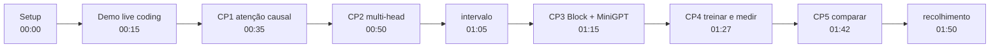
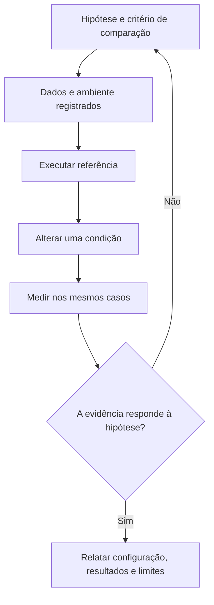
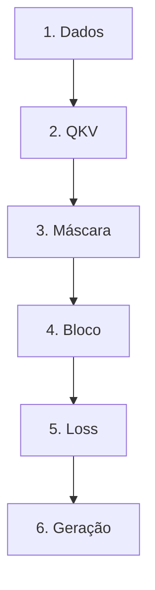
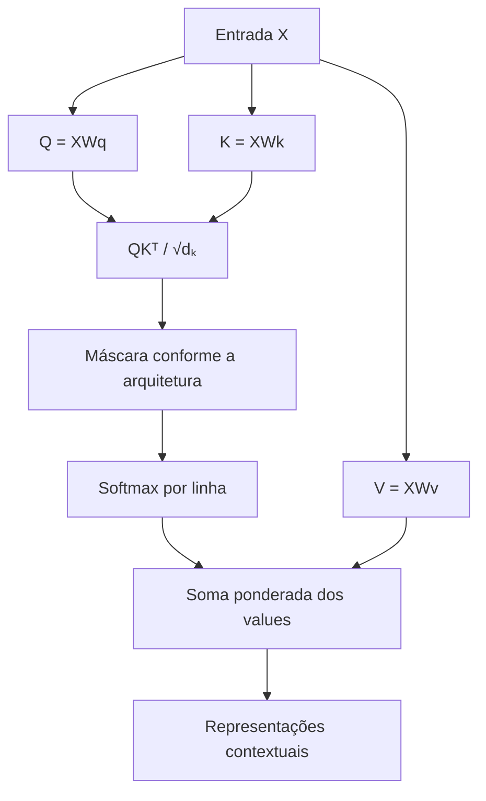
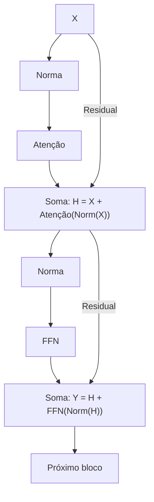
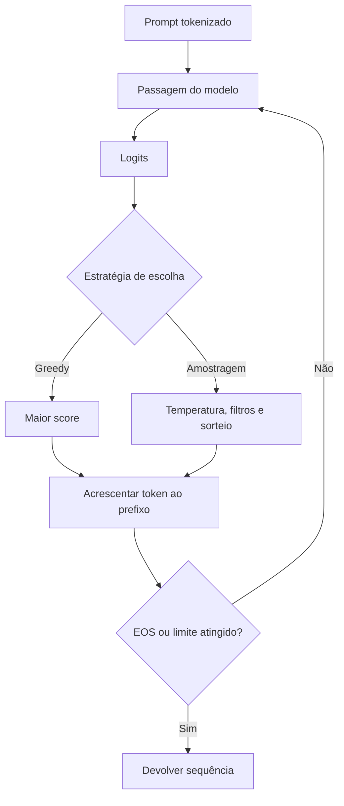
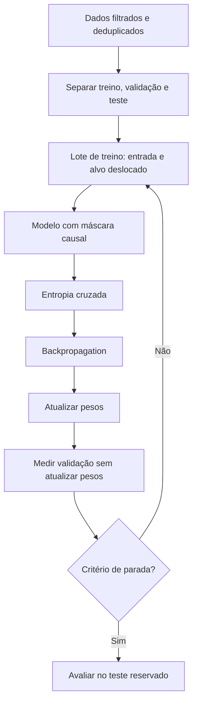

# Especificação de slides — Aula 9 (V2)

> **Rebalanceamento V2 — aula de laboratório (§6-bis do contrato).** Num lab a matemática
> **é** a prática: o aluno implementa a fórmula. Por isso o **roteiro prático não foi
> reordenado** — setup, demo de live coding e os cinco checkpoints permanecem na ordem que
> funciona em bancada. O que mudou:
>
> 1. **Cada checkpoint abre pelo comportamento esperado** — o que aparece na tela quando
>    está certo — e só depois nomeia a fórmula a implementar.
> 2. **A Parte 2 é nova:** um apêndice com o fundamento formal por trás de cada checkpoint,
>    para quem quiser entender o que está digitando. A.1 a A.5, um item por checkpoint, mais
>    A.6 — o protocolo de depuração para quando o treino do CP4 não desce.
> 3. **Cada checkpoint ganhou um ponteiro** para o item correspondente, sem interromper a
>    prática.
>
> Carga horária (120 min), numeração dos slides do fluxo, checkpoints, entregável e
> objetivos de aprendizagem: idênticos à V1.

<!-- SLIDE-FLOW:GUIDE:BEGIN -->
## Fluxogramas na produção dos slides

As orientações abaixo complementam o campo **Visual** dos slides indicados. Produzir os fluxogramas no próprio deck, como formas e conectores editáveis ou gráficos vetoriais; a biblioteca completa ao final torna esta especificação independente do portal.

- **Referência de composição:** título e propósito no topo, blocos numerados, conexões rotuladas, ramificações legíveis e uma saída identificada. Usar apenas o padrão visual da referência fornecida, sem importar seu assunto ou seus exemplos.
- **Tema do deck:** manter o fundo escuro e a paleta já especificada para a aula. Usar `#5b8cff` para o trecho ativo, tons neutros para o contexto e `#e2231a` conforme o significado definido no deck. Cor sempre acompanhada de rótulo.
- **Leitura:** entrada no topo ou à esquerda; saída na base ou à direita. Decisões em losangos, alternativas com rótulos e retornos apontando à etapa correta. Ramos paralelos convergem apenas onde seus resultados realmente são combinados.
- **Densidade:** no fluxo principal, projetar 3–6 blocos curtos por enquadramento, com corpo legível na última fileira. Um mapa maior pode ser revelado por etapas no mesmo slide. Detalhes, condições e explicações completas ficam nas notas; não reduzir a fonte para caber tudo.
- **Semântica:** mapas de percurso mostram ordem de estudo, não execução de um algoritmo. Manter separadas preparação e aplicação, treino e inferência, sequência e alternativas. Não transformar uma etapa opcional em obrigatória.
- **Integração:** o fluxograma substitui uma lista redundante ou ocupa o campo Visual; não cobre matrizes, tabelas, gráficos nem código indispensáveis. Preservar títulos, numeração, duração e referências aos apêndices.
- **Produção:** os blocos Mermaid abaixo são especificações do desenho. Renderizar/reconstruir como diagrama, nunca projetar o código Mermaid. Manter rótulos, bifurcações, retornos e limites declarados. Não transformar este caderno técnico em slides adicionais.
- **Ligação com o portal:** os mapas de mecanismo compartilham o conteúdo dos fluxogramas do portal. Em demonstrações, usar o mesmo vocabulário no deck e no controle interativo para facilitar a passagem entre os dois.
<!-- SLIDE-FLOW:GUIDE:END -->

## Diretrizes visuais

- **Tema:** escuro, accent `#e2231a` (vermelho CESAR), accent secundário `#5b8cff`.
- **Tipografia:** sans-serif para texto; monoespaçada para código, shapes de tensor e nomes de função.
- **Densidade:** máximo 5 linhas de texto por slide no fluxo. Um conceito por slide.
- **Proibido:** bullets genéricos; slide-parede de texto; clipart; código que ninguém vai ler de longe.
- **Este é um deck de laboratório, não de teoria.** A teoria foi dada nas Aulas 6, 7 e 8. Cada slide do fluxo responde a uma de três perguntas operacionais: *o que estou montando agora*, *como sei que está certo*, *o que entrego*. Nenhum slide do fluxo reintroduz conceito — quando um conceito reaparece, ele aparece como armadilha de implementação, e o fundamento formal fica no apêndice.
- **Slide de checkpoint tem estrutura fixa e idêntica**, e a **primeira linha é o critério de conclusão observável**, não a fórmula: título com o número do checkpoint, relógio, *o que aparece na tela quando está certo*, o que implementar (nomes reais de função/classe), a armadilha do checkpoint num cartão em accent, e o ponteiro `→ Apêndice A.n`. Cinco slides com a mesma moldura — a repetição é intencional, é o que dá ritmo ao lab.
- **Shapes de tensor** sempre em monoespaçada e sempre completos: `(B, T, C)`, `(B, n_head, T, d_head)`. Nunca "o tensor de entrada".
- **Relógio visível em todo slide de checkpoint** (canto superior direito), com a janela do checkpoint. A turma precisa saber quanto tempo resta sem perguntar.
- **No apêndice:** densidade alta é esperada e desejável. É material de consulta, lido em casa com o notebook ao lado.

## Arco narrativo

O deck é o painel de instrumentos de duas horas de código: abre prometendo que a fórmula das
Aulas 6 e 7 vira software escrito pelo próprio aluno, mostra os números do lab para tirar o
medo de quota e de tempo de treino, e desenha o mapa dos cinco checkpoints antes de qualquer
linha ser escrita. Do slide 5 ao 9, cada slide é um checkpoint com o mesmo formato — **o que
a tela imprime quando está certo**, o que implementar, a armadilha que falha em silêncio, e
para onde ir se quiser a matemática por trás. Fecha com o inventário do que foi construído,
o checklist de entrega, e a pergunta que abre a Aula 10: se a arquitetura é a mesma dos
modelos de fronteira, a diferença é escala, dado e pós-treino.

A Parte 2 não se apresenta em aula. Ela existe porque, num lab, o aluno digita a fórmula
antes de ter tempo de reconstruí-la — e depois, em casa, quer reconstruir.

---

# PARTE 1 — FLUXO PRINCIPAL

*O que se apresenta em aula. 10 slides, 120 minutos com demo e cinco checkpoints. Ordem
prática preservada da V1.*

### Slide 1 — Abertura: hoje vocês constroem a coisa
- **Tipo:** título
- **Título:** Lab 2 — Mini-GPT do zero em PyTorch
- **Frase-tese:** Até agora vocês acreditaram na fórmula porque eu escrevi ela no quadro. Depois de hoje vocês vão saber que ela funciona, porque foram vocês que digitaram.
- **Conteúdo:** A trilha das quatro aulas anteriores, em uma linha cada: Aula 5, o gargalo do vetor de contexto fixo; Aula 6, `softmax(QKᵀ/√d_k)V`; Aula 7, o bloco pré-norm com residual e feed-forward; Aula 8, decoder-only venceu porque o sinal de treino é o mais denso. Fecho: hoje isso vira ~2,7 M de parâmetros treinados, gerando texto, com perplexidade medida.
- **Visual:** quatro caixas em fila (A5 → A6 → A7 → A8) apontando para uma quinta caixa maior em accent, rotulada "A9 — código escrito por vocês". As quatro primeiras em cinza, a quinta acesa.
- **Notas do apresentador:** 5 min. Roteiro slide 1. Não abrir a pasta `codigo/solucao/` em tela nenhuma, nem em outra aba. Mencionar de passagem que este deck tem apêndice (A.1 a A.6) com a matemática por trás de cada checkpoint — quem quiser reconstruir o que digitou tem para onde ir, e A.6 é o que fazer quando o treino não desce. Trinta segundos, não mais.

### Slide 2 — Setup e os números deste lab

<!-- SLIDE-FLOW:SLIDE:BEGIN -->
- **Fluxograma a incorporar neste slide:** **F00 — Laboratório: da hipótese à evidência**. O desenho e os rótulos completos estão no caderno de fluxogramas ao final deste arquivo.
- **Composição:** integrar ao campo Visual; preservar exemplos, tabelas, fórmulas e dimensões solicitados neste slide. Destacar o trecho relacionado ao título e manter o restante em segundo plano. Os textos detalhados ficam nas notas, sem duplicar a lista de Conteúdo na tela.
<!-- SLIDE-FLOW:SLIDE:END -->

- **Tipo:** dados
- **Título:** Os números, antes de qualquer código
- **Conteúdo:** A configuração de referência e o custo, em monoespaçada:
  ```
  n_layer = 6      n_head = 6      n_embd = 192
  block_size = 128            (contexto, em caracteres)
  batch_size = 64             max_iters = 2000
  ~2,7 M parâmetros    ~1 MB de corpus    ~90 símbolos de vocabulário
  treino: da ordem de 3 a 5 min em T4 (free tier)
  ```
  Abaixo, a variante para quem não pegar GPU: `n_embd=96`, `n_layer=4`, `block_size=64`, `batch_size=32`, 500 passos — roda em CPU e serve para os cinco checkpoints.
- **Frase-tese:** Três a cinco minutos de treino. Este lab foi dimensionado para vocês experimentarem, não para esperarem.
- **Visual:** duas colunas de cartões — "referência (GPU)" e "variante (CPU)" — com os mesmos campos preenchidos, para a comparação ser imediata. Rodapé com o caminho do menu do Colab: `Ambiente de execução → Alterar tipo de ambiente de execução → T4 GPU`.
- **Fundamento:** os 2,7 M não são estimativa: cada bloco custa `12·n_embd²` de parâmetros, sendo `4·n_embd²` na atenção e `8·n_embd²` no feed-forward — dois terços do bloco estão na parte que ninguém acha interessante.
  → contagem completa, bloco a bloco, até o número da tela: **Apêndice A.3** (slide 13)
- **Notas do apresentador:** Projetar o link do notebook e esperar de verdade, 30 s em silêncio, até ver a sala com a aba aberta. Quem não conseguir GPU: apontar a célula da variante e seguir, sem drama.

### Slide 3 — O mapa: cinco checkpoints e o entregável

<!-- SLIDE-FLOW:SLIDE:BEGIN -->
- **Fluxograma a incorporar neste slide:** **F01 — O percurso desta aula**; **F00 — Laboratório: da hipótese à evidência**. O desenho e os rótulos completos estão no caderno de fluxogramas ao final deste arquivo.
- **Composição:** integrar ao campo Visual; preservar exemplos, tabelas, fórmulas e dimensões solicitados neste slide. Destacar o trecho relacionado ao título e manter o restante em segundo plano. Os textos detalhados ficam nas notas, sem duplicar a lista de Conteúdo na tela.
- **Momento de exibição:** apresentar o fluxo preenchido na discussão ou conferência, depois da tentativa da turma; durante a atividade, ocultar as etapas que entregariam a solução.
<!-- SLIDE-FLOW:SLIDE:END -->

- **Tipo:** diagrama
- **Título:** Duas horas, cinco checkpoints
- **Conteúdo:** Os cinco checkpoints com relógio e **o que a tela imprime** quando está certo:
  ```
  CP1  00:35–00:50   atenção causal            → "Checkpoint 1 OK"        (A.1)
  CP2  00:50–01:05   multi-head por reshape    → "Checkpoint 2 OK"        (A.2)
  CP3  01:15–01:27   Block + MiniGPT           → ~2,7 M params, loss ≈ 4,5 (A.3)
  CP4  01:27–01:42   treinar, gerar, medir     → curva + amostra + PPL    (A.4)
  CP5  01:42–01:50   variar e comparar         → tabela de 4 execuções    (A.5)
  ```
  À direita, o entregável: notebook executado com saídas visíveis · 3 amostras geradas · tabela do CP5 · 5 questões-guia · declaração de uso de IA · prazo de 1 semana.
- **Frase-tese:** Erro de shape em atenção não estoura, ele degrada. Os testes deste notebook existem para fazer o erro gritar em vez de sussurrar.
- **Visual:** linha do tempo horizontal de 00:00 a 02:00 com os cinco checkpoints marcados como blocos, o intervalo em 01:05–01:15 vazado, e a demo (00:15–00:35) hachurada como "instrutor". A coluna `(A.n)` em cinza discreto — é ponteiro de estudo, não tarefa de sala. Cartão de alerta separado: "notebook sem saída não é avaliável".
- **Notas do apresentador:** Deixar explícito que CP1 e CP2 têm célula de solução liberada às 00:50 e 01:05 — falar como rede de segurança, não como convite a desistir. A coluna do apêndice se explica em uma frase: "cada checkpoint tem um item do apêndice com a conta por trás dele; ninguém precisa disso hoje, e todo mundo vai querer isso na semana da prova".



### Slide 4 — [Demo] Live coding: scaled dot-product attention do zero

<!-- SLIDE-FLOW:SLIDE:BEGIN -->
- **Fluxograma a incorporar neste slide:** **F02 — Self-attention: da entrada ao contexto**. O desenho e os rótulos completos estão no caderno de fluxogramas ao final deste arquivo.
- **Composição:** integrar ao campo Visual; preservar exemplos, tabelas, fórmulas e dimensões solicitados neste slide. Destacar o trecho relacionado ao título e manter o restante em segundo plano. Os textos detalhados ficam nas notas, sem duplicar a lista de Conteúdo na tela.
<!-- SLIDE-FLOW:SLIDE:END -->

- **Tipo:** transição para demonstração
- **Título:** 20 min: a fórmula virando oito linhas, com tensores de brinquedo
- **Conteúdo:** O que vai aparecer na tela, em monoespaçada, sem o código:
  ```
  1. q, k, v de shape (1, 4, 3)          5. torch.tril → máscara booleana
  2. escores = q @ k.transpose(-2,-1)    6. masked_fill(~mask, -inf)
  3. ler a matriz (1, 4, 4) célula a célula   7. softmax(dim=-1), conferir soma 1
  4. dividir por √d_head                 8. saida = pesos @ v, comparar com PyTorch
  ```
  Rodapé em accent: a linha 9 não existe — multi-head é o Checkpoint 2.
- **Frase-tese:** Quatro posições, dimensão três. Pequeno de propósito: eu quero que a gente leia a matriz de pesos com o olho antes de confiar nela em cento e vinte e oito posições.
- **Visual:** slide quase vazio — só o título, os oito itens numerados em monoespaçada e o relógio. A tela do notebook é o slide de verdade nesses 20 min.
- **Fundamento:** as oito linhas são `softmax(QKᵀ/√d_k)V` com a máscara somada **antes** da normalização — a mesma fórmula da Aula 6, agora com shapes de PyTorch e com o motivo de o teste usar `T=5` e `d_head=8`, e não dois números iguais.
  → tradução completa da fórmula para tensores, com análise de shapes: **Apêndice A.1** (slide 11)
- **Notas do apresentador:** Passos detalhados na Parte 2 do roteiro. Terminar deliberadamente sem multi-head. Apagar as células da demo antes de soltar a turma.

### Slide 5 — [Checkpoint 1] Atenção causal

<!-- SLIDE-FLOW:SLIDE:BEGIN -->
- **Fluxograma a incorporar neste slide:** **F02 — Self-attention: da entrada ao contexto**. O desenho e os rótulos completos estão no caderno de fluxogramas ao final deste arquivo.
- **Composição:** integrar ao campo Visual; preservar exemplos, tabelas, fórmulas e dimensões solicitados neste slide. Destacar o trecho relacionado ao título e manter o restante em segundo plano. Os textos detalhados ficam nas notas, sem duplicar a lista de Conteúdo na tela.
- **Momento de exibição:** apresentar o fluxo preenchido na discussão ou conferência, depois da tentativa da turma; durante a atividade, ocultar as etapas que entregariam a solução.
<!-- SLIDE-FLOW:SLIDE:END -->

- **Tipo:** exercício (moldura de checkpoint)
- **Título:** CP1 — `scaled_dot_product_attention`, 5 TODOs
- **Conteúdo:**
  **Quando está certo, a tela imprime isto:**
  ```
  Checkpoint 1 OK
  ```
  e o teste terá conferido cinco coisas: shape `(B, T, T)` na matriz de pesos, **cada linha
  somando exatamente 1**, peso zero em todo o triângulo superior, saída da posição 0 que
  **não muda** quando o último token muda, e o modo sem máscara voltando a ser bidirecional.

  O que implementar, na ordem dos TODOs:
  ```
  def scaled_dot_product_attention(q, k, v, mask=None):
      # 1 escores  2 escala 1/√d_k  3 masked_fill(-inf)  4 softmax  5 @ v
  ```
  Duas linhas para cravar: a máscara entra **antes** do softmax, com `-inf`; a escala é `√d_head`, não `√n_embd`.
- **Frase-tese:** Máscara antes do softmax, com menos infinito. Zerar depois do softmax é convidar o futuro para a votação, contar o voto dele e só então riscar o nome.
- **Visual:** no topo, o critério de conclusão em caixa destacada (a linha `Checkpoint 1 OK` e as cinco verificações). Abaixo à esquerda, a assinatura da função com os cinco TODOs numerados como comentários. À direita, cartão de alerta em accent com as três armadilhas silenciosas: `transpose(0,1)` em vez de `(-2,-1)`, divisão por `d_k` em vez de `√d_k`, `softmax(dim=0)` em vez de `dim=-1`. Relógio `00:35–00:50` no canto.
- **Fundamento:** a função é `softmax((QKᵀ + M)/√d_k)V` com `M[i,j] = −∞` para `j > i`; a soma unitária por linha e a invariância da posição 0 são consequências dessa ordem, não coincidências do teste.
  → derivação com shapes de PyTorch, o motivo de `T ≠ d_head` no teste e a álgebra dos dois erros de escala: **Apêndice A.1** (slide 11)
- **Notas do apresentador:** Condução na Parte 3 do roteiro. Circular olhando tela, não esperando pergunta: "qual o shape do seu `escores`?" resolve metade dos casos. Quem perguntar de onde vem o `√d_k`: A.2 da **Aula 6** tem a conta de variância, e A.1 desta aula tem o que muda na implementação. Não conduzir a derivação em sala — a Parte 4 do roteiro tem a contingência.

### Slide 6 — [Checkpoint 2] Multi-head

<!-- SLIDE-FLOW:SLIDE:BEGIN -->
- **Fluxograma a incorporar neste slide:** **F02 — Self-attention: da entrada ao contexto**. O desenho e os rótulos completos estão no caderno de fluxogramas ao final deste arquivo.
- **Composição:** integrar ao campo Visual; preservar exemplos, tabelas, fórmulas e dimensões solicitados neste slide. Destacar o trecho relacionado ao título e manter o restante em segundo plano. Os textos detalhados ficam nas notas, sem duplicar a lista de Conteúdo na tela.
- **Momento de exibição:** apresentar o fluxo preenchido na discussão ou conferência, depois da tentativa da turma; durante a atividade, ocultar as etapas que entregariam a solução.
<!-- SLIDE-FLOW:SLIDE:END -->

- **Tipo:** exercício (moldura de checkpoint)
- **Título:** CP2 — `MultiHeadAttention`, a cabeça vira lote
- **Conteúdo:**
  **Quando está certo, a tela imprime isto:**
  ```
  Checkpoint 2 OK
  ```
  e o teste terá conferido duas coisas: o shape `(B, T, n_embd)` preservado na saída, e —
  com `n_head=1` — saída **idêntica dígito por dígito** à função do Checkpoint 1 alimentada
  com os mesmos pesos. Com uma cabeça, multi-head *é* a atenção simples; se não bate, o
  embaralhamento está nos `view`.

  A ida e a volta, em shapes:
  ```
  ida:    (B, T, C) --view--> (B, T, n_head, d_head) --transpose--> (B, n_head, T, d_head)
  volta:  (B, n_head, T, d_head) --transpose--> contiguous() --view--> (B, T, C) --> W_O
  ```
  Lembrete: a máscara registrada como buffer precisa ser cortada em `T` antes de usar.
- **Frase-tese:** Multi-head não é um laço sobre cabeças. É a mesma conta com uma dimensão extra, e a cabeça vira lote — é por isso que ela é quase de graça.
- **Visual:** no topo, o critério de conclusão. Abaixo, o tensor `(B, T, C)` desenhado como bloco sendo fatiado em `n_head` faixas que passam a empilhar junto com o eixo de lote; a seta de volta refazendo o caminho, com `contiguous()` marcado em accent no ponto exato onde ele é necessário. Relógio `00:50–01:05`.
- **Fundamento:** `d_head = n_embd / n_head`, e a concatenação das cabeças é exatamente o `transpose` seguido de `view` — desde que o tensor esteja contíguo. Esquecer o `transpose` da volta produz um tensor com o **shape certo e os canais trocados**, sem erro nenhum.
  → o caminho dos strides em memória, o exemplo numérico do embaralhamento silencioso e a verificação de que o custo total não cresce: **Apêndice A.2** (slide 12)
- **Notas do apresentador:** O erro clássico é `view` direto sobre o tensor transposto — às vezes o PyTorch reclama, às vezes embaralha canais em silêncio. Solução deste CP liberada às 01:05, junto com o intervalo. Quem perguntar "por que contiguous?" recebe a resposta curta ("o transpose deixa os strides fora de ordem e o `view` não sabe reordenar memória") e o ponteiro para A.2.

### Slide 7 — [Checkpoint 3] O bloco completo

<!-- SLIDE-FLOW:SLIDE:BEGIN -->
- **Fluxograma a incorporar neste slide:** **F03 — Bloco Transformer com pré-normalização**. O desenho e os rótulos completos estão no caderno de fluxogramas ao final deste arquivo.
- **Composição:** integrar ao campo Visual; preservar exemplos, tabelas, fórmulas e dimensões solicitados neste slide. Destacar o trecho relacionado ao título e manter o restante em segundo plano. Os textos detalhados ficam nas notas, sem duplicar a lista de Conteúdo na tela.
- **Momento de exibição:** apresentar o fluxo preenchido na discussão ou conferência, depois da tentativa da turma; durante a atividade, ocultar as etapas que entregariam a solução.
<!-- SLIDE-FLOW:SLIDE:END -->

- **Tipo:** exercício (moldura de checkpoint)
- **Título:** CP3 — `FeedForward`, `Block`, `MiniGPT`
- **Conteúdo:**
  **Quando está certo, a tela imprime dois números:**
  ```
  parâmetros: ~2,7 M
  loss (antes de treinar): ≈ 4,5
  ```
  O segundo é o diagnóstico que vale ouro: com ~90 símbolos no vocabulário, um modelo
  recém-inicializado tem de estar no chute uniforme. Modelo não treinado que **não** está no
  chute uniforme é modelo com bug — e é muito melhor descobrir isso agora que depois de 2000 passos.

  As duas linhas do `Block`, que são a Aula 7 em pré-norm:
  ```
  x = x + self.attn(self.ln1(x))
  x = x + self.ffn(self.ln2(x))
  ```
  E o `MiniGPT`: `tok_emb + pos_emb` → pilha de 6 blocos → `ln_f` → `lm_head` → loss com `F.cross_entropy` achatando B e T juntos.
- **Frase-tese:** Antes de treinar, a loss tem de ser o logaritmo do tamanho do vocabulário. Um modelo não treinado que não está no chute uniforme é um modelo com bug.
- **Visual:** no topo, os dois números do critério em caixa destacada. Abaixo, o diagrama do bloco pré-norm com a seta residual em cor distinta atravessando por fora das duas normas — o mesmo desenho do quadro da Aula 7, agora ao lado das duas linhas de código. Cartão em accent: "o `x +` esquecido não quebra — a loss estagna perto de 2,5". Relógio `01:15–01:27`.
- **Fundamento:** o `x +` cria um caminho aditivo que atravessa a pilha inteira; sem ele, o sinal que chega à primeira camada é um **produto** de seis fatores, e produto de fatores menores que 1 encolhe rápido. E os `~2,7 M` saem de `12·n_embd²` por bloco mais embeddings — não de estimativa.
  → o caminho do gradiente pelo residual, o contrafactual numérico do `x +` ausente e a contagem que produz o 2,7 M: **Apêndice A.3** (slide 13)
- **Notas do apresentador:** Condução na Parte 3. Se alguém disser "minha loss não desce", primeira pergunta: tem `x +` nas duas linhas? A conta de por que a loss inicial é `ln(90)` está em A.4 e cabe em uma frase falada: "chute uniforme sobre 90 símbolos custa `ln 90` nats".

### Slide 8 — [Checkpoint 4] Treinar, gerar, medir perplexidade

<!-- SLIDE-FLOW:SLIDE:BEGIN -->
- **Fluxograma a incorporar neste slide:** **F04 — Geração autorregressiva**. O desenho e os rótulos completos estão no caderno de fluxogramas ao final deste arquivo.
- **Composição:** integrar ao campo Visual; preservar exemplos, tabelas, fórmulas e dimensões solicitados neste slide. Destacar o trecho relacionado ao título e manter o restante em segundo plano. Os textos detalhados ficam nas notas, sem duplicar a lista de Conteúdo na tela.
- **Momento de exibição:** apresentar o fluxo preenchido na discussão ou conferência, depois da tentativa da turma; durante a atividade, ocultar as etapas que entregariam a solução.
<!-- SLIDE-FLOW:SLIDE:END -->

- **Tipo:** exercício (moldura de checkpoint)
- **Título:** CP4 — 2000 passos, 500 caracteres, um número
- **Conteúdo:**
  **Quando está certo, a tela mostra três coisas:** uma curva de loss decrescente com a
  validação acompanhando o treino, uma amostra de 500 caracteres que **parece** português
  sem **ser** português, e a perplexidade impressa ao lado do teto trivial (~90).

  Os três produtos deste checkpoint:
  ```
  treino     2000 passos · AdamW lr=3e-4 · log a cada 250 (treino + validação)
  geração    3 TODOs: cortar em block_size · pegar SÓ o último passo · multinomial após temperatura
  medida     PPL = exp(val_loss)   →   por CARACTERE   ·   teto trivial = vocab_size ≈ 90
  ```
  Regra de avaliação: a validação usa `model.eval()` e média de dezenas de lotes — nunca `loss.item()` de um lote de treino.
- **Frase-tese:** O alvo de hoje é texto que *parece* português sem *ser* português. Se saiu isso, funcionou — semântica não cabe em 2,7 M de parâmetros.
- **Visual:** no topo, o critério em três miniaturas (curva, bloco de texto, número). Abaixo, três painéis grandes: curva de loss (treino e validação), um bloco de texto gerado com aparência plausível e sem sentido, e a PPL como número grande com o teto trivial ao lado em cinza. Cartão em accent: "esta PPL é por caractere — não é comparável com nenhum número publicado de modelo de subword".
- **Frase-tese secundária (cartão):** Trocar o tokenizador troca o denominador. O mesmo modelo tem dois números de perplexidade diferentes conforme o que se conta.
- **Fundamento:** a loss é a média das log-probabilidades do próximo símbolo, e `PPL = exp(loss)` é a média **geométrica** do inverso dessas probabilidades — o número efetivo de símbolos entre os quais o modelo hesita. Como a média é por símbolo, mudar o que conta como símbolo muda o número sem mudar o modelo.
  → derivação de `PPL = exp(loss)`, a conta que converte perplexidade por caractere em perplexidade por subword, e a única normalização que é comparável: **Apêndice A.4** (slide 14)
- **Fundamento (depuração):** se a loss **não** desce, a pergunta certa não é "quantos passos faltam?" e sim "o laço está conectado?". Isso se responde com um teste, não com paciência: treinar **um único lote** repetidamente. Um modelo de 2,7 M de parâmetros contra 8.192 tokens tem ~330 parâmetros por token a decorar — se não decora, é defeito, e o patamar em que a loss estaciona diz qual.
  → o protocolo, os cinco culpados na ordem de custo, a tabela de patamares (`4,50` · `2,5` · `nan`) e a armadilha da máscara vazada que torna o teste *mais* fácil: **Apêndice A.6** (slide 16)
- **Notas do apresentador:** Ler em voz alta uma amostra ruim da véspera antes de as deles saírem — calibra expectativa. Se a loss não desceu: reexecutar os testes do CP1 e CP2 **e depois** rodar o teste de um lote de A.6 — os testes dizem se a atenção está certa, A.6 diz se o gradiente está chegando, e são perguntas diferentes. A verificação de dez segundos que resolve a maioria dos casos: a loss no passo 0 tem de valer `ln(90) ≈ 4,50`; se não vale, o problema é a perda ou o deslocamento dos rótulos, não o modelo. A conta de conversão caractere↔subword de A.4 é a resposta curta para "então meu modelo é melhor que o GPT-2?".

### Slide 9 — [Checkpoint 5] Variar hiperparâmetros e comparar

<!-- SLIDE-FLOW:SLIDE:BEGIN -->
- **Fluxograma a incorporar neste slide:** **F00 — Laboratório: da hipótese à evidência**. O desenho e os rótulos completos estão no caderno de fluxogramas ao final deste arquivo.
- **Composição:** integrar ao campo Visual; preservar exemplos, tabelas, fórmulas e dimensões solicitados neste slide. Destacar o trecho relacionado ao título e manter o restante em segundo plano. Os textos detalhados ficam nas notas, sem duplicar a lista de Conteúdo na tela.
- **Momento de exibição:** apresentar o fluxo preenchido na discussão ou conferência, depois da tentativa da turma; durante a atividade, ocultar as etapas que entregariam a solução.
<!-- SLIDE-FLOW:SLIDE:END -->

- **Tipo:** exercício (moldura de checkpoint)
- **Título:** CP5 — quatro execuções, uma variável por vez
- **Conteúdo:**
  **Quando está certo, existem duas coisas no notebook:** a tabela abaixo com quatro linhas
  preenchidas, **e** um parágrafo que diz qual variável mexeu mais **e o que a medição não
  prova**. A segunda parte é a que vale a nota.

  | Configuração | Params | Val loss | PPL | Tempo |
  |---|---|---|---|---|
  | referência (500 passos) | | | | |
  | `n_head=1` | | | | |
  | `n_layer=2` | | | | |
  | `block_size=32` | | | | |

- **Frase-tese:** Uma variável por vez, e uma frase dizendo o que a sua medição *não* prova. Quinhentos passos com uma semente não sustentam conclusão nenhuma — e saber disso vale mais que a tabela.
- **Visual:** no topo, o critério de conclusão em duas linhas. Abaixo, a tabela vazia grande e centralizada, pronta para ser preenchida ao vivo. Em accent, a pergunta que fecha o lab: "a diferença que você mediu é maior que o ruído entre duas sementes?". Relógio `01:42–01:50`.
- **Fundamento:** a loss medida é o efeito da configuração **mais** o efeito da semente, e uma execução por configuração não separa os dois. Com uma semente só, uma diferença de 0,02 nat entre duas linhas da tabela é indistinguível de ruído de inicialização.
  → o que a semente injeta, quanta diferença é necessária para uma comparação significar algo, e os três confundimentos escondidos nas quatro linhas da tabela: **Apêndice A.5** (slide 15)
- **Notas do apresentador:** Se o tempo estourou, este checkpoint vai para casa e isso é dito explicitamente — CP1 a CP4 são o núcleo obrigatório. Esta é a lição de método que o Lab 8 vai cobrar, e A.5 é o item do apêndice que mais volta lá — na Aula 28 ela reaparece como intervalo de confiança e teste pareado.

### Slide 10 — Recolhimento: o que entregar e a ponte para a Aula 10
- **Tipo:** encerramento
- **Título:** Vocês construíram a arquitetura. Falta escala, dado e pós-treino
- **Conteúdo:** À esquerda, o inventário do que foi implementado: atenção causal · multi-head por reshape · bloco pré-norm com residual e FFN · pilha de 6 · treino · perplexidade — zero linha de biblioteca de alto nível.
  À direita, o checklist de entrega (prazo de 1 semana):
  - ☐ notebook executado, saídas visíveis
  - ☐ 3 amostras geradas de configurações diferentes
  - ☐ tabela do CP5 preenchida + parágrafo de análise
  - ☐ respostas às 5 questões-guia
  - ☐ declaração de uso de IA

  Rodapé: as três diferenças para um modelo de fronteira — **escala**, **dado**, **pós-treino** — e nenhuma delas é arquitetura.
- **Frase-tese:** Vocês acabaram de construir a mesma arquitetura que roda os modelos de fronteira. A diferença é escala, dado e pós-treino — e é exatamente aí que a disciplina vai a partir da próxima aula.
- **Visual:** duas colunas (inventário · checklist) e, embaixo, uma seta larga saindo de "2,7 M params · 1 MB" para "10¹¹ params · 10¹³ tokens", com as três palavras escala/dado/pós-treino escritas sobre a seta. Rodapé: "Aula 10 — Do Transformer ao LLM". Num canto discreto, o índice do apêndice: A.1 atenção causal · A.2 multi-head · A.3 bloco e residual · A.4 perplexidade · A.5 o que uma execução não prova.
- **Notas do apresentador:** Projetar o checklist e ficar 30 s em silêncio para a turma fotografar. Recolher o pulso da sala: quem chegou ao CP4? Se menos da metade, o Lab 3 precisa de menos ambição. Não estourar as duas horas. Antes de encerrar, projetar o índice do apêndice por 20 s: são cinco itens, um por checkpoint, e as duas questões-guia que mais separam nota (perplexidade e o que uma execução não prova) estão respondidas em A.4 e A.5.

---

# PARTE 2 — APÊNDICE MATEMÁTICO

*Material de estudo e consulta. **Não se apresenta em aula.** Um item por checkpoint (A.1 a A.5):
reconstrói, com rigor completo, o fundamento formal do que o aluno digitou. Autossuficiente —
quem estuda por aqui sem ter feito o lab consegue reconstruir tudo, e quem fez o lab consegue
explicar por que o próprio código funciona. **A.6 é de outra natureza:** não fundamenta um
checkpoint, e sim o que fazer quando um deles não produz o número esperado — é o protocolo de
depuração que o CP4 exige e que os testes do CP1 e do CP2 não cobrem.*

### Slide 11 — A.1 · A atenção causal que o Checkpoint 1 implementa

<!-- SLIDE-FLOW:SLIDE:BEGIN -->
- **Fluxograma a incorporar neste slide:** **F02 — Self-attention: da entrada ao contexto**. O desenho e os rótulos completos estão no caderno de fluxogramas ao final deste arquivo.
- **Composição:** integrar ao campo Visual; preservar exemplos, tabelas, fórmulas e dimensões solicitados neste slide. Destacar o trecho relacionado ao título e manter o restante em segundo plano. Os textos detalhados ficam nas notas, sem duplicar a lista de Conteúdo na tela.
- **Momento de exibição:** apresentar o fluxo preenchido na discussão ou conferência, depois da tentativa da turma; durante a atividade, ocultar as etapas que entregariam a solução.
<!-- SLIDE-FLOW:SLIDE:END -->

- **Tipo:** apêndice — derivação completa, com shapes de PyTorch
- **Invocado em:** slides 4 e 5 (demo e Checkpoint 1)

**Relação com a Aula 6.** A derivação da fórmula em si — as quatro operações, a soma unitária
por linha, a combinação convexa, a assimetria de `S` — está em **A.1 da Aula 6**; o argumento
de variância que justifica o `√d_k` está em **A.2 da Aula 6**; a álgebra da máscara causal
está em **A.3 da Aula 6**. Este item **não repete** aquilo: ele acrescenta o que é específico
da implementação em tensores, que é onde o lab quebra.

**Notação.**
`B` — tamanho do lote. `T` — número de posições da sequência (no lab, até `block_size = 128`).
`d_head` — dimensão de cada cabeça (na configuração de referência, `192/6 = 32`).
`q, k, v ∈ ℝ^(B×T×d_head)` — no CP1 ainda sem eixo de cabeça; no CP2 os mesmos tensores ganham
o eixo `n_head` e tudo abaixo vale por lote (ver A.2).
`S ∈ ℝ^(B×T×T)` — matriz de afinidade. `M ∈ ℝ^(T×T)` — máscara causal.
`A ∈ ℝ^(B×T×T)` — matriz de pesos normalizada.

**Premissas.** (i) `q`, `k` e `v` vêm da mesma sequência — é *self*-attention; (ii) a máscara é
triangular inferior **incluindo a diagonal**, isto é, a posição `i` pode olhar para si mesma;
(iii) nenhuma linha é inteiramente mascarada — premissa que vale sempre aqui, porque `j = i`
nunca é proibido, e cuja falha produz `NaN` (ver casos-limite).

**Etapa 1 · afinidade, e por que o eixo é `-2, -1`.**
```
S = q @ k.transpose(-2, -1)          S[b,i,j] = Σ_{m=1}^{d_head} q[b,i,m] · k[b,j,m]
```
Análise de dimensões: `q` é `(B, T, d_head)`, `k.transpose(-2,-1)` é `(B, d_head, T)`, o produto
é `(B, T, T)`. **Quadrado em posições, nunca em dimensão de embedding.**

*Por que `transpose(-2, -1)` e não `transpose(0, 1)`.* Os índices negativos contam do fim: `-1`
é o último eixo (`d_head`) e `-2` é o penúltimo (`T`). São exatamente os dois eixos que precisam
trocar. `transpose(0, 1)` trocaria lote com posição e produziria `(T, B, d_head)` — e o produto
seguinte ou falha ou multiplica coisas sem relação.

*Por que o teste usa `T = 5` e `d_head = 8`.* Se `T == d_head`, o tensor transposto no eixo errado
**ainda é conformável** com o produto matricial: a multiplicação acontece, o shape de saída sai
certo, e o resultado é lixo. Nenhuma exceção é levantada. Escolher `T ≠ d_head` no teste força o
erro a virar `RuntimeError` de shape — e um erro que estoura vale dez erros que degradam.
É a mesma razão de ser do teste que a Aula 6 anunciava e que aqui vira linha de código.

**Etapa 2 · escala, e os dois erros de divisor.**
```
S' = S / √d_head
```
O fundamento é `Var(q·k) = d_head` para componentes independentes de média 0 e variância 1
(derivação completa em **A.2 da Aula 6**). O que interessa aqui são os dois erros de digitação
que produzem modelos que treinam pior sem avisar:

*Erro 1 — dividir por `d_head` em vez de `√d_head`.* Com `d_head = 32`, isso divide por 32 quando
o correto é 5,657 — uma compressão extra de 5,657×. Os escores chegam ao softmax com desvio-padrão
`1/5,657 ≈ 0,177` em vez de 1. Softmax de escores quase iguais devolve pesos quase uniformes: a
atenção deixa de selecionar. O modelo treina, e a camada de atenção vira aproximadamente uma
média simples dos values.

*Erro 2 — dividir por `√n_embd` em vez de `√d_head`.* Com `n_embd = 192` e `n_head = 6`:
```
√n_embd / √d_head = √192 / √32 = √6 ≈ 2,449
```
Divide-se por um fator 2,449 vezes maior que o necessário — o mesmo efeito do erro 1, mais suave,
e por isso mais difícil de notar. **Nenhum dos dois levanta exceção.** É o erro mais perigoso do
lab, e a razão de o slide 5 gastar uma linha só nisso.

*Caso em que a diferença some.* Com `n_head = 1`, `d_head = n_embd` e os dois divisores coincidem —
o que significa que o teste de equivalência do CP2 (feito com `n_head = 1`) **não pega** esse erro.
Ele é pego pela loss que não desce, e por A.5.

**Etapa 3 · máscara, somada antes da normalização.**
```
M[i,j] = 0      se j ≤ i        S'' = S' + M      (na prática: S'.masked_fill(~mask, -inf))
M[i,j] = −∞     se j > i
```
Aplicando o softmax por linha:
```
A[b,i,j] = exp(S''[b,i,j]) / Σ_{l=1}^{T} exp(S''[b,i,l])
```
Para `j > i`, `exp(−∞) = 0` exatamente, e o denominador só contém as exponenciais de `l ≤ i`.
Logo, para toda linha `i`:
```
Σ_{j=1}^{T} A[b,i,j] = Σ_{j≤i} exp(S'[b,i,j]) / Σ_{l≤i} exp(S'[b,i,l]) = 1
```
A massa que iria para o futuro é **redistribuída** entre passado e presente.

*A ordem invertida, e as três coisas que quebram.* Se o aluno escreve `pesos = softmax(S')` e só
então `pesos = pesos * mask`, obtendo `Ã`:
```
Ã[b,i,j] = A[b,i,j] · 1[j ≤ i]
Σ_j Ã[b,i,j] = 1 − Σ_{j>i} A[b,i,j] < 1
```
1. **A linha deixa de somar 1**, e o déficit depende de `i`: a posição 0 perde `T−1` parcelas de
   massa e a posição `T−1` não perde nenhuma. A norma da saída passa a depender da posição.
2. **O vazamento continua.** O denominador `Σ_{l=1}^{T} exp(S'[b,i,l])` ainda contém as
   exponenciais dos tokens futuros, então o valor de `k_j` para `j > i` **influenciou** os pesos
   de todas as posições passadas. Zerar depois esconde o efeito; não o desfaz.
3. **Nada levanta exceção.** O modelo treina e treina pior.

*Como o teste do CP1 pega isso, formalmente.* A verificação é: perturbar `x[:, T−1, :]` e conferir
que a saída da posição 0 não muda. Com a máscara antes, `A[b,0,j] = 0` para todo `j > 0` e o
denominador da linha 0 é `exp(S'[b,0,0])` — não há dependência alguma de `k_{T−1}`, e a saída da
posição 0 é literalmente `v_0`. Com a máscara depois, o denominador contém `exp(S'[b,0,T−1])` e a
saída da posição 0 muda. É um teste de derivada, escrito como diferença finita.

**Etapa 4 · agregação.**
```
saida = A @ v ∈ ℝ^(B×T×d_head)        saida[b,i,:] = Σ_{j≤i} A[b,i,j] · v[b,j,:]
```
Como `A[b,i,j] ≥ 0` e a linha soma 1, a saída de cada posição é uma **combinação convexa** dos
values visíveis — está no fecho convexo de `{v_j : j ≤ i}`, nunca fora dele. Prova em
**A.1 da Aula 6**.

**Casos-limite.**
- **`i = 0`.** Apenas `j = 0` é permitido, logo `A[b,0,0] = 1` necessariamente e
  `saida[b,0,:] = v[b,0,:]`. A primeira linha da matriz de pesos impressa na demo é `[1, 0, 0, 0]`
  — não porque o modelo aprendeu, mas porque não há alternativa. É o token pior representado de
  qualquer sequência, e é uma verificação de dois segundos da implementação.
- **`T = 1`.** A matriz de pesos é `[[1]]` e a atenção é a identidade sobre `v`.
- **Linha inteiramente mascarada.** Todas as entradas `−∞` produzem `0/0 = NaN`. Não acontece
  aqui porque `j = i` é sempre permitido, mas acontece em implementações com padding mascarado —
  daí o uso de um valor finito muito negativo (`-1e9`) no lugar de `float("-inf")` em código de
  produção.
- **Sem máscara (`mask=None`).** A atenção volta a ser bidirecional e cada linha soma 1 sobre as
  `T` posições. O teste do CP1 confere esse modo justamente para garantir que a máscara é opcional
  e não está costurada dentro da função — é o que permite reusar a mesma função num encoder.

**Intuição geométrica.** `A[b,i,:]` é um vetor de pesos sobre a nuvem de pontos `{v_j : j ≤ i}`,
e a saída é o **centro de massa** dessa nuvem. A máscara causal, geometricamente, é a regra de que
a nuvem só cresce da esquerda para a direita: a posição `i` faz a média de uma nuvem com `i+1`
pontos, e a posição `i+1` acrescenta um ponto a ela. Por isso as primeiras posições têm saídas
sistematicamente menos informativas — a média é sobre menos coisa.

**De volta ao fluxo:** slide 5.

### Slide 12 — A.2 · Multi-head por reshape, e por que `contiguous()` é obrigatório

<!-- SLIDE-FLOW:SLIDE:BEGIN -->
- **Fluxograma a incorporar neste slide:** **F02 — Self-attention: da entrada ao contexto**. O desenho e os rótulos completos estão no caderno de fluxogramas ao final deste arquivo.
- **Composição:** integrar ao campo Visual; preservar exemplos, tabelas, fórmulas e dimensões solicitados neste slide. Destacar o trecho relacionado ao título e manter o restante em segundo plano. Os textos detalhados ficam nas notas, sem duplicar a lista de Conteúdo na tela.
<!-- SLIDE-FLOW:SLIDE:END -->

- **Tipo:** apêndice — mecânica de memória e verificação de custo
- **Invocado em:** slide 6 (Checkpoint 2)

**Relação com a Aula 6.** A definição de multi-head, a contagem de parâmetros e o argumento de
que ele é aproximadamente gratuito estão em **A.4 da Aula 6**. Este item acrescenta a mecânica de
memória que faz o CP2 falhar em silêncio.

**Notação.** `C = n_embd`, `h = n_head`, `d = d_head = C/h` (a divisibilidade é exigida).
`W_Q^(l), W_K^(l), W_V^(l) ∈ ℝ^(C×d)` para a cabeça `l`; `W_O ∈ ℝ^(C×C)`.

**Definição.**
```
head_l = Attention(X W_Q^(l), X W_K^(l), X W_V^(l)) ∈ ℝ^(T×d)
MultiHead(X) = Concat(head_1, …, head_h) W_O
```
A concatenação recompõe `T × (h·d) = T × C`, e `W_O` remistura os subespaços. A afirmação que o
código explora: **a concatenação por posição é exatamente um `transpose` seguido de `view`, desde
que o tensor esteja contíguo em memória.** É essa equivalência que este item demonstra.

**O caminho dos shapes.**
```
(B, T, C)                    entrada
(B, T, 3C)                   projeção qkv combinada
3 × (B, T, C)                split em q, k, v
(B, T, h, d)                 view
(B, h, T, d)                 transpose(1, 2)   ← a cabeça vira lote
(B, h, T, d)                 atenção (idêntica a A.1, aplicada por lote)
(B, T, h, d)                 transpose(1, 2) de volta
(B, T, C)                    contiguous().view(B, T, C)
(B, T, C)                    projeção W_O
```

**Por que a atenção funciona sem nenhuma mudança.** Todas as operações de A.1 agem nos dois
últimos eixos (`T` e `d`). Os eixos à esquerda são tratados como lote pelo `@` do PyTorch. Com
`(B, h, T, d)`, o "lote efetivo" é `B·h`. Da perspectiva da GPU, seis cabeças com lote 64 são um
lote de 384 — e é por isso que multi-head não custa tempo de laço em Python.

**Strides: o que `transpose` faz e o que `view` exige.**
Um tensor `(B, T, h, d)` contíguo tem strides `(T·h·d, h·d, d, 1)`: os strides são decrescentes,
e a memória segue a ordem lógica dos eixos.
`transpose(1, 2)` **não move nenhum byte**. Ele apenas troca os metadados: o shape passa a
`(B, h, T, d)` e os strides a `(T·h·d, d, h·d, 1)`. Repare que agora o stride do eixo 1 (`d`) é
**menor** que o do eixo 2 (`h·d`) — os strides deixaram de ser decrescentes, e o tensor deixou de
ser contíguo.

`view` é uma operação de custo zero: ela só reinterpreta os metadados, e por isso **exige** que a
nova forma seja compatível com os strides existentes. Sobre um tensor não contíguo, `view` levanta
`RuntimeError: view size is not compatible with input tensor's size and stride`. `contiguous()`
copia a memória na ordem lógica e devolve um tensor sobre o qual o `view` é legal.

**O erro que não levanta exceção — com exemplo numérico.**
O erro perigoso não é esquecer o `contiguous()` (isso estoura e o aluno conserta). É esquecer o
`transpose(1, 2)` **de volta** e chamar `.contiguous().view(B, T, C)` direto sobre `(B, h, T, d)`.
Como `B·h·T·d = B·T·C` sempre, o `view` é legal e nada reclama.

Seja `B = 1`, `T = 2`, `C = 4`, `h = 2`, `d = 2`. Escreva a saída da atenção como
```
cabeça 0:  posição 0 = [a₀, a₁]     posição 1 = [a₂, a₃]
cabeça 1:  posição 0 = [b₀, b₁]     posição 1 = [b₂, b₃]
```
O tensor `(1, 2, 2, 2)` em ordem `(B, h, T, d)` ocupa a memória assim:
```
[ a₀ a₁ a₂ a₃ b₀ b₁ b₂ b₃ ]
```

*Caminho correto.* `transpose(1,2)` → `(B, T, h, d)`; `contiguous()` reescreve a memória como
```
[ a₀ a₁ b₀ b₁ a₂ a₃ b₂ b₃ ]
```
e `view(1, 2, 4)` devolve
```
posição 0 = [a₀, a₁, b₀, b₁]      posição 1 = [a₂, a₃, b₂, b₃]
```
Cada posição é a concatenação das suas cabeças. É a definição de `Concat(head_1, …, head_h)`. ∎

*Caminho errado.* `view(1, 2, 4)` direto sobre `(B, h, T, d)` devolve
```
"posição 0" = [a₀, a₁, a₂, a₃]     "posição 1" = [b₀, b₁, b₂, b₃]
```
A primeira linha é a cabeça 0 sobre **as duas posições**; a segunda é a cabeça 1 sobre as duas
posições. O eixo de posição e o eixo de cabeça foram trocados. O shape é `(1, 2, 4)` — certo. O
conteúdo está permutado — e o `W_O` seguinte mistura tudo, de modo que nem a saída fica
obviamente absurda. O modelo treina. Aprende algo. Aprende pior.

**Por que o teste com `n_head = 1` pega isso.** Com `h = 1`, o tensor é `(B, 1, T, d)` e trocar os
eixos 1 e 2 é uma permutação de dois eixos de tamanho 1 e `T`... o que **não** é inofensivo assim
que `T > 1`: o caminho errado produz `[a₀ a₁ a₂ a₃]` numa linha só quando `h > 1`. Com `h = 1` o
`view` direto devolve exatamente o mesmo tensor que o caminho correto, porque `h·d = d`. Então o
teste de equivalência **não** pega o erro de ordem; ele pega o outro erro do checkpoint, que é
esquecer o `W_O` ou aplicar a máscara sem cortar em `T`. O erro de ordem se manifesta como loss
que estagna, e o diagnóstico é imprimir a saída de duas cabeças e conferir que a posição 0 não
carrega números da posição 1.

**Verificação do custo.** Somando as `h` cabeças, os parâmetros de projeção são
```
h · 3 · (C · d) = 3 · C · (h · d) = 3 C²
```
idêntico ao de uma única cabeça com `d = C`. O custo da atenção em si:
```
h cabeças × O(T² · d) = O(T² · h · d) = O(T² · C)
```
também idêntico. Multi-head é aproximadamente gratuito em relação a uma cabeça larga — troca-se
1 padrão de relação por `h` padrões ao mesmo preço. Com `W_O`, o total do módulo de atenção é
`4C²`, número que A.3 vai usar.

**Casos-limite.**
- **`h = 1`.** `d = C`, a expressão colapsa em A.1 seguida de `W_O`. É o modo do teste do CP2.
- **`C` não divisível por `h`.** `view(B, T, h, d)` falha com erro de shape se `h·d ≠ C`. Se o
  aluno "conserta" arredondando `d`, o `view` passa a descartar ou duplicar canais silenciosamente.
  A configuração de referência (`192 / 6 = 32`) foi escolhida divisível de propósito.
- **`T` menor que `block_size`.** A máscara registrada como buffer tem shape `(block_size, block_size)`
  e precisa ser cortada em `[:T, :T]`. Sem o corte, o erro é honesto e estoura — é o único erro
  simpático deste checkpoint.

**Nota de interpretação.** O ganho é ter `h` padrões de relação simultâneos por camada. Isso **não**
autoriza atribuir semântica a cabeças individuais: elas são largamente redundantes e o mesmo padrão
costuma aparecer distribuído. Separar hipótese de medição é assunto da Aula 27, e é literalmente o
que o Lab 8 vai cobrar.

**De volta ao fluxo:** slide 6.

### Slide 13 — A.3 · O bloco pré-norm, o caminho do gradiente e os 2,7 M

<!-- SLIDE-FLOW:SLIDE:BEGIN -->
- **Fluxograma a incorporar neste slide:** **F03 — Bloco Transformer com pré-normalização**. O desenho e os rótulos completos estão no caderno de fluxogramas ao final deste arquivo.
- **Composição:** integrar ao campo Visual; preservar exemplos, tabelas, fórmulas e dimensões solicitados neste slide. Destacar o trecho relacionado ao título e manter o restante em segundo plano. Os textos detalhados ficam nas notas, sem duplicar a lista de Conteúdo na tela.
<!-- SLIDE-FLOW:SLIDE:END -->

- **Tipo:** apêndice — derivação e contagem
- **Invocado em:** slides 2 e 7 (números do lab e Checkpoint 3)

**Relação com a Aula 7.** A comparação formal entre pré-norm e pós-norm, as invariâncias da
LayerNorm e a derivação de `d_ff = 8/3·d` para SwiGLU estão em **A.3, A.4, A.5 e A.6 da Aula 7**.
Este item deriva o que o CP3 implementa e produz os dois números que o critério de conclusão exige.

**Notação.** `x_l ∈ ℝ^(T×C)` é a entrada do bloco `l`. Dentro do bloco:
```
f(x) = attn(ln1(x))        g(u) = ffn(ln2(u))
u = x + f(x)               y = u + g(u)
```
`J_f = ∂f/∂x` e `J_g = ∂g/∂u` são as jacobianas dos dois ramos; `I` é a identidade de dimensão
compatível.

**Premissas.** (i) `attn`, `ffn`, `ln1` e `ln2` são diferenciáveis quase em toda parte — vale para
GELU e LayerNorm; (ii) o argumento abaixo é sobre a **estrutura** do caminho do gradiente, não sobre
o valor numérico das jacobianas, que dependem dos pesos.

**Derivação — o caminho aditivo.**
Pela regra da cadeia aplicada às duas linhas do bloco:
```
∂u/∂x = I + J_f
∂y/∂u = I + J_g
∂y/∂x = (I + J_g)(I + J_f) = I + J_f + J_g + J_g J_f
```
O primeiro termo é a **identidade**. Empilhando `N` blocos e escrevendo `J_l` para a jacobiana
composta do ramo do bloco `l`:
```
∂y_N/∂x_0 = Π_{l=1}^{N} (I + J_l) = I + Σ_l J_l + Σ_{l<m} J_m J_l + … 
```
A expansão contém `2^N` termos, e **um deles é `I`**: existe um caminho do gradiente da saída até
a entrada que não passa por nenhuma transformação aprendida. Esse caminho não pode encolher, porque
não há nada nele para encolher. É essa a função do `x +`.

**O contrafactual: o `x +` esquecido.**
Sem residual, `y = g(f(x))` e
```
∂y_N/∂x_0 = Π_{l=1}^{N} J_l
```
Agora o gradiente é um **produto** de `N` fatores. Tomando normas e usando a submultiplicatividade:
```
‖∂y_N/∂x_0‖ ≤ Π_{l=1}^{N} ‖J_l‖
```
Se cada `‖J_l‖ ≈ 0,8` — valor plausível para um ramo com LayerNorm e GELU perto da inicialização —
então, para as seis camadas do lab:
```
0,8^6  ≈ 0,262        (o gradiente que chega à primeira camada é 26% do que sai da última)
0,8^12 ≈ 0,069
0,8^48 ≈ 2,0 · 10⁻⁵
```
Com `N = 6` o modelo **ainda treina** — só treina mal. É exatamente o sintoma anunciado no slide 7:
a loss desce e estagna perto de 2,5 nats/caractere, contra ~1,5 com o residual. O modelo sem `x +`
não quebra; ele converge para pior. E como a loss desce, o aluno não desconfia do bloco: desconfia
do learning rate.

*Por que 2,5 e não 4,5.* Mesmo com gradiente encolhido, a última camada e os embeddings continuam
recebendo sinal cheio — o modelo aprende estatística de unigrama e bigrama, que já derruba a loss
de `ln 90 ≈ 4,5` para perto de 2,5. O que ele não aprende é o que depende de composição em
profundidade.

**Por que pré-norm e não pós-norm.** No pós-norm, `y = LN(x + f(x))`, e a jacobiana da própria
norma multiplica o caminho identidade a cada camada:
```
∂y/∂x = J_LN · (I + J_f)
```
O termo `I` já não sobrevive puro — ele vem multiplicado por `J_LN` em toda camada, e o produto
`Π J_LN` volta a ser um produto de `N` fatores. É por isso que o Transformer original precisava de
warmup cuidadoso e o bloco pré-norm não precisa. Demonstração completa em **A.5 da Aula 7**.

**Caso-limite útil.** Se `f ≡ 0` e `g ≡ 0`, o bloco pré-norm é a **identidade exata**: `y = x`. Um
bloco recém-inicializado com pesos pequenos é aproximadamente inofensivo, e empilhar mais blocos
não piora o modelo inicial. No pós-norm isso não vale, porque a norma final continua atuando. Esse
é o argumento formal por trás da prática de inicializar a projeção de saída dos ramos com desvio
pequeno.

**Contagem de parâmetros — de onde saem os 2,7 M.**
Por bloco, com `C = n_embd`:

| Peça | Contagem | Com `C = 192` |
|---|---|---|
| projeção `qkv` combinada | `3C²` | 110.592 |
| projeção de saída `W_O` | `C²` | 36.864 |
| **atenção, subtotal** | **`4C²`** | **147.456** |
| feed-forward, expansão `C → 4C` | `4C²` | 147.456 |
| feed-forward, contração `4C → C` | `4C²` | 147.456 |
| **feed-forward, subtotal** | **`8C²`** | **294.912** |
| duas LayerNorm (ganho + viés) | `4C` | 768 |
| **bloco, total** | **`12C² + 4C`** | **443.136** |

Leitura imediata: `8C²` dos `12C²` estão no feed-forward, isto é, **dois terços dos parâmetros do
bloco estão na peça que ninguém acha interessante**. A atenção é a estrela conceitual e a minoria
numérica — e é por isso que trabalhos de eficiência atacam tanto a FFN quanto a atenção.

Modelo inteiro, com `n_layer = 6`, `vocab = 90`, `block_size = 128`:
```
6 blocos          6 × 443.136 = 2.658.816
embedding token   90 × 192    =    17.280
embedding posição 128 × 192   =    24.576
norma final       2 × 192     =       384
cabeça linear     192 × 90    =    17.280      (+ 90 de viés, se houver)
                                 -----------
total                          ≈ 2.718.336     →  "da ordem de 2,7 M"
```
Os vieses das camadas lineares acrescentam algumas centenas e não mudam a ordem. **Se a contagem
impressa no notebook divergir disso em mais de ~5%, há uma peça a mais ou a menos** — tipicamente
uma FFN com expansão diferente de 4× ou um `n_layer` que não é 6. A contagem é um teste, não uma
curiosidade.

*Como usar isso como teste, e não como conferência a posteriori.* A ordem importa: **preveja o
número a partir dos hiperparâmetros e só depois imprima** `sum(p.numel() for p in model.parameters())`.
Conferir depois de ver o resultado não é teste — é racionalização, e ela aceita qualquer número.
Prever antes transforma a contagem numa hipótese falseável, que é o que o CP3 pede.

*A forma geral, para quando o modelo não for este.* A contagem fechada por camada — entrada,
MHA, bloco de encoder, bloco de decoder e saída — está em **A.6 da Aula 7**, junto com a
diferença que interessa: um bloco de decoder num encoder-decoder custa o **dobro** de parâmetros
de atenção do bloco de encoder, porque tem a cruzada além da mascarada. Lá também está a
ressalva de convenção que explica por que aquela forma dá `12d² + 9d` e esta tabela dá
`12C² + 4C`: **aquela conta os vieses das lineares e esta não.** A diferença é de ordem `d` e
não muda nada no tamanho — mas derruba qualquer conferência que espere casar dígito a dígito.

**Intuição.** O residual transforma a rede de uma composição (`g∘f∘…`) numa soma de correções sobre
um caminho principal. Cada bloco não reescreve a representação: ele **acrescenta** um termo a ela.
Daí a leitura corrente de que a pilha de blocos é um refinamento iterativo — e daí o fato de que
remover um bloco de um Transformer treinado degrada bem menos do que remover uma camada de uma
rede sem residual.

**De volta ao fluxo:** slide 7.

### Slide 14 — A.4 · A entropia cruzada do próximo token e `PPL = exp(loss)`

<!-- SLIDE-FLOW:SLIDE:BEGIN -->
- **Fluxograma a incorporar neste slide:** **F05 — Treinamento por próximo token**. O desenho e os rótulos completos estão no caderno de fluxogramas ao final deste arquivo.
- **Composição:** integrar ao campo Visual; preservar exemplos, tabelas, fórmulas e dimensões solicitados neste slide. Destacar o trecho relacionado ao título e manter o restante em segundo plano. Os textos detalhados ficam nas notas, sem duplicar a lista de Conteúdo na tela.
<!-- SLIDE-FLOW:SLIDE:END -->

- **Tipo:** apêndice — derivação e conversão de unidades
- **Invocado em:** slide 8 (Checkpoint 4)

**Notação.** `V` é o vocabulário e `|V|` o seu tamanho (~90 no lab). `x_1, …, x_N` é a sequência de
alvos de um lote achatado, com `N = B·T` (com `B = 64` e `T = 128`, `N = 8.192` previsões
supervisionadas de uma vez). `p_θ(x_n | c_n)` é a probabilidade que o modelo atribui ao símbolo
correto `x_n` dado o contexto `c_n`. Todos os logaritmos são naturais; a unidade é o **nat**.

**Premissas.** (i) O alvo `y` é a entrada `x` deslocada de uma posição — cada posição prevê a
seguinte; (ii) `F.cross_entropy` aplica `log_softmax` internamente, portanto recebe **logits**, não
probabilidades; (iii) as `N` previsões do lote são tratadas como igualmente ponderadas.

**A loss.**
```
L = − (1/N) Σ_{n=1}^{N} log p_θ(x_n | c_n)
```
`F.cross_entropy` espera `logits` de shape `(N, |V|)` e `targets` de shape `(N,)`. Daí o achatamento
de `B` e `T` juntos: `logits.view(B*T, vocab)` e `targets.view(B*T)`.

*O erro que produz um número plausível.* Achatar de formas inconsistentes — por exemplo, transpor
`logits` antes do `view` — mantém a loss numérica e finita, porque cada linha continua sendo uma
distribuição sobre `|V|` símbolos. O modelo aprende a prever o caractere errado, com loss que desce.
Não há teste barato para isso além de conferir os shapes na primeira iteração.

*O segundo erro que produz um número plausível.* Aplicar `softmax` antes de `F.cross_entropy`. A
função aplica `log_softmax` sobre o que recebe; recebendo probabilidades, ela normaliza de novo e a
loss sai baixa desde o passo zero — comprimida, porque `softmax(softmax(z))` é quase uniforme.
Diagnóstico: loss inicial muito **abaixo** de `ln|V|`.

**A loss na inicialização, e por que 4,5.**
Um modelo recém-inicializado produz logits aproximadamente iguais, logo `p_θ(·) ≈ 1/|V|` para todo
símbolo. Substituindo:
```
L₀ = − (1/N) Σ_n log(1/|V|) = log|V|
```
Com `|V| = 90`:
```
ln 90 = 4,4998…  ≈ 4,5
```
Este é o critério de conclusão do CP3. Ele é forte nos dois sentidos:
- **loss inicial muito acima de `ln|V|`** significa que o modelo já está confiante em algo errado —
  tipicamente uma inicialização com escala grande demais, ou logits com viés não zerado;
- **loss inicial muito abaixo de `ln|V|`** significa vazamento (o modelo está vendo o alvo) ou
  softmax duplicado.

**Derivação de `PPL = exp(L)`.**
A perplexidade é definida como a média **geométrica** do inverso das probabilidades atribuídas aos
símbolos corretos:
```
PPL = ( Π_{n=1}^{N} 1/p_θ(x_n | c_n) )^{1/N}
```
Tomando o logaritmo dos dois lados:
```
log PPL = (1/N) Σ_n log (1/p_θ(x_n|c_n))
        = − (1/N) Σ_n log p_θ(x_n|c_n)
        = L
```
Logo
```
PPL = exp(L)
```
∎ A média geométrica — e não a aritmética — é a escolha certa porque probabilidades se
**multiplicam** ao longo da sequência: a probabilidade do texto inteiro é o produto das
probabilidades condicionais, e a raiz `N`-ésima devolve "a probabilidade típica por símbolo".

**Leitura.** `PPL = 12` significa: em média, o modelo está tão indeciso quanto estaria alguém
escolhendo uniformemente entre 12 símbolos. É o **número efetivo de opções** entre as quais o
modelo hesita, e por isso a unidade é "símbolos", não "erro".

**O teto trivial.** Um modelo uniforme tem `L = ln|V|` e portanto `PPL = exp(ln|V|) = |V| = 90`.
Qualquer coisa **acima de 90** é pior que chutar — sinal de bug ou divergência, não de modelo fraco.
Qualquer coisa **abaixo de 1** é impossível, porque `p ≤ 1` implica `L ≥ 0`.

**Por que a perplexidade por caractere não é comparável com a de subword — a conta.**
O ponto é que `L` é uma média **por símbolo**, e mudar o tokenizador muda o que conta como símbolo,
sem mudar o modelo nem o texto. Formalizando: seja um mesmo texto com `N_car` caracteres e `N_sub`
subwords, e seja `log P(texto)` a log-verossimilhança total que um modelo atribui a ele. Então
```
log PPL_car = − log P(texto) / N_car
log PPL_sub = − log P(texto) / N_sub
```
e portanto
```
log PPL_sub = (N_car / N_sub) · log PPL_car
```
Chamando `r = N_car / N_sub` o número médio de caracteres por subword (tipicamente `r ≈ 4` em
português com um tokenizador BPE de 30–50 k):
```
PPL_sub = PPL_car^r
```

*Exemplo numérico.* Um modelo com `PPL_car = 4,0` tem `L = ln 4 = 1,386` nat por caractere. Com
`r = 4`, isso é `5,545` nat por subword, ou seja `PPL_sub = exp(5,545) = 256`. **É o mesmo modelo.**
Reportar "perplexidade 4" e "perplexidade 256" descreve exatamente a mesma qualidade preditiva.
Comparar o 4 do lab com o número publicado de um modelo de subword é comparar 4 com 256.

**A normalização que é comparável: bits por caractere.**
A única forma honesta de comparar modelos com tokenizadores diferentes é normalizar por **caractere**
(ou por byte) e converter para bits:
```
BPC = log₂(PPL_token) · (N_token / N_car)
```
*Verificação com o exemplo acima.* Modelo de caractere: `BPC = log₂(4,0) · 1 = 2,00`. Modelo de
subword com `PPL_sub = 256` e `r = 4`: `BPC = log₂(256)/4 = 8/4 = 2,00`. Os dois coincidem, como
tinham de coincidir.

*E agora a comparação de verdade.* Um modelo de subword real com `PPL_sub = 20` e `r = 4` tem
`BPC = log₂(20)/4 = 4,322/4 = 1,08`. Contra os `2,00` do lab. O modelo publicado é
**substancialmente melhor** — e essa conclusão só aparece depois da normalização; olhando os números
crus, `4` parece bater `20`.

**Casos-limite.**
- **`PPL = 1`.** O modelo atribui probabilidade 1 ao símbolo correto em toda posição. Num conjunto
  de validação, isto é vazamento, não maestria.
- **`p_θ(x_n) = 0` para algum alvo.** `L = ∞`. Não acontece com softmax, que nunca devolve zero
  exato, mas acontece com `p` truncada ou com `log(0)` em implementação manual.
- **Comparar PPL entre execuções com vocabulários diferentes.** Se duas execuções do CP5 usarem
  corpus diferentes, `|V|` muda, o teto trivial muda e as perplexidades deixam de ser comparáveis
  mesmo dentro do próprio lab. É a razão da instrução de manter o corpus fixo entre as quatro linhas
  da tabela.

**Nota de método — por que `estimate_loss()` existe.** A loss reportada tem de ser a média sobre
dezenas de lotes de validação, com `model.eval()`. Duas razões independentes: (i) `dropout` ativo
injeta ruído na estimativa e a enviesa para cima; (ii) a média de um único lote de 8.192 previsões
tem desvio-padrão amostral não desprezível, e comparar duas configurações por um lote cada é
comparar duas amostras de uma variável aleatória. É a versão em miniatura do problema que A.5 trata
e que a Aula 27 chama de "avaliar com denominador".

**De volta ao fluxo:** slide 8.

### Slide 15 — A.5 · O que uma execução com uma semente não permite concluir
- **Tipo:** apêndice — modelo estatístico do experimento
- **Invocado em:** slide 9 (Checkpoint 5)

**Por que este item existe.** O CP5 produz uma tabela de quatro linhas e a tentação universal é ler
a tabela como um ranking. Este item mostra, com conta, por que ela não é um ranking — e o que
seria preciso para virar um.

**Notação e modelo.** Seja `c` uma configuração (referência, `n_head=1`, `n_layer=2`,
`block_size=32`) e `s` uma semente. A loss de validação medida é
```
L(c, s) = μ(c) + ε(c, s)
```
onde `μ(c)` é o valor esperado sob a configuração `c` — a quantidade que interessa — e `ε(c, s)` é
o desvio produzido pela semente, com `E[ε] = 0` e `Var(ε) = σ²`.

**O que a semente controla, concretamente.** Não é uma abstração: `torch.manual_seed(s)` fixa
(i) a inicialização de **todos** os pesos, (ii) as máscaras de `dropout` de cada passo, e (iii) a
ordem dos índices sorteados em `get_batch`. Duas execuções com sementes diferentes veem lotes
diferentes, em ordem diferente, a partir de pontos diferentes do espaço de parâmetros. `σ` não é
pequeno por construção.

**O que a tabela do CP5 mede.** Com uma execução por linha, e a mesma semente `s₀` em todas:
```
ΔL_obs = L(c₁, s₀) − L(c₂, s₀) = [μ(c₁) − μ(c₂)] + [ε(c₁, s₀) − ε(c₂, s₀)]
                                  └─── o que se quer ───┘   └──── ruído ────┘
```
Os dois termos são somados numa medição só. **Não existe operação sobre esta tabela que os
separe.** Não é questão de fazer a conta melhor: a informação não está lá.

*Objeção previsível: "mas a semente é a mesma nas quatro linhas".* Fixar a semente **não** faz
`ε(c₁, s₀) = ε(c₂, s₀)`. Configurações diferentes têm números de parâmetros diferentes, consomem o
gerador de números aleatórios em ordens diferentes e partem de inicializações diferentes. A mesma
semente produz mundos diferentes em modelos diferentes. Ela dá **reprodutibilidade** — rodar de novo
dá o mesmo número —, não comparabilidade.

**Quanta diferença é necessária.**
Supondo `ε(c₁, s₀)` e `ε(c₂, s₀)` independentes e de mesma variância `σ²`:
```
Var(ΔL_obs | μ₁ = μ₂) = Var(ε₁) + Var(ε₂) = 2σ²
desvio-padrão = σ√2 ≈ 1,41 σ
```
Uma diferença observada só é evidência de `μ(c₁) ≠ μ(c₂)` quando ela é grande em relação a `σ√2`.
Uma régua prática: exigir `|ΔL_obs| > 2σ√2 ≈ 2,83 σ`.

**Como estimar `σ` — e é barato.** Rodar a **mesma** configuração `r` vezes, mudando só a semente,
e tomar o desvio-padrão amostral das `r` losses. Duas execuções já dão uma estimativa grosseira e
custam 2 × 500 passos. Com `r` execuções por configuração e comparando médias:
```
desvio-padrão da diferença de médias = σ√(2/r)
```
- `r = 1`: `1,41 σ`
- `r = 3`: `0,82 σ`
- `r = 10`: `0,45 σ`

*Exemplo com número.* Suponha que duas execuções da configuração de referência, com sementes
diferentes, deem `1,742` e `1,781` — diferença de `0,039`. Isso já indica `σ` da ordem de `0,03`.
Então `2σ√2 ≈ 0,085`: **qualquer diferença menor que ~0,09 nat entre duas linhas da tabela do CP5
não é evidência de nada.** E uma diferença de `0,02` nat — que é o tipo de número que aparece — é
menos de um quarto do ruído.

**Os três confundimentos escondidos nas quatro linhas da tabela.**
Mesmo com `σ` estimado, três das quatro comparações do CP5 comparam coisas que não são só a variável
declarada:

1. **`block_size = 32` não é comparação a compute igual.** O número de tokens vistos por passo é
   `batch_size × block_size`. Com `64 × 128 = 8.192` na referência e `64 × 32 = 2.048` na variante,
   em 500 passos a variante vê **quatro vezes menos texto**. Se ela vai pior, não se sabe se é o
   contexto curto ou o orçamento menor de dados. A correção seria igualar tokens vistos, não passos.
2. **`n_layer = 2` não é comparação a capacidade igual.** O modelo tem um terço dos blocos, logo
   ~1/3 dos parâmetros (ver A.3). Comparar a loss de dois modelos de tamanhos diferentes é uma
   pergunta legítima — mas é uma pergunta diferente de "a profundidade ajuda".
3. **500 passos é medir no transiente, não na convergência.** A ordem entre duas configurações em
   500 passos pode se inverter em 2000. Configurações com mais parâmetros costumam começar mais
   devagar e ultrapassar depois. Uma tabela em 500 passos mede **velocidade inicial de
   aprendizado**, não qualidade final.

A comparação `n_head = 1` é a mais limpa das quatro: mesmo número de parâmetros (ver a contagem de
A.2: `3C²` independentemente de `h`), mesmo orçamento de dados, mesma profundidade. Se alguma linha
da tabela pode sustentar uma afirmação, é essa — e ainda assim só depois de `σ` estar estimado.

**O que uma execução única *licencia* dizer.** Uma afirmação de medição, não de ordenação:

> *"Sob este orçamento (500 passos, lote 64), com a semente 1337, a configuração `n_head=1` atingiu
> loss de validação 1,83 contra 1,79 da referência. A diferença (0,04) é da mesma ordem da variação
> que observamos entre duas sementes da própria referência (0,039), então este experimento não
> distingue as duas configurações."*

É essa frase — e não a tabela — que vale a nota do checkpoint, e é ela que a rubrica chama de "o que
a medição não prova".

**Casos-limite.**
- **Diferença enorme.** Se uma configuração dá `2,6` e outra `1,8`, nenhuma conta de ruído salva a
  pior: `0,8` nat é ordens de grandeza acima de qualquer `σ` plausível aqui. O ceticismo é
  proporcional, não absoluto.
- **`σ = 0`.** Aconteceria se o treino fosse determinístico e independente da inicialização. Não é o
  caso de nenhuma rede neural treinada por gradiente estocástico.
- **Muitas comparações.** Quatro linhas geram seis comparações par a par. Testar todas e reportar a
  maior diferença como "o efeito" é o problema de comparações múltiplas: com seis testes, a chance
  de pelo menos um parecer significativo por acaso sobe muito acima do nível nominal de cada um.

**Ponte.** Esta é a matemática que o **Lab 8 (Aula 28)** formaliza: lá, o mesmo argumento reaparece
como intervalo de confiança de uma proporção (por que `0,71` e `0,78` em 20 casos são o mesmo número)
e como **teste de McNemar** (por que comparar dois sistemas nos mesmos casos exige um teste pareado,
e não uma comparação de duas proporções independentes). Quem entender A.5 agora chega no Lab 8 com
metade do caminho andado — e é por isso que a questão-guia sobre "o que a medição não prova" é uma
das duas que mais separam nota neste lab.

**De volta ao fluxo:** slide 9.

---

### Slide 16 — A.6 · O protocolo de *overfit* de um único lote, e o diagnóstico diferencial de "a loss não desce"

<!-- SLIDE-FLOW:SLIDE:BEGIN -->
- **Fluxograma a incorporar neste slide:** **F05 — Treinamento por próximo token**. O desenho e os rótulos completos estão no caderno de fluxogramas ao final deste arquivo.
- **Composição:** integrar ao campo Visual; preservar exemplos, tabelas, fórmulas e dimensões solicitados neste slide. Destacar o trecho relacionado ao título e manter o restante em segundo plano. Os textos detalhados ficam nas notas, sem duplicar a lista de Conteúdo na tela.
<!-- SLIDE-FLOW:SLIDE:END -->

- **Tipo:** apêndice — protocolo de depuração
- **Invocado em:** slide 8 (Checkpoint 4)

**Por que este item existe.** "Treinei e a loss não desce" é o modo de falha dominante deste lab, e a
instrução do fluxo — reexecutar os testes do CP1 e do CP2 antes de mexer em hiperparâmetro — é
necessária mas **não é suficiente**. Aqueles dois testes cobrem a atenção e o *reshape* das cabeças.
Eles não dizem nada sobre a função de perda, sobre o alinhamento dos rótulos, sobre o `backward`,
sobre a taxa de aprendizado nem sobre a inicialização. Este item fecha o buraco com um teste único
que separa "não aprende" de "aprende devagar", e com a ordem em que se procura o culpado.

**O protocolo, em uma frase.** Antes de treinar em 2000 passos sobre o corpus inteiro, pegue **um
único lote** `B` e treine sobre **ele** repetidamente, sem sortear lotes novos. Se a loss não for a
praticamente zero, o problema é estrutural — e nenhuma quantidade de passos, dados ou ajuste fino de
`lr` vai consertá-lo.

```python
xb, yb = get_batch('train')          # UM lote, capturado fora do laço
for i in range(300):
    logits, loss = model(xb, yb)     # o MESMO xb, yb, 300 vezes
    optimizer.zero_grad(set_to_none=True)
    loss.backward()
    optimizer.step()
    if i % 50 == 0:
        print(i, round(loss.item(), 4))
```

**Por que o teste é decisivo.** Ele desacopla **otimização** de **generalização**. Generalizar pode
falhar por mil razões legítimas — corpus pequeno, modelo pequeno, orçamento curto. Decorar um lote
só pode falhar por poucas, e todas são defeito. Aqui o argumento tem número: o modelo tem ~2,7 M de
parâmetros (ver A.3) contra `batch_size × block_size = 64 × 128 = 8.192` tokens no lote — uma razão
de **~330 parâmetros por token a decorar**. Capacidade não é a restrição. Se essa configuração não
decora 8.192 tokens, alguma coisa não está conectada.

**Os três patamares, e o que cada um diz.** Com `vocab_size ≈ 90`, a perda de um modelo que não sabe
nada é `ln(90) ≈ 4,50` — o mesmo teto trivial do CP4, visto do lado da loss em vez do lado da
perplexidade.

| A loss estaciona em | Leitura | Onde procurar |
|---|---|---|
| `≈ 4,50` desde o passo 0 | nada está aprendendo | passo 3 do diagnóstico: o gradiente não chega |
| `≈ 2,5` e não sai dali | o gradiente chega, mas não atravessa a pilha | residual/norma ausente ou fora de lugar — ver A.3 |
| desce, mas estaciona em `≈ 1,0` | otimiza, mas devagar demais | passo 4: taxa de aprendizado baixa demais |
| `nan` | explodiu | passo 4: taxa alta demais, ou máscara somando `−inf` numa linha inteira |
| `< 0,1` em ~300 passos | **o laço está correto** | o problema, se houver, é de dados ou de generalização |

**O diagnóstico diferencial, na ordem de custo crescente.** Cinco causas possíveis, e a verificação
barata de cada uma:

1. **A perda está errada ou mal implementada.** É a primeira a checar porque é a mais barata e a mais
   comum. **Verificação:** no passo 0, antes de qualquer atualização, a loss tem de valer
   `ln(vocab_size) ≈ 4,50`. Um modelo recém-inicializado é indistinguível de um sorteio uniforme
   sobre o vocabulário; se o número inicial não for esse, ou a perda está errada, ou os rótulos estão
   desalinhados. O desalinhamento clássico neste lab é o deslocamento de um: `y` tem de ser `x`
   deslocado uma posição, e se `y = x` o modelo aprende a copiar a entrada e a loss cai rápido demais
   — falso sucesso, que este teste também pega.
2. **O modelo é simples demais para o padrão.** Descartada por construção aqui, pelos ~330
   parâmetros por token. **Verificação:** se a loss não desce e a contagem de parâmetros bate com
   A.3, o problema não é capacidade — pule para o passo 3.
3. **O `backward` não chega em toda parte.** **Verificação:** depois de um `loss.backward()`,
   percorrer os parâmetros e listar os que têm `p.grad is None` ou norma zero. Parâmetro sem
   gradiente é parâmetro desconectado do grafo — típico quando um tensor foi criado com `torch.tensor(...)`
   dentro do `forward`, quando houve `.detach()` indevido, ou quando um módulo foi guardado numa lista
   Python comum em vez de `nn.ModuleList` (e portanto não foi registrado). Este último é o erro que
   este lab produz com mais frequência, porque a pilha de blocos é montada à mão.
4. **A taxa de aprendizado está imprópria.** **Verificação:** o formato da curva distingue os dois
   casos. Baixa demais → decrescimento quase linear e lentíssimo, sem oscilação. Alta demais → `nan`,
   ou oscilação com subidas. Só se chega aqui **depois** de 1 e 3, porque mexer em `lr` é o reflexo
   errado: é a ação que dá a sensação de progresso sem tocar na causa.
5. **A inicialização está ruim.** Última porque é a mais rara com os padrões do PyTorch — que
   já implementam os dois esquemas clássicos, e a escolha entre eles é **função da ativação**:
   **Xavier/Glorot** (variância `2/(n_ent + n_sai)`) para sigmoide e tanh; **He** (variância
   `2/n_ent`) para ReLU e derivadas, que descartam metade da massa e por isso precisam do dobro
   de variância para manter a escala do sinal ao atravessar camadas. **Verificação:** ativações
   saturadas ou loss inicial muito acima de `ln(vocab_size)`. Vale saber os nomes porque, num
   modelo escrito à mão como o deste lab, uma camada inicializada fora do padrão da biblioteca é
   um erro plausível — e é silencioso.

**A armadilha específica deste lab, que o protocolo *não* pega.** Um teste de *overfit* bem-sucedido
prova que o laço de otimização está fechado. **Não** prova que o modelo está correto. E há um caso em
que ele engana ativamente: **uma máscara causal quebrada, que deixa o futuro vazar, torna a
memorização de um lote mais fácil, não mais difícil** — o modelo passa a poder ler a resposta.
Uma loss que despenca para perto de zero em 50 passos, e não em 300, é sinal de vazamento, não de
virtude. Por isso este item é **complementar** ao teste de causalidade do CP1, nunca substituto: o
CP1 responde "está certo?", A.6 responde "está conectado?". Rodar A.6 sem ter passado no CP1 é
construir confiança sobre um resultado que o próprio defeito produziu.

**Casos-limite.**
- **Decora o lote e o treino real continua ruim.** O protocolo cumpriu a função: excluiu as cinco
  causas estruturais. O que sobra é generalização — corpus, orçamento, tamanho — que é um problema
  legítimo e de outra natureza, tratado em A.5.
- **Decora rápido demais.** Ver a armadilha acima. Cheque a causalidade antes de comemorar.
- **`dropout` ligado.** Com `dropout > 0` a loss de um único lote não vai a zero exato, porque o
  ruído entra a cada passe. Para o teste, `model.eval()` não serve (desliga também o que se quer
  medir); o caminho é `dropout=0` na configuração de depuração e devolver depois.
- **Lote muito grande.** Se o lote for grande o bastante para que a razão parâmetros/tokens caia
  abaixo de ~1, decorar deixa de ser garantido e o teste perde o poder de decisão. Com os números
  deste lab isso não acontece; num modelo de produção, o protocolo é aplicado a um lote reduzido de
  propósito.

**Por que isto entra num curso de LLM e não num curso de PyTorch.** Porque é o mesmo raciocínio de
A.5 aplicado ao outro lado do experimento. A.5 diz o que uma medição **não** licencia concluir; A.6
diz como obter uma medição em que valha a pena confiar antes de interpretá-la. Um curso que ensina a
ler resultado sem ensinar a estabelecer que o resultado é do modelo, e não do defeito, ensina metade.

**De volta ao fluxo:** slide 8.

<!-- SLIDE-FLOW:LIBRARY:BEGIN -->
# Caderno de fluxogramas para produção

As referências Fxx identificam desenhos, não novos números de slide. Cada desenho abaixo é autocontido.

| Mapa | Desenho | Usar nos slides |
| --- | --- | --- |
| F00 | Laboratório: da hipótese à evidência | 2, 3, 9 |
| F01 | O percurso desta aula | 3 |
| F02 | Self-attention: da entrada ao contexto | 4, 5, 6, 11, 12 |
| F03 | Bloco Transformer com pré-normalização | 7, 13 |
| F04 | Geração autorregressiva | 8 |
| F05 | Treinamento por próximo token | 14, 16 |

## F00 — Laboratório: da hipótese à evidência

Um protocolo de comparação que pode ser reproduzido.



**Conteúdo dos blocos e notas de montagem:**

1. **Definir hipótese e critério:** Escreva o que espera observar e o que contrariaria sua hipótese.
2. **Preparar dados e ambiente:** Registre versões, configuração e partições usadas.
3. **Executar uma referência:** Guarde o resultado inicial antes de alterar o sistema.
4. **Alterar uma condição:** Compare sobre os mesmos casos e registre a variável alterada.
5. **Conferir e relatar:** Apresente resultados, falhas e limites com os arquivos necessários para repetir.
   ↺ Se a comparação não responder à hipótese, revise o experimento e execute novamente.

**Saída ou limite a explicitar:** Entregável: configuração, evidências e interpretação; seguir checkpoints não substitui analisar o resultado.

## F01 — O percurso desta aula

As setas indicam a ordem de estudo. Abra cada etapa para entender sua função.



**Conteúdo dos blocos e notas de montagem:**

1. **Dados:** Construa entradas e alvos deslocados de um token.
2. **QKV:** Confira dimensões e projeções de cada cabeça.
3. **Máscara:** Oculte posições futuras antes do softmax.
4. **Bloco:** Combine atenção, FFN, normalizações e residuais.
5. **Loss:** Meça entropia cruzada e atualize pesos no treino.
6. **Geração:** Avalie em dados separados e gere token por token.

**Saída ou limite a explicitar:** Conecte as etapas: explique como uma decisão afeta o que você observa em seguida.

## F02 — Self-attention: da entrada ao contexto

Fluxo de dados de uma cabeça de atenção; a máscara depende da arquitetura.



**Conteúdo dos blocos e notas de montagem:**

1. **Projetar a entrada X:** Três projeções aprendidas operam sobre os mesmos vetores.
   Ramos/alternativas a rotular: Q = XWq · consultas; K = XWk · chaves; V = XWv · valores.
2. **Comparar Q com K:** Calcule QKᵀ e divida por √dₖ para controlar a escala dos scores.
3. **Aplicar a máscara:** Em atenção causal, posições futuras recebem −∞ antes da normalização.
4. **Normalizar por linha:** Softmax converte scores permitidos em pesos que somam 1.
5. **Combinar valores:** Multiplique os pesos por V; cada posição recebe uma mistura contextual.

**Saída ou limite a explicitar:** Saída: representações contextuais. Multi-head concatena várias cabeças e aplica uma projeção.

## F03 — Bloco Transformer com pré-normalização

Duas transformações com caminhos residuais; esta é uma variante específica do bloco.



**Conteúdo dos blocos e notas de montagem:**

1. **Receber X:** A representação de posição deve estar incorporada à entrada ou à atenção.
2. **Normalizar e atender:** A atenção lê a versão normalizada; o residual preserva X.
   Ramos/alternativas a rotular: Atenção(Norm(X)); Atalho: X.
3. **Primeira soma:** H = X + Atenção(Norm(X)).
4. **Normalizar e transformar:** A FFN opera em cada posição; outro residual preserva H.
   Ramos/alternativas a rotular: FFN(Norm(H)); Atalho: H.
5. **Segunda soma:** Y = H + FFN(Norm(H)); envie Y ao próximo bloco.

**Saída ou limite a explicitar:** Saída: vetores com a mesma dimensão residual, prontos para a próxima camada.

## F04 — Geração autorregressiva

Um passo escolhe um token; a sequência nasce da repetição controlada.



**Conteúdo dos blocos e notas de montagem:**

1. **Processar o contexto:** Tokenize o prompt e calcule representações; quando disponível, mantenha K e V em cache.
2. **Obter logits:** A projeção de saída produz um score para cada token do vocabulário.
3. **Escolher a estratégia:** A estratégia determina como os scores viram uma escolha.
   Ramos/alternativas a rotular: Greedy: maior score; Amostragem: temperatura e filtros.
4. **Acrescentar o token:** Anexe o token escolhido ao contexto e atualize o estado de geração.
5. **Verificar a parada:** O token de fim ou o limite de saída foi atingido?
   Ramos/alternativas a rotular: Sim → devolver sequência; Não → próximo passo do modelo.
   ↺ Sem parada, volte a obter os logits para a próxima posição.

**Saída ou limite a explicitar:** Saída: continuação gerada. Parâmetros de amostragem não atualizam os pesos.

## F05 — Treinamento por próximo token

O texto fornece os alvos; validação e teste permanecem separados do treino.



**Conteúdo dos blocos e notas de montagem:**

1. **Preparar dados e partições:** Filtre e deduplique; separe documentos antes de construir exemplos sobrepostos.
2. **Deslocar o alvo:** Entrada: tokens até t. Alvo correspondente: token em t + 1.
3. **Executar o modelo:** A máscara causal impede acesso aos tokens futuros.
4. **Calcular perda e gradientes:** Compare logits com alvos por entropia cruzada e aplique backpropagation.
5. **Atualizar pesos:** O otimizador usa os gradientes; confira desempenho em validação.
   ↺ Repita com novos lotes até o critério de parada; teste fica para a avaliação final.

**Saída ou limite a explicitar:** Saída: pesos ajustados e métricas em dados separados.
<!-- SLIDE-FLOW:LIBRARY:END -->

