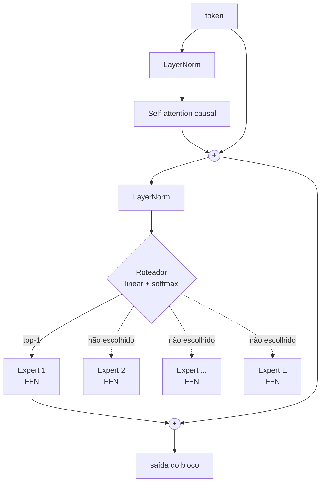
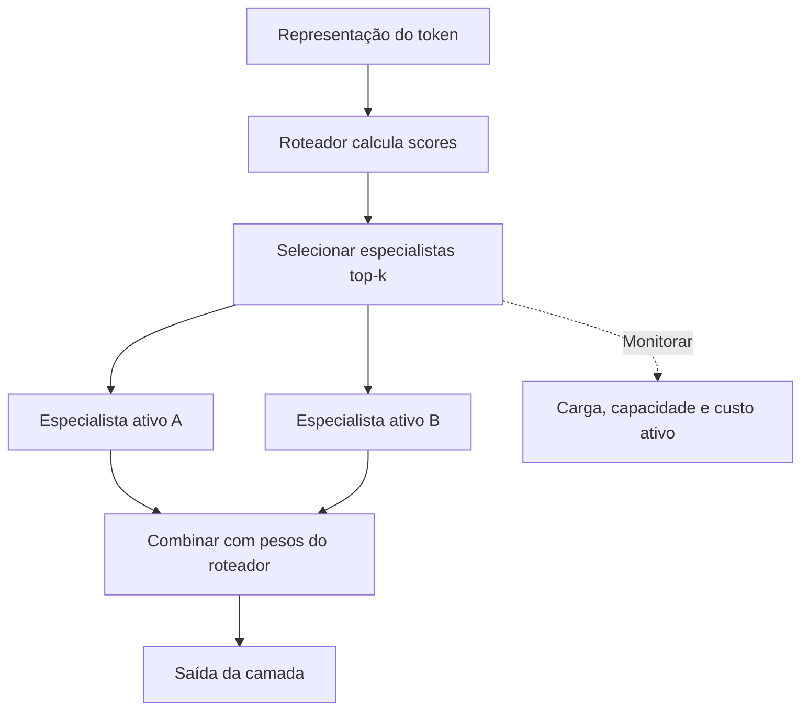
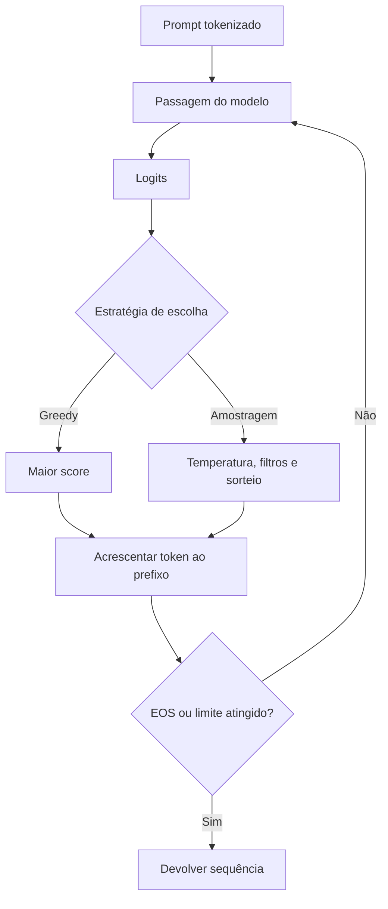
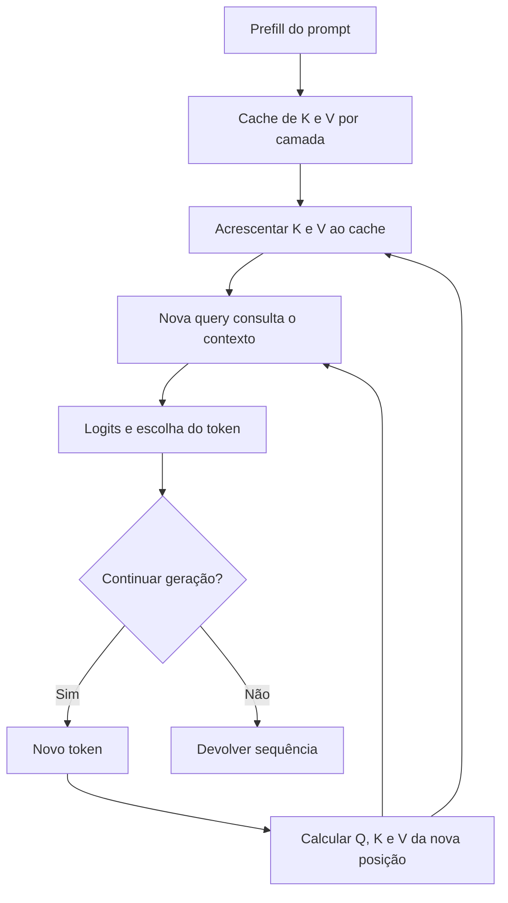
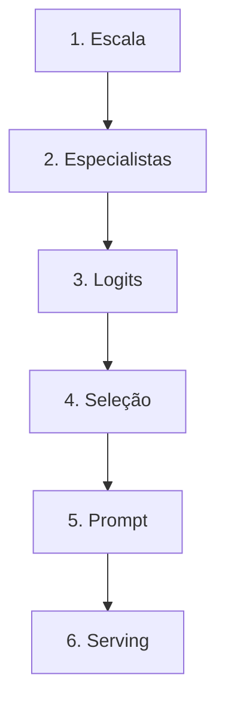

# Especificação de slides — Aula 10 (V2)

> **Rebalanceamento V2.** Esta é a aula mais densa do curso e a que cobre mais assuntos —
> escala, MoE, decodificação e prompting. O risco declarado da V1 era o fluxo virar lista de
> quatro tópicos. A V2 resolve isso com **um único fio**: quatro relatos de defeito, todos do
> mesmo modelo, na mesma semana, e nenhum deles é bug nos pesos. A aula é o diagnóstico dos
> quatro, e o slide 16 fecha os quatro com a causa nomeada.
>
> Toda derivação está na Parte 2 (A.1 a A.6), mais detalhada do que estava na V1. Nada de
> matemática foi perdido — foi realocado. Carga horária, numeração dos slides e objetivos de
> aprendizagem permanecem os da V1.

<!-- SLIDE-FLOW:GUIDE:BEGIN -->
## Fluxogramas na produção dos slides

As orientações abaixo complementam o campo **Visual** dos slides indicados. Produzir os fluxogramas no próprio deck, como formas e conectores editáveis ou gráficos vetoriais; a biblioteca completa ao final torna esta especificação independente do portal.

- **Referência de composição:** título e propósito no topo, blocos numerados, conexões rotuladas, ramificações legíveis e uma saída identificada. Usar apenas o padrão visual da referência fornecida, sem importar seu assunto ou seus exemplos.
- **Tema do deck:** manter o fundo escuro e a paleta já especificada para a aula. Usar `#5b8cff` para o trecho ativo, tons neutros para o contexto e `#e2231a` conforme o significado definido no deck. Cor sempre acompanhada de rótulo.
- **Leitura:** entrada no topo ou à esquerda; saída na base ou à direita. Decisões em losangos, alternativas com rótulos e retornos apontando à etapa correta. Ramos paralelos convergem apenas onde seus resultados realmente são combinados.
- **Densidade:** no fluxo principal, projetar 3–6 blocos curtos por enquadramento, com corpo legível na última fileira. Um mapa maior pode ser revelado por etapas no mesmo slide. Detalhes, condições e explicações completas ficam nas notas; não reduzir a fonte para caber tudo.
- **Semântica:** mapas de percurso mostram ordem de estudo, não execução de um algoritmo. Manter separadas preparação e aplicação, treino e inferência, sequência e alternativas. Não transformar uma etapa opcional em obrigatória.
- **Integração:** o fluxograma substitui uma lista redundante ou ocupa o campo Visual; não cobre matrizes, tabelas, gráficos nem código indispensáveis. Preservar títulos, numeração, duração e referências aos apêndices.
- **Produção:** os blocos Mermaid abaixo são especificações do desenho. Renderizar/reconstruir como diagrama, nunca projetar o código Mermaid. Manter rótulos, bifurcações, retornos e limites declarados. Não transformar este caderno técnico em slides adicionais.
- **Ligação com o portal:** os mapas de mecanismo compartilham o conteúdo dos fluxogramas do portal. Em demonstrações, usar o mesmo vocabulário no deck e no controle interativo para facilitar a passagem entre os dois.
<!-- SLIDE-FLOW:GUIDE:END -->

## Diretrizes visuais

- **Tema:** escuro, accent `#e2231a` (vermelho CESAR), accent secundário `#5b8cff`.
- **Tipografia:** sans-serif para texto; monoespaçada para código, fórmulas e distribuições
  de probabilidade.
- **Densidade:** máximo 5 linhas de texto por slide no fluxo. Um conceito por slide.
  Nesta aula a disciplina do deck é o que impede a aula de virar leitura de bullet.
- **No fluxo principal:** a fórmula aparece **enunciada e lida**, nunca manipulada. Toda
  fórmula vem acompanhada do número que ela produz ou do comportamento que ela prevê.
- **No apêndice:** densidade alta é esperada e desejável. É material de consulta.
- **Proibido:** bullets genéricos ("Vantagens", "Desvantagens"); slide-parede de texto;
  gráfico sem eixo rotulado; qualquer número de modelo comercial fechado que não seja público;
  fórmula sem consequência prática no fluxo principal.
- **Marcador de ticket:** os quatro relatos de defeito do slide 1 recebem um selo visual
  (`T1`, `T2`, `T3`, `T4`) que reaparece **no canto** de cada slide que fecha aquele ticket.
  É o fio narrativo visível — sem ele, a aula parece quatro aulas.
- **Distribuições de probabilidade:** sempre barras horizontais ordenadas, com o valor
  numérico ao lado. É o objeto visual recorrente do Bloco 2 e precisa ser idêntico em todos
  os slides que o usam.

## Arco narrativo

O deck abre com quatro relatos de defeito escritos como chamados de suporte: um prompt que
funciona numa temperatura e produz lixo em outra; um modelo que repete a mesma frase para
sempre com `T = 0`; um modelo anunciado com 47 B de parâmetros que custa como um de 13 B na
inferência; e uma janela de 128 k em que o meio do documento é ignorado. Nenhum dos quatro é
bug. Os quatro são **decisões** — e a aula é a diagnose dos quatro.

O ticket do 47 B abre o Bloco 1, que responde pela escala: o triângulo `N`/`D`/`C`, o
orçamento `C ≈ 6ND`, a restrição de memória que virou arquitetura, e o Mixture of Experts com
seu roteador não supervisionado. No slide 7 o deck vira: os pesos congelam, e os três tickets
restantes se resolvem inteiramente do lado de fora deles. Fecha com os quatro tickets
encerrados e a frase que organiza o Módulo 2: um LLM em produção não é um arquivo de pesos, é
um arquivo de pesos mais um punhado de decisões.

---

# PARTE 1 — FLUXO PRINCIPAL

*O que se apresenta em aula. 16 slides, ~100 minutos com demo e exercício.*

### Slide 1 — Abertura: quatro chamados, um modelo, nenhum bug
- **Tipo:** problema (abertura)
- **Título:** Quatro defeitos, e nenhum deles está nos pesos
- **Conteúdo:** Quatro relatos de defeito, na tela, como chegariam na sua fila:
  ```
  T1  "o mesmo prompt responde bem com temperatura 0,7 e devolve lixo com 1,4.
       ninguém alterou o modelo."
  T2  "com temperatura 0 o modelo entrou em loop: repetiu a mesma frase até o
       limite de tokens."
  T3  "o cartão diz 47 B de parâmetros, mas na inferência ele custa como um de
       13 B. o número está errado?"
  T4  "contexto de 128 k, o documento cabe inteiro, e o modelo ignora o que está
       no meio dele."
  ```
  Nenhum dos quatro é bug de implementação. Nenhum dos quatro se resolve retreinando. Os
  quatro têm causa conhecida, nome próprio e conta associada — e as quatro contas são o
  conteúdo desta aula.
- **Frase-tese:** Quatro defeitos, um modelo, nenhum bug. Todos os quatro são consequências
  de decisões que alguém tomou e não anotou.
- **Visual:** quatro cartões de chamado em fila, cada um com o selo `T1`…`T4` em accent.
  Abaixo, uma linha só: "mesma máquina · mesmos pesos · mesma semana". Rodapé em accent:
  "aula mais densa do curso — o Lab 3, amanhã, consolida."
- **Notas do apresentador:** Ler os quatro em voz alta e **não** responder nenhum. O aviso de
  densidade é deliberado: turma avisada aguenta mais que turma surpreendida. Ancorar no Lab 2
  em uma frase — a arquitetura que eles escreveram é a mesma — sem recapitular o lab.

### Slide 2 — O ticket 3: quando o tamanho não prevê o custo
- **Tipo:** comparação
- **Título:** Grande é um triângulo, não um número
- **Conteúdo:** O chamado `T3` está certo nas duas metades: o modelo **tem** 47 B de
  parâmetros e **custa** como um de 13 B por token. Isso já basta para matar a métrica que
  quase todo mundo usa: contar parâmetros não prevê custo, não prevê qualidade e não prevê
  memória. Os três eixos que precisam ser lidos juntos:
  **N** parâmetros (capacidade) · **D** tokens de treino (experiência) · **C** computação (o
  produto). Comparação de referência, com números públicos: mini-GPT do Lab 2 — `2,7 M`
  parâmetros, `~1 MB` de texto, minutos de GPU. GPT-3 — `175 B` parâmetros, `~300 B` tokens,
  `~3,1e23` FLOPs.
- **Frase-tese:** Um número de parâmetros sozinho não prevê custo nem qualidade. É por isso
  que o chamado T3 não é erro de cartão.
- **Visual:** triângulo com os três vértices rotulados `N`, `D`, `C`, e as duas configurações
  plotadas dentro dele em escalas muito diferentes. Ao lado, a tabela comparativa. Selo `T3`
  no canto, aberto.
- **Notas do apresentador:** Números do GPT-3 são do artigo. Se perguntarem tamanho de modelo
  fechado recente: não é público, e não se estima.

### Slide 3 — O orçamento em uma linha
- **Tipo:** dados (o fundamento nomeado)
- **Título:** Seis vezes parâmetros vezes tokens
- **Conteúdo:** As duas contas enunciadas e lidas, sem serem manipuladas:
  ```
  treino:      C ≈ 6 · N · D        FLOPs, no total
  inferência:  C ≈ 2 · N           FLOPs, por token gerado
  ```
  Leitura em português: treinar custa proporcional ao produto de capacidade por experiência;
  gerar um token custa proporcional só à capacidade **ativa**. Aplicado ao GPT-3:
  `6 × 1,75e11 × 3,0e11 ≈ 3,1e23` FLOPs, que é o valor que o próprio artigo reporta. A
  assimetria que explica a economia da área: treinar é caríssimo e acontece **uma vez**;
  inferir é barato por token e acontece um trilhão de vezes.
- **Frase-tese:** Uma conta de guardanapo separa o que se paga uma vez do que se paga para
  sempre — e é a segunda que decide produto.
- **Visual:** as duas linhas em corpo grande, com as potências de dez alinhadas
  verticalmente. Ao lado, duas barras de custo: uma enorme rotulada "uma vez" e uma
  minúscula rotulada "× 10¹² requisições" — a segunda visivelmente maior no acumulado.
- **Fundamento:** o fator 6 vem de contar operações por parâmetro e por token: 2 no forward e
  4 no backward, com a atualização do otimizador fora dessa contagem porque não escala com `D`.
  → contagem completa, com a atualização contabilizada e descartada com justificativa:
  **A.1 da Aula 12**
- **Notas do apresentador:** Fazer a multiplicação devagar na tela, com as potências
  separadas. Turma sem prática de ordem de grandeza erra o expoente e o número perde sentido.
  A derivação do 6 é da Aula 12 e é dela de propósito: aqui a conta é ferramenta, lá é objeto.

### Slide 4 — A restrição que virou arquitetura
- **Tipo:** conceito
- **Título:** 350 GB só de peso
- **Conteúdo:** Uma linha de aritmética muda a conversa: `175e9 parâmetros × 2 bytes (fp16) =
  350 GB`. Só os pesos — sem gradiente, sem estado de otimizador, sem ativação. Não existe
  acelerador individual que segure isso, logo o modelo tem de ser fatiado entre placas para
  **existir**, antes de qualquer discussão sobre velocidade. E a lista das ideias de
  arquitetura que são resposta a memória e banda, não a qualidade: MQA/GQA (Aula 8) ·
  FlashAttention (Aula 12) · MoE (próximo slide) · paged attention (slide 15).
- **Frase-tese:** Metade das ideias de arquitetura dos últimos cinco anos é resposta a
  restrição de memória e banda. Nenhuma delas apareceu por elegância matemática.
- **Visual:** barra de 350 GB contra a barra de memória de um acelerador típico (rotulada com
  a capacidade, não com marca), visivelmente menor. Abaixo, as quatro técnicas como cartões,
  cada um rotulado com **a restrição que ataca**.
- **Notas do apresentador:** A Aula 12 detalha memória e paralelismo. Aqui é só a restrição —
  não abrir o fio de paralelismo, o Bloco 1 estoura.

### Slide 5 — MoE: a peça trocada que fecha o ticket 3

<!-- SLIDE-FLOW:SLIDE:BEGIN -->
- **Fluxograma a incorporar neste slide:** **F00 — MoE: rotear e combinar especialistas**. O desenho e os rótulos completos estão no caderno de fluxogramas ao final deste arquivo.
- **Composição:** integrar ao campo Visual; preservar exemplos, tabelas, fórmulas e dimensões solicitados neste slide. Destacar o trecho relacionado ao título e manter o restante em segundo plano. Os textos detalhados ficam nas notas, sem duplicar a lista de Conteúdo na tela.
<!-- SLIDE-FLOW:SLIDE:END -->

- **Tipo:** diagrama
- **Título:** O FFN vira `E` especialistas e um roteador
- **Conteúdo:** O bloco Transformer da Aula 7, com atenção, norma e residual **em cinza**
  (inalterados) e o FFN destacado, substituído por `E` cópias e um roteador. A distinção que
  responde o chamado `T3`, em duas linhas grandes: **parâmetros totais** = o que ocupa
  memória · **parâmetros ativos por token** = o que custa computação. Num modelo denso os
  dois números são iguais; num MoE eles divergem por uma ordem de grandeza ou mais. Um modelo
  com 8 especialistas e roteamento para 2 tem quase todos os parâmetros no FFN e ativa um
  quarto deles por token — o cartão diz 47 B, a conta de inferência usa ~13 B, e as duas
  coisas são verdade. Referência pública: o Switch Transformer chegou a `1,6 T` de parâmetros
  totais com roteamento **top-1**.
- **Frase-tese:** Ticket 3 fechado: o cartão fala de memória e a fatura fala de computação.
  Confundir os dois é o erro de leitura mais comum da área.
- **Visual:** o diagrama Mermaid abaixo. O importante visualmente é que **só uma caixa muda
  de cor** em relação ao slide da Aula 7. Selo `T3` no canto, agora fechado com um traço.
- **Fundamento:** o roteador é `g = softmax(W_r · x)`, e a saída do bloco é a soma dos `k`
  especialistas escolhidos, ponderada pelos gates renormalizados.
  → mecânica do roteamento top-k, com dimensões e a razão de o gate multiplicar a saída:
  **Apêndice A.4** (slide 20)
- **Notas do apresentador:** A pergunta que sempre vem é "o expert é um modelo separado?".
  Não: é um FFN dentro do mesmo bloco, compartilhando atenção e embeddings. Repetir duas
  vezes se for preciso.



### Slide 6 — O defeito característico do MoE: ninguém supervisiona o roteador

<!-- SLIDE-FLOW:SLIDE:BEGIN -->
- **Fluxograma a incorporar neste slide:** **F00 — MoE: rotear e combinar especialistas**. O desenho e os rótulos completos estão no caderno de fluxogramas ao final deste arquivo.
- **Composição:** integrar ao campo Visual; preservar exemplos, tabelas, fórmulas e dimensões solicitados neste slide. Destacar o trecho relacionado ao título e manter o restante em segundo plano. Os textos detalhados ficam nas notas, sem duplicar a lista de Conteúdo na tela.
<!-- SLIDE-FLOW:SLIDE:END -->

- **Tipo:** conceito (fundamento aplicado a uma falha)
- **Título:** Três favoritos e sessenta pesos mortos
- **Conteúdo:** *Comportamento observável:* o treino roda, a perda desce, e um histograma de
  carga por especialista mostra três barras enormes e sessenta rentes ao zero. O modelo ocupa
  memória de 64 especialistas e usa 3. *Causa:* ninguém rotula qual especialista deve receber
  qual token — o roteador aprende no mesmo gradiente, e isso fecha um laço vicioso: quem
  recebe mais tokens recebe mais gradiente, fica melhor, e passa a receber ainda mais. É o
  **colapso de roteamento**. Duas correções, com o que cada uma é:
  - **Perda auxiliar de balanceamento** — um segundo termo somado à perda de linguagem, que
    penaliza distribuição desigual. Existe para o modelo ser **treinável**, não para melhorar
    o texto.
  - **Fator de capacidade** — teto de tokens por especialista por lote; o excedente é
    descartado (*token dropping*) e segue pela conexão residual sem passar por especialista
    nenhum.
- **Frase-tese:** Deixado sozinho, o roteador elege três favoritos e joga o resto do modelo
  no lixo — e a perda de linguagem não reclama.
- **Visual:** o laço de retroalimentação como ciclo fechado de quatro setas em accent. Ao
  lado, os dois histogramas de carga por especialista, com eixos rotulados (especialista ×
  tokens recebidos): "sem perda auxiliar" e "com perda auxiliar".
- **Fundamento:** a perda auxiliar vale **1** quando a carga está perfeitamente balanceada e
  vale **`E`** no colapso total — a razão entre o valor medido e 1 é uma leitura direta de
  quão desbalanceado o roteamento está.
  → a perda auxiliar escrita, com os dois casos-limite calculados e o fator de capacidade:
  **Apêndice A.4** (slide 20)
- **Notas do apresentador:** Ponto de maior densidade do Bloco 1. Se o relógio marcar 00:50,
  cortar capacidade e token dropping — o coração é o laço. Intervalo depois deste slide, e
  anunciar que o Bloco 2 fecha os três tickets restantes, porque a sala precisa de motivo
  para voltar.

### Slide 7 — [Transição] O treino acabou. Alguém ainda precisa escolher o token.

<!-- SLIDE-FLOW:SLIDE:BEGIN -->
- **Fluxograma a incorporar neste slide:** **F01 — Geração autorregressiva**. O desenho e os rótulos completos estão no caderno de fluxogramas ao final deste arquivo.
- **Composição:** integrar ao campo Visual; preservar exemplos, tabelas, fórmulas e dimensões solicitados neste slide. Destacar o trecho relacionado ao título e manter o restante em segundo plano. Os textos detalhados ficam nas notas, sem duplicar a lista de Conteúdo na tela.
<!-- SLIDE-FLOW:SLIDE:END -->

- **Tipo:** transição
- **Título:** Pesos congelados. Três tickets em aberto.
- **Conteúdo:** Daqui para frente nenhum peso é tocado, e os três tickets restantes se
  resolvem inteiramente do lado de fora deles. As quatro alavancas, numeradas, sem detalhe:
  **1. Decodificação** — como escolho o token na distribuição (`T1`, `T2`) ·
  **2. Prompting** — o que escrevo no prompt ·
  **3. Contexto** — o que entra e onde (`T4`) ·
  **4. Serving** — como o modelo é executado.
- **Frase-tese:** O modelo não gera texto. Ele gera uma distribuição — e texto é o que o meu
  algoritmo faz com ela.
- **Visual:** slide quase vazio. Um bloco `PESOS` com um cadeado, e as quatro alavancas
  desenhadas como alavancas mesmo, fora do bloco. Os selos `T1`, `T2`, `T4` pendurados nas
  alavancas correspondentes. Nada mais.
- **Notas do apresentador:** Slide de virada, 2 min. Se o Bloco 1 estourou, este pode ser
  dito em 40 s sem perda.

### Slide 8 — O ticket 2: o modelo que repete a mesma frase para sempre

<!-- SLIDE-FLOW:SLIDE:BEGIN -->
- **Fluxograma a incorporar neste slide:** **F01 — Geração autorregressiva**. O desenho e os rótulos completos estão no caderno de fluxogramas ao final deste arquivo.
- **Composição:** integrar ao campo Visual; preservar exemplos, tabelas, fórmulas e dimensões solicitados neste slide. Destacar o trecho relacionado ao título e manter o restante em segundo plano. Os textos detalhados ficam nas notas, sem duplicar a lista de Conteúdo na tela.
<!-- SLIDE-FLOW:SLIDE:END -->

- **Tipo:** conceito (fundamento aplicado a uma falha)
- **Título:** Temperatura zero, e o modelo entra em loop
- **Conteúdo:** *Comportamento observável:* com `T = 0` a geração entra em ciclo — a mesma
  frase repetida até o limite de tokens. Não há aleatoriedade envolvida, então não é ruído de
  amostragem. *Causa:* a regra é `argmax` a cada passo, e ela é **determinística e local**.
  Se o estado gerado reaparece, a escolha reaparece, e o ciclo se fecha; nada na regra local
  tem como perceber que o texto está preso. E o problema mais profundo, do qual o loop é o
  sintoma extremo: a sequência formada pelas escolhas mais prováveis **não é**, em geral, a
  sequência mais provável. Um token de `0,6` pode conduzir a um beco onde toda continuação é
  ruim, enquanto um de `0,4` abriria um caminho melhor. Alerta: chamar greedy de "temperatura
  zero" é verdade no limite e esconde o ponto — o problema não é ruído, é **horizonte**.
- **Frase-tese:** Ticket 2 fechado: greedy é descer a montanha sempre pelo passo mais
  íngreme. Você chega a *um* vale — e, no pior caso, anda em círculo dentro dele.
- **Visual:** à esquerda, a saída em loop com a frase repetida quatro vezes, destacada. À
  direita, a árvore de dois níveis: raiz com ramos `0,6` e `0,4`; o de `0,6` leva a duas
  continuações de `0,5` (conjunta `0,30`), o de `0,4` leva a uma de `0,9` (conjunta `0,36`).
  Marcar o caminho de greedy e o caminho ótimo em cores diferentes. Selo `T2` fechado.
- **Fundamento:** a probabilidade de uma sequência é o **produto** das probabilidades dos
  tokens, e maximizar cada fator não maximiza o produto.
  → o escore de sequência escrito, a normalização por comprimento e o exemplo numérico
  completo desta árvore: **Apêndice A.3** (slide 19)
- **Notas do apresentador:** Desenhar a árvore no quadro em 30 s antes de projetar — ela
  volta na demo (passo 5). Se alguém perguntar como se resolve o loop na prática: penalidade
  de repetição, e ela é remendo, não solução — a solução é não usar `argmax` em geração aberta.

### Slide 9 — Beam search: acerta o alvo errado

<!-- SLIDE-FLOW:SLIDE:BEGIN -->
- **Fluxograma a incorporar neste slide:** **F01 — Geração autorregressiva**. O desenho e os rótulos completos estão no caderno de fluxogramas ao final deste arquivo.
- **Composição:** integrar ao campo Visual; preservar exemplos, tabelas, fórmulas e dimensões solicitados neste slide. Destacar o trecho relacionado ao título e manter o restante em segundo plano. Os textos detalhados ficam nas notas, sem duplicar a lista de Conteúdo na tela.
<!-- SLIDE-FLOW:SLIDE:END -->

- **Tipo:** comparação
- **Título:** A sequência mais provável é a mais banal
- **Conteúdo:** A correção óbvia da miopia é não escolher já: manter `B` hipóteses vivas,
  expandir todas e podar por probabilidade acumulada. Funciona muito bem onde a resposta é
  essencialmente única — tradução, transcrição — e foi lá que a técnica nasceu. Em geração
  aberta ela falha de dois jeitos, e os dois têm nome:
  - **Viés por saídas curtas** — todo fator do produto é menor que 1, logo sequências longas
    são penalizadas por **aritmética**, não por qualidade. Número concreto: uma resposta
    genérica de 5 tokens com `0,7` cada vale `0,168`; uma resposta boa de 20 tokens com `0,9`
    cada vale `0,122`. A pior ganha.
  - **Viés por saídas genéricas** — a sequência mais provável é a mais previsível, e o mais
    previsível é o mais banal.
  E a medição que derruba o pressuposto inteiro: texto humano **não** maximiza probabilidade
  — a surpresa de texto escrito por gente é irregular e claramente diferente de zero.
- **Frase-tese:** Buscar o máximo de probabilidade é buscar uma coisa que não parece escrita
  por gente. Quando esse pressuposto cai, a alternativa deixa de ser buscar melhor — passa a
  ser amostrar.
- **Visual:** dois painéis. Esquerda: curva de surpresa por posição de texto humano
  (irregular, acima de zero) contra a de beam search (baixa e plana), eixos rotulados.
  Direita: os dois números `0,168` e `0,122` lado a lado, com a resposta curta marcada como
  vencedora e um X vermelho sobre a palavra "vencedora".
- **Fundamento:** o escore normalizado por comprimento é `log P(y) / |y|^λ`, e o expoente `λ`
  é ajustado à mão — é remendo com nome de hiperparâmetro.
  → o escore, a origem exata do viés e o mesmo exemplo refeito com normalização:
  **Apêndice A.3** (slide 19)
- **Notas do apresentador:** Se alguém citar que tradução usa beam até hoje, concordar na
  hora — o ponto não é que beam é ruim, é que ele é ótimo para resposta única e péssimo para
  geração aberta. Referência do argumento: Holtzman et al., *The Curious Case of Neural Text
  Degeneration* (arXiv 1904.09751).

### Slide 10 — O ticket 1: a mesma configuração que funciona e não funciona

<!-- SLIDE-FLOW:SLIDE:BEGIN -->
- **Fluxograma a incorporar neste slide:** **F01 — Geração autorregressiva**. O desenho e os rótulos completos estão no caderno de fluxogramas ao final deste arquivo.
- **Composição:** integrar ao campo Visual; preservar exemplos, tabelas, fórmulas e dimensões solicitados neste slide. Destacar o trecho relacionado ao título e manter o restante em segundo plano. Os textos detalhados ficam nas notas, sem duplicar a lista de Conteúdo na tela.
<!-- SLIDE-FLOW:SLIDE:END -->

- **Tipo:** dados (fundamento aplicado a um sintoma)
- **Título:** Temperatura é botão de variância, não de criatividade
- **Conteúdo:** *Comportamento observável:* o mesmo prompt, o mesmo modelo, e a qualidade
  desaba entre `T = 0,7` e `T = 1,4`. *Causa:* a temperatura divide os logits **antes** do
  softmax, e o que ela faz é transferir massa de probabilidade para a cauda. A cauda contém,
  no mesmo pacote, as escolhas interessantes e as erradas — não existe botão que separe as
  duas. Os regimes, enunciados: `T < 1` concentra · `T > 1` achata · `T → 0` recupera greedy
  (e o ticket 2) · `T → ∞` tende ao uniforme. Dois avisos que valem horas de depuração: a
  divisão é **nos logits** (dividir a probabilidade depois do softmax não é a mesma operação);
  e o **ranking dos tokens nunca muda** com temperatura — só as distâncias entre eles.
- **Frase-tese:** Ticket 1 fechado: ninguém mexeu no modelo. Alguém aumentou a variância e
  chamou isso de criatividade.
- **Visual:** a mesma distribuição de 10 candidatos em quatro painéis lado a lado, com
  `T = 0,2 · 0,7 · 1,0 · 1,5`. **Ordem das barras idêntica nos quatro** — esse paralelismo
  visual é o slide. Selo `T1` fechado.
- **Fundamento:** `p_i = softmax(z_i / T)`, com `T → 0` concentrando toda a massa no maior
  logit e `T → ∞` levando à distribuição uniforme.
  → derivação dos dois limites, prova de que o ranking é preservado e o efeito sobre a
  entropia: **Apêndice A.1** (slide 17)
- **Notas do apresentador:** A turma frequentemente acha que temperatura alta muda quem é o
  mais provável. Não muda — apontar com o dedo a ordem idêntica nos quatro painéis. O efeito
  sobre a entropia é a conta que o Lab 3 de amanhã pede (A.1 de lá).

### Slide 11 — [Exercício] Qual botão, e que evidência confirma
- **Tipo:** exercício
- **Título:** 8 minutos, três chamados, um botão cada
- **Conteúdo:** Antes de decidir, a régua: **top-k** mantém os `k` mais prováveis e
  renormaliza — `k` fixo, distribuição variável; **top-p (nucleus)** mantém o menor conjunto
  cuja probabilidade acumulada **atinge** `p`, e renormaliza — tamanho adaptativo. Três
  chamados novos; para cada um, a dupla escreve **qual parâmetro mexer** e **que medição
  confirmaria** o diagnóstico:
  1. Um resumidor devolve texto correto e chatíssimo, sempre com a mesma estrutura de frase.
     Configuração atual: `T = 0,3`, `top_p = 1,0`.
  2. Um gerador de descrições de produto acerta 9 de 10 e na décima inventa um atributo que
     não existe. Configuração atual: `T = 1,3`, `top_p = 1,0`.
  3. Um time subiu `T` de `1,0` para `2,0` e o `top_p = 0,9` "parou de cortar". Ninguém mexeu
     no `top_p`.
- **Frase-tese:** Nenhum dos três se resolve derivando. Os três se resolvem sabendo o que
  cada botão faz com a distribuição — e propondo a medição que confirma.
- **Visual:** os três chamados como cartões, cada um com espaço para `parâmetro` e
  `evidência que confirma`. Ao lado, a distribuição de 10 candidatos com a coluna de
  acumulada e uma linha tracejada em `0,9` — sem revelar onde ela cruza. Cronômetro de 5 min.
- **Fundamento:** truncar não é só cortar: é cortar **e renormalizar**, e a temperatura
  altera qual conjunto sobrevive ao corte.
  → as duas regras escritas, o exemplo numérico completo resolvido e o nucleus recalculado
  em `T = 0,5` e `T = 2,0`: **Apêndice A.2** (slide 18)
- **Notas do apresentador:** Condução na Parte 3 do roteiro. Esperado: (1) subir `T` ou baixar
  `top_p` não resolve — o que falta é variância, então subir `T`; confirma-se medindo
  diversidade entre 5 amostras do mesmo prompt; (2) cauda longa demais — cortar por massa com
  `top_p = 0,9`; confirma-se contando quantos candidatos entram no nucleus naquele `T`;
  (3) nada quebrou — `T = 2` achata a distribuição e o nucleus de `0,9` **cresce**; confirma-se
  imprimindo o tamanho do conjunto nos dois `T`. O item 3 é o que separa quem entendeu.
  **Extensão opcional para quem terminar antes:** refazer a conta do nucleus à mão seguindo
  A.2 — é o exercício que na V1 era obrigatório e aqui vira aprofundamento.

### Slide 12 — [Demo] Uma distribuição, seis algoritmos

<!-- SLIDE-FLOW:SLIDE:BEGIN -->
- **Fluxograma a incorporar neste slide:** **F01 — Geração autorregressiva**. O desenho e os rótulos completos estão no caderno de fluxogramas ao final deste arquivo.
- **Composição:** integrar ao campo Visual; preservar exemplos, tabelas, fórmulas e dimensões solicitados neste slide. Destacar o trecho relacionado ao título e manter o restante em segundo plano. Os textos detalhados ficam nas notas, sem duplicar a lista de Conteúdo na tela.
<!-- SLIDE-FLOW:SLIDE:END -->

- **Tipo:** transição para demonstração
- **Título:** Nenhum peso tocado, seis comportamentos
- **Frase-tese:** Mesma distribuição, seis algoritmos, seis comportamentos completamente
  diferentes. E nenhum peso foi tocado.
- **Conteúdo:** Os seis blocos que a demo percorre, como lista numerada em monoespaçada:
  distribuição crua · temperatura `0,2 / 0,7 / 1,0 / 1,5` · `top-k = 3` com a renormalização
  impressa · `top-p = 0,9` em duas distribuições · greedy × beam na árvore do slide 8 ·
  amostragem 5× contra greedy 5×.
- **Visual:** slide de transição quase vazio, com a lista em monoespaçada. O terminal é o
  slide de verdade.
- **Notas do apresentador:** Script `codigo/demo-decodificacao.py`, Python puro, sem rede.
  Rodar na véspera e salvar a saída em `.txt` como plano B. Fonte do terminal em corpo grande.
  A medição que **não** se corta é a do nucleus nas duas distribuições — é a evidência do
  item 3 do exercício.

### Slide 13 — Prompting e aprendizado em contexto
- **Tipo:** conceito
- **Título:** Few-shot não é aula. É crachá.
- **Conteúdo:** Os três modos, com o que cada um custa e o que condiciona: **zero-shot**
  (descrever a tarefa) · **few-shot** (exemplos resolvidos dentro do prompt — o que o GPT-3
  popularizou) · **chain-of-thought** (pedir os passos antes da resposta; mais computação por
  resposta; aprofundado na Aula 16). Em destaque: nenhum peso muda, e nada persiste depois
  que a janela fecha. Nota de prática que muda como se escolhe exemplo: parte relevante do
  ganho de few-shot vem do **formato** e do espaço de rótulos apresentados, não do mapeamento
  correto entrada→saída dos exemplos.
- **Frase-tese:** Aprendizado em contexto é um nome ruim. Nada foi aprendido — fechou a
  janela, não sobrou nada.
- **Visual:** três cartões em progressão (zero → few → CoT), cada um com o prompt
  esquematizado e um contador de tokens crescendo. Abaixo, o bloco `PESOS` com cadeado,
  idêntico ao do slide 7 e **inalterado** nos três cartões.
- **Notas do apresentador:** Se perguntarem por que CoT funciona: mais computação por resposta
  e decomposição explícita. O debate sobre "raciocínio de verdade" é da Aula 16 e consome
  10 min que não existem aqui. O preço do CoT em token é medido amanhã, no Lab 3 (A.2 de lá).

### Slide 14 — O ticket 4: o documento cabe e não é lido
- **Tipo:** dados
- **Título:** O livro na mochila × a página 340
- **Conteúdo:** *Comportamento observável:* janela de 128 k, documento inteiro no contexto,
  e a informação que está no meio é ignorada. *Causa:* janela grande garante que o texto
  **cabe**; não garante que ele seja **usado**. O teste *needle in a haystack* — enfiar uma
  frase-alvo num ponto arbitrário do contexto e pedir que o modelo a recupere — expõe
  sensibilidade posicional: recuperação melhor no início e no fim, pior no meio. Consequência
  de engenharia, e ela é a que vale para o resto do curso: janela grande **não** dispensa
  recuperação. Colocar pouco e relevante vence colocar tudo, e isso é um dos argumentos que
  sustentam RAG (Aulas 18 e 19).
- **Frase-tese:** Ticket 4 fechado: ter o livro na mochila não é lembrar o que está na página
  trezentos e quarenta.
- **Visual:** mapa de calor de recuperação — eixo X: posição da agulha no contexto (início →
  fim); eixo Y: comprimento total do contexto; célula: taxa de recuperação. Ambos os eixos
  rotulados. A "barriga" fria no meio é o slide inteiro. Selo `T4` fechado.
- **Notas do apresentador:** *Needle in a haystack* é avaliação informal da comunidade, não
  artigo canônico — dizer isso se pedirem citação. Para medição publicada: Liu et al.,
  *Lost in the Middle* (arXiv 2307.03172). Slide curto de propósito: é o gancho de RAG, não
  a aula de RAG.

### Slide 15 — Serving: três gargalos, três respostas

<!-- SLIDE-FLOW:SLIDE:BEGIN -->
- **Fluxograma a incorporar neste slide:** **F02 — KV cache: reutilizar o passado**. O desenho e os rótulos completos estão no caderno de fluxogramas ao final deste arquivo.
- **Composição:** integrar ao campo Visual; preservar exemplos, tabelas, fórmulas e dimensões solicitados neste slide. Destacar o trecho relacionado ao título e manter o restante em segundo plano. Os textos detalhados ficam nas notas, sem duplicar a lista de Conteúdo na tela.
<!-- SLIDE-FLOW:SLIDE:END -->

- **Tipo:** comparação
- **Título:** Cache, paginação, especulação
- **Conteúdo:** Três blocos, gargalo → resposta → preço:
  - **KV cache** — recalcular K e V de todo o prefixo a cada token (o desperdício anunciado
    na Aula 6) → guardar K e V por camada → **preço: memória**. Num modelo de 7 B com 32
    camadas, 32 cabeças e `d_head = 128` em fp16, o cache custa `~0,5 MiB por token`; 8 k
    tokens ≈ `4 GiB` **por sequência**. Com dezenas de sequências simultâneas, o cache passa
    o tamanho do modelo. É o termo que MQA/GQA (Aula 8) atacam.
  - **Paged attention** — fragmentação por reservar o pior caso de comprimento → cache em
    blocos de tamanho fixo com tabela de páginas, como memória virtual → permite compartilhar
    prefixos entre requisições.
  - **Decodificação especulativa** — geração é sequencial por construção → um modelo rascunho
    propõe `γ` tokens, o modelo alvo verifica os `γ` num forward e aceita o maior prefixo
    compatível → a distribuição de saída é **idêntica**. Número concreto: com razão de
    aceitação `0,8` e `γ = 4`, saem em média `3,36` tokens por rodada de verificação.
- **Frase-tese:** Decodificação especulativa não aproxima nada. O que se comprou foi
  paralelismo, não qualidade descontada.
- **Visual:** três colunas com um ícone-diagrama cada: memoização (setas reaproveitadas),
  tabela de páginas (blocos com ponteiros), e o par rascunho/verificação (`γ` caixas
  propostas, um corte no primeiro erro).
- **Fundamento:** o cache cresce **linear** no contexto e linear no número de sequências
  simultâneas; e a especulativa troca `γ` passos sequenciais por um paralelo, com ganho
  esperado que depende da razão de aceitação.
  → a conta do cache em regime de serviço, com o ponto em que ele passa os pesos:
  **Apêndice A.6** (slide 22) · a aritmética da especulativa e a razão de aceitação esperada:
  **Apêndice A.5** (slide 21)
- **Notas do apresentador:** **Slide de corte da aula.** A ementa autoriza migrar este bloco
  para os primeiros 30 min do Lab 3. Se 01:46 chegar com o slide 14 aberto, pular para o 16 e
  **anunciar o corte em voz alta** — anunciar é diferente de sumir com o conteúdo, e A.5 e
  A.6 continuam no deck de qualquer forma. Referências: Kwon et al. (arXiv 2309.06180);
  Leviathan et al. (arXiv 2211.17192).

### Slide 16 — Fechamento: quatro tickets, nenhum peso tocado

<!-- SLIDE-FLOW:SLIDE:BEGIN -->
- **Fluxograma a incorporar neste slide:** **F03 — O percurso desta aula**. O desenho e os rótulos completos estão no caderno de fluxogramas ao final deste arquivo.
- **Composição:** integrar ao campo Visual; preservar exemplos, tabelas, fórmulas e dimensões solicitados neste slide. Destacar o trecho relacionado ao título e manter o restante em segundo plano. Os textos detalhados ficam nas notas, sem duplicar a lista de Conteúdo na tela.
<!-- SLIDE-FLOW:SLIDE:END -->

- **Tipo:** encerramento
- **Título:** Pesos + decisões
- **Conteúdo:** Os quatro chamados fechados, com a causa nomeada e onde ela mora:
  ```
  T1  qualidade que desaba entre 0,7 e 1,4   →  temperatura move variância   (A.1)
  T2  loop em T = 0                          →  argmax é local e determinístico (A.3)
  T3  47 B que custa como 13 B               →  totais ≠ ativos, MoE          (A.4)
  T4  128 k e o meio ignorado                →  cabe ≠ é usado                (—)
  ```
  E a síntese em duas colunas. **Escala (muda pesos):** triângulo `N`/`D`/`C` · `C ≈ 6ND` ·
  memória como arquitetura · MoE, totais × ativos, colapso de roteamento.
  **Decisões (pesos congelados):** decodificação · prompting · contexto · serving.
  Mapa do Lab 3 de amanhã em uma linha: temperatura e top-p, greedy × amostragem, few-shot,
  chain-of-thought, custo em tokens, local × API. E o checklist de setup em caixa destacada:
  chave de API com free tier (Groq ou Google AI Studio) · Ollama instalado com um modelo
  pequeno baixado · notebook do lab aberto uma vez.
- **Frase-tese:** Um LLM em produção não é um arquivo de pesos. É um arquivo de pesos mais um
  punhado de decisões — e essas decisões movem qualidade, custo e latência em ordem de
  grandeza.
- **Visual:** os quatro tickets do slide 1, agora com um traço de "resolvido" e a causa
  escrita ao lado. Abaixo, as duas colunas com uma linha vertical separando "muda pesos" de
  "não muda pesos". Base: o checklist de setup em caixa destacada para fotografar. Rodapé:
  "Aula 11 — Lab 3: Decodificação e prompting na prática."
- **Notas do apresentador:** Silêncio de 30 s no checklist para a turma fotografar. Se o slide
  15 foi cortado, dizer aqui explicitamente que ele abre a aula de amanhã. Projetar o índice
  do apêndice por 20 s: são seis itens, e os três que mais voltam são A.1 (temperatura), A.2
  (nucleus) e A.4 (MoE), que são exatamente os três itens cobráveis na prova.
  Leituras: Brown et al., *GPT-3* (arXiv 2005.14165); Fedus et al., *Switch Transformers*
  (arXiv 2101.03961).

---

# PARTE 2 — APÊNDICE MATEMÁTICO

*Material de estudo e consulta. Não se apresenta em aula: reconstrói, com rigor completo,
todo fundamento citado no fluxo. Autossuficiente — quem estuda por aqui sem ter assistido à
aula consegue reconstruir tudo.*

### Slide 17 — A.1 · A temperatura dentro do softmax

<!-- SLIDE-FLOW:SLIDE:BEGIN -->
- **Fluxograma a incorporar neste slide:** **F01 — Geração autorregressiva**. O desenho e os rótulos completos estão no caderno de fluxogramas ao final deste arquivo.
- **Composição:** integrar ao campo Visual; preservar exemplos, tabelas, fórmulas e dimensões solicitados neste slide. Destacar o trecho relacionado ao título e manter o restante em segundo plano. Os textos detalhados ficam nas notas, sem duplicar a lista de Conteúdo na tela.
<!-- SLIDE-FLOW:SLIDE:END -->

- **Tipo:** apêndice — derivação completa e casos-limite
- **Invocado em:** slide 10

**Notação.**
`V` — vocabulário, `|V|` o seu tamanho. `z ∈ ℝ^|V|` — vetor de logits da posição atual, saída
da última camada linear do modelo (**antes** de qualquer normalização).
`T > 0` — temperatura, escalar. `p(T) ∈ ℝ^|V|` — distribuição resultante.
Índices `i`, `j` percorrem o vocabulário; `i*` denota `argmax_i z_i`.

**Premissas.** (i) Os logits são finitos; (ii) `T > 0` estritamente — `T = 0` não é um valor
válido da expressão e precisa ser tratado como limite (ver caso-limite 1), o que é
exatamente o que as bibliotecas fazem quando trocam a amostragem por `argmax`;
(iii) o `argmax` é único. Quando há empate, o limite `T → 0` não é uma distribuição
degenerada num único token, e sim uniforme sobre os empatados — detalhe que quase nunca
importa em ponto flutuante e importa em vocabulário pequeno.

**Definição.**
```
p_i(T) = exp(z_i / T) / Σ_{j=1}^{|V|} exp(z_j / T)
```

**Propriedade 1 — invariância a deslocamento.** Somar uma constante `c` a todos os logits não
muda nada:
```
exp((z_i + c)/T) / Σ_j exp((z_j + c)/T)
  = [exp(c/T) · exp(z_i/T)] / [exp(c/T) · Σ_j exp(z_j/T)]
  = p_i(T)
```
*Consequência prática:* é por isso que a implementação numericamente estável subtrai
`max_j z_j` antes de exponenciar — o resultado é o mesmo e o maior expoente passa a ser 0,
eliminando overflow. Uma implementação que não faz isso estoura com `T` pequeno, porque
`z_i/T` cresce sem limite quando `T → 0`.

**Propriedade 2 — o ranking nunca muda.** Sejam `z_i > z_j`. Então, para todo `T > 0`:
```
z_i / T > z_j / T          (T > 0 preserva a desigualdade)
exp(z_i / T) > exp(z_j / T)   (exp é estritamente crescente)
p_i(T) > p_j(T)            (o denominador é o mesmo e é positivo)
```
∎ A temperatura é uma transformação **monotônica** dos logits seguida de normalização: ela
altera as distâncias entre as probabilidades e **nunca** a ordem. Duas consequências:
temperatura não muda quem é o token mais provável, e temperatura sozinha jamais transforma
uma escolha errada em escolha certa — ela só muda a chance de a errada ser sorteada.

**Caso-limite 1 — `T → 0⁺`: greedy.** Escreva a razão entre a probabilidade de um token
qualquer e a do máximo:
```
p_i(T) / p_{i*}(T) = exp((z_i − z_{i*}) / T)
```
Para `i ≠ i*`, o expoente `(z_i − z_{i*})` é estritamente negativo, e dividido por `T → 0⁺`
tende a `−∞`. Logo a razão tende a 0, e como as probabilidades somam 1:
```
p_{i*}(T) → 1        p_i(T) → 0   para todo i ≠ i*
```
∎ A distribuição vira um vetor indicador no `argmax`: é **exatamente** a decodificação
gulosa. Isso justifica a prática de tratar `T = 0` como greedy, e ao mesmo tempo mostra o que
essa identificação esconde — greedy não é "amostragem sem ruído", é uma regra local e
determinística, cujo problema é o horizonte (ver A.3), não a variância.

**Caso-limite 2 — `T → ∞`: uniforme.** Com `T → ∞`, `z_i/T → 0` para todo `i`, logo
`exp(z_i/T) → 1` e
```
p_i(T) → 1 / |V|
```
∎ A distribuição tende à uniforme sobre o vocabulário **inteiro** — inclusive tokens de
controle, fragmentos de subpalavra e caracteres de outros alfabetos. É por isso que
temperatura muito alta não produz texto criativo: produz ruído sobre o vocabulário. A
qualidade não degrada suavemente até um ponto interessante e depois desaba; ela caminha
monotonicamente para o ruído.

**O que a temperatura faz com a entropia.** A entropia de Shannon da distribuição é
```
H(T) = − Σ_i p_i(T) · log p_i(T)
```
Com o cálculo feito em A.1 do **Lab 3 (Aula 11)**, mostra-se que `H` é **monotonicamente
crescente** em `T`, com os dois extremos já conhecidos: `H(T → 0) = 0` (nenhuma incerteza) e
`H(T → ∞) = log|V|` (incerteza máxima). Este item não repete essa conta — ela é o item de
apêndice do lab, porque lá ela é medida na tela. O que interessa aqui é a leitura: a
temperatura é um controle **contínuo e monotônico de incerteza**, com dois pontos de parada
conhecidos, e "criatividade" não é uma das grandezas envolvidas.

**Os dois erros de implementação, com a conta de cada um.**

*Erro 1 — dividir a probabilidade em vez do logit.* Calcular `softmax(z)` e depois dividir o
vetor de probabilidades por `T`, renormalizando:
```
q_i = (p_i / T) / Σ_j (p_j / T) = p_i / Σ_j p_j = p_i
```
O resultado é **a distribuição original**, para qualquer `T`. O código roda, não levanta
exceção, e o parâmetro de temperatura simplesmente não faz nada. É o erro nº 1 do Checkpoint
1 do Lab 3, e o teste de lá existe para pegá-lo: se o nucleus não muda quando `T` muda, a
divisão está no lugar errado.

*Erro 2 — aplicar temperatura depois do truncamento.* Truncar primeiro (top-k ou top-p) e
depois dividir por `T` não é a mesma operação: a temperatura deixa de influenciar **quais**
tokens sobrevivem ao corte e passa a apenas reescalar os sobreviventes. A conta que mostra o
tamanho do estrago está em A.2, e a ordem em que cada biblioteca aplica os três é uma das
coisas que o Lab 3 obriga a medir em vez de supor.

**Intuição.** `1/T` é um ganho aplicado às diferenças entre logits. Ganho alto (`T` baixo)
amplifica pequenas diferenças até virarem certeza; ganho baixo (`T` alto) comprime diferenças
grandes até virarem indiferença. É literalmente o botão de contraste de uma imagem: não muda
a foto, muda quanto os tons se separam — e no extremo devolve preto e branco puro ou cinza
uniforme.

**De volta ao fluxo:** slide 10.

### Slide 18 — A.2 · Top-k e top-p como truncamento e renormalização

<!-- SLIDE-FLOW:SLIDE:BEGIN -->
- **Fluxograma a incorporar neste slide:** **F01 — Geração autorregressiva**. O desenho e os rótulos completos estão no caderno de fluxogramas ao final deste arquivo.
- **Composição:** integrar ao campo Visual; preservar exemplos, tabelas, fórmulas e dimensões solicitados neste slide. Destacar o trecho relacionado ao título e manter o restante em segundo plano. Os textos detalhados ficam nas notas, sem duplicar a lista de Conteúdo na tela.
<!-- SLIDE-FLOW:SLIDE:END -->

- **Tipo:** apêndice — definição formal e exemplo numérico resolvido
- **Invocado em:** slide 11

**Notação.** `p ∈ ℝ^|V|` — distribuição sobre o vocabulário, com `Σ_i p_i = 1`.
`π` — permutação que ordena `p` em ordem decrescente, de modo que `p_{π(1)} ≥ p_{π(2)} ≥ …`
`S ⊆ V` — conjunto sobrevivente ao truncamento. `q` — distribuição truncada e renormalizada.

**A operação comum aos dois métodos.** Truncar não é zerar: é zerar **e renormalizar**.
```
q_i = p_i / Σ_{j∈S} p_j     se i ∈ S
q_i = 0                     caso contrário
```
A soma no denominador é a **massa retida**. Duas leituras que valem mais que a fórmula:
(i) a probabilidade de cada sobrevivente **sobe**, porque o denominador é menor que 1 — o
token que era marginal fica respeitável; (ii) esquecer a renormalização não zera nada, mas
faz o vetor somar menos que 1, e aí a função de amostragem ou reclama ou sorteia com viés
silencioso. É o erro nº 2 do Checkpoint 1 do Lab 3.

**Top-k — truncamento por posição.**
```
S_k = { π(1), π(2), …, π(k) }
```
`|S_k| = k` sempre, independentemente da forma de `p`. O parâmetro é fixo; a distribuição não é.

**Top-p (nucleus) — truncamento por massa.**
```
S_p = { π(1), …, π(m) }     onde   m = min { n : Σ_{i=1}^{n} p_{π(i)} ≥ p }
```
Leitura literal do `≥`: o token que **cruza** a linha entra no conjunto. É o menor conjunto
cuja acumulada **atinge** `p`, não o maior conjunto que fica abaixo dela — e trocar `≥` por
`>` produz um nucleus sistematicamente menor, que é o erro mais comum de implementação.
`|S_p|` é **adaptativo**: encolhe quando o modelo está confiante, cresce quando está indeciso.

**Exemplo numérico resolvido.** Distribuição de dez candidatos, já ordenada:
```
token           p       acumulada
decodificação   0,32    0,32
prompting       0,24    0,56
a               0,15    0,71
o               0,09    0,80
como            0,07    0,87
modelos         0,05    0,92
temperatura     0,03    0,95
amostragem      0,02    0,97
técnicas        0,02    0,99
isso            0,01    1,00
```

*Top-k = 3.* Sobrevivem `decodificação`, `prompting`, `a`. Massa retida `= 0,32 + 0,24 + 0,15
= 0,71`. Renormalizando:
```
q(decodificação) = 0,32 / 0,71 = 0,4507
q(prompting)     = 0,24 / 0,71 = 0,3380
q(a)             = 0,15 / 0,71 = 0,2113
                                 ------
soma                             1,0000
```
O terceiro colocado tinha `0,15` e passou a ter `0,2113` — **41% mais provável do que era**,
sem que nada tenha mudado no modelo. Truncar redistribui.

*Top-p = 0,9.* A acumulada atinge `0,9` na sexta linha (`0,92`). Logo `|S_p| = 6`:
`decodificação, prompting, a, o, como, modelos`. Massa retida `= 0,92`. Comparação direta:
o nucleus de `0,9` é **maior** que o top-k de 3 nesta distribuição — seis contra três.

**O efeito da temperatura sobre o tamanho do nucleus.** Recuperando logits a menos de
constante (`z_i = log p_i`, legítimo por A.1, propriedade 1), aplicar temperatura equivale a
```
p_i(T) ∝ p_i^{1/T}
```

*Com `T = 2` (achatamento).* Cada `p_i` é elevado a `1/2`, isto é, `√p_i`, e o vetor é
renormalizado. A soma das raízes é `2,7871`, e as probabilidades resultantes são:
```
p(T=2)      0,2030  0,1758  0,1390  0,1076  0,0949  0,0802  0,0621  0,0507  0,0507  0,0359
acumulada   0,2030  0,3788  0,5178  0,6254  0,7203  0,8005  0,8626  0,9133  0,9640  0,9999
```
A acumulada só atinge `0,9` na **oitava** linha. O nucleus passou de **6 para 8 tokens**, com
o mesmo `p = 0,9` e sem ninguém ter tocado nesse parâmetro. ∎ É a resposta do item 3 do
exercício do slide 11: **cresce**.

*Com `T = 0,5` (concentração).* Cada `p_i` é elevado a `2`. A soma dos quadrados é `0,1998`:
```
p(T=0,5)    0,5125  0,2883  0,1126  0,0405  0,0245  0,0125  0,0045  0,0020  0,0020  0,0005
acumulada   0,5125  0,8008  0,9134  0,9539  0,9784  0,9909  0,9954  0,9974  0,9994  0,9999
```
Agora `0,9` é atingido na **terceira** linha: o nucleus caiu de 6 para **3 tokens**.

**Leitura do resultado, e por que ela importa em produção.** `T` e `top_p` **não são
controles independentes**: `T` decide a forma da distribuição, e `top_p` corta uma forma que
`T` acabou de mudar. Subir `T` e manter `top_p` fixo é subir a variância **duas vezes** — uma
pela distribuição achatada, outra pelo conjunto ampliado. É por isso que o Lab 3 manda varrer
os dois numa grade em vez de ajustar um de cada vez, e é por isso que a ordem em que a
biblioteca aplica temperatura, top-k e top-p muda o resultado.

**Casos-limite.**
- **`k = 1`** ou **`p → 0⁺`**: sobrevive um token só, e a amostragem vira `argmax`. Os dois
  parâmetros têm um valor que recupera greedy, exatamente como `T → 0` (A.1) — três caminhos
  para o mesmo comportamento, com três nomes diferentes na documentação.
- **`k ≥ |V|`** ou **`p = 1`**: nada é cortado, `q = p`, e o parâmetro não faz nada. É o
  estado padrão de muitas bibliotecas, e é por isso que `top_p = 1,0` numa configuração
  documentada não é "top-p ligado no máximo": é top-p desligado.
- **Distribuição uniforme** (`p_i = 1/|V|`): o nucleus de `0,9` contém `⌈0,9·|V|⌉` tokens, ou
  seja, quase o vocabulário inteiro. Nucleus não protege de um modelo que não sabe nada.
- **Distribuição quase determinística** (`p_{π(1)} = 0,95`): o nucleus de `0,9` tem **um**
  token. Aqui top-p é mais agressivo que `top-k = 3`, o inverso do exemplo acima — e é essa
  inversão que torna o nucleus adaptativo.

**De volta ao fluxo:** slide 11.

### Slide 19 — A.3 · O escore de sequência, o viés por curto e a normalização

<!-- SLIDE-FLOW:SLIDE:BEGIN -->
- **Fluxograma a incorporar neste slide:** **F01 — Geração autorregressiva**. O desenho e os rótulos completos estão no caderno de fluxogramas ao final deste arquivo.
- **Composição:** integrar ao campo Visual; preservar exemplos, tabelas, fórmulas e dimensões solicitados neste slide. Destacar o trecho relacionado ao título e manter o restante em segundo plano. Os textos detalhados ficam nas notas, sem duplicar a lista de Conteúdo na tela.
<!-- SLIDE-FLOW:SLIDE:END -->

- **Tipo:** apêndice — derivação e exemplos numéricos
- **Invocado em:** slides 8 e 9

**Notação.** `y = (y_1, …, y_n)` — sequência gerada de comprimento `n = |y|`.
`x` — prompt. `p(y_t | y_{<t}, x)` — probabilidade condicional do token `t`.
`B` — largura do feixe (número de hipóteses vivas). `λ ≥ 0` — expoente de normalização.

**Premissas.** (i) O modelo é autorregressivo, logo a probabilidade conjunta fatora exatamente
pela regra da cadeia — sem aproximação; (ii) todos os fatores são estritamente positivos, o
que vale porque o softmax nunca devolve zero exato; (iii) as sequências comparadas terminam
em token de fim, de modo que a comparação é entre sequências completas.

**O escore de uma sequência.** Pela regra da cadeia:
```
P(y | x) = Π_{t=1}^{n} p(y_t | y_{<t}, x)
```
Como o produto de muitos números pequenos subborda em ponto flutuante, trabalha-se em log:
```
log P(y | x) = Σ_{t=1}^{n} log p(y_t | y_{<t}, x)
```

**De onde vem o viés por saídas curtas — a conta.** Cada fator satisfaz `0 < p ≤ 1`, logo
cada termo da soma satisfaz `log p ≤ 0`. Acrescentar um token à sequência acrescenta um termo
não positivo:
```
log P(y_1…y_{n+1}) = log P(y_1…y_n) + log p(y_{n+1} | …)  ≤  log P(y_1…y_n)
```
∎ **O escore é monotonicamente não crescente no comprimento.** Não porque sequências longas
sejam piores, mas porque somar termos negativos diminui a soma. Um algoritmo que maximiza
`log P` prefere sequências curtas **por aritmética**, e essa preferência não tem relação
nenhuma com qualidade. Igualdade só ocorre no caso degenerado `p = 1`, isto é, quando o
modelo tem certeza absoluta — que não acontece.

**Exemplo numérico 1 — a resposta genérica curta vence a boa e longa.**
Resposta A: 5 tokens, cada um com `p = 0,7` (uma resposta banal, que o modelo acha bastante
provável em cada posição). Resposta B: 20 tokens, cada um com `p = 0,9` (uma resposta
específica e bem escrita, que o modelo acha **mais** provável token a token).
```
P(A) = 0,7^5  = 0,16807
P(B) = 0,9^20 = 0,12158
```
`P(A) > P(B)`. A resposta cujos tokens são **individualmente menos prováveis** ganha, porque
tem menos fatores. É o viés por comprimento em duas linhas de aritmética — e note que ele
aparece mesmo quando B é melhor sob qualquer critério por token.

**A normalização por comprimento.** O remendo padrão divide o escore por uma potência do
comprimento:
```
s(y) = log P(y | x) / |y|^λ
```
- `λ = 0` recupera o escore cru, com o viés intacto.
- `λ = 1` transforma o escore na **média** de `log p` por token, o que remove o viés de
  comprimento por construção.
- `0 < λ < 1` é o que se usa na prática, tipicamente entre `0,6` e `1,0`, ajustado **à mão**
  por tarefa e por conjunto de validação.

*O mesmo exemplo, com `λ = 1`:*
```
s(A) = 5·ln(0,7)  / 5  = ln 0,7  = −0,3567
s(B) = 20·ln(0,9) / 20 = ln 0,9  = −0,1054
```
Agora `s(B) > s(A)` e a resposta boa ganha. ∎ A normalização funciona — e é exatamente isso
que a torna suspeita: ela é um parâmetro livre que se ajusta até o resultado ficar bom, e não
um princípio derivado de algo. Chamá-la de remendo não é desdém, é classificação honesta:
não há teoria que diga qual `λ` é o certo.

**Exemplo numérico 2 — a miopia de greedy, na árvore do slide 8.**
```
raiz ──0,6──► A ──0,5──► "A1"      conjunta: 0,6 × 0,5 = 0,30
         │        └─0,5──► "A2"      conjunta: 0,6 × 0,5 = 0,30
         └──0,4──► B ──0,9──► "B1"   conjunta: 0,4 × 0,9 = 0,36
```
Greedy escolhe `A` no primeiro passo, porque `0,6 > 0,4`, e termina com escore `0,30`. A
sequência de maior probabilidade conjunta é `B1`, com `0,36`. ∎ **A sequência das escolhas
mais prováveis não é a sequência mais provável.** Beam search com `B = 2` encontra `B1`,
porque mantém o ramo de `0,4` vivo até o segundo passo — e é essa a correção que ele oferece.

**Por que corrigir a miopia não resolve o problema.** Beam search passa a otimizar
corretamente `log P(y)` — e aí aparece o segundo viés, que é conceitual e não aritmético: a
sequência de maior probabilidade sob um modelo de linguagem é a **mais previsível**, e o mais
previsível é o mais banal. Some-se a isso a medição de Holtzman et al.: a surpresa
(`−log p` por posição) de texto escrito por humanos é irregular e claramente afastada de
zero, enquanto a de texto de beam search é baixa e plana. Se texto humano não maximiza
probabilidade, então **buscar o máximo é buscar o objeto errado**, e nenhum ajuste de `λ`
conserta isso. A conclusão que a área tirou dessa medição é a que organiza o Bloco 2 da aula:
troca-se busca por **amostragem**, e a partir daí o problema passa a ser controlar a cauda —
que é A.1 e A.2.

**Casos-limite.**
- **`B = 1`**: beam search **é** greedy. Toda a diferença entre os dois é o número de
  hipóteses mantidas.
- **`B → |V|^n`**: busca exaustiva, e o escore encontrado é o máximo global — o que só torna
  o viés genérico mais forte, não mais fraco. Mais busca piora o resultado percebido, o que é
  a assinatura de um objetivo errado.
- **`λ → ∞`**: a normalização domina e o algoritmo passa a preferir sequências longas
  independentemente do conteúdo. O expoente tem um ótimo interior, e ele é empírico.
- **Loop em greedy** (o ticket 2): se o estado condicionante volta a ser o mesmo, `argmax`
  devolve o mesmo token, e a sequência entra em ciclo. Nenhuma normalização de comprimento
  ataca isso, porque o problema não é escore de sequência: é a regra ser determinística e
  sem memória do que já foi emitido. Penalidade de repetição é o remendo usual, e é remendo.

**De volta ao fluxo:** slide 9.

### Slide 20 — A.4 · Roteamento top-k, a perda auxiliar e o que o colapso faz com ela

<!-- SLIDE-FLOW:SLIDE:BEGIN -->
- **Fluxograma a incorporar neste slide:** **F00 — MoE: rotear e combinar especialistas**. O desenho e os rótulos completos estão no caderno de fluxogramas ao final deste arquivo.
- **Composição:** integrar ao campo Visual; preservar exemplos, tabelas, fórmulas e dimensões solicitados neste slide. Destacar o trecho relacionado ao título e manter o restante em segundo plano. Os textos detalhados ficam nas notas, sem duplicar a lista de Conteúdo na tela.
<!-- SLIDE-FLOW:SLIDE:END -->

- **Tipo:** apêndice — derivação, dois casos-limite calculados e o fator de capacidade
- **Invocado em:** slides 5 e 6

**Notação.**
`E` — número de especialistas do bloco. `k` — quantos recebem cada token (`k = 1` no Switch,
`k = 2` é comum). `x ∈ ℝ^d` — representação do token na entrada da camada MoE.
`W_r ∈ ℝ^(d×E)` — matriz do roteador (uma camada linear, sem viés na formulação usual).
`g ∈ ℝ^E` — vetor de gates. `T` — número de tokens do lote.
`f_i` — fração dos tokens do lote roteados ao especialista `i`. `P_i` — probabilidade média
que o roteador atribui ao especialista `i` no lote. `α` — peso da perda auxiliar.

**Premissas.** (i) Os especialistas são FFNs de arquitetura idêntica, diferindo só nos pesos;
(ii) atenção, normalizações e residual do bloco são **inalterados** em relação ao bloco denso
da Aula 7 — MoE é uma troca de peça, não uma arquitetura nova; (iii) o roteamento é por
**token**, não por sequência, o que é o que torna o balanceamento um problema de lote.

**O roteador.**
```
g = softmax(W_rᵀ x) ∈ ℝ^E        Σ_i g_i = 1
```
Seleciona-se o conjunto `K = topk(g, k)` dos `k` maiores gates, e a saída do bloco é
```
y = Σ_{i ∈ K} ĝ_i · E_i(x)        com   ĝ_i = g_i / Σ_{j ∈ K} g_j
```
A renormalização `ĝ` é a mesma operação de A.2 — truncar e renormalizar —, aplicada agora a
gates em vez de a probabilidades de token.

**Por que o gate multiplica a saída.** A operação `topk` é uma seleção discreta: ela não tem
derivada útil, e nenhum gradiente flui pelo *ato de escolher*. O que faz o roteador aprender
é o gate aparecer **multiplicando** a saída do especialista escolhido: o gradiente da perda
em relação a `ĝ_i` é a projeção do gradiente da saída sobre `E_i(x)`, e por essa via `W_r`
recebe sinal. Consequência que explica o laço vicioso do slide 6: o roteador só recebe
gradiente pelos especialistas que ele **já** escolheu. Quem nunca é escolhido não gera sinal,
e sobre quem não gera sinal o roteador não aprende nada — nem que era bom.

**A perda auxiliar de balanceamento.** Definem-se, por lote:
```
f_i = (1/T) · Σ_{t=1}^{T} 1[ i ∈ K(x_t) ]        (fração de tokens que foram para i)
P_i = (1/T) · Σ_{t=1}^{T} g_i(x_t)               (probabilidade média atribuída a i)
```
e a perda auxiliar, somada à perda de linguagem com peso `α` pequeno (a ordem usual é `1e-2`):
```
L_aux = α · E · Σ_{i=1}^{E} f_i · P_i
```
*Por que `f · P` e não só `f`.* `f_i` é uma contagem e não tem gradiente útil (vem de um
`topk`). `P_i` tem. O produto é o truque que faz a penalidade ser **diferenciável**: o
gradiente chega ao roteador por `P_i`, enquanto `f_i` age como um peso medido que diz "este
especialista já está sobrecarregado". Empurrar `P_i` para baixo onde `f_i` é alto é
exatamente o que se quer.

**Caso-limite 1 — carga perfeitamente balanceada.** Com `f_i = P_i = 1/E` para todo `i`:
```
Σ_i f_i · P_i = E · (1/E) · (1/E) = 1/E
L_aux / α     = E · (1/E) = 1
```

**Caso-limite 2 — colapso total.** Todos os tokens vão para o especialista 1, e o roteador
está confiante nisso: `f_1 = 1`, `P_1 ≈ 1`, e `f_i = P_i ≈ 0` para `i ≠ 1`:
```
Σ_i f_i · P_i ≈ 1
L_aux / α     ≈ E
```

∎ **A perda auxiliar vale 1 no balanceamento perfeito e `E` no colapso total.** Duas leituras
que fazem dela um instrumento e não um termo decorativo:
1. O valor medido, dividido por 1, é uma **medida direta de desbalanceamento**: `L_aux/α = 1`
   é ótimo, `= 8` num modelo de 64 especialistas significa que a carga efetiva está
   concentrada em cerca de um oitavo deles. É o número que se monitora no painel de treino,
   e ele é interpretável sem gráfico.
2. O termo é limitado por `E`, então o gradiente que ele injeta é **finito e pequeno** perto
   do equilíbrio — a perda auxiliar corrige desequilíbrio grosseiro e não briga com a perda
   de linguagem no regime normal. Isso é projeto, não sorte: um termo que crescesse sem
   limite dominaria o treino.

*E o que ela não é.* A perda auxiliar não melhora o texto. Ela existe para o modelo ser
**treinável**: a qualidade que ela protege é a dos especialistas que, sem ela, nunca
receberiam gradiente. Confundir as duas coisas é o erro conceitual do slide 6.

**Fator de capacidade e token dropping.** A memória de cada especialista é alocada
estaticamente, logo cada um tem um teto de tokens por lote:
```
capacidade = ⌈ c · (T · k) / E ⌉        c ≥ 1, tipicamente 1,0 a 1,25
```
`T·k/E` é a carga média por especialista se o roteamento fosse perfeito; `c` é a folga
comprada para o desbalanceamento residual. O que passa do teto é **descartado**: o token
segue pela conexão residual sem passar por especialista nenhum. Duas consequências que
raramente são ditas: o descarte é silencioso (nada levanta exceção), e ele significa que
**dois tokens idênticos em lotes diferentes podem receber tratamento diferente**, porque a
capacidade é um recurso disputado dentro do lote. Um modelo MoE não é uma função do token
isolado; é uma função do token **e do lote em que ele caiu**.

**Casos-limite do roteamento.**
- **`E = 1`**: o roteador é irrelevante, `ĝ = 1`, e o bloco é o bloco denso da Aula 7.
- **`k = E`**: todo token passa por todos os especialistas. Os parâmetros ativos igualam os
  totais, o ganho de custo desaparece, e sobra apenas uma mistura de FFNs — mais caro que o
  bloco denso equivalente, sem vantagem.
- **`c = 1,0` exato com roteamento desbalanceado**: descarte alto e sistemático, tipicamente
  nos primeiros passos do treino, quando o roteador ainda é ruído. É por isso que `c > 1` na
  prática.
- **`α = 0`**: nenhuma pressão de balanceamento, e o laço vicioso do slide 6 roda livre.
  O treino converge para uma perda de linguagem pior **com mais parâmetros**, que é a versão
  MoE do sintoma "modelo maior aprende menos" da Aula 6.

**De volta ao fluxo:** slide 6.

### Slide 21 — A.5 · A aritmética da decodificação especulativa

<!-- SLIDE-FLOW:SLIDE:BEGIN -->
- **Fluxograma a incorporar neste slide:** **F01 — Geração autorregressiva**. O desenho e os rótulos completos estão no caderno de fluxogramas ao final deste arquivo.
- **Composição:** integrar ao campo Visual; preservar exemplos, tabelas, fórmulas e dimensões solicitados neste slide. Destacar o trecho relacionado ao título e manter o restante em segundo plano. Os textos detalhados ficam nas notas, sem duplicar a lista de Conteúdo na tela.
<!-- SLIDE-FLOW:SLIDE:END -->

- **Tipo:** apêndice — derivação da razão de aceitação e do ganho esperado
- **Invocado em:** slide 15

**Notação.** `p` — distribuição do modelo **alvo** (o grande) para a posição atual.
`q` — distribuição do modelo **rascunho** (o pequeno) para a mesma posição.
`γ` — número de tokens propostos por rodada. `α` — probabilidade de aceitação de um token
proposto. `c` — custo de um forward do rascunho em fração do custo de um forward do alvo
(tipicamente `0,02` a `0,10`).

**Premissas.** (i) O alvo consegue verificar os `γ` tokens propostos em **um** forward, o que
é verdade porque a máscara causal permite pontuar todas as posições de uma sequência dada de
uma vez — é exatamente o paralelismo do treino sendo reaproveitado na inferência;
(ii) `α` é aproximadamente constante ao longo da sequência, que é uma simplificação: na
prática `α` é maior em trechos previsíveis e menor em trechos difíceis;
(iii) as aceitações de tokens sucessivos são tratadas como independentes.

**O procedimento.** O rascunho gera `γ` tokens autorregressivamente. O alvo pontua os `γ` de
uma vez. Para cada posição `t`, com o token proposto `x_t ~ q`:
```
aceita  com probabilidade   min( 1, p(x_t) / q(x_t) )
rejeita caso contrário, e nesse caso amostra x_t da distribuição residual
        p'(x) = normalizar( max(0, p(x) − q(x)) )
```
No primeiro rejeitado, o prefixo aceito é mantido, o token corrigido é emitido, e a rodada
termina.

**Por que a saída é exatamente a distribuição do alvo.** Considere a probabilidade de o
procedimento emitir um token `x` numa posição:
```
Pr[emitir x] = Pr[propor x] · Pr[aceitar x]  +  Pr[rejeitar] · p'(x)
             = q(x) · min(1, p(x)/q(x))      +  Pr[rejeitar] · p'(x)
             = min(q(x), p(x))               +  Pr[rejeitar] · p'(x)
```
O primeiro termo soma, sobre todo `x`, exatamente `Σ_x min(p(x), q(x))`. O que falta para 1 é
`1 − Σ_x min(p,q) = Σ_x max(0, p(x) − q(x))`, que é precisamente a massa não normalizada da
residual `p'`. Somando os dois termos, cada `x` recebe `min(p,q)(x) + max(0, p−q)(x) = p(x)`.
∎ **A distribuição de saída é `p`, exatamente.** Não é aproximação, não há qualidade
descontada, e não existe parâmetro de compromisso — o que se comprou foi paralelismo.

**A razão de aceitação.** Da conta acima, a probabilidade de aceitar um token proposto é
```
α = Σ_x min( p(x), q(x) )  =  1 − TV(p, q)
```
onde `TV` é a distância de variação total entre as duas distribuições. Leitura: `α` é a
**área de sobreposição** entre o que o rascunho quer dizer e o que o alvo quer dizer. Não
depende de tamanho de modelo diretamente — depende de **concordância**. É por isso que um
rascunho bom é um rascunho da mesma família e do mesmo tokenizador, não simplesmente um
modelo pequeno qualquer.

**Tokens esperados por rodada.** Numa rodada, aceita-se um prefixo de comprimento `j` com
probabilidade `α^j (1−α)` para `j < γ`, e aceitam-se todos os `γ` com probabilidade `α^γ`.
Como após a primeira rejeição ainda se emite o token corrigido, o número de tokens
efetivamente emitidos é `j + 1` no caso de rejeição e `γ` (ou `γ+1`, se o alvo também emitir
o próximo) no caso de aceitação total. Na contabilidade padrão, o valor esperado é a soma
geométrica
```
E[tokens por rodada] = Σ_{j=0}^{γ} α^j = (1 − α^{γ+1}) / (1 − α)
```

**O ganho.** Uma rodada custa: `γ` forwards do rascunho mais 1 forward do alvo, isto é,
`(1 + cγ)` em unidades de forward do alvo. Sem especulação, cada token custa exatamente 1.
Logo
```
ganho = E[tokens por rodada] / (1 + cγ) = (1 − α^{γ+1}) / [ (1 − α)(1 + cγ) ]
```

**Exemplo numérico.** Com `α = 0,8`, `γ = 4`, `c = 0,05`:
```
E[tokens]  = (1 − 0,8^5) / 0,2 = (1 − 0,32768) / 0,2 = 3,3616
custo      = 1 + 0,05 × 4      = 1,20
ganho      = 3,3616 / 1,20     = 2,80 ×
```
Quase três vezes mais rápido, com a **mesma** distribuição de saída. É esse número que
justifica a complexidade de manter dois modelos em memória.

**Casos-limite.**
- **`α → 1`** (rascunho perfeito): `E[tokens] → γ+1` e o ganho tende a `(γ+1)/(1+cγ)`, que
  para `γ = 4` e `c = 0,05` dá `4,17×`. O ganho é limitado por `γ`, não por `α`: um rascunho
  perfeito com `γ = 1` ganha no máximo `2/(1+c)`.
- **`α → 0`** (rascunho inútil): `E[tokens] → 1` e o ganho tende a `1/(1+cγ) < 1`. **A
  especulativa fica mais lenta que a decodificação normal**, e a perda é exatamente o custo
  dos rascunhos jogados fora. É o caso real quando o rascunho tem tokenizador diferente ou
  foi treinado em outro domínio.
- **`γ` grande**: o numerador satura em `1/(1−α)` e o denominador cresce linearmente, logo o
  ganho tem um **máximo interior** em `γ`. Especular mais fundo não é melhor: existe um `γ`
  ótimo, ele depende de `α` e de `c`, e por isso ele é sintonizado por perfilamento.
- **`c → 0`** (rascunho de graça): o ganho tende a `E[tokens por rodada]`, que é o teto
  teórico. Nenhum rascunho é de graça, e é o `c` que define quanto do teto se realiza.

**Nota de sistema.** O ganho acima é de **latência por token** em decodificação de uma
sequência. Num servidor com muitas requisições simultâneas, o gargalo pode ser vazão e não
latência, e aí a especulativa compete por memória e computação com o lote — pode ser
desvantajosa. Como sempre em serving, a métrica que se otimiza tem de ser declarada antes de
a técnica ser escolhida.

**De volta ao fluxo:** slide 15.

### Slide 22 — A.6 · A conta do KV cache em regime de serviço

<!-- SLIDE-FLOW:SLIDE:BEGIN -->
- **Fluxograma a incorporar neste slide:** **F02 — KV cache: reutilizar o passado**. O desenho e os rótulos completos estão no caderno de fluxogramas ao final deste arquivo.
- **Composição:** integrar ao campo Visual; preservar exemplos, tabelas, fórmulas e dimensões solicitados neste slide. Destacar o trecho relacionado ao título e manter o restante em segundo plano. Os textos detalhados ficam nas notas, sem duplicar a lista de Conteúdo na tela.
<!-- SLIDE-FLOW:SLIDE:END -->

- **Tipo:** apêndice — aritmética de memória e ponto de cruzamento
- **Invocado em:** slide 15

**Relação com a Aula 8.** A fórmula do tamanho do KV cache e o fator de redução de MQA e GQA
foram estabelecidos na **Aula 8** (slide 8), com a contagem termo a termo e a leitura de
`n_heads / n_kv_heads`. Este item **não repete** aquilo. Ele parte da fórmula e faz a conta
que a Aula 10 precisa e que a Aula 8 não faz: o cache em **regime de serviço**, com
concorrência, e o ponto em que ele passa a ser o recurso escasso.

**Notação.** `L` — número de camadas. `H_kv` — número de cabeças de key/value (igual a
`H` em MHA, 1 em MQA, um valor intermediário em GQA). `d_h` — dimensão por cabeça.
`n` — tokens de contexto de uma sequência. `b` — bytes por valor armazenado (2 em fp16/bf16).
`S` — número de sequências simultâneas em atendimento. `N` — parâmetros do modelo.

**Premissas.** (i) K e V são guardados para todas as camadas — daí o fator 2; (ii) o cache é
alocado por sequência e cresce token a token; (iii) o modelo é servido em precisão de 16 bits,
tanto para pesos quanto para cache. Quantizar o cache é possível e muda os números, não o
argumento.

**A fórmula, instanciada.**
```
cache por token = 2 · L · H_kv · d_h · b
```
Para um modelo de 7 B com `L = 32`, `H_kv = 32` (MHA), `d_h = 128`, `b = 2`:
```
2 × 32 × 32 × 128 × 2 = 524.288 bytes = 0,5 MiB por token
```
Por sequência de 8 k tokens: `8.192 × 0,5 MiB = 4 GiB`. **Por sequência.**

**Os pesos, para comparação.** `N × b = 7e9 × 2 = 14 GiB`.

**O ponto de cruzamento — quando o cache passa o modelo.** O cache total é
`S · n · 0,5 MiB`. Igualando aos 14 GiB dos pesos:
```
S · n = 14 GiB / 0,5 MiB = 28.672 tokens
```
Leitura direta: **com 28.672 tokens de cache no total, o cache ocupa tanto quanto o modelo
inteiro.** Isso é atingido por 28 sequências de 1 k tokens, ou por 3,5 sequências de 8 k, ou
por uma única sequência de 28 k. Três consequências que decidem arquitetura de serving:
1. O cache é o termo que **escala com a carga**; os pesos são constantes. Dimensionar uma
   GPU pelos pesos é dimensionar o caso de zero usuários.
2. Contexto longo e concorrência alta são o **mesmo** recurso disputado. Anunciar 128 k de
   janela e atender 50 usuários simultâneos são promessas que competem entre si na mesma
   memória — e é isso que o chamado `T4` do slide 1 encontra pelo lado do produto: quem
   compra janela grande paga em usuários simultâneos.
3. É por isso que MQA e GQA existem. Com `H_kv = 8` em vez de 32, o cache por token cai por
   `32/8 = 4`, para `0,125 MiB`, e a sequência de 8 k passa a custar `1 GiB` em vez de 4. O
   ponto de cruzamento vai para `114.688` tokens. Nenhum parâmetro foi removido do modelo e
   nenhuma computação de atenção foi economizada — só cache e tráfego de memória (Aula 8).

**Por que paged attention é sobre este número.** Se o cache é o recurso escasso, o problema
vira **alocação**. Reservar contiguamente o pior caso de comprimento para cada sequência
desperdiça a diferença entre o comprimento reservado e o realizado; com respostas de
comprimento muito variável, essa diferença é a maior parte da memória. Alocar em blocos de
tamanho fixo com tabela de páginas elimina a fragmentação e, de graça, permite que duas
requisições com o mesmo prefixo **apontem para as mesmas páginas** — o que num sistema com
prompt de sistema longo e compartilhado é uma economia de primeira ordem, não de detalhe.

**Casos-limite.**
- **`n = 1`** (primeiro token): cache irrelevante, o custo é dominado por pesos e pelo prefill.
  É o regime em que a latência do primeiro token vive, e ele é limitado por computação.
- **`n` grande, `S = 1`**: o cache domina e o gargalo é **banda de memória**, não aritmética —
  cada token gerado precisa ler o cache inteiro. É por isso que a geração fica mais lenta com
  o contexto crescendo, mesmo com o número de FLOPs por token praticamente constante.
- **`H_kv = 1`** (MQA): cache dividido por `H`, e o preço é qualidade. GQA existe como
  meio-termo justamente porque MQA corta demais.
- **Cache quantizado em 8 bits**: `b = 1` e todos os números acima caem por 2. É a alavanca
  óbvia e ela tem custo de qualidade mensurável, como toda quantização (Aula 13, A.4).

**O que este item não cobre.** A contagem original da fórmula, o fator de redução de GQA
derivado e a comparação MHA/MQA/GQA lado a lado são da **Aula 8**. A memória de treino — que
é outro problema, com outros consumidores — é da **Aula 12** (A.4 de lá). Este item é só o
regime de serviço.

**De volta ao fluxo:** slide 15.

<!-- SLIDE-FLOW:LIBRARY:BEGIN -->
# Caderno de fluxogramas para produção

As referências Fxx identificam desenhos, não novos números de slide. Cada desenho abaixo é autocontido.

| Mapa | Desenho | Usar nos slides |
| --- | --- | --- |
| F00 | MoE: rotear e combinar especialistas | 5, 6, 20 |
| F01 | Geração autorregressiva | 7, 8, 9, 10, 12, 17, 18, 19, 21 |
| F02 | KV cache: reutilizar o passado | 15, 22 |
| F03 | O percurso desta aula | 16 |

## F00 — MoE: rotear e combinar especialistas

Uma camada esparsa ativa apenas parte dos especialistas por token.



**Conteúdo dos blocos e notas de montagem:**

1. **Receber representações:** Cada token chega à camada com seu vetor de ativação.
2. **Calcular pesos de roteamento:** O roteador atribui scores aos especialistas disponíveis.
3. **Selecionar top-k:** Despache o token aos especialistas escolhidos, respeitando a política de capacidade.
   Ramos/alternativas a rotular: Especialista escolhido A → FFN A; Especialista escolhido B → FFN B.
4. **Combinar saídas:** Use os pesos do roteador para reunir as contribuições dos especialistas ativos.
5. **Medir carga e custo:** Confira desequilíbrio, capacidade e trabalho realmente ativado.

**Saída ou limite a explicitar:** Parâmetros totais e parâmetros ativos são medidas distintas; mais especialistas não significa ativar todos.

## F01 — Geração autorregressiva

Um passo escolhe um token; a sequência nasce da repetição controlada.



**Conteúdo dos blocos e notas de montagem:**

1. **Processar o contexto:** Tokenize o prompt e calcule representações; quando disponível, mantenha K e V em cache.
2. **Obter logits:** A projeção de saída produz um score para cada token do vocabulário.
3. **Escolher a estratégia:** A estratégia determina como os scores viram uma escolha.
   Ramos/alternativas a rotular: Greedy: maior score; Amostragem: temperatura e filtros.
4. **Acrescentar o token:** Anexe o token escolhido ao contexto e atualize o estado de geração.
5. **Verificar a parada:** O token de fim ou o limite de saída foi atingido?
   Ramos/alternativas a rotular: Sim → devolver sequência; Não → próximo passo do modelo.
   ↺ Sem parada, volte a obter os logits para a próxima posição.

**Saída ou limite a explicitar:** Saída: continuação gerada. Parâmetros de amostragem não atualizam os pesos.

## F02 — KV cache: reutilizar o passado

O cache evita recalcular keys e values antigos na geração causal.



**Conteúdo dos blocos e notas de montagem:**

1. **Prefill do prompt:** Processe os tokens iniciais e armazene K e V de cada camada.
2. **Processar um novo token:** Calcule Q, K e V para a nova posição.
3. **Acrescentar K e V ao cache:** Preserve o histórico que permanece dentro da política de contexto.
4. **Atender ao contexto disponível:** A nova query consulta as keys e values armazenadas.
5. **Escolher o próximo token:** Produza logits e aplique a estratégia de decodificação.
   ↺ Se a geração continuar, volte ao processamento do novo token.

**Saída ou limite a explicitar:** O cache cresce com posições, camadas, cabeças KV e tamanho dos elementos; MQA/GQA reduzem cabeças KV.

## F03 — O percurso desta aula

As setas indicam a ordem de estudo. Abra cada etapa para entender sua função.



**Conteúdo dos blocos e notas de montagem:**

1. **Escala:** Relacione parâmetros, tokens e orçamento de treino.
2. **Especialistas:** Roteie tokens para alguns especialistas e meça carga.
3. **Logits:** Leia os scores de saída antes da seleção.
4. **Seleção:** Compare greedy, beam e amostragem com filtros.
5. **Prompt:** Expresse tarefa, contexto e exemplos na entrada.
6. **Serving:** Separe gargalos de prefill, decode e memória.

**Saída ou limite a explicitar:** Conecte as etapas: explique como uma decisão afeta o que você observa em seguida.
<!-- SLIDE-FLOW:LIBRARY:END -->

