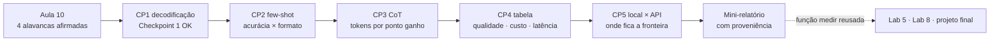
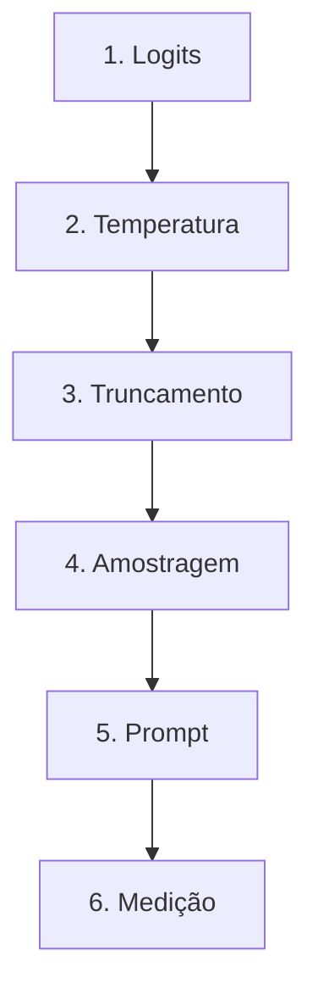
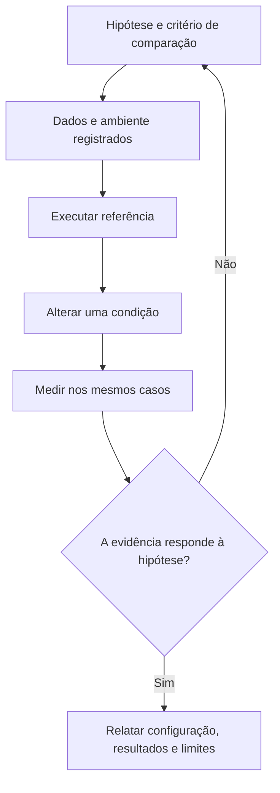
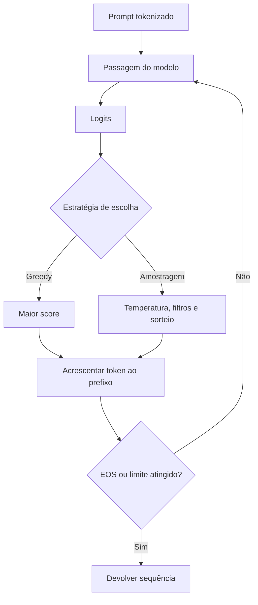

# Especificação de slides — Aula 11 (V2)

> **Rebalanceamento V2 — aula de laboratório (§6-bis do contrato).** Num lab a matemática **é**
> a prática: o aluno implementa a fórmula e mede o resultado dela. Inverter "aplicação antes de
> teoria" aqui seria redundante. Por isso o **roteiro prático não foi reordenado** — setup, demo
> e os cinco checkpoints permanecem na ordem que funciona em bancada, minuto a minuto. Três
> mudanças:
>
> 1. **Cada checkpoint abre pelo comportamento esperado** — a linha que a célula imprime, a
>    verificação que o teste faz, o número que sai na tabela — e só depois nomeia o que
>    implementar.
> 2. **A Parte 2 é nova:** um apêndice com o fundamento formal do que o aluno mede. Três itens,
>    organizados **por checkpoint** e não por tópico.
> 3. **Cada checkpoint ganhou um ponteiro** para o item correspondente, em uma linha, sem
>    interromper a prática.
>
> Carga horária (120 min), numeração e títulos dos slides do fluxo, checkpoints, entregável e
> objetivos de aprendizagem: **idênticos à V1**.
>
> **Mapa checkpoint → apêndice:**
> ```
> Checkpoint 1 → A.1                 (entropia da distribuição sob temperatura)
> Checkpoint 2 → A.3                 (20 itens: o que essa amostra distingue)
> Checkpoint 3 → A.2                 (custo por resposta e o denominador do custo por acerto)
> Checkpoint 4 → A.2 e A.3           (a conta de custo e a dispersão de três repetições)
> Checkpoint 5 → A.3                 (comparar dois backends com a mesma amostra)
> ```
> A teoria de **decodificação** foi dada ontem e o fundamento dela está no apêndice da Aula 10:
> `T → 0` e `T → ∞` em A.1 de lá, truncamento e renormalização de top-k/top-p em A.2 de lá.
> Este deck **não redereiva** nada disso — ele aponta, e acrescenta o que só existe porque hoje
> tem medição na tela.

<!-- SLIDE-FLOW:GUIDE:BEGIN -->
## Fluxogramas na produção dos slides

As orientações abaixo complementam o campo **Visual** dos slides indicados. Produzir os fluxogramas no próprio deck, como formas e conectores editáveis ou gráficos vetoriais; a biblioteca completa ao final torna esta especificação independente do portal.

- **Referência de composição:** título e propósito no topo, blocos numerados, conexões rotuladas, ramificações legíveis e uma saída identificada. Usar apenas o padrão visual da referência fornecida, sem importar seu assunto ou seus exemplos.
- **Tema do deck:** manter o fundo escuro e a paleta já especificada para a aula. Usar `#5b8cff` para o trecho ativo, tons neutros para o contexto e `#e2231a` conforme o significado definido no deck. Cor sempre acompanhada de rótulo.
- **Leitura:** entrada no topo ou à esquerda; saída na base ou à direita. Decisões em losangos, alternativas com rótulos e retornos apontando à etapa correta. Ramos paralelos convergem apenas onde seus resultados realmente são combinados.
- **Densidade:** no fluxo principal, projetar 3–6 blocos curtos por enquadramento, com corpo legível na última fileira. Um mapa maior pode ser revelado por etapas no mesmo slide. Detalhes, condições e explicações completas ficam nas notas; não reduzir a fonte para caber tudo.
- **Semântica:** mapas de percurso mostram ordem de estudo, não execução de um algoritmo. Manter separadas preparação e aplicação, treino e inferência, sequência e alternativas. Não transformar uma etapa opcional em obrigatória.
- **Integração:** o fluxograma substitui uma lista redundante ou ocupa o campo Visual; não cobre matrizes, tabelas, gráficos nem código indispensáveis. Preservar títulos, numeração, duração e referências aos apêndices.
- **Produção:** os blocos Mermaid abaixo são especificações do desenho. Renderizar/reconstruir como diagrama, nunca projetar o código Mermaid. Manter rótulos, bifurcações, retornos e limites declarados. Não transformar este caderno técnico em slides adicionais.
- **Ligação com o portal:** os mapas de mecanismo compartilham o conteúdo dos fluxogramas do portal. Em demonstrações, usar o mesmo vocabulário no deck e no controle interativo para facilitar a passagem entre os dois.
<!-- SLIDE-FLOW:GUIDE:END -->

## Diretrizes visuais

- **Tema:** escuro, accent `#e2231a` (vermelho CESAR), accent secundário `#5b8cff`.
- **Tipografia:** sans-serif para texto; monoespaçada para código, parâmetros de decodificação, nomes de função e nomes de coluna de tabela.
- **Densidade:** máximo 5 linhas de texto por slide no fluxo. Um conceito por slide.
- **Proibido:** bullets genéricos ("Vantagens", "Desvantagens"); slide-parede de texto; clipart; gráfico sem eixo rotulado; captura de tela de terminal ilegível.
- **Deck de laboratório:** os slides ficam projetados enquanto a turma trabalha. Cada slide de checkpoint precisa ser legível do fundo da sala e conter o **critério de conclusão** e o **relógio** — o aluno olha para a parede quando trava, não para o instrutor.
- **Slide de checkpoint tem moldura fixa e idêntica, e a primeira linha é o observável**, não a instrução: título com o número do checkpoint, relógio no canto superior direito, *o que aparece na tela quando está certo*, o que implementar (nomes reais de função), a armadilha num cartão em accent, e o ponteiro `→ Apêndice A.n`. Cinco slides com a mesma moldura — a repetição é intencional, é o que dá ritmo ao lab.
- **Toda tabela de medição na tela carrega o `n`** e o rótulo de proveniência. Nunca "acurácia 70%"; sempre `acurácia 0,70 (n = 20, modo offline)`.
- **Fórmulas:** renderizar como bloco destacado em monoespaçada, não como imagem de baixa resolução.
- **No apêndice:** densidade alta é esperada e desejável. É material de consulta, lido em casa com o notebook ao lado e com o relatório por escrever.

## Arco narrativo

O deck abre cobrando a promessa da Aula 10: quatro alavancas foram afirmadas com um script de
brinquedo, e hoje elas viram medição com três eixos — qualidade, custo em tokens e latência. Os
três slides iniciais montam o contrato do lab (os três modos de execução, a proveniência
obrigatória, o mapa dos cinco checkpoints apresentado **pelo que cada um imprime**); a demo
mostra as alavancas virando texto e número na mesma tela; os cinco slides de checkpoint conduzem
a turma da implementação da decodificação até a tabela comparativa entre modelo local e modelo de
API. O deck fecha convertendo o notebook em mini-harness de avaliação reutilizável e virando a
lente para a fábrica que produziu o modelo — a Aula 12.

A Parte 2 não se apresenta em aula. Ela existe porque este lab produz **números**, e número sem
fundamento é opinião com casas decimais: quem vai escrever o mini-relatório precisa saber o que a
entropia tem a ver com o tamanho do nucleus, o que o `tokens_por_ponto` significa de verdade, e
quantos itens seriam necessários para a diferença que ele mediu não ser ruído.

---

# PARTE 1 — FLUXO DA AULA

*O que se apresenta em aula. 10 slides, 120 minutos com demo e cinco checkpoints. Ordem prática
preservada da V1, slide a slide, com os mesmos títulos.*

## Slides

### Slide 1 — Abertura: ontem eu afirmei, hoje vocês medem
- **Tipo:** título
- **Título:** Laboratório 3 — Decodificação e prompting na prática
- **Frase-tese:** Ontem eu afirmei quatro coisas. Hoje vocês descobrem quais delas são verdade nos números de vocês — e quanto cada uma custa.
- **Conteúdo:** As quatro alavancas da Aula 10 listadas como itens já vistos: decodificação · prompting · contexto · serving. Abaixo, os três eixos de hoje em destaque: **qualidade · custo em tokens · latência**.
- **Visual:** full-bleed. À esquerda, as quatro alavancas em cinza (o passado); à direita, os três eixos em accent, como três colunas de uma tabela vazia esperando ser preenchida. Rodapé: "Lab 3 de 8 · entrega em 1 semana".
- **Notas do apresentador:** Notebook já aberto e célula de diagnóstico já rodada. Se a Aula 10 não fechou o bloco de inferência eficiente, este slide muda: os 30 min iniciais viram exposição e o lab começa em 00:30. Mencionar de passagem que este deck tem apêndice (A.1 a A.3) com a conta por trás dos números do lab — trinta segundos, não mais.

### Slide 2 — Os três modos: offline, Ollama, API
- **Tipo:** comparação
- **Título:** Três modos, e um deles não precisa de nada
- **Conteúdo:** Três colunas com o que cada modo entrega:
  - **`offline`** · simulador determinístico embutido · sem rede, sem chave, sem download · matemática de decodificação **real** · respostas de tarefa **canônicas**
  - **`ollama`** · modelo local de ~1B · sem rede depois do download · custo monetário zero · tokens estimados
  - **`api`** · free tier (Groq / Google AI Studio) · qualidade maior · `usage` com contagem **exata** · sujeito a rate limit
- **Frase-tese:** O modo offline reproduz a matemática inteira e não reproduz modelo nenhum.
- **Visual:** três cartões lado a lado, o `offline` com moldura em accent. Faixa inferior atravessando os três: "todo número do relatório carrega o modo que o produziu". Ícone de cadeado ao lado de `api` com a legenda `getpass` — nunca no código.
- **Fundamento:** o modo `offline` é fiel **exatamente** onde a conta é aritmética — temperatura sobre logits, truncamento, renormalização, sorteio — e infiel onde a conta é modelo. É por isso que o Checkpoint 1 vale igual nos três modos e o Checkpoint 5 não.
  → o que a temperatura faz com a incerteza da distribuição, medido na tela do CP1: **Apêndice A.1** (slide 11); os limites `T → 0` e `T → ∞` estão em **A.1 da Aula 10**, e o truncamento em **A.2 da Aula 10**
- **Notas do apresentador:** Perguntar por mão levantada quantos estão em cada modo e anotar. Se mais de dois terços estão offline, o CP5 já entra como tarefa de casa.

### Slide 3 — O mapa: cinco checkpoints e o mini-relatório

<!-- SLIDE-FLOW:SLIDE:BEGIN -->
- **Fluxograma a incorporar neste slide:** **F00 — O percurso desta aula**; **F01 — Laboratório: da hipótese à evidência**. O desenho e os rótulos completos estão no caderno de fluxogramas ao final deste arquivo.
- **Composição:** integrar ao campo Visual; preservar exemplos, tabelas, fórmulas e dimensões solicitados neste slide. Destacar o trecho relacionado ao título e manter o restante em segundo plano. Os textos detalhados ficam nas notas, sem duplicar a lista de Conteúdo na tela.
- **Momento de exibição:** apresentar o fluxo preenchido na discussão ou conferência, depois da tentativa da turma; durante a atividade, ocultar as etapas que entregariam a solução.
<!-- SLIDE-FLOW:SLIDE:END -->

- **Tipo:** diagrama
- **Título:** O que vocês entregam e quando
- **Conteúdo:** Os cinco checkpoints com relógio e **o que a tela imprime** quando está certo:
  ```
  CP1  00:35–00:50  temperatura/top-k/top-p + grade 3×3  -> "Checkpoint 1 OK" + 9 saídas   (A.1)
  CP2  00:50–01:05  classificação zero-shot × few-shot    -> "Checkpoint 2 OK" + 3×2 taxas  (A.3)
  CP3  01:15–01:27  chain-of-thought em 10 problemas      -> 2 linhas + tokens por ponto    (A.2)
  CP4  01:27–01:40  tabela qualidade × custo × latência   -> 4 linhas geradas por código    (A.2/A.3)
  CP5  01:40–01:50  local × API                           -> tabela comparativa + parágrafo (A.3)
  ```
  À direita, um cartão destacado: "Entregável: notebook + **meia página** com campo de proveniência".
- **Frase-tese:** Cinco checkpoints e meia página. A meia página é a parte difícil, porque nela vocês têm de escolher — e escolher com número na mão é o que esta disciplina treina.
- **Visual:** trilha horizontal de cinco estações com o relógio embaixo de cada uma e o intervalo marcado entre a 2ª e a 3ª. A coluna `(A.n)` em cinza discreto — é ponteiro de estudo, não tarefa de sala.
- **Notas do apresentador:** Dizer que os CP1 e CP2 têm solução comentada liberada em 00:50 e 01:05 — rede de segurança, não convite a desistir. O CP3 é onde mora o achado do lab. A coluna do apêndice se explica em uma frase: "cada checkpoint tem um item com a conta por trás do número dele; ninguém precisa disso hoje, e todo mundo vai querer isso na hora de escrever a meia página".



### Slide 4 — [Demo] Uma pergunta, seis decodificações

<!-- SLIDE-FLOW:SLIDE:BEGIN -->
- **Fluxograma a incorporar neste slide:** **F02 — Geração autorregressiva**. O desenho e os rótulos completos estão no caderno de fluxogramas ao final deste arquivo.
- **Composição:** integrar ao campo Visual; preservar exemplos, tabelas, fórmulas e dimensões solicitados neste slide. Destacar o trecho relacionado ao título e manter o restante em segundo plano. Os textos detalhados ficam nas notas, sem duplicar a lista de Conteúdo na tela.
<!-- SLIDE-FLOW:SLIDE:END -->

- **Tipo:** transição para demonstração
- **Título:** Mesma pergunta, mesmo modelo, seis tratamentos
- **Frase-tese:** Se a saída muda e os pesos não mudaram, a mudança está inteira do lado de fora do modelo.
- **Conteúdo:** Os seis tratamentos como lista numerada em monoespaçada, sem resultado — o resultado aparece ao vivo: `greedy ×3` · `amostragem ×3` · `varredura de T` · `top_p sobre T=1.5` · `instrumentação (tokens, s)` · `zero-shot × few-shot`.
- **Visual:** slide quase vazio, de transição. A lista numerada à esquerda e, à direita, três caixas vazias rotuladas `qualidade`, `tokens`, `latência`, esperando ser preenchidas na tela.
- **Fundamento:** o que a varredura de temperatura mostra na tela é a **incerteza** da distribuição subindo de forma contínua e monotônica; o que o `top_p` por cima mostra é essa incerteza sendo cortada por massa acumulada. Os dois controles agem sobre a mesma distribuição, em sequência, e por isso não são independentes.
  → a entropia como medida dessa incerteza, com a conta e os números desta distribuição: **Apêndice A.1** (slide 11)
- **Notas do apresentador:** Passos na Parte 2 do roteiro. Rodar no backend mais robusto da sala. Se a rede cair, trocar para `offline` ao vivo e dizer isso em voz alta — é a melhor propaganda do modo offline. Não conduzir conta nenhuma aqui: a Parte 4 do roteiro tem a contingência.

### Slide 5 — [Checkpoint 1] Decodificação implementada e medida

<!-- SLIDE-FLOW:SLIDE:BEGIN -->
- **Fluxograma a incorporar neste slide:** **F02 — Geração autorregressiva**. O desenho e os rótulos completos estão no caderno de fluxogramas ao final deste arquivo.
- **Composição:** integrar ao campo Visual; preservar exemplos, tabelas, fórmulas e dimensões solicitados neste slide. Destacar o trecho relacionado ao título e manter o restante em segundo plano. Os textos detalhados ficam nas notas, sem duplicar a lista de Conteúdo na tela.
- **Momento de exibição:** apresentar o fluxo preenchido na discussão ou conferência, depois da tentativa da turma; durante a atividade, ocultar as etapas que entregariam a solução.
<!-- SLIDE-FLOW:SLIDE:END -->

- **Tipo:** código (moldura de checkpoint)
- **Título:** Checkpoint 1 · 00:35–00:50 · as quatro funções e a grade
- **Conteúdo:**
  **Quando está certo, a tela imprime isto:**
  ```
  Checkpoint 1 OK
  ```
  e o teste terá conferido cinco coisas, cada uma apontando para um erro diferente:
  ```
  1  a temperatura NÃO muda o ranking dos tokens          (ela age no logit, e só reescala)
  2  cada filtro devolve distribuição somando 1           (top-k e top-p renormalizam)
  3  com p = 0,9 sobre (0,50 0,30 0,15 0,05) sobram 3     (o token que CRUZA a linha entra)
  4  nucleus com T = 2  ≥  nucleus com T = 0,5            (temperatura maior, conjunto maior)
  5  greedy 3× idêntico · amostragem com 3 sementes diferente
  ```
  Depois do teste, a grade preenchida: `T ∈ {0,2 · 0,8 · 1,4}` × `top_p ∈ {0,5 · 0,9 · 1,0}`, nove saídas.

  O que implementar, na ordem dos TODOs:
  ```
  aplicar_temperatura(logits, T)  ->  logits / T      # nos LOGITS, antes do softmax
  filtrar_top_k(probs, k)         ->  k maiores, resto zerado, renormaliza
  filtrar_top_p(probs, p)         ->  menor conjunto cuja acumulada ATINGE p
  amostrar(probs, semente)        ->  sorteio sobre o que sobrou
  ```
- **Frase-tese:** Top-p mantém o menor conjunto que **atinge** p — o token que cruza a linha entra.
- **Visual:** no topo, o critério de conclusão em caixa destacada (a linha `Checkpoint 1 OK` e as cinco verificações numeradas). Abaixo à esquerda, as quatro assinaturas com os TODOs; à direita, a grade 3×3 desenhada como matriz vazia. Cartão de alerta em accent com as três armadilhas silenciosas: temperatura dividindo a probabilidade em vez do logit; `>` onde precisa ser `≥` na acumulada; esquecer de renormalizar depois do corte. Relógio `00:35–00:50` no canto.
- **Fundamento:** a verificação nº 4 **não é heurística** — o tamanho do nucleus é uma função não decrescente da temperatura, e isso se demonstra. A entropia da distribuição cresce estritamente com `T`, e as somas acumuladas dos tokens mais prováveis caem, o que empurra a linha do `p` para mais longe.
  → a conta da entropia, a demonstração de que o nucleus não pode encolher quando `T` sobe, e os números exatos desta distribuição: **Apêndice A.1** (slide 11). Os limites `T → 0` e `T → ∞`, e o truncamento com renormalização, estão em **A.1 e A.2 da Aula 10** e não se repetem aqui
- **Notas do apresentador:** Circular olhando tela. A pergunta que resolve metade dos casos: "sua temperatura divide o logit ou a probabilidade?". Solução liberada em 00:50. Quem perguntar de onde vem a verificação 4: a resposta de uma frase é "temperatura maior espalha a massa, e massa espalhada demora mais para acumular 0,9" — o resto está em A.1, e não se conduz no quadro durante o lab.

### Slide 6 — [Checkpoint 2] Few-shot e o colapso de formato

<!-- SLIDE-FLOW:SLIDE:BEGIN -->
- **Fluxograma a incorporar neste slide:** **F01 — Laboratório: da hipótese à evidência**. O desenho e os rótulos completos estão no caderno de fluxogramas ao final deste arquivo.
- **Composição:** integrar ao campo Visual; preservar exemplos, tabelas, fórmulas e dimensões solicitados neste slide. Destacar o trecho relacionado ao título e manter o restante em segundo plano. Os textos detalhados ficam nas notas, sem duplicar a lista de Conteúdo na tela.
- **Momento de exibição:** apresentar o fluxo preenchido na discussão ou conferência, depois da tentativa da turma; durante a atividade, ocultar as etapas que entregariam a solução.
<!-- SLIDE-FLOW:SLIDE:END -->

- **Tipo:** dados (moldura de checkpoint)
- **Título:** Checkpoint 2 · 00:50–01:05 · duas colunas, não uma
- **Conteúdo:**
  **Quando está certo, a tela imprime isto:**
  ```
  Checkpoint 2 OK
  ```
  e o teste terá conferido a aritmética das três condições: em cada uma,
  `acertos + erros + fora_do_espaço = 20`. Todo item cai em **exatamente uma** coluna — é o que
  impede que "fora do espaço de rótulos" desapareça dentro de "erro".

  Depois do teste, a tabela de três linhas e duas métricas:
  | Condição | Acurácia | Fora do espaço de rótulos |
  |---|---|---|
  | zero-shot solto | | |
  | zero-shot com rótulos declarados | | |
  | few-shot, 4 exemplos | | |

  Espaço de rótulos fechado: `bug` · `dúvida` · `elogio` · `recurso`. 20 comentários rotulados,
  temperatura fixada em 0. Ao lado da tabela, uma frase dizendo **qual das duas colunas o
  few-shot mexeu mais** nos dados do aluno.
- **Frase-tese:** Errar o rótulo e responder em prosa livre dão a mesma acurácia e são dois problemas de engenharia diferentes.
- **Visual:** no topo, o critério de conclusão (a linha do OK e a identidade da soma). Abaixo, a tabela grande e vazia com as duas colunas de métrica em cores distintas. Ao lado, duas saídas de exemplo contrastadas: uma frase longa em prosa contra a palavra `bug` isolada em monoespaçada.
- **Fundamento:** com 20 itens, **cada item vale 5 pontos percentuais**. Uma diferença de acurácia de 5 pontos entre duas condições é literalmente um comentário mudando de lado — e temperatura 0 elimina o ruído de amostragem, **não** o ruído de amostra. As duas coisas são diferentes, e confundi-las é o erro de método mais comum deste checkpoint.
  → a resolução do conjunto, o erro-padrão de uma proporção com `n = 20`, e quantos itens precisariam mudar de lado para a diferença ser distinguível do acaso: **Apêndice A.3** (slide 13)
- **Notas do apresentador:** O erro clássico é normalizar a saída com casamento generoso e apagar a coluna 2. A função de normalização é estrita de propósito. Aos 01:03, pedir a duas pessoas o número da coluna 2 em voz alta — se as duas divergirem muito, isso já é a conversa de A.3 acontecendo sozinha.

### Slide 7 — [Checkpoint 3] Chain-of-thought e o preço do raciocínio

<!-- SLIDE-FLOW:SLIDE:BEGIN -->
- **Fluxograma a incorporar neste slide:** **F01 — Laboratório: da hipótese à evidência**. O desenho e os rótulos completos estão no caderno de fluxogramas ao final deste arquivo.
- **Composição:** integrar ao campo Visual; preservar exemplos, tabelas, fórmulas e dimensões solicitados neste slide. Destacar o trecho relacionado ao título e manter o restante em segundo plano. Os textos detalhados ficam nas notas, sem duplicar a lista de Conteúdo na tela.
- **Momento de exibição:** apresentar o fluxo preenchido na discussão ou conferência, depois da tentativa da turma; durante a atividade, ocultar as etapas que entregariam a solução.
<!-- SLIDE-FLOW:SLIDE:END -->

- **Tipo:** dados (moldura de checkpoint)
- **Título:** Checkpoint 3 · 01:15–01:27 · quanto custou pensar
- **Conteúdo:**
  **Quando está certo, a tela mostra duas linhas e uma divisão:**
  ```
  condição   acurácia   tokens_out (mediana)   falhas_formato
  direta       ...             ...                  ...
  cot          ...             ...                  ...

  delta_tokens: ...   delta_pontos: ...   tokens_por_ponto: ...  (ou null)
  ```
  Quando `delta_pontos ≤ 0`, o campo `tokens_por_ponto` vem **nulo de propósito**, com a leitura
  impressa junto: *o raciocínio custou tokens sem comprar nada nestes problemas, com este
  backend*. É resultado, não falha — e é o achado mais valioso do lab.

  O que rodar: os 10 problemas nas duas condições, com formato final obrigatório
  `Resposta: <número>`, e a terceira coluna contando **falha de extração** separadamente.
- **Frase-tese:** Chain-of-thought é hora extra paga em token de saída — às vezes para somar dois mais dois.
- **Visual:** no topo, o critério em duas linhas de tabela mais a linha da divisão. Abaixo, duas barras horizontais comparando `tokens_out` (direta × CoT) na mesma escala, e ao lado dois números de acurácia. A terceira coluna (falhas de extração) em cor de alerta, com a legenda "erro do parser, não do modelo".
- **Fundamento:** o custo de uma resposta é a soma de duas parcelas com preços diferentes — tokens de entrada e tokens de saída. O chain-of-thought inflaciona a segunda; o few-shot inflaciona a primeira. E o número `tokens_por_ponto` que aparece na tela tem um significado preciso: é **o preço que um ponto percentual de acurácia teria de valer** para o raciocínio se pagar.
  → a conta de custo por resposta, a condição exata em que o CoT compensa, e por que a acurácia é o denominador que ele muda: **Apêndice A.2** (slide 12)
- **Notas do apresentador:** Se o CoT ficou pior, checar a extração antes de qualquer outra coisa — falha de extração entra no denominador da acurácia e estraga a conta por um motivo que não tem nada a ver com o modelo. Ganho zero com custo alto é achado: tratar como achado na frente da sala.

### Slide 8 — [Checkpoint 4] A tabela dos três eixos

<!-- SLIDE-FLOW:SLIDE:BEGIN -->
- **Fluxograma a incorporar neste slide:** **F01 — Laboratório: da hipótese à evidência**. O desenho e os rótulos completos estão no caderno de fluxogramas ao final deste arquivo.
- **Composição:** integrar ao campo Visual; preservar exemplos, tabelas, fórmulas e dimensões solicitados neste slide. Destacar o trecho relacionado ao título e manter o restante em segundo plano. Os textos detalhados ficam nas notas, sem duplicar a lista de Conteúdo na tela.
- **Momento de exibição:** apresentar o fluxo preenchido na discussão ou conferência, depois da tentativa da turma; durante a atividade, ocultar as etapas que entregariam a solução.
<!-- SLIDE-FLOW:SLIDE:END -->

- **Tipo:** dados (moldura de checkpoint)
- **Título:** Checkpoint 4 · 01:27–01:40 · a tabela que decide
- **Conteúdo:**
  **Quando está certo, existe uma tabela markdown impressa pela função do notebook** — não digitada — com quatro linhas e estas colunas:
  ```
  abordagem | tokens_in | tokens_out | contagem | latencia_mediana_s | dispersao_s | custo_1k_req
  ```
  A coluna `contagem` diz `exata` ou `estimada`. A coluna `dispersao_s` traz o intervalo
  `mín–máx` das três repetições. A coluna `custo_1k_req` traz `[definir na oferta]` enquanto o
  preço por milhão de tokens não estiver na célula de configuração.

  As quatro abordagens: zero-shot · few-shot · chain-of-thought · CoT + few-shot.
  Três exigências de método em destaque: tabela **gerada por código** · **3 repetições** e mediana com a dispersão ao lado · contagem **exata** (`usage`) marcada como diferente de **estimada**.
- **Frase-tese:** Uma execução não mede latência — mede um sorteio.
- **Visual:** no topo, o critério (o cabeçalho real da tabela do notebook). Abaixo, a tabela ocupando o slide inteiro, com as três exigências como selos no rodapé. A coluna `dispersao_s` destacada em accent.
- **Fundamento:** a coluna de custo é uma soma ponderada de duas contagens com dois preços; a coluna de latência é uma estatística de três amostras, e é por isso que o notebook reporta a **mediana** com a dispersão ao lado, nunca a média. Se a dispersão de uma configuração cobre a diferença entre duas linhas, a tabela não ordena nada.
  → a conta de custo por requisição e por mil requisições: **Apêndice A.2** (slide 12) · por que três repetições e mediana, e o que a dispersão licencia afirmar: **Apêndice A.3** (slide 13)
- **Notas do apresentador:** Ninguém digita a tabela à mão. A função que monta já está pronta; o trabalho é chamá-la com os resultados guardados. Perguntar quem teve dispersão de latência maior que a diferença entre duas configurações — quando alguém tiver, apontar que essa pessoa acabou de descobrir sozinha por que uma medição só não conclui nada. É a mesma lição do CP5 do Lab 2, com latência no lugar da semente.

### Slide 9 — [Checkpoint 5] Modelo local pequeno × modelo de API

<!-- SLIDE-FLOW:SLIDE:BEGIN -->
- **Fluxograma a incorporar neste slide:** **F01 — Laboratório: da hipótese à evidência**. O desenho e os rótulos completos estão no caderno de fluxogramas ao final deste arquivo.
- **Composição:** integrar ao campo Visual; preservar exemplos, tabelas, fórmulas e dimensões solicitados neste slide. Destacar o trecho relacionado ao título e manter o restante em segundo plano. Os textos detalhados ficam nas notas, sem duplicar a lista de Conteúdo na tela.
- **Momento de exibição:** apresentar o fluxo preenchido na discussão ou conferência, depois da tentativa da turma; durante a atividade, ocultar as etapas que entregariam a solução.
<!-- SLIDE-FLOW:SLIDE:END -->

- **Tipo:** comparação (moldura de checkpoint)
- **Título:** Checkpoint 5 · 01:40–01:50 · onde fica a fronteira
- **Conteúdo:**
  **Quando está certo, existem duas coisas no notebook:** a tabela comparativa dos dois
  backends nas mesmas quatro abordagens, **e** um parágrafo respondendo à pergunta fechada —
  *em qual das quatro abordagens o modelo pequeno chega perto o suficiente, e quanto isso
  economiza em custo e em latência.* O parágrafo é a parte que vale.

  Quem tem um backend só roda a comparação alternativa do notebook — mesmo backend, dois
  tamanhos de prompt — e **declara isso** no relatório, com essas palavras.

  Dois perfis contrastados: **local ~1B** — custo por token zero, sem rede, latência previsível, qualidade menor; **API free tier** — custo por token, dependente de rede e quota, qualidade maior, latência com variância maior.
- **Frase-tese:** A pergunta não é qual modelo é melhor. É em qual tarefa o pequeno chega perto o suficiente.
- **Visual:** no topo, o critério em duas linhas. Abaixo, dois eixos cruzados (qualidade × custo) com quatro pontos plotados — as quatro abordagens — em duas cores, uma por backend. A região "perto o suficiente" sombreada. Nota lateral: quem tem um backend só roda a comparação alternativa e **declara isso**.
- **Fundamento:** os dois backends são comparados **nos mesmos itens**, e isso não é detalhe: comparação pareada usa uma informação que a comparação de duas taxas independentes joga fora. Com 20 itens, a informação inteira do experimento está nos itens em que os dois backends **discordam**.
  → quantos itens discordantes seriam necessários para a diferença não ser acaso, e por que o pareamento é o que torna a pergunta respondível: **Apêndice A.3** (slide 13)
- **Notas do apresentador:** Se a maior parte da sala está offline, converter estes 10 min em escrita do mini-relatório em sala. Quem quiser um número honesto para o parágrafo: contar os itens em que os dois backends discordam, e não a diferença entre as duas acurácias.

### Slide 10 — Recolhimento: o mini-relatório e a ponte para a Aula 12

<!-- SLIDE-FLOW:SLIDE:BEGIN -->
- **Fluxograma a incorporar neste slide:** **F01 — Laboratório: da hipótese à evidência**. O desenho e os rótulos completos estão no caderno de fluxogramas ao final deste arquivo.
- **Composição:** integrar ao campo Visual; preservar exemplos, tabelas, fórmulas e dimensões solicitados neste slide. Destacar o trecho relacionado ao título e manter o restante em segundo plano. Os textos detalhados ficam nas notas, sem duplicar a lista de Conteúdo na tela.
<!-- SLIDE-FLOW:SLIDE:END -->

- **Tipo:** encerramento
- **Título:** O que entregar, e por que a próxima aula entra na fábrica
- **Conteúdo:** Checklist de entrega (prazo: 1 semana):
  - ☐ Notebook executado, com saídas visíveis
  - ☐ Tabela consolidada dos três eixos, gerada por código
  - ☐ Mini-relatório de meia página com **campo de proveniência** (modo · modelo · data · o que os números medem)
  - ☐ Respostas às 5 questões-guia
  - ☐ Declaração de uso de IA

  Aviso em destaque: relatório sem proveniência zera o item inteiro. Rodapé: trazer para a Aula 12 o número de parâmetros e de tokens do modelo usado no Ollama.
- **Frase-tese:** Vocês passaram duas aulas puxando alavancas do lado de fora do modelo. Na próxima a gente entra na fábrica.
- **Visual:** checklist em caixa destacada, com quadradinhos vazios, dimensionado para ser fotografado do fundo da sala. Abaixo, uma seta em accent saindo de "alavancas fora do modelo" e entrando em "Aula 12 — Pré-treinamento: dados, leis de escala e sistemas". Num canto discreto, o índice do apêndice: A.1 entropia e temperatura · A.2 custo por resposta e por acerto · A.3 quantos prompts a diferença precisa.
- **Fundamento (o que este lab deixa em aberto de propósito):** hoje vocês reescreveram prompt **no olho** —
  mudaram uma palavra, olharam a saída, decidiram. Funciona para descobrir o mecanismo e não escala: a
  decisão é subjetiva e não é reprodutível. O prompt, porém, é um objeto **otimizável**: com um conjunto
  rotulado e uma métrica automática, um otimizador reescreve a instrução contra o número, e não contra a
  impressão. Guardem isso, porque as duas peças que faltam para fazer aparecem depois — a métrica na
  **Aula 27** e o conjunto rotulado no **Lab 8**.
  → a quarta alavanca do framework de decisão, com o mecanismo e os números: **A.7 da Aula 13**
- **Notas do apresentador:** Projetar o checklist e ficar 30 s em silêncio. Recolher o pulso: quantos chegaram ao CP4 e quantos rodaram offline — os dois números calibram a Aula 14. Antes de encerrar, projetar o índice do apêndice por 20 s e dizer qual questão-guia cada item responde: a do custo do raciocínio está em A.2; a do que os números **não** provam está em A.3, e é a que mais separa nota.

---

# PARTE 2 — APÊNDICE MATEMÁTICO

> Material de estudo e consulta. **Não se apresenta em aula**; é distribuído com o deck.
> Organizado **por checkpoint**, não por tópico: um item para cada checkpoint que tenha
> fundamento próprio. Autossuficiente — quem estuda por aqui sem ter feito o lab consegue
> reconstruir todas as contas, e quem fez o lab consegue explicar os próprios números.
>
> **Onde o fundamento já está em outra aula, este apêndice aponta em vez de repetir.** Os limites
> `T → 0` e `T → ∞` da temperatura estão em **A.1 da Aula 10**; a definição de truncamento com
> renormalização de top-k e top-p, com exemplo numérico resolvido, está em **A.2 da Aula 10**.
> Este apêndice acrescenta o que só existe porque há medição na tela: a **entropia**, o **custo
> por acerto** e o **tamanho de amostra**.

### Slide 11 — A.1 · A entropia da distribuição, e por que o nucleus não pode encolher quando `T` sobe
- **Tipo:** apêndice — derivação completa, demonstração e exemplo numérico resolvido
- **Invocado em:** slides 2, 4 e 5 (modos, demo e Checkpoint 1)

**Relação com a Aula 10.** A definição da temperatura dentro do softmax, a invariância a
deslocamento, a monotonicidade do *ranking* e os dois casos-limite (`T → 0⁺` devolve greedy,
`T → ∞` devolve a uniforme) estão em **A.1 da Aula 10**. A definição de top-k e top-p como
truncamento seguido de renormalização, com o exemplo de dez candidatos e a observação de que o
nucleus passa de 6 para 8 tokens com `T = 2`, está em **A.2 da Aula 10** — e aquele item declara
explicitamente que a conta da entropia é deste apêndice, porque é aqui que ela é medida na tela.
Este item paga essa dívida e demonstra o que lá foi mostrado por exemplo.

**Notação.**
`V` — vocabulário; `|V|` o seu tamanho. `z ∈ ℝ^|V|` — vetor de logits da posição atual, saída da
última camada linear do modelo, **antes** de qualquer normalização.
`T > 0` — temperatura. `β = 1/T` — o inverso da temperatura, e a variável em que a conta fica
limpa. `p(T) ∈ ℝ^|V|` — distribuição resultante, `p_i(T) = exp(z_i/T)/Z(T)`.
`Z(β) = Σ_j exp(β z_j)` — o normalizador, escrito em função de `β`.
`H(T)` — entropia de Shannon de `p(T)`, em **nats** (logaritmo natural).
`E_p[·]` e `Var_p(·)` — média e variância **sob a distribuição `p(T)`**.
`π` — permutação que ordena `p` em ordem decrescente. `S_p(T)` — o nucleus de massa `p` na
temperatura `T`; `m(T) = |S_p(T)|` o seu tamanho.

**Premissas.** (i) Os logitos são finitos e `T > 0` estritamente — `T = 0` é limite, não valor, e
o tratamento dele está em A.1 da Aula 10; (ii) os logitos não são todos iguais (o caso degenerado
aparece nos casos-limite); (iii) a distribuição `p` é a do *passo atual* — tudo abaixo vale por
posição, e nada aqui fala de sequências.

**Definição da entropia.**
```
H(T) = − Σ_{i=1}^{|V|} p_i(T) · log p_i(T)
```
A leitura corrente: `H` é a incerteza média, em nats, sobre qual token vem. `exp(H)` é o **número
efetivo de opções** entre as quais o modelo hesita naquele passo — é a mesma grandeza que a
perplexidade de **A.4 do Lab 2 (Aula 9)**, aplicada a um passo em vez de a um corpus. Guardar essa
equivalência vale mais que a fórmula: `exp(H) = 3,1` significa "o modelo está tão indeciso quanto
alguém escolhendo uniformemente entre três símbolos".

**Derivação — `H` é estritamente crescente em `T`.**

*Reescrita em `β`.* Com `β = 1/T`, `p_i = exp(β z_i)/Z(β)`, logo `log p_i = β z_i − log Z(β)`.
Substituindo na definição:
```
H = − Σ_i p_i (β z_i − log Z) = − β Σ_i p_i z_i + log Z · Σ_i p_i
```
Como `Σ_i p_i = 1`:
```
H(β) = − β · E_p[z] + log Z(β)
```

*As duas derivadas de `log Z`.* Derivando `log Z` em relação a `β`:
```
d(log Z)/dβ = (1/Z) · Σ_i z_i exp(β z_i) = Σ_i z_i p_i = E_p[z]
```
Derivando outra vez, e usando que `dp_i/dβ = p_i (z_i − E_p[z])`:
```
d²(log Z)/dβ² = Σ_i z_i · p_i (z_i − E_p[z]) = E_p[z²] − (E_p[z])² = Var_p(z)
```
Estas são as duas identidades padrão da família exponencial; nada aqui é específico de modelos de
linguagem.

*A derivada da entropia.* Derivando `H(β) = −β E_p[z] + log Z(β)`:
```
dH/dβ = − E_p[z] − β · d(E_p[z])/dβ + d(log Z)/dβ
      = − E_p[z] − β · Var_p(z) + E_p[z]
      = − β · Var_p(z)
```
O primeiro e o terceiro termos se cancelam exatamente, porque `d(log Z)/dβ = E_p[z]`.

*De volta a `T`.* Com `β = 1/T`, `dβ/dT = −1/T²`, e pela regra da cadeia:
```
dH/dT = (dH/dβ) · (dβ/dT) = (− β · Var_p(z)) · (− 1/T²) = Var_p(z) / T³
```
Como `T > 0` e `Var_p(z) ≥ 0`, a derivada é não negativa; e é **estritamente positiva** sempre que
os logitos não são todos iguais, porque então `Var_p(z) > 0`. ∎

**Leitura do resultado.** A temperatura é um controle **contínuo, monotônico e sem platô** de
incerteza. Não existe faixa de `T` em que subir a temperatura "não faz nada": a incerteza sobe
sempre. E a taxa com que ela sobe é `Var_p(z)/T³` — proporcional à **dispersão dos próprios
logitos**. Consequência prática que a documentação de nenhuma API menciona: a mesma mudança de
`T` tem efeito muito maior num passo em que o modelo está indeciso (logitos próximos, mas com
cauda longa) do que num passo em que ele está confiante. "Temperatura 0,8" não é uma quantidade
fixa de criatividade; é um ganho aplicado a uma dispersão que varia a cada token.

**Exemplo numérico — a distribuição do teste do Checkpoint 1.**
O teste do CP1 constrói os logitos como `log` de `(0,50 · 0,30 · 0,15 · 0,05)`. É legítimo tomar
`z_i = log p_i` porque a distribuição só depende dos logitos a menos de constante aditiva
(invariância a deslocamento, **A.1 da Aula 10**). Com `T = 1` recupera-se exatamente a
distribuição original. Aplicando `p_i(T) ∝ p_i^{1/T}`:

| `T` | distribuição ordenada | acumulada | `H(T)` (nats) | `exp H(T)` | `m(T)` com `p = 0,9` |
|---|---|---|---|---|---|
| 0,5 | 0,6849 · 0,2466 · 0,0616 · 0,0068 | 0,6849 · 0,9315 · 0,9932 · 1,0000 | **0,810** | 2,25 | **2** |
| 1,0 | 0,5000 · 0,3000 · 0,1500 · 0,0500 | 0,5000 · 0,8000 · 0,9500 · 1,0000 | **1,142** | 3,13 | **3** |
| 2,0 | 0,3790 · 0,2936 · 0,2076 · 0,1199 | 0,3790 · 0,6726 · 0,8802 · 1,0000 | **1,308** | 3,70 | **4** |
| → ∞ | 0,2500 · 0,2500 · 0,2500 · 0,2500 | 0,2500 · 0,5000 · 0,7500 · 1,0000 | **1,386** | 4,00 | **4** |

A última linha é `log|V| = ln 4 = 1,3863`, que é o teto da entropia sobre quatro símbolos — o
caso-limite `T → ∞` de A.1 da Aula 10.

*Conferência da derivada no ponto `T = 1`.* Com `z = log p`, `E_p[z] = −1,1421` (que é `−H(1)`,
como tinha de ser) e `E_p[z²] = 1,6636`, logo
```
Var_p(z) = 1,6636 − (1,1421)² = 1,6636 − 1,3044 = 0,3592
dH/dT |_{T=1} = 0,3592 / 1³ = 0,359  nat por unidade de T
```
A inclinação é pequena: subir `T` de 1,0 para 1,1 acrescenta cerca de 0,036 nat de incerteza. É
por isso que ninguém percebe efeito ao mexer na terceira casa decimal da temperatura, e é por
isso que a grade do CP1 varre `0,2 · 0,8 · 1,4` e não `0,9 · 1,0 · 1,1`.

**Demonstração — o tamanho do nucleus é não decrescente em `T`.**
Esta é a verificação nº 4 do teste do Checkpoint 1, e ela é um **teorema**, não uma observação
empírica que calhou de dar certo.

*Enunciado.* Para `T' > T > 0` e qualquer massa `p ∈ (0,1)`, vale `m(T') ≥ m(T)`.

*O que precisa ser mostrado.* Escreva `q_i(a) = p_i^a / Z(a)`, com `a = 1/T` e
`Z(a) = Σ_j p_j^a`. Ordene os índices por `p` decrescente. Basta mostrar que, para cada `m`, a
soma acumulada dos `m` primeiros
```
A_m(a) = Σ_{i ≤ m} q_i(a)
```
é **não decrescente em `a`** — porque então, subindo `T` (isto é, baixando `a`), cada acumulada
cai, a linha `p` é atingida mais tarde, e o menor `m` que a atinge não pode diminuir.

*A derivada da acumulada.* Escreva `L_i = log p_i`. Derivando `q_i(a) = exp(a L_i)/Z(a)` em
relação a `a`, com a mesma identidade usada acima:
```
dq_i/da = q_i · (L_i − E_q[L])
```
Somando sobre os `m` primeiros:
```
dA_m/da = Σ_{i ≤ m} q_i (L_i − E_q[L]) = A_m · (E_A[L] − E_q[L])
```
onde `E_A[L]` é a média de `L` **dentro** do bloco dos `m` primeiros, ponderada por `q`.

*O sinal.* Decomponha a média global entre o bloco de cima (`A`, com massa `A_m`) e o de baixo
(`B`, com massa `1 − A_m`):
```
E_q[L] = A_m · E_A[L] + (1 − A_m) · E_B[L]
```
Logo
```
E_A[L] − E_q[L] = (1 − A_m) · (E_A[L] − E_B[L])
```
e, substituindo:
```
dA_m/da = A_m · (1 − A_m) · (E_A[L] − E_B[L])
```
Os três fatores são não negativos: `A_m > 0`, `1 − A_m ≥ 0`, e `E_A[L] ≥ E_B[L]` porque o bloco de
cima é composto dos tokens de **maior** `p`, portanto de maior `L = log p`. Logo `dA_m/da ≥ 0`
para todo `m`. ∎

*Corolário.* `A_m` é não crescente em `T`. Como `m(T) = min{ m : A_m(T) ≥ p }` e cada `A_m` só
cai quando `T` sobe, o mínimo não pode diminuir: `m` é não decrescente em `T`. Na tabela acima:
`2 → 3 → 4` para `T = 0,5 → 1,0 → 2,0`, exatamente como o teorema exige, e é essa desigualdade
que o `assert` da verificação 4 confere.

*Por que isso importa em produção.* `T` e `top_p` **não são controles independentes**: subir `T`
com `top_p` fixo aumenta a variância duas vezes — uma pela distribuição achatada, outra pelo
conjunto ampliado, e a segunda é garantida pelo teorema acima. É por isso que a grade do CP1 varre
os dois em vez de ajustar um de cada vez, e é por isso que a **ordem** em que a biblioteca aplica
temperatura e truncamento muda o resultado (o erro nº 2 de A.1 da Aula 10).

**Os dois erros de implementação que este item explica.**

*Erro 1 — temperatura na probabilidade em vez do logito.* Dividir o vetor de probabilidades por
`T` e renormalizar devolve a distribuição original, para qualquer `T` (a conta está em A.1 da
Aula 10). O sintoma **no CP1** é preciso: `H(T)` fica constante e `m(T)` fica constante. A
verificação 4 falha, porque o nucleus com `T = 2` e com `T = 0,5` dão o mesmo número. O teste não
detecta "temperatura errada" por adivinhação: ele detecta a ausência do efeito que este item
demonstra existir.

*Erro 2 — parar antes de cruzar a linha do `top_p`.* Tomar o maior conjunto cuja acumulada fica
**abaixo** de `p`, em vez do menor que a **atinge**. Na distribuição do teste, com `p = 0,9`: a
acumulada é `0,50 · 0,80 · 0,95`, então o conjunto correto tem 3 tokens (`0,95 ≥ 0,9`) e a versão
errada tem 2 (`0,80` é a última abaixo de `0,9`). É a verificação 3, e o erro produz um nucleus
sistematicamente menor — modelo mais repetitivo do que o configurado, sem exceção nenhuma.

**Casos-limite.**
- **Logitos todos iguais.** `Var_p(z) = 0`, logo `dH/dT = 0`: a entropia é constante e igual a
  `log|V|` para toda temperatura. A temperatura literalmente não faz nada, e o nucleus também
  não se move. É o único caso em que a monotonicidade não é estrita — e é o caso do modelo
  recém-inicializado do Checkpoint 3 do Lab 2.
- **`T → 0⁺`.** `H → 0` e `exp H → 1`: uma opção efetiva, que é greedy. Derivado em **A.1 da
  Aula 10**. Note que a fórmula `dH/dT = Var_p(z)/T³` **explode** quando `T → 0`, o que é
  coerente: perto de zero, uma mudança minúscula de temperatura muda muito a distribuição. É a
  razão prática de `T = 0,05` e `T = 0,15` se comportarem de forma muito mais diferente que
  `T = 1,0` e `T = 1,1`.
- **`T → ∞`.** `H → log|V|` e `exp H → |V|`: incerteza máxima sobre o vocabulário **inteiro**,
  incluindo tokens de controle e fragmentos de subpalavra. Temperatura alta não produz
  criatividade; produz ruído sobre o vocabulário.
- **`|V| = 1`.** `H = 0` para todo `T`. Degenerado, mas é o que acontece com decodificação restrita
  a um único token válido — e explica por que temperatura não tem efeito em saída com gramática
  forçada de um símbolo.
- **`p = 1,0` no top-p.** Nada é cortado, `m = |V|` para todo `T`, e a monotonicidade vale
  trivialmente com igualdade. `top_p = 1,0` numa configuração documentada não é "top-p no máximo":
  é top-p **desligado** (A.2 da Aula 10).

**De volta ao fluxo:** slide 5.

### Slide 12 — A.2 · O custo de uma resposta, e por que o chain-of-thought muda o denominador
- **Tipo:** apêndice — derivação, condição de decisão e exemplo numérico
- **Invocado em:** slides 7 e 8 (Checkpoints 3 e 4)

**Por que este item existe.** O Checkpoint 3 imprime um número — `tokens_por_ponto` — e a
tentação universal é lê-lo como "o CoT custa tanto". Ele não diz isso. Ele diz **quanto um ponto
percentual de acurácia teria de valer** para o raciocínio se pagar, e essa é uma afirmação sobre a
aplicação do aluno, não sobre o modelo. Este item deriva a conta que dá esse sentido ao número.

**Notação.**
`n_in`, `n_out` — tokens de **entrada** e de **saída** de uma resposta. No modo `api` os dois vêm
do campo `usage` e são **exatos**; nos modos `ollama` e `offline` são estimativa local, e a
estimativa por caracteres em português erra de forma sistemática (o fio da Aula 2).
`c_in`, `c_out` — preço por **milhão** de tokens de entrada e de saída, na moeda do provedor.
Valor: `[definir na oferta]`, declarado na célula de configuração do notebook.
`ρ = c_out / c_in` — a razão de preço entre saída e entrada. Nas tabelas públicas de provedores ela
é tipicamente **maior que 1**, da ordem de 3 a 5; o valor exato do provedor da oferta é
`[definir na oferta]`.
`C` — custo de uma resposta. `C₁ₖ` — custo de mil requisições.
`a ∈ [0,1]` — acurácia da condição, medida sobre `n` itens. `f` — taxa de **falha de extração**.
`Δ` na frente de uma grandeza — diferença entre a condição com CoT e a condição direta.

**Premissas.** (i) O preço é linear no número de tokens e não tem componente por requisição —
verdadeiro nos provedores usados no lab, falso em provedores com preço mínimo por chamada;
(ii) toda resposta é cobrada, inclusive as erradas — é o que torna a acurácia um **denominador** e
não um desconto; (iii) as falhas de extração são contadas em coluna separada e **não** entram em
`a` como acerto nem como erro de modelo (ver o caso-limite correspondente); (iv) sem cache de
prompt — o efeito do cache está nos casos-limite.

**A conta de custo por resposta.**
```
C = (n_in · c_in + n_out · c_out) / 10⁶
C₁ₖ = 1000 · C
```
Duas parcelas, dois preços. Reescrevendo em unidades de `c_in` para tornar a comparação legível:
```
C = (c_in / 10⁶) · (n_in + ρ · n_out)
```
A grandeza `n_in + ρ·n_out` é o **custo em tokens de entrada equivalentes**, e é ela que decide
comparações entre técnicas de prompt. Com `ρ = 4`, **um token de saída custa quatro tokens de
entrada**.

*Consequência imediata, e é o achado de método do lab.* As duas técnicas de prompting atacam lados
opostos da conta:
- **few-shot** acrescenta `k` exemplos de `L` tokens cada à entrada: `Δn_in = k·L`, `Δn_out ≈ 0`.
- **chain-of-thought** pede passos intermediários na saída: `Δn_in` pequeno (a instrução),
  `Δn_out` grande.

Igualando os dois acréscimos de custo:
```
k · L · c_in = Δn_out · c_out      ⟹      Δn_out = k · L / ρ
```
Com `k = 4` exemplos de `L = 40` tokens e `ρ = 4`: os quatro exemplos do few-shot do CP2 custam o
mesmo que **40 tokens de raciocínio**. Como uma resposta com CoT nos problemas do CP3 gasta da
ordem de uma centena de tokens de saída, o CoT é, em preço, várias vezes mais caro que o few-shot
— e a tabela do CP4 mostra isso com os números do próprio aluno, nas colunas `tokens_in` e
`tokens_out` lado a lado.

**Custo por acerto — o denominador.**
Se toda resposta é cobrada e apenas a fração `a` é aproveitável, o custo de obter **uma resposta
correta** é
```
C_ac = C / a
```
Esta é a grandeza que decide, e ela tem duas alavancas independentes: baratear a resposta
(numerador) ou acertar mais (denominador). O chain-of-thought mexe nas duas, e em direções
opostas — é por isso que a decisão não se resolve olhando uma coluna.

*A condição exata em que o CoT compensa por custo por acerto.*
```
C_cot / a_cot  <  C_dir / a_dir
```
Multiplicando cruzado, com `a_dir > 0` e `a_cot > 0`:
```
C_cot / C_dir  <  a_cot / a_dir
```
∎ **Em palavras:** o fator pelo qual o custo inflaciona tem de ser **menor** que o fator pelo qual
a acurácia melhora. Reescrito como limiar de acurácia:
```
a_cot  >  a_dir · (C_cot / C_dir)
```

*Exemplo numérico, com valores plausíveis para os dez problemas do CP3.* Suponha `n_in = 60` nas
duas condições (a instrução do CoT acrescenta pouco), `n_out = 12` na direta e `n_out = 140` no
CoT, e `ρ = 4`. Em tokens de entrada equivalentes:
```
direta:  60 + 4 · 12  = 108
CoT:     60 + 4 · 140 = 620
C_cot / C_dir = 620 / 108 = 5,74
```
Para o CoT compensar **por custo por acerto**, seria preciso `a_cot > 5,74 · a_dir`. Com
`a_dir = 0,60`, isso exige `a_cot > 3,44` — impossível, porque acurácia é no máximo 1. **Conclusão
honesta e desconfortável:** nesse regime de tokens, o chain-of-thought *nunca* compensa pelo
critério de custo por acerto. Se a decisão fosse só essa, ele estaria descartado — e ele
manifestamente não está, em nenhuma aplicação séria. Então o critério está incompleto, e é o
próximo parágrafo que o completa.

**O critério completo — e o significado exato de `tokens_por_ponto`.**
Custo por acerto ignora que uma resposta certa **vale** algo e uma errada **custa** algo. Chame
`V` o valor de uma resposta correta e `W` o prejuízo de uma incorreta, ambos na moeda do custo. O
ganho líquido esperado por requisição é
```
G = a · V − (1 − a) · W − C
```
Comparando as duas condições, `ΔG = Δa · (V + W) − ΔC`, logo o CoT compensa quando
```
Δa · (V + W)  >  ΔC        ⟺        V + W  >  ΔC / Δa
```
∎ **`ΔC/Δa` é o preço-limiar de um ponto de acurácia.** E é exatamente a grandeza que o notebook
imprime, a menos de unidades: ele reporta `Δn_out` por **ponto percentual**, que é `ΔC/Δa` antes
de multiplicar pelo preço. Convertendo:
```
ΔC / Δa = 100 · (Δn_out · c_out / 10⁶) / Δpontos = (Δn_out / Δpontos) · c_out / 10⁴
```
Com `Δn_out = 128` e `Δpontos = 10`, o número impresso é `12,8` tokens de saída por ponto — e o
preço-limiar de um ponto de acurácia é `12,8 · c_out / 10⁴` na moeda do provedor. Preenchido
`c_out` = `[definir na oferta]`, esse é um número que a equipe pode comparar com o valor real de
acertar mais uma classificação. **É essa comparação que o mini-relatório tem de fazer**, e é a
diferença entre "CoT é caro" e "CoT custa X por ponto, e um ponto vale Y para nós".

*Por que o notebook devolve `null` quando `Δpontos ≤ 0`.* A divisão `Δn_out/Δpontos` com
denominador negativo produz um número negativo, e número negativo nessa posição **lê-se como
desconto** — como se o CoT devolvesse tokens. O que aconteceu é o oposto: gastou-se mais e não se
comprou nada. Devolver `null` com a leitura por escrito é a única forma de a tabela não mentir.
Em termos da desigualdade: `Δa ≤ 0` faz `ΔG = Δa(V+W) − ΔC < 0` para quaisquer `V`, `W` não
negativos. **Não existe valor de acerto que justifique o CoT nesse caso** — a conclusão é
categórica, e é por isso que ganho zero com custo alto é o achado mais forte que o lab pode
produzir.

**Latência — a mesma conta, em outra moeda.**
O tempo de uma resposta decompõe-se em duas fases:
```
t_total ≈ TTFT(n_in) + n_out · t_inter
```
`TTFT` é o tempo até o primeiro token, dominado por *prefill* e fila do servidor, e cresce com
`n_in`. `t_inter` é o tempo entre tokens, dominado por decodificação e banda de memória. Logo:
- **few-shot** infla `n_in` e portanto o **primeiro** termo;
- **chain-of-thought** infla `n_out` e portanto o **segundo**, multiplicando-o pelo mesmo fator
  que inflou os tokens de saída — no exemplo acima, cerca de `140/12 ≈ 11,7×` na fase de geração.

Isso dá um **diagnóstico** que a tabela do CP4 permite: se a latência subiu e o `TTFT` não subiu, o
custo está na saída. Se as duas subiram, há prompt maior também. A tabela do lab não separa as duas
fases; separar é a extensão natural, e é o que o Lab 5 e o projeto vão querer.

**Casos-limite.**
- **`a_dir = 0`.** O custo por acerto da condição direta é infinito, e qualquer `a_cot > 0` a bate
  por qualquer preço. É o único regime em que "CoT compensa" é uma afirmação trivialmente
  verdadeira — e é o regime das tarefas que o modelo simplesmente não resolve sem raciocinar.
  Os dez problemas do CP3 foram escolhidos fáceis de propósito, para produzir o regime oposto.
- **`Δa = 0` exatamente.** `ΔC/Δa` é indefinido, não infinito. A leitura correta é a do parágrafo
  acima: o CoT é custo puro, e nenhum valor de acerto o justifica.
- **Falha de extração contada como erro.** Se `f > 0` e as falhas entram em `a` como erros, o
  denominador cai por um motivo que não é o modelo, e `C_ac` sobe artificialmente. Pior: como o CoT
  tem `f` maior (resposta longa, formato mais fácil de quebrar), o viés é **sistemático contra o
  CoT**. É por isso que a terceira coluna do CP3 existe e é por isso que o formato
  `Resposta: <número>` é obrigatório. A grandeza honesta é a acurácia **entre os itens extraídos**,
  com `f` reportado ao lado — duas colunas, nunca uma.
- **Custo monetário zero (`ollama` / `offline`).** `c_in = c_out = 0`, logo `C = 0` e `C_ac = 0`
  para qualquer `a > 0`: a conta em dinheiro deixa de discriminar. A moeda relevante passa a ser
  **tempo de máquina** e, na API, **quota**. A conta é a mesma trocando `c` por segundos por token
  ou por requisições por minuto — o notebook pede isso explicitamente, e o relatório declara qual
  moeda usou.
- **Cache de prompt.** Se o provedor cobra menos pelo prefixo repetido, a parcela `n_in` de uma
  bateria de requisições com o **mesmo** few-shot fica mais barata a partir da segunda chamada.
  Isso muda a constante `c_in` efetiva, não a estrutura: o few-shot fica mais atraente, o CoT não
  se beneficia (a saída nunca é cache), e a razão `ρ` efetiva **cresce**. Consequência: com cache,
  a desigualdade `Δn_out = k·L/ρ` desloca-se ainda mais a favor do few-shot.
- **Preço mínimo por requisição.** Se existe um custo fixo `C₀` por chamada, `C = C₀ + (…)`, e
  técnicas que reduzem o número de chamadas passam a valer mais que técnicas que reduzem tokens. É
  a premissa (i) caindo, e é o cenário de quem serve em lote.

**Nota de método — o custo por mil requisições da tabela do CP4.**
A coluna `custo_1k_req` traz `[definir na oferta]` enquanto o preço não estiver declarado, e isso é
deliberado: número de custo sem preço declarado é o mesmo defeito que métrica sem `n`. Quando o
preço entra, a coluna passa a ser `1000 · (n_in·c_in + n_out·c_out)/10⁶` com os tokens **daquela
linha** — e a linha do CoT vai ser visivelmente mais alta que a do few-shot, pela razão `ρ`
derivada acima.

**De volta ao fluxo:** slide 7.

### Slide 13 — A.3 · Quantos prompts são necessários para uma diferença não ser ruído
- **Tipo:** apêndice — estatística de proporções, comparação pareada e tamanho de amostra
- **Invocado em:** slides 6, 8 e 9 (Checkpoints 2, 4 e 5)

**Por que este item existe, e onde ele fica na disciplina.** Este lab produz seis tabelas e o
mini-relatório pede uma recomendação. A pergunta que decide se a recomendação é honesta é sempre a
mesma: *quanto esse número se moveria sozinho?* O curso faz essa pergunta três vezes, com a mesma
resposta operacional e ruídos de origens diferentes:

| Onde | O que injeta ruído | Item |
|---|---|---|
| **Lab 2 (Aula 9)** | a **semente** — inicialização, dropout, ordem dos lotes | **A.5 da Aula 9** |
| **Lab 3 (esta aula)** | a **amostra de prompts** — 20 comentários, 10 problemas, 3 repetições | este item |
| **Lab 8 (Aula 28)** | a **amostra de casos** de teste, com o tratamento estatístico completo | **A.5 da Aula 28** |

**A referência cruzada, nos dois sentidos.** *Para trás:* em A.5 da Aula 9 o modelo era
`L(c,s) = μ(c) + ε(c,s)`, com `ε` produzido pela semente, e a régua era `σ√2`, estimada rodando a
mesma configuração duas vezes. Aqui o `ε` vem de **qual** conjunto de 20 comentários caiu no
notebook, e a régua não se estima rodando de novo — porque rodar de novo com temperatura 0 dá
exatamente o mesmo resultado. Este é o ponto que separa os dois labs, e ele é o erro conceitual
mais comum deste checkpoint: **temperatura 0 elimina o ruído de amostragem e não elimina o ruído
de amostra.** *Para a frente:* a Aula 27, no slide do "número que subiu e não quer dizer nada",
enuncia esse problema e adia deliberadamente a conta; **A.5 da Aula 28** a paga, com intervalo de
Wilson, tamanho de amostra e teste de McNemar derivado. Este item é o meio do caminho: a régua com
os números **deste** lab, suficiente para o mini-relatório de hoje, e insuficiente de propósito —
quem quiser o tratamento completo já sabe onde ele está.

**Notação.** `n` — número de itens do conjunto (20 comentários no CP2, 10 problemas no CP3).
`X` — número de acertos. `â = X/n` — a proporção observada. `a` — a proporção verdadeira, que se
quer estimar. `EP(â)` — erro-padrão de `â`. `b`, `c` — contagens de itens **discordantes** entre
duas condições (ver Parte 3). `r` — número de repetições de uma medição de latência.

**Premissas.** (i) Os itens são tratados como independentes — premissa **otimista**, porque 20
comentários escritos pela mesma pessoa sobre o mesmo aplicativo são correlacionados; toda a
análise abaixo é, portanto, um limite inferior para a incerteza real; (ii) cada item tem resultado
binário (acertou / errou), o que é o caso das duas tabelas do lab; (iii) `a` não é próxima de 0
nem de 1 — onde for, a aproximação normal falha e vale o intervalo de Wilson de A.5 da Aula 28.

**Parte 1 · A resolução do instrumento.**
Antes de qualquer estatística, uma aritmética que resolve metade dos casos. Com `n` itens, a
acurácia só pode assumir os valores `0/n, 1/n, …, n/n`. A **menor diferença representável** é
```
resolução = 1/n
```
- `n = 20` (CP2): `1/20 = 0,05` → **5 pontos percentuais**. Uma diferença de acurácia de 5 pontos
  entre duas condições é *um comentário* mudando de lado.
- `n = 10` (CP3): `1/10 = 0,10` → **10 pontos percentuais**. Nenhuma diferença de acurácia menor
  que 10 pontos pode nem existir nessa tabela.

Consequência direta para o relatório: **declarar melhoria menor que a resolução do próprio
instrumento é impossível**, e declarar melhoria igual a uma unidade de resolução é declarar um
item. A regra de higiene que fica é a mesma da Aula 27: o `n` vai do lado de todo número.

**Parte 2 · A incerteza de uma proporção.**
`X` segue uma binomial com `Var(X) = n·a·(1−a)`, logo
```
Var(â) = Var(X)/n² = a(1−a)/n          EP(â) = √( a(1−a)/n )
```
*Com os números do CP2.* Tomando `â = 0,70` e `n = 20`:
```
EP = √( 0,70 · 0,30 / 20 ) = √( 0,21 / 20 ) = √0,0105 = 0,1025
```
**Dez pontos percentuais de erro-padrão.** Um intervalo aproximado de 95% é `â ± 1,96·EP`, isto é
`0,70 ± 0,20`, ou `[0,50 ; 0,90]`. A acurácia verdadeira dessa condição está, com 95% de
confiança, em algum lugar entre metade e nove décimos. *Toda* diferença de acurácia que o CP2
costuma produzir cabe dentro desse intervalo.

*Com os números do CP3.* Com `n = 10` e `â = 0,70`: `EP = √(0,21/10) = 0,145` — **14,5 pontos**.
Dez problemas não distinguem nada em acurácia. Isso não invalida o CP3: o CP3 mede
**tokens**, e tokens de saída são medidos com precisão de um token, não estimados. A coluna que o
CP3 mede bem é a de custo; a coluna de acurácia dele serve para detectar catástrofe (0,2 contra
0,9), não para ordenar condições.

*Por que a aproximação acima é a versão otimista.* O intervalo `â ± 1,96·EP` é o de Wald, que
assume normalidade e falha com `n` pequeno ou `â` perto dos extremos — podendo devolver limites
fora de `[0,1]`. A alternativa correta é o **intervalo de Wilson**, derivado em **A.5 da Aula 28**;
para `â = 0,7` e `n = 20` ele é assimétrico e um pouco mais estreito, e a conclusão não muda.

**Parte 3 · A comparação é pareada, e é isso que a torna respondível.**
As três condições do CP2 rodam **nos mesmos 20 comentários**. Os dois backends do CP5 rodam **nos
mesmos itens**. Comparar as duas acurácias como se fossem duas amostras independentes joga essa
informação fora, e o preço é alto: o erro-padrão da diferença independente é
```
EP_indep = √( a₁(1−a₁)/n + a₂(1−a₂)/n )  ≈ 0,145   para a₁ ≈ a₂ ≈ 0,7 e n = 20
```
**maior** que o erro-padrão de cada medição isolada. Usar o teste errado torna mais difícil
detectar uma diferença que existe.

A informação está nos itens **discordantes**. Monte a tabela pareada, item por item:

|  | condição B acerta | condição B erra |
|---|---|---|
| **condição A acerta** | `a` | `b` |
| **condição A erra** | `c` | `d` |

As células `a` (os dois acertam) e `d` (os dois erram) **não discriminam**: elas são o acordo. O
experimento inteiro está em `b` e `c`.

*A régua que este lab precisa.* Sob a hipótese de que as duas condições são equivalentes, cada
item discordante tem a mesma chance de cair em `b` ou em `c` — isto é, `b` segue uma binomial de
probabilidade 0,5 condicionada a `b + c` discordâncias. No cenário **mais favorável possível** à
condição nova (todas as discordâncias a favor dela, `b = 0`, `c = m`), o `p`-valor bilateral do
teste exato é
```
p = 2 · (0,5)^m
```
Resolvendo `2·(0,5)^m ≤ 0,05`:
```
m = 4  ->  p = 0,125
m = 5  ->  p = 0,0625      (ainda acima de 0,05)
m = 6  ->  p = 0,03125     (abaixo)
```
∎ **Com 20 itens, uma diferença só é distinguível do acaso se ao menos 6 itens mudarem de lado e
todos na mesma direção.** Seis itens em vinte são **30 pontos percentuais** de diferença. O teste
exato e o caso geral (`b` e `c` ambos positivos) estão em **A.5 da Aula 28**, sob o nome de teste
de McNemar; o que este item estabelece é o número que o aluno usa hoje, no relatório de hoje.

*E é por isso que o CP2 tem duas colunas.* A coluna de **acurácia** costuma mover 1 a 2 itens entre
zero-shot e few-shot: não é distinguível, e o relatório não pode declarar melhoria. A coluna
**fora do espaço de rótulos** costuma mover muitos itens de uma vez — declarar os quatro rótulos
na instrução tipicamente derruba respostas em prosa livre em bloco. Quando a coluna 2 cai de nove
itens para zero, isso são nove discordâncias na mesma direção, `p = 2·(0,5)⁹ ≈ 0,004`: **é
evidência.** A aposta que o slide 6 pede que o aluno confirme ou desminta não é retórica — ela é a
única das duas colunas em que 20 itens têm poder para responder.

**Parte 4 · Quantos itens seriam necessários.**
Para que a **largura** do intervalo de 95% caia abaixo de `w`:
```
2 · 1,96 · √( a(1−a)/n ) ≤ w        ⟹        n ≥ 4 · 1,96² · a(1−a) / w²
```
Com `a ≈ 0,7`:

| Precisão desejada `w` | `n` necessário |
|---|---|
| ±10 p.p. (`w = 0,20`) | `4 · 3,8416 · 0,21 / 0,04 = 81` |
| ±5 p.p. (`w = 0,10`) | `4 · 3,8416 · 0,21 / 0,01 = 323` |
| ±2,5 p.p. (`w = 0,05`) | `4 · 3,8416 · 0,21 / 0,0025 = 1.291` |

**Trezentos e vinte e três itens para resolver cinco pontos percentuais**, e a dependência é
quadrática: dividir a barra de erro por dois custa quatro vezes mais itens. Este número é a razão
honesta pela qual o lab usa 20 e não pretende que 20 sejam suficientes para ordenar configurações:
20 itens servem para **ver um fenômeno de formato acontecer em bloco** e para **localizar defeito
por camada**, que são perguntas qualitativas, e **não** para declarar melhoria de acurácia de
cinco pontos. As duas coisas são usos diferentes do mesmo conjunto, e o mini-relatório tem de
saber qual está fazendo.

**Parte 5 · As três repetições de latência do Checkpoint 4.**
Latência é a única grandeza do lab em que **rodar de novo** produz um número diferente — a fonte de
ruído está na rede e na fila do servidor, não na amostra de itens. Duas consequências, ambas
implementadas no notebook.

*Por que mediana e não média, com `r = 3`.* Uma requisição que caiu numa fila ruim pode custar dez
vezes o normal. Com três amostras, a média absorve o outlier inteiro dividido por três — um valor
dez vezes maior desloca a média em mais de três vezes o valor típico. A mediana de três é o valor
do meio: um único outlier, por grande que seja, **não a move**, porque ele apenas passa a ser o
máximo. Formalmente: a mediana amostral tem ponto de ruptura `⌊(r−1)/2⌋/r`, que com `r = 3` é 1/3
— tolera uma observação arbitrariamente corrompida em três; a média tem ponto de ruptura zero.

*O que a dispersão `mín–máx` de três amostras licencia dizer.* Se as três medições são
independentes e vêm da mesma distribuição, a probabilidade de todas as três ficarem acima da
mediana verdadeira é `(1/2)³ = 1/8`, e o mesmo abaixo. Logo
```
P( mín < mediana verdadeira < máx ) = 1 − 2 · (1/8) = 0,75
```
Três repetições dão **75% de chance** de o intervalo `mín–máx` conter a mediana verdadeira. É
pouco, é honesto, e é barato: com `r = 5` sobe para `1 − 2·(1/2)⁵ = 0,9375`. O notebook pede três
porque três é o mínimo que produz um intervalo; o relatório que quiser afirmar ordem entre duas
configurações precisa de mais.

*A regra operacional que fecha o CP4.* Se o intervalo `mín–máx` de uma configuração **cobre** a
mediana da outra, a tabela não ordena as duas em latência. É a mesma frase de A.5 da Aula 9 —
"qualquer diferença menor que a régua não é evidência de nada" — com a régua vindo da dispersão
observada em vez do desvio entre sementes.

**Casos-limite.**
- **`n = 1`.** Não existe régua. É a demo, não é medição. O `recall@1` de duas consultas na demo do
  Lab 5 tem o mesmo status: ilustra o procedimento, não mede o sistema.
- **Diferença enorme.** Se uma condição dá 0,20 e outra 0,90 em 20 itens, isso são 14 itens de
  diferença e nenhuma conta de ruído salva a pior. O ceticismo é proporcional, não absoluto — e a
  fórmula diz exatamente onde está a fronteira: 6 itens.
- **Temperatura 0 e a ilusão de exatidão.** Com `T = 0` a medição é reprodutível: rodar de novo dá
  o mesmo número, dígito por dígito. Isso remove `ε` de **amostragem** e não remove `ε` de
  **amostra**. Reprodutibilidade não é comparabilidade — é a mesma distinção que A.5 da Aula 9 faz
  sobre fixar a semente entre configurações diferentes.
- **Comparações múltiplas.** A grade do CP1 tem nove células, e nove células geram 36 comparações
  par a par. Varrer todas e reportar a maior diferença como "o efeito" infla a chance de achar
  algo por acaso muito acima do nível nominal de cada teste. A grade do CP1 é para **ler o mapa**
  — onde fica repetitivo, onde fica incoerente, onde está a faixa utilizável — e não para eleger
  uma célula campeã.
- **Itens correlacionados.** Se cinco dos 20 comentários são variações do mesmo comentário, o `n`
  efetivo é menor que 20 e todos os números acima ficam otimistas. É a premissa (i) caindo, e é o
  motivo de o conjunto rotulado do Lab 5 ter exigência de **composição** e não só de tamanho.
- **Falha de extração no denominador.** Se `f > 0` e as falhas são descartadas, o `n` efetivo cai e
  a resolução `1/n` sobe. Comparar duas condições com `n` diferente por causa de descarte é
  comparar dois instrumentos de precisão diferente — o notebook conta `f` em coluna própria
  exatamente para tornar isso visível (ver **A.2**, casos-limite).

**De volta ao fluxo:** slides 6, 8 e 9.

<!-- SLIDE-FLOW:LIBRARY:BEGIN -->
# Caderno de fluxogramas para produção

As referências Fxx identificam desenhos, não novos números de slide. Cada desenho abaixo é autocontido.

| Mapa | Desenho | Usar nos slides |
| --- | --- | --- |
| F00 | O percurso desta aula | 3 |
| F01 | Laboratório: da hipótese à evidência | 3, 6, 7, 8, 9, 10 |
| F02 | Geração autorregressiva | 4, 5 |

## F00 — O percurso desta aula

As setas indicam a ordem de estudo. Abra cada etapa para entender sua função.



**Conteúdo dos blocos e notas de montagem:**

1. **Logits:** Fixe candidatos e scores para uma comparação justa.
2. **Temperatura:** Reescale os logits e observe a concentração.
3. **Truncamento:** Restrinja candidatos por quantidade ou massa.
4. **Amostragem:** Use uma semente e registre o token selecionado.
5. **Prompt:** Varie instruções e exemplos mantendo os testes.
6. **Medição:** Compare qualidade, diversidade e custo de saída.

**Saída ou limite a explicitar:** Conecte as etapas: explique como uma decisão afeta o que você observa em seguida.

## F01 — Laboratório: da hipótese à evidência

Um protocolo de comparação que pode ser reproduzido.



**Conteúdo dos blocos e notas de montagem:**

1. **Definir hipótese e critério:** Escreva o que espera observar e o que contrariaria sua hipótese.
2. **Preparar dados e ambiente:** Registre versões, configuração e partições usadas.
3. **Executar uma referência:** Guarde o resultado inicial antes de alterar o sistema.
4. **Alterar uma condição:** Compare sobre os mesmos casos e registre a variável alterada.
5. **Conferir e relatar:** Apresente resultados, falhas e limites com os arquivos necessários para repetir.
   ↺ Se a comparação não responder à hipótese, revise o experimento e execute novamente.

**Saída ou limite a explicitar:** Entregável: configuração, evidências e interpretação; seguir checkpoints não substitui analisar o resultado.

## F02 — Geração autorregressiva

Um passo escolhe um token; a sequência nasce da repetição controlada.



**Conteúdo dos blocos e notas de montagem:**

1. **Processar o contexto:** Tokenize o prompt e calcule representações; quando disponível, mantenha K e V em cache.
2. **Obter logits:** A projeção de saída produz um score para cada token do vocabulário.
3. **Escolher a estratégia:** A estratégia determina como os scores viram uma escolha.
   Ramos/alternativas a rotular: Greedy: maior score; Amostragem: temperatura e filtros.
4. **Acrescentar o token:** Anexe o token escolhido ao contexto e atualize o estado de geração.
5. **Verificar a parada:** O token de fim ou o limite de saída foi atingido?
   Ramos/alternativas a rotular: Sim → devolver sequência; Não → próximo passo do modelo.
   ↺ Sem parada, volte a obter os logits para a próxima posição.

**Saída ou limite a explicitar:** Saída: continuação gerada. Parâmetros de amostragem não atualizam os pesos.
<!-- SLIDE-FLOW:LIBRARY:END -->

