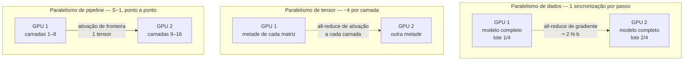
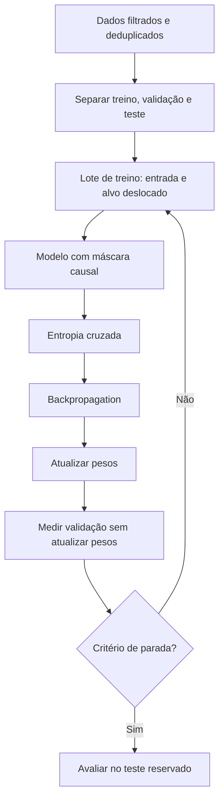
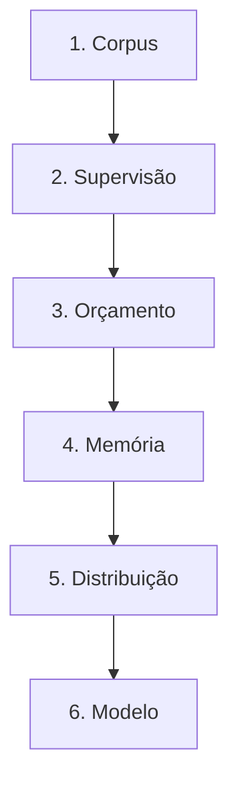

# Especificação de slides — Aula 12 (V2)

> **Rebalanceamento V2.** O fluxo principal abre por **três defeitos observáveis de fábrica** e
> fecha cada um pela causa. Toda fórmula aparece **enunciada e lida**, nunca manipulada; a
> derivação completa está na Parte 2, mais detalhada do que estava na V1. Nada de matemática foi
> perdido — foi realocado.
>
> **Fronteira honrada:** a **Aula 10 (slide 3)** enuncia `C ≈ 6ND` e remete explicitamente a
> derivação do fator 6 para cá. **A.1 desta aula é essa derivação**, completa, com o forward
> contado em 2, o backward em 4, e a atualização do otimizador contabilizada e descartada com
> justificativa quantitativa. A **Aula 10 (A.6)** remete a memória de treino para **A.4 desta
> aula**. As duas remissões resolvem.
>
> Carga horária (120 min), numeração e objetivos de aprendizagem: idênticos à V1.

<!-- SLIDE-FLOW:GUIDE:BEGIN -->
## Fluxogramas na produção dos slides

As orientações abaixo complementam o campo **Visual** dos slides indicados. Produzir os fluxogramas no próprio deck, como formas e conectores editáveis ou gráficos vetoriais; a biblioteca completa ao final torna esta especificação independente do portal.

- **Referência de composição:** título e propósito no topo, blocos numerados, conexões rotuladas, ramificações legíveis e uma saída identificada. Usar apenas o padrão visual da referência fornecida, sem importar seu assunto ou seus exemplos.
- **Tema do deck:** manter o fundo escuro e a paleta já especificada para a aula. Usar `#5b8cff` para o trecho ativo, tons neutros para o contexto e `#e2231a` conforme o significado definido no deck. Cor sempre acompanhada de rótulo.
- **Leitura:** entrada no topo ou à esquerda; saída na base ou à direita. Decisões em losangos, alternativas com rótulos e retornos apontando à etapa correta. Ramos paralelos convergem apenas onde seus resultados realmente são combinados.
- **Densidade:** no fluxo principal, projetar 3–6 blocos curtos por enquadramento, com corpo legível na última fileira. Um mapa maior pode ser revelado por etapas no mesmo slide. Detalhes, condições e explicações completas ficam nas notas; não reduzir a fonte para caber tudo.
- **Semântica:** mapas de percurso mostram ordem de estudo, não execução de um algoritmo. Manter separadas preparação e aplicação, treino e inferência, sequência e alternativas. Não transformar uma etapa opcional em obrigatória.
- **Integração:** o fluxograma substitui uma lista redundante ou ocupa o campo Visual; não cobre matrizes, tabelas, gráficos nem código indispensáveis. Preservar títulos, numeração, duração e referências aos apêndices.
- **Produção:** os blocos Mermaid abaixo são especificações do desenho. Renderizar/reconstruir como diagrama, nunca projetar o código Mermaid. Manter rótulos, bifurcações, retornos e limites declarados. Não transformar este caderno técnico em slides adicionais.
- **Ligação com o portal:** os mapas de mecanismo compartilham o conteúdo dos fluxogramas do portal. Em demonstrações, usar o mesmo vocabulário no deck e no controle interativo para facilitar a passagem entre os dois.
<!-- SLIDE-FLOW:GUIDE:END -->

## Diretrizes visuais

- **Tema:** escuro, accent `#e2231a` (vermelho CESAR), accent secundário `#5b8cff`.
- **Tipografia:** sans-serif para texto; monoespaçada para fórmulas, unidades, notação científica
  e nomes de biblioteca.
- **Densidade:** máximo 5 linhas de texto por slide no fluxo. Um conceito por slide.
- **Aula de contas — regra própria:** todo número do fluxo aparece em bloco monoespaçado com a
  operação visível, **e com a consequência escrita ao lado**. Número sem consequência sai do slide.
- **No fluxo principal:** a fórmula é enunciada e lida em português, e vem sempre acompanhada de um
  número concreto ou de um comportamento que ela prevê. **Nenhuma manipulação algébrica encadeada.**
- **No apêndice:** densidade alta é esperada e desejável. É material de consulta e de estudo.
- **Proibido:** bullets genéricos ("Vantagens", "Desvantagens"); slide-parede de texto; clipart;
  gráfico sem eixo rotulado; notação científica em texto corrido quando ela pode ser um número
  grande em destaque; fórmula sem consequência prática no fluxo.

## Arco narrativo

O deck entra na fábrica que produziu o arquivo de pesos, e entra por três defeitos que a fábrica
tem: um orçamento fixo dividido errado por toda a indústria até 2022, um treino que estoura a
memória antes de estourar a aritmética, e um documento duplicado que o modelo devolve literalmente.
O primeiro bloco percorre o orçamento — o que o próximo token supervisiona de graça, de onde vem o
corpus, o que a curadoria joga fora (e fecha o defeito 3), e as leis de potência que dizem quanto
vale cada década de compute — até o resultado do Chinchilla, que fecha o defeito 1. Depois do
intervalo o deck troca de eixo: sai da teoria do orçamento e entra na máquina que precisa
executá-lo — hora de GPU real, memória (que fecha o defeito 2), precisão mista, os três
paralelismos e FlashAttention. Fecha resolvendo o paradoxo aberto no slide 2 (por que o modelo que
a turma rodou tem milhares de tokens por parâmetro e não vinte) e constatando que toda essa
engenharia entrega um completador de texto — que é exatamente o problema da Aula 13.

---

# PARTE 1 — FLUXO PRINCIPAL

*O que se apresenta em aula. 16 slides, 120 minutos com demo e exercício. As fórmulas são
enunciadas e lidas; as derivações estão na Parte 2 e são apontadas por nome.*

### Slide 1 — Abertura: três defeitos, nenhum deles no código
- **Tipo:** problema (abertura)
- **Título:** A fábrica funciona. E tem três defeitos.
- **Conteúdo:** Os três defeitos projetados juntos, cada um com onde fecha:

  | # | O defeito, como aparece | Onde fecha |
  |---|---|---|
  | 1 | "Tenho orçamento fechado. Modelo maior ou mais tokens?" — e a indústria inteira respondeu errado até 2022 | slide 8 |
  | 2 | O treino estoura a memória da GPU **antes** de estourar a aritmética: `OOM` com a GPU a 30% de ocupação | slide 11 |
  | 3 | O modelo devolve **literalmente** um parágrafo do corpus — e o benchmark que ele acerta estava na web | slide 6 |

  Nenhum dos três é bug de implementação. Os três são consequência correta de uma decisão de
  orçamento tomada antes da primeira linha de código.
- **Frase-tese:** Vocês passaram duas aulas puxando alavancas. Hoje a gente entra na fábrica — e a
  primeira coisa que a fábrica tem é um orçamento.
- **Visual:** full-bleed. À esquerda, as quatro alavancas das Aulas 10–11 em cinza, com uma seta
  atravessando para a direita, onde aparece a silhueta de um galpão de datacenter em accent. Sobre
  o galpão, três etiquetas vermelhas numeradas — os três defeitos —, cada uma com o número do slide
  onde é fechada.
- **Notas do apresentador:** Recap da Aula 11 (Lab 3) em uma frase: as alavancas medidas em três
  eixos, com campo de proveniência. Ler os três defeitos em voz alta e **não** resolver nenhum
  agora. O defeito 2 é o mais concreto para quem sofreu `OOM` no Lab 2 — usar como isca.

### Slide 2 — O número que vocês trouxeram
- **Tipo:** dados (o fundamento nomeado)
- **Título:** Seis vezes parâmetros vezes tokens
- **Conteúdo:** A cobrança da lição de casa da Aula 11, preenchida ao vivo, e as duas contas
  **enunciadas e lidas**, sem serem manipuladas:
  ```
  N = ______ parâmetros        (cartão do modelo do Ollama)
  D = ______ tokens de treino

  treino:      C ≈ 6 · N · D        FLOPs, no total
  inferência:  C ≈ 2 · N            FLOPs, por token gerado

  D / N = ______      ← guardem este número
  ```
  Leitura em português: treinar custa proporcional ao produto de **capacidade** por
  **experiência**; gerar um token custa proporcional só à capacidade ativa. E a assimetria que
  explica a economia da área: treinar é caríssimo e acontece **uma vez**; inferir é barato por
  token e acontece um trilhão de vezes.
- **Frase-tese:** Uma conta de guardanapo separa o que se paga uma vez do que se paga para sempre.
- **Visual:** as duas linhas em corpo grande, com as potências de dez alinhadas verticalmente.
  Ao lado, duas barras de custo: uma enorme rotulada "uma vez" e uma minúscula rotulada
  "× 10¹² requisições" — a segunda visivelmente maior no acumulado. Rodapé em accent: "no meio da
  aula uma teoria vai dizer que o `D/N` certo é 20. O de vocês não é 20."
- **Fundamento:** o fator 6 é `2 + 4` — dois FLOPs por parâmetro por token no forward, quatro no
  backward —, e a atualização do otimizador fica fora da conta porque ela paga por passo, não por
  token. Verificação: `6 × 1,75e11 × 3,0e11 = 3,15e23`, que é o valor reportado para o GPT-3.
  → derivação completa das duas contagens, com a atualização contabilizada e descartada com número:
  **Apêndice A.1** (slide 17)
- **Notas do apresentador:** Fazer a multiplicação devagar na tela, com as potências separadas.
  Turma sem prática de ordem de grandeza erra o expoente e o número perde sentido. **Esta é a
  derivação que a Aula 10 prometeu para cá** — dizer isso em voz alta, porque parte da turma
  perguntou lá. Não derivar aqui: A.1 tem a conta inteira e a Parte 4 do roteiro tem a versão de
  quadro em 5 min.

### Slide 3 — Transferência de aprendizado: um treino caro, muitas tarefas baratas

<!-- SLIDE-FLOW:SLIDE:BEGIN -->
- **Fluxograma a incorporar neste slide:** **F00 — Treinamento por próximo token**. O desenho e os rótulos completos estão no caderno de fluxogramas ao final deste arquivo.
- **Composição:** integrar ao campo Visual; preservar exemplos, tabelas, fórmulas e dimensões solicitados neste slide. Destacar o trecho relacionado ao título e manter o restante em segundo plano. Os textos detalhados ficam nas notas, sem duplicar a lista de Conteúdo na tela.
<!-- SLIDE-FLOW:SLIDE:END -->

- **Tipo:** comparação
- **Título:** Um treino caro, muitas tarefas baratas
- **Conteúdo:** Duas colunas. **Antes:** uma tarefa → um dataset rotulado à mão → um modelo → um
  deploy; o teto é o custo de anotação. **Depois:** um objetivo genérico → um pré-treino caríssimo →
  adaptação com pouco ou nenhum dado novo; o teto é o custo de compute. Rodapé com a definição
  operacional para quem não fez ML: *treinar = ajustar pesos por descida de gradiente para reduzir
  uma perda; a perda do pré-treino é a mesma entropia cruzada do próximo token que vocês
  minimizaram no Lab 2.*
- **Frase-tese:** A perda do pré-treino é a mesma que vocês minimizaram no Lab 2. A diferença para
  o GPT-3 não é de ideia — é de orçamento.
- **Visual:** split 50/50. Esquerda: N caixinhas "dataset → modelo" repetidas, em cinza. Direita:
  uma caixa grande única em accent com N setas finas saindo dela. Sob a caixa grande, a etiqueta
  `2,7 M (Lab 2) ─────── 175 B (GPT-3)` como uma régua logarítmica.
- **Notas do apresentador:** É aqui que a metade da turma sem ML se perde ou se salva. Gastar 60 s
  extras na definição de perda e gradiente se as mãos hesitarem. Não abrir teoria de otimização.

### Slide 4 — O rótulo que não existe: o supervisor é o corpus

<!-- SLIDE-FLOW:SLIDE:BEGIN -->
- **Fluxograma a incorporar neste slide:** **F00 — Treinamento por próximo token**. O desenho e os rótulos completos estão no caderno de fluxogramas ao final deste arquivo.
- **Composição:** integrar ao campo Visual; preservar exemplos, tabelas, fórmulas e dimensões solicitados neste slide. Destacar o trecho relacionado ao título e manter o restante em segundo plano. Os textos detalhados ficam nas notas, sem duplicar a lista de Conteúdo na tela.
<!-- SLIDE-FLOW:SLIDE:END -->

- **Tipo:** conceito
- **Título:** Ninguém rotulou nada — o supervisor é o corpus
- **Conteúdo:** O contraste em três pontos: (a) ML supervisionado clássico é limitado pelo que se
  consegue pagar para anotar; (b) no pré-treino o rótulo de cada posição é o token seguinte, que já
  está no corpus; (c) a densidade de sinal — um lote de `64 × 128` do Lab 2 produzia `8.192`
  previsões supervisionadas de uma vez. Correção de vocabulário em destaque: não é "não
  supervisionado"; é auto-supervisionado, e a consequência prática é que **a qualidade do corpus é
  decisão de modelagem**, não de infraestrutura.
- **Frase-tese:** O supervisor deste treino é o corpus — e é por isso que a próxima meia hora é
  sobre corpus.
- **Visual:** uma sequência de tokens numa linha, com uma seta curva de cada token para o seguinte
  rotulada `alvo`. Abaixo, a conta `64 × 128 = 8.192 exemplos por lote` em monoespaçada destacada.
- **Notas do apresentador:** Se perguntarem por que se chama auto-supervisionado, é convenção para
  marcar que o rótulo é derivado do dado sem anotação humana. Não brigar com o termo. Este slide é
  a ponte para o defeito 3: se o supervisor é o corpus, um corpus com duplicata supervisiona a
  mesma coisa duas vezes.

### Slide 5 — De onde vem o texto: a mistura do corpus

<!-- SLIDE-FLOW:SLIDE:BEGIN -->
- **Fluxograma a incorporar neste slide:** **F00 — Treinamento por próximo token**. O desenho e os rótulos completos estão no caderno de fluxogramas ao final deste arquivo.
- **Composição:** integrar ao campo Visual; preservar exemplos, tabelas, fórmulas e dimensões solicitados neste slide. Destacar o trecho relacionado ao título e manter o restante em segundo plano. Os textos detalhados ficam nas notas, sem duplicar a lista de Conteúdo na tela.
<!-- SLIDE-FLOW:SLIDE:END -->

- **Tipo:** comparação
- **Título:** Quatro fontes, quatro coisas diferentes
- **Conteúdo:** Quatro blocos, cada um com volume relativo, qualidade média e o que **só** ele
  ensina:
  - **Web** (CommonCrawl e derivados) · volume: trilhões de tokens · qualidade média: baixa ·
    ensina: **quantidade**
  - **Livros** · volume: médio · qualidade: alta · ensina: **coerência longa**, dependência de
    milhares de tokens
  - **Código** · volume: médio · qualidade: verificável · ensina: **formato e estrutura estrita**
  - **Enciclopédico e curado** (Wikipédia, artigos, documentação) · volume: pequeno · qualidade:
    alta · ensina: **densidade de fato**

  Faixa inferior: a **mistura** — quantas épocas de cada fonte — é uma decisão de treino, e é o
  ponto em que os cartões de modelo ficam vagos.

  **E a linhagem, para que "curadoria importa" pare de ser adjetivo.** As receitas públicas são
  comparáveis e a evolução delas é uma sequência de decisões que alguém tomou e publicou:
  `CCNet` (2019, filtra a web por semelhança com a Wikipédia) → `C4` (2019, filtra por regras) →
  `Gopher` (2021, regras de qualidade) → `DCLM` e `FineWeb` (2024) → `Nemotron-CC` (2024) →
  `OLMo 2` (2025). Dois mecanismos separam uma da outra, e são só dois:
  - **deduplicação**, na prática por `MinHash` — porque a web repete, e repetição vira memorização
    em vez de generalização (é o Defeito 3 desta aula, do parágrafo devolvido literalmente);
  - **filtro de qualidade por classificador** — treina-se um classificador barato para distinguir
    texto "tipo Wikipédia/livro" de texto "tipo web bruta" e descarta-se a cauda, em vez de
    escrever regra a regra.
- **Frase-tese:** Nenhuma das quatro fontes sozinha dá o modelo.
- **Visual:** quatro colunas com largura proporcional ao volume (a web dominando) e
  altura/saturação proporcional à qualidade — deliberadamente invertidas entre si, para que a
  tensão apareça sem legenda. Rodapé em accent com a faixa da mistura.
- **Notas do apresentador:** Direito autoral de corpus é pergunta legítima e é Aula 29. Não abrir
  aqui — consome 15 min. O JSON que a turma pediu no Lab 3 e recebeu formatado veio do código: é o
  gancho concreto da terceira fonte.

### Slide 6 — [Defeito 3 fechado] O parágrafo que o modelo devolve literalmente

<!-- SLIDE-FLOW:SLIDE:BEGIN -->
- **Fluxograma a incorporar neste slide:** **F00 — Treinamento por próximo token**. O desenho e os rótulos completos estão no caderno de fluxogramas ao final deste arquivo.
- **Composição:** integrar ao campo Visual; preservar exemplos, tabelas, fórmulas e dimensões solicitados neste slide. Destacar o trecho relacionado ao título e manter o restante em segundo plano. Os textos detalhados ficam nas notas, sem duplicar a lista de Conteúdo na tela.
<!-- SLIDE-FLOW:SLIDE:END -->

- **Tipo:** conceito (fundamento aplicado a um sintoma)
- **Título:** Deduplicar não é limpeza. É orçamento.
- **Conteúdo:** O sintoma do slide 1, agora com causa: um documento que aparece em mil espelhos da
  web é visto mil vezes pelo modelo, e um exemplo visto mil vezes é **memorizado**, não
  generalizado. Três efeitos mensuráveis da duplicata, e os três são o mesmo defeito visto de
  ângulos diferentes:
  ```
  1. compute   você pagou dois tokens e recebeu um token de sinal
  2. memória   repetição aumenta memorização literal → vazamento de dado, risco jurídico
  3. avaliação se o teste está na web e a web está no treino, o benchmark mede MEMÓRIA
  ```
  As três operações de curadoria: **deduplicar** (exata + aproximada, MinHash/LSH sobre n-gramas),
  **filtrar qualidade** (heurísticas de símbolo, linha repetida e comprimento + classificador
  contra corpus de referência) e **balancear** (a mistura do slide anterior). E a tensão que **não**
  está resolvida: filtrar melhora a perda por token e **reduz o total de tokens** — e depois do
  Chinchilla o total de tokens é a restrição, não a folga.
- **Frase-tese:** Cada token repetido é compute que vocês compraram e jogaram fora. E se o teste
  estava na web, o número que vocês publicaram mede memória, não generalização.
- **Visual:** funil vertical: entra "trilhões de tokens crus", saem três dutos laterais rotulados
  `duplicata`, `baixa qualidade`, `contaminação`, e sai embaixo um volume visivelmente menor. O
  duto de contaminação em accent, com seta apontando para "Aula 27 — Avaliação". No topo, a
  etiqueta do defeito 3 do slide 1, agora riscada.
- **Notas do apresentador:** A contaminação é gancho da Aula 27. Deixar e não desenvolver. Se
  engatarem em "como detectar contaminação", a resposta honesta é: é difícil e quase ninguém faz
  bem. Filtro agressivo demais é um jeito elegante de ficar sem dado — essa frase volta no slide 8.

### Slide 7 — Leis de escala: a perda cai como lei de potência

<!-- SLIDE-FLOW:SLIDE:BEGIN -->
- **Fluxograma a incorporar neste slide:** **F00 — Treinamento por próximo token**. O desenho e os rótulos completos estão no caderno de fluxogramas ao final deste arquivo.
- **Composição:** integrar ao campo Visual; preservar exemplos, tabelas, fórmulas e dimensões solicitados neste slide. Destacar o trecho relacionado ao título e manter o restante em segundo plano. Os textos detalhados ficam nas notas, sem duplicar a lista de Conteúdo na tela.
<!-- SLIDE-FLOW:SLIDE:END -->

- **Tipo:** dados
- **Título:** A perda cai como lei de potência — e o expoente é a notícia
- **Conteúdo:** As três leis de Kaplan et al., **enunciadas** com os expoentes, e a tradução que
  importa:
  ```
  L(N) = (N_c / N)^α_N        α_N ≈ 0,076      (parâmetros)
  L(D) = (D_c / D)^α_D        α_D ≈ 0,095      (tokens)
  L(C) = (C_c / C)^α_C        α_C ≈ 0,050      (computação)

  10×  compute   →  10,9 % menos perda
  ½    da perda  →  10⁶ × mais compute
  ```
  Lei de potência significa **reta em log-log** — e é assim que se verifica se ela vale. Duas
  ressalvas em rodapé: a lei é sobre **perda por token**, não sobre capacidade em tarefa; e ela
  pressupõe que os outros dois eixos acompanhem — o furo que o Chinchilla encontrou.
- **Frase-tese:** A lei de escala não promete barato. Promete previsível — e é isso que faz alguém
  assinar um cheque de nove dígitos com uma extrapolação em vez de com fé.
- **Visual:** uma reta descendente em eixos log-log rotulados (`compute (FLOPs)` × `perda
  (nats/token)`), com a inclinação anotada `α ≈ 0,05` e duas marcas de década no eixo x mostrando o
  degrau de 10,9%. Nada de curva decorativa: a reta é o ponto.
- **Fundamento:** `10^(−0,05) = 0,891`, logo 10,9% por década; e para uma redução relativa `f` o
  fator de compute é `(1−f)` elevado a `−1/α_C`, isto é, a `−20` — o expoente pequeno aparece
  **invertido**, e é essa inversão que torna o número absurdo.
  → derivação das duas leituras do expoente, a tabela `f → fator`, a sensibilidade a `1/α`, e a
  discrepância de expoente que custou uma geração de modelos: **Apêndice A.3** (slide 19)
- **Notas do apresentador:** Escrever `10^−0,05 = 0,891` no quadro e fazer a subtração à mão — o
  número feito na frente deles fixa. As constantes `N_c` e `D_c` são ajustes daquele corpus e
  daquele tokenizador, não transferíveis: é a armadilha da perplexidade da Aula 1 aparecendo nas
  constantes. Não derivar; A.3 tem a conta e o caso-limite `C → ∞`.

### Slide 8 — [Defeito 1 fechado] A pergunta não era "quão grande" — era "como dividir o cheque"
- **Tipo:** dados
- **Título:** Chinchilla: o mesmo compute, alocado diferente
- **Conteúdo:** A restrição, o resultado e o contrafactual. Os três **enunciados**, sem derivação:
  ```
  restrição:   C ≈ 6 · N · D          fixar C amarra N e D
  resultado:   D_opt ≈ 20 · N_opt     a curva isoFLOP tem mínimo interior
  logo:        C = 120 · N²    ⇒    N_opt ≈ √(C / 120)
  ```

  | | N | D | D/N | C |
  |---|---|---|---|---|
  | GPT-3 real | 175 B | 300 B | 1,7 | `3,15e23` |
  | ótimo no mesmo `C` | **51 B** | **1,02 T** | 20 | `3,15e23` |
  | Gopher | 280 B | 300 B | 1,1 | `5,0e23` |
  | Chinchilla | **70 B** | **1,4 T** | 20 | `5,9e23` |

  O defeito 1 do slide 1 tinha causa técnica: o ajuste anterior implicava crescer parâmetros muito
  mais rápido que dados, e ele estava enviesado. Hoffmann et al. não só disseram — treinaram o
  Chinchilla contra o Gopher com compute equivalente, e o menor ganhou.
- **Frase-tese:** Quase todo modelo grande de 2020 foi treinado com a proporção errada de dado e
  parâmetro. Não por descuido: por um expoente ajustado errado.
- **Visual:** metade superior com o bloco de fórmulas; metade inferior com a tabela, as linhas
  "ótimo" e "Chinchilla" em accent. Ao lado, duas silhuetas de caminhão: motor enorme com tanque
  vazio × motor médio com tanque cheio. No topo, a etiqueta do defeito 1, agora riscada.
- **Fundamento:** com a perda na forma `L(N,D) = E + A/N^α + B/D^β` e `D` amarrado pela restrição,
  a perda em função de `N` é a soma de uma potência decrescente e uma crescente — logo tem mínimo
  interior. A razão `D/N` sai proporcional a `C` elevado a `(α−β)/(α+β)`, e com os expoentes
  ajustados esse número é ~0,097: **quase zero**, e é isso que licencia falar de razão fixa.
  → otimização completa com restrição, os expoentes explícitos, por que a razão é "constante o
  suficiente" e não constante, e as três ressalvas: **Apêndice A.2** (slide 18)
- **Notas do apresentador:** Slide mais importante do Bloco 1 — **não cortável**. Fazer
  `3,15e23 / 120 = 2,625e21` e a raiz `≈ 5,1e10` ao vivo, com calculadora projetada. Se a turma
  reagir com "então modelo grande é inútil", **segurar**: a resposta é o slide 16 e ela funciona
  melhor com a turma desconfortável por uma hora. Não antecipar.

### Slide 9 — [Demo] A curva isoFLOP e o ponto ótimo
- **Tipo:** transição para demonstração
- **Título:** `demo-scaling-laws.py` — Python puro, sem GPU, sem rede
- **Conteúdo:** O que a demo mostra, em quatro itens, sem resultado — o resultado aparece ao vivo:
  (1) tabela de alocação ótima de `10¹⁹` a `10²⁵` FLOPs; (2) perda × compute em log-log;
  (3) curvas **isoFLOP** com os mínimos marcados; (4) o contrafactual do GPT-3 e a conversão de
  horas de GPU em FLOPs. Aviso de proveniência em destaque: *as constantes da superfície de perda
  são calibradas para fins didáticos — reproduzem a razão 20:1, não são os coeficientes publicados
  do ajuste.*
- **Frase-tese:** O mínimo do U não é opinião de arquitetura. É onde as duas potências se cruzam —
  e a razão que sai dali é vinte tokens por parâmetro.
- **Visual:** slide quase vazio, de transição. À esquerda, os quatro itens numerados em
  monoespaçada; à direita, dois eixos vazios rotulados `N (parâmetros)` × `perda`, esperando o U
  aparecer.
- **Notas do apresentador:** Passos na Parte 2 do roteiro. Terminal com fonte grande. Se o
  `matplotlib` não abrir janela, usar os PNGs da véspera; se não houver Python, desenhar o U no
  quadro em 90 s. **Os números que esta demo produz voltam nos slides 8, 10, 15 e 16** — a coluna
  `D/N = 20`, o contrafactual `51 B / 1,02 T` e o par `6,0e20 → 2,2 B`. Intervalo de 10 min depois
  deste slide.

### Slide 10 — `C ≈ 6ND` com hora de GPU real
- **Tipo:** dados
- **Título:** De FLOPs para coisa que se compra
- **Conteúdo:** A conversão e a conta que o exercício vai refazer:
  ```
  C_disponível = pico_FLOP/s · n_GPUs · MFU · segundos

  8 GPUs · 312e12 FLOP/s · 0,40 MFU · 604.800 s  ≈  6,0e20 FLOPs
      ⇒  N ≈ 2,2e9 parâmetros        (a demo imprimiu este número)
      ⇒  D ≈ 4,5e10 tokens
  ```
  A **MFU** (*model FLOPs utilization*) é a fração do pico teórico que o treino realmente aproveita:
  30% a 50% em treino bem ajustado, 10% em treino mal ajustado. Escala de referência: GPT-3
  `3,1e23` · Chinchilla `5,9e23` · fronteira atual 1 a 2 ordens acima, valor exato
  `[definir na oferta]` — os laboratórios pararam de publicar. Alerta em destaque: dividir FLOPs
  pelo pico teórico **sem MFU** erra por 2 a 3 vezes.
- **Frase-tese:** Uma semana de oito GPUs compra um modelo de dois bilhões de parâmetros. É por
  isso que ninguém nesta sala vai pré-treinar nada — e é por isso que o Módulo 3 é sobre adaptar.
- **Visual:** a conta em cascata, uma linha por multiplicação, com o resultado parcial à direita de
  cada linha. Abaixo, uma régua logarítmica de FLOPs com quatro marcas: `6e20` (o orçamento do
  exercício), `3,1e23` (GPT-3), `5,9e23` (Chinchilla), `~1e25` (fronteira estimada) — a primeira
  marca visivelmente colada na origem.
- **Fundamento:** o `6` desta conta é o mesmo do slide 2, e a conversão de horas de GPU só é
  honesta com a MFU dentro. Com recomputação de ativações ligada — o que é a regra em treino
  grande — o fator sobe de 6 para ~8, porque há um forward extra por bloco recomputado.
  → contagem do fator 6 e o caso-limite da recomputação: **Apêndice A.1** (slide 17) · gabarito
  aritmético completo desta conta: **Apêndice A.2** (slide 18)
- **Notas do apresentador:** Falar cada multiplicação em voz alta. Os 312 TFLOP/s são pico bf16 de
  acelerador de datacenter de geração anterior; o valor da GPU da oferta é `[definir na oferta]`.
  Manter a saída `--orcamento-gpu` do script **coberta** até a correção do exercício.

### Slide 11 — [Defeito 2 fechado] O `OOM` que acontece com a GPU ociosa
- **Tipo:** dados (fundamento aplicado a um sintoma)
- **Título:** 16 bytes por parâmetro — o aluguel que o peso paga cinco vezes
- **Conteúdo:** O defeito 2 do slide 1, com causa: o limite do treino quase nunca é aritmética. É
  memória, e a conta é por parâmetro.
  ```
  peso de cálculo    bf16    2 bytes/param
  gradiente          bf16    2
  peso mestre        fp32    4
  Adam, momento m    fp32    4
  Adam, momento v    fp32    4
  ────────────────────────────────────────
  total                     16 bytes/param    (+ ativações, que NÃO seguem esta regra)

  7 B params × 16  =  104 GiB   →  não cabe em GPU de 80 GB (74,5 GiB)
  ```
  Quatro consumidores, não cinco: **pesos** (6 bytes, em duas precisões), **gradientes** (2),
  **os dois momentos do Adam** (8 — metade do orçamento) e **ativações**, que escalam com lote e
  comprimento de sequência e não com `N`. Remédio parcial: **recomputação de ativações**
  (*gradient checkpointing*) — troca ~30% de tempo por uma ordem de grandeza de memória, e é a
  opção que será ligada no Lab 4. Gancho: é o mesmo fenômeno que estourou a T4 no Lab 2 quando
  alguém dobrou `block_size` — `N` não mudou, a matriz de atenção quadruplicou.
- **Frase-tese:** Na maioria dos casos o limite do treino não é aritmética. É memória — e metade do
  orçamento vai para dois estados do otimizador que ninguém lembra que existem.
- **Visual:** barra empilhada de 16 segmentos com os cinco componentes rotulados e coloridos, com
  os dois momentos do Adam ocupando visivelmente metade. Ao lado, a barra "GPU 80 GB" visivelmente
  menor que a barra "104 GiB" de um modelo de 7 B; o excesso em accent. No topo, a etiqueta do
  defeito 2, agora riscada.
- **Fundamento:** `2 + 2 + 4 + 4 + 4 = 16`, e as ativações somam por cima com uma lei própria,
  proporcional a `lote × comprimento × camadas × d_model` — o que faz delas o único consumidor que
  é **escolha de configuração**, e portanto o primeiro a cortar num `OOM`.
  → livro-caixa completo, os quatro consumidores agrupados, a conta de ativações instanciada
  (128 GiB com lote 8 e contexto 4k), por que precisão mista **não** economiza estado de
  otimizador, e os casos-limite de inferência e de estados em 8 bits: **Apêndice A.4** (slide 20)
- **Notas do apresentador:** Escrever `2 + 2 + 4 + 4 + 4 = 16` em coluna no quadro — é a conta mais
  cobrável da aula. Se perguntarem por que o Adam guarda dois momentos: média móvel do gradiente
  (direção) e do quadrado do gradiente (escala por parâmetro). **Não derivar Adam.** A conta de
  ativações está em A.4 e é a resposta para "então por que o meu `OOM` sumiu quando eu baixei o
  lote?".

### Slide 12 — Precisão mista: bf16 para calcular, fp32 para acumular
- **Tipo:** conceito
- **Título:** Calcular em 16 bits, acumular em 32
- **Conteúdo:** Por que o parâmetro aparece duas vezes no slide anterior: multiplicação em 16 bits
  é muito mais rápida e as ativações ocupam metade, mas somar milhares de gradientes pequenos em 16
  bits perde os bits menos significativos. Logo: forward e backward em 16 bits, peso mestre e
  estados do otimizador em fp32, atualização na precisão alta. A distinção que aparece em código:
  - **`fp16`** — mais mantissa, **faixa dinâmica menor** → gradiente pequeno vira zero → exige
    **loss scaling**
  - **`bf16`** — mesma faixa do fp32, menos mantissa → sem underflow → **dispensa** loss scaling;
    é o padrão atual, e só existe em GPU Ampere ou mais nova (a T4 do Colab é Turing — Lab 4)
- **Frase-tese:** Precisão mista não é treinar em 16 bits. Se fosse, o treino divergia.
- **Visual:** dois retângulos de bits lado a lado (`fp16` e `bf16`) com expoente e mantissa
  marcados em cores diferentes, e o do `fp32` acima como régua. Ao lado, um diagrama de ciclo:
  `bf16 forward → bf16 backward → fp32 update → cópia para bf16`.
- **Fundamento:** a soma dos 16 bytes de A.4 é **idêntica** em fp32 puro (4+4+4+4) e em precisão
  mista (2+2+4+4+4). Precisão mista não compra memória de estado de otimizador: compra vazão de
  multiplicação e metade da memória de **ativação**.
  → a verificação dessa igualdade e o que ela implica para quem espera economia de memória do bf16:
  **Apêndice A.4** (slide 20)
- **Notas do apresentador:** Pergunta previsível sobre fp8: já usado em treino de fronteira com
  escalonamento por bloco, mesmo princípio — calcular baixo, acumular alto. Não abrir. A frase
  "precisão mista não economiza estado" é contraintuitiva e vale repetir uma vez.

### Slide 13 — Paralelismo de dados, de tensor e de pipeline
- **Tipo:** diagrama
- **Título:** A pergunta nunca é quantas GPUs. É o que passa no cabo.
- **Conteúdo:** Os três, com o que replicam, o que particionam, o que comunicam e **quantas vezes**:

  | | Replica | Particiona | Comunica | Sincronizações por passo |
  |---|---|---|---|---|
  | **Dados** | modelo inteiro | o lote | gradiente (`all-reduce`) | **1** |
  | **Tensor** | nada | as matrizes de peso | ativação (`all-reduce`) | **~4 por camada** |
  | **Pipeline** | nada | as camadas | ativação de fronteira | `S−1`, ponto a ponto |

  Regra geográfica em destaque: **tensor dentro do nó · pipeline entre nós · dados por cima de
  tudo** (paralelismo 3D). O critério que ordena os três é o **número de sincronizações**, não o
  volume — e é por isso que o tensor, que move menos bytes, é o mais caro. Variantes ZeRO/FSDP
  particionam os 16 bytes de A.4 entre as réplicas e removem a exigência de o modelo caber, ao
  custo de ~50% mais tráfego. Alerta: em escala, adicionar GPU pode **aumentar** o tempo por passo.
- **Frase-tese:** Escalabilidade em treino distribuído é um problema de rede vestido de problema de
  computação.
- **Visual:** três faixas horizontais empilhadas, uma por paralelismo, cada uma com 4 GPUs
  desenhadas e uma seta rotulada com a grandeza que trafega (espessura da seta ∝ volume
  comunicado, número de setas ∝ sincronizações). Na faixa do pipeline, marcar a bolha como blocos
  vazios no início e no fim do turno.
- **Fundamento:** no paralelismo de dados o volume comunicado é `≈ 2·N·b` por dispositivo por
  passo — **independente do lote**, o que é a propriedade que o faz escalar. No de pipeline a
  fração de tempo ocioso é `(S−1)/(M+S−1)`, com `S` estágios e `M` micro-lotes.
  → volumes instanciados dos três (26 GiB, 8 GiB, 32 MiB), a conta da bolha para `M = 8, 32, 128`,
  o critério de sincronizações e o ponto `P*` a partir do qual mais GPU é mais lento:
  **Apêndice A.5** (slide 21)
- **Notas do apresentador:** Desenhar os três no quadro, um embaixo do outro, com a seta rotulada
  pelo que trafega. Se o tempo apertar, cortar ZeRO/FSDP — é detalhe de biblioteca — e proteger a
  distinção entre os três e a bolha. A pergunta boa para lançar se sobrar tempo: por que MoE
  (Aula 10) complica isso? Roteamento é comunicação **irregular**.



### Slide 14 — FlashAttention: atenção exata, consciente da memória
- **Tipo:** conceito
- **Título:** Mesma complexidade, várias vezes mais rápida
- **Conteúdo:** O que a Aula 6 disse e o que faltava: `O(n²·d)` em FLOPs é verdade, e continua
  verdade depois do FlashAttention — porque ele calcula **exatamente as mesmas** multiplicações.
  O que muda é outra grandeza: **acessos à HBM**. A implementação ingênua materializa a matriz
  `n × n` de escores na HBM e faz **quatro travessias** dela: escreve escores, lê para o softmax,
  escreve, lê para multiplicar por `V`. FlashAttention faz **tiling** em blocos que caibam na
  **SRAM**, usa **softmax online** (máximo corrente e denominador parcial, corrigidos a cada
  bloco) e **recomputa** no backward. Resultado em três linhas:
  ```
  FLOPs                 O(n²·d)  →  O(n²·d)     IDÊNTICO
  acessos à HBM         O(n²)    →  O(n²·d²/M)  ~25× menos com d=64
  memória da atenção    O(n²)    →  O(n)
  saída                 numericamente a MESMA
  ```
  Aviso em destaque: FlashAttention **não** está na prateleira de Longformer / Performer / atenção
  linear — aquelas trocam **exatidão** por custo; esta troca **ordem de acesso** por custo.
- **Frase-tese:** É a mesma atenção, com outra ordem de leitura e escrita. Otimizar FLOPs numa
  operação limitada por banda não faz nada — é preciso mover menos, não calcular menos.
- **Visual:** pirâmide de memória com três níveis rotulados com capacidade e banda
  (SRAM ≪ HBM ≪ host), e ao lado dois fluxos comparados: o ingênuo com 4 setas atravessando a
  fronteira HBM↔SRAM sobre uma matriz `n × n` inteira, e o Flash com blocos pequenos entrando e
  saindo e **nenhuma** matriz `n × n` desenhada. A ausência da matriz grande no segundo fluxo é o
  ponto visual.
- **Fundamento:** o argumento é de I/O, não de aritmética: a versão ingênua move `Θ(n²)` bytes
  pela fronteira HBM↔SRAM, a versão por blocos move `Θ(n²·d²/M)` com `M` o tamanho da SRAM. Com
  `n = 4096` e 2 bytes por elemento, cada travessia da matriz de escores move 33,5 MB — e há
  quatro delas, por cabeça, por camada, por exemplo.
  → contagem de I/O das duas versões, o softmax online com a identidade de reescala que o torna
  exato, e os quatro casos-limite (n pequeno, d grande, decodificação, máscara causal):
  **Apêndice A.6** (slide 22)
- **Notas do apresentador:** Desenhar a hierarquia no quadro como três caixas de tamanho e
  velocidade inversos — vale mais que o slide. Se alguém perguntar se FlashAttention resolve
  contexto de 1 M de tokens: **não sozinha** — ela resolve o termo de memória da atenção, e o KV
  cache da Aula 10 continua crescendo linearmente. Ela está ligada no Lab 4 sem que ninguém perceba.

### Slide 15 — [Exercício] Decidir, não calcular
- **Tipo:** exercício
- **Título:** Em dupla, 4 minutos: cabe? o que estoura primeiro? qual paralelismo?
- **Conteúdo:** O cenário está resolvido na tela — a demo já imprimiu os números. O que se pede é a
  **decisão**:
  > *Orçamento: 8 GPUs equivalentes a A100 por 7 dias, pico 312 TFLOP/s em bf16, MFU 40%.*
  > *A demo imprimiu: `C ≈ 6,0e20 FLOPs`, `N ≈ 2,2e9`, `D ≈ 4,5e10`.*

  1. Esse modelo **cabe** no treino que vocês dimensionaram? Que conta responde isso, e o que ela
     conta?
  2. O que estoura primeiro — memória ou aritmética? Que **medição** confirma o diagnóstico?
  3. Se não couber numa GPU, qual paralelismo primeiro — e o que ele passa a comunicar?
  4. Vocês têm 45 B de tokens no orçamento e um corpus cru de 300 B com 40% de duplicata. Filtrar
     agressivamente ajuda ou atrapalha? Justifiquem com um dos três efeitos do slide 6.
- **Frase-tese:** Nenhuma das quatro pede derivação. As quatro pedem saber o que a conta prevê.
- **Visual:** as quatro perguntas numeradas à esquerda, com espaço à direita para a resposta.
  Cronômetro de 4 min no canto. Rodapé pequeno com as fórmulas necessárias já escritas
  (`16 bytes/param`, `8 × 80 GB`) — o exercício testa o raciocínio, não a memória de fórmula.
- **Fundamento:** a resposta ao item 1 é `2,2e9 × 16 = 35,2e9 bytes ≈ 32,8 GiB` de estados contra
  `8 × 74,5 GiB` de memória agregada: **cabe distribuído, não cabe numa GPU só**. Daí o item 3 ser
  dados com estados particionados, e **não** tensor.
  → a conta de memória: **Apêndice A.4** (slide 20) · o custo de comunicação de cada escolha:
  **Apêndice A.5** (slide 21)
- **Extensão opcional, para quem terminar antes:** refazer à mão a aritmética que a demo fez —
  de pico e MFU até `C`, e de `C` até `(N, D)`. **Gabarito completo em A.2.**
- **Notas do apresentador:** Condução na Parte 3 do roteiro. Erro nº 1 no item 1 é contar só os
  pesos (2 bytes) e concluir que cabe folgado; erro nº 2 no item 3 é responder "tensor" por ser o
  que soa mais sofisticado. O item 4 é o que amarra o Bloco 1 ao Bloco 2 e é o que eu corrijo se
  só houver tempo para um.

### Slide 16 — Fechamento: a fábrica entrega um completador de texto

<!-- SLIDE-FLOW:SLIDE:BEGIN -->
- **Fluxograma a incorporar neste slide:** **F01 — O percurso desta aula**. O desenho e os rótulos completos estão no caderno de fluxogramas ao final deste arquivo.
- **Composição:** integrar ao campo Visual; preservar exemplos, tabelas, fórmulas e dimensões solicitados neste slide. Destacar o trecho relacionado ao título e manter o restante em segundo plano. Os textos detalhados ficam nas notas, sem duplicar a lista de Conteúdo na tela.
<!-- SLIDE-FLOW:SLIDE:END -->

- **Tipo:** encerramento
- **Título:** 20 tokens por parâmetro × milhares — os dois estão certos
- **Conteúdo:** Os três defeitos fechados pela causa, em uma linha cada, e a resolução do paradoxo
  do slide 2:
  ```
  defeito 1  divisão do cheque   →  isoFLOP tem mínimo interior      (slide 8, A.2)
  defeito 2  OOM com GPU ociosa  →  16 bytes/param + ativações       (slide 11, A.4)
  defeito 3  parágrafo literal   →  duplicata memoriza e contamina   (slide 6)
  ```
  - **Chinchilla otimiza o custo de treinar.** Uma vez.
  - **Quem serve o modelo otimiza a inferência.** Cada parâmetro extra custa memória e latência em
    *toda* requisição, para sempre.
  - Logo: treinar um modelo pequeno **muito além** de 20:1 é caro no treino e barato para sempre —
    e é por isso que existe um modelo de 1 B bom o suficiente para rodar na máquina de vocês.

  Fecho: o que sai da fábrica **continua texto**. Prompt `"qual a capital da França?"` → uma
  continuação perfeitamente coerente é `"qual a capital da Alemanha? qual a capital da Itália?"`.
  Não é defeito. Leituras: Kaplan et al., *Scaling Laws* (arXiv 2001.08361) · Hoffmann et al.,
  *Chinchilla* (arXiv 2203.15556) · Dao et al., *FlashAttention* (arXiv 2205.14135).
- **Frase-tese:** Toda essa fábrica entrega uma máquina que continua texto. Amanhã a gente descobre
  que virar assistente custa uma fração de um por cento disso.
- **Visual:** duas metades. Topo: dois eixos "custo de treino" e "custo de inferência" com duas
  curvas se cruzando, marcando por que 20:1 e milhares:1 são ótimos de funções diferentes. Base:
  um balão de prompt com `"qual a capital da França?"` e a continuação em lista de exercícios ao
  lado, em monoespaçada — a piada é o argumento. Rodapé com os três arXiv IDs em fonte grande, para
  fotografar, e a seta para "Aula 13 — SFT e fine-tuning eficiente: LoRA e QLoRA". Num canto
  discreto, o índice do apêndice: A.1 `C ≈ 6ND` · A.2 Chinchilla · A.3 lei de potência · A.4
  memória · A.5 comunicação · A.6 FlashAttention.
- **Fundamento:** a função-objetivo de quem serve o modelo é `6·N·D + 2·N·(tokens gerados na vida
  do produto)`, e quando o segundo termo domina o ótimo se desloca para `N` menor e `D` muito
  maior. Um modelo de 1 B treinado com 15 T de tokens tem `D/N = 15.000` — 750× acima do "ótimo" —
  e **não** está errado.
  → a inversão da função-objetivo e as três ressalvas sobre o 20:1: **Apêndice A.2** (slide 18)
- **Notas do apresentador:** O paradoxo só funciona se a turma ficou incomodada desde o slide 8 —
  **não antecipar**. Projetar o índice do apêndice por 20 s e nomear **A.1** em voz alta: é a
  derivação que a Aula 10 prometeu e é a conta que a prova cobra. 20 s de silêncio nas leituras
  para fotografar. Lembrar: quem não abriu o Colab com GPU tem uma aula de prazo antes do Lab 4.

---

# PARTE 2 — APÊNDICE MATEMÁTICO

> Material de estudo e consulta. **Não se apresenta em aula**; é distribuído com o deck.
> **Autossuficiente:** quem estuda por aqui sem ter assistido à aula consegue reconstruir tudo.
> Notação declarada, premissas explícitas, nenhuma etapa pulada, casos-limite trabalhados.

### Slide 17 — A.1 · De onde sai `C ≈ 6ND`
- **Tipo:** apêndice — contagem de operações, completa
- **Invocado em:** slides 2 e 10 desta aula, **e no slide 3 da Aula 10**, que remete a derivação do
  fator 6 explicitamente para cá.

**O que se estabelece.** Que o custo de treinar um modelo de `N` parâmetros sobre `D` tokens é
`C ≈ 6·N·D` FLOPs, com o `6` decomposto em `2` de forward e `4` de backward, e que o passo do
otimizador é legitimamente desprezível — por uma razão estrutural, não por descuido.

**Notação.**
`N` — número de parâmetros que participam de multiplicação de matriz. (A tabela de embedding de
entrada é um *lookup*, não um produto: ela conta em "parâmetros totais" e **não** conta aqui. Ver
casos-limite.)
`D` — número total de tokens processados no treino, contando repetições de época.
`C` — custo total em **FLOPs**, onde 1 FLOP = uma multiplicação **ou** uma adição em ponto
flutuante. Esta é a convenção usual desta contagem: uma multiplicação-acumulação vale 2 FLOPs.
`W ∈ ℝ^(d_out × d_in)` — a matriz de uma camada linear; `|W| = d_out · d_in` é o número de
parâmetros dela.
`L` — a perda escalar; `∂L/∂·` denota o gradiente da perda em relação ao que está no denominador.

**Premissas, explícitas.**
1. O custo é dominado pelas multiplicações de matriz das camadas lineares. Softmax, LayerNorm,
   ativações, residuais e o termo `n²` da atenção são desprezados. **Onde isso deixa de valer:**
   contexto longo — ver caso-limite 1, que dá o `n` a partir do qual a premissa quebra.
2. Cada token é processado exatamente uma vez no forward e uma vez no backward por passo, e cada
   token aparece em `D` uma vez por vez que é visto.
3. Cada parâmetro participa de exatamente uma multiplicação-acumulação por token no forward.
4. O custo por token não depende de `D`, e por isso o total é linear em `D`.

**Etapa 1 — o forward custa 2 FLOPs por parâmetro por token.**

Tome uma camada linear `y = W x` aplicada a **um** token. A saída tem `d_out` entradas, e cada uma é
```
y_i = Σ_{j=1}^{d_in} W[i,j] · x_j
```
Isso são `d_in` multiplicações e `d_in − 1` adições, ou seja `2·d_in − 1` FLOPs. Para `d_in` grande,
`≈ 2·d_in`. Somando sobre as `d_out` saídas:
```
FLOPs(forward, 1 token, 1 camada) ≈ 2 · d_out · d_in = 2 · |W|
```
*O ponto que importa:* a contagem depende **apenas do número de entradas de `W`**, não da forma
dela. Uma matriz `4096 × 4096` e uma `1 × 16.777.216` custam o mesmo por token. Logo, somando sobre
todas as camadas lineares do modelo, cujos parâmetros somam `N`:
```
FLOPs(forward, 1 token) ≈ 2N
```

**Etapa 2 — o backward custa 4 FLOPs por parâmetro por token, porque calcula duas coisas.**

Aqui está a origem do fator 2 extra, e é o passo que a maioria das exposições omite. Para a mesma
camada `y = W x`, o backward produz **dois** gradientes distintos:

*(a) O gradiente em relação à entrada*, que tem de ser propagado para a camada anterior:
```
∂L/∂x = Wᵀ · (∂L/∂y)
```
É outro produto matriz-vetor com a **mesma** matriz, transposta. Mesmo número de entradas, mesmo
custo:
```
FLOPs ≈ 2 · |W|
```

*(b) O gradiente em relação aos pesos*, que é o que o otimizador vai consumir:
```
∂L/∂W = (∂L/∂y) · xᵀ
```
É um produto externo: a entrada `[i,j]` do resultado é o produto `(∂L/∂y)_i · x_j`. São `|W|`
multiplicações, e mais `|W|` adições quando se acumula sobre os tokens do lote:
```
FLOPs ≈ 2 · |W|
```

Somando (a) e (b) e depois sobre todas as camadas:
```
FLOPs(backward, 1 token, 1 camada) ≈ 2·|W| + 2·|W| = 4·|W|
FLOPs(backward, 1 token) ≈ 4N
```

*Verificação de sanidade da razão 2:1.* O backward faz duas multiplicações de matriz do mesmo
tamanho que a única do forward. A razão `4/2 = 2` é exatamente isso, e é a razão que se mede em
qualquer perfilador: o backward de uma rede densa leva ~2× o tempo do forward.

**Etapa 3 — o total, e o fator 6.**
```
FLOPs(1 token) = 2N + 4N = 6N
```
Por (4), o custo por token não depende de `D`, logo o total sobre `D` tokens é
```
C ≈ 6 · N · D
```
∎

**Por que a atualização do otimizador fica fora da conta — com número.**

O passo do AdamW faz, por parâmetro, da ordem de 10 a 20 operações elementares: atualizar as duas
médias móveis, corrigir o viés, tirar a raiz, dividir, aplicar o decaimento de peso e somar. Chame
esse número de `k`, com `k ≈ 10`. O custo total das atualizações num treino é
```
C_otim ≈ k · N · (número de passos de otimização)
```
Escreva `T_lote` para o número de tokens consumidos por passo de otimização (lote físico ×
comprimento × acumulação de gradiente). O número de passos é `D / T_lote`, logo
```
C_otim ≈ k · N · D / T_lote
```
Comparando com o custo do treino:
```
C_otim / C_treino ≈ (k · N · D / T_lote) / (6 · N · D) = k / (6 · T_lote)
```
Repare que **`N` e `D` cancelam**: a razão não depende do tamanho do modelo nem da quantidade de
dado. Instanciando com `k = 10` e `T_lote = 10⁶` tokens por passo, que é a ordem de grandeza de um
treino de fronteira:
```
C_otim / C_treino ≈ 10 / (6 × 10⁶) ≈ 1,7 × 10⁻⁶
```
**Menos de dois milionésimos.** E a razão estrutural, que é o que fica: o forward e o backward pagam
por parâmetro **e por token**; a atualização paga por parâmetro **e por passo**. O `D` que multiplica
os dois primeiros não multiplica o terceiro, e um passo consome centenas de milhares de tokens.

*O que isso NÃO diz.* Não diz que o otimizador é irrelevante — ele é o maior consumidor de
**memória** (8 dos 16 bytes de A.4). Ele é desprezível em **FLOPs** e caríssimo em **bytes**, e
confundir os dois orçamentos é o erro que o slide 11 desmonta.

**O caso de inferência: `C ≈ 2N` por token.** Sem backward, sobra a Etapa 1: 2 FLOPs por parâmetro
por token gerado. É a segunda linha do slide 2, e é a conta que decide o custo de servir.

**Verificação numérica.** GPT-3: `N = 1,75e11`, `D = 3,0e11`.
```
6 × 1,75e11 × 3,0e11 = 3,15e23 FLOPs
```
O valor reportado no artigo é `3,14e23`. A conta de guardanapo coincide na segunda casa
significativa — o que é o máximo que se pode pedir de uma aproximação que despreza a atenção, as
normalizações e as ativações.

**Casos-limite e onde a conta erra.**

1. **Contexto longo — a premissa 1 quebra, e dá para dizer quando.** O termo desprezado é o da
   atenção. Por token e por camada, calcular os escores contra `n` posições custa `≈ 2·n·d_model`
   FLOPs, e agregar os values custa outros `≈ 2·n·d_model`; total `4·n·d_model` por token por
   camada, ou `4·L·n·d_model` sobre `L` camadas. O termo denso, por token, é `2N` com
   `N ≈ 12·L·d_model²` (`4·d²` de projeções de atenção mais `8·d²` de feed-forward por bloco —
   contagem da Aula 9, A.3). A razão é
   ```
   atenção / denso = 4·L·n·d_model / (24·L·d_model²) = n / (6·d_model)
   ```
   Com `d_model = 4096`:
   ```
   n = 2.048    →  razão 0,083   →  a atenção acrescenta ~8%; a fórmula erra pouco
   n = 24.576   →  razão 1,00    →  a atenção iguala o denso; a fórmula erra por 2×
   n = 128.000  →  razão 5,2     →  a fórmula subestima por 6×
   ```
   Regra prática: `C ≈ 6ND` vale enquanto `n ≪ 6·d_model`. Para contexto de 128 k, não vale.

2. **Recomputação de ativações (*gradient checkpointing*).** Ela recalcula o forward de cada bloco
   durante o backward. O custo por token passa de `2N + 4N` para `2N + 2N + 4N = 8N`:
   ```
   C ≈ 8 · N · D        com recomputação em todos os blocos
   ```
   Isto é **+33% de compute**, e é o preço da redução de memória de A.4. Treinos grandes usam
   recomputação em boa parte dos blocos, e por isso a conta honesta de um treino real está entre
   `6ND` e `8ND`.

3. **Embeddings.** A tabela de embedding de entrada é indexada, não multiplicada: contribui ~0
   FLOPs. A cabeça de saída (`d_model × |V|`) **é** um produto de matriz e entra em `N`
   legitimamente. Em modelos pequenos com vocabulário grande a diferença entre "parâmetros totais"
   e "parâmetros que custam FLOPs" chega a 10–20%, e é por isso que Kaplan et al. definem as leis
   de escala sobre parâmetros **não-embedding**.

4. **Mixture of Experts.** O `N` da fórmula tem de ser o número de parâmetros **ativos por token**,
   não o total. Usar o total superestima o custo pelo fator de esparsidade — é exatamente a
   distinção "totais × ativos" do slide 5 da Aula 10, agora com consequência aritmética.

5. **Precisão.** A contagem é de FLOPs, não de bytes: ela não muda com bf16, fp16 ou fp8. O que
   muda é quantos desses FLOPs o hardware entrega por segundo, e essa é a conversão do slide 10,
   onde entra a MFU.

**Leitura conceitual.** O `6` não é constante de calibração empírica: é `2 + 4`, e cada termo tem
origem identificável — um produto matriz-vetor no forward, dois no backward. Quem lembra "forward
2, backward 4" reconstrói a fórmula sem decorar. E a estrutura `N × D` diz que capacidade e
experiência entram **multiplicativamente** no custo: fixar `C` desenha uma hipérbole no plano
`(N, D)`, e é sobre essa hipérbole que a otimização de A.2 caminha.

**De volta ao fluxo:** slide 2.

### Slide 18 — A.2 · A otimização com restrição de Chinchilla
- **Tipo:** apêndice — otimização com restrição, premissas e ressalvas
- **Invocado em:** slides 8, 10, 15 e 16

**O que se estabelece.** Que sob orçamento `C = 6ND` fixo, o par `(N, D)` que minimiza a perda
satisfaz `D_opt ≈ 20·N_opt`, e portanto `N_opt ≈ √(C/120)`. E — igualmente importante — **por que
20 é resultado de um regime e não constante universal.**

**Notação.** `L(N, D)` — perda de teste esperada de um modelo de `N` parâmetros treinado em `D`
tokens, em nats por token. `C` — orçamento de FLOPs, fixo. `E` — o termo irredutível. `A`, `B` —
constantes de escala. `α`, `β` — expoentes ajustados empiricamente.

**Premissas, explícitas — tudo depende delas.**
1. A perda é bem aproximada pela forma paramétrica de Hoffmann et al.:
   ```
   L(N, D) = E + A/N^α + B/D^β
   ```
   `E` é o piso irredutível: a entropia condicional do próprio texto sob aquele tokenizador. Nenhum
   modelo desce disso, e é a diferença estrutural em relação à forma de Kaplan (A.3), que não tem
   `E` e por isso prevê perda → 0.
   `A/N^α` é o custo de capacidade finita; `B/D^β` é o custo de dado finito.
2. Os dois termos são **separáveis**: não há termo cruzado `N^a·D^b`. Esta é a premissa mais forte
   da derivação, e ela é empírica — ajustada aos dados, não deduzida.
3. O orçamento amarra as duas variáveis por `D = C/(6N)`, com o `6` de A.1.
4. Os expoentes ajustados são `α ≈ 0,34` e `β ≈ 0,28`. O que faz o resultado funcionar é eles serem
   **próximos entre si**.
5. A minimização é sobre o custo de **treino**. Custo de inferência **não** entra na
   função-objetivo. É onde o resultado deixa de valer para quem vai servir o modelo — ver ressalva 2.

**Derivação.**

*Etapa 1 — reduzir a duas variáveis para uma.* Substituindo a premissa 3 na premissa 1:
```
L(N) = E + A·N^(−α) + B·(6N/C)^β
     = E + A·N^(−α) + B·(6/C)^β · N^β
```
Os três termos: o primeiro é constante em `N`; o segundo **decresce** em `N`; o terceiro **cresce**
em `N`.

*Etapa 2 — por que existe mínimo interior.* Uma soma de uma potência decrescente e uma potência
crescente, ambas positivas, tende a `+∞` nos dois extremos (`N → 0` e `N → ∞`) e é contínua no meio.
Logo tem mínimo interior, e ele é único porque as duas potências são monótonas em sentidos opostos.
**Este é o "U" da curva isoFLOP** que a demo mostra, e ele não é uma observação empírica: é
consequência da forma funcional.

*Etapa 3 — localizar o mínimo.* Derivando em `N` e igualando a zero:
```
dL/dN = −α·A·N^(−α−1) + β·B·(6/C)^β · N^(β−1) = 0
```
Isolando:
```
α·A·N^(−α−1) = β·B·(6/C)^β · N^(β−1)
α·A / (β·B·(6/C)^β) = N^(β−1) / N^(−α−1) = N^(β−1+α+1) = N^(α+β)
```
Logo
```
N_opt = [ (α·A)/(β·B) · (C/6)^β ]^(1/(α+β))
```

*Etapa 4 — as leis de escala do par ótimo.* Isolando a dependência em `C`:
```
N_opt ∝ C^( β / (α+β) )
D_opt ∝ C^( α / (α+β) )        (por D = C/(6N))
```
*Verificação de consistência:* os dois expoentes somam `(α+β)/(α+β) = 1`, como têm de somar, porque
`N·D ∝ C`. Se não somassem 1, haveria erro algébrico.

Com `α = 0,34` e `β = 0,28`:
```
β/(α+β) = 0,28/0,62 = 0,452        N_opt ∝ C^0,45
α/(α+β) = 0,34/0,62 = 0,548        D_opt ∝ C^0,55
```

**Por que a razão `D/N` sai (quase) constante — o resultado central.**
```
D_opt / N_opt ∝ C^( α/(α+β) ) / C^( β/(α+β) ) = C^( (α−β)/(α+β) )
```
Com os expoentes acima:
```
(α − β)/(α + β) = 0,06 / 0,62 ≈ 0,097
```
O expoente é **quase zero**, e é isso — e só isso — que licencia falar de uma razão fixa. Quanto ela
varia de fato? Entre `C = 10¹⁹` e `C = 10²⁵`, seis décadas:
```
fator de variação = 10^(6 × 0,097) = 10^0,58 ≈ 3,8×
```
Isto é: a razão ótima **quase quadruplica** ao longo de seis décadas de compute. Não é constante.
É "constante o suficiente" para uma conta de guardanapo numa faixa de poucas décadas — e é
exatamente esse o conteúdo empírico de "20 tokens por parâmetro".

**O caso idealizado `α = β`, que é a forma em que a regra é sempre enunciada.** Se os dois expoentes
coincidem, o expoente da razão é zero e ela é literalmente constante, com
```
N_opt ∝ C^0,5        D_opt ∝ C^0,5
```
É essa a forma que a demo calibra, e é ela que produz a fórmula fechada da aula. Adotando o valor
medido `D_opt = 20·N_opt` e substituindo na restrição:
```
C = 6 · N · D = 6 · N · (20N) = 120 · N²
```
Logo
```
N_opt = √( C / 120 )              D_opt = 20 · N_opt
```

**Verificação com o compute do GPT-3.** `C = 3,15e23`:
```
C / 120  = 3,15e23 / 120 = 2,625e21
N_opt    = √(2,625e21)   = 5,12e10   ≈  51 B parâmetros
D_opt    = 20 × 5,12e10  = 1,02e12   ≈  1,02 T tokens
```
O GPT-3 real: `N = 175 B`, `D = 300 B`, `D/N = 1,7`. **Doze vezes abaixo** da razão ótima. E o
contraexperimento do artigo, com compute equivalente: Chinchilla (70 B, 1,4 T) contra Gopher
(280 B, 300 B) — o menor ganhou.

**Gabarito da extensão opcional do slide 15 — a aritmética completa.**
```
7 dias em segundos:   7 × 86.400 = 604.800 s

C = 312e12 × 8 × 0,40 × 604.800
  312e12 × 8      = 2,496e15
  × 0,40          = 9,984e14
  × 604.800       = 6,038e20        ≈  6,0e20 FLOPs

N_opt = √(6,0e20 / 120) = √(5,0e18) = 2,236e9   ≈  2,2 B parâmetros
D_opt = 20 × 2,236e9 = 4,47e10                  ≈  45 B tokens
```
*Os dois erros que a correção procura:* esquecer a MFU (resulta em `1,5e21`, 2,5× maior) e converter
dias para segundos errado (`7 × 8.640` em vez de `7 × 86.400`, fator 10).

**As três ressalvas, e por que 20:1 não é constante universal.**

**1. É resultado de um regime, não de um teorema.** `α` e `β` são ajustes empíricos sobre um corpus,
um tokenizador e uma família de arquiteturas. Trocar qualquer um dos três move os expoentes e move
a razão. E as **três abordagens independentes** do próprio artigo não coincidem: elas dão `D/N`
entre ~19 e ~26 dependendo do método, com intervalos que se sobrepõem mais do que a citação de
"20" sugere. Quem afirma "20" está citando o meio de uma faixa como se fosse uma constante física.

**2. A função-objetivo é o custo de treino, e quem serve tem outra.** O ótimo de Chinchilla minimiza
`C_treino` para uma perda dada. Quem serve o modelo paga `2N` FLOPs por token gerado (A.1), vezes
todos os tokens da vida do produto. A função-objetivo total é
```
C_total = 6·N·D  +  2·N·G          com G = tokens gerados ao longo da vida do produto
```
Repare que `N` aparece nos **dois** termos e `D` só no primeiro. Quando `G` é grande — e num produto
com tráfego `G` chega a dominar por ordens de grandeza —, reduzir `N` compra economia em ambos, e
compensa gastar mais `D` para recuperar a perda. O ótimo se desloca para `N` **menor** e `D`
**muito maior**.

Consequência concreta: um modelo de 1 B treinado com 15 T de tokens tem
```
D/N = 15e12 / 1e9 = 15.000        750× acima do "ótimo de treino"
```
e **não está errado**. Ele otimiza uma função diferente, e essa decisão é o que faz existir um
modelo bom o bastante para rodar na máquina do aluno — e o que fez o Lab 3 ser possível sem cartão
de crédito.

**3. A derivação supõe `D` livre, e depois de 2022 ele não é.** Nada na otimização impede
`D_opt = 10¹⁴`; o mundo impede. O total de texto de alta qualidade disponível passou a ser
restrição real, e treinar `D_opt` para `C` grande pode simplesmente não ter dado. A saída é repetir
épocas, e repetir dado tem retorno decrescente medido — o que reintroduz a **deduplicação**
(slide 6) como restrição de escala, e não de higiene. Filtrar agressivamente melhora a perda por
token e reduz `D` disponível: é o mesmo trade-off, agora com a otimização acima para dizer o que
está em jogo.

**Casos-limite.**
- **`C` muito pequeno.** A fórmula continua valendo formalmente, mas a forma paramétrica foi
  ajustada em modelos grandes. A lei é uma **interpolação** na faixa medida, extrapolada com
  cautela — não uma verdade em toda escala. Aplicá-la ao mini-GPT de 2,7 M do Lab 2 é abuso de
  extrapolação, e a resposta que sai é sem sentido.
- **`α ≫ β`.** Capacidade seria o gargalo dominante, e a razão ótima `D/N` **cairia** com `C`:
  convém crescer parâmetros mais rápido que dados. É essencialmente o mundo que o ajuste de Kaplan
  descrevia, com `N_opt ∝ C^0,73`, e é a causa técnica do defeito 1 do slide 1 (ver A.3,
  caso-limite final).
- **`β ≫ α`.** Dado é o gargalo, a razão `D/N` sobe com `C`, e o limite é treinar modelos pequenos
  por muito tempo. É a direção em que a prática caminhou depois de 2023, por esta razão e pela
  ressalva 2.
- **`α = β` exato.** `N_opt ∝ C^0,5`, razão literalmente constante. É a idealização didática.

**De volta ao fluxo:** slide 8.

### Slide 19 — A.3 · A lei de potência de Kaplan e o significado do expoente
- **Tipo:** apêndice — leitura de expoente e análise de sensibilidade
- **Invocado em:** slide 7

**O que se estabelece.** O que "a perda cai como lei de potência" afirma operacionalmente, como se
lê o expoente em unidades de dinheiro, e quão sensível a conclusão é ao valor ajustado do expoente
— sensibilidade que é a causa técnica do erro de alocação de toda uma geração de modelos.

**Notação.** `L` — perda de teste em **nats por token**. `N`, `D`, `C` como em A.1. `N_c`, `D_c`,
`C_c` — constantes de escala, com as mesmas unidades das grandezas correspondentes. `α_N`, `α_D`,
`α_C` — expoentes adimensionais. `f` — redução relativa de perda desejada.

**As três leis, enunciadas.**
```
L(N) = (N_c / N)^α_N        α_N ≈ 0,076
L(D) = (D_c / D)^α_D        α_D ≈ 0,095
L(C) = (C_c / C)^α_C        α_C ≈ 0,050
```

**Premissas.**
1. **Cada lei vale quando os outros dois eixos não são o gargalo.** A lei em `N` supõe dado
   abundante e treino até convergência; a lei em `D` supõe modelo grande o bastante. Ignorar esta
   premissa é literalmente o erro que a geração de 2020 cometeu: aplicar a lei em `N` sem checar se
   `D` acompanhava.
2. A forma acima **não tem termo irredutível**. Ela prevê `L → 0` quando o recurso → ∞, o que é
   impossível: a perda de qualquer preditor é limitada por baixo pela entropia condicional do
   próprio texto. A forma de Chinchilla (A.2) corrige isso com `E`. A discrepância só aparece em
   recurso muito grande, e é por isso que passou anos sem incomodar.
3. Os ajustes são de um corpus e um tokenizador específicos. As **constantes** não transferem; os
   **expoentes** transferem com ressalva.

**Etapa 1 — o que "lei de potência" significa operacionalmente.**

Tomando o logaritmo da lei em `C`:
```
log L = α_C · log C_c − α_C · log C
```
É uma **reta** em eixos log-log, com inclinação `−α_C`. A lei de potência é a única família de
funções com essa propriedade, e é por isso que o teste visual da lei é "é reta em log-log?". A demo
plota exatamente isso, e a inclinação medida no gráfico **é** o expoente.

**Etapa 2 — quanto compra uma década de compute.**

Multiplicar `C` por 10:
```
L(10C) / L(C) = (C_c/(10C))^α_C / (C_c/C)^α_C = 10^(−α_C)
```
Com `α_C = 0,05`:
```
10^(−0,05) = e^(−0,05 · ln 10) = e^(−0,11513) = 0,8913
```
Logo a redução relativa de perda é
```
1 − 0,8913 = 0,1087   ≈  10,9 %
```
Dez vezes o cheque, onze por cento de perda.

**Etapa 3 — quanto custa metade da perda.**

Queremos o fator `C'/C` tal que `L(C')/L(C) = 1 − f`. Da lei:
```
(C/C')^α_C = 1 − f
C'/C = (1 − f)^(−1/α_C)
```
Com `α_C = 0,05`, o expoente é `−1/0,05 = −20`. Para `f = 0,5`:
```
C'/C = 0,5^(−20) = 2^20 = 1.048.576        ≈ 10⁶
```
Um milhão de vezes mais compute para cortar a perda pela metade. E o mecanismo do absurdo é
explícito na fórmula: **o expoente pequeno aparece invertido**, como `−1/α_C`. Expoente pequeno na
lei significa expoente enorme no custo.

**A tabela que dá escala ao expoente.**
```
f = 10 %   →   0,90^(−20) =    8,2 ×
f = 25 %   →   0,75^(−20) =  315   ×
f = 50 %   →   0,50^(−20) =  1,05e6 ×
f = 75 %   →   0,25^(−20) =  1,10e12 ×
```
Cada 25 pontos de redução multiplica o custo por cerca de mil vezes o anterior. A curva nunca para
de descer, e cada ponto ganho custa exponencialmente mais que o anterior — é juros compostos ao
contrário.

**Análise de sensibilidade: por que o valor exato de `α_C` importa tanto.**

Como o fator de custo é `(1−f)^(−1/α_C)`, ele é sensível a `1/α_C`, e `1/α` amplifica erros
pequenos em `α`. Para `f = 0,5`:
```
α_C = 0,040  →  0,5^(−25) = 3,4e7
α_C = 0,050  →  0,5^(−20) = 1,0e6
α_C = 0,060  →  0,5^(−16,7) = 1,1e5
```
Um erro de 20% no expoente muda a resposta por **mais de uma ordem de grandeza**. É por isso que a
discordância entre dois ajustes de lei de escala não é discussão acadêmica: ela move decisões de
centenas de milhões de dólares.

**Leitura conceitual: previsibilidade, não barateamento.** A lei não promete que escalar fica
barato. Ela promete que se pode **prever antes de gastar** — treinar modelos-piloto pequenos,
ajustar a reta, extrapolar, e justificar o cheque com uma extrapolação em vez de com fé. Foi essa
previsibilidade, e não a atenção nem o Transformer, que transformou pré-treino em decisão de
investimento.

**Duas ressalvas que a aula diz em voz alta.**
1. **A lei é sobre perda por token, não sobre capacidade em tarefa.** A tradução de perda em
   desempenho de benchmark não é linear nem monotônica em toda faixa: há capacidades que aparecem
   em degrau e benchmarks que saturam. Uma queda de 5% na perda pode não mover nenhum benchmark,
   ou mover um deles de 20% para 60%. Comparar modelos por perda exige o mesmo tokenizador e o
   mesmo conjunto — a armadilha da perplexidade da Aula 1, formalizada em A.4 da Aula 9.
2. **As constantes não são transferíveis.** `N_c`, `D_c`, `C_c` carregam as unidades do corpus e do
   tokenizador em que foram ajustadas. Trocar o tokenizador muda o que conta como token, muda a
   perda por token e leva as constantes junto.

**Casos-limite.**
- **`C → ∞`.** A forma de Kaplan prevê `L → 0`; a forma de Chinchilla, `L → E > 0`. A segunda é a
  correta, e a discrepância entre as duas é a distância entre uma lei útil na faixa medida e uma lei
  extrapolada além dela.
- **`α_C → 0`.** O expoente do custo, `−1/α_C`, vai a `−∞`: nenhuma quantidade de compute compra
  redução alguma. É o regime de saturação.
- **`α_C → 1`.** O custo seria linear na redução — o sonho que não existe em nenhum ajuste medido.
- **A discrepância que custou uma geração de modelos.** O ajuste de Kaplan et al. implicava
  `N_opt ∝ C^0,73`: crescer parâmetros muito mais rápido que dados. O de Hoffmann et al. implica
  `N_opt ∝ C^0,5` (A.2). Aplicadas ao compute do GPT-3, a primeira manda 175 B de parâmetros e a
  segunda manda 51 B. **A diferença não é de interpretação: é de expoente ajustado.** A causa
  técnica apontada depois foi metodológica — o esquema de taxa de aprendizado usado nos modelos
  pequenos do primeiro estudo os deixava subtreinados, o que enviesava a inclinação da reta. É a
  razão pela qual o defeito 1 do slide 1 é um erro de indústria inteira, e não de um laboratório:
  todos estavam lendo a mesma reta com a mesma inclinação errada.

**Referência.** Kaplan et al., *Scaling Laws for Neural Language Models* (arXiv 2001.08361),
figura 1 e §3. Hoffmann et al., *Training Compute-Optimal Large Language Models*
(arXiv 2203.15556), §3.

**De volta ao fluxo:** slide 7.

### Slide 20 — A.4 · A memória de treino: 16 bytes por parâmetro, nos quatro consumidores

<!-- SLIDE-FLOW:SLIDE:BEGIN -->
- **Fluxograma a incorporar neste slide:** **F00 — Treinamento por próximo token**. O desenho e os rótulos completos estão no caderno de fluxogramas ao final deste arquivo.
- **Composição:** integrar ao campo Visual; preservar exemplos, tabelas, fórmulas e dimensões solicitados neste slide. Destacar o trecho relacionado ao título e manter o restante em segundo plano. Os textos detalhados ficam nas notas, sem duplicar a lista de Conteúdo na tela.
<!-- SLIDE-FLOW:SLIDE:END -->

- **Tipo:** apêndice — livro-caixa de memória e análise dos consumidores
- **Invocado em:** slides 11, 12 e 15 desta aula, **e em A.6 da Aula 10**, que remete a memória de
  treino para cá.

**O que se estabelece.** Que treinar em precisão mista com AdamW custa **16 bytes por parâmetro** de
estado fixo, decomposto em quatro consumidores; que o quarto — ativações — **não** obedece a essa
regra e é o que decide o `OOM`; e que precisão mista **não** economiza memória de estado de
otimizador, ao contrário do que quase todo mundo supõe.

**Notação.** `N` — parâmetros. `b_c` — bytes por valor na precisão de **cálculo** (2 em bf16/fp16).
`b_m` — bytes por valor na precisão de **acumulação** (4 em fp32). `B` — tamanho do lote. `n` —
comprimento da sequência. `L` — número de camadas. `d` — `d_model`. `h` — número de cabeças de
atenção.

**Premissas.**
1. Treino em precisão mista com AdamW, que é a configuração padrão de fato.
2. Uma réplica completa do modelo por dispositivo, **sem** particionamento de estados. O efeito do
   particionamento está em A.5.
3. Estados de otimizador em fp32, sem quantização. Ver caso-limite.

**O livro-caixa, linha a linha.**

| Consumidor | Precisão | Bytes/param | Por que existe |
|---|---|---|---|
| pesos de cálculo | bf16 | 2 | é a cópia que o forward e o backward multiplicam |
| gradiente | bf16 | 2 | um valor por parâmetro, produzido pelo backward (A.1, etapa 2b) |
| pesos mestres | fp32 | 4 | a cópia de alta precisão sobre a qual a atualização é aplicada |
| Adam, 1º momento `m` | fp32 | 4 | média móvel exponencial do gradiente — a **direção** |
| Adam, 2º momento `v` | fp32 | 4 | média móvel exponencial do **quadrado** do gradiente — a **escala** |
| **total** | | **16** | |

**Os quatro consumidores.** A tabela tem cinco linhas e quatro consumidores, e é essa a leitura que
fica:

1. **Pesos — 6 bytes/param.** O parâmetro mora em dois lugares, com duas precisões, de propósito
   (slide 12): a cópia de cálculo em 16 bits para multiplicar rápido, a cópia mestre em 32 bits para
   receber a atualização sem perder os bits menos significativos.
2. **Gradientes — 2 bytes/param.** Um valor por parâmetro, sempre. É o mesmo tensor que o
   `all-reduce` do paralelismo de dados comunica (A.5).
3. **Os dois momentos do Adam — 8 bytes/param.** **Metade do orçamento inteiro.** É o consumidor
   mais caro e o mais fácil de esquecer, porque não aparece em nenhum diagrama de arquitetura.
4. **Ativações — não proporcional a `N`.** É o consumidor que quebra a regra, e é por isso que ele
   merece a seção própria abaixo.

**Por que o segundo momento existe e por que ele custa isso.** O AdamW divide o passo de cada
parâmetro pela raiz de `v̂` (mais `ε`), isto é, normaliza a magnitude do passo pela escala típica do
gradiente **daquele** parâmetro. É essa normalização por parâmetro que faz o AdamW funcionar em
transformers, onde as escalas de gradiente variam por ordens de grandeza entre camadas e entre
matrizes. Ela custa um estado inteiro em fp32.

*A alternativa e o seu preço.* SGD com momento guarda um estado em vez de dois:
```
peso bf16 2  +  gradiente bf16 2  +  mestre fp32 4  +  momento fp32 4  =  12 bytes/param
SGD sem momento                                                       =   8 bytes/param
```
Reduz de 16 para 12 (ou 8), e a convergência em transformer piora o suficiente para ninguém fazer
na prática. A memória do otimizador é um custo que a área aceitou pagar.

**A conta instanciada.**
```
7e9 parâmetros × 16 bytes = 1,12e11 bytes
1,12e11 / 2^30            = 104,3 GiB
```
Uma GPU de 80 GB tem `80e9 / 2^30 = 74,5 GiB`. **Não cabe** — e isso é **antes de qualquer
ativação**. Não é que fique lento: não cabe.

Para o modelo do Lab 4, de 1,5 B:
```
1,5e9 × 2  = 3,0e9  bytes =  2,79 GiB    ← só os pesos de cálculo
1,5e9 × 16 = 2,4e10 bytes = 22,35 GiB    ← estados de treino completos
```
A T4 do Colab gratuito tem 16 GB = `14,9 GiB`. Os **pesos** caberiam cinco vezes; o **aparato para
atualizá-los** não cabe. É esse contraste que abre o Bloco 2 da Aula 13 e é a razão de existir do
LoRA — e a conta comparativa completa está em **A.5 da Aula 13**.

**O quarto consumidor: ativações, e por que ele não obedece à regra dos 16 bytes.**

Ativações são os tensores intermediários que o backward precisa reler para calcular `∂L/∂W`
(A.1, etapa 2b: o gradiente dos pesos precisa da entrada `x` daquela camada). Elas escalam com
`B · n · L · d`, e **não** com `N`. Uma estimativa de ordem de grandeza, guardando as entradas das
camadas lineares e as saídas das não-linearidades de cada bloco:
```
memória de ativações ≈ c · B · n · L · d · b_c        com c entre ~10 e ~30
```
onde `c` conta quantos tensores intermediários a implementação materializa por bloco. Instanciando
com `B = 8`, `n = 4096`, `L = 32`, `d = 4096`, `b_c = 2` e `c = 16`:
```
16 × 8 × 4096 × 32 × 4096 × 2 = 1,374e11 bytes = 128 GiB
```
**Maior que os 104 GiB de estados do modelo de 7 B.** E aqui está a diferença qualitativa entre os
três primeiros consumidores e o quarto: os três primeiros são **fixos** dado o modelo; o quarto é
uma **escolha de configuração** — lote e comprimento de sequência. É por isso que a primeira coisa
que se corta num `OOM` é o lote, e não o modelo.

*E há um termo que escala pior que linear.* Sem FlashAttention (A.6), a matriz de pesos de atenção
é materializada e ocupa
```
B · h · L · n² · b_c
```
que é **quadrático em `n`**. Foi exatamente isso que estourou a T4 no Lab 2 de quem dobrou
`block_size`: `N` não mudou em um parâmetro, e este termo quadruplicou. Com FlashAttention ligada,
esse termo desaparece do orçamento — e é a razão prática pela qual ela virou padrão silencioso.

**A recomputação de ativações, quantificada.** *Gradient checkpointing* guarda apenas a entrada de
cada bloco e recalcula o interior durante o backward:
```
memória de ativações   →  de  O(L · B·n·d)  para  O(B·n·d) por bloco em voo
                          (uma ordem de grandeza na prática, dependendo de c)
custo de compute       →  de  6·N·D  para  ~8·N·D        (+33%, ver A.1 caso-limite 2)
```
É a troca que o Lab 4 liga com uma flag, e é a razão de o `C ≈ 6ND` de A.1 virar `≈ 8ND` em treino
real. Trinta e três por cento de compute por uma ordem de grandeza de memória é, em quase todo
regime, uma troca boa — porque memória é o orçamento que estoura primeiro.

**Casos-limite.**

- **Inferência.** Sem gradiente, sem momento, sem peso mestre: sobram os pesos, `b_c` bytes por
  parâmetro, mais o KV cache (Aula 10, A.6). Um modelo de 7 B **infere** em ~13 GiB e **não treina**
  em 104. Fator ~8 entre as duas coisas, e é a razão de "cabe na minha GPU" ser uma pergunta
  ambígua até que se diga *para quê*.
- **Precisão pura fp32 — a comparação que surpreende.**
  ```
  fp32 puro:        peso 4 + gradiente 4 + m 4 + v 4                      = 16 bytes/param
  precisão mista:   peso 2 + gradiente 2 + mestre 4 + m 4 + v 4           = 16 bytes/param
  ```
  **Idêntico.** Precisão mista **não** economiza memória de estado de otimizador — a cópia mestre
  que ela acrescenta cancela exatamente a economia dos pesos e gradientes em 16 bits. O que ela
  compra é (i) vazão de multiplicação nos circuitos dedicados de 16 bits e (ii) **metade** da
  memória de **ativação**, que é o consumidor que escala com o lote. Quem espera economia de estado
  do bf16 está contando errado, e é uma conta que a turma faz errado com frequência.
- **Estados quantizados.** `paged_adamw_8bit` guarda os dois momentos em 8 bits:
  ```
  peso 2 + gradiente 2 + mestre 4 + m 1 + v 1 = 10 bytes/param
  ```
  De 16 para 10 — 37,5% de economia — e é exatamente o otimizador que o Lab 4 usa. O "paged" do
  nome é a segunda metade: nos picos, os estados vão para a memória do host em vez de estourar.
- **ZeRO / FSDP.** Particionar os 16 bytes entre `P` dispositivos deixa `16·N/P` bytes por
  dispositivo, ao custo de comunicação extra para reunir o que falta na hora de usar. É o que
  remove a exigência de "o modelo tem de caber" do paralelismo de dados, e o custo está em A.5.
- **LoRA (Aula 13).** Congela os pesos e treina um adaptador de `N_adapt ≪ N` parâmetros. Os 16
  bytes passam a valer só sobre `N_adapt`; sobre `N` sobram os `b_c` bytes dos pesos congelados.
  É a mesma tabela deste item com um denominador diferente, e a conta lado a lado está em
  **A.5 da Aula 13**.

**Leitura conceitual.** Há dois orçamentos independentes num treino, e eles não se convertem um no
outro: **FLOPs** (A.1) e **bytes**. O otimizador é desprezível no primeiro (1,7 milionésimos) e
domina metade do segundo. Dimensionar treino por FLOPs e descobrir a memória no primeiro `OOM` é o
erro que o defeito 2 do slide 1 descreve — e a ordem correta das perguntas é "cabe?" antes de
"quanto tempo leva?", porque é a primeira que decide a arquitetura de paralelismo.

**De volta ao fluxo:** slide 11.

### Slide 21 — A.5 · O custo de comunicação de cada paralelismo
- **Tipo:** apêndice — volumes, sincronizações e a conta da bolha
- **Invocado em:** slides 13 e 15

**O que se estabelece.** O volume comunicado e o **número de sincronizações** de cada um dos três
paralelismos, instanciados com números; por que o critério que os ordena é o segundo e não o
primeiro; e por que existe um número de dispositivos a partir do qual adicionar GPU **aumenta** o
tempo por passo.

**Notação.** `P` — número de dispositivos. `N` — parâmetros. `b` — bytes por valor comunicado (2 em
bf16). `B` — lote global; `B_local = B/P` no paralelismo de dados; `B_micro` — micro-lote no
pipeline. `n` — comprimento de sequência. `L` — camadas. `d` — `d_model`. `S` — estágios de
pipeline. `M` — micro-lotes por passo.

**Premissas.**
1. A rede é o recurso escasso. As duas grandezas que decidem são o **volume** comunicado e o
   **número de sincronizações**; o número de dispositivos, por si, não decide nada.
2. Um `all-reduce` em anel move `2·(P−1)/P · V ≈ 2V` bytes por dispositivo para reduzir um tensor
   de `V` bytes. O fator 2 vem das duas fases: *reduce-scatter* e *all-gather*.
3. Latência de sincronização é **aditiva** e não se compra com banda. Duas barreiras de 10 µs
   custam 20 µs, independentemente de quanto passa no cabo.

**(a) Paralelismo de dados.**

| | |
|---|---|
| **Replica** | o modelo inteiro — e, sem particionamento, os 16 bytes/param de A.4 |
| **Particiona** | o lote |
| **Comunica** | o gradiente, uma vez por passo de otimização |

```
volume por dispositivo por passo ≈ 2 · N · b
```
Instanciando com `N = 7e9` e `b = 2`:
```
2 × 7e9 × 2 = 2,8e10 bytes = 26,1 GiB por dispositivo por passo
```
Numa interconexão de 100 GiB/s, isso custa ~0,26 s de comunicação por passo. Esse número, contra o
tempo de computação de um passo, é o que decide se o paralelismo de dados escala naquele cluster.

**A propriedade que faz o dados escalar.** O volume é `2·N·b` — **independente do lote**. Dobrar o
lote local dobra a computação por passo e **não** muda um byte da comunicação. Logo a razão
comunicação/computação **cai** com o lote, e existe um lote a partir do qual a comunicação
desaparece atrás da computação. É por isso que treinos grandes usam lotes enormes: não é escolha de
otimização, é escolha de rede.

**A exigência dura.** O modelo tem de caber. Sem particionamento, cada dispositivo carrega os 16
bytes/param inteiros — 104 GiB para 7 B (A.4).

**ZeRO / FSDP.** Particiona os estados entre os `P` dispositivos, deixando `16·N/P` bytes por
dispositivo, e reúne os pesos de cada camada por `all-gather` na hora de usar. O tráfego por passo
sobe de `2Nb` para da ordem de `3Nb` — `all-gather` no forward, `all-gather` no backward,
`reduce-scatter` do gradiente. Troca-se **~50% mais tráfego por um fator `P` de memória**, e é
quase sempre uma troca boa, porque memória é o orçamento que estoura primeiro (A.4).

**(b) Paralelismo de tensor.**

| | |
|---|---|
| **Replica** | nada |
| **Particiona** | as matrizes de peso, dentro de cada camada |
| **Comunica** | **ativações**, com `all-reduce` a cada ponto de junção |

```
volume de um all-reduce ≈ 2 · B_local · n · d · b
número de all-reduces por passo ≈ L × (pontos por bloco no forward + no backward)
```
Instanciando com `B_local = 1`, `n = 4096`, `d = 4096`, `b = 2`, `L = 32` e dois pontos de junção
por bloco no forward mais dois no backward:
```
volume de um all-reduce = 2 × 1 × 4096 × 4096 × 2 = 6,71e7 bytes = 64 MiB
número de all-reduces   = 32 × 4 = 128 por passo
volume total            = 128 × 64 MiB = 8 GiB por passo
```

**O resultado contraintuitivo, e o critério que ele revela.** O volume total do tensor neste exemplo
— 8 GiB — é **menor** que os 26 GiB do paralelismo de dados. E ainda assim o tensor é o mais caro
dos três. A razão não é volume: são **128 barreiras por passo, contra 1**. Cada barreira paga
latência que a banda não compra, e cada barreira faz todos os dispositivos esperarem o mais lento.

É por isso que a regra é geográfica: **tensor só dentro do nó**, onde a latência é de microssegundos.
Atravessar a rede com paralelismo de tensor é usar disco de rede como memória RAM: funciona, e é
irrelevante que funcione.

**O que ele compra, e por que existe apesar do custo.** Ele é o único dos três que reduz a memória
**por camada**, e portanto o único que permite que uma camada individual seja maior que um
dispositivo. Sem tensor, o teto de largura de uma matriz é o teto de uma GPU.

**(c) Paralelismo de pipeline.**

| | |
|---|---|
| **Replica** | nada |
| **Particiona** | as camadas, em `S` estágios |
| **Comunica** | apenas a ativação de fronteira entre estágios consecutivos |

```
volume por fronteira por micro-lote ≈ B_micro · n · d · b
número de fronteiras = S − 1        (ponto a ponto, não coletivas)
```
Com `B_micro = 1`, `n = 4096`, `d = 4096`, `b = 2`:
```
1 × 4096 × 4096 × 2 = 3,36e7 bytes = 32 MiB por fronteira por micro-lote
```
**O mais barato dos três por ordens de grandeza**, porque a fronteira é **um** tensor de ativação, e
não `N` gradientes. E as transferências são ponto a ponto entre vizinhos, não coletivas globais.

**O custo que ele paga em vez de rede: a bolha.** Com `S` estágios e `M` micro-lotes, no esquema mais
simples (todos os forwards, depois todos os backwards), o pipeline enche em `S−1` passos e esvazia em
`S−1`. A fração de tempo em que há estágios ociosos é
```
bolha = (S − 1) / (M + S − 1)
```
Instanciando com `S = 8`:
```
M =   8   →   7/15  = 46,7 %  do tempo com estágios ociosos
M =  32   →   7/39  = 17,9 %
M = 128   →   7/135 =  5,2 %
```

**A inversão que a fórmula expõe.** A bolha encolhe com `M`, e `M` cresce dividindo o lote em pedaços
menores. Mas micro-lote menor significa matrizes menores em cada multiplicação, e matriz menor tem
eficiência de multiplicação pior. O ponto ótimo é **interior**: existe um `M` além do qual reduzir a
bolha custa mais em ineficiência de kernel do que economiza em ócio. O esquema *1F1B* — intercalar
um forward e um backward em vez de fazer todos os forwards primeiro — ataca o problema por outro
lado, reduzindo também a memória de ativações em voo, que no esquema simples é proporcional a `M`.

**A regra geográfica, e por que ela é essa.**
```
tensor    dentro do nó       — muitas sincronizações, latência crítica
pipeline  entre nós          — pouca comunicação, ponto a ponto, tolera latência
dados     por cima de tudo   — uma sincronização por passo, volume alto mas tolerante
```
O critério que ordena os três é **sincronizações por passo**: 128 (tensor), `S−1` por micro-lote e
ponto a ponto (pipeline), 1 (dados). Volume não ordena — o exemplo acima mostra o mais caro movendo
menos bytes que o mais barato.

**O erro conceitual que a conta desmonta: "mais GPUs, mais rápido".**

No paralelismo de dados com lote **global** fixo, quando `P` cresce:
```
computação por dispositivo por passo   ∝  B/P        →  cai como 1/P
comunicação por dispositivo por passo  ≈  2·N·b      →  CONSTANTE
```
Logo a razão comunicação/computação cresce **linearmente em `P`**, e existe um `P*` a partir do qual
o tempo por passo passa a ser dominado pela comunicação e **aumenta** ao adicionar dispositivos.
Escalabilidade em treino distribuído é um problema de rede vestido de problema de computação — e a
saída padrão é crescer o lote global junto com `P` (escalabilidade **fraca**), o que empurra o
problema para a otimização: lotes gigantes têm retorno decrescente em qualidade por passo.

**Casos-limite.**
- **`P = 1`.** Nenhuma comunicação. O único limite é a memória de A.4.
- **Lote global fixo e `P` crescendo.** O lote local cai a 1 e depois não há mais como dividir dado.
  A partir daí o crescimento tem de ir para tensor ou pipeline — e é este o motivo **estrutural**
  do paralelismo 3D, não uma preferência de engenharia.
- **`M = 1` no pipeline.** `bolha = (S−1)/S`. Com 8 estágios, 87,5% de ócio: o pipeline sem
  micro-lotes é uma forma caríssima de não usar 7 GPUs.
- **`S = 1`.** Bolha zero, e nenhum ganho de memória. Pipeline com um estágio é treino normal.
- **Mixture of Experts.** O roteamento acrescenta um quarto padrão, `all-to-all`, com volume
  proporcional aos tokens roteados e — pior — **irregular**, porque o destino depende do roteador.
  Um roteador desbalanceado (o colapso da Aula 10, A.4) é também um problema de rede: alguns
  dispositivos recebem tráfego e outros ficam ociosos. É a razão pela qual a perda auxiliar de
  balanceamento é uma decisão de **sistemas** tanto quanto de modelagem.

**De volta ao fluxo:** slide 13.

### Slide 22 — A.6 · Por que FlashAttention não muda a complexidade e ainda assim acelera
- **Tipo:** apêndice — argumento de I/O e softmax online
- **Invocado em:** slide 14

**O que se estabelece.** Que FlashAttention calcula a atenção **exata**, com complexidade de FLOPs
idêntica, `Θ(n²d)`, e ainda assim é várias vezes mais rápida — porque o custo dominante da atenção
numa GPU não é FLOP, é **acesso à HBM**, e é essa outra grandeza que o método reduz de `Θ(n²)` para
`Θ(n²d²/M)`.

**Notação.** `n` — posições da sequência. `d` — dimensão por cabeça. `M` — número de elementos que
caibam na SRAM do multiprocessador. `Q, K, V ∈ ℝ^(n×d)`. `S = QKᵀ ∈ ℝ^(n×n)` — matriz de escores.
`A = softmax(S/√d)` — matriz de pesos. `O = A·V` — saída. `B_r`, `B_c` — tamanhos de bloco de linha
e de coluna.
**HBM** — memória global da GPU: grande (dezenas de GB), lenta (~1–3 TB/s).
**SRAM** — memória compartilhada do multiprocessador: minúscula (~100–200 KB por SM), rápida (uma a
duas ordens de grandeza acima da HBM em banda).

**Premissas.**
1. O modelo de custo é de **I/O**: contam-se acessos à HBM, não FLOPs, porque é o termo que domina
   nesta operação. Justificativa quantitativa na Parte 5.
2. `d ≤ M`: cabe pelo menos uma linha de `Q`, `K`, `V` na SRAM. Sempre verdade com `d` entre 64 e
   128.
3. O resultado é o mesmo **a menos de ponto flutuante**: a reassociação de somas muda os últimos
   bits, não o resultado.

**Parte 1 — Por que a complexidade de FLOPs não muda, e não pode mudar.**

Contando as duas multiplicações de matriz da atenção (a contagem completa está em **A.5 da Aula 6**):
```
S = Q Kᵀ    (n×d)·(d×n)   →  Θ(n² · d)
A = softmax(S/√d)         →  Θ(n²)
O = A V     (n×n)·(n×d)   →  Θ(n² · d)
```
Total: `Θ(n²·d)`.

FlashAttention faz **exatamente estas mesmas multiplicações**, reagrupadas em blocos. Nenhuma entrada
de `S` deixa de ser calculada; nenhuma é aproximada; nenhuma é descartada. Logo a contagem de FLOPs é
idêntica **termo a termo**, e a complexidade assintótica em FLOPs **não pode** mudar: mudá-la exigiria
deixar de calcular alguma coisa.

E é precisamente isso que a outra família faz. Longformer restringe o padrão a uma janela e a alguns
tokens globais; Performer aproxima o kernel do softmax por projeções aleatórias; a atenção linear
troca a ordem de associação por uma que só é válida sob outra função de similaridade. **As três
trocam exatidão por custo.** FlashAttention troca **ordem de acesso** por custo, e é essa a distinção
que o slide 14 crava.

**Parte 2 — A grandeza que muda: acessos à HBM.**

*A implementação ingênua.* Ela materializa `S` e depois `A`, cada uma com `n²` entradas, na HBM.
Contando as travessias da fronteira HBM↔SRAM:
```
1. lê Q e K                     2·n·d
2. escreve S                        n²
3. lê S (para o softmax)            n²
4. escreve A                        n²
5. lê A, lê V                   n² + n·d
6. escreve O                        n·d
                                ──────────────
total                           Θ(n² + n·d)  =  Θ(n²)   no regime n ≫ d
```
A matriz quadrática atravessa a fronteira **quatro vezes**. Com `n = 4096` e 2 bytes por elemento,
cada travessia move
```
4096² × 2 bytes = 33,55 MB
```
Quatro travessias: **134 MB — por cabeça, por camada, por exemplo do lote.** Com 32 cabeças e 32
camadas:
```
134 MB × 32 × 32 = 137 GB de tráfego de HBM por exemplo, por passada
```
E esse tráfego é o que o relógio mede, não os FLOPs.

*A implementação por blocos.* Particione `Q` em blocos de `B_r` linhas e `K`, `V` em blocos de `B_c`
linhas, escolhidos para que um bloco de `Q`, um de `K`, um de `V` e o acumulador de saída caibam
**simultaneamente** na SRAM:
```
B_r·d + B_c·d + B_c·d + B_r·d = Θ(M)      ⇒      B_r, B_c = Θ(M/d)
```
Para cada bloco de `Q`, percorra todos os blocos de `K` e `V`, calcule o bloco correspondente de `S`
**dentro da SRAM**, aplique a atualização do softmax parcial e acumule na saída. `S` nunca existe
inteira em lugar nenhum, nem na HBM nem na SRAM.

Contagem de acessos à HBM:
```
número de blocos de Q                 = n / B_r
para cada bloco de Q, lê K e V        = 2 · n · d
lê Q uma vez e escreve O uma vez      = 2 · n · d
                                        ────────────────────────
total = (n/B_r) · 2·n·d + 2·n·d = Θ(n²·d / B_r) = Θ(n² · d² / M)
```
Comparando com `Θ(n²)` da versão ingênua, a razão é
```
Θ(n²·d²/M) / Θ(n²) = d² / M
```
Com `d = 64` e `M` da ordem de `10⁵` elementos:
```
d²/M = 4.096 / 100.000 ≈ 0,04        →  ~25× menos tráfego de HBM
```
**Mesmo número de FLOPs, vinte e cinco vezes menos bytes movidos.** É daí que sai o ganho de
velocidade, e é por isso que ele não aparece em nenhuma análise de complexidade que conte só
operações.

**Parte 3 — O softmax online, que é o que torna o bloqueio possível e exato.**

O obstáculo é que o softmax de uma linha precisa do denominador da linha **inteira**, e a linha
inteira não cabe na SRAM. A solução é manter dois acumuladores por linha e corrigi-los à medida que
os blocos chegam.

Considere uma linha de escores partida em dois pedaços, `x⁽¹⁾` e `x⁽²⁾`. Depois do primeiro bloco:
```
m₁ = max(x⁽¹⁾)                    ℓ₁ = Σ_j exp( x⁽¹⁾_j − m₁ )
```
Ao chegar o segundo bloco, com `m₂ = max(x⁽²⁾)` e `ℓ₂ = Σ_j exp( x⁽²⁾_j − m₂ )`, o novo máximo é
`m = max(m₁, m₂)`, e o denominador correto da linha inteira é
```
ℓ = exp(m₁ − m) · ℓ₁  +  exp(m₂ − m) · ℓ₂
```
*A identidade que justifica a correção* é a invariância do expoente a deslocamento:
```
exp(x_j − m) = exp(x_j − m₁) · exp(m₁ − m)
```
Isto é: reescalar o acumulado pelo fator `exp(m₁ − m)` o converte para a nova referência **sem
recalcular nada**. O acumulador da saída, `O`, é reescalado pelo mesmo fator no mesmo passo. Ao fim
do percurso, `ℓ` é o denominador **exato** da linha inteira, e `O/ℓ` é o resultado exato — não uma
aproximação com erro controlado, e sim o mesmo número a menos de arredondamento de ponto flutuante.

*Por que subtrair o máximo, e não só somar exponenciais.* Sem a subtração, `exp(x_j)` com `x_j` da
ordem de algumas dezenas transborda: em fp16 o maior valor representável é `65.504`, e
`exp(11,1) ≈ 6,6e4` já o atinge. A subtração do máximo é a estabilização numérica padrão de qualquer
softmax; aqui ela ganha a função extra de ser o **pivô** da correção incremental.

**Parte 4 — A memória, e por onde vem o ganho de contexto.**
```
memória da atenção:   O(n²)  →  O(n)
```
A versão ingênua guarda `A` para o backward — `n²` entradas por cabeça, por camada, por exemplo do
lote (é o termo quadrático de A.4). FlashAttention **não guarda**: no backward, recalcula o bloco de
`S` a partir de `Q`, `K` e das estatísticas `m` e `ℓ` salvas, que são `O(n)`. Recomputar em SRAM é
mais barato que ler da HBM — é a mesma troca da recomputação de ativações de A.4, aplicada dentro do
kernel.

O efeito prático é o que muda produto: com `A` fora do orçamento de memória, o teto de contexto
deixa de ser decidido pelo termo `n²` da atenção e passa a ser decidido pelo **KV cache**, que cresce
**linearmente** em `n` (Aula 10, A.6). É por isso que janela longa deixou de ser impossível e passou
a ser caro — uma mudança de categoria, não de grau.

**Parte 5 — Por que a atenção é limitada por banda, e o que isso implica em geral.**

A grandeza que diz em qual regime uma operação está é a **intensidade aritmética**: FLOPs por byte
movido. Compare-a com a razão do hardware (FLOP/s ÷ bytes/s):
```
atenção ingênua:   ~n²·d FLOPs  ÷  ~n² bytes movidos   →  intensidade ≈ d       (≈ 64)
hardware típico:   ~1e15 FLOP/s ÷  ~2e12 bytes/s       →  razão      ≈ 500
```
A intensidade da operação (`~64`) está **muito abaixo** da razão do hardware (`~500`): a operação é
**limitada por banda**. Nesse regime, otimizar FLOPs não faz nada — o processador já está esperando
a memória. Melhorar significa **mover menos**, não calcular menos, e é exatamente o que o bloqueio
faz: ele sobe a intensidade aritmética de `~d` para `~M/d`, atravessando a fronteira dos dois
regimes.

**Esta é a lição transferível, e ela não é sobre atenção.** Antes de otimizar qualquer kernel, a
pergunta é em qual dos dois regimes ele está. A resposta muda completamente o que vale a pena fazer.

**Casos-limite.**
- **`n` pequeno.** Se `S` inteira já cabe na SRAM, não há travessias a economizar e o ganho
  desaparece. FlashAttention é ganho de **contexto longo**, e num modelo de brinquedo ela não faz
  diferença mensurável.
- **`d` grande.** O ganho é `M/d²`: dobrar `d` corta o ganho por 4. Com `d` grande o bastante os
  blocos ficam pequenos, o percurso fica longo e a vantagem some. É uma das razões pelas quais
  `d_head` fica entre 64 e 128 em praticamente todo modelo.
- **Decodificação de um token.** Com `n = 1` do lado da query não há matriz quadrática nem tráfego a
  economizar: o gargalo é ler o KV cache inteiro a cada token, e o regime é outro (Aula 10, A.6).
  **FlashAttention resolve prefill e treino; não resolve decodificação token a token.** É o
  esclarecimento que mais falta nas discussões sobre contexto de um milhão de tokens.
- **Máscara causal.** Blocos inteiramente acima da diagonal podem ser **saltados** — nem lidos, nem
  calculados —, o que corta cerca de metade do trabalho. Isso muda a **constante**, não a
  complexidade, e é uma otimização legítima porque não deixa de calcular nada que o resultado
  precise.
- **Precisão.** O ganho é em bytes movidos, logo ele **dobra** quando o cache é lido em 8 bits em vez
  de 16. Quantizar é ortogonal ao bloqueio, e as duas coisas se compõem.

**Referência.** Dao et al., *FlashAttention: Fast and Memory-Efficient Exact Attention with
IO-Awareness* (arXiv 2205.14135). A contagem `Θ(n²d²/M)` é o Teorema 2 do artigo; a complexidade de
FLOPs inalterada é dita explicitamente na §3.1.

**De volta ao fluxo:** slide 14.

---

### Slide 23 — A.7 · Como se escolhe a taxa de aprendizado de um modelo que ainda não existe
- **Tipo:** apêndice — parametrização e transferência de hiperparâmetro
- **Invocado em:** slides 7 a 10 (leis de escala e a conta do orçamento)

**Por que este item existe.** Esta aula monta uma pergunta e não a responde. A.2 mostra **como
dividir o cheque** entre parâmetros e tokens; A.3 dá a lei de potência. Mas nada disso diz **qual
taxa de aprendizado usar**, e essa escolha não é secundária: com a taxa errada, o modelo ótimo de
Chinchilla treina mal ou diverge. E há um problema de método que a turma percebe sozinha se
pensar dois minutos: **não dá para procurar a taxa ótima no modelo-alvo.** Uma varredura exige
dezenas de treinos, e o treino-alvo é o que consome o cheque inteiro. Procurar no modelo grande
custa mais que o modelo grande.

**A saída, e ela é a razão de este item existir.** Ajusta-se num modelo **pequeno** e
**transfere-se** para o grande. Isso só é legítimo sob uma condição: que a parametrização faça o
hiperparâmetro ótimo ser **aproximadamente invariante à escala**. É o que a **parametrização
maximal** (muP) fornece.

**A afirmação, enunciada com precisão.** Sob a parametrização padrão, ao aumentar a largura do
modelo, a escala típica das ativações e dos gradientes muda com a largura — e a taxa ótima
**desloca**, tipicamente para baixo. A muP reescala a inicialização e a taxa **por camada**, em
função da largura, de modo que a escala das ativações fique estável quando a largura cresce.
Consequência prática:

```
sob parametrização padrão   taxa ótima  se desloca com a largura   → varredura por escala
sob muP                     taxa ótima  ≈ estável com a largura    → varre uma vez, no pequeno
```

Note o **≈**. É invariância aproximada, verificada empiricamente, não teorema exato de engenharia.

**A receita completa, num caso público.** O **MiniCPM** (2024) é o estudo de caso porque publicou
o procedimento inteiro em vez do resultado:

1. **muP para inicialização e escala**, com as constantes declaradas (`scale_emb = 12`,
   `scale_depth = 1,4`, `init_std = 0,1`, `lr = 0,01`).
2. **Razão de aspecto fixa** — profundidade e largura crescem juntas por uma proporção fixada, de
   modo que só reste **um** eixo de escala em vez de dois.
3. **Ajuste dos hiperparâmetros restantes por análise de escala**, e não por intuição: treinam-se
   modelos pequenos (9 M, 30 M, 170 M de parâmetros) variando dado e tamanho de lote, identifica-se
   o mínimo de perda para cada combinação, e **ajusta-se uma tendência**. O tamanho de lote ótimo
   cresce polinomialmente à medida que a perda-alvo cai — o mesmo formato de análise que Kaplan usa.
4. **Escalar.** O vão entre o maior modelo da análise e o modelo efetivamente treinado é de cerca de
   **5×**.

*O que essa razão de 5× diz, e é a leitura honesta:* a transferência é usada para **extrapolar uma
ordem de grandeza**, não seis. Ninguém ajusta em 9 M e transfere para 400 B sem etapas
intermediárias.

**Por que isto fecha o argumento da aula, e não é apêndice decorativo.** O slide 8 diz que a
pergunta não era "quão grande" e sim "como dividir o cheque". Este item acrescenta a etapa que
torna essa divisão executável: **antes de gastar o cheque, gasta-se uma fração pequena dele
descobrindo os hiperparâmetros, num regime onde errar é barato.** Sem isso, a conta de Chinchilla
diz o tamanho certo de um modelo que pode ser treinado com a taxa errada.

**Casos-limite.**
- **Mudar de otimizador invalida a transferência.** As constantes da muP são deduzidas para um
  otimizador; trocar AdamW por outro exige refazer o ajuste. Vale notar que essa fronteira é ativa:
  o **Muon**, otimizador para parâmetros matriciais que ortogonaliza aproximadamente a atualização
  por Newton-Schulz, é um dos que motivam reexame das constantes.
- **Mudar a razão de aspecto invalida a transferência.** É por isso que o passo 2 fixa a razão: com
  profundidade e largura variando de forma independente, o hiperparâmetro ótimo volta a se deslocar.
- **Extrapolação longa demais.** Quanto maior o vão, mais a invariância aproximada se afasta. É
  regra empírica com validade limitada, não lei.
- **Lote muito grande.** Passado certo ponto, aumentar o lote deixa de comprar convergência por
  passo — o regime de retorno decrescente que a própria análise de lote ótimo revela.

**De volta ao fluxo:** slides 7 a 10.

<!-- SLIDE-FLOW:LIBRARY:BEGIN -->
# Caderno de fluxogramas para produção

As referências Fxx identificam desenhos, não novos números de slide. Cada desenho abaixo é autocontido.

| Mapa | Desenho | Usar nos slides |
| --- | --- | --- |
| F00 | Treinamento por próximo token | 3, 4, 5, 6, 7, 20 |
| F01 | O percurso desta aula | 16 |

## F00 — Treinamento por próximo token

O texto fornece os alvos; validação e teste permanecem separados do treino.



**Conteúdo dos blocos e notas de montagem:**

1. **Preparar dados e partições:** Filtre e deduplique; separe documentos antes de construir exemplos sobrepostos.
2. **Deslocar o alvo:** Entrada: tokens até t. Alvo correspondente: token em t + 1.
3. **Executar o modelo:** A máscara causal impede acesso aos tokens futuros.
4. **Calcular perda e gradientes:** Compare logits com alvos por entropia cruzada e aplique backpropagation.
5. **Atualizar pesos:** O otimizador usa os gradientes; confira desempenho em validação.
   ↺ Repita com novos lotes até o critério de parada; teste fica para a avaliação final.

**Saída ou limite a explicitar:** Saída: pesos ajustados e métricas em dados separados.

## F01 — O percurso desta aula

As setas indicam a ordem de estudo. Abra cada etapa para entender sua função.



**Conteúdo dos blocos e notas de montagem:**

1. **Corpus:** Selecione, filtre e deduplique os dados.
2. **Supervisão:** O próximo token do próprio texto fornece o alvo.
3. **Orçamento:** Relacione tamanho do modelo, tokens e FLOPs.
4. **Memória:** Some pesos, ativações, gradientes e otimizador.
5. **Distribuição:** Distribua dados, tensores ou estágios conforme o gargalo.
6. **Modelo:** Valide o completador e registre os limites do treino.

**Saída ou limite a explicitar:** Conecte as etapas: explique como uma decisão afeta o que você observa em seguida.
<!-- SLIDE-FLOW:LIBRARY:END -->

