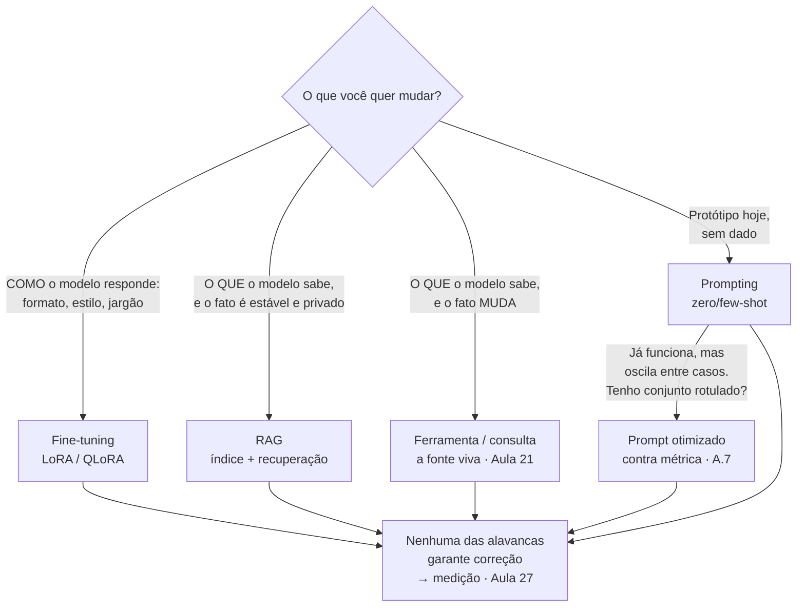
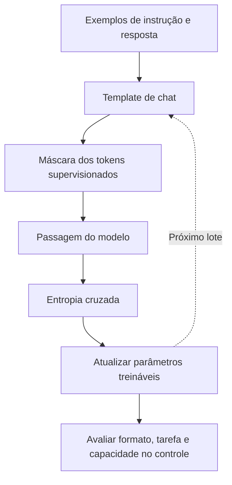
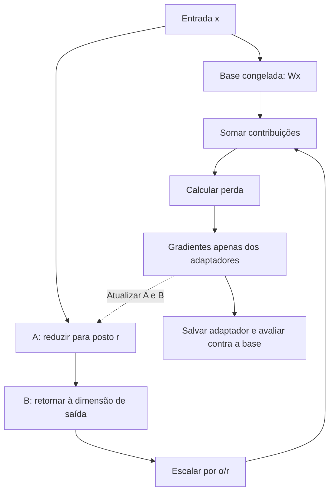
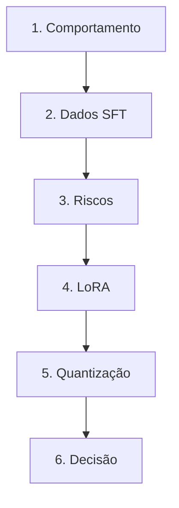

# Especificação de slides — Aula 13 (V2)

> **Rebalanceamento V2.** O fluxo abre por **três sintomas verificáveis** e usa a matemática
> como fundamento nomeado: a fórmula aparece enunciada e lida, nunca manipulada. Toda derivação
> está na Parte 2, mais detalhada do que estava na V1 — a tabela dos sete módulos, a conferência
> de que eles somam 1,31 B dos 1,54 B do modelo, o argumento de `B = 0` com o gradiente de cada
> matriz no passo zero, a construção dos 16 níveis do NF4 e a conta de memória das três
> configurações lado a lado. Nada de matemática foi perdido — foi realocado e ampliado.
>
> **Numeração do apêndice, fixada por dependência externa.** A **A.4** e a **A.5 da Aula 12**
> apontam explicitamente para *"a conta comparativa completa em A.5 da Aula 13"*. Por isso a conta
> de memória das três configurações é o item **A.5** deste apêndice, e não outro número.

<!-- SLIDE-FLOW:GUIDE:BEGIN -->
## Fluxogramas na produção dos slides

As orientações abaixo complementam o campo **Visual** dos slides indicados. Produzir os fluxogramas no próprio deck, como formas e conectores editáveis ou gráficos vetoriais; a biblioteca completa ao final torna esta especificação independente do portal.

- **Referência de composição:** título e propósito no topo, blocos numerados, conexões rotuladas, ramificações legíveis e uma saída identificada. Usar apenas o padrão visual da referência fornecida, sem importar seu assunto ou seus exemplos.
- **Tema do deck:** manter o fundo escuro e a paleta já especificada para a aula. Usar `#5b8cff` para o trecho ativo, tons neutros para o contexto e `#e2231a` conforme o significado definido no deck. Cor sempre acompanhada de rótulo.
- **Leitura:** entrada no topo ou à esquerda; saída na base ou à direita. Decisões em losangos, alternativas com rótulos e retornos apontando à etapa correta. Ramos paralelos convergem apenas onde seus resultados realmente são combinados.
- **Densidade:** no fluxo principal, projetar 3–6 blocos curtos por enquadramento, com corpo legível na última fileira. Um mapa maior pode ser revelado por etapas no mesmo slide. Detalhes, condições e explicações completas ficam nas notas; não reduzir a fonte para caber tudo.
- **Semântica:** mapas de percurso mostram ordem de estudo, não execução de um algoritmo. Manter separadas preparação e aplicação, treino e inferência, sequência e alternativas. Não transformar uma etapa opcional em obrigatória.
- **Integração:** o fluxograma substitui uma lista redundante ou ocupa o campo Visual; não cobre matrizes, tabelas, gráficos nem código indispensáveis. Preservar títulos, numeração, duração e referências aos apêndices.
- **Produção:** os blocos Mermaid abaixo são especificações do desenho. Renderizar/reconstruir como diagrama, nunca projetar o código Mermaid. Manter rótulos, bifurcações, retornos e limites declarados. Não transformar este caderno técnico em slides adicionais.
- **Ligação com o portal:** os mapas de mecanismo compartilham o conteúdo dos fluxogramas do portal. Em demonstrações, usar o mesmo vocabulário no deck e no controle interativo para facilitar a passagem entre os dois.
<!-- SLIDE-FLOW:GUIDE:END -->

## Diretrizes visuais

- **Tema:** escuro, accent `#e2231a` (vermelho CESAR), accent secundário `#5b8cff`.
- **Tipografia:** sans-serif para texto; monoespaçada para código, fórmulas, tokens especiais, nomes de módulo e contas.
- **Densidade:** máximo 5 linhas de texto por slide no fluxo. Um conceito por slide.
- **No fluxo principal:** a fórmula aparece **enunciada e lida**, com o que ela prevê ou permite depurar ao lado. Nenhuma manipulação encadeada, nenhuma soma conduzida linha a linha.
- **No apêndice:** densidade alta é esperada e desejável. É material de consulta, lido em casa com o notebook do Lab 4 ao lado.
- **Proibido:** bullets genéricos ("Vantagens", "Desvantagens"); slide-parede de texto; clipart; gráfico sem eixo rotulado; tabela de comparação sem a coluna do que a técnica **não** resolve.
- **Tokens especiais** sempre em monoespaçada e com os delimitadores visíveis (`<|im_start|>`), nunca parafraseados em prosa.
- **Todo número de memória carrega a unidade e a base:** nunca "22"; sempre `24,6 GB (22,9 GiB)`, e sempre dizendo se é peso, estado de treino ou pico medido.

## Arco narrativo

O deck abre com **três sintomas** que a turma pode reproduzir, e nenhum deles é bug: um modelo que, perguntado pela capital da França, devolve mais perguntas sobre capitais; um fine-tuning que estoura numa placa de 24 GB treinando um modelo cujos pesos ocupam 14; e um modelo que, depois do ajuste, acerta o formato em 100% dos casos e passa a errar contas que acertava antes. A primeira metade fecha o sintoma 1 e nomeia o 3: o que falta é **comportamento e não conhecimento**, isso entra por dado formatado num template que é protocolo, e os dois riscos do SFT só ficam visíveis com um conjunto de controle fora do domínio. A segunda metade fecha o sintoma 2 por uma conta de memória e responde "como fazer isso sem 24,6 GB de estados": LoRA, os 0,60% de treináveis, a diferença entre quantizar para treino e para inferência, e QLoRA como a técnica de viabilidade que fez o Lab 4 existir. O clímax não é técnico e sim de decisão: o framework prompting × RAG × fine-tuning, com a coluna do que **nenhuma** das três resolve. O deck fecha com o mapa do Lab 4 e o fechamento do laço com a segunda coluna medida no Lab 3.

A Parte 2 não se apresenta em aula. Ela existe porque as três decisões desta aula — qual `r`, qual base, quais módulos — são decisões numéricas, e porque a única maneira de o `print` de amanhã significar algo é o aluno ter a conta com que conferi-lo.

---

# PARTE 1 — FLUXO DA AULA

*O que se apresenta em aula. 16 slides, 120 minutos com demo e exercício.*

## Slides

### Slide 1 — Abertura: três sintomas, e nenhum deles é bug
- **Tipo:** problema (abertura)
- **Título:** Três coisas que acontecem, e nenhuma levanta exceção
- **Conteúdo:** Os três sintomas do dia, projetados juntos e todos verificáveis:
  ```
  1  perguntado "Qual a capital da França?", o modelo responde
     "...e a capital da Itália? Qual a capital da Alemanha?"     -> continua a lista

  2  fine-tuning de um 7 B estoura numa placa de 24 GB,
     e os pesos desse modelo ocupam 14 GB                        -> cabe o modelo, não cabe o treino

  3  depois do ajuste: 100 % de aderência ao formato treinado
     E erro em conta de somar que antes acertava                 -> a curva de treino continua descendo
  ```
  Ontem a fábrica entregou exatamente isto: um completador de texto. Hoje os três se fecham — e o segundo se fecha por uma conta de memória, não por um argumento.
- **Frase-tese:** Nenhum dos três é bug. Os três são a consequência correta de decisões que alguém tomou, e sabendo qual decisão você conserta os três.
- **Visual:** full-bleed, os três sintomas em três faixas horizontais, cada uma com o observável em monoespaçada à esquerda e a etiqueta do diagnóstico em accent à direita, ainda **coberta** (revelada ao longo da aula). Rodapé: "Aula 12 → a fábrica entrega um completador de texto".
- **Notas do apresentador:** Começar de pé, sem computador. Ollama já carregado em outra janela e cartão do modelo já em aba. Se a Aula 12 foi atropelada, gastar 90 s recuperando os 16 bytes por parâmetro — o sintoma 2 depende dessa conta. Mencionar em uma frase que o deck tem apêndice (A.1 a A.5) e que o A.5 é a conta que fecha o sintoma 2.

### Slide 2 — [Sintoma 1] O pré-treinado não está errado

<!-- SLIDE-FLOW:SLIDE:BEGIN -->
- **Fluxograma a incorporar neste slide:** **F00 — SFT: dados de diálogo até o comportamento**. O desenho e os rótulos completos estão no caderno de fluxogramas ao final deste arquivo.
- **Composição:** integrar ao campo Visual; preservar exemplos, tabelas, fórmulas e dimensões solicitados neste slide. Destacar o trecho relacionado ao título e manter o restante em segundo plano. Os textos detalhados ficam nas notas, sem duplicar a lista de Conteúdo na tela.
<!-- SLIDE-FLOW:SLIDE:END -->

- **Tipo:** conceito
- **Título:** Não falta conhecimento. Falta o modelo saber que a vez dele chegou.
- **Conteúdo:** O contraste com o exemplo literal:
  ```
  prompt:      "Qual a capital da França?"
  continuação de alta probabilidade:
               "Qual a capital da Alemanha? Qual a capital da Itália?"
  ```
  Por quê: no corpus, essa string quase nunca aparece num diálogo — aparece numa lista de exercícios. O modelo **não está errado**: está fazendo o que foi treinado para fazer. A prova de que não falta conhecimento: a probabilidade que ele atribui a `Paris` depois de `"a capital da França é"` é altíssima. O que falta é a convenção de que, diante de uma pergunta, o papel dele é responder. E o modelo-base não é "pior": para continuação de código, para pontuar log-verossimilhança e como base de fine-tuning, ele é o objeto certo.
- **Frase-tese:** É um ator que decorou a peça inteira e não sabe qual personagem ele é.
- **Visual:** o prompt e as duas continuações possíveis lado a lado — a de "assistente" e a de "lista de exercícios" — a segunda marcada como *a de maior probabilidade*, com um ícone de check em vez de X. Marcar a de maior probabilidade como correta é o ponto do slide.
- **Notas do apresentador:** Esta distinção conhecimento × comportamento é o eixo da aula e sustenta o slide 14. Cravar devagar. Se vier "então o modelo-base é inútil?", a resposta está no próprio slide e é uma frase.

### Slide 3 — [Demo] Os mesmos pesos, dois comportamentos

<!-- SLIDE-FLOW:SLIDE:BEGIN -->
- **Fluxograma a incorporar neste slide:** **F00 — SFT: dados de diálogo até o comportamento**. O desenho e os rótulos completos estão no caderno de fluxogramas ao final deste arquivo.
- **Composição:** integrar ao campo Visual; preservar exemplos, tabelas, fórmulas e dimensões solicitados neste slide. Destacar o trecho relacionado ao título e manter o restante em segundo plano. Os textos detalhados ficam nas notas, sem duplicar a lista de Conteúdo na tela.
<!-- SLIDE-FLOW:SLIDE:END -->

- **Tipo:** transição para demonstração
- **Título:** Mesmo arquivo de pesos, dois comportamentos
- **Frase-tese:** Não vou trocar de modelo. Vou ligar e desligar quatro tokens especiais.
- **Conteúdo:** As duas metades da demo, sem resultado — o resultado aparece ao vivo. **No navegador:** o cartão do modelo com as variantes base e instruct · a mesma pergunta pelo caminho de chat (template aplicado) · a mesma pergunta pelo caminho cru (template desligado) · a string do template no `tokenizer_config.json`. **No quadro:** a contagem do LoRA para um módulo e a única divisão da aula — `9.232.384 / 1,54 × 10⁹`.
- **Visual:** slide de transição, quase vazio. Duas colunas rotuladas `com template` e `sem template`, as duas com caixas de saída vazias esperando ser preenchidas. Rodapé: "mesmos pesos · mesma máquina · mesma pergunta".
- **Notas do apresentador:** Roteiro na Parte 2. A metade do navegador reproduz o **sintoma 1 ao vivo** e o fecha na mesma tela. Se o instruct responder bem até sem template, usar isso como conteúdo (o SFT sobreviveu ao protocolo errado) e ir direto ao template. A metade do quadro não depende de máquina e é a que produz o número da aula.

### Slide 4 — SFT: a mesma perda, com outro dado

<!-- SLIDE-FLOW:SLIDE:BEGIN -->
- **Fluxograma a incorporar neste slide:** **F00 — SFT: dados de diálogo até o comportamento**. O desenho e os rótulos completos estão no caderno de fluxogramas ao final deste arquivo.
- **Composição:** integrar ao campo Visual; preservar exemplos, tabelas, fórmulas e dimensões solicitados neste slide. Destacar o trecho relacionado ao título e manter o restante em segundo plano. Os textos detalhados ficam nas notas, sem duplicar a lista de Conteúdo na tela.
<!-- SLIDE-FLOW:SLIDE:END -->

- **Tipo:** comparação
- **Título:** Nada de nova perda. Nada de nova arquitetura. Outro dado.
- **Conteúdo:** O que **não** muda: a entropia cruzada do próximo token, a mesma do Lab 2 e da Aula 12. O que muda: pares instrução–resposta escritos ou curados por humanos, na ordem de dezenas de milhares a alguns milhões de exemplos. A proporção em destaque:
  ```
  pré-treino:  ~10¹² tokens
  SFT:         ~10⁸ tokens        →  partes por milhão
  ```
  Consequência que volta no slide 14: com esse orçamento não se ensina **fato**; move-se **comportamento** — formato, papel, disposição a responder, aderência a instrução.
- **Frase-tese:** Com partes por milhão de tokens, não se ensina conhecimento. Ensina-se comportamento.
- **Visual:** duas caixas de tamanho absurdamente desproporcional (a do pré-treino ocupando o slide, a do SFT como um quadradinho), com a mesma etiqueta de perda `cross-entropy(próximo token)` nas duas — a igualdade da etiqueta é o ponto. Rodapé com a analogia: graduação inteira × semana de integração.
- **Notas do apresentador:** Se perguntarem "quantos exemplos preciso?", responder em duas frases: centenas a milhares já mexem em formato e estilo (o Lab 4 mostra com 100); assistente de propósito geral pede ordens de grandeza acima. Não dar número único.

### Slide 5 — Template de chat: o formato é a interface

<!-- SLIDE-FLOW:SLIDE:BEGIN -->
- **Fluxograma a incorporar neste slide:** **F00 — SFT: dados de diálogo até o comportamento**. O desenho e os rótulos completos estão no caderno de fluxogramas ao final deste arquivo.
- **Composição:** integrar ao campo Visual; preservar exemplos, tabelas, fórmulas e dimensões solicitados neste slide. Destacar o trecho relacionado ao título e manter o restante em segundo plano. Os textos detalhados ficam nas notas, sem duplicar a lista de Conteúdo na tela.
<!-- SLIDE-FLOW:SLIDE:END -->

- **Tipo:** código
- **Título:** O template não é formatação. É protocolo.
- **Conteúdo:** A forma do template, em monoespaçada, com os delimitadores visíveis:
  ```
  <|im_start|>system
  Você é um assistente...<|im_end|>
  <|im_start|>user
  Qual a capital da França?<|im_end|>
  <|im_start|>assistant
  ```
  O último token **abre** o turno do assistente e não fecha: é literalmente o sinal de "sua vez", e é depois dele que o SFT ensinou o modelo a falar. Três consequências práticas: inferência fora do template → o modelo volta a **continuar**, que é o sintoma 1 reaparecendo por outra porta; cada família tem o **seu** template, e usar o de outra degrada silenciosamente; é por isso que as bibliotecas expõem `apply_chat_template` em vez de deixar concatenar strings.
- **Frase-tese:** HTTP sem os dois quebra-linhas não é HTTP mais tolerante — é lixo.
- **Visual:** o bloco de template ocupando dois terços do slide, com o token de abertura do turno do assistente circulado em accent e a legenda "sua vez" apontando para ele. À direita, o antipadrão em cinza e riscado: `"Usuário: ... Assistente:"`. Etiqueta em accent no canto: **sintoma 1 — fechado**.
- **Notas do apresentador:** Projetar o template real do modelo escolhido, copiado do `tokenizer_config.json` na véspera. Para quem já usou API de chat: o template aconteceu no servidor, invisível — e é por isso que só se descobre que ele existe rodando modelo local.

### Slide 6 — Comportamento de segurança começa aqui
- **Tipo:** conceito
- **Título:** Recusar e dizer "não sei" não são o próximo token mais provável
- **Conteúdo:** De onde vem o comportamento: não do pré-treino — na web, pergunta perigosa é seguida de resposta, e "eu não sei" é raríssimo em texto publicado. Entra como **dado de SFT**: exemplos em que a resposta correta é recusa fundamentada, admissão de incerteza, ou pedido de esclarecimento em vez de chute. O SFT estabelece o **piso**; a Aula 15 explica por que ele não basta — imitar bons exemplos ensina o que fazer e não o que evitar fora da lista. Desmontar: segurança não é (só) filtro na saída; é em boa parte comportamento treinado, e por isso frágil como qualquer generalização.
- **Frase-tese:** É comportamento treinado — entrou como dado, e por isso quebra como dado.
- **Visual:** três cartões de exemplo de dado de SFT (recusa fundamentada · admissão de incerteza · pedido de esclarecimento), cada um com prompt e resposta em monoespaçada curta. Abaixo, uma seta para "Aula 15 — Alinhamento: RLHF, PPO e DPO" com a legenda "por que o SFT não basta".
- **Notas do apresentador:** Slide que mais atrai pergunta de jailbreak. Segurar: fragilidade é Aula 15, ataque e defesa em sistema é Aula 29. Cada uma custa 10 min.

### Slide 7 — [Sintoma 3] Esquecimento catastrófico: o teste que não vê
- **Tipo:** conceito (fundamento aplicado a uma falha)
- **Título:** Se o teste é do mesmo domínio do treino, o esquecimento é invisível
- **Conteúdo:** O sintoma da abertura, agora nomeado: aderência perfeita ao formato treinado **junto com** perda de aritmética, de um segundo idioma, ou de conhecimento factual que estava lá. Nada levanta exceção e a curva de treino continua descendo. O mecanismo: atualizar **todos** os pesos com dado muito mais estreito que o de origem melhora dentro da distribuição nova e piora fora dela. O controle que torna o sintoma visível: conjunto de teste **fora** do domínio treinado, guardado de propósito, medido antes e depois. A mitigação estrutural: com LoRA a base fica congelada, o aprendizado vive num delta removível, e desligar o adaptador restaura o modelo original **bit a bit** — não aproximadamente.
- **Frase-tese:** É regravar em cima de uma fita. A faixa nova entra bem; o que estava embaixo não volta.
- **Visual:** dois eixos "desempenho na tarefa treinada" e "desempenho fora do domínio", com uma trajetória subindo no primeiro e caindo no segundo ao longo dos passos de treino. O cruzamento das duas curvas marcado. Rodapé em accent: "sem conjunto de controle, você só vê a curva que sobe". Etiqueta no canto: **sintoma 3 — nomeado**.
- **Fundamento:** o "bit a bit" não é figura de linguagem: com `B` inicializada em zeros, o delta é a matriz nula no passo zero, e desligar o adaptador devolve exatamente `W₀`.
  → o argumento completo, com o gradiente de cada matriz no passo zero: **Apêndice A.2** (slide 18)
- **Notas do apresentador:** A exigência do conjunto de controle fora do domínio é cobrada no Lab 4 e no Lab 8 — usar as mesmas palavras nos três lugares. Se sobrar tempo: misturar dado genérico no SFT é a mitigação padrão (*replay*) e custa tokens.

### Slide 8 — Overfitting em 100 exemplos
- **Tipo:** dados
- **Título:** A perda de treino cair não é evidência de nada — é o que ela faz
- **Conteúdo:** O que acontece com poucas centenas de exemplos e algumas centenas de passos: a perda de treino desce, a de validação para ou sobe, e o modelo passa a devolver respostas do treino levemente disfarçadas. Controles: divisão treino/validação · parada antecipada · taxa de aprendizado modesta · poucas épocas. E o controle específico do gênero: **ler as gerações com o olho**, porque a perda de validação não captura repetição literal. É exatamente o que o Checkpoint 5 do Lab 4 pede — os mesmos 5 prompts, antes e depois, lado a lado.
- **Frase-tese:** O sinal é a validação junto com as amostras lidas com o olho.
- **Visual:** duas curvas de perda no mesmo gráfico (treino descendo suave, validação descendo e virando para cima), com o ponto de virada marcado e rotulado "aqui o modelo passou a decorar". Ao lado, um cartão pequeno com uma resposta gerada quase idêntica a um exemplo de treino, com a sobreposição destacada.
- **Notas do apresentador:** Intervalo de 10 min depois deste slide. Avisar antes de soltar que o Bloco 2 tem o número que eles conferem amanhã no lab. Se o Bloco 1 atrasou, este é o slide mais compressível — o overfitting reaparece no lab com as mãos deles, e o Lab 4 tem item de apêndice sobre o que a curva de treino não permite concluir.

### Slide 9 — [Sintoma 2] O treino que não cabe numa placa onde o modelo cabe
- **Tipo:** dados (fundamento aplicado a um sintoma)
- **Título:** O problema nunca foi o modelo. Foi querer mexer em todo ele.
- **Conteúdo:** O sintoma 2, agora com número. A conta dos 16 bytes por parâmetro da Aula 12 aplicada a dois modelos:
  ```
                             pesos (bf16)      estados de treino (16 B/param)
  modelo de 1,54 B            3,1 GB            24,6 GB   (22,9 GiB)
  modelo de 7 B              14,0 GB           112,0 GB  (104,3 GiB)

  T4 do Colab gratuito: 16 GB      ·      placa de 24 GB
  ```
  Nos dois casos os **pesos** cabem e o **treino** não. Fine-tuning completo do menor modelo útil já está fora do orçamento da turma. Pergunta que abre o PEFT: **e se eu não atualizasse todo mundo?**
- **Frase-tese:** Os pesos do 7 B cabem em 14 GB. O aparato para atualizá-los ocupa 112.
- **Visual:** quatro barras verticais em pares (pesos × estados, para 1,54 B e para 7 B) com duas linhas horizontais tracejadas atravessando: 16 GB rotulada "T4 do Colab" e 24 GB rotulada "placa de consumo". O excedente de cada barra de estados em accent. Etiqueta no canto: **sintoma 2 — diagnosticado** (o fecho vem no slide 13).
- **Fundamento:** os 16 bytes por parâmetro são peso, gradiente, cópia mestre em fp32 e os dois momentos do Adam (**A.4 da Aula 12**). Sobre a base congelada, essa conta muda de forma, não de escala.
  → a conta das três configurações — completo, LoRA e QLoRA — lado a lado, com as ativações contabilizadas separadamente: **Apêndice A.5** (slide 21)
- **Notas do apresentador:** Não rederivar os 16 bytes: é conteúdo de ontem e está em A.4 da Aula 12. Escrever no quadro só as duas razões (`14 → 112` e `3,1 → 24,6`), porque a desproporção é o argumento. Sobre trocar Adam por SGD para economizar estado: reduz de 16 para 8 bytes, ainda não cabe, e a convergência em transformer piora o suficiente para ninguém fazer — a conta está em A.5.

### Slide 10 — LoRA: um delta de baixo posto sobre pesos congelados

<!-- SLIDE-FLOW:SLIDE:BEGIN -->
- **Fluxograma a incorporar neste slide:** **F01 — LoRA: dois caminhos, uma saída**. O desenho e os rótulos completos estão no caderno de fluxogramas ao final deste arquivo.
- **Composição:** integrar ao campo Visual; preservar exemplos, tabelas, fórmulas e dimensões solicitados neste slide. Destacar o trecho relacionado ao título e manter o restante em segundo plano. Os textos detalhados ficam nas notas, sem duplicar a lista de Conteúdo na tela.
<!-- SLIDE-FLOW:SLIDE:END -->

- **Tipo:** conceito (o fundamento nomeado)
- **Título:** Congela `W`, treina a correção
- **Conteúdo:** A ideia enunciada em uma linha, com os formatos, e **lida** termo a termo:
  ```
  h = W₀·x  +  (α / r) · B · A · x

  A ∈ ℝ^(r × d_in)     inicializada aleatória
  B ∈ ℝ^(d_out × r)    inicializada com ZEROS
  r ≪ min(d_in, d_out)     W₀ congelado, sem gradiente
  ```
  Três leituras, uma por peça. `B·A·x` é a **correção**, e ela tem posto no máximo `r` porque a informação atravessa um gargalo de dimensão `r`. `B = 0` faz `ΔW = 0` no passo zero, e o modelo adaptado **começa idêntico ao base** — o treino nunca parte de um modelo estragado. `α/r` desacopla a intensidade do valor de `r`, então trocar `r` não obriga a reajustar a taxa de aprendizado. E o que fez LoRA vencer as alternativas: na inferência, `W' = W₀ + (α/r)·BA` pode ser **fundido**, com latência adicional **zero**, ao contrário de adaptadores em série, que acrescentam camadas. Por que posto baixo basta: a hipótese é que a **atualização** necessária para adaptar um modelo competente tem posto intrínseco baixo — reorienta capacidades que já existem.
- **Frase-tese:** É a correção que tem posto baixo, não o modelo.
- **Visual:** o retângulo grande de `W₀` em cinza (congelado, com ícone de cadeado) e, em paralelo, o retângulo alto e fino `B` colado ao largo e baixo `A`, os dois em accent. A razão de áreas entre `BA` e `W₀` tem de ser visualmente honesta. Setas de entrada `x` e de soma na saída. Ao lado, o passo da fusão desenhado como as duas caixas colapsando em uma. **Sem dimensões numéricas anotadas** — elas estão no apêndice.
- **Fundamento:** `ΔW = B·A` tem posto no máximo `r`, e a contagem de parâmetros treináveis é `r · (d_in + d_out)` por módulo.
  → por que o posto é limitado, a contagem derivada e o ponto em que aumentar `r` deixa de economizar: **Apêndice A.1** (slide 17) · por que `B = 0` e o que aconteceria com as duas aleatórias: **Apêndice A.2** (slide 18) · o que o fator `α/r` desacopla, e a fusão: **Apêndice A.3** (slide 19)
- **Notas do apresentador:** Desenhar a geometria no quadro — a área dos dois retângulos finos contra a do grande é o argumento. **Não derivar.** Ler a linha uma vez apontando cada peça e seguir. Qual `r` usar: slide 11 e a extensão do exercício, cujo gabarito está em A.1. Se pedirem a conta de `B = 0`: Parte 4 do roteiro, item 2.

### Slide 11 — A conta dos parâmetros treináveis: 0,60%

<!-- SLIDE-FLOW:SLIDE:BEGIN -->
- **Fluxograma a incorporar neste slide:** **F01 — LoRA: dois caminhos, uma saída**. O desenho e os rótulos completos estão no caderno de fluxogramas ao final deste arquivo.
- **Composição:** integrar ao campo Visual; preservar exemplos, tabelas, fórmulas e dimensões solicitados neste slide. Destacar o trecho relacionado ao título e manter o restante em segundo plano. Os textos detalhados ficam nas notas, sem duplicar a lista de Conteúdo na tela.
<!-- SLIDE-FLOW:SLIDE:END -->

- **Tipo:** dados (o número da aula)
- **Título:** 9,2 milhões em 1,54 bilhão — 0,60%
- **Conteúdo:** A contagem enunciada, um módulo lido, e os dois totais:
  ```
  por módulo:     r · (d_in + d_out)

  uma projeção quadrada 1536×1536 tem 2.359.296 pesos
  o adaptador dela com r = 8:   8 · (1536 + 1536) = 24.576     ≈ 1 % do módulo

  sete projeções por camada  ->     329.728
  × 28 camadas               ->   9.232.384        =  0,60 % de 1,54 B
  ```
  O modelo de referência do Lab 4: `d_model = 1536`, 28 camadas, adaptadores nas sete projeções de cada camada (`q, k, v, o` da atenção e `gate, up, down` do MLP), `r = 8`. Em bytes de disco: adaptador de **~18 MB em bf16** contra ~3,1 GB do base — um servidor mantém uma base e troca N adaptadores em tempo de execução. Alerta em destaque: **0,6% dos parâmetros treináveis ≠ 0,6% do custo de treino** — o forward e o backward atravessam o modelo inteiro; o que se economiza é memória.
- **Frase-tese:** Amanhã vocês vão conferir este número contra o que a biblioteca imprime — e um `print` que você não sabe conferir não é conhecimento, é fé.
- **Visual:** a contagem à esquerda com **só as três linhas acima** (um módulo e os dois totais); à direita, dois círculos concêntricos de área proporcional (1,54 B e 9,2 M) — o interno deve ser quase um ponto. Abaixo, duas barras de arquivo: `adapter_model.safetensors` (~18 MB) × modelo base (GB). A tabela dos sete módulos **não** vai neste slide: vai no apêndice.
- **Fundamento:** a contagem por módulo é `r · (d_in + d_out)`, e o total depende de quais módulos recebem adaptador.
  → a tabela completa dos sete módulos, a conferência de que os módulos adaptados somam 1,31 B dos 1,54 B do modelo, e a tabela de variações com `r = 16` e com adaptadores só na atenção (gabarito da extensão do exercício): **Apêndice A.1** (slide 17) · a conta em FLOPs que mostra que a economia de computação é de ~1/3 e não de 99,4%: **Apêndice A.5** (slide 21)
- **Notas do apresentador:** Números para o quadro: `24.576` por projeção quadrada, `329.728` por camada, `9.232.384` total, `0,60%`. **Não somar os sete módulos ao vivo** — na V1 isso custava 4 min e a soma está no slide do apêndice. As dimensões `256` das projeções de chave e valor vêm de GQA (Aula 8) — uma frase e seguir.

### Slide 12 — Quantização: duas finalidades que se confundem

<!-- SLIDE-FLOW:SLIDE:BEGIN -->
- **Fluxograma a incorporar neste slide:** **F01 — LoRA: dois caminhos, uma saída**. O desenho e os rótulos completos estão no caderno de fluxogramas ao final deste arquivo.
- **Composição:** integrar ao campo Visual; preservar exemplos, tabelas, fórmulas e dimensões solicitados neste slide. Destacar o trecho relacionado ao título e manter o restante em segundo plano. Os textos detalhados ficam nas notas, sem duplicar a lista de Conteúdo na tela.
<!-- SLIDE-FLOW:SLIDE:END -->

- **Tipo:** comparação
- **Título:** Comprimir o que você vai usar × comprimir o que você vai congelar
- **Conteúdo:** Duas colunas:
  - **Para inferência** — comprime permanentemente; int8, 4 bits, GPTQ/AWQ/GGUF (o que a turma usou no Ollama); troca honesta: menos memória e mais vazão por um pouco de qualidade; a degradação cresce abaixo de 4 bits.
  - **Para treino** — o peso quantizado é o que está **congelado**; desquantizado por bloco na hora de calcular, nunca atualizado; o gradiente **atravessa** o peso para chegar ao adaptador, que vive em precisão alta.

  Corolário para o relatório: um adaptador treinado contra base de 4 bits foi otimizado *contra aquela base* — fundi-lo numa base bf16 funciona e **não** é equivalente. Declarar em qual base o número foi medido (a lição de proveniência do Lab 3).
- **Frase-tese:** Não se treina em 4 bits. Treina-se **em cima** de algo armazenado em 4 bits.
- **Visual:** split. À esquerda, uma barra de peso sendo comprimida e usada (setas de leitura para o forward). À direita, a mesma barra comprimida com um cadeado, e um caminho paralelo em accent (o adaptador) em precisão alta, com a seta de gradiente passando **através** do peso congelado e terminando no adaptador. A seta que atravessa é o ponto visual.
- **Fundamento:** o gradiente atravessa o peso quantizado sem nenhum truque de estimação porque o peso desquantizado entra na conta como **constante** — ninguém pede derivada em relação a ele. É o que separa isto de treino consciente de quantização.
  → o argumento completo e a lista exata do que o QLoRA mantém em precisão alta: **Apêndice A.4** (slide 20)
- **Fundamento (a operação em si):** quantizar é um mapeamento **afim** de `FP32` para inteiro, definido por constantes tiradas do próprio tensor. Há dois esquemas padrão, e a escolha entre eles é por **forma da distribuição**: *absmax* (uma constante, simétrico) para pesos, que são centrados em zero; **ponto-zero** (escala mais deslocamento, assimétrico) para ativações pós-ReLU, que só têm um lado — e aí ele compra um bit de resolução de graça. O `c = max|w|` que o NF4 usa em A.4 é o absmax, e o preço dele é conhecido: **um único *outlier* sequestra a escala e engrossa a grade de todos os vizinhos**.
  → as duas constantes derivadas, o erro `ε = X − (X_quant)_dequant` com seu limite, o número que mostra o *outlier* multiplicando o erro por 7, a regra de escolha e a taxonomia PTQ × QAT (com o lugar do QLoRA, que não é nenhum dos dois): **Apêndice A.6** (slide 22)
- **Notas do apresentador:** GPTQ/AWQ/GGUF são esquemas de quantização pós-treino para inferência com calibrações diferentes; serving é Aula 24. Não abrir aqui. Se alguém perguntar "mas o que é quantizar, exatamente?" — é a pergunta certa e a resposta de uma frase é "trocar a régua: em vez de guardar o número, guardar em qual marca de uma régua de 256 marcas ele caiu, mais a régua"; o resto está em A.6 e não se abre em sala.

### Slide 13 — QLoRA: base congelada em 4 bits + adaptador em precisão alta

<!-- SLIDE-FLOW:SLIDE:BEGIN -->
- **Fluxograma a incorporar neste slide:** **F01 — LoRA: dois caminhos, uma saída**. O desenho e os rótulos completos estão no caderno de fluxogramas ao final deste arquivo.
- **Composição:** integrar ao campo Visual; preservar exemplos, tabelas, fórmulas e dimensões solicitados neste slide. Destacar o trecho relacionado ao título e manter o restante em segundo plano. Os textos detalhados ficam nas notas, sem duplicar a lista de Conteúdo na tela.
<!-- SLIDE-FLOW:SLIDE:END -->

- **Tipo:** conceito (o fecho do sintoma 2)
- **Título:** 112 GB → 3,9 GB para o mesmo modelo de 7 B
- **Conteúdo:** As três engenharias que fazem funcionar:
  - **NF4** — 4 bits com os 16 níveis posicionados nos quantis de uma normal, por bloco de 64 pesos: gasta os níveis onde há peso de verdade, porque os pesos de um transformer pré-treinado são aproximadamente normais.
  - **Dupla quantização** — quantizar também as constantes de escala por bloco: 4,5 → **4,127 bits por peso**, e é essa fração que decide se cabe.
  - **Otimizadores paginados** — nos picos, os estados do otimizador vão para a memória do host em vez de estourar. É paginação aplicada a estado de treino.

  O sintoma 2, fechado com número:
  ```
                                    1,54 B        7 B
  fine-tuning completo   16·N       24,6 GB     112,0 GB     não cabe
  LoRA (base bf16)       2N+16Nₐ     3,2 GB      14,3 GB     cabe em 24 GB
  QLoRA (base NF4)     0,516N+16Nₐ   0,94 GB      3,9 GB     cabe na T4
  ```
  Alerta: QLoRA é técnica de **viabilidade**, não de qualidade.
- **Frase-tese:** QLoRA não melhora nada. Ele faz caber — e "caber" é a diferença entre esta disciplina ter um lab de fine-tuning e não ter.
- **Visual:** uma barra de 16 GB representando a T4, com os blocos empilhados dentro: base NF4 (0,79) · adaptador (quase invisível) · ativações · estados do otimizador — e muito espaço livre. Ao lado, a mesma T4 com a barra de fine-tuning completo transbordando. Abaixo, a tabela de três linhas do conteúdo. Etiqueta em accent no canto: **sintoma 2 — fechado**.
- **Fundamento:** as três linhas da tabela são `16·N`, `2·N + 16·N_a` e `0,516·N + 16·N_a`, com `N_a` vindo da contagem do slide 11 e o `0,516` vindo dos 4,127 bits por peso.
  → a conta das três configurações derivada termo a termo, o que ela **não** inclui (as ativações, que são o que realmente estoura) e os casos-limite: **Apêndice A.5** (slide 21) · a construção dos 16 níveis do NF4 e de onde sai o 4,127: **Apêndice A.4** (slide 20)
- **Notas do apresentador:** Se o tempo apertar, cortar dupla quantização e otimizador paginado — estão escritos em A.4 e não são cobráveis. O que **não** pode ser cortado é "base congelada em 4 bits, adaptador em precisão alta", a linha do QLoRA na tabela e a etiqueta do sintoma 2 fechando: aparecem no Checkpoint 1 do lab.

### Slide 14 — O framework de decisão: prompting × RAG × fine-tuning
- **Tipo:** comparação
- **Título:** Qual alavanca puxar — e o que nenhuma delas resolve
- **Conteúdo:** A tabela, que é o conteúdo mais reusado do curso:
  | Alavanca | Resolve | **Não** resolve | Custo | Latência de mudança |
  |---|---|---|---|---|
  | **Prompting** | formato leve, tom, tarefa nova sem dado, instrução pontual | conhecimento ausente; consistência em escala; cobra token em *toda* requisição | ~zero de treino | minutos |
  | **RAG** | conhecimento privado e que muda; fato com **citação de fonte auditável** | comportamento, estilo, esquema rígido; qualidade limitada pelo recuperador | infra de índice e ingestão | horas (reindexar) |
  | **Prompt otimizado** | o mesmo que prompting, **com consistência em escala** — o otimizador reescreve a instrução contra uma métrica em vez de você reescrever no olho | conhecimento ausente; e **exige conjunto rotulado e métrica automática**, sem os quais não há o que otimizar | dezenas a poucos milhares de execuções de avaliação; **zero GPU de treino** | horas |
  | **Fine-tuning** | comportamento, formato rígido, estilo, jargão de domínio; **encurtar o prompt** | fato que muda; garantir factualidade; auditar a origem | GPU + dados curados + avaliação | dias (retreinar) |

  Linha que falta em toda tabela de internet: **nenhuma das três** garante que a resposta esteja correta — isso exige medição (Aula 27) e, quando o fato é verificável, ferramenta (Aula 21).
  O erro clássico, nomeado: injetar por fine-tuning um fato que muda (preço, política, catálogo). Quatro razões pelas quais falha: entra fraco (100 exemplos não competem com 10¹² tokens) · mistura com o que já havia · não há fonte citável · muda na semana seguinte. **Fine-tuning não é banco de dados.**
  Segundo erro: tratar as alavancas como exclusivas. Sistema real combina — o framework escolhe **por onde começar**.
  **Terceiro erro, e é o que a quarta linha existe para matar:** ler a tabela como uma escada de poder, em que
  prompting é o degrau fraco e treinar peso é o forte. Não é. O **GEPA** (ICLR 2026) otimiza *só o texto do
  prompt* e **supera o GRPO em 6% na média, até 20%, usando até 35× menos execuções** — sem tocar num peso.
  Escrever prompt à mão é fraco; **otimizar prompt contra métrica não é.**
- **Frase-tese:** Fine-tuning muda **como** o modelo responde, não **o que** ele sabe. E a alavanca que a maioria pula é a que fica entre escrever prompt e treinar peso.
- **Fundamento:** o prompt é um objeto **otimizável**. Dado um conjunto rotulado e uma métrica, um otimizador executa o sistema, **reflete em linguagem natural** sobre as trajetórias que falharam, propõe uma reescrita da instrução e a mantém se ela melhorar — e mantém uma **fronteira de Pareto** de candidatos, um melhor por instância, em vez de só o melhor global, para não travar em ótimo local.
  → o mecanismo em quatro passos, os números contra GRPO e MIPROv2, por que a reflexão em linguagem é um sinal mais rico que a recompensa escalar, e **as três condições sem as quais isso não se aplica**: **Apêndice A.7** (slide 23)
- **Visual:** a tabela ocupando o slide, com a coluna "**Não** resolve" visualmente mais forte que a coluna "Resolve" — é a inversão de ênfase que faz o slide funcionar. Abaixo, uma faixa em accent atravessando as três colunas: "nenhuma das três garante que a resposta esteja correta → Aula 27 + Aula 21".
- **Notas do apresentador:** Deixar projetado o máximo de tempo; a turma tem de fotografar. A quarta linha é **nova nesta oferta** e vale 60 s, não mais: o que tem de ficar é que ela ocupa o vão entre "escrevi um prompt" e "treinei o modelo", e que o pré-requisito dela é o mesmo do Lab 8 — conjunto rotulado e métrica automática. Quem não tem os dois não tem essa alavanca. Se alguém perguntar como o otimizador sabe o que reescrever, a resposta de uma frase é "ele lê a trajetória que falhou e escreve o diagnóstico em português, em vez de receber só um número"; o resto está em A.7 e não se abre aqui. Perguntar se alguém já pensou em "treinar o modelo nos documentos da empresa" — usar quem levantar a mão como aliado: a intuição é boa, o instrumento é errado, e a Aula 18 dá o certo.



### Slide 15 — [Exercício] Decidir, não calcular
- **Tipo:** exercício
- **Título:** Em dupla, 5 minutos: alavanca, o que resolve, o que **não** resolve
- **Conteúdo:** Os quatro casos, redigidos como aparecem na tela:
  1. Um assistente precisa responder sobre o regulamento da universidade, **citando o artigo exato**.
  2. O modelo acerta a classificação mas responde em prosa livre; a integração exige rótulo puro, **sempre**.
  3. O sistema precisa escrever laudos em português técnico de um domínio, com o jargão e a estrutura do setor.
  4. O preço dos produtos muda **toda semana** e o assistente precisa informá-lo corretamente.

  Extensão para quem terminar antes: refazer a contagem do slide 11 com `r = 16` e com adaptadores **só** nas quatro projeções de atenção, e dizer qual das duas mudanças move mais o número. Gabarito em **A.1**.
- **Frase-tese:** A terceira coluna é a que vale. Nenhum dos quatro casos se resolve calculando.
- **Visual:** os quatro casos numerados à esquerda; à direita, três colunas vazias rotuladas `alavanca` · `resolve` · `NÃO resolve`, a terceira com moldura em accent. Cronômetro de 5 min no canto.
- **Notas do apresentador:** Condução na Parte 3 do roteiro. O caso 2 é literalmente a segunda coluna que eles mediram no Lab 3. O caso 4 é o único cuja resposta não é nenhuma das três — deixar a dupla errar nele e gastar a correção ali.

### Slide 16 — Fechamento: o mapa do Lab 4

<!-- SLIDE-FLOW:SLIDE:BEGIN -->
- **Fluxograma a incorporar neste slide:** **F02 — O percurso desta aula**. O desenho e os rótulos completos estão no caderno de fluxogramas ao final deste arquivo.
- **Composição:** integrar ao campo Visual; preservar exemplos, tabelas, fórmulas e dimensões solicitados neste slide. Destacar o trecho relacionado ao título e manter o restante em segundo plano. Os textos detalhados ficam nas notas, sem duplicar a lista de Conteúdo na tela.
<!-- SLIDE-FLOW:SLIDE:END -->

- **Tipo:** encerramento
- **Título:** Amanhã: 100 exemplos, 0,6% dos parâmetros, e a coluna do Lab 3 vai a zero
- **Conteúdo:** Os três sintomas da abertura, agora com a etiqueta descoberta:
  ```
  1  continua a lista           ->  falta comportamento, não conhecimento  ·  template = protocolo
  2  não cabe na placa          ->  16 B/param para atualizar tudo          ·  A.5: 112 GB -> 3,9 GB
  3  esqueceu o que sabia       ->  conjunto de controle fora do domínio    ·  A.2: base congelada
  ```
  E o mapa dos cinco checkpoints do Lab 4:
  | # | Checkpoint | O número que aparece |
  |---|---|---|
  | 1 | Carregar modelo 1,5 B em 4 bits + baseline dos 5 prompts | VRAM ocupada ≈ 0,8 GB de pesos |
  | 2 | Dataset de 100 instruções em PT + template de chat | um exemplo tokenizado com os tokens de papel visíveis |
  | 3 | Configurar LoRA e imprimir treináveis × congelados | **≈ 0,6%** — conferido contra a conta do slide 11 |
  | 4 | Treinar | curva de perda + pico de memória + tempo |
  | 5 | Antes × depois nos mesmos prompts + salvar/recarregar adaptador | tamanho do adaptador em MB |

  Fechamento do laço: no Lab 3 a coluna de "fora do espaço de rótulos" não foi a zero com few-shot. Amanhã ela vai — com 100 exemplos. **Few-shot é crachá; fine-tuning é uniforme.**
  Leituras: Hu et al., *LoRA* (arXiv 2106.09685) · Dettmers et al., *QLoRA* (arXiv 2305.14314).
- **Frase-tese:** Vocês vão mudar o comportamento de um modelo de 1,5 bilhão de parâmetros com 100 exemplos e um arquivo de dezenas de megabytes.
- **Visual:** os três sintomas revelados no topo, a tabela dos cinco checkpoints como uma trilha horizontal com o número esperado embaixo de cada estação. Rodapé em caixa destacada, dimensionado para fotografar: "confirmar GPU no Colab **hoje** — sem GPU o notebook cai no fallback e o resultado é ilustrativo". Os dois arXiv IDs em fonte grande. Num canto discreto, o índice do apêndice: A.1 a contagem · A.2 o `B = 0` · A.3 o `α/r` · A.4 o NF4 · A.5 a conta de memória · A.6 o que quantizar é (absmax × ponto-zero, PTQ × QAT) · A.7 a quarta alavanca: otimizar o prompt contra métrica.
- **Notas do apresentador:** 20 s de silêncio no mapa para fotografar. Nomear **um** item do apêndice em voz alta: o A.5, porque é a conta que fechou o sintoma 2 e porque o Lab 4 de amanhã aplica ela ao caso da T4. Recolher o pulso por mão levantada: quantos já confirmaram GPU. Não estourar as duas horas — lab que começa atrasado perde o Checkpoint 5.

---

# PARTE 2 — APÊNDICE MATEMÁTICO

> Material de estudo e consulta. **Não se apresenta em aula**; é distribuído com o deck.
> Autossuficiente: quem estuda por aqui sem ter assistido à aula reconstrói todas as contas.
>
> **Onde o fundamento já está em outra aula, este apêndice aponta em vez de repetir.** A
> decomposição dos 16 bytes por parâmetro nos quatro consumidores está em **A.4 da Aula 12**;
> o custo `C ≈ 6ND` em FLOPs está em **A.1 da Aula 12**; a memória quadrática da matriz de
> atenção está em **A.5 da Aula 6**. Este apêndice usa os três como insumos declarados e
> acrescenta o que só existe porque a base pode ser congelada e comprimida.
>
> **Numeração fixada por dependência externa:** a **A.4** e a **A.5 da Aula 12** apontam para
> *"a conta comparativa completa em A.5 da Aula 13"*. Esse item é o **A.5** abaixo.

### Slide 17 — A.1 · A decomposição de baixo posto `ΔW = BA` e a contagem de treináveis

<!-- SLIDE-FLOW:SLIDE:BEGIN -->
- **Fluxograma a incorporar neste slide:** **F01 — LoRA: dois caminhos, uma saída**. O desenho e os rótulos completos estão no caderno de fluxogramas ao final deste arquivo.
- **Composição:** integrar ao campo Visual; preservar exemplos, tabelas, fórmulas e dimensões solicitados neste slide. Destacar o trecho relacionado ao título e manter o restante em segundo plano. Os textos detalhados ficam nas notas, sem duplicar a lista de Conteúdo na tela.
<!-- SLIDE-FLOW:SLIDE:END -->

- **Tipo:** apêndice — derivação, contagem completa e tabela de variações
- **Invocado em:** slides 10 e 11

**O que este item estabelece.** Três coisas: que o delta aprendido por LoRA tem posto no máximo `r` e **por que**; que o número de parâmetros treináveis por módulo é exatamente `r · (d_in + d_out)`; e que, para a configuração do Lab 4, esse número é 9.232.384, ou 0,60% do modelo — com a aritmética conferida contra o total do modelo, de modo que o leitor possa verificar cada linha.

**Notação.**
`W₀ ∈ ℝ^(d_out × d_in)` — a matriz de peso de um módulo linear do modelo base, **congelada** (não recebe gradiente).
`x ∈ ℝ^(d_in)` — a entrada do módulo; `h ∈ ℝ^(d_out)` — a saída.
`A ∈ ℝ^(r × d_in)` e `B ∈ ℝ^(d_out × r)` — as duas matrizes treináveis do adaptador.
`r` — o posto do adaptador, com `r ≪ min(d_in, d_out)`.
`ΔW = B A ∈ ℝ^(d_out × d_in)` — o delta implícito, do mesmo formato de `W₀`.
`s = α/r` — o fator de escala, tratado em **A.3**; aqui ele não afeta contagem nenhuma.
`N` — parâmetros do modelo inteiro; `N_a` — parâmetros treináveis do adaptador.

**Premissas.** (i) O módulo é linear; se houver *bias*, ele fica congelado e não entra na contagem (é a convenção das implementações usuais). (ii) Só os módulos escolhidos recebem adaptador — embedding, cabeça de saída e normalizações ficam de fora na configuração padrão. (iii) `r` é o mesmo em todos os módulos, o que é a convenção do Lab 4 mas não é obrigatório.

**O forward, e por que o posto é limitado.**
```
h = W₀ x  +  s · B (A x)
```
A leitura literal da ordem das operações é o argumento inteiro. Primeiro `A x`, que é um vetor de `ℝ^r` — a entrada de dimensão `d_in` foi **projetada num espaço de dimensão `r`**. Depois `B` leva esse vetor de volta a `ℝ^(d_out)`. Toda a informação que a correção pode carregar atravessou um gargalo de dimensão `r`.

Formalmente, para a matriz `ΔW = BA`:
```
rank(BA) ≤ min( rank(B), rank(A) ) ≤ min( r, d_in, d_out ) = r
```
A primeira desigualdade é a propriedade padrão do posto de um produto; a segunda vem de `A` ter `r` linhas e `B` ter `r` colunas. E a leitura geométrica: a imagem de `ΔW` está contida no espaço-coluna de `B`, que é gerado por `r` vetores. Logo o delta só consegue mover a saída dentro de um subespaço de dimensão `r` de `ℝ^(d_out)`, seja qual for `x`.

*Consequência que costuma passar batida.* `ΔW` não é "uma matriz pequena": é uma matriz **do tamanho de `W₀`** que por construção é pobre. O que é pequeno é a sua *parametrização*. Isso é o que permite a fusão de **A.3**: somar `ΔW` em `W₀` produz uma matriz de posto cheio outra vez, e o adaptador desaparece.

**A contagem de parâmetros treináveis por módulo.**
```
|A| = r · d_in          |B| = d_out · r
N_a(módulo) = r · d_in + r · d_out = r · (d_in + d_out)
```
Compare com o módulo denso correspondente, que tem `d_in · d_out` pesos. A razão é
```
r · (d_in + d_out) / (d_in · d_out)
```
e, no caso quadrado `d_in = d_out = d`, ela vale `2r/d`. Com `d = 1536` e `r = 8`: `16/1536 = 1,04%` — o número que a demo escreve no quadro.

*A redundância `r²` da parametrização.* Para qualquer matriz `G ∈ ℝ^(r×r)` invertível, `(BG)(G⁻¹A) = BA`. Ou seja, existe uma família de dimensão `r²` de pares `(A, B)` que produzem exatamente o mesmo delta. Consequência: dos `r·(d_in + d_out)` parâmetros, apenas `r·(d_in + d_out − r)` são "graus de liberdade" de fato — essa é a dimensão da variedade das matrizes de posto ≤ `r`. Com `r = 8` e `d = 1536` a redundância é 64 em 24.576, ou 0,26%: irrelevante para a contagem, mas é a razão pela qual dois treinos com sementes diferentes podem produzir `A` e `B` visivelmente distintos e `ΔW` praticamente igual. Comparar adaptadores pelas matrizes é errado; comparar pelo produto é certo.

**A contagem completa do modelo de referência do Lab 4.**
Modelo de ~1,54 B parâmetros com `d_model = 1536`, 28 camadas, atenção com agrupamento de chave-valor (GQA, Aula 8) de modo que as projeções de chave e valor saem em dimensão 256, e MLP com dimensão intermediária 8960. Sete módulos por camada recebem adaptador, com `r = 8`:

| módulo | `d_in` | `d_out` | pesos do módulo | `r·(d_in+d_out)` |
|---|---|---|---|---|
| `q_proj` | 1536 | 1536 | 2.359.296 | **24.576** |
| `k_proj` | 1536 | 256 | 393.216 | **14.336** |
| `v_proj` | 1536 | 256 | 393.216 | **14.336** |
| `o_proj` | 1536 | 1536 | 2.359.296 | **24.576** |
| `gate_proj` | 1536 | 8960 | 13.762.560 | **83.968** |
| `up_proj` | 1536 | 8960 | 13.762.560 | **83.968** |
| `down_proj` | 8960 | 1536 | 13.762.560 | **83.968** |
| **por camada** | | | **46.792.704** | **329.728** |

Conferindo a soma dos adaptadores: `24.576 + 14.336 + 14.336 + 24.576 = 77.824` na atenção, e `3 × 83.968 = 251.904` no MLP; `77.824 + 251.904 = 329.728`. Multiplicando pelas 28 camadas:
```
N_a = 28 × 329.728 = 9.232.384      ≈ 9,23 · 10⁶
```

**A conferência que fecha a aritmética.** Os módulos adaptados, contados nos pesos deles e não nos adaptadores, somam
```
28 × 46.792.704 = 1.310.195.712      ≈ 1,31 · 10⁹
```
O resto do modelo é essencialmente o embedding: com vocabulário de 151.936 tokens e `d_model = 1536`, a tabela tem `151.936 × 1536 = 233.373.696` parâmetros (contados uma vez, porque embedding de entrada e cabeça de saída são amarrados neste modelo). Somando:
```
1.310.195.712 + 233.373.696 = 1.543.569.408      ≈ 1,54 · 10⁹
```
mais as normalizações, que são `28 × 2 × 1536 + 1536 ≈ 88 · 10³` e desaparecem no arredondamento. **A conta fecha**, e fechar é o que autoriza a divisão seguinte:
```
N_a / N = 9.232.384 / 1.543.569.408 = 0,005982     →   0,60 %
```

*Por que vale a pena ter feito essa conferência.* Porque o número que o `print_trainable_parameters()` imprime no Checkpoint 3 do Lab 4 é uma razão, e razão errada é o defeito mais silencioso que existe: se a biblioteca contar o embedding duas vezes, ou contar o adaptador em fp32 enquanto a base está em NF4, a porcentagem muda e nada avisa. Quem chegou ao lab com `1,54 · 10⁹` conferido tem como saber se o denominador da biblioteca é o mesmo dele.

**Tabela de variações — gabarito da extensão do exercício do slide 15.**

| configuração | por camada | `N_a` | fração de 1,54 B |
|---|---|---|---|
| `r = 8`, sete módulos (padrão do lab) | 329.728 | 9.232.384 | **0,60 %** |
| `r = 16`, sete módulos | 659.456 | 18.464.768 | **1,20 %** |
| `r = 8`, só as quatro projeções de atenção | 77.824 | 2.179.072 | **0,14 %** |
| `r = 16`, só as quatro projeções de atenção | 155.648 | 4.358.144 | **0,28 %** |
| `r = 8`, só os três módulos do MLP | 251.904 | 7.053.312 | **0,46 %** |

**Leitura da tabela, que é a resposta pedida.** Dobrar `r` dobra o número exatamente — a contagem é linear em `r`, sem termo cruzado. Restringir aos módulos de atenção corta o número por **4,2×**, muito mais do que dobrar `r` o aumenta. Ou seja: **quais módulos recebem adaptador move o número mais do que o valor de `r`**, e é por isso que a resposta honesta a "qual `r` usar" é "primeiro decida onde". A razão aritmética é visível na tabela dos sete módulos: os três módulos do MLP concentram 76% dos treináveis, porque a dimensão intermediária 8960 domina a soma `d_in + d_out`.

**Tamanho em disco.**
```
adaptador em bf16:   9.232.384 × 2 B  =  18,5 MB       (17,6 MiB)
adaptador em fp32:   9.232.384 × 4 B  =  36,9 MB       (35,2 MiB)
base em bf16:        1,54 · 10⁹ × 2 B =   3,09 GB      (2,87 GiB)
razão:               ≈ 1 : 167  (em bf16)
```
É a mesma razão da contagem, agora em bytes — e é ela que sustenta a arquitetura de produto do slide 11: uma base em memória, N adaptadores trocados em tempo de execução. A conta de memória desse cenário está em **A.5**, casos-limite.

**Casos-limite.**
- **`r = 1`.** `ΔW = b aᵀ` é um produto externo: uma matriz de posto 1. Para o módulo quadrado de 1536, são 3.072 parâmetros, 0,13% do módulo. Funciona surpreendentemente bem para mudanças de formato, e é o piso útil da técnica.
- **O ponto em que LoRA deixa de economizar parâmetro.** O adaptador só é menor que a matriz quando `r · (d_in + d_out) < d_in · d_out`, isto é
  ```
  r  <  (d_in · d_out) / (d_in + d_out)
  ```
  que é a metade da média harmônica das duas dimensões. Para o módulo quadrado de 1536: `r < 768`. Acima disso o adaptador tem **mais** parâmetros do que a matriz que ele corrige, e a técnica perde o sentido pelo lado da contagem — embora a base continue congelada, o que preserva a economia de memória de otimizador (ver **A.5**). O regime praticado, `r ≤ 32`, está mais de vinte vezes abaixo do ponto de equilíbrio: a folga é enorme e é por isso que ninguém pensa nesse limite.
- **`r ≥ min(d_in, d_out)`.** O posto deixa de ser restrição e `ΔW` pode ser qualquer matriz. LoRA colapsa num fine-tuning completo **daquele módulo**, com a parametrização redundante por cima. Não há razão para fazer isso.
- **Módulos de dimensões muito desbalanceadas.** Em `k_proj` (1536 → 256), o adaptador custa 14.336 contra 393.216 pesos: 3,6% do módulo, quase quatro vezes a fração do módulo quadrado. A contagem `r·(d_in + d_out)` é dominada pela **maior** das duas dimensões, enquanto os pesos são o **produto** — então quanto mais desbalanceado o módulo, pior a razão. É um argumento aritmético a favor de adaptar os módulos grandes e quadrados quando o orçamento aperta.
- **`r` diferente por módulo.** Legítimo e usado em variantes adaptativas; a contagem passa a ser a soma de `r_m·(d_in,m + d_out,m)` sobre os módulos, e nada mais muda. A tabela acima é o caso `r` constante.

**De volta ao fluxo:** slides 10 e 11.

### Slide 18 — A.2 · Por que `B = 0` faz o adaptado começar idêntico ao base

<!-- SLIDE-FLOW:SLIDE:BEGIN -->
- **Fluxograma a incorporar neste slide:** **F01 — LoRA: dois caminhos, uma saída**. O desenho e os rótulos completos estão no caderno de fluxogramas ao final deste arquivo.
- **Composição:** integrar ao campo Visual; preservar exemplos, tabelas, fórmulas e dimensões solicitados neste slide. Destacar o trecho relacionado ao título e manter o restante em segundo plano. Os textos detalhados ficam nas notas, sem duplicar a lista de Conteúdo na tela.
<!-- SLIDE-FLOW:SLIDE:END -->

- **Tipo:** apêndice — derivação, análise de erro e contrafactuais
- **Invocado em:** slides 7 e 10

**O que este item estabelece.** Que a inicialização `A` aleatória e `B = 0` produz três coisas simultaneamente: delta nulo no passo zero, treino que **não** fica travado, e um invariante que torna o adaptador removível bit a bit. E que as duas alternativas óbvias — as duas aleatórias, as duas em zero — falham por motivos diferentes e nomeáveis.

**Notação.** A de **A.1**, mais: `L` — a função de perda; `g = ∂L/∂h ∈ ℝ^(d_out)` — o gradiente da perda em relação à saída do módulo, que chega pelo backward; `s = α/r`; `θ_t` — os parâmetros no passo `t`. `‖·‖_F` — norma de Frobenius.

**Premissas.** (i) O módulo é linear e `W₀` não recebe gradiente. (ii) O otimizador é AdamW com taxa de aprendizado finita e `β₁, β₂` usuais. (iii) A perda é diferenciável em `h`, o que vale por composição. (iv) A inicialização de `A` é a padrão da implementação de referência: Kaiming uniforme, `A_ij ~ U(−1/√d_in, +1/√d_in)`.

**Parte 1 · O delta é nulo no passo zero, e o modelo adaptado é o modelo base.**
Com `B = 0`, toda entrada de `ΔW` é uma soma de produtos em que um dos fatores é zero:
```
ΔW = B A            (BA)_{ij} = Σ_{k=1}^{r} B_{ik} A_{kj} = Σ_{k=1}^{r} 0 · A_{kj} = 0
```
Logo `ΔW = 0` exatamente — não aproximadamente, não numericamente pequeno: a matriz nula. Substituindo no forward:
```
h = W₀ x + s · 0 · x = W₀ x
```
para todo `x`, em todo módulo adaptado, em todas as camadas. **O modelo adaptado no passo zero é o modelo base, bit a bit.** É este resultado que sustenta a frase do slide 7: desligar o adaptador (ou zerar `B` de novo) devolve exatamente `W₀`, e não uma aproximação dele. Nenhuma comparação "antes × depois" do Lab 4 depende de o baseline ter sido salvo separadamente: o baseline **é** o modelo com o adaptador desligado.

**Parte 2 · Por que isso não trava o treino — a assimetria dos dois gradientes.**
A objeção natural é: se o caminho do adaptador contribui zero, como é que ele aprende? A resposta está em derivar os dois gradientes separadamente. Com `h = W₀x + s·B·(Ax)`, escrevendo `u = A x ∈ ℝ^r`:
```
∂L/∂B = s · g uᵀ  =  s · g (A x)ᵀ            ∈ ℝ^(d_out × r)
∂L/∂A = s · Bᵀ g xᵀ                          ∈ ℝ^(r × d_in)
```
Avaliando no passo zero, onde `B = 0` e `A` é aleatória:
```
∂L/∂B |₀ = s · g (A x)ᵀ   ≠ 0        porque A é aleatória, logo A x ≠ 0 (quase certamente)
∂L/∂A |₀ = s · 0ᵀ g xᵀ    = 0        porque B = 0
```
∎ **A assimetria é o mecanismo.** No primeiro passo somente `B` se move; `A` fica exatamente onde a inicialização a colocou. A partir do segundo passo `B ≠ 0`, o gradiente de `A` deixa de ser nulo, e as duas matrizes passam a treinar juntas. O adaptador sai do zero por um lado só — e é justamente isso que permite ter delta nulo no início *sem* pagar com um treino paralisado.

*Leitura prática.* `A` funciona como um conjunto fixo de `r` direções de leitura sorteadas na inicialização, e o primeiro passo aprende quanto de cada direção escrever na saída. Depois as direções também se ajustam. Isso explica um fato empírico que confunde: LoRA é sensível à semente de `A` de um jeito que o fine-tuning completo não é, porque as `r` direções iniciais restringem o que o primeiro passo pode aprender.

**Parte 3 · Contrafactual — as duas em zero.**
Se `A = 0` e `B = 0`, os dois gradientes acima se anulam ao mesmo tempo:
```
∂L/∂B = s · g (0 · x)ᵀ = 0            ∂L/∂A = s · 0ᵀ g xᵀ = 0
```
O ponto `(A, B) = (0, 0)` é **estacionário** para o adaptador. Como AdamW só move um parâmetro quando o gradiente dele é diferente de zero (a menos de *weight decay*, que puxa para zero e portanto não ajuda), o adaptador nunca sai da origem. O treino roda, a perda não muda, o `print` de parâmetros treináveis mostra 9,2 M, e o modelo não aprende nada. É a falha mais difícil de diagnosticar das três, porque tudo parece configurado.

**Parte 4 · Contrafactual — as duas aleatórias.**
Aqui o treino funciona, e é por isso que a escolha parece arbitrária. O que se perde é o ponto de partida. Suponha `A_kj` e `B_ik` independentes, de média zero, com variâncias `σ_A²` e `σ_B²`. Cada entrada do delta é
```
(BA)_{ij} = Σ_{k=1}^{r} B_{ik} A_{kj}
```
uma soma de `r` produtos independentes de média zero. Logo
```
E[(BA)_{ij}] = 0            Var((BA)_{ij}) = Σ_{k=1}^{r} σ_B² σ_A² = r σ_A² σ_B²
```
e o desvio-padrão de cada entrada do delta é `√r · σ_A σ_B`, multiplicado pelo fator de escala `s`. Não é zero, e a perturbação é aplicada **em todos os módulos adaptados de todas as camadas ao mesmo tempo**.

*Por que a profundidade transforma "pequeno" em "grande".* Chame `ε` a perturbação relativa que um módulo sofre, no sentido de `‖s·ΔW‖_F / ‖W₀‖_F`. Num transformer de `n_L` camadas, as perturbações se compõem ao longo da profundidade, e o desvio relativo na saída da pilha cresce aproximadamente como
```
(1 + ε)^{n_L} − 1
```
Com `n_L = 28` e `ε = 0,05` — cinco por cento por camada, que soa inofensivo — isso dá `(1,05)²⁸ − 1 ≈ 2,9`, ou seja, a saída se desloca por um fator de quase quatro em relação à do modelo base. Concretamente: um modelo competente vira, no passo zero, um modelo que produz texto degradado. E não é um modelo aleatório — é pior de diagnosticar do que isso, porque ele quase funciona.

*O custo real, em passos de treino.* Os primeiros passos são gastos **desfazendo** o estrago, não aprendendo a tarefa. Pior: os gradientes dessa fase inicial são grandes e é sobre eles que o AdamW calibra a estimativa de segundo momento, que tem meia-vida da ordem de `1/(1−β₂)` passos — com `β₂ = 0,999`, cerca de mil passos. Num treino de lab, que tem algumas centenas de passos no total, isso significa que **o treino inteiro roda com os passos efetivos mal dimensionados**. A inicialização não é só um ponto de partida: ela contamina o dimensionamento do otimizador por mais tempo do que o treino dura.

*E por que isso importa mais no primeiro passo do que no centésimo* — a pergunta dirigida do desafio pós-aula. No passo cem, `A` e `B` já valem o que a perda quis que valessem; a inicialização foi esquecida como valor. O que **não** se esquece é o gradiente que foi gasto no caminho e o estado do otimizador que foi calibrado errado. A inicialização é irreversível não pelo valor, mas pelo orçamento de passos que ela consome e pelo estado que ela distorce.

**Parte 5 · O invariante que realmente importa.**
Nada do que foi dito acima exige `B = 0` em particular. Exige
```
s · B A = 0   no passo zero        (equivalentemente: o modelo adaptado começa igual ao base)
```
`B = 0` é apenas a forma **mais barata** de garantir isso, e a mais simples de auditar. Existem inicializações que preservam o mesmo invariante sem `B = 0`: as que inicializam `BA` com as `r` componentes principais de `W₀` e **subtraem** esse mesmo produto da base, guardando `W₀' = W₀ − s·B₀A₀`, de modo que `W₀' + s·B₀A₀ = W₀` continua valendo no passo zero. Essas variantes trocam simplicidade por um ponto de partida cujo gradiente é melhor condicionado. O que nenhuma delas abandona é o invariante — e é por isso que o invariante, e não a escolha `B = 0`, é o que deve ser lembrado.

**Casos-limite.**
- **`s = 0` (isto é, `α = 0`).** Ambos os gradientes ficam nulos, porque os dois têm `s` como fator. É a mesma paralisia do contrafactual da Parte 3, por outro caminho. Tratado em **A.3**.
- **`x = 0` numa posição.** `A x = 0` e o gradiente de `B` se anula naquela contribuição. Não é problema: o gradiente é somado sobre todas as posições do lote, e basta uma posição com entrada não nula.
- **`A` sorteada com norma muito pequena.** `A x` fica pequeno, o gradiente de `B` fica pequeno, e o adaptador demora a sair do zero. É o argumento para Kaiming uniforme em vez de uma normal de variância arbitrária: a escala da inicialização de `A` controla a **velocidade** com que o adaptador acorda.
- **Precisão numérica.** `B = 0` é exatamente representável em qualquer formato de ponto flutuante, inclusive bf16 e fp16. O "bit a bit" da Parte 1 não tem ressalva numérica — o que tem ressalva é fundir o adaptador treinado numa base quantizada, e isso é assunto de **A.4**.
- **Dropout no adaptador.** Implementações aplicam dropout na entrada do adaptador. No passo zero isso não muda nada, porque o caminho contribui zero de qualquer forma; ao longo do treino ele age como regularizador do delta, o que é relevante no regime de 100 exemplos do Lab 4.

**De volta ao fluxo:** slides 7 e 10.

### Slide 19 — A.3 · O fator `α/r`: o que ele desacopla, e a fusão

<!-- SLIDE-FLOW:SLIDE:BEGIN -->
- **Fluxograma a incorporar neste slide:** **F01 — LoRA: dois caminhos, uma saída**. O desenho e os rótulos completos estão no caderno de fluxogramas ao final deste arquivo.
- **Composição:** integrar ao campo Visual; preservar exemplos, tabelas, fórmulas e dimensões solicitados neste slide. Destacar o trecho relacionado ao título e manter o restante em segundo plano. Os textos detalhados ficam nas notas, sem duplicar a lista de Conteúdo na tela.
<!-- SLIDE-FLOW:SLIDE:END -->

- **Tipo:** apêndice — argumento de escala, convenções e análise da fusão
- **Invocado em:** slide 10

**O que este item estabelece.** Que o fator `s = α/r` existe para que a **escala** do delta não dependa de `r`, de modo que trocar `r` não obrigue a reajustar a taxa de aprendizado; que ele **não** desacopla capacidade; e que a fusão `W' = W₀ + s·BA` é exata, reversível e de custo zero em inferência — com uma ressalva quando a base está quantizada.

**Notação.** A de **A.1** e **A.2**. `s = α/r` — o fator de escala. `b_k ∈ ℝ^(d_out)` — a `k`-ésima coluna de `B`; `a_k ∈ ℝ^(d_in)` — a `k`-ésima linha de `A`. `η` — a taxa de aprendizado.

**Premissas.** (i) `α` é um hiperparâmetro fixado antes do treino e não aprendido. (ii) As `r` componentes de posto 1 do delta têm magnitude típica comparável entre si — premissa aproximada, e é ela que o argumento abaixo usa; ela vale melhor no início do treino do que no fim. (iii) O otimizador é adaptativo por parâmetro (AdamW), o que importa no último parágrafo.

**A decomposição em `r` termos de posto 1.**
```
B A = Σ_{k=1}^{r} b_k a_kᵀ
```
Cada termo `b_k a_kᵀ` é uma matriz de posto 1. Multiplicando pelo fator de escala:
```
s · B A = (α / r) · Σ_{k=1}^{r} b_k a_kᵀ  =  α · [ (1/r) Σ_{k=1}^{r} b_k a_kᵀ ]
```
∎ **Este é o ponto inteiro.** O delta é `α` vezes a **média** dos `r` termos de posto 1, não `α` vezes a **soma**. Média não cresce com o número de termos; soma cresce.

*Quantificando o que aconteceria sem o `1/r`.* Se as `r` matrizes de posto 1 apontassem em direções mutuamente incoerentes, a norma da soma cresceria como `√r`; se apontassem todas na mesma direção, cresceria como `r`. Nos dois regimes ela **cresce**:
```
‖Σ_k b_k a_kᵀ‖_F  ∈  [ c√r , c·r ]        com c a magnitude típica de um termo
```
Dividindo por `r`, a norma do delta fica entre `c/√r` e `c` — limitada, e sem tendência de crescimento com `r`. Sem a divisão, dobrar `r` de 8 para 16 aumentaria a magnitude do delta por um fator entre 1,4 e 2 com o mesmo `η`, e a taxa de aprendizado precisaria ser reajustada a cada mudança de `r`. Com a divisão, `r` passa a ser um controle de **capacidade** e `α` um controle de **intensidade**, e os dois podem ser variados separadamente.

*Honestidade sobre o status do argumento.* Isto é um argumento de escala, não um teorema: ele depende da premissa (ii), e a premissa é aproximada. O artigo original apresenta `α/r` como escolha de projeto que "reduz a necessidade de reajustar hiperparâmetros quando `r` varia", e é assim que se deve citá-la. O que é exato é a álgebra da média; o que é aproximado é a suposição de magnitudes comparáveis.

**O que `α/r` NÃO desacopla.** Três coisas, e confundi-las é o erro comum:
1. **Capacidade.** `r = 32` continua tendo quatro vezes mais graus de liberdade que `r = 8`, e continua podendo decorar um conjunto pequeno com mais facilidade. O fator de escala não regulariza nada.
2. **Custo.** Os parâmetros treináveis crescem linearmente em `r` (**A.1**), e a memória de otimizador com eles (**A.5**).
3. **Condicionamento.** Com `α` fixo, aumentar `r` diminui `s`, e `s` aparece como fator nos **dois** gradientes de **A.2**. Um `s` muito pequeno faz o adaptador acordar devagar. É esse o efeito que a Parte final deste item trata.

**As convenções que se encontram na prática.**
```
α = r        ->  s = 1        (sem reescala; o delta é a média pura dos termos de posto 1)
α = 2r       ->  s = 2        (convenção frequente em SFT de instrução)
α fixo (ex. 16), r variando   ->  s = 16/r, e o delta encolhe quando r cresce
```
A terceira é a que produz confusão em relatórios: dois experimentos com `α = 16` e `r = 8` contra `r = 32` diferem **em capacidade e em intensidade ao mesmo tempo**, e atribuir a diferença a `r` é uma conclusão que o experimento não sustenta. A comparação limpa fixa `s` e varia `r`, isto é, varia `α` proporcionalmente.

**A redundância entre `s` e a norma de `A`, `B`.**
Para qualquer `c > 0`, o par `(A/√c, B/√c)` com fator `c·s` produz exatamente o mesmo delta:
```
(c·s) · (B/√c)(A/√c) = (c·s) · (1/c) · BA = s · BA
```
Logo `s` é, em termos do delta, redundante com a escala das matrizes. O que ele muda de fato é a **relação entre o passo do otimizador no espaço dos parâmetros e o deslocamento resultante em `ΔW`**: com `s` grande, uma mudança pequena em `B` move muito o delta. Sob um otimizador adaptativo por parâmetro como o AdamW — que normaliza o passo pela magnitude típica do gradiente daquele parâmetro — essa relação é o que sobrevive, e é a razão de `s` ter efeito prático apesar da redundância algébrica.

*E é essa observação que motiva a variante `α/√r`.* Com `s = α/r`, aumentar muito `r` faz `s` cair como `1/r`, e o deslocamento efetivo de `ΔW` por passo cai com ele: postos altos treinam devagar por um motivo puramente de escala, não de capacidade. A proposta de LoRA com posto estabilizado (*rank-stabilized LoRA*, Kalajdzievski) troca o fator por `α/√r`, o que mantém o deslocamento efetivo aproximadamente constante em `r`. Para o regime do Lab 4 — `r` entre 8 e 32 — a diferença entre as duas convenções é pequena e o `α/r` clássico é o que as bibliotecas usam por padrão; a distinção passa a importar em `r` da ordem de centenas.

**A fusão, e por que a latência adicional é exatamente zero.**
Na inferência não há gradiente, e o delta pode ser incorporado à matriz:
```
W' = W₀ + s · B A
```
`W'` tem exatamente o mesmo formato de `W₀`. O forward passa a ser `h = W' x`, uma única multiplicação matriz-vetor, idêntica em custo à do modelo base. **Nenhuma camada foi acrescentada, nenhuma operação extra sobrou.** É esta propriedade — e não a economia de memória de treino — que fez LoRA vencer a família de adaptadores em série, que insere módulos novos no caminho e portanto acrescenta latência em toda requisição, para sempre.

*Reversibilidade.* `W₀ = W' − s·B·A`, então a fusão é desfazível se `A` e `B` forem guardados. É por isso que o formato de distribuição é o adaptador, não o modelo fundido: o adaptador é 167 vezes menor (**A.1**) e mantém a base compartilhável entre tarefas.

*O custo escondido da fusão: você perde a troca em tempo de execução.* Fundido, o modelo serve **uma** tarefa. Não fundido, uma base serve N adaptadores, ao preço de uma multiplicação extra de posto `r` por módulo — que é uma fração de por cento do custo do módulo. A escolha é entre latência mínima para uma tarefa e flexibilidade para muitas, e é uma decisão de produto, não de treino. A conta de memória do cenário multi-adaptador está em **A.5**.

**Casos-limite.**
- **`α = 0`, logo `s = 0`.** Não é "um adaptador fraco": é um adaptador **morto**. Os dois gradientes de **A.2** têm `s` como fator e se anulam, então `A` e `B` nunca se movem. Configuração inválida, e a falha se parece com um treino que roda e não aprende.
- **`s` muito grande.** O delta domina `W₀ x` desde os primeiros passos, e o modelo adaptado se afasta do base rápido — o que reintroduz, por outra porta, o problema que `B = 0` tinha resolvido. Sintoma: perda que sobe nos primeiros passos antes de descer.
- **`r = 1`.** `s = α`, e a média de um termo é o próprio termo. Todas as considerações acima degeneram para o caso trivial.
- **Fusão sobre base quantizada.** Aqui há uma ressalva real. Se `W₀` está armazenada em NF4, calcular `W₀ + s·BA` exige desquantizar. E o modelo que foi **treinado** viu a versão desquantizada `W̃₀`, não a original em bf16. Logo `W̃₀ + s·BA` é fiel ao que foi treinado; `W₀^{bf16-original} + s·BA` **não** é. Requantizar o resultado introduz um segundo erro de quantização, agora sobre uma matriz que já não é a distribuição para a qual o NF4 foi desenhado. É por isso que a comparação honesta declara em qual base o número foi medido, e é o detalhe de **A.4** que fecha esta ressalva.
- **Fusão com vários adaptadores somados.** `W₀ + s₁B₁A₁ + s₂B₂A₂` é legítimo aritmeticamente e o posto do delta combinado sobe para no máximo `r₁ + r₂`. Não há garantia de que os dois comportamentos coexistam: eles foram treinados independentemente e a soma não é uma operação semanticamente definida. É prática comum e é uma aposta, não um resultado.

**De volta ao fluxo:** slide 10.

### Slide 20 — A.4 · NF4 e o que exatamente o QLoRA mantém em precisão alta

<!-- SLIDE-FLOW:SLIDE:BEGIN -->
- **Fluxograma a incorporar neste slide:** **F01 — LoRA: dois caminhos, uma saída**. O desenho e os rótulos completos estão no caderno de fluxogramas ao final deste arquivo.
- **Composição:** integrar ao campo Visual; preservar exemplos, tabelas, fórmulas e dimensões solicitados neste slide. Destacar o trecho relacionado ao título e manter o restante em segundo plano. Os textos detalhados ficam nas notas, sem duplicar a lista de Conteúdo na tela.
<!-- SLIDE-FLOW:SLIDE:END -->

- **Tipo:** apêndice — construção do tipo de dado, contagem de bits e análise de erro
- **Invocado em:** slides 12 e 13

**O que este item estabelece.** Como os 16 níveis do NF4 são escolhidos e por que quantis de uma normal em vez de espaçamento uniforme; qual é o custo **real** em bits por peso, com e sem dupla quantização; a lista exata do que fica em 4 bits e do que fica em precisão alta; e por que o gradiente atravessa um peso quantizado sem precisar de nenhum estimador aproximado.

**Notação.**
`w_1, …, w_k` — os pesos de um **bloco** de quantização; no QLoRA, `k = 64`.
`c = max_i |w_i|` — a constante de escala do bloco (*absmax*), guardada por bloco.
`ŵ_i = w_i / c ∈ [−1, 1]` — o peso normalizado.
`Q = {q_1, …, q_16}` — os 16 níveis do NF4, com `q_1 = −1` e `q_16 = +1`.
`idx(i) = argmin_j |ŵ_i − q_j|` — o índice de 4 bits armazenado.
`w̃_i = c · q_{idx(i)}` — o peso **desquantizado**, que é o que participa da conta.
`Φ` — a função de distribuição acumulada da normal padrão; `Φ⁻¹` a sua inversa.
`N` — parâmetros do modelo.

**Premissas.** (i) Os pesos de cada bloco de um transformer pré-treinado são aproximadamente normais de média zero — premissa empírica, verificável por histograma camada a camada, e é ela que justifica a escolha da grade. (ii) O peso quantizado é **congelado**: nunca é atualizado, logo o erro de quantização não se acumula ao longo do treino. (iii) A quantização é por bloco pequeno, não por tensor.

**Parte 1 · Como os 16 níveis são construídos.**
A pergunta de projeto é: dados 4 bits, portanto 16 valores representáveis, onde colocá-los em `[−1,1]` para minimizar o erro esperado sobre pesos que seguem `N(0, σ²)`?

Espaçamento **uniforme** (o int4 clássico) coloca os níveis igualmente distantes. Isso gasta metade da grade nas caudas, onde uma normal quase não tem massa, e deixa a região central — onde está a maior parte dos pesos — com resolução pobre. A escolha do NF4 é o oposto: os níveis são os **quantis** da normal padrão, de modo que cada intervalo entre níveis consecutivos carregue aproximadamente a mesma massa de probabilidade. Concretamente, tomam-se 16 pontos
```
q_j  ∝  Φ⁻¹( p_j )        com p_j espalhados em [δ, 1−δ]
```
e depois se divide tudo pelo maior valor em módulo, para que a grade fique normalizada em `[−1,1]` e case com o `ŵ` do bloco. O deslocamento `δ` existe porque `Φ⁻¹(0)` e `Φ⁻¹(1)` são infinitos: sem ele o primeiro e o último nível não existiriam.

*A assimetria deliberada: 8 níveis negativos, o zero, 7 positivos.* Um conjunto de 16 quantis simétricos não contém o zero. O NF4 é construído para **conter o zero exatamente**, gastando um dos 16 níveis nele. A razão é prática e é forte: pesos exatamente zero aparecem em máscaras, em posições de padding e em pesos podados, e um zero que desquantiza para `±0,03·c` deixa de ser zero. O preço é que a grade fica com um lado com um nível mais que o outro. É uma troca explícita de simetria por representação exata do zero.

*Por que a grade tem de ser normalizada por bloco.* Sem o `absmax` por bloco, uma grade fixa em `[−1,1]` truncaria todo peso de módulo maior que 1 e desperdiçaria a grade em módulos cujos pesos são todos pequenos. A normalização por bloco é o que faz a mesma grade de 16 níveis servir para camadas com escalas muito diferentes.

**Parte 2 · O custo real em bits por peso.**
Cada peso custa 4 bits de índice. Mas cada **bloco** custa também a sua constante de escala. Com `k = 64` pesos por bloco e a constante em fp32:
```
bits por peso = 4  +  32/64  =  4 + 0,5  =  4,5 bits
```
Meio bit de sobrecarga é 12,5% do custo do índice — não é desprezível, e é exatamente aí que a dupla quantização atua. Ela quantiza as próprias constantes: agrupa 256 constantes num super-bloco, guarda-as em 8 bits, e guarda **uma** constante fp32 por super-bloco:
```
bits por peso = 4  +  8/64  +  32/(64 · 256)
              = 4  +  0,125  +  0,00195
              = 4,127 bits
```
A economia é
```
4,5 − 4,127 = 0,373 bit por peso
```
Convertendo para bytes, em dois modelos:
```
1,54 · 10⁹ pesos × 0,373 bit / 8  =  71,8 MB economizados
7,0  · 10⁹ pesos × 0,373 bit / 8  =  326  MB economizados
```
E o tamanho total da base quantizada:
```
1,54 B em bf16                     3,09 GB   (2,87 GiB)
1,54 B em NF4, sem dupla (4,5 b)   0,87 GB   (0,81 GiB)
1,54 B em NF4, com dupla (4,127 b) 0,79 GB   (0,74 GiB)
```
∎ **A "fração de bit" do slide 13 é 0,373, e ela vale 72 MB no modelo do lab.** Numa placa de 16 GB isso parece pouco; num treino cujo pico está a algumas centenas de MB do limite, é a diferença entre rodar e não rodar. O fator de compressão em relação ao bf16 é `16/4,127 = 3,88×`, e é de onde sai o `0,516` bytes por parâmetro usado em **A.5** (`4,127/8 = 0,516`).

**Parte 3 · A lista exata do que fica em precisão alta.**
Esta é a parte que a turma erra, e ela merece ser uma lista fechada. Em 4 bits fica **apenas** isto:
- os pesos das matrizes lineares dos blocos do transformer, congelados.

Em precisão alta (bf16 ou fp32) fica **tudo o resto**:
1. **As matrizes `A` e `B` dos adaptadores** — 9,23 · 10⁶ parâmetros no modelo do lab (**A.1**). São o que se treina.
2. **Os estados do otimizador** — cópia mestre em fp32 e os dois momentos, e eles existem **só** para os parâmetros do adaptador. É esta linha que produz a economia de **A.5**.
3. **O cálculo em si.** O peso é desquantizado por bloco no instante da multiplicação e a multiplicação acontece em bf16. A base fica em 4 bits **na memória**, não no cálculo.
4. **As ativações**, em bf16, e os gradientes que fluem por elas.
5. **As normalizações**, e tipicamente também o **embedding** e a **cabeça de saída** — módulos pequenos em número de parâmetros e sensíveis em efeito, mantidos fora da quantização de 4 bits pela configuração padrão.

*Por que a premissa (ii) é o que torna tudo isso seguro.* O peso quantizado nunca é atualizado. Logo o erro de quantização é uma perturbação **fixa** que o adaptador vê durante todo o treino, e contra a qual ele se otimiza. Não há acumulação de erro passo a passo, que é o problema que o treino consciente de quantização tem de resolver. O QLoRA não resolve esse problema: ele o evita, congelando.

**Parte 4 · Por que o gradiente atravessa o peso quantizado sem estimador de passagem direta.**
A objeção esperada: a função de quantização é uma escada, tem derivada zero quase em todo ponto, e o gradiente não deveria passar. A objeção é correta sobre a função de quantização e **irrelevante** aqui, porque ninguém deriva em relação a ela.

O que se calcula no backward de um módulo linear com peso `W̃` (o desquantizado) é
```
∂L/∂x = W̃ᵀ · (∂L/∂h)                    para propagar para a camada anterior
∂L/∂B = s · (∂L/∂h) (Ax)ᵀ                para treinar o adaptador   (A.2)
```
Nas duas expressões `W̃` aparece como **multiplicador constante**. Não existe o termo `∂L/∂W₀`: ele não é pedido, porque `W₀` está congelada. E não existe `∂W̃/∂W₀`: nenhuma derivada atravessa a função de quantização, porque nenhuma derivada em relação ao peso original é requisitada.

∎ **É por isso que o QLoRA não precisa de estimador de passagem direta e o treino consciente de quantização precisa.** No segundo caso o objetivo é atualizar o peso quantizado, o que exige uma derivada da escada; aqui o objetivo é atualizar um caminho paralelo em precisão alta, e a escada é apenas um jeito de guardar uma constante.

*O que isso custa em tempo.* A desquantização é feita a cada passagem, para cada bloco usado. É trabalho aritmético extra por passo — pequeno em relação à multiplicação de matrizes, mas real, e é a razão de o treino em QLoRA ser mais lento que o treino em LoRA sobre base bf16 na mesma placa, quando a base cabe. **QLoRA troca tempo por memória**, e essa é a frase que resume o slide 13.

**Parte 5 · Quantificando o erro.**
O erro por peso é limitado por metade da distância ao nível vizinho mais próximo, escalada por `c`:
```
|w_i − w̃_i|  ≤  (c/2) · max_j (q_{j+1} − q_j)
```
Como a grade é densa perto de zero e esparsa perto de `±1`, o pior caso está nas caudas — onde há pouca massa — e o caso típico está no centro, onde a grade é fina. É exatamente a distribuição de erro que se quer para pesos normais, e é a comparação com o int4 uniforme que torna o argumento concreto: no int4 o espaçamento é constante, então o erro típico no centro é o mesmo que nas caudas, e o centro é onde estão quase todos os pesos.

**Casos-limite.**
- **Um *outlier* no bloco.** `c` é fixado pelo maior módulo do bloco. Um único peso muito grande infla `c`, e todos os outros 63 pesos passam a ser representados pelos níveis próximos de zero, perdendo resolução. **É por isso que o bloco é pequeno:** com `k = 64`, um outlier contamina 63 vizinhos. Com quantização por tensor, contaminaria milhões. O tamanho do bloco é o parâmetro que controla essa contaminação, e 64 é a escolha do QLoRA.
- **Pesos que não são aproximadamente normais.** Se um bloco tem distribuição bimodal, ou cauda muito mais pesada que a normal, os quantis normais são a grade errada e o NF4 perde a vantagem sobre o int4 — pode até ficar pior, porque concentrou resolução onde não há massa. **É a resposta à pergunta dirigida do desafio pós-aula:** a suposição que sustenta o NF4 é uma propriedade empírica dos pesos de transformers pré-treinados (inicialização com variância controlada mais regularização mais muitos passos de gradiente produzem distribuições aproximadamente normais por bloco), e não uma lei. Onde ela falha, a escolha do tipo de dado tem de ser reavaliada.
- **Abaixo de 4 bits.** Com 3 bits são 8 níveis, e a grade fica grossa demais no centro: a degradação deixa de ser desprezível e passa a aparecer nas métricas. O ganho de memória de 4 → 3 bits é de 25%; a perda de qualidade não é proporcional, e é por isso que 4 bits se estabeleceu como o piso prático.
- **Fundir o adaptador numa base bf16.** Discutido em **A.3**, casos-limite: o adaptador foi treinado contra `W̃₀`, a base desquantizada. Fundi-lo em `W₀` original é uma aproximação, não uma identidade. Reportar a base em que a medição foi feita é a mesma exigência de proveniência do Lab 3, com quantização no lugar de backend.
- **Dupla quantização num modelo pequeno.** A economia é proporcional ao número de pesos, logo a fração de 0,373 bit/peso é constante em termos relativos e pequena em termos absolutos num modelo pequeno. Num 1,5 B são 72 MB, que às vezes decidem; num 70 B seriam 3,3 GB, que sempre decidem.
- **Desquantização em fp16 em vez de bf16.** O NF4 armazena um índice; a desquantização produz um valor no formato de cálculo escolhido. Em fp16, com faixa de expoente menor, ativações grandes podem estourar — é a mesma razão pela qual a Aula 12 preferiu bf16 no treino em precisão mista.

**De volta ao fluxo:** slides 12 e 13.

### Slide 21 — A.5 · A conta de memória: fine-tuning completo × LoRA × QLoRA

<!-- SLIDE-FLOW:SLIDE:BEGIN -->
- **Fluxograma a incorporar neste slide:** **F01 — LoRA: dois caminhos, uma saída**. O desenho e os rótulos completos estão no caderno de fluxogramas ao final deste arquivo.
- **Composição:** integrar ao campo Visual; preservar exemplos, tabelas, fórmulas e dimensões solicitados neste slide. Destacar o trecho relacionado ao título e manter o restante em segundo plano. Os textos detalhados ficam nas notas, sem duplicar a lista de Conteúdo na tela.
<!-- SLIDE-FLOW:SLIDE:END -->

- **Tipo:** apêndice — contagem comparativa, decomposição das ativações e conta em FLOPs
- **Invocado em:** slides 9 e 13

**Por que este item existe, e quem aponta para ele.** O segundo sintoma da abertura desta aula é uma falha de memória: um modelo cujos pesos cabem na placa não pode ser treinado nela. Este item é a conta que fecha esse sintoma, com os três regimes lado a lado. É também o item que a **A.4 da Aula 12** e a **A.5 da Aula 12** apontam quando dizem que *a conta comparativa completa está em A.5 da Aula 13*: lá se estabeleceu de onde vêm os 16 bytes por parâmetro e por que os paralelismos custam comunicação; aqui se mostra o que muda quando a maior parte dos parâmetros deixa de ser treinável.

**Notação.**
`N` — parâmetros do modelo. `N_a` — parâmetros **treináveis** (o adaptador), de **A.1**.
`b_w` — bytes por parâmetro no armazenamento dos pesos congelados: 2 em bf16, `4,127/8 = 0,516` em NF4 com dupla quantização (**A.4**).
`B` — tamanho do lote; `L` — comprimento da sequência; `d` — `d_model`; `n_L` — número de camadas; `n_h` — número de cabeças de atenção.
Todas as memórias abaixo em **GB decimais** (10⁹ bytes), com o valor em GiB entre parênteses quando útil, porque as placas são anunciadas em GB e os relatórios de erro do CUDA vêm em GiB — misturar as duas unidades é uma fonte real de confusão de meio giga.

**Premissas.** (i) Precisão mista com AdamW, o regime da Aula 12: por parâmetro **treinável**, 2 bytes de peso + 2 de gradiente + 4 de cópia mestre fp32 + 4 do primeiro momento + 4 do segundo momento = **16 bytes**. A decomposição está em **A.4 da Aula 12** e não se repete aqui. (ii) Parâmetros congelados custam apenas o armazenamento do peso: sem gradiente, sem cópia mestre, sem momentos. (iii) As ativações são contadas separadamente, na Parte 3, porque dependem de lote e contexto e não de `N`. (iv) Os números são de regime estacionário; o pico medido é maior, e a Parte 5 diz por quê.

**Parte 1 · As três contas.**

*(a) Fine-tuning completo.* Todo parâmetro é treinável:
```
M_completo = 16 · N
```

*(b) LoRA sobre base em bf16.* A base é congelada e o adaptador é treinável:
```
M_LoRA = 2 · N  +  16 · N_a
         └base┘   └─adaptador─┘
```

*(c) QLoRA — base em NF4 mais adaptador.* A base é congelada **e** comprimida:
```
M_QLoRA = 0,516 · N  +  16 · N_a
```

**Parte 2 · Os números, lado a lado.**
Dois modelos: o de referência do Lab 4, `N = 1,54 · 10⁹` com `N_a = 9,23 · 10⁶` (**A.1**); e um de 7 B, `N = 7,0 · 10⁹`, cujo adaptador com `r = 8` sobre as sete projeções de uma arquitetura com `d = 4096`, 32 camadas e MLP intermediário 11008 dá `N_a = 2,00 · 10⁷` (a contagem segue a receita de **A.1**: 624.640 por camada × 32).

| | `1,54 B` | `7 B` | cabe em 16 GB? | cabe em 24 GB? |
|---|---|---|---|---|
| pesos só, bf16 (referência) | 3,09 GB | 14,0 GB | 7 B: não | 7 B: sim |
| **(a) FT completo** `16N` | **24,6 GB** (22,9 GiB) | **112,0 GB** (104,3 GiB) | nenhum | nenhum |
| **(b) LoRA, base bf16** `2N + 16N_a` | **3,23 GB** | **14,3 GB** | 1,54 B: sim | ambos: sim |
| **(c) QLoRA, base NF4** `0,516N + 16N_a` | **0,94 GB** | **3,93 GB** | ambos: sim | ambos: sim |
| razão (a)/(c) | **26×** | **29×** | | |

Conferindo duas linhas à mão, para que o leitor possa repetir:
```
(a) 7 B:   16 × 7,0·10⁹  = 112,0·10⁹ B  = 112,0 GB
(c) 7 B:   0,516 × 7,0·10⁹ = 3,61·10⁹ B ;  16 × 2,00·10⁷ = 0,32·10⁹ B ;  soma = 3,93 GB
```
∎ **É esta linha que fecha o sintoma 2.** O mesmo modelo de 7 B que não cabe em 24 GB para fine-tuning completo cabe em 3,9 GB sob QLoRA — e portanto cabe até na T4 de 16 GB do Colab gratuito, que era o que a disciplina precisava para ter um laboratório de fine-tuning.

*Onde cada linha economiza.* Comparando (a) com (b): a economia vem de **remover 14 dos 16 bytes** de quase todos os parâmetros — gradiente, cópia mestre e os dois momentos deixam de existir para os congelados. Comparando (b) com (c): a economia vem de **comprimir os 2 bytes restantes para 0,516**. As duas economias são independentes e se multiplicam: `8× × 3,88× ≈ 26–29×`. É útil ver que a maior parte do ganho é a primeira — congelar vale mais que quantizar, e quantizar é o que faz o resto caber.

**Parte 3 · O que a conta não inclui, e é o que realmente estoura: as ativações.**
As três contas acima não dependem de lote nem de contexto. As ativações dependem dos dois, e é quase sempre delas que vem o `CUDA out of memory` de um treino que já está em QLoRA.

*Com recomputação de ativações ligada* (*gradient checkpointing*, Aula 12), guardam-se apenas as fronteiras de camada e recomputa-se o interior no backward:
```
M_ativ ≈ B · L · d · 2 bytes · n_L      +      (o interior de UMA camada)
```
Para o lab, com `B = 1`, `L = 512`, `d = 1536`, `n_L = 28`, bf16:
```
1 × 512 × 1536 × 2 × 28  =  44,0 MB
```
*Sem recomputação*, guarda-se o interior de todas as camadas — da ordem de 10 a 20 tensores do tamanho da ativação por camada, dependendo da implementação:
```
≈ 15 × 44,0 MB  =  0,66 GB
```
*E o termo da matriz de atenção*, que é o único quadrático em `L` (é a conta de **A.5 da Aula 6**): com `n_h = 12` cabeças,
```
B · n_h · L² · 2 bytes × n_L  =  1 × 12 × 512² × 2 × 28  =  176 MB      (L = 512)
                                                            2,8 GB      (L = 2048)
```
∎ **Consequência diagnóstica, e é o que se leva deste item para o Lab 4.** Somando o pior caso do lab: `0,79` (base NF4) + `0,15` (adaptador e estados) + `0,66` (ativações sem recomputação) + `0,18` (atenção) ≈ **1,8 GB**, e é daí que sai o "poucos gigabytes" do slide 13 depois de contar a fragmentação. Mas se `L` for para 2048, o termo da atenção sozinho passa de 176 MB para 2,8 GB — dezesseis vezes, por dobrar o contexto duas vezes.

**A regra de diagnóstico:** se o `OOM` se move quando você muda `max_seq_length` e **não** se move quando você muda `r`, o problema são as ativações, não o adaptador. Trocar `r` de 8 para 32 muda `16·N_a` de 0,15 GB para 0,59 GB — quatro centésimos da placa. Trocar `L` de 512 para 2048 muda o termo quadrático por 16×. Mexer em `r` para resolver um `OOM` é o reflexo errado, e é o mais comum.

**Parte 4 · A conta em FLOPs — o que LoRA NÃO economiza.**
Este é o item que desfaz o erro conceitual do slide 11: "0,6% dos parâmetros treináveis" não é "0,6% do custo de treino". Usando a contabilidade de **A.1 da Aula 12** — 2 FLOPs por parâmetro por token no forward, 4 no backward, logo `≈ 6N` por token no treino completo:

*Fine-tuning completo, por token:*
```
forward                       2N
backward, gradiente da entrada 2N
backward, gradiente do peso    2N
─────────────────────────────────
total                          6N
```

*LoRA, por token:* o gradiente do peso **não é calculado** para os módulos congelados — ele existe apenas para os 0,6% treináveis. O gradiente da entrada continua sendo necessário, porque é ele que propaga o sinal para as camadas anteriores:
```
forward                       2N   (+ ~1 % do adaptador)
backward, gradiente da entrada 2N
backward, gradiente do peso   ≈ 0  (só nos 0,6 %)
─────────────────────────────────
total                        ≈ 4N
```
∎ **A economia de computação é de aproximadamente 1/3, não de 99,4%.** E ela é parcialmente devolvida: a recomputação de ativações, que é o que faz o treino caber, acrescenta um forward inteiro (`+2N`) e leva o total de volta para perto de `6N`. Somando a desquantização por bloco do NF4 (**A.4**, Parte 4), um passo de QLoRA pode ser **mais lento** que um passo de fine-tuning completo na mesma placa — quando o completo cabe, o que é o caso raro que motiva a comparação.

A frase honesta: **LoRA e QLoRA compram memória, não tempo.** O treino do Lab 4 vai levar minutos, não segundos, e o relógio na tela é a evidência disso. Foi por isso que a economia de memória bastou para mudar a prática: memória era o que impedia o treino de existir; tempo só o torna incômodo.

**Parte 5 · Por que o pico medido é maior que a soma.**
O `max_memory_allocated` que o Checkpoint 4 do Lab 4 imprime vai ficar acima da soma aritmética, por três razões, todas legítimas:
1. **Fragmentação do alocador.** Blocos liberados não são necessariamente reutilizáveis para o próximo pedido de tamanho diferente. É a razão de o mesmo treino às vezes caber e às vezes não com a mesma configuração.
2. **O passo do otimizador é transitório.** Durante a atualização, gradiente e incremento coexistem por instantes.
3. **Buffers da desquantização.** Cada bloco desquantizado ocupa espaço temporário em bf16.

É por isso que a estimativa aritmética serve para **decidir** e a medição serve para **reportar**. Reportar a estimativa como se fosse medição é o mesmo defeito de proveniência que o Lab 3 cobrou.

**Casos-limite.**
- **`r` grande.** Com `r = 768` no módulo quadrado de 1536, `N_a` se aproxima de metade de `N` (**A.1**, ponto de equilíbrio) e `16·N_a` se aproxima de `8·N` — pior que os `2N` da base, e a vantagem quase desaparece. A degradação é contínua: não há um `r` a partir do qual "LoRA para de funcionar", há uma curva.
- **Trocar AdamW por SGD sem momento.** Cai de 16 para 8 bytes por treinável. Para o completo de 1,54 B: 12,3 GB em vez de 24,6 — **ainda não cabe** na T4, e a convergência em transformer piora o suficiente para ninguém fazer. Para LoRA: 0,074 GB em vez de 0,148 — irrelevante. **A escolha de otimizador só move a agulha no regime em que LoRA já resolveu o problema**, o que é uma boa ilustração de que a otimização certa é a estrutural.
- **Otimizador paginado.** Move os `16·N_a` para memória do host nos picos. Com `N_a = 9,23·10⁶` são 148 MB: como economia estrutural é pouco, como seguro contra picos de fragmentação é útil. O ganho grande do otimizador paginado é no fine-tuning completo e em `r` alto, não no regime do lab.
- **N adaptadores servidos sobre uma base.** Em inferência não há estados de otimizador, e o custo é `b_w·N + k·2·N_a`. Com a base do lab em NF4 e `k = 100` adaptadores de `r = 8` em bf16:
  ```
  0,79 GB  +  100 × 18,5 MB  =  0,79 + 1,85  =  2,64 GB
  ```
  **Cem modelos ajustados em 2,6 GB.** É a consequência de produto da contagem de **A.1**, e é o argumento que faz uma base compartilhada com adaptadores por cliente ser uma arquitetura e não uma curiosidade.
- **Lote maior por acumulação de gradiente.** Acumular gradiente ao longo de `k` micro-lotes dá o lote efetivo de `k·B` **sem** multiplicar a memória de ativações, porque cada micro-lote é liberado antes do próximo. É a alavanca certa quando se quer lote efetivo grande numa placa pequena, e é o que o notebook do Lab 4 usa com `B = 1`.
- **Múltiplas GPUs.** As três contas acima são por dispositivo e supõem o modelo inteiro num só. Quando não cabe, entram os paralelismos, e o custo passa a ter uma componente de comunicação por passo — que é o assunto de **A.5 da Aula 12**. A relação entre os dois itens é: este diz **se cabe**; o de lá diz **quanto custa quando não cabe**.

**De volta ao fluxo:** slides 9 e 13.

---

### Slide 22 — A.6 · O que quantizar é, mecanicamente: absmax × ponto-zero, o erro, e PTQ × QAT

<!-- SLIDE-FLOW:SLIDE:BEGIN -->
- **Fluxograma a incorporar neste slide:** **F01 — LoRA: dois caminhos, uma saída**. O desenho e os rótulos completos estão no caderno de fluxogramas ao final deste arquivo.
- **Composição:** integrar ao campo Visual; preservar exemplos, tabelas, fórmulas e dimensões solicitados neste slide. Destacar o trecho relacionado ao título e manter o restante em segundo plano. Os textos detalhados ficam nas notas, sem duplicar a lista de Conteúdo na tela.
<!-- SLIDE-FLOW:SLIDE:END -->

- **Tipo:** apêndice — definição da operação, com as duas constantes derivadas
- **Invocado em:** slide 12

**Por que este item existe.** O fluxo desta aula compara **finalidades** da quantização, e A.4
constrói o NF4 abrindo com `c = max_i |w_i|` — o *absmax* — como se fosse a única forma de mapear.
Nenhum dos dois diz o que a operação **é**. O aluno sai da disciplina tendo rodado QLoRA no Lab 4,
citado 4 bits num relatório e nunca escrito a conta que transforma um `float32` num inteiro de 8
bits e de volta. Este item fecha esse buraco, e ele é pré-requisito de A.4, não sequência: o NF4 é
um **terceiro** esquema, não-uniforme, e só faz sentido depois que os dois uniformes estiverem no
lugar.

**Notação.** `X` — o tensor a quantizar, em `FP32`. `X_quant` — sua versão em `INT8`, com 256
níveis inteiros em `[−128, 127]`. `X_dequant` — o resultado de voltar de `INT8` para `FP32`. A
exigência que orienta os dois esquemas: **o valor `0` tem de ser representável exatamente**, porque
zero aparece em máscaras, em *padding* e em pesos podados, e um zero que volta como `0,03` deixa de
ser zero.

**Premissas.** (i) O mapeamento é **afim** — os níveis são igualmente espaçados no domínio de
origem. É isso que distingue os dois esquemas abaixo do NF4, que é não-uniforme de propósito.
(ii) As constantes são calculadas a partir do próprio tensor (`min`, `max`), logo são dados que
precisam ser guardados junto com os inteiros. (iii) `X` não é identicamente nulo.

**Esquema 1 — absmax (simétrico).** Uma constante só, e o intervalo de origem é centrado em zero
por construção:

```
c = 127 / max_i |X_i|
X_quant   = round(c · X)
X_dequant = X_quant / c
```

Zero mapeia em zero sem esforço. Usa 255 dos 256 níveis (`−127` a `+127`; o `−128` fica de fora
para manter a simetria). É o esquema de A.4 — o `c` de lá é este `c`.

**Esquema 2 — ponto-zero (assimétrico).** Duas constantes, uma de escala e um deslocamento, e o
intervalo de origem é `[min(X), max(X)]`, onde quer que ele esteja:

```
s = 255 / (max(X) − min(X))
z = −round(s · min(X)) − 128
X_quant   = round(s · X + z)
X_dequant = (X_quant − z) / s
```

O `z` é escolhido exatamente para que o zero do domínio de origem caia num inteiro, e não entre
dois. Usa os 256 níveis.

**O compromisso, com número.** A diferença entre os dois não é estética. Tome um bloco cujos pesos
vivem em `[−0,1; 0,1]`, com **um** *outlier* em `2,0`.

| | passo (`1/c`) | peso `0,05` volta como | erro |
|---|---|---|---|
| absmax **com** o *outlier* | `2,0/127 = 0,0157` | `round(63,5·0,05)=3` → `3/63,5 = 0,0472` | `0,0028` (**5,5%**) |
| absmax **sem** o *outlier* | `0,1/127 = 0,00079` | `round(1270·0,05)=64` → `64/1270 = 0,0504` | `0,0004` (**0,8%**) |

**Um único valor grande multiplicou o erro de todos os outros por sete**, e a grade ficou 20 vezes
mais grossa. É esse o sentido preciso de "absmax é sensível a *outliers*": o *outlier* não é
quantizado mal — ele estraga a quantização dos **vizinhos**, porque sequestra a constante de escala.

**Onde o ponto-zero ganha, com número.** Num tensor de ativações depois de ReLU, todos os valores
são `≥ 0`. O absmax mapeia `[0, m]` em `[0, 127]` e **desperdiça metade da grade** na região
negativa, que está vazia. O ponto-zero mapeia `[0, m]` nos 256 níveis inteiros:

```
passo absmax     = m/127
passo ponto-zero = m/255      →   2,008× mais fino
```

É **um bit de resolução de graça**, obtido só por não assumir simetria onde não há. Em troca: duas
constantes para guardar em vez de uma, e uma subtração a mais no caminho de desquantização.

**A regra de escolha, que é o que a prova cobra.**

| Use | Quando | Porque |
|---|---|---|
| **absmax** | a distribuição é aproximadamente simétrica em torno de zero — **pesos** de um transformer treinado | uma constante, zero exato de graça, e a simetria não custa nada quando ela existe de fato |
| **ponto-zero** | a distribuição é assimétrica ou não contém zero — **ativações** pós-ReLU, saídas de softmax | usa a grade inteira; ignorar a assimetria joga metade dos níveis fora |

**O erro de quantização, e seu limite.** Define-se
```
ε_quant = X − (X_quant)_dequant
```
Como o único passo com perda é o `round`, o erro é no máximo meio passo:
```
|ε_quant| ≤ 1/(2c) = max|X| / 254        (absmax)
|ε_quant| ≤ 1/(2s) = (max−min) / 510     (ponto-zero)
```
Duas leituras importam. Primeira: o limite depende de `max|X|`, **não** do valor sendo quantizado —
é erro absoluto, então pesos pequenos sofrem erro relativo grande. Segunda: `(X_quant)_dequant ≠ X`
quase sempre; quantizar e desquantizar **não** é a identidade, e é por isso que a expressão correta
é "aproximadamente", nunca "sem perda".

**A saída para o problema dos *outliers*, em dois níveis.**
1. **Quantização por blocos** — partir `X` em `B` blocos e calcular constantes próprias para cada
   um. Um *outlier* passa a estragar só o próprio bloco, não o tensor inteiro. É exatamente o que o
   QLoRA faz com `k = 64` (ver A.4), e é o motivo de existirem constantes de escala em número
   suficiente para valer a pena quantizá-las também — a dupla quantização de A.4.
2. **Separar os *outliers*** — o `LLM.int8()` observa que, em modelos grandes, os valores extremos
   ocorrem em ~0,1% dos casos e em **posições consistentes**. Ele extrai essas linhas e colunas,
   multiplica-as em `FP16`, quantiza o resto em `INT8`, e soma os dois resultados. Custa quase nada
   em eficiência, porque 0,1% é pouco, e recupera a qualidade que a mistura destruía.

**Quando quantizar: PTQ × QAT.**

| | Quantização pós-treino (PTQ) | Treino consciente de quantização (QAT) |
|---|---|---|
| Quando | depois do modelo pronto | durante o treino |
| Custo | baixo — nenhum passo de gradiente novo | alto — exige retreinar |
| Qualidade | pior, e degrada rápido abaixo de 4 bits | melhor: os pesos se acomodam à grade |
| Use quando | retreinar é caro ou impossível (o caso normal com um modelo de terceiros) | o modelo é seu e a precisão-alvo é agressiva |

**E onde o QLoRA cai nessa taxonomia — que é a pergunta que a turma faz.** Em nenhuma das duas, e
essa é a resposta que separa nota. QLoRA **não** é QAT: os pesos quantizados estão congelados e
nunca se acomodam a nada. Também não é PTQ no sentido usual, porque o objetivo não é servir o modelo
comprimido, e sim **caber para treinar outra coisa em cima**. É PTQ aplicada a um artefato que vai
ser usado como constante — e é por isso que o gradiente pode atravessá-la sem estimador aproximado
(A.4), o que num QAT de verdade não seria possível.

**Casos-limite.**
- **`X` todo zero.** `max|X| = 0` e `c` explode. Implementações reais guardam um `ε` no denominador
  ou marcam o bloco como constante. Acontece de verdade em camadas podadas.
- **Distribuição já simétrica.** Os dois esquemas coincidem a menos de um nível. Nesse caso o
  ponto-zero só paga a constante extra sem comprar nada — usar absmax.
- **Um valor domina.** Se `max|X|` é ordens de grandeza acima do resto, **nenhum** dos dois salva:
  o passo fica grosso demais e a maioria dos pesos colapsa em poucos níveis. É onde blocos e
  separação de *outliers* deixam de ser refinamento e viram requisito.
- **Abaixo de 4 bits.** Com 16 níveis a grade uniforme já é grosseira; abaixo disso a degradação
  deixa de ser gradual. É a razão de o NF4 ser não-uniforme: quando sobram poucos níveis, onde
  colocá-los passa a importar mais do que quantos são.

**De volta ao fluxo:** slide 12.

---

### Slide 23 — A.7 · A quarta alavanca: o prompt como objeto otimizável
- **Tipo:** apêndice — mecanismo de otimização, com as condições de aplicabilidade
- **Invocado em:** slide 14

**Por que este item existe.** A tabela do slide 14 é o conteúdo mais reusado do curso, e por três
ofertas ela teve três linhas. A leitura que a turma faz dela — e que o formato induz — é a de uma
**escada de poder**: prompting é o degrau barato e fraco, RAG é o do meio, fine-tuning é o forte. Essa
leitura está errada, e agora há resultado publicado que a derruba. Este item estabelece a quarta
alavanca, o mecanismo que a torna possível, e — mais importante — **as três condições sem as quais
ela não se aplica**, para que ninguém saia daqui achando que é magia.

**O que é.** Dado (i) um sistema que contém um ou mais prompts, (ii) um conjunto rotulado e (iii) uma
métrica automática, um **otimizador de prompt** procura, no espaço dos textos de instrução, aquele
que maximiza a métrica. O peso do modelo não é tocado. O artefato que muda é uma *string*.

**O mecanismo, em quatro passos** — descrito para o **GEPA** (*Genetic-Pareto*, Agrawal et al., ICLR
2026, oral):

1. **Executar e registrar.** Roda-se o sistema num lote pequeno e guarda-se a **trajetória inteira**:
   o raciocínio de cada módulo, as chamadas de ferramenta, as saídas das ferramentas, e o resultado
   final (acertou ou não).
2. **Refletir em linguagem natural.** Um LLM lê essa trajetória serializada e escreve, **em prosa**,
   o diagnóstico: que módulo é responsável pelo erro e por quê. É atribuição de crédito feita por
   leitura, não por gradiente.
3. **Propor e testar.** A partir do diagnóstico, propõe-se uma reescrita da instrução do módulo
   culpado. A candidata é avaliada primeiro num **minilote**; só se melhorar é avaliada no conjunto
   maior e admitida no acervo, com registro de ancestralidade.
4. **Amostrar da fronteira de Pareto.** Aqui está a decisão de projeto que faz o método funcionar.
   Mutar **sempre a melhor candidata global** leva a ótimo local. Em vez disso, mantém-se, **para
   cada instância do conjunto**, a candidata que vai melhor nela, e sorteia-se dentre esse conjunto.
   Isso preserva diversidade: uma instrução que é medíocre na média mas resolve um caso que nenhuma
   outra resolve **permanece viva** e pode ser fundida com outra depois.

**Os números, que são o ponto.** Em seis tarefas — HotpotQA, AIME, LiveBench-Math, IFBench, PUPA e
RAG:

```
GEPA × GRPO       +6% na média, até +20%, com até 35× menos execuções
GEPA × MIPROv2    +10% ou mais  (+12% de acurácia no AIME-2025)
```

`MIPROv2` é o melhor otimizador de prompt anterior; `GRPO` é o algoritmo da **Aula 16**, que treina
peso. Leia a primeira linha devagar: **otimizar texto superou treinar peso, com uma fração do
orçamento de execuções.**

**A tese, e ela é sobre densidade de sinal.** O RL de recompensa verificável (Aula 16) reduz uma
trajetória inteira a **um escalar** — acertou ou não — e estima o gradiente de política a partir
disso. A trajetória, porém, é *texto*: contém a instrução de cada módulo, o raciocínio produzido, o
que a ferramenta devolveu. Um LLM consegue **ler** esse texto e dizer o que deu errado. A afirmação
do trabalho é que essa leitura é um meio de aprendizado mais rico do que o escalar — e a evidência é
a razão de 35× no número de execuções necessárias.

*Note a simetria com a Aula 8.* Lá, o argumento do sinal denso dizia que o LM causal extrai ~6,7
vezes mais alvos por passada que o MLM. Aqui é o mesmo tipo de argumento no nível do sistema: **por
execução gasta, quanta informação aproveitável se extrai?** Recompensa escalar extrai um bit; reflexão
sobre a trajetória extrai um parágrafo.

**As três condições sem as quais isto não se aplica** — e é por isto que a alavanca não substitui as
outras:

1. **Conjunto rotulado.** Sem exemplos com resposta certa, não há métrica. É o mesmo pré-requisito do
   Lab 8, e é a razão de esta alavanca aparecer tarde na disciplina.
2. **Métrica automática e barata.** O otimizador avalia centenas de vezes. Métrica que exige humano
   inviabiliza o laço — o que faz da Aula 27 pré-requisito prático, não só conceitual.
3. **Sinal de erro legível.** A reflexão precisa de trajetória com conteúdo. Um sistema que devolve só
   `errado` sem raciocínio nem saída de ferramenta reduz o passo 2 a adivinhação, e o método degenera
   para busca aleatória sobre textos.

**Onde ele *não* é a resposta.**
- **Conhecimento ausente.** Nenhuma reescrita de instrução ensina um fato que o modelo não tem. Isso é
  RAG ou ferramenta, como a tabela já diz.
- **Custo por requisição.** O prompt otimizado costuma ficar **mais longo**, não mais curto. Se o
  problema é encurtar o prompt para baratear a inferência, a alavanca é fine-tuning — e a tabela do
  slide 14 diz isso na coluna certa.
- **Mudança de capacidade.** Otimizar instrução não faz o modelo saber somar. Move-se dentro do que o
  modelo já consegue; não se estende a fronteira.

**Casos-limite.**
- **Conjunto pequeno demais.** Com poucas instâncias, a fronteira de Pareto degenera e o otimizador
  sobreajusta o conjunto de otimização — o mesmo fenômeno de variância de **A.2 da Aula 14**, agora
  sobre texto. A defesa é a de sempre: conjunto de validação separado do de seleção.
- **Métrica mal especificada.** O otimizador maximiza **exatamente** o que se mediu. Métrica que
  premia resposta longa produz instrução que manda escrever longo. É *reward hacking* (**A.3 da
  Aula 15**) sem RL nenhum — a patologia é da métrica, não do algoritmo.
- **Sistema de um módulo só.** O ganho vem em boa parte da atribuição de crédito entre módulos. Num
  sistema com um prompt só, o método continua valendo, mas perde a parte mais interessante.

**Ponte.** Esta é a alavanca que fecha o laço do curso inteiro: o **harness do Lab 8 (Aula 28)**, que
foi construído para *medir*, é exatamente o objeto de que este método precisa para *otimizar*. Quem
terminar o Lab 8 com conjunto rotulado e métrica automática terminou, sem saber, o pré-requisito
desta alavanca — e essa é a observação que vale dizer em voz alta na Aula 28.

**De volta ao fluxo:** slide 14.

<!-- SLIDE-FLOW:LIBRARY:BEGIN -->
# Caderno de fluxogramas para produção

As referências Fxx identificam desenhos, não novos números de slide. Cada desenho abaixo é autocontido.

| Mapa | Desenho | Usar nos slides |
| --- | --- | --- |
| F00 | SFT: dados de diálogo até o comportamento | 2, 3, 4, 5 |
| F01 | LoRA: dois caminhos, uma saída | 10, 11, 12, 13, 17, 18, 19, 20, 21, 22 |
| F02 | O percurso desta aula | 16 |

## F00 — SFT: dados de diálogo até o comportamento

O objetivo continua sendo próximo token, com dados e supervisão definidos para a tarefa.



**Conteúdo dos blocos e notas de montagem:**

1. **Selecionar exemplos:** Prepare instruções e respostas de qualidade; separe treino e avaliação.
2. **Aplicar template de chat:** Marque papéis, delimitadores e turnos como o modelo espera.
3. **Definir tokens supervisionados:** A máscara de loss determina quais posições contribuem para a perda.
4. **Ajustar os pesos treináveis:** Calcule entropia cruzada e atualize os parâmetros selecionados.
5. **Avaliar formato e capacidade:** Compare tarefas alvo e conjunto de controle com a base.

**Saída ou limite a explicitar:** Acertar o formato não demonstra preservação de todas as capacidades.

## F01 — LoRA: dois caminhos, uma saída

A base preserva seus pesos; o caminho de baixo posto aprende uma atualização.



**Conteúdo dos blocos e notas de montagem:**

1. **Receber a ativação x:** A mesma entrada alimenta dois caminhos.
   Ramos/alternativas a rotular: Base congelada: Wx; Adaptador: B(Ax) · α/r.
2. **Somar as contribuições:** y = Wx + (α/r)B(Ax). O posto r limita a dimensão intermediária.
3. **Calcular a perda da tarefa:** No SFT, supervisione os tokens definidos pelo template e pela máscara de loss.
4. **Atualizar os adaptadores:** Os gradientes ajustam A e B; W permanece congelada.
   ↺ Repita por lotes; compare com a base nos mesmos casos de avaliação.
5. **Salvar e avaliar:** Registre adaptador, identificação da base e configuração de inferência.

**Saída ou limite a explicitar:** QLoRA mantém a base quantizada e adaptações treináveis; armazenamento e cálculo têm papéis distintos.

## F02 — O percurso desta aula

As setas indicam a ordem de estudo. Abra cada etapa para entender sua função.



**Conteúdo dos blocos e notas de montagem:**

1. **Comportamento:** Defina o comportamento que precisa mudar.
2. **Dados SFT:** Formate diálogos e selecione os tokens supervisionados.
3. **Riscos:** Compare capacidade e formato em dados separados.
4. **LoRA:** Treine uma atualização de baixo posto sobre a base.
5. **Quantização:** Separe a base quantizada dos adaptadores treináveis.
6. **Decisão:** Avalie se adaptação resolve o problema observado.

**Saída ou limite a explicitar:** Conecte as etapas: explique como uma decisão afeta o que você observa em seguida.
<!-- SLIDE-FLOW:LIBRARY:END -->

