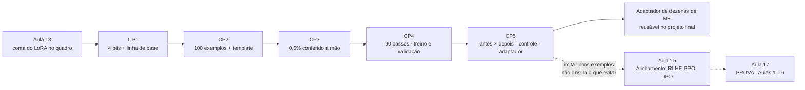
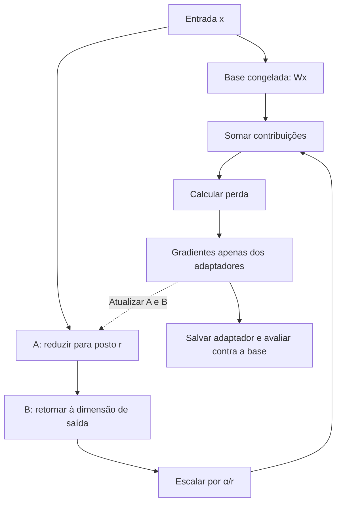
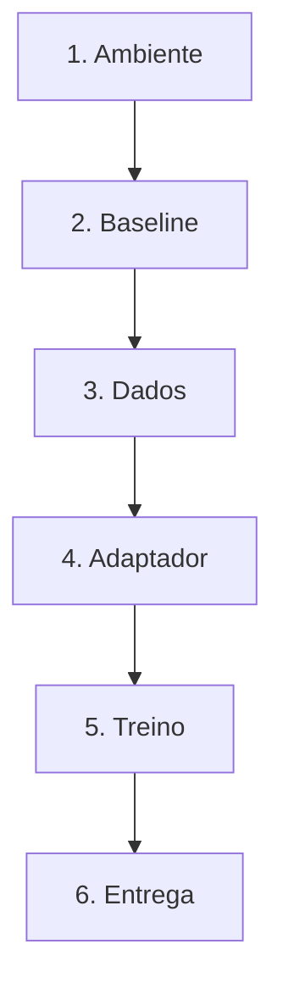
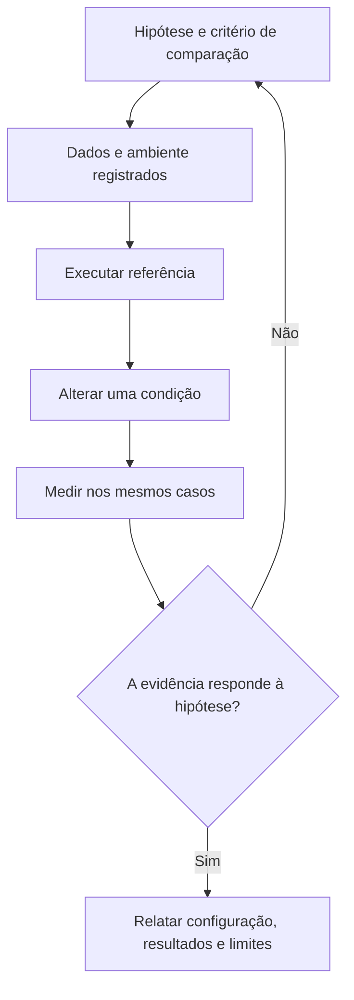
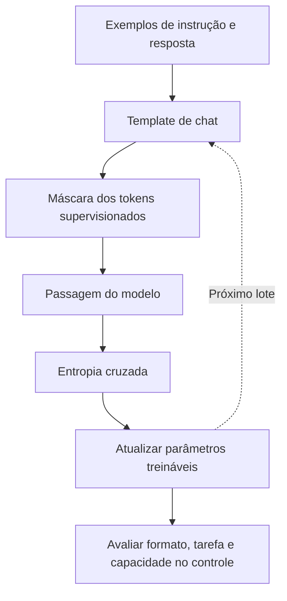

# Especificação de slides — Aula 14 (V2)

> **Rebalanceamento V2 — aula de laboratório (§6-bis do contrato).** Num lab a matemática **é**
> a prática: o aluno implementa a conta e mede o resultado dela. Inverter "aplicação antes de
> teoria" aqui seria redundante. Por isso o **roteiro prático não foi reordenado** — setup, demo
> e os cinco checkpoints permanecem na ordem que funciona em bancada, com os mesmos títulos e o
> mesmo relógio. Três mudanças:
>
> 1. **Cada checkpoint abre pelo comportamento esperado** — a linha que a célula imprime, o número
>    que sai, a verificação que o teste faz — e só depois nomeia o que implementar.
> 2. **A Parte 2 é nova:** um apêndice com o fundamento formal do que o aluno mede. Três itens,
>    organizados **por checkpoint** e não por tópico.
> 3. **Cada checkpoint ganhou um ponteiro** para o item correspondente, em uma linha, sem
>    interromper a prática.
>
> Carga horária (120 min), numeração e títulos dos slides do fluxo, checkpoints, entregável e
> objetivos de aprendizagem: **idênticos à V1**. **O notebook em `codigo/` não muda.**
>
> **Mapa checkpoint → apêndice:**
> ```
> Checkpoint 1 → A.1        (o que ocupa a placa: a decomposição que o notebook imprime)
> Checkpoint 2 → A.1        (MAX_LEN e a memória de ativações: por que 320 e não 2048)
> Checkpoint 3 → A.1        (o que a contagem custa em memória; a derivação está na Aula 13)
> Checkpoint 4 → A.2        (o que a curva de perda permite e NÃO permite concluir)
> Checkpoint 5 → A.3        (por que 5 prompts é ilustração e não medição)
> ```
> A teoria de LoRA e QLoRA foi dada ontem e o fundamento dela está no apêndice da Aula 13: a
> contagem `r · (d_in + d_out)` em **A.1 da Aula 13**, o `B = 0` em **A.2**, o `α/r` e a fusão em
> **A.3**, o NF4 em **A.4**, e a conta de memória das três configurações em **A.5**. Este deck
> **não redereiva** nada disso — ele aponta, e acrescenta o que só existe porque hoje tem número
> medido na tela.

<!-- SLIDE-FLOW:GUIDE:BEGIN -->
## Fluxogramas na produção dos slides

As orientações abaixo complementam o campo **Visual** dos slides indicados. Produzir os fluxogramas no próprio deck, como formas e conectores editáveis ou gráficos vetoriais; a biblioteca completa ao final torna esta especificação independente do portal.

- **Referência de composição:** título e propósito no topo, blocos numerados, conexões rotuladas, ramificações legíveis e uma saída identificada. Usar apenas o padrão visual da referência fornecida, sem importar seu assunto ou seus exemplos.
- **Tema do deck:** manter o fundo escuro e a paleta já especificada para a aula. Usar `#5b8cff` para o trecho ativo, tons neutros para o contexto e `#e2231a` conforme o significado definido no deck. Cor sempre acompanhada de rótulo.
- **Leitura:** entrada no topo ou à esquerda; saída na base ou à direita. Decisões em losangos, alternativas com rótulos e retornos apontando à etapa correta. Ramos paralelos convergem apenas onde seus resultados realmente são combinados.
- **Densidade:** no fluxo principal, projetar 3–6 blocos curtos por enquadramento, com corpo legível na última fileira. Um mapa maior pode ser revelado por etapas no mesmo slide. Detalhes, condições e explicações completas ficam nas notas; não reduzir a fonte para caber tudo.
- **Semântica:** mapas de percurso mostram ordem de estudo, não execução de um algoritmo. Manter separadas preparação e aplicação, treino e inferência, sequência e alternativas. Não transformar uma etapa opcional em obrigatória.
- **Integração:** o fluxograma substitui uma lista redundante ou ocupa o campo Visual; não cobre matrizes, tabelas, gráficos nem código indispensáveis. Preservar títulos, numeração, duração e referências aos apêndices.
- **Produção:** os blocos Mermaid abaixo são especificações do desenho. Renderizar/reconstruir como diagrama, nunca projetar o código Mermaid. Manter rótulos, bifurcações, retornos e limites declarados. Não transformar este caderno técnico em slides adicionais.
- **Ligação com o portal:** os mapas de mecanismo compartilham o conteúdo dos fluxogramas do portal. Em demonstrações, usar o mesmo vocabulário no deck e no controle interativo para facilitar a passagem entre os dois.
<!-- SLIDE-FLOW:GUIDE:END -->

## Diretrizes visuais

- **Tema:** escuro, accent `#e2231a` (vermelho CESAR), accent secundário `#5b8cff`.
- **Tipografia:** sans-serif para texto; monoespaçada para código, nomes de parâmetro, nomes de módulo, números de memória e tempo.
- **Densidade:** máximo 5 linhas de texto por slide no fluxo. Um conceito por slide.
- **Proibido:** bullets genéricos; slide-parede de texto; clipart; gráfico sem eixo rotulado; captura de tela de terminal ilegível.
- **Deck de laboratório:** os slides ficam projetados enquanto a turma trabalha. Cada slide de checkpoint precisa ser legível do fundo da sala e conter o **critério de conclusão** e o **relógio** — o aluno olha para a parede quando trava, não para o instrutor.
- **Slide de checkpoint tem moldura fixa e idêntica, e a primeira linha é o observável**, não a instrução: título com o número do checkpoint, relógio no canto superior direito, *o que aparece na tela quando está certo*, o que implementar (nomes reais de função), a armadilha num cartão em accent, e o ponteiro `→ Apêndice A.n`. Cinco slides com a mesma moldura — a repetição é intencional, é o que dá ritmo ao lab.
- **Números esperados** sempre visíveis nos slides de checkpoint: memória, passos, tempo. Um lab de treino sem número esperado deixa o aluno sem referência para saber se está no caminho.
- **Toda taxa na tela carrega o `n`.** Nunca "acerto 80%"; sempre `acerto 4/5 (n = 5, perfil gpu)`. É a regra do Lab 3, e neste lab o `n` é ainda menor.
- **No apêndice:** densidade alta é esperada e desejável. É material de consulta, lido em casa com o notebook executado ao lado.

## Arco narrativo

O deck cobra a promessa da Aula 13: a conta do quadro vira porcentagem na tela. Os três slides iniciais montam o contrato do lab — os dois perfis de execução com os números esperados declarados, e o mapa dos cinco checkpoints **apresentado pelo que cada um imprime**, com destaque para os três prompts de controle que existem para tornar o esquecimento visível. A demo percorre o caminho inteiro em miniatura e culmina no momento em que a porcentagem de treináveis aparece na tela ao lado da conta no quadro. Os cinco slides de checkpoint levam a turma de "modelo carregado em 4 bits" até "adaptador salvo e recarregado", passando pela medição em duas colunas que fecha o laço com o Lab 3. O deck fecha com a limitação estrutural da imitação de bons exemplos — que é a razão de existir da Aula 15 — e com o aviso da prova da Aula 17.

A Parte 2 não se apresenta em aula. Ela existe porque este lab produz três números que são fáceis de ler errado: a memória, que parece grande demais e não é; a curva de perda, que desce sempre e não prova o que parece provar; e a tabela de cinco prompts, que mostra um comportamento mudando e não mede taxa nenhuma. Quem vai escrever as cinco questões-guia precisa dos três itens — e a questão 5, que é a que mais separa nota, é literalmente o A.3.

---

# PARTE 1 — FLUXO DA AULA

*O que se apresenta em aula. 10 slides, 120 minutos com demo e cinco checkpoints. Ordem prática
preservada da V1, slide a slide, com os mesmos títulos e o mesmo relógio.*

## Slides

### Slide 1 — Abertura: ontem a conta, hoje o adaptador

<!-- SLIDE-FLOW:SLIDE:BEGIN -->
- **Fluxograma a incorporar neste slide:** **F00 — LoRA: dois caminhos, uma saída**. O desenho e os rótulos completos estão no caderno de fluxogramas ao final deste arquivo.
- **Composição:** integrar ao campo Visual; preservar exemplos, tabelas, fórmulas e dimensões solicitados neste slide. Destacar o trecho relacionado ao título e manter o restante em segundo plano. Os textos detalhados ficam nas notas, sem duplicar a lista de Conteúdo na tela.
<!-- SLIDE-FLOW:SLIDE:END -->

- **Tipo:** título
- **Título:** Laboratório 4 — Fine-tuning com LoRA/QLoRA
- **Frase-tese:** Ontem o número estava no quadro. Hoje ele vai estar na tela de vocês — e eu quero que vocês confiram a conta, não que aceitem o `print`.
- **Conteúdo:** A conta de ontem repetida como promessa a verificar:
  ```
  329.728 por camada  ×  28 camadas  =  9.232.384 treináveis
  9.232.384 / 1,54e9  =  0,60 %
  ```
  E o laço de duas semanas a fechar: no Lab 3 a coluna de "fora do espaço de rótulos" **não** foi a zero com few-shot. Hoje ela é o alvo.
- **Visual:** full-bleed. À esquerda, a conta manuscrita (estética de quadro); à direita, um terminal vazio esperando o `print`. Uma seta em accent ligando os dois. Rodapé: "Lab 4 de 8 · entrega em 1 semana · o entregável inclui um **adaptador**".
- **Notas do apresentador:** Notebook já aberto, modelo em cache, célula de diagnóstico rodada. Trazer anotados da véspera a memória de pico e o tempo real na GPU da oferta — vão no slide 2. Recolher por mão levantada quantos confirmaram GPU. Mencionar em uma frase que este deck tem apêndice com três itens, um por número que o lab produz — trinta segundos, não mais.

### Slide 2 — Os dois perfis e os números esperados
- **Tipo:** comparação
- **Título:** Dois perfis, e o de CPU fecha os cinco checkpoints
- **Conteúdo:**
  **O que a célula de diagnóstico imprime quando está certo:** o perfil escolhido, a GPU, o `compute_dtype`, e o bloco de números esperados que é o **contrato do lab**:
  ```
  memória dos pesos ......... ordem de 1,0 a 1,2 GiB
  treináveis LoRA ........... ordem de 9,2 M   (~0,6 % do total)
  pico de memória no treino . ordem de 2 a 5 GiB
  tempo de treino ........... ordem de 4 a 10 min
  adaptador salvo ........... ordem de 20 a 40 MB
  ```
  Os dois perfis:
  | | `gpu` | `cpu` (fallback) |
  |---|---|---|
  | modelo | aberto, ~1,5 B, licença permissiva, sem token | mesma família, muito menor — **mesmo template de chat** |
  | base | 4 bits NF4, cálculo em 16 bits (`bf16` se a GPU suportar, `fp16` na T4) | sem quantização |
  | passos · `MAX_LEN` · lote efetivo | 90 · 320 · 4 | reduzidos (declarados no notebook) |
  | resultado | medição real | **ilustrativo** — registrado na proveniência |

  Nota de conteúdo em destaque: a memória impressa é **maior** que `1,5e9 × 0,5 byte = 0,70 GiB`. A quantização **não** comprime a tabela de embeddings, e com vocabulário de ~152 mil tokens o embedding tem ~233 M de parâmetros em 16 bits (~0,43 GiB). É a Aula 2 chegando com fatura de VRAM.
- **Frase-tese:** O perfil de CPU fecha os cinco checkpoints e produz um resultado ilustrativo. As duas coisas são verdade.
- **Visual:** dois cartões lado a lado, o `gpu` com moldura em accent. Abaixo, uma barra empilhada decompondo a memória dos pesos: corpo em 4 bits (~0,63 GiB) + embedding em 16 bits (~0,43 GiB) = total, com a conta ingênua (0,70 GiB) marcada como linha tracejada que **não** explica o total.
- **Fundamento:** a diferença entre a conta ingênua e o número medido é de ~0,33 GiB, e ela tem uma causa única e nomeável: os 233 M parâmetros do embedding custam 2 bytes cada em vez de 0,5. Não é erro de arredondamento; é uma decisão de tokenizador cobrada em VRAM.
  → o orçamento inteiro da placa, decomposto, e a tabela de sensibilidade que mostra qual alavanca move o quê: **Apêndice A.1** (slide 11). A conta genérica das três configurações de treino está em **A.5 da Aula 13** e não se repete aqui
- **Notas do apresentador:** Rodar a célula de diagnóstico na tela. Contar mãos por perfil: se mais de um terço estiver em CPU, anunciar já que o CP5 pode virar tarefa de casa para esse grupo. **Não** liberar download coletivo simultâneo — pedir duas ondas.

### Slide 3 — O mapa: cinco checkpoints e o entregável

<!-- SLIDE-FLOW:SLIDE:BEGIN -->
- **Fluxograma a incorporar neste slide:** **F01 — O percurso desta aula**; **F02 — Laboratório: da hipótese à evidência**. O desenho e os rótulos completos estão no caderno de fluxogramas ao final deste arquivo.
- **Composição:** integrar ao campo Visual; preservar exemplos, tabelas, fórmulas e dimensões solicitados neste slide. Destacar o trecho relacionado ao título e manter o restante em segundo plano. Os textos detalhados ficam nas notas, sem duplicar a lista de Conteúdo na tela.
- **Momento de exibição:** apresentar o fluxo preenchido na discussão ou conferência, depois da tentativa da turma; durante a atividade, ocultar as etapas que entregariam a solução.
<!-- SLIDE-FLOW:SLIDE:END -->

- **Tipo:** diagrama
- **Título:** O que vocês entregam e quando
- **Conteúdo:** Os cinco checkpoints com relógio e **o que a tela imprime** quando está certo:
  ```
  CP1  00:35–00:50  4 bits + linha de base      -> "Checkpoint 1 OK" + memória decomposta   (A.1)
  CP2  00:50–01:05  100 exemplos + template     -> "Checkpoint 2 OK" + exemplo em repr()    (A.1)
  CP3  01:15–01:25  LoraConfig + a conta        -> "Checkpoint 3 OK" + treináveis: 9.232.384 (A.1)
  CP4  01:25–01:38  treinar 90 passos           -> 2 curvas + pico + tempo + "CP 4 OK"      (A.2)
  CP5  01:38–01:50  antes × depois + adaptador  -> "Checkpoint 5 OK" + TOTAL: xx MB         (A.3)
  ```
  Destaque sobre os prompts: **5 da tarefa + 3 de controle**. Os de controle (uma multiplicação, uma tradução curta, uma pergunta factual) não têm nada a ver com a tarefa — e é por isso que estão lá: são o instrumento para ver o esquecimento catastrófico da Aula 13.
  Cartão à direita: "Entregável: notebook + **adaptador** (dezenas de MB) + proveniência".
- **Frase-tese:** Este é o primeiro lab em que vocês entregam um modelo.
- **Visual:** trilha horizontal de cinco estações com o relógio embaixo de cada uma e o intervalo marcado entre a 2ª e a 3ª. Ao lado dos prompts, dois grupos de ícones: 5 na cor da tarefa, 3 em cor de alerta rotulados `controle`. A coluna `(A.n)` em cinza discreto — é ponteiro de estudo, não tarefa de sala.
- **Notas do apresentador:** Dizer que CP1 e CP2 têm solução comentada liberada em 00:50 e 01:05 — rede de segurança, não convite a desistir. O CP3 é onde mora o ponto do lab. A coluna do apêndice se explica em uma frase: "cada número que hoje aparece na tela tem um item com a conta por trás dele; ninguém precisa disso agora, e a questão-guia 5 é literalmente o A.3".



### Slide 4 — [Demo] O caminho completo em miniatura

<!-- SLIDE-FLOW:SLIDE:BEGIN -->
- **Fluxograma a incorporar neste slide:** **F00 — LoRA: dois caminhos, uma saída**. O desenho e os rótulos completos estão no caderno de fluxogramas ao final deste arquivo.
- **Composição:** integrar ao campo Visual; preservar exemplos, tabelas, fórmulas e dimensões solicitados neste slide. Destacar o trecho relacionado ao título e manter o restante em segundo plano. Os textos detalhados ficam nas notas, sem duplicar a lista de Conteúdo na tela.
<!-- SLIDE-FLOW:SLIDE:END -->

- **Tipo:** transição para demonstração
- **Título:** Carregar · medir · gerar · formatar · configurar · **um** passo
- **Frase-tese:** Vou percorrer o caminho inteiro em miniatura e parar antes do laço de treino. O laço é de vocês.
- **Conteúdo:** Os passos como lista numerada em monoespaçada, sem resultado — o resultado aparece ao vivo: `diagnóstico` · `load_in_4bit` + memória decomposta · `responder()` determinística · 1 prompt no base · `apply_chat_template` · `LoraConfig` + `print_trainable_parameters` · **1** passo de treino.
- **Visual:** slide de transição, quase vazio. A lista numerada à esquerda; à direita, duas caixas vazias lado a lado rotuladas `tela` e `quadro`, esperando o número da biblioteca e a conta manuscrita.
- **Fundamento:** os dois números que a demo produz são `9.232.384 / 0,60 %` e a **memória decomposta**. O primeiro é a conta da Aula 13 confirmada; o segundo é o insumo de todo o orçamento de memória do treino, e é o único dos dois que a Aula 13 não previu, porque ele depende do tokenizador deste modelo.
  → a decomposição explicada linha a linha: **Apêndice A.1** (slide 11)
- **Notas do apresentador:** Roteiro na Parte 2. Modelo já em cache — nunca baixar na frente da turma. Escrever `responder` na mão: o determinismo dela é conceito. Apagar as células da demo no fim. O par "número na tela + conta no quadro" é a demo inteira e não pode ser cortado.

### Slide 5 — [Checkpoint 1] Carregar em 4 bits e capturar a linha de base

<!-- SLIDE-FLOW:SLIDE:BEGIN -->
- **Fluxograma a incorporar neste slide:** **F02 — Laboratório: da hipótese à evidência**. O desenho e os rótulos completos estão no caderno de fluxogramas ao final deste arquivo.
- **Composição:** integrar ao campo Visual; preservar exemplos, tabelas, fórmulas e dimensões solicitados neste slide. Destacar o trecho relacionado ao título e manter o restante em segundo plano. Os textos detalhados ficam nas notas, sem duplicar a lista de Conteúdo na tela.
- **Momento de exibição:** apresentar o fluxo preenchido na discussão ou conferência, depois da tentativa da turma; durante a atividade, ocultar as etapas que entregariam a solução.
<!-- SLIDE-FLOW:SLIDE:END -->

- **Tipo:** código (moldura de checkpoint)
- **Título:** Checkpoint 1 · 00:35–00:50 · quantizar e medir antes de mexer
- **Conteúdo:**
  **Quando está certo, a tela imprime isto:**
  ```
  corpo do transformer :  0.6xx GiB   (   655.1 M elementos armazenados)
  embeddings / lm_head :  0.4xx GiB   (   233.4 M elementos armazenados)
  TOTAL dos pesos      :  1.0xx GiB
  Conta ingênua para comparar:
    1,5e9 x 0,5 byte = 0.699 GiB  <- NÃO explica o total acima
  ...
  Checkpoint 1 OK
  ```
  e o teste terá conferido quatro coisas, cada uma apontando para um erro diferente:
  ```
  1  existe parâmetro de 4 bits no modelo        (a BitsAndBytesConfig foi aplicada?)
  2  memória dos pesos entre 0,6 e 2,0 GiB       (faixa do perfil gpu)
  3  responder() é determinística                (duas chamadas -> a MESMA string)
     e não devolve o prompt de volta              (decodificar SÓ os tokens novos)
  4  ANTES tem 8 respostas não vazias            (5 de tarefa + 3 de controle)
  ```
  O que implementar, na ordem dos TODOs:
  ```
  BitsAndBytesConfig(load_in_4bit=True, bnb_4bit_quant_type="nf4",
                     bnb_4bit_compute_dtype=COMPUTE_DTYPE,   # ARMAZENA 4 bits, CALCULA 16
                     bnb_4bit_use_double_quant=True)
  responder(m, pergunta) -> apply_chat_template · generate(do_sample=False) · só tokens novos
  ```
  `COMPUTE_DTYPE` é `bfloat16` se a GPU suportar e `float16` na T4 — Turing não tem bf16.
- **Frase-tese:** Depois do treino, o modelo de antes não existe mais nesta sessão.
- **Visual:** no topo, o critério de conclusão em caixa destacada (as três linhas de memória e a linha da conta ingênua riscada). Abaixo à esquerda, o bloco de código com os dois TODOs; à direita, uma tabela vazia de 8 linhas (5 tarefa + 3 controle) rotulada `ANTES`. Cartão de alerta em accent com as três armadilhas silenciosas: decodificar a sequência inteira; `do_sample=True` por hábito; montar o prompt à mão. Relógio `00:35–00:50` no canto.
- **Fundamento:** o número impresso é **maior** que a conta ingênua por uma razão única: os 233 M parâmetros do embedding não são quantizados e custam 2 bytes em vez de 0,5, o que são ~0,33 GiB de diferença. A quantização de 4 bits atua sobre as matrizes lineares dos blocos, e só sobre elas. E as 8 entradas de `ANTES` não são 8 por acaso: são **5 da tarefa e 3 de controle**, e os três de controle têm resolução de 33 pontos percentuais — são uma peneira de catástrofe, não uma medição de esquecimento.
  → a decomposição completa, o orçamento inteiro da placa e a regra de diagnóstico do `OOM`: **Apêndice A.1** (slide 11) · o que 3 e 5 prompts licenciam afirmar: **Apêndice A.3** (slide 13). A construção dos 16 níveis do NF4 e o custo de 4,127 bits por peso estão em **A.4 da Aula 13** e não se repetem aqui; e **o que quantizar é**, mecanicamente — o mapeamento afim, o *absmax* que o NF4 usa como constante de bloco, o erro que sobra e por que o bloco é de 64 e não do tensor inteiro — está em **A.6 da Aula 13**, que é a leitura certa para quem carregou em 4 bits neste checkpoint sem nunca ter escrito a conta
- **Notas do apresentador:** Circular olhando tela. A pergunta que resolve metade dos casos: "você está decodificando os tokens novos ou a sequência inteira?". Solução liberada em 00:50, porque os quatro checkpoints seguintes consomem essas duas funções. Quem estranhar o número da memória: a resposta de uma frase é "o embedding não encolhe, e ele tem 233 milhões de parâmetros" — o resto está em A.1.

### Slide 6 — [Checkpoint 2] Dataset e template de chat

<!-- SLIDE-FLOW:SLIDE:BEGIN -->
- **Fluxograma a incorporar neste slide:** **F03 — SFT: dados de diálogo até o comportamento**. O desenho e os rótulos completos estão no caderno de fluxogramas ao final deste arquivo.
- **Composição:** integrar ao campo Visual; preservar exemplos, tabelas, fórmulas e dimensões solicitados neste slide. Destacar o trecho relacionado ao título e manter o restante em segundo plano. Os textos detalhados ficam nas notas, sem duplicar a lista de Conteúdo na tela.
- **Momento de exibição:** apresentar o fluxo preenchido na discussão ou conferência, depois da tentativa da turma; durante a atividade, ocultar as etapas que entregariam a solução.
<!-- SLIDE-FLOW:SLIDE:END -->

- **Tipo:** dados (moldura de checkpoint)
- **Título:** Checkpoint 2 · 00:50–01:05 · leiam o dado antes de treinar nele
- **Conteúdo:**
  **Quando está certo, a tela imprime isto:**
  ```
  --- EXEMPLO FORMATADO, COMO O MODELO VAI VER (repr, para os \n aparecerem) ---
  '<|im_start|>system\n...<|im_end|>\n<|im_start|>user\n...<|im_end|>\n
   <|im_start|>assistant\nCategoria: bug\nResposta: ...<|im_end|>\n'
  comprimento em tokens: mín .. · mediana .. · máx ..
  Checkpoint 2 OK
  ```
  e o teste terá conferido cinco coisas:
  ```
  1  100 textos formatados, nenhum vazio
  2  a divisão treino/validação soma 100          (88 / 12)
  3  <|im_start|> e <|im_end|> presentes          (você usou apply_chat_template?)
  4  os três papéis aparecem: system · user · assistant
  5  NENHUM exemplo atingiu MAX_LEN               (truncado = resposta cortada no meio)
  ```
  O conjunto: **100 exemplos embutidos** no notebook, em português. Entrada: comentário de aplicativo. Saída, em duas linhas: `Categoria:` com uma de quatro palavras e `Resposta:` com uma ou duas frases. As quatro categorias são **as mesmas do Lab 3** — de propósito.
- **Frase-tese:** 100 exemplos cabem numa tela. Leiam o dado.
- **Visual:** no topo, o critério (a string em `repr()` e a linha de comprimentos). Abaixo à esquerda, dois exemplos reais do conjunto em monoespaçada. À direita, a string formatada com os tokens de papel destacados em accent e o token que abre o turno do assistente circulado, com a legenda "sua vez". Cartão de alerta: montar o prompt à mão (`"Usuário: ... Assistente:"`) **passa** neste checkpoint e **explode** no Checkpoint 5 — sem erro, sem aviso.
- **Fundamento:** a verificação nº 5 não é higiene: `MAX_LEN = 320` foi escolhido para **caber o dado**, não para caber na placa. A memória de ativações cresce linearmente com o comprimento na parcela dominante — o tensor de logits, que é proporcional ao vocabulário — e quadraticamente no termo da atenção. Com este conjunto, 320 tokens sobram; a placa toleraria muito mais.
  → o orçamento de ativações em função de `MAX_LEN` e do lote, com a tabela de sensibilidade: **Apêndice A.1** (slide 11)
- **Fundamento (auditoria do conjunto):** com `n = 88`, **um** rótulo errado desloca o modelo
  de forma mensurável e nada no lab avisa. Há um teste barato: a **auto-influência** de um
  exemplo é `η·‖∇L(x)‖²` — a norma do gradiente ao quadrado, e mais nada. Ordenar os 88 por
  ela e **ler os dez primeiros à mão** põe o exemplo suspeito no topo da fila.
  → o procedimento, o custo, a correção obrigatória por comprimento de sequência e a condição
  que invalida o método: **Apêndice A.4** (slide 14)
- **Notas do apresentador:** A turma acelera e pula o `print` do exemplo formatado — não deixar, é o conceito do checkpoint e é o item que o teste confere. Sobre o mascaramento de rótulo: é simplificação declarada em célula de markdown, é a extensão 1 do desafio, e as consequências dela para a leitura da curva estão em A.2. Solução liberada em 01:05, junto com o intervalo.

### Slide 7 — [Checkpoint 3] LoRA e a conta dos treináveis

<!-- SLIDE-FLOW:SLIDE:BEGIN -->
- **Fluxograma a incorporar neste slide:** **F00 — LoRA: dois caminhos, uma saída**. O desenho e os rótulos completos estão no caderno de fluxogramas ao final deste arquivo.
- **Composição:** integrar ao campo Visual; preservar exemplos, tabelas, fórmulas e dimensões solicitados neste slide. Destacar o trecho relacionado ao título e manter o restante em segundo plano. Os textos detalhados ficam nas notas, sem duplicar a lista de Conteúdo na tela.
- **Momento de exibição:** apresentar o fluxo preenchido na discussão ou conferência, depois da tentativa da turma; durante a atividade, ocultar as etapas que entregariam a solução.
<!-- SLIDE-FLOW:SLIDE:END -->

- **Tipo:** código (moldura de checkpoint)
- **Título:** Checkpoint 3 · 01:15–01:25 · o número da aula, conferido à mão
- **Conteúdo:**
  **Quando está certo, a tela imprime isto:**
  ```
  módulos LoRA criados: 196   (esperado: 7 x 28 = 196)
  ...
    por camada:    329.728
     x camadas:  9.232.384   <- minha conta
    biblioteca:  9.232.384   <- o que o PEFT reporta
  diferença: 0.00%
  treináveis: 9.232.384  ·  fração estimada do modelo: 0.6xx%
  Checkpoint 3 OK
  ```
  e o teste terá conferido quatro coisas:
  ```
  1  existe parâmetro treinável                  (a LoraConfig foi aplicada?)
  2  fração de treináveis abaixo de 1 %           (acima: r maior, ou módulo repetido)
  3  módulos LoRA criados = 7 x n_layers          (nome errado NÃO levanta erro)
  4  a conta à mão bate com a biblioteca em 1 %   (o TODO 5 foi preenchido?)
  ```
  O que implementar:
  ```
  LoraConfig(r=8, lora_alpha=16, lora_dropout=0.05,
             target_modules=["q_proj","k_proj","v_proj","o_proj",
                             "gate_proj","up_proj","down_proj"],
             task_type="CAUSAL_LM")
  prepare_model_for_kbit_training(m)   ANTES DE   get_peft_model(m, cfg)
  ```
  Segunda célula: **recalcular à mão** com as dimensões lidas de `model.config` — não copiadas do quadro.
- **Frase-tese:** Nome errado em `target_modules` não dá erro. Ele silenciosamente não cria adaptador.
- **Visual:** no topo, o critério (as três linhas `minha conta` / `biblioteca` / `diferença` e a contagem de módulos). Abaixo à esquerda, o bloco de código; à direita, duas caixas empilhadas rotuladas `o que a biblioteca imprimiu` e `o que eu calculei`, com um sinal de igual grande em accent entre elas. Relógio no canto.
- **Fundamento:** a contagem por módulo é `r · (d_in + d_out)`, e a razão pela qual o produto tem posto no máximo `r` está derivada em **A.1 da Aula 13**, junto com a tabela dos sete módulos e a conferência de que os módulos adaptados somam 1,31 B dos 1,54 B do modelo. **Não se repete aqui.** O que este lab acrescenta é o preço em memória desse número: `9,23 · 10⁶` treináveis custam ~0,09 GiB de peso, gradiente e estados de otimizador em 8 bits.
  → o que a contagem custa na placa, e por que `r` **não** é a restrição de memória deste lab: **Apêndice A.1** (slide 11)
- **Notas do apresentador:** Checkpoint mais curto e mais importante. Em 01:23 pedir o par (treináveis, %) de duas pessoas e escrever no quadro ao lado da conta de ontem. Fração > 1% quase sempre é `r` maior que o pedido, módulo repetido, ou o perfil de CPU (modelo menor ⇒ fração diferente — e isso é conteúdo). Quem perguntar se pode subir o `r` para melhorar: a resposta é que a placa aguenta com folga e o conjunto de 100 exemplos não — está em A.1 e em A.2.

### Slide 8 — [Checkpoint 4] Treinar e registrar

<!-- SLIDE-FLOW:SLIDE:BEGIN -->
- **Fluxograma a incorporar neste slide:** **F00 — LoRA: dois caminhos, uma saída**. O desenho e os rótulos completos estão no caderno de fluxogramas ao final deste arquivo.
- **Composição:** integrar ao campo Visual; preservar exemplos, tabelas, fórmulas e dimensões solicitados neste slide. Destacar o trecho relacionado ao título e manter o restante em segundo plano. Os textos detalhados ficam nas notas, sem duplicar a lista de Conteúdo na tela.
- **Momento de exibição:** apresentar o fluxo preenchido na discussão ou conferência, depois da tentativa da turma; durante a atividade, ocultar as etapas que entregariam a solução.
<!-- SLIDE-FLOW:SLIDE:END -->

- **Tipo:** dados (moldura de checkpoint)
- **Título:** Checkpoint 4 · 01:25–01:38 · os três interruptores que fazem caber
- **Conteúdo:**
  **Quando está certo, a tela mostra um gráfico com DUAS curvas e quatro linhas:**
  ```
  [gráfico: passo × perda, com as séries "treino" e "validação" no MESMO eixo]
  treino    : [1.9xxx, ..., 0.9xxx]
  validação : [1.7xxx, 1.4xxx, 1.3xxx]        (3 pontos: passos 30, 60, 90)

  passos            : 90
  tempo total       : x.x min
  pico de memória   : x.xx GiB
  perda final treino: 0.9xxx
  Checkpoint 4 OK
  ```
  e o teste terá conferido quatro coisas:
  ```
  1  histórico com pelo menos dois pontos        (o treino rodou?)
  2  perda final MENOR que a inicial             (se não: 3 causas, na ordem abaixo)
  3  existe perda de validação registrada        (eval_steps foi aplicado?)
  4  pico de memória medido                      (max_memory_allocated, não memory_allocated)
  ```
  Os argumentos que importam, com o porquê de cada um:
  ```
  per_device_train_batch_size = 1
  gradient_accumulation_steps = 4      # lote efetivo 4 sem memória para lote 4
  gradient_checkpointing      = True   # recomputação de ativações (Aula 12)
  optim = "paged_adamw_8bit"           # estados em 8 bits, paginados
  learning_rate = 2e-4                 # LoRA, NÃO 2e-5 de fine-tuning completo
  model.config.use_cache = False       # KV cache é para geração, não para treino
  ```
  Se a curva sair plana, a ordem de checagem é: `prepare_model_for_kbit_training` **antes** de `get_peft_model` · nomes em `target_modules` · `learning_rate`. É a mesma lista que a mensagem de falha do teste imprime.
- **Frase-tese:** A perda de treino cair é o que ela faz. O sinal está na de validação — e mesmo ela não pega tudo.
- **Visual:** no topo, o critério: um gráfico-modelo vazio com dois eixos rotulados (`passo` × `perda por token`) e duas legendas já escritas (`treino`, `validação`). Abaixo à esquerda, o bloco de configuração com os três interruptores marcados em accent; à direita, três caixas vazias: `passos` · `tempo` · `pico de memória`. Relógio no canto.
- **Fundamento:** a perda é a entropia cruzada **média por token sobre a sequência inteira** — e a sequência inclui o prompt de sistema, que é **idêntico nos 100 exemplos**. Aprender a prever uma constante move a perda sem mover a tarefa. A curva licencia um diagnóstico de encanamento (o gradiente chega ao adaptador) e não licencia a conclusão de que o modelo ficou melhor no que se pediu.
  → a decomposição da sequência, a estimativa de quanto da queda é a constante, e a lista do que a curva não permite concluir: **Apêndice A.2** (slide 12) · o pico de memória decomposto: **Apêndice A.1** (slide 11)
- **Notas do apresentador:** Cinco minutos de silêncio treinando — melhor momento para circular. `OOM`: reduzir `MAX_LEN` 320→192, reduzir acumulação, conferir os dois interruptores. **A ordem não é arbitrária** e o motivo está em A.1: se o `OOM` se move com `MAX_LEN` e não com `r`, são as ativações. Aos 01:36 perguntar o tempo de três pessoas e comparar com o da véspera — a dispersão entre GPUs do Colab é grande e essa comparação é uma lição de método de graça.

### Slide 9 — [Checkpoint 5] Antes × depois, controle e o adaptador

<!-- SLIDE-FLOW:SLIDE:BEGIN -->
- **Fluxograma a incorporar neste slide:** **F00 — LoRA: dois caminhos, uma saída**. O desenho e os rótulos completos estão no caderno de fluxogramas ao final deste arquivo.
- **Composição:** integrar ao campo Visual; preservar exemplos, tabelas, fórmulas e dimensões solicitados neste slide. Destacar o trecho relacionado ao título e manter o restante em segundo plano. Os textos detalhados ficam nas notas, sem duplicar a lista de Conteúdo na tela.
- **Momento de exibição:** apresentar o fluxo preenchido na discussão ou conferência, depois da tentativa da turma; durante a atividade, ocultar as etapas que entregariam a solução.
<!-- SLIDE-FLOW:SLIDE:END -->

- **Tipo:** dados (moldura de checkpoint)
- **Título:** Checkpoint 5 · 01:38–01:50 · duas colunas, três controles, um arquivo
- **Conteúdo:**
  **Quando está certo, a tela mostra três coisas:**
  ```
  TABELA ANTES x DEPOIS — 5 prompts da tarefa, duas colunas
            | acerto de categoria | aderência ao formato
    antes   |               xx%   |                 xx%
    depois  |               xx%   |                100%

  TABELA DE CONTROLE — fora do domínio treinado
    (multiplicação · tradução · pergunta factual)   ANTES ok=? / DEPOIS ok=?
    "A verificação por substring acima é grosseira de propósito: LEIA as respostas."

  TOTAL do adaptador : xx.xx MB
  idênticas  : True                        (modelo em memória × modelo recarregado)
  Checkpoint 5 OK
  ```
  e o teste terá conferido quatro coisas:
  ```
  1  DEPOIS tem 8 respostas não vazias
  2  aderência ao formato DEPOIS > ANTES    (se não: responder() usa o template do treino?)
  3  diretório do adaptador existe, < 200 MB, com arquivo adapter_*
  4  a saída recarregada bate com a de memória  (aviso, não falha, se divergir)
  ```
  Aposta declarada do instrutor, para a turma confirmar ou desmentir: **formato** vai para perto de 100%; **acerto de categoria** mexe pouco ou nada. Se acontecer, é o achado — 100 exemplos e 0,6% dos parâmetros movem **forma**, não **capacidade**.
- **Frase-tese:** Se o acerto não subiu e o formato foi a 100%, escrevam isso. É o achado, não a falha.
- **Visual:** no topo, o critério com as duas tabelas em esqueleto e as duas linhas do adaptador. Abaixo, as duas tabelas vazias à esquerda e ao centro; à direita, dois retângulos de arquivo em escala honesta: `adapter_model.safetensors` (dezenas de MB) contra o modelo base (GiB). Em cada célula de taxa, o `n` impresso ao lado — `(n = 5)` na tabela da tarefa, `(n = 3)` na de controle.
- **Fundamento:** com `n = 5` a menor diferença representável é 20 pontos percentuais, e no cenário mais favorável possível — **todos os cinco** prompts mudando de lado na mesma direção — o `p`-valor exato bilateral de uma comparação pareada é `2 · (0,5)⁵ = 0,0625`, ainda acima de 0,05. Nenhum resultado possível neste conjunto atinge o nível de 5%. O que cinco prompts licenciam é a afirmação **categórica** de que a forma da saída mudou; o que eles não licenciam é a afirmação de que a **taxa** de acerto subiu.
  → a conta completa, o erro-padrão com `n = 5`, o ponto em que o intervalo de Wald sai de `[0,1]`, o tamanho de amostra necessário e a redação honesta para o relatório: **Apêndice A.3** (slide 13). É o **terceiro elo** do fio que começa em **A.3 do Lab 3 (Aula 11)** e fecha em **A.5 do Lab 8 (Aula 28)**
- **Notas do apresentador:** Se a maior parte está em CPU, converter parte destes 12 min em escrita do relatório em sala. Em 01:47 pedir os dois números de duas pessoas; usar quem tiver formato 100% e acerto igual como exemplo na frente da sala — tratar como achado. E se alguém disser "meu acerto subiu de 60 para 80", tratar isso também na frente da sala: são 20 pontos, e 20 pontos com cinco prompts é **um** prompt. É o momento em que o A.3 fica necessário em vez de protocolar.

### Slide 10 — Recolhimento: o que entregar, a Aula 15 e a prova
- **Tipo:** encerramento
- **Título:** Imitar bons exemplos ensina o que fazer — não o que evitar
- **Conteúdo:** Checklist de entrega (prazo: 1 semana):
  - ☐ Notebook executado, com saídas visíveis (`Checkpoint 1 OK` a `5 OK`)
  - ☐ **Adaptador salvo** (`adapter_config.json` + `adapter_model.safetensors`), com o tamanho registrado
  - ☐ Tabela antes × depois com as **duas** colunas + tabela de controle
  - ☐ Campo de **proveniência** (modelo · perfil · base quantizada? · passos · n · tempo · pico · data)
  - ☐ Respostas às 5 questões-guia + declaração de uso de IA

  A ponte, como limitação estrutural: o SFT do lab ensinou o modelo a **imitar bons exemplos**. Isso não ensina o que **evitar** (o espaço de respostas ruins é infinito e não cabe em exemplos bons) e não sabe dizer que, entre duas respostas aceitáveis, uma é melhor. Semana que vem o sinal muda de "esta é a resposta boa" para "esta é **melhor** que aquela": modelo de recompensa, RLHF, PPO, DPO. **Aula 15 — Alinhamento.**

  Aviso em destaque: **a prova é na Aula 17** — individual, escrita, sem IA, cobrindo as **Aulas 1 a 16**. Do Módulo 3 entram: `C ≈ 6ND`, alocação compute-optimal, 16 bytes/param, os três paralelismos, por que FlashAttention é exata, a conta do LoRA, e o framework prompting × RAG × fine-tuning. Faltam duas aulas.
- **Frase-tese:** Vocês ensinaram o modelo a imitar bons exemplos. Isso ensina o que fazer e não ensina o que evitar.
- **Visual:** checklist em caixa destacada com quadradinhos vazios, dimensionado para ser fotografado do fundo da sala. À direita, uma seta em accent saindo de "imitar bons exemplos (SFT)" e entrando em "comparar respostas (preferência) — Aula 15". Faixa inferior em cor de alerta: `PROVA · Aula 17 · Aulas 1–16 · sem IA`. Num canto discreto, o índice do apêndice: A.1 o orçamento da placa · A.2 o que a curva não prova · A.3 o que 5 prompts não medem.
- **Notas do apresentador:** 30 s de silêncio no checklist para fotografar. Recolher o pulso: quantos chegaram ao CP5 e quantos rodaram em CPU — calibra a revisão da prova. Antes de encerrar, projetar o índice do apêndice por 20 s e nomear **um** item: o **A.3**, porque ele é a resposta da questão-guia 5 — a que pede o que os números **não** provam — e porque ele é o terceiro de quatro itens do curso que fazem a mesma pergunta. Dizer a data da prova em voz alta e escrever `Aula 17` no quadro; a data de calendário é `[definir na oferta]`.

---

# PARTE 2 — APÊNDICE MATEMÁTICO

> Material de estudo e consulta. **Não se apresenta em aula**; é distribuído com o deck.
> Organizado **por checkpoint**, não por tópico: um item para cada número que o lab produz e que
> é fácil de ler errado. Autossuficiente — quem estuda por aqui sem ter feito o lab reconstrói
> todas as contas, e quem fez o lab consegue explicar os próprios números.
>
> **Onde o fundamento já está em outra aula, este apêndice aponta em vez de repetir.** A contagem
> `r · (d_in + d_out)` e a tabela dos sete módulos estão em **A.1 da Aula 13**; o `B = 0` em
> **A.2 da Aula 13**; o `α/r` e a fusão em **A.3 da Aula 13**; a mecânica da quantização (absmax ×
> ponto-zero, o erro, PTQ × QAT) em **A.6 da Aula 13**; a construção do NF4 e o custo de
> 4,127 bits por peso em **A.4 da Aula 13**; a conta genérica das três configurações de treino em
> **A.5 da Aula 13**. Este apêndice acrescenta o que só existe porque hoje há medição numa placa
> concreta: o **orçamento desta GPU**, o **significado da curva** e o **tamanho da amostra**.

### Slide 11 — A.1 · O orçamento desta placa, e por que o `r` escolhido cabe
- **Tipo:** apêndice — contagem completa, tabela de sensibilidade e regra de diagnóstico
- **Invocado em:** slides 2, 4, 5, 6, 7 e 8 (setup, demo, Checkpoints 1, 2, 3 e 4)

**O que este item estabelece.** Quatro coisas: por que a memória que o Checkpoint 1 imprime é **maior** que a conta ingênua, e exatamente quanto maior; qual é o orçamento inteiro do treino nesta placa, decomposto em parcelas que se podem somar; qual alavanca move qual parcela, numa tabela; e a conclusão contraintuitiva que decide a configuração do notebook — **`r` não é a restrição de memória deste lab**, e `r = 8` foi escolhido por causa dos 100 exemplos, não por causa da GPU.

**Notação.**
`N` — parâmetros do modelo, contados logicamente (não empacotados): `1,5437 · 10⁹`.
`N_c` — parâmetros nas matrizes lineares dos blocos, que são as quantizadas: `1,3102 · 10⁹`.
`N_e` — parâmetros da tabela de embeddings, **não** quantizada: `1,5194·10⁵ × 1536 = 2,3337 · 10⁸`.
`N_a` — parâmetros treináveis do adaptador, de **A.1 da Aula 13**: `9,2324 · 10⁶`.
`b` — bytes por parâmetro no armazenamento. `d = 1536` (`d_model`), `n_L = 28` camadas, `n_h = 12` cabeças, `|V| = 151.936`, `L` — comprimento da sequência (`MAX_LEN`), `B` — lote **físico**.
Memórias em **GiB** (`2³⁰` bytes), porque é a unidade em que o CUDA reporta erro; onde a comparação for com a especificação da placa (que vem em GB decimais) isso está dito.

**Premissas.** (i) Perfil `gpu` do notebook: `Qwen/Qwen2.5-1.5B-Instruct`, NF4 com dupla quantização, `B = 1`, `L = 320`, acumulação 4, recomputação de ativações ligada, `paged_adamw_8bit`. (ii) A quantização de 4 bits é aplicada às matrizes lineares dos blocos e **não** ao embedding, à cabeça de saída nem às normalizações — é o padrão da biblioteca. (iii) Neste modelo o embedding de entrada e a cabeça de saída são **amarrados**, logo `N_e` conta uma vez. (iv) Os valores são de regime estacionário; o pico medido é maior, e a Parte 5 diz por quê.

**Parte 1 · Por que a conta ingênua erra, e por quanto.**
A conta ingênua supõe que todo parâmetro custa meio byte:
```
M_ingênua = 1,5 · 10⁹ × 0,5 B = 0,750 · 10⁹ B = 0,699 GiB
```
A conta real separa o que foi quantizado do que não foi.

*Corpo do transformer, quantizado.* Cada parâmetro custa 4 bits de índice mais a sobrecarga das constantes de bloco. Com dupla quantização, **A.4 da Aula 13** estabelece 4,127 bits por peso, isto é `0,516` bytes:
```
M_corpo = 1,3102 · 10⁹ × 0,516 B = 0,676 · 10⁹ B = 0,630 GiB
```
*Embedding, não quantizado, em 16 bits:*
```
M_embed = 2,3337 · 10⁸ × 2 B = 0,4667 · 10⁹ B = 0,435 GiB
```
*Total dos pesos:*
```
M_pesos = 0,630 + 0,435 = 1,065 GiB
```
que é a faixa `1,0–1,2 GiB` declarada no notebook e o número que o Checkpoint 1 imprime.

*A diferença, atribuída.*
```
1,065 − 0,699 = 0,366 GiB
```
e ela tem uma causa dominante, isolável: o embedding custa `2 B` em vez de `0,5 B`, o que são
```
2,3337 · 10⁸ × 1,5 B = 0,350 · 10⁹ B = 0,326 GiB
```
Os `0,040 GiB` restantes são a sobrecarga das constantes de quantização (`0,127` bit por peso do corpo, cerca de 0,019 GiB) e os vieses e normalizações que ficam em 16 bits.

∎ **A quantização não falhou: ela não se aplica a 15% dos parâmetros do modelo, e esses 15% são justamente os mais caros por parâmetro.** E a razão de eles existirem é o tamanho do vocabulário, que é decisão de tokenizador — é a Aula 2 chegando com fatura de VRAM, literalmente. Um modelo com vocabulário de 32 mil tokens teria `N_e = 4,9 · 10⁷` e `M_embed = 0,092 GiB` em vez de `0,435`: quatro vezes menos, sem tocar em nada além do tokenizador.

**Parte 2 · O orçamento do treino, parcela por parcela.**

*(a) Pesos base.* `1,065 GiB`, da Parte 1. Congelados: sem gradiente, sem cópia mestre, sem momentos — é o que **A.5 da Aula 13** estabelece.

*(b) Adaptador e estados do otimizador.* `prepare_model_for_kbit_training` promove os parâmetros treináveis a 32 bits, e `paged_adamw_8bit` guarda os dois momentos em 8 bits:
```
peso do adaptador (fp32)      4 B × 9,2324·10⁶ = 36,9 MB
gradiente (fp32)              4 B × 9,2324·10⁶ = 36,9 MB
momento m (8 bits)            1 B × 9,2324·10⁶ =  9,2 MB
momento v (8 bits)            1 B × 9,2324·10⁶ =  9,2 MB
──────────────────────────────────────────────────────────
total                        10 B por treinável =  92,3 MB = 0,086 GiB
```
Com `adamw_torch` em 32 bits seriam 16 bytes por treinável, `147,7 MB = 0,138 GiB`. A diferença entre as duas escolhas é **55 MB numa placa de 16 GB** — e isso já antecipa a conclusão da Parte 4.

*(c) Ativações, com recomputação ligada.* Guardam-se apenas as fronteiras de camada:
```
B · L · d · 2 B · n_L = 1 × 320 × 1536 × 2 × 28 = 27,5 MB = 0,026 GiB
```
mais o interior de **uma** camada recomputada no backward — da ordem de 15 tensores do mesmo tamanho, `14,7 MB`. Somando, `≈ 0,039 GiB`.

*(d) O tensor de logits — a maior parcela de ativação, e a que quase ninguém conta.* A saída do modelo é um tensor de `B × L × |V|`, e a entropia cruzada da biblioteca o promove a 32 bits:
```
logits (fp32)          1 × 320 × 151.936 × 4 B = 194,5 MB
gradiente dos logits   idem                     = 194,5 MB
──────────────────────────────────────────────────────────
                                                = 389,0 MB = 0,362 GiB
```
∎ **Os logits são nove vezes maiores que todas as outras ativações somadas.** E de novo a causa é `|V|`: o vocabulário aparece duas vezes no orçamento, uma no embedding e outra aqui.

*(e) A matriz de atenção.* Com atenção fundida (o padrão do PyTorch recente) ela **não é materializada** e não entra. Se for materializada, com recomputação ligada existe uma camada por vez:
```
B · n_h · L² · 2 B = 1 × 12 × 320² × 2 = 2,46 MB       (por camada)
```
desprezível em `L = 320` — e é o único termo **quadrático** em `L`, o que importa na Parte 3.

*Soma do regime estacionário:*
```
pesos base                 1,065 GiB
adaptador + estados        0,086
ativações (fronteiras)     0,039
logits + gradiente         0,362
─────────────────────────────────────
total                    ≈ 1,552 GiB
```
Contra uma T4 de **16 GB = 14,90 GiB**, dos quais o contexto do CUDA e os espaços de trabalho do cuBLAS consomem tipicamente `0,3` a `0,8 GiB`. **Folga da ordem de 12 GiB.**

**Parte 3 · A tabela de sensibilidade — qual alavanca move o quê.**

| Alavanca | Mudança | Parcela afetada | Novo valor da parcela | Total estimado | Cabe em ~14 GiB? |
|---|---|---|---|---|---|
| `r` | 8 → 32 | adaptador + estados | 0,086 → **0,344** | 1,81 GiB | sim, folga inteira |
| `r` | 8 → 256 | adaptador + estados | 0,086 → **2,751** | 4,22 GiB | **sim** |
| `r` | 8 → 768 | adaptador + estados | 0,086 → **8,254** | 9,72 GiB | sim, apertado |
| `MAX_LEN` | 320 → 1024 | logits e ativações | 0,362 → **1,159**; 0,039 → 0,125 | 2,44 GiB | sim |
| `MAX_LEN` | 320 → 2048 | logits e ativações | 0,362 → **2,318**; 0,039 → 0,250 | 3,72 GiB | sim |
| `MAX_LEN` | 320 → 2048, **atenção materializada e sem recomputação** | atenção | 0,002 → **2,63** | ~7,2 GiB | apertado |
| lote **físico** | 1 → 8 | tudo que é ativação | logits 0,362 → **2,896**; ativações → 0,31 | 4,36 GiB | sim |
| lote físico | 1 → 32 | tudo que é ativação | logits → **11,58** | ~13,0 GiB | não, na prática |
| recomputação | ligada → desligada | ativações | 0,039 → **0,45** | 1,96 GiB | sim |
| otimizador | `paged_adamw_8bit` → `adamw_torch` | estados | 0,086 → 0,138 | 1,60 GiB | sim |
| **fine-tuning completo** | — | `16 · N` | — | **22,9 GiB** | **não** |

*Duas leituras que a tabela força.*

**Primeira: o `r` não é a restrição.** A memória do adaptador é linear em `r`, e a placa toleraria `r = 256` — trinta e duas vezes o valor usado — com quatro gibibytes de folga. Se a escolha de `r = 8` fosse de memória, ela estaria absurdamente conservadora. Ela não é de memória: é de **capacidade contra tamanho do conjunto**. Com 88 exemplos de treino, `r = 8` já dá ao delta `9,2` milhões de graus de liberdade, e subir `r` aumenta a chance de decorar o conjunto sem melhorar o comportamento — é o Conceito 6 da Aula 13, e é o que a curva de validação do Checkpoint 4 detectaria se houvesse pontos suficientes (ver **A.2**). **A resposta honesta a "por que este `r` cabe" é: qualquer `r` razoável caberia; `r = 8` foi escolhido pelo dado, não pela placa.**

**Segunda: o que aperta é o comprimento e o lote.** As duas alavancas que movem o orçamento de verdade são `MAX_LEN` e o lote **físico**, porque as duas multiplicam a parcela dos logits — que é a maior das ativações e é proporcional a `|V|`. Note que a **acumulação de gradiente** não aparece na tabela, e isso é o ponto: acumular ao longo de 4 micro-lotes dá lote efetivo 4 **sem** multiplicar nada, porque cada micro-lote é liberado antes do próximo. Só o buffer de gradiente persiste, e ele é o do adaptador: `36,9 MB`.

**Parte 4 · A regra de diagnóstico do `OOM`.**
Das parcelas acima, três dependem de `L` e do lote, e uma depende de `r`. Daí a regra, e ela justifica a ordem de correção que o notebook documenta:

```
o OOM se move quando você muda MAX_LEN ou o lote?   -> são as ATIVAÇÕES (logits, sobretudo)
o OOM se move quando você muda r?                    -> você pôs r absurdamente alto
o OOM não se move com nenhum dos dois?               -> não é o treino: é outro tensor na sessão
                                                        (o modelo do CP1 ainda carregado, por exemplo)
```
∎ **Mexer em `r` para resolver um `OOM` é o reflexo errado**, e é o mais comum, porque `r` é o hiperparâmetro que a aula teórica destacou. A ordem correta — `MAX_LEN` 320→192, depois a acumulação, depois conferir os dois interruptores — segue diretamente da tabela: reduzir `MAX_LEN` pela metade corta a maior parcela pela metade; reduzir `r` pela metade corta 43 MB.

**Parte 5 · Por que o pico medido é maior que a soma.**
O notebook imprime `max_memory_allocated`, e o valor vai ficar entre 2 e 5 GiB — acima dos `1,55 GiB` da soma. Três razões, todas legítimas e nenhuma delas defeito:
1. **Contexto do CUDA e espaços de trabalho** das bibliotecas de álgebra: `0,3` a `0,8 GiB`, alocados antes de qualquer tensor do modelo.
2. **Fragmentação do alocador.** Blocos liberados não são necessariamente reutilizáveis para o próximo pedido de tamanho diferente. É a razão de o mesmo treino às vezes caber e às vezes não, com a mesma configuração.
3. **Transientes.** Durante a desquantização de cada bloco existe uma cópia em 16 bits; durante o passo do otimizador, gradiente e incremento coexistem.

É por isso que a estimativa aritmética serve para **decidir** e a medição serve para **reportar** — e é por isso que o campo de proveniência pede o pico **medido**, não o estimado. Reportar a estimativa como se fosse medição é o mesmo defeito de proveniência que o Lab 3 cobrou.

**Casos-limite.**
- **Perfil `cpu`.** A restrição deixa de ser memória: a RAM do host é abundante e o modelo é menor. A restrição passa a ser **tempo**, porque não há paralelismo de GPU e a recomputação de ativações — que na GPU compra memória a 30% de tempo — vira custo puro. É por isso que o notebook desliga a recomputação nesse perfil, e é por isso que o resultado é ilustrativo: o que muda não é a matemática, é a escala do que dá para rodar.
- **`MAX_LEN` menor que o dado.** Se `MAX_LEN` corta a resposta no meio, o modelo aprende a parar no lugar errado. É a verificação nº 5 do teste do Checkpoint 2, e é a razão pela qual `MAX_LEN = 320` foi escolhido olhando o **histograma de comprimentos** do conjunto, não a placa.
- **Sem dupla quantização.** `0,516 → 0,563` bytes por peso do corpo (4,5 bits, **A.4 da Aula 13**), logo `M_corpo` sobe de `0,630` para `0,687 GiB`: `+57 MB`. Irrelevante aqui, decisivo num modelo de 70 B, onde os mesmos `0,373` bit por peso valem 3,3 GB.
- **Servir N adaptadores sobre uma base.** Em inferência não há estados de otimizador e o custo é `M_pesos + k · 2 · N_a`. Com `k = 100` adaptadores de `r = 8` em 16 bits: `1,065 + 100 × 0,0172 = 2,79 GiB`. Cem modelos ajustados nesta mesma T4 — é o argumento de produto de **A.1 da Aula 13**, agora com a memória do embedding contada.
- **Fine-tuning completo neste modelo.** `16 × 1,5437·10⁹ = 24,7 GB = 23,0 GiB`, contra os `14,90 GiB` da placa. É a linha que fecha o sintoma 2 da Aula 13, agora com o `N` exato deste modelo.

**De volta ao fluxo:** slides 5 e 8.

### Slide 12 — A.2 · O que a curva de perda permite e não permite concluir
- **Tipo:** apêndice — decomposição da métrica, lista de conclusões válidas e inválidas
- **Invocado em:** slide 8 (Checkpoint 4)

**Por que este item existe.** O Checkpoint 4 produz uma curva que desce, e uma curva que desce é a imagem mais persuasiva que um lab de aprendizagem de máquina pode gerar. O teste do checkpoint exige que ela desça — e é fácil confundir "o teste passou" com "o modelo aprendeu a tarefa". Este item separa as duas coisas, e mostra que uma parcela grande e **estimável** da queda pode não ter nada a ver com a tarefa.

**Notação.**
`T` — número de tokens de um exemplo formatado. `x_t` — o `t`-ésimo token. `p(x_t | x_{<t})` — a probabilidade que o modelo atribui a ele dado o prefixo.
`L` — a perda: entropia cruzada **média por token**, em nats.
`L_treino(s)` — a média que o `Trainer` reporta no passo `s`, calculada sobre os micro-lotes da janela de log. `L_val(s)` — a mesma métrica sobre os 12 exemplos de validação.
`T_sis`, `T_com`, `T_res` — número de tokens do prompt de sistema, do comentário do usuário e da resposta, com `T = T_sis + T_com + T_res` mais os tokens de papel.
`E` — épocas efetivas.

**Premissas.** (i) A perda é calculada sobre a **sequência inteira**, sem mascarar o prompt — é a simplificação declarada do notebook (Conceito 5 do plano) e é essencial para tudo que segue. (ii) `L_treino` é média móvel sobre a janela de log, não medição sobre um conjunto fixo: dois pontos consecutivos não vêm dos mesmos dados. (iii) A validação tem `n = 12` exemplos e é avaliada a cada 30 passos, logo há **3 pontos**. (iv) Dropout está ativo no treino e desligado na avaliação.

**A definição, e onde ela é vulnerável.**
```
L = − (1/T) · Σ_{t=1}^{T} log p(x_t | x_{<t})
```
A leitura corrente: `L` é a surpresa média por token, e `exp(L)` é a perplexidade — o número efetivo de opções entre as quais o modelo hesita a cada token, a mesma grandeza de **A.4 do Lab 2 (Aula 9)**.

O ponto vulnerável é o denominador `T` e a **composição** do numerador. A soma percorre *todos* os tokens da sequência formatada, e a sequência formatada deste lab tem uma estrutura muito particular:

```
<|im_start|>system   [ o MESMO texto nos 100 exemplos ]   <|im_end|>
<|im_start|>user     [ o comentário, que varia ]          <|im_end|>
<|im_start|>assistant[ Categoria: x \n Resposta: y ]      <|im_end|>
```

O prompt de sistema é **byte a byte idêntico** nos 100 exemplos. Ele tem da ordem de 80 tokens (é o `SISTEMA` da célula de configuração: três frases e um bloco de formato); o comentário tem tipicamente 20 a 30; a resposta, 30 a 45. O aluno pode medir isso exatamente em duas linhas — tokenizar `SISTEMA` isolado e comparar com a mediana que o Checkpoint 2 imprime — e é um exercício que vale mais que a estimativa.

Com esses valores, `T_sis / T` fica em torno de **metade**.

**A conta que estima quanto da queda é a constante.**
Suponha, para fixar ideias, que no passo zero a perda seja aproximadamente uniforme entre as três partes, `L(0) = 1,80` nats por token, e que ao longo de 90 passos o modelo aprenda a prever quase perfeitamente o prompt de sistema — que é a coisa mais fácil que existe: uma string vista `90 × 4 = 360` vezes. Se a parcela do sistema cai para `0,10` e as outras **não mudam**:
```
L(final) = 0,5 · 0,10  +  0,5 · 1,80  =  0,05 + 0,90 = 0,95
```
```
queda observada = (1,80 − 0,95) / 1,80 = 47 %
melhoria na resposta = 0 %
```
∎ **Uma queda de perda de quase metade é compatível com zero melhoria na parte que interessa.** Em perplexidade, `exp(1,80) = 6,05` cai para `exp(0,95) = 2,59`, o que parece uma transformação do modelo — e pode ser inteiramente a memorização de uma constante.

Isto não afirma que foi só isso que aconteceu. Afirma que **a curva não distingue os dois casos**, e que o instrumento que distingue é o mascaramento do prompt (`labels = -100`), que é a extensão 1 do §8, ou uma métrica de comportamento, que é o Checkpoint 5.

**O que a curva LICENCIA concluir.**

1. **Que o gradiente chega ao adaptador.** Se `L_treino(final) < L_treino(0)`, existe caminho de otimização: os módulos foram criados, `prepare_model_for_kbit_training` foi chamado na ordem certa, a taxa de aprendizado não é absurda. É um diagnóstico **de encanamento**, binário e valioso — e é exatamente o que o teste do Checkpoint 4 afirma, nem mais. Curva plana tem três causas, e a mensagem de falha do teste lista as três.
2. **Que não há divergência.** `NaN`, ou perda subindo monotonicamente, é sinal de taxa alta demais ou de escala do delta grande demais (o `s = α/r` de **A.3 da Aula 13**).
3. **Que a memorização começou, se a curva de validação virar.** O ponto em que `L_val` para de cair e sobe é o começo da decoração — **desde que haja pontos suficientes para ver a virada**, o que não é o caso aqui (ver adiante).

**O que a curva NÃO licencia concluir.**

1. **Que o modelo ficou melhor na tarefa.** Pela conta acima: até metade da queda pode ser a constante do prompt de sistema. A perda é uma verossimilhança média, não uma medida de comportamento.
2. **Comparar valores absolutos entre execuções com `MAX_LEN` diferente.** `L` é média por token; mudar o comprimento muda o denominador **e** a proporção entre as partes. Uma execução com `MAX_LEN = 192` e outra com `320` não têm perda comparável.
3. **Comparar valores absolutos entre execuções com e sem mascaramento.** Mascarar o prompt remove os tokens fáceis do denominador, e a perda **sobe** — o modelo não ficou pior; a métrica passou a medir a parte difícil. Quem retreinar na extensão 1 e vir a perda subir precisa saber disso antes de concluir que quebrou algo.
4. **Comparar perdas entre modelos diferentes.** `L` é por **token**, e o token é definido pelo tokenizador. Um tokenizador que fragmenta mais o português produz mais tokens fáceis e portanto perda por token menor para o mesmo texto. É o fio da Aula 2 e a ressalva de **A.4 do Lab 2 (Aula 9)** sobre perplexidade.
5. **Que "não houve overfitting", porque a validação não virou.** Duas razões independentes:
   - *Tempo.* Com 88 exemplos de treino e lote efetivo `1 × 4 = 4`, uma época são `88/4 = 22` passos do otimizador. Logo `E = 90/22 = 4,1` épocas. A virada da validação em conjuntos pequenos costuma aparecer depois disso, e 90 passos pode simplesmente ser **curto demais para ver**. Ausência da virada é ausência de evidência, não evidência de ausência.
   - *Resolução.* Há **3 pontos** de validação (passos 30, 60 e 90), sobre `n = 12` exemplos. Três pontos não estabelecem tendência, e a média sobre 12 exemplos tem erro-padrão grande — a mesma aritmética de **A.3**, aplicada a uma média em vez de a uma proporção.
6. **Que a aderência ao formato melhorou.** Os tokens que carregam o formato (`Categoria:`, a quebra de linha, `Resposta:`) são poucos numa sequência de 140. Acertá-los move a perda muito pouco, e errá-los também. **A perda é quase cega ao formato** — e é exatamente por isso que o Checkpoint 5 existe como medição separada, com um verificador de formato explícito em vez de uma verossimilhança.

**O que seria necessário para concluir mais.** Item por item, e na ordem de custo:
```
1  mascarar o prompt (labels = -100)   -> a perda passa a medir só a resposta          (extensão 1)
2  reportar L junto com T e a composição -> torna a queda interpretável                (2 linhas)
3  ampliar a validação e reportar o erro-padrão da média -> permite ler a virada       (dado)
4  rodar duas vezes com sementes diferentes -> estabelece a régua                      (A.5 da Aula 9)
5  medir COMPORTAMENTO, separado da perda -> é o Checkpoint 5                          (já existe)
```
O item 5 é o mais importante e é o que o lab já faz: **a curva e a tabela do Checkpoint 5 medem coisas diferentes, e é por isso que as duas estão no notebook.** A curva diz que o treino aconteceu; a tabela diz o que ele produziu. Trocar uma pela outra é o erro de método deste checkpoint.

---

**A moldura que dá nome ao que a dupla `(L_treino, L_val)` está dizendo: viés e variância.**

Tudo acima trata de ler `L_treino` e `L_val` **isoladamente**. O diagnóstico que interessa vem do
**par**, e ele tem nome desde antes de existir aprendizagem profunda. Duas definições, curtas:

- **Viés** — a distância entre o que o modelo consegue representar, em média, e o que a tarefa
  exige. Viés alto é modelo simples demais para o padrão: ele erra **sistematicamente**, e erra
  igual no treino e fora dele.
- **Variância** — o quanto as predições mudariam se o conjunto de treino fosse outro. Variância
  alta é modelo sensível demais aos exemplos específicos que viu: ele acerta neles e não
  generaliza.

**A tabela de sintomas, que é o instrumento.**

| O que se observa | Nome | O que está acontecendo | Remédio |
|---|---|---|---|
| `L_treino` **alta** e `L_val ≈ L_treino` | viés alto · **subajuste** | o modelo não consegue nem decorar o que viu | mais capacidade (`r` maior), treinar mais tempo, taxa maior |
| `L_treino` **baixa** e `L_val ≫ L_treino` | variância alta · **sobreajuste** | decorou os 88 exemplos | regularizar, **mais dados**, parar antes |
| `L_treino` baixa e `L_val` só um pouco acima | o regime desejado | — | — |
| `L_treino` alta e `L_val` **abaixo** dela | não é nem um nem outro | dropout ativo no treino, ou validação mais fácil | nada — ver casos-limite |

A leitura decisiva está na **segunda coluna do observável**, não na primeira: uma perda de treino
alta, sozinha, não distingue nada. É a **distância entre as duas** que nomeia o problema.

**Qual dos dois este lab tende a produzir — e por quê, com número.** Com `n = 88` exemplos de
treino, 4 épocas e um adaptador de `r = 8` sobre um modelo de 1,5 B, o regime é **estruturalmente
propenso a variância**: capacidade não falta, dado falta. A previsão que se deve fazer **antes**
de olhar a curva é que `L_treino` cai bem e `L_val` para de cair antes — e é exatamente por isso
que o item acima insiste que 3 pontos de validação sobre 12 exemplos não bastam para **ver** a
virada. O instrumento aponta para o lugar certo e não tem resolução para ler o que aponta.

*O corolário que separa nota:* dizer "a curva desceu, então funcionou" é o erro; dizer "a curva
desceu e a validação acompanhou, então não há sinal de sobreajuste **na resolução que eu tenho**"
é a afirmação defensável. As duas frases descrevem os mesmos dados.

**Onde fica o botão do compromisso, neste lab.** Num curso clássico o botão é o tamanho do modelo.
Aqui a base está congelada, então o botão é o **posto `r`** do adaptador: ele é literalmente o
parâmetro de capacidade (ver **A.1** para por que o `r` escolhido cabe na placa, e **A.3 da
Aula 13** para por que `α/r` **não** desacopla capacidade — mexer em `α` não substitui mexer em
`r`). `r` menor puxa para viés; `r` maior puxa para variância. É a mesma curva de sempre, com
outro eixo.

**Parada antecipada, e por que ela não está no notebook.** O remédio padrão para variância alta é
**parar de treinar quando `L_val` deixa de cair** — parada antecipada. O notebook não a usa: são
4 épocas fixas. Isso é decisão consciente e vale explicá-la, porque um aluno atento vai perguntar.
Duas razões: (i) com 3 pontos de validação não há como detectar plateau de forma confiável — o
critério dispararia por ruído; (ii) o objetivo do lab é **medir comportamento** no Checkpoint 5, e
para isso convém que todos treinem o mesmo número de passos, para que as comparações entre duplas
sejam entre coisas iguais. A parada antecipada é o que se faria em produção, e é uma boa resposta
para a questão-guia sobre o que se mudaria com mais orçamento.

**Casos-limite.**
- **`L` chegando muito perto de zero.** Ou o modelo decorou o conjunto, ou há defeito no deslocamento dos rótulos e o modelo está vendo o token que deve prever. Com 88 exemplos e 4 épocas, decoração é plausível; vale ler as gerações, que é o que o Checkpoint 5 pede.
- **`L_val` abaixo de `L_treino`.** Parece paradoxo e não é: o dropout está ativo no treino e desligado na avaliação, e a validação de 12 exemplos pode ser mais fácil que a média. Não é sinal de erro.
- **`L` subindo nos primeiros passos e depois caindo.** Taxa de aprendizado alta demais, ou `s = α/r` grande demais para os primeiros passos — o efeito que **A.2 da Aula 13** descreve como "o modelo se afasta do base rápido". O aquecimento da taxa existe para isso.
- **Curva plana com `Checkpoint 3 OK`.** O adaptador existe (o CP3 conferiu 196 módulos) e não está treinando. As três causas, na ordem em que a mensagem de falha as lista: ordem de `prepare_model_for_kbit_training`; nomes em `target_modules`; `learning_rate` trocado para `2e-5`.
- **Perfil `cpu`.** Modelo menor, menos passos, `MAX_LEN` menor: a perda absoluta é outra e **não é comparável** com a do perfil `gpu`, pelas razões 2 e 4 acima. O campo de proveniência existe para que essa incomparabilidade fique registrada em vez de descoberta depois.
- **Acumulação de gradiente e a leitura do eixo `x`.** O `Trainer` conta **passos do otimizador**, não micro-lotes. Com acumulação 4, o passo 90 corresponde a 360 exemplos processados. Ler o eixo como "exemplos vistos" superestima em quatro vezes.

**De volta ao fluxo:** slide 8.

### Slide 13 — A.3 · Por que cinco prompts é ilustração e não medição
- **Tipo:** apêndice — resolução do instrumento, comparação pareada e tamanho de amostra
- **Invocado em:** slides 5 e 9 (Checkpoints 1 e 5)

**Por que este item existe, e onde ele fica na disciplina.** O Checkpoint 5 produz quatro números — acerto e formato, antes e depois — sobre **cinco** prompts, e a questão-guia 5 pede explicitamente o que os números do notebook **não** provam, exigindo ao menos um item sobre o tamanho do conjunto de teste. Este item é a resposta dessa questão, com conta.

E ele é o **terceiro elo** de um fio que atravessa o curso. A pergunta é sempre a mesma — *quanto esse número se moveria sozinho?* — e o que muda é a fonte do ruído:

| Onde | O que injeta ruído | `n` | Item |
|---|---|---|---|
| **Lab 2 (Aula 9)** | a **semente** — inicialização, dropout, ordem dos lotes | — | **A.5 da Aula 9** |
| **Lab 3 (Aula 11)** | a **amostra de prompts** | 20 | **A.3 da Aula 11** |
| **Lab 4 (esta aula)** | a **amostra de prompts**, ainda menor | **5** (e 3 no controle) | este item |
| **Lab 8 (Aula 28)** | a **amostra de casos** de teste, com tratamento completo | projeto | **A.5 da Aula 28** |

**A referência cruzada, nos dois sentidos.**
*Para trás.* **A.5 da Aula 9** modelou o resultado como `L(c,s) = μ(c) + ε(c,s)` com `ε` produzido pela semente, e deu a régua `σ√2`, estimada rodando a mesma configuração duas vezes. **A.3 da Aula 11** trocou a semente pela amostra de prompts, estabeleceu que com `n = 20` cada item vale 5 pontos percentuais, que o erro-padrão de uma proporção com `â = 0,70` é de 10 pontos, e — o resultado que este item herda — que **são necessários ao menos 6 itens discordantes na mesma direção** para uma diferença ser distinguível do acaso ao nível de 5%. Aquele item também declarou uma premissa: que `â` não estivesse perto de 0 nem de 1, "onde a aproximação normal falha e vale o intervalo de Wilson de A.5 da Aula 28". **Aqui essa premissa cai**, e cai de forma verificável — é o que a Parte 2 mostra.
*Para a frente.* **A.5 da Aula 28** paga as duas dívidas que este item deixa em aberto: o **intervalo de Wilson**, que é o que se usa exatamente quando o de Wald devolve limites impossíveis, e o **teste de McNemar** no caso geral com as duas contagens discordantes positivas — do qual a fórmula `2·(0,5)ᵐ` usada abaixo é o caso particular em que uma das duas células está vazia. A **Aula 27** enuncia o problema no nível conceitual, com o sintoma "0,71 → 0,78 em 20 casos era ruído".

**Notação.** `n` — número de prompts do conjunto (5 na tarefa, 3 no controle). `X` — número de acertos. `â = X/n` — a proporção observada. `a` — a proporção verdadeira. `EP(â)` — erro-padrão. `b`, `c` — contagens de itens **discordantes** entre antes e depois; `m = b + c`. `w` — largura desejada do intervalo de confiança.

**Premissas.** (i) Os prompts são tratados como independentes — premissa **otimista**, e mais otimista aqui que no Lab 3, porque cinco prompts escolhidos à mão pelo autor do notebook são uma amostra de conveniência, não sorteada. (ii) Cada item tem resultado binário. (iii) A decodificação é determinística, logo **não há** ruído de amostragem — e isso é exatamente o que **não** resolve o problema (ver casos-limite).

**Parte 1 · A resolução do instrumento.**
Com `n` itens, a proporção só pode assumir os valores `0/n, 1/n, …, n/n`. A menor diferença representável é
```
resolução = 1/n
```
- `n = 5` (tabela da tarefa): `1/5 = 0,20` → **20 pontos percentuais**. Os valores possíveis são 0, 20, 40, 60, 80 e 100 por cento, e nada entre eles.
- `n = 3` (tabela de controle): `1/3 = 0,333` → **33 pontos percentuais**.
- Para comparar: `n = 20` no Lab 3 dava 5 pontos. **Este instrumento é quatro vezes mais grosso.**

∎ **"O acerto subiu de 60% para 80%" é, literalmente, um prompt mudando de lado.** É a mesma frase de A.3 da Aula 11 — "uma diferença de 5 pontos é um comentário mudando de lado" — com o número quatro vezes maior.

**Parte 2 · O erro-padrão, e o ponto exato em que a aproximação usual quebra.**
`X` segue uma binomial, logo
```
Var(â) = a(1−a)/n          EP(â) = √( a(1−a)/n )
```
Com os números plausíveis deste checkpoint:
```
â = 0,80 , n = 5 :   EP = √(0,80 · 0,20 / 5) = √0,032  = 0,179   ->  17,9 pontos
â = 0,60 , n = 5 :   EP = √(0,60 · 0,40 / 5) = √0,048  = 0,219   ->  21,9 pontos
â = 0,70 , n = 20 (Lab 3, para comparar) :               = 0,102  ->  10,2 pontos
```
O intervalo aproximado de 95% (Wald) para `â = 0,80` é
```
0,80 ± 1,96 × 0,179 = 0,80 ± 0,351 = [0,449 ; 1,151]
```
∎ **O limite superior é 1,15, que é impossível.** Não é um detalhe estético: é a aproximação normal falhando visivelmente, e é a premissa (iii) de A.3 da Aula 11 caindo. Com `n = 5` e `â` perto dos extremos — que é o caso típico da coluna de formato, onde se espera 0/5 antes e 5/5 depois — o intervalo de Wald é **inutilizável**, e o intervalo de Wilson de **A.5 da Aula 28** é a ferramenta correta. A ressalva que lá era teórica, aqui é aritmética.

**Parte 3 · A comparação é pareada, e nenhum resultado possível é significativo.**
As duas condições — antes e depois — rodam **nos mesmos 5 prompts**. Como em A.3 da Aula 11, a informação está nos itens **discordantes**, e a tabela pareada é:

|  | depois acerta | depois erra |
|---|---|---|
| **antes acerta** | `a` | `b` |
| **antes erra** | `c` | `d` |

As células `a` e `d` são acordo e não discriminam. Sob a hipótese de que as duas condições são equivalentes, cada item discordante tem chance igual de cair em `b` ou em `c`, e no cenário **mais favorável possível** ao modelo ajustado — todas as discordâncias a favor dele, `b = 0`, `c = m` — o `p`-valor bilateral do teste exato é
```
p = 2 · (0,5)^m
```
Avaliando para os únicos valores que `m` pode assumir com `n = 5`:
```
m = 3  ->  p = 0,250
m = 4  ->  p = 0,125
m = 5  ->  p = 0,0625        <- o máximo possível, e AINDA acima de 0,05
```
∎ **Com cinco prompts, mesmo que todos os cinco mudem de errado para certo, o resultado não é distinguível do acaso ao nível de 5%.** A.3 da Aula 11 estabeleceu que são necessários **ao menos 6** itens discordantes; este conjunto tem 5, então o limiar é inatingível por construção. Não existe execução deste checkpoint que produza significância estatística na coluna de acurácia. Saber isso **antes** de escrever o relatório é a diferença entre um parágrafo honesto e um parágrafo falso.

**Parte 4 · A distinção que salva o lab: afirmação categórica × afirmação sobre taxa.**
Se nada é significativo, por que a aposta do instrutor no slide 9 é legítima? Porque as duas colunas fazem afirmações de **tipos diferentes**.

- A coluna de **acurácia** afirma uma **taxa**: "o modelo acerta mais". Isso é uma comparação de proporções, e as Partes 1 a 3 mostram que `n = 5` não sustenta.
- A coluna de **formato** afirma uma **mudança categórica de comportamento**: "a saída passou a ter duas linhas com `Categoria:` e `Resposta:`". Essa afirmação é verificável por **leitura**, não por taxa. O efeito não é um deslocamento de alguns pontos percentuais: é a saída mudando de prosa livre para um esquema fixo, em todos os casos, de forma que qualquer pessoa que leia as cinco respostas antes e as cinco depois vê a mesma coisa. É observação de um fenômeno, e cinco casos bastam para observar um fenômeno que ocorre em bloco.

Esta é exatamente a distinção que A.3 da Aula 11 fez, e vale repetir a formulação de lá: 20 itens servem "para **ver um fenômeno de formato acontecer em bloco**" e "**não** para declarar melhoria de acurácia de cinco pontos". Aqui, com 5, a fronteira é a mesma e mais estreita.

*A redação honesta para o relatório*, que é o que este item existe para produzir:

> *"A aderência ao formato foi de 0/5 para 5/5 nos cinco prompts de teste: a saída passou de prosa livre para o esquema de duas linhas em todos os casos, e isso é verificável por leitura. O acerto de categoria foi de 3/5 para 4/5; com `n = 5` a resolução do instrumento é 20 pontos percentuais e nenhum resultado possível deste conjunto é distinguível do acaso, então este lab **não** permite afirmar que a acurácia melhorou. Para afirmar isso com precisão de ±10 pontos seriam necessários da ordem de 81 itens."*

**Parte 5 · Quantos itens seriam necessários.**
Usando a fórmula de tamanho de amostra de **A.3 da Aula 11**, Parte 4 — a largura do intervalo de 95% abaixo de `w`:
```
2 · 1,96 · √( a(1−a)/n ) ≤ w        ⟹        n ≥ 4 · 1,96² · a(1−a) / w²
```
Com `a ≈ 0,7`:

| Precisão desejada `w` | `n` necessário | quantas vezes o conjunto atual |
|---|---|---|
| ±20 p.p. (`w = 0,40`) | 21 | 4× |
| ±10 p.p. (`w = 0,20`) | **81** | 16× |
| ±5 p.p. (`w = 0,10`) | **323** | 65× |

E para o teste **pareado**, que é o desenho correto, o cálculo de poder depende da taxa de discordância esperada e está em **A.5 da Aula 28**. A ordem de grandeza não muda: **centenas de itens** para detectar uma melhoria de dez pontos.

∎ **É por isso que este lab tem 5 prompts e não pretende que 5 bastem.** Cinco prompts servem para (a) capturar uma linha de base comparável, (b) ver a mudança de formato acontecer, e (c) ler as saídas com o olho — que é o controle que a perda não faz (**A.2**). Não servem para ordenar configurações nem para declarar melhoria de acurácia. As duas coisas são usos diferentes do mesmo conjunto, e o relatório tem de saber qual está fazendo.

**Parte 6 · Os três prompts de controle: uma peneira, não uma medição.**
A tabela de controle tem `n = 3`, resolução de 33 pontos, e `p` máximo de `2·(0,5)³ = 0,25`. Além disso, o notebook verifica o acerto por **substring**, e imprime em voz alta que a verificação é "grosseira de propósito" e que as respostas devem ser lidas.

O que o controle **pode** estabelecer: se o modelo passou de resolver a multiplicação a produzir lixo, isso é visível com um único caso, porque a mudança é categórica e enorme — é a mesma lógica da Parte 4. Catástrofe se detecta com `n = 1`.
O que o controle **não pode** estabelecer: que **não houve** esquecimento. Três prompts intactos são compatíveis com degradação difusa em tudo o que não foi testado. A frase correta no relatório é *"não observei degradação nos três prompts de controle"*, e não *"não houve esquecimento"*.

**Casos-limite.**
- **`n = 1`.** É a demo, não é medição. O prompt único que o instrutor roda no slide 4 ilustra o procedimento; ele não mede o modelo. Mesmo status do `recall@1` de duas consultas na demo do Lab 5.
- **Decodificação determinística e a ilusão de exatidão.** Com `do_sample=False`, rodar de novo dá exatamente o mesmo número, dígito por dígito. Isso remove o ruído de **amostragem** e **não** remove o ruído de **amostra** — é a mesma frase de A.3 da Aula 11, e é o erro conceitual mais comum dos dois labs. Reprodutibilidade não é comparabilidade.
- **Formato indo de 0/5 a 5/5.** Pela Parte 3, `m = 5` e `p = 0,0625`: formalmente não significativo. Pela Parte 4, a afirmação sustentável não é sobre taxa e o resultado é legítimo. As duas coisas convivem, e escrever as duas é o que caracteriza um relatório maduro.
- **Prompts correlacionados.** Se dois dos cinco prompts são variações do mesmo comentário, o `n` efetivo é menor que 5 e tudo acima fica otimista. Com cinco itens escolhidos à mão, essa é uma preocupação real e não teórica.
- **Comparações múltiplas.** Há 2 colunas × 2 tabelas = quatro números observados, e reportar "o que mais mudou" entre quatro observações infla a chance de achar movimento por acaso. A aposta do slide 9 é declarada **antes** de medir, o que é justamente o que a torna um teste em vez de uma varredura — e isso é uma lição de método de graça.
- **Falha de extração.** Se a categoria não pode ser extraída da resposta, o item não é acerto nem erro do modelo: é falha de parser. Descartá-lo reduz o `n` efetivo e piora a resolução `1/n`. O notebook conta as duas colunas separadamente, o que é a defesa contra isso — e é a mesma exigência de duas colunas de **A.2 do Lab 3 (Aula 11)**.
- **Um único item no controle mudando.** Com `n = 3`, um item corresponde a 33 pontos. É o suficiente para justificar **ler** as três respostas com atenção, e insuficiente para quantificar esquecimento. A ação correta é qualitativa: ler, descrever, e declarar a limitação.

**De volta ao fluxo:** slides 5 e 9.


---

### Slide 14 — A.4 · Achar o exemplo ruim entre os 88: auto-influência
- **Tipo:** apêndice — método de auditoria de dado, com o custo declarado
- **Invocado em:** slide 6 (Checkpoint 2, o dataset)

**Por que este item existe.** O Checkpoint 2 monta um conjunto de 88 exemplos escritos à mão. Com
`n` tão pequeno, **um** exemplo com rótulo errado — uma resposta que não segue o formato, uma
classificação trocada, um comentário que foi colado no campo errado — desloca o modelo de forma
mensurável, e nada no lab avisa. A curva de perda não avisa (A.2 mostra por quê), o teste do CP4
não avisa, e o CP5 mede comportamento agregado, onde um exemplo se dilui. Este item dá um
procedimento para procurar o exemplo ruim **sem reler os 88 à mão**, e diz quando ele não vale.

**A ideia, em uma linha.** Se incluir um exemplo no treino derruba muito a perda **dele próprio**,
o modelo estava "surpreso" com ele. Surpresa é informação — e é também o sintoma de rótulo errado.

**A definição.** *Tracing Influence* (TracIn) mede a influência de um exemplo de treino sobre a
predição de outro pelo produto interno dos gradientes:
```
TracIn(x_treino, x_teste) = η · ∇L(x_treino) · ∇L(x_teste)
```
com `η` a taxa de aprendizado. O caso que interessa aqui é o **diagonal** — a influência do exemplo
sobre si mesmo, chamada **auto-influência**:
```
TracIn(x, x) = η · ‖∇L(x)‖²
```
Isto é: **basta a norma do gradiente ao quadrado.** Não há segundo exemplo, não há produto cruzado,
não há matriz. É o que torna o procedimento barato o bastante para caber neste lab.

**O procedimento, em três passos.**
1. Com o adaptador já treinado, percorrer os 88 exemplos **um a um**, fazer `loss.backward()` em
   cada e guardar `‖∇L‖²` sobre os parâmetros treináveis (só o adaptador — a base está congelada).
2. Ordenar em ordem decrescente.
3. **Ler à mão os 5 ou 10 primeiros.** O método não decide nada: ele ordena a fila de revisão.

*Custo:* 88 passes para trás sobre um adaptador de `r = 8`. É da ordem de uma época do próprio
treino, ou seja, minutos.

**A leitura correta, e ela é probabilística, não determinística.** Auto-influência alta significa
"este exemplo é atípico para o modelo". Rótulo errado é **uma** das causas de atipicidade. As
outras são legítimas: exemplo raro mas correto, caso difícil de fronteira, formulação incomum. Por
isso o passo 3 é leitura humana e não filtro automático. Quem apaga os 10 primeiros sem ler
remove, com boa probabilidade, exatamente os casos difíceis que faziam o conjunto valer alguma
coisa.

**Uma armadilha específica de texto, que a formulação genérica não cobre.** A norma do gradiente
cresce com o **número de tokens** do exemplo e com a presença de tokens raros. Sem correção, a
lista ordenada por `‖∇L‖²` é, em boa medida, a lista dos exemplos mais **longos** — e comprimento
não tem nada a ver com rótulo errado. A correção é dividir pelo número de tokens supervisionados:
```
auto-influência normalizada = ‖∇L(x)‖² / T(x)
```
Com a simplificação declarada deste lab — perda sobre a sequência inteira, prompt incluído
(premissa (i) de A.2) — `T(x)` é dominado pelo prompt de sistema, que é idêntico nos 88. Isso
**atenua** o problema aqui e não o elimina: o comentário do usuário varia de comprimento.

**Quando o método não vale — e a condição é forte.** A auto-influência é lida contra o que o
*modelo* considera típico. Se o conjunto tiver **muitos** rótulos errados, o modelo aprende o
padrão errado, passa a achar os errados típicos e os **corretos** atípicos — e a lista se inverte.
O método pressupõe que o rótulo ruim é exceção. Com 88 exemplos escritos por uma dupla numa tarde,
é uma premissa razoável; num conjunto rotulado por terceiros em escala, não é, e a auditoria
precisa começar por uma amostra lida às cegas.

**Casos-limite.**
- **Auto-influência quase uniforme.** Ou o conjunto é homogêneo — o que, com 88 exemplos escritos
  pela mesma dupla, é comum e não é defeito —, ou o adaptador não aprendeu nada (curva plana: ver
  os casos-limite de A.2).
- **Um exemplo com auto-influência ordens de grandeza acima do resto.** Antes de suspeitar do
  rótulo, conferir o **comprimento** e a **formatação**: o suspeito número um é um exemplo em que o
  template de chat foi aplicado errado, e isso é bug de preparação, não erro de rotulagem.
- **Medir antes de treinar.** Sobre o modelo base, `‖∇L‖²` mede atipicidade em relação ao
  pré-treino, não à tarefa. É outra pergunta, e às vezes é a pergunta certa — mas não é esta.

**Onde isto reaparece.** No **Lab 8 (Aula 28)** a equipe anota o próprio conjunto de avaliação, e a
pergunta "quais destes rótulos estão ruins?" volta. Lá **não** há gradiente — não se treina nada —
e o análogo é o que aquele lab já faz: a **lista de desacordos** entre juiz e humano do
Checkpoint 4 é exatamente a fila de revisão que a auto-influência produz aqui. Os dois métodos
respondem à mesma pergunta com o instrumento que cada contexto permite: onde há treino, o
gradiente; onde há dois anotadores, o desacordo.

**De volta ao fluxo:** slide 6.

<!-- SLIDE-FLOW:LIBRARY:BEGIN -->
# Caderno de fluxogramas para produção

As referências Fxx identificam desenhos, não novos números de slide. Cada desenho abaixo é autocontido.

| Mapa | Desenho | Usar nos slides |
| --- | --- | --- |
| F00 | LoRA: dois caminhos, uma saída | 1, 4, 7, 8, 9 |
| F01 | O percurso desta aula | 3 |
| F02 | Laboratório: da hipótese à evidência | 3, 5 |
| F03 | SFT: dados de diálogo até o comportamento | 6 |

## F00 — LoRA: dois caminhos, uma saída

A base preserva seus pesos; o caminho de baixo posto aprende uma atualização.



**Conteúdo dos blocos e notas de montagem:**

1. **Receber a ativação x:** A mesma entrada alimenta dois caminhos.
   Ramos/alternativas a rotular: Base congelada: Wx; Adaptador: B(Ax) · α/r.
2. **Somar as contribuições:** y = Wx + (α/r)B(Ax). O posto r limita a dimensão intermediária.
3. **Calcular a perda da tarefa:** No SFT, supervisione os tokens definidos pelo template e pela máscara de loss.
4. **Atualizar os adaptadores:** Os gradientes ajustam A e B; W permanece congelada.
   ↺ Repita por lotes; compare com a base nos mesmos casos de avaliação.
5. **Salvar e avaliar:** Registre adaptador, identificação da base e configuração de inferência.

**Saída ou limite a explicitar:** QLoRA mantém a base quantizada e adaptações treináveis; armazenamento e cálculo têm papéis distintos.

## F01 — O percurso desta aula

As setas indicam a ordem de estudo. Abra cada etapa para entender sua função.



**Conteúdo dos blocos e notas de montagem:**

1. **Ambiente:** Verifique memória e registre a configuração.
2. **Baseline:** Salve respostas do modelo antes da adaptação.
3. **Dados:** Separe treino, validação e conjunto de controle.
4. **Adaptador:** Configure matrizes de baixo posto e pesos congelados.
5. **Treino:** Acompanhe perda e gradientes durante o ajuste.
6. **Entrega:** Compare antes/depois e empacote base, adaptador e dados.

**Saída ou limite a explicitar:** Conecte as etapas: explique como uma decisão afeta o que você observa em seguida.

## F02 — Laboratório: da hipótese à evidência

Um protocolo de comparação que pode ser reproduzido.



**Conteúdo dos blocos e notas de montagem:**

1. **Definir hipótese e critério:** Escreva o que espera observar e o que contrariaria sua hipótese.
2. **Preparar dados e ambiente:** Registre versões, configuração e partições usadas.
3. **Executar uma referência:** Guarde o resultado inicial antes de alterar o sistema.
4. **Alterar uma condição:** Compare sobre os mesmos casos e registre a variável alterada.
5. **Conferir e relatar:** Apresente resultados, falhas e limites com os arquivos necessários para repetir.
   ↺ Se a comparação não responder à hipótese, revise o experimento e execute novamente.

**Saída ou limite a explicitar:** Entregável: configuração, evidências e interpretação; seguir checkpoints não substitui analisar o resultado.

## F03 — SFT: dados de diálogo até o comportamento

O objetivo continua sendo próximo token, com dados e supervisão definidos para a tarefa.



**Conteúdo dos blocos e notas de montagem:**

1. **Selecionar exemplos:** Prepare instruções e respostas de qualidade; separe treino e avaliação.
2. **Aplicar template de chat:** Marque papéis, delimitadores e turnos como o modelo espera.
3. **Definir tokens supervisionados:** A máscara de loss determina quais posições contribuem para a perda.
4. **Ajustar os pesos treináveis:** Calcule entropia cruzada e atualize os parâmetros selecionados.
5. **Avaliar formato e capacidade:** Compare tarefas alvo e conjunto de controle com a base.

**Saída ou limite a explicitar:** Acertar o formato não demonstra preservação de todas as capacidades.
<!-- SLIDE-FLOW:LIBRARY:END -->

