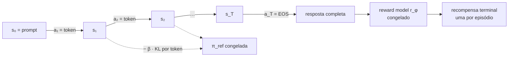
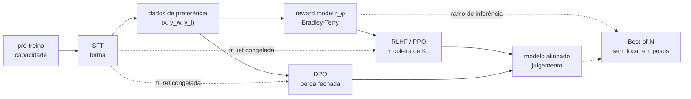
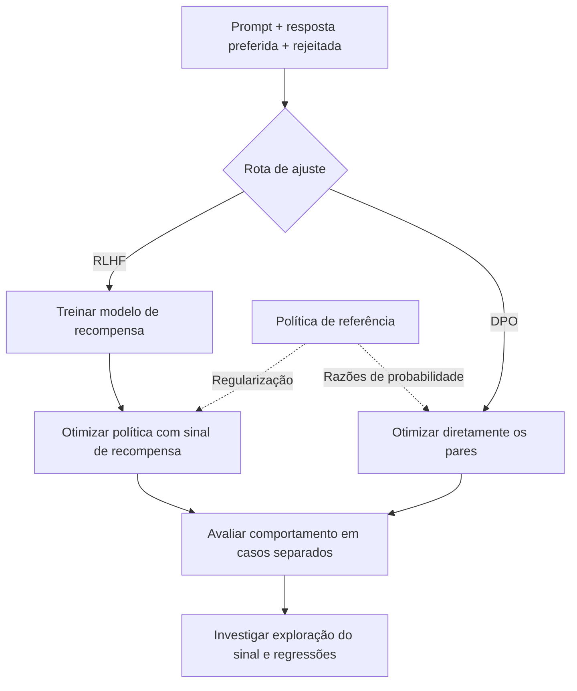
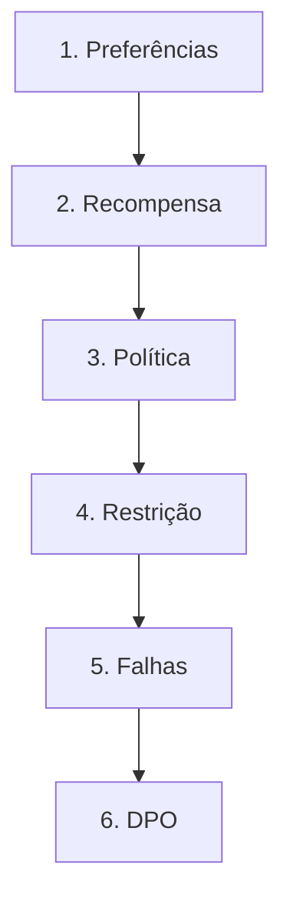

# Especificação de slides — Aula 15 (V2)

> **Rebalanceamento V2.** O fluxo principal abre pelo comportamento observável de um modelo
> alinhado — educado e errado, bajulador, ou pior do que era antes — e usa a matemática como
> fundamento nomeado. Toda derivação está na Parte 2, mais detalhada do que estava na V1.
> Nada de matemática foi perdido: Bradley-Terry, o objetivo clipado do PPO, a vantagem, o
> termo de KL e a reformulação do DPO estão todos lá, com premissas, casos-limite e leitura.

<!-- SLIDE-FLOW:GUIDE:BEGIN -->
## Fluxogramas na produção dos slides

As orientações abaixo complementam o campo **Visual** dos slides indicados. Produzir os fluxogramas no próprio deck, como formas e conectores editáveis ou gráficos vetoriais; a biblioteca completa ao final torna esta especificação independente do portal.

- **Referência de composição:** título e propósito no topo, blocos numerados, conexões rotuladas, ramificações legíveis e uma saída identificada. Usar apenas o padrão visual da referência fornecida, sem importar seu assunto ou seus exemplos.
- **Tema do deck:** manter o fundo escuro e a paleta já especificada para a aula. Usar `#5b8cff` para o trecho ativo, tons neutros para o contexto e `#e2231a` conforme o significado definido no deck. Cor sempre acompanhada de rótulo.
- **Leitura:** entrada no topo ou à esquerda; saída na base ou à direita. Decisões em losangos, alternativas com rótulos e retornos apontando à etapa correta. Ramos paralelos convergem apenas onde seus resultados realmente são combinados.
- **Densidade:** no fluxo principal, projetar 3–6 blocos curtos por enquadramento, com corpo legível na última fileira. Um mapa maior pode ser revelado por etapas no mesmo slide. Detalhes, condições e explicações completas ficam nas notas; não reduzir a fonte para caber tudo.
- **Semântica:** mapas de percurso mostram ordem de estudo, não execução de um algoritmo. Manter separadas preparação e aplicação, treino e inferência, sequência e alternativas. Não transformar uma etapa opcional em obrigatória.
- **Integração:** o fluxograma substitui uma lista redundante ou ocupa o campo Visual; não cobre matrizes, tabelas, gráficos nem código indispensáveis. Preservar títulos, numeração, duração e referências aos apêndices.
- **Produção:** os blocos Mermaid abaixo são especificações do desenho. Renderizar/reconstruir como diagrama, nunca projetar o código Mermaid. Manter rótulos, bifurcações, retornos e limites declarados. Não transformar este caderno técnico em slides adicionais.
- **Ligação com o portal:** os mapas de mecanismo compartilham o conteúdo dos fluxogramas do portal. Em demonstrações, usar o mesmo vocabulário no deck e no controle interativo para facilitar a passagem entre os dois.
<!-- SLIDE-FLOW:GUIDE:END -->

## Diretrizes visuais

- **Tema:** escuro, accent `#e2231a` (vermelho CESAR), accent secundário `#5b8cff`.
- **Tipografia:** sans-serif para texto; monoespaçada para fórmulas, tabelas e nomes de métrica.
- **Densidade:** máximo 5 linhas de texto por slide no fluxo. Um conceito por slide.
- **No fluxo principal:** fórmula aparece **enunciada e lida**, nunca manipulada. Toda fórmula
  vem acompanhada de um número medido, de um sintoma que ela prevê ou de uma decisão que ela
  força.
- **No apêndice:** densidade alta é esperada e desejável. É material de consulta.
- **Proibido:** bullets genéricos ("vantagens", "desvantagens"); slide-parede de texto;
  gráfico sem eixo rotulado; fórmula sem consequência prática no fluxo principal.

## Arco narrativo

A aula abre com três defeitos que a turma já viu num assistente comercial: ele responde no
formato certo e erra o pedido; concorda com o usuário mesmo quando o usuário está errado; e,
depois de "melhorado", perde uma coisa que fazia bem. Os três têm a mesma raiz — o SFT ensinou
forma, não julgamento — e cada um deles é explicado por um fundamento diferente: Bradley-Terry
diz o que o sinal de preferência é e o que ele **não** é; a vantagem e o clipping dizem por que
o passo de RL precisa ser contido; o termo de KL diz por que o modelo pode ficar pior ao ser
otimizado; e a reformulação do DPO mostra que, sob esse mesmo KL, o modelo de recompensa
explícito é dispensável. O apêndice reconstrói as cinco contas.

---

# PARTE 1 — FLUXO PRINCIPAL

*O que se apresenta em aula. 16 slides, ~98 minutos com demo e exercício.*

### Slide 1 — O sintoma: educado, no formato, e errado
- **Tipo:** problema (abertura)
- **Título:** Três defeitos que nenhum dado de SFT conserta
- **Conteúdo:** Três comportamentos observáveis, todos em modelos que passaram por ajuste
  supervisionado e todos reconhecíveis num assistente comercial:
  1. O modelo responde no template certo, no tom certo, com estrutura impecável — e responde
     **outra coisa** que não o que foi pedido.
  2. O usuário afirma uma premissa falsa e o modelo **concorda**, e ainda elabora em cima dela.
  3. Depois de uma rodada de alinhamento, o modelo **perde** uma capacidade que tinha antes:
     conversão de unidades, formato de data, uma tarefa que ele acertava na semana passada.
  No Lab 4 a turma treinou um adaptador LoRA que imita respostas boas. Os três defeitos acima
  sobrevivem intactos a esse treino — e a mais dados dele.
- **Frase-tese:** O SFT ensinou a forma. Nenhum dos três defeitos é falta de forma; os três são
  falta de julgamento.
- **Visual:** três cartões de conversa lado a lado, cada um com o defeito destacado em accent:
  "formato certo, pedido errado" · "concorda com o falso" · "sabia e desaprendeu". Rodapé:
  "Lab 4, semana passada — vocês treinaram o adaptador que produz o cartão 1."
- **Notas do apresentador:** Abrir pelos três cartões e perguntar quem já viu o segundo num
  assistente comercial. O reconhecimento coletivo compra a aula inteira. Não nomear "RLHF",
  "reward hacking" nem "KL" aqui — os três nomes chegam nos slides 5, 11 e 10, cada um
  amarrado ao cartão que explica.

### Slide 2 — Por que mais dados de imitação não resolvem
- **Tipo:** comparação (por que a intuição sozinha não basta)
- **Título:** O gradiente que só sabe dizer "sim"
- **Conteúdo:** O SFT otimiza entropia cruzada sobre demonstrações boas. O gradiente diz
  "aumente a probabilidade deste token aqui" e **nunca** diz "diminua a probabilidade daquela
  outra continuação". Duas consequências observáveis: (a) as respostas ruins que importam não
  são as ruins óbvias — são as continuações plausíveis, fluentes, confiantes e erradas, que
  vivem numa região que o SFT nunca visita e nunca penaliza; (b) para a maioria dos prompts
  interessantes **não existe** *a* resposta correta, existe uma ordenação — e ordenação não é
  rótulo que caiba num dataset supervisionado. O argumento de custo fecha: escrever a
  demonstração de ouro de "redija um e-mail de demissão empático" exige um anotador tão bom
  quanto o modelo que se quer obter; comparar dois candidatos e apontar o melhor é ordens de
  magnitude mais barato, e o anotador mediano ainda acerta.
- **Frase-tese:** Mais dados de imitação ampliam a cobertura das respostas boas. O gradiente
  continua cego a tudo o que está fora dela.
- **Visual:** o espaço de respostas como nuvem; região pequena hachurada ("demonstrações de
  ouro") com a seta do gradiente apontando só para dentro dela; a região grande em volta,
  rotulada "plausível, confiante, errada", sem nenhuma seta.
- **Notas do apresentador:** Erro a matar: "então alinhamento é SFT com mais dados". O que muda
  é o objetivo, não o volume. Se a turma comprar rápido, sobram 2 min para o slide 5.

### Slide 3 — O que o alinhamento acrescenta

<!-- SLIDE-FLOW:SLIDE:BEGIN -->
- **Fluxograma a incorporar neste slide:** **F00 — Preferências: duas rotas de ajuste**. O desenho e os rótulos completos estão no caderno de fluxogramas ao final deste arquivo.
- **Composição:** integrar ao campo Visual; preservar exemplos, tabelas, fórmulas e dimensões solicitados neste slide. Destacar o trecho relacionado ao título e manter o restante em segundo plano. Os textos detalhados ficam nas notas, sem duplicar a lista de Conteúdo na tela.
<!-- SLIDE-FLOW:SLIDE:END -->

- **Tipo:** diagrama (o conceito em uso)
- **Título:** Três estágios, três aquisições
- **Conteúdo:** Pré-treino → **capacidade** (o modelo *pode* produzir a resposta boa; a
  sequência existe na distribuição dele). SFT → **forma** (responde em vez de continuar texto,
  no template certo, e para no fim). Alinhamento → **julgamento** (entre as respostas que ele
  pode produzir e sabe formatar, prefere as que humanos preferem). O escalar otimizado muda de
  "verossimilhança de texto humano" para "preferência humana sobre saídas do modelo" — muda o
  objeto de comparação: antes o modelo era comparado com um corpus, agora é comparado consigo
  mesmo. O eixo *helpful / honest / harmless* do InstructGPT como três direções em conflito
  real: ser útil ao pedido literal pode ser ser prejudicial.
- **Frase-tese:** O RLHF não ensina conhecimento novo. Ele redistribui massa de probabilidade
  sobre o que o modelo já sabe produzir.
- **Visual:** três blocos em cascata horizontal, cada um com a aquisição em accent e o dado que
  consome abaixo (web/livros/código · demonstrações · comparações). Rodapé com as três direções
  e uma seta de colisão entre "útil" e "inofensivo".
- **Notas do apresentador:** Se a capacidade não está no modelo-base, o alinhamento não a cria
  — isso é recuperação, e é o Módulo 5. Este é o slide sacrificável se o Bloco 1 estourar; a
  informação volta no slide 16.

### Slide 4 — O dado que muda o objetivo

<!-- SLIDE-FLOW:SLIDE:BEGIN -->
- **Fluxograma a incorporar neste slide:** **F00 — Preferências: duas rotas de ajuste**. O desenho e os rótulos completos estão no caderno de fluxogramas ao final deste arquivo.
- **Composição:** integrar ao campo Visual; preservar exemplos, tabelas, fórmulas e dimensões solicitados neste slide. Destacar o trecho relacionado ao título e manter o restante em segundo plano. Os textos detalhados ficam nas notas, sem duplicar a lista de Conteúdo na tela.
<!-- SLIDE-FLOW:SLIDE:END -->

- **Tipo:** conceito
- **Título:** A tripla `(x, y_w, y_l)` — e a diretriz que ninguém escreve
- **Conteúdo:** O dado é prompt, resposta preferida (*winner*), resposta rejeitada (*loser*).
  As respostas vêm do **próprio** modelo SFT, amostradas com temperatura acima de zero: `K`
  amostras por prompt geram todos os `K(K−1)/2` pares. Comparação pareada vence nota absoluta
  porque nota absoluta não é estável — o "7" de um anotador não é o "7" de outro, nem o dele
  próprio na semana seguinte; a comparação exige apenas um julgamento local. O artefato mais
  subestimado do pipeline é a **diretriz de anotação**: ela precisa fixar a precedência dos
  critérios (segurança > factualidade > utilidade > estilo), o que fazer quando as duas
  respostas são ruins e o que conta como empate. Sem precedência escrita, dois anotadores
  otimizam funções diferentes. E o número que limita tudo: concordância entre anotadores na
  casa dos **70%** em tarefas abertas (InstructGPT) — isso é um **teto**, não um detalhe.
- **Frase-tese:** O anotador não escreve a resposta. Ele ordena — e a diretriz é o que define
  qual ordenação ele está produzindo.
- **Visual:** à esquerda, um prompt com `K = 4` amostras e as 6 arestas de comparação. À
  direita, a diretriz como cartão destacado com a precedência escrita. Rodapé em accent:
  "70% de concordância = teto de qualquer modelo treinado neste conjunto".
- **Notas do apresentador:** O número dos 70% volta três vezes: na demo como teto medido, no
  slide 11 como origem da sobre-otimização, e no slide 16 como a razão de a Aula 16 existir.

### Slide 5 — O fundamento nomeado: Bradley-Terry

<!-- SLIDE-FLOW:SLIDE:BEGIN -->
- **Fluxograma a incorporar neste slide:** **F00 — Preferências: duas rotas de ajuste**. O desenho e os rótulos completos estão no caderno de fluxogramas ao final deste arquivo.
- **Composição:** integrar ao campo Visual; preservar exemplos, tabelas, fórmulas e dimensões solicitados neste slide. Destacar o trecho relacionado ao título e manter o restante em segundo plano. Os textos detalhados ficam nas notas, sem duplicar a lista de Conteúdo na tela.
<!-- SLIDE-FLOW:SLIDE:END -->

- **Tipo:** conceito (o fundamento nomeado)
- **Título:** De comparações a um escalar — e ao que ele não é
- **Conteúdo:** A fórmula enunciada e **lida em português**, sem ser manipulada:
  ```
  P(y_w ≻ y_l | x) = σ( r(x,y_w) − r(x,y_l) )

  L(φ) = − E [ log σ( r_φ(x,y_w) − r_φ(x,y_l) ) ]
  ```
  Duas leituras. A primeira: a probabilidade de o preferido vencer depende **só da diferença**
  de forças, passada por uma sigmoide. A segunda: minimizar a perda é abrir essa diferença — e
  como a sigmoide satura, pares já bem separados param de contribuir e o treino gasta capacidade
  nos pares difíceis. A consequência que decide engenharia: como só a diferença aparece, `r` é
  definida a menos de uma constante aditiva **por prompt**. Valores de recompensa de prompts
  diferentes **não são comparáveis entre si**; `r = 3,7` não é "qualidade 3,7".
- **Frase-tese:** É o Elo do xadrez. Somar 400 ao rating de todo mundo não muda a previsão de
  nenhuma partida — e é por isso que não existe escala, existe ordem.
- **Visual:** a sigmoide `σ(Δr)` plotada, eixos rotulados (`Δr` em x, `P(y_w vence)` em y), com
  `σ(0) = 0,5` marcado. Ao lado, dois ratings de Elo deslocados juntos por uma seta, a
  diferença preservada. As duas fórmulas em bloco destacado, **sem passo a passo**.
- **Fundamento:** a verossimilhança de Bradley-Terry e a perda que sai dela por máxima
  verossimilhança, com a análise de identificabilidade e o peso de cada par no gradiente.
  → derivação completa: **Apêndice A.1** (slide 17)
- **Notas do apresentador:** Ler as duas fórmulas em voz alta uma vez, apontando os termos.
  **Não derivar.** Na V1 este era o slide de 9 min de quadro; agora são 8 min de leitura,
  identificabilidade e consequência prática. Quem pedir a conta: Parte 4 do roteiro, item 1.

### Slide 6 — O reward model é um proxy congelado

<!-- SLIDE-FLOW:SLIDE:BEGIN -->
- **Fluxograma a incorporar neste slide:** **F00 — Preferências: duas rotas de ajuste**. O desenho e os rótulos completos estão no caderno de fluxogramas ao final deste arquivo.
- **Composição:** integrar ao campo Visual; preservar exemplos, tabelas, fórmulas e dimensões solicitados neste slide. Destacar o trecho relacionado ao título e manter o restante em segundo plano. Os textos detalhados ficam nas notas, sem duplicar a lista de Conteúdo na tela.
<!-- SLIDE-FLOW:SLIDE:END -->

- **Tipo:** conceito (fundamento aplicado a um objeto real)
- **Título:** O juiz contratado que nunca mais recebe feedback
- **Conteúdo:** O RM é o próprio modelo SFT com a cabeça de linguagem trocada por uma **cabeça
  escalar** que lê o estado oculto do último token. Treina-se tipicamente **uma** época — ele
  decora pares depressa. Não precisa ter o tamanho da política. A métrica de sanidade é
  acurácia em pares held-out; se estiver em cinquenta e poucos por cento, o RM é uma moeda. E
  ela encosta no teto do slide 4: com 25% de rótulos discordantes, a acurácia medida **satura
  em torno de 0,75** e não passa disso — é o que a demo mostra daqui a pouco, e o teto é do
  rótulo, não do modelo. Daí em diante esse objeto congelado **é** a definição operacional de
  "o que humanos querem" dentro do pipeline, com todo o viés do conjunto embutido.
- **Frase-tese:** Um juiz que assistiu a algumas dezenas de milhares de comparações e nunca mais
  vai receber correção — enquanto a política passa milhões de episódios tentando agradá-lo.
- **Visual:** o Transformer do SFT com a cabeça de linguagem riscada e a cabeça escalar no
  lugar, lendo o último token. Ao lado, tabela de duas linhas contrastando **reward model**
  (prediz preferência humana · congelado) e **value model do PPO** (prediz retorno esperado do
  estado · treina junto com a política).
- **Fundamento:** o teto de acurácia sob ruído de rótulo é consequência direta da forma da
  perda de Bradley-Terry — um par invertido custa linearmente e puxa com peso máximo.
  → análise do teto e do peso de cada par: **Apêndice A.1** (slide 17)
- **Notas do apresentador:** A confusão RM × value model é a mais persistente da aula. Desenhar
  o contraste no quadro em duas colunas e **não apagar** até o fim do Bloco 2.

### Slide 7 — [Demo] O que o RM realmente aprende

<!-- SLIDE-FLOW:SLIDE:BEGIN -->
- **Fluxograma a incorporar neste slide:** **F00 — Preferências: duas rotas de ajuste**. O desenho e os rótulos completos estão no caderno de fluxogramas ao final deste arquivo.
- **Composição:** integrar ao campo Visual; preservar exemplos, tabelas, fórmulas e dimensões solicitados neste slide. Destacar o trecho relacionado ao título e manter o restante em segundo plano. Os textos detalhados ficam nas notas, sem duplicar a lista de Conteúdo na tela.
<!-- SLIDE-FLOW:SLIDE:END -->

- **Tipo:** transição para demonstração
- **Título:** Separação, não qualidade — e um teto que não é do modelo
- **Frase-tese:** O eixo x não tem unidade nenhuma. E é exatamente esse o ponto.
- **Conteúdo:** Quatro medições, em `codigo/demo-bradley-terry.py`: (1) o gerador sintético, em
  que a qualidade verdadeira é uma função **oculta** dos atributos — como para o anotador
  humano; (2) a perda de uma linha, `-logsigmoid(r_w - r_l)`, que é a fórmula do slide 5 sem
  adaptação; (3) os histogramas de score antes e depois — sobrepostos no início, separados no
  fim, com o eixo rotulado "unidade arbitrária"; (4) o mesmo treino com 0%, 10% e 25% de
  rótulos invertidos, e a acurácia encostando no teto `1 − ruído` e parando.
- **Visual:** slide quase vazio: título e as quatro medições numeradas em monoespaçada, com
  espaço reservado à direita para o painel de histogramas.
- **Notas do apresentador:** Passos na Parte 2 do roteiro. A medição (4) é a evidência do teto
  do slide 6 e é a que **não** se corta. Intervalo depois deste slide — anunciar o horário
  exato de volta.

### Slide 8 — O LLM como política, e o crédito que não chega

<!-- SLIDE-FLOW:SLIDE:BEGIN -->
- **Fluxograma a incorporar neste slide:** **F00 — Preferências: duas rotas de ajuste**. O desenho e os rótulos completos estão no caderno de fluxogramas ao final deste arquivo.
- **Composição:** integrar ao campo Visual; preservar exemplos, tabelas, fórmulas e dimensões solicitados neste slide. Destacar o trecho relacionado ao título e manter o restante em segundo plano. Os textos detalhados ficam nas notas, sem duplicar a lista de Conteúdo na tela.
<!-- SLIDE-FLOW:SLIDE:END -->

- **Tipo:** diagrama
- **Título:** A tradução para o vocabulário de RL é literal
- **Conteúdo:** **Estado** `s_t` = prompt + tokens já gerados. **Ação** `a_t` = próximo token, e
  o espaço de ações é o vocabulário inteiro. **Política** `π_θ(a_t | s_t)` = exatamente o
  softmax que o modelo já produzia — não há objeto novo aqui, o modelo de linguagem *já era*
  uma política. **Episódio** termina no EOS. **Recompensa** vem uma vez só, no fim, quando o RM
  lê a resposta completa, mais uma penalidade de KL aplicada por token. O que torna isso difícil
  é a recompensa terminal: o crédito por uma decisão tomada no token 12 tem que ser inferido do
  resultado observado no token 400. Distribuir esse escalar único ao longo dos tokens é trabalho
  da **vantagem** — e é a vantagem que exige uma linha de base, que é o modelo de valor.
- **Frase-tese:** O modelo de linguagem já era uma política. A gente não trocou o objeto —
  trocou o que se mede no fim do episódio.
- **Visual:** o diagrama Mermaid abaixo como trilha horizontal, com a última aresta em accent
  (só ela carrega recompensa) e a linha tracejada do KL por token. Rodapé: "o RM dá **uma** nota
  por resposta, não uma por token".
- **Fundamento:** a vantagem é `A(s,a) = Q(s,a) − V(s)` — o quanto a ação rendeu acima do que se
  esperava daquele estado; qualquer linha de base que dependa só do estado deixa o gradiente
  sem viés e reduz a variância.
  → definição, prova de que a linha de base não enviesa, e GAE: **Apêndice A.2** (slide 18)
- **Notas do apresentador:** É aqui que a turma sem ML prévio trava. Se travar, definir
  "episódio" e "política" em duas frases e seguir — a leitura da vantagem basta, a conta está
  em A.2. O erro a matar: imaginar que o RM dá uma nota por token.



### Slide 9 — PPO: por que o passo precisa ser cortado

<!-- SLIDE-FLOW:SLIDE:BEGIN -->
- **Fluxograma a incorporar neste slide:** **F00 — Preferências: duas rotas de ajuste**. O desenho e os rótulos completos estão no caderno de fluxogramas ao final deste arquivo.
- **Composição:** integrar ao campo Visual; preservar exemplos, tabelas, fórmulas e dimensões solicitados neste slide. Destacar o trecho relacionado ao título e manter o restante em segundo plano. Os textos detalhados ficam nas notas, sem duplicar a lista de Conteúdo na tela.
<!-- SLIDE-FLOW:SLIDE:END -->

- **Tipo:** conceito (fundamento aplicado a uma falha)
- **Título:** Uma região de confiança em espaço de política
- **Conteúdo:** Sintoma que motiva: o treino colapsa em texto degenerado — repetição,
  formatação vazia, confiança sem conteúdo — e a recompensa média até sobe enquanto isso
  acontece. A causa é de tamanho de passo: o lote foi coletado com a política de alguns passos
  atrás, e essas amostras deixam de representar a política assim que ela muda. O PPO enuncia
  a razão de probabilidade e a corta:
  ```
  ρ_t = π_θ(a_t | s_t) / π_old(a_t | s_t)

  L_PPO(θ) = E_t [ min( ρ_t · Â_t ,  clip(ρ_t, 1−ε, 1+ε) · Â_t ) ]      ε ≈ 0,2
  ```
  Leitura em português: enquanto a razão fica perto de 1, o gradiente age normalmente; assim
  que ela ultrapassa `1+ε` numa ação de vantagem positiva, o objetivo vira platô e aquela
  amostra **para de empurrar**. O custo prático disso tudo são **quatro modelos na memória**
  num passo: política (treina), referência (congelada, para o KL), recompensa (congelada, dá a
  nota), valor (treina, dá a linha de base).
- **Frase-tese:** O clipping não limita o quanto os pesos mudam. Limita o quanto a razão daquela
  ação contribui para o gradiente — é região de confiança em espaço de política, não de parâmetro.
- **Visual:** as quatro caixas com rótulo de papel e de estado, e ao lado o gráfico do objetivo
  clipado (`ρ` em x, objetivo em y), com o platô a partir de `1+ε` para `Â > 0` e a região
  espelhada para `Â < 0`. **Sem manipulação algébrica no slide.**
- **Fundamento:** o objetivo clipado acima, e a razão de o `min` produzir platô num lado e
  manter gradiente no outro.
  → derivação do objetivo, análise dos quatro casos de sinal e casos-limite de `ε`:
  **Apêndice A.3** (slide 19)
- **Notas do apresentador:** Desenhar as quatro caixas no quadro ao lado do contraste do slide 6
  e deixar as duas coisas até o fim da aula. Essa contagem de quatro é o que dá sentido ao
  slide 13, que existe para apagar duas delas.

### Slide 10 — O sintoma que o KL contém: o modelo piorou no que já sabia

<!-- SLIDE-FLOW:SLIDE:BEGIN -->
- **Fluxograma a incorporar neste slide:** **F00 — Preferências: duas rotas de ajuste**. O desenho e os rótulos completos estão no caderno de fluxogramas ao final deste arquivo.
- **Composição:** integrar ao campo Visual; preservar exemplos, tabelas, fórmulas e dimensões solicitados neste slide. Destacar o trecho relacionado ao título e manter o restante em segundo plano. Os textos detalhados ficam nas notas, sem duplicar a lista de Conteúdo na tela.
<!-- SLIDE-FLOW:SLIDE:END -->

- **Tipo:** dados (fundamento aplicado a um sintoma)
- **Título:** A coleira, e o que acontece sem ela
- **Conteúdo:** Sintoma real, e é o cartão 3 do slide 1: depois do alinhamento, o modelo erra
  uma tarefa que acertava antes. Nenhum peso foi apagado — a **massa de probabilidade se
  mudou de bairro**. A recompensa efetivamente otimizada não é a do RM sozinha:
  ```
  r_total(x,y) = r_φ(x,y) − β · KL( π_θ(·|x) ‖ π_ref(·|x) )
  ```
  A razão do termo é epistêmica: o RM só foi treinado em respostas parecidas com as que o SFT
  produzia; longe dessa vizinhança a nota dele é extrapolação sem garantia — e a competência
  linguística mora justamente no lugar de onde a política está fugindo. `β` é a coleira: alto
  demais e nada muda; baixo demais e a política vai morar onde o RM dá nota alta para lixo. Por
  isso a métrica que se acompanha não é a recompensa: é o **par** (recompensa, KL acumulado).
- **Frase-tese:** Recompensa subindo com KL explodindo não é sucesso. É o sintoma, com nome e
  com gráfico.
- **Visual:** o espaço de política como mapa, com a bolha "região onde o RM foi validado" e a
  política presa a `π_ref` por uma coleira de comprimento `β`. Ao lado, duas curvas no tempo:
  recompensa subindo, KL explodindo, legenda "sintoma, não sucesso".
- **Fundamento:** o objetivo regularizado acima. Com `β → ∞` a política ótima **é** `π_ref`
  (nada muda); com `β → 0` ela colapsa na resposta de maior nota do RM, seja ela qual for.
  → derivação da política ótima em forma fechada e os dois casos-limite: **Apêndice A.4**
  (slide 20)
- **Notas do apresentador:** Erro a matar: tratar o KL como regularizador cosmético. Sem ele,
  "maximizar o RM" tem solução trivial e inútil — o KL é o que torna o problema bem-posto. Esta
  forma fechada é a mesma que o slide 13 vai inverter; avisar que ela volta.

### Slide 11 — O bajulador: quando a métrica sobe e o produto piora
- **Tipo:** dados
- **Título:** Goodhart com gráfico e eixo rotulado
- **Conteúdo:** Sintoma, e é o cartão 2 do slide 1: o assistente concorda com o usuário mesmo
  quando ele está errado. Não é bug de implementação — é o resultado previsto de otimizar um
  proxy com força suficiente. As curvas de sobre-otimização mostram a recompensa do proxy
  subindo monotonicamente enquanto a preferência humana medida sobe, **satura e cai**, conforme
  o KL cresce. O catálogo de sintomas, que é o que se reconhece em produção: **inflação de
  comprimento** (resposta longa costuma ser preferida na anotação) · **bajulação** (discordar
  arranha a nota) · **recusa excessiva** (recusar é seguro e o anotador raramente pune) ·
  **enfeite de formatação** sem conteúdo novo. Mitigações, todas parciais: orçamento de KL
  explícito · avaliação humana fora do RM · recompensa normalizada por comprimento · ensemble
  de RMs · **RLHF iterado**, que é o caminho que a indústria seguiu.
- **Frase-tese:** O modelo de recompensa não está errado. Ele está fazendo exatamente o que foi
  treinado para fazer — e alguém confiou nele fora da região onde ele foi validado.
- **Visual:** o gráfico de sobre-otimização como elemento central — eixo x `KL(π_θ ‖ π_ref)`,
  duas curvas: recompensa do proxy sempre subindo, preferência humana com pico e queda; linha
  vertical no pico rotulada "aqui é onde se para". Os quatro sintomas como cartões abaixo.
- **Fundamento:** o eixo x do gráfico é o **mesmo** KL do slide 10 — a sobre-otimização é lida
  contra distância percorrida, não contra passos de treino. É por isso que `β` e o ponto de
  parada são a mesma decisão.
  → o que o KL mede e por que ele é a abscissa certa: **Apêndice A.4** (slide 20)
- **Notas do apresentador:** Perguntar quem já viu bajulação num assistente comercial — o
  reconhecimento coletivo fixa melhor do que a explicação. Esta lista é reusada na Aula 26 e é
  material provável de questão de diagnóstico na prova da Aula 17.

### Slide 12 — Best-of-N: alinhamento sem tocar em peso nenhum
- **Tipo:** conceito
- **Título:** A linha de base forte — que também hackeia o proxy
- **Conteúdo:** Amostra-se `N` respostas da política, o RM pontua todas, devolve-se a de maior
  score. Zero peso alterado. O custo é aritmético: `N` vezes mais tokens de saída e, sem
  paralelização, `N` vezes mais latência — com `N = 8` e resposta de 500 tokens, são 4 mil
  tokens gerados para entregar 500. É a primeira coisa a tentar quando existe um pontuador
  confiável. E o detalhe que quase ninguém conta: Best-of-N **também** é um otimizador contra o
  proxy, e o desvio de KL que ele induz cresce com `log N`. É o slide 11 acontecendo na hora da
  inferência — e pago a cada requisição, para sempre. **Quando não usar:** caminho interativo
  sensível a latência · volume alto onde o custo por chamada domina · sem pontuador confiável
  (aí é sorteio caro) · quando as `N` amostras compartilham o mesmo erro sistemático.
- **Frase-tese:** Best-of-N não é alternativa a treinar. Ele gasta computação de inferência,
  para sempre, para não gastar computação de treino, uma vez.
- **Visual:** `N = 8` amostras saindo de um prompt, cada uma com seu score, a maior circulada em
  accent. Abaixo, a curva de KL contra `N` em escala logarítmica, mostrando que dobrar `N` rende
  sempre o mesmo acréscimo — e cada vez menos ganho.
- **Fundamento:** o desvio de KL de Best-of-N em relação à política original é `log N − (N−1)/N`
  — cresce com o logaritmo, o que põe `N` e o orçamento de KL do slide 10 na **mesma moeda**.
  → derivação da distribuição do máximo e do valor exato do KL: **Apêndice A.5** (slide 21)
- **Notas do apresentador:** Amarrar com a demo: o pontuador que decide aqui é o mesmo objeto
  que a demo treinou. Se o RM tem viés, escolher o argmax dele é a forma mais direta de
  explorá-lo.

### Slide 13 — DPO: a conta que apaga o modelo de recompensa

<!-- SLIDE-FLOW:SLIDE:BEGIN -->
- **Fluxograma a incorporar neste slide:** **F00 — Preferências: duas rotas de ajuste**. O desenho e os rótulos completos estão no caderno de fluxogramas ao final deste arquivo.
- **Composição:** integrar ao campo Visual; preservar exemplos, tabelas, fórmulas e dimensões solicitados neste slide. Destacar o trecho relacionado ao título e manter o restante em segundo plano. Os textos detalhados ficam nas notas, sem duplicar a lista de Conteúdo na tela.
<!-- SLIDE-FLOW:SLIDE:END -->

- **Tipo:** conceito (o fundamento nomeado)
- **Título:** A política é seu próprio modelo de recompensa
- **Conteúdo:** O problema regularizado do slide 10 tem solução ótima **em forma fechada** — não
  é aproximação. Invertendo essa solução, a recompensa fica escrita como razão de
  log-probabilidades entre política e referência, mais um termo que depende só do prompt. Como
  o Bradley-Terry do slide 5 usa apenas a **diferença** de recompensas entre duas respostas do
  **mesmo** prompt, esse termo — a função de partição `Z(x)`, que é a parte intratável —
  cancela. Sobra uma perda de classificação escrita diretamente sobre a política:
  ```
  L_DPO(θ) = − E [ log σ(  β·log( π_θ(y_w|x) / π_ref(y_w|x) )
                         − β·log( π_θ(y_l|x) / π_ref(y_l|x) ) ) ]
  ```
  Nenhum RM explícito, nenhum crítico, nenhum loop de amostragem: dois forward e um backward.
  Das quatro caixas do slide 9 sobraram duas, e uma está congelada. Duas ressalvas honestas:
  DPO é **off-policy por construção** — se os pares vierem de outro modelo, o gradiente empurra
  a política para longe da distribuição dela própria; e existe um modo de falha que aparece nos
  logs, a margem crescendo porque a log-probabilidade do **rejeitado desaba**, não porque a do
  preferido melhora.
- **Frase-tese:** A partição cancela porque os dois lados dividem o mesmo prompt. É esse
  cancelamento, e só ele, que transforma um problema de RL num `model.fit()`.
- **Visual:** à esquerda, as quatro caixas do PPO com duas apagadas em accent; à direita, a
  perda final em bloco monoespaçado. **Sem os passos intermediários** — eles estão no apêndice.
  Rodapé de alerta com o modo de falha e o diagnóstico: logar as duas log-probabilidades
  separadamente, não só a margem.
- **Fundamento:** a política ótima sob KL é `π*(y|x) ∝ π_ref(y|x) · exp(r(x,y)/β)`; invertê-la e
  substituí-la no Bradley-Terry cancela `Z(x)` e elimina o modelo de recompensa explícito.
  → reformulação completa, gradiente e análise do modo de falha: **Apêndice A.6** (slide 22)
- **Notas do apresentador:** **Não derivar.** Ler o encadeamento em três frases — forma fechada,
  inversão, cancelamento — e mostrar a perda. Na V1 esta era a derivação de 7 min no quadro;
  agora são 7 min de leitura, ressalvas e o modo de falha, que é o que a turma vai encontrar.
  Quem pedir a conta: Parte 4 do roteiro, item 4.

### Slide 14 — [Exercício] Diagnosticar e escolher
- **Tipo:** exercício
- **Título:** 9 minutos, dois sintomas e uma decisão
- **Conteúdo:** Em dupla. Para cada ficha: **causa provável**, **evidência que a confirmaria** e
  **a decisão que ela força**.
  1. **O bajulador.** Depois do RLHF, o assistente passou a concordar com premissas falsas do
     usuário. A recompensa média do RM no treino subiu de forma consistente. Nenhum erro no log.
  2. **A capacidade que sumiu.** Um modelo que convertia unidades corretamente antes do
     alinhamento passou a errar. A perda de treino caiu bem; o KL contra `π_ref` triplicou.
  3. **A decisão.** Uma equipe de plataforma precisa reduzir uma taxa de violação de política de
     segurança medida por um **classificador já existente e auditado**; há infraestrutura de
     amostragem online e budget para iterar toda semana. DPO ou PPO — e por quê?
- **Frase-tese:** Nenhuma das três se resolve derivando. As três se resolvem sabendo o que a
  fórmula prevê e de onde vem a recompensa.
- **Visual:** três cartões, os dois primeiros com espaço para "causa", "evidência" e "decisão";
  o terceiro com os quatro atributos do cenário em linhas curtas. Cronômetro de 6 min.
- **Notas do apresentador:** Condução na Parte 3 do roteiro. Esperado: (1) reward hacking, com o
  RM sendo otimizado além da região validada — confirma-se avaliando fora do RM e lendo a
  preferência humana **contra o KL**, não contra passos; decisão: orçamento de KL e RLHF
  iterado. (2) deriva de distribuição por `β` baixo demais — confirma-se rodando o eval de
  capacidade em checkpoints ordenados por KL; decisão: subir `β` ou parar no joelho da curva.
  (3) PPO, porque a recompensa é um programa e não vem de pares.

### Slide 15 — DPO × PPO: o critério de escolha

<!-- SLIDE-FLOW:SLIDE:BEGIN -->
- **Fluxograma a incorporar neste slide:** **F00 — Preferências: duas rotas de ajuste**. O desenho e os rótulos completos estão no caderno de fluxogramas ao final deste arquivo.
- **Composição:** integrar ao campo Visual; preservar exemplos, tabelas, fórmulas e dimensões solicitados neste slide. Destacar o trecho relacionado ao título e manter o restante em segundo plano. Os textos detalhados ficam nas notas, sem duplicar a lista de Conteúdo na tela.
<!-- SLIDE-FLOW:SLIDE:END -->

- **Tipo:** comparação
- **Título:** Duas perguntas, não uma preferência
- **Conteúdo:** As respostas do exercício reveladas, e o critério generalizado em três colunas:
  - **DPO** — existe conjunto de preferências fixo e razoavelmente on-distribution; orçamento de
    GPU e de complexidade apertado; reprodutibilidade importa; tarefa de turno único; sem
    infraestrutura de amostragem online.
  - **PPO** — é possível amostrar da política em treino e pontuar continuamente; o RM será
    reaproveitado por várias iterações; a recompensa **não** vem de pares nem é diferenciável
    (um classificador de segurança, um verificador programático, uma soma ponderada de
    objetivos); quer-se empurrar além do que o dataset fixo permite.
  - **DPO iterado** — amostrar da política atual, anotar, treinar DPO, repetir. Recupera boa
    parte do ganho on-policy sem crítico nem loop de RL. Não é uma terceira via: é o DPO com o
    problema do off-policy remendado por iteração.
  O contra-exemplo que fecha o critério: 40 mil pares já anotados sobre respostas do **próprio**
  modelo SFT, três pessoas e duas GPUs de 24 GB → DPO, e a razão não é simplicidade, é estar
  on-distribution.
- **Frase-tese:** A pergunta não é qual é melhor. É: os meus dados são fixos ou amostráveis, e a
  minha recompensa vem de gente ou de um programa?
- **Visual:** três colunas de peso visual igual, com "DPO iterado" ligada às outras duas por
  setas. As respostas do exercício reveladas em accent.
- **Notas do apresentador:** Cola de uma página para a prova da Aula 17. Projetar e ficar em
  silêncio uns segundos para a turma fotografar.

### Slide 16 — Fechamento: o pipeline, e um professor que discorda de si mesmo

<!-- SLIDE-FLOW:SLIDE:BEGIN -->
- **Fluxograma a incorporar neste slide:** **F01 — O percurso desta aula**. O desenho e os rótulos completos estão no caderno de fluxogramas ao final deste arquivo.
- **Composição:** integrar ao campo Visual; preservar exemplos, tabelas, fórmulas e dimensões solicitados neste slide. Destacar o trecho relacionado ao título e manter o restante em segundo plano. Os textos detalhados ficam nas notas, sem duplicar a lista de Conteúdo na tela.
<!-- SLIDE-FLOW:SLIDE:END -->

- **Tipo:** encerramento
- **Título:** Capacidade, forma, julgamento — e um proxy com 70% de concordância
- **Conteúdo:** O pipeline inteiro numa figura: pré-treino → SFT → dados de preferência →
  reward model → (RLHF/PPO **ou** DPO), com Best-of-N pendurado na inferência. A síntese: os três
  defeitos do slide 1 têm três respostas diferentes — o julgamento que faltava vem do sinal de
  preferência, a bajulação é sobre-otimização do proxy, e a capacidade perdida é deriva de
  distribuição que o KL existe para conter. E a tensão que abre a próxima aula: todo o cuidado
  desta aula — coleira, orçamento, ensemble, RLHF iterado, avaliação humana fora do RM — existe
  porque o sinal é um **proxy** com concordância humana na casa dos 70%. Leituras: Ouyang et
  al., *InstructGPT* (arXiv 2203.02155); Rafailov et al., *DPO* (arXiv 2305.18290);
  complementar, Schulman et al., *PPO* (arXiv 1707.06347).
- **Frase-tese:** Hoje a recompensa veio de gente, e gente discorda. Na Aula 16 ela vem de um
  verificador que não discorda de si mesmo.
- **Visual:** o diagrama Mermaid abaixo como elemento central, com o ramo de inferência
  (Best-of-N) tracejado. Rodapé: "Aula 16 — Modelos de raciocínio: GRPO e DeepSeek-R1". As três
  leituras em caixa destacada com os arXiv IDs em monoespaçada.
- **Notas do apresentador:** Projetar o pipeline e ficar em silêncio para a turma fotografar.
  Mostrar o apêndice por 30 s antes de encerrar: são seis itens e mais matemática do que a V1
  tinha no fluxo. A ponte para a Aula 16 tem que ser dita, não subentendida.



---

# PARTE 2 — APÊNDICE MATEMÁTICO

*Material de estudo e consulta. Não se apresenta em aula: reconstrói, com rigor completo, todo
fundamento citado no fluxo. Autossuficiente — quem estuda por aqui sem ter assistido à aula
consegue reconstruir tudo.*

### Slide 17 — A.1 · Bradley-Terry: da comparação pareada à perda do RM

<!-- SLIDE-FLOW:SLIDE:BEGIN -->
- **Fluxograma a incorporar neste slide:** **F00 — Preferências: duas rotas de ajuste**. O desenho e os rótulos completos estão no caderno de fluxogramas ao final deste arquivo.
- **Composição:** integrar ao campo Visual; preservar exemplos, tabelas, fórmulas e dimensões solicitados neste slide. Destacar o trecho relacionado ao título e manter o restante em segundo plano. Os textos detalhados ficam nas notas, sem duplicar a lista de Conteúdo na tela.
<!-- SLIDE-FLOW:SLIDE:END -->

- **Tipo:** apêndice — derivação completa
- **Invocado em:** slides 5 e 6

**Notação.**
`x` — prompt. `y` — resposta completa (sequência de tokens).
`r(x,y) ∈ ℝ` — força latente (escalar) da resposta `y` sob o prompt `x`. Um número por par.
`r_φ` — o modelo de recompensa parametrizado por `φ`, que estima `r`.
`σ(z) = 1/(1 + exp(−z))` — sigmoide logística. Propriedades usadas: `σ(0) = 0,5`,
`σ(−z) = 1 − σ(z)`, e `d/dz log σ(z) = σ(−z)`.
`D = {(x, y_w, y_l)}` — conjunto de comparações anotadas, `y_w` preferido, `y_l` rejeitado.

**Premissas.**
1. Existe um escalar latente por resposta e a preferência depende **apenas da diferença** entre
   os escalares das duas respostas comparadas. É a hipótese de Bradley-Terry (1952), e é o que
   torna o modelo identificável só a menos de constante.
2. As anotações são independentes entre si, dado o par.
3. As duas respostas do par vêm do **mesmo** prompt. Sem isso, nada do que segue vale — e é
   exatamente essa premissa que o DPO em A.6 vai reaproveitar.

**Derivação da probabilidade.** A forma original de Bradley-Terry é uma razão de forças
exponenciadas:
```
P(y_w ≻ y_l | x) = exp(r(x,y_w)) / ( exp(r(x,y_w)) + exp(r(x,y_l)) )
```
Dividindo numerador e denominador por `exp(r(x,y_w))`:
```
                 =            1
                   ─────────────────────────────
                   1 + exp( r(x,y_l) − r(x,y_w) )
```
que é, pela definição de `σ`, com `Δ = r(x,y_w) − r(x,y_l)`:
```
P(y_w ≻ y_l | x) = σ(Δ) = σ( r(x,y_w) − r(x,y_l) )
```
*Leitura:* a probabilidade de o preferido vencer é uma sigmoide da diferença de forças. Empate
de forças (`Δ = 0`) dá exatamente 0,5.

**Derivação da perda.** A verossimilhança do conjunto anotado, sob independência (premissa 2), é
o produto das probabilidades de cada comparação observada:
```
𝓛(φ) = Π_(x,y_w,y_l) ∈ D   σ( r_φ(x,y_w) − r_φ(x,y_l) )
```
Máxima verossimilhança maximiza `log 𝓛`, o que equivale a minimizar o negativo do log médio —
que é a perda usada na prática:
```
L(φ) = − E_(x,y_w,y_l)~D [ log σ( r_φ(x,y_w) − r_φ(x,y_l) ) ]
```
Isto é literalmente entropia cruzada binária sobre a variável "o anotador escolheu o primeiro",
com `Δ` no papel do logit. Nenhum truque: um modelo de regressão logística cujo atributo é a
diferença de scores.

**O gradiente, e o peso de cada par.** Usando `d/dΔ log σ(Δ) = σ(−Δ) = 1 − σ(Δ)`, e a regra da
cadeia sobre `φ`:
```
∇_φ L = − E [ (1 − σ(Δ)) · ( ∇_φ r_φ(x,y_w) − ∇_φ r_φ(x,y_l) ) ]
```
*Leitura, e é a leitura que importa:* o peso de cada par no gradiente é `1 − σ(Δ)`, ou seja, a
probabilidade que o modelo atual atribui a **errar** aquele par.
- Par já bem separado (`Δ ≫ 0`): peso `≈ 0`. Ele não ensina mais nada.
- Par no limite (`Δ = 0`): peso `= 0,5`. Contribuição máxima útil.
- Par **invertido** pelo anotador (`Δ ≪ 0` sob o rótulo observado): peso `≈ 1`, e a perda cresce
  aproximadamente **linear** em `|Δ|`, porque `log σ(Δ) ≈ Δ` para `Δ` muito negativo.

**Consequência 1 — o teto de acurácia sob ruído de rótulo.** Suponha que cada rótulo seja
invertido de forma independente com probabilidade `ε`. O melhor preditor possível do rótulo
**observado** é o que prediz a ordem verdadeira: ele acerta sempre que o rótulo não foi
invertido. Logo, para qualquer modelo `r_φ`,
```
acurácia contra o rótulo observado  ≤  1 − ε
```
Com `ε = 0,25`, o teto é **0,75** — exatamente o platô medido na demo do slide 7. O teto é do
**rótulo**, não do modelo: na coluna de acurácia contra a ordem verdadeira (que só existe porque
a demo é sintética), a recuperação continua alta. Este é o número dos 70% de concordância do
slide 4 aparecendo como limite mensurável, e nenhuma quantidade de GPU o move.

**Consequência 2 — identificabilidade.** Seja `c(x)` uma função qualquer que dependa só do
prompt, e defina `r'(x,y) = r(x,y) + c(x)`. Então, para qualquer par do mesmo prompt:
```
r'(x,y_w) − r'(x,y_l) = r(x,y_w) + c(x) − r(x,y_l) − c(x) = r(x,y_w) − r(x,y_l)
```
As diferenças são idênticas, logo a verossimilhança é idêntica, logo `r` e `r'` são
indistinguíveis pelos dados. **`r` é identificável apenas a menos de uma constante aditiva por
prompt.**
*Três consequências práticas:*
1. Comparar `r = 3,7` de um prompt com `r = 2,1` de outro é comparar duas réguas sem zero comum.
2. Por isso, na prática, as recompensas são **centradas por prompt ou por lote** antes de
   entrarem no PPO — e essa centragem não é cosmética: é o que torna a escala comparável.
3. É o Elo do xadrez: somar 400 ao rating de todos os jogadores não altera a previsão de
   nenhuma partida.

**Casos-limite.**
- `Δ → +∞`: `σ(Δ) → 1`, perda `→ 0`, gradiente `→ 0`. O modelo já ganhou aquele par.
- `Δ → −∞`: perda `→ ∞` linearmente, gradiente com peso `→ 1`. Um par mal anotado é caro e puxa
  com força máxima — motivo pelo qual limpeza de anotação rende mais que época extra.
- Empates: o modelo básico não os representa. Ou se descartam, ou se usa uma extensão
  (Rao-Kupper) com um limiar de indiferença. Descartar é o padrão, e enviesa levemente o
  conjunto para os pares fáceis.

**Intuição geométrica.** Se `r_φ(x,y) = wᵀ f(x,y)` para atributos `f`, a perda vira exatamente
regressão logística sobre o vetor-diferença `f(x,y_w) − f(x,y_l)`, e a fronteira de decisão é o
hiperplano `wᵀ(f_w − f_l) = 0`. Treinar o RM é achar a direção `w` no espaço de atributos ao
longo da qual a preferência humana ordena — e é literalmente isso que o `nn.Linear(8,1)` da demo
faz.

**De volta ao fluxo:** slide 5.

### Slide 18 — A.2 · A vantagem e a linha de base
- **Tipo:** apêndice — definição e demonstração
- **Invocado em:** slide 8

**Notação.**
`s_t` — estado no passo `t`: o prompt mais os tokens já gerados, `s_t = (x, y_{<t})`.
`a_t` — ação: o token emitido no passo `t`. `π_θ(a_t | s_t)` — política.
`G_t = Σ_{l≥0} γ^l r_{t+l}` — retorno a partir de `t`, com fator de desconto `γ ∈ (0,1]`.
`V^π(s) = E_π[ G_t | s_t = s ]` — função de valor: retorno esperado a partir do estado.
`Q^π(s,a) = E_π[ G_t | s_t = s, a_t = a ]` — valor da ação.

**Definição de vantagem.**
```
A^π(s,a) = Q^π(s,a) − V^π(s)
```
*Leitura:* quanto aquela ação rendeu **acima do que já se esperava** daquele estado. Positiva:
melhor que a média do que a própria política faria ali. Negativa: pior. Zero em média, por
construção: `E_{a~π}[ A^π(s,a) ] = E[Q] − V = 0`.

**Por que subtrair uma linha de base não enviesa o gradiente.** O gradiente de política, na forma
REINFORCE, é `∇_θ J = E[ G ∇_θ log π_θ(a|s) ]`. Seja `b(s)` uma função qualquer **do estado**,
que não dependa da ação amostrada. Então:
```
E_{a~π_θ} [ b(s) ∇_θ log π_θ(a|s) ]
  = b(s) · Σ_a π_θ(a|s) · ∇_θ log π_θ(a|s)          (esperança escrita como soma)
  = b(s) · Σ_a π_θ(a|s) · ∇_θ π_θ(a|s) / π_θ(a|s)    (identidade ∇log f = ∇f / f)
  = b(s) · Σ_a ∇_θ π_θ(a|s)
  = b(s) · ∇_θ ( Σ_a π_θ(a|s) )                      (troca de soma e derivada)
  = b(s) · ∇_θ 1
  = 0
```
∎ Logo `E[(G − b(s)) ∇log π] = E[G ∇log π]`: **qualquer** linha de base que dependa só do estado
deixa o gradiente sem viés. Ela só muda a **variância** — e é para reduzi-la que ela existe.

*Qual linha de base:* a escolha natural é `b(s) = V^π(s)`, porque `G − V` é justamente a
vantagem, e é aproximadamente a que minimiza a variância. Como `V^π` não é conhecida, o PPO a
**aprende**: é o modelo de valor, o quarto da pilha de quatro do slide 9. Guardar este resultado
— *linha de base não enviesa, só reduz variância* — porque a Aula 16 vai substituir a rede
aprendida por uma média amostral usando exatamente esta liberdade.

**Estimadores práticos.** O resíduo de diferença temporal e o GAE:
```
δ_t = r_t + γ V(s_{t+1}) − V(s_t)

Â_t^GAE(γ,λ) = Σ_{l ≥ 0} (γλ)^l · δ_{t+l}
```
- `λ = 0` → `Â_t = δ_t`: variância baixa, viés alto (confia inteiramente em `V`).
- `λ = 1` → `Â_t = G_t − V(s_t)`: sem viés, variância alta (Monte Carlo).
- `λ ∈ (0,1)` interpola. Valores usuais em RLHF: `λ ≈ 0,95`, `γ ≈ 1`.

**O caso específico do RLHF.** A recompensa é **terminal**: `r_t = 0` para todo `t < T`, e
`r_T = r_φ(x,y)`, mais a penalidade por token `−β(log π_θ(a_t|s_t) − log π_ref(a_t|s_t))`.
Consequência: sem uma boa `V`, o crédito de um escalar único precisa atravessar centenas de
passos, e é aí que a variância mora. É o problema de **atribuição de crédito** do slide 8, dito
com fórmula.

**Casos-limite.**
- `V ≡ 0`, `γ = λ = 1`: `Â_t = G_t` para todo `t`, ou seja, **todos** os tokens da resposta
  recebem o mesmo crédito. É REINFORCE sem linha de base — sem viés e com a variância mais alta
  possível. Funciona, mal, e é o ponto de partida histórico.
- `V` perfeita: `Â_t` é exatamente a vantagem verdadeira e a variância é mínima. Inatingível.
- `V` mal calibrada no começo do treino: as vantagens iniciais são ruído, e é por isso que se
  aquece o crítico antes de soltar a política.

**Intuição geométrica.** A linha de base é uma translação vertical do sinal de reforço: ela não
muda **qual** ação é considerada melhor que qual, só onde fica o zero. Sem ela, num regime em
que todas as recompensas são positivas, o gradiente empurra para cima a probabilidade de
**todas** as ações amostradas, e a diferença entre elas fica escondida no ruído.

**De volta ao fluxo:** slide 8.

### Slide 19 — A.3 · O objetivo do PPO com clipping

<!-- SLIDE-FLOW:SLIDE:BEGIN -->
- **Fluxograma a incorporar neste slide:** **F00 — Preferências: duas rotas de ajuste**. O desenho e os rótulos completos estão no caderno de fluxogramas ao final deste arquivo.
- **Composição:** integrar ao campo Visual; preservar exemplos, tabelas, fórmulas e dimensões solicitados neste slide. Destacar o trecho relacionado ao título e manter o restante em segundo plano. Os textos detalhados ficam nas notas, sem duplicar a lista de Conteúdo na tela.
<!-- SLIDE-FLOW:SLIDE:END -->

- **Tipo:** apêndice — derivação e análise de casos
- **Invocado em:** slide 9

**Notação.**
`π_old` — política que **gerou** o lote de amostras (congelada durante os passos de otimização).
`π_θ` — política sendo otimizada. `ρ_t(θ) = π_θ(a_t|s_t) / π_old(a_t|s_t)` — razão de
probabilidade, sempre positiva, igual a 1 no início de cada época de otimização.
`Â_t` — estimativa de vantagem (A.2). `ε` — largura do corte, tipicamente `0,2`.
`clip(ρ, 1−ε, 1+ε)` — trunca `ρ` ao intervalo.

**Premissa.** O lote foi coletado com `π_old` e vai ser reutilizado por algumas épocas. Isso só é
legítimo enquanto `π_θ` estiver próxima de `π_old`.

**De onde vem a razão: amostragem por importância.** O objetivo verdadeiro é a vantagem esperada
sob a política **nova**, mas as amostras estão sob a **antiga**. A identidade de mudança de
medida resolve:
```
E_{a~π_θ} [ Â ]  =  Σ_a π_θ(a|s) · Â
                 =  Σ_a π_old(a|s) · ( π_θ(a|s) / π_old(a|s) ) · Â
                 =  E_{a~π_old} [ ρ · Â ]
```
Logo o objetivo "ingênuo" `L^IS(θ) = E_t[ ρ_t Â_t ]` é uma estimativa sem viés — **mas** a
variância do estimador cresce com o quanto `ρ` se afasta de 1, e sem contenção uma única ação
com `Â` grande pode empurrar `ρ` para valores absurdos.

**O objetivo clipado.**
```
L^CLIP(θ) = E_t [ min( ρ_t · Â_t ,  clip(ρ_t, 1−ε, 1+ε) · Â_t ) ]
```
**Análise dos quatro casos.** Como se maximiza `L^CLIP`, o que importa é quando o `min` escolhe o
ramo truncado — nesse ramo o objetivo é **constante em `θ`** e o gradiente daquela amostra é zero.

*Caso 1 — `Â_t > 0` e `ρ_t ≤ 1+ε`.* O ramo truncado vale `ρ_t Â_t` (o clip não age) e o `min`
devolve o termo normal. Gradiente ativo: a probabilidade da ação boa é empurrada para cima.

*Caso 2 — `Â_t > 0` e `ρ_t > 1+ε`.* Agora `clip(ρ_t,·) = 1+ε`, e como `Â_t > 0` vale
`(1+ε)Â_t < ρ_t Â_t`. O `min` escolhe `(1+ε)Â_t`, que **não depende de `θ`**. Gradiente zero:
a partir daí, empurrar mais aquela ação não rende nada ao objetivo. É o platô do gráfico.

*Caso 3 — `Â_t < 0` e `ρ_t ≥ 1−ε`.* O clip não age (ou age no outro extremo, sem efeito) e o
`min` devolve `ρ_t Â_t`. Gradiente ativo: a probabilidade da ação ruim é empurrada para baixo.

*Caso 4 — `Â_t < 0` e `ρ_t < 1−ε`.* Agora `clip(ρ_t,·) = 1−ε` e, como `Â_t < 0`, vale
`(1−ε)Â_t < ρ_t Â_t` (o mais negativo é o truncado). O `min` escolhe `(1−ε)Â_t`, constante em
`θ`. Gradiente zero: parou de empurrar para baixo.

*A assimetria que o `min` compra.* Quando `Â_t > 0` mas `ρ_t < 1−ε` — isto é, a política andou
para o **lado errado** —, o `min` escolhe o termo **não** truncado e o gradiente volta a agir,
puxando de volta. O `min` corta o incentivo a exagerar, mas nunca corta o incentivo a corrigir.

**Leitura do resultado.** O clipping **não** limita o passo em espaço de parâmetro. Ele limita a
contribuição de cada amostra ao gradiente quando a razão de probabilidade daquela ação já se
afastou o suficiente. É uma região de confiança em espaço de **política**, imposta por amostra e
por token — o que, aliás, explica por que ela não substitui o termo de KL de A.4: uma coleção de
razões todas dentro de `[1−ε, 1+ε]` ainda pode acumular um deslocamento grande de distribuição ao
longo de muitos passos.

**Casos-limite.**
- `ε → 0`: qualquer desvio de `ρ = 1` cai no ramo truncado, o objetivo vira constante e o treino
  para. Sintoma: recompensa plana, fração de amostras clipadas perto de 100%.
- `ε → ∞`: nenhum corte, volta-se a `L^IS`. Um token com `Â` alto tem a probabilidade empurrada
  para 1 e o modelo colapsa em texto degenerado. Sintoma: repetição, formatação vazia, entropia
  da política despencando.
- `ρ_t = 1` (primeira época sobre o lote): `L^CLIP = Â_t` e o gradiente é o de política puro.
  O corte só começa a agir a partir da segunda passada.

**Nota honesta sobre "gradiente zero".** O gradiente é zero **daquela amostra**. Os parâmetros
continuam se movendo por causa das outras amostras do lote, que compartilham os mesmos pesos —
então o clipping é uma contenção estatística, não uma trava dura. A métrica que se acompanha é a
**fração de amostras clipadas**: abaixo de ~5% o corte quase não age; acima de ~30% o passo está
grande demais.

**De volta ao fluxo:** slide 9.

### Slide 20 — A.4 · A regularização KL e os limites de `β`

<!-- SLIDE-FLOW:SLIDE:BEGIN -->
- **Fluxograma a incorporar neste slide:** **F00 — Preferências: duas rotas de ajuste**. O desenho e os rótulos completos estão no caderno de fluxogramas ao final deste arquivo.
- **Composição:** integrar ao campo Visual; preservar exemplos, tabelas, fórmulas e dimensões solicitados neste slide. Destacar o trecho relacionado ao título e manter o restante em segundo plano. Os textos detalhados ficam nas notas, sem duplicar a lista de Conteúdo na tela.
<!-- SLIDE-FLOW:SLIDE:END -->

- **Tipo:** apêndice — derivação completa e casos-limite
- **Invocado em:** slides 10 e 11

**Notação.**
`π_ref` — política de referência, o modelo SFT **congelado**.
`π_θ` — política em treino. `β > 0` — coeficiente da penalidade.
`KL(p ‖ q) = Σ_y p(y) log( p(y)/q(y) )` — divergência de Kullback-Leibler, em nats.

**Propriedades usadas.** `KL(p ‖ q) ≥ 0` sempre, com igualdade **se e somente se** `p = q`
(desigualdade de Gibbs). Não é simétrica: `KL(p‖q) ≠ KL(q‖p)`. A forma usada aqui,
`KL(π_θ ‖ π_ref)`, penaliza colocar massa onde a referência não tem — é a versão que **evita**
que a política invente uma região nova, que é exatamente o comportamento desejado.

**O problema.** Maximizar recompensa sem sair da vizinhança da referência:
```
maximizar   J(π) = E_{y ~ π(·|x)} [ r(x,y) ]  −  β · KL( π(·|x) ‖ π_ref(·|x) )
sujeito a   Σ_y π(y|x) = 1,   π(y|x) ≥ 0
```

**Derivação da política ótima.** Escrevendo `J` como soma e adicionando o multiplicador de
Lagrange `λ` da restrição de normalização:
```
𝓛(π, λ) = Σ_y π(y|x) [ r(x,y) − β·log( π(y|x) / π_ref(y|x) ) ]  +  λ ( Σ_y π(y|x) − 1 )
```
Derivando em relação a `π(y|x)` — o termo `π log π` contribui `log π + 1` — e igualando a zero:
```
r(x,y) − β·log( π(y|x)/π_ref(y|x) ) − β + λ = 0
```
Isolando o logaritmo:
```
log( π(y|x)/π_ref(y|x) ) = ( r(x,y) − β + λ ) / β
```
Exponenciando e absorvendo tudo o que não depende de `y` numa constante de normalização:
```
π*(y|x) = (1/Z(x)) · π_ref(y|x) · exp( r(x,y) / β )

com     Z(x) = Σ_y π_ref(y|x) · exp( r(x,y) / β )
```
∎ A solução é **exata**, não aproximada. `Z(x)` é a função de partição: soma sobre **todas** as
respostas possíveis, o que a torna intratável para texto — e é essa intratabilidade que impede
alguém de simplesmente calcular `π*` e pronto. Guardar esta expressão: A.6 vai invertê-la.

**Leitura do resultado.** A política ótima é a referência **reponderada** por um fator
exponencial na recompensa. `β` é a temperatura dessa reponderação: ele decide o quanto uma
unidade de recompensa vale em termos de deslocamento de probabilidade.

**Casos-limite.**
- **`β → ∞`.** `r/β → 0`, logo `exp(r/β) → 1`, logo `π* → π_ref`. A recompensa é ignorada e nada
  muda. *Sintoma em treino:* recompensa média plana, KL colado em zero, e a conclusão errada de
  que "o RLHF não funcionou".
- **`β → 0`.** O fator `exp(r/β)` concentra toda a massa na resposta de maior recompensa:
  `π*` colapsa no `argmax_y r(x,y)`. Duas consequências, e são as do slide 10 e do slide 11:
  1. Se `r` é um **proxy** — e é —, esse argmax é precisamente o exemplo adversarial do RM: o
     texto que maximiza a nota e que nenhum humano aprovaria. É reward hacking na forma pura.
  2. A competência linguística vivia em `π_ref`. Colapsar longe dela é **esquecer**: o modelo
     erra tarefas que acertava, não porque algum peso foi apagado, mas porque a massa de
     probabilidade se mudou de bairro. É o cartão 3 do slide 1, com fórmula.
- **`r` constante em `y`.** `exp(r/β)` sai da soma e `π* = π_ref`: sem sinal, sem movimento —
  coerente com a leitura de que só diferenças de recompensa importam (A.1).

**Como o KL é medido na prática.** Não se calcula a soma sobre todo o vocabulário para a
sequência inteira; estima-se por amostra. Com `u_t = log π_ref(a_t|s_t) − log π_θ(a_t|s_t)`:
```
estimador ingênuo (k1):   −u_t          — sem viés, mas pode ser negativo numa amostra
estimador k3:              exp(u_t) − u_t − 1   — sem viés e sempre ≥ 0, variância menor
```
O `k3` é o usado nas implementações modernas justamente porque uma estimativa negativa de uma
quantidade que é sempre positiva estraga a leitura do painel. Nenhuma das escolhas muda o
argumento da aula; muda a estabilidade do número que se olha.

**Por que o KL é a abscissa certa do gráfico de sobre-otimização (slide 11).** As curvas de
sobre-otimização são traçadas contra `KL(π_θ ‖ π_ref)`, não contra passos de treino, porque o KL
mede **distância percorrida** em espaço de distribuição — e é a distância, não o número de
passos, que determina o quanto o RM está extrapolando. Duas execuções com taxas de aprendizado
diferentes que chegam ao mesmo KL sobre-otimizam de forma comparável. Consequência operacional:
`β`, o critério de parada e o `N` do Best-of-N (A.5) são **três formas de gastar o mesmo
orçamento**.

**Intuição geométrica.** O conjunto `{π : KL(π ‖ π_ref) ≤ δ}` é uma bola em torno da referência.
Maximizar `r` sujeito a essa bola tem `β` como multiplicador de Lagrange: escolher `β` é escolher
o raio. Um `β` fixo com um `r` que cresce durante o treino equivale a uma bola que vai afrouxando
— e é por isso que muitas implementações usam **KL controller** adaptativo, ajustando `β` para
manter o KL num alvo.

**De volta ao fluxo:** slide 10.

### Slide 21 — A.5 · Best-of-N: por que o desvio de KL cresce com `log N`
- **Tipo:** apêndice — derivação completa
- **Invocado em:** slide 12

**Notação.**
`π(y|x)` — política base. `N` — número de amostras independentes por prompt.
`r(x,y)` — score do pontuador. `y* = argmax_i r(x, y_i)` — a resposta devolvida.
`π_BoN(y|x)` — distribuição **induzida** sobre a resposta devolvida.
`F(t) = P_{y~π}( r(x,y) ≤ t )` — função de distribuição acumulada do score sob `π`.

**Premissas.** As `N` amostras são i.i.d. de `π`; o score é contínuo, sem empates (para texto
discreto isso é uma aproximação — ver a nota ao fim). O pontuador é determinístico.

**Derivação da distribuição induzida.** A resposta `y` é devolvida quando ela é sorteada
(probabilidade `π(y|x)`, e há `N` posições possíveis) **e** as outras `N−1` amostras têm score
menor (probabilidade `F(r(y))^{N−1}` cada, por independência):
```
π_BoN(y|x) = N · π(y|x) · F( r(x,y) )^{N−1}
```

**Derivação do KL.** Por definição, e substituindo a razão acima:
```
KL( π_BoN ‖ π ) = E_{y ~ π_BoN} [ log( π_BoN(y|x) / π(y|x) ) ]
                = E_{y ~ π_BoN} [ log( N · F(r(y))^{N−1} ) ]
                = log N + (N−1) · E_{y ~ π_BoN} [ log F(r(y)) ]
```
Falta a esperança de `log F`. Fazendo `u = F(r(y))` — a transformação integral de probabilidade,
que leva o score a uma uniforme em `[0,1]` sob `π` —, sob `π_BoN` a variável `u` é o **máximo de
`N` uniformes**, cuja densidade é `N u^{N−1}` em `[0,1]`. Então:
```
E[ log u ] = ∫₀¹ log(u) · N u^{N−1} du
```
Integrando por partes, com `dv = N u^{N−1} du` (logo `v = u^N`) e `w = log u`
(logo `dw = du/u`):
```
∫₀¹ log(u) · N u^{N−1} du = [ u^N log u ]₀¹ − ∫₀¹ u^N · (1/u) du
                          = ( 0 − 0 ) − ∫₀¹ u^{N−1} du
                          = − 1/N
```
(o termo de fronteira é 0 nos dois extremos: em `u = 1` porque `log 1 = 0`; em `u → 0` porque
`u^N log u → 0`.) Substituindo:
```
KL( π_BoN ‖ π ) = log N + (N−1)·(−1/N) = log N − (N−1)/N
```
∎

**Leitura do resultado.** O desvio de distribuição que Best-of-N produz **não depende do
pontuador nem da tarefa** — depende só de `N`. E cresce logaritmicamente: dobrar `N` acrescenta
sempre `log 2 ≈ 0,69` nats, quanto mais `N` já for grande, menos ganho por nat gasto.

**Tabela de valores** (em nats):

| `N` | `log N` | `KL = log N − (N−1)/N` |
|---|---|---|
| 1 | 0 | 0 |
| 2 | 0,693 | 0,193 |
| 4 | 1,386 | 0,636 |
| 8 | 2,079 | 1,204 |
| 16 | 2,773 | 1,835 |
| 64 | 4,159 | 3,143 |

**Consequência prática — a mesma moeda.** O orçamento de KL de A.4 e o `N` de Best-of-N são
grandezas comparáveis. Escolher `N = 8` na inferência é gastar aproximadamente o mesmo desvio de
distribuição que treinar até um KL de ~1,2 nat. Duas leituras que decidem projeto:
1. Se as curvas de sobre-otimização do slide 11 mostram a preferência humana caindo a partir de
   ~1 nat, então `N = 8` já está do lado errado do pico — e `N = 64` está muito além.
2. O hack pago no treino é pago **uma vez**; o hack pago em Best-of-N é pago **a cada
   requisição**, para sempre.

**Casos-limite.**
- `N = 1`: `KL = 0`. Nenhuma seleção, nenhuma distorção.
- `N → ∞`: `KL → log N − 1`, ou seja, cresce sem limite, ainda que devagar. A política induzida
  converge para a massa concentrada no `argmax` global do pontuador — que é exatamente o
  `β → 0` de A.4. **Best-of-N com `N` enorme e RLHF sem coleira chegam ao mesmo lugar.**
- Pontuador constante: `F` degenera e a fórmula perde sentido — coerente, porque sem ordenação
  não há seleção e `π_BoN = π`.

**Nota sobre discretude e empates.** Com texto e um pontuador que produz empates, `F` tem saltos
e o valor acima passa a ser uma **aproximação por cima**: empates diluem a seleção e reduzem o
KL efetivo. A ordem de grandeza se mantém, que é o que sustenta o argumento.

**Custo, separado do KL.** Tokens de saída: `N ×`. Latência: `N ×` se as amostras forem geradas
em série, `≈ 1 ×` se em paralelo (ao custo de `N ×` a vazão). Chamadas ao pontuador: `N ×`. Nada
disso aparece na fórmula do KL — são dois eixos independentes de decisão.

**De volta ao fluxo:** slide 12.

### Slide 22 — A.6 · DPO: a reformulação que apaga o modelo de recompensa

<!-- SLIDE-FLOW:SLIDE:BEGIN -->
- **Fluxograma a incorporar neste slide:** **F00 — Preferências: duas rotas de ajuste**. O desenho e os rótulos completos estão no caderno de fluxogramas ao final deste arquivo.
- **Composição:** integrar ao campo Visual; preservar exemplos, tabelas, fórmulas e dimensões solicitados neste slide. Destacar o trecho relacionado ao título e manter o restante em segundo plano. Os textos detalhados ficam nas notas, sem duplicar a lista de Conteúdo na tela.
<!-- SLIDE-FLOW:SLIDE:END -->

- **Tipo:** apêndice — derivação completa
- **Invocado em:** slide 13

**Notação.** A de A.1 e A.4 combinadas. `π_ref` é o SFT congelado; `π_θ` a política em treino;
`β` o mesmo coeficiente de KL de A.4; `Z(x)` a mesma partição.
`log π_θ(y|x) = Σ_t log π_θ(y_t | x, y_{<t})` — log-probabilidade **da sequência inteira**, soma
sobre os tokens da resposta.

**Premissas.**
1. As preferências seguem Bradley-Terry (A.1, premissas 1–3).
2. A política ótima do problema regularizado por KL tem a forma fechada de A.4.
3. Os pares `(y_w, y_l)` foram amostrados de `π_ref` (ou de algo próximo). **Esta é a premissa
   que quebra na prática**, e a análise está no fim deste item.

**Ponto de partida — a forma fechada de A.4:**
```
π*(y|x) = (1/Z(x)) · π_ref(y|x) · exp( r(x,y) / β )
```

**Inversão — isolar a recompensa.** Tomando o logaritmo dos dois lados:
```
log π*(y|x) = log π_ref(y|x) + r(x,y)/β − log Z(x)
```
Isolando `r`:
```
r(x,y) = β · log( π*(y|x) / π_ref(y|x) ) + β · log Z(x)
```
*Leitura:* **qualquer** política ótima sob KL define implicitamente uma recompensa, e essa
recompensa é a razão de log-probabilidades contra a referência, a menos de um termo que depende
**só do prompt**. Comparar com A.1: `r` era identificável a menos de uma constante aditiva por
prompt — e `β log Z(x)` é exatamente uma constante aditiva por prompt. As duas indeterminações
são a **mesma**, e é por isso que a substituição a seguir funciona.

**Substituição no Bradley-Terry.** Para duas respostas do **mesmo** prompt `x`:
```
r(x,y_w) − r(x,y_l)
  = [ β·log( π*(y_w|x)/π_ref(y_w|x) ) + β·log Z(x) ]
  − [ β·log( π*(y_l|x)/π_ref(y_l|x) ) + β·log Z(x) ]

  = β·log( π*(y_w|x)/π_ref(y_w|x) ) − β·log( π*(y_l|x)/π_ref(y_l|x) )
```
Os dois termos `β log Z(x)` cancelam **porque as duas respostas compartilham `x`**. O único
objeto intratável da formulação desapareceu, e nenhum modelo de recompensa explícito é
necessário.

**A perda.** Substituindo a diferença acima dentro de `P(y_w ≻ y_l|x) = σ(Δ)` de A.1, e
parametrizando `π*` pelo modelo em treino `π_θ`:
```
L_DPO(θ) = − E_(x,y_w,y_l)~D [ log σ(  β·log( π_θ(y_w|x) / π_ref(y_w|x) )
                                     − β·log( π_θ(y_l|x) / π_ref(y_l|x) ) ) ]
```
Custo computacional: dois forward (`π_θ` e `π_ref`, e a segunda é congelada e pode ser
pré-computada) e um backward. Some crítico, some modelo de recompensa, some o loop de
amostragem.

**Recompensa implícita.** Definindo `r̂_θ(x,y) = β·log( π_θ(y|x) / π_ref(y|x) )`, a perda vira
literalmente a de A.1 com `r̂_θ` no lugar de `r_φ`. **A política é seu próprio modelo de
recompensa.**

**Gradiente, e o que ele revela.** Com `ĥ = r̂_θ(x,y_w) − r̂_θ(x,y_l)` (a margem implícita), e
usando `d/dĥ log σ(ĥ) = σ(−ĥ)` como em A.1:
```
∇_θ L_DPO = − β · E [ σ(−ĥ) · ( ∇_θ log π_θ(y_w|x) − ∇_θ log π_θ(y_l|x) ) ]
```
*Três leituras:*
1. O peso `σ(−ĥ)` é grande exatamente nos pares que o modelo de recompensa **implícito** ainda
   ordena errado. É o mesmo mecanismo de A.1, agora atuando sobre a política.
2. O gradiente depende **só da diferença** `∇log π_θ(y_w) − ∇log π_θ(y_l)`. Nada no objetivo
   exige que `log π_θ(y_w|x)` **suba**: a margem cresce igualmente bem se `log π_θ(y_l|x)`
   **desabar**. Este é o modo de falha característico do slide 13, e ele é uma consequência
   algébrica, não um acidente de implementação.
3. *Diagnóstico correspondente:* registrar as duas log-probabilidades **separadas**, não apenas
   a margem. Se `log π_θ(y_w|x)` está caindo junto com `log π_θ(y_l|x)`, o modelo está aprendendo
   a odiar o rejeitado, e a qualidade absoluta das respostas está piorando enquanto a perda
   melhora.

**Casos-limite em `β`.**
- `β` **grande**: uma margem implícita pequena já satura a sigmoide, então a política precisa se
  mover pouco em relação a `π_ref`. Coleira curta — coerente com A.4.
- `β` **pequeno**: para produzir a mesma margem, `log(π_θ/π_ref)` precisa ser grande, ou seja, a
  política precisa se afastar muito da referência. Coleira longa, com todos os riscos de A.4.
  E há um efeito de otimização somado: o gradiente traz `β` como fator multiplicativo, então
  `β → 0` também **encolhe o passo**. Os dois efeitos andam em direções opostas e é por isso que
  `β` do DPO não se ajusta "por intuição" — mede-se o KL contra `π_ref` no fim e compara-se.

**O comprimento entra pela porta dos fundos.** `log π_θ(y|x)` é uma soma de `|y|` termos
negativos, logo sua magnitude cresce com o comprimento da resposta. Se `y_w` e `y_l` têm
comprimentos muito diferentes, parte da margem é explicada por comprimento e não por qualidade —
é a mesma inflação de comprimento do slide 11, entrando por outro caminho. As variantes com
normalização por comprimento existem exatamente por isso; e o mesmo fenômeno reaparece na Aula 16
como normalização de comprimento na vantagem.

**Onde a premissa 3 quebra — e o que quebra com ela.** A derivação assume que a política ótima é
a de A.4 e que os pares refletem a distribuição da referência. Se os pares vierem de **outro**
modelo, três coisas deixam de valer: (a) a equivalência entre o ótimo do DPO e o ótimo do RLHF,
porque a expectativa está sendo tomada sobre uma distribuição diferente da assumida; (b) a
garantia de que `π_θ` permanece na região onde as log-probabilidades são confiáveis; e (c) na
prática, a qualidade — o gradiente empurra a política em direção a respostas que ela própria
nunca geraria. Isso é o "**DPO é off-policy por construção**" do slide 13, dito com precisão. O
remendo praticado é o **DPO iterado**: amostrar da política atual, anotar, treinar, repetir —
restaurando a premissa a cada rodada.

**Verificação de sanidade — por que prompts diferentes não podem ser pareados.** Se `y_w` viesse
de `x₁` e `y_l` de `x₂`, o cancelamento seria `β log Z(x₁) − β log Z(x₂) ≠ 0`, e sobraria um
termo intratável na perda. É a resposta exata da pergunta dirigida do desafio pós-aula.

**De volta ao fluxo:** slide 13.

<!-- SLIDE-FLOW:LIBRARY:BEGIN -->
# Caderno de fluxogramas para produção

As referências Fxx identificam desenhos, não novos números de slide. Cada desenho abaixo é autocontido.

| Mapa | Desenho | Usar nos slides |
| --- | --- | --- |
| F00 | Preferências: duas rotas de ajuste | 3, 4, 5, 6, 7, 8, 9, 10, 13, 15, 17, 19, 20, 22 |
| F01 | O percurso desta aula | 16 |

## F00 — Preferências: duas rotas de ajuste

RLHF e DPO usam comparações de respostas, mas organizam o treinamento de formas diferentes.



**Conteúdo dos blocos e notas de montagem:**

1. **Coletar comparações:** Para cada prompt, registre uma resposta preferida e uma rejeitada.
2. **Escolher a rota:** Os caminhos abaixo são alternativas, não etapas consecutivas.
   Ramos/alternativas a rotular: RLHF → treinar modelo de recompensa → otimizar política com referência; DPO → otimizar diretamente os pares em relação à referência.
3. **Avaliar o comportamento:** Teste qualidade, capacidade e desvios em casos separados dos pares de treino.
4. **Investigar efeitos do sinal:** Confira se o modelo aprendeu o comportamento desejado ou explorou o critério.

**Saída ou limite a explicitar:** Saída: política ajustada; melhorar o objetivo de preferência não garante todos os critérios de qualidade.

## F01 — O percurso desta aula

As setas indicam a ordem de estudo. Abra cada etapa para entender sua função.



**Conteúdo dos blocos e notas de montagem:**

1. **Preferências:** Colete pares de respostas preferida e rejeitada.
2. **Recompensa:** No RLHF, aprenda um sinal de preferência aproximado.
3. **Política:** Ajuste a distribuição de respostas usando esse sinal.
4. **Restrição:** Controle o afastamento da política de referência.
5. **Falhas:** Investigue otimização do proxy e reward hacking.
6. **DPO:** Compare a rota direta de DPO com a rota de RLHF.

**Saída ou limite a explicitar:** Conecte as etapas: explique como uma decisão afeta o que você observa em seguida.
<!-- SLIDE-FLOW:LIBRARY:END -->

