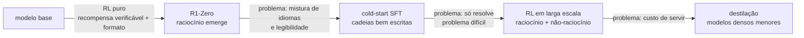
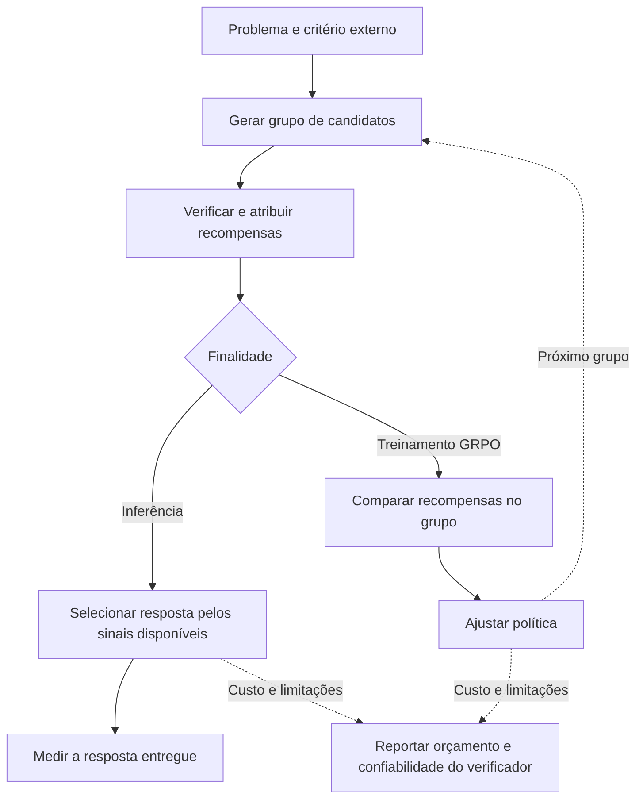
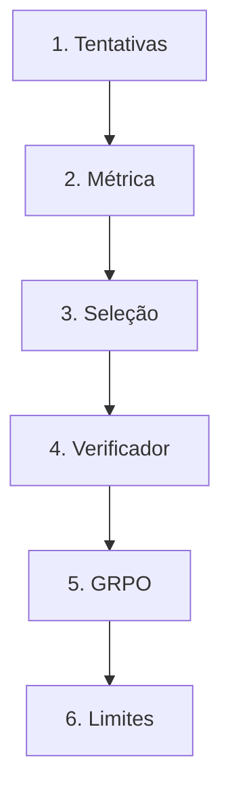

# Especificação de slides — Aula 16 (V2)

> **Rebalanceamento V2.** O fluxo principal abre por comportamentos observáveis — um modelo que
> acerta com dez tentativas e erra com uma, uma conta de API que triplica sem ganho, uma cadeia
> que cresce sem acertar mais — e usa a matemática como fundamento nomeado. Toda derivação está
> na Parte 2, mais detalhada do que estava na V1: o estimador de `pass@k` ganha a derivação
> combinatória completa e a prova de variância que a V1 não trazia; a vantagem do GRPO ganha a
> demonstração de que ela dispensa a função de valor.

<!-- SLIDE-FLOW:GUIDE:BEGIN -->
## Fluxogramas na produção dos slides

As orientações abaixo complementam o campo **Visual** dos slides indicados. Produzir os fluxogramas no próprio deck, como formas e conectores editáveis ou gráficos vetoriais; a biblioteca completa ao final torna esta especificação independente do portal.

- **Referência de composição:** título e propósito no topo, blocos numerados, conexões rotuladas, ramificações legíveis e uma saída identificada. Usar apenas o padrão visual da referência fornecida, sem importar seu assunto ou seus exemplos.
- **Tema do deck:** manter o fundo escuro e a paleta já especificada para a aula. Usar `#5b8cff` para o trecho ativo, tons neutros para o contexto e `#e2231a` conforme o significado definido no deck. Cor sempre acompanhada de rótulo.
- **Leitura:** entrada no topo ou à esquerda; saída na base ou à direita. Decisões em losangos, alternativas com rótulos e retornos apontando à etapa correta. Ramos paralelos convergem apenas onde seus resultados realmente são combinados.
- **Densidade:** no fluxo principal, projetar 3–6 blocos curtos por enquadramento, com corpo legível na última fileira. Um mapa maior pode ser revelado por etapas no mesmo slide. Detalhes, condições e explicações completas ficam nas notas; não reduzir a fonte para caber tudo.
- **Semântica:** mapas de percurso mostram ordem de estudo, não execução de um algoritmo. Manter separadas preparação e aplicação, treino e inferência, sequência e alternativas. Não transformar uma etapa opcional em obrigatória.
- **Integração:** o fluxograma substitui uma lista redundante ou ocupa o campo Visual; não cobre matrizes, tabelas, gráficos nem código indispensáveis. Preservar títulos, numeração, duração e referências aos apêndices.
- **Produção:** os blocos Mermaid abaixo são especificações do desenho. Renderizar/reconstruir como diagrama, nunca projetar o código Mermaid. Manter rótulos, bifurcações, retornos e limites declarados. Não transformar este caderno técnico em slides adicionais.
- **Ligação com o portal:** os mapas de mecanismo compartilham o conteúdo dos fluxogramas do portal. Em demonstrações, usar o mesmo vocabulário no deck e no controle interativo para facilitar a passagem entre os dois.
<!-- SLIDE-FLOW:GUIDE:END -->

## Diretrizes visuais

- **Tema:** escuro, accent `#e2231a` (vermelho CESAR), accent secundário `#5b8cff`.
- **Tipografia:** sans-serif para texto; monoespaçada para fórmulas, tabelas de números e
  pseudocódigo.
- **Densidade:** máximo 5 linhas de texto por slide no fluxo. Um conceito por slide.
- **No fluxo principal:** fórmula aparece **enunciada e lida**, nunca manipulada. Toda fórmula vem
  acompanhada de um número medido ou de uma decisão de produto que ela força.
- **No apêndice:** densidade alta é esperada e desejável. É material de consulta.
- **Números da demo:** todos os valores vêm da execução real de `codigo/demo-pass-at-k.py
  --offline`, determinística com semente fixa. **Não arredondar nem inventar variantes** — se o
  slide mostra `0,540`, é porque o script imprime `0,540`.
- **Honestidade da demo:** todo slide que mostra número da demo carrega, em rodapé pequeno, a
  marca "amostrador sintético determinístico — não é medição de modelo real". Não é rodapé
  decorativo: é o que impede a turma de citar o número como benchmark.
- **Proibido:** bullets genéricos; slide-parede de texto; gráfico sem eixo rotulado; fórmula sem
  consequência prática no fluxo principal.

## Arco narrativo

A aula abre com um número que força uma decisão de produto: o modelo resolve o problema em uma de
dez tentativas, e o usuário recebe **uma** resposta. A partir daí, três perguntas encadeadas. Como
se **mede** essa diferença — `pass@k` contra `consensus@k`, com a demo medindo as duas na tela e
mostrando que a distância entre elas é literalmente o valor de ter um verificador. Como se
**treina** contra um sinal que um programa produz — recompensa verificável e GRPO, que troca a
rede de valor do PPO pela média do próprio grupo. E o que **dá errado** — verificador parcial, e a
cadeia que cresce sem acertar mais porque ninguém pôs preço no token. Fecha no critério que
atravessa o Módulo 4 e no aviso da Prova da Aula 17, com a orientação de estudo ajustada ao novo
perfil da prova.

---

# PARTE 1 — FLUXO PRINCIPAL

*O que se apresenta em aula. 15 slides, ~100 minutos com demo e exercício.*

### Slide 1 — O sintoma: acerta com dez tentativas, erra com uma

<!-- SLIDE-FLOW:SLIDE:BEGIN -->
- **Fluxograma a incorporar neste slide:** **F00 — Tentativas, seleção e recompensa verificável**. O desenho e os rótulos completos estão no caderno de fluxogramas ao final deste arquivo.
- **Composição:** integrar ao campo Visual; preservar exemplos, tabelas, fórmulas e dimensões solicitados neste slide. Destacar o trecho relacionado ao título e manter o restante em segundo plano. Os textos detalhados ficam nas notas, sem duplicar a lista de Conteúdo na tela.
<!-- SLIDE-FLOW:SLIDE:END -->

- **Tipo:** problema (abertura)
- **Título:** O modelo resolve. Só que não na tentativa que o usuário recebeu
- **Conteúdo:** Dois comportamentos observáveis, e os dois forçam decisão de produto:
  1. Um modelo resolve um problema quando lhe são dadas **dez** tentativas, e erra quando lhe é
     dada **uma**. O usuário recebe uma. A capacidade existe e não chega ao produto.
  2. Um time liga o "modo de raciocínio" no produto inteiro. A conta de API **triplica** e a
     métrica da tarefa fácil não se move — em algumas ela até piora.
  A Aula 15 fechou com um sinal de treino que vem de gente: caro, lento, e com 70% de
  concordância. Hoje o sinal vem de um programa que confere a resposta — e o custo marginal de
  pontuar uma tentativa cai a zero. Cartão de logística em accent: **a Aula 17 é a Prova — os
  últimos 5 min de hoje são dedicados a ela.**
- **Frase-tese:** Ter a resposta certa entre dez não é o mesmo que entregá-la. A distância entre
  essas duas coisas tem nome, tem fórmula e tem preço.
- **Visual:** à esquerda, dez cartões de resposta com um único marcado em verde e a legenda "o
  modelo pode"; à direita, um cartão só, sorteado, com a legenda "o usuário recebe". Abaixo, duas
  barras de custo: "vanilla" e "raciocínio", a segunda três vezes maior, com a métrica da tarefa
  fácil imóvel ao lado.
- **Notas do apresentador:** 10 min. Anunciar o espaço reservado à prova logo aqui — sem isso, a
  primeira mão levantada é sobre a prova e o Bloco 1 nunca começa. Não nomear `pass@k` neste slide:
  o nome chega no 6, depois de a turma sentir a falta dele.

### Slide 2 — Por que "amostra mais" não é uma resposta

<!-- SLIDE-FLOW:SLIDE:BEGIN -->
- **Fluxograma a incorporar neste slide:** **F00 — Tentativas, seleção e recompensa verificável**. O desenho e os rótulos completos estão no caderno de fluxogramas ao final deste arquivo.
- **Composição:** integrar ao campo Visual; preservar exemplos, tabelas, fórmulas e dimensões solicitados neste slide. Destacar o trecho relacionado ao título e manter o restante em segundo plano. Os textos detalhados ficam nas notas, sem duplicar a lista de Conteúdo na tela.
<!-- SLIDE-FLOW:SLIDE:END -->

- **Tipo:** comparação (por que a intuição sozinha não basta)
- **Título:** Saber que uma das dez está certa não é um produto
- **Conteúdo:** A reação natural ao slide 1 é gerar mais amostras. Duas coisas quebram essa
  intuição. **Primeira:** sem um jeito de **conferir** qual das dez está certa, o ganho é
  inutilizável — "uma dessas dez respostas resolve o seu problema" não é algo que se entregue a um
  usuário. **Segunda:** a única regra de seleção disponível sem verificador é o voto majoritário,
  e ele falha exatamente quando o modelo erra de forma **consistente**: se a moda errada é firme,
  mais amostras só dão mais votos ao candidato errado. Amostrar mais aumenta o que o modelo *pode*
  fazer; não aumenta necessariamente o que ele *entrega*.
- **Frase-tese:** Mais amostras compram potencial. Transformar potencial em produto exige alguém
  capaz de apontar a resposta certa — e é isso que um verificador é.
- **Visual:** dez cartões com três respostas distintas contadas abaixo (6 × "750", 3 × "900",
  1 × "1050"), o gabarito marcado no cartão que aparece uma vez só. Seta de "voto majoritário"
  apontando para o errado, seta de "verificador" apontando para o certo.
- **Notas do apresentador:** Não dar os nomes das métricas ainda. O objetivo aqui é a turma sentir
  que falta uma palavra para nomear as duas coisas — e ela chega nos slides 6 e 7.

### Slide 3 — O que a gente vai chamar de raciocínio
- **Tipo:** conceito
- **Título:** A definição é de engenharia, não de cognição
- **Conteúdo:** A definição do curso, em bloco destacado:
  ```
  vanilla     prompt → resposta
  raciocínio  prompt → cadeia intermediária → resposta
  ```
  Raciocínio = resolução em várias etapas, com passos intermediários produzidos ou usados antes de
  fixar a resposta. É mensurável e serve para decidir arquitetura. **Não** é afirmação sobre o que
  acontece "na cabeça" do modelo — não há consenso científico sobre isso. Cartão de alerta, e ele é
  o terceiro sintoma da aula: **a cadeia bonita que leva à resposta errada**. A cadeia exibida é
  texto gerado sob a mesma distribuição de tudo o mais; pode ser construída depois da conclusão,
  pode contradizer a resposta final. Medir a fidelidade dela é problema aberto → Aula 27.
- **Frase-tese:** A cadeia que aparece na tela é texto gerado como qualquer outro. Ela pode ser
  explicação e pode ser álibi — e distinguir as duas coisas é problema em aberto.
- **Visual:** os dois fluxos desenhados como pipelines horizontais, o segundo com a caixa
  intermediária em accent. Ao lado, um exemplo de cadeia impecavelmente formatada terminando numa
  resposta marcada em vermelho.
- **Notas do apresentador:** Este slide atrai o debate filosófico. Reconhecer a legitimidade,
  marcar que a definição é operacional, cortar em 3 min apontando para a Aula 27.

### Slide 4 — A fatura em três eixos
- **Tipo:** conceito
- **Título:** Tokens de raciocínio não são de graça
- **Conteúdo:** O segundo sintoma do slide 1, decomposto. **Latência** — a resposta só começa a
  sair depois que a cadeia terminou; dois mil tokens de raciocínio são dois mil tokens de tela
  parada. **Preço** — token de raciocínio é cobrado como qualquer outro e costuma ser a maior parte
  da conta: paga-se mais pelo que o modelo pensou do que pelo que ele respondeu. **Contexto** — a
  cadeia ocupa janela que poderia ser documento recuperado, e essa colisão é literal: aparece na
  Aula 18, quando a janela tiver que ser dividida. Corolário de projeto em destaque: raciocínio é
  **alavanca** para tarefa difícil e verificável, não configuração global do produto.
- **Frase-tese:** Raciocínio é hora extra. Resolve o problema difícil e destrói a margem se virar
  rotina.
- **Visual:** três medidores (latência, R$, janela) enchendo à medida que a cadeia cresce, com o
  medidor de contexto espremendo a barra "documento recuperado". Cartão em accent: "em tarefa
  fácil, o modelo de raciocínio é mais caro, mais lento e às vezes pior".
- **Notas do apresentador:** Preços concretos por milhão de tokens são `[definir na oferta]` — não
  estimar de cabeça. O ponto é a estrutura dos três custos, não a cotação da semana.

### Slide 5 — Onde há gabarito automático

<!-- SLIDE-FLOW:SLIDE:BEGIN -->
- **Fluxograma a incorporar neste slide:** **F00 — Tentativas, seleção e recompensa verificável**. O desenho e os rótulos completos estão no caderno de fluxogramas ao final deste arquivo.
- **Composição:** integrar ao campo Visual; preservar exemplos, tabelas, fórmulas e dimensões solicitados neste slide. Destacar o trecho relacionado ao título e manter o restante em segundo plano. Os textos detalhados ficam nas notas, sem duplicar a lista de Conteúdo na tela.
<!-- SLIDE-FLOW:SLIDE:END -->

- **Tipo:** dados
- **Título:** Por que a literatura de raciocínio mora em dois domínios
- **Conteúdo:** Os benchmarks em duas colunas — **matemática:** GSM8K, MATH, AIME · **código:**
  HumanEval, MBPP, SWE-bench (Jimenez et al., arXiv 2310.06770). O que os une, em uma linha
  destacada: **a resposta é conferível por máquina.** Comparar número com gabarito é trivial;
  rodar teste unitário é barato. O SWE-bench é o caso mais duro: issue real de repositório real,
  com a suíte de testes do próprio projeto como verificador, sem humano na alça de correção.
  Cartão de alerta: o domínio dos benchmarks **não** é o domínio da capacidade. Matemática e código
  dominam porque são fáceis de corrigir — a área otimiza o que consegue medir barato.
- **Frase-tese:** Matemática e código dominam a literatura de raciocínio porque são fáceis de
  corrigir, não porque sejam onde raciocinar importa mais.
- **Visual:** dois blocos de benchmarks convergindo para um ícone de terminal com "check" verde; ao
  lado, uma coluna cinza de domínios sem verificador (direito, medicina, análise de negócio)
  apontando para um ícone de pessoa e um cifrão.
- **Notas do apresentador:** A pergunta "então não dá para treinar raciocínio jurídico?" aparece
  sempre. Anotar no quadro e devolver ao slide 15.

### Slide 6 — O fundamento nomeado: `pass@k`

<!-- SLIDE-FLOW:SLIDE:BEGIN -->
- **Fluxograma a incorporar neste slide:** **F00 — Tentativas, seleção e recompensa verificável**. O desenho e os rótulos completos estão no caderno de fluxogramas ao final deste arquivo.
- **Composição:** integrar ao campo Visual; preservar exemplos, tabelas, fórmulas e dimensões solicitados neste slide. Destacar o trecho relacionado ao título e manter o restante em segundo plano. Os textos detalhados ficam nas notas, sem duplicar a lista de Conteúdo na tela.
<!-- SLIDE-FLOW:SLIDE:END -->

- **Tipo:** conceito (o fundamento nomeado)
- **Título:** A probabilidade de pelo menos uma certa em `k` tentativas
- **Conteúdo:** A fórmula **enunciada e lida**, sem ser manipulada:
  ```
  n amostras geradas · c corretas · orçamento de k tentativas

  pass@k = 1 − C(n − c, k) / C(n, k)
  ```
  A leitura em português, termo a termo: `C(n−c, k)` conta de quantos jeitos se escolhem `k`
  amostras **só entre as erradas**; a razão é a probabilidade de todas as `k` saírem erradas; e
  `1 −` isso é "pelo menos uma certa". Os extremos confirmam: `c = 0 → 0` para qualquer `k`;
  `c = n → 1`; `k = 1 → c/n`, que é a acurácia empírica. E a condição que separa a métrica de um
  número decorativo: **`pass@k` só é acionável com verificador** — sem ele, sabe-se que uma das `k`
  está certa, e não qual. É o slide 2, agora com nome.
- **Frase-tese:** `pass@k` mede o que o modelo **pode** fazer. `pass@1` mede o que ele **entrega**.
  Comparar o `pass@10` de um com o `pass@1` de outro é comparar potencial com produto.
- **Visual:** dez caixinhas de amostra, algumas verdes e outras vermelhas, com uma janela deslizante
  de tamanho `k` selecionando subconjuntos; o caso "todas vermelhas dentro da janela" destacado como
  o evento que a fórmula conta.
- **Fundamento:** o estimador é não-viesado — sua esperança é exatamente `1 − (1−p)^k` — e tem
  variância **menor** que a do estimador ingênuo de rodar `k` amostras e ver se acertou.
  → derivação combinatória completa e prova de variância: **Apêndice A.1** (slide 16)
- **Notas do apresentador:** **Não derivar em aula.** Se a fórmula travar a sala, ir ao quadro
  pelos extremos — `c = 0`, `c = n` — e depois o caso `n = 10, c = 1, k = 5`, que dá exatamente
  0,5. O combinatório fica intuitivo pelos extremos, não pela álgebra. Contingência completa na
  Parte 4 do roteiro.

### Slide 7 — `consensus@k`: o que o verificador compra

<!-- SLIDE-FLOW:SLIDE:BEGIN -->
- **Fluxograma a incorporar neste slide:** **F00 — Tentativas, seleção e recompensa verificável**. O desenho e os rótulos completos estão no caderno de fluxogramas ao final deste arquivo.
- **Composição:** integrar ao campo Visual; preservar exemplos, tabelas, fórmulas e dimensões solicitados neste slide. Destacar o trecho relacionado ao título e manter o restante em segundo plano. Os textos detalhados ficam nas notas, sem duplicar a lista de Conteúdo na tela.
<!-- SLIDE-FLOW:SLIDE:END -->

- **Tipo:** comparação
- **Título:** Voto majoritário × colher a certa
- **Conteúdo:** Sem verificador, resta o voto majoritário sobre `k` amostras — `consensus@k` é a
  taxa de acerto desse voto. A desigualdade, enunciada:
  ```
  consensus@k  ≤  pass@k        (sempre)
  ```
  O motivo em uma linha: a resposta certa pode estar entre as `k` **sem ser a maioria**. `pass@k`
  conta que ela apareceu; `consensus@k` só conta se ela ganhou a eleição. A distância entre as duas
  curvas é, literalmente, **o valor de ter um verificador**. Cartão de alerta: amostrar mais
  **não** melhora sempre o consenso — com `k` crescendo, o voto majoritário converge para a moda da
  distribuição de respostas, e se a moda é errada ele converge para o erro.
- **Frase-tese:** A distância entre a curva de `pass@k` e a de `consensus@k` é o preço que vale a
  pena pagar por um verificador.
- **Visual:** duas curvas no mesmo par de eixos (`k` em x, taxa em y), `pass@k` acima e
  `consensus@k` abaixo, com a área entre elas hachurada e rotulada "valor do verificador".
- **Fundamento:** a desigualdade é demonstrável em uma linha por inclusão de eventos — "o voto
  majoritário acertou" implica "pelo menos uma amostra estava certa" —, e o limite com `k → ∞`
  explica por que amostrar mais não conserta uma moda errada.
  → demonstração e análise do limite: **Apêndice A.2** (slide 17)
- **Notas do apresentador:** Escrever `pass@k ≥ consensus@k` num canto do quadro e deixar até o
  fim do Bloco 1 — na demo eu aponto em vez de reexplicar.

### Slide 8 — [Demo] Os números medidos

<!-- SLIDE-FLOW:SLIDE:BEGIN -->
- **Fluxograma a incorporar neste slide:** **F00 — Tentativas, seleção e recompensa verificável**. O desenho e os rótulos completos estão no caderno de fluxogramas ao final deste arquivo.
- **Composição:** integrar ao campo Visual; preservar exemplos, tabelas, fórmulas e dimensões solicitados neste slide. Destacar o trecho relacionado ao título e manter o restante em segundo plano. Os textos detalhados ficam nas notas, sem duplicar a lista de Conteúdo na tela.
<!-- SLIDE-FLOW:SLIDE:END -->

- **Tipo:** dados / transição para demonstração
- **Título:** 5 problemas · 10 amostras · 3 temperaturas
- **Conteúdo:** As duas tabelas que a demo produz, com os números reais da execução:

  **`pass@k` (verificador disponível)**

  | T | pass@1 | pass@10 |
  |---|---|---|
  | 0,2 | **0,540** | 0,600 *(satura)* |
  | 1,2 | 0,440 | **1,000** |

  **`consensus@k` (sem verificador)** — em T = 1,2: `consensus@10` = **0,800** contra
  `pass@10` = **1,000**.

  A linha que conta a história, do problema `servidor` (gabarito 1050):
  ```
  T = 0,2   0/10 acertos   moda = 750    (erro consistente)
  T = 1,2   4/10 acertos   moda = 1050   (a diversidade achou)
  ```
  Três leituras que decidem produto: a temperatura que vence em `pass@1` **perde** em `pass@10`;
  T = 0,2 **satura** em 0,600 e mais orçamento não compra nada; e os 20 pontos entre `pass@10` e
  `consensus@10` são exatamente o que o verificador compra.
- **Frase-tese:** A temperatura que vence depende inteiramente de quantas tentativas eu tenho. Não
  existe uma temperatura boa — existe uma temperatura boa para um orçamento.
- **Visual:** os dois painéis de `pass-at-k-vs-temperatura.png` lado a lado, eixos rotulados
  (`k` × taxa), uma curva por temperatura, com o platô de T = 0,2 marcado por uma seta e a palavra
  "satura". Rodapé obrigatório: "amostrador sintético determinístico — não é medição de modelo
  real".
- **Notas do apresentador:** Passos na Parte 2 do roteiro. Rodar a rota `--offline`. Se o Python
  não subir, a saída da véspera em texto e o PNG cobrem — a demo é leitura de tabela de qualquer
  jeito. Intervalo depois deste slide.

### Slide 9 — Recompensa verificável: o professor automático

<!-- SLIDE-FLOW:SLIDE:BEGIN -->
- **Fluxograma a incorporar neste slide:** **F00 — Tentativas, seleção e recompensa verificável**. O desenho e os rótulos completos estão no caderno de fluxogramas ao final deste arquivo.
- **Composição:** integrar ao campo Visual; preservar exemplos, tabelas, fórmulas e dimensões solicitados neste slide. Destacar o trecho relacionado ao título e manter o restante em segundo plano. Os textos detalhados ficam nas notas, sem duplicar a lista de Conteúdo na tela.
<!-- SLIDE-FLOW:SLIDE:END -->

- **Tipo:** conceito
- **Título:** O sinal de treino sai de um programa
- **Conteúdo:** O contraste com a Aula 15, em duas linhas:
  ```
  Aula 15   anotador humano compara duas respostas   → caro, lento, ruidoso (70% de concordância)
  Aula 16   verificador confere a resposta            → 1 se bate, 0 se não
  ```
  Sem anotador, sem modelo de recompensa aprendido, sem o viés de quem anotou — e, o que mais
  importa para escala, **sem custo marginal por amostra**. Some-se a **recompensa de formato**: o
  modelo ganha por emitir a cadeia dentro de `<think>...</think>` e a resposta fora, o que torna a
  saída parseável e portanto verificável de forma estável; sem formato fixo, o verificador vira uma
  expressão regular frágil. Cartão de alerta em accent: verificável **não** significa fácil. O
  verificador define exatamente o que será otimizado — verificador fraco produz reward hacking, que
  é o mesmo risco da Aula 15 em roupa nova. Um teste unitário incompleto ensina o modelo a **passar
  no teste**, não a resolver o problema.
- **Frase-tese:** O verificador não mede a qualidade da resposta. Ele define o que vai ser
  otimizado — e o modelo vai otimizar exatamente aquilo, inclusive o que eu esqueci de conferir.
- **Visual:** a analogia central desenhada — uma pilha de redações com um corretor humano e um
  cronômetro × um gabarito de múltipla escolha com um leitor óptico. Abaixo, a marcação `<think>`
  separando a região "cadeia" da região "resposta" no texto gerado.
- **Notas do apresentador:** Se a turma colou reward hacking na Aula 15, retomar em uma frase. Este
  conceito volta no exercício, no caso 6 — não gastar mais que 2 min.

### Slide 10 — GRPO: a linha de base sai do próprio grupo

<!-- SLIDE-FLOW:SLIDE:BEGIN -->
- **Fluxograma a incorporar neste slide:** **F00 — Tentativas, seleção e recompensa verificável**. O desenho e os rótulos completos estão no caderno de fluxogramas ao final deste arquivo.
- **Composição:** integrar ao campo Visual; preservar exemplos, tabelas, fórmulas e dimensões solicitados neste slide. Destacar o trecho relacionado ao título e manter o restante em segundo plano. Os textos detalhados ficam nas notas, sem duplicar a lista de Conteúdo na tela.
<!-- SLIDE-FLOW:SLIDE:END -->

- **Tipo:** conceito (o fundamento nomeado)
- **Título:** Corrigir na curva da própria turma
- **Conteúdo:** O algoritmo em bloco monoespaçado, **enunciado e lido**:
  ```
  Para um prompt x, amostrar G completações   o₁ … o_G
  Pontuar cada uma com o verificador:         r₁ … r_G
  Vantagem relativa:   Aᵢ = (rᵢ − média(r)) / desvio(r)

  Reforça quem ficou acima da média do grupo; penaliza quem ficou abaixo.
  Mantém o clipping do PPO e a penalidade KL contra a referência.
  ```
  Shao et al., arXiv 2402.03300. O PPO da Aula 15 treinava uma rede inteira — o modelo de valor —
  só para responder "quanto eu esperava ganhar aqui". O GRPO responde isso com a média do próprio
  grupo, e encaixa em recompensa verificável porque pontuar `G` completações é rodar o verificador
  `G` vezes. A divisão pelo desvio não é cosmética: com recompensa binária ela faz a completação
  correta rara receber vantagem grande num problema difícil, e a falha rara receber vantagem grande
  em módulo num problema fácil — o gradiente se concentra sozinho no evento informativo. Cartão de
  alerta: GRPO **não** substitui o PPO em geral — resolve o caso "muitas amostras do mesmo prompt,
  com pontuação barata".
- **Frase-tese:** O PPO precisava de uma rede inteira só para dizer "quanto eu esperava ganhar
  aqui". O GRPO responde isso com a média da própria turma.
- **Visual:** um prompt no topo ramificando em `G` completações; cada uma com selo de nota do
  verificador; uma linha horizontal marcando a média; as acima em verde com seta para cima, as
  abaixo em vermelho com seta para baixo.
- **Fundamento:** trocar a rede de valor por uma média amostral é legítimo porque **qualquer** linha
  de base que dependa só do prompt deixa o gradiente de política sem viés — ela só muda a variância.
  → demonstração da invariância da linha de base: **Apêndice A.3** (slide 18)
- **Fundamento:** a vantagem padronizada `Aᵢ = (rᵢ − média)/desvio` tem forma fechada quando a
  recompensa é binária, e é dela que sai a leitura de por que a normalização foca o gradiente.
  → a vantagem escrita, lida e analisada: **Apêndice A.4** (slide 19)
- **Notas do apresentador:** Deixar a fórmula da vantagem no quadro até o slide 12. Se perguntarem
  por que dividir pelo desvio, a resposta curta é escala — e a conta fechada está em A.4. **Não**
  abrir a derivação do clipping: é Aula 15, A.3, e consome dez minutos.

### Slide 11 — GRPO × PPO, lado a lado

<!-- SLIDE-FLOW:SLIDE:BEGIN -->
- **Fluxograma a incorporar neste slide:** **F00 — Tentativas, seleção e recompensa verificável**. O desenho e os rótulos completos estão no caderno de fluxogramas ao final deste arquivo.
- **Composição:** integrar ao campo Visual; preservar exemplos, tabelas, fórmulas e dimensões solicitados neste slide. Destacar o trecho relacionado ao título e manter o restante em segundo plano. Os textos detalhados ficam nas notas, sem duplicar a lista de Conteúdo na tela.
<!-- SLIDE-FLOW:SLIDE:END -->

- **Tipo:** comparação
- **Título:** O modelo de valor sai da pilha
- **Conteúdo:** Duas colunas com as caixas de cada método:

  | | PPO (Aula 15) | GRPO (hoje) |
  |---|---|---|
  | política | sim | sim |
  | referência (KL) | sim | sim |
  | recompensa | modelo aprendido | verificador (programa) |
  | **valor** | **rede treinada** | **média do grupo** |

  A troca em uma linha: o PPO **aprende** a linha de base; o GRPO **calcula** a linha de base por
  amostragem. Consequência prática: troca-se **memória de treino** por **computação de inferência**
  — excelente quando gerar é barato e pontuar é um programa; péssimo quando cada geração é uma
  chamada paga e cada pontuação custa um anotador. É o tipo de decisão que aparece no projeto final.
- **Frase-tese:** O PPO aprende a linha de base. O GRPO calcula a linha de base amostrando. É
  trocar uma rede de treino por mais gerações — e é um câmbio excelente quando pontuar é de graça.
- **Visual:** à esquerda, as quatro caixas do PPO empilhadas; à direita, as mesmas caixas com a de
  **valor riscada em accent** e substituída pelo grupo de `G` completações com a média marcada. O
  risco é o elemento visual principal do slide.
- **Fundamento:** as duas colunas são a mesma estimativa da mesma quantidade — `E[R | x]` — obtida
  por aprendizado num caso e por média amostral no outro; e o preço da média amostral é precisar de
  `G ≥ 2`, porque com `G = 1` a vantagem é identicamente zero.
  → a comparação formal das duas linhas de base: **Apêndice A.3** (slide 18)
- **Notas do apresentador:** Desenhar as quatro caixas no quadro e riscar a de valor **na frente da
  turma**, com o giz. O gesto de riscar é o que fica; o slide projetado é só reforço.

### Slide 12 — O pipeline DeepSeek-R1 em quatro etapas
- **Tipo:** diagrama
- **Título:** Quatro etapas, e o problema que cada uma resolve da anterior
- **Conteúdo:** DeepSeek-AI, arXiv 2501.12948. As quatro, com o **problema que cada uma herda**:
  1. **R1-Zero** — RL puro sobre o base, sem SFT, com recompensa verificável e de formato.
     Raciocínio **emerge**: o modelo passa a revisar a própria conta, voltar atrás, gastar mais
     tokens em problema difícil. → *Problemas: mistura de idiomas, legibilidade ruim.*
  2. **Cold-start SFT** — conjunto pequeno de cadeias bem escritas. → *Conserta formato e idioma.*
  3. **RL em larga escala** — dados de raciocínio **e** de não-raciocínio misturados. → *Impede que
     vire só um resolvedor de olimpíada.*
  4. **Destilação** — saídas do modelo grande viram SFT de modelos densos menores. → *Herda o
     comportamento a uma fração do custo de servir.*

  Cartão de alerta: a primeira **não** é o método final. Ela prova que emerge — e entrega um modelo
  desagradável de usar.
- **Frase-tese:** A primeira etapa prova que o raciocínio emerge sozinho. As três seguintes existem
  para consertar o modelo que ela produziu.
- **Visual:** o diagrama Mermaid abaixo, com as caixas de "problema" penduradas em cada etapa em
  cor de alerta.
- **Notas do apresentador:** Se o tempo apertar, comprimir 3 e 4 para uma frase cada e proteger 1 e
  2 — o par "emerge / mas fica ilegível" é a pergunta dirigida da leitura e é ponto de prova.



### Slide 13 — A cadeia que cresce sem acertar mais
- **Tipo:** dados (fundamento aplicado a um sintoma)
- **Título:** Alongar é grátis quando ninguém põe preço no token
- **Conteúdo:** Sintoma, e é o quarto da aula: ao longo do RL, o comprimento médio da cadeia sobe
  **e a taxa de acerto não acompanha**. Parte do crescimento é ganho real — problema difícil merece
  mais passos. Parte é artefato do objetivo, e a razão é precisa: o comprimento não entra na
  recompensa, mas entra no **gradiente**, porque a contribuição de uma completação é uma soma sobre
  os tokens dela. Uma completação correta e longa empurra mais que uma correta e curta, com a mesma
  recompensa. Duas mitigações: **normalização de comprimento** na vantagem — com a ressalva de que
  normalizar por `|o|` cria um viés novo, penalizando **menos** por token as respostas erradas
  longas; e **budget forcing** na inferência, limitando ou forçando o orçamento de raciocínio.
- **Frase-tese:** Se ninguém põe preço no token, alongar é grátis. Cadeia mais longa não é
  raciocínio melhor — às vezes é só reward hacking barato.
- **Visual:** duas curvas nos mesmos eixos (passos de RL em x): comprimento médio subindo e taxa de
  acerto achatando, com as regiões "ganho real" e "inflação sem preço" sombreadas e rotuladas. As
  duas mitigações como marcadores sobre a curva.
- **Fundamento:** o comprimento não está na recompensa e está no gradiente, porque a perda soma
  sobre os tokens da completação; normalizar por `1/|o|` remove esse fator e introduz outro.
  → o efeito da normalização sobre o gradiente, com o viés que ela cria: **Apêndice A.5** (slide 20)
- **Notas do apresentador:** Este é o slide que se corta se o relógio estourou (vira leitura
  dirigida). O que **não** se corta é o slide 11 nem o aviso da prova no 15.

### Slide 14 — [Exercício] Quem tem verificador, e o que ele não confere

<!-- SLIDE-FLOW:SLIDE:BEGIN -->
- **Fluxograma a incorporar neste slide:** **F00 — Tentativas, seleção e recompensa verificável**. O desenho e os rótulos completos estão no caderno de fluxogramas ao final deste arquivo.
- **Composição:** integrar ao campo Visual; preservar exemplos, tabelas, fórmulas e dimensões solicitados neste slide. Destacar o trecho relacionado ao título e manter o restante em segundo plano. Os textos detalhados ficam nas notas, sem duplicar a lista de Conteúdo na tela.
- **Momento de exibição:** apresentar o fluxo preenchido na discussão ou conferência, depois da tentativa da turma; durante a atividade, ocultar as etapas que entregariam a solução.
<!-- SLIDE-FLOW:SLIDE:END -->

- **Tipo:** exercício
- **Título:** 6 tarefas · 12 min · três perguntas por linha
- **Conteúdo:** As seis tarefas, exatamente como aparecem na tela:
  ```
  1. Resolver equação do 2º grau e devolver as raízes
  2. Corrigir um bug de forma que a suíte de testes passe
  3. Escrever um e-mail de desculpas a um cliente insatisfeito
  4. Extrair de uma nota fiscal um JSON (CNPJ, valor, data) sob schema
  5. Resumir um artigo científico em um parágrafo
  6. Traduzir uma função de Python para Rust preservando o comportamento
  ```
  Por tarefa, a dupla entrega: (a) existe verificador automático? (b) se existe, qual é — em uma
  frase, nomeando a coisa que roda; (c) **o que ele não confere** — a superfície de reward hacking
  que ele deixa aberta; e (d) se não existe, qual o sinal alternativo: preferência humana (Aula 15)
  ou juiz calibrado (Aula 27). Fecha com a decisão de produto: com `pass@10 = 1,000` e
  `consensus@10 = 0,800` medidos na demo, o que se entrega ao usuário — e o que muda se não houver
  verificador em produção?
- **Frase-tese:** A pergunta não é só "dá para conferir". É "o que fica de fora quando eu confiro"
  — porque é exatamente ali que o modelo vai morar.
- **Visual:** as seis tarefas numeradas à esquerda, quatro colunas em branco à direita. Cronômetro
  de 7 min no canto. A pergunta de decisão num cartão separado abaixo.
- **Notas do apresentador:** Condução na Parte 3. Esperado: 1, 2, 4 e 6 têm verificador; 3 e 5 não.
  Os minutos de correção vão quase inteiros no caso 6 — verificador que **existe e é parcial**, que
  é o convite ao reward hacking do slide 9. A coluna (c) é a novidade da V2 e é ela que produz o
  artefato.

### Slide 15 — Fechamento: o critério do módulo — e a prova é na próxima aula

<!-- SLIDE-FLOW:SLIDE:BEGIN -->
- **Fluxograma a incorporar neste slide:** **F01 — O percurso desta aula**. O desenho e os rótulos completos estão no caderno de fluxogramas ao final deste arquivo.
- **Composição:** integrar ao campo Visual; preservar exemplos, tabelas, fórmulas e dimensões solicitados neste slide. Destacar o trecho relacionado ao título e manter o restante em segundo plano. Os textos detalhados ficam nas notas, sem duplicar a lista de Conteúdo na tela.
<!-- SLIDE-FLOW:SLIDE:END -->

- **Tipo:** encerramento
- **Título:** Existe verificador para a sua tarefa?
- **Conteúdo:** **Parte 1 — a síntese do Módulo 4.** As três formas de sinal de pós-treino vistas
  em quatro aulas:
  ```
  imitação               SFT (Aula 13)      eu sei escrever a resposta certa
  preferência humana     RLHF/DPO (A15)     eu não sei escrever, mas sei comparar duas
  verificação automática GRPO (hoje)        eu nem preciso julgar — um programa confere
  ```
  Se há verificador (código com teste, extração com schema, cálculo com gabarito): Best-of-N com
  verificador já rende muito, e RL se houver orçamento. Se não há: preferência humana ou juiz
  calibrado — mais caros e mais ruidosos. Pergunta a levar para a primeira reunião do grupo; o
  projeto é lançado na **Aula 18**.

  **Parte 2 — a Prova (Aula 17).** Individual, escrita, sem consulta e sem IA. Cobre as Aulas 1 a
  16. Vale **30%** da média. **O perfil da prova mudou:** o peso está em interpretar, diagnosticar
  e justificar; derivar vale **um** item, anunciado como tal. Roteiro de estudo, seis itens:
  1. **Diagnosticar** um sintoma de treino e propor a evidência que confirma a causa — treino que
     estagna quando a dimensão cresce, perda boa demais com geração incoerente, memória que estoura
     ao dobrar o contexto.
  2. **Diagnosticar** um comportamento de modelo alinhado — bajulação, capacidade perdida,
     recompensa que sobe enquanto a avaliação humana cai — e dizer o que mediria.
  3. **Justificar** a escolha entre prompting, RAG e fine-tuning para um cenário dado, citando o
     dado disponível e a restrição.
  4. **Justificar** a escolha do sinal de pós-treino — imitação, preferência ou verificação —
     dizendo de onde vem a recompensa e se os dados são fixos ou amostráveis.
  5. **Ler um número** corretamente: por que perplexidade não é comparável entre tokenizadores; o
     que `pass@k` mede que `pass@1` não mede; por que `consensus@k ≤ pass@k`.
  6. **Um item de fundamento formal**, marcado como tal: uma das derivações dos apêndices — a
     variância de `q·k`, a perda de Bradley-Terry ou o estimador de `pass@k` — e mesmo ela pede o
     que a conta **prevê**, não só a conta.
- **Frase-tese:** A pergunta que fecha este módulo é uma só: existe verificador para a sua tarefa?
  A resposta decide se melhorar vai custar um programa ou vai custar gente.
- **Visual:** o slide se divide em dois blocos com uma régua horizontal. Em cima, as três formas de
  sinal como escada (imitação → preferência → verificação) com o custo por amostra caindo. Embaixo,
  o cartão da prova em accent forte, com os seis itens em fonte grande o bastante para ser
  fotografada do fundo da sala, e uma faixa lateral com os pesos: **diagnóstico e interpretação 42 ·
  justificativa de escolha 40 · conceito aplicado 8 · derivação 10**. Rodapé: "Aula 17 — Prova · Aula 18 — RAG I,
  lançamento do projeto final".
- **Notas do apresentador:** Projetar o roteiro de estudo e ficar 30 s em silêncio para a turma
  fotografar. Dizer em voz alta que os apêndices dos decks são o material de estudo do item 6 — e
  que os cinco primeiros itens se estudam refazendo os exercícios de diagnóstico das aulas, não
  relendo fórmula. Responder dúvidas de formato aqui e só aqui, como prometido no slide 1. Não
  estourar o horário.

---

# PARTE 2 — APÊNDICE MATEMÁTICO

*Material de estudo e consulta. Não se apresenta em aula: reconstrói, com rigor completo, todo
fundamento citado no fluxo. Autossuficiente — quem estuda por aqui sem ter assistido à aula
consegue reconstruir tudo.*

### Slide 16 — A.1 · O estimador não-viesado de `pass@k`

<!-- SLIDE-FLOW:SLIDE:BEGIN -->
- **Fluxograma a incorporar neste slide:** **F00 — Tentativas, seleção e recompensa verificável**. O desenho e os rótulos completos estão no caderno de fluxogramas ao final deste arquivo.
- **Composição:** integrar ao campo Visual; preservar exemplos, tabelas, fórmulas e dimensões solicitados neste slide. Destacar o trecho relacionado ao título e manter o restante em segundo plano. Os textos detalhados ficam nas notas, sem duplicar a lista de Conteúdo na tela.
<!-- SLIDE-FLOW:SLIDE:END -->

- **Tipo:** apêndice — derivação combinatória completa
- **Invocado em:** slide 6

**Notação.**
`n` — número de amostras geradas para um mesmo problema (`n ≥ k`).
`c` — quantas dessas `n` foram julgadas corretas pelo verificador, `0 ≤ c ≤ n`.
`k` — orçamento de tentativas cujo desempenho se quer estimar.
`p` — probabilidade verdadeira, desconhecida, de uma amostra da política estar correta.
`C(a,b) = a! / (b!(a−b)!)` — coeficiente binomial, com a convenção `C(a,b) = 0` se `b > a`.

**Premissas.**
1. As `n` amostras são i.i.d. da mesma política, com a mesma temperatura. Se a temperatura mudar no
   meio da geração, nada abaixo vale.
2. O verificador é **determinístico e correto**: ele julga a mesma resposta sempre do mesmo jeito, e
   o julgamento dele é o gabarito. Um verificador com falso positivo infla `c` e infla `pass@k`
   junto.
3. `c` é uma variável aleatória: `c ~ Binomial(n, p)`.

**O que se quer estimar.** A quantidade de interesse é
```
pass@k verdadeiro = P( pelo menos uma correta entre k amostras i.i.d. ) = 1 − (1 − p)^k
```

**Derivação combinatória.** Dadas as `n` amostras já geradas, considere escolher um subconjunto de
tamanho `k` **uniformemente ao acaso, sem reposição**, entre as `n`.
- Total de subconjuntos possíveis: `C(n, k)`.
- Subconjuntos que **não contêm nenhuma correta**: todos os `k` elementos têm que sair das `n − c`
  amostras erradas, o que dá `C(n − c, k)` subconjuntos.

Logo, pela definição de probabilidade uniforme sobre subconjuntos,
```
P( nenhuma das k escolhidas está correta )  =  C(n − c, k) / C(n, k)
```
e portanto
```
pass@k  =  1 − C(n − c, k) / C(n, k)
```
*Convenção que fecha o caso de borda:* se `n − c < k`, não existe subconjunto só de erradas, então
`C(n − c, k) = 0` e `pass@k = 1`. Coerente: se há mais corretas do que sobrariam posições, é
impossível errar todas.

**Demonstração de que o estimador é não-viesado.** Falta mostrar que a esperança do estimador,
sobre o sorteio das `n` amostras, é exatamente `1 − (1 − p)^k`. Basta mostrar que
```
E_c [ C(n − c, k) / C(n, k) ]  =  (1 − p)^k
```
*Argumento.* Fixe um subconjunto `S` de tamanho `k` escolhido uniformemente entre as `n` posições,
**independentemente** das amostras. Então, para um `c` observado, `C(n−c,k)/C(n,k)` é exatamente a
probabilidade condicional de que todas as posições de `S` sejam de amostras erradas. Tomando a
esperança sobre a geração das amostras:
```
E_c [ C(n−c,k) / C(n,k) ]  =  P( todas as k amostras em S estão erradas )
```
Mas `S` é um conjunto de `k` posições fixadas antes da geração, e as amostras são i.i.d. (premissa
1). Logo as `k` amostras indexadas por `S` são simplesmente `k` amostras i.i.d. da política, e
```
P( todas as k erradas ) = (1 − p)^k
```
Portanto `E[pass@k estimado] = 1 − (1 − p)^k = pass@k verdadeiro`. ∎

**Por que o estimador ingênuo tem variância maior.** O estimador ingênuo é: gerar `k` amostras,
devolver 1 se pelo menos uma está correta e 0 caso contrário. Ele é uma Bernoulli de média
`q = 1 − (1−p)^k`, com variância `q(1−q)`. Com um orçamento de `n` amostras dá para formar
`⌊n/k⌋` estimativas independentes assim, e a média delas tem variância `q(1−q)/⌊n/k⌋`.

O estimador combinatório é **melhor**, e o motivo tem nome. Sob a premissa 3, `c` é uma estatística
**suficiente** para `p` no modelo binomial. E o estimador combinatório é exatamente a esperança
condicional do estimador ingênuo dado `c`:
```
E[ 1{pelo menos uma correta entre k sorteadas} | c ] = 1 − C(n−c,k)/C(n,k)
```
Pelo teorema de Rao-Blackwell, condicionar um estimador não-viesado a uma estatística suficiente
produz um estimador não-viesado com variância **menor ou igual**:
```
Var( E[X | c] )  ≤  Var( X )
```
com desigualdade estrita a menos que `X` já seja função de `c`. Em palavras: o estimador ingênuo
joga fora informação — ele só olha `k` das `n` amostras e reduz o resultado a um bit. O
combinatório usa as `n` amostras e, em vez de sortear **um** subconjunto de tamanho `k`, calcula a
média sobre **todos** os `C(n,k)` subconjuntos possíveis, de forma fechada. Menos sorteio, menos
variância.

**Casos-limite e sanidade.**
- `k = 1`: `pass@1 = 1 − C(n−c,1)/C(n,1) = 1 − (n−c)/n = c/n`. É a acurácia empírica. ✔
- `c = 0`: `C(n,k)/C(n,k) = 1`, logo `pass@k = 0` para qualquer `k`. ✔
- `c = n`: `C(0,k) = 0` para `k ≥ 1`, logo `pass@k = 1`. ✔
- `k = n`: `C(n−c,n) = 0` sempre que `c ≥ 1`, logo `pass@n = 1` se houver ao menos uma correta.
  É o teto empírico e explica por que `pass@n` é uma métrica pouco informativa.
- Exemplo numérico do quadro: `n = 10, c = 1, k = 5` →
  `pass@5 = 1 − C(9,5)/C(10,5) = 1 − 126/252 = 0,5`.

**Nota de implementação.** Calcular fatoriais de `n` grande estoura. A forma usada na prática é o
produto telescópico equivalente, estável numericamente:
```
C(n−c,k)/C(n,k) = Π_{i=0}^{k−1} ( n − c − i ) / ( n − i )
```
Cada fator está em `[0,1]`, o produto nunca estoura, e o laço é `O(k)`. É assim que o
`demo-pass-at-k.py` calcula.

**Leitura do resultado.** `pass@k` é uma afirmação sobre a **capacidade** da política sob um
orçamento de tentativas, e só vira afirmação sobre o **produto** se existir um selecionador capaz
de apontar a correta. Sem verificador, o número certo de olhar é o de A.2.

**De volta ao fluxo:** slide 6.

### Slide 17 — A.2 · `consensus@k` e por que ele é sempre ≤ `pass@k`

<!-- SLIDE-FLOW:SLIDE:BEGIN -->
- **Fluxograma a incorporar neste slide:** **F00 — Tentativas, seleção e recompensa verificável**. O desenho e os rótulos completos estão no caderno de fluxogramas ao final deste arquivo.
- **Composição:** integrar ao campo Visual; preservar exemplos, tabelas, fórmulas e dimensões solicitados neste slide. Destacar o trecho relacionado ao título e manter o restante em segundo plano. Os textos detalhados ficam nas notas, sem duplicar a lista de Conteúdo na tela.
<!-- SLIDE-FLOW:SLIDE:END -->

- **Tipo:** apêndice — demonstração e análise assintótica
- **Invocado em:** slide 7

**Notação.**
`𝒜` — conjunto das respostas finais possíveis (o número, a string normalizada, a expressão
canônica). `a*` — a resposta correta. `y₁ … y_k` — as respostas finais de `k` amostras i.i.d.
`N(a) = #{ i : y_i = a }` — contagem de votos da resposta `a`.
`ŷ = argmax_{a ∈ 𝒜} N(a)` — a moda empírica, com uma regra de desempate fixada de antemão.
```
consensus@k = P( ŷ = a* )
pass@k      = P( ∃ i : y_i = a* )
```

**Premissas.** Amostras i.i.d.; existe uma função de normalização que decide quando duas respostas
textualmente diferentes são a **mesma** resposta (`2` e `2.0`, raízes em ordem trocada). Sem essa
normalização, o voto majoritário fragmenta e `consensus@k` despenca por um motivo que não tem nada
a ver com o modelo.

**Demonstração da desigualdade.** Sejam os eventos
```
M = { ŷ = a* }              (o voto majoritário acertou)
E = { ∃ i : y_i = a* }      (pelo menos uma amostra estava certa)
```
Se `ŷ = a*`, então `N(a*) ≥ 1`, porque a moda empírica é necessariamente uma resposta que apareceu
ao menos uma vez — o argmax é tomado sobre contagens observadas. Logo `M ⊆ E`. Pela monotonicidade
da probabilidade:
```
P(M) ≤ P(E)     ou seja     consensus@k ≤ pass@k
```
∎ A desigualdade vale para **todo** `k`, toda distribuição de respostas e toda regra de desempate.

**Quando ela é estrita.** A diferença é
```
pass@k − consensus@k = P( E e não M ) = P( a* apareceu entre as k, mas não foi a moda )
```
Ou seja: a distância entre as duas curvas mede exatamente a **massa de probabilidade concentrada em
respostas erradas**. Ela é grande quando o modelo tem um erro sistemático popular, e pequena quando
os erros são difusos. Nos números medidos da demo, em T = 1,2: `pass@10 = 1,000` e
`consensus@10 = 0,800` — em um dos cinco problemas a resposta certa estava entre as dez e perdeu a
eleição. Vinte pontos é o que o verificador compra naquele conjunto.

**Comportamento assintótico — por que amostrar mais não conserta uma moda errada.** Seja
`P(a) = P(y_i = a)` a distribuição de respostas finais da política. Pela lei dos grandes números,
`N(a)/k → P(a)` para toda resposta `a`, logo a moda empírica converge para a moda da distribuição:
```
consensus@k  →  1  se  a* = argmax_a P(a)
consensus@k  →  0  se  a* ≠ argmax_a P(a)
```
Enquanto isso,
```
pass@k = 1 − (1 − P(a*))^k  →  1   sempre que  P(a*) > 0
```
*Leitura:* `pass@k` converge para "a resposta certa está no suporte"; `consensus@k` converge para
"a resposta certa é a mais provável". São duas perguntas diferentes, e a segunda é muito mais
exigente. É o formalismo exato do slide 2: amostrar mais aumenta o potencial e **não** conserta uma
moda errada firme.

**O caso medido, lido com isto na mão.** No problema `servidor` da demo:
- Em `T = 0,2`: 0 acertos em 10, moda = 750, gabarito = 1050. `P(a*)` é praticamente zero naquela
  temperatura — a resposta certa nem está no suporte prático. Logo **as duas** métricas ficam
  travadas, e é por isso que `pass@10` satura em 0,600: dois dos cinco problemas são inalcançáveis.
- Em `T = 1,2`: 4 acertos em 10 e a moda passou a ser 1050. `P(a*)` subiu o suficiente para virar
  argmax, e naquele problema `consensus` também acerta.

**Casos-limite.**
- `k = 1`: `consensus@1 = pass@1 = c/n`. Com uma amostra só, votar e colher são a mesma coisa, e a
  desigualdade vale com igualdade.
- Distribuição uniforme sobre muitas respostas: a moda empírica é quase aleatória, `consensus@k`
  fica baixo e a área entre as curvas fica máxima — o cenário em que um verificador vale mais.
- Empates: a regra de desempate importa e precisa ser fixada. Desempatar pela resposta de maior
  probabilidade média sob o modelo é a escolha usual; desempatar ao acaso adiciona variância que
  não é do modelo.

**Nota sobre o nome.** `consensus@k` é a métrica da *self-consistency*: amostrar várias cadeias e
votar na resposta final. A cadeia inteira não é comparada — só a resposta final, depois de
normalizada.

**De volta ao fluxo:** slide 7.

### Slide 18 — A.3 · Por que a média do grupo pode substituir a função de valor

<!-- SLIDE-FLOW:SLIDE:BEGIN -->
- **Fluxograma a incorporar neste slide:** **F00 — Tentativas, seleção e recompensa verificável**. O desenho e os rótulos completos estão no caderno de fluxogramas ao final deste arquivo.
- **Composição:** integrar ao campo Visual; preservar exemplos, tabelas, fórmulas e dimensões solicitados neste slide. Destacar o trecho relacionado ao título e manter o restante em segundo plano. Os textos detalhados ficam nas notas, sem duplicar a lista de Conteúdo na tela.
<!-- SLIDE-FLOW:SLIDE:END -->

- **Tipo:** apêndice — demonstração
- **Invocado em:** slides 10 e 11

**Notação.**
`x` — prompt. `o` — completação amostrada de `π_θ(·|x)`. `R(o)` — recompensa da completação (para
raciocínio verificável, `R ∈ {0,1}`, mais a recompensa de formato).
`J(θ) = E_{o ~ π_θ(·|x)} [ R(o) ]` — objetivo.
`b(x)` — linha de base: qualquer função que dependa do prompt e **não** da completação amostrada.

**O gradiente de política.** Escrevendo a esperança como soma sobre completações:
```
∇_θ J = ∇_θ Σ_o π_θ(o|x) R(o)
      = Σ_o ∇_θ π_θ(o|x) · R(o)
      = Σ_o π_θ(o|x) · ( ∇_θ π_θ(o|x) / π_θ(o|x) ) · R(o)      (multiplica e divide)
      = Σ_o π_θ(o|x) · ∇_θ log π_θ(o|x) · R(o)                  (identidade ∇log f = ∇f/f)
      = E_{o ~ π_θ} [ R(o) · ∇_θ log π_θ(o|x) ]
```

**Teorema da linha de base.** Para qualquer `b(x)` que não dependa de `o`:
```
E_{o ~ π_θ} [ b(x) · ∇_θ log π_θ(o|x) ]
  = b(x) · Σ_o π_θ(o|x) · ∇_θ log π_θ(o|x)
  = b(x) · Σ_o ∇_θ π_θ(o|x)
  = b(x) · ∇_θ ( Σ_o π_θ(o|x) )
  = b(x) · ∇_θ 1
  = 0
```
∎ Portanto
```
∇_θ J = E [ ( R(o) − b(x) ) · ∇_θ log π_θ(o|x) ]
```
para **qualquer** linha de base que dependa só do prompt. O viés é zero por construção; o que muda
é a **variância** do estimador.

**As duas implementações da mesma ideia.**

| | PPO | GRPO |
|---|---|---|
| linha de base | `V_ψ(s)`, uma rede treinada para aproximar `E[R \| s]` | `r̄ = (1/G) Σ_i r_i`, média amostral de `G` completações do mesmo prompt |
| custo | uma rede do porte da política, treinada em paralelo, na memória da GPU | `G` gerações por prompt e `G` execuções do verificador |
| generaliza para prompt novo | sim (é uma função aprendida) | não precisa — é recalculada a cada prompt |
| viés | o de aproximação de `V_ψ` | ver a nota de leave-one-out abaixo |

**Nota honesta sobre o viés da média do grupo.** A média `r̄` inclui o próprio `r_i`, então a
"linha de base" usada para a completação `i` **não é independente** dela — o que viola tecnicamente
a premissa do teorema acima. A correção exata é a linha de base *leave-one-out*:
```
b_{−i} = ( 1/(G−1) ) · Σ_{j ≠ i} r_j
```
que depende só das **outras** completações e portanto é independente de `o_i`, restaurando a
ausência de viés. Usar a média completa introduz um viés de ordem `1/G` — pequeno para `G` de 8 a
64, que é a faixa usual, e é por isso que a prática se acomodou nele. Vale saber que a variante
exata existe e tem nome (RLOO).

**Casos-limite.**
- `G = 1`: `r̄ = r₁`, logo `A₁ = 0` e o gradiente é identicamente nulo. O GRPO **exige** `G ≥ 2` —
  e o desvio-padrão do grupo nem sequer é definido com uma amostra.
- `G → ∞`: `r̄ → E[R|x]`, que é exatamente `V(x)`. A média amostral converge para a linha de base
  ideal, sem nada ter sido aprendido.
- Grupo homogêneo (todas certas ou todas erradas): `r̄ = r_i` para todo `i`, todas as vantagens são
  zero e aquele prompt **não produz gradiente nenhum**. É computação gasta sem sinal — a razão de
  existirem estratégias de currículo e de amostragem dinâmica que descartam ou substituem prompts
  saturados.

**Leitura do resultado.** O modelo de valor do PPO não é sagrado: ele é uma forma, entre outras, de
estimar `E[R|x]`. O GRPO usa a liberdade que o teorema da linha de base concede e troca uma rede
aprendida por uma média amostral. **Isso não é uma aproximação mais fraca** — é a mesma quantidade,
estimada por outro caminho, com outro perfil de custo: memória de treino a menos, computação de
inferência a mais.

**De volta ao fluxo:** slide 10.

### Slide 19 — A.4 · A vantagem relativa ao grupo, escrita e lida

<!-- SLIDE-FLOW:SLIDE:BEGIN -->
- **Fluxograma a incorporar neste slide:** **F00 — Tentativas, seleção e recompensa verificável**. O desenho e os rótulos completos estão no caderno de fluxogramas ao final deste arquivo.
- **Composição:** integrar ao campo Visual; preservar exemplos, tabelas, fórmulas e dimensões solicitados neste slide. Destacar o trecho relacionado ao título e manter o restante em segundo plano. Os textos detalhados ficam nas notas, sem duplicar a lista de Conteúdo na tela.
<!-- SLIDE-FLOW:SLIDE:END -->

- **Tipo:** apêndice — derivação e análise
- **Invocado em:** slide 10

**Notação.**
`x` — prompt. `o₁ … o_G ~ π_old(·|x)` — grupo de `G` completações do **mesmo** prompt.
`r_i = R(x, o_i)` — pontuação do verificador para a completação `i`.
`r̄ = (1/G) Σ_i r_i` — média do grupo. `s = sqrt( (1/G) Σ_i (r_i − r̄)² )` — desvio-padrão do grupo.
`|o_i|` — número de tokens da completação `i`.
`ρ_{i,t} = π_θ(o_{i,t} | x, o_{i,<t}) / π_old(o_{i,t} | x, o_{i,<t})` — razão de probabilidade,
como em A.3 da Aula 15.

**A vantagem.**
```
A_i = ( r_i − r̄ ) / ( s + ε )
```
com `ε` pequeno só para estabilidade numérica. A mesma `A_i` é atribuída a **todos** os tokens da
completação `i` — é supervisão por resultado, não por passo: o verificador julga a resposta final e
o crédito é distribuído uniformemente pela cadeia que a produziu.

**O objetivo completo.**
```
J(θ) = E[ (1/G) Σ_i (1/|o_i|) Σ_t min( ρ_{i,t}·A_i , clip(ρ_{i,t}, 1−ϵ, 1+ϵ)·A_i ) ]
       − β · KL( π_θ ‖ π_ref )
```
Duas peças vêm inteiras da Aula 15 e não são reinventadas aqui: o `min` com `clip` é o objetivo
clipado do PPO (Aula 15, A.3) e o termo de KL é a coleira contra a referência (Aula 15, A.4). O que
é novo é apenas de onde sai `A_i`.

**A forma fechada com recompensa binária.** Quando `r_i ∈ {0,1}` — o caso de raciocínio verificável
— e `c` das `G` completações estão corretas, seja `p̂ = c/G` a fração de acertos do grupo. Então:
```
r̄ = p̂
s = sqrt( p̂ (1 − p̂) )            (desvio de uma Bernoulli)
```
e a vantagem assume apenas dois valores:
```
completação correta   (r_i = 1):   A = (1 − p̂) / sqrt( p̂(1−p̂) ) = + sqrt( (1−p̂) / p̂ )
completação errada    (r_i = 0):   A = ( 0 − p̂) / sqrt( p̂(1−p̂) ) = − sqrt( p̂ / (1−p̂) )
```

**Leitura — é aqui que a divisão pelo desvio se justifica.**

| `p̂` (acertos no grupo) | vantagem da correta | vantagem da errada |
|---|---|---|
| 0,1 (problema difícil) | **+3,00** | −0,33 |
| 0,5 (problema no limite) | +1,00 | −1,00 |
| 0,9 (problema fácil) | +0,33 | **−3,00** |

Em problema difícil, o raro acerto recebe uma vantagem enorme e os muitos erros recebem uma
correção pequena: o gradiente vai quase todo para reforçar o caminho que funcionou. Em problema
fácil, a rara falha recebe o empurrão grande: o gradiente vai para corrigir o que quebrou. **A
padronização faz o passo se concentrar sozinho no evento informativo do grupo**, e faz o tamanho do
passo não depender de o prompt ser fácil ou difícil.

*Sem a divisão* (usando apenas `r_i − r̄`), as magnitudes seriam `1 − p̂` e `p̂`: um grupo quase
homogêneo produziria vantagens minúsculas e um passo de gradiente irrisório, e a taxa de
aprendizado efetiva passaria a depender da dificuldade do prompt.

**Casos-limite.**
- `p̂ = 0` ou `p̂ = 1`: `s = 0` e a expressão é `0/0`. Todas as vantagens são zero e o grupo não
  contribui gradiente — o mesmo fato de A.3, agora visto pela fórmula. Implementações descartam
  esses grupos; alguns pipelines reamostram até obter um grupo misto.
- `G = 1`: indefinido (não há desvio). O mínimo operacional é `G = 2`.
- `ε` grande demais no denominador: achata as vantagens de grupos quase homogêneos, o que é
  desejável, mas também achata as de grupos legítimos — é hiperparâmetro, e vale conferir a ordem
  de grandeza dele contra `s` típico.

**O que o GRPO não resolve.** A vantagem é a mesma para todos os tokens da completação, então o
método **não** localiza qual passo da cadeia foi responsável pelo acerto. Uma cadeia com um passo
errado que chega à resposta certa por acaso é reforçada inteira — e é exatamente a "cadeia bonita
que leva à resposta certa pelo motivo errado". Supervisão por processo (pontuar passo a passo) é a
linha de pesquisa que ataca isso, ao custo de um verificador por passo.

**De volta ao fluxo:** slide 10.

### Slide 20 — A.5 · Normalização de comprimento e o efeito sobre o gradiente

<!-- SLIDE-FLOW:SLIDE:BEGIN -->
- **Fluxograma a incorporar neste slide:** **F00 — Tentativas, seleção e recompensa verificável**. O desenho e os rótulos completos estão no caderno de fluxogramas ao final deste arquivo.
- **Composição:** integrar ao campo Visual; preservar exemplos, tabelas, fórmulas e dimensões solicitados neste slide. Destacar o trecho relacionado ao título e manter o restante em segundo plano. Os textos detalhados ficam nas notas, sem duplicar a lista de Conteúdo na tela.
<!-- SLIDE-FLOW:SLIDE:END -->

- **Tipo:** apêndice — análise do gradiente
- **Invocado em:** slide 13

**Notação.** A de A.4. `|o_i|` é o número de tokens da completação `i`; `g_{i,t} = ∇_θ log
π_θ(o_{i,t} | x, o_{i,<t})` é a contribuição de gradiente de um token.

**O ponto de partida.** A recompensa verificável **não depende do comprimento**: uma resposta certa
em 40 tokens e uma resposta certa em 4.000 tokens recebem exatamente `r = 1`. Se o comprimento não
está na recompensa, de onde vem a inflação?

**Do gradiente.** Sem normalização, a contribuição da completação `i` ao gradiente é a soma sobre
os tokens dela:
```
∇_θ J_i  ∝  A_i · Σ_{t=1}^{|o_i|} g_{i,t}
```
O número de parcelas é `|o_i|`. Em ordem de grandeza, e supondo contribuições de token com
magnitude típica comparável, o módulo desse vetor cresce com o comprimento. **Duas completações com
a mesma recompensa e a mesma vantagem empurram com forças diferentes se tiverem comprimentos
diferentes.** O otimizador não precisa "querer" ser verboso: alongar multiplica o efeito de cada
episódio bem-sucedido, e nada no objetivo cobra por isso.

**Com normalização por comprimento.**
```
∇_θ J_i  ∝  A_i · (1/|o_i|) · Σ_{t=1}^{|o_i|} g_{i,t}
```
Agora a contribuição é a **média** por token, e a magnitude por completação deixa de depender do
comprimento. É a mitigação citada no fluxo — e ela funciona para o efeito acima.

**O viés que a normalização introduz — e é preciso ser honesto sobre ele.** Dentro de um grupo com
comprimentos diferentes, dividir cada completação pelo **seu próprio** `|o_i|` faz o peso **por
token** ser `A_i/|o_i|`. Considere as completações erradas, com `A_i < 0`:
```
completação errada e curta  (|o| = 50):    peso por token = A/50    (penalização forte)
completação errada e longa  (|o| = 5000):  peso por token = A/5000  (penalização fraca)
```
Errar longo passa a custar **menos por token** do que errar curto. O gradiente, sem nunca ter sido
instruído nisso, prefere respostas erradas longas a respostas erradas curtas — e o comprimento
médio volta a subir, agora pelo lado dos erros. É um viés de comprimento **criado pela correção**.

**A correção da correção.** Normalizar por uma constante em vez de pelo comprimento da amostra:
```
∇_θ J_i  ∝  A_i · (1/L) · Σ_{t=1}^{|o_i|} g_{i,t}         com L fixo (ex.: comprimento máximo)
```
Assim a escala geral do gradiente fica controlada — que era o objetivo — sem criar um desconto por
token que dependa da amostra. Nenhuma escolha é neutra: o que se pode fazer é escolher qual viés se
prefere e **medir o comprimento médio ao longo do treino**, que é o painel que denuncia as duas
falhas.

**Ligação com a Aula 15.** O mesmo fenômeno aparece no DPO: `log π_θ(y|x)` é uma soma de `|y|`
termos, logo a margem entre preferido e rejeitado carrega comprimento embutido, e parte dela pode
ser explicada por tamanho e não por qualidade — está no item do apêndice da Aula 15 que faz a
reformulação do DPO, na seção "o comprimento entra pela porta dos fundos". É a mesma estrutura — objetivo escrito
como soma sobre tokens — produzindo o mesmo viés em dois algoritmos diferentes.

**Casos-limite.**
- `|o_i|` igual para todas as completações do grupo: as três formas acima coincidem a menos de
  constante multiplicativa. O problema **só** existe porque os comprimentos variam.
- `|o_i| = 1`: normalizar não faz nada.
- `|o_i| → ∞` sem normalização: a magnitude do gradiente cresce sem limite; na prática o sintoma é
  instabilidade e picos de norma de gradiente correlacionados com as amostras mais longas.

**Mitigação do lado da inferência, para completude.** *Budget forcing* — limitar o número de tokens
de raciocínio, ou forçar um mínimo — não altera nada do gradiente: é uma decisão de implantação,
que atua sobre a fatura do slide 4 e não sobre o treino. As duas mitigações são complementares e
resolvem problemas diferentes.

**Leitura do resultado.** Comprimento não está na recompensa e está no gradiente. Quem não puser
preço nele explicitamente vai ver o otimizador usá-lo — e a métrica que denuncia isso é a curva de
comprimento médio contra a curva de acerto: quando a primeira sobe e a segunda achata, o crescimento
não é raciocínio.

**De volta ao fluxo:** slide 13.

<!-- SLIDE-FLOW:LIBRARY:BEGIN -->
# Caderno de fluxogramas para produção

As referências Fxx identificam desenhos, não novos números de slide. Cada desenho abaixo é autocontido.

| Mapa | Desenho | Usar nos slides |
| --- | --- | --- |
| F00 | Tentativas, seleção e recompensa verificável | 1, 2, 5, 6, 7, 8, 9, 10, 11, 14, 16, 17, 18, 19, 20 |
| F01 | O percurso desta aula | 15 |

## F00 — Tentativas, seleção e recompensa verificável

Gerar uma solução correta e conseguir selecioná-la são problemas diferentes.



**Conteúdo dos blocos e notas de montagem:**

1. **Definir problema e verificação:** Escolha um critério externo, como testes executáveis ou resposta conferível.
2. **Gerar um grupo de respostas:** Use o mesmo problema e registre custo e configuração de cada tentativa.
   Ramos/alternativas a rotular: Tentativa 1; Tentativa 2; Tentativa … k.
3. **Verificar e atribuir sinal:** Avalie candidatos pelo critério escolhido; o verificador também pode falhar.
4. **Distinguir seleção de treino:** As rotas têm finalidades diferentes.
   Ramos/alternativas a rotular: Inferência → selecionar uma resposta pelos sinais disponíveis; GRPO → comparar recompensas no grupo e ajustar a política.
5. **Medir o resultado entregue:** Reporte acerto, orçamento e limitações; pass@k não é a taxa de acerto do seletor.

**Saída ou limite a explicitar:** Mais tentativas aumentam trabalho; candidatos correlacionados e critérios frágeis limitam o ganho.

## F01 — O percurso desta aula

As setas indicam a ordem de estudo. Abra cada etapa para entender sua função.



**Conteúdo dos blocos e notas de montagem:**

1. **Tentativas:** Gere várias soluções para o mesmo problema.
2. **Métrica:** Distinga acerto em uma tentativa e em um conjunto.
3. **Seleção:** Separe gerar candidatos de escolher a resposta final.
4. **Verificador:** Use critérios externos para conferir candidatos.
5. **GRPO:** Compare recompensas dentro do grupo para o treino.
6. **Limites:** Declare custo, correlação e limites do verificador.

**Saída ou limite a explicitar:** Conecte as etapas: explique como uma decisão afeta o que você observa em seguida.
<!-- SLIDE-FLOW:LIBRARY:END -->

