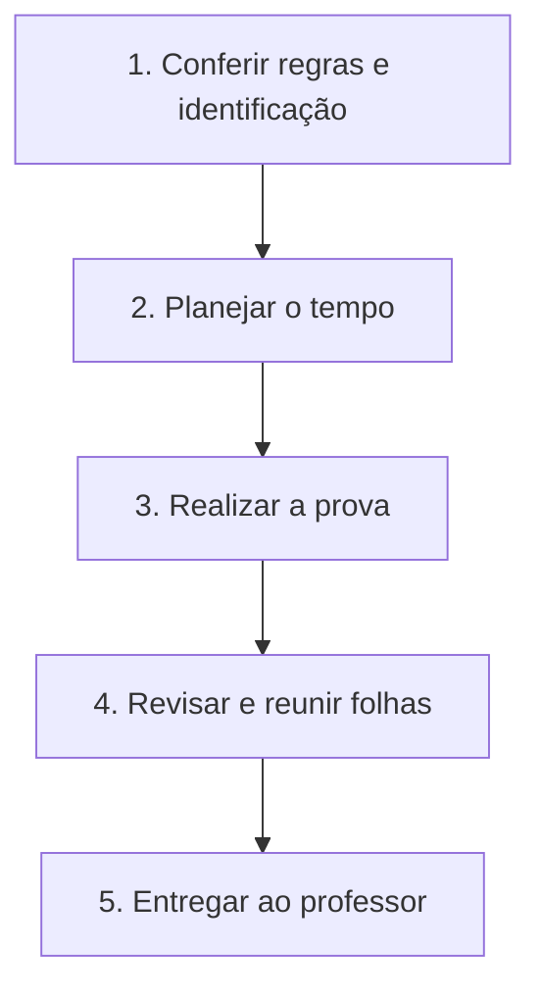
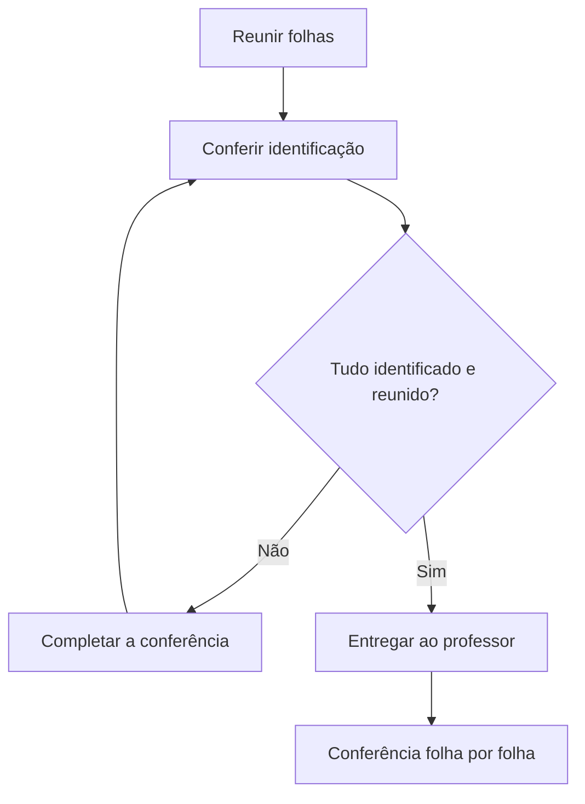

# Especificação de slides — Aula 17 (V2)

Deck operacional baseado no plano V2 desta aula. Serve à abertura, à organização do tempo e ao recolhimento. Não reproduzir questões, respostas, fórmulas ou mapas dos mecanismos avaliados. Os fluxogramas desta sessão descrevem somente procedimentos de realização da prova.

<!-- SLIDE-FLOW:GUIDE:BEGIN -->
## Fluxogramas na produção dos slides

As orientações abaixo complementam o campo **Visual** dos slides indicados. Produzir os fluxogramas no próprio deck, como formas e conectores editáveis ou gráficos vetoriais; a biblioteca completa ao final torna esta especificação independente do portal.

- **Referência de composição:** título e propósito no topo, blocos numerados, conexões rotuladas, ramificações legíveis e uma saída identificada. Usar apenas o padrão visual da referência fornecida, sem importar seu assunto ou seus exemplos.
- **Tema do deck:** manter o fundo escuro e a paleta já especificada para a aula. Usar `#5b8cff` para o trecho ativo, tons neutros para o contexto e `#e2231a` conforme o significado definido no deck. Cor sempre acompanhada de rótulo.
- **Leitura:** entrada no topo ou à esquerda; saída na base ou à direita. Decisões em losangos, alternativas com rótulos e retornos apontando à etapa correta. Ramos paralelos convergem apenas onde seus resultados realmente são combinados.
- **Densidade:** no fluxo principal, projetar 3–6 blocos curtos por enquadramento, com corpo legível na última fileira. Um mapa maior pode ser revelado por etapas no mesmo slide. Detalhes, condições e explicações completas ficam nas notas; não reduzir a fonte para caber tudo.
- **Semântica:** mapas de percurso mostram ordem de estudo, não execução de um algoritmo. Manter separadas preparação e aplicação, treino e inferência, sequência e alternativas. Não transformar uma etapa opcional em obrigatória.
- **Integração:** o fluxograma substitui uma lista redundante ou ocupa o campo Visual; não cobre matrizes, tabelas, gráficos nem código indispensáveis. Preservar títulos, numeração, duração e referências aos apêndices.
- **Produção:** os blocos Mermaid abaixo são especificações do desenho. Renderizar/reconstruir como diagrama, nunca projetar o código Mermaid. Manter rótulos, bifurcações, retornos e limites declarados. Não transformar este caderno técnico em slides adicionais.
- **Ligação com o portal:** os mapas de mecanismo compartilham o conteúdo dos fluxogramas do portal. Em demonstrações, usar o mesmo vocabulário no deck e no controle interativo para facilitar a passagem entre os dois.

**Aula de avaliação:** o caderno abaixo contém apenas mapas operacionais de realização e entrega. Não usar o percurso técnico de revisão do portal enquanto a prova estiver em andamento.
<!-- SLIDE-FLOW:GUIDE:END -->

## Diretrizes visuais

- **Tema:** escuro; azul `#5b8cff` para sequência de procedimentos e vermelho `#e2231a` para proibições e prazos.
- **Legibilidade:** corpo mínimo de 28 pt, números tabulares e rótulos curtos. Não depender apenas da cor.
- **Densidade:** uma ação ou condição por bloco. O relógio e os avisos continuam sendo os elementos principais durante a execução.
- **Fonte de regras:** `plano.md` desta aula. Não importar pontos, tempos nem regras de uma versão anterior da prova.
- **Material reservado:** o gabarito permanece separado; não incluí-lo neste deck, nas notas ou nos fluxogramas.

## Organização da sessão

Abertura de 00:00 a 00:10; execução de 00:10 a 01:50; recolhimento e ponte para a aula 18 de 01:50 a 02:00. Os avisos ocorrem em 00:40, 01:10, 01:35 e 01:45. O tempo adicional previsto para estudantes com laudo é organizado pelo Apoio Psicopedagógico, conforme o plano.

### Slide 1 — Regras e início da avaliação

<!-- SLIDE-FLOW:SLIDE:BEGIN -->
- **Fluxograma a incorporar neste slide:** **F00 — Realização da avaliação**. O desenho e os rótulos completos estão no caderno de fluxogramas ao final deste arquivo.
- **Composição:** integrar ao campo Visual; preservar exemplos, tabelas, fórmulas e dimensões solicitados neste slide. Destacar o trecho relacionado ao título e manter o restante em segundo plano. Os textos detalhados ficam nas notas, sem duplicar a lista de Conteúdo na tela.
- **Restrição da avaliação:** projetar somente procedimentos; não incorporar nenhum mapa de conteúdo das aulas 1–16. No slide do relógio, o fluxo ocupa apenas uma faixa de apoio.
<!-- SLIDE-FLOW:SLIDE:END -->

- **Tipo:** orientação operacional.
- **Título:** Como realizar a avaliação.
- **Conteúdo:** prova individual, escrita, sem consulta e sem ferramentas de IA; identificar a folha; ouvir os avisos; respeitar o horário de término informado.
- **Visual:** regras em destaque e uma sequência curta de preparação até o início. Nenhum conceito das aulas avaliadas.
- **Notas do apresentador:** ler as regras do plano, confirmar os procedimentos de identificação e anunciar o início às 00:10. Questões sobre logística são tratadas pelo professor sem explicar conteúdo da prova.

### Slide 2 — Pontuação e planejamento do tempo

<!-- SLIDE-FLOW:SLIDE:BEGIN -->
- **Fluxograma a incorporar neste slide:** **F00 — Realização da avaliação**. O desenho e os rótulos completos estão no caderno de fluxogramas ao final deste arquivo.
- **Composição:** integrar ao campo Visual; preservar exemplos, tabelas, fórmulas e dimensões solicitados neste slide. Destacar o trecho relacionado ao título e manter o restante em segundo plano. Os textos detalhados ficam nas notas, sem duplicar a lista de Conteúdo na tela.
- **Restrição da avaliação:** projetar somente procedimentos; não incorporar nenhum mapa de conteúdo das aulas 1–16. No slide do relógio, o fluxo ocupa apenas uma faixa de apoio.
<!-- SLIDE-FLOW:SLIDE:END -->

- **Tipo:** referência de organização.
- **Título:** 100 pontos em uma janela de 100 minutos.
- **Conteúdo:** tabela operacional, sem nomes de temas nem enunciados:

  | Questão | Pontos | Tempo sugerido |
  | --- | --- | --- |
  | Q1 | 12 | 10 min |
  | Q2 | 15 | 12 min |
  | Q3 | 18 | 15 min |
  | Q4 | 18 | 15 min |
  | Q5 | 12 | 10 min |
  | Q6 | 15 | 13 min |
  | Q7 | 10 | 10 min |
  | Total | 100 | 85 min |

- **Visual:** tabela com números alinhados e uma faixa de planejamento: consultar os tempos → distribuir o trabalho → reservar a revisão. Há 15 minutos de folga entre os 85 sugeridos e a janela de 100.
- **Notas do apresentador:** os tempos são sugestões de organização. A distribuição V2 é 42 pontos de interpretação/diagnóstico, 40 de justificativa, 8 de conceito aplicado e 10 de derivação. Não antecipar a solução de qualquer questão.

### Slide 3 — Relógio e avisos durante a execução

<!-- SLIDE-FLOW:SLIDE:BEGIN -->
- **Fluxograma a incorporar neste slide:** **F00 — Realização da avaliação**. O desenho e os rótulos completos estão no caderno de fluxogramas ao final deste arquivo.
- **Composição:** integrar ao campo Visual; preservar exemplos, tabelas, fórmulas e dimensões solicitados neste slide. Destacar o trecho relacionado ao título e manter o restante em segundo plano. Os textos detalhados ficam nas notas, sem duplicar a lista de Conteúdo na tela.
- **Restrição da avaliação:** projetar somente procedimentos; não incorporar nenhum mapa de conteúdo das aulas 1–16. No slide do relógio, o fluxo ocupa apenas uma faixa de apoio.
<!-- SLIDE-FLOW:SLIDE:END -->

- **Tipo:** referência projetada.
- **Título:** Acompanhe o tempo.
- **Conteúdo:** início às 00:10; avisos em 00:40, 01:10, 01:35 e 01:45; término da janela regular às 01:50.
- **Visual:** linha do tempo com os quatro avisos e o término destacados. O fluxo de realização aparece em faixa discreta, sem reduzir o tamanho do relógio.
- **Notas do apresentador:** deixar este slide projetado durante a execução. Atualizar o marco atual; não projetar os mapas de revisão dos fundamentos presentes no portal. As condições de tempo adicional seguem a organização institucional.

### Slide 4 — Conferência e entrega das folhas

<!-- SLIDE-FLOW:SLIDE:BEGIN -->
- **Fluxograma a incorporar neste slide:** **F01 — Conferência e entrega**. O desenho e os rótulos completos estão no caderno de fluxogramas ao final deste arquivo.
- **Composição:** integrar ao campo Visual; preservar exemplos, tabelas, fórmulas e dimensões solicitados neste slide. Destacar o trecho relacionado ao título e manter o restante em segundo plano. Os textos detalhados ficam nas notas, sem duplicar a lista de Conteúdo na tela.
- **Restrição da avaliação:** projetar somente procedimentos; não incorporar nenhum mapa de conteúdo das aulas 1–16. No slide do relógio, o fluxo ocupa apenas uma faixa de apoio.
<!-- SLIDE-FLOW:SLIDE:END -->

- **Tipo:** encerramento operacional.
- **Título:** Concluir e entregar.
- **Conteúdo:** conferir a identificação; reunir as folhas da avaliação; entregar ao professor; aguardar a conferência do recolhimento.
- **Visual:** fluxograma curto de entrega com retorno à conferência se faltar identificação ou folha.
- **Notas do apresentador:** recolher folha por folha, conforme o plano. Depois de concluir o recolhimento, anunciar a preparação para a aula 18 e a formação das equipes. Não apresentar respostas nem fazer correção pública durante a janela de avaliação.

## Apêndice

Sem apêndice de conteúdo. As especificações dos fluxogramas operacionais abaixo são instruções de produção dos quatro slides, não novos slides para projetar.

<!-- SLIDE-FLOW:LIBRARY:BEGIN -->
# Caderno de fluxogramas para produção

As referências Fxx identificam desenhos, não novos números de slide. Cada desenho abaixo é autocontido.

| Mapa | Desenho | Usar nos slides |
| --- | --- | --- |
| F00 | Realização da avaliação | 1, 2, 3 |
| F01 | Conferência e entrega | 4 |

## F00 — Realização da avaliação

Fluxo operacional; não mostrar conteúdo avaliado.

**Conteúdo dos blocos e notas de montagem:**

1. **Conferir regras e identificação:** Prova individual, escrita, sem consulta e sem IA.
2. **Planejar o tempo:** Distribua o trabalho na janela de 100 minutos; os tempos sugeridos somam 85.
3. **Realizar a prova:** Acompanhe os avisos e o prazo informado pelo professor.
4. **Revisar e reunir folhas:** Confira identificação e todas as folhas da avaliação.
5. **Entregar ao professor:** Aguarde a conferência do recolhimento.

**Saída ou limite a explicitar:** Não incluir perguntas, fórmulas nem pistas de resposta.

## F01 — Conferência e entrega

Procedimento de recolhimento da avaliação.

**Conteúdo dos blocos e notas de montagem:**

1. **Reunir as folhas:** Junte as folhas da avaliação para a entrega.
2. **Conferir identificação:** Verifique se a identificação solicitada foi preenchida.
3. **Confirmar completude:** Se faltar identificação ou uma folha, faça a correção antes de entregar.
4. **Entregar e conferir:** O professor recolhe e confere folha por folha.

**Saída ou limite a explicitar:** A entrega encerra a realização da avaliação.
<!-- SLIDE-FLOW:LIBRARY:END -->

