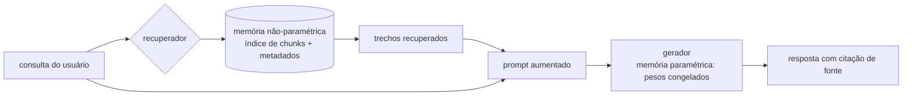
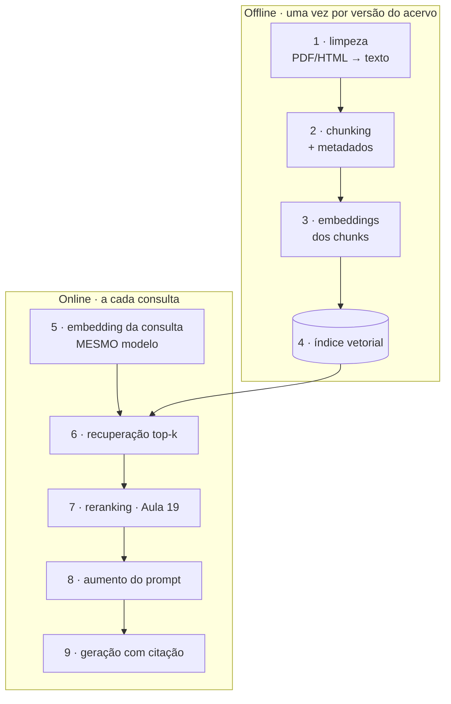
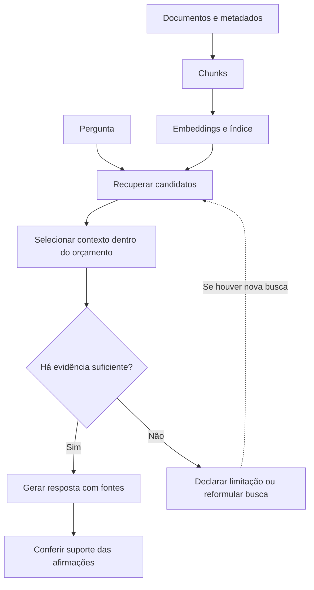
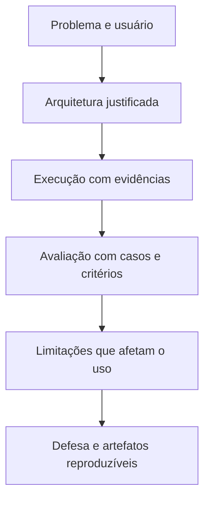
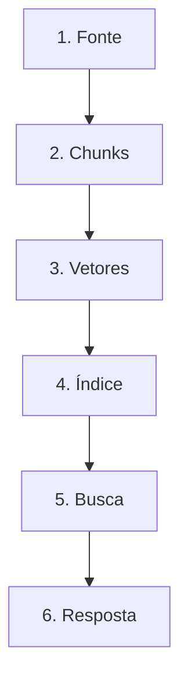

# Especificação de slides — Aula 18 (V2)

> **Rebalanceamento V2.** Esta aula já era conduzida pela aplicação na V1: abre por um problema
> real — a resposta inventada sobre o regulamento da própria instituição — e a matemática aparece
> como ferramenta pontual, não como derivação a acompanhar. O transporte para a V2 preserva o
> fluxo, a ordem dos slides, o arco narrativo e o lançamento do projeto, e acrescenta apenas o
> apêndice com o fundamento formal que estava disperso (o cosseno e o custo da busca), mais os
> ponteiros. Carga horária, numeração e objetivos de aprendizagem inalterados.

<!-- SLIDE-FLOW:GUIDE:BEGIN -->
## Fluxogramas na produção dos slides

As orientações abaixo complementam o campo **Visual** dos slides indicados. Produzir os fluxogramas no próprio deck, como formas e conectores editáveis ou gráficos vetoriais; a biblioteca completa ao final torna esta especificação independente do portal.

- **Referência de composição:** título e propósito no topo, blocos numerados, conexões rotuladas, ramificações legíveis e uma saída identificada. Usar apenas o padrão visual da referência fornecida, sem importar seu assunto ou seus exemplos.
- **Tema do deck:** manter o fundo escuro e a paleta já especificada para a aula. Usar `#5b8cff` para o trecho ativo, tons neutros para o contexto e `#e2231a` conforme o significado definido no deck. Cor sempre acompanhada de rótulo.
- **Leitura:** entrada no topo ou à esquerda; saída na base ou à direita. Decisões em losangos, alternativas com rótulos e retornos apontando à etapa correta. Ramos paralelos convergem apenas onde seus resultados realmente são combinados.
- **Densidade:** no fluxo principal, projetar 3–6 blocos curtos por enquadramento, com corpo legível na última fileira. Um mapa maior pode ser revelado por etapas no mesmo slide. Detalhes, condições e explicações completas ficam nas notas; não reduzir a fonte para caber tudo.
- **Semântica:** mapas de percurso mostram ordem de estudo, não execução de um algoritmo. Manter separadas preparação e aplicação, treino e inferência, sequência e alternativas. Não transformar uma etapa opcional em obrigatória.
- **Integração:** o fluxograma substitui uma lista redundante ou ocupa o campo Visual; não cobre matrizes, tabelas, gráficos nem código indispensáveis. Preservar títulos, numeração, duração e referências aos apêndices.
- **Produção:** os blocos Mermaid abaixo são especificações do desenho. Renderizar/reconstruir como diagrama, nunca projetar o código Mermaid. Manter rótulos, bifurcações, retornos e limites declarados. Não transformar este caderno técnico em slides adicionais.
- **Ligação com o portal:** os mapas de mecanismo compartilham o conteúdo dos fluxogramas do portal. Em demonstrações, usar o mesmo vocabulário no deck e no controle interativo para facilitar a passagem entre os dois.
<!-- SLIDE-FLOW:GUIDE:END -->

## Diretrizes visuais

- **Tema:** escuro, accent `#e2231a` (vermelho CESAR), accent secundário `#5b8cff`.
- **Tipografia:** sans-serif para texto; monoespaçada para código, fórmulas, nomes de parâmetro e identificadores de documento.
- **Densidade:** máximo 5 linhas de texto por slide. Um conceito por slide.
- **Proibido:** bullets genéricos ("Vantagens", "Desvantagens"); slide-parede de texto; clipart; gráfico sem eixo rotulado.
- **Fórmulas e parâmetros:** renderizar como bloco destacado em monoespaçada, não como imagem de baixa resolução.

## Arco narrativo

O deck abre marcando a virada do curso — a prova fechou a metade de entender, começa a metade de construir — e ancora tudo numa pergunta concreta que qualquer aluno já fez a um chatbot e recebeu resposta inventada. A primeira metade destrói duas saídas intuitivas (re-treinar, contexto longo) e monta o pipeline de RAG em nove etapas, terminando numa demonstração que mede, com cosseno na tela, que o chunking decide o resultado antes de existir gerador. A segunda metade explica por que o vetor encontra o texto (Sentence-BERT, bi-encoder) e onde os vetores moram (ANN, HNSW, `efSearch`), e então vira para o lançamento do projeto final: 40% da nota, quatro requisitos, três entregas, e um exercício que forma as equipes em sala. O deck fecha na frase que organiza a Aula 19: RAG é um sistema de recuperação com um gerador no fim.

---

# PARTE 1 — FLUXO PRINCIPAL

*O que se apresenta em aula. 15 slides, ~110 min com demo, lançamento do projeto e exercício.
A ordem é a da V1 e não foi alterada: o Slide 1 já abre por marco e o Slide 2 por problema real.*

### Slide 1 — Abertura: a prova ficou para trás
- **Tipo:** título
- **Título:** RAG I: geração aumentada por recuperação
- **Frase-tese:** A primeira metade foi sobre entender o modelo. A segunda é sobre construir sistemas em volta dele.
- **Conteúdo:** Subtítulo com o marco do curso: Módulo 5 · Aula 18 de 30 · a partir daqui, 5 laboratórios e 1 projeto. Uma linha em accent: "no fim desta aula, o projeto final está aberto e as equipes estão formadas".
- **Visual:** régua de 30 marcas no rodapé (as 30 aulas), com as 17 primeiras apagadas e a 18 acesa em accent; a marca 30 destacada com o rótulo "apresentações". Nada mais.
- **Notas do apresentador:** Não devolver a prova no início — a devolução é no fechamento. Deixar as provas viradas na mesa.

### Slide 2 — A tese: o modelo não precisa saber, precisa achar

<!-- SLIDE-FLOW:SLIDE:BEGIN -->
- **Fluxograma a incorporar neste slide:** **F00 — RAG: do acervo à resposta com fontes**. O desenho e os rótulos completos estão no caderno de fluxogramas ao final deste arquivo.
- **Composição:** integrar ao campo Visual; preservar exemplos, tabelas, fórmulas e dimensões solicitados neste slide. Destacar o trecho relacionado ao título e manter o restante em segundo plano. Os textos detalhados ficam nas notas, sem duplicar a lista de Conteúdo na tela.
<!-- SLIDE-FLOW:SLIDE:END -->

- **Tipo:** conceito
- **Título:** "Qual é o prazo para trancar uma disciplina aqui?"
- **Conteúdo:** A pergunta grande, e abaixo três constatações curtas: o modelo responde · responde com confiança · a resposta é inventada, porque o regulamento desta instituição nunca esteve em corpus nenhum. Fechamento em accent: o modelo não tem mecanismo interno para dizer "isso eu não sei" — a distribuição do próximo token continua definida.
- **Frase-tese:** A pergunta certa não é "como faço o modelo saber?", é "como faço o regulamento chegar na frente dele na hora certa?".
- **Visual:** uma caixa de chat estilizada com a pergunta e uma resposta plausível e falsa, com um carimbo em accent sobre a resposta: "plausível ≠ verdadeiro". Sem screenshot de produto real.
- **Notas do apresentador:** Se a turma tiver um caso mais doloroso que o regulamento, usar o caso da turma — e reutilizá-lo na demo e no Lab 5.

### Slide 3 — Os pesos são uma fotografia com data de corte

<!-- SLIDE-FLOW:SLIDE:BEGIN -->
- **Fluxograma a incorporar neste slide:** **F00 — RAG: do acervo à resposta com fontes**. O desenho e os rótulos completos estão no caderno de fluxogramas ao final deste arquivo.
- **Composição:** integrar ao campo Visual; preservar exemplos, tabelas, fórmulas e dimensões solicitados neste slide. Destacar o trecho relacionado ao título e manter o restante em segundo plano. Os textos detalhados ficam nas notas, sem duplicar a lista de Conteúdo na tela.
<!-- SLIDE-FLOW:SLIDE:END -->

- **Tipo:** comparação
- **Título:** Dois buracos diferentes: atualidade e escopo
- **Conteúdo:** Duas colunas. **Atualidade** (o problema fácil, o que todo mundo cita): parâmetros congelados no fim do treino; o que veio depois não existe; solução aparente é "usar modelo mais novo". **Escopo** (o problema grande): regulamento interno, tickets da empresa, contratos do cliente, documentação de time — nunca estiveram na web pública e nunca vão estar nos pesos, por mais novo que o modelo seja.
- **Visual:** split 50/50, coluna direita com peso visual maior e moldura em accent. Ícone conceitual de livro impresso + caderno de erratas anexado, sem clipart.
- **Notas do apresentador:** Alguém vai perguntar "e se eu colocar meus documentos no fine-tuning?". Não responder aqui — devolver a pergunta no slide 4.

### Slide 4 — Três saídas, e por que duas não escalam
- **Tipo:** comparação
- **Título:** Re-treinar · encher o contexto · recuperar
- **Conteúdo:** Três colunas com o veredito de cada uma:
  1. **Re-treinar / fine-tuning** — ensina **forma**, não **fato consultável**; custa GPU e dado curado; um fato novo por semana não vira uma rodada de treino por semana (quadro de decisão da Aula 13)
  2. **Contexto longo** — pago em **toda** requisição; atenção `O(n²)` e latência junto; e o argumento decisivo: **contexto longo ≠ memória confiável** (needle in a haystack e sensibilidade posicional, Aula 10)
  3. **Recuperar sob demanda** — o custo por consulta depende de `k`, não do tamanho do acervo; é o único que fica barato quando a base cresce
- **Frase-tese:** Janela de 1 M de tokens não acabou com RAG — ela mudou o `k` viável. Continua existindo alguém escolhendo o que entra.
- **Visual:** três cartões; os dois primeiros com tarja diagonal discreta de descarte, o terceiro em accent. No rodapé do cartão 2, um gráfico pequeno de "acurácia de recuperação × posição do fato no contexto" com o vale no meio, eixos rotulados — é o dado da Aula 10.
- **Notas do apresentador:** Slide que gera debate. Se aos 00:25 ainda estiver na discussão de janela longa, cortar com "comparar RAG contra contexto longo no mesmo conjunto de perguntas é um projeto final excelente" e seguir.

### Slide 5 — RAG: anexar memória não-paramétrica

<!-- SLIDE-FLOW:SLIDE:BEGIN -->
- **Fluxograma a incorporar neste slide:** **F00 — RAG: do acervo à resposta com fontes**. O desenho e os rótulos completos estão no caderno de fluxogramas ao final deste arquivo.
- **Composição:** integrar ao campo Visual; preservar exemplos, tabelas, fórmulas e dimensões solicitados neste slide. Destacar o trecho relacionado ao título e manter o restante em segundo plano. Os textos detalhados ficam nas notas, sem duplicar a lista de Conteúdo na tela.
<!-- SLIDE-FLOW:SLIDE:END -->

- **Tipo:** diagrama
- **Título:** Duas memórias no mesmo sistema
- **Conteúdo:** **Memória paramétrica** (nos pesos): língua, raciocínio, formato, senso comum — cara de mudar. **Memória não-paramétrica** (índice externo): editável sem treino, adicionar documento é uma **escrita**, não um gradiente. Consequência de produto: a resposta pode **citar** documento, seção e artigo — em domínio regulado, resposta sem fonte é resposta não utilizável. Alerta em accent: citar a fonte ≠ a fonte sustentar a afirmação (verificação disso é a Aula 27).
- **Frase-tese:** O modelo é o advogado, o índice é a biblioteca. Trocar um livro da estante não exige reeducar o advogado.
- **Visual:** duas caixas ligadas ao mesmo gerador; a caixa dos pesos com cadeado, a do índice com ícone de escrita/edição. Rodapé com a citação: Lewis et al., *Retrieval-Augmented Generation for Knowledge-Intensive NLP Tasks*, arXiv 2005.11401.
- **Notas do apresentador:** No artigo original o recuperador é treinado junto com o gerador; hoje quase ninguém faz isso. Não abrir esse fio — ele é a pergunta dirigida da leitura.



### Slide 6 — O pipeline em nove etapas

<!-- SLIDE-FLOW:SLIDE:BEGIN -->
- **Fluxograma a incorporar neste slide:** **F00 — RAG: do acervo à resposta com fontes**. O desenho e os rótulos completos estão no caderno de fluxogramas ao final deste arquivo.
- **Composição:** integrar ao campo Visual; preservar exemplos, tabelas, fórmulas e dimensões solicitados neste slide. Destacar o trecho relacionado ao título e manter o restante em segundo plano. Os textos detalhados ficam nas notas, sem duplicar a lista de Conteúdo na tela.
<!-- SLIDE-FLOW:SLIDE:END -->

- **Tipo:** diagrama
- **Título:** RAG não é uma técnica. É uma linha de produção.
- **Conteúdo:** Duas faixas. **Offline — uma vez por versão do acervo:** (1) limpeza · (2) chunking · (3) embeddings · (4) índice. **Online — a cada consulta:** (5) embedding da consulta *(pelo mesmo modelo, obrigatoriamente)* · (6) recuperação top-`k` · (7) reranking *(Aula 19)* · (8) aumento do prompt · (9) geração. Dois avisos em accent: toda etapa herda os defeitos da anterior; embutir consulta e documentos com modelos diferentes não levanta exceção — só responde mal.
- **Frase-tese:** Nenhuma etapa posterior conserta um chunk que foi cortado errado.
- **Visual:** duas trilhas horizontais empilhadas, offline em cima em tom frio, online embaixo em accent, ligadas pelo mesmo bloco de índice. Numerar 1 a 9 de forma visível — este slide é o que a turma copia no caderno.
- **Notas do apresentador:** Desenhar as nove etapas no quadro em duas linhas enquanto fala, mesmo com o slide projetado, e deixar o quadro intacto até o fim do Bloco 1.



### Slide 7 — Chunking: onde a maioria dos RAGs morre

<!-- SLIDE-FLOW:SLIDE:BEGIN -->
- **Fluxograma a incorporar neste slide:** **F00 — RAG: do acervo à resposta com fontes**. O desenho e os rótulos completos estão no caderno de fluxogramas ao final deste arquivo.
- **Composição:** integrar ao campo Visual; preservar exemplos, tabelas, fórmulas e dimensões solicitados neste slide. Destacar o trecho relacionado ao título e manter o restante em segundo plano. Os textos detalhados ficam nas notas, sem duplicar a lista de Conteúdo na tela.
<!-- SLIDE-FLOW:SLIDE:END -->

- **Tipo:** comparação
- **Título:** Três jeitos de cortar, três modos de falhar
- **Conteúdo:** Três blocos com a falha característica de cada um:
  - **Tamanho fixo** (N caracteres/tokens + sobreposição) — trivial, insensível ao conteúdo; corta a regra separando condição de consequência. A sobreposição é curativo, não cura.
  - **Fronteira semântica** (parágrafo, seção, artigo, cabeçalho markdown) — o chunk vira unidade de sentido; custo: tamanho irregular, precisa de política para os extremos.
  - **Contextual** — prefixo que situa o chunk: `Regulamento Acadêmico · Cap. III · Art. 42 — Trancamento:` antes do texto, porque o termo da seção não se repete no trecho.
  Faixa inferior, **metadados obrigatórios em todo chunk:** `fonte` · `titulo` · `secao` · `posicao` · `versao` · `id_canonico`. Servem para filtrar antes, citar depois e depurar quando erra.
- **Frase-tese:** Não existe tamanho ótimo de chunk. Existe o tamanho que você mediu no seu corpus, com as suas consultas.
- **Visual:** o mesmo parágrafo de regulamento mostrado três vezes, com as marcas de corte desenhadas por cima em accent. No corte fixo, a marca cai visivelmente no meio de uma frase — esse é o detalhe que carrega o slide.
- **Notas do apresentador:** Se a turma estiver rápida, mostrar um PDF de regulamento real convertido para texto e apontar o lixo de cabeçalho/rodapé. 30 segundos disso valem mais que um parágrafo de teoria.

### Slide 8 — [Demo] O corte no lugar errado, medido no cosseno

<!-- SLIDE-FLOW:SLIDE:BEGIN -->
- **Fluxograma a incorporar neste slide:** **F00 — RAG: do acervo à resposta com fontes**. O desenho e os rótulos completos estão no caderno de fluxogramas ao final deste arquivo.
- **Composição:** integrar ao campo Visual; preservar exemplos, tabelas, fórmulas e dimensões solicitados neste slide. Destacar o trecho relacionado ao título e manter o restante em segundo plano. Os textos detalhados ficam nas notas, sem duplicar a lista de Conteúdo na tela.
<!-- SLIDE-FLOW:SLIDE:END -->

- **Tipo:** transição para demonstração
- **Título:** Mesma pergunta, mesmo modelo, três cortes
- **Frase-tese:** A mesma pergunta, o mesmo modelo, o mesmo corpus — e três respostas diferentes, porque cortei o texto de três jeitos.
- **Conteúdo:** O que a demo vai fazer, em quatro linhas, sem resultado (o resultado aparece ao vivo): corpus de 3 artigos de regulamento fictício · três estratégias de corte · consulta em paráfrase · top-3 com cosseno lado a lado. Rodapé em monoespaçada: `python demo-chunking-embeddings.py` — CPU, sem chave de API.
- **Visual:** slide quase vazio, três colunas rotuladas ("fixo 220", "fixo 220 + 60", "por artigo") esperando ser preenchidas ao vivo.
- **Notas do apresentador:** Se o download do modelo travar, o script cai em modo léxico e avisa — e essa falha é a abertura da Aula 19. Saída da véspera salva como último recurso. Intervalo de 10 min depois deste slide.

### Slide 9 — Embeddings para busca: por que o BERT cru não serve
- **Tipo:** conceito
- **Título:** Cosseno só significa o que alguém treinou para significar
- **Conteúdo:** O problema: o objetivo de treino do BERT (Aula 8) era prever token mascarado — ninguém otimizou aquele espaço para que cosseno alto queira dizer "isto responde àquilo". A solução em duas peças: **bi-encoder** (duas passagens independentes pelo mesmo encoder + pooling) e **treino contrastivo** (aproxima pares relacionados, afasta negativos). O ganho de engenharia decisivo: o vetor de cada documento é calculado **uma vez, offline**; a consulta vira produto escalar.
- **Frase-tese:** Espaço não treinado para busca não serve para busca.
- **Visual:** dois caminhos paralelos e simétricos (consulta e documento) entrando no mesmo encoder e saindo em dois vetores comparados por cosseno; ao lado, um espaço 2D esquemático com setas de atração/repulsão ilustrando o treino contrastivo. Rodapé: Reimers & Gurevych, *Sentence-BERT*, arXiv 1908.10084. Nota de continuidade em accent: "Word2Vec (Aula 3) fez isso para palavras; aqui a unidade é a sentença".
- **Fundamento:** a comparação é `cos(q,d) = (q·d)/(‖q‖‖d‖)`, e o treino contrastivo é o que
  decide o que "direção parecida" significa naquele espaço.
  → derivação, geometria e a perda contrastiva escrita: **Apêndice A.1** (slide 16)
- **Notas do apresentador:** Se perguntarem sobre pooling, resolver em uma frase (média dos vetores de token com máscara de padding) e seguir. Não abrir mean × CLS.

### Slide 10 — Escolher um modelo de embedding
- **Tipo:** dados
- **Título:** Quatro eixos e um alerta
- **Conteúdo:**
  1. **Idioma** — modelo em inglês sobre corpus em português não dá erro, dá recall ruim. Erro mais comum e mais silencioso.
  2. **Janela de entrada** — chunk maior que a janela é truncado sem aviso; chunk de 1000 tokens num modelo de 256 é indexado pela primeira frase.
  3. **Dimensão** — custa memória e latência de índice, com ganho decrescente. Não é corrida.
  4. **Normalização** — com vetores em norma L2 unitária, `cos(a,b) = a·b` e o índice fica mais simples.
  Alerta em accent: MTEB é ponto de partida, não decisão. O número que decide é o `recall@k` medido no **seu** corpus com **as suas** consultas (Aula 1: leaderboard ≠ avaliação de produto).
- **Visual:** quatro faixas horizontais, cada uma com o eixo à esquerda e o modo de falha à direita, em monoespaçada. O alerta como faixa inferior de largura total em accent.
- **Fundamento:** com vetores em norma L2 unitária, `cos(a,b) = a·b` — e o ranking por cosseno,
  por produto interno e por distância L2 coincide.
  → **Apêndice A.1** (slide 16), Etapas 1 e 2
- **Notas do apresentador:** Dar o nome do multilíngue pequeno usado por padrão no Lab 5 e dizer que ele é o piso, não o teto. Não recomendar modelo pago — o requisito do projeto é custo próximo de zero.

### Slide 11 — Bancos vetoriais e busca aproximada

<!-- SLIDE-FLOW:SLIDE:BEGIN -->
- **Fluxograma a incorporar neste slide:** **F00 — RAG: do acervo à resposta com fontes**. O desenho e os rótulos completos estão no caderno de fluxogramas ao final deste arquivo.
- **Composição:** integrar ao campo Visual; preservar exemplos, tabelas, fórmulas e dimensões solicitados neste slide. Destacar o trecho relacionado ao título e manter o restante em segundo plano. Os textos detalhados ficam nas notas, sem duplicar a lista de Conteúdo na tela.
<!-- SLIDE-FLOW:SLIDE:END -->

- **Tipo:** conceito
- **Título:** Exata é `O(N·d)`. Aproximada troca recall por latência.
- **Conteúdo:** **Busca exata** — força bruta, comparar com todos os `N` vetores, `O(N·d)`; com `N` na casa dos milhares é instantânea e é o que o Lab 5 faz. **ANN**, quando `N` chega a milhões: `HNSW` (grafo navegável em camadas; `M` = conexões por nó, `efSearch` = candidatos vivos durante a navegação — **aumentar `efSearch` compra recall pagando latência**) e `IVF` (particiona o espaço, visita `nprobe` células). **Banco vetorial** = índice + persistência + filtro por metadado + atualização incremental + coleções (Chroma, FAISS). Dica de depuração em accent: recall baixo — a perda veio do recuperador ou do índice? Comparar contra força bruta no mesmo corpus separa as duas causas.
- **Frase-tese:** `efSearch` é o botão que compra recall pagando latência. Se você não sabe onde ele está, o índice está decidindo por você.
- **Visual:** à esquerda, HNSW como três camadas de grafo (poucos nós e saltos longos em cima, denso embaixo) com uma trilha de busca descendo em accent; à direita, um gráfico recall × latência com eixos rotulados e a curva parametrizada por `efSearch`.
- **Fundamento:** a busca exata custa `O(N·d)`; a aproximada não aproxima o cosseno, aproxima o
  **conjunto** de resultados, e o erro dela é `recall_índice@t = |Â_t ∩ E_t| / t`.
  → contagem completa, os dois números concretos e a distinção contra `recall@k`:
  **Apêndice A.2** (slide 17)
- **Fundamento (por que o botão funciona):** o compromisso recall × latência não é um fato sobre
  a biblioteca — é propriedade de qualquer índice que particione o espaço, e num caso ele é
  **derivável**. No LSH, `K` hiperplanos aleatórios dão a cada vetor um código de `K` bits, e a
  probabilidade de dois vetores caírem no mesmo balde é `(1 − θ/π)^K`. `K` maior acelera a busca
  e derruba o recall, pela mesma fórmula. Com `K = 10` e `L = 20` tabelas: **88% dos vizinhos
  relevantes entram na lista de candidatos, contra 3,6% dos irrelevantes.**
  → a construção em quatro passos, de onde sai o `O(k·log N)`, as duas probabilidades fechadas e
  os casos-limite que explicam `efSearch`: **Apêndice A.3** (slide 18)
- **Notas do apresentador:** Desenhar o HNSW no quadro em 20 s. Não entrar em construção do grafo. Se perguntarem **por que** aumentar `efSearch` compra recall, a resposta de sala é "porque visita mais candidatos"; a resposta que satisfaz de verdade está em A.3, com hiperplanos aleatórios, e ela não se abre aqui — mas vale dizer que existe, porque a diferença entre "é assim" e "é assim por isto" é o que o apêndice compra. Extensão vetorial de banco relacional usa os mesmos índices por baixo.

### Slide 12 — [Projeto] Quarenta por cento da nota começa agora

<!-- SLIDE-FLOW:SLIDE:BEGIN -->
- **Fluxograma a incorporar neste slide:** **F01 — Projeto: do problema à defesa**. O desenho e os rótulos completos estão no caderno de fluxogramas ao final deste arquivo.
- **Composição:** integrar ao campo Visual; preservar exemplos, tabelas, fórmulas e dimensões solicitados neste slide. Destacar o trecho relacionado ao título e manter o restante em segundo plano. Os textos detalhados ficam nas notas, sem duplicar a lista de Conteúdo na tela.
<!-- SLIDE-FLOW:SLIDE:END -->

- **Tipo:** conceito
- **Título:** O projeto final está aberto
- **Conteúdo:** Equipes de **3–4**, tema livre no domínio da equipe. O destino, em uma linha: na Aula 30, demo ao vivo + tabela de números que sustenta a demo. O escopo, dito explicitamente: não é construir um produto, é construir um **sistema medido**. E o arco já disponível: Lab 5 (RAG medido) → Lab 6 (ferramentas e MCP) → Lab 7 (agente sobre a base do Lab 5) → **Lab 8 (harness de avaliação do próprio projeto)**.
- **Frase-tese:** Na Aula 30 vocês sobem aqui com uma demo e uma tabela de números. Sem a tabela, é só uma demo.
- **Visual:** left-heavy. À esquerda a linha do tempo dos quatro labs alimentando uma caixa "projeto final"; à direita, dois cartões contrastantes — "demo bonita, zero número" com nota média, "sistema simples, medido e analisado" com nota alta.
- **Notas do apresentador:** Slide de venda, não de informação. Falar de pé, longe da máquina. Datas de calendário são `[definir na oferta]` — preencher ao vivo com o calendário real.

### Slide 13 — [Projeto] Requisitos, entregas e regras do jogo

<!-- SLIDE-FLOW:SLIDE:BEGIN -->
- **Fluxograma a incorporar neste slide:** **F01 — Projeto: do problema à defesa**. O desenho e os rótulos completos estão no caderno de fluxogramas ao final deste arquivo.
- **Composição:** integrar ao campo Visual; preservar exemplos, tabelas, fórmulas e dimensões solicitados neste slide. Destacar o trecho relacionado ao título e manter o restante em segundo plano. Os textos detalhados ficam nas notas, sem duplicar a lista de Conteúdo na tela.
<!-- SLIDE-FLOW:SLIDE:END -->

- **Tipo:** dados
- **Título:** 4 requisitos · 3 entregas · 40%
- **Conteúdo:** Requisitos obrigatórios:
  1. Combinar **pelo menos 2 técnicas centrais do curso** (RAG + agente; LoRA + avaliação sistemática; agente multiestágio + RAG; tool calling/MCP + judge calibrado)
  2. **Avaliação quantitativa obrigatória** — conjunto de teste próprio, **métricas por camada**, análise de falhas *(30% da nota do projeto)*
  3. Repositório com README reproduzível + relatório técnico de 4–6 páginas: problema, arquitetura, experimentos, resultados, limitações
  4. Custo zero ou próximo de zero — free tier, modelo local, Colab

  Entregas: **Aula 22** proposta (5%) · **Aula 26** checkpoint, pipeline central de ponta a ponta (5%) · **Aula 30** sistema + harness + relatório (20%) e apresentação (10%).
  Temas de exemplo, não exaustivos: assistente de regulamentos com citações · triagem de issues de repositório · tutor socrático com verificação de factualidade · agente de análise de dados com ferramentas Python · busca semântica + reranking para acervo local · fine-tuning de modelo pequeno com avaliação comparativa.
- **Frase-tese:** Avaliação quantitativa não é o capítulo final. É o que vocês desenham na proposta, antes da primeira linha de código.
- **Visual:** duas colunas. Esquerda: os 4 requisitos numerados, o requisito 2 com moldura em accent. Direita: linha do tempo vertical com os 3 marcos (A22, A26, A30) e o peso de cada um; barra de composição 5+5+20+10 no rodapé.
- **Notas do apresentador:** Projetar e ficar 15 s parado para a turma fotografar. Tema repetido entre equipes é permitido; corpus e conjunto de teste repetidos, não. Equipe de 2 ou 5 é exceção e fala com o instrutor depois da aula.

### Slide 14 — [Exercício] O rascunho de trinta segundos
- **Tipo:** exercício
- **Título:** Em trio, 6 minutos: três linhas e uma folha com os nomes
- **Conteúdo:** As três linhas, redigidas como aparecem na tela:
  1. **O problema**, em uma frase, dizendo **quem** sofre com ele
  2. **As duas técnicas** do curso que o sistema vai combinar
  3. **Como vocês vão medir** se funciona — que número, sobre que conjunto
  Rodapé em accent: "testar" não é "medir". Medir tem número e tem denominador.
- **Frase-tese:** A terceira linha é a que eu vou ler com atenção.
- **Visual:** uma folha estilizada com os três campos em branco e um espaço para nomes no topo. Cronômetro de 6 min no canto. Exemplo bom e exemplo ruim da linha 3 lado a lado, em fonte menor: "vamos testar com uns exemplos" × "20 perguntas escritas por nós; contamos em quantas o trecho certo apareceu no top-5".
- **Notas do apresentador:** Condução na Parte 3 do roteiro. 4 min de trio, 2 min de leitura. Recolher as folhas — elas são o registro das equipes e o rascunho zero da Entrega 1.

### Slide 15 — Fechamento: um sistema de recuperação com um gerador no fim

<!-- SLIDE-FLOW:SLIDE:BEGIN -->
- **Fluxograma a incorporar neste slide:** **F02 — O percurso desta aula**. O desenho e os rótulos completos estão no caderno de fluxogramas ao final deste arquivo.
- **Composição:** integrar ao campo Visual; preservar exemplos, tabelas, fórmulas e dimensões solicitados neste slide. Destacar o trecho relacionado ao título e manter o restante em segundo plano. Os textos detalhados ficam nas notas, sem duplicar a lista de Conteúdo na tela.
<!-- SLIDE-FLOW:SLIDE:END -->

- **Tipo:** encerramento
- **Título:** A palavra que importa em RAG é "retrieval"
- **Conteúdo:** Síntese em três linhas: o buraco (pesos são fotografia; o que é seu nunca esteve em corpus nenhum) → duas saídas descartadas (fine-tuning ensina forma; contexto longo é caro e não é memória) → nove etapas, e o resultado é refém da pior delas. Depois, as três tarefas da semana: escolher o corpus do projeto e **olhar** o texto convertido; contar documentos e tamanho médio de seção (esse número decide o chunking do Lab 5); ler Lewis et al. (2005.11401) com a pergunta dirigida — no artigo o recuperador é treinado junto com o gerador e hoje quase ninguém faz isso: o que se perde e o que se ganha? Complementar: Sentence-BERT (1908.10084), seção 3 — o que o bi-encoder sacrifica em relação ao cross-encoder.
- **Frase-tese:** Se o trecho certo não chegou, nenhum prompt do mundo conserta.
- **Visual:** o diagrama das nove etapas do slide 6 repetido em miniatura, com as etapas 6 e 7 acesas em accent e uma seta apontando para o rodapé: "Aula 19 — retrieval híbrido, reranking e métricas: o que a busca por significado **não** acha". Caixa destacada com as três tarefas da semana, para a turma fotografar.
- **Notas do apresentador:** Devolver as provas **depois** da frase de fechamento. Comentar em 30 s os dois erros mais frequentes, sem nomes. Anotar as equipes formadas antes de sair da sala.

---

# PARTE 2 — APÊNDICE MATEMÁTICO

*Material de estudo e consulta. **Não se apresenta em aula.** Reúne, com rigor completo, os dois
fundamentos formais que o fluxo desta aula usa como ferramenta pontual: o que a similaridade de
cosseno mede e o que a busca aproximada aproxima. Autossuficiente — quem estuda por aqui sem ter
assistido à aula consegue reconstruir tudo, e A.1 e A.2 são pré-requisito direto do Lab 5. **A.3 não é pré-requisito do lab** — o Lab 5 usa força bruta, que é a escolha correta naquele regime. Ele existe para que o compromisso recall × latência do slide 11 seja derivável em pelo menos um caso, em vez de aceito por autoridade da biblioteca.*

### Slide 16 — A.1 · Cosseno, normalização L2 e o que o treino contrastivo muda
- **Tipo:** apêndice — derivação completa
- **Invocado em:** slides 9 e 10

**Notação.**
`q ∈ ℝ^k` — vetor de embedding da consulta; `k` é a dimensão do modelo (384, 768, 1024…).
`d ∈ ℝ^k` — vetor de embedding de um chunk.
`q·d = Σ_{i=1}^{k} q_i d_i` — produto escalar; o resultado é **um escalar**.
`‖q‖ = √( Σ_{i=1}^{k} q_i² )` — norma euclidiana (L2).
`q̂ = q / ‖q‖` — vetor normalizado, com `‖q̂‖ = 1`.

**Premissas.** Os dois vetores vêm do **mesmo** modelo de embedding. Se vierem de modelos
diferentes, nada abaixo tem sentido, porque as coordenadas não se referem às mesmas direções —
é exatamente o erro operacional do slide 6, e ele não levanta exceção porque a aritmética
continua definida. Nenhuma premissa distribucional é usada neste item.

**Definição.**
```
cos(q,d) = (q·d) / ( ‖q‖ · ‖d‖ ) = Σ_i q_i d_i / ( √(Σ_i q_i²) · √(Σ_i d_i²) )
```

**Etapa 1 — o cosseno é o produto escalar dos vetores normalizados.**
```
cos(q,d) = ( q/‖q‖ ) · ( d/‖d‖ ) = q̂ · d̂
```
*Justificativa:* o produto escalar é bilinear, então dividir cada fator por um escalar positivo
divide o produto pelo produto dos escalares. A igualdade é exata, não aproximada.

*Consequência de engenharia, e é a razão de o eixo 4 do slide 10 existir:* se o índice guarda
`d̂` em vez de `d`, a similaridade de cosseno vira **produto escalar puro** — uma multiplicação
de matriz, sem raiz quadrada e sem divisão por consulta. Com `N` vetores no acervo, isso
economiza `N` raízes quadradas e `N` divisões em **toda** consulta, e é a diferença entre um
índice que oferece `cosine` e um que oferece só `dot`.

**Etapa 2 — relação com a distância euclidiana entre vetores normalizados.**
```
‖q̂ − d̂‖² = ‖q̂‖² − 2 (q̂·d̂) + ‖d̂‖²
          = 1 − 2·cos(q,d) + 1
          = 2 − 2·cos(q,d)
```
*Justificativa de cada passo:* expansão do quadrado da norma (identidade
`‖a−b‖² = ‖a‖² − 2a·b + ‖b‖²`), depois `‖q̂‖ = ‖d̂‖ = 1` por construção, e por fim a Etapa 1.

*Leitura:* entre vetores normalizados, `‖q̂ − d̂‖²` é função **monotonicamente decrescente** de
`cos(q,d)`. Logo ordenar por cosseno decrescente é ordenar por distância euclidiana crescente:
as duas métricas produzem **o mesmo ranking**. É por isso que uma biblioteca pode oferecer
`cosine`, `dot` e `l2` e devolver a mesma ordem quando os vetores estão normalizados — e ordens
diferentes quando não estão.

**Leitura do resultado.** O cosseno mede **ângulo**, não comprimento. Ele responde "estes dois
textos apontam para a mesma direção do espaço?" e ignora "quão longe da origem eles estão".
Como o comprimento de um embedding correlaciona com frequência de termo e com tamanho de texto,
ignorar o comprimento é a escolha certa para busca: um parágrafo longo não deve ganhar por ser
longo. É a mesma preocupação que o parâmetro `b` do BM25 resolve do lado esparso — Aula 19,
**A.1**.

**Casos-limite.**
- `cos = 1` — mesma direção. Ocorre para textos idênticos e para paráfrases muito próximas.
- `cos = 0` — vetores ortogonais. **Em espaços de embedding treinados, dois textos sem relação
  nenhuma não dão 0:** dão tipicamente algo entre 0,1 e 0,4, porque os vetores de um modelo
  treinado ocupam um cone estreito do espaço, não a esfera inteira. Consequência prática direta
  para o Lab 5: **cosseno absoluto não diz nada** — `0,78` pode ser o melhor resultado do acervo
  ou o quinto. O que diz é a posição relativa dentro do ranking, e é por isso que a demo desta
  aula mostra os três cossenos do top-3 lado a lado em vez de um número solto.
- `cos = −1` — direções opostas. Praticamente não ocorre em embeddings de texto, e ver valores
  fortemente negativos é sinal de que os vetores não vêm do mesmo modelo.
- `q = 0` (chunk ou consulta vazios) — o cosseno é **indefinido**: divisão por zero. Acontece com
  chunk que ficou vazio depois da limpeza, e o sintoma é `NaN` no meio do ranking. Filtrar chunk
  vazio na etapa 2 do pipeline é mais barato que depurar `NaN` na etapa 6.

**Intuição geométrica.** Todos os vetores normalizados vivem na superfície da esfera unitária de
`ℝ^k`. A consulta é um ponto nessa superfície, e recuperar o top-`t` é pegar os `t` pontos mais
próximos dela ao longo da superfície. A **função** que mede proximidade é fixa; quem decide
**quais textos ficam vizinhos** é o treino do modelo. Essa é a passagem para a segunda metade
deste item.

**Por que o espaço precisa ser treinado para busca.** O cosseno não sabe semântica nenhuma: quem
decide o que "direção parecida" significa é a função de perda que moldou o espaço. O treino
contrastivo do Sentence-BERT usa, para um par positivo `(q, d⁺)` e um conjunto de negativos
`{d⁻_1, …, d⁻_m}`:
```
L = − log [  exp( cos(q,d⁺)/τ )  /  ( exp( cos(q,d⁺)/τ ) + Σ_{j=1}^{m} exp( cos(q,d⁻_j)/τ ) )  ]
```
com `τ > 0` a temperatura. Três leituras que sustentam afirmações do fluxo:

1. **A geometria é consequência da perda.** Minimizar `L` **aumenta** `cos(q,d⁺)` e **diminui**
   cada `cos(q,d⁻_j)`: o numerador cresce e os termos do denominador encolhem. A vizinhança final
   da esfera é uma consequência direta de quais pares foram declarados positivos.
2. **Objetivos diferentes produzem espaços diferentes.** Um modelo treinado com pares de
   sentenças parecidas otimiza *similaridade simétrica*; um treinado com pares
   pergunta–passagem otimiza *casamento assimétrico*. São perdas distintas com a mesma fórmula,
   e é por isso que muitos modelos exigem prefixos distintos para consulta e para passagem —
   ignorar o prefixo derruba o recall sem produzir erro nenhum na tela.
3. **O BERT cru não tem essa perda.** O objetivo de treino do BERT (Aula 8) era prever token
   mascarado; nada nele empurra `cos(q,d⁺)` para cima. É esse o argumento exato do slide 9 —
   espaço não treinado para busca não serve para busca. Não porque o modelo é fraco: porque
   ninguém escreveu essa perda.

**O que `L` não otimiza, e é o gancho da Aula 19.** Casamento exato de símbolo raro.
`PRG-2025-014` não aparece em par positivo nenhum, o tokenizador o quebra em pedaços frequentes,
e a direção resultante é aproximadamente ruído. Nenhum aumento de `k` conserta isso, porque não
é falta de capacidade — é ausência de sinal de treino. Daí BM25, Aula 19, **A.1**.

**De volta ao fluxo:** slides 9 e 10.

### Slide 17 — A.2 · O custo da busca exata, e o que a busca aproximada aproxima
- **Tipo:** apêndice — contagem de operações e definição do erro
- **Invocado em:** slide 11

**Notação.**
`N` — número de chunks indexados. `k` — dimensão do embedding (a mesma de A.1).
`t` — número de resultados pedidos (o `top-t`). *Escrito `t` de propósito, para não colidir com o
`k` da dimensão; no fluxo e na Aula 19 esse mesmo número aparece como o `k` de `recall@k`.*
`E_t(q) ⊆ {1,…,N}` — conjunto dos `t` chunks de maior cosseno com `q`, calculado por força bruta.
É o resultado **exato**, por definição.
`Â_t(q)` — conjunto dos `t` chunks devolvidos por um índice aproximado.

**Premissas.** Vetores normalizados, logo cosseno, produto interno e distância L2 produzem a
mesma ordenação (A.1, Etapas 1 e 2). Se não estiverem normalizados, a contagem abaixo continua
válida mas as três métricas deixam de coincidir.

**Contagem da busca exata, termo a termo.**
```
uma similaridade    k multiplicações + (k−1) somas             → O(k)
N similaridades     N · O(k)                                   → O(N·k)
seleção do top-t    N comparações contra um heap de tamanho t   → O(N · log t)
total                                                          → O(N·k)
```
O último passo usa `k ≫ log t` no regime real (`k = 384`, `t = 5` → `log₂ 5 ≈ 2,3`): o termo da
seleção é desprezível diante do termo das similaridades. Daí a expressão usual `O(N·d)` do
slide 11, com `d = k`.

*Memória:* `N·k` números em ponto flutuante.

**Dois números concretos, que decidem arquitetura.**
```
N = 5 000,      k = 384, 4 bytes/número  →  7,7 MB  e  1,92 · 10⁶ multiplicações/consulta
N = 10 000 000, k = 384, 4 bytes/número  →   15 GB  e  3,84 · 10⁹ multiplicações/consulta
```
A primeira linha é o Lab 5: microssegundos de CPU, menos tempo que a chamada de rede que trouxe
a consulta. É por isso que a força bruta no lab não é simplificação didática — é a escolha
correta naquele regime, e ela tem a vantagem de ser **exata**, o que a torna o padrão-ouro contra
o qual se mede qualquer índice. A segunda linha é outro regime, e é ele que motiva a ANN.

**O que a ANN aproxima — definição precisa.** A busca aproximada **não** aproxima o cosseno: ela
calcula o cosseno exato de cada candidato que visita. O que ela aproxima é o **conjunto**
`E_t(q)`. A medida do erro é o recall do índice:
```
recall_índice@t = | Â_t(q) ∩ E_t(q) | / t
```
*Leitura:* "de cada `t` resultados que a força bruta traria, quantos o índice trouxe?".

*Aviso de interpretação, e é o que salva uma semana de depuração:* **este número não é o
`recall@k` da Aula 19.** O denominador aqui é `t`, o número de resultados pedidos; lá é o número
de documentos relevantes para o usuário. Um índice com `recall_índice@10 = 1,0` pode ter
`recall@10 = 0` se o documento relevante nunca esteve entre os 10 melhores por cosseno — o índice
está perfeito e o recuperador está errado. E o inverso também ocorre. São dois erros diferentes,
em duas etapas diferentes do pipeline, e medi-los juntos é o que produz a conclusão errada de
"trocar o modelo de embedding".

**Como o parâmetro compra recall.** Num grafo HNSW, `efSearch` é o tamanho da lista de candidatos
mantida viva durante a navegação. Duas propriedades:
```
efSearch ↑   ⇒   recall_índice@t não decresce
efSearch ↑   ⇒   nós visitados cresce,  e a latência com ele
```
A primeira vale porque a lista de candidatos com `efSearch = e+1` contém a explorada com
`efSearch = e` como ponto de partida — aumentar o parâmetro só acrescenta caminhos a examinar,
nunca remove. É essa monotonicidade que faz a curva recall × latência do slide 11 ser um
**trade-off** e não uma escolha: não existe valor de `efSearch` que melhore os dois eixos ao
mesmo tempo. Em `IVF` o parâmetro equivalente é `nprobe` — quantas das `n_células` partições
visitar — e a leitura é idêntica.

**Casos-limite.**
- `efSearch ≥ N` (ou `nprobe = n_células`) — o índice visita tudo, `recall_índice@t = 1`, e a ANN
  degenera na busca exata **mais** o custo de navegar o grafo. É pior que força bruta, e é
  também o teste de diagnóstico citado no slide 11.
- `efSearch = t` — a lista mantém só o mínimo necessário para devolver `t` resultados; o recall
  cai de forma abrupta e passa a depender muito da qualidade das arestas construídas com `M`.
- `N` na casa dos milhares — a ANN é **mais lenta** que a força bruta, porque o custo de navegar
  o grafo não se paga com tão poucos vetores. Índice aproximado em corpus pequeno é complexidade
  sem ganho, e é o erro de quem copia arquitetura de sistema grande.
- Vetores atualizados com frequência — o grafo HNSW não gosta de remoção; a prática usual é
  marcar como apagado e reconstruir periodicamente. Isso é ciclo de vida de índice, e é parte do
  que distingue um banco vetorial de uma biblioteca de índice.

**Composição dos dois erros.** Se o documento relevante está na posição `p ≤ t` da ordenação
exata mas não pertence a `Â_t(q)`, o sistema o perde — e nenhuma etapa posterior o recupera, pela
mesma razão do slide 6. Em termos das duas métricas:
```
recall@t medido sobre índice aproximado   ≤   recall@t medido sobre força bruta
```
A desigualdade vale porque `Â_t(q) ∩ (relevantes) ⊆ E_t(q) ∩ (relevantes)` sempre que o índice
devolve um subconjunto do que a ordenação exata classificaria no topo. Ela é a justificativa
formal da dica de depuração do slide 11: rodar a mesma consulta contra força bruta no mesmo
corpus **separa** a perda do recuperador da perda do índice, porque o lado direito é o teto do
lado esquerdo. Se os dois números coincidem, o índice está inocente e o problema é à esquerda —
chunking, modelo, idioma (Aula 19, **A.4**).

**De volta ao fluxo:** slide 11.


---

### Slide 18 — A.3 · LSH: a construção que torna o compromisso recall × latência derivável
- **Tipo:** apêndice — construção explícita de um índice aproximado, com as probabilidades fechadas
- **Invocado em:** slide 11

**Por que este item existe.** A.2 define o que a busca aproximada aproxima e mede o erro dela, mas
trata o índice como caixa-preta: `efSearch` sobe, recall sobe, latência sobe. **Por quê** fica sem
resposta, e "porque visita mais nós" é descrição, não mecanismo. Este item constrói o índice
aproximado mais simples que existe — LSH — e nele o compromisso deixa de ser observação empírica e
vira **conta**. Quem entende LSH lê a curva recall × latência do slide 11 como consequência, e não
como fato medido.

**Notação.** `x ∈ Rᵏ` — um embedding normalizado (A.1). `K` — número de hiperplanos por tabela.
`L` — número de tabelas independentes. `θ(u,v) ∈ [0, π]` — o ângulo entre dois vetores, com
`cos θ = u·v` pela normalização. `h(x) ∈ {0,1}^K` — o código de `x`.

**Premissas.** (i) Vetores normalizados. (ii) Os vetores normais aos hiperplanos são sorteados de
uma normal isotrópica — é a isotropia que produz a probabilidade fechada abaixo, e ela falha se os
embeddings estiverem concentrados num cone estreito (o problema de anisotropia que A.1 discute).

**A construção, em quatro passos.**

1. **Sortear `K` hiperplanos.** Cada um é dado pelo seu vetor normal `r_1, …, r_K ∈ Rᵏ`, com
   entradas sorteadas de `N(0,1)`.
2. **Codificar.** Cada vetor recebe um bit por hiperplano, que é o **lado** em que ele caiu:
   ```
   h(x)_i = 1 se r_i · x ≥ 0,  senão 0        →   h(x) ∈ {0,1}^K
   ```
   O custo é `K` produtos internos: `O(K·k)`.
3. **Indexar.** O código de `K` bits é a chave de uma tabela hash. O espaço fica partido em `2^K`
   baldes, com `N / 2^K` vetores por balde em média.
4. **Consultar.** Codifica-se `q`, vai-se ao balde correspondente e comparam-se **exatamente** —
   por cosseno — apenas os vetores que estão lá dentro.

**O ponto que este item existe para tornar concreto:** o passo 4 tem duas fases —
**aproximar por hash, depois verificar exatamente**. É a forma precisa da afirmação de A.2 de que a
ANN *não aproxima o cosseno*: o cosseno é sempre exato; o que é aproximado é **quem entra na lista
de candidatos**.

**O custo, e de onde sai o `log N`.**
```
codificar a consulta      O(K·k)
comparar dentro do balde  O( (N / 2^K) · k )
```
Escolhendo `K ≈ log₂ N`, o segundo termo vira `O(k)` e o primeiro `O(k · log N)`:
```
total ≈ O(k · log N)      contra    O(N · k) da força bruta
```
Com `N = 10⁷` e `k = 384`: `log₂ N ≈ 23`, logo ~`8,8 · 10³` multiplicações por consulta contra
`3,84 · 10⁹` da segunda linha de A.2 — uma redução de cerca de **430 mil vezes**. É esse fator que
justifica a existência de índices aproximados, e ele é obtido **sem** aproximar nenhuma
similaridade.

**Por que o recall não é 1 — a probabilidade fechada.** Dois vetores próximos podem cair em lados
opostos de um hiperplano; basta que o hiperplano passe entre eles. Para hiperplanos isotrópicos, a
probabilidade de **não** separar `u` e `v` é exatamente
```
P[ h(u)_i = h(v)_i ] = 1 − θ(u,v)/π
```
— a fração do círculo que **não** os separa. Como os `K` hiperplanos são independentes, colidir no
código inteiro exige colidir em todos:
```
P_colisão(θ) = ( 1 − θ/π )^K
```
**Aqui está a origem do compromisso.** `K` maior estreita os baldes (busca mais rápida) e derruba
`P_colisão` (recall menor). `K` menor faz o contrário. Não existe `K` que melhore os dois — e isso
é agora um teorema sobre a construção, não uma observação sobre um gráfico.

**A amplificação: `L` tabelas independentes.** Repete-se a construção `L` vezes, com hiperplanos
novos, e a consulta visita o balde correspondente em cada tabela, unindo os candidatos:
```
P_recuperado(θ) = 1 − ( 1 − (1 − θ/π)^K )^L
```

**Os números, que é o que faz este item valer a leitura.** Tome `K = 10` e `L = 20`.

| Vizinho | `cos θ` | `θ` | `P_colisão` (1 tabela) | `P_recuperado` (20 tabelas) |
|---|---|---|---|---|
| relevante | `0,80` | `36,9°` | `0,795¹⁰ = 0,101` | **`0,88`** |
| irrelevante | `0,10` | `84,3°` | `0,532¹⁰ = 0,0018` | **`0,036`** |

Leitura em uma frase: **88% dos vizinhos de verdade entram na lista de candidatos, e apenas 3,6%
dos irrelevantes.** O primeiro número é o `recall_índice@t` de A.2, agora **previsto** em vez de
medido; o segundo é a seletividade, que é o que compra a latência. E os dois vêm dos mesmos dois
botões, `K` e `L` — que é exatamente o que `efSearch` e `nprobe` abstraem no HNSW e no IVF.

**Casos-limite.**
- **`K` grande demais.** Os baldes esvaziam: com `2^K ≫ N`, quase todo vetor fica sozinho e os
  vizinhos verdadeiros caem em baldes diferentes. `P_colisão → 0` e o recall desaba. É o análogo
  exato de `efSearch = t` em A.2.
- **`K` pequeno demais.** Um balde contém boa parte do corpus e a "busca aproximada" vira força
  bruta com passos a mais — o análogo de `efSearch ≥ N`.
- **`L` grande.** Recall sobe monotonicamente e a memória cresce **linearmente** em `L`: são `L`
  tabelas com `N` entradas cada. É o eixo que A.2 não tem, porque HNSW guarda um grafo só.
- **`θ = 0`.** `P_colisão = 1`: vetores idênticos nunca se separam, para qualquer `K`. Correto, e é
  o teste de sanidade da fórmula.
- **`θ = π/2`.** `P_colisão = 0,5^K`. Vetores ortogonais colidem por acaso, e o acaso decai
  exponencialmente em `K`.
- **Embeddings anisotrópicos.** Se todos os vetores vivem num cone estreito, os `θ` são todos
  pequenos, `P_colisão` é alta para tudo e a seletividade morre — o índice devolve meio corpus como
  candidato. É a mesma patologia que A.1 descreve do lado da métrica, aparecendo agora do lado do
  índice, e é mais um argumento para o treino contrastivo.

**Por que LSH e não HNSW neste apêndice.** Porque HNSW venceu na prática e LSH ensina. O grafo
navegável tem recall melhor para a mesma latência, mas seu comportamento é empírico: não há
fórmula fechada que ligue `M` e `efSearch` ao recall. LSH tem, e é a única construção deste
material em que o compromisso central do slide 11 pode ser **derivado**. Saber que ele é derivável
em pelo menos um caso muda o estatuto da curva: ela deixa de ser um fato sobre uma biblioteca e
passa a ser uma propriedade de qualquer índice que particione o espaço.

**De volta ao fluxo:** slide 11.

<!-- SLIDE-FLOW:LIBRARY:BEGIN -->
# Caderno de fluxogramas para produção

As referências Fxx identificam desenhos, não novos números de slide. Cada desenho abaixo é autocontido.

| Mapa | Desenho | Usar nos slides |
| --- | --- | --- |
| F00 | RAG: do acervo à resposta com fontes | 2, 3, 5, 6, 7, 8, 11 |
| F01 | Projeto: do problema à defesa | 12, 13 |
| F02 | O percurso desta aula | 15 |

## F00 — RAG: do acervo à resposta com fontes

A preparação do acervo acontece antes da consulta; os pesos do gerador podem permanecer fixos.



**Conteúdo dos blocos e notas de montagem:**

1. **Preparar as fontes:** Filtre o acervo e preserve ID, seção e versão dos documentos.
2. **Construir o índice:** Divida em chunks e associe texto, metadados e embeddings.
3. **Receber uma pergunta:** Represente a consulta e recupere candidatos no índice.
4. **Selecionar contexto:** Reordene quando necessário e respeite o orçamento de contexto.
5. **Verificar evidência disponível:** Há trechos suficientes para sustentar a resposta?
   Ramos/alternativas a rotular: Sim → gerar resposta e indicar fontes; Não → declarar a limitação ou buscar mais evidência.
6. **Conferir o suporte:** Compare afirmações e citações com os trechos realmente recuperados.

**Saída ou limite a explicitar:** Saída: resposta verificável ou limitação explícita. Recuperar uma fonte não garante uso correto.

**Slide do pipeline em nove etapas:** o desenho agrupa operações para leitura. Desagrupar os blocos conforme as nove etapas já nomeadas no Conteúdo do slide; não alterar a contagem nem misturar indexação e consulta.

## F01 — Projeto: do problema à defesa

Conecte a necessidade do usuário à evidência apresentada.



**Conteúdo dos blocos e notas de montagem:**

1. **Delimitar o problema:** Escolha usuário, escopo e critério de sucesso.
2. **Justificar a arquitetura:** Explique a função de cada componente e a necessidade de fontes ou ferramentas.
3. **Demonstrar uma execução:** Mostre entradas, evidências e resultado em um caso relevante.
4. **Apresentar avaliação:** Declare casos, métricas, rubrica, denominadores e limitações.
5. **Defender e permitir reprodução:** Relacione escolhas aos resultados e entregue os artefatos pedidos.

**Saída ou limite a explicitar:** Uma apresentação convincente permite conferir como o resultado foi obtido.

## F02 — O percurso desta aula

As setas indicam a ordem de estudo. Abra cada etapa para entender sua função.



**Conteúdo dos blocos e notas de montagem:**

1. **Fonte:** Selecione fontes e preserve identidade e versão.
2. **Chunks:** Fragmente com tamanho, sobreposição e metadados.
3. **Vetores:** Represente fragmentos no espaço de embeddings.
4. **Índice:** Armazene vetores associados aos textos de origem.
5. **Busca:** Represente a consulta e recupere candidatos relevantes.
6. **Resposta:** Monte contexto, gere e confira o suporte das citações.

**Saída ou limite a explicitar:** Conecte as etapas: explique como uma decisão afeta o que você observa em seguida.
<!-- SLIDE-FLOW:LIBRARY:END -->

