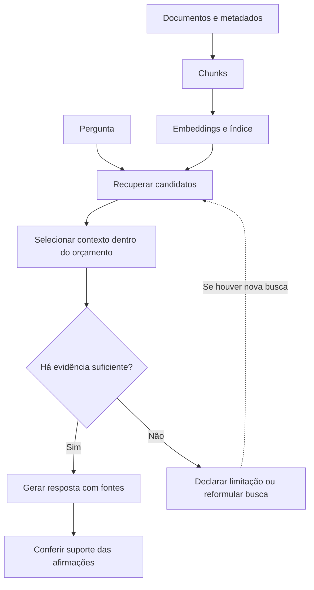
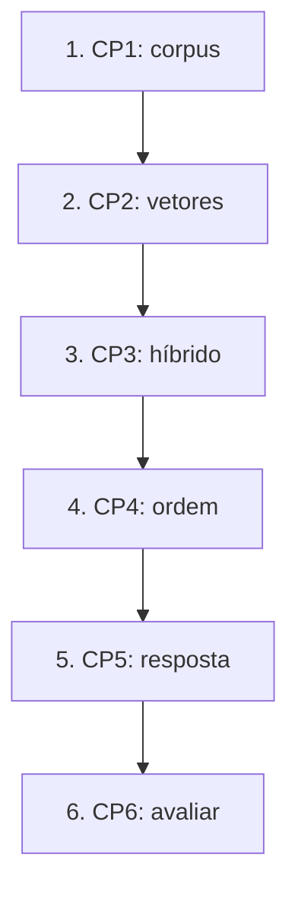
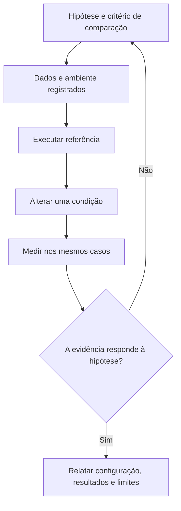
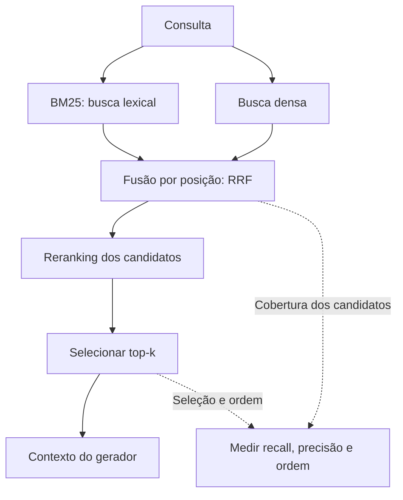

# Especificação de slides — Aula 20 (V2)

> **Rebalanceamento V2 — aula de laboratório (§6-bis do contrato).** Num lab a matemática **é** a
> prática: o aluno implementa a métrica e depois lê o número que ela devolveu. Inverter "aplicação
> antes de teoria" aqui seria redundante. Por isso o **roteiro prático não foi reordenado** — setup,
> demo e os seis checkpoints permanecem na ordem que funciona em bancada, minuto a minuto. Três
> mudanças:
>
> 1. **Cada checkpoint abre pelo comportamento esperado** — a linha exata que a célula de teste
>    imprime, o que o teste conferiu para poder imprimi-la, ou a tabela que o notebook gera — e só
>    depois nomeia o que implementar.
> 2. **A Parte 2 é nova:** um apêndice com o fundamento formal do que o aluno mede. Três itens,
>    organizados **por checkpoint** e não por tópico.
> 3. **Cada ponto formal do fluxo ganhou um ponteiro** para o item correspondente, em uma linha, sem
>    interromper a prática.
>
> Carga horária (120 min), numeração e títulos dos slides do fluxo, checkpoints, entregável e
> objetivos de aprendizagem: **idênticos à V1**.
>
> **Mapa checkpoint → apêndice:**
> ```
> Checkpoint 1   —          (chunking: o fundamento é da Aula 18; nada de novo a recolher)
> Checkpoint 2   —          (cosseno e normalização L2: apêndice da Aula 18)
> Checkpoint 3   —          (BM25 e RRF: apêndice da Aula 19, itens A.1 e A.3 de lá)
> Checkpoint 4 → A.2        (o teto lido na tabela deles, e o custo em inferências)
> Checkpoint 5   —          (validação de citação: é regex, não é matemática)
> Checkpoint 6 → A.1, A.2, A.3
> ```
> **A teoria de recuperação foi dada nas Aulas 18 e 19 e este deck não a rederiva.** As definições
> de `recall@k`, `precision@k`, MRR e nDCG, com a identidade que liga as duas primeiras e um exemplo
> numérico resolvido de três consultas, estão em **A.2 da Aula 19**. A demonstração de que o
> `recall@k_ret` do primeiro estágio é um teto para o sistema inteiro está em **A.4 da Aula 19**. O
> BM25 e o RRF estão nos dois primeiros itens do apêndice de lá. Este apêndice acrescenta **três
> coisas que só existem porque hoje há medição na tela**: as métricas calculadas sobre as 18
> consultas deste lab, a leitura da assimetria `recall@3` × `recall@10` na tabela do aluno, e o
> tamanho de amostra que a diferença medida exigiria para não ser ruído.

<!-- SLIDE-FLOW:GUIDE:BEGIN -->
## Fluxogramas na produção dos slides

As orientações abaixo complementam o campo **Visual** dos slides indicados. Produzir os fluxogramas no próprio deck, como formas e conectores editáveis ou gráficos vetoriais; a biblioteca completa ao final torna esta especificação independente do portal.

- **Referência de composição:** título e propósito no topo, blocos numerados, conexões rotuladas, ramificações legíveis e uma saída identificada. Usar apenas o padrão visual da referência fornecida, sem importar seu assunto ou seus exemplos.
- **Tema do deck:** manter o fundo escuro e a paleta já especificada para a aula. Usar `#5b8cff` para o trecho ativo, tons neutros para o contexto e `#e2231a` conforme o significado definido no deck. Cor sempre acompanhada de rótulo.
- **Leitura:** entrada no topo ou à esquerda; saída na base ou à direita. Decisões em losangos, alternativas com rótulos e retornos apontando à etapa correta. Ramos paralelos convergem apenas onde seus resultados realmente são combinados.
- **Densidade:** no fluxo principal, projetar 3–6 blocos curtos por enquadramento, com corpo legível na última fileira. Um mapa maior pode ser revelado por etapas no mesmo slide. Detalhes, condições e explicações completas ficam nas notas; não reduzir a fonte para caber tudo.
- **Semântica:** mapas de percurso mostram ordem de estudo, não execução de um algoritmo. Manter separadas preparação e aplicação, treino e inferência, sequência e alternativas. Não transformar uma etapa opcional em obrigatória.
- **Integração:** o fluxograma substitui uma lista redundante ou ocupa o campo Visual; não cobre matrizes, tabelas, gráficos nem código indispensáveis. Preservar títulos, numeração, duração e referências aos apêndices.
- **Produção:** os blocos Mermaid abaixo são especificações do desenho. Renderizar/reconstruir como diagrama, nunca projetar o código Mermaid. Manter rótulos, bifurcações, retornos e limites declarados. Não transformar este caderno técnico em slides adicionais.
- **Ligação com o portal:** os mapas de mecanismo compartilham o conteúdo dos fluxogramas do portal. Em demonstrações, usar o mesmo vocabulário no deck e no controle interativo para facilitar a passagem entre os dois.
<!-- SLIDE-FLOW:GUIDE:END -->

## Diretrizes visuais

- **Tema:** escuro, accent `#e2231a` (vermelho CESAR), accent secundário `#5b8cff`.
- **Tipografia:** sans-serif para texto; monoespaçada para código, nomes de função, identificadores de documento (`Art. 42`, `PRG-2025-014`) e nomes de métrica.
- **Densidade:** máximo 5 linhas de texto por slide no fluxo. Um conceito por slide.
- **Proibido:** bullets genéricos; slide-parede de texto; clipart; tabela de métrica sem `k` e sem o número de consultas; código que ninguém vai ler de longe.
- **Este é um deck de laboratório, não de teoria.** A teoria está nas Aulas 18 e 19. Cada slide responde a uma de três perguntas operacionais: *o que estou montando agora*, *como sei que está certo*, *o que entrego*. Nenhum slide reintroduz conceito — quando um conceito reaparece, ele aparece como armadilha de implementação.
- **Slide de checkpoint tem moldura fixa e idêntica, e a primeira linha é o observável**, não a instrução: título com o número do checkpoint, relógio no canto superior direito, *a linha que a tela imprime quando está certo* e o que o teste conferiu para imprimi-la, depois o que implementar (nomes reais de função), a armadilha num cartão em accent, e o ponteiro `→ Apêndice A.n` quando houver. Seis slides com a mesma moldura — a repetição é intencional, é o que dá ritmo ao lab.
- **Deck de laboratório fica projetado enquanto a turma trabalha.** Cada slide de checkpoint precisa ser legível do fundo da sala e conter o critério de conclusão e o relógio — o aluno olha para a parede quando trava, não para o instrutor.
- **Toda métrica na tela vem com `k` e com `|Q|`.** Nunca "recall alto"; sempre `recall@3 = 0,83 (|Q| = 18, vetorizador declarado)`.
- **Fórmulas:** renderizar como bloco destacado em monoespaçada, não como imagem de baixa resolução.
- **No apêndice:** densidade alta é esperada e desejável. É material de consulta, lido em casa com o notebook ao lado e com o relatório por escrever.

## Arco narrativo

O deck é o painel de instrumentos de duas horas de código. Abre cobrando a promessa da Aula 19 — o entregável é uma tabela, não um chatbot —, tira do caminho os dois riscos operacionais (download do modelo e chave de API) mostrando que cinco dos seis checkpoints não chamam LLM, e desenha o mapa antes de qualquer linha, apresentando cada checkpoint pela linha que ele imprime. Do slide 5 ao 10, cada slide é um checkpoint na mesma moldura: chunking com metadados, índice denso, fusão por posição, reranking, citação validada e, por fim, a medida. O clímax é a segunda tabela do slide 10, onde `recall@3` se move e `recall@10` fica idêntico — "o reranking não inventa documento" convertido em número pelo próprio aluno. Fecha guardando o módulo de busca para o Lab 7 e passando a decisão de buscar para o modelo, que é a Aula 21.

A Parte 2 não se apresenta em aula. Ela existe porque este lab produz **duas tabelas e uma recomendação**, e quem vai escrever o relatório precisa de três coisas que não caberiam na parede: a conta de cada métrica sobre as 18 consultas dele, a razão pela qual uma coluna da tabela é uma identidade e a outra é uma medição, e o número de consultas que a diferença medida exigiria para valer como evidência.

---

# PARTE 1 — FLUXO DA AULA

*O que se apresenta em aula. 11 slides, 120 minutos com demo e seis checkpoints. Ordem prática
preservada da V1, slide a slide, com os mesmos títulos.*

## Slides

### Slide 1 — Abertura: hoje o RAG sai do slide e vira número

<!-- SLIDE-FLOW:SLIDE:BEGIN -->
- **Fluxograma a incorporar neste slide:** **F00 — RAG: do acervo à resposta com fontes**. O desenho e os rótulos completos estão no caderno de fluxogramas ao final deste arquivo.
- **Composição:** integrar ao campo Visual; preservar exemplos, tabelas, fórmulas e dimensões solicitados neste slide. Destacar o trecho relacionado ao título e manter o restante em segundo plano. Os textos detalhados ficam nas notas, sem duplicar a lista de Conteúdo na tela.
<!-- SLIDE-FLOW:SLIDE:END -->

- **Tipo:** título
- **Título:** Lab 5 — Pipeline RAG completo, e medido
- **Frase-tese:** Duas aulas de slide sobre recuperação. Hoje o resultado é uma tabela com `recall@k` de três estratégias — e a tabela é o entregável, não o chatbot.
- **Conteúdo:** A trilha das duas aulas anteriores em uma linha cada: Aula 18, as nove etapas do pipeline e o chunking; Aula 19, duas famílias complementares, RRF, e o teto do `recall@k_ret`. Fecho: hoje isso vira um pipeline de ponta a ponta e duas tabelas.
- **Visual:** duas caixas em cinza (A18 → A19) apontando para uma terceira em accent, rotulada "A20 — o pipeline e a medida". Dentro da terceira, um ícone de tabela, não de robô de chat.
- **Notas do apresentador:** 5 min. Roteiro slide 1. Chegar com o cache do modelo de embedding num `.zip` no pendrive — 30 downloads simultâneos é o risco número um do lab. Não abrir `codigo/solucao/`. Mencionar em trinta segundos que o deck tem apêndice (A.1 a A.3) com a conta por trás dos números do Checkpoint 6.

### Slide 2 — Setup, corpus embutido e modo degradado

<!-- SLIDE-FLOW:SLIDE:BEGIN -->
- **Fluxograma a incorporar neste slide:** **F00 — RAG: do acervo à resposta com fontes**. O desenho e os rótulos completos estão no caderno de fluxogramas ao final deste arquivo.
- **Composição:** integrar ao campo Visual; preservar exemplos, tabelas, fórmulas e dimensões solicitados neste slide. Destacar o trecho relacionado ao título e manter o restante em segundo plano. Os textos detalhados ficam nas notas, sem duplicar a lista de Conteúdo na tela.
<!-- SLIDE-FLOW:SLIDE:END -->

- **Tipo:** dados
- **Título:** O que já está dentro do notebook
- **Conteúdo:** Três fatos operacionais, em monoespaçada:
  ```
  CAMINHO_CORPUS = None      -> usa o corpus embutido (16 dispositivos)
  MODELO_EMBEDDING = "paraphrase-multilingual-MiniLM-L12-v2"   (CPU, ~1 s/20 chunks)
  fallback automático       -> VetorizadorLexico (numpy puro, sem download)
  índice: Chroma -> FAISS -> matriz numpy     (a interface é a mesma)
  chave de API: OPCIONAL — só o Checkpoint 5 usa modelo de linguagem
  ```
  Regra em destaque: o relatório **declara** qual vetorizador e qual reranker produziram os números.
- **Frase-tese:** Cinco dos seis checkpoints não chamam modelo de linguagem nenhum.
- **Visual:** duas colunas de cartões — "caminho completo (com download)" e "modo degradado (sem rede)" — com os mesmos campos preenchidos nos dois, para deixar claro que o lab fecha nos dois casos. Rodapé em accent: "corpus fictício — regulamento inventado para a aula, não é de instituição real".
- **Fundamento:** com vetores normalizados em norma 1, o produto escalar `u·v` **é** o cosseno do ângulo — é essa identidade que autoriza o notebook a trocar uma chamada de similaridade por uma multiplicação de matriz, e é por isso que a normalização tem de acontecer nos **dois** lados.
  → o cosseno, a normalização L2 e o que o treino contrastivo muda estão derivados no apêndice da Aula 18, e não se repetem neste deck
- **Notas do apresentador:** Rodar a primeira célula junto com a turma e ler a saída em voz alta. Se mais de um terço cair no modo degradado, distribuir o `.zip` do cache agora, não no meio do CP2.

### Slide 3 — O mapa: seis checkpoints e o que eu recolho

<!-- SLIDE-FLOW:SLIDE:BEGIN -->
- **Fluxograma a incorporar neste slide:** **F01 — O percurso desta aula**; **F02 — Laboratório: da hipótese à evidência**. O desenho e os rótulos completos estão no caderno de fluxogramas ao final deste arquivo.
- **Composição:** integrar ao campo Visual; preservar exemplos, tabelas, fórmulas e dimensões solicitados neste slide. Destacar o trecho relacionado ao título e manter o restante em segundo plano. Os textos detalhados ficam nas notas, sem duplicar a lista de Conteúdo na tela.
- **Momento de exibição:** apresentar o fluxo preenchido na discussão ou conferência, depois da tentativa da turma; durante a atividade, ocultar as etapas que entregariam a solução.
<!-- SLIDE-FLOW:SLIDE:END -->

- **Tipo:** diagrama
- **Título:** Duas horas, seis checkpoints, duas tabelas
- **Conteúdo:** Os seis checkpoints com relógio e **o que a tela imprime** quando está certo:
  ```
  CP1  00:35–00:48  chunking com metadados   -> "Checkpoint 1 OK — 20 chunks, prefixo presente"
  CP2  00:48–01:05  índice + retrieval denso -> "Checkpoint 2 OK — 20 vetores em <backend>"
  CP3  01:15–01:24  BM25 + combinar_rrf      -> "Checkpoint 3 OK — RRF confere" + 2 posições
  CP4  01:24–01:32  reordenar                -> "Checkpoint 4 OK — 10 inferências"      (A.2)
  CP5  01:32–01:40  responder + citar        -> "Checkpoint 5 OK — 4 casos verificados"
  CP6  01:40–01:50  18 consultas rotuladas   -> as DUAS tabelas               (A.1/A.2/A.3)
  ```
  Caixa em accent, em corpo grande: **"Montei um chatbot que responde" não cumpre o critério deste lab.** O entregável é o número: conjunto rotulado, `recall@k` das três estratégias, e a mesma tabela antes e depois do reranking.
- **Frase-tese:** O entregável de hoje é um número.
- **Visual:** trilha vertical de seis estações com relógio à esquerda; as estações CP1–CP2 antes de uma faixa de intervalo, CP3–CP6 depois. A estação CP6 com o dobro do peso visual e ligada por uma seta à caixa do entregável. A coluna `(A.n)` em cinza discreto — é ponteiro de estudo, não tarefa de sala. Ao lado do CP6, um ícone de tabela; ao lado do "chatbot", nada — o contraste é o recado.
- **Notas do apresentador:** Dizer a ordem de sacrifício se o tempo estourar: o CP5 vai para casa antes do CP6, e o CP6 não sai da aula por nenhum motivo. Solução de CP1 e CP2 liberada às 00:48 e 01:05. A coluna do apêndice se explica em uma frase: "cada item tem a conta por trás de um número da tabela final; ninguém precisa disso hoje, e todo mundo vai querer isso na hora de escrever o relatório".


### Slide 4 — [Demo] O RAG mínimo em nove linhas

<!-- SLIDE-FLOW:SLIDE:BEGIN -->
- **Fluxograma a incorporar neste slide:** **F00 — RAG: do acervo à resposta com fontes**. O desenho e os rótulos completos estão no caderno de fluxogramas ao final deste arquivo.
- **Composição:** integrar ao campo Visual; preservar exemplos, tabelas, fórmulas e dimensões solicitados neste slide. Destacar o trecho relacionado ao título e manter o restante em segundo plano. Os textos detalhados ficam nas notas, sem duplicar a lista de Conteúdo na tela.
<!-- SLIDE-FLOW:SLIDE:END -->

- **Tipo:** transição para demonstração
- **Título:** Nove linhas, e o RAG está de pé
- **Frase-tese:** É por caber em nove linhas que a internet está cheia de RAG que ninguém mediu.
- **Conteúdo:** As nove linhas do pipeline ingênuo, em monoespaçada, sem resultado — o resultado aparece ao vivo:
  ```
  chunks  = [d["texto"] for d in DOCUMENTOS]
  M       = embed(chunks)                     # (16, 384), normalizado
  q       = embed(["posso desistir de uma matéria..."])[0]
  top3    = np.argsort(-(M @ q))[:3]
  ```
  Abaixo, as duas consultas da demo: uma paráfrase e um identificador (`PRG-2025-014`). E, no canto, o número que vai sair no fim: `recall@1 = 1/2 = 0,50 (|Q| = 2)`.
- **Visual:** slide quase vazio, código em monoespaçada grande e centralizado, com dois marcadores à direita esperando resultado: "paráfrase → ?" e "identificador → ?". No rodapé, uma caixa vazia rotulada `recall@1 (|Q| = 2)`, que o instrutor preenche à mão no fim da demo.
- **Fundamento:** avaliar recuperação não exige biblioteca: exige gabarito. Com um relevante por consulta, `recall@1` é a fração das consultas em que o documento certo ficou em primeiro — duas consultas, um acerto, `0,50`. E com `|Q| = 2` cada consulta vale **50 pontos percentuais**, que é a versão exagerada do aviso que o notebook imprime no CP6 com `|Q| = 18`.
  → a mesma conta feita sobre as 18 consultas do lab, com as três métricas resolvidas linha a linha: **Apêndice A.1** (slide 12)
- **Notas do apresentador:** Passos na Parte 2 do roteiro. Escrever em células novas ao fim do notebook e **apagar** antes de soltar a turma. Se o modelo não carregar, rodar em modo léxico e comentar a inversão dos pontos cegos. Não conduzir conta nenhuma aqui.

### Slide 5 — Checkpoint 1 — Chunking com metadados

<!-- SLIDE-FLOW:SLIDE:BEGIN -->
- **Fluxograma a incorporar neste slide:** **F00 — RAG: do acervo à resposta com fontes**. O desenho e os rótulos completos estão no caderno de fluxogramas ao final deste arquivo.
- **Composição:** integrar ao campo Visual; preservar exemplos, tabelas, fórmulas e dimensões solicitados neste slide. Destacar o trecho relacionado ao título e manter o restante em segundo plano. Os textos detalhados ficam nas notas, sem duplicar a lista de Conteúdo na tela.
- **Momento de exibição:** apresentar o fluxo preenchido na discussão ou conferência, depois da tentativa da turma; durante a atividade, ocultar as etapas que entregariam a solução.
<!-- SLIDE-FLOW:SLIDE:END -->

- **Tipo:** código (moldura de checkpoint)
- **Título:** CP1 · 00:35–00:48 · Um chunk por dispositivo, com etiqueta dentro
- **Conteúdo:**
  **Quando está certo, a tela imprime isto:**
  ```
  Checkpoint 1 OK — 20 chunks, metadado íntegro, prefixo presente
  ```
  e o teste terá conferido cinco coisas, cada uma apontando para um erro diferente:
  ```
  1  20 chunks a partir de 16 dispositivos   (parágrafo é chunk próprio: 16 + 4)
  2  nenhum chunk sem o campo `dispositivo`  (sem ele não há como casar com o gabarito)
  3  nenhum `dispositivo` duplicado          (duplicata quebra a contagem do CP6)
  4  nenhum chunk acima de 900 caracteres    (LIMITE_CHUNK)
  5  prefixo contextual presente em texto_para_indexar de TODOS
  ```
  O que implementar, com os nomes reais:
  ```
  fatiar_por_dispositivo(documentos) -> list[dict]
      {"fonte", "capitulo", "dispositivo", "titulo", "texto"}
  texto_para_indexar(chunk) -> str
      "Regulamento · CAPÍTULO III · Art. 42 — Do trancamento: <texto>"
  ```
- **Frase-tese:** Texto e etiqueta no mesmo objeto, sempre.
- **Visual:** no topo, o critério de conclusão em caixa destacada (a linha do OK e as cinco verificações numeradas). Abaixo à esquerda, um dispositivo do regulamento com `§ 1º` destacado e a seta mostrando que ele se separa em dois chunks. À direita, o cartão de armadilha em accent: "metadado em lista paralela + reordenação = tabela plausível e errada no CP6". Relógio `00:35–00:48` no canto.
- **Notas do apresentador:** Pedir para ver o `print` de um chunk, não perguntar se está funcionando. Quem chunkou sem parágrafo tem 16 e não 20. Este checkpoint não tem item de apêndice: o fundamento de chunking é da Aula 18, e aqui o que existe é disciplina de estrutura de dados.

### Slide 6 — Checkpoint 2 — Indexar e buscar por vetor

<!-- SLIDE-FLOW:SLIDE:BEGIN -->
- **Fluxograma a incorporar neste slide:** **F02 — Laboratório: da hipótese à evidência**. O desenho e os rótulos completos estão no caderno de fluxogramas ao final deste arquivo.
- **Composição:** integrar ao campo Visual; preservar exemplos, tabelas, fórmulas e dimensões solicitados neste slide. Destacar o trecho relacionado ao título e manter o restante em segundo plano. Os textos detalhados ficam nas notas, sem duplicar a lista de Conteúdo na tela.
- **Momento de exibição:** apresentar o fluxo preenchido na discussão ou conferência, depois da tentativa da turma; durante a atividade, ocultar as etapas que entregariam a solução.
<!-- SLIDE-FLOW:SLIDE:END -->

- **Tipo:** código (moldura de checkpoint)
- **Título:** CP2 · 00:48–01:05 · O índice é detalhe; o espaço vetorial não é
- **Conteúdo:**
  **Quando está certo, a tela imprime isto:**
  ```
  Checkpoint 2 OK — 20 vetores em <chroma|faiss|matriz>
  ```
  e o teste terá conferido três coisas:
  ```
  1  número de vetores do índice == número de chunks
  2  buscar_denso devolve exatamente k resultados, score DECRESCENTE,
     e cada item é o dicionário do chunk (com `dispositivo`), não um índice numérico
  3  consulta de controle (paráfrase do trancamento) traz `Art. 42` no top-3
  ```
  O que implementar:
  ```
  construir_indice(chunks)          -> vetoriza texto_para_indexar(c), normaliza
  buscar_denso(consulta, k=5)       -> [(chunk, score)] ordenado por score desc.
  ```
  Regra em destaque: **mesmo vetorizador, mesma normalização, nos dois lados.** Com norma 1, produto escalar é cosseno.
- **Frase-tese:** Vetorizar consulta e documento com modelos diferentes é o bug que nunca levanta exceção.
- **Visual:** no topo, o critério (a linha do OK e as três verificações). Abaixo, três caixas empilhadas (Chroma · FAISS · matriz `numpy`) atrás de uma única fachada rotulada `buscar_denso(consulta, k)` — a mensagem é que o backend é intercambiável. Cartão de armadilha: "vetorizou `chunk['texto']` cru → o CP1 foi para o lixo em silêncio".
- **Notas do apresentador:** Se a consulta de controle falhar, pedir o `print` do que foi vetorizado antes de olhar o `buscar_denso`. Solução liberada às 01:05, junto com o intervalo.

### Slide 7 — Checkpoint 3 — BM25 e fusão por posição

<!-- SLIDE-FLOW:SLIDE:BEGIN -->
- **Fluxograma a incorporar neste slide:** **F03 — Busca híbrida: ramificar, fundir, reordenar**. O desenho e os rótulos completos estão no caderno de fluxogramas ao final deste arquivo.
- **Composição:** integrar ao campo Visual; preservar exemplos, tabelas, fórmulas e dimensões solicitados neste slide. Destacar o trecho relacionado ao título e manter o restante em segundo plano. Os textos detalhados ficam nas notas, sem duplicar a lista de Conteúdo na tela.
- **Momento de exibição:** apresentar o fluxo preenchido na discussão ou conferência, depois da tentativa da turma; durante a atividade, ocultar as etapas que entregariam a solução.
<!-- SLIDE-FLOW:SLIDE:END -->

- **Tipo:** código (moldura de checkpoint)
- **Título:** CP3 · 01:15–01:24 · RRF: entra posição, sai posição
- **Conteúdo:**
  **Quando está certo, a tela imprime isto:**
  ```
  Checkpoint 3 OK — RRF confere no caso calculado à mão
    denso   top-5: [...]
    híbrido top-5: [...]
    Edital PRG-2025-014: #>5 no denso  ->  #1 no híbrido
  ```
  e o teste terá conferido três coisas:
  ```
  1  o caso pequeno bate em ORDEM      ([0, 2, 1, 3])
  2  o caso pequeno bate em PONTUAÇÃO  (doc0 = 1/61 + 1/62; doc3 = 1/63)
  3  na consulta com identificador, o alvo está no top-2 do híbrido
     E em posição igual ou melhor que no denso
  ```
  O BM25 vem pronto (é o da Aula 19, com `k₁ = 1,5` e `b = 0,75` visíveis). O TODO é um só:
  ```
  combinar_rrf(rankings, k=60) -> list[int]
      RRF(d) = Σ_i 1 / (k + rank_i(d))        rank começa em 1
  ```
- **Frase-tese:** Nenhum score entra nessa conta.
- **Visual:** no topo, o critério (as quatro linhas de saída e as três verificações). Abaixo, duas colunas de posições (denso e BM25) convergindo para uma terceira, com o documento `PRG-2025-014` subindo de fora do top-5 no denso e 1º no BM25 para 1º no fundido. Cartão de armadilha: "passar score onde a função espera posição → número bonito, significado nenhum".
- **Fundamento:** a soma `Σ_i 1/(k + rank_i(d))` só olha **posições**, e por isso é invariante a qualquer transformação monotônica dos scores — é o que dispensa calibrar escala entre um cosseno em `[-1,1]` e um score BM25 sem teto. A constante `k = 60` é o amortecimento: ela decide o quanto o 1º lugar vale a mais que o 2º, e a verificação 2 do teste a fixa em números (`1/61` contra `1/62`).
  → derivação completa do RRF, com o efeito de `k` sobre o peso relativo das posições e a comparação com fusão por score normalizado: **A.3 da Aula 19**. O BM25 com `k₁` e `b` está no primeiro item do apêndice de lá. Nada disso se rederiva neste deck
- **Notas do apresentador:** Checkpoint mais rápido e de maior retorno emocional do lab — a turma vê o híbrido consertar o caso que estava errado há uma hora. Usar essa energia para empurrar o CP4. Se aparecer a pergunta "de onde vem o 60", resposta de uma frase (Parte 4 do roteiro) e seguir.

### Slide 8 — Checkpoint 4 — Reranking e a conta de inferências

<!-- SLIDE-FLOW:SLIDE:BEGIN -->
- **Fluxograma a incorporar neste slide:** **F03 — Busca híbrida: ramificar, fundir, reordenar**. O desenho e os rótulos completos estão no caderno de fluxogramas ao final deste arquivo.
- **Composição:** integrar ao campo Visual; preservar exemplos, tabelas, fórmulas e dimensões solicitados neste slide. Destacar o trecho relacionado ao título e manter o restante em segundo plano. Os textos detalhados ficam nas notas, sem duplicar a lista de Conteúdo na tela.
- **Momento de exibição:** apresentar o fluxo preenchido na discussão ou conferência, depois da tentativa da turma; durante a atividade, ocultar as etapas que entregariam a solução.
<!-- SLIDE-FLOW:SLIDE:END -->

- **Tipo:** código (moldura de checkpoint)
- **Título:** CP4 · 01:24–01:32 · A saída é uma permutação da entrada
- **Conteúdo:**
  **Quando está certo, a tela imprime isto:**
  ```
  Checkpoint 4 OK — 10 inferências em N,NNs  (<reranker declarado>)

    posição antes   posição depois   dispositivo
    #1              #3               Art. 41
    #4              #1               Art. 42
    ...
  ```
  e o teste terá conferido duas coisas:
  ```
  1  a saída é PERMUTAÇÃO EXATA da entrada  (mesmo tamanho, mesmo conjunto)
  2  o contador de inferências == k_ret == 10
  ```
  O que implementar e os números do estágio:
  ```
  reordenar(consulta, candidatos) -> candidatos reordenados
      pares = [(consulta, texto_para_indexar(c)) for c in candidatos]
  k_ret = 10   ->   k_final = 3   ->   10 inferências por consulta
  ```
- **Frase-tese:** Se apareceu documento novo ali, vocês escreveram um buscador, não um reordenador.
- **Visual:** no topo, o critério (a linha do OK e as duas verificações). Abaixo, dez cartões numerados entrando à esquerda e os **mesmos** dez saindo à direita em ordem diferente, com linhas cruzadas ligando cada um ao seu par. Rodapé com a conta de escala: `10 chunks = 10 inferências · 10 000 chunks = 10 000 inferências`. Cartão de armadilha: "cross-encoder não baixou → reranker de brinquedo, e o relatório declara isso".
- **Fundamento:** a verificação 1 não é burocracia: ela é a **premissa** do teorema do teto. Se a saída do reranker é uma permutação do conjunto de candidatos, então o conjunto entregue ao gerador é um subconjunto do conjunto recuperado — e daí sai, sem nenhuma hipótese sobre o modelo, que o `recall@k_ret` do primeiro estágio é um limite superior para o recall do sistema inteiro. É a diferença entre reordenar e buscar, escrita como inclusão de conjuntos.
  → a demonstração e a condição de igualdade estão em **A.4 da Aula 19**; a leitura disso na tabela do CP6, a decomposição do `Δ recall@3` e o custo em inferências de cada escolha de `k_ret`: **Apêndice A.2** (slide 13)
- **Notas do apresentador:** Perguntar em voz alta quantas inferências seriam num acervo de 10 mil chunks. Quem estiver no reranker de brinquedo registra isso no notebook agora, não na hora do relatório — e precisa saber de antemão que o `Δ recall@3` pode vir negativo no CP6, o que é resultado e não bug.

### Slide 9 — Checkpoint 5 — Responder citando as fontes

<!-- SLIDE-FLOW:SLIDE:BEGIN -->
- **Fluxograma a incorporar neste slide:** **F00 — RAG: do acervo à resposta com fontes**. O desenho e os rótulos completos estão no caderno de fluxogramas ao final deste arquivo.
- **Composição:** integrar ao campo Visual; preservar exemplos, tabelas, fórmulas e dimensões solicitados neste slide. Destacar o trecho relacionado ao título e manter o restante em segundo plano. Os textos detalhados ficam nas notas, sem duplicar a lista de Conteúdo na tela.
- **Momento de exibição:** apresentar o fluxo preenchido na discussão ou conferência, depois da tentativa da turma; durante a atividade, ocultar as etapas que entregariam a solução.
<!-- SLIDE-FLOW:SLIDE:END -->

- **Tipo:** código (moldura de checkpoint)
- **Título:** CP5 · 01:32–01:40 · Citação é verificável por código
- **Conteúdo:**
  **Quando está certo, a tela imprime isto:**
  ```
  Checkpoint 5 OK — 4 casos de citação verificados (<api|extrativo>)

    resposta gerada:
      ...
    citações válidas: True
  ```
  e o teste terá conferido: os `k_final = 3` chunks presentes no prompt **com identificador e
  texto**, a regra de formato `[fonte: …]` explicada no prompt, e a `validar_citacoes` aprovando o
  caso bom e reprovando os ruins.

  O que implementar:
  ```
  montar_prompt(consulta, chunks)      -> contexto com os IDs + regras de citação
  validar_citacoes(resposta, chunks)   -> bool   (regex de [fonte: ...])
  ```
  Os casos de teste, e o que cada um significa:
  - cita documento **do contexto** → válido
  - cita documento que existe no corpus mas **não estava no contexto** → respondeu de memória
  - cita identificador **inexistente** → inventou a etiqueta
- **Frase-tese:** Citar um documento que existe mas não estava no contexto é o modelo respondendo de memória com aparência de fonte.
- **Visual:** no topo, o critério (a linha do OK e a linha `citações válidas`). Abaixo, três cartões de resposta lado a lado, um com selo verde e dois com selo em accent, cada um com o `[fonte: …]` destacado no texto. Rodapé: "sem chave → resposta extrativa: baixa fluência, citação perfeita". Aviso em accent: "chave por `getpass`, nunca no código".
- **Notas do apresentador:** Comparar a citação com os chunks **do contexto**, não com o corpus inteiro — é o erro conceitual do checkpoint. Se o tempo estourou, este vai para casa e a sala vai para o CP6. Este checkpoint não tem item de apêndice: validar citação é regex e conjunto, não estatística.

### Slide 10 — Checkpoint 6 — As dezoito consultas e a tabela

<!-- SLIDE-FLOW:SLIDE:BEGIN -->
- **Fluxograma a incorporar neste slide:** **F02 — Laboratório: da hipótese à evidência**. O desenho e os rótulos completos estão no caderno de fluxogramas ao final deste arquivo.
- **Composição:** integrar ao campo Visual; preservar exemplos, tabelas, fórmulas e dimensões solicitados neste slide. Destacar o trecho relacionado ao título e manter o restante em segundo plano. Os textos detalhados ficam nas notas, sem duplicar a lista de Conteúdo na tela.
- **Momento de exibição:** apresentar o fluxo preenchido na discussão ou conferência, depois da tentativa da turma; durante a atividade, ocultar as etapas que entregariam a solução.
<!-- SLIDE-FLOW:SLIDE:END -->

- **Tipo:** dados (moldura de checkpoint)
- **Título:** CP6 · 01:40–01:50 · As duas tabelas que são o entregável
- **Conteúdo:**
  **Quando está certo, não há linha de OK — há duas tabelas impressas pela função do notebook:**
  ```
  TABELA 1   |Q| = 18   vetorizador = ...   backend = ...   k_rrf = 60
  estratégia        recall@1  recall@3  recall@5  precision@3   MRR
  denso                 ...       ...       ...        ...      ...
  BM25                  ...       ...       ...        ...      ...
  híbrido (RRF)         ...       ...       ...        ...      ...

  TABELA 2   |Q| = 18   k_ret = 10   k_final = 3   reranker = ...
  configuração                 recall@3   recall@10
  híbrido                          ...        ...
  híbrido + reranking              ...        ...

  Δ recall@3 = ±0,NNN    (EMPÍRICO: sobe com cross-encoder, pode cair com o de brinquedo)
  recall@10 idêntico? True    (GARANTIDO: o reranker só reordena os k_ret candidatos)
  Aviso de método: com |Q| = 18, uma consulta vale 5,6 pontos percentuais.
  ```
  As três funções a implementar: `recall_em_k`, `precision_em_k`, `mrr`. Composição exigida do
  conjunto: ≥ 1/3 em paráfrase pura, ≥ 3 com identificador ou nome próprio, escritas **antes** de
  usar o sistema. O embutido tem 18 — 12 paráfrases, 3 identificadores, 3 mistas, um relevante cada.
- **Frase-tese:** Reranker ruim estraga a vitrine. Nenhum reranker mexe no estoque.
- **Visual:** no topo, o cabeçalho real das duas tabelas. Abaixo, as tabelas ocupando o slide inteiro, a coluna `recall@10` da Tabela 2 com moldura em accent e a palavra GARANTIDO ao lado; a célula do `Δ recall@3` marcada com `±` e a legenda EMPÍRICO. A terceira saída (recorte por tipo de consulta) num cartão lateral estreito. Nenhum outro elemento gráfico — este slide é a tabela.
- **Fundamento:** as duas colunas da Tabela 2 têm **status lógico diferente**. A coluna `recall@10` é uma **identidade**: o conjunto dos 10 candidatos é o mesmo antes e depois, e `recall@k` só olha quem está no conjunto, não em que posição — então ela não pode mudar, e mudou significa defeito de pipeline. A coluna `recall@3` é uma **medição**: ela mede quantas consultas o reranker resgatou para dentro do top-3 menos quantas ele empurrou para fora, e essa diferença tem sinal empírico.
  → a decomposição do `Δ recall@3` em resgates e perdas, a razão de a coluna `recall@10` ser identidade, e a ordem de depuração que as duas frases impõem: **Apêndice A.2** (slide 13). O teorema está em **A.4 da Aula 19**
- **Fundamento:** com um relevante por consulta, as três métricas se especializam: `recall@k` é a fração das 18 consultas cujo dispositivo entrou no top-`k`; `precision@3` é `recall@3` dividido por 3, e portanto tem **teto aritmético de 0,333** mesmo num sistema perfeito; e o MRR é a média de `1/posição`, com zero para quem não apareceu. As três respondem a perguntas diferentes sobre a mesma lista, e nenhuma substitui as outras.
  → as definições e a identidade que liga recall e precision estão em **A.2 da Aula 19**; a conta completa sobre as 18 consultas deste lab, linha a linha, com os quatro números e a leitura conjunta: **Apêndice A.1** (slide 12)
- **Fundamento:** com 18 consultas a resolução do instrumento é `1/18 = 5,6` pontos percentuais — um `Δ recall@3` de `0,056` é **uma consulta** mudando de lado. E porque as duas configurações rodam **nas mesmas** 18 consultas, a informação do experimento está nas consultas em que elas **discordam**, não na diferença entre as duas taxas.
  → quantas consultas precisariam mudar de lado para a diferença não ser acaso, e quantas consultas rotuladas seriam necessárias para resolver 5 pontos percentuais: **Apêndice A.3** (slide 14)
- **Notas do apresentador:** Este checkpoint não sai da aula. Às 01:48, pedir a duas ou três pessoas o `recall@3` do híbrido em voz alta e anotar a variação — ela vira conversa na Aula 21 sobre 18 consultas ainda ser pouco, e tem resposta escrita em A.3. Fechar com a pergunta: por que a coluna do `recall@10` não mudou?

### Slide 11 — Recolhimento e ponte para a Aula 21
- **Tipo:** encerramento
- **Título:** O que vocês têm agora — e para que isso serve depois
- **Conteúdo:** O inventário em uma linha: chunking com metadados · índice vetorial · BM25 · fusão por posição · reranking de segundo estágio · resposta com citação validada · 18 consultas rotuladas com `recall@k` medido antes e depois. Depois, o checklist de entrega em caixa destacada:
  - ☐ Notebook executado, com saídas visíveis
  - ☐ Tabela 1 (três estratégias, `|Q|` e vetorizador declarados)
  - ☐ Tabela 2 (antes/depois do reranking, `k_ret` e reranker declarados) + a frase sobre a coluna que não mudou
  - ☐ Arquivo das consultas rotuladas
  - ☐ Respostas às 5 questões-guia
  - ☐ Declaração de uso de IA

  E o aviso de continuidade: **guardar `busca.py` e o índice — o agente do Lab 7 (Aula 25) chama essa função como uma de suas ferramentas.** Prazo: 1 semana.
- **Frase-tese:** Hoje vocês construíram um cano que sempre busca. Semana que vem o modelo passa a decidir se busca.
- **Visual:** duas metades. Topo: o checklist de entrega em caixa grande, para a turma fotografar. Base: um diagrama de três caixas — `Lab 5 (busca medida)` → `Lab 6 (o modelo chama ferramentas)` → `Lab 7 (a busca vira ferramenta do agente)` — com a seta do Lab 5 para o Lab 7 desenhada por fora, em accent, e a legenda "nada aqui é descartável". Num canto discreto, o índice do apêndice: A.1 as métricas sobre as 18 consultas · A.2 por que `recall@10` não pode mudar · A.3 quantas consultas a diferença precisa. Rodapé: "Aula 21 — Tool calling e MCP: o modelo pede, o host executa."
- **Notas do apresentador:** 30 s em silêncio no checklist. Projetar o índice do apêndice por 20 s e nomear dois itens: o A.1 é para conferir se a implementação das métricas faz a conta que o aluno pensa que ela faz; o A.3 é o que torna o relatório honesto. Recolher o pulso: quem chegou ao CP6? Se menos da metade, o Lab 6 começa com menos ambição na parte de MCP. Não estourar as duas horas.

---

# PARTE 2 — APÊNDICE MATEMÁTICO

> Material de estudo e consulta. **Não se apresenta em aula**; é distribuído com o deck.
> Organizado **por checkpoint**, não por tópico: um item para cada checkpoint que tenha fundamento
> próprio. Autossuficiente — quem estuda por aqui sem ter feito o lab consegue reconstruir todas as
> contas, e quem fez o lab consegue explicar os próprios números.
>
> **Onde o fundamento já está em outra aula, este apêndice aponta em vez de repetir.** As
> **definições** de `recall@k`, `precision@k`, MRR e nDCG, a identidade `precision@k = recall@k ·
> |R_q| / k` e um exemplo resolvido de três consultas estão em **A.2 da Aula 19**. A
> **demonstração** de que `recall@k_final ≤ recall@k_ret`, com a condição de igualdade e os três
> corolários, está em **A.4 da Aula 19**. O BM25 e o RRF estão nos dois primeiros itens do apêndice
> da Aula 19. Este apêndice acrescenta o que só existe porque hoje há medição na tela: a **conta
> sobre as 18 consultas deste lab** (A.1), a **leitura da tabela antes/depois** (A.2) e o **tamanho
> de amostra** (A.3).

### Slide 12 — A.1 · As quatro métricas sobre as 18 consultas deste lab, resolvidas
- **Tipo:** apêndice — especialização das definições, exemplo numérico completo e erros de implementação
- **Invocado em:** slides 4 e 10 (a demo e o Checkpoint 6)

**Relação com a Aula 19.** As definições gerais — `recall@k`, `precision@k`, MRR, DCG/nDCG —, a
identidade que liga recall e precision, a discussão de macro contra micro e o exemplo resolvido de
três consultas estão em **A.2 da Aula 19**, e não se repetem aqui. O que este item faz é o que
aquele não podia fazer: **especializar as fórmulas para o conjunto rotulado que o notebook traz** e
resolver a conta sobre as 18 consultas, linha a linha, para que o aluno possa conferir se a
implementação dele faz a conta que ele pensa que ela faz.

**Notação.**
`Q` — o conjunto rotulado, com `|Q| = 18`. `q` indexa as consultas.
`R_q` — o conjunto dos dispositivos relevantes para `q`, definido pelo rótulo humano.
`T_k(q)` — a lista dos `k` primeiros dispositivos devolvidos para `q`, **na ordem**.
`r_q ∈ {1, 2, …} ∪ {∞}` — a **posição do dispositivo relevante** na lista devolvida para `q`;
`r_q = ∞` quando ele não aparece até o corte considerado.
`1[·]` — a função indicadora: vale 1 quando a condição é verdadeira, 0 quando é falsa.

**Premissas, e as três são específicas deste conjunto.**
(i) **`|R_q| = 1` para toda consulta.** As 18 consultas embutidas têm exatamente um dispositivo
relevante cada — o campo `relevantes` é uma lista por generalidade, mas neste conjunto ela tem um
elemento. Toda a simplificação abaixo depende disto, e ela **cai** para quem trouxer corpus próprio
com pergunta respondida por dois dispositivos (ver casos-limite).
(ii) **RR truncado em `k`.** `RR(q) = 0` quando o relevante não aparece até `k`. A forma não
truncada procuraria o relevante na lista inteira; as duas formas dão números diferentes e **qual
foi usada tem de ser declarado**.
(iii) **Média macro.** As métricas são a média das métricas por consulta, não a razão de somas.
Com `|R_q| = 1` para todas, macro e micro coincidem em `recall@k` — a diferença só aparece quando os
`|R_q|` variam.
(iv) **Rótulo completo o suficiente:** um dispositivo não rotulado é tratado como irrelevante. Se o
sistema trouxe algo pertinente que ninguém rotulou, as quatro métricas ficam **subestimadas**.

**As definições, especializadas para `|R_q| = 1`.**
Sob a premissa (i), `|R_q ∩ T_k(q)|` só pode valer 0 ou 1, e vale 1 exatamente quando `r_q ≤ k`.
Logo:
```
recall@k(q)    = |R_q ∩ T_k(q)| / |R_q| = 1[ r_q ≤ k ]

recall@k       = (1/18) · Σ_q 1[ r_q ≤ k ]      = (nº de consultas com r_q ≤ k) / 18

precision@k(q) = |R_q ∩ T_k(q)| / k    = 1[ r_q ≤ k ] / k

precision@k    = recall@k / k                    (caso |R_q| = 1 da identidade de A.2/Aula 19)

RR(q)          = 1 / r_q   se r_q ≤ k ;  0  caso contrário

MRR            = (1/18) · Σ_q RR(q)
```
*Leitura das três especializações.* `recall@k` virou **uma contagem dividida por 18** — nada de
frações por consulta, nada de médias ponderadas. `precision@k` virou `recall@k/k`, o que significa
que **ela não é informação nova**: com um relevante por consulta, precisão e recall no mesmo `k` são
o mesmo número em escalas diferentes. E o MRR é a única das três que enxerga **posição**.

*Consequência imediata, e é a armadilha do slide 10.* Com `k = 3` e `|R_q| = 1`:
```
precision@3 ≤ 1/3 = 0,333        para qualquer sistema, inclusive o perfeito
```
Um `precision@3 = 0,28` não é "72% de lixo": é 84% do teto aritmético. Reportar precisão sem dizer
`|R_q|` e `k` é reportar o teto, não o desempenho.

**Exemplo numérico completo — as 18 consultas, resolvidas.**
A tabela abaixo é **ilustrativa**: são as posições do dispositivo relevante numa execução do
pipeline híbrido. Os números da turma serão outros, e é isso que se espera — o que este item fixa é
a **conta**, não o resultado. `∞` significa "não apareceu até a posição 10".

| # | tipo | dispositivo relevante | `r_q` | `1[r≤1]` | `1[r≤3]` | `1[r≤5]` | `1[r≤10]` | `RR` |
|---|---|---|---|---|---|---|---|---|
| 1 | paráfrase | `Art. 42` | 1 | 1 | 1 | 1 | 1 | 1,000 |
| 2 | paráfrase | `Art. 42 § 1º` | 3 | 0 | 1 | 1 | 1 | 0,333 |
| 3 | paráfrase | `Art. 41` | 1 | 1 | 1 | 1 | 1 | 1,000 |
| 4 | identificador | `Edital PRG-2025-014` | 1 | 1 | 1 | 1 | 1 | 1,000 |
| 5 | paráfrase | `Art. 43` | 2 | 0 | 1 | 1 | 1 | 0,500 |
| 6 | paráfrase | `Art. 51` | 1 | 1 | 1 | 1 | 1 | 1,000 |
| 7 | paráfrase | `Art. 51 § 1º` | 5 | 0 | 0 | 1 | 1 | 0,200 |
| 8 | paráfrase | `Art. 52` | 1 | 1 | 1 | 1 | 1 | 1,000 |
| 9 | mista | `Art. 53` | 2 | 0 | 1 | 1 | 1 | 0,500 |
| 10 | paráfrase | `Art. 54` | 1 | 1 | 1 | 1 | 1 | 1,000 |
| 11 | mista | `Art. 60` | 4 | 0 | 0 | 1 | 1 | 0,250 |
| 12 | paráfrase | `Edital PRG-2025-021` | ∞ | 0 | 0 | 0 | 0 | 0,000 |
| 13 | paráfrase | `Art. 66 § 1º` | 1 | 1 | 1 | 1 | 1 | 1,000 |
| 14 | paráfrase | `Art. 66 § 2º` | 3 | 0 | 1 | 1 | 1 | 0,333 |
| 15 | mista | `Art. 67` | 1 | 1 | 1 | 1 | 1 | 1,000 |
| 16 | paráfrase | `Art. 72` | 2 | 0 | 1 | 1 | 1 | 0,500 |
| 17 | identificador | `Art. 73` | 1 | 1 | 1 | 1 | 1 | 1,000 |
| 18 | identificador | `Edital PRG-2024-009` | 1 | 1 | 1 | 1 | 1 | 1,000 |
| | | **somas** | | **10** | **15** | **17** | **17** | **12,617** |

*As contagens, por extenso.* Consultas com `r_q = 1`: as de número 1, 3, 4, 6, 8, 10, 13, 15, 17 e
18 — **dez**. Com `r_q = 2`: as 5, 9 e 16 — **três**. Com `r_q = 3`: as 2 e 14 — **duas**. Com
`r_q = 4`: a 11. Com `r_q = 5`: a 7. Sem aparecer: a 12. Total `10+3+2+1+1+1 = 18`. ✓

*`recall@k`.*
```
recall@1  = 10/18 = 0,5556  ->  0,556
recall@3  = (10+3+2)/18 = 15/18 = 0,8333  ->  0,833
recall@5  = (15+1+1)/18 = 17/18 = 0,9444  ->  0,944
recall@10 = 17/18 = 0,9444  ->  0,944
```
*Conferência da monotonicidade:* `0,556 ≤ 0,833 ≤ 0,944 ≤ 0,944`. Recall é **não decrescente em
`k`** porque `T_k ⊆ T_{k+1}` (A.2 da Aula 19); uma implementação que produza recall caindo com `k`
tem bug de indexação, e essa é a primeira coisa a conferir.

*`precision@3`,* pela especialização `precision@k = recall@k / k`:
```
precision@3 = 0,8333 / 3 = 0,2778  ->  0,278        (teto aritmético: 0,333)
```
*Conferência pela definição direta:* quinze consultas contribuem `1/3` cada e três contribuem `0`,
logo `(15 · 1/3 + 3 · 0)/18 = 5/18 = 0,2778`. ✓ Os dois caminhos têm de dar o mesmo número; se não
derem, o denominador da implementação está trocado.

*MRR.* Somando a coluna `RR`:
```
dez consultas com r=1 :  10 · 1     = 10,0000
três com r=2          :   3 · 1/2   =  1,5000
duas com r=3          :   2 · 1/3   =  0,6667
uma com r=4           :       1/4   =  0,2500
uma com r=5           :       1/5   =  0,2000
uma com r=∞           :         0   =  0,0000
                                       -------
soma                                   12,6167

MRR = 12,6167 / 18 = 0,7009  ->  0,701
```

**Leitura conjunta dos quatro números — e é o que o relatório tem de fazer.**
- `recall@1 = 0,556` contra `recall@3 = 0,833`: **cinco consultas** têm o dispositivo certo nas
  posições 2 ou 3. Esse é o campo de trabalho do reranking — documento presente, mal colocado. É a
  situação da consulta C1 do exemplo de A.2 da Aula 19.
- `recall@10 = 0,944`: **uma** consulta (a 12) não trouxe nada relevante em dez candidatos. Nessa,
  nenhum reranker faz diferença — o conserto é à esquerda, no primeiro estágio. É a situação da
  consulta C2 daquele exemplo. E `0,944` é o **teto** do sistema inteiro com `k_ret = 10`.
- `precision@3 = 0,278` contra o teto `0,333`: o sistema está a 84% do máximo possível nessa
  métrica. Ler `0,278` como fracasso é ler o teto.
- `MRR = 0,701`: a média de `1/posição` é alta porque dez das 18 acertam em primeiro. O MRR é o
  único dos quatro que se moveria se o reranker apenas reordenasse — os `recall@k` com `k ≥ k_ret`
  não se movem nunca (ver **A.2**).
- Notar que a consulta 12 é uma **paráfrase cujo relevante é um edital**: sem termo em comum para o
  BM25 e com identificador que o denso não sabe casar. É o pior caso do conjunto e ele está lá de
  propósito.

**A resolução do instrumento, e o número que o notebook imprime.**
Com `|Q| = 18` e um relevante por consulta, `recall@k` só pode assumir os valores
`0/18, 1/18, …, 18/18`. A menor diferença representável é
```
resolução = 1/|Q| = 1/18 = 0,0556  ->  5,6 pontos percentuais
```
É exatamente o aviso que o notebook imprime embaixo da Tabela 2. Consequência direta: **declarar
melhoria menor que 5,6 pontos percentuais é impossível**, e declarar 5,6 é declarar **uma
consulta**. Quanto disso é ruído está em **A.3**.

**Os quatro erros de implementação que este item detecta.**

*Erro 1 — não tirar a média.* Devolver 18 valores de `recall@3(q)` em vez de um. Sintoma: a tabela
sai com listas nas células. É o erro mais comum e o mais visível.

*Erro 2 — denominador trocado no recall.* Dividir por `|Q|` quando a consulta tem mais de um
relevante, em vez de dividir cada `recall@k(q)` por `|R_q|` antes de mediar. Neste conjunto o erro é
**invisível**, porque `|R_q| = 1` para todas as 18 — e é por isso que ele aparece só em quem traz
corpus próprio, e aparece como número maior que 1 ou como recall estranhamente baixo.

*Erro 3 — descartar as consultas sem acerto do MRR.* Somar `1/r_q` só das consultas que acertaram e
dividir pelo número **delas**. No exemplo acima isso daria `12,6167/17 = 0,742` em vez de `0,701`:
**infla a métrica** e o viés cresce com o número de consultas que falham. A consulta 12 tem de
entrar no denominador com `RR = 0`.

*Erro 4 — comparar `k` diferentes.* Ler `recall@3` de uma configuração contra `recall@5` de outra e
concluir que a segunda é melhor. Como recall é não decrescente em `k`, essa comparação está
**garantida** a favorecer a segunda, independentemente do sistema.

**Casos-limite.**
- **`|R_q| > 1` (corpus próprio).** A especialização cai: `recall@k(q)` volta a ser uma fração em
  `{0, 1/|R_q|, …, 1}`, `precision@k = recall@k · |R_q|/k` deixa de ser `recall@k/k`, e o MRR passa
  a olhar só o **primeiro** relevante — o que faz dele a métrica errada quando o usuário precisa de
  vários trechos. A forma geral está em **A.2 da Aula 19**.
- **`k` maior que o número de chunks.** Com 20 chunks, `recall@20 = 1` trivialmente para toda
  consulta cujo relevante existe no corpus. Não é resultado, é aritmética: o teto de qualquer
  sistema que devolve o acervo inteiro é 1. É a razão de o `k_ret` do lab ser 10 e não 20.
- **Chunk duplicado no índice.** Se o mesmo dispositivo aparece duas vezes, ele ocupa duas posições
  do top-`k` e empurra os outros para baixo: `recall@k` cai por um motivo que não é qualidade de
  recuperação. É o que a verificação 3 do Checkpoint 1 (`dispositivo` sem duplicata) protege.
- **RR não truncado.** Se a busca do relevante vai até o fim da lista de 20, a consulta 12 deixaria
  de contribuir 0 e passaria a contribuir `1/r` com `r > 10`, elevando o MRR de forma artificial. As
  duas formas são defensáveis; misturá-las entre configurações não é.
- **Todas as consultas acertando em primeiro.** `recall@1 = recall@3 = 1` e `MRR = 1`. O conjunto
  deixou de discriminar: ou o sistema é perfeito, ou as consultas foram escritas depois de usar o
  sistema. O segundo caso é o viés do Conceito 8 do plano, e é indistinguível do primeiro **pelos
  números** — só a data em que o arquivo foi escrito o separa.
- **`|Q| = 2` (a demo).** `recall@1 = 0,50` com resolução de 50 pontos percentuais. Ilustra o
  procedimento e não mede o sistema. É o mesmo status do `n = 1` discutido em **A.3 do Lab 3
  (Aula 11)**.

**De volta ao fluxo:** slides 4 e 10.

### Slide 13 — A.2 · Por que o reranking move `recall@3` e não move `recall@k_ret`, e o que depurar primeiro

<!-- SLIDE-FLOW:SLIDE:BEGIN -->
- **Fluxograma a incorporar neste slide:** **F03 — Busca híbrida: ramificar, fundir, reordenar**. O desenho e os rótulos completos estão no caderno de fluxogramas ao final deste arquivo.
- **Composição:** integrar ao campo Visual; preservar exemplos, tabelas, fórmulas e dimensões solicitados neste slide. Destacar o trecho relacionado ao título e manter o restante em segundo plano. Os textos detalhados ficam nas notas, sem duplicar a lista de Conteúdo na tela.
<!-- SLIDE-FLOW:SLIDE:END -->

- **Tipo:** apêndice — identidade, decomposição do delta, tabela de diagnóstico e conta de custo
- **Invocado em:** slides 8 e 10 (Checkpoints 4 e 6)

**Relação com a Aula 19.** O **teorema** está em **A.4 da Aula 19**: sob a única premissa
`F(q) ⊆ C(q)` — o reranker ordena os candidatos e não acessa o acervo —, vale
`recall@k_final ≤ recall@k_ret`, com igualdade se e somente se todos os relevantes presentes em
`C(q)` ficarem entre os `k_final` primeiros. Aquele item traz também os três corolários (a ordem de
diagnóstico, a cegueira do recall a reordenação, e o preço linear de subir o teto). Este item **não
o rederiva**. Ele faz três coisas que o teorema não faz: mostra que no caso do lab a igualdade em
`k_ret` é **exata e não apenas um limite**, decompõe o `Δ recall@3` nas duas contagens que o
produzem, e converte as duas frases numa ordem de depuração e numa conta de inferências.

**Notação.**
`C(q)` — o conjunto de candidatos do primeiro estágio, `|C(q)| = k_ret = 10`.
`σ` — o reranker: uma função que atribui score a cada par `(q, d)` com `d ∈ C(q)` e devolve `C(q)`
**reordenado**. `σ_id` — o reranker identidade, que devolve a ordem do RRF.
`L_σ(q)` — a lista devolvida por `σ`, de comprimento `k_ret`.
`T_k^σ(q)` — os `k` primeiros de `L_σ(q)`.
`ρ_k(σ) = recall@k` medido com o reranker `σ` sobre `Q`.
`b` — número de consultas em que o relevante estava no top-`k` **antes** e saiu **depois** (perdas).
`c` — número de consultas em que ele entrou no top-`k` depois e não estava antes (resgates).

**Premissas.** (i) `σ` é uma **permutação** de `C(q)` — é exatamente o que a verificação 1 do
Checkpoint 4 confere, e é a premissa do teorema; (ii) o primeiro estágio é o mesmo nas duas linhas
da Tabela 2 — mesmo chunking, mesmo vetorizador, mesmo `k_rrf`, mesmo `k_ret`; (iii) um relevante
por consulta, como em **A.1**. A premissa (ii) é a que quebra em silêncio quando alguém reindexa
entre as duas medições, e é o que a coluna `recall@10` detecta.

**Parte 1 · Por que `recall@k_ret` é uma identidade, não uma medição.**
Uma permutação preserva o conjunto. Formalmente, para `k = k_ret`:
```
T_{k_ret}^σ(q) = L_σ(q) = C(q)        (a lista tem k_ret elementos; tomar os k_ret primeiros é tomar todos)
```
Logo, para **qualquer** `σ`:
```
T_{k_ret}^σ(q) = T_{k_ret}^{σ_id}(q)   como CONJUNTOS
⇒  |R_q ∩ T_{k_ret}^σ(q)| = |R_q ∩ T_{k_ret}^{σ_id}(q)|      para toda q
⇒  ρ_{k_ret}(σ) = ρ_{k_ret}(σ_id)                            exatamente
```
∎ Não é "aproximadamente igual", não é "igual dentro do ruído": é **o mesmo número, dígito por
dígito**. É por isso que o notebook testa a igualdade com `abs(...) < 1e-9` e imprime
`recall@10 idêntico? True` com o rótulo **GARANTIDO**.

*O que isso torna a coluna `recall@10`.* Ela deixa de ser uma medição sobre o reranker e passa a ser
um **teste de integridade do pipeline**. Se ela mudou, uma das duas premissas caiu: ou `σ` não é
permutação (devolveu os `k_final` cortados, ou acrescentou documento), ou o primeiro estágio mudou
entre as duas linhas. Nenhuma das duas é ruído estatístico, e nenhuma se resolve rodando de novo.

*E é também o Corolário 2 de A.4 da Aula 19, com um número.* Recall em `k ≥ k_ret` é **cego** a
reordenação. Um reranker excelente pode mostrar zero de diferença nessa coluna. Para **ver** o
trabalho dele é preciso ou uma métrica sensível à posição (MRR, nDCG — **A.2 da Aula 19**) ou medir
recall com `k_final < k_ret`, que é exatamente o `recall@3` da Tabela 2.

**Parte 2 · A decomposição do `Δ recall@3` — e por que o sinal é empírico.**
Para `k = 3 < k_ret`, a permutação **pode** mudar quem está no top-3. Defina, consulta por consulta,
o indicador `1[r_q ≤ 3]` antes e depois. Só quatro casos existem:

|  | depois: dentro do top-3 | depois: fora |
|---|---|---|
| **antes: dentro** | acordo (não move o delta) | **perda** — conta em `b` |
| **antes: fora** | **resgate** — conta em `c` | acordo (não move o delta) |

Somando sobre `Q`:
```
ρ_3(σ) − ρ_3(σ_id) = (c − b) / |Q|
```
∎ **O delta é o saldo entre resgates e perdas, dividido por 18.** Três leituras, e as três aparecem
em sala:
- **`c > b`** — o reranker sobe mais relevantes do que derruba. É o caso do cross-encoder de
  verdade, e o delta é positivo.
- **`c = b`** — ele mexeu a ordem e o saldo deu zero. Delta exatamente nulo com `recall@10` idêntico
  **não** é bug: é um reranker que reordenou dentro do top-3 e fora dele sem cruzar a fronteira, ou
  que trocou um relevante por outro. Conferir se os scores variam de fato antes de suspeitar do
  código.
- **`c < b`** — o reranker **piora**. É o caso do reranker de brinquedo, e é o resultado esperado
  dele: ordenar por sobreposição de termos descarta a informação de posição que o RRF já tinha
  fundido dos dois rankings. Não é erro do aluno; é a medição de um reranker ruim.

*Exemplo numérico, continuando a tabela de A.1.* Antes: `ρ_3 = 15/18 = 0,833`. Suponha que o
cross-encoder resgate as consultas 11 (`r: 4 → 2`) e 7 (`r: 5 → 3`) e perca a 16 (`r: 2 → 4`). Então
`c = 2`, `b = 1`:
```
Δ recall@3 = (2 − 1)/18 = +1/18 = +0,0556        ρ_3(σ) = 16/18 = 0,889
Δ recall@10 = 0                                   ρ_10 = 17/18 = 0,944 nas duas linhas
```
E o MRR, que enxerga posição, também se move — mas pouco:
```
antes:  soma RR = 12,6167                            MRR = 0,7009
depois: −(1/4 + 1/5 + 1/2) + (1/2 + 1/3 + 1/4)
      = 12,6167 − 0,9500 + 1,0833 = 12,7500         MRR = 0,7083
Δ MRR = +0,0074
```
*Leitura desconfortável e importante:* o reranker fez trabalho real em **três** das 18 consultas, e
o efeito agregado é `+0,056` em `recall@3` e `+0,007` em MRR. Nenhum dos dois é distinguível de
ruído com 18 consultas — quanto de amostra seria necessário está em **A.3**. A tabela mostra a
direção; ela não sustenta a afirmação "o reranking melhorou o sistema".

*E com o reranker de brinquedo.* Suponha que ele empurre as consultas 2 (`r: 3 → 6`) e 5
(`r: 2 → 5`) para fora do top-3 e não resgate nada: `c = 0`, `b = 2`:
```
Δ recall@3 = (0 − 2)/18 = −2/18 = −0,111          ρ_3(σ) = 13/18 = 0,722
Δ recall@10 = 0                                    ainda 0,944
```
A conferência de sanidade é a coluna que **não** mudou: `recall@10` idêntico com `recall@3` caindo é
a assinatura exata de "o pipeline está certo e o reranker é ruim". Se as duas tivessem mudado,
seria defeito.

**Parte 3 · A tabela de diagnóstico — quatro combinações, quatro leituras.**

| `recall@k_ret` antes vs. depois | `Δ recall@3` | Leitura, e o que fazer |
|---|---|---|
| **idêntico** | `> 0` | Tudo consistente e o reranker ajuda. Reportar o delta **com o nome do reranker** e com a ressalva de tamanho de amostra (**A.3**) |
| **idêntico** | `= 0` | Pipeline certo; o reranker não cruzou a fronteira do top-3. Conferir se os scores de `σ` variam entre candidatos antes de suspeitar de bug |
| **idêntico** | `< 0` | Pipeline certo, reranker pior que a ordem do RRF. Típico do reranker de brinquedo. **É resultado**, vai para o relatório |
| **diferente** | qualquer | **Defeito de pipeline.** `σ` não é permutação (devolveu `k_final` cortados ou acrescentou documento) ou o estágio 1 mudou entre as duas linhas. Não rodar de novo: conferir a verificação 1 do CP4 |

**Parte 4 · A ordem de depuração é uma consequência, não uma preferência.**
Da desigualdade `ρ_{k_final}(σ) ≤ ρ_{k_ret}` para todo `σ` sai o **contrapositivo** que organiza o
trabalho: se `ρ_{k_ret}` é baixo, então `ρ_{k_final}` é baixo **para qualquer** reranker, qualquer
prompt, qualquer temperatura e qualquer modelo gerador. Logo nenhuma intervenção à direita do
primeiro estágio pode explicar nem consertar o número. A ordem que resta é única:

```
1º  medir  recall@k_ret        -> é o TETO. Baixo aqui = nada à direita resolve.
                                  Conserto: chunking, modelo de embedding, idioma,
                                  acrescentar BM25, aumentar k_ret.
2º  medir  recall@k_final e MRR -> a ORDENAÇÃO. Teto alto e top-3 ruim = problema de σ.
                                  Conserto: reranker melhor, k_final maior, k_ret maior.
3º  só então olhar a resposta   -> ATRIBUIÇÃO. Contexto certo e resposta errada = gerador.
                                  Conserto: prompt, formato de citação, modelo.
```
Inverter esta ordem custa tempo de forma previsível: trocar de modelo gerador quando o teto é 0,60
não pode levar o sistema acima de 0,60, e o experimento não discrimina hipótese nenhuma. **Medir o
teto primeiro não é hábito de pessoa organizada: é a única ordem em que a evidência separa as
causas.** É o Corolário 1 de A.4 da Aula 19, lido como procedimento.

*Onde isso aparece na tabela do lab.* Na execução de A.1, `recall@10 = 0,944` e `recall@3 = 0,833`:
teto alto, ordenação com folga de uma consulta e meia. O sistema está no **regime 2** — o que resta
a ganhar está na ordenação, e é por isso que faz sentido rerankear. Se o teto fosse `0,60`, a
prioridade seria chunking e vetorizador, e o reranking seria perda de tempo com custo.

**Parte 5 · O custo de subir o teto, em inferências.**
`recall@k_ret` é não decrescente em `k_ret` (monotonicidade de **A.2 da Aula 19**), logo aumentar
`k_ret` nunca piora o teto. O preço é linear e não tem pré-computação possível: o cross-encoder
recebe o par `(consulta, documento)` e não há vetor de documento a guardar.
```
inferências por consulta = k_ret
inferências para avaliar o conjunto inteiro = k_ret · |Q| = 10 · 18 = 180
```
| `k_ret` | teto `recall@k_ret` | inferências por consulta | inferências no conjunto de 18 |
|---|---|---|---|
| 3 | ≤ `recall@3` do estágio 1 | 3 | 54 |
| 10 | `0,944` no exemplo de A.1 | 10 | 180 |
| 20 (acervo inteiro do lab) | `1,000` por construção | 20 | 360 |
| 10 000 (acervo real) | 1 | 10 000 | proibitivo |

**Leitura:** o teto sobe de graça em qualidade e caro em latência. `k_ret = N` (acervo inteiro) dá
teto 1 e custo `N` inferências por pergunta — é a razão de o cross-encoder morar no segundo estágio
e não no primeiro. E é a resposta com número para a terceira pergunta do desafio pós-aula: se
`recall@3` depois do reranking **não** melhora ao ir de `k_ret = 10` para `k_ret = 30`, o gargalo
não está no número de candidatos; está no reranker ou no chunking.

**Casos-limite.**
- **`k_final = k_ret`.** Então `F(q) = C(q)` e `ρ_{k_final}(σ) = ρ_{k_ret}` exatamente, para todo
  `σ`. O reranker fica **invisível** a qualquer métrica de recall. Quem configurar `k_final = 10` e
  reportar "o reranking não fez nada" está reportando a própria configuração.
- **`C(q) ∩ R_q = ∅`.** Nenhum relevante entre os candidatos: `ρ` daquela consulta é 0 depois de
  qualquer `σ`. É a consulta 12 da tabela de A.1, e é o caso em que o reranking é **exatamente**
  inútil. O conserto é à esquerda.
- **Reranker que também busca.** Se `σ` puder trazer documento do acervo, a premissa `F(q) ⊆ C(q)`
  cai, o teorema não se aplica e `recall@k_ret` **pode** mudar legitimamente. Isso deixa de ser
  reranking e passa a ser um segundo estágio de recuperação — ou um loop, que é o RAG agêntico da
  Aula 23 e o Lab 7.
- **Empates no score de `σ`.** Se o reranker atribui o mesmo score a vários candidatos, a ordem
  final depende do critério de desempate do `sort`. Com `k_final = 3` e empate na fronteira, o
  `recall@3` passa a depender de detalhe de implementação da ordenação — e duas execuções do mesmo
  código em versões diferentes de biblioteca podem dar números diferentes. Ordenação estável e
  desempate explícito eliminam isso.
- **Reranker de brinquedo com o corpus embutido.** Como o corpus tem 20 chunks e o RRF já usou
  BM25, o reranker léxico está reordenando por uma informação que o primeiro estágio **já
  consumiu**. Ele não acrescenta sinal; só perde a fusão. Daí o `c < b` sistemático, e daí a
  exigência de declarar o reranker.
- **Métrica sensível à posição com `|R_q| = 1` e `k_final = 1`.** Aí `recall@1` e `RR` medem a mesma
  coisa e não são informação independente (caso-limite de A.4 da Aula 19).

**De volta ao fluxo:** slides 8 e 10.

### Slide 14 — A.3 · Quantas consultas rotuladas a diferença medida exigiria
- **Tipo:** apêndice — resolução, erro-padrão, teste pareado e tamanho de amostra
- **Invocado em:** slide 10 (Checkpoint 6)

**Por que este item existe, e onde ele fica na disciplina.** O Checkpoint 6 produz duas tabelas e o
relatório pede uma recomendação. A pergunta que decide se a recomendação é honesta é sempre a mesma:
*quanto esse número se moveria sozinho?* O curso faz essa pergunta quatro vezes, com a **mesma
estrutura de argumento** e ruídos de origens diferentes:

| Onde | O que injeta ruído | Régua | Item |
|---|---|---|---|
| **Lab 2 (Aula 9)** | a **semente** — inicialização, dropout, ordem dos lotes | desvio entre duas execuções da mesma configuração | **A.5 da Aula 9** |
| **Lab 3 (Aula 11)** | a **amostra de prompts** — 20 comentários, 10 problemas | resolução `1/n` e o número de itens que precisam mudar de lado | **A.3 do Lab 3** |
| **Lab 5 (esta aula)** | a **amostra de consultas** — 18 consultas rotuladas | idem, com o pareamento **imposto pela arquitetura** | este item |
| **Lab 8 (Aula 28)** | a **amostra de casos** de teste do projeto | tratamento completo: Wilson e McNemar | **A.5 do Lab 8** |

**A amarração explícita entre os três labs.** O elo do **Lab 3** estabeleceu o resultado que este
item reusa sem rederivar: com comparação **pareada** e `n` itens, sob a hipótese de que as duas
condições são equivalentes, cada item discordante cai para um lado ou para o outro com probabilidade
`0,5`; no cenário mais favorável possível (todas as discordâncias na mesma direção), o `p`-valor
bilateral é `2·(0,5)^m`, e resolver `2·(0,5)^m ≤ 0,05` dá **`m ≥ 6`**. Aquele item chegou a esse
número com 20 comentários rotulados. **Aqui a novidade não é a conta: é o status do pareamento.** No
Lab 3, comparar as condições nos mesmos 20 comentários era uma **escolha de método** — dava para
rodar em conjuntos diferentes e perder poder. Neste lab, as duas linhas da Tabela 2 são o **mesmo
sistema antes e depois de um estágio**, avaliado nas **mesmas** 18 consultas: o pareamento é um fato
da arquitetura, não uma opção. E há mais: pelo resultado de **A.2**, as consultas em que as duas
linhas **concordam** incluem, por construção, todas aquelas em que o relevante nem entrou nos
candidatos. O experimento inteiro vive num punhado de consultas. O **Lab 8** fecha o fio com o
intervalo de Wilson e o teste de McNemar sobre o conjunto de teste do projeto, e é lá que o
tratamento assintótico correto aparece. Este item é o meio do caminho: a régua com os números
**deste** conjunto, suficiente para o relatório de hoje e insuficiente de propósito.

**Notação.** `|Q| = 18` — número de consultas. `X` — número de consultas em que o relevante entrou
no top-`k`. `â = X/|Q|` — a proporção observada (`recall@k`). `a` — a proporção verdadeira, que se
quer estimar. `EP(â)` — erro-padrão de `â`. `b`, `c` — perdas e resgates, como definidos em
**A.2**. `m = b + c` — número de consultas **discordantes**. `w` — largura desejada do intervalo de
confiança.

**Premissas.** (i) As consultas são tratadas como **independentes** — premissa **otimista**, porque
as 18 consultas versam sobre o mesmo regulamento e várias tocam capítulos vizinhos; toda a análise
abaixo é, portanto, um limite inferior para a incerteza real; (ii) cada consulta tem resultado
binário (o relevante entrou no top-`k` ou não), o que é o caso sob `|R_q| = 1` (**A.1**);
(iii) `a` não está muito perto de 0 nem de 1 — e aqui essa premissa **é frágil**, porque
`recall@10 = 0,944` está perto de 1; onde ela falha vale o intervalo de Wilson de **A.5 do Lab 8**.

**Parte 1 · A resolução, e o que ela já resolve.**
Antes de qualquer estatística, a aritmética de **A.1**: com 18 consultas,
```
resolução = 1/18 = 0,0556  ->  5,6 pontos percentuais
```
Nenhuma diferença menor que 5,6 pontos pode **existir** nessa tabela, e uma diferença de exatamente
5,6 pontos **é uma consulta**. O `Δ recall@3 = +0,056` do exemplo de A.2 é, literalmente, uma
consulta mudando de lado. Metade das discussões sobre significância morre aqui, sem fórmula.

**Parte 2 · A incerteza de um `recall@k` isolado.**
`X` segue uma binomial com `Var(X) = |Q| · a(1−a)`, logo
```
Var(â) = Var(X)/|Q|² = a(1−a)/|Q|            EP(â) = √( a(1−a)/|Q| )
```
*Com os números de A.1.* Para `recall@3 = â = 0,833` e `|Q| = 18`:
```
a(1−a) = 0,833 · 0,167 = 0,1391
EP = √( 0,1391 / 18 ) = √0,007728 = 0,0879
```
**Oito vírgula oito pontos percentuais de erro-padrão.** Um intervalo aproximado de 95% é
`â ± 1,96·EP`:
```
0,833 ± 1,96 · 0,0879 = 0,833 ± 0,172  ->  [0,661 ; 1,005]
```
O `recall@3` verdadeiro dessa configuração está, com 95% de confiança, entre **0,66 e 1,00** — e note
que o limite superior calculado **estoura 1**, o que já é a primeira evidência de que a aproximação de
Wald é imprópria neste tamanho de amostra. A barra de erro tem 34 pontos percentuais de largura. *Todo* delta que a Tabela 2 costuma produzir
cabe dentro dela com folga.

*Para `recall@1 = 0,556`:* `EP = √(0,556·0,444/18) = √(0,2469/18) = √0,01372 = 0,117` — **11,7
pontos**. É o pior caso, porque a variância binomial é máxima em `a = 0,5`.

*Por que esta é a versão otimista.* O intervalo `â ± 1,96·EP` é o de **Wald**, que assume
normalidade e falha com `n` pequeno ou `â` perto dos extremos — inclusive devolvendo limites fora de
`[0,1]`, o que acontece com `recall@10 = 0,944` (`0,944 ± 0,108` estouraria 1). A alternativa
correta é o **intervalo de Wilson**, derivado em **A.5 do Lab 8**; ele é assimétrico, respeita
`[0,1]` e a conclusão qualitativa não muda: com 18 consultas não se ordena nada.

**Parte 3 · A comparação é pareada — e aqui isso não é escolha.**
As duas linhas da Tabela 2 rodam nas **mesmas** 18 consultas. Tratá-las como duas amostras
independentes joga fora a informação do pareamento, e o preço é alto:
```
EP_indep = √( a₁(1−a₁)/18 + a₂(1−a₂)/18 )  ≈ √(0,00773 + 0,00548) = √0,01321 = 0,115
                                              para a₁ = 0,833 e a₂ = 0,889
```
**Onze vírgula cinco pontos percentuais** — maior que o erro-padrão de **cada** medição isolada
(`0,0879` e `0,0740`). Usar o teste errado torna mais difícil detectar uma diferença que existe.

A informação está nas consultas **discordantes**, e a tabela pareada de **A.2** é exatamente a
tabela de contingência de que se precisa:

|  | depois: relevante no top-3 | depois: fora |
|---|---|---|
| **antes: no top-3** | acordo | `b` (perdas) |
| **antes: fora** | `c` (resgates) | acordo |

As duas células de acordo **não discriminam**. E note o que isso significa neste lab: a consulta 12,
que nunca traz relevante, é acordo por construção (**A.2**, caso-limite `C ∩ R = ∅`) — ela ocupa uma
das 18 linhas e não contribui com informação nenhuma para a comparação.

*A régua.* Sob a hipótese de que as duas configurações são equivalentes, cada consulta discordante
cai em `b` ou em `c` com probabilidade `0,5`, condicionada a `m = b + c`. No cenário **mais
favorável possível** à configuração nova (`b = 0`, `c = m`), o `p`-valor bilateral do teste exato é
```
p = 2 · (0,5)^m
m = 3  ->  p = 0,250
m = 4  ->  p = 0,125
m = 5  ->  p = 0,0625     (ainda acima de 0,05)
m = 6  ->  p = 0,03125    (abaixo)
```
∎ **Com 18 consultas, uma diferença só é distinguível do acaso se ao menos 6 consultas mudarem de
lado e todas na mesma direção.** Seis em dezoito são **33 pontos percentuais** de `recall@3`. É o
mesmo número de **A.3 do Lab 3** — e ele não depende de `n`, o que é o ponto: o limiar é em
**contagem de discordâncias**, e o que `n` maior compra é a chance de acumular discordâncias.

*O exemplo de A.2, avaliado com essa régua.* Lá, `b = 1` e `c = 2`, logo `m = 3`. O `p`-valor
bilateral exato com `X ~ Bin(3; 0,5)` e `b = 1`:
```
p = 2 · P(X ≤ 1) = 2 · (1/8 + 3/8) = 2 · 0,5 = 1,00
```
**`p = 1,00`.** O `Δ recall@3 = +0,056` medido é **indistinguível de zero** — o experimento não
autoriza a frase "o reranking melhorou a recuperação". Autoriza esta: "com 18 consultas, o reranking
resgatou duas e perdeu uma; o saldo é de uma consulta, e uma consulta é a resolução do instrumento".
A segunda frase é verdadeira, útil e cabe no relatório. A primeira não.

*E o caso do reranker de brinquedo:* `b = 2`, `c = 0`, `m = 2`, `p = 2·(0,5)² = 0,50`. Também não é
evidência estatística — mas aqui há um argumento **não estatístico** que basta: existe uma razão
mecânica conhecida para o reranker léxico ser pior (ele reordena por uma informação que o RRF já
consumiu, **A.2**), e a direção observada é a prevista. Evidência fraca a favor de uma hipótese
mecanicamente motivada vale mais que evidência fraca a favor de nada.

**Parte 4 · Quantas consultas seriam necessárias.**
Duas perguntas diferentes, duas contas.

*(a) Para **estimar** um `recall@k` com precisão `±w/2`.* Exigindo que a largura do intervalo de 95%
caia abaixo de `w`:
```
2 · 1,96 · √( a(1−a)/n ) ≤ w        ⟹        n ≥ 4 · 1,96² · a(1−a) / w²
```
Com `a ≈ 0,85` (o regime de `recall@3` deste lab), `a(1−a) = 0,1275` e `4·1,96² = 15,3664`:

| Precisão desejada | `n` necessário |
|---|---|
| ±10 p.p. (`w = 0,20`) | `15,3664 · 0,1275 / 0,04 = 49` |
| ±5 p.p. (`w = 0,10`) | `15,3664 · 0,1275 / 0,01 = 196` |
| ±2,5 p.p. (`w = 0,05`) | `15,3664 · 0,1275 / 0,0025 = 784` |

A dependência é **quadrática**: dividir a barra de erro por dois custa quatro vezes mais consultas.

*(b) Para **detectar** o efeito de reranking observado.* Esta é a conta que o relatório precisa, e
ela é mais exigente. Suponha que as taxas observadas em A.2 sejam as verdadeiras: o reranker resgata
uma fração `π_c = 2/18 = 0,111` das consultas e perde `π_b = 1/18 = 0,0556`. Com `n` consultas,
```
c ≈ π_c · n = 0,111 n        b ≈ π_b · n = 0,0556 n
c − b ≈ 0,0556 n             c + b ≈ 0,1667 n
```
O teste de McNemar (forma assintótica, sem correção de continuidade) declara significância quando
```
(c − b)² / (c + b) ≥ 1,96² = 3,8416
```
Substituindo:
```
(0,0556 n)² / (0,1667 n) ≥ 3,8416
0,003086 n² / (0,1667 n) ≥ 3,8416
0,018515 n ≥ 3,8416
n ≥ 207,5
```
∎ **Cerca de 210 consultas rotuladas** para que esse efeito de reranking seja distinguível de ruído,
com essas taxas. E o caso-limite otimista, em que o reranker **só** resgata e nunca perde
(`π_b = 0`), precisa apenas de `c ≥ 6`, isto é `n ≥ 6/0,111 ≈ 54` consultas.

*A faixa honesta, e é o que o relatório escreve:* **entre ~54 e ~210 consultas rotuladas**, dependendo
de o reranker perder ou não relevantes no caminho. Com 18, o experimento está uma ordem de grandeza
abaixo do necessário para ordenar as duas configurações. Isso **não** invalida o lab: 18 consultas
servem muito bem para três coisas que são qualitativas e não precisam de poder estatístico —
(1) **ver um fenômeno acontecer em bloco**, como o `recall@1` do denso perto de zero nas consultas
com identificador contra o do BM25 perto de 1 no recorte por tipo; (2) **localizar defeito por
camada**, medindo o teto antes da ordenação (**A.2**); e (3) **detectar catástrofe**, distinguindo
`0,20` de `0,90`. As três coisas são usos legítimos do mesmo conjunto, e o relatório tem de saber
qual está fazendo.

**Parte 5 · A regra operacional que fecha o Checkpoint 6.**
Três frases para o relatório, na ordem:
1. **Todo número vai com `k` e com `|Q|`.** `recall@3 = 0,83 (|Q| = 18)`. Sem os dois, o número não
   é verificável.
2. **Delta menor que a resolução não é melhoria.** Com `|Q| = 18`, isso significa: qualquer
   `|Δ| < 0,056` é zero, e `|Δ| = 0,056` é uma consulta.
3. **Delta que não vem com o número de discordâncias não é evidência.** Reportar `b` e `c`, não
   apenas a diferença das taxas — é a informação que o pareamento oferece de graça e que a subtração
   joga fora.

**Casos-limite.**
- **`|Q| = 2` (a demo).** Não existe régua. Ilustra o procedimento, não mede o sistema — o mesmo
  status do `n = 1` em **A.3 do Lab 3**.
- **Diferença enorme.** Se uma estratégia dá `recall@3 = 0,22` e outra `0,89` em 18 consultas, são
  12 consultas de diferença e nenhuma conta de ruído salva a pior. O ceticismo é **proporcional**, e
  a fórmula diz exatamente onde está a fronteira: 6 consultas.
- **`recall@10 = 0,944`, perto do teto.** A aproximação normal é ruim aqui, e o intervalo de Wald
  estouraria 1. Vale Wilson (**A.5 do Lab 8**). Na prática, quando `â` passa de `0,9` com `n`
  pequeno, o número honesto a reportar é a **contagem**: "17 das 18".
- **Consultas correlacionadas.** Se cinco das 18 são variações da mesma pergunta sobre o mesmo
  artigo, o `n` efetivo é menor que 18 e todos os números acima ficam otimistas. É a premissa (i)
  caindo, e é o motivo de o conjunto rotulado ter exigência de **composição** (≥ 1/3 paráfrase, ≥ 3
  com identificador) e não só de tamanho.
- **Consultas escritas depois de usar o sistema.** Nenhuma estatística corrige isso. O conjunto
  passa a medir a memória do autor e não o sistema, e o viés é **para cima** em todas as métricas ao
  mesmo tempo — o que o torna invisível na comparação entre estratégias, porque afeta as três. É o
  único defeito deste lab que não tem sintoma numérico.
- **Comparações múltiplas.** A Tabela 1 tem três estratégias e cinco métricas: quinze células, e
  varrer tudo procurando a maior diferença infla a chance de achar algo por acaso muito acima do
  nível nominal de cada teste. A Tabela 1 é para **ler o mapa** — quem é cego para quê — e não para
  eleger uma estratégia campeã por diferença de terceira casa decimal.
- **Consultas sem relevante nos candidatos.** Elas são acordo por construção e não contribuem para
  o teste pareado (**A.2**). Com muitas delas, o `n` **efetivo** do teste é bem menor que `|Q|`, e
  as contas da Parte 4 ficam otimistas por essa via também.

**De volta ao fluxo:** slide 10.

<!-- SLIDE-FLOW:LIBRARY:BEGIN -->
# Caderno de fluxogramas para produção

As referências Fxx identificam desenhos, não novos números de slide. Cada desenho abaixo é autocontido.

| Mapa | Desenho | Usar nos slides |
| --- | --- | --- |
| F00 | RAG: do acervo à resposta com fontes | 1, 2, 4, 5, 9 |
| F01 | O percurso desta aula | 3 |
| F02 | Laboratório: da hipótese à evidência | 3, 6, 10 |
| F03 | Busca híbrida: ramificar, fundir, reordenar | 7, 8, 13 |

## F00 — RAG: do acervo à resposta com fontes

A preparação do acervo acontece antes da consulta; os pesos do gerador podem permanecer fixos.



**Conteúdo dos blocos e notas de montagem:**

1. **Preparar as fontes:** Filtre o acervo e preserve ID, seção e versão dos documentos.
2. **Construir o índice:** Divida em chunks e associe texto, metadados e embeddings.
3. **Receber uma pergunta:** Represente a consulta e recupere candidatos no índice.
4. **Selecionar contexto:** Reordene quando necessário e respeite o orçamento de contexto.
5. **Verificar evidência disponível:** Há trechos suficientes para sustentar a resposta?
   Ramos/alternativas a rotular: Sim → gerar resposta e indicar fontes; Não → declarar a limitação ou buscar mais evidência.
6. **Conferir o suporte:** Compare afirmações e citações com os trechos realmente recuperados.

**Saída ou limite a explicitar:** Saída: resposta verificável ou limitação explícita. Recuperar uma fonte não garante uso correto.

## F01 — O percurso desta aula

As setas indicam a ordem de estudo. Abra cada etapa para entender sua função.



**Conteúdo dos blocos e notas de montagem:**

1. **CP1: corpus:** Fragmente o corpus preservando metadados.
2. **CP2: vetores:** Indexe embeddings e teste a busca densa.
3. **CP3: híbrido:** Adicione busca lexical e funda os rankings.
4. **CP4: ordem:** Reordene candidatos e conte o trabalho extra.
5. **CP5: resposta:** Responda com os trechos selecionados e suas fontes.
6. **CP6: avaliar:** Compare estratégias nas mesmas consultas e reporte falhas.

**Saída ou limite a explicitar:** Conecte as etapas: explique como uma decisão afeta o que você observa em seguida.

## F02 — Laboratório: da hipótese à evidência

Um protocolo de comparação que pode ser reproduzido.



**Conteúdo dos blocos e notas de montagem:**

1. **Definir hipótese e critério:** Escreva o que espera observar e o que contrariaria sua hipótese.
2. **Preparar dados e ambiente:** Registre versões, configuração e partições usadas.
3. **Executar uma referência:** Guarde o resultado inicial antes de alterar o sistema.
4. **Alterar uma condição:** Compare sobre os mesmos casos e registre a variável alterada.
5. **Conferir e relatar:** Apresente resultados, falhas e limites com os arquivos necessários para repetir.
   ↺ Se a comparação não responder à hipótese, revise o experimento e execute novamente.

**Saída ou limite a explicitar:** Entregável: configuração, evidências e interpretação; seguir checkpoints não substitui analisar o resultado.

## F03 — Busca híbrida: ramificar, fundir, reordenar

Dois recuperadores buscam candidatos de formas complementares.



**Conteúdo dos blocos e notas de montagem:**

1. **Receber a consulta:** Use a mesma pergunta nos dois caminhos.
   Ramos/alternativas a rotular: Busca lexical · BM25; Busca densa · embeddings.
2. **Fundir os rankings:** RRF combina posições, evitando somar scores de escalas incompatíveis.
3. **Reordenar candidatos:** Um cross-encoder pode avaliar consulta e documento juntos; só reordena o que chegou.
4. **Selecionar top-k:** Envie os trechos escolhidos ao contexto do gerador.
5. **Medir cada estágio:** Recall mede cobertura; precisão e nDCG ajudam a avaliar seleção e ordem.

**Saída ou limite a explicitar:** Se um documento não entrou no conjunto candidato, o reranker não consegue recuperá-lo.
<!-- SLIDE-FLOW:LIBRARY:END -->

