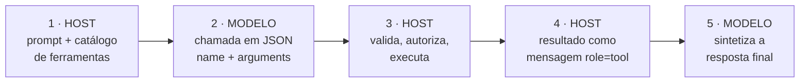
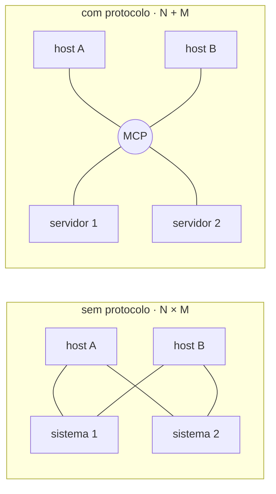
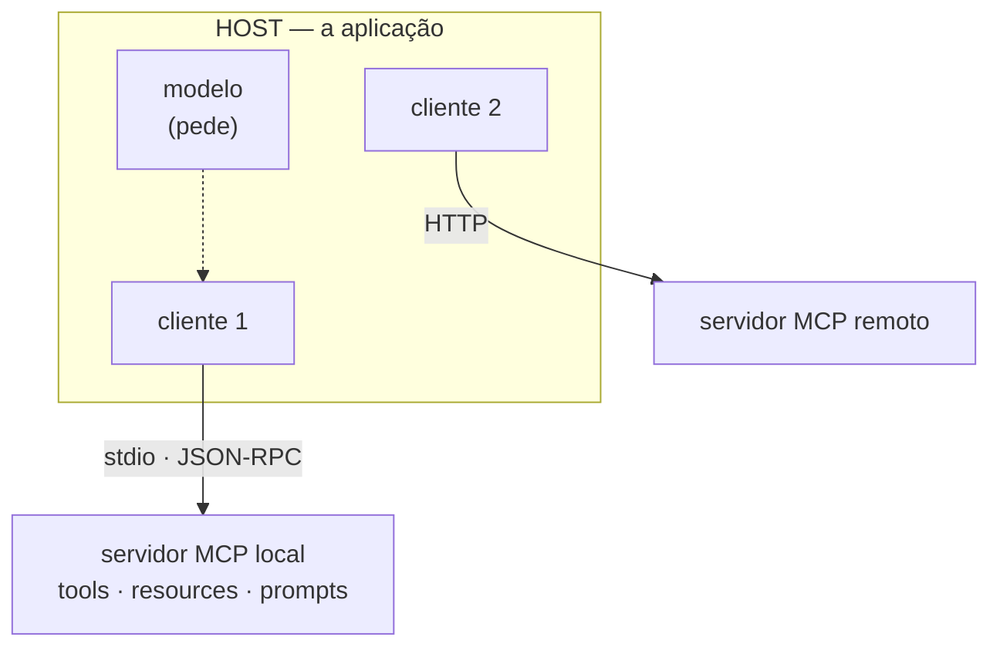
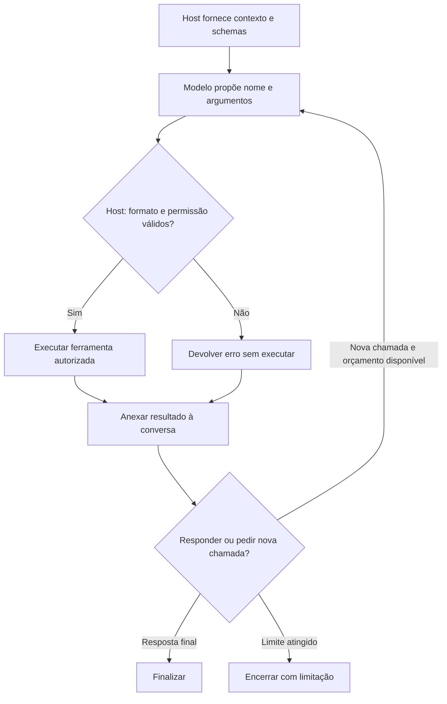
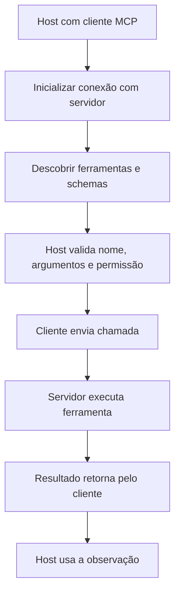
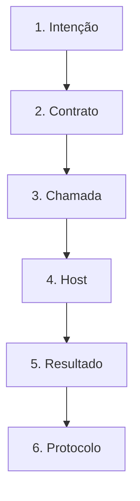

# Especificação de slides — Aula 21 (V2)

> **Rebalanceamento V2.** Esta aula já era conduzida pela aplicação na V1: abre por uma pergunta
> sobre o sistema que o aluno acabou de construir ("quem decidiu buscar?"), o conceito central é
> demonstrado com um número medido, e o exercício já é de reescrita. Não há matemática no fluxo, e
> por isso o transporte para a V2 preserva tudo — slides, ordem, tempos — e **não cria apêndice**:
> em lugar dele, a Parte 2 diz explicitamente por que não há e aponta onde moram os fundamentos
> formais que a aula mobiliza. Carga horária, numeração e objetivos de aprendizagem inalterados.

<!-- SLIDE-FLOW:GUIDE:BEGIN -->
## Fluxogramas na produção dos slides

As orientações abaixo complementam o campo **Visual** dos slides indicados. Produzir os fluxogramas no próprio deck, como formas e conectores editáveis ou gráficos vetoriais; a biblioteca completa ao final torna esta especificação independente do portal.

- **Referência de composição:** título e propósito no topo, blocos numerados, conexões rotuladas, ramificações legíveis e uma saída identificada. Usar apenas o padrão visual da referência fornecida, sem importar seu assunto ou seus exemplos.
- **Tema do deck:** manter o fundo escuro e a paleta já especificada para a aula. Usar `#5b8cff` para o trecho ativo, tons neutros para o contexto e `#e2231a` conforme o significado definido no deck. Cor sempre acompanhada de rótulo.
- **Leitura:** entrada no topo ou à esquerda; saída na base ou à direita. Decisões em losangos, alternativas com rótulos e retornos apontando à etapa correta. Ramos paralelos convergem apenas onde seus resultados realmente são combinados.
- **Densidade:** no fluxo principal, projetar 3–6 blocos curtos por enquadramento, com corpo legível na última fileira. Um mapa maior pode ser revelado por etapas no mesmo slide. Detalhes, condições e explicações completas ficam nas notas; não reduzir a fonte para caber tudo.
- **Semântica:** mapas de percurso mostram ordem de estudo, não execução de um algoritmo. Manter separadas preparação e aplicação, treino e inferência, sequência e alternativas. Não transformar uma etapa opcional em obrigatória.
- **Integração:** o fluxograma substitui uma lista redundante ou ocupa o campo Visual; não cobre matrizes, tabelas, gráficos nem código indispensáveis. Preservar títulos, numeração, duração e referências aos apêndices.
- **Produção:** os blocos Mermaid abaixo são especificações do desenho. Renderizar/reconstruir como diagrama, nunca projetar o código Mermaid. Manter rótulos, bifurcações, retornos e limites declarados. Não transformar este caderno técnico em slides adicionais.
- **Ligação com o portal:** os mapas de mecanismo compartilham o conteúdo dos fluxogramas do portal. Em demonstrações, usar o mesmo vocabulário no deck e no controle interativo para facilitar a passagem entre os dois.
<!-- SLIDE-FLOW:GUIDE:END -->

## Diretrizes visuais

- **Tema:** escuro, accent `#e2231a` (vermelho CESAR), accent secundário `#5b8cff`.
- **Tipografia:** sans-serif para texto; monoespaçada para JSON, nomes de ferramenta, nomes de parâmetro e verbos de protocolo (`tools/list`, `tools/call`).
- **Densidade:** máximo 5 linhas de texto por slide. Um conceito por slide.
- **Proibido:** bullets genéricos ("Vantagens", "Desvantagens"); slide-parede de texto; clipart de robô com braços; JSON estilizado que não é o JSON de verdade.
- **Convenção de cor que atravessa o deck:** tudo o que o **modelo** faz aparece em accent secundário (`#5b8cff`); tudo o que o **host** faz aparece em accent (`#e2231a`). A convenção nasce no slide 3 e é reusada nos slides 4, 11 e 12 — é o fio visual da aula.
- **JSON na tela é JSON real,** copiado da saída da demo, com as barras de escape à mostra em `arguments`. Não limpar para ficar bonito: a estranheza é pedagógica.

## Arco narrativo

O deck faz uma promessa incômoda e a cumpre: dar mãos ao modelo sem dar poder a ele. Abre cobrando que quem decidiu buscar no Lab 5 foi o aluno, e anuncia que hoje essa decisão passa ao modelo. Os slides 3 a 5 desmontam o mecanismo em cinco passos, mostram o JSON de verdade e chegam à surpresa da aula — o schema é parte do prompt, palavra por palavra. O slide 6 mede isso com três catálogos e a mesma função. O slide 7 fecha o Bloco 1 com a origem da habilidade (few-shot, SFT de formato, Toolformer). A segunda metade vira design: seis propriedades, o catálogo das más ferramentas, e daí o salto para o protocolo — N×M, host/cliente/servidor, e quem decide usar cada primitiva. Fecha com as três partes do Lab 6 e a justificativa de fazer na mão antes do framework.

---

# PARTE 1 — FLUXO PRINCIPAL

*O que se apresenta em aula. 14 slides, ~110 min com demo e exercício. A ordem é a da V1 e não foi
alterada: o Slide 1 já abre por uma pergunta sobre o sistema que a turma construiu no lab anterior.
Esta aula não tem Parte 2 de apêndice — ver a nota ao fim do documento e a tabela de ponteiros.*

### Slide 1 — Abertura: o modelo passa a pedir

<!-- SLIDE-FLOW:SLIDE:BEGIN -->
- **Fluxograma a incorporar neste slide:** **F00 — Tool calling: proposta, execução e retorno**. O desenho e os rótulos completos estão no caderno de fluxogramas ao final deste arquivo.
- **Composição:** integrar ao campo Visual; preservar exemplos, tabelas, fórmulas e dimensões solicitados neste slide. Destacar o trecho relacionado ao título e manter o restante em segundo plano. Os textos detalhados ficam nas notas, sem duplicar a lista de Conteúdo na tela.
<!-- SLIDE-FLOW:SLIDE:END -->

- **Tipo:** título
- **Título:** Tool calling e Model Context Protocol
- **Frase-tese:** Hoje o modelo ganha mãos. E a primeira metade da aula é a prova de que ele continua sem poder executar nada.
- **Conteúdo:** Uma linha de recap do Lab 5 (pipeline medido, duas tabelas) e a pergunta que abre a aula, em corpo grande: **"quem decidiu buscar?"**. Resposta na mesma tela: você, na linha de código que chamou a busca.
- **Visual:** o diagrama do Lab 5 como um cano reto (pergunta → busca → resposta), com a palavra "sempre" repetida ao longo do cano. Ao lado, o mesmo cano com um losango de decisão no lugar do primeiro segmento, ainda sem rótulo — ele será preenchido no slide 3.
- **Notas do apresentador:** 4 min. Roteiro slide 1. Levar a saída da demo rodada na véspera em modo `api`, com data e modelo anotados. Devolutiva do Lab 5 em uma frase concreta.

### Slide 2 — O que muda quando o modelo pode agir

<!-- SLIDE-FLOW:SLIDE:BEGIN -->
- **Fluxograma a incorporar neste slide:** **F00 — Tool calling: proposta, execução e retorno**. O desenho e os rótulos completos estão no caderno de fluxogramas ao final deste arquivo.
- **Composição:** integrar ao campo Visual; preservar exemplos, tabelas, fórmulas e dimensões solicitados neste slide. Destacar o trecho relacionado ao título e manter o restante em segundo plano. Os textos detalhados ficam nas notas, sem duplicar a lista de Conteúdo na tela.
<!-- SLIDE-FLOW:SLIDE:END -->

- **Tipo:** transição
- **Título:** A fronteira do curso é hoje
- **Conteúdo:** Três fases em uma linha cada: **Aulas 1–16** — mexemos no modelo (arquitetura, escala, ajuste, alinhamento); **Aulas 18–20** — mexemos no que entra nele (recuperação, contexto); **Aula 21 em diante** — o texto que sai dele passa a ser lido por um programa que age. Consequências já marcadas: A23 loop e objetivo, A24 vários agentes, A26 o que dá errado.
- **Frase-tese:** O texto do modelo deixa de ser resposta e passa a ser pedido.
- **Visual:** linha do tempo horizontal com as três fases, a terceira acesa em accent, e as três aulas futuras como estações apagadas à direita.
- **Notas do apresentador:** 30 s de silêncio na tela. Se a turma estiver ansiosa com a Entrega 1, dizer que os cinco itens vêm no fechamento e cortar o assunto.

### Slide 3 — O ciclo de cinco passos — e quem executa o quê

<!-- SLIDE-FLOW:SLIDE:BEGIN -->
- **Fluxograma a incorporar neste slide:** **F00 — Tool calling: proposta, execução e retorno**. O desenho e os rótulos completos estão no caderno de fluxogramas ao final deste arquivo.
- **Composição:** integrar ao campo Visual; preservar exemplos, tabelas, fórmulas e dimensões solicitados neste slide. Destacar o trecho relacionado ao título e manter o restante em segundo plano. Os textos detalhados ficam nas notas, sem duplicar a lista de Conteúdo na tela.
<!-- SLIDE-FLOW:SLIDE:END -->

- **Tipo:** diagrama
- **Título:** Cinco passos, e o modelo é dono de um
- **Conteúdo:** Os cinco passos, cada um com o executor explícito:
  1. **host** — monta o prompt com o catálogo de ferramentas serializado dentro
  2. **modelo** — devolve, em vez de prosa, uma chamada em JSON: nome + argumentos
  3. **host** — valida os argumentos, decide se pode, executa
  4. **host** — devolve o resultado como mensagem de papel `tool`, com o `tool_call_id`
  5. **modelo** — lê o resultado e sintetiza a resposta final
- **Frase-tese:** Todo poder que a ferramenta tem foi dado por quem escreveu o host.
- **Visual:** ciclo fechado de cinco caixas, com as duas do modelo em accent secundário e as três do host em accent — a convenção de cor do deck nasce aqui. No centro do ciclo, em corpo grande: "o modelo não executa nada". Rodapé: a analogia da receita médica em uma linha.
- **Notas do apresentador:** Desenhar os cinco passos no quadro e escrever "modelo" ou "host" ao lado de cada um. Deixar no quadro o resto da aula — volta no slide 11.



### Slide 4 — Anatomia da chamada: o JSON na tela

<!-- SLIDE-FLOW:SLIDE:BEGIN -->
- **Fluxograma a incorporar neste slide:** **F00 — Tool calling: proposta, execução e retorno**. O desenho e os rótulos completos estão no caderno de fluxogramas ao final deste arquivo.
- **Composição:** integrar ao campo Visual; preservar exemplos, tabelas, fórmulas e dimensões solicitados neste slide. Destacar o trecho relacionado ao título e manter o restante em segundo plano. Os textos detalhados ficam nas notas, sem duplicar a lista de Conteúdo na tela.
<!-- SLIDE-FLOW:SLIDE:END -->

- **Tipo:** código
- **Título:** Três campos, e o que cada um resolve
- **Conteúdo:** O objeto de verdade, copiado da saída da demo:
  ```json
  {"tool_calls": [{
     "id": "call_a1b2",
     "type": "function",
     "function": {"name": "calcular_expressao",
                  "arguments": "{\"expressao\": \"0.125 * 480\"}"}
  }]}
  ```
  E a volta:
  ```json
  {"role": "tool", "tool_call_id": "call_a1b2",
   "name": "calcular_expressao", "content": "{\"resultado\": 60.0}"}
  ```
  Por que existe o `id`: um turno pode pedir **várias** chamadas de uma vez; sem correlação não se sabe qual resultado responde a qual pedido.
- **Frase-tese:** O resultado da ferramenta não é o usuário falando — existe um papel próprio, e usar o papel errado é sair da distribuição de treino.
- **Visual:** os dois blocos de JSON empilhados, com o `id` destacado nos dois e ligado por uma seta curva. Anotação apontando para `arguments`: "string com JSON dentro — é assim mesmo".
- **Notas do apresentador:** Projetar o JSON real da execução da véspera, não um exemplo estilizado. As barras de escape à mostra são o que fixa o ponto.

### Slide 5 — O schema é parte do prompt

<!-- SLIDE-FLOW:SLIDE:BEGIN -->
- **Fluxograma a incorporar neste slide:** **F00 — Tool calling: proposta, execução e retorno**. O desenho e os rótulos completos estão no caderno de fluxogramas ao final deste arquivo.
- **Composição:** integrar ao campo Visual; preservar exemplos, tabelas, fórmulas e dimensões solicitados neste slide. Destacar o trecho relacionado ao título e manter o restante em segundo plano. Os textos detalhados ficam nas notas, sem duplicar a lista de Conteúdo na tela.
<!-- SLIDE-FLOW:SLIDE:END -->

- **Tipo:** conceito
- **Título:** Cada palavra do schema é engenharia de prompt
- **Conteúdo:** O que o modelo lê no momento de decidir: nome da função · descrição · nome de cada parâmetro · `enum` de valores aceitos · exemplo dentro da descrição do parâmetro. Consequência em destaque: renomear `expressao` para `q` e cortar a descrição **não é refatoração** — é reescrever o prompt. Corolário: a descrição não é documentação para a equipe; o leitor dela é o modelo.
- **Frase-tese:** Trocar `expressao` por `q` e apagar a descrição não é refatoração. É reescrever o prompt.
- **Visual:** dois cartões de schema lado a lado, idênticos em estrutura e diferentes em texto — `calcular_expressao(expressao)` com descrição de três frases contra `calc(q)` com "calcula". Entre os dois, um sinal de igual riscado. Abaixo, espaço reservado para a tabela do slide 6.
- **Notas do apresentador:** Não adiantar o resultado da demo. Perguntar "quanto vocês acham que cai?" e deixar a sala chutar — a sala subestima.

### Slide 6 — [Demo] Três catálogos, uma função

<!-- SLIDE-FLOW:SLIDE:BEGIN -->
- **Fluxograma a incorporar neste slide:** **F00 — Tool calling: proposta, execução e retorno**. O desenho e os rótulos completos estão no caderno de fluxogramas ao final deste arquivo.
- **Composição:** integrar ao campo Visual; preservar exemplos, tabelas, fórmulas e dimensões solicitados neste slide. Destacar o trecho relacionado ao título e manter o restante em segundo plano. Os textos detalhados ficam nas notas, sem duplicar a lista de Conteúdo na tela.
<!-- SLIDE-FLOW:SLIDE:END -->

- **Tipo:** transição para demonstração
- **Título:** A mesma função, três catálogos, uma tabela
- **Frase-tese:** A função executada é idêntica nos três. Muda só o que o modelo lê.
- **Conteúdo:** O desenho do experimento, sem resultado — o resultado aparece ao vivo: 6 perguntas com gabarito aritmético · 3 catálogos (`calcular_expressao(expressao)` · `calc(q)` · `ferramenta(entrada)`) · a mesma função no despacho. As duas colunas que a tabela vai trazer: **chamou** e **acertou**.
- **Visual:** slide quase vazio. Os três nomes de ferramenta em monoespaçada grande, e uma tabela vazia com as colunas "chamou" e "acertou" esperando ser preenchida.
- **Fundamento mobilizado:** com 6 perguntas e 3 repetições, a diferença medida entre dois catálogos
  pode ser menor que o ruído entre duas execuções do mesmo catálogo.
  → intervalo de confiança e teste pareado: **Apêndice A.5 da Aula 28**; e "uma semente não é
  resultado": **Apêndice A.5 da Aula 9**. Esta aula **não tem apêndice próprio** — ver a Parte 2.
- **Notas do apresentador:** Passos na Parte 2 do roteiro. Se a rede cair, projetar a saída salva da véspera e dizer data e modelo em voz alta. A tabela **não** pode ser apresentada como medição no modo offline — o script avisa isso na própria saída.

### Slide 7 — Como o modelo aprendeu a fazer isso
- **Tipo:** comparação
- **Título:** Três caminhos, em ordem de custo
- **Conteúdo:** Três blocos:
  - **Exemplos no prompt** — 2 ou 3 chamadas bem feitas + aprendizado em contexto. Barato, gasta contexto sempre, frágil no formato.
  - **SFT de formato** — dezenas de milhares de exemplos de chamada. É por isso que os modelos de hoje já vêm "com tool calling".
  - **Auto-supervisão · Toolformer** (Schick et al., arXiv 2302.04761) — o modelo insere candidatos de chamada em textos comuns, executa, e **mantém só as chamadas que reduzem a perda de previsão dos tokens seguintes**. Sem rótulo humano no laço.
- **Frase-tese:** Toolformer decide se uma chamada presta perguntando se ela ajudou a prever o resto do texto. Utilidade virou perda.
- **Visual:** três blocos empilhados, o terceiro visualmente separado. No terceiro, um mini-esquema: texto → candidato de chamada inserido → executa → compara a perda com e sem → mantém ou descarta.
- **Notas do apresentador:** Slide de sacrifício se o Bloco 1 estourar — é o único do dia que não é pré-requisito do Lab 6. Se cortar, mandar para a leitura dirigida e dizer isso em voz alta. Intervalo depois deste slide.

### Slide 8 — Seis propriedades de uma boa ferramenta

<!-- SLIDE-FLOW:SLIDE:BEGIN -->
- **Fluxograma a incorporar neste slide:** **F00 — Tool calling: proposta, execução e retorno**. O desenho e os rótulos completos estão no caderno de fluxogramas ao final deste arquivo.
- **Composição:** integrar ao campo Visual; preservar exemplos, tabelas, fórmulas e dimensões solicitados neste slide. Destacar o trecho relacionado ao título e manter o restante em segundo plano. Os textos detalhados ficam nas notas, sem duplicar a lista de Conteúdo na tela.
<!-- SLIDE-FLOW:SLIDE:END -->

- **Tipo:** conceito
- **Título:** O checklist da ferramenta que um modelo consegue usar
- **Conteúdo:** As seis, com a consequência de cada uma em meia linha:
  1. **Estreita** — faz uma coisa, e o nome diz qual
  2. **Bem nomeada** — nome e descrição são lidos na hora da escolha
  3. **Validável por schema** — tipo, `required`, `enum`; o host rejeita antes de executar
  4. **Permissionada** — privilégio mínimo; ação sensível exige confirmação humana
  5. **Observável** — registro de argumentos, resultado, latência e erro em cada chamada
  6. **Efeito colateral determinístico** — e idealmente idempotente, porque **o loop vai repetir a chamada**

  **Duas que só aparecem quando o catálogo cresce** (Anthropic, *Writing effective tools for agents*, set/2025):
  7. **Espaço de nome** — com dezenas de ferramentas de servidores diferentes, prefixar por domínio
     (`asana_buscar`, `jira_buscar`) é o que impede o modelo de escolher a busca do sistema errado. O
     N×M do slide 10 cria o problema; o prefixo é a defesa mais barata contra ele.
  8. **Resposta econômica em tokens** — o que a ferramenta **devolve** também é prompt, e é o item mais
     esquecido. Uma ferramenta que retorna o JSON inteiro da API gasta contexto que o loop vai reenviar a
     cada volta (ver o ponteiro de custo acima). Devolver o campo útil, paginado e com identificador para
     buscar o resto **é** design de ferramenta, não otimização prematura.
- **Fundamento mobilizado:** o custo de o loop repetir não é linear nos passos — cada volta reenvia
  a trajetória acumulada. → `Σ k·d = d·n(n+1)/2`: **Apêndice A.1 da Aula 23**
- **Fundamento (como saber se a descrição está boa, em vez de achar):** as oito propriedades são critério de
  projeto, não medição. A versão medida é um **laço**: monta-se um pequeno conjunto de tarefas que exercitam
  as ferramentas, mede-se quantas o agente completa, **reescreve-se a descrição** e mede-se de novo. É
  exatamente a quarta alavanca da **Aula 13 (A.7)** aplicada ao schema em vez de ao prompt de sistema — e é a
  razão de "descrição de ferramenta é prompt" não ser figura de linguagem: se é prompt, é otimizável contra
  métrica, e a Anthropic relata usar o próprio agente para fazer essa reescrita.
- **Frase-tese:** Projetem ferramenta como quem projeta API para um cliente que lê rápido, nunca pergunta e às vezes chuta.
- **Visual:** seis cartões numerados em grade 3×2, cada um com um ícone simples. Os cartões 5 e 6 com moldura em accent — são os dois mais negligenciados, e os dois que o Lab 7 vai cobrar. Este slide **permanece na tela** durante os slides 9 e 13 (o exercício cobra as propriedades nominalmente).
- **Notas do apresentador:** Insistir em observabilidade (sem trajetória não se depura agente — Lab 7) e em idempotência (o retry é comportamento, não hipótese). As propriedades 7 e 8 são **novas nesta oferta** e valem 60 s juntas: o espaço de nome só faz sentido depois do N×M do slide 10, então anunciá-lo como "guardem, volta em dois slides"; e a resposta econômica é a que produz a reação mais forte, porque a turma nunca pensou que o **retorno** da ferramenta também é prompt. O laço de avaliação da descrição não se abre aqui — uma frase e o ponteiro para A.7 da Aula 13.

### Slide 9 — O catálogo das más ferramentas

<!-- SLIDE-FLOW:SLIDE:BEGIN -->
- **Fluxograma a incorporar neste slide:** **F00 — Tool calling: proposta, execução e retorno**. O desenho e os rótulos completos estão no caderno de fluxogramas ao final deste arquivo.
- **Composição:** integrar ao campo Visual; preservar exemplos, tabelas, fórmulas e dimensões solicitados neste slide. Destacar o trecho relacionado ao título e manter o restante em segundo plano. Os textos detalhados ficam nas notas, sem duplicar a lista de Conteúdo na tela.
<!-- SLIDE-FLOW:SLIDE:END -->

- **Tipo:** comparação
- **Título:** Quatro modos de estragar um schema
- **Conteúdo:** Quatro cartões, cada um com o exemplo e o dano:
  - **Vaga** · `dados(query)`, "pega dados" → o modelo não sabe quando usar; a taxa cai (slide 6)
  - **Ampla demais** · `executar_sql(comando)`, `rodar_shell(cmd)` → a linguagem inteira cabe no parâmetro; validação por schema vira decoração
  - **Silenciosamente com estado** · `proximo_registro()` → cursor invisível; o retry corrompe; trajetória irreproduzível
  - **Irreversível sem confirmação** · `enviar_email`, `apagar_registro`, `pagar` → o custo do erro deixa de ser retry e passa a ser incidente
  Rodapé em accent, o antipadrão: juntar N ferramentas em uma só com um parâmetro `acao` **não** simplifica — só tira do schema a única coisa que ele sabia checar.
- **Frase-tese:** Irreversível não é defeito. Irreversível **sem confirmação** é.
- **Visual:** quatro cartões em coluna, com o nome da ferramenta ruim em monoespaçada e riscado. O quarto cartão com um selo de "requer confirmação" ao lado, mostrando o conserto e não só o defeito.
- **Notas do apresentador:** Se a turma engatar em segurança, reconhecer e devolver para a Aula 26 em uma frase. Não gastar mais de 1 min ou o MCP não cabe.

### Slide 10 — O problema N×M

<!-- SLIDE-FLOW:SLIDE:BEGIN -->
- **Fluxograma a incorporar neste slide:** **F01 — MCP: conectar, descobrir e chamar**. O desenho e os rótulos completos estão no caderno de fluxogramas ao final deste arquivo.
- **Composição:** integrar ao campo Visual; preservar exemplos, tabelas, fórmulas e dimensões solicitados neste slide. Destacar o trecho relacionado ao título e manter o restante em segundo plano. Os textos detalhados ficam nas notas, sem duplicar a lista de Conteúdo na tela.
<!-- SLIDE-FLOW:SLIDE:END -->

- **Tipo:** dados
- **Título:** 20 adaptadores, ou 9 peças
- **Conteúdo:** O caso concreto: **4 hosts** (notebook do projeto, editor, assistente de terminal, chat interno) × **5 sistemas** (base RAG do Lab 5, repositório, banco, tickets, calendário) = **20 adaptadores**, cada um com autenticação, formato de erro e ciclo de vida próprios. Com protocolo comum: **4 clientes + 5 servidores = 9**. Precedente citado: o Protocolo de Servidor de Linguagem fez isso para editores × linguagens.
- **Frase-tese:** Protocolo não é sobre dar ferramenta ao modelo — é sobre não reescrever a ferramenta em cada host.
- **Visual:** dois grafos lado a lado. À esquerda, malha completa de 4×5 com as 20 arestas emaranhadas. À direita, dois conjuntos ligados por um barramento central rotulado "MCP", com 9 arestas. O contraste visual é o argumento.
- **Fundamento mobilizado:** crescimento multiplicativo contra aditivo. A mesma aritmética reaparece
  na Aula 24 sobre orçamentos de passos, onde o pior caso é o **produto** dos tetos (`5 × 5 = 25`).
  → **Apêndice A.2 da Aula 24**
- **Notas do apresentador:** Desenhar as 20 flechas no quadro e depois a estrela com 9. O desenho vende em 10 s. Marcar que dar ferramenta ao modelo não exige protocolo — o Lab 6 parte (a) faz sem.



### Slide 11 — MCP: host, cliente, servidor

<!-- SLIDE-FLOW:SLIDE:BEGIN -->
- **Fluxograma a incorporar neste slide:** **F01 — MCP: conectar, descobrir e chamar**. O desenho e os rótulos completos estão no caderno de fluxogramas ao final deste arquivo.
- **Composição:** integrar ao campo Visual; preservar exemplos, tabelas, fórmulas e dimensões solicitados neste slide. Destacar o trecho relacionado ao título e manter o restante em segundo plano. Os textos detalhados ficam nas notas, sem duplicar a lista de Conteúdo na tela.
<!-- SLIDE-FLOW:SLIDE:END -->

- **Tipo:** diagrama
- **Título:** Três papéis — e o servidor nunca vê o modelo
- **Conteúdo:** Os três papéis com uma frase cada: **host** — a aplicação onde a conversa acontece e onde o modelo é chamado; decide o que expor e executa as decisões. **cliente** — componente dentro do host que mantém a conexão; um cliente por servidor. **servidor** — processo separado que expõe capacidades; fala com o cliente, **nunca com o modelo**. Abaixo: transporte `stdio` (subprocesso local — o caso do Lab 6) ou HTTP (remoto); em cima, JSON-RPC com `initialize` → `tools/list` → `tools/call`.
- **Frase-tese:** O servidor MCP nunca vê o modelo. É a mesma separação do passo 3, agora entre processos.
- **Visual:** o host como uma caixa grande contendo o modelo (em accent secundário) e dois clientes; fora dela, dois servidores como processos separados, ligados por linhas rotuladas `stdio` e `HTTP`. Uma linha tracejada vermelha entre servidor e modelo, **cortada** por um X, com a legenda "nunca".
- **Notas do apresentador:** Apontar o quadro do slide 3 aqui — a separação é a mesma. Se perguntarem qual servidor será usado no Lab 6: um servidor de referência instalável por `pip`, por `stdio`, e depois o próprio. Estado do ecossistema é `[definir na oferta]`.



### Slide 12 — Recurso, ferramenta e prompt: quem decide

<!-- SLIDE-FLOW:SLIDE:BEGIN -->
- **Fluxograma a incorporar neste slide:** **F00 — Tool calling: proposta, execução e retorno**. O desenho e os rótulos completos estão no caderno de fluxogramas ao final deste arquivo.
- **Composição:** integrar ao campo Visual; preservar exemplos, tabelas, fórmulas e dimensões solicitados neste slide. Destacar o trecho relacionado ao título e manter o restante em segundo plano. Os textos detalhados ficam nas notas, sem duplicar a lista de Conteúdo na tela.
<!-- SLIDE-FLOW:SLIDE:END -->

- **Tipo:** comparação
- **Título:** A distinção não é de formato — é de quem escolhe usar
- **Conteúdo:** Três colunas:
  - **Ferramenta** · ação · quem escolhe: **o modelo** · `tools/call`
  - **Recurso** · dado endereçável por URI (arquivo, linha de banco, documento do acervo) · quem escolhe anexar: **a aplicação** ou o usuário
  - **Prompt** · template parametrizado · quem invoca: **o usuário**
  Nota lateral, do lado do cliente: pedir geração ao modelo do host (*sampling*), declarar as raízes visíveis (*roots*), pedir ao usuário um dado que falta (*elicitation*).
  Caixa final — **o que o MCP não resolve:** schema ruim continua ruim; permissão continua sendo decisão do host; servidor de terceiro amplia a superfície de **injeção indireta** (o texto de retorno entra no mesmo campo da instrução — como o documento recuperado da Aula 19). Seta para a Aula 26.
- **Frase-tese:** Quem confunde ferramenta com recurso entrega o caminho de arquivo para o modelo sem querer.
- **Visual:** três colunas com a cor do "dono da decisão" no topo de cada uma — modelo em accent secundário, aplicação em cinza, usuário em branco. Abaixo, a caixa "o que o MCP não resolve" em accent, com três itens curtos.
- **Notas do apresentador:** Não entrar em esquema de URI nem em versão da especificação. Se perguntarem: o protocolo é versionado por data e a versão vigente é `[definir na oferta]`.

### Slide 13 — [Exercício] Reescrever o schema ruim

<!-- SLIDE-FLOW:SLIDE:BEGIN -->
- **Fluxograma a incorporar neste slide:** **F00 — Tool calling: proposta, execução e retorno**. O desenho e os rótulos completos estão no caderno de fluxogramas ao final deste arquivo.
- **Composição:** integrar ao campo Visual; preservar exemplos, tabelas, fórmulas e dimensões solicitados neste slide. Destacar o trecho relacionado ao título e manter o restante em segundo plano. Os textos detalhados ficam nas notas, sem duplicar a lista de Conteúdo na tela.
- **Momento de exibição:** apresentar o fluxo preenchido na discussão ou conferência, depois da tentativa da turma; durante a atividade, ocultar as etapas que entregariam a solução.
<!-- SLIDE-FLOW:SLIDE:END -->

- **Tipo:** exercício
- **Título:** Em dupla, 5 minutos: transformem `dados` em ferramentas escolhíveis
- **Conteúdo:** O schema ruim, na tela, em monoespaçada:
  ```json
  {"name": "dados",
   "description": "pega dados do sistema",
   "parameters": {"type": "object",
     "properties": {"acao": {"type": "string"},
                    "params": {"type": "object"}}}}
  ```
  O contexto: esse `dados` faz três coisas — consulta o regulamento por texto, lê a matrícula de um aluno por código, envia um e-mail de confirmação.
  A entrega, três itens: (1) 2–3 ferramentas estreitas com nome, descrição **escrita para o modelo ler** e parâmetros com tipo e `enum` onde couber; (2) qual exige confirmação humana e por quê, em uma frase; (3) qual das seis propriedades o original violava mais.
- **Frase-tese:** Uma ferramenta chamada `dados` que faz três coisas é uma escolha impossível para o modelo.
- **Visual:** o schema ruim à esquerda, riscado em diagonal; à direita, três molduras vazias esperando os nomes das novas ferramentas. Cronômetro de 5 min no canto. O slide 8 (as seis propriedades) fica visível em miniatura no rodapé.
- **Notas do apresentador:** Condução na Parte 3 do roteiro. Cronometrar de verdade: 5 min de dupla, 2 de correção. Pedir a duas duplas que leiam só a descrição da ferramenta de e-mail e comparar em voz alta. Pergunta de fechamento: a confirmação mora no schema ou no host?

### Slide 14 — Fechamento: amanhã vocês fazem na mão

<!-- SLIDE-FLOW:SLIDE:BEGIN -->
- **Fluxograma a incorporar neste slide:** **F02 — O percurso desta aula**. O desenho e os rótulos completos estão no caderno de fluxogramas ao final deste arquivo.
- **Composição:** integrar ao campo Visual; preservar exemplos, tabelas, fórmulas e dimensões solicitados neste slide. Destacar o trecho relacionado ao título e manter o restante em segundo plano. Os textos detalhados ficam nas notas, sem duplicar a lista de Conteúdo na tela.
<!-- SLIDE-FLOW:SLIDE:END -->

- **Tipo:** encerramento
- **Título:** O modelo pede. O host executa. O schema é prompt.
- **Conteúdo:** As quatro frases de síntese, numeradas e curtas: (1) cinco passos, o modelo é dono de um; (2) o schema é parte do prompt — a taxa de acerto mudou sem uma linha de código mudar; (3) boa ferramenta: estreita, bem nomeada, validável, permissionada, observável, determinística; (4) protocolo é `N + M` em vez de `N × M`. Depois, as **três partes do Lab 6** (loop na mão sem framework → cliente contra servidor MCP existente → servidor MCP próprio) com a justificativa: fazer na mão antes do framework é para ver o protocolo antes da abstração. Por último, em caixa destacada para fotografar, os **cinco itens da Entrega 1**, recolhida amanhã: problema claro e verificável · 2 técnicas do curso · plano de avaliação com métrica por camada · divisão de trabalho · viabilidade em free tier.
- **Frase-tese:** Depois de escrever o parsing e o despacho na mão, nenhum framework de agente vai parecer mágica — vai parecer um laço com um parser.
- **Visual:** duas metades. Topo: as três partes do Lab 6 como três estações numeradas, com um cadeado aberto na primeira ("sem framework"). Base: a caixa dos cinco itens da Entrega 1, grande, alto contraste, feita para foto. Rodapé: "Aula 22 — Lab 6: tool calling e MCP · Entrega 1 do projeto".
- **Notas do apresentador:** 30 s de silêncio na caixa da Entrega 1. Dizer o formato do que se recolhe: duas páginas, PDF ou link, um por equipe. Não estourar o horário — amanhã é lab.

---

# PARTE 2 — SEM APÊNDICE MATEMÁTICO

> **Sem apêndice matemático.** Esta aula é de arquitetura e protocolo: os cinco passos do ciclo, a
> anatomia de um objeto JSON, seis propriedades de design e três papéis de um protocolo. Não há
> nenhuma fórmula no fluxo, e nenhuma foi retirada dele — não existe derivação para recolher, e
> inventar um item `A.n` aqui produziria apêndice de forma sem conteúdo. Os fundamentos formais que
> a aula **mobiliza** estão nos apêndices de outras aulas, referenciados no fluxo exatamente onde
> aparecem.

## Ponteiros para os apêndices de outras aulas

| Onde, no fluxo | O que a aula mobiliza | Onde está o fundamento |
|---|---|---|
| **Slide 1** e abertura do roteiro — "declarar o `\|Q\|` é de graça e é o que separa medição de impressão" | a métrica de recuperação só é resultado com `k` e `\|Q\|` declarados; com `\|Q\|` pequeno, uma consulta move a média inteira | **Apêndice A.2 da Aula 19** (definições, identidade `precision@k = recall@k·\|R_q\|/k`, e os casos-limite de `\|Q\|`) |
| **Slide 6** — a tabela de três catálogos, com 6 perguntas e 3 repetições | a diferença medida entre dois catálogos é maior que o ruído entre duas execuções do **mesmo** catálogo? | **Apêndice A.5 da Aula 28** (intervalo de confiança para uma proporção e teste pareado — por que 20 casos não distinguem 0,71 de 0,78) e **Apêndice A.5 da Aula 9** (o que uma execução com uma semente não permite concluir) |
| **Slide 8**, propriedade 6 — "o loop vai repetir a chamada" | quanto custa o loop repetir: o total enviado cresce com o **quadrado** dos passos, não com os passos | **Apêndice A.1 da Aula 23** (`Σ k·d = d·n(n+1)/2`, e por que a latência é sequencial) |
| **Slide 10** — `4 × 5 = 20` adaptadores contra `4 + 5 = 9` peças | crescimento multiplicativo contra aditivo; a mesma aritmética reaparece sobre orçamentos de passos, onde o pior caso é o **produto** dos tetos | **Apêndice A.2 da Aula 24** (`5 × 5 = 25`, contador único e latência por topologia) |
| **Slide 12**, caixa "o que o MCP não resolve" — injeção indireta por servidor de terceiro | o texto de retorno de uma ferramenta entra no mesmo campo da instrução do sistema | **Aula 26** (o mecanismo, as cinco mitigações e o que cada uma deixa aberto). A Aula 26 também é de arquitetura e não tem apêndice próprio |

*Nota de método.* A contagem `N × M → N + M` do slide 10 é uma leitura direta, não uma manipulação
algébrica: pelo teste de aceitação do contrato (§1), ela pertence ao fluxo e não ao apêndice. O que
ela **não** é é uma estimativa — os números `4` e `5` vêm de hosts e sistemas nomeados no próprio
slide, e o desenho no quadro é o argumento.

<!-- SLIDE-FLOW:LIBRARY:BEGIN -->
# Caderno de fluxogramas para produção

As referências Fxx identificam desenhos, não novos números de slide. Cada desenho abaixo é autocontido.

| Mapa | Desenho | Usar nos slides |
| --- | --- | --- |
| F00 | Tool calling: proposta, execução e retorno | 1, 2, 3, 4, 5, 6, 8, 9, 12, 13 |
| F01 | MCP: conectar, descobrir e chamar | 10, 11 |
| F02 | O percurso desta aula | 14 |

## F00 — Tool calling: proposta, execução e retorno

Modelo, host e ferramenta têm responsabilidades diferentes.



**Conteúdo dos blocos e notas de montagem:**

1. **Apresentar ferramentas:** O host fornece schemas e contexto ao modelo.
2. **Propor uma chamada:** O modelo emite nome e argumentos estruturados.
3. **Validar no host:** Confira formato, tipos, função registrada e permissões.
   Ramos/alternativas a rotular: Inválida → observação de erro; não executar; Válida → executar a função autorizada.
4. **Devolver a observação:** Anexe resultado ou erro à conversa com identificação da chamada.
5. **Decidir o próximo passo:** O modelo usa a observação para responder ou solicitar outra chamada.
   ↺ Nova chamada volta à validação, respeitando orçamento e condições de parada.

**Saída ou limite a explicitar:** A ferramenta é executada pelo host; texto produzido pelo modelo não é prova de execução.

## F01 — MCP: conectar, descobrir e chamar

Papéis e troca de mensagens em uma integração com ferramentas.



**Conteúdo dos blocos e notas de montagem:**

1. **Abrir a conexão:** O host usa um cliente para se comunicar com o servidor MCP.
   Ramos/alternativas a rotular: Host → cliente MCP; Cliente MCP ↔ servidor MCP.
2. **Inicializar a sessão:** Cliente e servidor estabelecem capacidades da conexão.
3. **Descobrir ferramentas:** O cliente obtém nomes, descrições e schemas expostos pelo servidor.
4. **Solicitar uma chamada:** O host valida a decisão e o cliente envia nome e argumentos ao servidor.
5. **Retornar o resultado:** O servidor executa a ferramenta; o resultado volta pelo cliente ao host.

**Saída ou limite a explicitar:** O protocolo conecta componentes; autorização e uso do resultado continuam sendo responsabilidades do sistema.

## F02 — O percurso desta aula

As setas indicam a ordem de estudo. Abra cada etapa para entender sua função.



**Conteúdo dos blocos e notas de montagem:**

1. **Intenção:** Reconheça quando a tarefa requer uma ferramenta.
2. **Contrato:** Descreva nome, parâmetros e restrições no schema.
3. **Chamada:** O modelo propõe nome e argumentos para a chamada.
4. **Host:** O host valida, autoriza e executa a função.
5. **Resultado:** A observação retorna ao contexto do modelo.
6. **Protocolo:** No MCP, separe os papéis de host, cliente e servidor.

**Saída ou limite a explicitar:** Conecte as etapas: explique como uma decisão afeta o que você observa em seguida.
<!-- SLIDE-FLOW:LIBRARY:END -->

