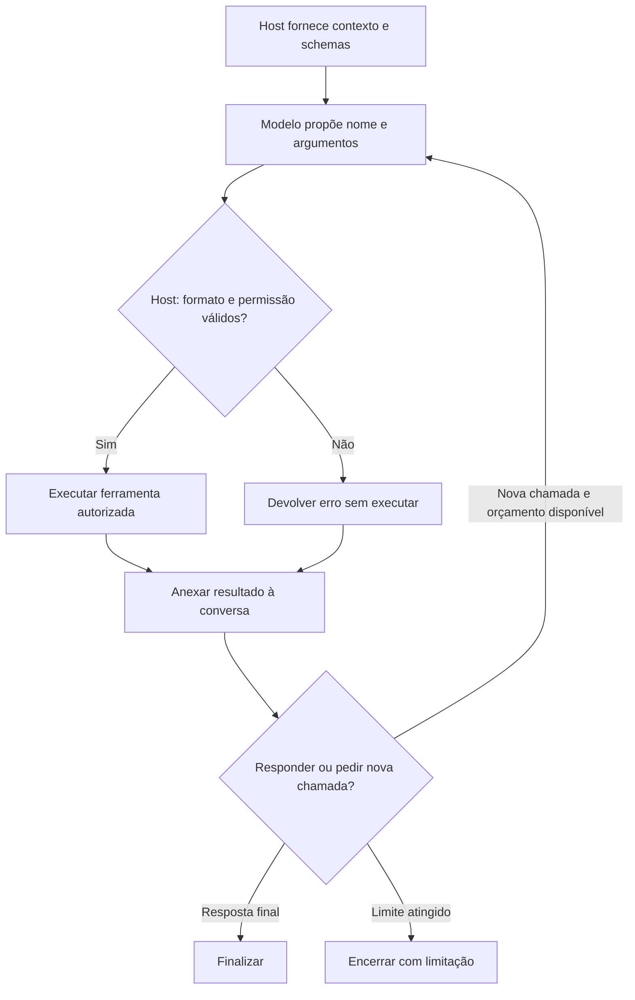
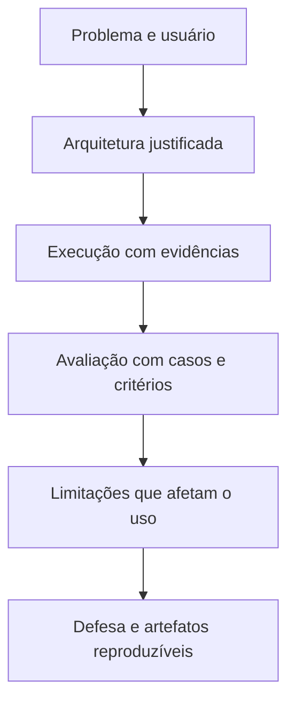
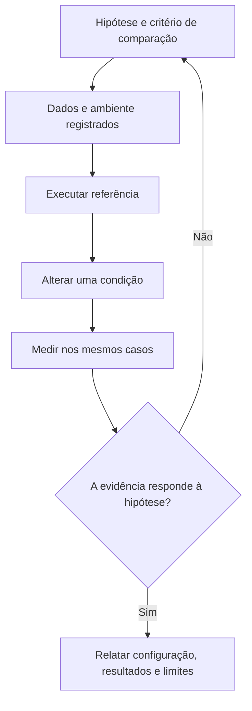
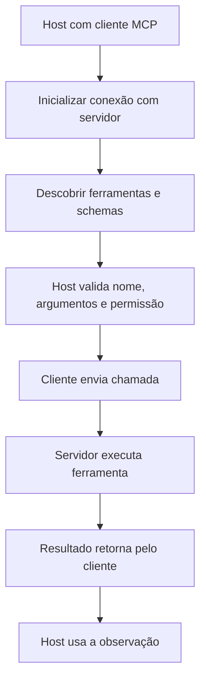
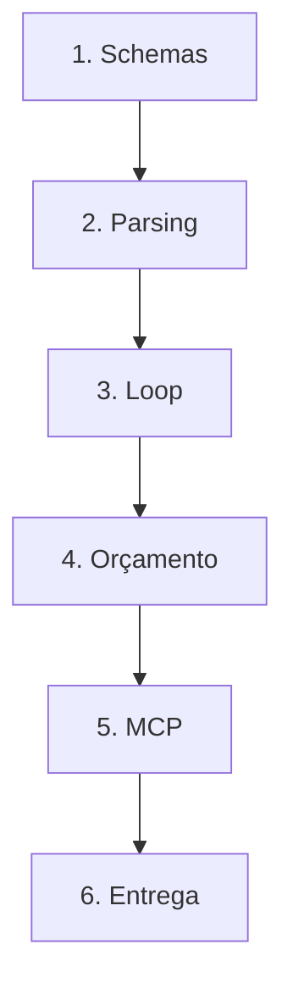

# Especificação de slides — Aula 22 (V2)

> **Rebalanceamento V2 — aula de laboratório (§6-bis do contrato).** O **roteiro prático não foi
> reordenado**: setup, recolhimento da Entrega 1, demo, os quatro checkpoints e a janela fixa de
> projeto às 01:40 permanecem na ordem que funciona em bancada. Três mudanças:
>
> 1. **Cada checkpoint abre pelo comportamento esperado** — a linha exata que a célula de teste
>    imprime e o que o teste conferiu para poder imprimi-la, ou as evidências que precisam aparecer
>    na saída quando não há linha de OK — e só depois nomeia o que implementar.
> 2. **A Parte 2 é nova, e é enxuta:** dois itens, ambos do Checkpoint 2. Este lab tem exatamente
>    um lugar com fundamento formal a recolher, o orçamento do laço, e ele rende duas coisas: a
>    conta e a razão pela qual ela não é linear. Os Checkpoints 1, 3 e 4 são schema, protocolo e
>    transporte — rigor de engenharia sem matemática. **Nenhum item foi inventado para completar
>    forma.**
> 3. **O ponto formal do fluxo ganhou ponteiro** em uma linha, sem interromper a prática.
>
> **Este é o primeiro apêndice do bloco de agentes.** A **Aula 21 não tem apêndice próprio**, por
> decisão registrada: ela é aula de arquitetura e protocolo, e o formalismo que ela mobiliza está
> nos apêndices de outras aulas. Logo o formalismo do bloco de agentes **começa aqui**, e começa
> num laboratório — o que é apropriado, porque é aqui que o `max_passos` deixa de ser uma linha
> defensiva de código e passa a ser a solução de uma desigualdade. Vale dizer isso ao vivo, uma
> vez, no slide 6. A **Aula 23** retoma a conta no apêndice dela e a estende para latência e para as
> três táticas de controle de trajetória; o **Lab 7 (Aula 25)** a mede numa trajetória real.
>
> Carga horária (120 min), numeração e títulos dos slides do fluxo, checkpoints, entregável,
> objetivos de aprendizagem e a **Entrega 1 do projeto**: **idênticos à V1**.
>
> **Mapa checkpoint → apêndice:**
> ```
> Checkpoint 1   —          (schema e validação: contrato de dados, não matemática)
> Checkpoint 2 → A.1, A.2   (custo acumulado do laço e o orçamento de passos)
> Checkpoint 3   —          (protocolo: initialize / tools/list / tools/call)
> Checkpoint 4   —          (transporte stdio e a fronteira ferramenta × recurso)
> Entrega 1      → A.1      (o item "viabilidade em free tier", quando a proposta tem laço)
> ```

<!-- SLIDE-FLOW:GUIDE:BEGIN -->
## Fluxogramas na produção dos slides

As orientações abaixo complementam o campo **Visual** dos slides indicados. Produzir os fluxogramas no próprio deck, como formas e conectores editáveis ou gráficos vetoriais; a biblioteca completa ao final torna esta especificação independente do portal.

- **Referência de composição:** título e propósito no topo, blocos numerados, conexões rotuladas, ramificações legíveis e uma saída identificada. Usar apenas o padrão visual da referência fornecida, sem importar seu assunto ou seus exemplos.
- **Tema do deck:** manter o fundo escuro e a paleta já especificada para a aula. Usar `#5b8cff` para o trecho ativo, tons neutros para o contexto e `#e2231a` conforme o significado definido no deck. Cor sempre acompanhada de rótulo.
- **Leitura:** entrada no topo ou à esquerda; saída na base ou à direita. Decisões em losangos, alternativas com rótulos e retornos apontando à etapa correta. Ramos paralelos convergem apenas onde seus resultados realmente são combinados.
- **Densidade:** no fluxo principal, projetar 3–6 blocos curtos por enquadramento, com corpo legível na última fileira. Um mapa maior pode ser revelado por etapas no mesmo slide. Detalhes, condições e explicações completas ficam nas notas; não reduzir a fonte para caber tudo.
- **Semântica:** mapas de percurso mostram ordem de estudo, não execução de um algoritmo. Manter separadas preparação e aplicação, treino e inferência, sequência e alternativas. Não transformar uma etapa opcional em obrigatória.
- **Integração:** o fluxograma substitui uma lista redundante ou ocupa o campo Visual; não cobre matrizes, tabelas, gráficos nem código indispensáveis. Preservar títulos, numeração, duração e referências aos apêndices.
- **Produção:** os blocos Mermaid abaixo são especificações do desenho. Renderizar/reconstruir como diagrama, nunca projetar o código Mermaid. Manter rótulos, bifurcações, retornos e limites declarados. Não transformar este caderno técnico em slides adicionais.
- **Ligação com o portal:** os mapas de mecanismo compartilham o conteúdo dos fluxogramas do portal. Em demonstrações, usar o mesmo vocabulário no deck e no controle interativo para facilitar a passagem entre os dois.
<!-- SLIDE-FLOW:GUIDE:END -->

## Diretrizes visuais

- **Tema:** escuro, accent `#e2231a` (vermelho CESAR), accent secundário `#5b8cff`.
- **Tipografia:** sans-serif para texto; monoespaçada para JSON, nomes de função, nomes de arquivo e verbos de protocolo (`tools/list`, `tools/call`).
- **Densidade:** máximo 5 linhas de texto por slide no fluxo. Um conceito por slide.
- **Proibido:** bullets genéricos; slide-parede de texto; clipart; JSON estilizado que não é o JSON de verdade.
- **Este é um deck de laboratório, não de teoria.** A teoria é de ontem (Aula 21). Cada slide responde a uma de três perguntas operacionais: *o que estou montando agora*, *como sei que está certo*, *o que entrego*.
- **Slide de checkpoint tem moldura fixa e idêntica, e a primeira linha é o observável:** título com o número do checkpoint, relógio no canto superior direito, *a linha que a tela imprime quando está certo* (ou as evidências, quando não há linha de OK) e o que o teste conferiu, depois o que implementar (nomes reais de função e arquivo), a armadilha num cartão em accent, e o ponteiro `→ Apêndice A.n` quando houver. Quatro slides com a mesma moldura.
- **A convenção de cor da Aula 21 continua:** o que o **modelo** faz em accent secundário; o que o **host** faz em accent. É o fio que liga as duas aulas.
- **Dois slides não são de lab** (2 e 9): são do projeto. Eles têm moldura visual diferente — fundo levemente mais claro — para a turma perceber a troca de contexto sem o instrutor precisar anunciar.
- **Fórmulas:** renderizar como bloco destacado em monoespaçada, não como imagem de baixa resolução. No fluxo aparece **uma** fórmula, no slide 6, enunciada e lida — nunca manipulada.
- **No apêndice:** densidade alta é esperada e desejável. É material de consulta, lido em casa com o notebook ao lado e com a proposta do projeto por revisar.

## Arco narrativo

O deck é o painel de instrumentos de duas horas de código, com um marco de projeto encaixado nas pontas. Abre cobrando a frase de ontem — o modelo pede, o host executa — e anuncia que hoje o host é escrito na unha. O slide 2 recolhe a Entrega 1 e fecha o assunto até as 01:40, para proteger o relógio. O 3 tira os riscos operacionais do caminho (chave opcional, CP1 e CP2 sem dependência, plano B do MCP sem SDK). O 4 mostra uma volta do ciclo desenrolada à mão, e o número que sai dela é a contagem de mensagens: 2, 3, 4 — e a segunda chamada envia as quatro. Os slides 5 a 8 são os quatro checkpoints na mesma moldura: schema e validação, o loop, o cliente MCP, o servidor MCP. O 9 abre a janela da Entrega 1 com os cinco critérios. O 10 fecha com o inventário e com a peça que falta para tudo isso virar agente: o objetivo.

A Parte 2 não se apresenta em aula. Ela existe porque o `MAX_PASSOS = 4` do notebook é a única constante deste lab que tem uma justificativa quantitativa — e porque, sem essa justificativa, todo projeto com laço chega à Entrega 2 com um número escolhido por hábito. Dois itens, e dois é o número certo.

---

# PARTE 1 — FLUXO DA AULA

*O que se apresenta em aula. 10 slides, 120 minutos com demo, quatro checkpoints e a janela da
Entrega 1. Ordem prática preservada da V1, slide a slide, com os mesmos títulos.*

## Slides

### Slide 1 — Abertura: hoje vocês escrevem o host

<!-- SLIDE-FLOW:SLIDE:BEGIN -->
- **Fluxograma a incorporar neste slide:** **F00 — Tool calling: proposta, execução e retorno**. O desenho e os rótulos completos estão no caderno de fluxogramas ao final deste arquivo.
- **Composição:** integrar ao campo Visual; preservar exemplos, tabelas, fórmulas e dimensões solicitados neste slide. Destacar o trecho relacionado ao título e manter o restante em segundo plano. Os textos detalhados ficam nas notas, sem duplicar a lista de Conteúdo na tela.
<!-- SLIDE-FLOW:SLIDE:END -->

- **Tipo:** título
- **Título:** Lab 6 — Tool calling e MCP
- **Frase-tese:** Ontem o modelo ganhou mãos. Hoje vocês escrevem o programa que obedece — e escrevem na unha.
- **Conteúdo:** O que sai daqui em duas horas, em uma linha cada: schema de 3 ferramentas + validação · o loop de tool calling sem framework · um cliente MCP · um servidor MCP próprio. Rodapé: "na mão antes do framework — para nunca mais ver mágica numa biblioteca de agente".
- **Visual:** o ciclo de cinco passos da Aula 21 (slide 3 daquele deck) reaparece, agora com as três caixas do host acesas em accent e um rótulo "você escreve isto hoje" apontando para elas. As duas caixas do modelo apagadas.
- **Notas do apresentador:** 5 min. Roteiro slide 1. Levar as rodas do `mcp` num pendrive. Não abrir a pasta `solucao/`. Mencionar em vinte segundos que este deck tem apêndice, dois itens, e que eles são os primeiros do bloco de agentes — a Aula 21 não tinha nenhum.

### Slide 2 — Entrega 1: como eu recolho agora

<!-- SLIDE-FLOW:SLIDE:BEGIN -->
- **Fluxograma a incorporar neste slide:** **F01 — Projeto: do problema à defesa**. O desenho e os rótulos completos estão no caderno de fluxogramas ao final deste arquivo.
- **Composição:** integrar ao campo Visual; preservar exemplos, tabelas, fórmulas e dimensões solicitados neste slide. Destacar o trecho relacionado ao título e manter o restante em segundo plano. Os textos detalhados ficam nas notas, sem duplicar a lista de Conteúdo na tela.
<!-- SLIDE-FLOW:SLIDE:END -->

- **Tipo:** transição (contexto de projeto)
- **Título:** Entrega 1 — proposta, agora
- **Conteúdo:** O que se recolhe: **uma proposta por equipe · 2 páginas · PDF ou link · no canal da turma · agora**. Depois, a regra do relógio, em destaque: **a devolutiva é às 01:40**, não agora — dúvida de projeto durante o lab é anotada e respondida naquela janela. Aviso adiantado: o item que mais derruba proposta é o **plano de avaliação com uma métrica só no fim do pipeline**.
- **Frase-tese:** Proposta agora, discussão às 01:40.
- **Visual:** moldura diferente do resto do deck (fundo levemente mais claro) para marcar a troca de contexto. Um relógio grande marcando 01:40 no canto. Nada mais.
- **Notas do apresentador:** Projetar o canal da turma e marcar as equipes ao vivo. Anotar quem não entregou sem constranger; prazo de 24 h com desconto, dito individualmente depois. Não abrir discussão de tema aqui. Guardar para a janela das 01:40 a pergunta nova da V2: quem propôs agente, qual é o `max_passos` e de onde saiu o número.

### Slide 3 — Setup, chaves e o modo offline

<!-- SLIDE-FLOW:SLIDE:BEGIN -->
- **Fluxograma a incorporar neste slide:** **F02 — Laboratório: da hipótese à evidência**. O desenho e os rótulos completos estão no caderno de fluxogramas ao final deste arquivo.
- **Composição:** integrar ao campo Visual; preservar exemplos, tabelas, fórmulas e dimensões solicitados neste slide. Destacar o trecho relacionado ao título e manter o restante em segundo plano. Os textos detalhados ficam nas notas, sem duplicar a lista de Conteúdo na tela.
<!-- SLIDE-FLOW:SLIDE:END -->

- **Tipo:** dados
- **Título:** O que precisa de rede, e o que não precisa
- **Conteúdo:** Em monoespaçada:
  ```
  CP1 e CP2   -> ZERO dependências (biblioteca padrão)
  chave de API -> OPCIONAL, por getpass. Enter vazio = simulador roteirado
  CP3 e CP4   -> pip install mcp mcp-server-time   (o único ponto com rede)
  plano B     -> python mcp_minimo.py   (80 linhas, mesmo protocolo, sem SDK)
  MAX_PASSOS  = 4        (orçamento de voltas do loop — o porquê está no slide 6)
  ```
  Aviso em accent: chave hardcoded no arquivo entregue é tratada como **problema de segurança**, não como bug.
- **Frase-tese:** Se o SDK não instalar, o plano B é ler 80 linhas que mostram que MCP é JSON numa linha só.
- **Visual:** duas colunas — "com rede" e "sem rede" — com os quatro checkpoints marcados em cada uma. Os quatro aparecem nas duas colunas: a mensagem é que o lab fecha inteiro offline. A linha do `MAX_PASSOS` destacada em accent secundário, com uma seta apontando para o slide 6.
- **Notas do apresentador:** Rodar o setup junto com a turma e ler a saída. Se mais de um terço não instalar o `mcp`, distribuir as rodas do pendrive agora. Perguntar quantos estão em modo offline e anotar. Se o 429 começar a aparecer com a sala no mesmo provedor, a contingência é `MAX_PASSOS = 2` — e o motivo de isso funcionar tão bem é o quadrado: metade do orçamento de passos, um quarto do gasto por pergunta.

### Slide 4 — [Demo] O loop desenrolado à mão

<!-- SLIDE-FLOW:SLIDE:BEGIN -->
- **Fluxograma a incorporar neste slide:** **F00 — Tool calling: proposta, execução e retorno**. O desenho e os rótulos completos estão no caderno de fluxogramas ao final deste arquivo.
- **Composição:** integrar ao campo Visual; preservar exemplos, tabelas, fórmulas e dimensões solicitados neste slide. Destacar o trecho relacionado ao título e manter o restante em segundo plano. Os textos detalhados ficam nas notas, sem duplicar a lista de Conteúdo na tela.
<!-- SLIDE-FLOW:SLIDE:END -->

- **Tipo:** transição para demonstração
- **Título:** Uma volta do ciclo, sem função nenhuma
- **Frase-tese:** O laço é de vocês — é o Checkpoint 2.
- **Conteúdo:** Os estados da lista de mensagens, como uma pilha que cresce, sem resultado — o resultado aparece ao vivo:
  ```
  [system, user]                                            2 mensagens
  [system, user, assistant(tool_calls)]                     3
  [system, user, assistant(tool_calls), tool]               4   <- a 2ª chamada manda ESTAS 4
  -> assistant(content)
  ```
  E a última etapa, marcada em accent: **refazer com argumento inválido** e ver o erro voltar como resultado.
- **Visual:** slide quase vazio, com a pilha de mensagens em monoespaçada crescendo, e o `tool_call_id` ligando a mensagem `assistant` à mensagem `tool` por uma seta curva. À direita, duas caixas vazias rotuladas `usage.input (1ª chamada)` e `usage.input (2ª chamada)`, para o instrutor preencher ao vivo.
- **Fundamento:** o modelo **não guarda estado entre chamadas**. A segunda chamada não manda "a próxima pergunta": manda a conversa inteira outra vez, agora maior. É por isso que os tokens de entrada da segunda chamada são maiores que os da primeira, e é por isso que o custo de uma volta depende de quantas voltas já aconteceram.
  → a conta do custo acumulado da trajetória, com os números deste notebook: **Apêndice A.1** (slide 11)
- **Notas do apresentador:** Passos na Parte 2 do roteiro. Escrever em células novas e apagar antes de soltar a turma. A execução com argumento inválido é a parte mais importante e não pode ser cortada. Se o provedor devolver `usage`, anotar os tokens de entrada das duas chamadas no canto do quadro — a razão entre eles é a semente do A.1 e a turma reencontra isso no slide 6. Sem `usage`, a contagem de mensagens (2, 3, 4) faz o mesmo trabalho.

### Slide 5 — Checkpoint 1 — Os três schemas e a validação

<!-- SLIDE-FLOW:SLIDE:BEGIN -->
- **Fluxograma a incorporar neste slide:** **F00 — Tool calling: proposta, execução e retorno**. O desenho e os rótulos completos estão no caderno de fluxogramas ao final deste arquivo.
- **Composição:** integrar ao campo Visual; preservar exemplos, tabelas, fórmulas e dimensões solicitados neste slide. Destacar o trecho relacionado ao título e manter o restante em segundo plano. Os textos detalhados ficam nas notas, sem duplicar a lista de Conteúdo na tela.
- **Momento de exibição:** apresentar o fluxo preenchido na discussão ou conferência, depois da tentativa da turma; durante a atividade, ocultar as etapas que entregariam a solução.
<!-- SLIDE-FLOW:SLIDE:END -->

- **Tipo:** código (moldura de checkpoint)
- **Título:** CP1 · 00:35–00:48 · O que o modelo lê, e a barreira que o host aplica
- **Conteúdo:**
  **Quando está certo, a tela imprime isto:**
  ```
  Checkpoint 1 OK — 3 schemas válidos, 8 casos de validação, calculadora barrando código
  ```
  e o teste terá conferido cinco coisas:
  ```
  1  3 schemas, cada um com description de 60+ caracteres
  2  todo parâmetro com `type` E `description`     (o modelo lê os dois)
  3  todo nome de SCHEMAS presente no REGISTRO     (menu sem cozinha = erro em execução)
  4  8 casos de validação: parâmetro inventado, tipo errado, acima do maximum,
     obrigatório ausente, ferramenta fora do catálogo
  5  a calculadora recusa uma expressão que não é aritmética
  ```
  O que implementar:
  ```
  SCHEMAS   calcular_expressao   (PRONTO, é o molde)
            buscar_regulamento(termo, k)   <- TODO 1a
            consultar_cep(cep)             <- TODO 1b
  validar(nome, argumentos) -> (ok, erro)  <- TODO 2
  ```
  Regra da descrição: precisa dizer **quando usar**, não só o que faz.
- **Frase-tese:** O modelo não escolhe pela assinatura. Ele escolhe pelo texto que vocês escreveram.
- **Visual:** no topo, o critério de conclusão em caixa destacada (a linha do OK e as cinco verificações). Abaixo, dois objetos lado a lado com rótulos opostos: `SCHEMAS` = "o menu (o modelo lê)" em accent secundário; `REGISTRO` = "a cozinha (o host executa)" em accent. Cartão de armadilha: "schema sem entrada no REGISTRO = menu com prato que a cozinha não faz". Relógio `00:35–00:48` no canto.
- **Notas do apresentador:** Ler descrições em voz alta e perguntar "se você fosse o modelo, saberia quando chamar isso?". Solução liberada às 00:48. Este checkpoint **não tem item de apêndice**: schema é contrato de dados, e o rigor dele é de engenharia, não de matemática.

### Slide 6 — Checkpoint 2 — O loop na mão

<!-- SLIDE-FLOW:SLIDE:BEGIN -->
- **Fluxograma a incorporar neste slide:** **F00 — Tool calling: proposta, execução e retorno**. O desenho e os rótulos completos estão no caderno de fluxogramas ao final deste arquivo.
- **Composição:** integrar ao campo Visual; preservar exemplos, tabelas, fórmulas e dimensões solicitados neste slide. Destacar o trecho relacionado ao título e manter o restante em segundo plano. Os textos detalhados ficam nas notas, sem duplicar a lista de Conteúdo na tela.
- **Momento de exibição:** apresentar o fluxo preenchido na discussão ou conferência, depois da tentativa da turma; durante a atividade, ocultar as etapas que entregariam a solução.
<!-- SLIDE-FLOW:SLIDE:END -->

- **Tipo:** código (moldura de checkpoint)
- **Título:** CP2 · 00:48–01:05 · Os cinco passos, nomeados no seu código
- **Conteúdo:**
  **Quando está certo, a tela imprime isto:**
  ```
  Checkpoint 2 OK — conta, busca, erro tratado e orçamento de passos
  ```
  e o teste terá conferido cinco coisas:
  ```
  1  "Quanto é 15% de 320?"  ->  resultado numérico correto
  2  pergunta de regulamento ->  cita o dispositivo certo
  3  trajetória na ordem  system, user, assistant, tool, assistant
     com tool_call_id == id da chamada
  4  argumento inválido    ->  dicionário {"erro": ...}, NUNCA exceção
  5  MODELO TEIMOSO (nunca para de pedir ferramenta) -> chamado exatamente
     max_passos = 3 vezes, e a resposta contém "orçamento"
  ```
  As quatro funções e o que cada uma resolve:
  ```
  detectar_chamadas(msg)      -> [] quando o modelo responde em prosa
  parsear_argumentos(chamada) -> (dict, erro)   NUNCA levanta exceção
  despachar(nome, argumentos) -> valida, olha o REGISTRO, executa
  loop_agente(pergunta, ...)  -> (resposta, TRAJETÓRIA)
  ```
  Duas exigências em destaque: **orçamento de passos** (`MAX_PASSOS = 4`) e **erro de ferramenta volta como resultado**.
- **Frase-tese:** Erro de ferramenta é informação, não exceção. E a saída do loop não é a resposta: é a trajetória.
- **Visual:** no topo, o critério (a linha do OK e as cinco verificações). Abaixo, o laço desenhado como um ciclo com um contador visível no meio (`passo 1 / max 4`), e uma saída lateral rotulada "orçamento esgotado". Ao lado do contador, em accent secundário, as três primeiras chamadas com tamanhos crescentes desenhadas como três barras horizontais de comprimentos `p₀`, `p₀+d`, `p₀+2d` — a figura que explica o `4` sem fazer a conta. Cartão de armadilha: "`while True` sem contador — o teste do modelo teimoso existe para isso".
- **Fundamento:** o total de tokens **enviados** numa trajetória de `n` voltas é
  ```
  T(n) = n · p₀  +  d · n(n−1)/2
  ```
  com `p₀` os tokens fixos de toda chamada (prompt de sistema, catálogo de ferramentas, pergunta) e `d` os tokens que **uma volta acrescenta** à trajetória (a chamada mais a observação devolvida). O termo que domina é o segundo, e ele é **quadrático** em `n` — o número de chamadas cresce com `n`, o número de tokens cresce com `n²`. Invertendo `T(n) ≤ B` para um teto `B` de tokens por pergunta sai o `max_passos`: com o `p₀` e o `d` deste notebook e `B = 5 000`, o maior `n` que satisfaz a desigualdade é **4** — que é exatamente o `MAX_PASSOS` do arquivo.
  → a conta por volta, o `p₀` e o `d` medidos neste lab, a inversão da desigualdade e a tabela de `max_passos` por orçamento: **Apêndice A.1** (slide 11) · por que o crescimento é superlinear, o custo marginal do `k`-ésimo passo, o efeito da raiz quadrada no orçamento e o que muda a ordem de crescimento: **Apêndice A.2** (slide 12)
- **Notas do apresentador:** Se alguém importar biblioteca de agente, cortar na hora: hoje é na mão e o teste exige as quatro funções pelo nome. Solução às 01:05, com o intervalo. **Este é o único momento de matemática do lab, e vale trinta segundos ditos em voz alta:** o modelo não guarda estado, cada volta reenvia tudo, o total cresce com o quadrado, e o `4` é a solução da desigualdade. Não conduzir a conta no quadro; a Parte 4 do roteiro tem a versão de trinta segundos e o custo de quatro minutos, caso a sala esteja adiantada e insista. Dizer também, uma vez, que este é o primeiro apêndice do bloco de agentes — a Aula 21 não tinha.

### Slide 7 — Checkpoint 3 — Cliente MCP contra um servidor que já existe

<!-- SLIDE-FLOW:SLIDE:BEGIN -->
- **Fluxograma a incorporar neste slide:** **F03 — MCP: conectar, descobrir e chamar**. O desenho e os rótulos completos estão no caderno de fluxogramas ao final deste arquivo.
- **Composição:** integrar ao campo Visual; preservar exemplos, tabelas, fórmulas e dimensões solicitados neste slide. Destacar o trecho relacionado ao título e manter o restante em segundo plano. Os textos detalhados ficam nas notas, sem duplicar a lista de Conteúdo na tela.
- **Momento de exibição:** apresentar o fluxo preenchido na discussão ou conferência, depois da tentativa da turma; durante a atividade, ocultar as etapas que entregariam a solução.
<!-- SLIDE-FLOW:SLIDE:END -->

- **Tipo:** código (moldura de checkpoint)
- **Título:** CP3 · 01:15–01:27 · Agora o catálogo não é seu
- **Conteúdo:**
  **Aqui não há linha de OK. Quando está certo, aparecem três evidências na saída:**
  ```
  1  initialize -> nome e versão do servidor, e o protocolo negociado
  2  tools/list -> nome, obrigatórios e DESCRIÇÃO de cada ferramenta
  3  tools/call -> isError = False, e o .text de cada bloco de content
  ```
  No caminho offline, a mesma evidência via `python mcp_minimo.py`.

  O que implementar em `cliente_mcp.py`:
  ```
  StdioServerParameters(command, args)   <- TODO 6a
  initialize / tools/list / resources/list (protegido por try) / tools/call
  ```
  Decisão de projeto declarada: o cliente roda por `!python cliente_mcp.py`, em **subprocesso** — nunca com `await` dentro de célula.
- **Frase-tese:** A descrição que decide a escolha do modelo foi escrita por outra pessoa — e ela entra no seu prompt.
- **Visual:** no topo, as três evidências como critério. Abaixo, o host à esquerda com o cliente dentro, o servidor à direita como processo separado, e a seta `stdio` no meio. Sobre a seta, uma etiqueta em accent: "a descrição vem daqui". Cartão de armadilha: "chamar `tools/list` sem `initialize` — o servidor recusa".
- **Notas do apresentador:** Conferir na véspera que o servidor de referência ainda instala e que o nome da ferramenta bate. Parar 30 s e perguntar à sala: quem escreveu a descrição que vocês acabaram de listar? Este checkpoint não tem item de apêndice — é protocolo.

### Slide 8 — Checkpoint 4 — Seu próprio servidor MCP

<!-- SLIDE-FLOW:SLIDE:BEGIN -->
- **Fluxograma a incorporar neste slide:** **F03 — MCP: conectar, descobrir e chamar**. O desenho e os rótulos completos estão no caderno de fluxogramas ao final deste arquivo.
- **Composição:** integrar ao campo Visual; preservar exemplos, tabelas, fórmulas e dimensões solicitados neste slide. Destacar o trecho relacionado ao título e manter o restante em segundo plano. Os textos detalhados ficam nas notas, sem duplicar a lista de Conteúdo na tela.
- **Momento de exibição:** apresentar o fluxo preenchido na discussão ou conferência, depois da tentativa da turma; durante a atividade, ocultar as etapas que entregariam a solução.
<!-- SLIDE-FLOW:SLIDE:END -->

- **Tipo:** código (moldura de checkpoint)
- **Título:** CP4 · 01:27–01:40 · Uma ferramenta e um recurso, no mesmo arquivo
- **Conteúdo:**
  **Aqui também não há linha de OK. Quando está certo, o cliente do CP3 apontado para o seu servidor imprime:**
  ```
  1  a ferramenta em tools/list, com a SUA docstring como description
  2  o recurso em resources/list  (regulamento://dispositivos)
  3  o resultado de buscar_regulamento com os dispositivos certos
  ```
  E uma verificação que não aparece na saída: **nenhum `print()` no servidor**.

  O que implementar em `servidor_regulamento.py`:
  ```
  @servidor.tool()
  def buscar_regulamento(termo: str, k: int = 3) -> str:
      """esta docstring VIRA A DESCRIÇÃO que o modelo lê"""     <- TODO 7

  @servidor.resource("regulamento://dispositivos")              <- TODO 8
  def indice_do_acervo() -> str: ...
  ```
  Ferramenta = ação, quem decide é o **modelo**. Recurso = dado, quem decide anexar é a **aplicação**.
- **Frase-tese:** Vocês estão escrevendo prompt achando que estão escrevendo documentação.
- **Visual:** no topo, as três evidências como critério. Abaixo, o arquivo do servidor com as duas funções, cada uma com uma etiqueta de "dono da decisão" — a ferramenta em accent secundário (modelo), o recurso em cinza (aplicação). Cartão de armadilha, grande: "`print()` em transporte `stdio` escreve NO CANAL DO PROTOCOLO — diagnóstico vai para `stderr`".
- **Fundamento:** o limite de `k` na ferramenta não é só validação defensiva. Cada resultado devolvido entra na trajetória e é **reenviado em todas as voltas seguintes** — logo o tamanho da observação é o `d` da conta do slide 6, e ele multiplica o termo quadrático. Ferramenta que devolve dez trechos onde três bastam encarece a trajetória inteira, não apenas a volta em que foi chamada.
  → o que domina o `d` na prática, e por que reduzir a observação é a alavanca mais eficiente do orçamento: **Apêndice A.2** (slide 12)
- **Notas do apresentador:** Quando alguém disser "quebrou", primeira pergunta antes de olhar código: tem `print` no servidor? Se o tempo estourou, este vai para casa — são dois decoradores. A frase sobre o `k` é a ponte natural para o A.2 e vale dez segundos.

### Slide 9 — Entrega 1: os cinco itens que eu olho numa proposta

<!-- SLIDE-FLOW:SLIDE:BEGIN -->
- **Fluxograma a incorporar neste slide:** **F01 — Projeto: do problema à defesa**. O desenho e os rótulos completos estão no caderno de fluxogramas ao final deste arquivo.
- **Composição:** integrar ao campo Visual; preservar exemplos, tabelas, fórmulas e dimensões solicitados neste slide. Destacar o trecho relacionado ao título e manter o restante em segundo plano. Os textos detalhados ficam nas notas, sem duplicar a lista de Conteúdo na tela.
<!-- SLIDE-FLOW:SLIDE:END -->

- **Tipo:** exercício (contexto de projeto)
- **Título:** Os cinco critérios, na ordem em que eu leio
- **Conteúdo:** Os cinco, com o contraexemplo curto de cada:
  1. **Problema claro e verificável** — "assistente inteligente para a universidade" **não**; "responder perguntas sobre o regulamento citando o artigo, para aluno de graduação" **sim**
  2. **Duas técnicas do curso, nomeadas** — "RAG com prompt bem feito" é **uma**
  3. **Plano de avaliação com métrica por camada** — conjunto de teste próprio com tamanho declarado; `recall@k` na recuperação, taxa de acerto de ferramenta na ação, uma métrica na resposta. **Uma métrica só no fim não atende**
  4. **Divisão de trabalho** — 3 ou 4 pessoas, quem faz o quê; não precisa ser definitivo, precisa existir
  5. **Viabilidade em free tier** — qual modelo, qual provedor, qual quota, qual tamanho de corpus. **Se a proposta tem laço: qual é o `max_passos`, e de onde saiu esse número?**
- **Frase-tese:** Se eu não consigo dizer se o sistema acertou, vocês não têm um problema — têm um tema. E tema não dá para avaliar.
- **Visual:** mesma moldura diferenciada do slide 2. Os cinco critérios numerados, o item 3 com moldura em accent (é o que mais reprova) e a pergunta nova do item 5 em accent secundário. Rodapé: "3 voluntários — eu leio e digo onde eu apertaria".
- **Fundamento:** "viável em free tier" é uma afirmação quantitativa quando o sistema tem laço. Um agente de 15 passos com observação grande envia, **por pergunta**, uma ordem de grandeza mais tokens que um de 4 — e a quota do free tier é medida por minuto e por dia. A conta que converte um teto de tokens por pergunta num número de passos é a mesma do slide 6.
  → a tabela de `max_passos` por orçamento e por tamanho de observação, para dimensionar a proposta: **Apêndice A.1** (slide 11)
- **Notas do apresentador:** 2 min nos critérios, 8 min em 3–4 propostas voluntárias. Uma crítica por proposta, sem ironia, sempre com o conserto junto. Sem voluntário, usar proposta anônima de oferta anterior. Registrar por escrito qual item ficou fraco — e, quando o caso for orçamento de passos sem justificativa, escrever "ler A.1 do Lab 6" na devolutiva.

### Slide 10 — Recolhimento e ponte para a Aula 23

<!-- SLIDE-FLOW:SLIDE:BEGIN -->
- **Fluxograma a incorporar neste slide:** **F04 — O percurso desta aula**. O desenho e os rótulos completos estão no caderno de fluxogramas ao final deste arquivo.
- **Composição:** integrar ao campo Visual; preservar exemplos, tabelas, fórmulas e dimensões solicitados neste slide. Destacar o trecho relacionado ao título e manter o restante em segundo plano. Os textos detalhados ficam nas notas, sem duplicar a lista de Conteúdo na tela.
<!-- SLIDE-FLOW:SLIDE:END -->

- **Tipo:** encerramento
- **Título:** Falta uma palavra para isso virar agente
- **Conteúdo:** Inventário em uma linha: 3 ferramentas com schema validável · loop de tool calling com orçamento de passos e erro tratado · trajetória registrada · cliente MCP genérico · servidor MCP próprio com ferramenta e recurso. Depois o checklist de entrega em caixa destacada:
  - ☐ Notebook executado com as saídas visíveis
  - ☐ `servidor_regulamento.py`
  - ☐ Trajetória comentada em 3–5 linhas
  - ☐ 4 questões-guia
  - ☐ Declaração de uso de IA

  Prazo: 1 semana; CP1–CP3 são o núcleo. E a ponte, em corpo grande: **hoje o loop para quando o modelo para de pedir ferramenta; um agente para quando o OBJETIVO foi atingido.** A definição da Aula 23 já anunciada: `agente = modelo + ferramentas + loop + objetivo + critério de parada` — com as três primeiras peças marcadas como "feitas hoje".
- **Frase-tese:** Vocês deram mãos ao modelo. Semana que vem a gente dá um loop e um objetivo.
- **Visual:** duas metades. Topo: o checklist de entrega, grande, para fotografar. Base: a equação das cinco peças, com `modelo`, `ferramentas` e `loop` já preenchidas em accent e `objetivo` e `critério de parada` como lacunas vazias piscando. Num canto discreto, o índice do apêndice: A.1 a conta do custo do laço e o `max_passos` · A.2 por que o custo é superlinear nos passos. Rodapé: "Aula 23 — Agentes de IA: loops, planejamento e memória".
- **Notas do apresentador:** 30 s de silêncio no checklist. Projetar o índice do apêndice por 15 s e nomear o A.1: é a conta que responde "de onde vem esse quatro", ela é a primeira conta do bloco de agentes, e ela vai ser cobrada implicitamente na Entrega 2. Recolher o pulso: quem fechou o CP4? Se menos de um terço, o Lab 7 (Aula 25) começa recapitulando MCP em 10 min. Devolver as propostas comentadas na saída.

---

# PARTE 2 — APÊNDICE MATEMÁTICO

> Material de estudo e consulta. **Não se apresenta em aula**; é distribuído com o deck.
> Organizado **por checkpoint**, não por tópico. Autossuficiente — quem estuda por aqui sem ter
> feito o lab consegue reconstruir todas as contas.
>
> **Dois itens, e dois é o número certo.** Este lab tem exatamente um lugar com fundamento formal a
> recolher, o orçamento do laço do Checkpoint 2, e ele rende duas coisas distintas: a conta (A.1) e
> a razão pela qual ela não é linear (A.2). Os Checkpoints 1, 3 e 4 são schema, protocolo e
> transporte: rigor de contrato de dados e de canal, sem matemática. Inventar um terceiro item para
> completar forma ensinaria o aluno a ignorar esta parte.
>
> **Este é o primeiro apêndice do bloco de agentes.** A Aula 21 — *Tool calling e Model Context
> Protocol* — não tem apêndice próprio, por decisão registrada: é aula de arquitetura e protocolo.
> O formalismo do bloco começa aqui. A **Aula 23** retoma a conta de A.1 no item A.1 dela, com duas
> extensões que não cabem num lab (a latência da trajetória e por que ela não admite paralelismo; e
> a justificativa formal das três táticas de controle de trajetória). O **Lab 7 (Aula 25)** mede a
> trajetória de verdade e substitui as estimativas de `p₀` e `d` por leitura de arquivo.

### Slide 11 — A.1 · O custo acumulado do laço, e o `MAX_PASSOS = 4` como solução de uma desigualdade
- **Tipo:** apêndice — derivação completa, números do lab e inversão para orçamento
- **Invocado em:** slides 4, 6 e 9 (a demo, o Checkpoint 2 e a Entrega 1)

**Por que este item existe.** O notebook traz `MAX_PASSOS = 4` na linha 44, e a leitura natural é
"é um número qualquer, para o loop não travar". Não é. Quatro é o maior número de voltas que cabe
num teto de cinco mil tokens enviados por pergunta, com o prompt e as ferramentas deste lab. Este
item mostra de onde sai esse quatro, e — mais importante para o projeto — como recalculá-lo quando o
prompt, a ferramenta ou o orçamento mudarem.

**Notação.**
`n ∈ ℕ` — número de voltas do laço, isto é, de chamadas ao modelo. No notebook, `n ≤ max_passos`.
`p₀ ∈ ℕ` — tokens **fixos** de toda chamada: o prompt de sistema (`SISTEMA`), o catálogo de
ferramentas serializado (`SCHEMAS`, três ferramentas) e a pergunta do usuário.
`d ∈ ℕ` — tokens que **uma volta acrescenta** à trajetória: a mensagem `assistant` com os
`tool_calls` mais a mensagem `tool` com a observação devolvida. `d` é **dominado pela observação**.
`c_k ∈ ℕ` — tokens **enviados** na chamada `k` (o prompt daquela chamada, não a resposta).
`T(n) = Σ_{k=1}^{n} c_k` — total de tokens enviados na trajetória inteira.
`B ∈ ℕ` — teto de orçamento: quantos tokens enviados a aplicação aceita gastar por pergunta.

**Premissas, e as duas são exatamente o que o `loop_agente` do lab faz.**
(i) **Nada é descartado.** Cada volta faz `mensagens.append(...)` e a chamada seguinte envia a lista
inteira. É o comportamento do código do Checkpoint 2, e é a razão de existir o termo quadrático.
(ii) **`d` é aproximadamente constante entre voltas.** Verdadeiro quando as ferramentas devolvem
resultados de tamanho parecido, que é o caso deste lab (`k = 3` dispositivos por busca). Onde essa
premissa cai, ver os casos-limite.
(iii) Contam-se apenas tokens **enviados**. A saída do modelo é paga separadamente e não é reenviada
como entrada nas voltas seguintes — ela entra em `d` como parte da mensagem `assistant`. A estrutura
de dois preços (entrada e saída, com a saída tipicamente mais cara) está em **A.2 do Lab 3
(Aula 11)** e não se repete aqui.

**Etapa 1 — o tamanho de cada chamada.**
Na primeira chamada o modelo recebe só o que é fixo. Na segunda, o fixo mais o que a primeira volta
acrescentou. Na terceira, o fixo mais duas voltas. Em geral:
```
c_1 = p₀
c_2 = p₀ + d
c_3 = p₀ + 2d
...
c_k = p₀ + (k−1)·d
```
*Leitura, e é o observável da demo:* a chamada `k` não é "mais uma pergunta"; é **a conversa inteira
outra vez**, agora maior. Na demo isso aparece como a lista de mensagens indo de 2 para 3 para 4, e
a segunda chamada enviando as quatro.

**Etapa 2 — a soma.**
```
T(n) = Σ_{k=1}^{n} [ p₀ + (k−1)·d ]
     = n·p₀  +  d · Σ_{k=1}^{n} (k−1)
     = n·p₀  +  d · Σ_{j=0}^{n−1} j
     = n·p₀  +  d · (n−1)n/2
```
*Justificativa da última linha:* soma dos `n−1` primeiros inteiros não negativos,
`Σ_{j=0}^{n−1} j = (n−1)n/2`. Nenhuma outra identidade é usada.

∎ **O total enviado tem um termo linear (`n·p₀`) e um termo quadrático (`d·n²/2` a menos de termos
de ordem inferior).** Quando `n·d ≫ p₀`, o quadrático domina e `T(n) ≈ d·n²/2`.

**Etapa 3 — os números deste lab.**
Estimativa do `p₀`, contando o que o notebook realmente manda em toda chamada:
```
SISTEMA (prompt de sistema, 3 frases)                ≈  60 tokens
SCHEMAS: 3 ferramentas × (nome + description 60+ car. + 1–2 parâmetros
         com type e description)                     ≈ 270 tokens   (~90 cada)
pergunta do usuário                                  ≈  20 tokens
                                                     ------------
p₀                                                   ≈ 350 tokens
```
Estimativa do `d`, para uma volta com `buscar_regulamento(termo, k=3)`:
```
mensagem assistant com tool_calls (id, name, arguments)  ≈  40 tokens
mensagem tool: 3 dispositivos do regulamento em JSON     ≈ 410 tokens
                                                         ------------
d                                                        ≈ 450 tokens
```
**Noventa por cento do `d` é a observação.** Isso não é acidente deste lab; é a regra, e é a base do
argumento de A.2 sobre qual alavanca compensa.

*As chamadas, uma por uma:*
```
c_1 =  350        c_2 =  800        c_3 = 1 250        c_4 = 1 700        c_5 = 2 150
```
*O total acumulado:*
```
T(1) =   350
T(2) = 2·350 + 450·1 =   700 +   450 =  1 150
T(3) = 3·350 + 450·3 = 1 050 + 1 350 =  2 400
T(4) = 4·350 + 450·6 = 1 400 + 2 700 =  4 100
T(5) = 5·350 + 450·10 = 1 750 + 4 500 =  6 250
T(6) = 6·350 + 450·15 = 2 100 + 6 750 =  8 850
```

*O número que o teste do Checkpoint 2 produz.* O teste do modelo teimoso roda com
`max_passos = 3`, e o assert exige `teimoso.n == 3`. Ou seja: aquele teste gasta `T(3) = 2 400`
tokens enviados **para uma pergunta que nunca é respondida**. É o custo de a proteção funcionar, e
é pequeno exatamente porque o orçamento é pequeno. Sem `max_passos`, um modelo teimoso contra uma
janela de 128 mil tokens só pararia por erro de limite, depois de aproximadamente
`n ≈ √(2·128 000/450) ≈ 23` voltas e `T ≈ 128 000` tokens enviados — cinquenta vezes mais.

**Etapa 4 — a inversão: de orçamento para `max_passos`.**
O requisito de produto não é "quantos passos?"; é "quantos tokens por pergunta eu aceito gastar?".
Dado `B`, o `max_passos` é o maior `n` inteiro com `T(n) ≤ B`. Escrevendo a desigualdade na forma
canônica:
```
n·p₀ + d·n(n−1)/2  ≤  B
(d/2)·n²  +  (p₀ − d/2)·n  −  B  ≤  0
```
Pela fórmula da equação quadrática, tomando a raiz positiva:
```
n_max = ⌊ ( −(p₀ − d/2) + √( (p₀ − d/2)² + 2·d·B ) ) / d ⌋
```
*Resolvendo com `p₀ = 350`, `d = 450`, `B = 5 000`:*
```
p₀ − d/2 = 350 − 225 = 125
(125)² + 2·450·5 000 = 15 625 + 4 500 000 = 4 515 625
√4 515 625 = 2 125                        (exato: 2 125² = 4 515 625)
n_max = ⌊ (−125 + 2 125) / 450 ⌋ = ⌊ 2 000/450 ⌋ = ⌊ 4,44 ⌋ = 4
```
∎ **`MAX_PASSOS = 4`.** Conferindo pela tabela da Etapa 3: `T(4) = 4 100 ≤ 5 000` e
`T(5) = 6 250 > 5 000`. O quatro do notebook é este quatro.

*A aproximação de bolso.* Quando o termo quadrático domina (`n·d ≫ p₀`), a fórmula colapsa em
```
n_max ≈ ⌊ √( 2B/d ) ⌋
```
Com `B = 5 000` e `d = 450`: `⌊√22,2⌋ = 4` — mesmo resultado. Ela é a versão que se usa de cabeça,
e ela **superestima** quando `p₀` é grande em relação a `n·d` (ver casos-limite).

**Etapa 5 — a tabela que o projeto usa.**
Esta é a tabela para levar à Entrega 2. `n_max` calculado pela fórmula exata da Etapa 4.

| `B` (tokens/pergunta) | `d = 150` (observação enxuta) | `d = 450` (este lab) | `d = 2 000` (JSON de 40 linhas) |
|---|---|---|---|
| 5 000 | **6** | **4** | **2** |
| 20 000 | **14** | **9** | **4** |
| 100 000 | **34** | **20** | **10** |

*Conferência de uma célula, `B = 20 000` e `d = 450`:* `T(9) = 9·350 + 450·36 = 3 150 + 16 200 =
19 350 ≤ 20 000`; `T(10) = 3 500 + 20 250 = 23 750 > 20 000`. Logo `n_max = 9`. ✓

**Leitura, e é a tese do slide 6.** `max_passos` não é defensividade de programador: é a solução de
uma desigualdade cujos dois lados são requisitos de produto — teto de custo por pergunta de um lado,
tamanho do prompt e da observação do outro. Três consequências que a tabela torna visíveis:
1. **Vinte vezes mais orçamento não compra vinte vezes mais passos.** De `B = 5 000` para
   `B = 100 000` (vinte vezes) o `n_max` vai de 4 para 20 (cinco vezes). O detalhe está em **A.2**.
2. **Encolher a observação é mais barato que aumentar o orçamento.** Com `B = 5 000` fixo, ir de
   `d = 450` para `d = 150` sobe o `n_max` de 4 para 6 — sem gastar um token a mais.
3. **Ferramenta generosa é caríssima.** Uma ferramenta que devolve 40 linhas de JSON (`d = 2 000`)
   derruba o `n_max` de 4 para 2 no mesmo orçamento. É a justificativa quantitativa de o
   Checkpoint 4 exigir limite de `k`.

**Casos-limite.**
- **`n = 1`.** `T = p₀ = 350` e há uma única chamada. É o tool calling da Aula 21: sem loop, sem
  crescimento. A fórmula degenera corretamente, e isso é a conferência de que ela está certa.
- **`d = 0`.** `T = n·p₀`, linear. É o limite teórico de uma ferramenta que devolve observação
  vazia, e ele mostra que o termo quadrático é **inteiramente** devido ao reenvio da trajetória, não
  ao número de chamadas.
- **`p₀ ≫ n·d`.** Catálogo gigante e observações pequenas: o termo linear domina, a aproximação de
  bolso superestima o `n_max`, e o problema deixa de ser o laço e passa a ser o catálogo. É o caso
  de quem registra vinte ferramentas para usar duas — e é a razão de "estreita" ser a primeira das
  seis propriedades de ferramenta da Aula 21. Com `p₀ = 2 000`, `d = 150` e `B = 5 000`: a
  aproximação diz 8, a fórmula exata diz 2.
- **`d` crescendo ao longo da trajetória.** Se as observações vão ficando maiores (o modelo pede
  `k` maior a cada volta, ou a ferramenta acumula estado), a premissa (ii) cai e `T(n)` cresce mais
  rápido que `n²`. O conserto é no schema: `maximum` no `k`, que é o que o Checkpoint 1 valida.
- **Janela de contexto grande.** A fórmula não muda. Janela grande adia o **erro de limite** e não
  altera o custo, porque o custo depende do que se **manda**, não do que caberia. É a resposta
  formal para a pergunta que sempre aparece: "meu modelo tem 128 mil tokens de janela, então o
  problema não existe" — o problema não é o limite, é a fatura.
- **Cache de prefixo.** Se o provedor cobra menos pelo prefixo repetido, o `p₀` e as observações
  antigas ficam mais baratos a partir da segunda chamada. Isso reduz a **constante** de custo, não a
  ordem de crescimento, porque o sufixo novo de cada volta continua sendo processado inteiro. Ver
  **A.2**.

**De volta ao fluxo:** slides 4, 6 e 9.

### Slide 12 — A.2 · Por que o custo é superlinear na trajetória, e qual alavanca compensa
- **Tipo:** apêndice — análise de crescimento, custo marginal e comparação de alavancas
- **Invocado em:** slides 6 e 8 (Checkpoint 2 e Checkpoint 4)

**Por que este item existe.** A conta de A.1 é fácil de aceitar e difícil de internalizar. A
intuição de todo mundo — inclusive de quem já viu a fórmula — é que "um agente de dez passos custa
dez vezes um agente de um passo". Ele custa muito mais que isso, e o fator do erro **cresce com o
tamanho da trajetória**. Este item isola o mecanismo, quantifica o erro da intuição e ordena as
alavancas de conserto por eficiência.

**Notação.** A de **A.1**: `n`, `p₀`, `d`, `c_k`, `T(n)`, `B`. Acrescenta-se `ℓ_k` — latência da
chamada `k` — e `L(n) = Σ_k ℓ_k`.

**Premissas.** As mesmas de **A.1** — nada é descartado, `d` aproximadamente constante. Este item
existe em boa parte para mostrar **o que acontece quando a primeira delas cai de propósito**, que é
a família de consertos do fim.

**Parte 1 · A definição precisa de "superlinear", aplicada aqui.**
Duas grandezas crescem quando a trajetória se alonga, e elas crescem em ordens diferentes:
```
número de chamadas ao modelo :  n              -> LINEAR
tokens enviados              :  T(n) = n·p₀ + d·n(n−1)/2   -> QUADRÁTICO
```
Uma função é superlinear quando o **custo médio por unidade cresce** com o número de unidades. Aqui:
```
T(n)/n  =  p₀  +  d·(n−1)/2
```
∎ **O custo médio por passo não é constante: ele cresce linearmente com `n`.** Com os números de
A.1: o custo médio por passo é 350 tokens com `n = 1`, 1 025 com `n = 4`, e 2 375 com `n = 10`. Não
existe "custo de um passo" para citar num orçamento — existe custo do `k`-ésimo passo.

*Consequência para toda planilha de estimativa.* A estimativa que quase todo mundo faz é "custo de
uma chamada × número de passos", isto é `n·p₀`. Comparando:
```
T(n) / (n·p₀)  =  1  +  d·(n−1) / (2·p₀)
```
Com `p₀ = 350` e `d = 450`, o fator `d/(2p₀) = 0,643`:

| `n` | estimativa ingênua `n·p₀` | `T(n)` real | fator do erro |
|---|---|---|---|
| 2 | 700 | 1 150 | **1,6×** |
| 4 | 1 400 | 4 100 | **2,9×** |
| 6 | 2 100 | 8 850 | **4,2×** |
| 10 | 3 500 | 23 750 | **6,8×** |
| 20 | 7 000 | 92 500 | **13,2×** |

*Conferência de uma linha, `n = 10`:* `T(10) = 10·350 + 450·45 = 3 500 + 20 250 = 23 750`, e
`23 750/3 500 = 6,79`. ✓
**É o fator, não o número absoluto, que se leva para a discussão de orçamento** — o absoluto depende
do `p₀` e do `d` do sistema de cada equipe.

**Parte 2 · O custo marginal do `k`-ésimo passo.**
O que custa "mais um passo" depende de quantos já existem:
```
c_k = p₀ + (k−1)·d
c_1 = 350     c_4 = 1 700     c_5 = 2 150     c_10 = 4 400
```
Duas leituras que mudam decisão:
- **A quarta volta custa 4,9 vezes a primeira** (`1 700/350`). Quem pensa "o loop deu quatro voltas
  em vez de uma, então gastou quatro vezes mais" errou por um fator de quase três (tabela da
  Parte 1).
- **A quinta volta custaria, sozinha, mais da metade de tudo o que as quatro primeiras somaram:**
  `c_5/T(4) = 2 150/4 100 = 0,52`. Em outras palavras, subir `max_passos` de 4 para 5 encarece a
  pergunta em 52% — não em 25%, como "um passo a mais em quatro" sugere.

**Parte 3 · O efeito da raiz quadrada, e é ele que ordena as alavancas.**
De A.1, no regime em que o quadrático domina, `n_max ≈ √(2B/d)`. Duas consequências imediatas, e
elas são simétricas:
```
n_max ∝ √B        ->  DOBRAR o orçamento multiplica os passos por √2 ≈ 1,41
n_max ∝ 1/√d      ->  METADE da observação multiplica os passos por √2 ≈ 1,41
                      UM QUARTO da observação DOBRA os passos
```
∎ **Comprar o dobro de exploração custa quatro vezes mais orçamento.** E o caminho barato para ganhar
passos é **reduzir `d`**, não aumentar `B` — porque reduzir `d` não custa nada em dinheiro, só
disciplina de design de ferramenta.

*E `d` é dominado pela observação, não pelo pensamento.* Nos números de A.1, a mensagem `assistant`
com os `tool_calls` são ~40 tokens dos 450, e a observação devolvida pela ferramenta são ~410. Logo:
```
cortar a observação de 3 dispositivos para 1  ->  d ≈ 40 + 140 = 180  ->  n_max de 4 para 5
devolver 40 linhas de JSON em vez de 3 trechos ->  d ≈ 2 000        ->  n_max de 4 para 2
```
**É por isso que o Checkpoint 4 exige limite de `k` na ferramenta**, e é por isso que "ferramenta
que devolve tudo por precaução" é uma decisão de custo disfarçada de decisão de robustez. Uma
ferramenta MCP de terceiro que devolve JSON verboso encarece a trajetória inteira do host que a
consome — e o host não controla isso.

**Parte 4 · Latência, e por que ela não se conserta com paralelismo.**
```
L(n) = Σ_{k=1}^{n} ℓ_k
```
A soma é **sequencial por construção**: a chamada `k+1` precisa da observação produzida pela ação da
chamada `k`. Isso é uma dependência de dados, não uma limitação de implementação — nenhuma
reordenação as sobrepõe. Com `ℓ_k ≈ 2 s` e `n = 4`, `L ≈ 8 s`.

*Uma correção honesta para cima:* `ℓ_k` não é constante. O tempo de *prefill* cresce com o número de
tokens do prompt, e `c_k` cresce linearmente em `k` (A.1, Etapa 1). Se o prefill domina, `ℓ_k ∝ c_k`
e então `L(n)` também cresce de forma **quadrática**, não linear. Cache de prefixo, quando o
provedor oferece, reduz a **constante** desse termo — não a ordem de crescimento, porque o sufixo
novo de cada volta continua sendo processado. O tratamento completo da latência está no apêndice da
**Aula 23**, item A.1 de lá.

**Parte 5 · O que muda a ORDEM de crescimento, e o que muda só a constante.**
Todas as saídas atacam a premissa (i) de A.1 — "nada é descartado". A diferença entre elas é qual
termo da soma cada uma atinge:
```
base (nada descartado)          c_k = p₀ + (k−1)d      T(n) = Θ(d·n²)
truncar (janela de w voltas)    c_k ≤ p₀ + w·d         T(n) ≤ n(p₀ + w·d) = Θ(n)
resumir (o passado vira s)      c_k ≈ p₀ + s, s ≪ k·d  T(n) = Θ(n) + custo dos resumos
referenciar (guarda o caminho)  d → d′ ≪ d             T(n) = Θ(d′·n²), constante menor
cache de prefixo                mesma T(n), preço menor por token repetido
```
*Leituras:*
- **Truncar** e **resumir** mudam a ordem de quadrática para linear, e é isso que as torna as únicas
  duas opções viáveis para trajetórias longas. O preço: truncar perde informação, resumir custa uma
  chamada a mais por resumo e perde detalhe.
- **Referenciar** não muda a ordem — continua `n²` — mas ataca a constante, que é onde o custo real
  mora em trajetórias curtas (`n` entre 2 e 6, que é a faixa deste lab). Guardar o JSON grande em
  arquivo e manter só `saida/busca_03.json` no contexto pode reduzir `d` por uma ordem de grandeza,
  o que pela Parte 3 multiplica `n_max` por `√10 ≈ 3,2`.
- **Cache de prefixo** não é conserto de crescimento: é desconto. Confundir os dois é o erro de
  planejamento mais comum — a fatura cresce igual, com um multiplicador menor.

O desenvolvimento formal dessas táticas, com o que cada uma custa e onde cada uma quebra, é o item
**A.1 da Aula 23**. Este lab não as implementa: ele implementa `max_passos`, que é a proteção
mínima, e é por isso que a Aula 23 vem depois.

**Casos-limite.**
- **`n = 1`.** Não há superlinearidade: uma chamada, `T = p₀`. É o regime da Aula 21, e a intuição
  linear vale trivialmente. Todo o erro de estimativa nasce quando o laço aparece.
- **`d = 0`.** `T = n·p₀`, linear, e o custo médio por passo é constante. Confirma que a
  superlinearidade é **inteiramente** do reenvio.
- **Ferramenta que falha sempre.** O erro devolvido como resultado é curto (`{"erro": ...}`), então
  `d` cai — mas o modelo tende a insistir, e `n` sobe até o orçamento. O gasto acaba dominado por
  `n·p₀`, e a trajetória inteira é desperdício. É o cenário que o teste do modelo teimoso simula, e
  a resposta certa não é orçamento maior: é ferramenta que falha com mensagem acionável.
- **Muitas ferramentas chamadas em paralelo numa volta.** Alguns provedores devolvem vários
  `tool_calls` na mesma mensagem `assistant`. Isso **reduz `n`** e **aumenta `d`** daquela volta, e
  quase sempre compensa: uma volta com três observações custa menos que três voltas com uma cada,
  porque o reenvio acontece uma vez em vez de três. É a única forma de paralelismo que a estrutura
  do custo admite, e ela é de dados, não de tempo.
- **Trajetória com observações de tamanhos muito diferentes.** A premissa de `d` constante cai; a
  conta correta é somar os `d_k` reais. A forma quadrática se mantém em ordem de grandeza sempre que
  o `d` médio for representativo — e onde não for, o Lab 7 mostra como medir em vez de estimar.
- **Custo monetário zero (modelo local).** `d` e `p₀` deixam de custar dinheiro e passam a custar
  **tempo de máquina** e memória de KV cache. A estrutura da conta é idêntica trocando tokens por
  segundos; a única mudança é a moeda, e o relatório declara qual usou.

**De volta ao fluxo:** slides 6 e 8.

<!-- SLIDE-FLOW:LIBRARY:BEGIN -->
# Caderno de fluxogramas para produção

As referências Fxx identificam desenhos, não novos números de slide. Cada desenho abaixo é autocontido.

| Mapa | Desenho | Usar nos slides |
| --- | --- | --- |
| F00 | Tool calling: proposta, execução e retorno | 1, 4, 5, 6 |
| F01 | Projeto: do problema à defesa | 2, 9 |
| F02 | Laboratório: da hipótese à evidência | 3 |
| F03 | MCP: conectar, descobrir e chamar | 7, 8 |
| F04 | O percurso desta aula | 10 |

## F00 — Tool calling: proposta, execução e retorno

Modelo, host e ferramenta têm responsabilidades diferentes.



**Conteúdo dos blocos e notas de montagem:**

1. **Apresentar ferramentas:** O host fornece schemas e contexto ao modelo.
2. **Propor uma chamada:** O modelo emite nome e argumentos estruturados.
3. **Validar no host:** Confira formato, tipos, função registrada e permissões.
   Ramos/alternativas a rotular: Inválida → observação de erro; não executar; Válida → executar a função autorizada.
4. **Devolver a observação:** Anexe resultado ou erro à conversa com identificação da chamada.
5. **Decidir o próximo passo:** O modelo usa a observação para responder ou solicitar outra chamada.
   ↺ Nova chamada volta à validação, respeitando orçamento e condições de parada.

**Saída ou limite a explicitar:** A ferramenta é executada pelo host; texto produzido pelo modelo não é prova de execução.

## F01 — Projeto: do problema à defesa

Conecte a necessidade do usuário à evidência apresentada.



**Conteúdo dos blocos e notas de montagem:**

1. **Delimitar o problema:** Escolha usuário, escopo e critério de sucesso.
2. **Justificar a arquitetura:** Explique a função de cada componente e a necessidade de fontes ou ferramentas.
3. **Demonstrar uma execução:** Mostre entradas, evidências e resultado em um caso relevante.
4. **Apresentar avaliação:** Declare casos, métricas, rubrica, denominadores e limitações.
5. **Defender e permitir reprodução:** Relacione escolhas aos resultados e entregue os artefatos pedidos.

**Saída ou limite a explicitar:** Uma apresentação convincente permite conferir como o resultado foi obtido.

## F02 — Laboratório: da hipótese à evidência

Um protocolo de comparação que pode ser reproduzido.



**Conteúdo dos blocos e notas de montagem:**

1. **Definir hipótese e critério:** Escreva o que espera observar e o que contrariaria sua hipótese.
2. **Preparar dados e ambiente:** Registre versões, configuração e partições usadas.
3. **Executar uma referência:** Guarde o resultado inicial antes de alterar o sistema.
4. **Alterar uma condição:** Compare sobre os mesmos casos e registre a variável alterada.
5. **Conferir e relatar:** Apresente resultados, falhas e limites com os arquivos necessários para repetir.
   ↺ Se a comparação não responder à hipótese, revise o experimento e execute novamente.

**Saída ou limite a explicitar:** Entregável: configuração, evidências e interpretação; seguir checkpoints não substitui analisar o resultado.

## F03 — MCP: conectar, descobrir e chamar

Papéis e troca de mensagens em uma integração com ferramentas.



**Conteúdo dos blocos e notas de montagem:**

1. **Abrir a conexão:** O host usa um cliente para se comunicar com o servidor MCP.
   Ramos/alternativas a rotular: Host → cliente MCP; Cliente MCP ↔ servidor MCP.
2. **Inicializar a sessão:** Cliente e servidor estabelecem capacidades da conexão.
3. **Descobrir ferramentas:** O cliente obtém nomes, descrições e schemas expostos pelo servidor.
4. **Solicitar uma chamada:** O host valida a decisão e o cliente envia nome e argumentos ao servidor.
5. **Retornar o resultado:** O servidor executa a ferramenta; o resultado volta pelo cliente ao host.

**Saída ou limite a explicitar:** O protocolo conecta componentes; autorização e uso do resultado continuam sendo responsabilidades do sistema.

## F04 — O percurso desta aula

As setas indicam a ordem de estudo. Abra cada etapa para entender sua função.



**Conteúdo dos blocos e notas de montagem:**

1. **Schemas:** Faça schemas e registro de funções concordarem.
2. **Parsing:** Trate JSON malformado e argumentos inválidos.
3. **Loop:** Execute chamadas e devolva observações ao modelo.
4. **Orçamento:** Limite passos, custo e crescimento do contexto.
5. **MCP:** Inicialize, descubra e chame ferramentas no servidor.
6. **Entrega:** Entregue uma integração que possa ser reproduzida.

**Saída ou limite a explicitar:** Conecte as etapas: explique como uma decisão afeta o que você observa em seguida.
<!-- SLIDE-FLOW:LIBRARY:END -->

