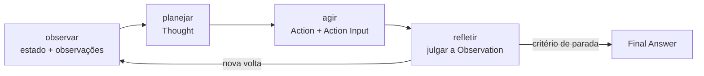
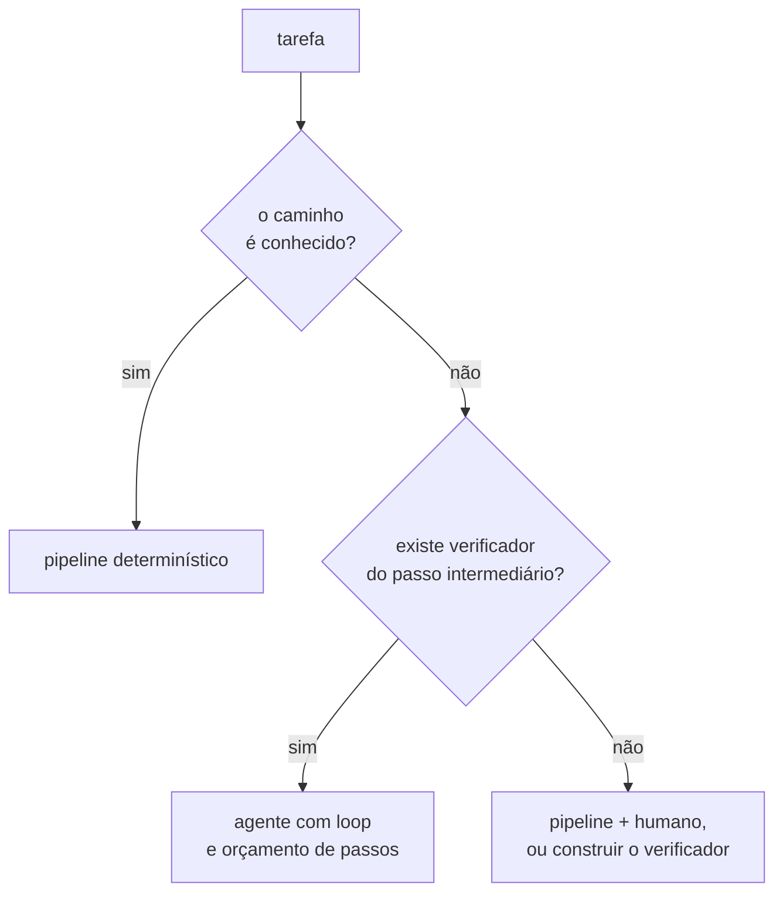
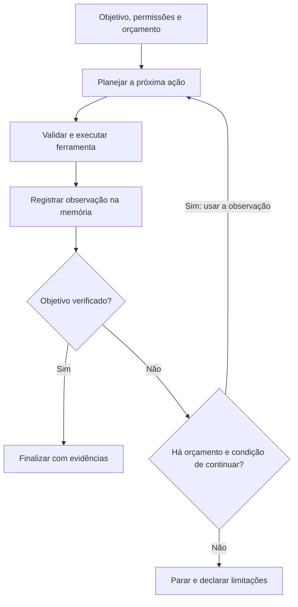
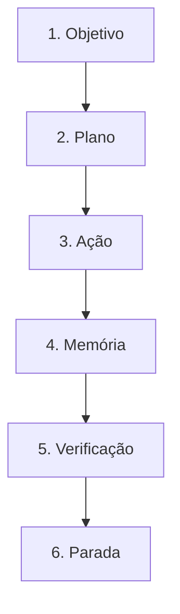

# Especificação de slides — Aula 23 (V2)

> **Rebalanceamento V2.** Esta aula já era conduzida pela aplicação na V1: crava uma definição
> operacional no slide 2 e passa o resto do tempo preenchendo-a com comportamento observável — o
> loop em 40 linhas, os dois testes de decisão, os quatro modos com defeito da demo. Existe **uma**
> conta no fluxo, e só uma: o custo acumulado do laço. O transporte para a V2 preserva o fluxo, a
> ordem dos slides e a faixa das cinco peças, e acrescenta o apêndice com essa conta derivada por
> inteiro (**A.1**), mais os ponteiros. Carga horária, numeração e objetivos inalterados.

<!-- SLIDE-FLOW:GUIDE:BEGIN -->
## Fluxogramas na produção dos slides

As orientações abaixo complementam o campo **Visual** dos slides indicados. Produzir os fluxogramas no próprio deck, como formas e conectores editáveis ou gráficos vetoriais; a biblioteca completa ao final torna esta especificação independente do portal.

- **Referência de composição:** título e propósito no topo, blocos numerados, conexões rotuladas, ramificações legíveis e uma saída identificada. Usar apenas o padrão visual da referência fornecida, sem importar seu assunto ou seus exemplos.
- **Tema do deck:** manter o fundo escuro e a paleta já especificada para a aula. Usar `#5b8cff` para o trecho ativo, tons neutros para o contexto e `#e2231a` conforme o significado definido no deck. Cor sempre acompanhada de rótulo.
- **Leitura:** entrada no topo ou à esquerda; saída na base ou à direita. Decisões em losangos, alternativas com rótulos e retornos apontando à etapa correta. Ramos paralelos convergem apenas onde seus resultados realmente são combinados.
- **Densidade:** no fluxo principal, projetar 3–6 blocos curtos por enquadramento, com corpo legível na última fileira. Um mapa maior pode ser revelado por etapas no mesmo slide. Detalhes, condições e explicações completas ficam nas notas; não reduzir a fonte para caber tudo.
- **Semântica:** mapas de percurso mostram ordem de estudo, não execução de um algoritmo. Manter separadas preparação e aplicação, treino e inferência, sequência e alternativas. Não transformar uma etapa opcional em obrigatória.
- **Integração:** o fluxograma substitui uma lista redundante ou ocupa o campo Visual; não cobre matrizes, tabelas, gráficos nem código indispensáveis. Preservar títulos, numeração, duração e referências aos apêndices.
- **Produção:** os blocos Mermaid abaixo são especificações do desenho. Renderizar/reconstruir como diagrama, nunca projetar o código Mermaid. Manter rótulos, bifurcações, retornos e limites declarados. Não transformar este caderno técnico em slides adicionais.
- **Ligação com o portal:** os mapas de mecanismo compartilham o conteúdo dos fluxogramas do portal. Em demonstrações, usar o mesmo vocabulário no deck e no controle interativo para facilitar a passagem entre os dois.
<!-- SLIDE-FLOW:GUIDE:END -->

## Diretrizes visuais

- **Tema:** escuro, accent `#e2231a` (vermelho CESAR), accent secundário `#5b8cff`.
- **Tipografia:** sans-serif para texto; monoespaçada para código, nomes de ferramenta e trechos de trajetória.
- **Densidade:** máximo 5 linhas de texto por slide. Um conceito por slide.
- **Proibido:** bullets genéricos ("Vantagens", "Desvantagens"); slide-parede de texto; clipart de robô; gráfico sem eixo rotulado.
- **Fórmulas:** renderizar como bloco destacado em monoespaçada, não como imagem de baixa resolução.
- **Elemento recorrente obrigatório:** as cinco peças da definição operacional aparecem como uma faixa de cinco marcas no rodapé dos slides 3 a 13, com a peça em discussão acesa em accent. É o fio visual da aula.

## Arco narrativo

O deck crava uma definição operacional no segundo slide — agente = modelo + ferramentas + loop + objetivo + critério de parada — e usa o resto da aula para preenchê-la: o ciclo de uma volta, o ReAct como padrão de interação, planejamento verificável, e as duas memórias. Na segunda metade a definição sai do slide e vira código na tela, e a partir dali a aula fica adulta: quando **não** usar agente, quanto o loop custa de verdade, e como ele quebra pelos dois lados da parada. Fecha no coding agent, que é o caso em que as cinco peças aparecem sem esforço — e cuja lição é que o que transfere é a arquitetura, não o verificador.

---

# PARTE 1 — FLUXO PRINCIPAL

*O que se apresenta em aula. 15 slides, ~110 min com demo e exercício. A ordem é a da V1 e não foi
alterada: o Slide 1 já abre pelo código que a turma escreveu no lab anterior. A soma do slide 11
continua **enunciada e lida**, com a derivação na Parte 2.*

### Slide 1 — Abertura: vocês já deram mãos ao modelo
- **Tipo:** título
- **Título:** Agentes de IA: loops, planejamento e memória
- **Frase-tese:** No Lab 6 vocês deram mãos ao modelo. Hoje a gente dá um loop e um objetivo.
- **Conteúdo:** Recap da Aula 22 em três marcas: o loop de tool calling na mão · o servidor MCP próprio · Entrega 1 recolhida. Ao lado, o trecho do `while` do Checkpoint 2 do Lab 6 em monoespaçada, com uma seta apontando para ele.
- **Visual:** split. Esquerda, o título grande. Direita, o snippet do `while` do Lab 6 destacado em accent, com a legenda "esta linha é a fronteira".
- **Notas do apresentador:** Se possível, projetar o notebook real do Lab 6 ao lado — a turma reconhece o próprio código e a continuidade fica sentida.

### Slide 2 — A definição operacional

<!-- SLIDE-FLOW:SLIDE:BEGIN -->
- **Fluxograma a incorporar neste slide:** **F00 — Agente: um ciclo com verificação e parada**. O desenho e os rótulos completos estão no caderno de fluxogramas ao final deste arquivo.
- **Composição:** integrar ao campo Visual; preservar exemplos, tabelas, fórmulas e dimensões solicitados neste slide. Destacar o trecho relacionado ao título e manter o restante em segundo plano. Os textos detalhados ficam nas notas, sem duplicar a lista de Conteúdo na tela.
<!-- SLIDE-FLOW:SLIDE:END -->

- **Tipo:** conceito (âncora da aula)
- **Título:** Agente = modelo + ferramentas + loop + objetivo + critério de parada
- **Conteúdo:** As cinco peças, e ao lado de cada uma o que sobra quando ela é retirada:
  - sem **loop** → tool calling da Aula 21 (uma ida, uma volta)
  - sem **ferramentas** → cadeia de pensamento da Aula 13
  - sem **objetivo** → chat
  - sem **critério de parada** → conta de API crescendo
  - sem **modelo** → um pipeline determinístico, e isso pode ser a resposta certa
- **Frase-tese:** Cinco peças. É o único slide que se repete três vezes nesta aula.
- **Visual:** cinco blocos em linha, cada um com ícone geométrico simples. A subtração é uma animação de quatro passos: cada clique apaga uma peça e escreve à direita o que sobrou. Sem animação, cinco pares peça/consequência em duas colunas.
- **Notas do apresentador:** Ir devagar e fazer a subtração em voz alta. Se perguntarem sobre memória: memória é consequência do loop, e são dois slides do Bloco 1.

### Slide 3 — O ciclo: observar, planejar, agir, refletir

<!-- SLIDE-FLOW:SLIDE:BEGIN -->
- **Fluxograma a incorporar neste slide:** **F00 — Agente: um ciclo com verificação e parada**. O desenho e os rótulos completos estão no caderno de fluxogramas ao final deste arquivo.
- **Composição:** integrar ao campo Visual; preservar exemplos, tabelas, fórmulas e dimensões solicitados neste slide. Destacar o trecho relacionado ao título e manter o restante em segundo plano. Os textos detalhados ficam nas notas, sem duplicar a lista de Conteúdo na tela.
<!-- SLIDE-FLOW:SLIDE:END -->

- **Tipo:** diagrama
- **Título:** Observar → planejar → agir → refletir
- **Conteúdo:** As quatro fases com a tradução para o que aparece na trajetória: **observar** = ler pergunta + últimas observações · **planejar** = a linha `Thought` · **agir** = `Action` + `Action Input` · **refletir** = julgar a `Observation` antes da volta seguinte. Rodapé: refletir é um turno a mais de conversa, e turno a mais custa tokens.
- **Visual:** ciclo de quatro caixas com a flecha de retorno destacada em accent — a flecha de retorno é o loop e merece o peso visual. Ao lado, três linhas de trajetória real em monoespaçada, com as fases rotuladas na margem.
- **Notas do apresentador:** Desenhar o ciclo no quadro além do slide. Se a turma conhece laço de realimentação de controle, é a mesma forma.



### Slide 4 — ReAct: intercalar raciocínio e ação

<!-- SLIDE-FLOW:SLIDE:BEGIN -->
- **Fluxograma a incorporar neste slide:** **F00 — Agente: um ciclo com verificação e parada**. O desenho e os rótulos completos estão no caderno de fluxogramas ao final deste arquivo.
- **Composição:** integrar ao campo Visual; preservar exemplos, tabelas, fórmulas e dimensões solicitados neste slide. Destacar o trecho relacionado ao título e manter o restante em segundo plano. Os textos detalhados ficam nas notas, sem duplicar a lista de Conteúdo na tela.
<!-- SLIDE-FLOW:SLIDE:END -->

- **Tipo:** comparação
- **Título:** Raciocinar sem agir erra com convicção. Agir sem raciocinar chama sem critério.
- **Conteúdo:** Três colunas. **Só raciocinar** (CoT, Aula 13): encadeamento plausível sobre fatos que o modelo não tem. **Só agir:** chamadas sem articulação de por quê, e resultado que o modelo não sabe usar. **ReAct** (Yao et al., arXiv 2210.03629): o pensamento condiciona a ação seguinte, a observação corrige o pensamento seguinte. Abaixo, o formato canônico em monoespaçada: `Thought → Action → Action Input → Observation`, com a última volta trocando ação por `Final Answer`.
- **Frase-tese:** ReAct é o padrão de interação; tool calling é o transporte.
- **Visual:** três colunas, a terceira em accent e mais alta. Sob elas, uma trajetória ReAct real de três voltas em monoespaçada, com as quatro linhas rotuladas. Caixa lateral com a separação de camadas: padrão de interação × mecanismo de transporte (Aula 21).
- **Notas do apresentador:** Ponto de prova. O argumento decisivo é que o Lab 7 faz ReAct em texto puro, sem API de ferramentas.

### Slide 5 — Planejamento e decomposição

<!-- SLIDE-FLOW:SLIDE:BEGIN -->
- **Fluxograma a incorporar neste slide:** **F00 — Agente: um ciclo com verificação e parada**. O desenho e os rótulos completos estão no caderno de fluxogramas ao final deste arquivo.
- **Composição:** integrar ao campo Visual; preservar exemplos, tabelas, fórmulas e dimensões solicitados neste slide. Destacar o trecho relacionado ao título e manter o restante em segundo plano. Os textos detalhados ficam nas notas, sem duplicar a lista de Conteúdo na tela.
<!-- SLIDE-FLOW:SLIDE:END -->

- **Tipo:** comparação
- **Título:** Plano antecipado × plano emergente — e o que faz uma subtarefa ser boa
- **Conteúdo:** **Antecipado:** lista de subtarefas antes de agir; bom com estrutura previsível; falha executando plano morto quando o primeiro resultado o invalida. **Emergente:** cada passo decidido com o que já se sabe; robusto a surpresa; perde o fio em tarefa longa. **Na prática:** plano grosso revisado quando a observação o contradiz. Destaque final: subtarefa boa é subtarefa **verificável** — "achar o artigo que fixa o prazo" sim, "entender o regulamento" não.
- **Frase-tese:** Subtarefa boa não é elegante: é conferível.
- **Visual:** duas colunas para as duas famílias, e abaixo uma faixa em accent com dois exemplos contrastantes de subtarefa (verificável × não verificável), marcados com `☑` e `☐`.
- **Notas do apresentador:** Se houver tempo, decompor ao vivo o objetivo de um projeto real da turma em três subtarefas verificáveis. Dois minutos, no máximo.

### Slide 6 — Memória de curto prazo é a trajetória

<!-- SLIDE-FLOW:SLIDE:BEGIN -->
- **Fluxograma a incorporar neste slide:** **F00 — Agente: um ciclo com verificação e parada**. O desenho e os rótulos completos estão no caderno de fluxogramas ao final deste arquivo.
- **Composição:** integrar ao campo Visual; preservar exemplos, tabelas, fórmulas e dimensões solicitados neste slide. Destacar o trecho relacionado ao título e manter o restante em segundo plano. Os textos detalhados ficam nas notas, sem duplicar a lista de Conteúdo na tela.
<!-- SLIDE-FLOW:SLIDE:END -->

- **Tipo:** dados
- **Título:** A memória de curto prazo é a lista de mensagens — e ela é a fatura
- **Conteúdo:** A trajetória como memória: pergunta → pensamento → ação → observação → … Consequência em destaque: o custo por passo não é constante, o passo 6 reenvia os passos 1 a 5. As três táticas: **truncar** (barato, perde informação) · **resumir** (uma chamada a mais, perde detalhe) · **referenciar** (guardar o resultado em arquivo e manter só o caminho no contexto).
- **Frase-tese:** Contexto é recurso, não depósito.
- **Visual:** gráfico de barras crescentes rotulado — eixo x "passo do loop", eixo y "tokens enviados nesta chamada" — mostrando o degrau que acelera. As três táticas como três cartões abaixo, o de "referenciar" em accent (é o menos pensado pela turma).
- **Fundamento:** `c_k = p₀ + (k−1)·d` — o tamanho de cada chamada cresce linearmente na volta, e é
  daí que sai o `n²` do slide 11. As três táticas atacam termos diferentes dessa expressão:
  truncar e resumir derrubam a ordem para linear, referenciar reduz a constante `d`.
  → derivação, tabela das três táticas e a inversão `n_max = ⌊√(2B/d)⌋`: **Apêndice A.1** (slide 16)
- **Notas do apresentador:** A pergunta "e com janela de um milhão de tokens?" vem sempre. Duas respostas: custo cresce com o que se manda; e achar a informação relevante no meio de muito texto degrada.

### Slide 7 — Memória de longo prazo

<!-- SLIDE-FLOW:SLIDE:BEGIN -->
- **Fluxograma a incorporar neste slide:** **F00 — Agente: um ciclo com verificação e parada**. O desenho e os rótulos completos estão no caderno de fluxogramas ao final deste arquivo.
- **Composição:** integrar ao campo Visual; preservar exemplos, tabelas, fórmulas e dimensões solicitados neste slide. Destacar o trecho relacionado ao título e manter o restante em segundo plano. Os textos detalhados ficam nas notas, sem duplicar a lista de Conteúdo na tela.
<!-- SLIDE-FLOW:SLIDE:END -->

- **Tipo:** conceito
- **Título:** O que sobrevive ao fim da trajetória
- **Conteúdo:** Três formas: arquivo de fatos aprendidos · tabela de preferências/perfil · índice vetorial de episódios anteriores (o RAG do Módulo 5 apontado para o próprio histórico). As duas decisões que importam, em destaque: **o que promover** e **como recuperar** só o pedaço relevante. Alerta: sem critério de promoção, a memória polui todo prompt futuro e o agente piora com o tempo. Distinção final: trajetória inteira é **auditoria** (Aula 26); memória de longo prazo é o **destilado** dela.
- **Frase-tese:** Sem critério de promoção, o agente piora com o tempo.
- **Visual:** dois retângulos com fronteira marcada — "dentro da sessão" e "entre sessões" — e uma seta atravessando a fronteira rotulada "promoção (critério explícito)". Abaixo, as três formas como três ícones com legenda curta.
- **Notas do apresentador:** Responder por mecanismo, sem citar marca de produto. Quase todo "produto com memória" é uma dessas três formas mais um critério de promoção escondido.

### Slide 8 — Reflexão e autocorreção — e o limite dela

<!-- SLIDE-FLOW:SLIDE:BEGIN -->
- **Fluxograma a incorporar neste slide:** **F00 — Agente: um ciclo com verificação e parada**. O desenho e os rótulos completos estão no caderno de fluxogramas ao final deste arquivo.
- **Composição:** integrar ao campo Visual; preservar exemplos, tabelas, fórmulas e dimensões solicitados neste slide. Destacar o trecho relacionado ao título e manter o restante em segundo plano. Os textos detalhados ficam nas notas, sem duplicar a lista de Conteúdo na tela.
<!-- SLIDE-FLOW:SLIDE:END -->

- **Tipo:** comparação
- **Título:** Autocrítica com verificador × autocrítica sem verificador
- **Conteúdo:** **Com sinal externo** (ferramenta devolveu erro, teste falhou, busca voltou vazia): a reflexão tem o que morder e a trajetória se corrige. **Sem sinal externo:** a autocrítica é confirmatória — o modelo defende o que acabou de escrever, ou muda de opinião sem informação nova. Amarra explícita com a Aula 16: recompensa verificável é o que transforma tentativa em aprendizado, no treino e dentro de uma única trajetória.
- **Frase-tese:** O agente diz "revisei e está correto" com a mesma fluência com que diria o contrário.
- **Visual:** dois cartões contrastantes. O da esquerda com um sinal externo entrando (ícone de teste falhando) e uma seta de correção; o da direita fechado em si mesmo, com a seta voltando para o próprio cartão. Rodapé: "intervalo de 10 min" discreto.
- **Notas do apresentador:** Último slide antes do intervalo. Avisar que a volta começa com código na tela. Deixar o terminal aberto e o script testado antes do intervalo.

### Slide 9 — [Demo] O loop em 40 linhas

<!-- SLIDE-FLOW:SLIDE:BEGIN -->
- **Fluxograma a incorporar neste slide:** **F00 — Agente: um ciclo com verificação e parada**. O desenho e os rótulos completos estão no caderno de fluxogramas ao final deste arquivo.
- **Composição:** integrar ao campo Visual; preservar exemplos, tabelas, fórmulas e dimensões solicitados neste slide. Destacar o trecho relacionado ao título e manter o restante em segundo plano. Os textos detalhados ficam nas notas, sem duplicar a lista de Conteúdo na tela.
<!-- SLIDE-FLOW:SLIDE:END -->

- **Tipo:** transição para demonstração
- **Título:** Cinco peças, cinco trechos, um arquivo
- **Frase-tese:** O que separa um chat de um agente são umas trinta linhas.
- **Conteúdo:** Os quatro modos que a demo roda, listados sem resultado: `--normal` · `--sem-parada` · `--sem-orcamento` · `--parada-precoce`. Abaixo, as cinco peças como cinco rótulos esperando ser apontados no código.
- **Visual:** slide quase vazio, de transição. Só o título, os quatro modos em monoespaçada e a faixa das cinco peças, todas apagadas — elas acendem na tela do terminal, não no slide.
- **Notas do apresentador:** `codigo/demo-loop-agente.py`, offline, sem dependências. Passos na Parte 2 do roteiro. Tom de anticlímax deliberado.

### Slide 10 — Agente × workflow determinístico
- **Tipo:** conceito (árvore de decisão)
- **Título:** Dois testes, nesta ordem
- **Conteúdo:** **Teste 1 — o caminho é conhecido?** Se a sequência é sempre a mesma, é pipeline: código previsível, testável e barato. **Teste 2 — existe verificador para o passo intermediário?** Com verificador, o loop explora com segurança porque o erro é detectado dentro da trajetória. Sem verificador, o loop propaga erro com autoridade. Amarra com a Aula 16 (recompensa verificável), agora como decisão de arquitetura. Alerta em destaque: complexidade não pede agente — **incerteza intermediária com verificação possível** pede agente.
- **Frase-tese:** Sem verificador, o loop não explora: ele propaga erro com autoridade.
- **Visual:** árvore de decisão com dois nós e três folhas: caminho conhecido → **pipeline**; caminho incerto + verificador → **agente**; caminho incerto sem verificador → **pipeline com humano, ou construir o verificador primeiro**. Analogia no rodapé: GPS com trânsito × trilho de trem.
- **Notas do apresentador:** Este é o slide que mais volta na Entrega 2. Vale gastar os dez minutos inteiros.



### Slide 11 — Custo e latência do loop

<!-- SLIDE-FLOW:SLIDE:BEGIN -->
- **Fluxograma a incorporar neste slide:** **F00 — Agente: um ciclo com verificação e parada**. O desenho e os rótulos completos estão no caderno de fluxogramas ao final deste arquivo.
- **Composição:** integrar ao campo Visual; preservar exemplos, tabelas, fórmulas e dimensões solicitados neste slide. Destacar o trecho relacionado ao título e manter o restante em segundo plano. Os textos detalhados ficam nas notas, sem duplicar a lista de Conteúdo na tela.
<!-- SLIDE-FLOW:SLIDE:END -->

- **Tipo:** dados
- **Título:** O custo não é linear nos passos — é quadrático
- **Conteúdo:** Um chat é 1 chamada; um agente de 6 passos são 7 chamadas, cada uma reenviando a trajetória. A soma, em bloco destacado:
  ```
  total_enviado ≈ d + 2d + 3d + … + nd = d · n(n+1)/2 ≈ d·n²/2
  ```
  Latência é sequencial por construção: o passo 4 não começa antes de o 3 voltar — não há paralelismo a extrair. Conclusão: `max_passos` é decisão de produto (teto de custo por pergunta, teto de espera do usuário), não defensividade.
- **Frase-tese:** `max_passos` é requisito de produto, não paranoia de programador.
- **Visual:** dois gráficos pequenos lado a lado, ambos com eixos rotulados: tokens acumulados × passos (curva acelerando) e latência acumulada × passos (reta somando, sem paralelismo). A fórmula entre eles, em bloco monoespaçado.
- **Fundamento:** `T(n) = Σ_{k} c_k = d·n(n+1)/2 ≈ d·n²/2`, logo a estimativa ingênua `n·d`
  subestima por um fator `(n+1)/2` — com 6 passos, **3,5×**. E `max_passos` é a solução de
  `d·n²/2 ≤ B`, isto é `n_max = ⌊√(2B/d)⌋`: dobrar o orçamento não dobra os passos.
  → soma passo a passo, latência sequencial, os cinco casos-limite: **Apêndice A.1** (slide 16)
- **Notas do apresentador:** Escrever a soma no quadro além do slide. Para número concreto, citar o que a demo imprimiu, não um número inventado.

### Slide 12 — Paradas mal projetadas

<!-- SLIDE-FLOW:SLIDE:BEGIN -->
- **Fluxograma a incorporar neste slide:** **F00 — Agente: um ciclo com verificação e parada**. O desenho e os rótulos completos estão no caderno de fluxogramas ao final deste arquivo.
- **Composição:** integrar ao campo Visual; preservar exemplos, tabelas, fórmulas e dimensões solicitados neste slide. Destacar o trecho relacionado ao título e manter o restante em segundo plano. Os textos detalhados ficam nas notas, sem duplicar a lista de Conteúdo na tela.
<!-- SLIDE-FLOW:SLIDE:END -->

- **Tipo:** comparação
- **Título:** O loop que não termina × o que termina cedo
- **Conteúdo:** **Não termina:** ferramenta falhando sempre, observação que não responde, prompt sem forma de encerrar. Sintomas: mesma ação com mesmo argumento; duas ações em ciclo A-B-A-B. Mitigações: orçamento de passos · detector de repetição · resposta de fallback declarada. **Termina cedo:** formato de parada fácil de emitir por acidente, ou primeira observação que pareceu suficiente. Sintoma: `Final Answer` no passo 1, sem nenhuma ação. Mitigação: exigir que a resposta final cite a observação que a sustenta.
- **Frase-tese:** O loop infinito dói na fatura. A parada precoce entrega resposta plausível sem evidência — e só aparece se alguém olhar a trajetória.
- **Visual:** dois cartões. Esquerda, uma trajetória com a mesma linha repetida quatro vezes, em vermelho, com um cifrão. Direita, uma trajetória de uma única linha `Final Answer: …` que parece limpa e boa, marcada com uma lupa. A lupa é a Aula 26.
- **Notas do apresentador:** A demo já mostrou os dois modos. Reexibir as duas saídas lado a lado se a projeção permitir. Faixa usual de `max_passos` nos casos de aula: 4 a 8, e a resposta honesta é medir.

### Slide 13 — Estudo de caso: um coding agent numa issue real

<!-- SLIDE-FLOW:SLIDE:BEGIN -->
- **Fluxograma a incorporar neste slide:** **F00 — Agente: um ciclo com verificação e parada**. O desenho e os rótulos completos estão no caderno de fluxogramas ao final deste arquivo.
- **Composição:** integrar ao campo Visual; preservar exemplos, tabelas, fórmulas e dimensões solicitados neste slide. Destacar o trecho relacionado ao título e manter o restante em segundo plano. Os textos detalhados ficam nas notas, sem duplicar a lista de Conteúdo na tela.
<!-- SLIDE-FLOW:SLIDE:END -->

- **Tipo:** conceito (aplicação da definição)
- **Título:** As cinco peças, sem esforço de interpretação
- **Conteúdo:** **Objetivo:** o texto da issue. **Ferramentas:** buscar no repo, ler arquivo, editar, rodar testes, rodar linter, abrir diff. **Loop:** localizar → hipótese → editar → rodar teste → ler falha → editar. **Curto prazo:** arquivos lidos e saídas de teste da sessão. **Parada:** a suíte passa. Lição em destaque: funciona porque existe verificador **barato, automático e não negociável** — o teste. Onde o verificador é caro ou não existe (UX, arquitetura, política interna), o mesmo modelo com o mesmo loop rende muito menos. Referência de benchmark: SWE-bench, arXiv 2310.06770 (retomado na Aula 26).
- **Frase-tese:** A arquitetura transfere de domínio para domínio. O verificador não.
- **Visual:** a faixa das cinco peças, agora com todas acesas, e sob cada peça o item concreto do coding agent. Ao lado, um selo em accent: "verificador = suíte de testes".
- **Notas do apresentador:** Não citar taxas de sucesso de cabeça — os números do SWE-bench são da Aula 26 e mudam rápido. Não abrir discussão sobre ferramentas comerciais.

### Slide 14 — [Exercício] Agente ou pipeline?
- **Tipo:** exercício
- **Título:** Em dupla, 4 minutos: A ou P, qual verificador, por quê
- **Conteúdo:** Os cinco cenários, redigidos como aparecem na tela:
  1. Converter 4.000 notas fiscais em PDF numa tabela de 7 campos fixos, todos com o mesmo layout
  2. Responder perguntas sobre o regulamento citando o dispositivo, sobre o acervo do Lab 5
  3. Corrigir um bug de teste vermelho num repositório com suíte rápida
  4. Escrever a política de privacidade da empresa a partir de 6 documentos internos
  5. Reconciliar duas planilhas de pagamento com regra de reconciliação já definida no manual
- **Frase-tese:** Escrever "nenhum verificador" não é falhar no exercício — é o achado.
- **Visual:** os cinco cenários como lista numerada, com três colunas vazias à direita: `A/P` · `verificador` · `por quê`. Cronômetro de 4 min no canto.
- **Notas do apresentador:** Condução na Parte 3 do roteiro. Corrigir o 1 com voluntário, o 3 em dez segundos, e gastar o resto no 4. Se o tempo apertou, cortar para os cenários 1, 3 e 4.

### Slide 15 — Fechamento: a definição, terceira vez

<!-- SLIDE-FLOW:SLIDE:BEGIN -->
- **Fluxograma a incorporar neste slide:** **F01 — O percurso desta aula**. O desenho e os rótulos completos estão no caderno de fluxogramas ao final deste arquivo.
- **Composição:** integrar ao campo Visual; preservar exemplos, tabelas, fórmulas e dimensões solicitados neste slide. Destacar o trecho relacionado ao título e manter o restante em segundo plano. Os textos detalhados ficam nas notas, sem duplicar a lista de Conteúdo na tela.
<!-- SLIDE-FLOW:SLIDE:END -->

- **Tipo:** encerramento
- **Título:** O checklist que vai para a Entrega 2
- **Conteúdo:** As cinco peças como cinco linhas a preencher para o projeto da equipe, seguidas dos dois testes do slide 10. As três respostas defensáveis quando não há verificador: construir um verificador · pôr humano no laço (Aula 26) · assumir que é pipeline e escrever um pipeline. Depois, as duas tarefas da semana: rodar a demo nos quatro modos e nomear a peça ausente em cada um; ler o ReAct (arXiv 2210.03629) com a pergunta dirigida — qual modo de falha só aparece no raciocínio isolado, e por que a observação de uma ferramenta o elimina.
- **Frase-tese:** Se uma dessas cinco linhas estiver em branco na Aula 26, o problema não é o modelo — é o projeto.
- **Visual:** o checklist das cinco peças em caixa destacada, com campos em branco, desenhado para ser fotografado. Rodapé: "Aula 24 — Sistemas multiagente e orquestração: hoje foi um agente; semana que vem, vários — e metade da aula é sobre por que você provavelmente não precisa deles."
- **Notas do apresentador:** Projetar o checklist e ficar 20 s em silêncio para a turma fotografar. Não estourar o horário.

---

# PARTE 2 — APÊNDICE MATEMÁTICO

*Material de estudo e consulta. **Não se apresenta em aula.** Esta aula tem **um** item de apêndice,
e é o único ponto do fluxo em que existe uma conta: o custo acumulado do laço. O item reúne a soma,
a leitura dela em latência, a inversão que transforma um orçamento de tokens num `max_passos`, e a
justificativa formal das três táticas de controle de trajetória do slide 6. Autossuficiente — quem
estuda por aqui sem ter assistido à aula consegue reconstruir tudo.*

### Slide 16 — A.1 · O custo acumulado do laço, e o `max_passos` como consequência

<!-- SLIDE-FLOW:SLIDE:BEGIN -->
- **Fluxograma a incorporar neste slide:** **F00 — Agente: um ciclo com verificação e parada**. O desenho e os rótulos completos estão no caderno de fluxogramas ao final deste arquivo.
- **Composição:** integrar ao campo Visual; preservar exemplos, tabelas, fórmulas e dimensões solicitados neste slide. Destacar o trecho relacionado ao título e manter o restante em segundo plano. Os textos detalhados ficam nas notas, sem duplicar a lista de Conteúdo na tela.
<!-- SLIDE-FLOW:SLIDE:END -->

- **Tipo:** apêndice — derivação completa
- **Invocado em:** slides 6 e 11

**Notação.**
`n ∈ ℕ` — número de voltas do laço até a resposta final.
`p₀ ∈ ℕ` — tokens fixos de toda chamada: prompt de sistema, catálogo de ferramentas e a pergunta.
`d ∈ ℕ` — tokens que **uma volta acrescenta** à trajetória, em média: o pensamento, a ação, os
argumentos e a observação devolvida pela ferramenta. `d` é dominado pela **observação**, e é por isso
que uma ferramenta que devolve 40 linhas de JSON custa mais que uma que devolve três campos.
`c_k ∈ ℕ` — tokens **enviados** na chamada `k` (o prompt daquela chamada, não a resposta).
`ℓ_k` — latência da chamada `k`.
`T(n) = Σ_k c_k` — total de tokens enviados ao longo da trajetória.

**Premissas.** (i) Nada é descartado da trajetória: toda volta é reenviada nas voltas seguintes —
que é exatamente o que o loop do slide 9 faz, com um `append` na lista de mensagens. (ii) `d` é
aproximadamente constante entre voltas. As duas premissas são o caso-base; o que acontece quando
elas caem está no fim deste item, e é a justificativa das três táticas do slide 6.

**Etapa 1 — o tamanho de cada chamada.**
Na chamada `k`, o modelo recebe o prompt fixo mais o que aconteceu nas `k−1` voltas anteriores mais
o pensamento da volta corrente:
```
c_1 = p₀
c_2 = p₀ + d
c_3 = p₀ + 2d
...
c_k = p₀ + (k−1)·d
```

**Etapa 2 — a soma.**
```
T(n) = Σ_{k=1}^{n} [ p₀ + (k−1)·d ]
     = n·p₀ + d · Σ_{k=1}^{n} (k−1)
     = n·p₀ + d · Σ_{j=0}^{n−1} j
     = n·p₀ + d · (n−1)n/2
```
*Justificativa da última linha:* soma dos `n−1` primeiros inteiros, `Σ_{j=0}^{n−1} j = (n−1)n/2`.

Com a síntese final contada como uma volta a mais (o slide 11 conta `n` voltas **mais** a síntese, e
é assim que se conta na fatura), o índice sobe para `n+1` e a forma usual do fluxo aparece:
```
T ≈ d + 2d + 3d + … + n·d = d · n(n+1)/2 ≈ d·n²/2     quando  n·d ≫ p₀
```
**O total enviado cresce com o quadrado do número de passos.** Número de chamadas: `n + 1`.

**Etapa 3 — o fator pelo qual a estimativa ingênua erra.**
A estimativa que quase todo mundo faz é "custo de uma chamada vezes número de passos", isto é
`n·d`. Comparando:
```
T(n) / (n·d) = [ d·n(n+1)/2 ] / (n·d) = (n + 1)/2
```
**A estimativa ingênua subestima por um fator `(n+1)/2`.** Leitura direta:
```
n = 2   →  1,5×
n = 6   →  3,5×
n = 10  →  5,5×
n = 20  →  10,5×
```
*Número concreto,* com `d = 1 000` tokens por volta e `p₀` desprezível:
```
n = 6   →  T ≈ 1000 · 6·7/2 = 21 000 tokens enviados,  em 7 chamadas
estimativa ingênua: 6 000 tokens  →  erro de 3,5×
```
É essa razão, e não o número absoluto, que se leva para a discussão de orçamento — o absoluto
depende do `d` do sistema de cada equipe, e a demo desta aula imprime o `d` real dela na coluna de
tokens acumulados.

**Etapa 4 — latência, e por que não há paralelismo a extrair.**
```
L(n) = Σ_{k=1}^{n+1} ℓ_k
```
A soma é **sequencial por construção**: a chamada `k+1` precisa da observação produzida pela ação da
chamada `k`, logo não existe reordenação que as sobreponha. Isto é uma dependência de dados, não uma
limitação de implementação. Com `ℓ_k ≈ 3 s` e `n = 6`, `L ≈ 21 s`.

*Uma correção honesta para cima:* `ℓ_k` não é constante. O tempo de *prefill* cresce com o número de
tokens do prompt, e `c_k` cresce linearmente em `k` (Etapa 1). Se o prefill domina, `ℓ_k ∝ c_k` e
então `L(n)` também cresce de forma quadrática, não linear. Cache de prefixo, quando o provedor
oferece, reduz a **constante** desse termo — não a ordem de crescimento, porque o sufixo novo de cada
volta continua sendo processado.

**Etapa 5 — a inversão: de orçamento para `max_passos`.**
Se o requisito de produto é "no máximo `B` tokens enviados por pergunta", basta resolver
`d·n²/2 ≤ B`:
```
n_max = ⌊ √( 2B / d ) ⌋
```
*Números concretos:*
```
B = 100 000 tokens,  d = 1 000  →  n_max = ⌊√200⌋  = 14
B =  20 000 tokens,  d = 1 000  →  n_max = ⌊√40⌋   =  6
B =  20 000 tokens,  d = 4 000  →  n_max = ⌊√10⌋   =  3
```
**Leitura, e é a tese do slide 11:** `max_passos` não é defensividade de programador — é a solução de
uma desigualdade cujos dois lados são requisitos (teto de custo por pergunta e teto de espera do
usuário). E note o efeito da raiz quadrada: **dobrar o orçamento não dobra os passos permitidos**,
aumenta-os por `√2 ≈ 1,41`. Comprar o dobro de exploração custa quatro vezes mais.

*O caminho mais barato para ganhar passos é reduzir `d`, não aumentar `B`.* Como `n_max ∝ 1/√d`:
cortar a observação média pela metade multiplica `n_max` por `√2 ≈ 1,41`, e reduzir `d` a um quarto
**dobra** `n_max` — sem gastar um token a mais de orçamento. É a justificativa quantitativa da
terceira tática do slide 6.

**Etapa 6 — o que as três táticas do slide 6 mudam na ordem de crescimento.**

Todas as três atacam a premissa (i). A diferença entre elas é qual termo elas atingem:
```
base (nada descartado)        c_k = p₀ + (k−1)d          T(n) = Θ(d·n²)
truncar (janela de w voltas)  c_k ≤ p₀ + w·d             T(n) ≤ n(p₀ + w·d) = Θ(n)
resumir (passado vira s)      c_k ≈ p₀ + s,  s ≪ k·d     T(n) = Θ(n)  + custo das chamadas de resumo
referenciar (guarda caminho)  d → d′ ≪ d                 T(n) = Θ(d′·n²),  com a constante reduzida
```
*Leituras:*
- **Truncar** e **resumir** mudam a **ordem** de crescimento de quadrática para linear, e é isso que
  as torna as únicas duas opções viáveis para trajetórias longas. O preço está declarado no slide 6:
  truncar perde informação; resumir custa uma chamada a mais por resumo e perde detalhe.
- **Referenciar** não muda a ordem — continua `n²` — mas ataca a constante, que é onde o custo real
  mora em trajetórias curtas (`n` entre 4 e 8, que é a faixa desta aula). Guardar 40 linhas de JSON
  em arquivo e manter só `saida/busca_03.json` no contexto pode reduzir `d` por uma ordem de
  grandeza, e pela Etapa 5 isso multiplica `n_max` por `√10 ≈ 3,2`. É a tática menos pensada pela
  turma e a de melhor retorno no regime desta disciplina.

**Casos-limite.**
- `n = 1` — `T = p₀` e há uma única chamada mais a síntese. É o tool calling da Aula 21: sem loop,
  sem crescimento. A fórmula degenera corretamente.
- `d = 0` — nada é acrescentado por volta e `T = n·p₀`, linear. É o limite teórico de uma ferramenta
  que devolve observação vazia, e ele mostra que o termo quadrático é **inteiramente** devido ao
  reenvio da trajetória, não ao número de chamadas.
- `p₀ ≫ n·d` — catálogo de ferramentas gigante e observações pequenas. Aí o termo linear `n·p₀`
  domina e a conta quadrática deixa de ser o problema: o problema é o catálogo. É o caso de quem
  registra vinte ferramentas para usar duas, e é a razão de "estreita" ser a primeira das seis
  propriedades da Aula 21.
- Janela de contexto grande — a fórmula não muda. Janela grande adia o **erro de limite** e não
  altera o custo, porque o custo depende do que se **manda**, não do que caberia. É a resposta
  formal para a pergunta que sempre aparece no slide 6.

**Intuição.** O laço é um acumulador: cada volta escreve na trajetória e todas as voltas seguintes
pagam por aquela escrita. Um agente de `n` passos não paga `n` vezes — ele paga a soma dos primeiros
`n` inteiros, que é a área de um triângulo de lado `n`. Daí o `n²/2`.

**De volta ao fluxo:** slides 6 e 11.

<!-- SLIDE-FLOW:LIBRARY:BEGIN -->
# Caderno de fluxogramas para produção

As referências Fxx identificam desenhos, não novos números de slide. Cada desenho abaixo é autocontido.

| Mapa | Desenho | Usar nos slides |
| --- | --- | --- |
| F00 | Agente: um ciclo com verificação e parada | 2, 3, 4, 5, 6, 7, 8, 9, 11, 12, 13, 16 |
| F01 | O percurso desta aula | 15 |

## F00 — Agente: um ciclo com verificação e parada

Cada volta combina estado, decisão, ação e evidência.



**Conteúdo dos blocos e notas de montagem:**

1. **Ler objetivo e estado:** Defina sucesso, permissões e limites de passos, tempo ou custo.
2. **Planejar a próxima ação:** Use observações anteriores para escolher uma ação ou finalizar.
3. **Validar e executar:** O host confere argumentos e permissão antes de chamar a ferramenta.
4. **Registrar a observação:** Atualize a memória com o que aconteceu, incluindo erros.
5. **Verificar o resultado:** O objetivo foi atendido e há evidência suficiente?
   Ramos/alternativas a rotular: Sim → finalizar com evidências; Não, há orçamento → revisar o plano; Não, limite atingido → encerrar com limitações.
   ↺ Uma nova tentativa retorna ao planejamento, usando a observação obtida.

**Saída ou limite a explicitar:** Saída: resultado acompanhado da trajetória ou uma parada justificada.

## F01 — O percurso desta aula

As setas indicam a ordem de estudo. Abra cada etapa para entender sua função.



**Conteúdo dos blocos e notas de montagem:**

1. **Objetivo:** Defina resultado esperado e critério de sucesso.
2. **Plano:** Decomponha a tarefa usando o estado observado.
3. **Ação:** Valide e execute uma ação por ferramenta.
4. **Memória:** Registre observações úteis para a próxima decisão.
5. **Verificação:** Confira o resultado com evidência externa.
6. **Parada:** Finalize por sucesso, limite ou falta de condição.

**Saída ou limite a explicitar:** Conecte as etapas: explique como uma decisão afeta o que você observa em seguida.
<!-- SLIDE-FLOW:LIBRARY:END -->

