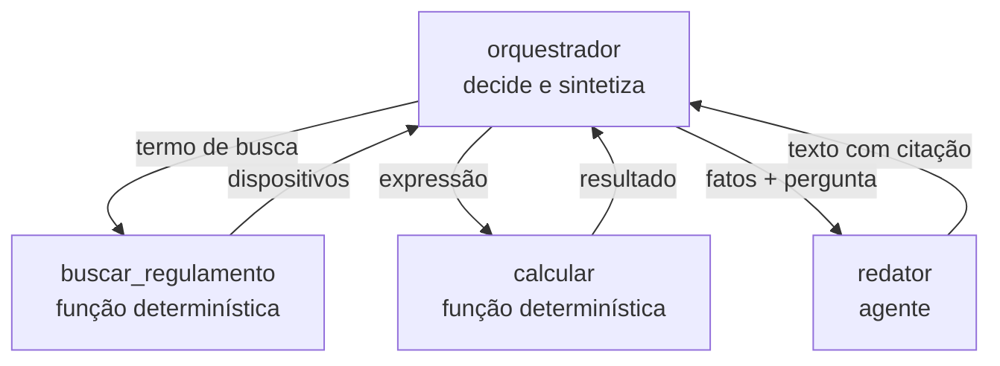
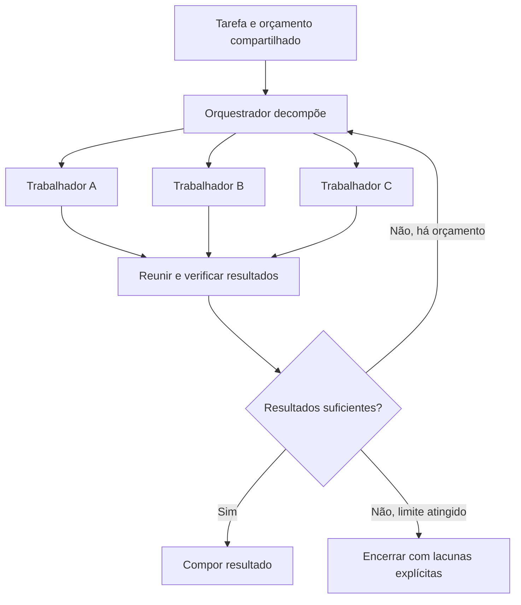
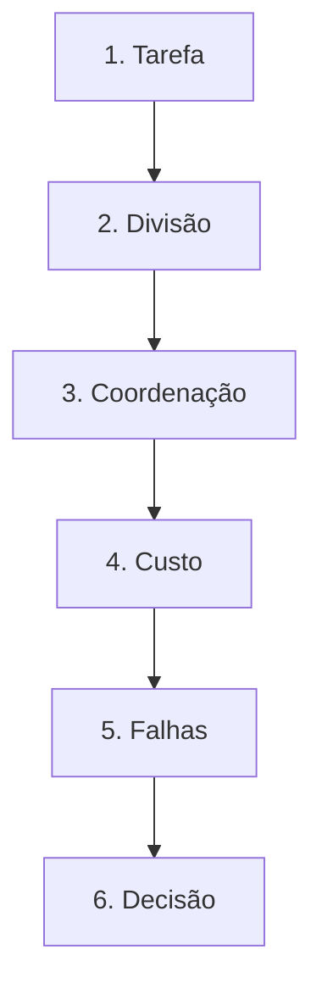

# Especificação de slides — Aula 24 (V2)

> **Rebalanceamento V2.** Esta aula já era conduzida pela aplicação na V1: abre desarmando uma
> expectativa, mede a diferença entre duas arquiteturas com três números na tela, e entrega um
> instrumento de decisão em vez de um catálogo. Existem **duas** contas no fluxo — a taxa de sucesso
> composta (slide 11) e a aritmética de orçamentos e latência (slide 10) —, e as duas viraram itens
> do apêndice, com derivação completa, inversões e casos-limite. O fluxo, a ordem dos slides e a
> convenção visual dos diagramas são os da V1. Carga horária, numeração e objetivos inalterados.

<!-- SLIDE-FLOW:GUIDE:BEGIN -->
## Fluxogramas na produção dos slides

As orientações abaixo complementam o campo **Visual** dos slides indicados. Produzir os fluxogramas no próprio deck, como formas e conectores editáveis ou gráficos vetoriais; a biblioteca completa ao final torna esta especificação independente do portal.

- **Referência de composição:** título e propósito no topo, blocos numerados, conexões rotuladas, ramificações legíveis e uma saída identificada. Usar apenas o padrão visual da referência fornecida, sem importar seu assunto ou seus exemplos.
- **Tema do deck:** manter o fundo escuro e a paleta já especificada para a aula. Usar `#5b8cff` para o trecho ativo, tons neutros para o contexto e `#e2231a` conforme o significado definido no deck. Cor sempre acompanhada de rótulo.
- **Leitura:** entrada no topo ou à esquerda; saída na base ou à direita. Decisões em losangos, alternativas com rótulos e retornos apontando à etapa correta. Ramos paralelos convergem apenas onde seus resultados realmente são combinados.
- **Densidade:** no fluxo principal, projetar 3–6 blocos curtos por enquadramento, com corpo legível na última fileira. Um mapa maior pode ser revelado por etapas no mesmo slide. Detalhes, condições e explicações completas ficam nas notas; não reduzir a fonte para caber tudo.
- **Semântica:** mapas de percurso mostram ordem de estudo, não execução de um algoritmo. Manter separadas preparação e aplicação, treino e inferência, sequência e alternativas. Não transformar uma etapa opcional em obrigatória.
- **Integração:** o fluxograma substitui uma lista redundante ou ocupa o campo Visual; não cobre matrizes, tabelas, gráficos nem código indispensáveis. Preservar títulos, numeração, duração e referências aos apêndices.
- **Produção:** os blocos Mermaid abaixo são especificações do desenho. Renderizar/reconstruir como diagrama, nunca projetar o código Mermaid. Manter rótulos, bifurcações, retornos e limites declarados. Não transformar este caderno técnico em slides adicionais.
- **Ligação com o portal:** os mapas de mecanismo compartilham o conteúdo dos fluxogramas do portal. Em demonstrações, usar o mesmo vocabulário no deck e no controle interativo para facilitar a passagem entre os dois.
<!-- SLIDE-FLOW:GUIDE:END -->

## Diretrizes visuais

- **Tema:** escuro, accent `#e2231a` (vermelho CESAR), accent secundário `#5b8cff`.
- **Tipografia:** sans-serif para texto; monoespaçada para números de custo, fórmulas e nomes de padrão.
- **Densidade:** máximo 5 linhas de texto por slide. Um conceito por slide.
- **Proibido:** bullets genéricos ("Vantagens", "Desvantagens"); slide-parede de texto; clipart de robôs conversando; diagrama de arquitetura sem indicar quem decide.
- **Convenção obrigatória dos diagramas de padrão:** caixa com borda cheia = agente (tem loop); caixa com borda tracejada = função determinística; seta rotulada = o que trafega. A legenda dessa convenção aparece nos slides 4 a 7.
- **Elemento recorrente:** as três razões (especialização · paralelismo · contexto por agente) ficam como faixa de rodapé nos slides 4 a 15, com a razão em jogo acesa em accent.

## Arco narrativo

O deck começa desarmando a expectativa: multiagente é resposta a limites concretos, não um degrau de sofisticação. O primeiro bloco apresenta as três razões legítimas de dividir e os quatro padrões, cada um com quem decide e quanto custa. A virada é a demo: a mesma tarefa em duas arquiteturas, com três números na tela. Daí em diante o deck cobra o preço — coordenação, produto dos tetos, `p^N` — e entrega o instrumento que o aluno leva para a Entrega 2: o teste de três perguntas. Fecha com frameworks reduzidos ao que fazem (organizar chamadas) e a ponte para o Lab 7, onde o loop é escrito na mão antes de qualquer biblioteca.

---

# PARTE 1 — FLUXO PRINCIPAL

*O que se apresenta em aula. 16 slides, ~110 min com demo e exercício. A ordem é a da V1 e não foi
alterada: o Slide 2 já crava a tese e o Slide 8 já traz número medido. As duas fórmulas do fluxo
continuam **enunciadas e lidas com um número ao lado** — `0,95⁵ = 0,77` e `5 × 5 = 25` —, e a
derivação, as inversões e os casos-limite estão na Parte 2.*

### Slide 1 — Abertura: um agente virou vários
- **Tipo:** título
- **Título:** Sistemas multiagente e orquestração
- **Frase-tese:** Semana passada foi um agente. Hoje são vários — e boa parte da aula é sobre por que você não precisa deles.
- **Conteúdo:** Recap da Aula 23 em duas marcas: as cinco peças (modelo · ferramentas · loop · objetivo · critério de parada) e os dois testes (caminho conhecido? verificador possível?). Uma linha sobre o coding agent: a arquitetura transfere, o verificador não.
- **Visual:** título grande, e no rodapé a faixa das cinco peças da Aula 23 em cinza, ainda visível — sinaliza continuidade sem repetir o slide.
- **Notas do apresentador:** Recuperação de 30 s basta para quem faltou; as cinco peças estão no material da Aula 23.

### Slide 2 — A tese: multiagente é resposta a limite, não degrau de sofisticação
- **Tipo:** conceito
- **Título:** Multiagente é resposta a limite, não degrau de sofisticação
- **Conteúdo:** Quando um limite concreto dói (especialização, paralelismo, contexto), dividir é a resposta certa. Quando nenhum dói, dividir acrescenta coordenação, custo e classe nova de falha — sem acrescentar capacidade. Em destaque: **muito do que é vendido como multiagente resolve melhor com um agente e boas ferramentas** — e ferramenta bem descrita é mais barata, mais testável e mais previsível que um agente (Lab 6: descrição de ferramenta é prompt).
- **Frase-tese:** Se nenhum limite está doendo, dividir só acrescenta coordenação e fatura.
- **Visual:** balança em duas colunas. Esquerda, "um agente + N ferramentas": um loop, uma trajetória, uma fatura. Direita, "N agentes": N loops, N trajetórias, coordenação. A analogia monólito × microserviços como legenda em accent.
- **Notas do apresentador:** É o slide que a turma cita de volta no exercício e na Entrega 2. Deixar claro que a aula é revisão de arquitetura, não julgamento — reduz defensividade no slide 12.

### Slide 3 — As três razões que se sustentam
- **Tipo:** conceito
- **Título:** Especialização · paralelismo · contexto por agente
- **Conteúdo:** **Especialização:** prompt, catálogo de ferramentas e critério de sucesso próprios → menos opções por decisão, menos erro de seleção. **Paralelismo:** subtarefas independentes ao mesmo tempo → ganho em **latência de parede, não em custo**. **Contexto por agente:** cada agente carrega só a trajetória do seu pedaço → evita a degradação da Aula 23. Alerta em destaque: "o prompt ficou grande" não é razão — prompt grande pede edição de prompt; **trajetória** grande pede divisão.
- **Frase-tese:** Se você não consegue nomear qual das três, você não tem razão para dividir — tem gosto.
- **Visual:** três cartões numerados, cada um com o ganho e, em letra menor e em accent, o que ele **não** dá (razão 2: "não reduz custo"). Rodapé: nenhuma das três razões é economia.
- **Fundamento:** paralelismo compra **latência de parede**, não custo: `L = max_i ℓ_i` para ramos
  independentes, enquanto `custo = Σ_i custo_i` — o mesmo do caso serial.
  → composição de latência por topologia: **Apêndice A.2** (slide 18), Derivação 4
- **Notas do apresentador:** Escrever as três no quadro e deixar escritas até o fim da aula — são referenciadas em quatro slides e no exercício.

### Slide 4 — Padrão 1: orquestrador-trabalhadores

<!-- SLIDE-FLOW:SLIDE:BEGIN -->
- **Fluxograma a incorporar neste slide:** **F00 — Orquestrador e trabalhadores**. O desenho e os rótulos completos estão no caderno de fluxogramas ao final deste arquivo.
- **Composição:** integrar ao campo Visual; preservar exemplos, tabelas, fórmulas e dimensões solicitados neste slide. Destacar o trecho relacionado ao título e manter o restante em segundo plano. Os textos detalhados ficam nas notas, sem duplicar a lista de Conteúdo na tela.
<!-- SLIDE-FLOW:SLIDE:END -->

- **Tipo:** diagrama
- **Título:** Um ponto de decisão, N executores
- **Conteúdo:** O orquestrador decompõe, escolhe o trabalhador, recebe e sintetiza. Trabalhadores não conversam entre si e **podem ser função determinística** — muitos devem ser. Virtude: existe um único lugar onde a decisão acontece, logo um único lugar para depurar. Regra de ouro em destaque: o trabalhador recebe a **menor entrada suficiente** e devolve a **menor saída suficiente**. Custo: 1 chamada do orquestrador por rodada + as chamadas dos trabalhadores + a síntese.
- **Frase-tese:** Se o trabalhador precisa do histórico todo, ele não é trabalhador — é uma cópia caríssima do orquestrador.
- **Visual:** diagrama com a caixa central de borda cheia e três caixas abaixo, duas delas **tracejadas** (funções determinísticas). Setas rotuladas com o que trafega. Legenda da convenção visual visível.
- **Fundamento:** trabalhador que é função determinística tem `b_w = 0` e `p = 1` — ele sai do
  produto dos tetos **e** sai da conta de confiabilidade. Repassar a trajetória inteira faz a entrada
  da rodada `k` valer `p₀ + k·d`, e a soma sobre as rodadas volta a ser quadrática.
  → **Apêndice A.2** (slide 18), Derivações 1 e composição; e **Apêndice A.1** (slide 17), casos-limite
- **Notas do apresentador:** Desenhar no quadro também; este desenho volta na demo do slide 8.



### Slide 5 — Padrão 2: pipeline de estágios
- **Tipo:** diagrama
- **Título:** O workflow determinístico da Aula 23, com LLM nos estágios
- **Conteúdo:** Ordem fixada em código: extrair → normalizar → classificar → redigir. Sem decisão de roteamento. Três virtudes: mais previsível · mais barato de testar · **o único padrão em que se avalia estágio por estágio** (exigência do Lab 8). Fechamento: ser um pipeline é uma virtude, não uma confissão de simplicidade.
- **Frase-tese:** Se o problema encaixa aqui, quase sempre é aqui que ele deve ficar.
- **Visual:** quatro caixas em linha, todas com o mesmo peso visual, e sob cada uma um pequeno marcador `☑` indicando "avaliável isoladamente". Ao lado, em cinza, o ícone de trilho de trem da Aula 23.
- **Notas do apresentador:** Quando o pipeline não serve: quando a ordem depende do resultado anterior de um jeito que não dá para enumerar. Aí é roteamento, e roteamento é orquestrador.

### Slide 6 — Padrão 3: debate e crítico
- **Tipo:** comparação
- **Título:** Gerar e julgar — e a única condição em que isso ganha
- **Conteúdo:** **Crítico:** um gera, outro avalia contra critérios explícitos; uma volta, no máximo duas. **Debate:** dois defendem posições, um juiz decide. A condição: o crítico ganha quando **vê algo que o gerador não vê** — verificador, fonte, teste, cálculo. Mesma informação e mesmo modelo = variância comprada ao dobro do preço. Agravante: sem fonte externa, o desacordo pode convergir para o erro mais fluente (Conceito 7 da Aula 23, agora em escala de sistema).
- **Frase-tese:** Revisão por pares só funciona quando o revisor pode conferir os dados.
- **Visual:** dois cartões. Esquerda, gerador e crítico com uma seta extra entrando no crítico rotulada "fonte / teste / verificador" em accent. Direita, gerador e crítico ligados só entre si, num círculo fechado, marcado com um `☐`.
- **Notas do apresentador:** Se a turma citar artigos de debate com ganho reportado, localizar: os ganhos aparecem sobretudo em tarefa com resposta verificável — o que reforça o argumento. Não citar número de cabeça.

### Slide 7 — Padrão 4: painel de especialistas
- **Tipo:** comparação
- **Título:** Perspectivas genuínas × adjetivos diferentes no prompt
- **Conteúdo:** N agentes com prompts de domínio distintos respondem em paralelo; um agregador combina por voto, síntese ou seleção. Funciona quando as lentes são reais (risco jurídico · custo · prazo) e o agregador tem regra explícita. Desanda quando os "especialistas" diferem por um adjetivo ("sênior", "detalhista", "crítico"): três respostas parecidas, fatura triplicada. Distinção de prova: painel ≠ **auto-consistência** (mesmo prompt amostrado com temperatura e votado, Aula 13) — mecanismo e motivo diferentes.
- **Frase-tese:** Especialistas que diferem por um adjetivo não são um painel: são três amostras e uma fatura triplicada.
- **Visual:** à esquerda, três caixas com rótulos de domínio distintos convergindo num agregador com a regra de combinação escrita; à direita, três caixas idênticas a menos do adjetivo, convergindo em três saídas quase iguais. Rodapé discreto: "intervalo de 10 min".
- **Notas do apresentador:** Último slide antes do intervalo. Avisar que a volta começa com número na tela. Deixar o terminal aberto e o script testado antes do intervalo.

### Slide 8 — [Demo] A mesma tarefa, duas arquiteturas

<!-- SLIDE-FLOW:SLIDE:BEGIN -->
- **Fluxograma a incorporar neste slide:** **F00 — Orquestrador e trabalhadores**. O desenho e os rótulos completos estão no caderno de fluxogramas ao final deste arquivo.
- **Composição:** integrar ao campo Visual; preservar exemplos, tabelas, fórmulas e dimensões solicitados neste slide. Destacar o trecho relacionado ao título e manter o restante em segundo plano. Os textos detalhados ficam nas notas, sem duplicar a lista de Conteúdo na tela.
<!-- SLIDE-FLOW:SLIDE:END -->

- **Tipo:** transição para demonstração
- **Título:** Mesma resposta. Três números diferentes.
- **Frase-tese:** A diferença está em chamadas, tokens e passos — e é para eles que se olha.
- **Conteúdo:** Os quatro modos do script, sem resultado: `--unico` · `--multi` · `--comparar` · `--multi-vazado`. Abaixo, a tabela vazia com as três colunas a preencher: **chamadas ao modelo · tokens enviados · passos**. A tabela preenchida com os valores da execução da véspera fica na versão impressa do slide, como plano B da projeção.
- **Visual:** slide de transição quase vazio: os quatro modos em monoespaçada e a tabela de três colunas com células em branco.
- **Notas do apresentador:** `codigo/demo-orquestrador-vs-agente.py`, offline. Passos na Parte 2 do roteiro. Se o terminal falhar, a tabela transcrita sustenta a demo.

### Slide 9 — Coordenação: contexto não se compartilha de graça

<!-- SLIDE-FLOW:SLIDE:BEGIN -->
- **Fluxograma a incorporar neste slide:** **F00 — Orquestrador e trabalhadores**. O desenho e os rótulos completos estão no caderno de fluxogramas ao final deste arquivo.
- **Composição:** integrar ao campo Visual; preservar exemplos, tabelas, fórmulas e dimensões solicitados neste slide. Destacar o trecho relacionado ao título e manter o restante em segundo plano. Os textos detalhados ficam nas notas, sem duplicar a lista de Conteúdo na tela.
<!-- SLIDE-FLOW:SLIDE:END -->

- **Tipo:** conceito
- **Título:** Contexto não se compartilha de graça
- **Conteúdo:** Três falhas que não existem em agente único: **perda na tradução** (o trabalhador resolve um problema ligeiramente diferente, com competência total) · **duplicação de trabalho** (dois buscam a mesma coisa) · **estado inconsistente** (duas versões do mesmo fato, ambas convictas). Mitigação: protocolo explícito — quem escreve onde, com que formato, qual é a fonte de verdade. Fechamento: passar de um processo para dois não dobra a complexidade, introduz **classe nova** de falha.
- **Frase-tese:** Linguagem natural é o transporte mais ambíguo disponível: facilita escrever, dificulta depurar.
- **Visual:** três vinhetas pequenas, uma por falha, cada uma com dois bonecos-caixa e uma bolha de texto divergente. Nada de ícone de robô.
- **Notas do apresentador:** Se a turma cursou sistemas distribuídos, puxar o paralelo explicitamente: consistência, fonte de verdade, idempotência.

### Slide 10 — Orçamento compartilhado e custo multiplicado

<!-- SLIDE-FLOW:SLIDE:BEGIN -->
- **Fluxograma a incorporar neste slide:** **F00 — Orquestrador e trabalhadores**. O desenho e os rótulos completos estão no caderno de fluxogramas ao final deste arquivo.
- **Composição:** integrar ao campo Visual; preservar exemplos, tabelas, fórmulas e dimensões solicitados neste slide. Destacar o trecho relacionado ao título e manter o restante em segundo plano. Os textos detalhados ficam nas notas, sem duplicar a lista de Conteúdo na tela.
<!-- SLIDE-FLOW:SLIDE:END -->

- **Tipo:** dados
- **Título:** O pior caso é o produto dos tetos, não a soma
- **Conteúdo:** Orquestrador com `max_passos = 5` chamando trabalhadores com `max_passos = 5` admite **25** chamadas antes de qualquer proteção global. Regra: contador **único**, decrementado por qualquer agente, sistema aborta em zero. Latência pela topologia, em bloco monoespaçado:
  ```
  pipeline     → soma dos estágios
  paralelo     → máximo dos ramos
  orquestrador → soma dos máximos de cada rodada
  ```
- **Frase-tese:** Orçamento por agente é a forma mais educada de descobrir o total na fatura.
- **Visual:** à esquerda, `5 × 5 = 25` em tipografia grande e accent. À direita, as três fórmulas de latência com um mini-diagrama de topologia ao lado de cada uma.
- **Fundamento:** com `D = 1`, `total ≤ b₀·(1 + b_w)` — os `25` do slide são o termo dos
  trabalhadores, `b₀·b_w`. Com delegação de profundidade `D` a soma é geométrica:
  `b₀·(b_w^{D+1} − 1)/(b_w − 1)`, e `D = 3` dá 780 chamadas com os mesmos tetos locais.
  → contagem completa, o que o contador global troca e a latência por topologia:
  **Apêndice A.2** (slide 18)
- **Notas do apresentador:** Escrever 5 × 5 = 25 no quadro — número pequeno e por isso convincente. Profundidade de delegação: 1 nível; 2 só com justificativa escrita.

### Slide 11 — Propagação de erro
- **Tipo:** dados
- **Título:** Cada estágio a mais é uma multiplicação
- **Conteúdo:** Fórmula em bloco destacado e a tabela curta:
  ```
  sucesso_do_sistema = p^N
  p = 0,95 · N = 3  → 0,86
  p = 0,95 · N = 5  → 0,77
  p = 0,95 · N = 10 → 0,60
  ```
  Agravante: o erro do estágio inicial chega ao final **com a mesma fluência** de um dado correto — o estágio seguinte não sabe que há o que corrigir. Única mitigação que funciona: verificação **por estágio**, com o estágio parando em vez de repassar (gancho do Lab 8, Aula 28: métrica por camada, não uma métrica no fim).
- **Frase-tese:** O próximo agente não vai corrigir. Ele não sabe que há o que corrigir.
- **Visual:** curva decrescente de `p^N` com eixos rotulados (N no x, taxa de sucesso no y), três pontos marcados. Ao lado, uma linha de montagem sem inspeção intermediária, com o defeito propagando até o fim.
- **Fundamento:** `P_sist = Π p_i = p^N` sob independência e sem recuperação. Invertendo:
  `p ≥ s^(1/N)` — meta de 90% com 5 estágios exige **97,9% por estágio**; e `N ≤ ln s / ln p` —
  com estágios de 95% e meta de 90%, **cabem dois estágios**. Com verificação por estágio e uma
  segunda tentativa, `p′ = 1 − (1−p)²` e a taxa de 5 estágios sobe de `0,774` para `0,988`.
  → derivação, as duas inversões, o efeito da correlação e os casos-limite:
  **Apêndice A.1** (slide 17)
- **Notas do apresentador:** Fazer `0,95⁵` na calculadora na frente da turma. Se contestarem o `p`, refazer com o valor sugerido — o argumento não muda.

### Slide 12 — Quando multiagente é overkill: o teste de três perguntas
- **Tipo:** exercício (instrumento de decisão)
- **Título:** O teste de três perguntas — com resposta escrita
- **Conteúdo:** **(A)** Qual das três razões se aplica, nominalmente? Se nenhuma, não divida. **(B)** O que o segundo agente vê que o primeiro não veria? Se "nada, só um prompt diferente" → é um prompt, não um agente. **(C)** Como esta arquitetura falha, e onde eu leio a falha? Sem um lugar único para ler a trajetória do sistema inteiro, o sistema não é depurável. Fechamento em destaque: um agente com cinco ferramentas bem descritas é mais barato, mais testável e mais previsível que cinco agentes conversando.
- **Frase-tese:** Se a resposta a (B) é "nada, só um prompt diferente", você tem um prompt, não um agente.
- **Visual:** três perguntas numeradas em tipografia grande, cada uma com uma linha em branco à direita para a resposta escrita — o slide é um formulário, e é assim que ele vai para a Entrega 2.
- **Notas do apresentador:** Se alguém quiser aplicar as três perguntas ao próprio projeto ao vivo, aceitar: é o melhor uso destes 6 min. Enquadrar como revisão de arquitetura, nunca como erro.

### Slide 13 — Panorama crítico de frameworks
- **Tipo:** comparação
- **Título:** O que cada categoria resolve — e o que nenhuma resolve
- **Conteúdo:** **Grafos de estado** (LangGraph e semelhantes): nós, estado explícito, arestas condicionais, checkpoints; a curva de aprendizado é do modelo de estado. **Papéis e equipes** (CrewAI e semelhantes): agentes por papel e objetivo, delegação embutida; a abstração de "papel" esconde o que precisa ser inspecionado. **SDKs de provedores:** loop mantido pelo fornecedor, colado na API; menor atrito, maior acoplamento, o loop deixa de ser seu. O que nenhum faz: **decidir** — quem decide é o modelo. Critério único de escolha: dá para ler a trajetória inteira de uma execução?
- **Frase-tese:** Framework organiza chamadas. Se você não consegue ler a trajetória que ele produziu, ele não serve a um sistema que você vai avaliar.
- **Visual:** três colunas com o mesmo peso visual, cada uma com "resolve" e "esconde". Faixa inferior em accent com a pergunta-critério. Versões vigentes marcadas como `[definir na oferta]`.
- **Notas do apresentador:** Janela fixa de 6 min. Não comparar biblioteca linha a linha e não recomendar uma. Perguntas específicas vão para o Checkpoint 5 do Lab 7.

### Slide 14 — Estudos de caso
- **Tipo:** comparação
- **Título:** Três casos, e a arquitetura mínima de cada
- **Conteúdo:** **Deep research:** orquestrador planeja subperguntas · trabalhadores buscam em paralelo · sintetizador redige **com citação** — as três razões se aplicam de uma vez, e a citação é o verificador. **Automação de suporte:** pipeline de estágios (classificar intenção → recuperar histórico e política → redigir → portão humano para ação irreversível); "um agente por tipo de ticket" é o multiagente decorativo mais comum. **Agentes de dados:** um agente com ferramentas (SQL, schema, script) + verificador barato (a consulta executa? o total fecha?); dividir em "agente de SQL" e "agente de análise" rende dois agentes discutindo sobre um schema que nenhum leu inteiro.
- **Frase-tese:** Copiar a arquitetura do deep research para o caso de suporte é o erro mais caro desta aula.
- **Visual:** três faixas horizontais, uma por caso, cada uma com o diagrama mínimo desenhado com a convenção dos slides 4 a 7 (borda cheia = agente, tracejada = função). No caso de deep research, a citação marcada em accent como "verificador".
- **Notas do apresentador:** Quatro minutos, apertado de propósito. Se o tempo estourou, cortar o caso de agentes de dados — ele volta no Lab 7 e no Lab 8.

### Slide 15 — [Exercício] Enxugar a arquitetura
- **Tipo:** exercício
- **Título:** Em dupla, 3 minutos: a versão mínima e qual razão sobrevive
- **Conteúdo:** As três propostas infladas, redigidas como aparecem na tela:
  1. "Assistente de regulamentos com um agente de busca, um agente de leitura, um agente de redação e um agente revisor."
  2. "Sistema de triagem de issues com um agente por linguagem de programação do repositório."
  3. "Analista de dados com um agente que escreve SQL, um agente que executa, um agente que interpreta e um agente que faz o gráfico."
- **Frase-tese:** Se nenhuma razão sobrevive, escrever "nenhuma" é a resposta — e é a mais comum.
- **Visual:** as três propostas como cartões, cada um com duas linhas em branco: "arquitetura mínima" e "razão sobrevivente". Cronômetro de 3 min no canto.
- **Notas do apresentador:** Condução na Parte 3 do roteiro. Corrigir a 1 com voluntário, a 2 em 20 s, e gastar o resto na 3 — é a que mais aparece nos projetos.

### Slide 16 — Fechamento: princípios antes de ferramentas

<!-- SLIDE-FLOW:SLIDE:BEGIN -->
- **Fluxograma a incorporar neste slide:** **F01 — O percurso desta aula**. O desenho e os rótulos completos estão no caderno de fluxogramas ao final deste arquivo.
- **Composição:** integrar ao campo Visual; preservar exemplos, tabelas, fórmulas e dimensões solicitados neste slide. Destacar o trecho relacionado ao título e manter o restante em segundo plano. Os textos detalhados ficam nas notas, sem duplicar a lista de Conteúdo na tela.
<!-- SLIDE-FLOW:SLIDE:END -->

- **Tipo:** encerramento
- **Título:** A ficha de decisão de arquitetura
- **Conteúdo:** As três sínteses: multiagente é resposta a limite · os custos são calculáveis antes do código (produto dos tetos, `p^N`, topologia da latência) · framework nenhum decide. Depois, a ficha que vai para a Entrega 2, com quatro campos: **padrão escolhido (ou nenhum) · qual das três razões o justifica · orçamento compartilhado · onde se lê a trajetória do sistema inteiro.** Tarefas da semana: rodar a demo nos quatro modos e anotar as razões de tokens; aplicar o teste de três perguntas ao projeto, com as três respostas escritas.
- **Frase-tese:** Semana que vem o loop é seu, escrito na mão — e aí escolher framework deixa de ser fé e passa a ser medida.
- **Visual:** a ficha de quatro campos em caixa destacada, desenhada para ser fotografada. Rodapé: "Aula 25 — Lab 7: construindo um agente autônomo. O loop na mão, com a base do Lab 5 como ferramenta, e a comparação com framework no fim."
- **Notas do apresentador:** 20 s de silêncio para a turma fotografar a ficha. Avisar que o Lab 7 pede o `chunks.json` do Lab 5 em mãos — ninguém deve chegar sem o arquivo.

---

# PARTE 2 — APÊNDICE MATEMÁTICO

*Material de estudo e consulta. **Não se apresenta em aula.** Esta aula tem **dois** itens de
apêndice, e eles correspondem exatamente aos dois blocos de fórmula do fluxo: a taxa de sucesso
composta do slide 11 e a aritmética de orçamentos e latência do slide 10. Nenhum outro conteúdo da
aula é formal — os quatro padrões são arquitetura, e o teste de três perguntas é um instrumento de
decisão. Autossuficiente: quem estuda por aqui consegue reconstruir as duas contas e usá-las para
dimensionar um sistema antes de escrevê-lo.*

### Slide 17 — A.1 · `p^N`: por que acrescentar estágio confiável piora o sistema
- **Tipo:** apêndice — derivação completa
- **Invocado em:** slide 11

**Notação.**
`N ∈ ℕ` — número de estágios em série.
`p_i ∈ [0,1]` — probabilidade de o estágio `i` produzir uma saída **utilizável** pelo estágio
seguinte. Quando todos são iguais, escreve-se `p`.
`P_sist` — probabilidade de o sistema inteiro produzir a saída final correta.
`s ∈ [0,1]` — meta de taxa de sucesso do sistema (requisito de produto).

**Premissas — e as duas importam.**
1. **Independência.** O acerto de um estágio não informa nada sobre o acerto dos outros.
2. **Sem recuperação.** O erro de um estágio compromete o resultado final: nenhum estágio posterior
   detecta nem conserta a entrada errada. É a hipótese que o slide 11 enuncia em português — "o
   próximo agente não vai corrigir, porque ele não sabe que há o que corrigir".

Quando cada premissa cai, o resultado muda de forma previsível, e isso está analisado ao fim do item.

**Derivação.**
O sistema acerta se e somente se **todos** os estágios acertam. Sob a premissa 1:
```
P_sist = P(estágio 1 acerta ∧ … ∧ estágio N acerta)
       = Π_{i=1}^{N} p_i                              (independência)
       = p^N                                          (quando p_i = p para todo i)
```

**Leitura do resultado.** Cada estágio a mais **multiplica** a taxa por `p`, isto é, remove uma
fração `(1−p)` do que sobrou. Não é uma subtração de `(1−p)` do total: é uma subtração proporcional
ao que ainda estava de pé, e é por isso que a curva cai devagar no começo e continua caindo para
sempre sem chegar a zero.

**A tabela, com `p = 0,95`.**
```
N =  1  →  0,950
N =  2  →  0,903
N =  3  →  0,857
N =  5  →  0,774
N =  8  →  0,663
N = 10  →  0,599
N = 20  →  0,358
```
Um sistema em que **cada peça funciona 95% das vezes** entrega errado em 40% das perguntas com dez
estágios. Nenhuma peça está com defeito, e o sistema está.

**Taxa marginal.** Derivando em `N` (tratando `N` como contínuo, só para ler o comportamento):
```
d(p^N)/dN = p^N · ln p        e   ln p < 0 para p < 1
```
A derivada é negativa e o seu módulo `|p^N ln p|` **diminui** com `N`: o primeiro estágio extra custa
mais pontos percentuais que o décimo. É o que faz o dano parecer aceitável quando se acrescenta o
segundo agente e ser irreversível quando se acrescenta o sexto.

**Inversão 1 — que `p` cada estágio precisa ter para uma meta `s`?**
```
p^N ≥ s   ⟺   p ≥ s^(1/N)
```
```
s = 0,90 · N = 3   →  p ≥ 0,90^(1/3)  = 0,965
s = 0,90 · N = 5   →  p ≥ 0,90^(1/5)  = 0,979
s = 0,90 · N = 10  →  p ≥ 0,90^(1/10) = 0,990
s = 0,99 · N = 5   →  p ≥ 0,99^(1/5)  = 0,998
```
**Para entregar 90% de ponta a ponta com cinco estágios, cada estágio precisa acertar 97,9%.** Esse é
o número que se leva para a Entrega 2 quando alguém propõe um pipeline de cinco agentes: a pergunta
deixa de ser "os agentes funcionam?" e passa a ser "cada um acerta 98%?".

**Inversão 2 — quantos estágios cabem, dado o `p` que se tem?**
```
p^N ≥ s   ⟺   N ≤ ln s / ln p
```
```
p = 0,95 · s = 0,90  →  N ≤ ln(0,90)/ln(0,95) = (−0,1054)/(−0,0513) = 2,05  →  N = 2
p = 0,95 · s = 0,80  →  N ≤ (−0,2231)/(−0,0513) = 4,35                     →  N = 4
p = 0,99 · s = 0,90  →  N ≤ (−0,1054)/(−0,0101) = 10,5                     →  N = 10
```
Com estágios de 95% e meta de 90%, **cabem dois estágios**. Não quatro, não seis: dois. É a forma
mais dura de dizer o que o slide 2 diz em prosa — dividir sem razão não é neutro.

**Quando a premissa 2 cai: verificação por estágio, e o que ela compra em número.**
Suponha que o estágio `i` tenha um verificador barato e possa tentar de novo até `r` vezes, com
tentativas independentes de probabilidade `p`. A probabilidade de o estágio entregar algo utilizável
passa a ser a de **ao menos uma** tentativa acertar:
```
p′ = 1 − (1 − p)^r
```
Com `p = 0,95` e `r = 2`: `p′ = 1 − 0,05² = 1 − 0,0025 = 0,9975`. Substituindo em `p^N`:
```
sem verificação, N = 5:   0,95^5   = 0,774
com verificação, r = 2:   0,9975^5 = 0,988
```
**A taxa do sistema sobe de 77% para 99% sem trocar de modelo.** Este é o conteúdo formal da frase
"a única mitigação que funciona é verificação por estágio": ela não melhora o modelo, ela muda o
expoente de base. E note a exigência escondida — o verificador precisa ser **barato**, porque o custo
esperado por estágio passa a ser algo entre uma e `r` chamadas; e precisa ser **honesto**, porque um
verificador que aprova errado devolve `p′ < p`. É a mesma condição da Aula 23, slide 10.

**Quando a premissa 1 cai: correlação, e em que direção ela mexe.**
Se os erros dos estágios são **positivamente correlacionados** — todos falham nas mesmas entradas
difíceis —, então
```
P(todos acertam)  ≥  Π p_i
```
com igualdade só no caso independente. No extremo de correlação perfeita, `P_sist = p`,
independentemente de `N`. Ou seja: `p^N` é o caso **independente**, e sob correlação positiva a
realidade é melhor que a conta. Sob correlação negativa (um estágio erra justamente onde o outro
acerta), é pior.

*Consequência de método, e ela é desconfortável:* `p^N` é uma **estimativa de ordem de grandeza para
argumentar antes de construir**, não uma previsão. Quem quiser o número real mede ponta a ponta e
mede por estágio — que é exatamente o que o Lab 8 (Aula 28) constrói. Usar `p^N` como previsão é o
mesmo erro de método que usar número de benchmark como garantia (Aula 26).

**Casos-limite.**
- `N = 1` → `P_sist = p`. A conta degenera no agente único, corretamente.
- `p = 1` → `P_sist = 1` para todo `N`. Estágio determinístico não custa nada em confiabilidade — e
  é por isso que a regra do slide 4 ("muitos trabalhadores devem ser função determinística") é uma
  decisão de confiabilidade, não só de custo: uma função pura tem `p = 1` e sai da conta.
- Saída que degrada em vez de falhar — se um estágio produz saída *parcialmente* utilizável e o
  resultado final degrada continuamente, o modelo binário acerta/erra é o modelo errado, e `p^N` não
  se aplica. É o caso de redação e de sumarização, e é onde a conta deve ser abandonada em vez de
  forçada.

**Intuição.** Uma linha de montagem sem inspeção intermediária. Cada posto é excelente; o produto sai
com defeito porque o defeito de qualquer posto atravessa todos os seguintes, e o único ponto de
inspeção está no fim.

**De volta ao fluxo:** slide 11.

### Slide 18 — A.2 · O produto dos tetos, e a latência por topologia
- **Tipo:** apêndice — contagem de pior caso e composição de latência
- **Invocado em:** slides 3, 4 e 10

**Notação.**
`b₀ ∈ ℕ` — orçamento de passos do orquestrador (`max_passos` dele).
`b_w ∈ ℕ` — orçamento de passos de cada trabalhador.
`D ∈ ℕ` — profundidade de delegação: `D = 1` significa que o orquestrador chama trabalhadores e eles
não chamam ninguém.
`G ∈ ℕ` — orçamento **global** compartilhado, em chamadas ao modelo.
`ℓ_i` — latência de um estágio ou de um agente `i`.
`R` — número de rodadas do orquestrador.

**Premissas.** Cada agente respeita o próprio teto (é uma condição do laço, verificável no código —
Aula 23, slide 9). Nenhuma outra hipótese é necessária: a conta abaixo é um pior caso combinatório,
não uma estimativa probabilística.

**Derivação 1 — o pior caso é o produto, com `D = 1`.**
O orquestrador faz até `b₀` chamadas ao modelo. Cada uma dessas chamadas pode despachar um
trabalhador, e cada trabalhador faz até `b_w` chamadas. Logo:
```
chamadas do orquestrador   ≤ b₀
chamadas dos trabalhadores ≤ b₀ · b_w
total                      ≤ b₀ + b₀·b_w = b₀ (1 + b_w)
```
Com `b₀ = b_w = 5`:
```
chamadas dos trabalhadores ≤ 5 · 5 = 25        ← o número do slide 10
total                      ≤ 5 · 6 = 30
```
O slide cita o termo dominante, `25`; a conta completa dá `30`. A observação que importa é a forma:
o termo que cresce é um **produto**, e nenhum dos dois tetos, lido isoladamente, revela isso.

**Derivação 2 — profundidade `D`, e por que a política é `D = 1`.**
Se um trabalhador pode delegar, a soma vira geométrica:
```
total ≤ b₀ + b₀·b_w + b₀·b_w² + … + b₀·b_w^D = b₀ · ( b_w^{D+1} − 1 ) / ( b_w − 1 )
```
Com `b₀ = b_w = 5`:
```
D = 1  →  5 · (25 − 1)/4   =  30
D = 2  →  5 · (125 − 1)/4  = 155
D = 3  →  5 · (625 − 1)/4  = 780
```
Cada nível de delegação multiplica o pior caso por ~`b_w`. É por isso que "um nível de delegação, e
dois só com justificativa escrita" é regra e não gosto: a diferença entre `D = 1` e `D = 3` é um
fator 26 no pior caso, com o mesmo código e os mesmos tetos locais.

**Derivação 3 — o que o orçamento compartilhado troca.**
Com um contador único `G`, decrementado por **qualquer** agente e com o sistema abortando em zero, a
garantia deixa de depender da topologia:
```
sem contador global:  total ≤ b₀ · (1 + b_w)   → depende de b₀, b_w, D  (produto, não escolhido)
com contador global:  total ≤ G                → é um número escolhido   (aditivo, escolhido)
```
*Leitura:* orçamento por agente **descreve** o sistema; orçamento compartilhado **limita** o sistema.
A diferença entre as duas garantias é a diferença entre saber o pior caso e escolhê-lo — e é o
sentido exato da frase-âncora do slide 10.

**Derivação 4 — latência por topologia.**
Cada forma sai de um argumento de dependência, e nenhuma delas é estimativa:
```
pipeline de N estágios     L = Σ_{i=1}^{N} ℓ_i
```
porque o estágio `i+1` recebe a saída do `i`: nada pode ser sobreposto.
```
N ramos em paralelo        L = max_{i} ℓ_i  (+ fan-out e fan-in)
```
porque os ramos são independentes: o tempo de parede é o do ramo mais lento. **O custo em tokens não
muda** — três buscas em paralelo custam o mesmo que três em série. É este o conteúdo formal da
ressalva do slide 3: paralelismo compra latência, não fatura.
```
orquestrador com R rodadas L = Σ_{r=1}^{R} [ ℓ_orq,r + max_{w ∈ rodada r} ℓ_w ]
```
porque dentro de uma rodada os trabalhadores podem ser paralelos (daí o `max`), mas o orquestrador
precisa dos resultados da rodada `r` para decidir a rodada `r+1` (daí a soma externa). A soma dos
máximos é sempre `≥` o máximo das somas, e a diferença é o preço da coordenação.

**Composição com o custo do laço de cada agente.**
Cada agente é, ele mesmo, um laço, então o custo em tokens compõe as duas contas — esta e a da Aula
23, **A.1**:
```
total_tokens ≈ Σ_{a ∈ agentes}  d_a · n_a (n_a + 1) / 2   +   Σ_{delegações} entrada_repassada
```
O segundo somatório é onde o erro do slide 4 aparece. Se o orquestrador repassa a **entrada mínima
suficiente** `e`, o termo é `número_de_delegações · e`, e ele é linear e pequeno. Se ele repassa a
**trajetória inteira**, a entrada da delegação na rodada `k` é `p₀ + k·d_orq`, e o termo vira:
```
Σ_{k=1}^{R} ( p₀ + k·d_orq ) = R·p₀ + d_orq · R(R+1)/2
```
isto é, **quadrático também do lado do trabalhador** — o mesmo triângulo da Aula 23, agora pago uma
vez por delegação. É exatamente o que o modo `--multi-vazado` da demo mede, e é a razão de a razão de
tokens piorar sem a resposta mudar.

**Casos-limite.**
- `b_w = 0` (trabalhador é função determinística, sem laço) → `total ≤ b₀`, e o produto desaparece.
  Confirma, em número, a regra de ouro do slide 4: trocar um agente por uma função não reduz só o
  custo, reduz a **ordem** do pior caso.
- `b₀ = 1` (orquestrador decide uma vez e não itera) → `total ≤ 1 + b_w`: é um pipeline de duas
  etapas com roteamento, e o pior caso volta a ser aditivo.
- `R = 1` no orquestrador → a latência colapsa em `ℓ_orq + max ℓ_w`, que é o melhor caso possível de
  qualquer topologia com dois níveis.
- Trabalhadores em série por dependência (o segundo precisa do resultado do primeiro) → dentro da
  rodada o `max` vira `Σ`, e a arquitetura é, na prática, um pipeline com um orquestrador caro em
  cima. Vale reconhecer isso e escrever o pipeline (slide 5).

**Intuição.** Tetos locais se multiplicam porque cada volta do agente de cima pode acordar o agente
de baixo por inteiro. Um contador global é uma tesoura sobre esse produto: ele não muda a topologia,
muda quem escolhe o número.

**De volta ao fluxo:** slides 3, 4 e 10.

<!-- SLIDE-FLOW:LIBRARY:BEGIN -->
# Caderno de fluxogramas para produção

As referências Fxx identificam desenhos, não novos números de slide. Cada desenho abaixo é autocontido.

| Mapa | Desenho | Usar nos slides |
| --- | --- | --- |
| F00 | Orquestrador e trabalhadores | 4, 8, 9, 10 |
| F01 | O percurso desta aula | 16 |

## F00 — Orquestrador e trabalhadores

Só tarefas independentes podem avançar em paralelo; dependências precisam ser respeitadas.



**Conteúdo dos blocos e notas de montagem:**

1. **Decompor a tarefa:** O orquestrador define responsabilidades, contratos e orçamento compartilhado.
2. **Distribuir trabalho independente:** Cada trabalhador recebe o contexto necessário.
   Ramos/alternativas a rotular: Trabalhador A → resultado A; Trabalhador B → resultado B; Trabalhador C → resultado C.
3. **Reunir e verificar:** Cheque consistência, origem e suficiência dos resultados antes de compor.
4. **Resolver lacunas:** Se houver falha, replaneje dentro do orçamento; caso contrário, finalize.
   ↺ Repetições também consomem o orçamento compartilhado.
5. **Comparar arquiteturas:** Meça qualidade, custo total e caminho crítico contra uma solução de referência.

**Saída ou limite a explicitar:** Custo soma trabalho; latência depende de paralelismo, dependências e coordenação.

## F01 — O percurso desta aula

As setas indicam a ordem de estudo. Abra cada etapa para entender sua função.



**Conteúdo dos blocos e notas de montagem:**

1. **Tarefa:** Caracterize a tarefa e o limite de um único agente.
2. **Divisão:** Separe responsabilidades com entradas e saídas claras.
3. **Coordenação:** Escolha orquestrador, pipeline, debate ou painel.
4. **Custo:** Some trabalho e identifique o caminho de maior latência.
5. **Falhas:** Verifique resultados e propagação de erro.
6. **Decisão:** Compare com uma arquitetura mais simples sob o mesmo teste.

**Saída ou limite a explicitar:** Conecte as etapas: explique como uma decisão afeta o que você observa em seguida.
<!-- SLIDE-FLOW:LIBRARY:END -->

