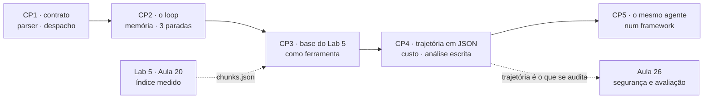
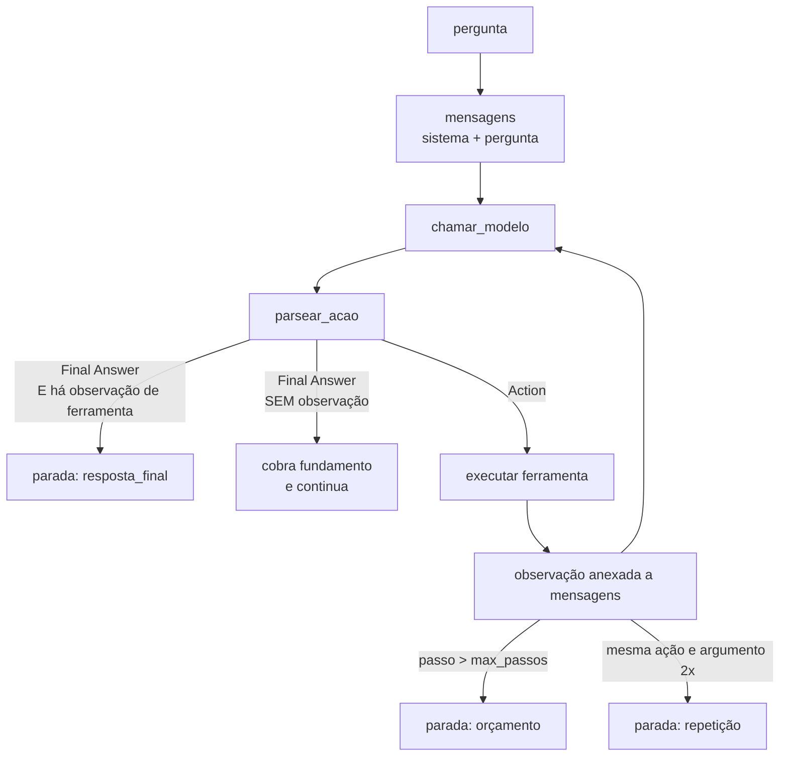
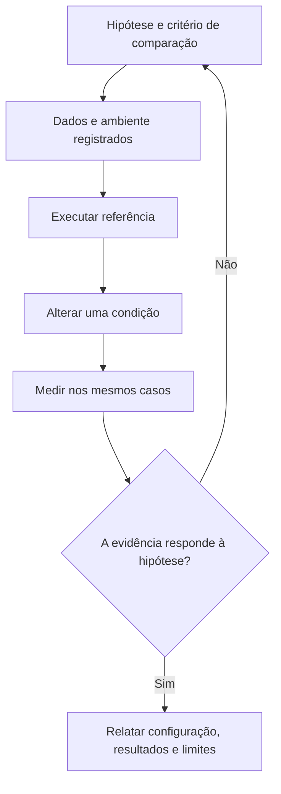
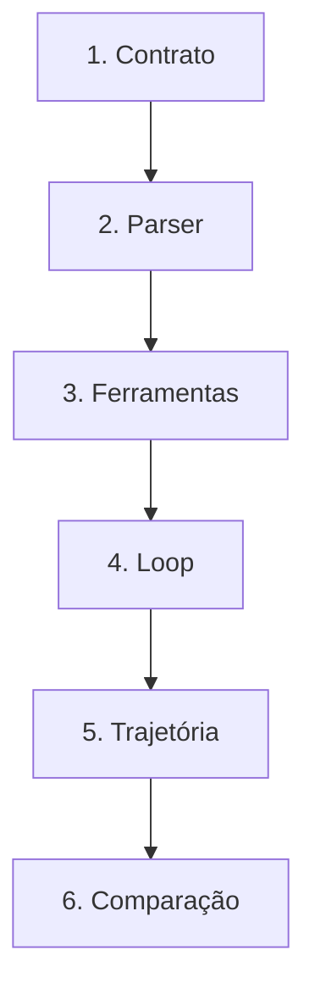
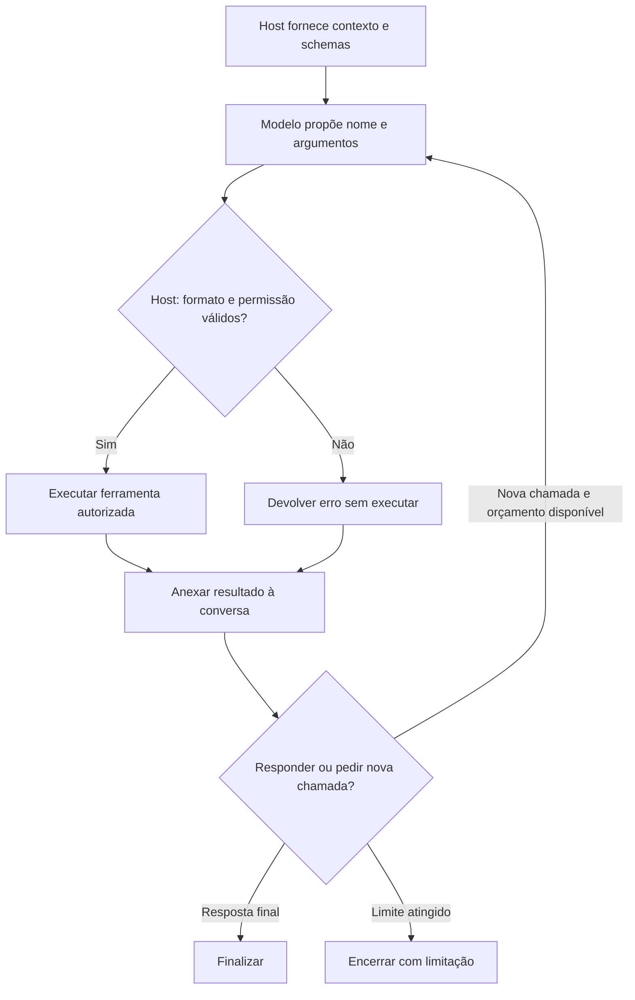
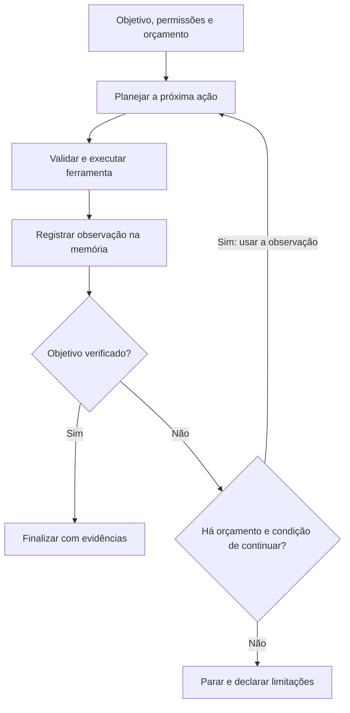

# Especificação de slides — Aula 25 (V2)

> **Rebalanceamento V2 — aula de laboratório (§6-bis do contrato).** O **roteiro prático não foi
> reordenado**: setup, demo e os cinco checkpoints permanecem na ordem que funciona em bancada,
> minuto a minuto. Três mudanças:
>
> 1. **Cada checkpoint abre pelo comportamento esperado** — a linha exata que a célula de teste
>    imprime e o que o teste conferiu para poder imprimi-la, ou os arquivos que precisam existir em
>    disco quando não há linha de OK — e só depois nomeia o que implementar.
> 2. **A Parte 2 é nova:** três itens, organizados **por checkpoint**. A contabilidade da trajetória
>    (CP4), a superlinearidade do custo (CP2 e CP4) e as três condições de parada (CP2).
> 3. **Cada ponto formal do fluxo ganhou ponteiro** em uma linha, sem interromper a prática.
>
> **A derivação do custo acumulado do laço não é refeita aqui.** Ela está em **A.1 da Aula 23** —
> `c_k = p₀ + (k−1)d`, `T(n) = n·p₀ + d·n(n−1)/2`, a inversão para `max_passos`, a latência sequencial
> e as três táticas de controle de trajetória. O que este apêndice acrescenta é o que só existe
> porque hoje há **trajetória gravada em disco**: os `p₀` e `d` **medidos**, a descoberta de que `d`
> não é constante, o regime em que este agente vive, e a contabilidade completa das três execuções de
> referência. A escrita original da conta, com coeficientes estimados, é o **A.1 do Lab 6
> (Aula 22)**; a generalização é a Aula 23; a medição é aqui.
>
> Carga horária (120 min), numeração e títulos dos slides do fluxo, checkpoints, entregável e
> objetivos de aprendizagem: **idênticos à V1**.
>
> **Mapa checkpoint → apêndice:**
> ```
> Checkpoint 1   —            (contrato de formato e parser: engenharia, não matemática)
> Checkpoint 2 → A.3, A.2     (as três paradas; e o custo que o orçamento limita)
> Checkpoint 3   —            (logística de arquivo; o efeito de custo aparece em A.2)
> Checkpoint 4 → A.1, A.2     (a contabilidade medida e a leitura da tabela de custo)
> Checkpoint 5   —            (comparação controlada: a mesma contabilidade, outra arquitetura)
> ```

<!-- SLIDE-FLOW:GUIDE:BEGIN -->
## Fluxogramas na produção dos slides

As orientações abaixo complementam o campo **Visual** dos slides indicados. Produzir os fluxogramas no próprio deck, como formas e conectores editáveis ou gráficos vetoriais; a biblioteca completa ao final torna esta especificação independente do portal.

- **Referência de composição:** título e propósito no topo, blocos numerados, conexões rotuladas, ramificações legíveis e uma saída identificada. Usar apenas o padrão visual da referência fornecida, sem importar seu assunto ou seus exemplos.
- **Tema do deck:** manter o fundo escuro e a paleta já especificada para a aula. Usar `#5b8cff` para o trecho ativo, tons neutros para o contexto e `#e2231a` conforme o significado definido no deck. Cor sempre acompanhada de rótulo.
- **Leitura:** entrada no topo ou à esquerda; saída na base ou à direita. Decisões em losangos, alternativas com rótulos e retornos apontando à etapa correta. Ramos paralelos convergem apenas onde seus resultados realmente são combinados.
- **Densidade:** no fluxo principal, projetar 3–6 blocos curtos por enquadramento, com corpo legível na última fileira. Um mapa maior pode ser revelado por etapas no mesmo slide. Detalhes, condições e explicações completas ficam nas notas; não reduzir a fonte para caber tudo.
- **Semântica:** mapas de percurso mostram ordem de estudo, não execução de um algoritmo. Manter separadas preparação e aplicação, treino e inferência, sequência e alternativas. Não transformar uma etapa opcional em obrigatória.
- **Integração:** o fluxograma substitui uma lista redundante ou ocupa o campo Visual; não cobre matrizes, tabelas, gráficos nem código indispensáveis. Preservar títulos, numeração, duração e referências aos apêndices.
- **Produção:** os blocos Mermaid abaixo são especificações do desenho. Renderizar/reconstruir como diagrama, nunca projetar o código Mermaid. Manter rótulos, bifurcações, retornos e limites declarados. Não transformar este caderno técnico em slides adicionais.
- **Ligação com o portal:** os mapas de mecanismo compartilham o conteúdo dos fluxogramas do portal. Em demonstrações, usar o mesmo vocabulário no deck e no controle interativo para facilitar a passagem entre os dois.
<!-- SLIDE-FLOW:GUIDE:END -->

## Diretrizes visuais

- **Tema:** escuro, accent `#e2231a` (vermelho CESAR), accent secundário `#5b8cff`.
- **Tipografia:** sans-serif para texto; monoespaçada para código, nomes de função e chaves de dicionário.
- **Densidade:** máximo 5 linhas de texto por slide no fluxo. Um conceito por slide.
- **Proibido:** bullets genéricos ("Vantagens", "Desvantagens"); slide-parede de texto; clipart; gráfico sem eixo rotulado; trecho de código com mais de 12 linhas.
- **Deck de laboratório:** curto e operacional. Cada slide de checkpoint tem, obrigatoriamente e na mesma posição visual: **o que a tela imprime quando está certo** (primeira linha, em caixa destacada), **o que implementar**, a armadilha, e **o relógio**. O deck não ensina — ele orienta quem está com a mão no teclado e olha a tela de dois em dois minutos.
- **Toda medição na tela carrega o modo em que foi produzida.** Nunca "1 600 tokens por tarefa"; sempre `1 626 tokens/tarefa (simulador roteirado, semente 25)`.
- **Fórmulas:** renderizar como bloco destacado em monoespaçada. No fluxo aparecem enunciadas e lidas — nunca manipuladas.
- **No apêndice:** densidade alta é esperada e desejável. É material de consulta, lido em casa com o JSON da trajetória aberto ao lado.

## Arco narrativo

O deck abre cobrando a promessa da Aula 24 — o loop antes do framework — e monta o agente em cinco checkpoints, cada um com um erro silencioso próprio. O centro de gravidade é o Checkpoint 2: a observação tem de voltar para a memória do modelo, e as três paradas têm de disparar. O Checkpoint 4 converte a trajetória em contabilidade: passos, tokens, custo por tarefa — e é ali que o crescimento monotônico da entrada aparece como consequência do reenvio, não como resultado experimental. O deck fecha com a trajetória gravada como artefato de auditoria e com a pergunta que abre a Aula 26: o dado que volta da ferramenta entra no mesmo canal das instruções.

A Parte 2 não se apresenta em aula. Ela existe porque este lab é o primeiro em que o custo do laço deixa de ser estimativa e passa a ser leitura de arquivo — e porque a análise escrita, que é o item de maior peso, exige um parágrafo sobre "quanto custou" que precisa de números e de uma definição de denominador. Os três itens são exatamente o que esse parágrafo e a questão-guia das paradas pedem.

---

# PARTE 1 — FLUXO DA AULA

*O que se apresenta em aula. 10 slides, 120 minutos com demo e cinco checkpoints. Ordem prática
preservada da V1, slide a slide, com os mesmos títulos.*

## Slides

### Slide 1 — Abertura: hoje o agente é seu
- **Tipo:** título
- **Título:** Laboratório 7 — Construindo um agente autônomo
- **Frase-tese:** Na Aula 23 eu mostrei um loop de agente e disse que ele era pequeno. Hoje vocês descobrem que ele é pequeno *e* que as quatro coisas que mais dão errado nele são invisíveis.
- **Conteúdo:** Subtítulo com a trilha de continuidade em uma linha: Lab 6 (mãos) → Aula 23 (loop) → Aula 24 (ceticismo) → **Lab 7 (o loop é seu)**. E a promessa do dia: agente funcionando + 3 trajetórias gravadas + análise escrita de uma delas.
- **Visual:** full-bleed escuro. Sugestão: o ciclo ReAct como quatro nós em círculo (`Thought → Action → Observation → …`) com uma seta de retorno grossa em accent, e o rótulo `max_passos = 6` cortando o círculo como um limite. Alternativa sem imagem: as cinco peças da Aula 23 em monoespaçada, com "loop" e "critério de parada" acesos em accent.
- **Notas do apresentador:** Dita antes de abrir o notebook. Não abrir a pasta `solucao/` em nenhuma aba. Mencionar em vinte segundos que o deck tem apêndice com três itens, e que o A.1 é a contabilidade de referência das trajetórias que a turma vai gravar — serve de gabarito de leitura para a análise escrita.

### Slide 2 — Setup, o modo offline e os números deste lab

<!-- SLIDE-FLOW:SLIDE:BEGIN -->
- **Fluxograma a incorporar neste slide:** **F00 — Laboratório: da hipótese à evidência**. O desenho e os rótulos completos estão no caderno de fluxogramas ao final deste arquivo.
- **Composição:** integrar ao campo Visual; preservar exemplos, tabelas, fórmulas e dimensões solicitados neste slide. Destacar o trecho relacionado ao título e manter o restante em segundo plano. Os textos detalhados ficam nas notas, sem duplicar a lista de Conteúdo na tela.
<!-- SLIDE-FLOW:SLIDE:END -->

- **Tipo:** conceito
- **Título:** O simulado depura o loop. Ele não avalia o agente.
- **Conteúdo:** Duas colunas. **Ambiente:** CP1–CP4 com biblioteca padrão, zero dependência, zero GPU; três módulos prontos na pasta (`ferramentas.py`, `corpus_regulamento.py`, `llm.py`); a chave entra por `getpass` e nunca é escrita no notebook. **Modo offline:** sem `API_KEY`, `llm.py` cai num simulador roteirado determinístico, semente `25`, que responde no formato ReAct. Ele serve para depurar o loop e para a sala sem rede — e **não** mede capacidade de modelo nenhum. Rodapé em accent: "prompt novo no modo offline não muda nada; o simulador não lê prompt."
- **Frase-tese:** O simulador é um banco de testes do loop de vocês, não um modelo sob avaliação.
- **Visual:** split. Esquerda, a caixa do ambiente com os três módulos listados. Direita, a caixa do modo offline com moldura em accent e a semente em monoespaçada grande. Abaixo, faixa com os números do lab: `3 ferramentas · max_passos = 6 · 3 perguntas · 5 checkpoints`. O `6` destacado, com uma nota pequena ao lado: "3, 2 e 2 passos observados nas 3 perguntas".
- **Fundamento:** o `max_passos = 6` sai da **distribuição observada**, não do pior caso imaginado: nas três perguntas de referência o agente gasta 3, 2 e 2 passos, e o teto é o dobro do máximo observado. E o orçamento de passos é o que converte um teto de tokens por pergunta num número inteiro — porque o custo enviado numa trajetória de `n` voltas tem um termo linear (o prompt fixo, reenviado `n` vezes) e um termo quadrático (a trajetória acumulada).
  → a derivação está em **A.1 da Aula 23** e não é refeita aqui; os `p₀` e `d` **medidos** nas três trajetórias deste lab, e em qual dos dois regimes este agente vive: **Apêndice A.2** (slide 12)
- **Notas do apresentador:** Perguntar quem tem chave funcionando e anotar a proporção — calibra a fala do CP4. O comentário sobre o `6` vale quinze segundos e nenhuma conta: a distribuição observada é o argumento inteiro.

### Slide 3 — O mapa: cinco checkpoints e o entregável

<!-- SLIDE-FLOW:SLIDE:BEGIN -->
- **Fluxograma a incorporar neste slide:** **F01 — O percurso desta aula**; **F00 — Laboratório: da hipótese à evidência**. O desenho e os rótulos completos estão no caderno de fluxogramas ao final deste arquivo.
- **Composição:** integrar ao campo Visual; preservar exemplos, tabelas, fórmulas e dimensões solicitados neste slide. Destacar o trecho relacionado ao título e manter o restante em segundo plano. Os textos detalhados ficam nas notas, sem duplicar a lista de Conteúdo na tela.
- **Momento de exibição:** apresentar o fluxo preenchido na discussão ou conferência, depois da tentativa da turma; durante a atividade, ocultar as etapas que entregariam a solução.
<!-- SLIDE-FLOW:SLIDE:END -->

- **Tipo:** diagrama
- **Título:** Duas horas, cinco checkpoints, uma análise escrita
- **Conteúdo:** A trilha dos cinco checkpoints com relógio e **o que cada um imprime** quando está certo:
  ```
  CP1  00:35–00:48  contrato · parser · despacho  -> "Checkpoint 1 OK"
  CP2  00:48–01:05  loop · memória · 3 paradas    -> "Checkpoint 2 OK" (7 situações)  (A.3/A.2)
  CP3  01:15–01:24  base do Lab 5 como ferramenta -> "Checkpoint 3 OK" + fonte do corpus
  CP4  01:24–01:38  trajetória · custo · análise  -> 3 ARQUIVOS JSON + tabela        (A.1/A.2)
  CP5  01:38–01:50  o mesmo agente num framework  -> tabela 3×2 + 3 respostas
  ```
  Rodapé: entrega em 1 semana; **a análise escrita é o item que separa as notas**.
- **Frase-tese:** Agente funcionando é o mínimo deste lab. O que separa as notas é a análise escrita.
- **Visual:** trilha horizontal com cinco estações; a estação 4 destacada em accent (maior peso na nota) e marcada com "sem linha de OK: o critério são arquivos em disco". Seta pontilhada saindo de "Lab 5 · Aula 20" e entrando na estação 3, rotulada `chunks.json`. A coluna `(A.n)` em cinza discreto.
- **Notas do apresentador:** Solução comentada dos CP1 e CP2 liberada aos 00:48 e 01:05 — dizer como rede de segurança. Avisar a Entrega 2 na próxima aula. A coluna do apêndice se explica em uma frase: o A.1 é o gabarito de leitura do parágrafo do "quanto custou", e o A.3 é a resposta escrita da questão-guia das paradas.



### Slide 4 — [Demo] Live coding: o contrato de formato e o parser

<!-- SLIDE-FLOW:SLIDE:BEGIN -->
- **Fluxograma a incorporar neste slide:** **F02 — Tool calling: proposta, execução e retorno**. O desenho e os rótulos completos estão no caderno de fluxogramas ao final deste arquivo.
- **Composição:** integrar ao campo Visual; preservar exemplos, tabelas, fórmulas e dimensões solicitados neste slide. Destacar o trecho relacionado ao título e manter o restante em segundo plano. Os textos detalhados ficam nas notas, sem duplicar a lista de Conteúdo na tela.
<!-- SLIDE-FLOW:SLIDE:END -->

- **Tipo:** transição para demonstração
- **Título:** 20 minutos: o contrato, o parser e uma volta do loop na mão
- **Frase-tese:** Parser que só foi testado com a entrada certa é uma armadilha esperando o dia da apresentação.
- **Conteúdo:** A ordem da demo, sem resultados (eles aparecem ao vivo): (1) o catálogo que o modelo lê; (2) o `SISTEMA` com as três partes; (3) a regra que proíbe `Observation:` e o `stop` da API; (4) o parser contra quatro entradas ruins; (5) uma volta completa na mão; (6) a mesma volta com o `append` da observação comentado. E, no rodapé, duas caixas vazias para o instrutor preencher ao vivo:
  ```
  tokens de entrada · 1ª chamada (só sistema + pergunta)  ->  ____
  tokens de entrada · 2ª chamada (depois da observação)   ->  ____
  ```
- **Visual:** slide quase vazio, lista numerada em monoespaçada esperando ser preenchida. O item 6 marcado com uma tarja em accent e a palavra "silencioso". As duas caixas do rodapé em accent secundário.
- **Fundamento:** a primeira chamada é o **piso** de custo do agente: sistema mais catálogo mais pergunta, sem nada mais. A segunda chamada é o piso **mais a observação anexada** — e a diferença entre as duas é decidida pelo tamanho do que a ferramenta devolveu, não pela pergunta. Nas trajetórias de referência o piso fica entre 533 e 549 tokens de entrada, e o acréscimo da primeira observação varia de 97 a 223 tokens conforme a ferramenta chamada.
  → a contabilidade completa das três trajetórias, número por número: **Apêndice A.1** (slide 11)
- **Notas do apresentador:** Terminar antes do `while`. O passo insubstituível é o último: comentar o `append` e mostrar a repetição. Ler os dois números de entrada em voz alta e deixar as duas caixas preenchidas na projeção — a turma reencontra esses números no CP4. Com chave de API os valores serão outros: dizer os medidos ao vivo. Não conduzir conta nenhuma aqui.

### Slide 5 — [Checkpoint 1] Prompt de sistema, parsing e despacho

<!-- SLIDE-FLOW:SLIDE:BEGIN -->
- **Fluxograma a incorporar neste slide:** **F02 — Tool calling: proposta, execução e retorno**. O desenho e os rótulos completos estão no caderno de fluxogramas ao final deste arquivo.
- **Composição:** integrar ao campo Visual; preservar exemplos, tabelas, fórmulas e dimensões solicitados neste slide. Destacar o trecho relacionado ao título e manter o restante em segundo plano. Os textos detalhados ficam nas notas, sem duplicar a lista de Conteúdo na tela.
- **Momento de exibição:** apresentar o fluxo preenchido na discussão ou conferência, depois da tentativa da turma; durante a atividade, ocultar as etapas que entregariam a solução.
<!-- SLIDE-FLOW:SLIDE:END -->

- **Tipo:** exercício (moldura de checkpoint)
- **Título:** Checkpoint 1 · o contrato de formato · 00:35–00:48
- **Conteúdo:**
  **Quando está certo, a tela imprime isto:**
  ```
  Checkpoint 1 OK
  ```
  e o teste terá conferido:
  ```
  1  as TRÊS partes do SISTEMA — objetivo, catálogo, formato
     (inclusive a proibição explícita de o modelo escrever "Observation:")
  2  caminho feliz de AÇÃO  e  caminho feliz de RESPOSTA FINAL
  3  quatro entradas malformadas, todas devolvendo `erro` e NENHUMA exceção:
        prosa sem formato · JSON quebrado · Action Input ausente ·
        nome de ferramenta entre cercas de código
  4  no despacho: ferramenta inexistente e argumento inválido -> dicionário de erro
  ```
  **O que implementar:** `SISTEMA` (objetivo + catálogo + formato, e as três regras); `parsear_acao` devolvendo sempre `{pensamento, acao, argumentos, resposta_final, erro}` e **sem levantar exceção**; `executar` despachando pelo registro.
  ```
  Thought: <por que este passo>
  Action: <nome exato da ferramenta>
  Action Input: {"chave": "valor"}
  ---
  Thought: <o que a evidência sustenta>
  Final Answer: <resposta, citando o dispositivo observado>
  ```
- **Frase-tese:** Erro de formato volta como observação, nunca como exceção.
- **Visual:** no topo, o critério em caixa destacada. Abaixo, split. Esquerda: o bloco de formato em monoespaçada, as duas formas separadas por uma régua. Direita: as quatro entradas malformadas como quatro cartões pequenos — `prosa sem formato` · `JSON quebrado` · `Action Input ausente` · `` nome com cerca de código `` —, cada um com o rótulo do que o parser deve devolver. Relógio no canto.
- **Notas do apresentador:** Aos 00:46 contar mãos com o `OK`. Se menos de dois terços, resolver na tela só a parte do `Action Input`. Este checkpoint **não tem item de apêndice**: contrato de formato é engenharia de protocolo, e o rigor dele está nos quatro casos do teste.

### Slide 6 — [Checkpoint 2] O loop: memória, observação e parada

<!-- SLIDE-FLOW:SLIDE:BEGIN -->
- **Fluxograma a incorporar neste slide:** **F02 — Tool calling: proposta, execução e retorno**. O desenho e os rótulos completos estão no caderno de fluxogramas ao final deste arquivo.
- **Composição:** integrar ao campo Visual; preservar exemplos, tabelas, fórmulas e dimensões solicitados neste slide. Destacar o trecho relacionado ao título e manter o restante em segundo plano. Os textos detalhados ficam nas notas, sem duplicar a lista de Conteúdo na tela.
- **Momento de exibição:** apresentar o fluxo preenchido na discussão ou conferência, depois da tentativa da turma; durante a atividade, ocultar as etapas que entregariam a solução.
<!-- SLIDE-FLOW:SLIDE:END -->

- **Tipo:** diagrama (moldura de checkpoint)
- **Título:** Checkpoint 2 · o loop e as três paradas · 00:48–01:05
- **Conteúdo:**
  **Quando está certo, a tela imprime isto:**
  ```
  Checkpoint 2 OK
  ```
  e o teste terá coberto **sete** situações:
  ```
  1  duas ferramentas em sequência, com citação e conta certa
  2  uma ferramenta bastando
  3  encerramento honesto quando o acervo não tem a resposta
  4  repetição abortando
  5  orçamento segurando ANTES de o detector de repetição agir
  6  formato inválido voltando como observação, e o loop se recuperando
  7  devolver_observacao=False  ->  o agente esquece e a trajetória
     termina em REPETIÇÃO   (o erro silencioso, exposto por teste)
  ```
  **O que implementar:** `loop_react(pergunta, max_passos=6)` — `mensagens` (memória que **o modelo lê**), `trajetoria` (registro que **o humano audita**), a observação anexada a `mensagens`, e as três paradas: `orçamento` · `resposta final COM observação de ferramenta executada` · `repetição de assinatura`.
- **Frase-tese:** Uma parada que nunca dispara é indistinguível de não ter parada.
- **Visual:** no topo, o critério com as sete situações. Abaixo, o diagrama do loop com as duas estruturas desenhadas lado a lado e leitores diferentes rotulados ("lido pelo modelo" / "lido por humano"). A aresta que devolve a observação a `mensagens` em accent e mais grossa que as outras, com a etiqueta "comente esta linha e o agente esquece". Os três pontos de parada marcados como três cadeados nas saídas, e só o cadeado do orçamento com um rótulo extra: "o único que garante terminação".
- **Fundamento:** as três paradas não são redundantes e têm papéis logicamente diferentes. Só o **orçamento** garante terminação para qualquer comportamento do modelo, porque é um contador que avança independentemente do que o modelo faça; as outras duas são saídas antecipadas — uma protege a **qualidade** (resposta sem evidência), a outra protege o **gasto** (agente preso). E a segunda tem uma condição de correção precisa: o contador de observações tem de excluir as mensagens que o **próprio loop** injetou, senão a guarda passa a ser satisfeita por um ato do loop e autoriza exatamente o que existe para bloquear.
  → o enunciado formal das três, o que cada uma protege, a demonstração da autoautorização, e o que aparece na trajetória (e quanto custa) quando cada uma é removida: **Apêndice A.3** (slide 13)
- **Fundamento:** o `max_passos` é o teto de uma soma que **não é linear** nos passos: como nada é descartado, cada volta reenvia a trajetória inteira, e os tokens enviados crescem com o quadrado do número de voltas enquanto o número de chamadas cresce linearmente.
  → a derivação está em **A.1 da Aula 23**; a medição, com os coeficientes reais deste agente e a comparação entre as duas otimizações possíveis: **Apêndice A.2** (slide 12)
- **Notas do apresentador:** Diagnóstico de "está repetindo": (1) a observação volta para `mensagens`? (2) o contador conta a cobrança que o próprio loop injetou? Se aparecer "por que três paradas e não uma", resposta de trinta segundos da Parte 4 do roteiro e o ponteiro para o A.3 — **não** conduzir a tabela no quadro durante o lab.



### Slide 7 — [Checkpoint 3] A base do Lab 5 vira ferramenta

<!-- SLIDE-FLOW:SLIDE:BEGIN -->
- **Fluxograma a incorporar neste slide:** **F02 — Tool calling: proposta, execução e retorno**. O desenho e os rótulos completos estão no caderno de fluxogramas ao final deste arquivo.
- **Composição:** integrar ao campo Visual; preservar exemplos, tabelas, fórmulas e dimensões solicitados neste slide. Destacar o trecho relacionado ao título e manter o restante em segundo plano. Os textos detalhados ficam nas notas, sem duplicar a lista de Conteúdo na tela.
- **Momento de exibição:** apresentar o fluxo preenchido na discussão ou conferência, depois da tentativa da turma; durante a atividade, ocultar as etapas que entregariam a solução.
<!-- SLIDE-FLOW:SLIDE:END -->

- **Tipo:** conceito (moldura de checkpoint)
- **Título:** Checkpoint 3 · o acervo do Lab 5 é uma linha do catálogo · 01:15–01:24
- **Conteúdo:**
  **Quando está certo, a tela imprime isto:**
  ```
  Checkpoint 3 OK
  fonte do corpus: chunks.json do SEU Lab 5 (N chunks)
     (ou, na falta dele, o aviso explícito de corpus embutido — 8 dispositivos)
  ```
  e a trajetória traz **ao menos um passo `buscar_regulamento` com `achados` não vazio** sustentando a resposta.

  **O que fazer:** copiar o `chunks.json` gravado pelo Lab 5 (Aula 20, `lab05_saida/`) para a pasta do lab, reexecutar o setup, conferir `corpus_regulamento.FONTE_DO_CORPUS`, rodar o agente na pergunta que só o acervo responde. Rodapé em accent: base boa não conserta agente — ela define o teto, não as cinco peças.
- **Frase-tese:** A ferramenta é uma fronteira: do lado de fora, o agente não sabe se atrás tem BM25, embedding ou um `if`.
- **Visual:** no topo, o critério com as duas linhas de saída. Abaixo, dois retângulos com a **mesma** assinatura em monoespaçada no topo — `buscar_regulamento(termo, k)` — e conteúdos diferentes embaixo: à esquerda "corpus embutido, 8 dispositivos"; à direita "seu `chunks.json`, N chunks, pipeline híbrido do Lab 5". Uma seta de troca entre os dois, com a etiqueta "a assinatura não muda".
- **Fundamento:** trocar o corpus muda o **tamanho da observação**, e o tamanho da observação é o coeficiente que multiplica o termo de crescimento quadrático do custo. Uma base com chunks longos encarece **todas** as voltas seguintes da trajetória, não apenas a volta em que a busca foi chamada — e o efeito é mensurável na tabela do CP4.
  → de quanto é o efeito, com os incrementos medidos por ferramenta nas trajetórias de referência: **Apêndice A.2** (slide 12)
- **Notas do apresentador:** Mostrar a linha da fonte do corpus mudando ao vivo com o `chunks.json` do instrutor. Não gastar mais de 2 min com logística de arquivo. Quem estiver com o embutido escreve a frase de declaração na hora.

### Slide 8 — [Checkpoint 4] Registrar e analisar a trajetória

<!-- SLIDE-FLOW:SLIDE:BEGIN -->
- **Fluxograma a incorporar neste slide:** **F03 — Agente: um ciclo com verificação e parada**. O desenho e os rótulos completos estão no caderno de fluxogramas ao final deste arquivo.
- **Composição:** integrar ao campo Visual; preservar exemplos, tabelas, fórmulas e dimensões solicitados neste slide. Destacar o trecho relacionado ao título e manter o restante em segundo plano. Os textos detalhados ficam nas notas, sem duplicar a lista de Conteúdo na tela.
- **Momento de exibição:** apresentar o fluxo preenchido na discussão ou conferência, depois da tentativa da turma; durante a atividade, ocultar as etapas que entregariam a solução.
<!-- SLIDE-FLOW:SLIDE:END -->

- **Tipo:** dados (moldura de checkpoint)
- **Título:** Checkpoint 4 · a trajetória é o artefato · 01:24–01:38
- **Conteúdo:**
  **Aqui não há linha de OK. Quando está certo, existem três arquivos em disco e uma tabela:**
  ```
  lab07_saida/trajetoria_p1.json
  lab07_saida/trajetoria_p2.json
  lab07_saida/trajetoria_p3.json
     cada um: por passo -> pensamento, acao, argumentos, observacao, erro,
              TEXTO CRU DO MODELO, tokens_entrada, tokens_saida
     mais o bloco custo -> chamadas, tokens_entrada_total,
                           tokens_saida_total, tokens_total

  tabela de custo:  passo | acao | tok_ent | tok_sai | acum
                    e a coluna `acum` ESTRITAMENTE CRESCENTE
  ```
  **O entregável:** análise de **uma** trajetória em quatro parágrafos — onde acertou · onde vacilou · quanto custou · o que muda no projeto. As cinco etapas em que a falha pode estar, e é uma delas que a análise tem de nomear: `percepção` · `escolha de ferramenta` · `argumento` · `interpretação da observação` · `parada`.
- **Frase-tese:** "O agente errou" não é uma análise. A análise nomeia a etapa.
- **Visual:** no topo, o critério (os três nomes de arquivo e o cabeçalho da tabela). No meio, a tabela de custo com a coluna `acum` crescendo e uma seta apontando "o último passo é o mais caro: a trajetória inteira é reenviada". Na base, as cinco etapas como cinco caixas em fila, cada uma com um exemplo de falha em uma linha; a caixa `interpretação da observação` em accent, porque é a mais subnotificada.
- **Fundamento:** o crescimento monotônico da coluna de entrada **não é um resultado experimental**: é consequência de a trajetória ser reenviada a cada volta. Acumulado que não cresce é defeito de contabilidade, não achado. E o custo do agente não é um número: é uma contabilidade de três eixos — passos, tokens de entrada e saída acumulados, e custo por **tarefa resolvida** —, sendo que o terceiro exige declarar o denominador, porque contar a recusa honesta como resolução ou como falha muda o número **e** muda o incentivo que a métrica cria.
  → a contabilidade completa das três trajetórias de referência, com os dois denominadores possíveis e a dispersão que a média esconde: **Apêndice A.1** (slide 11) · por que a entrada cresce e qual otimização compensa no regime deste agente: **Apêndice A.2** (slide 12)
- **Notas do apresentador:** Ler em voz alta só o parágrafo do "onde vacilou" da análise de referência. Circular perguntando "qual etapa?". Dar de graça o único número que muda a leitura da tabela: nas trajetórias de referência, **94% de todos os tokens são de entrada** — isso economiza cinco minutos de gente somando a coluna errada. O resto está em A.1 e A.2.

### Slide 9 — [Checkpoint 5] O mesmo agente num framework

<!-- SLIDE-FLOW:SLIDE:BEGIN -->
- **Fluxograma a incorporar neste slide:** **F00 — Laboratório: da hipótese à evidência**. O desenho e os rótulos completos estão no caderno de fluxogramas ao final deste arquivo.
- **Composição:** integrar ao campo Visual; preservar exemplos, tabelas, fórmulas e dimensões solicitados neste slide. Destacar o trecho relacionado ao título e manter o restante em segundo plano. Os textos detalhados ficam nas notas, sem duplicar a lista de Conteúdo na tela.
- **Momento de exibição:** apresentar o fluxo preenchido na discussão ou conferência, depois da tentativa da turma; durante a atividade, ocultar as etapas que entregariam a solução.
<!-- SLIDE-FLOW:SLIDE:END -->

- **Tipo:** comparação (moldura de checkpoint)
- **Título:** Checkpoint 5 · controle × conveniência · 01:38–01:50
- **Conteúdo:**
  **Quando está certo, existem uma tabela e três respostas:**
  ```
  pergunta | arquitetura | chamadas | tokens | parada que disparou
     p1, p2, p3  ×  (loop na mão, grafo de estado)
  ```
  mais as três respostas escritas: qual peça o framework assumiu · qual continuou sendo sua · onde se lê a trajetória completa de uma execução. Sem `langgraph`: entregável pela leitura dos três nós + tabela de referência do instrutor.

  **O que fazer:** refazer o loop como grafo de estado — nó do modelo, nó de ferramenta, aresta condicional com o critério de parada — mantendo **idênticos** modelo, ferramentas e prompt. **O que o framework assume:** estado declarado, roteamento explícito, ponto de interrupção, retentativa. **O que continua sendo seu:** validação de argumento, tratamento de erro de ferramenta, critério de parada de domínio.
- **Frase-tese:** A pergunta que decide não é quantas linhas ficaram. É: eu consigo ler a trajetória inteira que esse framework produziu?
- **Visual:** no topo, o critério (o cabeçalho da tabela e as três perguntas). Abaixo, split: esquerda, o loop na mão como um `while` esquemático; direita, o grafo com dois nós e a aresta condicional. Entre os dois, três selos em accent com "mesmo modelo", "mesmas ferramentas", "mesmo prompt" — e, embaixo, a faixa "o que muda é quem guarda o estado e quem decide a aresta".
- **Fundamento:** a comparação só é interpretável porque três variáveis estão fixas. Com modelo, ferramentas e prompt idênticos, a contagem de tokens das duas arquiteturas **tem de bater** — a contabilidade de A.1 é a mesma soma, sobre a mesma trajetória. Divergência na contagem não é característica do framework: é texto que o framework acrescentou ao prompt sem ter sido pedido, e localizá-lo é o exercício.
  → a contabilidade que serve de referência para as duas colunas da tabela: **Apêndice A.1** (slide 11)
- **Notas do apresentador:** Não deixar a sala gastar os 12 min instalando biblioteca. Quem não tem, vai direto para a variante de leitura. Se a contagem de tokens divergir, isso é achado e vale escrever na terceira resposta.

### Slide 10 — Recolhimento e ponte para a Aula 26
- **Tipo:** encerramento
- **Título:** O dado que volta da ferramenta entra no mesmo canal das instruções
- **Conteúdo:** À esquerda, o checklist de entrega para a turma fotografar:
  - ☐ Notebook executado com saídas
  - ☐ 3 trajetórias em JSON
  - ☐ Tabela de custo por passo
  - ☐ Análise escrita de 1 trajetória (4 parágrafos, com a etapa nomeada)
  - ☐ Tabela do CP5
  - ☐ Respostas às 5 questões-guia
  - ☐ Declaração de uso de IA

  Prazo: 1 semana. À direita, a ponte: na Aula 26, injeção de prompt direta e indireta, exfiltração, ação irreversível e mitigações — com o agente de hoje sequestrado ao vivo por um documento do próprio acervo — e a avaliação por trajetória. E o aviso: **Entrega 2 do projeto na próxima aula**, 15 min reservados, pipeline central rodando de ponta a ponta.
- **Frase-tese:** Na próxima aula eu sequestro o agente de vocês com um documento do próprio acervo.
- **Visual:** split. Esquerda, o checklist em caixa destacada (é o que a turma fotografa). Direita, o diagrama do contexto do modelo como um único funil, com duas setas entrando: uma rotulada "instrução do sistema" e outra "texto recuperado da ferramenta" — as duas na **mesma** cor, de propósito, e a legenda "o modelo não distingue as duas por natureza". Num canto discreto, o índice do apêndice: A.1 a contabilidade das 3 trajetórias · A.2 por que a entrada cresce · A.3 as três paradas e o que cada uma protege.
- **Notas do apresentador:** 30 s de silêncio no checklist. Perguntar quem chegou ao CP4 e anotar a proporção. Repetir o aviso da Entrega 2 com o critério: pipeline de ponta a ponta, mesmo simples. Projetar o índice do apêndice por 20 s e nomear dois itens: o A.1 é o gabarito de leitura do parágrafo do custo; o A.3 é a resposta escrita da questão-guia sobre remover a parada que disparou.

---

# PARTE 2 — APÊNDICE MATEMÁTICO

> Material de estudo e consulta. **Não se apresenta em aula**; é distribuído com o deck.
> Organizado **por checkpoint**, não por tópico. Autossuficiente — quem estuda por aqui sem ter
> feito o lab consegue reconstruir todas as contas, e quem fez o lab consegue explicar os próprios
> números.
>
> **Procedência dos números.** Tudo o que aparece como medição vem das três trajetórias gravadas que
> acompanham o gabarito, em `codigo/lab-07-agente-autonomo/solucao/lab07_saida/`, produzidas no modo
> `simulador-roteirado(semente=25)`. São medições **reais e reprodutíveis do loop**; elas não são
> medida de capacidade de modelo nenhum (Conceito 10 do plano). Com chave de API os números mudam; a
> estrutura da contabilidade não.
>
> **Onde o fundamento já está em outra aula, este apêndice aponta em vez de repetir.** A derivação do
> custo acumulado do laço — `c_k = p₀ + (k−1)d`, `T(n) = n·p₀ + d·n(n−1)/2`, a inversão para
> `max_passos`, a latência sequencial e as três táticas de controle de trajetória — está em **A.1 da
> Aula 23**. A primeira escrita dessa conta, com coeficientes estimados, está no **A.1 do Lab 6
> (Aula 22)**. Este apêndice **mede**.

### Slide 11 — A.1 · A contabilidade da trajetória: as três execuções de referência, número por número

<!-- SLIDE-FLOW:SLIDE:BEGIN -->
- **Fluxograma a incorporar neste slide:** **F03 — Agente: um ciclo com verificação e parada**. O desenho e os rótulos completos estão no caderno de fluxogramas ao final deste arquivo.
- **Composição:** integrar ao campo Visual; preservar exemplos, tabelas, fórmulas e dimensões solicitados neste slide. Destacar o trecho relacionado ao título e manter o restante em segundo plano. Os textos detalhados ficam nas notas, sem duplicar a lista de Conteúdo na tela.
<!-- SLIDE-FLOW:SLIDE:END -->

- **Tipo:** apêndice — contabilidade completa, definição de denominador e dispersão
- **Invocado em:** slides 4, 8 e 9 (a demo, o Checkpoint 4 e o Checkpoint 5)

**Por que este item existe.** O parágrafo do "quanto custou" da análise escrita é o que mais volta
com correção, e sempre pelo mesmo motivo: o aluno escreve um adjetivo onde cabia um número, ou
escreve um número sem dizer o que ele conta. Este item é a contabilidade de referência, feita por
extenso sobre as três trajetórias que acompanham o gabarito, para servir de gabarito de leitura.

**Notação.**
`t ∈ {p1, p2, p3}` — as três perguntas de referência.
`n_t` — número de **passos** da trajetória `t`, que é igual ao número de chamadas ao modelo.
`e_{t,k}` e `s_{t,k}` — tokens de **entrada** e de **saída** da chamada `k` da trajetória `t`.
`E_t = Σ_k e_{t,k}` e `S_t = Σ_k s_{t,k}` — totais de entrada e de saída por trajetória.
`A_{t,k} = Σ_{j ≤ k} (e_{t,j} + s_{t,j})` — o **acumulado** até o passo `k`; é a coluna `acum` da
tabela do Checkpoint 4.
`R` — número de tarefas contadas como **resolvidas**. `C_R = (Σ_t E_t + S_t)/R` — custo por tarefa
resolvida.

**Premissas.** (i) O contador de tokens é o do próprio `llm.py` — no modo simulado é uma estimativa
determinística, no modo API é o campo `usage`; os dois são somados da mesma forma, e o modo é
declarado. (ii) Tokens de **saída** não voltam como entrada nas chamadas seguintes na forma em que
foram gerados: eles entram na trajetória e passam a compor a entrada, o que é exatamente o mecanismo
de **A.2**. (iii) Nenhuma chamada é descartada da conta, inclusive as que terminaram em erro de
formato.

**As três trajetórias, passo a passo.**

*p1 — "Já passaram 12 dias desde o primeiro dia de aula. Ainda dá tempo de trancar a disciplina e
quantos dias eu tenho?"* Parada: `resposta_final`.

| passo | ação | `tok_ent` | `tok_sai` | `acum` |
|---|---|---|---|---|
| 1 | `buscar_regulamento` | 549 | 37 | 586 |
| 2 | `calcular` | 772 | 31 | 1 389 |
| 3 | — (resposta final) | 810 | 44 | 2 243 |
| | **totais** | **2 131** | **112** | **2 243** |

*p2 — "Quantas horas semanais de monitoria são permitidas e qual é a nota mínima para ser
monitor?"* Parada: `resposta_final`.

| passo | ação | `tok_ent` | `tok_sai` | `acum` |
|---|---|---|---|---|
| 1 | `buscar_regulamento` | 544 | 31 | 575 |
| 2 | — (resposta final) | 745 | 46 | 1 366 |
| | **totais** | **1 289** | **77** | **1 366** |

*p3 — "Qual foi a temperatura média em Recife em 1998?"* Parada: `resposta_final`, com a resposta
sendo uma **recusa fundamentada**: *"não encontrei essa informação nas fontes disponíveis"*.

| passo | ação | `tok_ent` | `tok_sai` | `acum` |
|---|---|---|---|---|
| 1 | `buscar_web` | 533 | 44 | 577 |
| 2 | — (resposta final) | 630 | 61 | 1 268 |
| | **totais** | **1 163** | **105** | **1 268** |

*Conferência aritmética,* e ela é a primeira coisa a fazer com a própria tabela: o `acum` do último
passo tem de ser igual a `E_t + S_t`. Em p1: `2 131 + 112 = 2 243` ✓. Em p2: `1 289 + 77 = 1 366` ✓.
Em p3: `1 163 + 105 = 1 268` ✓. Se não fechar, o acumulado está sendo reiniciado ou algum passo está
sendo sobrescrito em vez de somado.

**Os agregados.**
```
passos:            3 + 2 + 2 = 7          (= número de chamadas ao modelo)
tokens de entrada: 2 131 + 1 289 + 1 163 = 4 583
tokens de saída:     112 +    77 +   105 =   294
tokens totais:                             4 877
```
*A fração de entrada:*
```
4 583 / 4 877 = 0,9397   ->   94,0%
```
∎ **Noventa e quatro por cento de todo o custo é entrada.** É o Conceito 9 do plano com número: em
agente, o modelo **lê muito e escreve pouco**. Quem soma a coluna de saída para estimar o custo erra
por um fator de dezesseis. E a consequência prática é que, se o provedor cobra a saída mais caro que
a entrada — o que é a regra —, ainda assim a entrada domina a fatura, porque a razão de volume é
maior que a razão de preço.

*Por trajetória, a mesma leitura:* p1 `2 131/2 243 = 95,0%`, p2 `94,4%`, p3 `91,7%`. A fração de
entrada é **estável** entre trajetórias, e essa estabilidade é o que autoriza a frase geral.

**Custo por tarefa resolvida — e a decisão de denominador.**
As três perguntas foram respondidas corretamente: p1 e p2 com o dispositivo citado, p3 com uma recusa
honesta e fundamentada (o agente buscou, não achou, e disse isso). Com `R = 3`:
```
C_R = 4 877 / 3 = 1 625,7   ->   ~1 626 tokens por tarefa resolvida
```
Mas há uma segunda contagem defensável, em que a recusa não conta como resolução. Com `R = 2`:
```
C_R = 4 877 / 2 = 2 438,5   ->   ~2 439 tokens por tarefa resolvida    (+50%)
```
∎ **O mesmo experimento produz 1 626 ou 2 439, e a diferença é uma definição, não uma medição.** E a
escolha não é neutra: se a recusa conta como **falha**, a métrica de custo por tarefa resolvida
**premia o agente que inventa** — porque inventar uma resposta a p3 teria mantido o numerador e
subido o denominador. Um sistema otimizado contra essa métrica aprende a alucinar. Se a recusa conta
como **resolução**, a métrica é neutra em relação à honestidade, e a qualidade da recusa passa a ser
avaliada por outro instrumento (a análise escrita, e o Lab 8). **A recomendação deste lab é contar a
recusa fundamentada como resolvida e declarar isso** — e é por isso que o Checkpoint 2 tem uma
situação de teste dedicada ao encerramento honesto.

**O que a média esconde — a dispersão entre tarefas.**
```
mais barata:  p3 = 1 268 tokens
mais cara:    p1 = 2 243 tokens
razão:        2 243 / 1 268 = 1,77
```
∎ **Quase o dobro entre a tarefa mais barata e a mais cara**, com `|Q| = 3`. Reportar `1 626` sem a
faixa esconde um fator de 1,8, e a explicação é estrutural e não aleatória: p1 gastou **três** passos
porque precisou de duas ferramentas em sequência — buscar o prazo e depois calcular —, enquanto p2 e
p3 resolveram com uma ferramenta e dois passos. **O custo por tarefa é função do número de passos, e
o número de passos é função da estrutura da pergunta.** Duas consequências para o relatório:
1. O número honesto é **mediana e faixa**, não média sozinha — e com três tarefas a faixa é a única
   coisa que se pode afirmar. É a mesma exigência do Lab 3, onde a coluna de dispersão existe ao lado
   da mediana.
2. Um custo por tarefa medido em três perguntas **não** dimensiona um sistema. Para o projeto, o
   número que serve é o custo por tarefa **por classe de pergunta** — perguntas de uma ferramenta e
   perguntas de duas ferramentas custam coisas diferentes, e a média das duas classes depende da
   mistura de tráfego, que é uma hipótese de produto e não uma medição.

**Como este item se usa no Checkpoint 5.**
A tabela de comparação do CP5 tem as mesmas três perguntas em duas arquiteturas. Com modelo,
ferramentas e prompt idênticos, as colunas de `chamadas` e de `tokens` **têm de reproduzir** os
números acima — a contabilidade é a mesma soma sobre a mesma trajetória. Divergência não é
característica do framework: é texto acrescentado ao prompt (um preâmbulo de sistema, uma instrução
de formato de ferramenta) ou uma chamada extra que o grafo faz e que o `while` não fazia. Localizar a
divergência é o exercício, e a diferença em tokens é o instrumento que a localiza.

**Casos-limite.**
- **Trajetória que termina por orçamento.** O bloco `custo` existe do mesmo jeito e `R` não
  incrementa: é gasto sem tarefa resolvida, e ele tem de aparecer no numerador do `C_R`. Excluir as
  trajetórias que falharam do custo é o erro que faz todo sistema parecer barato.
- **Trajetória com erro de formato no meio.** A chamada que devolveu formato inválido custou tokens e
  entra na conta. Uma trajetória com dois erros de formato pode custar 40% mais que a mesma tarefa
  sem erro — e essa diferença é atribuível ao **contrato de formato**, não ao modelo. É argumento
  para investir no prompt de formato.
- **`R = 0`.** `C_R` é indefinido, não infinito. A leitura correta é "nenhuma tarefa resolvida, `X`
  tokens gastos", e reportar assim é mais informativo que qualquer razão.
- **Modo API em vez de simulador.** Os valores absolutos mudam (modelo diferente, tokenizador
  diferente, respostas mais longas), e a fração de entrada tende a **subir**, porque modelos melhores
  produzem observações e pensamentos mais longos que passam a ser reenviados. A estrutura da
  contabilidade é idêntica; o que muda é o modo declarado ao lado dos números.
- **Base do Lab 5 com chunks longos.** `e_{t,k}` sobe a partir do passo seguinte à primeira busca, e o
  acumulado inteiro desloca para cima. É o efeito quantificado em **A.2**, e é a razão de o
  Checkpoint 3 pedir que a fonte do corpus seja declarada junto dos números.

**De volta ao fluxo:** slides 4, 8 e 9.

### Slide 12 — A.2 · Por que o custo é superlinear na trajetória, e qual otimização compensa neste agente

<!-- SLIDE-FLOW:SLIDE:BEGIN -->
- **Fluxograma a incorporar neste slide:** **F03 — Agente: um ciclo com verificação e parada**. O desenho e os rótulos completos estão no caderno de fluxogramas ao final deste arquivo.
- **Composição:** integrar ao campo Visual; preservar exemplos, tabelas, fórmulas e dimensões solicitados neste slide. Destacar o trecho relacionado ao título e manter o restante em segundo plano. Os textos detalhados ficam nas notas, sem duplicar a lista de Conteúdo na tela.
<!-- SLIDE-FLOW:SLIDE:END -->

- **Tipo:** apêndice — mecanismo, coeficientes medidos, diagnóstico de regime e comparação de alavancas
- **Invocado em:** slides 2, 6, 7 e 8 (os números do lab, o Checkpoint 2, o Checkpoint 3 e o Checkpoint 4)

**Relação com a Aula 23 e com o Lab 6.** A conta está derivada e **não é refeita aqui**. Em **A.1 da
Aula 23**: com `p₀` os tokens fixos de toda chamada e `d` os tokens que uma volta acrescenta à
trajetória, a chamada `k` envia `c_k = p₀ + (k−1)·d` e o total de uma trajetória de `n` voltas é
`T(n) = n·p₀ + d·n(n−1)/2`; a inversão de `T(n) ≤ B` dá o `max_passos`; a latência é sequencial por
dependência de dados; e as três táticas — truncar, resumir, referenciar — atacam termos diferentes da
soma. O **A.1 do Lab 6 (Aula 22)** escreveu essa conta pela primeira vez, com `p₀ ≈ 350` e `d ≈ 450`
**estimados**, para justificar o `MAX_PASSOS = 4` daquele notebook.

**O que este item faz é medir.** E a medição traz três coisas que nenhuma estimativa tinha entregado:
`d` **não é constante**, este agente vive no regime **oposto** ao que a intuição sugere, e por isso a
otimização que compensa aqui é a **contrária** da que o Lab 6 recomendava.

**Parte 1 · O mecanismo, em uma frase, e o que ele torna consequência.**
O modelo não guarda estado entre chamadas. O `loop_react` faz `mensagens.append(...)` a cada volta e a
chamada seguinte envia a lista **inteira**. Logo:
```
número de chamadas ao modelo :  n                          -> LINEAR
tokens enviados              :  T(n) = n·p₀ + d·n(n−1)/2   -> QUADRÁTICO
custo médio por passo        :  T(n)/n = p₀ + d·(n−1)/2     -> CRESCE com n
```
∎ **Não existe "custo de um passo" para citar num orçamento; existe custo do `k`-ésimo passo.** E daí
sai o ponto de método do Checkpoint 4: a coluna de entrada crescer monotonicamente **não é um
resultado experimental**. É consequência do `append`. Acumulado que não cresce é defeito de
contabilidade — o que muda o que se faz quando aparece: não se investiga o modelo, se investiga a
função que soma.

**Parte 2 · Os coeficientes medidos, e a descoberta de que `d` não é constante.**
O `p₀` é a primeira chamada de cada trajetória (sistema + catálogo + pergunta), e o `d` de cada volta
é a **diferença** entre chamadas consecutivas de entrada:
```
p₀ observado:   p1 = 549    p2 = 544    p3 = 533          média ~542
                (a variação de 16 tokens é o tamanho da pergunta)

d observado (e_{k+1} − e_k), por ferramenta que respondeu:
   buscar_regulamento (p1, passo 1 -> 2)   772 − 549 = 223
   calcular           (p1, passo 2 -> 3)   810 − 772 =  38
   buscar_regulamento (p2, passo 1 -> 2)   745 − 544 = 201
   buscar_web         (p3, passo 1 -> 2)   630 − 533 =  97
                                           média     ~140
```
∎ **`d` varia por um fator de 5,9 entre a volta mais barata e a mais cara**, e a variável que decide
é **qual ferramenta respondeu**, não em que passo se está. A premissa de `d` constante (premissa (ii)
de A.1 da Aula 23) é uma aproximação de projeto, e aqui ela é aproximação com erro conhecido: a busca
no acervo acrescenta ~210 tokens, a calculadora ~38. Consequência direta: **`max_passos` calculado com
um `d` médio subestima o custo de uma trajetória que só usa a ferramenta caseira caro e superestima o
de uma que só calcula.** Para o projeto, a conta honesta usa o `d` da ferramenta que o agente mais
chama.

*Conferência do modelo contra a medição.* Com `p₀ = 542` e `d = 140`, a fórmula prevê para p1
(`n = 3`):
```
T(3) = 3·542 + 140·(3·2/2) = 1 626 + 420 = 2 046
medido: 2 131 tokens de entrada        ->  erro de 4,0%
```
Quatro por cento é bom o suficiente para dimensionar orçamento, e o resíduo é exatamente a variação
de `d` da Parte 2. **A fórmula prevê a estrutura; a medição corrige os coeficientes.**

**Parte 3 · O diagnóstico de regime, e é aqui que a surpresa aparece.**
`T(n)` tem dois termos e a pergunta prática é qual domina. O termo quadrático passa o linear quando
```
d·n(n−1)/2  >  n·p₀     ⟺     d·(n−1)/2 > p₀     ⟺     n  >  1 + 2·p₀/d
```
*Com os números medidos (`p₀ = 542`, `d = 140`):*
```
n*  =  1 + 2·542/140  =  1 + 7,74  =  8,74     ->     o cruzamento é em n = 9
```
∎ **Com `max_passos = 6`, este agente vive INTEIRAMENTE abaixo do cruzamento.** A repartição do custo
no teto do orçamento:
```
T(6) = 6·542 + 140·15 = 3 252 + 2 100 = 5 352
   termo linear    (prompt fixo reenviado)  = 3 252   ->  60,8%
   termo quadrático (trajetória reenviada)  = 2 100   ->  39,2%
```
E na trajetória mais longa que de fato aconteceu (`n = 3`): linear `1 626` (79,5%), quadrático `420`
(20,5%). Medido em p1, a parcela fixa é `3 × 549 = 1 647` dos `2 131` tokens de entrada, isto é
**77,3%** — e a sobretaxa de reenvio é `2 131 − 1 647 = 484` tokens, 22,7%.

*Por que isso é uma surpresa útil.* O Conceito 9 do plano lista duas otimizações honestas — truncar a
observação e encurtar o catálogo — e a intuição de todo mundo, reforçada pelo Lab 6, é que truncar a
observação é a alavanca principal. **Neste agente, no regime em que ele opera, é o contrário.**

**Parte 4 · Qual alavanca compensa, com número.**
Duas intervenções comparáveis, avaliadas no mesmo `T(n)`: encurtar o prompt de sistema em 30%
(`p₀: 542 → 380`) ou reduzir a observação à metade (`d: 140 → 70`).

| `n` | `T(n)` base | `p₀` −30% | economia | `d` ÷2 | economia | qual ganha |
|---|---|---|---|---|---|---|
| 3 (o observado) | 2 046 | 1 560 | **−23,8%** | 1 836 | −10,3% | **encurtar o prompt**, 2,3× |
| 6 (o teto) | 5 352 | 4 380 | −18,2% | 4 302 | **−19,6%** | empate técnico |
| 20 (agente longo) | 37 440 | 34 200 | −8,7% | 24 140 | **−35,5%** | **truncar a observação**, 4× |

*Conferência de uma célula (`n = 20`, `d ÷ 2`):* `T = 20·542 + 70·(20·19/2) = 10 840 + 13 300 =
24 140`, contra `37 440` — economia de `13 300`, isto é 35,5%. ✓

∎ **A alavanca certa depende do regime, e o regime se descobre medindo `p₀` e `d`.** Abaixo do
cruzamento, o prompt fixo é o gasto; acima, é o reenvio da trajetória. E há uma assimetria de custo de
implementação que decide o empate: encurtar o catálogo de ferramentas **é uma mudança de prompt**, e
mudança de prompt altera a escolha de ferramenta do modelo — logo precisa ser medida com chave de
API, não no simulador (Conceito 10). Truncar a observação é uma mudança de código, verificável por
teste. É por isso que a extensão 3 do desafio pós-aula pede a previsão **antes** da medição: prever
com a fórmula e conferir com o `usage` é o exercício.

**Parte 5 · O efeito do corpus do Checkpoint 3, quantificado.**
Trocar o corpus embutido por um `chunks.json` com chunks longos muda `d` da ferramenta de busca. Com
`p₀ = 542` e `n = 6`:
```
d =  210  (chunks curtos, corpus embutido)  ->  T(6) = 3 252 + 3 150 =  6 402
d =  600  (chunks de ~2 000 caracteres)     ->  T(6) = 3 252 + 9 000 = 12 252    (+91%)
d = 1 200 (dispositivo inteiro, sem corte)  ->  T(6) = 3 252 + 18 000 = 21 252   (+232%)
```
E o cruzamento desloca: com `d = 1 200`, `n* = 1 + 2·542/1 200 = 1,90`, isto é o termo quadrático
domina **a partir da segunda volta**. **Base com chunks longos muda o regime do agente**, e é aí que
truncar a observação passa a ser a alavanca principal. Isso não é bug do Lab 5 nem do Lab 7: é o
acoplamento entre uma decisão de chunking tomada na Aula 20 e o custo de um agente escrito na
Aula 25 — e é exatamente o tipo de consequência atravessada que a análise escrita do Checkpoint 4
deve capturar.

**Parte 6 · A latência, e por que ela não se conserta com paralelismo.**
`L(n) = Σ_k ℓ_k`, e a soma é sequencial **por construção**: a chamada `k+1` precisa da observação
produzida pela ação da chamada `k`. É dependência de dados, não limitação de implementação. Se o
tempo de *prefill* domina, `ℓ_k ∝ c_k` e a latência também cresce de forma quadrática. O tratamento
completo está em **A.1 da Aula 23**; o que este lab acrescenta é o número de chamadas medido — 7 para
as três perguntas —, que é o multiplicador da latência percebida pelo usuário.

**Casos-limite.**
- **`n = 1`.** `T = p₀` e não há superlinearidade: é o tool calling da Aula 21. A fórmula degenera
  corretamente, e essa é a conferência de que ela está certa.
- **`d = 0`.** `T = n·p₀`, linear. Limite teórico de uma ferramenta que devolve observação vazia, e
  ele mostra que o termo quadrático é **inteiramente** devido ao reenvio da trajetória.
- **`p₀ ≫ n·d`** — que é o regime **deste** agente. O problema deixa de ser o laço e passa a ser o
  prompt: catálogo grande, formato longo, objetivo verboso. É o caso de quem registra dez ferramentas
  para usar três, e é a razão de "estreita" ser a primeira propriedade de ferramenta da Aula 21.
- **Erro de formato repetido.** Cada volta com formato inválido custa uma chamada cheia e acrescenta o
  erro à trajetória. Duas voltas perdidas em `n = 6` consomem `c_5 + c_6 = 1 102 + 1 242 = 2 344`
  tokens, 44% do orçamento, sem progresso nenhum. É argumento quantitativo para investir no contrato
  de formato do Checkpoint 1.
- **Cache de prefixo.** Reduz a **constante** do termo linear (o prompt fixo repetido fica mais
  barato) e não muda a ordem de crescimento, porque o sufixo novo de cada volta é sempre processado.
  Num agente no regime `p₀ ≫ n·d`, como este, o cache é proporcionalmente **mais** valioso — é a
  única otimização que ataca diretamente os 77% de parcela fixa medidos em p1.
- **Modelo local.** `p₀` e `d` deixam de custar dinheiro e passam a custar tempo de máquina e memória
  de KV cache. A conta é a mesma trocando tokens por segundos; declarar a moeda é obrigatório.

**De volta ao fluxo:** slides 2, 6, 7 e 8.

### Slide 13 — A.3 · As três condições de parada, e o que cada uma protege

<!-- SLIDE-FLOW:SLIDE:BEGIN -->
- **Fluxograma a incorporar neste slide:** **F03 — Agente: um ciclo com verificação e parada**. O desenho e os rótulos completos estão no caderno de fluxogramas ao final deste arquivo.
- **Composição:** integrar ao campo Visual; preservar exemplos, tabelas, fórmulas e dimensões solicitados neste slide. Destacar o trecho relacionado ao título e manter o restante em segundo plano. Os textos detalhados ficam nas notas, sem duplicar a lista de Conteúdo na tela.
<!-- SLIDE-FLOW:SLIDE:END -->

- **Tipo:** apêndice — enunciados formais, tabela de cobertura, demonstração da autoautorização e custo da remoção
- **Invocado em:** slide 6 (Checkpoint 2)

**Por que este item existe.** A questão-guia mais pesada deste lab pergunta qual parada disparou em
cada trajetória e o que aconteceria se ela fosse removida. A resposta não é opinião: cada parada tem
um enunciado, um defeito que ela cobre, um defeito que ela **não** cobre, e um custo de remoção que se
calcula com os números de **A.1** e **A.2**. Este item escreve as três.

**Notação.**
`k` — índice da volta corrente, começando em 1. `N` — `max_passos`, o orçamento (6 no notebook).
`M_k` — a lista `mensagens` no início da volta `k`.
`F_k ∈ {0,1}` — o parser detectou `Final Answer` na volta `k`.
`O_k` — número de observações de **ferramenta executada** registradas na trajetória até a volta `k`.
Note: `O_k` conta observações **produzidas por despacho**, e **não** conta as mensagens que o próprio
loop injeta (a cobrança "responda com fundamento").
`σ_k = (acao_k, json.dumps(argumentos_k, sort_keys=True))` — a **assinatura** da ação da volta `k`.
A canonização por `sort_keys` é parte da definição, não detalhe de implementação.

**Premissas.** (i) O parser nunca levanta exceção (Checkpoint 1), logo o loop sempre chega ao ponto
de decisão. (ii) `O_k` é monotônico não decrescente em `k`. (iii) A trajetória registra todas as
voltas, inclusive as que terminaram em erro de formato.

**Parada 1 — Orçamento de passos.**
```
PARAR  se  k > N
```
*O que protege:* teto de **custo** por pergunta e teto de **espera** do usuário. Pelo `T(n)` de
**A.2**, `N` é a inversão de um orçamento em tokens; com `p₀ = 542`, `d = 140` e `N = 6`, o teto de
gasto é `T(6) = 5 352` tokens enviados por pergunta.

*A propriedade que só ela tem — terminação.* `k` é um contador que avança em toda volta,
independentemente do que o modelo produza. Logo a sequência de voltas é finita e o loop **termina**
para qualquer comportamento do modelo, inclusive um modelo adversário que nunca emita `Final Answer`
e nunca repita uma assinatura. As outras duas paradas são condições sobre o **conteúdo** e podem, em
princípio, nunca ser satisfeitas.
∎ **O orçamento é a única garantia de terminação do loop.** As outras duas são saídas antecipadas: uma
protege qualidade, a outra protege bolso. Quem remove o orçamento "porque as outras duas pegam tudo"
remove a única propriedade de terminação que o código tem.

*O que ela NÃO protege:* nada sobre a qualidade da resposta. Uma parada por orçamento entrega, no
melhor caso, um aviso de orçamento esgotado — e no pior caso, se o loop devolver a última coisa que o
modelo escreveu, entrega uma resposta sem fundamento com aparência de conclusão. O notebook devolve o
aviso, de propósito.

*Custo de remover.* Sem `N`, o loop só para por erro de limite de contexto. Resolvendo
`T(n) ≤ 128 000` com `p₀ = 542` e `d = 140`:
```
70·n² + 472·n − 128 000 = 0
n = ( −472 + √(472² + 4·70·128 000) ) / 140 = ( −472 + √36 062 784 ) / 140 ≈ 39,5
n = 39   ->   T(39) = 39·542 + 70·39·38 = 21 138 + 103 740 = 124 878 tokens
```
∎ **Sem orçamento, um agente que não converge gasta ~125 mil tokens enviados por pergunta** — cerca de
**56 vezes** o custo medido de p1 (2 243) — antes de morrer por erro de janela em vez de por decisão.
E morre sem resposta.

**Parada 2 — Resposta final sustentada por observação.**
```
PARAR  se  F_k = 1  E  O_k ≥ 1
se  F_k = 1  e  O_k = 0:  injetar a cobrança de fundamento e CONTINUAR
```
*O que protege:* a **parada precoce** — o modelo responder de memória, com fluência, sem ter chamado
ferramenta nenhuma. É o erro perigoso da Aula 23, porque a saída é indistinguível de uma resposta
fundamentada para quem só lê a resposta final.

*O que ela NÃO protege:* qualidade da observação. A condição exige que o agente **tenha olhado**, não
que tenha achado. É exatamente por isso que p3 é um caso legítimo de parada: `buscar_web` foi
executada, `O = 1`, e a resposta final é *"não encontrei essa informação nas fontes disponíveis"* —
uma recusa fundamentada. A guarda distingue "não olhei" de "olhei e não achei", e é a distinção que
ela existe para fazer.

*A demonstração da autoautorização, e é o erro fino do checkpoint.* Considere a variante permissiva
em que `O_k` conta **qualquer** mensagem acrescentada a `M_k` desde o início, incluindo a cobrança que
o próprio loop injeta. Suponha um modelo que emita `Final Answer` na volta 1 sem ter agido:
```
volta 1:  F_1 = 1,  O_1 = 0        -> a guarda barra e injeta a cobrança em M_2
volta 2:  o modelo repete a mesma Final Answer sem fundamento.
          Na variante permissiva, O_2 = 1 — contando a PRÓPRIA cobrança —
          logo a condição (F_2 = 1 E O_2 ≥ 1) é satisfeita e o loop PARA,
          aceitando a resposta que a guarda existia para bloquear.
```
∎ **A variante permissiva converte a guarda num atraso de uma volta e, em seguida, numa
autorização.** O defeito é lógico e não estatístico: o predicado passa a ser satisfazível por um ato
do próprio loop, e portanto deixa de ser uma propriedade da **evidência**. Pior que inútil, ela custa
uma chamada a mais — `c_2 = 682` tokens no regime deste agente — para chegar ao mesmo resultado errado
com aparência de verificação. É por isso que o contador tem de somar **só o que veio de ferramenta
executada**.

*Custo de remover.* Zero em tokens; o agente para **mais cedo**. É a única das três cuja remoção
**economiza** dinheiro — e é justamente por isso que ela é a mais fácil de perder numa refatoração
apressada. O custo da remoção é medido em resposta errada, não em fatura, e não aparece em nenhum
painel de custo.

**Parada 3 — Detecção de repetição sem progresso.**
```
PARAR  se  σ_k = σ_{k−1}          (duas voltas consecutivas com a mesma assinatura)
```
*O que protege:* o **agente preso** — mesma ação, mesmo argumento, volta após volta. E, na prática
deste lab, ela é o **detector de sintoma** do erro silencioso do Conceito 4: quando a observação não
volta para `mensagens`, o modelo não sabe que a ferramenta respondeu e repete o pedido. A parada não
conserta o bug; ela o torna visível e barato.

*O que ela NÃO protege:* ciclos de período maior que 1. A alternância `A, B, A, B` nunca satisfaz
`σ_k = σ_{k−1}` e passa livre. Detectar ciclo de período até `L` exige comparar `σ_k` com as últimas
`L` assinaturas — custo `O(L)` de memória e nenhuma chamada extra. O notebook implementa `L = 1`
porque é o caso que o erro silencioso produz; o projeto que observar alternância precisa de `L` maior,
e isso é uma linha de código.

*A canonização é parte da correção.* Sem `sort_keys`, `{"termo": "trancamento", "k": 3}` e
`{"k": 3, "termo": "trancamento"}` produzem strings diferentes, `σ_k ≠ σ_{k−1}`, e o detector fica
**cego** para exatamente a repetição que ele existe para pegar. É um caso em que a parada "existe" no
código e nunca dispara — a definição de decoração.

*Custo de remover.* Um agente preso pelo erro silencioso queima o orçamento inteiro em vez de abortar
na terceira volta:
```
com detector:   aborta em k = 3   ->  T(3) = 2 046 tokens, sem resposta
sem detector:   vai até k = 6     ->  T(6) = 5 352 tokens, sem resposta
desperdício evitado:                  3 306 tokens por pergunta  (2,6×)
```

**A tabela de cobertura — três defeitos, três paradas, nenhuma redundância.**

| Defeito | Orçamento | Resposta fundamentada | Repetição |
|---|---|---|---|
| Loop que não converge (modelo sempre pede ferramenta) | **pega** | não vê | não vê (assinaturas diferentes) |
| Resposta plausível sem ter chamado ferramenta | não vê (para **antes** de estourar) | **pega** | não vê |
| Agente preso repetindo a mesma chamada | pega **tarde** (gasta o orçamento inteiro) | não vê | **pega na 2ª volta** |
| Ciclo `A, B, A, B` | pega **tarde** | não vê | não vê (precisa de `L ≥ 2`) |

∎ **Cada linha tem exatamente uma coluna forte.** Nenhuma das três paradas é implicada pelas outras
duas, e a quarta linha mostra que as três juntas ainda deixam um caso descoberto — que é a resposta
honesta à pergunta "então três é suficiente?": três cobrem os três defeitos observados neste lab, e o
quarto defeito precisa de uma quarta linha de código.

**Qual parada disparou em cada trajetória de referência — e o que isso significa.**
```
p1  ->  resposta_final   (O = 2 observações de ferramenta executada: buscar_regulamento, calcular)
p2  ->  resposta_final   (O = 1: buscar_regulamento)
p3  ->  resposta_final   (O = 1: buscar_web — recusa FUNDAMENTADA, e é parada legítima)
```
**Nas três execuções de referência, nem o orçamento nem o detector de repetição dispararam.** Isso é
o comportamento desejado e é, ao mesmo tempo, o problema de método que a frase-tese do slide 6 nomeia:
*uma parada que nunca dispara é indistinguível de não ter parada*. Um aluno que só rodasse as três
perguntas de referência não teria evidência nenhuma de que as outras duas paradas funcionam — e é
exatamente por isso que o `teste_checkpoint_2` **liga um defeito roteirado para cada uma**: o modelo
teimoso para o orçamento, o loop com `devolver_observacao=False` para a repetição, e o modelo que
responde sem agir para a parada fundamentada. Testar uma guarda exige provocar o defeito que ela
cobre; observar o caminho feliz três vezes não testa nada.

**Casos-limite.**
- **`N = 1`.** Não há loop: uma chamada e para. A parada 2 nunca pode ser satisfeita (não houve
  despacho), então o resultado é sempre a cobrança de fundamento ou o aviso de orçamento. Um agente
  com `max_passos = 1` não é um agente — é tool calling com uma guarda que sempre reprova.
- **Ferramenta que falha sempre.** As três paradas se comportam de forma diferente: a repetição pega
  se o modelo insistir com o **mesmo** argumento; o orçamento pega se ele variar os argumentos; e a
  parada 2 **não** pega — o erro devolvido pela ferramenta conta como observação de ferramenta
  executada, e uma resposta final baseada só em erros satisfaz `O ≥ 1`. É o caso descoberto mais
  incômodo, e a mitigação está na Aula 26: distinguir observação de **sucesso** de observação de
  **erro** no contador.
- **Modelo que emite `Action` e `Final Answer` no mesmo turno.** A ordem em que o parser procura
  decide o comportamento, e procurar `Final Answer` primeiro é a escolha errada: encerra sem agir. O
  notebook procura `Action` primeiro, e isso é uma decisão de projeto que interage diretamente com a
  parada 2.
- **Trajetória vazia (`O_k = 0` em toda volta) até o orçamento.** As paradas 2 e 3 nunca disparam e o
  orçamento fecha a conta. É a prova de que a ordem de teste no loop importa menos que a existência do
  contador: qualquer implementação correta termina.

**De volta ao fluxo:** slide 6.

<!-- SLIDE-FLOW:LIBRARY:BEGIN -->
# Caderno de fluxogramas para produção

As referências Fxx identificam desenhos, não novos números de slide. Cada desenho abaixo é autocontido.

| Mapa | Desenho | Usar nos slides |
| --- | --- | --- |
| F00 | Laboratório: da hipótese à evidência | 2, 3, 9 |
| F01 | O percurso desta aula | 3 |
| F02 | Tool calling: proposta, execução e retorno | 4, 5, 6, 7 |
| F03 | Agente: um ciclo com verificação e parada | 8, 11, 12, 13 |

## F00 — Laboratório: da hipótese à evidência

Um protocolo de comparação que pode ser reproduzido.



**Conteúdo dos blocos e notas de montagem:**

1. **Definir hipótese e critério:** Escreva o que espera observar e o que contrariaria sua hipótese.
2. **Preparar dados e ambiente:** Registre versões, configuração e partições usadas.
3. **Executar uma referência:** Guarde o resultado inicial antes de alterar o sistema.
4. **Alterar uma condição:** Compare sobre os mesmos casos e registre a variável alterada.
5. **Conferir e relatar:** Apresente resultados, falhas e limites com os arquivos necessários para repetir.
   ↺ Se a comparação não responder à hipótese, revise o experimento e execute novamente.

**Saída ou limite a explicitar:** Entregável: configuração, evidências e interpretação; seguir checkpoints não substitui analisar o resultado.

## F01 — O percurso desta aula

As setas indicam a ordem de estudo. Abra cada etapa para entender sua função.



**Conteúdo dos blocos e notas de montagem:**

1. **Contrato:** Defina formato de ação, observação e resposta final.
2. **Parser:** Valide a proposta antes de selecionar uma função.
3. **Ferramentas:** Integre busca e cálculo com contratos explícitos.
4. **Loop:** Mantenha estado e orçamento entre iterações.
5. **Trajetória:** Registre chamadas, erros, observações e custos.
6. **Comparação:** Compare implementação manual e framework nos mesmos casos.

**Saída ou limite a explicitar:** Conecte as etapas: explique como uma decisão afeta o que você observa em seguida.

## F02 — Tool calling: proposta, execução e retorno

Modelo, host e ferramenta têm responsabilidades diferentes.



**Conteúdo dos blocos e notas de montagem:**

1. **Apresentar ferramentas:** O host fornece schemas e contexto ao modelo.
2. **Propor uma chamada:** O modelo emite nome e argumentos estruturados.
3. **Validar no host:** Confira formato, tipos, função registrada e permissões.
   Ramos/alternativas a rotular: Inválida → observação de erro; não executar; Válida → executar a função autorizada.
4. **Devolver a observação:** Anexe resultado ou erro à conversa com identificação da chamada.
5. **Decidir o próximo passo:** O modelo usa a observação para responder ou solicitar outra chamada.
   ↺ Nova chamada volta à validação, respeitando orçamento e condições de parada.

**Saída ou limite a explicitar:** A ferramenta é executada pelo host; texto produzido pelo modelo não é prova de execução.

## F03 — Agente: um ciclo com verificação e parada

Cada volta combina estado, decisão, ação e evidência.



**Conteúdo dos blocos e notas de montagem:**

1. **Ler objetivo e estado:** Defina sucesso, permissões e limites de passos, tempo ou custo.
2. **Planejar a próxima ação:** Use observações anteriores para escolher uma ação ou finalizar.
3. **Validar e executar:** O host confere argumentos e permissão antes de chamar a ferramenta.
4. **Registrar a observação:** Atualize a memória com o que aconteceu, incluindo erros.
5. **Verificar o resultado:** O objetivo foi atendido e há evidência suficiente?
   Ramos/alternativas a rotular: Sim → finalizar com evidências; Não, há orçamento → revisar o plano; Não, limite atingido → encerrar com limitações.
   ↺ Uma nova tentativa retorna ao planejamento, usando a observação obtida.

**Saída ou limite a explicitar:** Saída: resultado acompanhado da trajetória ou uma parada justificada.
<!-- SLIDE-FLOW:LIBRARY:END -->

