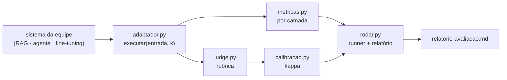
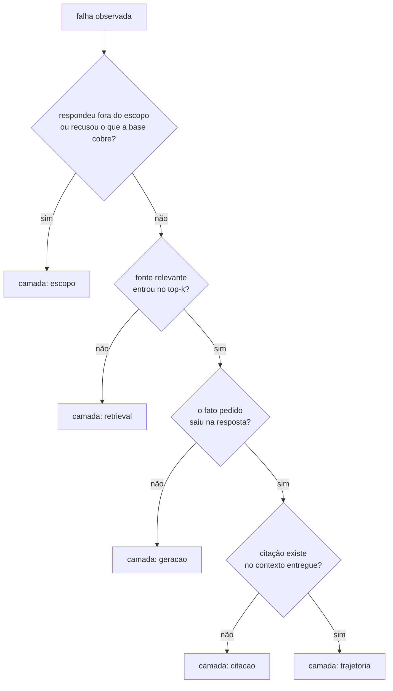
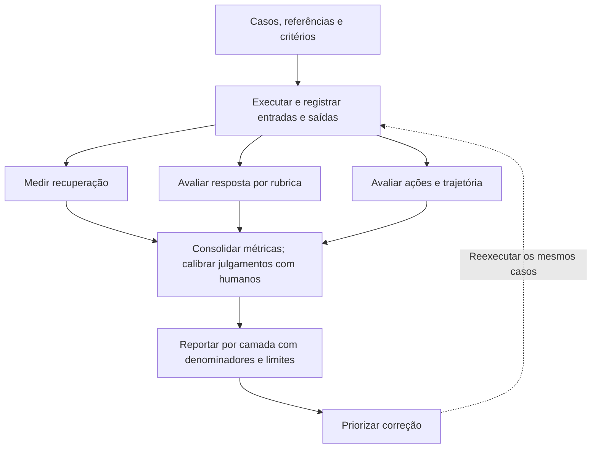
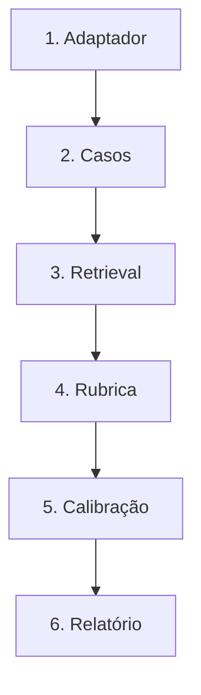
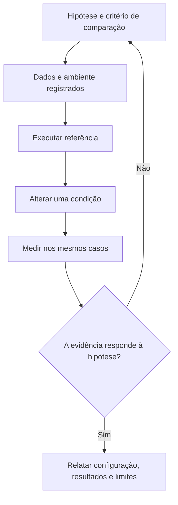

# Especificação de slides — Aula 28 (V2)

> **Rebalanceamento V2 — aula de laboratório (§6-bis do contrato).** Num lab a matemática **é**
> a prática: a equipe implementa `recall_em_k`, `rr` e `kappa_cohen` com as próprias mãos.
> Por isso o **roteiro prático não foi reordenado** — setup, passo zero com stub, demo e os
> cinco checkpoints permanecem na ordem que funciona em bancada. O que mudou:
>
> 1. **Cada checkpoint abre pelo comportamento esperado** — a linha que a tela imprime quando
>    está certo — e só depois nomeia o que implementar.
> 2. **A Parte 2 é nova:** um apêndice com o fundamento formal de cada métrica que o harness
>    calcula (A.1 a A.5), com fórmula, leitura, casos-limite e a estatística que decide se uma
>    diferença medida é resultado ou ruído.
> 3. **Cada checkpoint ganhou um ponteiro** para o item correspondente, sem interromper a prática.
>
> Carga horária (120 min), numeração dos slides do fluxo, checkpoints, entregável, pesos da
> nota e objetivos de aprendizagem: idênticos à V1.

<!-- SLIDE-FLOW:GUIDE:BEGIN -->
## Fluxogramas na produção dos slides

As orientações abaixo complementam o campo **Visual** dos slides indicados. Produzir os fluxogramas no próprio deck, como formas e conectores editáveis ou gráficos vetoriais; a biblioteca completa ao final torna esta especificação independente do portal.

- **Referência de composição:** título e propósito no topo, blocos numerados, conexões rotuladas, ramificações legíveis e uma saída identificada. Usar apenas o padrão visual da referência fornecida, sem importar seu assunto ou seus exemplos.
- **Tema do deck:** manter o fundo escuro e a paleta já especificada para a aula. Usar `#5b8cff` para o trecho ativo, tons neutros para o contexto e `#e2231a` conforme o significado definido no deck. Cor sempre acompanhada de rótulo.
- **Leitura:** entrada no topo ou à esquerda; saída na base ou à direita. Decisões em losangos, alternativas com rótulos e retornos apontando à etapa correta. Ramos paralelos convergem apenas onde seus resultados realmente são combinados.
- **Densidade:** no fluxo principal, projetar 3–6 blocos curtos por enquadramento, com corpo legível na última fileira. Um mapa maior pode ser revelado por etapas no mesmo slide. Detalhes, condições e explicações completas ficam nas notas; não reduzir a fonte para caber tudo.
- **Semântica:** mapas de percurso mostram ordem de estudo, não execução de um algoritmo. Manter separadas preparação e aplicação, treino e inferência, sequência e alternativas. Não transformar uma etapa opcional em obrigatória.
- **Integração:** o fluxograma substitui uma lista redundante ou ocupa o campo Visual; não cobre matrizes, tabelas, gráficos nem código indispensáveis. Preservar títulos, numeração, duração e referências aos apêndices.
- **Produção:** os blocos Mermaid abaixo são especificações do desenho. Renderizar/reconstruir como diagrama, nunca projetar o código Mermaid. Manter rótulos, bifurcações, retornos e limites declarados. Não transformar este caderno técnico em slides adicionais.
- **Ligação com o portal:** os mapas de mecanismo compartilham o conteúdo dos fluxogramas do portal. Em demonstrações, usar o mesmo vocabulário no deck e no controle interativo para facilitar a passagem entre os dois.
<!-- SLIDE-FLOW:GUIDE:END -->

## Diretrizes visuais

- **Tema:** escuro, accent `#e2231a` (vermelho CESAR), accent secundário `#5b8cff`.
- **Tipografia:** sans-serif para texto; monoespaçada para código, nomes de arquivo e métricas.
- **Densidade:** máximo 5 linhas de texto por slide no fluxo. Um conceito por slide.
- **Proibido no fluxo:** bullets genéricos ("Vantagens", "Desvantagens"); slide-parede de texto; clipart; gráfico sem eixo rotulado; captura de tela de terminal ilegível; **derivação ou passo algébrico**.
- **Fórmulas no fluxo:** renderizar como bloco destacado, enunciadas e lidas — nunca manipuladas. A derivação vive na Parte 2.
- **Convenção deste deck:** todo número que aparece em slide vem acompanhado do seu `n`. É a regra que o lab cobra, e o deck a obedece.
- **Slide de checkpoint:** a **primeira coisa** é o critério de conclusão observável — a linha que o terminal imprime. Só depois vem o que implementar, a armadilha, e o ponteiro `→ Apêndice A.n`.
- **No apêndice:** densidade alta é esperada e desejável. É material de consulta durante o lab e de estudo depois, e três dos cinco itens são pré-requisito direto de um checkpoint.

## Arco narrativo

O deck acompanha um lab atípico: cada equipe avalia um sistema diferente, então o material é um
template com um único ponto de variação — o adaptador. A história vai do instrumento vazio (o
harness rodando com um stub que recusa tudo) até um relatório com uma linha por camada,
passando por um exemplo de referência em que os números saem errados de propósito. O fecho é o
critério: número por camada é resultado, "respondeu bem" é impressão.

A Parte 2 fecha o arco da Aula 27 pelo lado da conta: lá a turma ouviu que 0,71 e 0,78 em vinte
casos são o mesmo número; aqui está o intervalo que prova, e o teste pareado que é o
instrumento certo para comparar duas versões do próprio sistema.

## Slides

---

# PARTE 1 — FLUXO PRINCIPAL

*O que se apresenta em aula. 11 slides, 120 minutos com demo, passo zero e cinco checkpoints.
Ordem prática preservada da V1.*

### Slide 1 — Abertura: hoje a avaliação do projeto de vocês vira número

<!-- SLIDE-FLOW:SLIDE:BEGIN -->
- **Fluxograma a incorporar neste slide:** **F00 — Avaliação: do caso à decisão**. O desenho e os rótulos completos estão no caderno de fluxogramas ao final deste arquivo.
- **Composição:** integrar ao campo Visual; preservar exemplos, tabelas, fórmulas e dimensões solicitados neste slide. Destacar o trecho relacionado ao título e manter o restante em segundo plano. Os textos detalhados ficam nas notas, sem duplicar a lista de Conteúdo na tela.
<!-- SLIDE-FLOW:SLIDE:END -->

- **Tipo:** título
- **Título:** Laboratório 8 — Harness de avaliação do projeto
- **Frase-tese:** "Este é o único lab do curso cujo produto vocês vão me entregar duas vezes: hoje como lab, e na Aula 30 como parte do projeto."
- **Conteúdo:**
  - Recap da Aula 27 em quatro linhas: a menor camada que explica a falha; rubrica com nível observável; kappa desconta o acaso; juiz não calibrado é número sem procedência
  - Hoje: as quatro coisas viram função Python, sobre o sistema da equipe
  - O produto integra a **entrega final (Aula 30)**
- **Visual:** as quatro frases da Aula 27 em coluna à esquerda, com uma seta para o nome do módulo do harness que as implementa à direita (`metricas.py`, `judge.py`, `calibracao.py`, `rodar.py`).
- **Notas do apresentador:** Slide 1 do roteiro. Cravar a frase-âncora antes de qualquer arquivo abrir. Mencionar em trinta segundos que este deck tem apêndice com a fórmula e a leitura de cada métrica do harness — inclusive a conta do "0,71 contra 0,78" que ficou devendo na Aula 27. Não mais que trinta segundos.

### Slide 2 — Este lab é um template, não um script
- **Tipo:** diagrama
- **Título:** Cinco módulos iguais para todos, um só é de vocês
- **Conteúdo:**
  - Projetos diferentes: RAG, agente de triagem, fine-tuning comparativo — não existe script único
  - `adaptador.py` expõe **uma** função: `executar(entrada, k)`
  - Contrato de retorno: `resposta`, `fontes_citadas`, `ranking`, `trajetoria`, `parou_por`, `recusou`
  - Regra 1: **uma chamada por caso** — todas as camadas saem da mesma execução
  - Regra 2: camada inexistente devolve `[]` → sai do denominador, não conta zero
- **Visual:** diagrama Mermaid abaixo — o sistema da equipe entra por um único ponto.
- **Fundamento:** a Regra 2 não é conveniência de implementação: contar zero onde a camada não existe muda o **denominador** da métrica, e denominador errado produz número errado com aparência de número certo. É a mesma distinção que tira o caso fora do escopo do denominador do `recall@k`.
  → o efeito do denominador sobre `recall@k` e `precision@k`, com o número do exemplo: **Apêndice A.1** (slide 12)
- **Notas do apresentador:** Slide 2 do roteiro. Nomear os seis arquivos apontando na árvore projetada.



### Slide 3 — O mapa: cinco checkpoints, e o harness roda antes de o sistema entrar

<!-- SLIDE-FLOW:SLIDE:BEGIN -->
- **Fluxograma a incorporar neste slide:** **F01 — O percurso desta aula**; **F02 — Laboratório: da hipótese à evidência**. O desenho e os rótulos completos estão no caderno de fluxogramas ao final deste arquivo.
- **Composição:** integrar ao campo Visual; preservar exemplos, tabelas, fórmulas e dimensões solicitados neste slide. Destacar o trecho relacionado ao título e manter o restante em segundo plano. Os textos detalhados ficam nas notas, sem duplicar a lista de Conteúdo na tela.
- **Momento de exibição:** apresentar o fluxo preenchido na discussão ou conferência, depois da tentativa da turma; durante a atividade, ocultar as etapas que entregariam a solução.
<!-- SLIDE-FLOW:SLIDE:END -->

- **Tipo:** diagrama
- **Título:** Cinco checkpoints — e um passo zero com sistema de mentira
- **Conteúdo:** Os cinco checkpoints apresentados **pelo que a tela imprime**:
  ```
  CP0  00:10–00:15   adaptador + stub      → "Adaptador OK — contrato respeitado."
  CP1  00:35–00:50   conjunto de teste     → distribuição + "Checkpoint 1 OK"   (A.1)
  CP2  00:50–01:05   métricas por camada   → "Checkpoint 2 OK"                  (A.1–A.3)
  CP3  01:15–01:25   juiz com rubrica      → "Checkpoint 3 OK" + nota por caso
  CP4  01:25–01:37   calibração e kappa    → p_o, κ e a lista de desacordos     (A.4)
  CP5  01:37–01:47   rodar e priorizar     → relatorio-avaliacao.md gerado      (A.5)
  ```
  - CP0 roda `python rodar.py --testes` com `executar_stub` — o harness fecha sem sistema nenhum
  - Quem está com o pipeline quebrado **não perde este lab**
  - O stub recusa tudo → acerta 100% dos casos fora do escopo
- **Frase-tese:** "Um sistema inútil com uma métrica ótima — é por isso que eu não aceito nota única."
- **Visual:** linha do tempo horizontal 00:35 → 01:47 com os cinco checkpoints e o intervalo marcado; o CP0 desenhado antes da linha, fora dela. A coluna `(A.n)` em cinza discreto — ponteiro de estudo, não tarefa de sala.
- **Notas do apresentador:** Slide 3 do roteiro. Rodar `--testes` na tela e esperar a sala acompanhar. A coluna do apêndice se explica em uma frase: "cada métrica que vocês vão escrever tem um item com a fórmula, a leitura e o caso em que ela mente".

### Slide 4 — [Demo] O harness rodando num sistema de referência

<!-- SLIDE-FLOW:SLIDE:BEGIN -->
- **Fluxograma a incorporar neste slide:** **F00 — Avaliação: do caso à decisão**. O desenho e os rótulos completos estão no caderno de fluxogramas ao final deste arquivo.
- **Composição:** integrar ao campo Visual; preservar exemplos, tabelas, fórmulas e dimensões solicitados neste slide. Destacar o trecho relacionado ao título e manter o restante em segundo plano. Os textos detalhados ficam nas notas, sem duplicar a lista de Conteúdo na tela.
<!-- SLIDE-FLOW:SLIDE:END -->

- **Tipo:** código
- **Título:** Demo — mini-RAG do Lab 5, com defeitos plantados
- **Conteúdo:**
  - `python harness-solucao.py --etapa 1..5` — offline, só biblioteca padrão
  - Os quatro números que eu leio em voz alta: `recall@1 = 0,74 (n=17)`; inversão do pairwise `= 0%`; `κ = 0,67` com `p_o = 0,83`; falha por categoria
  - Aprovação global 65% — e a tabela por categoria desmente a leitura
- **Frase-tese:** "Acerta 100% do fácil e erra 100% das paráfrases. A nota global escondeu o diagnóstico inteiro."
- **Visual:** a tabela por categoria projetada em tamanho grande, com as duas linhas extremas destacadas em accent. Ao lado, a nota global 65% riscada.
- **Fundamento:** três dos quatro números só se lê corretamente sabendo de onde vêm. `n = 17` e não 20 porque os fora-do-escopo não declaram fonte relevante; `precision@3 = 0,31` é **aritmética**, não defeito, porque com uma fonte relevante em três posições o teto da precisão é `1/3`; e a inversão em 0% é **propriedade do juiz determinístico**, não virtude do sistema.
  → o denominador e o teto de `precision@k`: **Apêndice A.1** (slide 12) · a inversão de um juiz derivado de nota absoluta: **A.2 da Aula 27**
- **Notas do apresentador:** Parte 2 do roteiro, 9 passos. Rodar etapa por etapa; nunca tudo de uma vez.

| Categoria | Casos | Falhas | Taxa |
|---|---|---|---|
| `fato_simples` | 10 | 0 | 0% |
| `multi_dispositivo` | 2 | 1 | 50% |
| `fora_do_escopo` | 3 | 2 | 67% |
| `parafrase` | 4 | 4 | 100% |

### Slide 5 — Checkpoint 1 — O conjunto que discrimina

<!-- SLIDE-FLOW:SLIDE:BEGIN -->
- **Fluxograma a incorporar neste slide:** **F02 — Laboratório: da hipótese à evidência**. O desenho e os rótulos completos estão no caderno de fluxogramas ao final deste arquivo.
- **Composição:** integrar ao campo Visual; preservar exemplos, tabelas, fórmulas e dimensões solicitados neste slide. Destacar o trecho relacionado ao título e manter o restante em segundo plano. Os textos detalhados ficam nas notas, sem duplicar a lista de Conteúdo na tela.
- **Momento de exibição:** apresentar o fluxo preenchido na discussão ou conferência, depois da tentativa da turma; durante a atividade, ocultar as etapas que entregariam a solução.
<!-- SLIDE-FLOW:SLIDE:END -->

- **Tipo:** exercício (moldura de checkpoint)
- **Título:** CP1 — 20+ casos, e o critério não é o número
- **Conteúdo:**
  **Quando está certo, a tela imprime isto:**
  ```
  distribuição por categoria: {...}
  Checkpoint 1 OK
  ```
  e o validador terá conferido o mínimo estrutural: 20 casos, 3 categorias, 3 casos
  `fora_do_escopo`, nenhum `TODO` restante, nenhuma fonte inexistente no corpus.

  O que decide a qualidade, e não é o número 20:
  - Poder discriminativo: o conjunto serve se separa **duas versões** do sistema
  - Par de paráfrase — mesma referência, vocabulário da fonte × do usuário
  - Fora do escopo com palavra armadilha — engana o retrieval, não só deixa de casar
  - Multi-fonte — separa "recuperou" de "sintetizou"
  - Regressão — toda falha já vista virou caso
  - Escrever o caso **antes** de olhar a saída do sistema
- **Frase-tese:** "Vinte casos não é a meta, é o mínimo. A meta é um conjunto que separe duas versões do sistema de vocês."
- **Visual:** no topo, o critério de conclusão. Abaixo, um par de paráfrase lado a lado (mesma `referencia`, entradas diferentes), com a seta "se c01 passa e c02 falha → a falha é do retrieval".
- **Fundamento:** com `n` casos, a menor diferença que o conjunto consegue exibir é `1/n` — com 20 casos, **5 pontos percentuais**. Um conjunto de 20 não distingue 0,71 de 0,78: essa diferença é um caso e meio. É a razão aritmética de "20 é o mínimo, não a meta".
  → o intervalo de confiança de uma proporção com `n = 20`, e por que aumentar `n` é o único jeito de aumentar a resolução: **Apêndice A.5** (slide 16)
- **Notas do apresentador:** Slide 5 do roteiro. Passar mesa por mesa pedindo **o par de paráfrase**. Em 00:47, anunciar que 12 casos válidos fecham em sala. Quem perguntar "por que 20 e não 10?" recebe a resposta aritmética (`1/n`) e o ponteiro para A.5 — não a conta.

### Slide 6 — Checkpoint 2 — Métricas por camada, com denominador visível

<!-- SLIDE-FLOW:SLIDE:BEGIN -->
- **Fluxograma a incorporar neste slide:** **F00 — Avaliação: do caso à decisão**. O desenho e os rótulos completos estão no caderno de fluxogramas ao final deste arquivo.
- **Composição:** integrar ao campo Visual; preservar exemplos, tabelas, fórmulas e dimensões solicitados neste slide. Destacar o trecho relacionado ao título e manter o restante em segundo plano. Os textos detalhados ficam nas notas, sem duplicar a lista de Conteúdo na tela.
- **Momento de exibição:** apresentar o fluxo preenchido na discussão ou conferência, depois da tentativa da turma; durante a atividade, ocultar as etapas que entregariam a solução.
<!-- SLIDE-FLOW:SLIDE:END -->

- **Tipo:** conceito (moldura de checkpoint)
- **Título:** CP2 — três camadas, e o `n` do lado de cada número
- **Conteúdo:**
  **Quando está certo, a tela imprime isto:**
  ```
  Checkpoint 2 OK
  ```
  Os testes comparam com casos pequenos calculados à mão — inclusive o caso de `relevantes`
  vazio, que é o que separa "sem fonte relevante" de "recall zero".

  As seis funções, por camada:
  - retrieval: `recall@k`, `precision@k`, `MRR` — só sobre casos que declaram fonte relevante
  - resposta: `acerto_por_termos`, `citacao_valida`, `recusa_correta` — determinísticas, sem juiz
  - trajetória: sucesso = passos no orçamento **e** nenhum `ok=False` **e** parada por resposta/recusa
  ```
  recall@k    = |relevantes ∩ ranking[:k]| / |relevantes|
  precision@k = |relevantes ∩ ranking[:k]| / k
  rr          = 1 / posição do primeiro relevante        (MRR = média dos rr)
  ```
- **Frase-tese:** "Com 20 casos, cada caso vale 5 pontos percentuais. Uma melhora de 5% é um caso."
- **Visual:** no topo, o critério. Abaixo, as fórmulas em bloco monoespaçado e, ao lado, a coluna `n` de uma tabela real mostrando 17 e 20 em linhas diferentes.
- **Fundamento:** as três de retrieval têm o **mesmo numerador e denominadores diferentes**, e é o denominador que define a pergunta: `recall@k` divide pelo que existia (o que eu deixei escapar?), `precision@k` divide por `k` (quanto do que eu trouxe presta?), e o `rr` não divide — ele lê a **posição**, informação que as outras duas descartam.
  → `recall@k` e `precision@k` com denominadores, tetos e casos-limite: **Apêndice A.1** (slide 12) ·
  `MRR` e o que ele vê que o recall não vê: **Apêndice A.2** (slide 13) ·
  as três da camada de resposta e a conjunção da trajetória: **Apêndice A.3** (slide 14)
- **Notas do apresentador:** Slide 6 do roteiro. Explicar por que 17 e não 20 antes de largar o checkpoint — é o erro conceitual do checkpoint e a explicação cabe em uma frase falada. A leitura "mesmo numerador, denominadores diferentes" é o que faz as três fórmulas pararem de parecer arbitrárias.

### Slide 7 — Checkpoint 3 — A rubrica é o instrumento

<!-- SLIDE-FLOW:SLIDE:BEGIN -->
- **Fluxograma a incorporar neste slide:** **F00 — Avaliação: do caso à decisão**. O desenho e os rótulos completos estão no caderno de fluxogramas ao final deste arquivo.
- **Composição:** integrar ao campo Visual; preservar exemplos, tabelas, fórmulas e dimensões solicitados neste slide. Destacar o trecho relacionado ao título e manter o restante em segundo plano. Os textos detalhados ficam nas notas, sem duplicar a lista de Conteúdo na tela.
- **Momento de exibição:** apresentar o fluxo preenchido na discussão ou conferência, depois da tentativa da turma; durante a atividade, ocultar as etapas que entregariam a solução.
<!-- SLIDE-FLOW:SLIDE:END -->

- **Tipo:** conceito (moldura de checkpoint)
- **Título:** CP3 — três critérios, três níveis, âncora observável
- **Conteúdo:**
  **Quando está certo, a tela imprime isto:**
  ```
  Checkpoint 3 OK
  ```
  com a nota e o **motivo** de cada caso de teste, e `ADVERTENCIA_JUIZ` sem nenhum `TODO`.

  - Três níveis (0, 1, 2): é o teto do que duas pessoas distinguem de forma reprodutível
  - "Cita o dispositivo correto e não adiciona informação ausente da fonte" **discrimina**; "boa" não
  - Domínio diferente → trocar os três critérios, manter a forma
  - Duas rotas: `juiz_heuristico` (offline, determinístico, padrão) e `juiz_llm` (chave por `getpass`, temperatura 0, queda caso a caso)
  - `ADVERTENCIA_JUIZ`: quem julgou — modelo, família, temperatura
- **Frase-tese:** "Nível descrito por adjetivo não discrimina. Parece detalhe de redação e é o que decide o kappa dez minutos depois."
- **Visual:** no topo, o critério. Abaixo, tabela 3×3 da rubrica (critério × nível) com o texto real dos níveis; à direita, o mesmo critério redigido com adjetivo, marcado como recusado.
- **Fundamento:** a rubrica é o que define a **distribuição de rótulos** do conjunto, e é a distribuição que decide o quanto de acordo é explicado por acaso. Rubrica com um nível que quase nunca é usado produz distribuição desbalanceada — e aí acordo bruto alto convive com kappa baixo, por construção.
  → como a distribuição de rótulos entra no kappa, e o que precisaria mudar no conjunto para o mesmo acordo bruto dar kappa alto: **Apêndice A.4** (slide 15)
- **Fundamento (de onde partir, em vez de partir do zero):** escrever três critérios do nada é a parte mais cara deste checkpoint e a que mais varia de qualidade entre equipes. O **Agent GPA** (`arXiv 2510.08847`) oferece cinco dimensões já validadas para sistemas com agente — **Cumprimento de Objetivo, Qualidade do Plano, Aderência ao Plano, Consistência Lógica e Eficiência de Execução** —, com juízes-modelo concordando entre **80% e mais de 95%** com anotação humana e **86%** de concordância na *localização* do erro. A equipe **não** copia as cinco: escolhe as que se aplicam ao próprio sistema e redige os níveis observáveis de cada uma. Um sistema de RAG sem planejamento explícito, por exemplo, não tem o que medir em Aderência ao Plano — e perceber isso **é** parte do checkpoint.
  → as cinco dimensões e a razão de elas serem ortogonais à taxonomia por etapa da Aula 26: **slide 10 da Aula 26**
- **Notas do apresentador:** Slide 7 do roteiro. Pedir que escrevam os níveis em português antes do `if`. Ler em voz alta a rubrica de uma equipe cujo domínio não é RAG. A amarração rubrica → distribuição → kappa é o que faz o CP4 não pegar a turma de surpresa.

### Slide 8 — Checkpoint 4 — Calibrar o juiz e reportar a concordância

<!-- SLIDE-FLOW:SLIDE:BEGIN -->
- **Fluxograma a incorporar neste slide:** **F00 — Avaliação: do caso à decisão**. O desenho e os rótulos completos estão no caderno de fluxogramas ao final deste arquivo.
- **Composição:** integrar ao campo Visual; preservar exemplos, tabelas, fórmulas e dimensões solicitados neste slide. Destacar o trecho relacionado ao título e manter o restante em segundo plano. Os textos detalhados ficam nas notas, sem duplicar a lista de Conteúdo na tela.
- **Momento de exibição:** apresentar o fluxo preenchido na discussão ou conferência, depois da tentativa da turma; durante a atividade, ocultar as etapas que entregariam a solução.
<!-- SLIDE-FLOW:SLIDE:END -->

- **Tipo:** dados (moldura de checkpoint)
- **Título:** CP4 — o juiz vale o que a concordância dele vale
- **Conteúdo:**
  **Quando está certo, a tela imprime isto:**
  ```
  acordo bruto: 0,xx    kappa: 0,xx
  desacordos: [c__, c__]
  ```
  e existe **uma linha escrita por desacordo**, dizendo se o conserto é na rubrica, no juiz ou
  no sistema. Kappa baixo **não** reprova o checkpoint; kappa sem inspeção de desacordo, sim.

  - Ordem: anotar à mão (10–12 casos, **com os de fronteira**) → rodar o juiz → matriz de confusão → `p_o` e `κ` → inspecionar cada desacordo
  - Anotar depois de ver a nota do juiz não é calibração, é concordar com ele
  - `p_o` alto com `κ` baixo = distribuição desbalanceada, anotação não mede nada
  - Exemplo de referência: `p_o = 0,83`, `κ = 0,67`, 2 desacordos, conserto na rubrica
  ```
  κ = (p_o − p_e) / (1 − p_e)        p_e = Σ_c P_humano(c) · P_juiz(c)
  ```
- **Frase-tese:** "Não vou cobrar kappa alto. Kappa baixo é diagnóstico da rubrica. Cobro uma linha escrita por desacordo."
- **Visual:** no topo, o critério. Abaixo, a matriz de confusão 2×2 do exemplo (humano × juiz) com as duas células de desacordo em accent, e a fórmula do kappa em bloco ao lado.
- **Fundamento:** `κ` é a **fração do acordo conquistável que foi conquistada** — o numerador é o acordo que sobrou depois do acaso, o denominador é o que estava disponível. E há um teto: o **kappa humano-humano** na mesma tarefa. Exigir do juiz mais que o teto é exigir mais do que a definição da tarefa entrega.
  → derivação de `p_e` sobre a matriz de confusão do exemplo (`p_o = 0,83 → κ = 0,67` passo a passo), o kappa ponderado para os três níveis da rubrica, o teto humano-humano e os casos-limite: **Apêndice A.4** (slide 15), que remete a **A.1 da Aula 27**
- **Fundamento (o que a lista de desacordos é, além de um relatório):** ela é a **fila de
  revisão de rótulo**. Todo caso em que juiz e humano divergem é candidato a rótulo humano
  ruim, não só a juiz ruim — e reler os desacordos é a única auditoria de rótulo que este lab
  permite, porque aqui **não se treina nada** e portanto não há gradiente. Onde há treino, o
  instrumento equivalente é a **auto-influência** (`η·‖∇L(x)‖²`), que ordena a mesma fila sem
  precisar de um segundo anotador — está em **A.4 da Aula 14**, com a condição que a
  invalida. Os dois respondem à mesma pergunta com o que cada contexto oferece: onde há
  treino, o gradiente; onde há dois anotadores, o desacordo.
- **Notas do apresentador:** Slide 8 do roteiro. Perguntar sem drama quem anotou depois de rodar o juiz. Se muitas equipes vierem com kappa perto de zero, reescrever uma rubrica ao vivo. A rubrica de três níveis pede kappa **ponderado**, não simples — está em A.4 e a implementação de referência aceita os dois.

### Slide 9 — Checkpoint 5 — Falha na menor camada, e conserto por prioridade

<!-- SLIDE-FLOW:SLIDE:BEGIN -->
- **Fluxograma a incorporar neste slide:** **F00 — Avaliação: do caso à decisão**. O desenho e os rótulos completos estão no caderno de fluxogramas ao final deste arquivo.
- **Composição:** integrar ao campo Visual; preservar exemplos, tabelas, fórmulas e dimensões solicitados neste slide. Destacar o trecho relacionado ao título e manter o restante em segundo plano. Os textos detalhados ficam nas notas, sem duplicar a lista de Conteúdo na tela.
- **Momento de exibição:** apresentar o fluxo preenchido na discussão ou conferência, depois da tentativa da turma; durante a atividade, ocultar as etapas que entregariam a solução.
<!-- SLIDE-FLOW:SLIDE:END -->

- **Tipo:** diagrama (moldura de checkpoint)
- **Título:** CP5 — classificar de baixo para cima, priorizar por impacto/custo
- **Conteúdo:**
  **Quando está certo, existe isto no repositório:**
  ```
  relatorio-avaliacao.md      (gerado pelo código, seis seções)
  teste_checkpoint_5 ......... OK
  ```
  O teste falha de propósito se o sistema declara camada de retrieval e o relatório não tem
  `recall@`, ou se não há kappa no relatório.

  - Ordem de teste: escopo → retrieval → geração → citação → trajetória; a **primeira** que dispara é a camada
  - Resposta errada porque o documento não foi recuperado é falha de **retrieval**
  - `prioridade = impacto / custo`, custo declarado pela equipe (1 barato · 3 caro)
  - O relatório é **saída do código** — ninguém redige à mão
- **Frase-tese:** "A tabela existe para vocês consertarem o que dói, e não o que é divertido de consertar."
- **Visual:** no topo, o critério. Abaixo, fluxograma Mermaid da cascata de classificação; ao lado, a tabela de prioridade do exemplo com `escopo` em primeiro lugar.
- **Fundamento:** o impacto de cada camada é uma **proporção medida em 20 casos**, e por isso a ordem da tabela de prioridade só é confiável quando as diferenças entre camadas são maiores que a resolução do conjunto. Uma camada com 4 casos e outra com 3 estão empatadas, e a tabela não sabe disso.
  → o intervalo de confiança de uma proporção com `n = 20`, por que 0,71 e 0,78 não se distinguem, e o **teste de McNemar** — o instrumento certo para comparar duas versões do sistema **nos mesmos casos**: **Apêndice A.5** (slide 16)
- **Notas do apresentador:** Slide 9 do roteiro. Lembrar a ordem antes de largar; é o erro estrutural do checkpoint. A ressalva sobre a resolução da tabela de prioridade é nova na V2 e é o que impede a equipe de tratar uma diferença de um caso como hierarquia.



### Slide 10 — O critério: número por camada, e o que não conta

<!-- SLIDE-FLOW:SLIDE:BEGIN -->
- **Fluxograma a incorporar neste slide:** **F00 — Avaliação: do caso à decisão**. O desenho e os rótulos completos estão no caderno de fluxogramas ao final deste arquivo.
- **Composição:** integrar ao campo Visual; preservar exemplos, tabelas, fórmulas e dimensões solicitados neste slide. Destacar o trecho relacionado ao título e manter o restante em segundo plano. Os textos detalhados ficam nas notas, sem duplicar a lista de Conteúdo na tela.
<!-- SLIDE-FLOW:SLIDE:END -->

- **Tipo:** transição
- **Título:** "Respondeu bem" não é resultado
- **Conteúdo:**
  - Sem número por camada, sem denominador declarado, sem concordância do juiz medida → perde o item de rigor (30% do projeto)
  - Vale mesmo com o sistema funcionando perfeitamente na demo
  - Peso: relatório gerado 25% · calibração 25% · CP1–CP3 com saída 35% · questões-guia 10% · declaração de IA 5%
  - E o inverso também não conta: **número sem `n` não é número.** "Melhorou de 0,71 para 0,78" sem dizer que `n = 20` é uma frase, não um resultado
- **Frase-tese:** "'O sistema respondeu bem' não é resultado. É impressão. E número sem denominador é impressão com vírgula."
- **Visual:** duas caixas lado a lado — à esquerda, "o sistema respondeu bem em 8 de 10", riscada; à direita, três linhas de tabela com camada, métrica, valor e `n`. Abaixo, uma terceira caixa em cinza: "melhorou 7 pontos", também riscada, com "(n = ?)" em accent.
- **Notas do apresentador:** Slide 10 do roteiro. Único slide expositivo do lab; se o tempo estourar, dizer só a frase-âncora. A terceira caixa é nova na V2 e fecha o argumento do slide 5 da Aula 27.

### Slide 11 — Recolhimento e ponte para a Aula 29
- **Tipo:** encerramento
- **Título:** O que vocês têm agora, e o que eu recolho
- **Conteúdo:**
  - Inventário: conjunto rotulado · métricas em três camadas · rubrica e juiz · kappa com desacordos lidos · fila de consertos ordenada
  - Entrega em uma semana: harness executável, `relatorio-avaliacao.md` gerado, anotação humana com autoria, questões-guia, declaração de uso de IA
  - O mesmo relatório volta na **Aula 30**, com o sistema real ligado
  - Aula 29: recapitulação do stack completo (com o mapa de em que aula cada peça foi construída) + fronteiras da área
- **Frase-tese:** "Na Aula 1 eu disse que no fim vocês iam apresentar um sistema construído por vocês, com números que provam que funciona. Os números começaram a existir hoje."
- **Visual:** checklist de entrega com `☐` à esquerda; à direita, duas pílulas de navegação — Aula 27 (anterior) e Aula 29 (próxima). Num canto discreto, o índice do apêndice: A.1 recall e precision · A.2 MRR · A.3 métricas de resposta e trajetória · A.4 kappa na calibração · A.5 vinte casos, intervalo e McNemar.
- **Notas do apresentador:** Slide 11 do roteiro. Fechar o terminal antes de falar; ninguém escuta recolhimento com o editor aberto. Projetar o índice do apêndice por 20 s e apontar A.5: é a resposta da pergunta que ficou em aberto na Aula 27, e é o que a equipe precisa ler antes de escrever a seção de limitações do relatório.

---

# PARTE 2 — APÊNDICE MATEMÁTICO

*Material de consulta durante o lab e de estudo depois. **Não se apresenta em aula.** Reúne,
com rigor completo, a fórmula, a leitura e os casos-limite de cada métrica que o harness
calcula — mais a estatística que decide se uma diferença medida é resultado ou ruído.
Autossuficiente: quem lê daqui consegue implementar `metricas.py` e `calibracao.py` sem o
enunciado do checkpoint.*

### Slide 12 — A.1 · `recall@k` e `precision@k`: o denominador decide a pergunta

<!-- SLIDE-FLOW:SLIDE:BEGIN -->
- **Fluxograma a incorporar neste slide:** **F00 — Avaliação: do caso à decisão**. O desenho e os rótulos completos estão no caderno de fluxogramas ao final deste arquivo.
- **Composição:** integrar ao campo Visual; preservar exemplos, tabelas, fórmulas e dimensões solicitados neste slide. Destacar o trecho relacionado ao título e manter o restante em segundo plano. Os textos detalhados ficam nas notas, sem duplicar a lista de Conteúdo na tela.
<!-- SLIDE-FLOW:SLIDE:END -->

- **Tipo:** apêndice — definição, leitura e casos-limite
- **Invocado em:** slides 2, 4, 5 e 6

**O que se quer estabelecer.** Que `recall@k` e `precision@k` têm o **mesmo numerador** e
respondem a perguntas diferentes porque dividem por coisas diferentes; que o valor máximo de
`precision@k` não é 1 na maioria dos casos do lab; e que a escolha do denominador — em
particular, quais casos entram e quais não entram — é a decisão que mais muda o número
reportado.

**Notação.**
Para um caso de teste `i`:
`R_i` — conjunto das fontes **relevantes** declaradas no caso (`fontes_relevantes`).
`L_i = (d_1, d_2, …)` — o `ranking` devolvido pelo adaptador, **ordenado**, do mais para o
menos relevante segundo o sistema.
`L_i[:k]` — os `k` primeiros elementos do ranking.
`|·|` — cardinalidade.

**Premissas.** (i) O ranking é uma lista sem repetição — se o sistema devolver o mesmo
documento duas vezes, `|L_i[:k]|` deixa de ser `k` e a precisão infla; (ii) os identificadores
de fonte no caso e no corpus são **a mesma string** — é aqui que o validador do CP1 ganha o seu
sustento, porque `Art. 42 §1` e `Art. 42 § 1º` são documentos diferentes para o conjunto e o
mesmo para o humano; (iii) `R_i` é conhecido e completo, o que significa que quem escreveu o
caso sabia quais dispositivos respondem à pergunta.

**Definições.**
```
recall@k(i)    = | R_i ∩ L_i[:k] | / | R_i |
precision@k(i) = | R_i ∩ L_i[:k] | / k
```
Numerador idêntico: **quantas fontes relevantes apareceram nas `k` primeiras posições**. O que
muda é por quanto se divide.

**Leitura.**
- `recall@k` divide pelo que **existia**: *das fontes que respondiam à pergunta, que fração eu
  consegui trazer?* É a métrica da pergunta "o que eu deixei escapar?", e é a que importa quando
  o gerador só pode usar o que entrou no contexto — que é o caso de todo RAG.
- `precision@k` divide pelo que eu **trouxe**: *do que entrou no contexto, que fração prestava?*
  É a métrica da pergunta "quanto lixo eu estou pagando para carregar?", e ela importa porque
  contexto custa token e porque documento irrelevante no contexto distrai o gerador.

**Agregação sobre o conjunto.** O harness reporta a média sobre os casos que declaram fonte
relevante:
```
recall@k = (1/|D|) · Σ_{i ∈ D} recall@k(i)          D = { i : R_i ≠ ∅ }
```
e o **`n` reportado ao lado do número é `|D|`, não o total de casos**.

**Por que o caso fora do escopo não entra no denominador.**
Um caso `fora_do_escopo` tem `R_i = ∅` por construção: a base não cobre a pergunta, logo não
existe fonte relevante. Duas consequências:

1. `recall@k(i) = |∅ ∩ L_i[:k]| / |∅| = 0/0` — **indefinido**, não zero. Não é uma escolha de
   projeto tratá-lo como zero: é um erro aritmético.
2. Se, apesar disso, o caso fosse contado como zero, o `recall@k` do conjunto cairia por uma
   razão que não tem nada a ver com recuperação. Com 20 casos e 3 fora do escopo, um sistema com
   recall real de 0,80 reportaria `0,80 · 17/20 = 0,68` — **doze pontos percentuais de queda
   fabricados pelo denominador**.

É por isso que o exemplo da demo imprime `recall@1 = 0,74 (n = 17)`, e é a mesma lógica da
Regra 2 do adaptador: camada inexistente sai do denominador em vez de contar zero.

*Como o caso fora do escopo é avaliado, então?* Pela camada de escopo — `recusa_correta` (ver
**A.3**), que tem o seu próprio denominador: os casos que declaram `deve_recusar`.

**O teto de `precision@k` — por que 0,31 não é defeito.**
Como o numerador é limitado por `|R_i|`:
```
precision@k(i) ≤ min(|R_i|, k) / k
```
Quando `|R_i| = 1` e `k = 3`, o **máximo possível** é `1/3 ≈ 0,333`. Um sistema perfeito, que
coloca a única fonte relevante na primeira posição de toda consulta, reporta `precision@3 = 0,333`.

*Verificação com o número da demo.* O exemplo imprime `precision@3 = 0,31` com a maioria dos
casos tendo uma única fonte relevante. Comparado ao teto de 0,333, isso é **93% do máximo
atingível**. Ler `0,31` como "precisão ruim" é ler errado, e é o erro de leitura mais comum do
relatório. A leitura correta é: `precision@k` só é comparável **contra o próprio teto**, ou entre
duas versões do sistema com o mesmo conjunto e o mesmo `k`.

**A relação entre os dois, e por que `k` é uma escolha e não um default.**
Aumentar `k` **nunca diminui** o recall — o conjunto `L_i[:k]` só cresce — e **quase sempre
diminui** a precisão, porque o denominador cresce mais rápido que o numerador. Formalmente:
```
k' > k  ⟹  recall@k'(i) ≥ recall@k(i)
k' > k  ⟹  precision@k'(i) ≤ precision@k(i) · k/k'  +  (novos relevantes)/k'
```
A escolha de `k` no projeto não é estética: ela é o ponto em que a equipe decide quanto contexto
está disposta a pagar. Um `k` grande esconde um retriever ruim atrás de um gerador que filtra —
e é por isso que reportar `recall@1` **e** `recall@k` separadamente é mais informativo que
reportar só o segundo.

**Casos-limite.**
- **`R_i = ∅`.** Indefinido; sai do denominador. Tratado acima.
- **`L_i = []`** (o sistema não recuperou nada, ou o projeto não tem retrieval). `recall@k = 0`
  legitimamente — havia o que trazer e nada veio. Distinguir isto do caso anterior é a razão de
  `relevantes` vazio ter um teste próprio no CP2.
- **`|R_i| > k`.** O recall é limitado por `k/|R_i| < 1` mesmo com um sistema perfeito. Um caso
  multi-fonte com três dispositivos relevantes e `k = 2` **não pode** dar recall 1. Se o conjunto
  tiver muitos casos assim, o `recall@k` médio tem um teto abaixo de 1 e o relatório precisa
  dizer isso.
- **`k` maior que o ranking devolvido.** `L_i[:k]` devolve a lista inteira; a precisão passa a
  dividir por `k` e não por `|L_i|`, o que a subestima. Implementações defensivas dividem por
  `min(k, |L_i|)` — e as duas convenções existem na literatura. **Declarar qual foi usada.**

**Erro de implementação que o teste do CP2 pega.** Esquecer o `[:k]` e calcular sobre o ranking
inteiro: o recall vira "a fonte apareceu em algum lugar da lista", que é uma métrica muito mais
fácil e completamente diferente. Com um ranking de 50 documentos, quase todo sistema tem recall
alto — e nenhum deles cabe no contexto.

**De volta ao fluxo:** slide 6.

### Slide 13 — A.2 · MRR: a informação que `recall@k` descarta
- **Tipo:** apêndice — definição, leitura e comparação
- **Invocado em:** slide 6

**O que se quer estabelecer.** Que `recall@k` é cego à **posição** dentro do top-`k`, que essa
cegueira esconde diferenças que importam quando há reranker ou orçamento de contexto, e que o
MRR é a métrica que recupera essa informação — com uma escala não linear que precisa ser lida
com cuidado.

**Notação.** Para o caso `i`, seja `pos_i` a posição (contada a partir de **1**) do primeiro
elemento de `L_i` que pertence a `R_i`. Se nenhum elemento de `L_i` for relevante, `pos_i` é
indefinido.

**Definição.**
```
rr(i) = 1 / pos_i        se existe algum relevante em L_i
rr(i) = 0                caso contrário

MRR = (1/|D|) · Σ_{i ∈ D} rr(i)          D = { i : R_i ≠ ∅ }
```
O `rr` é o **inverso da posição** do primeiro acerto — daí *reciprocal rank*. O MRR é a média
dos `rr` sobre os casos que têm fonte relevante, com o mesmo denominador de A.1.

**Tabela de leitura.**

| `pos` | `rr` | leitura |
|---|---|---|
| 1 | 1,000 | o documento certo foi o primeiro |
| 2 | 0,500 | segundo lugar já custa metade |
| 3 | 0,333 | |
| 5 | 0,200 | |
| 10 | 0,100 | |
| ausente | 0,000 | |

**A propriedade que define a métrica: o decaimento é hiperbólico, não linear.** Sair da posição 1
para a 2 custa `0,5`. Sair da 9 para a 10 custa `0,011`. O MRR pune **desproporcionalmente** o
erro no topo — o que é a modelagem correta quando quem consome o ranking é um gerador com
contexto limitado, ou um humano que lê os dois primeiros resultados e desiste.

**O que o MRR vê e o `recall@k` não vê.**
Sejam dois sistemas avaliados no mesmo caso, com uma única fonte relevante e `k = 3`:
```
sistema A:  ranking = [certo, x, y]      recall@3 = 1,0    precision@3 = 0,333    rr = 1,000
sistema B:  ranking = [x, y, certo]      recall@3 = 1,0    precision@3 = 0,333    rr = 0,333
```
**Recall e precisão são idênticos; o `rr` difere por um fator de três.** O sistema A entrega o
documento certo em primeiro lugar; o B o entrega depois de dois distratores. Se o gerador só cabe
com dois documentos no contexto, o sistema B falha e o A não — e as métricas de A.1 não
conseguem enxergar essa diferença.

*Consequência prática para o projeto:* **quem tem reranker precisa reportar MRR.** Um reranker
não muda o conjunto recuperado, ele muda a ordem — logo, por construção, ele não muda `recall@k`
para `k` fixo. Avaliar reranker por recall é avaliar a única coisa que ele não faz.

**O que o MRR não vê.** Ele olha **apenas o primeiro** relevante. Num caso multi-fonte com três
dispositivos relevantes, um sistema que traz um deles em primeiro lugar e ignora os outros dois
tem `rr = 1,0` — nota máxima — enquanto o `recall@3` correto seria `1/3`. As duas métricas são
complementares, e é por isso que o harness calcula as três.

*Quando o multi-fonte importa, a generalização é o **nDCG*** (*normalized discounted cumulative
gain*), que soma o ganho de **todos** os relevantes com desconto logarítmico pela posição:
```
DCG@k = Σ_{p=1}^{k}  rel_p / log₂(p + 1)          rel_p = 1 se L[p] ∈ R, 0 caso contrário
IDCG@k = DCG@k do ranking ideal (todos os relevantes primeiro)
nDCG@k = DCG@k / IDCG@k
```
A normalização por `IDCG` é o que torna o número comparável entre casos com números diferentes de
relevantes — sem ela, um caso com três fontes relevantes teria `DCG` maior que um com uma, sem
que o sistema fosse melhor. O nDCG está fora do mínimo obrigatório do CP2 e é a extensão natural
para quem tem muitos casos multi-fonte.

**Casos-limite.**
- **Nenhum relevante no ranking.** `rr = 0` por convenção. Note a assimetria: `rr = 0` significa
  "não achou em lugar nenhum", enquanto `recall@k = 0` significa "não achou nas `k` primeiras" —
  o documento pode estar na posição `k+1`. Reportar os dois separa "o retriever não tem" de "o
  `k` é curto demais", e essa distinção decide se o conserto é no índice ou no orçamento de
  contexto.
- **`R_i = ∅`.** Mesma regra de A.1: fora do denominador.
- **Empates no score.** Se o retriever devolve dois documentos com o mesmo score, a posição do
  relevante depende do critério de desempate da ordenação — que é frequentemente a ordem de
  inserção no índice. O MRR fica sensível a isso, e o recall não. Em conjuntos pequenos, isso é
  ruído real: vale fixar o desempate.

**Erros de implementação que o teste do CP2 pega.**
1. `rr` devolvendo a **posição** em vez do inverso dela — o número cresce quando devia cair.
2. Posição contada a partir de **zero**, o que produz divisão por zero no melhor caso possível.
   A posição do MRR é sempre 1-indexada.
3. Devolver `1/pos` do **último** relevante em vez do primeiro.

**De volta ao fluxo:** slide 6.

### Slide 14 — A.3 · As métricas determinísticas de resposta e de trajetória

<!-- SLIDE-FLOW:SLIDE:BEGIN -->
- **Fluxograma a incorporar neste slide:** **F00 — Avaliação: do caso à decisão**. O desenho e os rótulos completos estão no caderno de fluxogramas ao final deste arquivo.
- **Composição:** integrar ao campo Visual; preservar exemplos, tabelas, fórmulas e dimensões solicitados neste slide. Destacar o trecho relacionado ao título e manter o restante em segundo plano. Os textos detalhados ficam nas notas, sem duplicar a lista de Conteúdo na tela.
<!-- SLIDE-FLOW:SLIDE:END -->

- **Tipo:** apêndice — definição e casos em que a métrica mente
- **Invocado em:** slide 6

**O que se quer estabelecer.** Que existem três números na camada de resposta e um na trajetória
que **não precisam de juiz nenhum** — determinísticos, baratos e reprodutíveis —, quais são os
seus denominadores, e o caso concreto em que cada um mente. É a camada que o Lab 8 manda medir
antes de gastar chamada de API.

**Notação.** Para o caso `i`: `y_i` a resposta produzida; `T_i` os `termos_exigidos` declarados no
caso; `F_i` as `fontes_citadas` na resposta; `C_i` o conjunto de fontes efetivamente entregues ao
gerador (o contexto); `deve_recusar_i ∈ {V, F}`; `recusou_i ∈ {V, F}`.

**1 · Acerto por termos exigidos.**
```
acerto_por_termos(i) = 1   se todo t ∈ T_i aparece em y_i (após normalização)
                       0   caso contrário
```
*Normalização.* A comparação remove acentos e caixa **dos dois lados** — do termo e da resposta.
Comparar `"trancamento"` com `"Trancamento"` ou com `"trancamento"` escrito com til em outro
ponto do texto é a fonte número um de falso negativo nesta métrica, e é por isso que
`_sem_acento` existe no módulo e é aplicado nos dois lados.

*Leitura.* É a métrica mais barata que existe e a mais literal: ela pergunta se o **fato pedido**
saiu na resposta, não se a resposta é boa. `termos_exigidos` deve conter termos ou números — `30`,
`trancamento`, `Art. 42` —, nunca frases inteiras, porque uma frase inteira transforma a métrica
num teste de redação exata que nenhum gerador passa.

*Quando ela mente.* Uma resposta que diz *"o prazo **não** é de trinta dias"* contém o termo
`30` e passa. A métrica é de **presença**, não de asserção. É o motivo de ela não substituir o
juiz — ela é o filtro barato que roda antes.

**2 · Validade de citação.**
```
citacao_valida(i) = 1   se F_i ⊆ C_i        (toda fonte citada estava no contexto entregue)
                    0   caso contrário
```
*Leitura.* Isto **não** verifica se a fonte citada *sustenta* a afirmação — isso é factualidade,
e é a decomposição em afirmações atômicas de **A.4 da Aula 27**. Verifica apenas que o sistema
não citou um documento que ele nunca viu. É uma detecção de alucinação de **referência**, que é a
mais barata de pegar e a mais constrangedora de deixar passar.

*Caso-limite.* `F_i = ∅` (a resposta não cita nada). A convenção do harness é tratar como
**válido** — não há citação inválida —, e a cobertura de citação é uma métrica separada
(`|{i : F_i ≠ ∅}| / n`). Confundir as duas produz um sistema que nunca cita e tem citação 100%
válida, que é a mesma armadilha do stub.

**3 · Recusa correta.**
```
recusa_correta(i) = 1   se recusou_i == deve_recusar_i
                    0   caso contrário

taxa = ( Σ_{i ∈ E} recusa_correta(i) ) / |E|          E = { i : deve_recusar_i definido }
```
*Leitura.* Mede **escopo**: o sistema recusou o que devia recusar e respondeu o que devia
responder. É a métrica que avalia os casos `fora_do_escopo`, que ficaram de fora do denominador
do `recall@k` (ver A.1) — cada caso é avaliado pela camada que faz sentido para ele.

*A armadilha do stub, formalizada.* O `executar_stub` recusa **tudo**. Logo, para todo caso com
`deve_recusar = V` ele acerta, e para todo caso com `deve_recusar = F` ele erra. Se o conjunto
tem 3 casos fora do escopo e 17 dentro:
```
recusa_correta(stub) = 3/20 = 0,15        sobre todos os casos
recusa_correta(stub) = 3/3  = 1,00        se o denominador for só os fora_do_escopo
```
**O segundo número é 100% para um sistema que não faz nada.** É exatamente o ponto do slide 3, e
a lição não é "a métrica é ruim": é que **uma métrica isolada, com o denominador escolhido a
dedo, sempre pode ser feita parecer boa**. A defesa é a tabela inteira, com todos os denominadores
declarados.

**4 · Trajetória bem formada.**
```
trajetoria_bem_formada(i) = 1  se  (passos_i ≤ orçamento)
                                 ∧ (nenhum passo com ok = False)
                                 ∧ (parou_por ∈ {resposta, recusa})
                            0  caso contrário
```
*Leitura — por que conjunção e não média.* Os três predicados não são graus de qualidade: são
condições de boa formação. Um agente que estourou o orçamento não é "parcialmente bem sucedido";
ele não terminou. Fazer a média dos três produziria um número entre 0 e 1 para uma trajetória que
falhou, e esse número entraria na tabela como se fosse desempenho parcial.

*A terceira condição é a que mais gente esquece.* `parou_por = "limite"` significa que o agente
foi **interrompido**, não que ele decidiu parar. Uma trajetória que dá a resposta certa no último
passo permitido e é cortada pelo limite não é sucesso: é sorte, e ela não se repete quando a
entrada é um pouco mais longa.

*Métrica complementar, e barata:* a **distribuição** de passos até a parada — não só a média.
Uma média de 4 passos com metade dos casos em 1 e metade em 7 descreve dois comportamentos
diferentes, e é a distribuição que revela isso. É o mesmo argumento do slide 4: a média esconde
o diagnóstico.

**Nota geral sobre esta camada.** As quatro métricas acima custam zero chamadas de API e rodam em
milissegundos. Toda equipe que gasta o orçamento do juiz para medir algo que uma dessas quatro já
mede está pagando caro por um número pior — porque o juiz, além de caro, tem viés (Aula 27) e
essas quatro não têm. **A ordem correta é sempre: determinística primeiro, juiz depois, humano
por último.**

**De volta ao fluxo:** slide 6.

### Slide 15 — A.4 · Kappa de Cohen aplicado à calibração juiz–humano

<!-- SLIDE-FLOW:SLIDE:BEGIN -->
- **Fluxograma a incorporar neste slide:** **F00 — Avaliação: do caso à decisão**. O desenho e os rótulos completos estão no caderno de fluxogramas ao final deste arquivo.
- **Composição:** integrar ao campo Visual; preservar exemplos, tabelas, fórmulas e dimensões solicitados neste slide. Destacar o trecho relacionado ao título e manter o restante em segundo plano. Os textos detalhados ficam nas notas, sem duplicar a lista de Conteúdo na tela.
<!-- SLIDE-FLOW:SLIDE:END -->

- **Tipo:** apêndice — derivação sobre o exemplo do lab
- **Invocado em:** slides 7 e 8

**Relação com a Aula 27.** A derivação geral do kappa — a construção de `p_e` a partir das
marginais, a leitura "fração do acordo conquistável", os quatro casos-limite e o paradoxo do
kappa — está em **A.1 da Aula 27**. Este item **não repete** aquilo: ele aplica a fórmula ao par
humano–juiz do Checkpoint 4, refaz a conta sobre a matriz do exemplo de referência, e trata os
dois pontos que só aparecem quando a rubrica tem três níveis.

**A troca de papel.** Na Aula 27, os dois "anotadores" eram duas pessoas. Aqui, o anotador 1 é a
**equipe** e o anotador 2 é o **juiz**. A matemática é idêntica; o que muda é a interpretação:
`κ` deixa de medir "a rubrica é clara?" e passa a medir "o juiz aplica a rubrica como nós
aplicamos?". Um `κ` baixo continua sendo diagnóstico da rubrica — porque um critério ambíguo é
lido diferente pelo humano e pelo juiz — mas agora ele também pode indicar que o juiz não tem a
informação necessária (por exemplo, não recebeu a fonte).

**Notação.** `A[i,j]` é a matriz de confusão: número de casos em que o **humano** deu o rótulo
`i` e o **juiz** deu o rótulo `j`. Com aprovação binária (`aprova` / `reprova`), `A` é 2×2; com a
rubrica de três níveis, é 3×3.

**A conta do exemplo de referência, refeita.**
O `harness-solucao.py` calibra sobre 12 casos anotados à mão e imprime `p_o = 0,83` e `κ = 0,67`.
A matriz que produz esses números:

|  | juiz: aprova | juiz: reprova | **total (humano)** |
|---|---|---|---|
| **humano: aprova** | 4 | 0 | **4** |
| **humano: reprova** | 2 | 6 | **8** |
| **total (juiz)** | **6** | **6** | **12** |

*Acordo observado.*
```
p_o = (4 + 6) / 12 = 10/12 = 0,8333…  ≈ 0,83
```

*Marginais.*
```
P_humano(aprova)  = 4/12 = 0,3333        P_humano(reprova)  = 8/12 = 0,6667
P_juiz(aprova)    = 6/12 = 0,5000        P_juiz(reprova)    = 6/12 = 0,5000
```

*Acordo esperado.*
```
p_e = P_humano(aprova)·P_juiz(aprova) + P_humano(reprova)·P_juiz(reprova)
    = 0,3333 · 0,5000 + 0,6667 · 0,5000
    = 0,16665 + 0,33335
    = 0,50
```

*Kappa.*
```
κ = (0,8333 − 0,50) / (1 − 0,50) = 0,3333 / 0,50 = 0,6667  ≈ 0,67
```
∎

**Leitura.** Dos 83% de acordo, 50 pontos percentuais já eram explicados pelo acaso — e note que
`p_e = 0,50` aqui, contra `p_e = 0,82` no exemplo da Aula 27. A diferença é a **distribuição**:
aqui os rótulos estão razoavelmente distribuídos (o juiz aprova metade, o humano aprova um
terço), então o acaso explica menos e sobra mais acordo genuíno. Dois terços do acordo
conquistável foi conquistado.

**Os dois desacordos, e por que a decisão é na rubrica.** Nas duas células fora da diagonal há
`2 + 0 = 2` casos, ambos do tipo "o juiz aprovou e o humano reprovou". Lidos um a um (`c08` e
`c20`), os dois têm o mesmo padrão: a resposta **cita o dispositivo correto** e **não responde a
pergunta feita**. O critério de correção da rubrica de referência não distingue essas duas
coisas — ele checa presença do dispositivo. O juiz aplicou a rubrica corretamente; a rubrica é
que estava errada.

Este é o padrão que o Checkpoint 4 quer que a equipe reconheça: **desacordos que se agrupam por
mecanismo apontam para a rubrica; desacordos espalhados sem padrão apontam para o juiz.** Dois
desacordos com a mesma causa não são dois erros — são um erro de redação, cometido duas vezes.

**Kappa ponderado, para a rubrica de três níveis.**
Com níveis `0, 1, 2` ordenados, o kappa simples trata "humano 0, juiz 2" e "humano 1, juiz 2"
como desacordos igualmente graves. Eles não são. O kappa ponderado corrige com uma matriz de
pesos de desacordo `w[i,j]`:
```
κ_w = 1 − ( Σ_i Σ_j w[i,j] · A[i,j] ) / ( n · Σ_i Σ_j w[i,j] · P_humano(c_i) · P_juiz(c_j) )
```
com `w[i,i] = 0` e, para os pesos lineares, `w[i,j] = |i − j| / (K − 1)`. Com três níveis
(`K = 3`): um desacordo de um nível pesa `0,5`, um desacordo de dois níveis pesa `1,0`.

*Verificação de sanidade:* se todos os desacordos forem de exatamente um nível, `κ_w > κ`
(o kappa ponderado é mais generoso). Se todos forem de dois níveis, `κ_w < κ`. **Reportar qual
dos dois foi usado é obrigatório** — os dois números diferem, e comparar o `κ_w` de uma equipe
com o `κ` de outra é comparar coisas diferentes.

**O teto: kappa humano-humano.**
Se dois integrantes da equipe anotarem **a mesma amostra**, independentemente, obtém-se `κ_HH`.
Este número é o teto do que qualquer juiz pode atingir nessa tarefa: se dois humanos treinados,
com a mesma rubrica e o mesmo contexto, concordam com `κ_HH = 0,60`, é incoerente exigir
`κ = 0,90` do juiz — a própria definição da tarefa não entrega essa precisão.

Consequência operacional para o relatório: reportar `κ_juiz–humano` **ao lado de** `κ_HH`, e a
razão entre os dois. Um juiz com `κ = 0,55` contra um teto de `0,60` está em 92% do teto e é
excelente; o mesmo `0,55` contra um teto de `0,90` é ruim. **O mesmo número, duas conclusões
opostas.** Medir `κ_HH` custa uma segunda anotação da mesma amostra e é a extensão de maior
retorno do lab inteiro.

**Casos-limite (os gerais estão em A.1 da Aula 27; estes são específicos do lab).**
- **Amostra só de casos fáceis.** Produz `p_e` alto e `κ` alto e inútil, porque a decisão do
  relatório é tomada nos casos de fronteira. Sintoma reconhecível: `κ > 0,9` com 12 casos e zero
  desacordo. O conserto é reanotar incluindo três casos de fronteira.
- **Anotação feita depois de rodar o juiz.** Não é calibração; é concordância induzida. Não há
  como detectar isso no número — o `κ` sai alto e limpo. A única defesa é a ordem, e é por isso
  que o roteiro pergunta abertamente à sala quem fez nessa ordem.
- **Amostra pequena demais.** Com 10 casos, um único desacordo a mais ou a menos move o `κ` em
  ~0,1. O `κ` reportado é ele próprio uma estimativa com incerteza — e a conta dessa incerteza é
  a mesma de **A.5**.

**De volta ao fluxo:** slide 8.

### Slide 16 — A.5 · Vinte casos não distinguem 0,71 de 0,78
- **Tipo:** apêndice — estatística de proporções e teste pareado
- **Invocado em:** slides 5 e 9

**O que se quer estabelecer.** Que uma proporção medida em `n` casos tem incerteza calculável;
que com `n = 20` essa incerteza engole diferenças de sete pontos percentuais; e que, quando os
dois sistemas comparados rodaram **nos mesmos casos**, o teste correto não é a comparação de duas
proporções independentes — é o **teste de McNemar**, que usa exatamente a informação que o
pareamento fornece e que a comparação independente joga fora.

Esta é a conta que a **Aula 27, slide 5**, enuncia e adia deliberadamente para cá.

**O fio que fecha aqui.** Este item é o **sexto e último elo** de um argumento que atravessa o
curso inteiro, e vale saber de onde ele vem — porque cada elo acrescentou uma coisa que os
anteriores não tinham.

O **A.5 do Lab 2 (Aula 9)** estabeleceu o caso mais simples: uma única semente não permite
concluir nada sobre a qualidade de um treino. O **A.3 do Lab 3 (Aula 11)** repetiu o argumento com
duas grandezas diferentes — tamanho de amostra em vinte itens de classificação, e dispersão de
latência em três repetições. O **A.3 do Lab 4 (Aula 14)** trouxe o caso mais duro: um checkpoint em
que a aritmética garante, **antes de medir**, que nenhum resultado possível seria significativo em
acurácia — e onde o intervalo de Wald devolve limites fora de `[0,1]`, que é o defeito que este
item resolve. O **A.3 do Lab 5 (Aula 20)** aplicou a mesma pergunta a métricas de recuperação:
quantas consultas rotuladas a diferença de reranking exigiria. A **Aula 27** fez o argumento no
nível conceitual, com o sintoma de equipe: a melhora de `0,71` para `0,78` em vinte casos que era
ruído.

E é **aqui** que a conta é finalmente paga, sobre o conjunto de teste do projeto de cada equipe,
com o intervalo de Wilson — que substitui o Wald justamente por não sair de `[0,1]` — e com o
McNemar, que é o caso geral do teste de sinal que o Lab 4 usou com uma célula vazia. Quem seguir os
seis na ordem vê a mesma ideia crescer de uma semente até uma decisão de produto.

**Notação.** `n` — número de casos do conjunto de teste. `X` — número de acertos.
`p̂ = X/n` — a proporção observada. `p` — a proporção verdadeira, desconhecida, que se quer estimar.

**Premissas.** (i) Os casos são tratados como independentes entre si — premissa forte e
otimista, já que casos de teste escritos pela mesma pessoa sobre o mesmo domínio são
correlacionados. Toda a análise abaixo é, portanto, um **limite otimista**: a incerteza real é
maior; (ii) cada caso tem resultado binário (acertou/errou), o que é o caso das métricas de A.3.

**Parte 1 · A incerteza de uma proporção.**

`X` segue uma distribuição binomial com `Var(X) = n·p·(1−p)`. Logo
```
Var(p̂) = Var(X)/n² = p(1−p)/n
erro-padrão:  EP(p̂) = √( p(1−p) / n )
```

*Verificação com os números do slide.* Com `p̂ = 0,71` e `n = 20`:
```
EP = √( 0,71 · 0,29 / 20 ) = √( 0,2059 / 20 ) = √0,010295 = 0,1015
```
**Dez pontos percentuais de erro-padrão.** A diferença que a equipe declarou como melhora — sete
pontos — é **menor que um erro-padrão** da própria medição.

*Intervalo de confiança de 95% (aproximação de Wald):*
```
p̂ ± 1,96 · EP = 0,71 ± 1,96 · 0,1015 = 0,71 ± 0,199  →  [0,51 ; 0,91]
```
O intervalo cobre `0,78` com folga enorme. Os dois números são indistinguíveis.

*Por que Wald é ruim aqui, e o que usar.* A aproximação de Wald assume normalidade e falha com
`n` pequeno ou `p̂` perto de 0 ou 1 — ela pode até devolver limites fora de `[0,1]`. O **intervalo
de Wilson** é a alternativa correta para `n` pequeno:
```
                p̂ + z²/(2n)  ±  z·√( p̂(1−p̂)/n + z²/(4n²) )
IC_Wilson  =   ─────────────────────────────────────────────
                            1 + z²/n
```
com `z = 1,96`. Para `p̂ = 0,71` e `n = 20`, o Wilson devolve `[0,49 ; 0,86]` — assimétrico em
torno de `p̂` e sempre contido em `[0,1]`, e é o que o relatório deve reportar. A conclusão não
muda: `0,78` está dentro, e sobra espaço.

**Parte 2 · Quantos casos seriam necessários.**
Para que a **largura** do intervalo de 95% caia abaixo de `w`:
```
2 · 1,96 · √( p(1−p)/n ) ≤ w        ⟹        n ≥ 4 · 1,96² · p(1−p) / w²
```
Com `p ≈ 0,7` e querendo `w = 0,10` (ou seja, ±5 pontos):
```
n ≥ 4 · 3,8416 · 0,21 / 0,01 = 322,7  →  n ≈ 323 casos
```
**Trezentos e vinte e três casos para resolver cinco pontos percentuais.** Este número é a razão
honesta pela qual o lab pede 20 e não pretende que 20 sejam suficientes para ranquear sistemas:
20 casos servem para **localizar defeito por camada** — que é uma pergunta qualitativa, com o
diagnóstico apoiado na leitura caso a caso — e **não** para declarar melhoria de sete pontos.
As duas coisas são usos diferentes do mesmo conjunto, e o relatório precisa saber qual está
fazendo.

**Parte 3 · Por que a comparação independente é o teste errado.**

Quando a equipe compara a versão com reranker contra a versão sem, os dois sistemas rodam **nos
mesmos 20 casos**. A comparação de duas proporções independentes descarta essa informação: ela
trata as duas medições como se viessem de duas amostras diferentes, e o seu erro-padrão é
```
EP_indep = √( p₁(1−p₁)/n + p₂(1−p₂)/n )   ≈ 0,14  para os números acima
```
que é **maior** que o erro-padrão de cada uma isoladamente. Ou seja: usar o teste errado torna
mais difícil detectar uma diferença que existe.

A informação descartada é a que interessa. A maioria dos casos é **acertada pelos dois sistemas
ou errada pelos dois** — esses casos não carregam nenhuma informação sobre qual é melhor. A
informação está apenas nos casos **discordantes**.

**Parte 4 · O teste de McNemar.**
Monte a tabela 2×2 **pareada**, célula por caso:

|  | sistema B acerta | sistema B erra |
|---|---|---|
| **sistema A acerta** | `a` | `b` |
| **sistema A erra** | `c` | `d` |

As células `a` (os dois acertam) e `d` (os dois erram) **não entram no teste** — elas são o
acordo, e acordo não discrimina. O que importa são os **discordantes**: `b` (só A acerta) e `c`
(só B acerta).

*A hipótese nula.* Se os dois sistemas fossem equivalentes, um caso discordante teria a mesma
chance de cair em `b` ou em `c`. Isto é: condicionado a `b + c` discordâncias, o número `b` segue
uma **binomial com probabilidade 0,5**:
```
H₀:  b ~ Binomial(b + c, 0,5)
```
O teste exato de McNemar é o **teste binomial** sobre essa distribuição. Para amostras maiores,
existe a aproximação por qui-quadrado com um grau de liberdade:
```
χ² = (|b − c| − 1)² / (b + c)          (com correção de continuidade)
```
mas **com `n = 20` a aproximação não vale** — usa-se o teste exato, que em Python é
`scipy.stats.binomtest(b, b+c, 0.5)` ou o cálculo direto da cauda binomial.

*Aplicando aos números do slide.* `0,71 → 0,78` em 20 casos significa `14,2 → 15,6` acertos;
arredondando, 14 e 16 acertos, com dois casos a mais acertados. O cenário mais favorável possível
ao sistema B é aquele em que só há discordâncias a favor dele: `b = 0`, `c = 2`. O `p`-valor
bilateral do teste exato é então
```
p = 2 · P(b ≤ 0 | b + c = 2, prob = 0,5) = 2 · (0,5)² = 0,50
```
**`p` = 0,50.** Metade. Nem no cenário mais favorável a diferença é distinguível de uma moeda.

*E se as discordâncias forem mais numerosas?* Suponha `b = 1`, `c = 3` (quatro casos mudaram, com
saldo de dois para B):
```
p = 2 · P(b ≤ 1 | b + c = 4, prob = 0,5) = 2 · (1 + 4)/16 = 2 · 0,3125 = 0,625
```
Ainda pior. **A conclusão é robusta:** com 20 casos, dois casos de saldo não sustentam afirmação
nenhuma.

**Leitura final, e o que o relatório deve dizer.** O teste de McNemar não é burocracia: ele é o
que transforma "o reranker melhorou o sistema" em "quatro casos mudaram de lado, três a favor do
reranker, e isso é compatível com o acaso". A segunda frase é honesta, é mais informativa, e
custa três linhas de código. E ela sugere o próximo passo certo — **olhar os quatro casos
discordantes um a um**, que é onde está toda a informação do experimento e onde a equipe descobre
*o que* o reranker mudou, mesmo sem poder afirmar *quanto*.

**Casos-limite.**
- **`b + c = 0`.** Nenhum caso discordante: os dois sistemas acertam e erram exatamente os mesmos
  casos. O teste é indefinido, e a leitura é forte — **o conjunto de teste não distingue os dois
  sistemas**, e nenhum número o fará. É o diagnóstico de conjunto sem poder discriminativo do
  Checkpoint 1.
- **`b + c` grande com `b ≈ c`.** Muitos casos mudam de lado nas duas direções: os sistemas são
  diferentes mas não ordenáveis. Vale investigar *quais* casos cada um ganha — pode haver duas
  populações de entrada com comportamentos opostos, e a resposta certa ser rotear em vez de
  escolher.
- **Comparar três ou mais sistemas.** Cada par exige um teste, e testar todos os pares infla a
  chance de um resultado parecer significativo por acaso (o problema de comparações múltiplas).
  Com três sistemas são três testes; a correção mais simples é exigir um `p` proporcionalmente
  menor. Para conjuntos de 20 casos a discussão é acadêmica — nenhum par vai ser distinguível de
  qualquer forma.

**Amarração com o curso.** Este é o mesmo argumento do **A.5 do Lab 2 (Aula 9)**, com outra
variável aleatória. Lá, a incerteza vinha da **semente**: `L(c,s) = μ(c) + ε(c,s)`, e uma execução
por configuração não separava o efeito do ruído. Aqui, ela vem da **amostra**: `p̂ = p + erro`, e
20 casos não separam 0,71 de 0,78. Em ambos, a pergunta que separa nota é a mesma — *quanto esse
número se moveria sozinho?* — e em ambos a resposta operacional é barata: rodar de novo com outra
semente, ou olhar os casos discordantes.

**De volta ao fluxo:** slide 9.

<!-- SLIDE-FLOW:LIBRARY:BEGIN -->
# Caderno de fluxogramas para produção

As referências Fxx identificam desenhos, não novos números de slide. Cada desenho abaixo é autocontido.

| Mapa | Desenho | Usar nos slides |
| --- | --- | --- |
| F00 | Avaliação: do caso à decisão | 1, 4, 6, 7, 8, 9, 10, 12, 14, 15 |
| F01 | O percurso desta aula | 3 |
| F02 | Laboratório: da hipótese à evidência | 3, 5 |

## F00 — Avaliação: do caso à decisão

Meça a camada responsável e mantenha o protocolo visível.



**Conteúdo dos blocos e notas de montagem:**

1. **Fixar casos e critérios:** Defina categorias, referências, rubrica e restrições do uso.
2. **Executar e registrar:** Guarde entradas, respostas, fontes e trajetória quando houver ferramentas.
3. **Medir por camada:** Evite atribuir ao gerador uma falha anterior de recuperação.
   Ramos/alternativas a rotular: Recuperação → cobertura e ordem; Resposta → critérios da rubrica; Ações → sucesso, custo e falhas.
4. **Calibrar o julgamento:** Compare com humanos; confira concordância e vieses de ordem quando usar juiz automatizado.
5. **Decidir e repetir:** Reporte denominadores e incerteza; priorize uma correção e reexecute os mesmos casos.
   ↺ Após a correção, volte à execução para medir regressões e ganhos.

**Saída ou limite a explicitar:** Saída: comparação reproduzível, com limites e prioridades de melhoria.

## F01 — O percurso desta aula

As setas indicam a ordem de estudo. Abra cada etapa para entender sua função.



**Conteúdo dos blocos e notas de montagem:**

1. **Adaptador:** Conecte o sistema por uma interface de entrada e saída.
2. **Casos:** Construa casos que exponham diferenças e falhas.
3. **Retrieval:** Meça o conjunto recuperado antes da resposta.
4. **Rubrica:** Aplique critérios separados à saída do sistema.
5. **Calibração:** Confira concordância com julgamentos de referência.
6. **Relatório:** Reporte por categoria e priorize correções reproduzíveis.

**Saída ou limite a explicitar:** Conecte as etapas: explique como uma decisão afeta o que você observa em seguida.

## F02 — Laboratório: da hipótese à evidência

Um protocolo de comparação que pode ser reproduzido.



**Conteúdo dos blocos e notas de montagem:**

1. **Definir hipótese e critério:** Escreva o que espera observar e o que contrariaria sua hipótese.
2. **Preparar dados e ambiente:** Registre versões, configuração e partições usadas.
3. **Executar uma referência:** Guarde o resultado inicial antes de alterar o sistema.
4. **Alterar uma condição:** Compare sobre os mesmos casos e registre a variável alterada.
5. **Conferir e relatar:** Apresente resultados, falhas e limites com os arquivos necessários para repetir.
   ↺ Se a comparação não responder à hipótese, revise o experimento e execute novamente.

**Saída ou limite a explicitar:** Entregável: configuração, evidências e interpretação; seguir checkpoints não substitui analisar o resultado.
<!-- SLIDE-FLOW:LIBRARY:END -->

