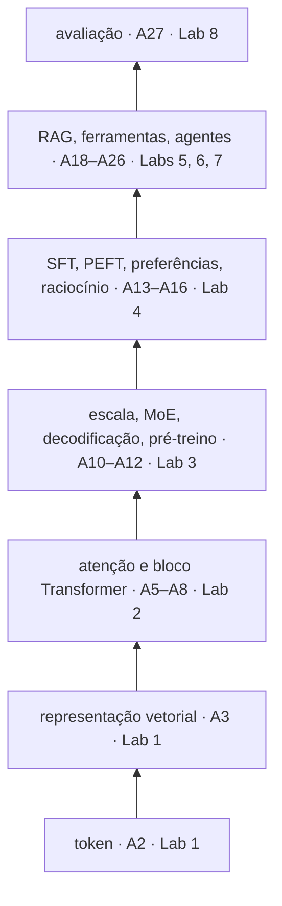
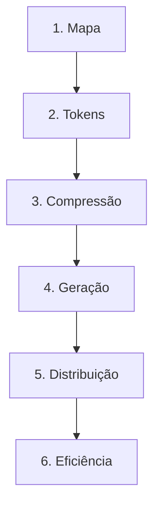
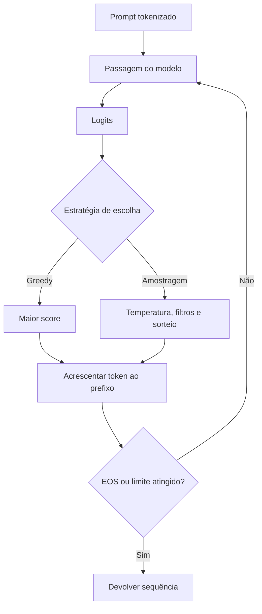
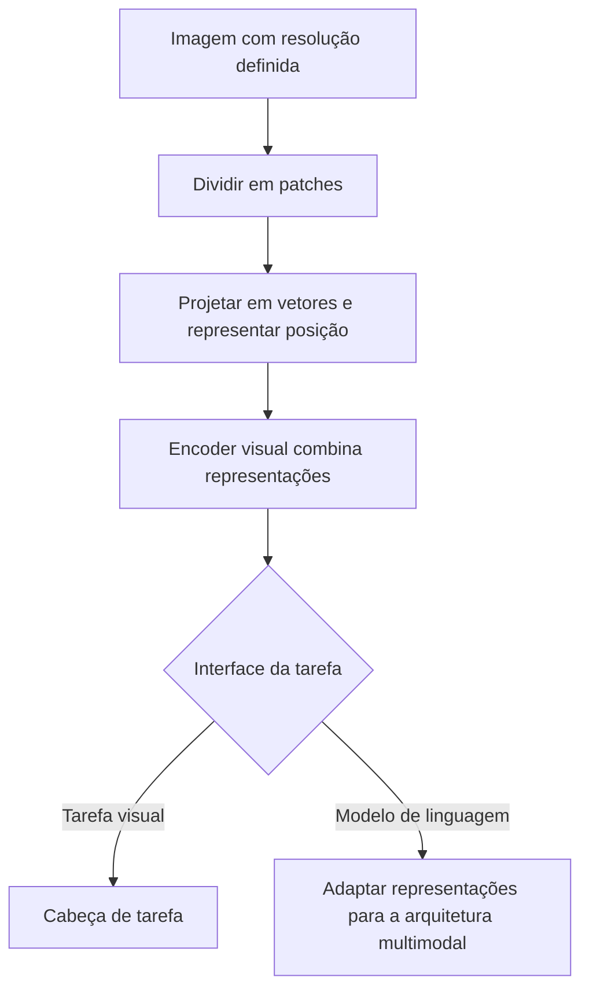

# Especificação de slides — Aula 29 (V2)

> **Rebalanceamento V2.** Esta aula já era conduzida pela aplicação na V1: abre pelo percurso da própria turma e seleciona cada fronteira pelo pressuposto do curso que ela ameaça. O transporte preservou o fluxo e os 15 slides. Duas coisas entraram. O **slide 2 ganhou uma segunda coluna** — o mapa de onde está o fundamento formal de cada camada —, porque esta é a última aula de conteúdo e é aqui que o aluno vê que os apêndices formam um corpo, não uma coleção de anexos. E entrou um **apêndice de três itens** com o formalismo que a aula mobiliza e que a V1 deixava implícito: a difusão mascarada, a recursão do colapso e a razão aritmética-por-byte que explica o gargalo de memória.

<!-- SLIDE-FLOW:GUIDE:BEGIN -->
## Fluxogramas na produção dos slides

As orientações abaixo complementam o campo **Visual** dos slides indicados. Produzir os fluxogramas no próprio deck, como formas e conectores editáveis ou gráficos vetoriais; a biblioteca completa ao final torna esta especificação independente do portal.

- **Referência de composição:** título e propósito no topo, blocos numerados, conexões rotuladas, ramificações legíveis e uma saída identificada. Usar apenas o padrão visual da referência fornecida, sem importar seu assunto ou seus exemplos.
- **Tema do deck:** manter o fundo escuro e a paleta já especificada para a aula. Usar `#5b8cff` para o trecho ativo, tons neutros para o contexto e `#e2231a` conforme o significado definido no deck. Cor sempre acompanhada de rótulo.
- **Leitura:** entrada no topo ou à esquerda; saída na base ou à direita. Decisões em losangos, alternativas com rótulos e retornos apontando à etapa correta. Ramos paralelos convergem apenas onde seus resultados realmente são combinados.
- **Densidade:** no fluxo principal, projetar 3–6 blocos curtos por enquadramento, com corpo legível na última fileira. Um mapa maior pode ser revelado por etapas no mesmo slide. Detalhes, condições e explicações completas ficam nas notas; não reduzir a fonte para caber tudo.
- **Semântica:** mapas de percurso mostram ordem de estudo, não execução de um algoritmo. Manter separadas preparação e aplicação, treino e inferência, sequência e alternativas. Não transformar uma etapa opcional em obrigatória.
- **Integração:** o fluxograma substitui uma lista redundante ou ocupa o campo Visual; não cobre matrizes, tabelas, gráficos nem código indispensáveis. Preservar títulos, numeração, duração e referências aos apêndices.
- **Produção:** os blocos Mermaid abaixo são especificações do desenho. Renderizar/reconstruir como diagrama, nunca projetar o código Mermaid. Manter rótulos, bifurcações, retornos e limites declarados. Não transformar este caderno técnico em slides adicionais.
- **Ligação com o portal:** os mapas de mecanismo compartilham o conteúdo dos fluxogramas do portal. Em demonstrações, usar o mesmo vocabulário no deck e no controle interativo para facilitar a passagem entre os dois.
<!-- SLIDE-FLOW:GUIDE:END -->

## Diretrizes visuais

- **Tema:** escuro, accent `#e2231a` (vermelho CESAR), accent secundário `#5b8cff`.
- **Tipografia:** sans-serif para texto; monoespaçada para código, métricas e nomes de arquivo.
- **Densidade:** máximo 5 linhas de texto por slide. Um conceito por slide.
- **Proibido:** bullets genéricos ("Vantagens", "Desvantagens"); slide-parede de texto; clipart; gráfico sem eixo rotulado; logotipo de empresa como argumento.
- **Convenção deste deck:** todo slide do Bloco 1 carrega o **endereço** (aula e lab) das peças que menciona. Todo slide do Bloco 2 carrega, num canto, **o pressuposto do curso que aquela fronteira ameaça**. É a regra de admissão do deck.
- **Apêndice:** densidade maior é permitida e esperada — é material de estudo, não de projeção.

## Arco narrativo

O deck tem duas metades deliberadamente opostas. A primeira reconstrói o curso como percurso com endereço — cada peça com a aula e o lab em que foi feita, e agora também com o item de apêndice que a sustenta — e culmina no pagamento explícito da dívida de avaliação anunciada na Aula 1. A segunda ataca os pressupostos dessa mesma pilha: o token não é sobre texto, patch não é compressão, geração não precisa ser da esquerda para a direita, dado sintético recursivo corrói a distribuição, e custo é dimensão de projeto. O fecho devolve à turma a frase da Aula 1, agora cumprida, e passa a palavra para a Aula 30.

---

# PARTE 1 — FLUXO DA AULA

*O que se apresenta em aula. 15 slides, ~110 minutos com demo e exercício.*

### Slide 1 — Abertura: a última aula de slide deste curso
- **Tipo:** título
- **Título:** Recapitulação e fronteiras da área
- **Frase-tese:** "Na primeira metade eu mostro o que vocês construíram. Na segunda, o que a área está fazendo para derrubar parte disso."
- **Conteúdo:**
  - Logística da Aula 30, primeiro: 12 min + perguntas, slot de 15 min, 7–8 equipes, ordem sorteada e publicada até `[definir na oferta]`
  - Demo ao vivo obrigatória, acompanhada dos números do Lab 8 com o sistema real ligado
  - Recap do Lab 8: conjunto rotulado · tabela por camada com `n` · kappa do juiz · fila de consertos
  - Duas metades: reconhecer o percurso, e atacar os pressupostos dele
- **Visual:** a grade da Aula 30 em miniatura à direita (slots de 15 min), e à esquerda os quatro artefatos que cada equipe já tem em mãos.
- **Notas do apresentador:** Logística nos três primeiros minutos; sem isso o Bloco 1 morre em perguntas de calendário.

### Slide 2 — O mapa do percurso: onde cada peça foi construída, e onde está o fundamento dela

<!-- SLIDE-FLOW:SLIDE:BEGIN -->
- **Fluxograma a incorporar neste slide:** **F00 — O percurso desta aula**. O desenho e os rótulos completos estão no caderno de fluxogramas ao final deste arquivo.
- **Composição:** integrar ao campo Visual; preservar exemplos, tabelas, fórmulas e dimensões solicitados neste slide. Destacar o trecho relacionado ao título e manter o restante em segundo plano. Os textos detalhados ficam nas notas, sem duplicar a lista de Conteúdo na tela.
<!-- SLIDE-FLOW:SLIDE:END -->

- **Tipo:** diagrama
- **Título:** O curso inteiro, com dois endereços
- **Conteúdo:** A pilha, e cada camada com **duas** coordenadas — onde ela foi construída, e onde está o fundamento formal que a sustenta:
  - token — Aula 2 · Lab 1 (Aula 4) · fundamento: BPE resolvido à mão, fertilidade formalizada
  - representação — Aula 3 · Lab 1 · fundamento: cosseno derivado, skip-gram com amostragem negativa
  - atenção e bloco — Aulas 5–8 · Lab 2 (Aula 9) · fundamento: `softmax(QKᵀ/√d_k)V` em quatro etapas, `Var(q·k) = d_k`, a ordem da máscara, equivariância por `PᵀP = I`
  - escala e inferência — Aula 10 · Lab 3 · fundamento: temperatura no softmax, truncamento e renormalização, o roteamento do MoE
  - pré-treino — Aula 12 · fundamento: `C ≈ 6ND` com o fator 6, Chinchilla com restrição, os quatro consumidores de memória
  - SFT/PEFT — Aula 13 · Lab 4 · fundamento: `ΔW = BA`, `B = 0`, a quantização NF4
  - preferências e raciocínio — Aulas 15–16 · fundamento: Bradley-Terry, PPO com clipping, o estimador de `pass@k`
  - RAG — Aulas 18–19 · Lab 5 · fundamento: BM25, as quatro métricas, RRF, o teto do reranking
  - ferramentas e agentes — Aula 21 · Labs 6 e 7 · Aulas 23–26 · fundamento: o custo acumulado do laço, a taxa de sucesso composta
  - avaliação — Aula 27 · Lab 8 (Aula 28) · fundamento: kappa de Cohen, inversão posicional, Wilson, McNemar
- **Frase-tese:** "Toda equipe tem uma camada que não foi construída em nenhum lab. Essa é a camada que eu vou perguntar na semana que vem."
- **Visual:** pilha vertical de sete camadas, de token no rodapé a avaliação no topo. Cada caixa com **duas** etiquetas: `Aula NN · Lab N` em accent, e o item de fundamento em accent secundário. À direita, o **exercício em dupla de 6 min** projetado como tabela de três colunas.
- **Notas do apresentador:** A recapitulação é conduzida pelo exercício, não pela exposição. A segunda coluna é nova e tem função própria: é a única vez no curso em que os apêndices aparecem juntos, e a turma percebe que eles formam um índice do fundamento — não uma coleção de anexos avulsos. Deixar 20 s em silêncio nessa coluna. Anotar a camada órfã de cada equipe: são as perguntas da Aula 30.



### Slide 3 — A tese do próximo-token, agora verificável

<!-- SLIDE-FLOW:SLIDE:BEGIN -->
- **Fluxograma a incorporar neste slide:** **F01 — Geração autorregressiva**. O desenho e os rótulos completos estão no caderno de fluxogramas ao final deste arquivo.
- **Composição:** integrar ao campo Visual; preservar exemplos, tabelas, fórmulas e dimensões solicitados neste slide. Destacar o trecho relacionado ao título e manter o restante em segundo plano. Os textos detalhados ficam nas notas, sem duplicar a lista de Conteúdo na tela.
<!-- SLIDE-FLOW:SLIDE:END -->

- **Tipo:** conceito
- **Título:** Na Aula 1 era crédito. Agora é verificável em três níveis.
- **Conteúdo:**
  - **Mecanismo** — o decoder com máscara causal produz, por construção, uma distribuição sobre o próximo token. A tarefa não é escolhida; é a arquitetura (Aula 6)
  - **Interface** — classificação, rotulagem e geração viram instâncias do mesmo objeto, porque a saída é texto e a especificação entra no prompt (Aula 10, Lab 3)
  - **Utilidade** — o que transformou o completador em assistente foi SFT e alinhamento, não arquitetura (Aulas 13 e 15)
- **Frase-tese:** "A unificação moveu a dificuldade. Ela não a eliminou — e o próximo slide cobra a conta."
- **Visual:** três blocos empilhados, cada um com a aula que o sustenta.
- **Notas do apresentador:** O erro conceitual comum é concluir "tudo é geração, então tudo é fácil". Nomear e seguir.

### Slide 4 — A dívida da Aula 1, e a fatura paga
- **Tipo:** comparação
- **Título:** Unificamos o modelo. Não unificamos as métricas.
- **Conteúdo:** A dívida, enunciada como na Aula 1: BLEU e ROUGE pressupõem referência aproximadamente única; perplexidade só compara entre tokenizadores iguais; acurácia mente em dados desbalanceados. E os dois pagamentos:
  - **Aula 27, conceitual** — "esse modelo é bom?" virou "qual a menor camada que explica esta falha, e com que número eu a meço?"; rubrica com níveis observáveis; kappa no lugar do acordo bruto; os três vieses do juiz nomeados; factualidade por afirmações atômicas
  - **Aula 28, operacional** — cada equipe construiu o harness do próprio sistema, com métrica por camada, `n` declarado, juiz calibrado e falhas priorizadas
- **Frase-tese:** "A Aula 1 prometeu que o custo da unificação tinha sido transferido para a avaliação. As Aulas 27 e 28 são a fatura paga — e o comprovante é a tabela que cada equipe leva para a Aula 30."
- **Visual:** duas colunas, "dívida" e "pagamento", com uma seta grossa entre elas e a data das aulas em cada lado.
- **Notas do apresentador:** O erro conceitual comum é achar que a dívida foi paga porque existe uma métrica melhor. Não existe: existem **decomposição em camadas** e **procedência declarada do número**. É o método que quita, não uma fórmula.

### Slide 5 — O que este curso deliberadamente não cobriu
- **Tipo:** conceito
- **Título:** Honestidade de escopo, porque ela orienta o estudo seguinte
- **Conteúdo:** pré-treino de verdade em escala (o Lab 2 é um mini-GPT em corpus de brinquedo); RLHF completo com modelo de recompensa treinado (as Aulas 15 e 16 param na formulação e no DPO); serving em produção com batching contínuo e autoescala; multimodalidade de fato (é fronteira desta aula, não conteúdo praticado); segurança adversarial ofensiva além do que a Aula 26 introduziu; e avaliação com significância estatística — o curso exigiu `n` declarado, e o intervalo de confiança ficou no apêndice do Lab 8, não na prática.
- **Frase-tese:** "Confundir 'vimos' com 'sei fazer em produção' é a distância exata desta lista."
- **Visual:** lista com um traço à esquerda de cada item e, ao lado, onde o assunto é retomado (leitura, pós-graduação, prática profissional).
- **Notas do apresentador:** Este slide vale mais no fim do semestre do que qualquer resumo. Não amenizar.

### Slide 6 — O token não é sobre texto: ViT e o patch de 16×16

<!-- SLIDE-FLOW:SLIDE:BEGIN -->
- **Fluxograma a incorporar neste slide:** **F02 — Uma imagem como sequência de representações**. O desenho e os rótulos completos estão no caderno de fluxogramas ao final deste arquivo.
- **Composição:** integrar ao campo Visual; preservar exemplos, tabelas, fórmulas e dimensões solicitados neste slide. Destacar o trecho relacionado ao título e manter o restante em segundo plano. Os textos detalhados ficam nas notas, sem duplicar a lista de Conteúdo na tela.
<!-- SLIDE-FLOW:SLIDE:END -->

- **Tipo:** conceito · *pressuposto ameaçado: o objeto central do curso é texto*
- **Título:** Nada na arquitetura sabe que é imagem
- **Conteúdo:** O ViT corta a imagem em patches de 16×16, projeta cada patch linearmente num vetor de dimensão `d`, soma embedding de posição e joga a sequência num Transformer encoder comum. O que isso revela: o objeto central nunca foi *texto* — foi **sequência de vetores com posição**. O tokenizer da Aula 2 é um caso de discretização; o patch é outro; frames de espectrograma são outro.
- **Frase-tese:** "O Transformer é um processador de sequências que não pergunta de onde a sequência veio."
- **Visual:** a mesma pilha de blocos da Aula 7, com dois drivers de entrada diferentes encaixando embaixo: tokenizer e patchificador.
- **Notas do apresentador:** O erro comum é achar que "multimodal" é arquitetura nova. Na maioria dos sistemas é **um encoder por modalidade projetando no mesmo espaço**, com o decoder inalterado. A novidade está no alinhamento entre espaços e nos dados pareados. Tudo o que a turma sabe de atenção, posição e KV cache continua valendo — o que muda é o custo da entrada, e é o que o slide 7 mede.

### Slide 7 — [Demo] A conta: 375 tokens de texto contra 3.430 patches

<!-- SLIDE-FLOW:SLIDE:BEGIN -->
- **Fluxograma a incorporar neste slide:** **F02 — Uma imagem como sequência de representações**. O desenho e os rótulos completos estão no caderno de fluxogramas ao final deste arquivo.
- **Composição:** integrar ao campo Visual; preservar exemplos, tabelas, fórmulas e dimensões solicitados neste slide. Destacar o trecho relacionado ao título e manter o restante em segundo plano. Os textos detalhados ficam nas notas, sem duplicar a lista de Conteúdo na tela.
<!-- SLIDE-FLOW:SLIDE:END -->

- **Tipo:** demonstração · *pressuposto ameaçado: mais unidades de sequência = mais informação*
- **Título:** Fatiar em patches não comprime nada
- **Conteúdo:** Os quatro números que a demo produz, sem resultado no slide — eles aparecem ao vivo:
  ```
  1. página de texto embutida (1.466 caracteres)  →  tokens de texto
  2. A4 a 96 DPI = 793×1122 px, patch 16×16       →  ⌊793/16⌋ × ⌊1122/16⌋ patches
  3. mesma conta variando DPI e patch             →  função da resolução, não do conteúdo
  4. encoder que comprime a grade em 16×          →  tokens visuais, e a razão finalmente inverte
  ```
- **Frase-tese:** "A compressão é do codec, não do corte. Ninguém comprime vídeo cortando quadros em quadradinhos."
- **Visual:** slide quase vazio, quatro caixas numeradas em monoespaçada esperando ser preenchidas ao vivo.
- **Notas do apresentador:** Passos na Parte 2 do roteiro. O script é determinístico e offline; a saída salva na véspera é plano B integral. Os três números — 375, 3.430, 214 — cabem no quadro se nada funcionar.

### Slide 8 — Comprimir contexto em pixels: DeepSeek-OCR

<!-- SLIDE-FLOW:SLIDE:BEGIN -->
- **Fluxograma a incorporar neste slide:** **F02 — Uma imagem como sequência de representações**. O desenho e os rótulos completos estão no caderno de fluxogramas ao final deste arquivo.
- **Composição:** integrar ao campo Visual; preservar exemplos, tabelas, fórmulas e dimensões solicitados neste slide. Destacar o trecho relacionado ao título e manter o restante em segundo plano. Os textos detalhados ficam nas notas, sem duplicar a lista de Conteúdo na tela.
<!-- SLIDE-FLOW:SLIDE:END -->

- **Tipo:** dados · *pressuposto ameaçado: contexto longo se resolve com RAG ou com janela maior*
- **Título:** O par (compressão, fidelidade) — nunca a compressão sozinha
- **Conteúdo:** A ideia inverte o uso habitual da visão: em vez de descrever imagens, usar a imagem como **formato de compressão de texto longo**. Renderiza-se o documento como página, um encoder visual produz poucos tokens visuais, e o decoder reconstrói o texto. O artigo reporta reconstrução em torno de 97% na faixa de ~10 tokens de texto por token visual, degradando para a faixa de 60% perto de 20×.
- **Frase-tese:** "Fidelidade de reconstrução é recall de conteúdo com outro nome — e o instrumento que mede é o do Lab 8."
- **Visual:** curva com os dois eixos rotulados: compressão no eixo x, precisão de decodificação no y, com os dois patamares marcados.
- **Notas do apresentador:** O erro comum é ler "10 tokens de texto por token visual" como se a imagem fosse intrinsecamente mais densa. A densidade é do encoder treinado, e ela é **lossy**. Isto é alternativa de engenharia ao RAG das Aulas 18–20 para documentos longos e estáveis, com o mesmo tipo de trade-off que a turma já sabe medir.

### Slide 9 — Difusão para linguagem: o pressuposto que atravessou 28 aulas
- **Tipo:** conceito · *pressuposto ameaçado: geração é da esquerda para a direita*
- **Título:** Não há máscara causal. Não há "próximo" token.
- **Conteúdo:** LLaDA treina um modelo de difusão mascarada: o processo direto mascara tokens progressivamente e o modelo aprende a **prever os mascarados**; a geração é iterativa e desmascara posições em qualquer ordem, refinando a sequência inteira a cada passo. O que isso ataca, item por item:
  - **KV cache** perde o sentido — não existe prefixo fixo cujo estado se reaproveita
  - **decodificação** deixa de ser amostragem por posição e passa a ser política de quantas e quais posições desmascarar por passo
  - **latência** deixa de ser linear no número de tokens e passa a ser função dos passos de refinamento
  - **maldição da reversão** — sabe "A é B" e falha em "B é A" — é atacada na raiz, porque o treino não privilegia direção
- **Frase-tese:** "Um pressuposto que atravessa 28 aulas sem ser nomeado é um pressuposto, não uma lei."
- **Visual:** duas linhas do tempo de geração lado a lado. Acima, autorregressiva: uma posição por passo, da esquerda para a direita. Abaixo, difusão: a sequência inteira com lacunas fechando em ordem arbitrária a cada passo.
- **Fundamento:** o processo direto de mascaramento e o objetivo de desruído que o modelo otimiza — e por que a ausência de máscara causal é consequência do objetivo, não escolha de implementação.
  → derivação completa: **Apêndice A.1** (slide 16)
- **Notas do apresentador:** O erro comum é concluir "então o autorregressivo está superado". O artigo mostra **viabilidade competitiva em escala de 8B**, não substituição — e o ecossistema inteiro de inferência eficiente foi construído para o outro paradigma. A lição metodológica é mais durável que o resultado.

### Slide 10 — Dados sintéticos e colapso de modelo
- **Tipo:** conceito · *pressuposto ameaçado: mais dados sempre ajuda*
- **Título:** Fotocópia de fotocópia: primeiro somem as caudas
- **Conteúdo:** Dado sintético é insumo padrão hoje — instruções para SFT, pares de preferência, casos de teste. O custo aparece quando isso é **recursivo**: treinar a geração `n+1` predominantemente na saída da geração `n` corrói a distribuição. Três fontes de erro somadas: aproximação estatística (amostra finita perde eventos raros), expressividade (o modelo não representa a cauda) e otimização. O efeito é cumulativo: primeiro desaparecem as **caudas**, depois a distribuição converge para algo estreito e distante da original.
- **Frase-tese:** "O resultado não é 'sintético é ruim'. É sobre realimentação recursiva sem âncora humana."
- **Visual:** quatro distribuições em sequência, gerações 1 a 4, com a cauda encolhendo visivelmente e a variância fechando. Eixos rotulados.
- **Fundamento:** a recursão que produz o colapso, e por que a fonte de erro por amostragem finita **não** desaparece nem com modelo perfeitamente expressivo.
  → derivação completa: **Apêndice A.2** (slide 17)
- **Notas do apresentador:** Se a equipe perguntar se pode gerar casos de teste com LLM, a resposta é sim: caso de teste gerado e **revisado pela equipe** é legítimo, porque o rótulo é humano — e é justamente o que o Lab 8 exige. Sintético **verificado por oráculo** (código que passa em teste, matemática conferida) não é a mesma operação que sintético **plausível**.

### Slide 11 — A fronteira do custo: pequeno, roteado, medido
- **Tipo:** dados · *pressuposto ameaçado: maior é melhor*
- **Título:** Custo é dimensão de projeto, não fatura herdada
- **Conteúdo:** Três movimentos concretos: **modelos pequenos** (1–8B com bom SFT resolvem a maior parte das tarefas de produto — foi o que a turma usou nos labs, por escolha didática que também é de engenharia); **roteamento** (um classificador barato decide, por requisição, entre modelo local, API ou cascata com verificação — e a métrica é acerto por real gasto); **esparsidade** (MoE ativa uma fração dos parâmetros por token). A consequência metodológica: eficiência entra na tabela do Lab 8 como qualquer outra métrica — custo por caso, latência p95, tokens por resposta, ao lado de `recall@k` e da nota do juiz.
- **Frase-tese:** "Sistema que acerta mais e custa dez vezes mais é decisão de produto. Sem as duas colunas na tabela, ela não é tomada — é sofrida."
- **Visual:** tabela do Lab 8 com duas colunas novas destacadas em accent: custo por caso e latência p95.
- **Notas do apresentador:** O erro comum é tratar custo como restrição externa que o engenheiro herda. Custo muda a arquitetura, não só a fatura.

### Slide 12 — Hardware: a atenção é limitada por memória
- **Tipo:** conceito · *pressuposto ameaçado: desempenho se compara por FLOPs de pico*
- **Título:** O acelerador passa a maior parte do tempo esperando memória
- **Conteúdo:** Na decodificação, cada token novo precisa ler o KV cache inteiro para produzir **uma** posição. A razão entre operações aritméticas e bytes lidos é baixíssima. É a explicação de fundo de três coisas que o curso já usou: **FlashAttention** ganha por reduzir tráfego entre HBM e SRAM, não FLOPs; **GQA e MQA** ganham por encolher o objeto que é lido; **batching** ganha por amortizar a leitura dos pesos entre requisições. O pano de fundo é o *memory wall*: capacidade de cálculo e banda de memória cresceram em ritmos muito diferentes, e a segunda virou o gargalo. Números de banda e custo por token são específicos de fornecedor e de data: `[definir na oferta]`.
- **Frase-tese:** "Para inferência autorregressiva, banda de memória prediz desempenho melhor que TFLOPs de pico."
- **Visual:** duas barras com eixos rotulados: crescimento de FLOPs e crescimento de banda de memória ao longo de uma década, com a distância entre elas rotulada "memory wall".
- **Fundamento:** a razão aritmética-por-byte da decodificação, e por que ela cai com o tamanho do cache — o que torna o regime limitado por banda, não por cálculo.
  → derivação completa: **Apêndice A.3** (slide 18)
- **Notas do apresentador:** Amarrar explicitamente ao slide 9: difusão mascarada tem perfil de acesso a memória diferente, e é isso que a torna interessante do ponto de vista de sistemas — não só de modelagem.

### Slide 13 — Pesquisa, engenharia de IA, e o meio
- **Tipo:** comparação
- **Título:** Distinguir por artefato e critério de sucesso, não por prestígio
- **Conteúdo:**
  - **Pesquisa** — produz conhecimento novo verificável; artefato: paper com código; critério: revisão por pares e reprodutibilidade. Preparação: reimplementar do zero, ler com caneta, iniciação científica
  - **Engenharia de IA** — produz sistemas que funcionam em produção; artefato: serviço com SLO; critério: usuário atendido a custo sustentável. É o que esta disciplina treinou
  - **Research engineering** — o meio: infraestrutura de treino, avaliação em escala, otimização de kernels. Maior alavancagem para quem gosta de sistemas e pesquisa em doses iguais
- **Frase-tese:** "O diferencial no mercado não é saber chamar API. É saber provar com número que o sistema funciona — que é a única coisa que o Lab 8 fez."
- **Visual:** três colunas, uma por caminho, com as linhas artefato / critério / rotina diária.
- **Notas do apresentador:** O erro comum é escolher pela remuneração inicial. Os três divergem em **rotina diária** — quanto do dia é leitura, quanto é depuração, quanto é conversa com usuário — e é essa variável que decide se a pessoa fica. Números de mercado são `[definir na oferta]`: trazer dados da praça, não estimativa.

### Slide 14 — O que estudar em seguida, na ordem
- **Tipo:** conceito
- **Título:** Fundamentos primeiro, fronteira depois — e um paper por semana
- **Conteúdo:** Jurafsky & Martin (capítulos de Transformers e LLMs) e Raschka para o lado do modelo; Huyen para o lado do sistema; depois **um** paper por semana lido a fundo, com reimplementação de um componente. E a nota de meia-vida: agentes e fronteiras revisam-se a cada oferta; fundamentos de atenção e otimização, não.
- **Frase-tese:** "O exercício que mais separa 'acompanhei o curso' de 'sei construir' é reimplementar um componente do Lab 2 sem olhar o notebook."
- **Visual:** trilha em três degraus, com os apêndices deste curso marcados como o degrau zero — o material que já está na mão da turma.
- **Notas do apresentador:** Apontar que os apêndices dos 30 decks já são um corpo de fundamento consultável, e que ele não expira junto com a fronteira.

### Slide 15 — O arco fechado, e a ponte para a Aula 30
- **Tipo:** encerramento
- **Título:** A dívida da Aula 1, quitada — e a palavra passa para vocês
- **Conteúdo:** A frase da Aula 1 devolvida, agora cumprida. A logística da Aula 30 repetida (ordem, 12 min + perguntas, demo ao vivo obrigatória com os números do Lab 8). E o fechamento do arco do fundamento: **os apêndices dos 30 decks formam o índice do formalismo do curso**, e é ele que sustenta os 40 pontos de justificativa da prova e a defesa oral da semana que vem.
- **Frase-tese:** "Na semana que vem quem fala são vocês — e a pergunta que eu faço sai da camada que a equipe não conseguiu endereçar a nenhuma aula."
- **Visual:** duas metades. Topo: a pilha do slide 2 completa, com a coluna de fundamento acesa. Base: a grade da Aula 30 com os slots, e o checklist do que levar (sistema ligado, tabela do Lab 8, slide de arquitetura com o inventário).
- **Notas do apresentador:** Repetir a logística é deliberado — foi anunciada no slide 1 e volta aqui, porque é o que a turma leva. Projetar o índice do apêndice por 20 s: é a última vez no curso, e é o que fica para o estudo da prova final e para a vida profissional.

---

# PARTE 2 — APÊNDICE MATEMÁTICO

> Material de estudo e consulta. Não é projetado em aula; é distribuído com o deck.
> Autossuficiente: quem estuda por aqui não precisa ter assistido à aula.
>
> Três itens. É um apêndice pequeno, e isso é o resultado correto: esta é uma aula de síntese e de panorama, e o formalismo que ela mobiliza é o dos apêndices anteriores. O que está aqui é o que **nasce** nesta aula.

### Slide 16 — A.1 · Difusão mascarada para linguagem: o processo direto e o objetivo de desruído

- **Notação.** `x = (x_1, …, x_n)` é a sequência de tokens sobre o vocabulário `V`. `t ∈ [0,1]` é o nível de ruído. `M` é um token especial de máscara, `M ∉ V`. `x_t` é a sequência corrompida no nível `t`. `p_θ` é o modelo, com parâmetros `θ`.

- **Premissas.** O mascaramento é **independente por posição** (cada token é mascarado ou não, sem correlação com os vizinhos). O nível `t` é sorteado uniformemente em `[0,1]` durante o treino. A ausência dessas duas premissas muda o objetivo, e a segunda é o que dá ao modelo a capacidade de operar em qualquer nível de corrupção na geração.

- **O processo direto.** Dado `t`, cada posição é substituída por `M` com probabilidade `t`, independentemente:
  ```
  q(x_t | x, t) = Π_{i=1..n} [ t·δ(x_t,i = M) + (1−t)·δ(x_t,i = x_i) ]
  ```
  Em `t = 0` a sequência está intacta; em `t = 1` está inteiramente mascarada. Note que este processo **não tem direção**: não existe "antes" nem "depois" no mascaramento, e é daí que sai tudo o mais.

- **O objetivo de desruído.** O modelo é treinado a recuperar os tokens mascarados, condicionado em **todos** os não-mascarados:
  ```
  L(θ) = E_{t ~ U[0,1]} E_{x} E_{x_t ~ q(·|x,t)} [ (1/t) · Σ_{i : x_t,i = M} −log p_θ(x_i | x_t) ]
  ```
  Três observações sobre esta expressão, na ordem em que importam.

  **Primeira, o condicionante.** A predição de `x_i` usa `x_t`, que contém as posições **à esquerda e à direita** de `i`. Não há máscara causal, e não porque alguém decidiu removê-la: com este objetivo, esconder o lado direito seria jogar fora sinal disponível de graça. A ausência de causalidade é **consequência do objetivo**, não escolha de implementação.

  **Segunda, o fator `1/t`.** Ele normaliza pelo número esperado de posições mascaradas, que é `t·n`. Sem ele, níveis de ruído altos dominariam a perda por terem mais termos na soma, e o modelo aprenderia mal os regimes de pouco ruído — que são exatamente os últimos passos da geração, onde a qualidade se decide.

  **Terceira, a relação com o MLM.** O objetivo é uma generalização do MLM da Aula 8 com **taxa de mascaramento variável** em vez de fixa em 15%. E é essa variação que faz a diferença: o MLM em taxa fixa nunca vê a sequência quase toda mascarada, então não aprende a construir texto do zero. Aqui `t` percorre `[0,1]`, e o regime `t → 1` é geração a partir de nada.

- **Leitura.** O modelo aprende uma família de desruidores indexada pelo nível de corrupção. A geração é a aplicação iterada dessa família de `t = 1` para `t = 0`: começa tudo mascarado, e a cada passo desmascara um subconjunto de posições, escolhido por alguma política — as de maior confiança, ou aleatórias, ou uma fração fixa. **É aqui que a "decodificação" da Aula 10 reaparece transformada:** o que se escolhe não é qual token amostrar numa posição, e sim **quais posições fechar neste passo**. Temperatura e `top-p` continuam existindo dentro de cada posição; o que é novo é a política de agenda.

- **Casos-limite.**
  - **Uma posição por passo, da esquerda para a direita.** Recupera exatamente a geração autorregressiva. O paradigma autorregressivo é um caso particular da política de agenda — o que explica por que a comparação entre os dois é sobre eficiência e qualidade, não sobre capacidade.
  - **Todas as posições num passo.** Cada token é amostrado independentemente dos outros mascarados, e a sequência sai incoerente. É o motivo de o número de passos de refinamento ser o parâmetro de qualidade central: ele controla quanta dependência entre posições o modelo consegue expressar.
  - **`t → 0`.** Quase nada mascarado; a tarefa degenera em cópia, e o gradiente vai a zero. Daí a amostragem uniforme de `t`, que garante massa nos regimes informativos.

- **Por que o KV cache não se aplica.** No autorregressivo, o cache existe porque o prefixo é **imutável**: K e V das posições anteriores não mudam quando um token novo entra (Aula 8, A.2). Aqui, cada passo de refinamento pode alterar **qualquer** posição, então nenhum K ou V é estável entre passos. Não é que o cache seja ineficiente — é que a premissa que o justifica desaparece. O que se pode reaproveitar são as posições já congeladas, e isso depende da política de agenda.

- **Referência.** Nie et al., *Large Language Diffusion Models* (arXiv 2502.09992). Para o contraste com o MLM em taxa fixa: Devlin et al., *BERT* (arXiv 1810.04805).

- **De volta ao fluxo:** slide 9.

### Slide 17 — A.2 · Colapso de modelo: a recursão, e o erro que não desaparece

- **Notação.** `p_0` é a distribuição de dados humanos. `p_k` é a distribuição do modelo treinado na geração `k`. `n` é o número de amostras usadas para treinar cada geração. `θ_k` são os parâmetros da geração `k`.

- **Premissas.** Cada geração é treinada **predominantemente** nas amostras da geração anterior, sem reinjeção de dados humanos. As amostras são finitas (`n < ∞`). O modelo é ajustado por máxima verossimilhança. A terceira premissa é a menos importante; as duas primeiras são o que produz o efeito.

- **A recursão.** O processo é:
  ```
  p_0  →  amostra S_1 ~ p_0, |S_1| = n  →  θ_1 = argmax_θ Σ_{x ∈ S_1} log p_θ(x)  →  p_1
  p_1  →  amostra S_2 ~ p_1, |S_2| = n  →  θ_2                                    →  p_2
  ...
  ```
  Cada passo tem duas perdas de informação empilhadas: a amostragem finita e o ajuste.

- **As três fontes de erro, e qual delas é irredutível.**

  **1. Erro estatístico de amostragem finita.** Uma amostra de tamanho `n` não contém eventos de probabilidade muito menor que `1/n`. Formalmente, um evento de probabilidade `q` tem probabilidade `(1−q)^n ≈ e^{−nq}` de **não aparecer** na amostra; para `q ≪ 1/n`, isso é essencialmente 1. Então a cauda abaixo de `1/n` é sistematicamente ausente de `S_1`, e `p_1` atribui a ela massa próxima de zero. Na geração seguinte, o corte se move para a cauda de `p_1`, e o processo se repete.

  **Esta é a fonte que não desaparece**, e vale ser preciso sobre por quê. Ela não é defeito de expressividade: um modelo com capacidade infinita e otimização perfeita ajustaria `p_1` à amostra `S_1`, e `S_1` **já não tem** os eventos raros. Ela também não desaparece com `n` maior: aumentar `n` move o limiar de `1/n` para baixo, mas mantém a existência de um limiar — e a recursão o reaplica a cada geração. Só a **reinjeção de dados de `p_0`** interrompe o mecanismo, porque só ela devolve massa à cauda perdida.

  **2. Erro de expressividade.** Se a família de modelos não contém `p_0`, existe um viés que persiste mesmo com `n → ∞`. Ele contribui, mas é redutível: modelo maior, família mais rica.

  **3. Erro de otimização.** O ajuste não encontra o ótimo global. Redutível com melhor otimizador ou mais compute.

- **Por que a variância encolhe — o caso gaussiano, resolvido.** Tome `p_0 = N(μ, σ²)` e ajuste por máxima verossimilhança a cada geração. O estimador de variância a partir de `n` amostras é `σ̂² = (1/n)Σ(x_i − x̄)²`, cuja esperança é `σ²·(n−1)/n`. Iterando:
  ```
  E[σ_k²] = σ_0² · ((n−1)/n)^k
  ```
  A variância decai **geometricamente** em `k`, com razão `(n−1)/n`. Com `n = 1000`, cada geração perde 0,1% da variância; em 1000 gerações resta `e^{−1} ≈ 37%`. E este é o caso **mais favorável possível**: família correta, otimização exata, dado limpo. O único mecanismo em ação é a amostragem finita — e ele basta.

- **Leitura.** O colapso tem duas fases. No **colapso inicial**, as caudas desaparecem: a variância encolhe, o raro vira improvável, e a distribuição continua parecida no centro — que é o que torna o problema difícil de detectar por métrica de qualidade média. No **colapso tardio**, a distribuição converge para algo estreito e distante de `p_0`. A implicação operacional é que **média não detecta o colapso inicial**: é preciso medir cobertura da cauda, e é a mesma lição do Lab 8 em outro tamanho.

- **Casos-limite.**
  - **`n → ∞` com família correta.** A fonte 1 desaparece no limite, e o colapso não ocorre. Mas o limite é o ponto: nenhum treino real amostra infinitamente.
  - **Sintético verificado por oráculo.** Código que passa em teste, matemática com resposta conferida, extração validada contra a fonte. Aqui o filtro reintroduz sinal externo, e o mecanismo da fonte 1 é quebrado — não porque o dado é sintético ou humano, e sim porque a **verificação é uma âncora**. É a distinção que decide se o uso é seguro.
  - **Mistura com fração fixa de dado humano.** Manter uma proporção `α > 0` de `p_0` em cada geração impede o decaimento geométrico. É a recomendação prática que sai do resultado.

- **Referência.** Shumailov et al., *The Curse of Recursion: Training on Generated Data Makes Models Forget* (arXiv 2305.17493).

- **De volta ao fluxo:** slide 10.

### Slide 18 — A.3 · Por que a decodificação é limitada por banda de memória

<!-- SLIDE-FLOW:SLIDE:BEGIN -->
- **Fluxograma a incorporar neste slide:** **F01 — Geração autorregressiva**. O desenho e os rótulos completos estão no caderno de fluxogramas ao final deste arquivo.
- **Composição:** integrar ao campo Visual; preservar exemplos, tabelas, fórmulas e dimensões solicitados neste slide. Destacar o trecho relacionado ao título e manter o restante em segundo plano. Os textos detalhados ficam nas notas, sem duplicar a lista de Conteúdo na tela.
<!-- SLIDE-FLOW:SLIDE:END -->

- **Notação.** `L` camadas, `H_kv` cabeças de key-value, `d_head` dimensão da cabeça, `b` bytes por número, `n` posições no contexto, `N` parâmetros do modelo. `I` é a intensidade aritmética: operações de ponto flutuante por byte lido da memória.

- **Premissas.** Decodificação autorregressiva, um token por passo, lote de tamanho 1. Pesos e cache residem na memória de alta banda (HBM) e precisam ser lidos para a memória rápida (SRAM) a cada passo. É o regime de serviço de conversa individual; o batching muda a conta e está no caso-limite.

- **O que se lê por token gerado.** Duas coisas, e as duas inteiras:
  ```
  bytes de pesos  = N · b
  bytes de cache  = 2 · L · H_kv · d_head · n · b        (a fórmula de A.2 da Aula 8)
  bytes totais    = b · (N + 2·L·H_kv·d_head·n)
  ```
  O cache é lido **inteiro** porque a atenção da posição nova precisa de todas as chaves e valores anteriores.

- **O que se calcula por token gerado.** Aproximadamente `2N` operações — uma multiplicação e uma soma por parâmetro, no forward. Mais a atenção sobre `n` posições, que é da ordem de `4·L·H_kv·d_head·n`.

- **A intensidade aritmética.** Dividindo:
  ```
                2N + 4·L·H_kv·d_head·n
  I  =  ─────────────────────────────────────
          b · (N + 2·L·H_kv·d_head·n)
  ```
  Instanciando com `b = 2` (meia precisão) e olhando os dois regimes:
  ```
  contexto curto (cache ≪ pesos):   I ≈ 2N / (2N) = 1 operação por byte
  contexto longo (cache ≫ pesos):   I ≈ 4·(...)·n / (2·2·(...)·n) = 1 operação por byte
  ```
  **Nos dois regimes, `I` fica na ordem de 1.** Isso é o resultado, e ele é notavelmente robusto: qualquer que seja o tamanho do modelo ou do contexto, a decodificação executa cerca de uma operação por byte lido.

- **Leitura, e por que o número 1 é devastador.** Um acelerador moderno tem capacidade de cálculo da ordem de centenas de operações por byte de banda — a razão entre seus TFLOPs de pico e sua banda de HBM está tipicamente entre 100 e 500. Uma carga com `I ≈ 1` usa, portanto, **uma fração de um por cento** da capacidade aritmética: o acelerador passa essencialmente todo o tempo esperando memória. Daí a expressão "limitado por banda", e daí três consequências que o curso já usou sem derivar:
  - **FlashAttention** reduz o tráfego entre HBM e SRAM sem mudar a complexidade assintótica. Num regime limitado por banda, reduzir bytes lidos é reduzir tempo — e é por isso que ela acelera sem fazer menos contas.
  - **GQA e MQA** encolhem `H_kv`, que aparece no denominador de `I` como bytes de cache. O ganho de velocidade da geração não vem de calcular menos: vem de **ler menos**.
  - **Batching contínuo** é o único dos três que muda `I` de fato: com lote `B`, os pesos são lidos uma vez e usados `B` vezes, então o numerador cresce com `B` e o denominador quase não. É por isso que batching é a alavanca mais forte de throughput em serviço, e por que ela não ajuda em nada a latência de uma conversa isolada.

- **Casos-limite.**
  - **Prefill (processar o prompt inteiro de uma vez).** Aqui `n` tokens são processados num passo, o numerador cresce com `n` e a intensidade sobe para dezenas ou centenas. **O prefill é limitado por cálculo, a decodificação é limitada por banda** — é o mesmo modelo, com dois regimes opostos, e é por isso que as duas fases se otimizam de formas diferentes.
  - **Cache quantizado.** Reduzir `b` do cache de 2 para 1 byte corta os bytes lidos quase pela metade no regime de contexto longo. Não muda `I` (numerador e denominador escalam juntos), mas corta o tempo absoluto.
  - **Difusão mascarada.** Cada passo de refinamento processa **todas** as posições, não uma — o perfil se aproxima do prefill. É a razão de sistemas dizerem que ela tem melhor uso do acelerador, e é o gancho do slide 9 com este item.

- **Referências.** Dao et al., *FlashAttention* (arXiv 2205.14135) para o argumento de I/O; Ainslie et al., *GQA* (arXiv 2305.13245) e Shazeer, *MQA* (arXiv 1911.02150) para a redução do cache. Números de banda e de pico por acelerador: `[definir na oferta]`.

- **De volta ao fluxo:** slide 12.

<!-- SLIDE-FLOW:LIBRARY:BEGIN -->
# Caderno de fluxogramas para produção

As referências Fxx identificam desenhos, não novos números de slide. Cada desenho abaixo é autocontido.

| Mapa | Desenho | Usar nos slides |
| --- | --- | --- |
| F00 | O percurso desta aula | 2 |
| F01 | Geração autorregressiva | 3, 18 |
| F02 | Uma imagem como sequência de representações | 6, 7, 8 |

## F00 — O percurso desta aula

As setas indicam a ordem de estudo. Abra cada etapa para entender sua função.



**Conteúdo dos blocos e notas de montagem:**

1. **Mapa:** Relacione as peças construídas ao longo do curso.
2. **Tokens:** Compare representações de texto e imagem.
3. **Compressão:** Investigue o compromisso entre compressão e fidelidade.
4. **Geração:** Compare geração causal e revelação de posições.
5. **Distribuição:** Observe o efeito de dados sintéticos sobre a cauda.
6. **Eficiência:** Meça roteamento, tráfego de memória e qualidade final.

**Saída ou limite a explicitar:** Conecte as etapas: explique como uma decisão afeta o que você observa em seguida.

## F01 — Geração autorregressiva

Um passo escolhe um token; a sequência nasce da repetição controlada.



**Conteúdo dos blocos e notas de montagem:**

1. **Processar o contexto:** Tokenize o prompt e calcule representações; quando disponível, mantenha K e V em cache.
2. **Obter logits:** A projeção de saída produz um score para cada token do vocabulário.
3. **Escolher a estratégia:** A estratégia determina como os scores viram uma escolha.
   Ramos/alternativas a rotular: Greedy: maior score; Amostragem: temperatura e filtros.
4. **Acrescentar o token:** Anexe o token escolhido ao contexto e atualize o estado de geração.
5. **Verificar a parada:** O token de fim ou o limite de saída foi atingido?
   Ramos/alternativas a rotular: Sim → devolver sequência; Não → próximo passo do modelo.
   ↺ Sem parada, volte a obter os logits para a próxima posição.

**Saída ou limite a explicitar:** Saída: continuação gerada. Parâmetros de amostragem não atualizam os pesos.

## F02 — Uma imagem como sequência de representações

Este percurso ilustra o uso de patches em um encoder visual.



**Conteúdo dos blocos e notas de montagem:**

1. **Preparar a imagem:** Fixe resolução e pré-processamento usados pelo modelo.
2. **Dividir em patches:** Separe regiões de tamanho definido; a resolução influencia a quantidade.
3. **Projetar os patches:** Transforme cada região em um vetor e represente sua posição.
4. **Processar no encoder:** Atenção combina informações entre as representações visuais.
5. **Adaptar à tarefa:** Use uma cabeça de tarefa ou uma interface com o modelo de linguagem, conforme a arquitetura.

**Saída ou limite a explicitar:** Patches não equivalem diretamente a tokens de texto; compare custo e fidelidade na arquitetura escolhida.
<!-- SLIDE-FLOW:LIBRARY:END -->

