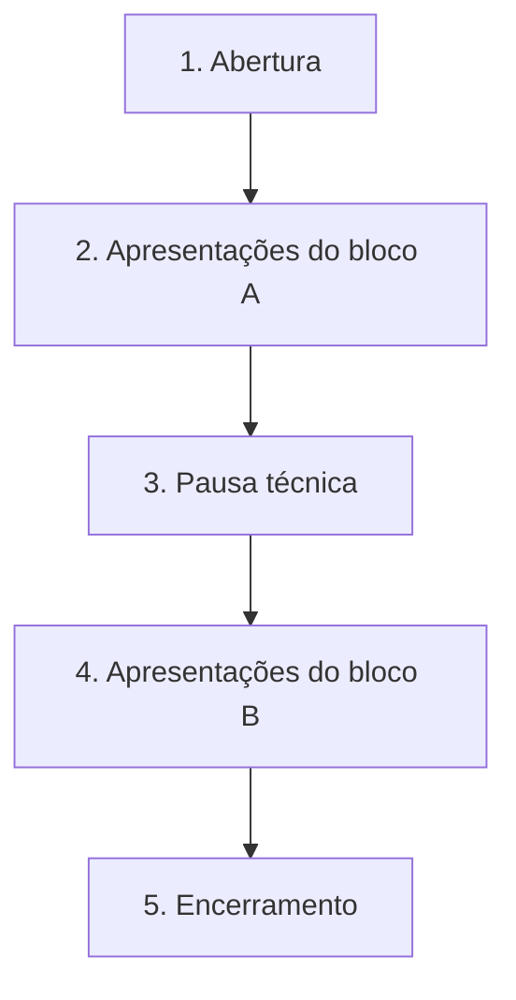
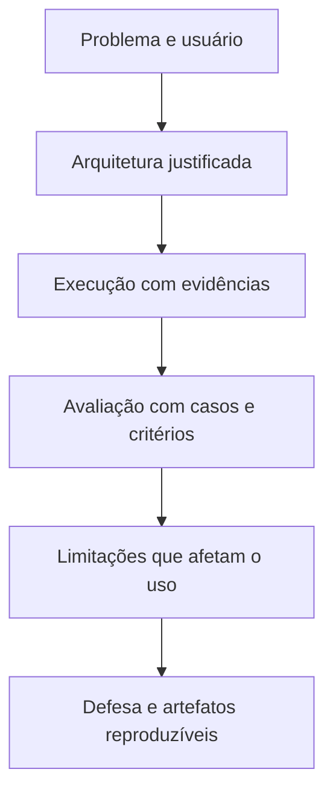

# Especificação de slides — Aula 30 (V2)

> **Rebalanceamento V2.** Nada a rebalancear: esta é a sessão de apresentações, e os seis slides existem para operar a sessão, não para expor conteúdo. O deck foi transportado integralmente. **Sem apêndice matemático** — a razão está declarada na Parte 2. O único ajuste é no slide 4, que agora diz à turma que a pergunta da defesa é do mesmo tipo das questões de justificativa da prova.

<!-- SLIDE-FLOW:GUIDE:BEGIN -->
## Fluxogramas na produção dos slides

As orientações abaixo complementam o campo **Visual** dos slides indicados. Produzir os fluxogramas no próprio deck, como formas e conectores editáveis ou gráficos vetoriais; a biblioteca completa ao final torna esta especificação independente do portal.

- **Referência de composição:** título e propósito no topo, blocos numerados, conexões rotuladas, ramificações legíveis e uma saída identificada. Usar apenas o padrão visual da referência fornecida, sem importar seu assunto ou seus exemplos.
- **Tema do deck:** manter o fundo escuro e a paleta já especificada para a aula. Usar `#5b8cff` para o trecho ativo, tons neutros para o contexto e `#e2231a` conforme o significado definido no deck. Cor sempre acompanhada de rótulo.
- **Leitura:** entrada no topo ou à esquerda; saída na base ou à direita. Decisões em losangos, alternativas com rótulos e retornos apontando à etapa correta. Ramos paralelos convergem apenas onde seus resultados realmente são combinados.
- **Densidade:** no fluxo principal, projetar 3–6 blocos curtos por enquadramento, com corpo legível na última fileira. Um mapa maior pode ser revelado por etapas no mesmo slide. Detalhes, condições e explicações completas ficam nas notas; não reduzir a fonte para caber tudo.
- **Semântica:** mapas de percurso mostram ordem de estudo, não execução de um algoritmo. Manter separadas preparação e aplicação, treino e inferência, sequência e alternativas. Não transformar uma etapa opcional em obrigatória.
- **Integração:** o fluxograma substitui uma lista redundante ou ocupa o campo Visual; não cobre matrizes, tabelas, gráficos nem código indispensáveis. Preservar títulos, numeração, duração e referências aos apêndices.
- **Produção:** os blocos Mermaid abaixo são especificações do desenho. Renderizar/reconstruir como diagrama, nunca projetar o código Mermaid. Manter rótulos, bifurcações, retornos e limites declarados. Não transformar este caderno técnico em slides adicionais.
- **Ligação com o portal:** os mapas de mecanismo compartilham o conteúdo dos fluxogramas do portal. Em demonstrações, usar o mesmo vocabulário no deck e no controle interativo para facilitar a passagem entre os dois.

**Aula de apresentações:** os mapas apoiam a operação da sessão e a defesa. Preservar a grade, os pesos e o relógio; não criar exposição de conteúdo durante as apresentações das equipes.
<!-- SLIDE-FLOW:GUIDE:END -->

## Diretrizes visuais

- **Tema:** escuro, accent `#e2231a` (vermelho CESAR), accent secundário `#5b8cff`.
- **Tipografia:** sans-serif; monoespaçada para a grade de horários e para nomes de arquivo.
- **Densidade:** este deck é **operacional**, não expositivo. Cada slide é uma referência projetada, legível da última fileira, e vários deles ficam na tela por longos períodos.
- **Proibido:** qualquer slide que exija leitura durante uma apresentação de equipe. O deck do instrutor não compete com o deck de quem está apresentando.
- **Regra própria deste deck:** o slide 2 (ordem e relógio) e o slide 3 (critérios) precisam ser legíveis **de longe e de lado**, porque as equipes vão consultá-los enquanto montam a máquina.

## Arco narrativo

O deck faz uma coisa só: sustentar 105 minutos em que o professor não é o protagonista. Abre estabelecendo as regras e a ordem — porque regra anunciada depois parece arbitrária —, projeta os critérios pelos quais cada equipe será medida, declara em voz alta que tipo de pergunta vai vir, e reserva o último slide para a única fala do dia que é do instrutor: o fechamento do arco aberto na Aula 1.

---

# PARTE 1 — FLUXO DA AULA

*Seis slides para 120 minutos. A maior parte do tempo, nenhum deles está na tela: quem projeta são as equipes.*

### Slide 1 — Abertura: hoje quem fala são vocês
- **Tipo:** título
- **Título:** Apresentações finais
- **Frase-tese:** "A entrega é o que está no repositório. A apresentação é a defesa dela."
- **Conteúdo:** As quatro regras, em quatro linhas, cada uma com a razão de existir em meia linha:
  - **12 minutos**, com sinal de 2 restantes em 10:00 — para que a nota não meça a ordem do sorteio
  - **Demo ao vivo, com um caso difícil** do próprio conjunto de teste — porque demo felizeada é indistinguível de demo falsa
  - **Números na tela**, não na narração — número narrado de cabeça não é verificável
  - **Perguntas de compreensão**, sobre o que a equipe construiu — não é prova, não é pegadinha
  E a garantia que muda o clima da sala: **falha ao vivo com a camada nomeada não penaliza.** Vale mais que sucesso não explicado.
- **Visual:** as quatro regras em tipografia grande, uma por linha. Nada mais no slide.
- **Notas do apresentador:** Cinco minutos, e a regra do corte em 12:00 tem de ser dita agora — corte anunciado na hora parece arbitrário e gera conflito. Dizer a garantia sobre falha ao vivo em voz alta e devagar: é o que faz as equipes escolherem um caso difícil de verdade em vez do caminho seguro.

### Slide 2 — A ordem e o relógio

<!-- SLIDE-FLOW:SLIDE:BEGIN -->
- **Fluxograma a incorporar neste slide:** **F00 — Operação das apresentações finais**. O desenho e os rótulos completos estão no caderno de fluxogramas ao final deste arquivo.
- **Composição:** integrar ao campo Visual; preservar exemplos, tabelas, fórmulas e dimensões solicitados neste slide. Destacar o trecho relacionado ao título e manter o restante em segundo plano. Os textos detalhados ficam nas notas, sem duplicar a lista de Conteúdo na tela.
- **Uso na sessão:** mostrar somente na abertura, nas perguntas ou nas trocas de equipe; o fluxograma do instrutor não permanece sobre a apresentação dos estudantes.
<!-- SLIDE-FLOW:SLIDE:END -->

- **Tipo:** dados (referência projetada)
- **Título:** A grade de hoje
- **Conteúdo:** A ordem sorteada e a grade completa, em monoespaçada, com os horários reais:
  ```
  00:00  abertura
  00:05  equipe 1     00:20  equipe 2     00:35  equipe 3     00:50  equipe 4
  01:05  PAUSA TÉCNICA (5 min — troca de máquina)
  01:10  equipe 5     01:25  equipe 6     01:40  equipe 7
  01:55  encerramento da disciplina
  ```
  Slot de 15 min = 12 de apresentação + 3 de perguntas e troca de máquina.
- **Frase-tese:** "Slot é slot. Quem começa atrasado apresenta em menos tempo, não empurra o próximo."
- **Visual:** a grade em monoespaçada grande, com a linha da equipe atual destacável (marcador que o instrutor move). Legível da última fileira e de lado.
- **Notas do apresentador:** Este slide fica projetado durante as trocas de máquina — é a referência que evita a pergunta "quando eu apresento?" sete vezes. Nomes de equipe e ordem: `[definir na oferta]`, sorteados e publicados antes da aula.

### Slide 3 — Os critérios, projetados

<!-- SLIDE-FLOW:SLIDE:BEGIN -->
- **Fluxograma a incorporar neste slide:** **F01 — Projeto: do problema à defesa**. O desenho e os rótulos completos estão no caderno de fluxogramas ao final deste arquivo.
- **Composição:** integrar ao campo Visual; preservar exemplos, tabelas, fórmulas e dimensões solicitados neste slide. Destacar o trecho relacionado ao título e manter o restante em segundo plano. Os textos detalhados ficam nas notas, sem duplicar a lista de Conteúdo na tela.
- **Uso na sessão:** mostrar somente na abertura, nas perguntas ou nas trocas de equipe; o fluxograma do instrutor não permanece sobre a apresentação dos estudantes.
<!-- SLIDE-FLOW:SLIDE:END -->

- **Tipo:** comparação (referência projetada)
- **Título:** Como cada equipe é medida
- **Conteúdo:** Os quatro itens com peso e o que é nível pleno em uma linha cada:
  - **Funcionamento e adequação técnica · 40%** — demo ao vivo com caso difícil, técnicas do curso integradas, arquitetura justificada com a alternativa descartada
  - **Rigor da avaliação quantitativa · 30%** — 20+ casos que discriminam, uma linha por camada com `n`, juiz declarado e calibrado com kappa, falhas atribuídas à menor camada
  - **Relatório técnico · 20%** — cinco seções, decisões com alternativa e critério, limitações específicas, README que reproduz, declaração de uso de IA
  - **Apresentação e demo · 10%** — fecha em 12 min, números na tela, mais de um integrante fala
  E a linha que vale ser dita em voz alta: **um sistema impecável na demo com avaliação por impressão perde 30% da nota.**
- **Frase-tese:** "O item de 30% não é sobre o sistema funcionar. É sobre vocês provarem que ele funciona."
- **Visual:** quatro barras horizontais proporcionais ao peso, com o descritor de nível pleno ao lado de cada. A barra de 30% em accent.
- **Notas do apresentador:** Fica projetado durante a pausa técnica. É a última chance de uma equipe perceber que precisa projetar a tabela do Lab 8 — e vale a pena que ela perceba.

### Slide 4 — O que eu vou perguntar

<!-- SLIDE-FLOW:SLIDE:BEGIN -->
- **Fluxograma a incorporar neste slide:** **F01 — Projeto: do problema à defesa**. O desenho e os rótulos completos estão no caderno de fluxogramas ao final deste arquivo.
- **Composição:** integrar ao campo Visual; preservar exemplos, tabelas, fórmulas e dimensões solicitados neste slide. Destacar o trecho relacionado ao título e manter o restante em segundo plano. Os textos detalhados ficam nas notas, sem duplicar a lista de Conteúdo na tela.
- **Uso na sessão:** mostrar somente na abertura, nas perguntas ou nas trocas de equipe; o fluxograma do instrutor não permanece sobre a apresentação dos estudantes.
<!-- SLIDE-FLOW:SLIDE:END -->

- **Tipo:** conceito
- **Título:** Duas perguntas por equipe, e elas têm uma forma só
- **Conteúdo:** A forma canônica, em destaque:
  ```
  "Por que essa camada existe no sistema,
   e que número prova que ela funciona?"
  ```
  De onde vem a pergunta: da **camada órfã** que a própria equipe nomeou no inventário da Aula 29 — a que não foi construída em nenhum lab.
  O que a pergunta **não** é: não é prova, não é fronteira, e não é sobre o que a equipe deixou de fazer.
  E o reconhecimento que vale dizer: **é a mesma forma das questões de justificativa da prova**, que valem 40 dos 100 pontos. Quem treinou para uma treinou para a outra.
- **Frase-tese:** "Não é uma pergunta nova. É a questão de 40 pontos da prova, aplicada ao sistema de vocês."
- **Visual:** a pergunta canônica em tipografia grande, centralizada. Abaixo, em menor, a origem (camada órfã da Aula 29) e a equivalência com a prova.
- **Notas do apresentador:** **Novo na V2.** Dizer a equivalência com a prova converte a defesa de uma ameaça vaga em algo que a turma já exercitou duas vezes — na revisão de 29/09 e na prova. Reduz o pânico e melhora a qualidade da resposta. Também é honesto: os dois instrumentos cobram a mesma competência, e esconder isso não beneficia ninguém.

### Slide 5 — [Transição] Pausa técnica e o Bloco B

<!-- SLIDE-FLOW:SLIDE:BEGIN -->
- **Fluxograma a incorporar neste slide:** **F00 — Operação das apresentações finais**. O desenho e os rótulos completos estão no caderno de fluxogramas ao final deste arquivo.
- **Composição:** integrar ao campo Visual; preservar exemplos, tabelas, fórmulas e dimensões solicitados neste slide. Destacar o trecho relacionado ao título e manter o restante em segundo plano. Os textos detalhados ficam nas notas, sem duplicar a lista de Conteúdo na tela.
- **Uso na sessão:** mostrar somente na abertura, nas perguntas ou nas trocas de equipe; o fluxograma do instrutor não permanece sobre a apresentação dos estudantes.
<!-- SLIDE-FLOW:SLIDE:END -->

- **Tipo:** transição
- **Título:** 5 minutos · troca de máquina
- **Conteúdo:** Cronômetro de 5 minutos. A ordem do Bloco B repetida (equipes 5, 6, 7 com horários). Um recado operacional: a máquina de contingência do instrutor está ligada, com Colab aberto, para quem precisar. E a única janela de logística individual da sessão.
- **Frase-tese:** —
- **Visual:** cronômetro grande, a ordem do Bloco B ao lado, e o slide 3 (critérios) numa faixa lateral estreita.
- **Notas do apresentador:** Esta pausa é a **folga do sistema**: se houver atraso acumulado, ela encolhe para 2 min. Se o atraso passar de 8 min, comprimir as perguntas para uma por equipe — e proteger o encerramento, que não tem substituto.

### Slide 6 — Encerramento da disciplina
- **Tipo:** encerramento
- **Título:** O arco fechado
- **Conteúdo:** Três observações transversais da sessão (preenchidas ao vivo, a partir das fichas — `[definir na sessão]`). O prazo e a forma da devolução individual: ficha do instrutor mais fichas de pares, em prazo `[definir na oferta]`. E o fechamento: a promessa da Aula 1 devolvida cumprida — o modelo foi unificado sob o próximo token, a conta veio na avaliação, e cada equipe pagou com uma tabela por camada. Mais o desafio pós-aula, que é o único do curso sem prazo: consertar o primeiro item da fila e deixar o repositório público.
- **Frase-tese:** "Vocês entraram sabendo usar um LLM. Saem sabendo provar que o sistema de vocês funciona — e essa é a parte que quase ninguém sabe fazer."
- **Visual:** o mapa do percurso da Aula 29 pela última vez, com as duas colunas acesas, e as três observações transversais escritas ao vivo num campo reservado.
- **Notas do apresentador:** Cinco minutos reservados e **não negociáveis**. É a única parte da sessão que não tem substituto: se atrasar, cortam-se as perguntas da última equipe, não o encerramento. As três observações transversais saem das fichas preenchidas ao vivo — mais um motivo para a Regra 5.

---

# PARTE 2 — APÊNDICE MATEMÁTICO

> **Sem apêndice.** Esta é a sessão de apresentações: ela não expõe conteúdo e não contém uma única fórmula. A única conta do material é a derivação aritmética da grade — 105 minutos disponíveis divididos por slots de 15 dão o limite de 7 equipes — e o lugar dela é a §3 do plano, onde ela decide a operação da sessão em vez de ser objeto de estudo.
>
> O formalismo que a sessão **cobra** está nos apêndices anteriores, e vale nomear quais, porque é o que sustenta o item de 30% da ficha:
>
> - **Apêndice da Aula 27** — o kappa de Cohen com a construção de `p_e`, e os três vieses do LLM-as-judge com o protocolo de cada um. É o que uma equipe precisa ter lido para projetar um juiz calibrado em vez de um juiz declarado.
> - **Apêndice do Lab 8 (Aula 28)** — o intervalo de Wilson, o teste de McNemar e a conta do `n` necessário. É o que separa "melhorou de 0,71 para 0,78" de "melhorou, e aqui está por que isso não é ruído".
> - **Apêndice da Aula 19** — recall@k, precision@k, MRR e nDCG definidas, para as equipes cujo sistema tem camada de recuperação.
>
> Uma equipe que projeta uma tabela sem `n` declarado, ou um juiz sem kappa, está falhando num item cujo fundamento está escrito nesses três lugares. Criar apêndice próprio aqui produziria item artificial — e o contrato é explícito quanto a isso.

<!-- SLIDE-FLOW:LIBRARY:BEGIN -->
# Caderno de fluxogramas para produção

As referências Fxx identificam desenhos, não novos números de slide. Cada desenho abaixo é autocontido.

| Mapa | Desenho | Usar nos slides |
| --- | --- | --- |
| F00 | Operação das apresentações finais | 2, 5 |
| F01 | Projeto: do problema à defesa | 3, 4 |

## F00 — Operação das apresentações finais

Fluxo de sessão, com os horários definidos na grade do slide 2.



**Conteúdo dos blocos e notas de montagem:**

1. **Abertura:** Anuncie regras, ordem e critérios.
2. **Apresentações do bloco A:** Cada slot tem 12 minutos de apresentação e 3 de perguntas e troca.
3. **Pausa técnica:** Use a janela prevista para preparar o bloco seguinte.
4. **Apresentações do bloco B:** Mantenha a mesma organização de slots.
5. **Encerramento:** Recolha os registros e apresente a devolutiva da sessão.

**Saída ou limite a explicitar:** O deck do instrutor aparece nas transições; durante a apresentação, projete o deck da equipe.

## F01 — Projeto: do problema à defesa

Conecte a necessidade do usuário à evidência apresentada.



**Conteúdo dos blocos e notas de montagem:**

1. **Delimitar o problema:** Escolha usuário, escopo e critério de sucesso.
2. **Justificar a arquitetura:** Explique a função de cada componente e a necessidade de fontes ou ferramentas.
3. **Demonstrar uma execução:** Mostre entradas, evidências e resultado em um caso relevante.
4. **Apresentar avaliação:** Declare casos, métricas, rubrica, denominadores e limitações.
5. **Defender e permitir reprodução:** Relacione escolhas aos resultados e entregue os artefatos pedidos.

**Saída ou limite a explicitar:** Uma apresentação convincente permite conferir como o resultado foi obtido.
<!-- SLIDE-FLOW:LIBRARY:END -->

